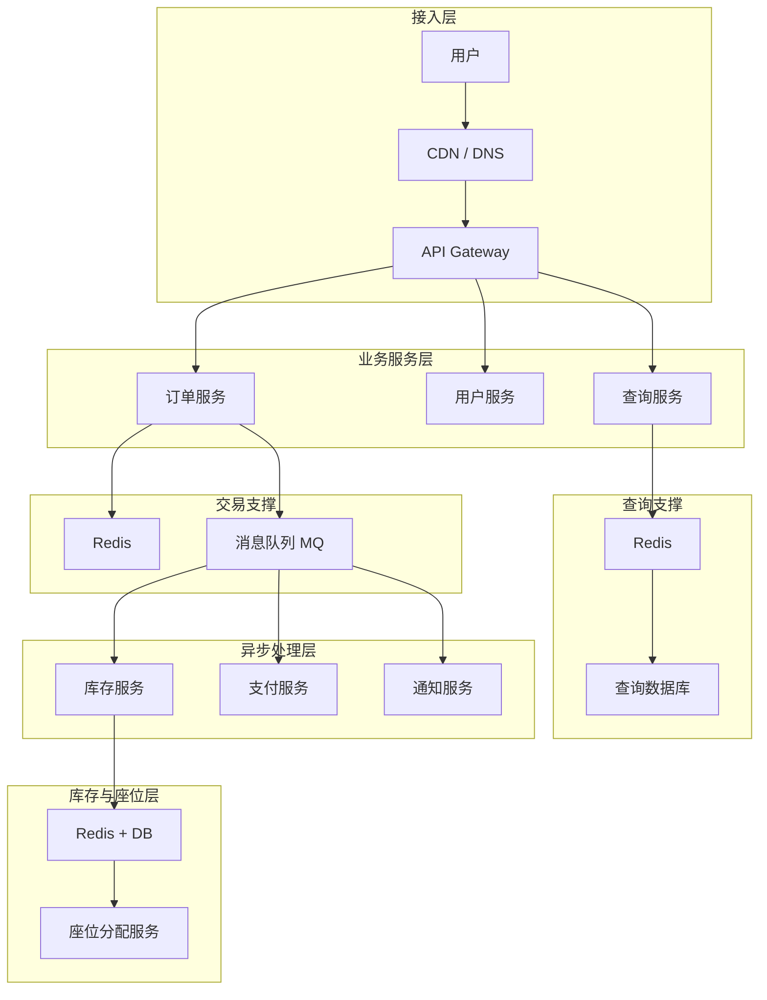

>[!NOTE]
>技术题才是面试的重中之重,只要技术过关,其他三项不是太拉跨就可以,如果面试官问的知识点你想都不想就能回答出来的话,那该你拿offer.这也是为什么技术题我要单开一版的原因.

>[!TIP]
>需要说明的是,基本所有的问题都是从各种面经中摘抄过来的,而且面经之间是很容易重复的,一个个放来源实在太麻烦了,所以在这里给原作者们道个歉,就不放来源了.

- 如果上述的所有名词你都能说出一点门道出来的话,那这篇文章你也不用看了.

## 运维
- 容器,Linux命令,计算机网络这些都算在里面了,毕竟运维的职责范围太广了

### 常规八股
#### 计算机网络
1. 从家里的计算机通过浏览器打开一个网页的完整流程是什么？请详细说明每一层的协议工作过程
   1. 先梳理一下五层模型,物理层,链路层,网络层,传输层,应用层,那么当我们访问某个网站的时候,流程如下:
   2. 如果本地没有存储该域名对应的ip地址,就要通过DNS协议去查询,DNS协议是从根域名开始逐级查询的,直到定位到你要查询的完整域名,并返回服务器的IP地址
   3. 找到IP地址后,我们计算机就可以封装数据包了,首先是通过socket接口封装TCP包,然后附加上IP地址,如果电脑连的是网线,那么就通过以太网连接到交换机,并不断跳转最终找到目标服务器;如果电脑是用的4G/WIFI,都是通过无线链路来进行传输的,最终还是传到交换机
   4. 目标服务器接收到请求后,进行拆分,确认请求内容合法并返回网页,然后交付到用户主机
2. 讲一下TCP的可靠交付,即三次握手/四次分手
   1. 网络环境是不可靠的,而TCP通过滑动窗口机制确保了可以通过重传和断点续传避免丢包,而如何确定有包丢失和是否重传呢,就是通过连接双方发送ACK和SYN报文来实现的.
   2. ...待补充
3. HTTP的头部有哪些内容
   1. 分为Response header(响应头),由服务器返回的详细参数,和Request header(请求头),用户对服务器的要求.
   2. ...待补充
4. select、poll、epoll分别的优缺点
5. HTTP1,1.1,2,3各自的基本内容?
6. CDN是什么，为什么用，怎么评价CDN的效果和性能
7. Websocket和Http长链接的区别,二者对服务器性能有什么影响
8. JWT原理?和Cookie的区别?
9. 如果有中间人抓包截取了JWT，作为劫持攻击该怎么办?能不能主动让JWT失效呢?
#### 操作系统
1. 线程有哪些状态,什么是死锁,如何恢复和避免
   1. 不同参考书的模型不一样,但常见的说法是有Ready,Running,Waiting,Terminated,New五种状态
   2. 多个线程,彼此请求对方持有的资源,导致死循环无法正常运行,必要条件是四个: 互斥(同一个资源只能给一个线程用),Hold and wait(占有并等待),无法强行释放(系统不能干扰),循环等待.
   3. 恢复的话有几种方法,最常用的就是重启,因为这样不用费脑子和降低性能,要么就只能强行终止部分进程从而破坏死锁.
   4. 防止死锁只要破坏上述的四个必要条件之一即可,如固定加锁顺序,或者一次性申请所有所需的资源,如果有一个资源拿不到,那么就全部不拿.
2. 32位的物理机能申请多少内存呢？那64位呢？
   1. 实际问的是虚拟寻址空间的概念,32位的寻址空间自然就是2的32次方Byte,对应4GB的大小,64位物理机同理
   2. 为什么是Byte呢,因为操作系统是按字节寻址的,即每个地址对应的是一个8位的数组
3. inode是什么，存放什么内容;
4. 硬链接和软连接是什么区别，使用场景上有什么区别
5. 你在终端执行 python app.py，程序正在运行。如果此时按下 Ctrl+C 和 Ctrl+Z，分别会发生什么？
   1. Ctrl+C是发送 SIGINT，请求中断,Python 通常抛出 KeyboardInterrupt，未捕获时退出
   2. Ctrl+Z是发送 SIGTSTP，暂停进程,程序暂停，仍然存在，终端回到命令提示符
#### 容器
1. k8s多个pod，怎么发现这个新的pod

#### Linux命令
### CI/CD
1. 你对CI/CD的基本了解?
### 高级
1. 为什么 RPC 使用 Protobuf
## 数据库/架构
- 说到架构一定会有数据库,说到数据库一定会有架构

### 常规八股
1. 解决hash冲突的方式有哪些？
   1. 链地址法: 弄一个桶或者链表把相同键的值放在一起
   2. 开放寻址法: 写一个数学公式,定义每次冲突后寻找的下一个插入位置,如果冲突则继续找下一个
   3. 直接扩容
2. 什么是IO多路复用(multiplexing)?Redis中相关的应用有哪些?
   1. 一个线程同时监听多个I/O连接,谁处理好了就处理谁,事实上,这个复用翻译的很烂,对比计算机网络中的全双工半双工概念来理解就明白了,就是单纯一对多的关系
   2. 而Redis的应用就是文件事件了,一个Redis线程通过文件事件调度器来监听所有的Socket连接,一旦处理好了就读取所需的文件,在等待处理完毕的数据发来之前不阻塞线程.
3. 传统的搜索引擎是怎么实现搜索的？
   1. 以最典型的TF-IDF为例,就是根据该关键词在所有文档中出现概率的log倒数乘以该关键词在单个文档中出现的概率来排序就行了
   2. 这是靠倒排索引(Inverse Index)实现的,即不是计算单个文档中出现的所有词,而是计算某个词在哪几个文档中出现过
4. Redis 的基础数据类型以及底层实现原理了解吗？
5. B+ 树执行增、删、查、改的时间复杂度分别是多少？
   1. 插入/删除/查找/修改都需要定位到节点,所以复杂度完全相同,如果是m叉树,有N个节点,就是O(logN).
6. 为什么 MySQL / InnoDB 使用 B+ 树作为索引结构，而不是其他数据结构？
7. redis缓存和数据库,在更新/删除的时候,优先动哪个,具体是如何处理的
8. 假如我不想用代码的层面去同步缓存和数据库，有什么解决方案
9. 如何理解Redis中的Lua脚本的原子性
### 分布式算法
1. 介绍一下Raft和Paxos的异同,以及如今常用的分布式算法
2. 一致性哈希解决了哪些问题
3. CAP是什么?抖音刷视频，按照CAP理论，考虑应该满足哪几个特性?
   1. C-Consistency,A-Availability,P-Partition tolerance,俗称为不可能三角,任何分布式数据存储最多只能提供以上三个保证中的两个
   2. 对于短视频业务,我们必须保证Avalability,毕竟要给用户提供内容,而也需要保证分区容错性,因为机房和网络有可能会出现故障,而这会影响用户的即时访问,至于一致性则不太必要,用户也不在乎自己的点赞有没有迅速同步到主数据库,只要UI上有反应就可以了.

### 消息队列
1. 你认识哪些消息队列?分别的优缺点是什么?
### 设计思维
设计思维我认为是最容易被忽视,却是非常重要的考察点

1. 了解哪些设计思想,实践中用过吗?
   1. SOLID: 5跳面向对象软件设计原则的缩写,具体表格见下方.
   2. DDD: Domain-Driven Design,核心思想是围绕业务领域建模，而不是围绕数据库建模
   3. OOD: Object-Oriented Design,对象、封装、继承、多态,基本也只能在Java中广泛使用了
   4. SoC: Separation of Concerns,将不同职责分离
   5. TDD: Test-Driven Development,先写测试，再实现代码
   6. BDD: Behavior-Driven Development,从业务行为描述系统

| 字母 | 原则                            | 中文         | 核心问题                               |
| ---- | ------------------------------- | ------------ | -------------------------------------- |
| S    | Single Responsibility Principle | 单一职责原则 | 一个类为什么会变化？                   |
| O    | Open/Closed Principle           | 开闭原则     | 新功能能否通过扩展实现，而少改旧代码？ |
| L    | Liskov Substitution Principle   | 里氏替换原则 | 子类能否真正替代父类？                 |
| I    | Interface Segregation Principle | 接口隔离原则 | 是否强迫调用者依赖不需要的方法？       |
| D    | Dependency Inversion Principle  | 依赖倒置原则 | 业务代码是否依赖具体实现？             |

2. 设计模式你了解哪些?
3. 服务架构了解哪些?SOA和MSA的区别知道吗?EDA有真实用过吗?
4. MVC和MVVM在如今的优缺点?
### 架构设计
1. 假设让你设计一个 12306 购票系统，你会怎么设计它的整体架构？
   1. 非常开放,但最考验水平.首先假设或者问面试官从而确定用户规模和流量情况.不过抢票系统的规模肯定很大啦
   2. 抢票的重点在于高并发,大量用户争抢稀缺票源时如何保证一致性和有序性.
   3. 说是说架构,但实际上就是问数据库怎么设计,缓存用什么数据库?很明显要用Redis+限流器,不然根本扛不住.当用户请求路由时,如果接收过相同的请求且票源状态没有改变,则直接返回缓存.
   4. 重点在于,我们需要保证用户请求是按照时间顺序来处理的,所以就要加上一层消息队列.
   5. 用户规模这么大,自然还要加一个数据库分片,根据用户id来分就可以.
   6. 所以总的架构就是,后端连消息队列,消息队列连接Redis集群,Redis集群再连到具体的数据库如Oracle

不过这只是最基础的想法,考虑到查询量和交易量的不成比例,所以查询服务要单独处理:

2. 在多节点的游戏服务器内如果需要为物品生成可以跨多节点识别的唯一 UUID，应该如何设计这个 UUID
   1. ...
3. Minecraft 这种游戏里可以把方块拼在一起，存储这些方块数据会带来很大的内存消耗，你可以用什么方法尽可能地减少（内存）消耗？
4. 如何设计一个扫码微信登录的系统？扫码之后，PC是怎么知道手机已经扫码的?如果多个同学同时打开微信客户端去扫码，又去各自用自己的手机扫，怎么知道具体哪个同学扫的是哪个码呢?

### 手写SQL
1. 有一张表记录了玩家的所属省份和 PlayerID，请写一条 SQL 查询语句，统计每个省份的玩家数量
## 语言基础
### Golang
1. Golang 的默认参数传递方式以及哪些是引用传递？
   1. 最考验基础的一集,slice和map都是值传递的,没有引用传递,传递时是传递了一个复制的结构体数组,尽管指向数据存储区域的指针是一样的,但这只是单纯的复制传值而已.
   2. 所以在GO中,所有的参数都是值传递
### Python
1. Python多线程的几种实现方式?分别的适用场景是什么?
2. Python GC的基本原理
   1. 对于CPython来说,用到是引用计数,而循环引用则通过cyclic GC来追踪,通过可达性分析找到循环对象并回收

### C/CPP
1. C++的内存分区结构了解嘛,什么时候变量放在栈上,什么时候放在堆上?malloc 和 new 有什么区别？
   1. C++在运行时中,分为代码段(只读),数据段(全局和静态变量),堆(new分配)和栈(局部变量)
   2. 默认在栈上,除非用new和malloc分配.
   3. malloc返回的是void*,需要强制转换,没有构造函数,new返回具体类型的指针,并调用构造函数,内存安全.
2. 什么是虚函数?构造函数可以是虚函数吗?为什么多态时析构函数一般写成虚函数?
   1. 支持多态的成员函数,可以被子类覆盖
   2. 构造函数在对象创建时调用,而对象没创建时没有虚函数表,故不可能写成虚函数.
   3. 析构函数写成虚函数,那么就会先调用子类析构函数,再逐级调用基类析构函数,从而确保销毁所有资源.因为如果基类析构函数是 virtual，那么派生类析构函数会自动重写它。
## Agent
### LLM
1. 请比较一下几种常见的 LLM 架构，例如 Encoder-Only, Decoder-Only, 和 Encoder-Decoder，并说明它们各自最擅长的任务类型。
2. 
### Agent应用
1. 大模型的幻觉是怎么产生的？为什么会产生幻觉？
2. 你做过知识库 / RAG，它的基本原理是什么？
## 场景预设
- 其实八股并不是真的八股,对于真正对技术有钻研的面试官来说,他们能够从最真实的痛点分析入手来看你这个人是不是真的有能力.
### 萌新
#### IP和DNS
就拿个非常简单的事来说,你拿html+css拼凑弄了一个简单的网站出来,现在想要部署到某个服务器上让其他人看到,结果点进网页一看,什么有什么CNAME,A记录,看都看不懂,只好去补补课,发现有DNS这个东西.

原来DNS是将域名解析到服务器IP的协议,于是你明白了要部署一个网站,不仅需要有一个服务器,还要买一个域名,不然别人是不太可能通过一连串数字组成的IP地址找到你的网站的.

