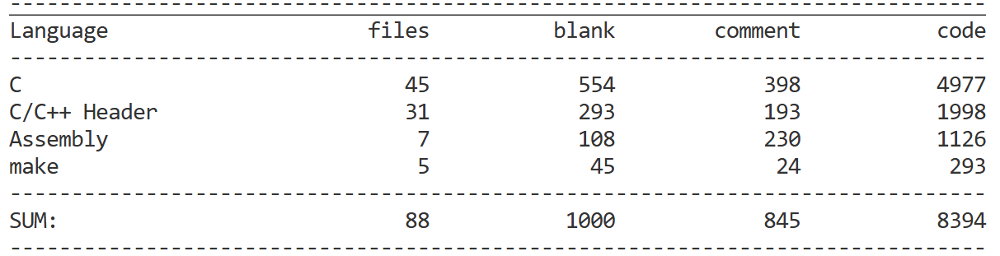

# 基本概念
## 操作系统年表
1956-1989:
|      年份 | 操作系统/节点             | 主要适用范围                       | 家族/技术血统                                                       | 当前活跃度           |
| --------: | ------------------------- | ---------------------------------- | ------------------------------------------------------------------- | -------------------- |
|      1956 | GM-NAA I/O                | IBM 704、大型机批处理              | 早期批处理族：GM-NAA → SOS → IBSYS                                  | △                    |
|      1961 | CTSS                      | 大型机分时、科研教学               | MIT 分时系统；Multics 的思想前身                                    | △                    |
| 1964/1966 | OS/360                    | 企业大型机、批处理、事务           | IBM 大型机族：OS/360 → MVS → OS/390 → z/OS                          | △ 本体；● z/OS       |
|      1969 | Multics                   | 多用户分时、安全研究               | 独立 Multics 族；影响 UNIX，但不是 UNIX 的直接源码祖先              | △                    |
|      1969 | UNIX                      | 科研、编程环境、小型机             | 原始 UNIX 族：Research Unix                                         | △ 本体；后裔广泛活跃 |
|      1972 | VM/370                    | 大型机虚拟化、多系统并行           | CP/CMS → VM/370 → VM/ESA → z/VM                                     | △ 本体；● z/VM       |
|      1974 | CP/M                      | 8 位微型计算机                     | CP/M → CP/M-86、Concurrent DOS、DR-DOS                              | △                    |
|      1977 | BSD                       | 高校、网络、工作站、服务器         | UNIX → BSD → FreeBSD/NetBSD/OpenBSD；也参与构成 Darwin              | △ 本体；● 后裔       |
|      1977 | VAX/VMS                   | 企业、工业控制、高可用集群         | VMS → OpenVMS                                                       | ◐                    |
|      1981 | MS-DOS / PC DOS           | IBM PC及兼容机                     | DOS族 → Windows 1.x–3.x → Windows 9x；**不是现代Windows NT的祖先**  | △                    |
|      1982 | QNX                       | 汽车、工业、医疗、实时嵌入式       | 独立 QNX 微内核族                                                   | ●                    |
|      1983 | UNIX System V             | 商业服务器、工作站                 | UNIX → System V → Solaris、HP-UX、部分 AIX 血统                     | △ 本体；◐ 后裔       |
|      1984 | Macintosh System Software | 苹果个人电脑、图形桌面             | Classic Mac OS族 → System 7 → Mac OS 8/9；**不是今天的macOS内核族** | △                    |
|      1985 | Windows 1.0               | DOS 上的图形运行环境               | DOS/Win16族 → Windows 3.x → Windows 9x                              | △                    |
|      1986 | AIX                       | IBM POWER 企业服务器               | UNIX族：System V + BSD → AIX                                        | ●                    |
|      1987 | MINIX                     | 操作系统教学、微内核研究           | 独立类 UNIX 微内核族；影响 Linux 的产生，但不是 Linux 源码祖先      | △/低活跃             |
|      1987 | OS/2                      | 企业 PC、桌面工作站                | OS/2 → eComStation → ArcaOS                                         | △ 本体；◐ 后裔       |
|      1987 | VxWorks                   | 航空航天、汽车、网络设备、实时控制 | 独立 VxWorks RTOS族                                                 | ●                    |
|      1988 | OS/400                    | IBM AS/400 企业业务系统            | OS/400 → i5/OS → IBM i                                              | ●                    |
|      1989 | NeXTSTEP                  | 高端工作站、软件开发               | Mach + BSD → NeXTSTEP → OPENSTEP → Darwin/XNU                       | △ 本体；🔥 后裔       |

1991-2009,传奇年代:
|      年份 | 操作系统/节点         | 主要适用范围                       | 家族/技术血统                                                              | 当前活跃度         |
| --------: | --------------------- | ---------------------------------- | -------------------------------------------------------------------------- | ------------------ |
|      1991 | Linux 内核            | 服务器、云、超算、桌面、嵌入式     | 独立类 UNIX 内核，即 Linux族；不是 UNIX 源码分支                           | 🔥                  |
|      1992 | Solaris               | SPARC/x86 企业服务器               | UNIX → SunOS/BSD + System V Release 4 → Solaris；开源分支为 illumos        | ◐                  |
|      1992 | Plan 9                | 分布式系统、操作系统研究           | 贝尔实验室独立后 UNIX 系统；Plan 9 → 9front                                | △ 本体；◐ 9front   |
|      1993 | Windows NT 3.1        | 工作站、服务器、企业桌面           | Windows NT族 → 2000/XP/Vista/7/8/10/11、Windows Server                     | 🔥                  |
|      1993 | NetBSD                | 多架构服务器、嵌入式、移植研究     | UNIX → BSD → 386BSD → NetBSD                                               | ●                  |
|      1993 | Debian                | 服务器、桌面、发行版基础           | Linux族 → GNU/Linux → Debian → Ubuntu等                                    | 🔥                  |
|      1993 | FreeBSD               | 服务器、存储、网络设备、桌面       | UNIX → BSD → 386BSD → FreeBSD                                              | ●                  |
|      1994 | Red Hat Linux         | 企业服务器、云、开发平台           | Linux族 → Red Hat → Fedora、RHEL、CentOS Stream及兼容发行版                | 🔥                  |
|      1995 | Windows 95            | 消费级个人电脑                     | DOS/Win16 → Windows 9x；该支系止于 Windows Me                              | △                  |
|      1995 | OpenBSD               | 安全网关、防火墙、服务器           | BSD → NetBSD → OpenBSD                                                     | ●                  |
|      1995 | BeOS                  | 多媒体桌面、个人电脑               | 独立 BeOS族；Haiku 为兼容性重实现，并非原源码延续                          | △ 本体；● Haiku    |
|      1996 | Palm OS               | PDA、早期移动设备                  | 独立 Palm OS族                                                             | △                  |
|      1998 | Symbian OS            | 功能机、早期智能手机               | Psion EPOC → EPOC32 → Symbian                                              | △                  |
|      2000 | Darwin                | 苹果操作系统的开源核心             | NeXTSTEP/OPENSTEP → Mach + BSD + Apple技术 → Darwin/XNU                    | 🔥                  |
|      2001 | Mac OS X              | 苹果桌面与笔记本                   | UNIX/BSD–Darwin族：Darwin/XNU → OS X → macOS                               | 🔥                  |
|      2001 | Windows XP            | 消费与企业桌面                     | Windows NT族；标志 NT 正式取代 DOS/Windows 9x                              | △                  |
|      2003 | FreeRTOS              | MCU、IoT、低资源实时设备           | 独立 FreeRTOS 微控制器 RTOS族                                              | 🔥                  |
|      2004 | Ubuntu                | 桌面、服务器、云、IoT              | Linux族 → Debian → Ubuntu                                                  | 🔥                  |
|      2007 | iPhone OS／iOS        | 手机、平板及苹果移动设备           | UNIX/BSD–Darwin族：Darwin/XNU → iOS/iPadOS/watchOS/tvOS                    | 🔥                  |
|      2008 | Android               | 手机、平板、电视、车载、嵌入式     | Linux内核族 → Android；用户空间和应用体系独立，**不是传统GNU/Linux发行版** | 🔥                  |
|      2009 | webOS                 | 原智能手机；现主要为智能电视       | Linux内核族 → Palm webOS → LG webOS                                        | △ 手机版；● 电视版 |
| 2009/2011 | Chromium OS／ChromeOS | Chromebook、教育、轻办公、终端设备 | Linux内核族 → Chromium OS → ChromeOS                                       | 🔥                  |

## 常用终端命令
### 文件操作
1. pwd: print working directory,显示当前目录
2. ls: list,列出当前目录的文件
3. cd: change directory,切换目录
4. clear: 清屏
5. touch: 创建新文件
6. cat: catenate,输出文件内容
7. head/tail: 查看文件开头末尾
8. wc: word count,统计该文件的行数/词数
9. mkdir: make directory,创建目录(文件夹)
10. cp: copy,复制文件,如`cp a.txt b.txt`
11. rm: remove,删除文件,`rm -r`为删除目录,`rm -rf`为递归删除该目录
12. find: 按照条件查找目标文件,如`find . -name "*.txt"`
13. grep: `global regular expression print`,在文本中搜索内容,如`grep "error" app.log`

# Linux

## Linux0.01分析
### 前期准备
1. 从[这个网站](https://seiya.me/blog/reading-linux-v0.01)下载Linux0.01,博主的分析也是不错的
2. 下载[cloc](https://github.com/AlDanial/cloc/releases)用于代码行数统计,这就是Linux0.01的全部代码:

