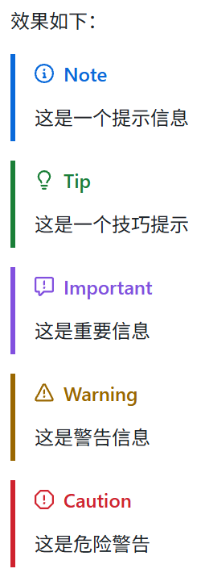

运维的职责相当广泛,所以值得专门来进行学习,为了方便写文章,我把所有能跟运维扯上关系的技术都放进来了.

# 容器
## Docker 
推荐阅读: [Docker 从入门到实践](https://yeasy.gitbook.io/docker_practice)
# 自动部署与自动构建
## git
推荐阅读: Pro git
## GitHub 
### GitHub Flavored Markdown,GFM
- [参考文章](https://github.com/guodongxiaren/README)

值得一提的是hugo也内置了对GFM的支持,感兴趣的博主可以在里面测试一下.
#### Alerts
```md
> [!NOTE]
> 这是一个提示信息

> [!TIP]
> 这是一个技巧提示

> [!IMPORTANT]
> 这是重要信息

> [!WARNING]
> 这是警告信息

> [!CAUTION]
> 这是危险警告
```


在hexo上的效果如下:
> [!NOTE]
> 这是一个提示信息

> [!TIP]
> 这是一个技巧提示

> [!IMPORTANT]
> 这是重要信息

> [!WARNING]
> 这是警告信息

> [!CAUTION]
> 这是危险警告
#### diff
其语法与代码高亮类似，只是在三个反引号后面写diff，
并且其内容中，可以用 `+ `开头表示新增，`- `开头表示删除。
另外还有有 `!`和`#`的语法。

```diff
+ 人闲桂花落，
- 夜静春山空。
! 月出惊山鸟，
# 时鸣春涧中。
```
### GitHub Actions
推荐阅读: GitHub Actions in action

# 监控与日志
## Sentry

