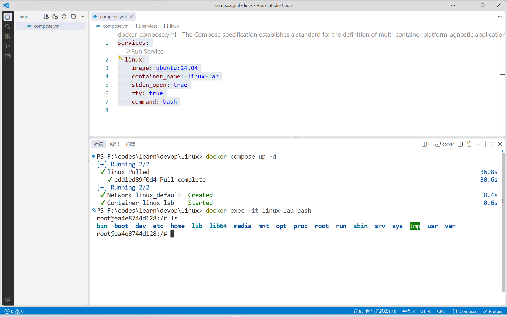
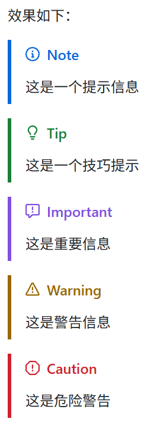
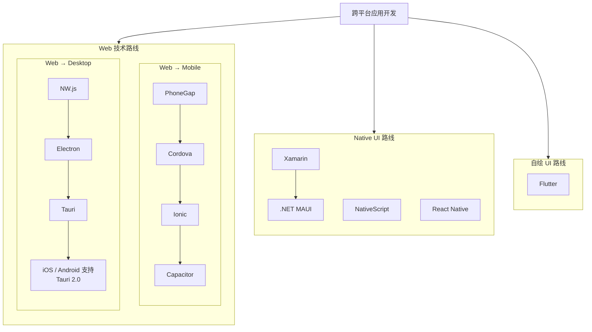
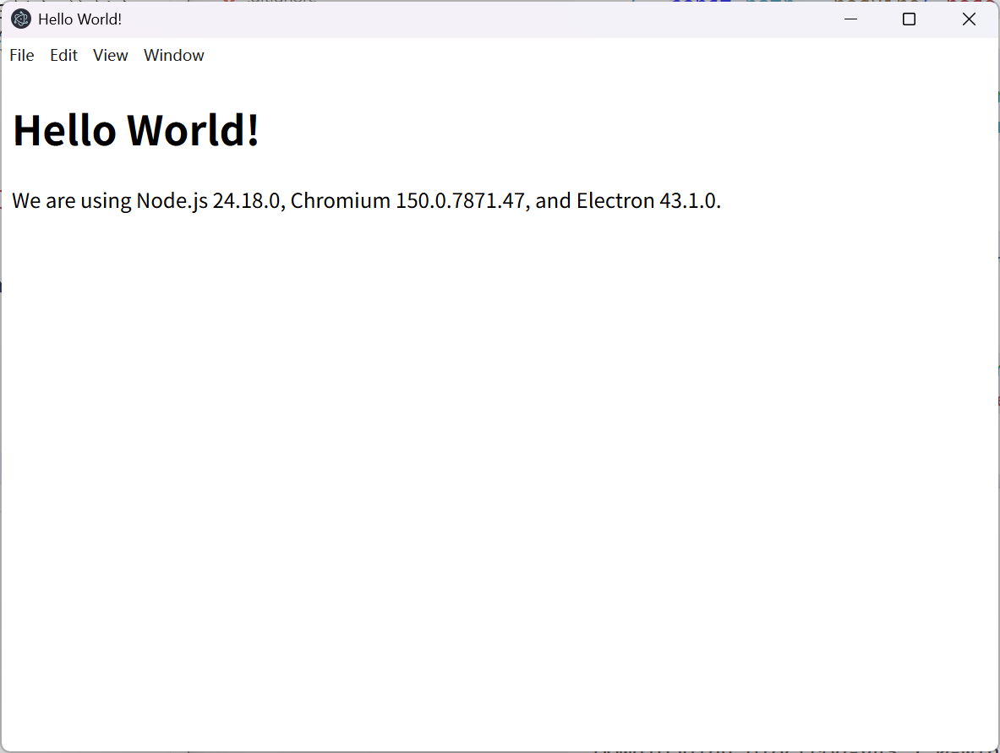
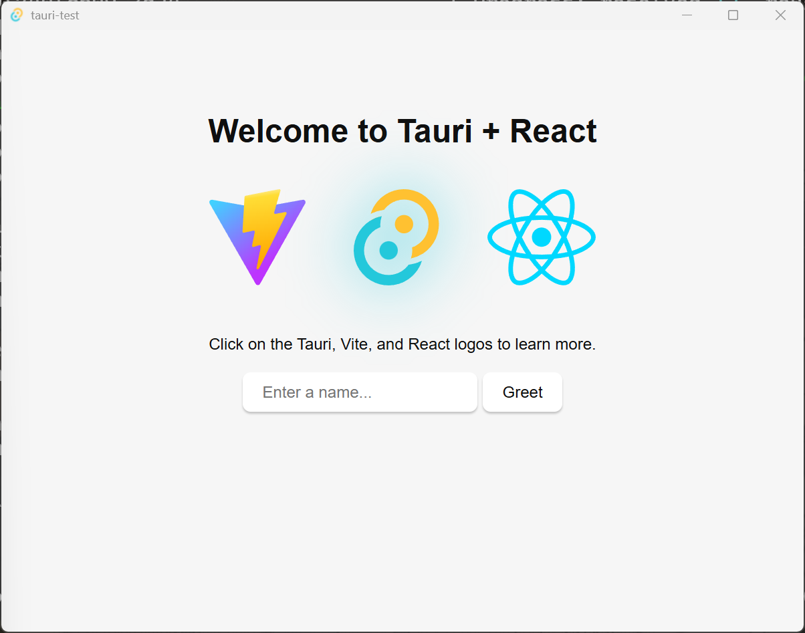

运维的职责相当广泛,所以值得专门来进行学习,为了方便写文章,我把所有能跟运维扯上关系的技术都放进来了.
# 运维工具年表
|       年份 | 工具／项目                                                                        | 主要领域           | 适用范围                                    | 2026年活跃度     |
| ---------: | --------------------------------------------------------------------------------- | ------------------ | ------------------------------------------- | ---------------- |
|       1979 | [cron](https://man7.org/linux/man-pages/man8/cron.8.html)                         | 定时任务           | Unix/Linux 单机定时执行脚本和命令           | 🔥 基础设施级     |
|       1980 | [syslog](https://www.rfc-editor.org/rfc/rfc5424)                                  | 系统日志           | 主机、应用、网络设备和集中日志服务器        | 🔥 基础设施级     |
|       1993 | [CFEngine](https://docs.cfengine.com/docs/lts/overview/what-is-cfengine-and-why/) | 配置管理           | 大规模 Unix/Linux 主机群                    | ◐ 传统企业环境   |
|       1995 | [SSH／OpenSSH](https://www.openssh.com/history.html)                              | 远程管理           | 服务器、Unix/Linux 和网络设备               | 🔥 基础设施级     |
|       1996 | [rsync](https://rsync.samba.org/)                                                 | 文件同步、备份     | 主机间文件分发、镜像和增量备份              | ● 成熟稳定       |
|       1999 | [Nagios（原NetSaint）](https://www.nagios.org/about/history/)                     | 基础设施监控       | 主机、端口、服务和网络设备                  | ◐ 传统环境常见   |
|       2001 | [Zabbix](https://www.zabbix.com/)                                                 | 综合监控           | 服务器、网络、数据库、应用和虚拟化平台      | 🔥 主流活跃       |
|       2003 | [Splunk](https://www.splunk.com/en_us/about-splunk.html)                          | 日志分析、SIEM     | 企业日志、机器数据、安全审计和故障分析      | 🔥 商用主流       |
|       2005 | [Puppet](https://www.puppet.com/docs/puppet/8/puppet_overview.html)               | 配置管理           | 长生命周期服务器和企业主机群                | ● 稳定，热度下降 |
| 2005／2011 | [Hudson／Jenkins](https://www.jenkins.io/project/)                                | CI/CD              | 软件构建、测试、发布和运维流水线            | 🔥 广泛使用       |
|       2008 | [Graphite](https://graphiteapp.org/overview.html)                                 | 指标监控           | 应用指标和服务器时间序列数据                | ◐ 以存量系统为主 |
|       2009 | [Chef](https://docs.chef.io/chef_overview/)                                       | 配置管理           | 企业服务器、软件部署和合规管理              | ● 企业存量较多   |
|  2009—2011 | [ELK／Elastic Stack](https://www.elastic.co/elastic-stack)                        | 日志采集与搜索     | 集中日志、全文检索、故障分析和安全分析      | 🔥 主流活跃       |
|       2010 | [systemd](https://systemd.io/)                                                    | 服务和主机管理     | 现代 Linux 的启动、服务、日志和定时任务管理 | 🔥 Linux基础设施  |
|       2011 | [Salt](https://docs.saltproject.io/)                                              | 配置管理、远程执行 | 大规模服务器配置、命令执行和事件自动化      | ● 稳定活跃       |
| 2011／2015 | [Fluentd／Fluent Bit](https://www.fluentd.org/architecture)                       | 日志和遥测管道     | 云原生、服务器、容器和边缘设备              | 🔥 云原生日志主流 |
|       2012 | [Ansible](https://docs.ansible.com/)                                              | 配置、部署、编排   | Linux、Windows、网络设备和云资源            | 🔥 主流活跃       |
|       2012 | [Prometheus](https://prometheus.io/docs/introduction/overview/)                   | 指标监控、告警     | 微服务、容器和Kubernetes集群                | 🔥 云原生标准     |
|       2013 | [Docker](https://www.docker.com/blog/docker-11-year-anniversary/)                 | 容器、应用交付     | 开发环境、服务器、CI和微服务                | 🔥 基础设施级     |
|       2014 | [Grafana](https://grafana.com/blog/4-years-of-grafana/)                           | 数据可视化、告警   | 指标、日志、追踪和数据库仪表盘              | 🔥 主流活跃       |
|       2014 | [Terraform](https://developer.hashicorp.com/terraform/intro)                      | 基础设施即代码     | 公有云、私有云、SaaS和Kubernetes资源        | 🔥 IaC主流        |
|       2014 | [Kubernetes](https://kubernetes.io/blog/2024/06/06/10-years-of-kubernetes/)       | 容器编排           | 大规模容器集群、微服务和云原生平台          | 🔥 云原生基础设施 |


2015年之后:

|       年份 | 工具／项目                                                                                        | 主要领域             | 适用范围                               | 2026年活跃度     |
| ---------: | ------------------------------------------------------------------------------------------------- | -------------------- | -------------------------------------- | ---------------- |
|       2015 | [Vault](https://developer.hashicorp.com/vault/docs)                                               | 密钥与身份管理       | 数据库凭证、证书、云账号和应用密钥     | 🔥 主流活跃       |
|       2015 | [Cilium](https://docs.cilium.io/en/stable/overview/intro/)                                        | 容器网络、安全、观测 | Kubernetes、Linux主机和服务网格        | 🔥 高度活跃       |
| 2015／2016 | [Helm](https://helm.sh/docs/)                                                                     | Kubernetes包管理     | Kubernetes应用安装、升级和回滚         | 🔥 Kubernetes标配 |
|       2016 | [Flux](https://fluxcd.io/blog/2022/11/flux-is-a-cncf-graduated-project/)                          | GitOps持续交付       | Kubernetes配置和应用部署               | 🔥 主流活跃       |
|       2018 | [Argo CD](https://argo-cd.readthedocs.io/)                                                        | GitOps持续交付       | 单集群、多集群和大规模应用部署         | 🔥 GitOps主流     |
|       2018 | [Grafana Loki](https://grafana.com/docs/loki/latest/get-started/overview/)                        | 云原生日志           | Kubernetes、容器和微服务日志           | 🔥 主流活跃       |
|       2018 | [Pulumi](https://www.pulumi.com/docs/iac/)                                                        | 基础设施即代码       | 云资源、Kubernetes和SaaS服务           | ● 稳定增长       |
|       2018 | [Crossplane](https://docs.crossplane.io/latest/)                                                  | 云资源控制平面       | 通过Kubernetes管理数据库、网络和云服务 | ● 平台工程常见   |
|       2019 | [OpenTelemetry](https://opentelemetry.io/docs/what-is-opentelemetry/)                             | 可观测性标准         | 指标、日志、分布式追踪和应用埋点       | 🔥 行业标准       |
|       2019 | [GitHub Actions](https://github.blog/changelog/2019-11-11-github-actions-is-generally-available/) | CI/CD、仓库自动化    | GitHub项目构建、测试、发布和自动化任务 | 🔥 主流活跃       |
|       2021 | [Karpenter](https://karpenter.sh/docs/)                                                           | Kubernetes节点管理   | 弹性云Kubernetes集群和节点成本优化     | 🔥 快速普及       |
|       2022 | [Dagger](https://dagger.io/blog/public-launch-announcement/)                                      | 可移植CI/CD          | 本地开发、不同CI平台和容器构建         | ● 成长期         |
|       2022 | [Tetragon](https://tetragon.io/docs/)                                                             | 运行时安全、可观测性 | Kubernetes、容器和Linux主机            | ● 快速增长       |
|       2023 | [OpenTofu](https://opentofu.org/blog/opentofu-announces-fork-of-terraform/)                       | 开源基础设施即代码   | Terraform替代、云资源和SaaS资源管理    | 🔥 快速增长       |
|       2023 | [OpenBao](https://openbao.org/blog/cipherboy-ossna-26-talk/)                                      | 开源密钥管理         |                                        |                  |
# 容器,服务器与虚拟机
## 主流指令集架构汇总
| 架构                   | 常见名称                        | 主要公司/组织                            | 当前热门度 | 软件生态接受程度 | 主要应用场景                          |
| ---------------------- | ------------------------------- | ---------------------------------------- | ---------: | ---------------: | ------------------------------------- |
| **x86-64**             | x86-64 / x64 / AMD64 / Intel 64 | Intel、AMD                               |      ★★★★★ |            ★★★★★ | PC、服务器、云、游戏、工作站          |
| **ARM 64-bit**         | ARM64 / AArch64                 | Arm；Apple、Qualcomm、AWS、NVIDIA 等实现 |      ★★★★★ |            ★★★★★ | 手机、Mac、云服务器、嵌入式、AI       |
| **RISC-V 64**          | RISC-V / RV64                   | RISC-V International，开放 ISA           |    ★★★★☆ ↑ |          ★★★☆☆ ↑ | MCU、嵌入式、汽车、AI、逐渐进入服务器 |
| **POWER / Power ISA**  | POWER / PowerPC 64              | IBM、OpenPOWER Foundation                |      ★★☆☆☆ |            ★★★☆☆ | IBM 企业服务器、HPC、数据库           |
| **IBM z/Architecture** | z/Architecture / IBM Z          | IBM                                      |      ★★☆☆☆ |            ★★★☆☆ | 大型机、银行、保险、核心交易          |
| **LoongArch**          | LoongArch / 龙芯架构            | 龙芯中科                                 |      ★★☆☆☆ |          ★★☆☆☆ ↑ | 国产 PC、服务器、政企                 |
| **MIPS**               | MIPS / MIPS64                   | 历史上 MIPS Technologies                 |    ★☆☆☆☆ ↓ |            ★★☆☆☆ | 老路由器、嵌入式、遗留设备            |
| **SPARC**              | SPARC / SPARC64                 | SPARC International、Oracle、Fujitsu     |    ★☆☆☆☆ ↓ |            ★☆☆☆☆ | 老 Unix/Solaris 企业系统              |
| **x86 32-bit**         | x86 / IA-32 / i386              | Intel、AMD                               |    ★☆☆☆☆ ↓ |            ★★☆☆☆ | 老 PC、遗留工业系统                   |
| **ARM 32-bit**         | ARM / ARMv6 / ARMv7             | Arm 生态                                 |    ★★☆☆☆ ↓ |            ★★★☆☆ | 老树莓派、MCU、嵌入式设备             |


## Linux命令
### 学习资料
- [在线学习](https://cmdchallenge.com/#/move_file)
### 学习方法
这个年代还要开虚拟机就太low了,用docker运行不就行了.

先写一个`compose.yml`:
```yml
services:
  linux:
    image: ubuntu:24.04
    container_name: linux-lab
    stdin_open: true
    tty: true
    command: bash
```
然后运行以下命令启动并运行bash:
```bash
docker compose up -d
docker exec -it linux-lab bash
```



效果杠杠的好不好!

## Docker 
- 推荐阅读: [Docker 从入门到实践](https://yeasy.gitbook.io/docker_practice)

# 部署工具
## git
推荐阅读: Pro git
## GitHub 
### GitHub Flavored Markdown,GFM
- [参考文章](https://github.com/guodongxiaren/README)

值得一提的是hugo也内置了对GFM的支持,感兴趣的博主可以在里面测试一下.
#### Alerts
```md
> [!NOTE]
> 这是一个提示信息

> [!TIP]
> 这是一个技巧提示

> [!IMPORTANT]
> 这是重要信息

> [!WARNING]
> 这是警告信息

> [!CAUTION]
> 这是危险警告
```


在hugo上的效果如下:
> [!NOTE]
> 这是一个提示信息

> [!TIP]
> 这是一个技巧提示

> [!IMPORTANT]
> 这是重要信息

> [!WARNING]
> 这是警告信息

> [!CAUTION]
> 这是危险警告
#### diff
其语法与代码高亮类似，只是在三个反引号后面写diff，
并且其内容中，可以用 `+ `开头表示新增，`- `开头表示删除。
另外还有有 `!`和`#`的语法。

```diff
+ 人闲桂花落，
- 夜静春山空。
! 月出惊山鸟，
# 时鸣春涧中。
```
### GitHub Actions
推荐阅读: GitHub Actions in action
# 跨平台构建工具
## 总表
| 时间            | 技术                           | 原本熟悉的技术 → 目标平台                    | 核心实现方式                                                                 | 历史意义 / 今天怎么看                                                                                                                                          |
| --------------- | ------------------------------ | -------------------------------------------- | ---------------------------------------------------------------------------- | -------------------------------------------------------------------------------------------------------------------------------------------------------------- |
| **1995**        | **Qt**                         | C++ → Windows/Linux/macOS，后来移动端        | 自己提供跨平台 GUI 抽象层                                                    | 很早的“一套 API 多平台”代表，更像传统跨平台 GUI 框架                                                                                                           |
| **2008**        | **PhoneGap** → Apache Cordova  | HTML/CSS/JS → iOS/Android                    | **WebView + JS↔Native Bridge**                                               | 现代 Hybrid App 路线的重要起点。PhoneGap 2008 年由 Nitobi 开始，2011 年进入 Apache 后成为 Cordova。([Apache Cordova][1])                                       |
| **约 2009**     | **Appcelerator Titanium**      | JavaScript/Web 开发者 → Native Mobile        | JS API 映射到原生能力/控件                                                   | 很早就尝试“用 JS 写原生移动应用”，思想上是 React Native/NativeScript 的前辈。([GitHub][2])                                                                     |
| **2011**        | **NW.js / node-webkit**        | HTML/CSS/JS + Node.js → Desktop              | **Chromium + Node.js**                                                       | Web 技术进入桌面应用的重要先驱，Electron 出现前已经走通这条路；项目始于 2011。([Google Groups][3])                                                             |
| **2011 / 2014** | **Xamarin / Xamarin.Forms**    | C#/.NET → iOS/Android                        | .NET + 原生平台绑定；Forms 再抽象 UI                                         | 把微软/.NET 开发者带到移动端的重要路线；后来被 .NET MAUI 接替，Xamarin 已于 2024 年结束微软支持。([微软学习][4])                                               |
| **2013**        | **Electron（原 Atom Shell）**  | HTML/CSS/JS + Node → Windows/macOS/Linux     | 每个应用携带 **Chromium + Node.js**                                          | Web→桌面的标志性方案。首个 Electron 仓库 commit 是 2013-03-13，2015 年 Atom Shell 正式更名为 Electron。([Electron][5])                                         |
| **2013**        | **Ionic**                      | Web/Angular，后来 React/Vue → Mobile/PWA     | Web UI + Cordova/Capacitor                                                   | 把 Hybrid App 开发做成完整 UI 框架。2013 年出现，今天主要与 Capacitor 配套。([Ionic][6])                                                                       |
| **2014–2015**   | **NativeScript**               | JavaScript/TypeScript/CSS → iOS/Android      | JS Runtime → **真正的原生 UI/API**，不用 WebView 渲染 UI                     | 与 React Native 属于相似时代，但技术实现不同。2014 年 preview，2015 年 1.0。([Telerik.com][7])                                                                 |
| **2015**        | **React Native**               | **React/JavaScript → iOS/Android Native UI** | React reconciler + Native Components                                         | 非常关键的一次转变：不是把网页塞进 WebView，而是把 React 编程模型迁移到原生 UI。iOS 于 2015 年 3 月开源，Android 同年 9 月发布。([Facebook][8])                |
| **2015 → 2018** | **Flutter**                    | Dart → iOS/Android，后来 Web/Desktop         | **自己绘制 UI**，而不是大量依赖系统原生控件                                  | 开辟另一条路线：不是 WebView，也不是 React Native 那种 native-widget 映射，而是跨平台自绘。1.0 于 2018-12-04 发布。([Google开发者博客][9])                     |
| **2017**        | **Kotlin Multiplatform (KMP)** | Kotlin/JVM → Android/iOS/Web/Desktop 等      | **共享业务逻辑**，平台代码可分别实现；后来配合 Compose Multiplatform 共享 UI | 与 RN/Flutter 最大区别是最初并不强迫 UI 也共享。2017 年作为 Kotlin 1.2 experimental multiplatform feature 出现，2023 年 KMP Stable。([The JetBrains Blog][10]) |
| **2018**        | **Capacitor**                  | Web/React/Vue/Angular → iOS/Android/Web      | WebView + 现代 Native Plugin API                                             | Ionic 团队针对 Cordova 时代问题设计的新一代 native runtime；2018 年公布 Alpha。([Ionic][11])                                                                   |
| **2019 → 2022** | **Tauri**                      | HTML/CSS/JS/React/Vue 等 → Desktop           | **系统 WebView + Rust Core**                                                 | 可以看作对 Electron 思路的一次“瘦身”：不捆绑完整 Chromium，而使用 OS WebView。项目从约 2019 年起发展，1.0 于 2022 年 6 月发布。([Tauri][12])                   |
| **2022**        | **.NET MAUI**                  | C#/XAML/.NET → Android/iOS/macOS/Windows     | .NET + 平台原生 UI abstraction                                               | Xamarin.Forms 的正式继任者，2022 年 5 月 GA。([Microsoft for Developers][13])                                                                                  |
| **2024**        | **Tauri 2.0**                  | Web 技术 → **Desktop + iOS + Android**       | System WebView + Rust，移动端插件可接 Swift/Kotlin                           | Tauri 不再只是 Electron 的桌面替代品，而真正进入桌面+移动跨平台领域。2.0 于 2024-10-02 stable。([Tauri][14])                                                   |

[1]: https://cordova.apache.org/announcements/2020/08/14/goodbye-phonegap.html?utm_source=chatgpt.com "Goodbye PhoneGap - Apache Cordova"

[2]: https://github.com/Jasig/titanium_mobile?utm_source=chatgpt.com "GitHub - Jasig/titanium_mobile: Appcelerator Titanium Mobile · GitHub"

[3]: https://groups.google.com/g/nwjs-general/c/LIrC7zHtQdo?utm_source=chatgpt.com "Statement on the history of node-webkit project"

[4]: https://learn.microsoft.com/dotnet/maui/migration/?WT.mc_id=dotnet-35129-website&view=net-maui-8.0&utm_source=chatgpt.com "Upgrade from Xamarin to .NET - .NET MAUI | Microsoft Learn"

[5]: https://www.electronjs.org/blog/10-years-of-electron?utm_source=chatgpt.com "10 years of Electron 🎉 | Electron"

[6]: https://ionic.io/blog/announcing-ionic?utm_source=chatgpt.com "Announcing The Ionic Framework - Ionic Blog"

[7]: https://www.telerik.com/blogs/announcing-nativescript---cross-platform-framework-for-building-native-mobile-applications?utm_source=chatgpt.com "Announcing NativeScript - cross-platform framework for build"

[8]: https://about.fb.com/news/2015/03/f8-day-two-2015/?utm_source=chatgpt.com "F8 2015: Updates on Connectivity Lab, Facebook AI Research and Oculus"

[9]: https://developers.googleblog.com/en/flutter-10-googles-portable-ui-toolkit/?utm_source=chatgpt.com "Flutter 1.0: Google’s Portable UI Toolkit - Google Developers Blog"

[10]: https://blog.jetbrains.com/kotlin/2017/09/kotlin-1-2-beta-is-out/?utm_source=chatgpt.com "Kotlin 1.2 Beta Is Out - The JetBrains Blog"

[11]: https://ionic.io/blog/announcing-capacitor-1-0-0-alpha?utm_source=chatgpt.com "Announcing Capacitor 1.0.0 Alpha - Ionic Blog"

[12]: https://v3.tauri.app/blog/tauri-20/ "Tauri 2.0 Stable Release | Tauri"

[13]: https://devblogs.microsoft.com/dotnet/introducing-dotnet-maui-one-codebase-many-platforms/?utm_source=chatgpt.com "Introducing .NET MAUI - One Codebase, Many Platforms - .NET Blog"

[14]: https://v3.tauri.app/blog/tauri-20/?utm_source=chatgpt.com "Tauri 2.0 Stable Release | Tauri"



```mermaid
flowchart TD
    A[跨平台应用开发]

    subgraph WEB[Web 技术路线]
        direction TB

        subgraph MOBILE[Web → Mobile]
            direction TB
            M1[PhoneGap]
            M2[Cordova]
            M3[Ionic]
            M4[Capacitor]

            M1 --> M2 --> M3 --> M4
        end

        subgraph DESKTOP[Web → Desktop]
            direction TB
            E1[NW.js]
            E2[Electron]
            E3[Tauri]
            E4[iOS / Android 支持<br/>Tauri 2.0]

            E1 --> E2 --> E3 --> E4
        end
    end

    subgraph NATIVE[Native UI 路线]
        direction TB

        N1[Xamarin]
        N2[NativeScript]
        N3[React Native]
        N4[.NET MAUI]

        N1 --> N4
    end

    subgraph DRAW[自绘 UI 路线]
        direction TB

        F1[Flutter]
    end

    A --> WEB
    A --> NATIVE
    A --> DRAW
```
## 桌面端
### Electron
#### 介绍
- [wiki](https://en.wikipedia.org/wiki/Electron_(software_framework))

Electron是由Github在13年发布的开源打包框架,可以把你的前端应用变成桌面端上的应用程序,著名的应用有VScode,Github Desktop等

缺点是更新太快,但社区活力不够,截止发布了v43版本的当下,官网的文档还是用的22年11月发布的v23版本,这版本号都翻倍了,而且文档里用的还是CommonJS,你就说这怎么看.
#### 基本架构
运行以下命令获取官方的模板项目:
```bash
git clone https://github.com/electron/minimal-repro.git electron-learn
```
- 很遗憾的是,这个模板项目用的也还是CommonJS

根据Readme文档启动该项目,效果如下:


看一下主要文件`main.js`:
```js
const { app, BrowserWindow } = require('electron')
const path = require('node:path')

function createWindow () {
  // Create the browser window.
  const mainWindow = new BrowserWindow({
    width: 800,
    height: 600,
    webPreferences: {
      preload: path.join(__dirname, 'preload.js')
    }
  })

  // and load the index.html of the app.
  mainWindow.loadFile('index.html')

}

app.whenReady().then(() => {
  createWindow()

  app.on('activate', function () {
    // On macOS it's common to re-create a window in the app when the
    // dock icon is clicked and there are no other windows open.
    if (BrowserWindow.getAllWindows().length === 0) createWindow()
  })
})

app.on('window-all-closed', function () {
  if (process.platform !== 'darwin') app.quit()
})

```
可以看到Electron的底层与普通的浏览器引擎并没有太大区别,多出来的这些函数也都是调用操作系统接口的封装而已.

总的来说,目前要学习Electron,就需要忍受陈旧的文档和全新的界面操作函数,市面上关于Electron的新书也是聊胜于无,而且不能够复用面向网站的前端写法,后端只能用api调用来实现,开发体验给个2星.

## 手机端
### Capacitor


## 多端
### Tauri
#### 介绍
-[wiki](https://en.wikipedia.org/wiki/Tauri_(software_framework))

Tauri是于20年发布的构建工具,支持所有主流桌面和移动平台,比起Electron更加有活力,但由于技术栈比较新,所以基本没有大公司会有Tauri来构建应用.
#### 基本架构
```bash
pnpm create tauri-app tauri-test
cd tauri-test
pnpm install
pnpm tauri dev
```
运行上述命令后可以构建出以下界面:



项目结构如下:
```bash
.
├── package.json
├── index.html
├── src/
│   ├── main.js
├── src-tauri/
│   ├── Cargo.toml
│   ├── Cargo.lock
│   ├── build.rs
│   ├── tauri.conf.json
│   ├── src/
│   │   ├── main.rs
│   │   └── lib.rs
│   ├── icons/
│   │   ├── icon.png
│   │   ├── icon.icns
│   │   └── icon.ico
│   └── capabilities/
│       └── default.json
```

最显眼的地方在于,前端界面可以使用诸如Nextjs等现代前端框架,因为Tauri是通过Webview组件实现应用包装的.

至于后端,可以使用Rust来编写,也可以通过api来调用.这一点也很不错,开发体验给个4.5星.
### React Native
#### 介绍
- [wiki](https://en.wikipedia.org/wiki/React_Native)

React Native由Facebook于15年发布的多平台(除了Linux)打包框架.

### Flutter

# 监控与日志

