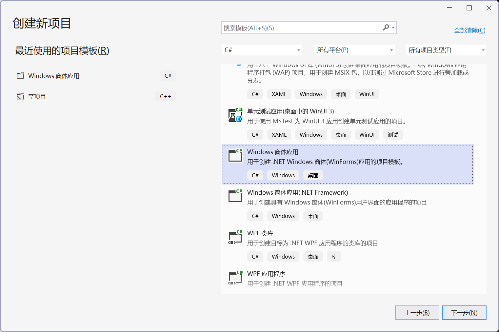
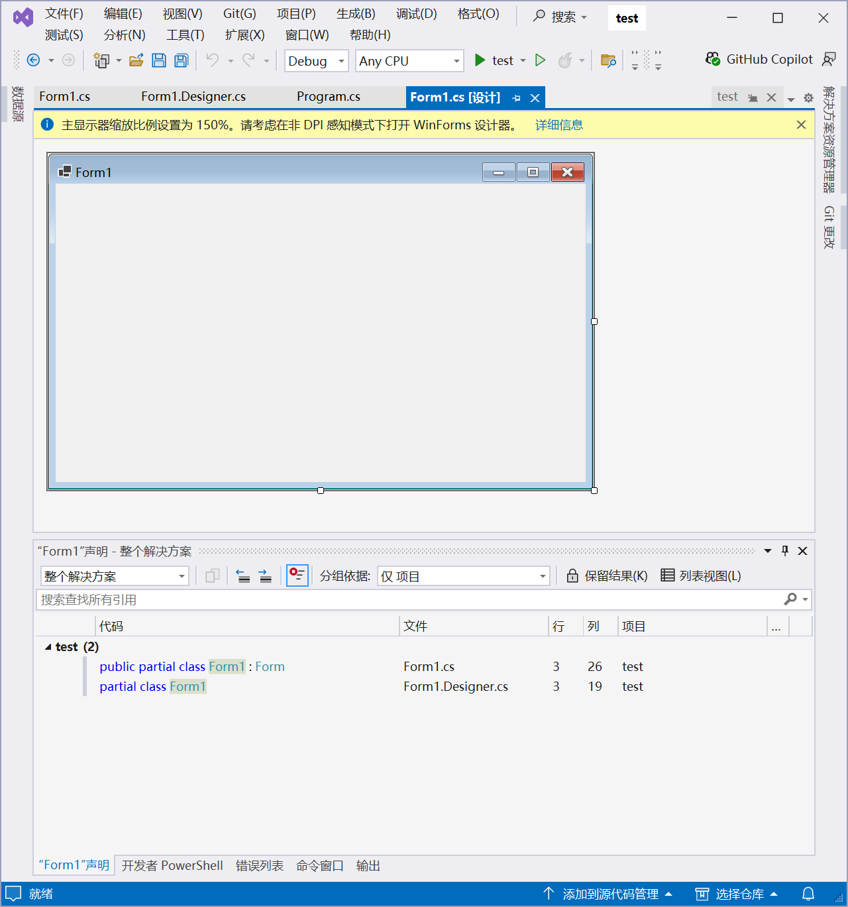

>[!TIP]
>曾经我在给每个编程语言都写了几万字的笔记,后来发现基本全是废话,没有什么可读性,远不如专业技术书籍来得有用,真遇到不会的了,也不如查AI来的快,所以,我现在只会放自己的心得了.
## 共性与杂谈
### Markup Language的历史
时间线:
| 时间           | 名称                         | 类型                | 主要用途               | 历史地位 / 今天状态                  |
| -------------- | ---------------------------- | ------------------- | ---------------------- | ------------------------------------ |
| **1964**       | **RUNOFF**                   | 过程式标记/文本排版 | 文档排版               | 最早的重要计算机文本标记系统之一     |
| **1969**       | **GML**                      | 描述性标记          | IBM 文档               | SGML 的直接祖先                      |
| **1969 起**    | **roff / troff**             | 过程式排版语言      | Unix 文档、man page    | Unix 文档体系的基础，仍有遗产        |
| **1978**       | **TeX**                      | 排版语言/宏语言     | 数学、科技出版         | 至今仍极重要                         |
| **1970s末**    | **Scribe**                   | 语义化文档标记      | 学术和技术文档         | 对 Texinfo、LaTeX 等理念影响很大     |
| **1984–1985**  | **LaTeX**                    | 高层排版标记系统    | 科研论文、图书         | 至今科研领域主流                     |
| **1980s中期**  | **Texinfo**                  | 语义标记            | GNU 手册               | GNU 官方文档体系                     |
| **1986**       | **SGML**                     | 元标记语言          | 大型结构化文档         | HTML、XML 的重要祖先                 |
| **1987**       | **RTF**                      | 富文本交换格式      | Word 等办公软件        | 曾极主流，现重要性下降               |
| **1990–1991**  | **HTML**                     | 超文本标记语言      | Web 页面               | 当今最重要的标记语言之一             |
| **1991**       | **DocBook**                  | SGML/XML 文档语言   | 技术书籍、软件文档     | 技术出版经典标准                     |
| **1992**       | **Setext**                   | 轻量级标记          | 邮件、电子出版         | Markdown 等思想的先驱之一            |
| **1995**       | **Wiki markup / WikiText**   | 轻量级标记          | Wiki                   | 开创“普通人直接编辑网页”模式         |
| **1998**       | **XML**                      | 元标记语言          | 数据和文档结构         | 企业系统、配置、协议、文档中仍很重要 |
| **1998**       | **MathML**                   | XML 应用            | 数学公式               | Web 数学标准                         |
| **1998**       | **BBCode**                   | 轻量级标记          | 论坛                   | 2000 年代论坛时代极常见              |
| **1999 前后**  | **WML**                      | XML/SGML 系标记     | 早期手机 WAP 网页      | 智能手机时代后基本退出               |
| **2000**       | **XHTML**                    | XML 化 HTML         | Web                    | 曾被认为是 HTML 的未来，后来路线失败 |
| **2001**       | **reStructuredText**         | 轻量级标记          | Python 文档            | Python/Sphinx 生态仍重要             |
| **2001**       | **SVG**                      | XML 图形标记        | 矢量图形               | 至今 Web 核心格式                    |
| **2002**       | **Textile**                  | 轻量级标记          | Web、博客              | Markdown 前后时期的重要方案          |
| **2002**       | **AsciiDoc**                 | 轻量级标记          | 技术文档、图书         | 今天仍很活跃                         |
| **2001–2002**  | **MediaWiki WikiText**       | Wiki 标记           | Wikipedia              | 世界上影响最大的 Wiki 标记之一       |
| **2003**       | **Org mode / Org syntax**    | 轻量标记 + 知识管理 | Emacs 笔记、任务、出版 | Emacs 生态核心                       |
| **2004**       | **Markdown**                 | 轻量级标记          | Web、README、文档      | 当今最普及轻量标记语言               |
| **2005**       | **DITA**                     | XML 文档架构        | 企业技术文档           | 大型企业内容管理重要标准             |
| **2007**       | **Wiki Creole**              | Wiki 标记标准       | Wiki 互操作            | 试图统一各家 Wiki 语法               |
| **2008–2010s** | **GitHub Flavored Markdown** | Markdown 方言       | GitHub                 | 程序员事实上的常用 Markdown          |
| **2014**       | **CommonMark**               | Markdown 标准化     | 通用 Markdown          | 解决 Markdown 方言不一致问题         |
| **2014 前后**  | **R Markdown**               | Markdown 扩展       | 数据分析、科研报告     | R / 数据科学领域广泛使用             |
| **2018 前后**  | **MDX**                      | Markdown + JSX      | React 文档、内容网站   | 前端生态重要混合格式                 |
| **2020 前后**  | **MyST Markdown**            | Markdown 扩展       | 科研、Sphinx、Jupyter  | 科学计算文档领域增长明显             |
| **2022–2023**  | **Typst**                    | 标记式排版语言      | 科研论文、排版         | 新一代 LaTeX 竞争者                  |

最后一个Typst我一开始是很看好的,现在的热度也确实起来了,希望能够早日取代Latex,简直不是人写的.不过话有说回来我又用不到.


### 各门语言中导入机制的处理(待补充)
一开始以为导入不就是将文件插入过来合并到一起嘛,后来发现除了C/Cpp之外,其他语言的做法都不是这样
#### 总表
| 语言/机制                | 本质                                              | 是否文本复制 |
| ------------------------ | ------------------------------------------------- | ------------ |
| C/C++ `#include`         | 预处理器把头文件文本插入当前文件                  | **是**       |
| C++20 `import` / Modules | 导入已编译模块接口                                | **否**       |
| Go `import`              | 导入 package，编译器读取包的导出信息，最后链接    | **否**       |
| Java `import`            | 主要用于名字解析；类由 classpath/module path 找到 | **否**       |
| Python `import`          | 运行时加载并执行模块，然后缓存到 `sys.modules`    | **否**       |
| Rust `use`               | 把名字引入当前作用域                              | **否**       |
| JavaScript ES `import`   | 建立模块依赖和绑定，由模块加载器处理              | **否**       |

#### Go
```go
import "fmt"
```
将fmt包的接口导入进来并进行链接,并在运行程序时完成包的初始化
#### Java
```java
import java.util.List;

List<String> names;
```
Java中的导入只是简写而已,我们完全可以写`java.util.List<String> names;`,所以
#### Rust
```rs
use foo::Bar;
```
将模块引入当前作用域.
#### python
```py
import sys
```

## Python
### 搭建GPU环境
先在nvidia官网下载cuda13.0,然后根据这个toml运行uv sync即可:
```toml
[project]
name = "ml"
version = "0.1.0"
description = "Add your description here"
readme = "README.md"
requires-Python = ">=3.13"
dependencies = [
    "torch",
    "torchvision",
    "torchaudio",
]

[tool.uv]
# 1. 物理定义 PyTorch 的专用硬件加速索引库
[tool.uv.index]
name = "pytorch-cu130"
url = "https://download.pytorch.org/whl/cu130"
explicit = true # 强制：只有在 sources 中明确指定的包才去这里找，防止污染其他依赖

[tool.uv.sources]
# 2. 将核心组件物理绑定到上述索引
torch = { index = "pytorch-cu130" }
torchvision = { index = "pytorch-cu130" }
torchaudio = { index = "pytorch-cu130" }
```

测试代码:
```py
import torch
print(f"CUDA status: {torch.cuda.is_available()}")
print(f"CUDA version: {torch.version.cuda}")
```
输出结果:
```bash
uv run ch1.py
CUDA status: True
CUDA version: 13.0
```
### Python管理器历史-AI
| 时间      | 代表工具       | 解决的问题                           | 后来的地位         |
| --------- | -------------- | ------------------------------------ | ------------------ |
| 1998–2000 | `distutils`    | 构建、打包、安装 Python 包           | 已淘汰             |
| 2004      | `setuptools`   | 增强 distutils、依赖声明、Egg        | 仍是重要构建后端   |
| 2004      | `easy_install` | 自动从 PyPI 下载并安装依赖           | 被 pip 取代        |
| 2007 左右 | `virtualenv`   | 项目间 Python 环境隔离               | 仍存在             |
| 2008      | `pip`          | 更可靠的包安装                       | 长期事实标准       |
| 2012      | `venv`         | 官方标准库虚拟环境                   | 仍广泛使用         |
| 2012 前后 | `conda`        | Python + 非 Python 依赖 + 环境       | 科学计算领域仍重要 |
| 2010s     | `pyenv`        | 管理多个 Python 解释器版本           | 仍常用             |
| 2015 前后 | `pip-tools`    | 依赖解析、锁定                       | 仍在维护           |
| 2017 前后 | `Pipenv`       | pip + virtualenv + lockfile          | 影响大，但热度下降 |
| 2018 前后 | `Poetry`       | 依赖、环境、构建、发布统一           | 至今主流           |
| 2020      | `PDM`          | 基于 `pyproject.toml` 的现代项目管理 | 至今活跃           |
| 2022      | Hatch v1       | 构建、环境、测试、发布               | PyPA 项目          |
| 2023      | Rye            | Python 安装 + 环境 + 包 + 项目统一   | 已停止开发         |
| 2024      | **uv**         | 高性能统一 Python 管理               | 当前快速成为主流   |

uv彻底终结了比赛,并让python的学习变得异常轻松.

### fastapi文档高级要点(9/28)
#### 中间件
>“中间件”是一个函数，它会在每个特定的路径操作处理每个请求之前运行，也会在返回每个响应之前运行

```py
import time

from fastapi import FastAPI, Request

app = FastAPI()


@app.middleware("http")
async def add_process_time_header(request: Request, call_next):
    start_time = time.perf_counter()
    response = await call_next(request)
    process_time = time.perf_counter() - start_time
    response.headers["X-Process-Time"] = str(process_time)
    return response
```
这个函数会在每一次HTTP请求到达client时自动运行,用于添加响应头.

而中间件实际上也只有`http`这个粒度,顶多根据方法来筛选:
```py
@app.middleware("http")
async def middleware(request: Request, call_next):
    if request.method == "POST":
        print("POST 请求")

    return await call_next(request)
```
所以用处基本约等于没有.

#### 后台任务
我们可以定义在返回响应后运行的后台任务,这对需要在请求之后执行的操作很有用，但客户端不必在接收响应之前等待操作完成,例如:
1. 执行操作后发送的电子邮件通知：
   1. 由于连接到电子邮件服务器并发送电子邮件往往很“慢”（几秒钟），你可以立即返回响应并在后台发送电子邮件通知。
2. 处理数据：
   1. 例如，假设你收到的文件必须经过一个缓慢的过程，你可以返回一个"Accepted"(HTTP 202)响应并在后台处理它。

```py
from fastapi import BackgroundTasks, FastAPI

app = FastAPI()


def write_notification(email: str, message=""):
    with open("log.txt", mode="w") as email_file:
        content = f"notification for {email}: {message}"
        email_file.write(content)


@app.post("/send-notification/{email}")
async def send_notification(email: str, background_tasks: BackgroundTasks):
    background_tasks.add_task(write_notification, email, message="some notification")
    return {"message": "Notification sent in the background"}
```
很明显,这个类只适合一些基础场景,稍微复杂一点的话就要用消息队列来搞了.


### 异步与多线程(9/27)
### 装饰器探析(10/6)
#### 装饰器的历史
时间线:

| 时间            | 事件                                                    |
| --------------- | ------------------------------------------------------- |
| Python 2.2      | 已存在 `classmethod()`、`staticmethod()` 等函数转换机制 |
| 2002            | Python 社区开始持续讨论专门的 decorator 语法            |
| 2003-06         | **PEP 318** 正式提出                                    |
| 2002–2004       | `python-dev` 围绕语法进行了大量讨论                     |
| 2004 EuroPython | Guido 综合各种方案后决定使用 `@decorator`               |
| Python 2.4a2    | `@decorator` 首次进入 Python                            |
| **2004-11-30**  | Python 2.4 正式发布，函数装饰器成为正式语言特性         |
| 2007            | PEP 3129 提出 class decorator                           |
| Python 3.0      | 类装饰器正式加入                                        |

当时甚至还有与如今的rust非常相似的提案:
```py
[decorator]
def foo():
    ...
```
只能说还好没这么写,不然可读性确实要差上不少,至于rust为什么不写成`@`?反正可读性本来就够差了...


装饰器的本质就是函数嵌套,从而避免了用户自己再去调用库函数来包装函数的麻烦,可以说极大地简化了开发流程.

比较早版本的装饰器只允许装饰函数,因为class已经有`metaclass`这个参数来配置了,但用起来显然没有装饰器简单,所以Collin Winter 在 2007 年提出 PEP 3129,并在python3.0中将装饰器引入到类中,可以说是极其重要的改进.


让我们再回顾一下装饰器诞生的关键提案[PEP318](https://peps.python.org/pep-0318):

>从 2002 年 2 月到 2004 年 7 月，python-dev 邮件列表上的讨论断断续续地持续着。数百条帖子涌现，人们提出了许多可能的语法变体。Guido 将一份提案列表带到了2004 年的 EuroPython 大会上，并在会上进行了讨论。之后，他决定采用Java 风格的 @decorator 语法，并在 2.4a2 版本中首次出现
#### 基本格式
```py
@dec2
@dec1
def func(arg1, arg2, ...):
    pass
```
等价于:
```py
def func(arg1, arg2, ...):
    pass
func = dec2(dec1(func))
```
#### 类中的装饰器
1. `@dataclass`: 数据类,意思是把这个类用来存放数据

```py
from dataclasses import dataclass

@dataclass
class InventoryItem:
    """Class for keeping track of an item in inventory."""
    name: str
    unit_price: float
    quantity_on_hand: int = 0

    def total_cost(self) -> float:
        return self.unit_price * self.quantity_on_hand
```
编译时会给这个类自动加上初始化方法和几个不太常用的边角料方法如`repr`和`eq`:
```py
def __init__(self, name: str, unit_price: float, quantity_on_hand: int = 0):
    self.name = name
    self.unit_price = unit_price
    self.quantity_on_hand = quantity_on_hand
```
如果写成这样:
```py
@dataclass(frozen=True)
class TokenUsage:
    input_tokens: int = 0
    output_tokens: int = 0
    total_tokens: int = 0
```
就表示在初始化后不能再修改:
```py
usage = TokenUsage(100, 50, 150)

usage.input_tokens = 200
# dataclasses.FrozenInstanceError
```
2. `@staticmethod`: 静态方法,用法与Cpp中的静态方法基本一样,不需要传入self,可以通过实例和类名直接调用
#### 函数装饰器
### Strawberry库学习
### Cpython wsgiref学习(10/7)

## Golang
## Java
### Java历史
- [wiki](https://en.wikipedia.org/wiki/Java_(programming_language))

Java由Sun公司于1995年发布,出于营销的目的,将Java分成了三个主要版本: 
1. Java Platform, Micro Edition(Java ME): 用于嵌入式等内存有限的环境
2. Java Platform, Standard Edition (Java SE): 标准版本
3. Java Platform, Enterprise Edition (Java EE): 企业版本

简单来说,就是包含的库上有一些区别而已,其他的差别并不大.

由于Java依靠JVM运行,而早期的JVM是不开源的,所以引发了很多争议和诉讼案件,也是微软自己开发C#语言(与Java高度相似)的原因.

07年的时候,JVM的所有核心代码都正式开源,从而诞生了大量的第三方JDK,最著名的就是OpenJDK了,不管如何,现在我们可以随便下载JDK而不用担心被诉讼了.

10年Oracle收购Sun后,Java的所有权转入了Oracle公司,之后Java的演进速度趋于稳定,现在的Java SE是半年更新一版,迭代速度还是很快的.
### Spring环境配置
- [vscode配置教程](https://vscode.github.net.cn/docs/java/java-spring-boot)
  - 网上能见到的教程要么用IntelliJ IDEA,要么用Spring Boot CLI,这让我一个VSCode的死忠粉很崩溃啊

如官网所说,要在VSCode中开发Spring Boot,需要安装JDK,VSCode中的Java扩展,(Gradle扩展)和Spring Boot扩展,其中Spring Boot扩展包的内容如下,一下子就会导入四个扩展:


要想新建一个初始化的Spring Boot项目的话,直接按`Ctrl+Shift+P`并键入`Spring Initializr`,选择自己想要的模板即可,如果全部按照默认设置的话,最终生成的项目是这样的:


- 不过,使用`gradle init`也可以实现差不多的效果,只不过可能没有这种图形化界面的选择直观了.
- 另一个方法是直接去SPring的官网下载初始化项目,下载得到的项目是完全一样的

>不过,等待项目的各种依赖就绪要很久,应该说这是Java项目的通病了

在扩展栏中多了一个Spring Boot Dashboard工具,点开后运行APPs中的app即可,不出意外的话终端会有如下输出:


当然,如果直接拿一个现成的Spring Boot项目来看的话,根本无从下手,所以需要好好了解Spring的基本知识和Spring Boot对它的改进.

>[!NOTE]
>(26/8/25)突然发现我之前还是太蠢了,直接看现成项目才是学习Spring Boot的王道,扯什么IoC,依赖注入,一点用都没有,毕竟无论是什么语言,什么框架,一旦涉及了CRUD,就几乎没有什么太大的架构差别.
## Cpp
### struct/class全解(9/8)
Cpp中struct和class的区别比我想的还要小很多,它们都有访问控制符,有构造和析构函数,支持`->`访问符,唯一的区别在于,struct的默认成员权限为public,而class的默认成员权限为private.

如此也看得出来,class完完全全就是struct的套皮而已.如此一来,我们完全不需要因为Go和Rust中没有class而难受,毕竟二者实际上并没有什么区别.

### const问题(9/8)
C/Cpp中最容易让人迷糊的就是指针了,但当指针和const混在一起时,这才是噩梦的开始

先放出列表:
| 声明                  | 更准确的名称       | 指针指向能否改变 | 指向的值能否通过该指针修改 |
| --------------------- | ------------------ | ---------------: | -------------------------: |
| `const int *p`        | 指向常量的指针     |             可以 |                     不可以 |
| `int const *p`        | 指向常量的指针     |             可以 |                     不可以 |
| `int * const p`       | 指针常量 / 常指针  |           不可以 |                       可以 |
| `const int * const p` | 指向常量的指针常量 |           不可以 |                     不可以 |

#### 指向常量的指针

其中,下面两个式子完全等价:
```c
const int *p;
int const *p;
```
至于为什么如此,对于`int const *p;`,显然不存在一个指向const的指针,所以这个指针只能是指向int,而const自然就是修饰int的了,所以叫做指向常量int的指针.

尽管如此,这并不意味着对象真的是常量,而是表示**p以为自己指向的是常量**,所以无法通过p修改指向的对象,但对象本身可以是变量:
```c
int a = 10;
const int *p = &a;

a = 20;     // 正确：a本身不是常量
*p = 20;    // 错误：不能通过p修改a
```
#### 指针常量
既然这个指针是常量,也就不可以修改存储的地址了,但仍然可以修改指向对象的值,用处并不大,一个引用就可以完全代替了.
#### 指向常量的指针常量
双重const,额,根本看不出有什么好的用法.

#### 总结
如上所示,这几个概念屁用没有,可惜的是面试总喜欢考这个,莫名其妙的.
## Rust
### 优秀的Github仓库
1. [入门学习](https://github.com/rust-lang/rustling): 非常NB的交互式学习!
2. [中文教程](https://beatai.org/rust-course/basic/)
3. [链表入门](https://rust-unofficial.github.io/too-many-lists/)
4. [mini-redis](https://github.com/tokio-rs/mini-redis/tree/master)
5. [pingcap](https://github.com/pingcap/talent-plan)

## CS
### 环境配置

#### .NET编译器介绍
- [wiki](https://en.wikipedia.org/wiki/.NET)
##### 是什么,有什么用
.NET是微软发布的开源编译器,支持C#,F#和Visual Basic开发,类似于Java中的JDK和Cpp中的MSVC,至于为什么叫.NET,只不过是微软糟糕的命名品味(.net=>.NET)而已.

- Windows的PowerShell,Visual Studio均基于.NET构建,Unity也需要.NET环境来解释C#脚本
##### .NET历史
* **2000年 - 2002年：诞生与标准化**
    微软在 PDC 2000 会议上公布 C# 语言，并随后将 **CLI (公共语言基础设施)** 提交 ECMA 进行标准化。2002 年，**.NET Framework 1.0** 正式发布，确立了基于虚拟运行时的受控代码开发模式。

* **2014年：开源与跨平台转型**
    11 月 12 日，微软宣布启动 **.NET Core** 项目。这是一个完全重构的开源、跨平台版本，旨在摆脱对 Windows 操作系统的绑定，并成立了 **.NET Foundation** 负责社区化运营。

* **2016年 - 2017年：.NET Core 初期**
    2016 年 6 月，**.NET Core 1.0** 发布，正式实现 Linux 和 macOS 运行能力。2017 年发布的 **.NET Core 2.0** 引入了 **.NET Standard 2.0**，统一了 API 规范，解决了新旧平台间的代码兼容难题。

* **2019年：桌面支持与成熟**
    **.NET Core 3.0** 发布。该版本最显著的变化是支持 WPF 和 WinForms 桌面应用在 Core 环境下运行，性能相比旧版 Framework 大幅提升。

* **2020年：架构大统一 (.NET 5)**
    微软跳过版本号 4.0 并移除了 "Core" 后缀，发布 **.NET 5**。此举标志着 .NET Framework（旧版）和 .NET Core（新版）合二为一，成为未来唯一的 .NET 演进路径。

* **2021年 - 2023年：LTS 演进 (.NET 6 - .NET 8)**
    **.NET 6** (2021) 确立了 3 年期的长期支持 (LTS) 模式。**.NET 8** (2023) 作为目前的核心 LTS 版本，引入了 **Native AOT** 编译技术，极大优化了云原生场景下的启动速度。

* **2024年 - 2026年：现代版本与 AI 集成**
    **.NET 9** (2024) 重点增强了 AI 扩展能力和运行时效率。目前最新的 **.NET 10 (LTS)** 已于 2025 年 11 月发布，其支持周期将持续至 2028 年，成为当前企业级开发的基础版本。
##### Nuget
- [wiki](https://en.wikipedia.org/wiki/NuGet)
.NET的包管理器,被集成在.NET中,不需要单独下载即可直接调用
- 至于为什么叫Nuget,则又是微软的糟糕命名品味(new get=>nuget)了


#### 使用VS运行项目
1. 在创建新项目中选择语言为C#,找到被标记的这一栏


- 可以看到有两种C#窗体应用,第一种是我们要选择的.NET平台,第二个则是古老的.NET framework平台

1. 随便起个名字比如说`test`,选择默认的.NET 8.0(长期支持版本)
2. 在终端输入`cd test`: VS非常神奇的地方在于当你创建.NET项目时,VS会创建一个同名子文件夹来存放项目
   1. 也就是说,所有的东西和.NET依赖并不在根目录,而是会在test子文件夹中,所以这里我们需要`cd test`
3. 再输入上述的命令行安装链接,安装之后按一下f5,成功弹出来一个空白的窗口
4. 但是现在我们打开解决方案资源管理器后,点击里面的Form1.cs,弹出来的是一个空白窗口,右键该界面的空白处或者右键Form1.cs即可查看代码...



#### 使用VScode运行项目
没有人喜欢用VS来开发,所以我们可以通过终端来初始化和运行C#项目:
1. 创建一个项目后在终端输入`dotnet new`,提示你可以创建以下项目,这正好对应了之前VS中的创建项目方式:
```bash
“dotnet new”命令基于模板创建 .NET 项目。

常用模板包括:
模板名            短名称    语言        标记
----------------  --------  ----------  ----------------------
Blazor Web 应用   blazor    [C#]        Web/Blazor/WebAssembly
Windows 窗体应用  winforms  [C#],VB     Common/WinForms
WPF 应用程序      wpf       [C#],VB     Common/WPF
控制台应用        console   [C#],F#,VB  Common/Console
类库              classlib  [C#],F#,VB  Common/Library
```
2. 再输入`dotnet run`即可运行项目,实现与VS中相同的效果
3. 但要在VScode中进行C#和Oracle开发的话我们还需要下载.NET相关的插件以及`Oracle SQL Developer Extension for VSCode`,然后就可以用VScode开始开发了
