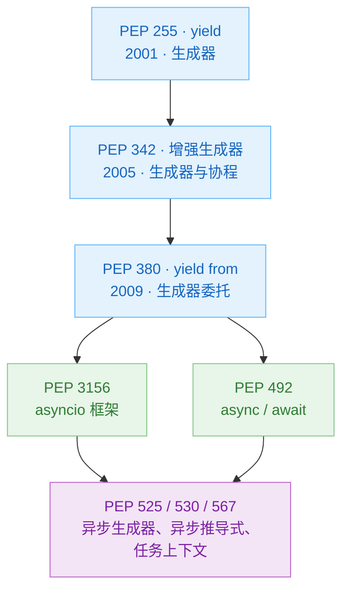
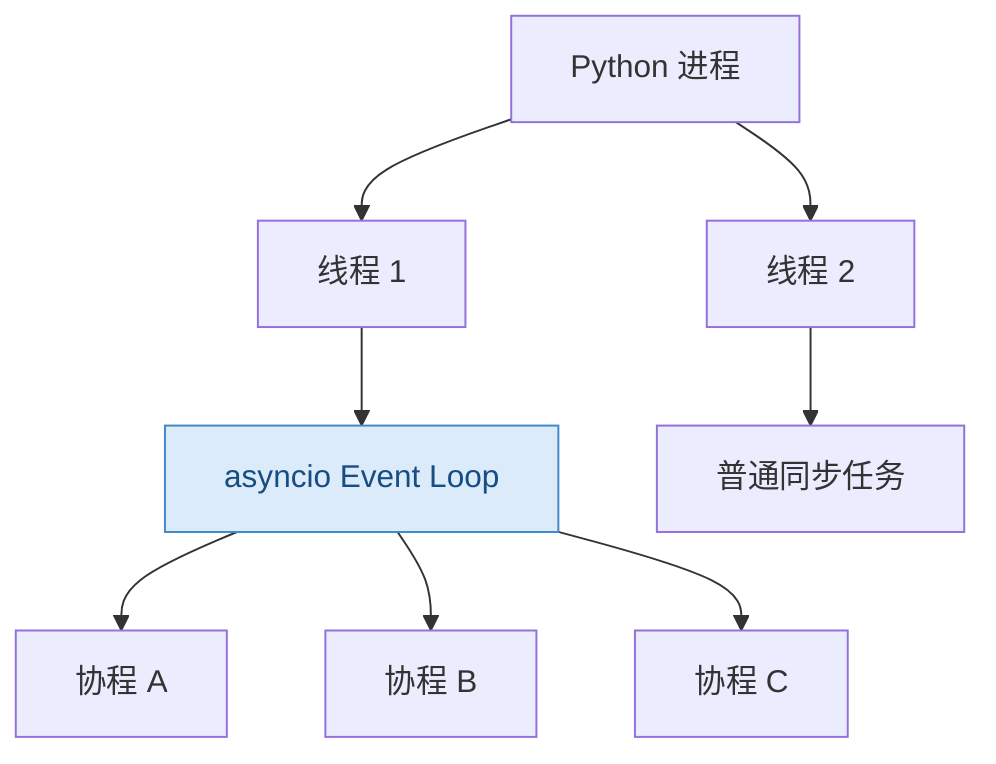
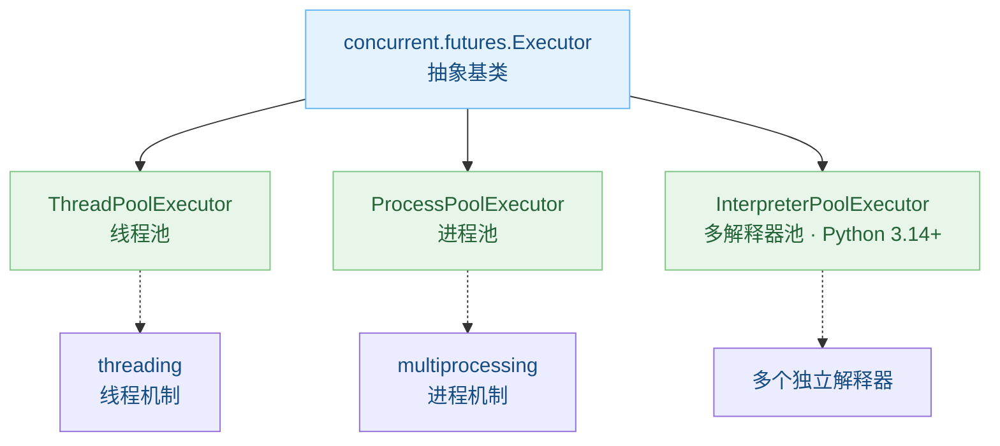

>[!TIP]
>曾经我在给每个编程语言都写了几万字的笔记,后来发现基本全是废话,没有什么可读性,远不如专业技术书籍来得有用,真遇到不会的了,也不如查AI来的快,所以,我现在只会放自己的心得了.
## 共性与杂谈
### Markup Language的历史
时间线:
| 时间           | 名称                         | 类型                | 主要用途               | 历史地位 / 今天状态                  |
| -------------- | ---------------------------- | ------------------- | ---------------------- | ------------------------------------ |
| **1964**       | **RUNOFF**                   | 过程式标记/文本排版 | 文档排版               | 最早的重要计算机文本标记系统之一     |
| **1969**       | **GML**                      | 描述性标记          | IBM 文档               | SGML 的直接祖先                      |
| **1969 起**    | **roff / troff**             | 过程式排版语言      | Unix 文档、man page    | Unix 文档体系的基础，仍有遗产        |
| **1978**       | **TeX**                      | 排版语言/宏语言     | 数学、科技出版         | 至今仍极重要                         |
| **1970s末**    | **Scribe**                   | 语义化文档标记      | 学术和技术文档         | 对 Texinfo、LaTeX 等理念影响很大     |
| **1984–1985**  | **LaTeX**                    | 高层排版标记系统    | 科研论文、图书         | 至今科研领域主流                     |
| **1980s中期**  | **Texinfo**                  | 语义标记            | GNU 手册               | GNU 官方文档体系                     |
| **1986**       | **SGML**                     | 元标记语言          | 大型结构化文档         | HTML、XML 的重要祖先                 |
| **1987**       | **RTF**                      | 富文本交换格式      | Word 等办公软件        | 曾极主流，现重要性下降               |
| **1990–1991**  | **HTML**                     | 超文本标记语言      | Web 页面               | 当今最重要的标记语言之一             |
| **1991**       | **DocBook**                  | SGML/XML 文档语言   | 技术书籍、软件文档     | 技术出版经典标准                     |
| **1992**       | **Setext**                   | 轻量级标记          | 邮件、电子出版         | Markdown 等思想的先驱之一            |
| **1995**       | **Wiki markup / WikiText**   | 轻量级标记          | Wiki                   | 开创“普通人直接编辑网页”模式         |
| **1998**       | **XML**                      | 元标记语言          | 数据和文档结构         | 企业系统、配置、协议、文档中仍很重要 |
| **1998**       | **MathML**                   | XML 应用            | 数学公式               | Web 数学标准                         |
| **1998**       | **BBCode**                   | 轻量级标记          | 论坛                   | 2000 年代论坛时代极常见              |
| **1999 前后**  | **WML**                      | XML/SGML 系标记     | 早期手机 WAP 网页      | 智能手机时代后基本退出               |
| **2000**       | **XHTML**                    | XML 化 HTML         | Web                    | 曾被认为是 HTML 的未来，后来路线失败 |
| **2001**       | **reStructuredText**         | 轻量级标记          | Python 文档            | Python/Sphinx 生态仍重要             |
| **2001**       | **SVG**                      | XML 图形标记        | 矢量图形               | 至今 Web 核心格式                    |
| **2002**       | **Textile**                  | 轻量级标记          | Web、博客              | Markdown 前后时期的重要方案          |
| **2002**       | **AsciiDoc**                 | 轻量级标记          | 技术文档、图书         | 今天仍很活跃                         |
| **2001–2002**  | **MediaWiki WikiText**       | Wiki 标记           | Wikipedia              | 世界上影响最大的 Wiki 标记之一       |
| **2003**       | **Org mode / Org syntax**    | 轻量标记 + 知识管理 | Emacs 笔记、任务、出版 | Emacs 生态核心                       |
| **2004**       | **Markdown**                 | 轻量级标记          | Web、README、文档      | 当今最普及轻量标记语言               |
| **2005**       | **DITA**                     | XML 文档架构        | 企业技术文档           | 大型企业内容管理重要标准             |
| **2007**       | **Wiki Creole**              | Wiki 标记标准       | Wiki 互操作            | 试图统一各家 Wiki 语法               |
| **2008–2010s** | **GitHub Flavored Markdown** | Markdown 方言       | GitHub                 | 程序员事实上的常用 Markdown          |
| **2014**       | **CommonMark**               | Markdown 标准化     | 通用 Markdown          | 解决 Markdown 方言不一致问题         |
| **2014 前后**  | **R Markdown**               | Markdown 扩展       | 数据分析、科研报告     | R / 数据科学领域广泛使用             |
| **2018 前后**  | **MDX**                      | Markdown + JSX      | React 文档、内容网站   | 前端生态重要混合格式                 |
| **2020 前后**  | **MyST Markdown**            | Markdown 扩展       | 科研、Sphinx、Jupyter  | 科学计算文档领域增长明显             |
| **2022–2023**  | **Typst**                    | 标记式排版语言      | 科研论文、排版         | 新一代 LaTeX 竞争者                  |

最后一个Typst我一开始是很看好的,现在的热度也确实起来了,希望能够早日取代Latex,简直不是人写的.不过话有说回来我又用不到.


### 各门语言中导入机制的处理(待补充)
一开始以为导入不就是将文件插入过来合并到一起嘛,后来发现除了C/Cpp之外,其他语言的做法都不是这样
#### 总表
| 语言/机制                | 本质                                              | 是否文本复制 |
| ------------------------ | ------------------------------------------------- | ------------ |
| C/C++ `#include`         | 预处理器把头文件文本插入当前文件                  | **是**       |
| C++20 `import` / Modules | 导入已编译模块接口                                | **否**       |
| Go `import`              | 导入 package，编译器读取包的导出信息，最后链接    | **否**       |
| Java `import`            | 主要用于名字解析；类由 classpath/module path 找到 | **否**       |
| Python `import`          | 运行时加载并执行模块，然后缓存到 `sys.modules`    | **否**       |
| Rust `use`               | 把名字引入当前作用域                              | **否**       |
| JavaScript ES `import`   | 建立模块依赖和绑定，由模块加载器处理              | **否**       |

#### Go
```go
import "fmt"
```
将fmt包的接口导入进来并进行链接,并在运行程序时完成包的初始化
#### Java
```java
import java.util.List;

List<String> names;
```
Java中的导入只是简写而已,我们完全可以写`java.util.List<String> names;`,所以
#### Rust
```rs
use foo::Bar;
```
将模块引入当前作用域.
#### python
```py
import sys
```

## Python
### 搭建GPU环境(26/1)
先在nvidia官网下载cuda13.0,然后根据这个toml运行uv sync即可:
```toml
[project]
name = "ml"
version = "0.1.0"
description = "Add your description here"
readme = "README.md"
requires-Python = ">=3.13"
dependencies = [
    "torch",
    "torchvision",
    "torchaudio",
]

[tool.uv]
# 1. 物理定义 PyTorch 的专用硬件加速索引库
[tool.uv.index]
name = "pytorch-cu130"
url = "https://download.pytorch.org/whl/cu130"
explicit = true # 强制：只有在 sources 中明确指定的包才去这里找，防止污染其他依赖

[tool.uv.sources]
# 2. 将核心组件物理绑定到上述索引
torch = { index = "pytorch-cu130" }
torchvision = { index = "pytorch-cu130" }
torchaudio = { index = "pytorch-cu130" }
```

测试代码:
```py
import torch
print(f"CUDA status: {torch.cuda.is_available()}")
print(f"CUDA version: {torch.version.cuda}")
```
输出结果:
```bash
uv run ch1.py
CUDA status: True
CUDA version: 13.0
```
### Python管理器历史-AI
| 时间      | 代表工具       | 解决的问题                           | 后来的地位         |
| --------- | -------------- | ------------------------------------ | ------------------ |
| 1998–2000 | `distutils`    | 构建、打包、安装 Python 包           | 已淘汰             |
| 2004      | `setuptools`   | 增强 distutils、依赖声明、Egg        | 仍是重要构建后端   |
| 2004      | `easy_install` | 自动从 PyPI 下载并安装依赖           | 被 pip 取代        |
| 2007 左右 | `virtualenv`   | 项目间 Python 环境隔离               | 仍存在             |
| 2008      | `pip`          | 更可靠的包安装                       | 长期事实标准       |
| 2012      | `venv`         | 官方标准库虚拟环境                   | 仍广泛使用         |
| 2012 前后 | `conda`        | Python + 非 Python 依赖 + 环境       | 科学计算领域仍重要 |
| 2010s     | `pyenv`        | 管理多个 Python 解释器版本           | 仍常用             |
| 2015 前后 | `pip-tools`    | 依赖解析、锁定                       | 仍在维护           |
| 2017 前后 | `Pipenv`       | pip + virtualenv + lockfile          | 影响大，但热度下降 |
| 2018 前后 | `Poetry`       | 依赖、环境、构建、发布统一           | 至今主流           |
| 2020      | `PDM`          | 基于 `pyproject.toml` 的现代项目管理 | 至今活跃           |
| 2022      | Hatch v1       | 构建、环境、测试、发布               | PyPA 项目          |
| 2023      | Rye            | Python 安装 + 环境 + 包 + 项目统一   | 已停止开发         |
| 2024      | **uv**         | 高性能统一 Python 管理               | 当前快速成为主流   |

uv彻底终结了比赛,并让python的学习变得异常轻松.

### fastapi文档高级要点(9/28)
#### 中间件
>“中间件”是一个函数，它会在每个特定的路径操作处理每个请求之前运行，也会在返回每个响应之前运行

```py
import time

from fastapi import FastAPI, Request

app = FastAPI()


@app.middleware("http")
async def add_process_time_header(request: Request, call_next):
    start_time = time.perf_counter()
    response = await call_next(request)
    process_time = time.perf_counter() - start_time
    response.headers["X-Process-Time"] = str(process_time)
    return response
```
这个函数会在每一次HTTP请求到达client时自动运行,用于添加响应头.

而中间件实际上也只有`http`这个粒度,顶多根据方法来筛选:
```py
@app.middleware("http")
async def middleware(request: Request, call_next):
    if request.method == "POST":
        print("POST 请求")

    return await call_next(request)
```
所以用处基本约等于没有.

#### 后台任务
我们可以定义在返回响应后运行的后台任务,这对需要在请求之后执行的操作很有用，但客户端不必在接收响应之前等待操作完成,例如:
1. 执行操作后发送的电子邮件通知：
   1. 由于连接到电子邮件服务器并发送电子邮件往往很“慢”（几秒钟），你可以立即返回响应并在后台发送电子邮件通知。
2. 处理数据：
   1. 例如，假设你收到的文件必须经过一个缓慢的过程，你可以返回一个"Accepted"(HTTP 202)响应并在后台处理它。

```py
from fastapi import BackgroundTasks, FastAPI

app = FastAPI()


def write_notification(email: str, message=""):
    with open("log.txt", mode="w") as email_file:
        content = f"notification for {email}: {message}"
        email_file.write(content)


@app.post("/send-notification/{email}")
async def send_notification(email: str, background_tasks: BackgroundTasks):
    background_tasks.add_task(write_notification, email, message="some notification")
    return {"message": "Notification sent in the background"}
```
很明显,这个类只适合一些基础场景,稍微复杂一点的话就要用消息队列来搞了.
### PEP介绍
- [PEP1](https://peps.python.org/pep-0001/)

PEP的全称为Python Enhancement Proposal,于2000年的PEP1正式提出,用于收集Python社区中的决策记录,提案和总结.PEP的类型有三种:
1. Standards Track PEP: 介绍Python的新特性
2. Informational PEP: 用于描述Python相关的设计提案,或者用于通知和指导.**users and implementers are free to ignore Informational PEPs or follow their advice.**
3. Process PEP: 类似于第一种PEP,但更多的注重于开发流程

PEP的编号并不是按照时间线来的,而是按照PEP的功能决定编号范围:

| 编号范围  | 分配逻辑                                                    | 例子                      |
| --------- | ----------------------------------------------------------- | ------------------------- |
| 0—99      | 主要保留给元 PEP，即管理其他 PEP 或规定开发流程、规范的提案 | PEP 1、PEP 8              |
| 100—999   | 常规提案编号，涵盖语言特性、开发流程等                      | PEP 255、PEP 342、PEP 492 |
| 3000—3099 | 专门为 Python 3000（Python 3）规划的元 PEP 编号段           | PEP 3000                  |
| 3100—3999 | 最初为 Python 3000 的功能提案规划的编号段                   | PEP 3156                  |

如果你不是核心开发者,就必须要找到一个Sponsor(通常是核心开发者)来帮你正式提交该PEP,并由PEP委员会来审核该PEP,并经过广泛的讨论后才可以正式作为某个PEP存在,并由委员会分配PEP编号,一经确认则不会重新编号,通常来讲,编号是在给定的编号范围内逐渐递增的.

>PEP 编辑不会无故拒绝发布 PEP。拒绝发布 PEP 的理由包括：工作重复、技术上不合理、未能提供充分的动机或解决向后兼容性问题，或者不符合 Python 的理念。在审批阶段可以咨询指导委员会，指导委员会对草案是否符合 PEP 的要求拥有最终决定权
#### 重要PEP
- AI总结的,毕竟我不可能去一个个翻吧...

以下整理了 Python 发展史上具有代表性的 49 份 PEP，按照语言设计、迭代与异步、类型系统、后端生态、解释器优化以及社区治理六个方向分类。

对于语言功能，年份以首次正式发布的 Python 版本为主；对于治理和生态规范，则以提案创建或正式形成的时间为主。

1\. Python 语言设计与基础语法

| 年份 / 版本 | PEP（官方原文）                                                                        | 主要内容与历史意义                                                           |
| ----------- | -------------------------------------------------------------------------------------- | ---------------------------------------------------------------------------- |
| 2000 · 2.0  | [PEP 202](https://peps.python.org/pep-0202/) — List Comprehensions                     | 列表推导式：引入 `[x for x in items]`，简化集合数据处理。                    |
| 2001 · 2.2  | [PEP 234](https://peps.python.org/pep-0234/) — Iterators                               | 迭代器协议：奠定现代 `iter()`、`next()` 和 `for` 迭代机制的基础。            |
| 2001 · 2.2  | [PEP 255](https://peps.python.org/pep-0255/) — Simple Generators                       | 生成器：引入 `yield`，允许函数暂停、返回值并恢复运行。                       |
| 2004 · 2.4  | [PEP 318](https://peps.python.org/pep-0318/) — Decorators                              | 装饰器：引入 `@decorator`，成为 FastAPI 路由等 API 的语法基础。              |
| 2006 · 2.5  | [PEP 343](https://peps.python.org/pep-0343/) — The with Statement                      | 上下文管理器：引入 `with`，统一资源获取和释放操作。                          |
| 2008 · 3.0  | [PEP 3107](https://peps.python.org/pep-3107/) — Function Annotations                   | 函数注解：建立参数及返回值注解的语言基础。                                   |
| 2012 · 3.3  | [PEP 380](https://peps.python.org/pep-0380/) — Syntax for Delegating to a Subgenerator | 生成器委托：引入 `yield from`，简化嵌套生成器。                              |
| 2016 · 3.6  | [PEP 498](https://peps.python.org/pep-0498/) — Literal String Interpolation            | f-string：引入 `f"{value}"` 字符串插值。                                     |
| 2018 · 3.7  | [PEP 557](https://peps.python.org/pep-0557/) — Data Classes                            | 数据类：引入 `@dataclass`，自动生成初始化、比较等方法。                      |
| 2019 · 3.8  | [PEP 572](https://peps.python.org/pep-0572/) — Assignment Expressions                  | 海象运算符：支持在表达式中使用 `:=` 赋值。                                   |
| 2021 · 3.10 | [PEP 634](https://peps.python.org/pep-0634/) — Structural Pattern Matching             | 结构化模式匹配：引入 `match` / `case`，匹配复杂数据结构。                    |
| 2022 · 3.11 | [PEP 654](https://peps.python.org/pep-0654/) — Exception Groups and except\*           | 异常组：引入 `ExceptionGroup` 和 `except*`，支持处理并发任务产生的多个异常。 |
| 2023 · 3.12 | [PEP 701](https://peps.python.org/pep-0701/) — Syntactic Formalization of f-strings    | f-string 语法改革：规范语法并解除部分表达式限制。                            |
| 2025 · 3.14 | [PEP 750](https://peps.python.org/pep-0750/) — Template Strings                        | 模板字符串：引入 `t"..."`，为自定义、安全的字符串处理提供结构化模板。        |

2\. 生成器、协程和异步编程

这一组与 `asyncio`、`yield`、`async/await` 关系最直接。

| 年份 / 版本 | PEP（官方原文）                                                                       | 核心贡献                                                                                        |
| ----------- | ------------------------------------------------------------------------------------- | ----------------------------------------------------------------------------------------------- |
| 2006 · 2.5  | [PEP 342](https://peps.python.org/pep-0342/) — Coroutines via Enhanced Generators     | 增强生成器：引入 `send()`、`throw()`、`close()`，让生成器能够承担协程功能。                     |
| 2014 · 3.4  | [PEP 3156](https://peps.python.org/pep-3156/) — Asynchronous IO Support Rebooted      | asyncio：建立统一异步 I/O 框架，提供事件循环及协程调度基础。                                    |
| 2015 · 3.5  | [PEP 492](https://peps.python.org/pep-0492/) — Coroutines with async and await syntax | async/await：将原生协程作为独立语言概念，引入 `async def`、`await`、`async with`、`async for`。 |
| 2016 · 3.6  | [PEP 525](https://peps.python.org/pep-0525/) — Asynchronous Generators                | 异步生成器：支持在 `async def` 中使用 `yield`。                                                 |
| 2016 · 3.6  | [PEP 530](https://peps.python.org/pep-0530/) — Asynchronous Comprehensions            | 异步推导式：支持 `[x async for x in items]`。                                                   |
| 2018 · 3.7  | [PEP 567](https://peps.python.org/pep-0567/) — Context Variables                      | contextvars：为并发异步任务提供正确隔离的上下文变量。                                           |

这几份 PEP 之间存在清晰的技术演进关系：


3\. Python 类型系统与现代面向对象编程

| 年份 / 版本 | PEP（官方原文）                                                                              | 核心贡献                                                               |
| ----------- | -------------------------------------------------------------------------------------------- | ---------------------------------------------------------------------- |
| 2015 · 3.5  | [PEP 484](https://peps.python.org/pep-0484/) — Type Hints                                    | 类型提示：建立 Python 静态类型系统的基础，引入标准化的 `typing` 约定。 |
| 2016 · 3.6  | [PEP 526](https://peps.python.org/pep-0526/) — Syntax for Variable Annotations               | 变量类型注解：引入 `name: str` 等语法。                                |
| 2019 · 3.8  | [PEP 544](https://peps.python.org/pep-0544/) — Protocols: Structural subtyping               | Protocol：引入基于结构的静态子类型机制，支持静态鸭子类型。             |
| 2020 · 3.9  | [PEP 585](https://peps.python.org/pep-0585/) — Type Hinting Generics In Standard Collections | 内置泛型：允许使用 `list[str]`、`dict[str, int]`。                     |
| 2021 · 3.10 | [PEP 604](https://peps.python.org/pep-0604/) — Union Types                                   | 联合类型新语法：允许使用 `str \\| None`。                              |
| 2023 · 3.12 | [PEP 695](https://peps.python.org/pep-0695/) — Type Parameter Syntax                         | 泛型语法改革：支持 `class Box[T]`、`def func[T](...)`。                |
| 2025 · 3.14 | [PEP 649](https://peps.python.org/pep-0649/) — Deferred Evaluation of Annotations            | 延迟求值注解：改善前向引用、循环依赖及运行时读取注解的问题。           |

这组提案尤其值得 Python 后端开发者关注。例如，FastAPI 和 Pydantic 广泛使用类型注解，而 `Protocol` 则可以帮助我们在设计仓储接口、领域服务接口时减少对具体实现类的依赖。

需要区分：类型注解并不等同于 Python 自动执行运行时类型检查。PEP 484 的主要目标是支持静态分析；Pydantic 的运行时校验是其自身实现的行为。

4\. Python Web、数据库与项目工程化

| 年份 / 版本      | PEP（官方原文）                                                                             | 核心贡献                                                                 |
| ---------------- | ------------------------------------------------------------------------------------------- | ------------------------------------------------------------------------ |
| 1999 · 早期规范  | [PEP 249](https://peps.python.org/pep-0249/) — Python DB API 2.0                            | 数据库接口规范：统一 Python 数据库驱动的连接、游标和异常等 API。         |
| 2003 · 规范      | [PEP 333](https://peps.python.org/pep-0333/) — WSGI                                         | Web 服务器接口：定义 Web 服务器与 Python 应用之间的标准接口。            |
| 2010 · 规范      | [PEP 3333](https://peps.python.org/pep-3333/) — WSGI 1.0.1                                  | 更新 WSGI 规范以适配 Python 3。                                          |
| 2014 · 3.4       | [PEP 453](https://peps.python.org/pep-0453/) — Explicit bootstrapping of pip                | pip 安装机制：通过 `ensurepip` 为 Python 安装环境提供 pip 引导支持。     |
| 2016—2017 · 规范 | [PEP 517](https://peps.python.org/pep-0517/) / [PEP 518](https://peps.python.org/pep-0518/) | 构建系统标准化：定义构建前后端接口，以及 `pyproject.toml` 构建依赖配置。 |
| 2020 · 规范      | [PEP 621](https://peps.python.org/pep-0621/) — Storing project metadata in pyproject.toml   | 项目元数据：统一 `[project]` 中的包名、版本、依赖等配置。                |
| 2021 · 规范      | [PEP 668](https://peps.python.org/pep-0668/) — Externally Managed Environments              | 包安装环境保护：避免 pip 随意破坏系统包管理器维护的 Python 环境。        |
| 2023 · 规范      | [PEP 723](https://peps.python.org/pep-0723/) — Inline Script Metadata                       | 单文件脚本元数据：允许在 Python 脚本注释中声明运行环境和依赖。           |

PEP 249 有一个特殊情况：官方文档的创建日期是 1999 年 4 月，早于 2000 年的 PEP 制度正式建立。这反映了其作为早期数据库 API 规范被纳入 PEP 文档体系的历史背景。

另外，ASGI 并不是一个对应某份正式 PEP 的标准。它由 Python 异步 Web 生态发展形成，因此不要把 WSGI 的 PEP 333 与现代 ASGI 混为一谈。

5\. CPython 解释器、GIL 与性能优化

| 年份 / 版本 | PEP（官方原文）                                                                      | 核心贡献                                                                                                       |
| ----------- | ------------------------------------------------------------------------------------ | -------------------------------------------------------------------------------------------------------------- |
| 2022 · 3.11 | [PEP 659](https://peps.python.org/pep-0659/) — Specializing Adaptive Interpreter     | 自适应专门化解释器：通过字节码专门化提高 CPython 执行性能。                                                    |
| 2023 · 3.12 | [PEP 684](https://peps.python.org/pep-0684/) — A Per-Interpreter GIL                 | 解释器级 GIL：允许满足隔离条件的子解释器拥有独立 GIL。                                                         |
| 2024 · 3.13 | [PEP 703](https://peps.python.org/pep-0703/) — Making the GIL Optional               | 可选无 GIL 构建：引入实验性的 Free-threaded Python 构建。                                                      |
| 2025 · 3.14 | [PEP 779](https://peps.python.org/pep-0779/) — Free-threaded Python Support Criteria | 自由线程正式支持阶段：推动 Free-threaded Python 从实验性阶段走向正式支持，但仍属于可选构建，并未成为默认模式。 |

这组提案体现了近年来 Python 的另一条重要演化方向：在保持动态语言开发体验的同时，改善解释器性能与多核并行能力。

6\. Python 语言理念、版本演进与治理

| 年份 | PEP（官方原文）                                                               | 核心意义                                                       |
| ---- | ----------------------------------------------------------------------------- | -------------------------------------------------------------- |
| 2000 | [PEP 1](https://peps.python.org/pep-0001/) — PEP Purpose and Guidelines       | PEP 制度本身：规定提案目的、分类、流程及审议机制。             |
| 2000 | [PEP 0](https://peps.python.org/) — PEP Index                                 | 提案总索引：组织全部 PEP 的编号、类别和状态。                  |
| 2001 | [PEP 8](https://peps.python.org/pep-0008/) — Style Guide for Python Code      | Python 代码风格：规定命名、缩进、代码布局等编程规范。          |
| 2001 | [PEP 257](https://peps.python.org/pep-0257/) — Docstring Conventions          | 文档字符串规范：规定函数、类、模块的文档字符串写法。           |
| 2004 | [PEP 20](https://peps.python.org/pep-0020/) — The Zen of Python               | Python 之禅：概括简单、显式、可读等语言设计理念。              |
| 2006 | [PEP 3000](https://peps.python.org/pep-3000/) — Python 3000                   | Python 3 设计纲领：明确 Python 3.0 的重大改革原则。            |
| 2009 | [PEP 387](https://peps.python.org/pep-0387/) — Backwards Compatibility Policy | 向后兼容政策：规定兼容性、弃用和破坏性变更的处理原则。         |
| 2018 | [PEP 8016](https://peps.python.org/pep-8016/) — The Steering Council Model    | 治理改革方案：提出指导委员会制度，后来成为正式治理机制的基础。 |
| 2018 | [PEP 13](https://peps.python.org/pep-0013/) — Python Language Governance      | 现行治理制度：确立核心开发者与 Steering Council 的权力和职责。 |
| 2019 | [PEP 602](https://peps.python.org/pep-0602/) — Annual Release Cycle           | 年度发布周期：从 Python 3.9 起采用每年一次功能版本发布的节奏。 |
### 生成器和迭代器
#### 基本概念
- **可迭代对象（Iterable）**：能够提供迭代器的对象，例如 `list`、`tuple`、`dict`。  
- **迭代器（Iterator）**：能够通过 `next()` 逐个返回元素的对象。  
- **生成器（Generator）**：一种特殊的迭代器，通常通过 `yield` 创建，可以自动保存和恢复执行状态。


例如,Python中的for循环就是通过Iter实现的:
```py
numbers = [10, 20, 30]

for number in numbers:
    print(number)
```
上述代码实际上是:
```py
numbers = [10, 20, 30]

iterator = iter(numbers)

while True:
    try:
        number = next(iterator)
        print(number)
    except StopIteration:
        break
```

这总共涉及了三个关键概念:

| 操作             | 作用                   |
| ---------------- | ---------------------- |
| `iter(obj)`      | 从可迭代对象获取迭代器 |
| `next(iterator)` | 获取迭代器的下一个元素 |
| `StopIteration`  | 告诉调用方迭代已经结束 |

总的来说,典型的Iterator必须包含两个方法:
```py
def __iter__(self):
    return self

def __next__(self):
    ...
```
而列表自己只支持iter,不支持next方法,这是因为它只是一个存储工具,不应该涉及遍历的状态管理,通过for循环的封装来遍历就足够了.因此dcit/tuple/str/range等对象通通只是Iter,而不是Iterator.


手写next和iter毕竟还是太麻烦了,所以Python引入了yield关键字,用于包装next和StopIteration,从而实现逐个迭代对象的功能.
#### 历史提案
1. PEP234: 引入了next迭代和Iterator
2. PEP255: 在该提案发布时,想要动态取值只能通过回调函数实现,或者通过Iterator加上next迭代,但是如此一来每次调用时都要记住还剩多少个值没迭代.
   1. 该提案从其他高级语言如Sather和Icon中借鉴了Generator的思想,从而让函数可以从上次中断的地方继续执行
3. PEP288: 最终合并到PEP343/342中,由with关键字杀死了比赛
4. PEP342: 引入了send方法,尽管我从来没见过也从没用过;支持yield作为右值,即放在等号右边,可以返回值.
#### 从类型注释来看
Typing库中有三个相关的类型注释,也非常重要:
```py
from typing import Iterable, Iterator, Generator


# 1. Iterable：可迭代对象
# 只需要实现 __iter__()，返回一个迭代器
class NumberIterable(Iterable[int]):
    def __init__(self, numbers: list[int]):
        self.numbers = numbers

    def __iter__(self) -> Iterator[int]:
        return NumberIterator(self.numbers)


# 2. Iterator：迭代器
# 需要实现 __iter__() 和 __next__()
# 自己记录迭代进度
class NumberIterator(Iterator[int]):
    def __init__(self, numbers: list[int]):
        self.numbers = numbers
        self.index = 0

    def __iter__(self) -> Iterator[int]:
        return self

    def __next__(self) -> int:
        if self.index >= len(self.numbers):
            raise StopIteration

        value = self.numbers[self.index]
        self.index += 1
        return value


# 3. Generator：生成器
# 使用 yield 自动实现迭代器协议
def number_generator() -> Generator[int, None, None]:
    print("生成器开始执行")

    for number in [1, 2, 3]:
        yield number


# ===== 验证三者的区别 =====

# Iterable：这里每次迭代都会创建新的迭代器
iterable = NumberIterable([1, 2, 3])

print(list(iterable))  # [1, 2, 3]
print(list(iterable))  # [1, 2, 3]


# Iterator：记录迭代状态，逐个消耗元素
iterator = iter(iterable)

print(next(iterator))  # 1
print(list(iterator))  # [2, 3]
print(list(iterator))  # []


# Generator：调用函数不会立即执行函数体
generator = number_generator()

print("生成器已创建")
print(next(generator))  # 开始执行，返回 1
print(list(generator))  # [2, 3]
print(list(generator))  # []
```
其中,Generator有三个参数,是因为它不仅可以产生值,还可以接受外部给的值并在结束时返回结果:
```py
Generator[YieldType, SendType, ReturnType]
```

示例代码:
```py
def example() -> Generator[int, str, bool]:
    message = yield 100
    print(message)
    return True


g = example()

print(next(g))          # 100
g.send("Hello")         # 打印 Hello，然后抛出 StopIteration
```
### 异步(10/10)

#### asyncio
>鉴于Python官方自己也知道自己的官方库文档不具备什么可读性,于是设立了一个[Howto](https://docs.python.org/zh-cn/3/howto/index.html)栏目,其中就有对asyncio的详细阐述,毕竟这可是python中举足轻重的库了,而里面的论述也还不错

asyncio中的一切都是围绕事件循环展开的,事件循环包含一组等待运行的Task,有些Task是代码中主动添加的,有些是由asyncio自己添加的.

事件循环会从Task队列中取出一个唤醒,一旦它暂停或者完成,就会将控制权返回给事件循环.此过程将无限地重复，事件循环也不停地循环下去。 如果没有待执行的作业，事件循环会足够智能地转入休息状态以避免浪费 CPU 周期，并在有更多工作需完成时恢复运行。

而Task粗略来说就是一个Coroutine,而asyncio负责将Task和事件循环自动关联起来:
```py
import asyncio

async def main():
    # 执行各种稀奇古怪、天马行空的异步操作……
    ...

if __name__ == "__main__":
    asyncio.run(main())
    # 直到协程 main() 结束，程序才会到达下面的打印语句。
    print("coroutine main() is done!")
```


#### 协程原理
至于协程与进程的关系,看下图即可:



#### PEP历史
- 首先得先了解生成器和迭代器相关的PEP历史再来看这里

1. PEP380: 提出新表达式`yield from <expr>`,expr是一个可迭代对象.即用于帮助一个生成器调用另一个生成器
2. PEP3156: 引入asyncio包和事件循环,协程,Future与Task
3. PEP492: 引入aysnc,await关键字,`async def`用于声明一个协程(即使内部没有await关键字),在被调用时会返回一个协程对象
   1. await关键字用于获取协程的执行结果,它会暂停协程的执行,直到被等待的函数执行完毕并返回结果,才会重新激活原协程:

```py
async def read_data(db):
    data = await db.fetch('SELECT ...')
    ...
```

4. PEP525: 引入异步生成器,即在async def的函数中使用`yield`

### 并发与多线程(10/10)
#### 基本概念
- Concurrency（并发）：多个任务在同一时间段内推进，不要求同一时刻执行。
- Parallelism（并行）：多个任务在同一时刻真正执行，通常需要多个 CPU 核心。

| 执行方式                                                   | Concurrency（并发） | Parallelism（并行）   |
| :--------------------------------------------------------- | :------------------ | :-------------------- |
| **asyncio**（单线程事件循环）                              | 是                  | 否                    |
| **ThreadPoolExecutor**（传统 CPython，纯 Python CPU 任务） | 是                  | 通常否（受 GIL 限制） |
| **ThreadPoolExecutor**（I/O 任务）                         | 是                  | I/O 操作可重叠        |
| **ProcessPoolExecutor**（多核 CPU）                        | 是                  | 是                    |



#### PEP历史
1. PEP371: 引入multiprocessing库,通过模仿threading库(在98年引入),实现了一种基于进程的线程编程方法,有效地绕过了GIL,实际上来说,就是多进程而已
2. PEP3148: 引入顶级包concurrent,子包executor和future.
   1. Executor是一个抽象类,提供异步执行的方法,并有两个子类ProcessPoolExecutor和ThreadPoolExecutor,支持map方法.
   2. Future表示Executor类的执行结果
   3. 本模块的设计很大程度上受到了 Java java.util.concurrent 包的影响
### Python Web(10/10)
#### 概貌
| 类型           | 代表技术                                    | 核心职责                                 |
| :------------- | :------------------------------------------ | :--------------------------------------- |
| **接口规范**   | CGI、WSGI、ASGI                             | 规定服务器与应用程序如何通信             |
| **应用服务器** | Gunicorn、uWSGI、Uvicorn、Daphne、Hypercorn | 接收 HTTP 连接，管理请求、应用调用及响应 |
| **Web 框架**   | Django、Flask、Starlette、FastAPI           | 提供路由、请求处理、业务开发等能力       |

1990-2014是CGI和WSGI的时代,而之后则是ASGI的时代:

| 年份         | 技术 / 项目                                                             | 类型                   | 主要贡献与历史意义                                                                             |
| ------------ | ----------------------------------------------------------------------- | ---------------------- | ---------------------------------------------------------------------------------------------- |
| 1990年代初   | CGI（Common Gateway Interface）                                         | 接口规范               | 允许 Web 服务器调用外部程序动态生成 HTTP 响应，是早期 Python Web 开发的重要方式                |
| 1990年代中期 | FastCGI                                                                 | 接口协议               | 通过持久化应用进程，减少传统 CGI 每次请求启动程序的开销                                        |
| 2002         | [Twisted](https://twisted.org/)                                         | 异步网络框架 / 服务器  | 基于 Reactor 事件循环提供网络服务，早于 Python `asyncio` 十余年                                |
| 2003         | [PEP 333 — WSGI](https://peps.python.org/pep-0333/)                     | 接口规范               | 提出统一的 Python Web Server Gateway Interface，解耦 Web 服务器与应用框架                      |
| 2005         | [Django](https://www.djangoproject.com/)                                | Web 框架               | 推广完整的 Python Web 开发体系，后来支持 WSGI                                                  |
| 2006         | [wsgiref](https://docs.python.org/3/library/wsgiref.html)               | 标准库 / 参考服务器    | 在 Python 2.5 中提供 WSGI 参考实现及测试工具                                                   |
| 2007         | [mod_wsgi](https://modwsgi.readthedocs.io/)                             | Apache 模块            | 让 Apache HTTP Server 可以托管符合 WSGI 规范的 Python 应用                                     |
| 2009         | [Tornado](https://www.tornadoweb.org/)                                  | 异步 Web 框架 / 服务器 | 面向大量并发连接和长轮询场景，提供自己的事件循环及 HTTP 服务器                                 |
| 2009         | [uWSGI](https://uwsgi-docs.readthedocs.io/)                             | 应用服务器             | 提供进程管理、WSGI 应用托管和多协议支持                                                        |
| 2009—2010    | [Gunicorn](https://gunicorn.org/)                                       | 应用服务器             | 基于 Pre-fork 多进程模型托管 Python 应用，2010 年正式公开发行                                  |
| 2010         | [Flask](https://flask.palletsprojects.com/)                             | Web 框架               | 将轻量级 WSGI 应用开发推广为主流方式                                                           |
| 2010         | [PEP 3333 — WSGI 1.0.1](https://peps.python.org/pep-3333/)              | 接口规范               | 更新 WSGI 对 Python 3 字符串和字节数据的处理规则                                               |
| 2011         | [Waitress](https://docs.pylonsproject.org/projects/waitress/en/stable/) | WSGI 服务器            | 提供跨平台、纯 Python 的生产级 WSGI HTTP 服务器                                                |
| 2014         | [PEP 3156 — asyncio](https://peps.python.org/pep-3156/)                 | 异步运行框架           | 为 Python 提供标准化事件循环、Future、Task 等异步机制                                          |
| 2015         | [PEP 492 — async/await](https://peps.python.org/pep-0492/)              | 语言特性               | 原生支持协程，让异步服务器和异步框架的开发更加自然                                             |
| 2015—2016    | ASGI 早期规范                                                           | 接口规范               | 从 Django Channels 生态中发展出来，支持异步交互和 WebSocket                                    |
| 2015—2016    | [Daphne](https://github.com/django/daphne)                              | ASGI 服务器            | 第一批 ASGI 服务器实现，服务于 Django Channels                                                 |
| 2016         | [uvloop](https://github.com/MagicStack/uvloop)                          | 事件循环实现           | 基于 libuv 实现高性能 asyncio 事件循环，可供服务器使用                                         |
| 2017         | [ASGI 2.0](https://asgi.readthedocs.io/en/latest/specs/main.html)       | 接口规范               | 2017 年 11 月形成不依赖 Channel Layer 的新接口设计                                             |
| 2017         | [Uvicorn](https://uvicorn.dev/)                                         | ASGI 服务器            | 提供轻量、高性能的异步 Python 应用服务器                                                       |
| 2018         | [Hypercorn](https://hypercorn.readthedocs.io/)                          | ASGI / WSGI 服务器     | 从 Quart 的服务器代码独立出来，支持 HTTP/2、WebSocket 等                                       |
| 2018         | [Starlette](https://starlette.dev/)                                     | ASGI Web 框架          | 提供轻量级异步请求处理、WebSocket、中间件与路由基础设施                                        |
| 2018         | [FastAPI](https://fastapi.tiangolo.com/)                                | ASGI Web 框架          | 结合 Starlette、Pydantic、类型注解与 OpenAPI，推动现代异步 API 开发                            |
| 2019         | [ASGI 3.0](https://asgi.readthedocs.io/en/latest/specs/main.html)       | 接口规范               | 采用单一异步可调用对象形式，即 `app(scope, receive, send)`                                     |
| 2019         | Django 3.0                                                              | Web 框架升级           | 正式增加 ASGI 应用支持，但内部请求处理当时仍主要是同步的                                       |
| 2020         | Django 3.1                                                              | Web 框架升级           | 增加异步视图支持，进一步向异步请求处理演进                                                     |
| 2022         | [Granian](https://github.com/emmett-framework/granian)                  | Rust 实现的应用服务器  | 采用 Rust 的 Hyper、Tokio，支持 ASGI、WSGI 等接口                                              |
| 2024         | [uvicorn-worker](https://github.com/Kludex/uvicorn-worker)              | Gunicorn Worker        | 将 Uvicorn 的 Gunicorn Worker 适配器独立成包                                                   |
| 2026         | [Gunicorn 24 / 25](https://gunicorn.org/)                               | 服务器升级             | 24.0 引入原生 ASGI Worker，25.1 将其提升为稳定支持，不再必须借助 Uvicorn Worker 运行 ASGI 应用 |


### 装饰器探析(10/6)
#### 装饰器的历史
时间线:

| 时间            | 事件                                                    |
| --------------- | ------------------------------------------------------- |
| Python 2.2      | 已存在 `classmethod()`、`staticmethod()` 等函数转换机制 |
| 2002            | Python 社区开始持续讨论专门的 decorator 语法            |
| 2003-06         | **PEP 318** 正式提出                                    |
| 2002–2004       | `python-dev` 围绕语法进行了大量讨论                     |
| 2004 EuroPython | Guido 综合各种方案后决定使用 `@decorator`               |
| Python 2.4a2    | `@decorator` 首次进入 Python                            |
| **2004-11-30**  | Python 2.4 正式发布，函数装饰器成为正式语言特性         |
| 2007            | PEP 3129 提出 class decorator                           |
| Python 3.0      | 类装饰器正式加入                                        |

当时甚至还有与如今的rust非常相似的提案:
```py
[decorator]
def foo():
    ...
```
只能说还好没这么写,不然可读性确实要差上不少,至于rust为什么不写成`@`?反正可读性本来就够差了...


装饰器的本质就是函数嵌套,从而避免了用户自己再去调用库函数来包装函数的麻烦,可以说极大地简化了开发流程.

比较早版本的装饰器只允许装饰函数,因为class已经有`metaclass`这个参数来配置了,但用起来显然没有装饰器简单,所以Collin Winter 在 2007 年提出 PEP 3129,并在python3.0中将装饰器引入到类中,可以说是极其重要的改进.


让我们再回顾一下装饰器诞生的关键提案[PEP318](https://peps.python.org/pep-0318):

>从 2002 年 2 月到 2004 年 7 月，python-dev 邮件列表上的讨论断断续续地持续着。数百条帖子涌现，人们提出了许多可能的语法变体。Guido 将一份提案列表带到了2004 年的 EuroPython 大会上，并在会上进行了讨论。之后，他决定采用Java 风格的 @decorator 语法，并在 2.4a2 版本中首次出现
#### 基本格式
```py
@dec2
@dec1
def func(arg1, arg2, ...):
    pass
```
等价于:
```py
def func(arg1, arg2, ...):
    pass
func = dec2(dec1(func))
```
#### 类中的装饰器
1. `@dataclass`: 数据类,意思是把这个类用来存放数据

```py
from dataclasses import dataclass

@dataclass
class InventoryItem:
    """Class for keeping track of an item in inventory."""
    name: str
    unit_price: float
    quantity_on_hand: int = 0

    def total_cost(self) -> float:
        return self.unit_price * self.quantity_on_hand
```
编译时会给这个类自动加上初始化方法和其他方法如`repr`和`eq`(从而可以直接用等号来比较两个数据类):
```py
def __init__(self, name: str, unit_price: float, quantity_on_hand: int = 0):
    self.name = name
    self.unit_price = unit_price
    self.quantity_on_hand = quantity_on_hand
```
如果写成这样:
```py
@dataclass(frozen=True)
class TokenUsage:
    input_tokens: int = 0
    output_tokens: int = 0
    total_tokens: int = 0
```
就表示在初始化后不能再修改:
```py
usage = TokenUsage(100, 50, 150)

usage.input_tokens = 200
# dataclasses.FrozenInstanceError
```
2. `@staticmethod`: 静态方法,用法与Cpp中的静态方法基本一样,不需要传入self,可以通过实例和类名直接调用
3. `@property`: 将方法转换成属性,即原来是通过`user.full_name()`调用,而现在可以通过`user.full_name`,在不需要给函数传入参数的时候还是很有用的
#### 函数装饰器

### Cpython wsgiref学习
### GIL历史
- [PEP703](https://peps.python.org/pep-0703/)


## Golang
## Java
### Java历史
- [wiki](https://en.wikipedia.org/wiki/Java_(programming_language))

Java由Sun公司于1995年发布,出于营销的目的,将Java分成了三个主要版本: 
1. Java Platform, Micro Edition(Java ME): 用于嵌入式等内存有限的环境
2. Java Platform, Standard Edition (Java SE): 标准版本
3. Java Platform, Enterprise Edition (Java EE): 企业版本

简单来说,就是包含的库上有一些区别而已,其他的差别并不大.

由于Java依靠JVM运行,而早期的JVM是不开源的,所以引发了很多争议和诉讼案件,也是微软自己开发C#语言(与Java高度相似)的原因.

07年的时候,JVM的所有核心代码都正式开源,从而诞生了大量的第三方JDK,最著名的就是OpenJDK了,不管如何,现在我们可以随便下载JDK而不用担心被诉讼了.

10年Oracle收购Sun后,Java的所有权转入了Oracle公司,之后Java的演进速度趋于稳定,现在的Java SE是半年更新一版,迭代速度还是很快的.
### Spring环境配置
- [vscode配置教程](https://vscode.github.net.cn/docs/java/java-spring-boot)
  - 网上能见到的教程要么用IntelliJ IDEA,要么用Spring Boot CLI,这让我一个VSCode的死忠粉很崩溃啊

如官网所说,要在VSCode中开发Spring Boot,需要安装JDK,VSCode中的Java扩展,(Gradle扩展)和Spring Boot扩展,其中Spring Boot扩展包的内容如下,一下子就会导入四个扩展:


要想新建一个初始化的Spring Boot项目的话,直接按`Ctrl+Shift+P`并键入`Spring Initializr`,选择自己想要的模板即可,如果全部按照默认设置的话,最终生成的项目是这样的:


- 不过,使用`gradle init`也可以实现差不多的效果,只不过可能没有这种图形化界面的选择直观了.
- 另一个方法是直接去SPring的官网下载初始化项目,下载得到的项目是完全一样的

>不过,等待项目的各种依赖就绪要很久,应该说这是Java项目的通病了

在扩展栏中多了一个Spring Boot Dashboard工具,点开后运行APPs中的app即可,不出意外的话终端会有如下输出:


当然,如果直接拿一个现成的Spring Boot项目来看的话,根本无从下手,所以需要好好了解Spring的基本知识和Spring Boot对它的改进.

>[!NOTE]
>(26/8/25)突然发现我之前还是太蠢了,直接看现成项目才是学习Spring Boot的王道,扯什么IoC,依赖注入,一点用都没有,毕竟无论是什么语言,什么框架,一旦涉及了CRUD,就几乎没有什么太大的架构差别.
## Cpp
### 刷题常用知识点
#### 获取容器长度
1. STL容器统一使用`.size()`,如vector,array,queue,map等
2. string类型可以用`.size()`,也可以用`.length()`
3. 普通数组用`std::size()`.

所以无脑用`.size()`即可.

#### vector解析
vector初始化:
```cpp
vector<int> dp(n, 0);                   // 一维数组
// 第一个参数指定元素个数,第二个参数指定所有元素的初始值,不写则默认为0

vector<vector<int>> dp(n, vector<int>(m, 0)); // 二维数组
// 第一个参数指定数组个数,第二个参数指定数组的内容
```
常用操作:
- `push_back()`: 添加尾部元素
- `empty()`: 判断是否为空
- `resize(5,0)`: 调整长度为5,不够则填充0.

#### 常用STL及对应情景

### struct/class全解(9/8)
Cpp中struct和class的区别比我想的还要小很多,它们都有访问控制符,有构造和析构函数,支持`->`访问符,唯一的区别在于,struct的默认成员权限为public,而class的默认成员权限为private.

如此也看得出来,class完完全全就是struct的套皮而已.如此一来,我们完全不需要因为Go和Rust中没有class而难受,毕竟二者实际上并没有什么区别.

### const问题(9/8)
C/Cpp中最容易让人迷糊的就是指针了,但当指针和const混在一起时,这才是噩梦的开始

先放出列表:
| 声明                  | 更准确的名称       | 指针指向能否改变 | 指向的值能否通过该指针修改 |
| --------------------- | ------------------ | ---------------: | -------------------------: |
| `const int *p`        | 指向常量的指针     |             可以 |                     不可以 |
| `int const *p`        | 指向常量的指针     |             可以 |                     不可以 |
| `int * const p`       | 指针常量 / 常指针  |           不可以 |                       可以 |
| `const int * const p` | 指向常量的指针常量 |           不可以 |                     不可以 |

#### 指向常量的指针

其中,下面两个式子完全等价:
```c
const int *p;
int const *p;
```
至于为什么如此,对于`int const *p;`,显然不存在一个指向const的指针,所以这个指针只能是指向int,而const自然就是修饰int的了,所以叫做指向常量int的指针.

尽管如此,这并不意味着对象真的是常量,而是表示**p以为自己指向的是常量**,所以无法通过p修改指向的对象,但对象本身可以是变量:
```c
int a = 10;
const int *p = &a;

a = 20;     // 正确：a本身不是常量
*p = 20;    // 错误：不能通过p修改a
```
#### 指针常量
既然这个指针是常量,也就不可以修改存储的地址了,但仍然可以修改指向对象的值,用处并不大,一个引用就可以完全代替了.
#### 指向常量的指针常量
双重const,额,根本看不出有什么好的用法.

#### 总结
如上所示,这几个概念屁用没有,可惜的是面试总喜欢考这个,莫名其妙的.
## Rust
### 优秀的Github仓库
1. [入门学习](https://github.com/rust-lang/rustling): 非常NB的交互式学习!
2. [中文教程](https://beatai.org/rust-course/basic/)
3. [链表入门](https://rust-unofficial.github.io/too-many-lists/)
4. [mini-redis](https://github.com/tokio-rs/mini-redis/tree/master)
5. [pingcap](https://github.com/pingcap/talent-plan)

## CS
### 环境配置

#### .NET编译器介绍
- [wiki](https://en.wikipedia.org/wiki/.NET)
##### 是什么,有什么用
.NET是微软发布的开源编译器,支持C#,F#和Visual Basic开发,类似于Java中的JDK和Cpp中的MSVC,至于为什么叫.NET,只不过是微软糟糕的命名品味(.net=>.NET)而已.

- Windows的PowerShell,Visual Studio均基于.NET构建,Unity也需要.NET环境来解释C#脚本
##### .NET历史
* **2000年 - 2002年：诞生与标准化**
    微软在 PDC 2000 会议上公布 C# 语言，并随后将 **CLI (公共语言基础设施)** 提交 ECMA 进行标准化。2002 年，**.NET Framework 1.0** 正式发布，确立了基于虚拟运行时的受控代码开发模式。

* **2014年：开源与跨平台转型**
    11 月 12 日，微软宣布启动 **.NET Core** 项目。这是一个完全重构的开源、跨平台版本，旨在摆脱对 Windows 操作系统的绑定，并成立了 **.NET Foundation** 负责社区化运营。

* **2016年 - 2017年：.NET Core 初期**
    2016 年 6 月，**.NET Core 1.0** 发布，正式实现 Linux 和 macOS 运行能力。2017 年发布的 **.NET Core 2.0** 引入了 **.NET Standard 2.0**，统一了 API 规范，解决了新旧平台间的代码兼容难题。

* **2019年：桌面支持与成熟**
    **.NET Core 3.0** 发布。该版本最显著的变化是支持 WPF 和 WinForms 桌面应用在 Core 环境下运行，性能相比旧版 Framework 大幅提升。

* **2020年：架构大统一 (.NET 5)**
    微软跳过版本号 4.0 并移除了 "Core" 后缀，发布 **.NET 5**。此举标志着 .NET Framework（旧版）和 .NET Core（新版）合二为一，成为未来唯一的 .NET 演进路径。

* **2021年 - 2023年：LTS 演进 (.NET 6 - .NET 8)**
    **.NET 6** (2021) 确立了 3 年期的长期支持 (LTS) 模式。**.NET 8** (2023) 作为目前的核心 LTS 版本，引入了 **Native AOT** 编译技术，极大优化了云原生场景下的启动速度。

* **2024年 - 2026年：现代版本与 AI 集成**
    **.NET 9** (2024) 重点增强了 AI 扩展能力和运行时效率。目前最新的 **.NET 10 (LTS)** 已于 2025 年 11 月发布，其支持周期将持续至 2028 年，成为当前企业级开发的基础版本。
##### Nuget
- [wiki](https://en.wikipedia.org/wiki/NuGet)
.NET的包管理器,被集成在.NET中,不需要单独下载即可直接调用
- 至于为什么叫Nuget,则又是微软的糟糕命名品味(new get=>nuget)了


#### 使用VS运行项目
1. 在创建新项目中选择语言为C#,找到被标记的这一栏


- 可以看到有两种C#窗体应用,第一种是我们要选择的.NET平台,第二个则是古老的.NET framework平台

1. 随便起个名字比如说`test`,选择默认的.NET 8.0(长期支持版本)
2. 在终端输入`cd test`: VS非常神奇的地方在于当你创建.NET项目时,VS会创建一个同名子文件夹来存放项目
   1. 也就是说,所有的东西和.NET依赖并不在根目录,而是会在test子文件夹中,所以这里我们需要`cd test`
3. 再输入上述的命令行安装链接,安装之后按一下f5,成功弹出来一个空白的窗口
4. 但是现在我们打开解决方案资源管理器后,点击里面的Form1.cs,弹出来的是一个空白窗口,右键该界面的空白处或者右键Form1.cs即可查看代码...


#### 使用VScode运行项目
没有人喜欢用VS来开发,所以我们可以通过终端来初始化和运行C#项目:
1. 创建一个项目后在终端输入`dotnet new`,提示你可以创建以下项目,这正好对应了之前VS中的创建项目方式:
```bash
“dotnet new”命令基于模板创建 .NET 项目。

常用模板包括:
模板名            短名称    语言        标记
----------------  --------  ----------  ----------------------
Blazor Web 应用   blazor    [C#]        Web/Blazor/WebAssembly
Windows 窗体应用  winforms  [C#],VB     Common/WinForms
WPF 应用程序      wpf       [C#],VB     Common/WPF
控制台应用        console   [C#],F#,VB  Common/Console
类库              classlib  [C#],F#,VB  Common/Library
```
2. 再输入`dotnet run`即可运行项目,实现与VS中相同的效果
3. 但要在VScode中进行C#和Oracle开发的话我们还需要下载.NET相关的插件以及`Oracle SQL Developer Extension for VSCode`,然后就可以用VScode开始开发了
