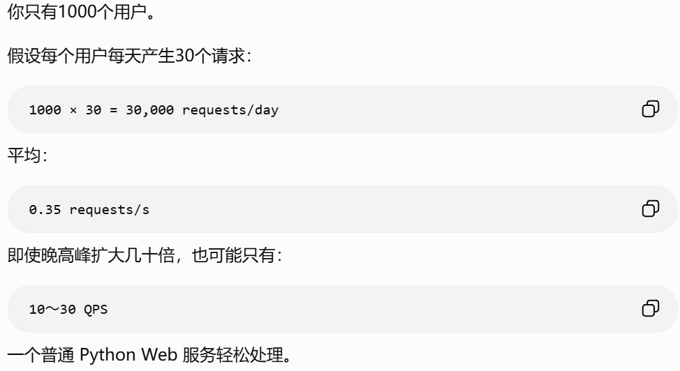

## DBMS年表
|   年份 | DBMS／节点                                                                                            | 类型与适用范围                           | 主要索引／存储结构                                 | 当前活跃度                 |
| -----: | ----------------------------------------------------------------------------------------------------- | ---------------------------------------- | -------------------------------------------------- | -------------------------- |
| 约1963 | [IDS](https://computerhistory.org/profile/charles-w-bachman/)                                         | 早期网状数据库；大型机、制造业数据处理   | 指针链、记录集合、导航式访问                       | △ 历史                     |
|   1968 | [IBM IMS](https://www.ibm.com/history/information-management-system)                                  | 层次数据库；银行、电信、大型机高可靠事务 | 层次树、路径访问、二级索引                         | ◐ 仍在大型机核心系统中使用 |
|   1973 | Ingres                                                                                                | 研究型关系库，后来商业化为 Actian X      | ISAM、B-tree、Hash                                 | ◐ 稳定、小众               |
|   1975 | IBM System R                                                                                          | 研究型关系库；验证 SQL、查询优化器       | B-tree、基于代价的查询计划                         | △ 项目结束，影响深远       |
|   1979 | [Oracle V2](https://www.oracle.com/database/50-years-relational-database/)                            | 首批商用 SQL RDBMS；企业 OLTP            | B-tree；后续加入 Bitmap、函数索引等                | 🔥 Oracle Database仍旺盛    |
|   1981 | IBM SQL/DS                                                                                            | IBM首个商用关系数据库产品；大型机        | B-tree                                             | △ 被后续产品继承           |
|   1983 | [IBM Db2](https://www.ibm.com/history/relational-database)                                            | 企业 OLTP、主机数据库、数据仓库          | B-tree；后续有列存储、分区和多维聚簇               | ● 活跃                     |
|   1984 | Teradata DBC/1012                                                                                     | MPP并行数据仓库、大规模分析              | Hash主索引、二级索引、Join Index                   | ● 成熟活跃                 |
|   1986 | [POSTGRES项目](https://www.postgresql.org/docs/current/history.html)                                  | 对象关系研究；PostgreSQL前身             | 可扩展索引、B-tree、R-tree等                       | △ 已演变为PostgreSQL       |
|   1987 | Sybase SQL Server／SAP ASE                                                                            | 客户端—服务器 OLTP；金融、电信           | 聚簇／非聚簇B-tree                                 | ◐ 稳定维护、市场收缩       |
|   1989 | [Microsoft SQL Server 1.0](https://learn.microsoft.com/en-us/shows/history/history-of-microsoft-1989) | 企业 OLTP、报表、微软技术栈              | 聚簇／非聚簇B-tree、列存、全文倒排                 | 🔥 旺盛                     |
|   1995 | [MySQL](https://dev.mysql.com/doc/refman/5.7/en/history.html)                                         | Web应用、中小型及大型 OLTP               | InnoDB聚簇B-tree、二级B-tree、全文倒排、空间R-tree | 🔥 旺盛                     |
|   1996 | [PostgreSQL](https://www.postgresql.org/docs/current/history.html)                                    | 通用关系库；复杂 SQL、GIS、扩展开发      | B-tree、Hash、GiST、SP-GiST、GIN、BRIN             | 🔥 旺盛                     |

20年之后:

|     年份 | DBMS                                                                                                          | 类型与适用范围                               | 主要索引／存储结构                                 | 当前活跃度            |
| -------: | ------------------------------------------------------------------------------------------------------------- | -------------------------------------------- | -------------------------------------------------- | --------------------- |
|     2000 | [SQLite](https://sqlite.org/hctree/dir?ci=e651ea3110aa726e)                                                   | 嵌入式关系库；手机、桌面软件、单机服务       | B-tree、FTS倒排、R-tree                            | 🔥 极其活跃、应用极广  |
|     2005 | Apache CouchDB                                                                                                | 文档数据库；离线同步、HTTP应用               | 追加式B-tree、MapReduce视图索引                    | ◐ 稳定                |
|     2007 | Apache HBase                                                                                                  | 宽列数据库；Hadoop生态、海量稀疏数据         | LSM、MemStore、HFile、Bloom Filter                 | ● 成熟活跃            |
|     2008 | Apache Cassandra                                                                                              | 宽列分布式库；高写入、多地域、高可用         | LSM、MemTable、SSTable、Bloom、SAI/Trie            | ● 活跃                |
|     2009 | [MongoDB](https://www.mongodb.com/company/our-story)                                                          | 文档数据库；内容、产品目录、快速迭代应用     | B-tree、文本倒排、地理与向量索引                   | 🔥 旺盛                |
|     2009 | [Redis](https://redis.io/blog/redis-then-and-now-adapting-with-developers-through-every-era/)                 | 内存键值／数据结构库；缓存、会话、排行榜     | Hash表、跳表、Radix Tree；搜索模块含倒排/HNSW      | 🔥 Redis与Valkey双生态 |
|     2009 | [MariaDB](https://mariadb.org/en/)                                                                            | MySQL分支；Web OLTP、MySQL替代               | InnoDB系B-tree、全文、空间索引                     | ● 活跃                |
|     2010 | [Neo4j 1.0](https://neo4j.com/blog/news/neo4j-1-0-released/)                                                  | 图数据库；关系网络、风控、知识图谱           | 原生图邻接；Range、全文、Point、Vector索引         | ● 活跃                |
|     2010 | [Elasticsearch](https://www.elastic.co/blog/licensing-change)                                                 | 搜索与分析；日志、全文检索、可观测性         | Lucene倒排、BKD Tree、Doc Values、HNSW             | 🔥 旺盛                |
|     2010 | [OceanBase项目](https://oceanbase.github.io/)                                                                 | 分布式关系库；金融、电商、HTAP               | LSM、MemTable、SSTable、Bloom Filter               | ● 成熟活跃            |
|     2011 | SAP HANA 1.0                                                                                                  | 内存列式数据库；ERP、实时分析、HTAP          | 字典编码列存、倒排和值索引                         | ● 活跃                |
|     2012 | Amazon DynamoDB                                                                                               | 托管键值／文档库；Serverless、高并发服务     | 分区键、排序键、GSI、LSI；底层实现不公开           | 🔥 旺盛                |
|     2012 | Snowflake项目                                                                                                 | 云数据仓库；BI、数据共享、弹性分析           | 微分区元数据裁剪、聚簇键、Search Access Path       | 🔥 旺盛                |
|     2013 | InfluxDB                                                                                                      | 时序数据库；监控、IoT、指标                  | TSM/TSI；新架构转向Parquet及列统计                 | ● 活跃、架构换代中    |
|     2013 | FoundationDB                                                                                                  | 有序分布式KV；作为其他数据库的事务底座       | 有序键区间；Redwood B-tree等，存储引擎持续演进     | ● 活跃但偏基础设施    |
|     2016 | [ClickHouse开源](https://clickhouse.com/blog/open-source-10)                                                  | 列式 OLAP；日志、实时分析、可观测性          | 稀疏主索引、MinMax、Bloom、跳数索引、倒排/向量索引 | 🔥 旺盛                |
|     2017 | [Apache Doris开源](https://doris.apache.org/docs/3.x/gettingStarted/what-is-apache-doris/)                    | MPP实时分析、数据仓库、湖仓查询              | Prefix、ZoneMap、Bloom、倒排、Bitmap               | 🔥 旺盛                |
|     2017 | [Google Cloud Spanner GA](https://cloud.google.com/blog/products/gcp/cloud-natural-language-api-enters-beta/) | 全球分布式关系库；强一致、多地域 OLTP        | 有序主键区间、二级索引；内部结构专有               | ● 活跃                |
|     2017 | [CockroachDB 1.0](https://www.cockroachlabs.com/blog/cockroachdb-1-0-release/)                                | 分布式 SQL；跨地域、云原生 OLTP              | Pebble LSM、MVCC、逻辑二级及倒排索引               | ● 活跃                |
|     2017 | [TiDB 1.0](https://docs.pingcap.com/tidb/stable/release-1.0-ga/)                                              | MySQL兼容分布式 SQL、HTAP                    | TiKV/RocksDB LSM、KV编码二级索引、TiFlash列存      | ● 活跃                |
|     2018 | [YugabyteDB 1.0](https://www.yugabyte.com/blog/announcing-yugabyte-db-1-0/)                                   | PostgreSQL兼容分布式 SQL、多地域事务         | DocDB/RocksDB LSM、分布式二级索引                  | ● 活跃                |
| 2018／19 | [DuckDB](https://duckdb.org/history/)                                                                         | 嵌入式 OLAP；本地数据分析、Parquet、Python/R | 自动Zone Map、ART自适应基数树                      | 🔥 2020年代增长极快    |
|     2019 | [Milvus开源](https://milvus.io/blog/journey-to-35k-github-stars-story-of-building-milvus-from-scratch.md)     | 分布式向量数据库；推荐、图像和RAG检索        | IVF、HNSW、DiskANN、PQ/SQ量化                      | 🔥 旺盛                |

## 数据结构
学习数据库最重要的其实是用来构造索引的数据结构,而至于底层的详细存储形式我们不是很有必要了解,不仅是因为非常枯燥,而且就算这一块出了问题我们也解决不了,但索引不一样,索引构造得当可以大幅度加快查询/更新的速率.

常见的数据结构有以下几种,按照出现的时间顺序排列:
1. 倒排索引,不是记录“每篇文档有哪些词”，而是记录“每个词出现在哪些文档里”: Lucene及Elasticsearch
2. 哈希表: Redis
3. B树,和B-树是一个东西,英文名是`B-tree`,至于为什么有些人叫做`B减树`我就不理解了,这也给我一开始学习的时候带来了一点误导: Oracle,SQLite,MongoDB,MySQL,这些常用的数据库都使用B树或者B+树(用的更多)来作为索引
4. 跳表: Redis ZSet,LevelDB
5. LSM树: LevelDB

上面5种可以涵盖所有的常见数据库.

## 数据存储
使用数据库的时候我们都很好奇,数据都存在了哪里呢,这主要有两种情况:
1. 用一个特殊格式的文件存储在操作系统的文件系统中,这是绝大部分数据库的做法(从SQLite到Elasticsearch都是如此),如此一来,需要获取数据时就要通过文件系统的接口来实现I/O
2. 把数据直接放在内存中,从而摆脱了每次查询都要读取磁盘的麻烦,如Redis和Memcached

至于那些云服务器或者分布式数据库,自然都是存在远程服务器的硬盘之中.
## 心得
### 数据库架构问题(26/8/18)
DBMS的诞生是程序员的福音,但也是各类生产事故的来源,从早期的关系数据库,迈步到MongoDB等文档数据库,再到焕发新生的NoSQL数据库,数据库的架构一直在演进,但我们却始终找不到一个可靠的方案去一次性解决所有的问题,我们只有一个万无一失的口诀: `It depends`.

不过,我们还是要思考一下,为什么数据库架构会这么难处理:

1. 对于初创公司来说,光是配置一个云服务器就够了,毕竟几千几万的用户量也不太需要有什么额外的考量.至于选什么数据库倒是无所谓,看你主要存储的数据类型就行了.



2. 当用户增长到百万级之后,光是一个服务器就不够用了,这时候你可能说,那我们可以把数据拆分后放到多个数据库中,这时候就有个非常关键的问题了,如果还用的是关系型数据库,一般来说用SQL的话只能对单个数据库起作用,一个容易想到的方法是在后端中通过条件判断来分流,将1-100万的用户id分配到第一个数据库里,依次类推,当然,更好的方法是将不同类型的数据分到各个数据库中,这样操作起来也更有针对性
3. 显然,这种硬编码维护起来非常麻烦,用起来也有问题,当我想要一次性获取所有用户的信息用于数据统计时,这又该怎么办?只能单独写一个函数去逐个遍历所有数据库了吧.
4. 但是这又有一个问题,数据库分流后不可避免地会拖慢查询速度,毕竟大多数流量都来自于`Select`请求而非`Update Table`请求,这样一来,我们必须在数据库前面套一层Redis缓存,存储先前传来的完全相同的请求结果.
5. 如此一来又引入了缓存一致性问题,当你更新数据库的时候如果没能更新缓存的话,用户获取的就仍然是旧的数据,这在很多时候都会有灾难性的影响,特别是转账等常见的交易环节.

这一过程可以不断递推下去,每次的扩展都会引入新的问题,可以说永远不会完结,这不像房地产行业,交付了新房后直接走人即可,将维护问题丢给物业,而是需要持续不断地调整架构,**软件工程永远都是进行时**

### 数据库原理(9/7)
考虑一下,从存储数据到执行查询时返回数据,到底发生了什么?

对于绝大部分的DBMS来说,数据都是存储在磁盘中的,每个DBMS都会设计出一种独特的文件格式,用来存储数据表的结构和用户数据.至于具体是什么格式,就得详细去学习了

SQL指令由DBMS的查询引擎负责执行,先经过一些初步的优化,比如调整指令顺序,简化外连接等.如果我们的指令是涉及所有用户的,那么无论怎么优化都还是快不起来,毕竟数据量有这么大,都需要从头到尾扫描一遍.

但99.999%的情况都是执行特定用户的查询,比如访问用户主页,获取好友关系,这些指令只需要找到特定的那个用户就可以了如执行`select * from user where user.name == "Mike Junior"`,这种命令还从头到尾扫描一遍也太蠢了,好在所有的DBMS都支持对数据库建立索引(index),索引一般为B+树,LSM树等结构,可以在极短的时间内确定对应用户所在的磁盘区块位置,接着返回结果.

>如果是聚簇索引(可以理解为主键索引),那么上述过程是没问题的,但如果是二级索引(辅助索引),那么这个索引只是存储了对应的主键位置(通常是id),查询引擎还需要在去查询一遍id列才能找到真正的磁盘位置,这被称为回表.

上述的过程仅仅是在DBMS上执行SQL指令的流程,但我们的应用程序都是间接执行SQL指令的,无论是ORM还是`Raw SQL`,终归是要先连接(connect)到DBMS,将SQL指令传输给DBMS执行,至于怎么连接的,尽管可以分为本地连接和远程连接两种,但实质上基本都是通过TCP连接到DBMS的,应用程序会连接到DBMS开放的URL端口上,如PostgreSQL中的网址格式为:
```toml
DATABASE_URL = postgresql://postgres:123456@db:5432/app
```
上述格式拆解如下:
```toml
POSTGRES_SERVER=db
POSTGRES_PORT=5432
POSTGRES_DB=app
POSTGRES_USER=postgres
POSTGRES_PASSWORD=123456
```

即:
```text
postgresql://用户名:密码@服务器地址:端口/数据库名
             │     │       │       │       │
          postgres 123456   db     5432  my_chat_db
```

