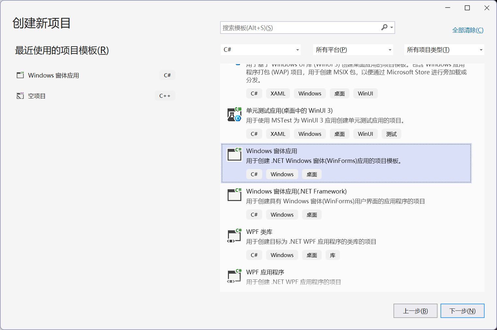
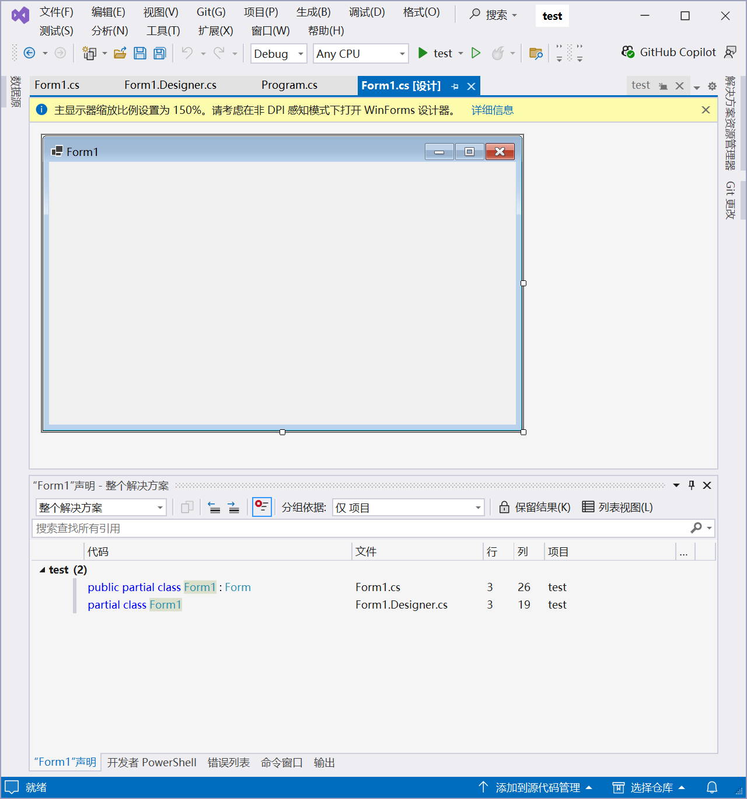

>[!TIP]
>曾经我在给每个编程语言都写了几万字的笔记,后来发现基本全是废话,没有什么可读性,远不如专业技术书籍来得有用,真遇到不会的了,也不如查AI来的快,所以,我现在只会放自己的心得了.

## Python
### 搭建GPU环境
先在nvidia官网下载cuda13.0,然后根据这个toml运行uv sync即可:
```toml
[project]
name = "ml"
version = "0.1.0"
description = "Add your description here"
readme = "README.md"
requires-Python = ">=3.13"
dependencies = [
    "torch",
    "torchvision",
    "torchaudio",
]

[tool.uv]
# 1. 物理定义 PyTorch 的专用硬件加速索引库
[tool.uv.index]
name = "pytorch-cu130"
url = "https://download.pytorch.org/whl/cu130"
explicit = true # 强制：只有在 sources 中明确指定的包才去这里找，防止污染其他依赖

[tool.uv.sources]
# 2. 将核心组件物理绑定到上述索引
torch = { index = "pytorch-cu130" }
torchvision = { index = "pytorch-cu130" }
torchaudio = { index = "pytorch-cu130" }
```

测试代码:
```py
import torch
print(f"CUDA status: {torch.cuda.is_available()}")
print(f"CUDA version: {torch.version.cuda}")
```
输出结果:
```bash
uv run ch1.py
CUDA status: True
CUDA version: 13.0
```

## Golang
## Java
### Java历史
- [wiki](https://en.wikipedia.org/wiki/Java_(programming_language))

Java由Sun公司于1995年发布,出于营销的目的,将Java分成了三个主要版本: 
1. Java Platform, Micro Edition(Java ME): 用于嵌入式等内存有限的环境
2. Java Platform, Standard Edition (Java SE): 标准版本
3. Java Platform, Enterprise Edition (Java EE): 企业版本

简单来说,就是包含的库上有一些区别而已,其他的差别并不大.

由于Java依靠JVM运行,而早期的JVM是不开源的,所以引发了很多争议和诉讼案件,也是微软自己开发C#语言(与Java高度相似)的原因.

07年的时候,JVM的所有核心代码都正式开源,从而诞生了大量的第三方JDK,最著名的就是OpenJDK了,不管如何,现在我们可以随便下载JDK而不用担心被诉讼了.

10年Oracle收购Sun后,Java的所有权转入了Oracle公司,之后Java的演进速度趋于稳定,现在的Java SE是半年更新一版,迭代速度还是很快的.
### Spring环境配置
- [vscode配置教程](https://vscode.github.net.cn/docs/java/java-spring-boot)
  - 网上能见到的教程要么用IntelliJ IDEA,要么用Spring Boot CLI,这让我一个VSCode的死忠粉很崩溃啊

如官网所说,要在VSCode中开发Spring Boot,需要安装JDK,VSCode中的Java扩展,(Gradle扩展)和Spring Boot扩展,其中Spring Boot扩展包的内容如下,一下子就会导入四个扩展:


要想新建一个初始化的Spring Boot项目的话,直接按`Ctrl+Shift+P`并键入`Spring Initializr`,选择自己想要的模板即可,如果全部按照默认设置的话,最终生成的项目是这样的:


- 不过,使用`gradle init`也可以实现差不多的效果,只不过可能没有这种图形化界面的选择直观了.
- 另一个方法是直接去SPring的官网下载初始化项目,下载得到的项目是完全一样的

>不过,等待项目的各种依赖就绪要很久,应该说这是Java项目的通病了

在扩展栏中多了一个Spring Boot Dashboard工具,点开后运行APPs中的app即可,不出意外的话终端会有如下输出:


当然,如果直接拿一个现成的Spring Boot项目来看的话,根本无从下手,所以需要好好了解Spring的基本知识和Spring Boot对它的改进.

>[!NOTE]
>(26/8/25)突然发现我之前还是太蠢了,直接看现成项目才是学习Spring Boot的王道,扯什么IoC,依赖注入,一点用都没有,毕竟无论是什么语言,什么框架,一旦涉及了CRUD,就几乎没有什么太大的架构差别.
## Cpp
### struct/class全解(9/8)
Cpp中struct和class的区别比我想的还要小很多,它们都有访问控制符,有构造和析构函数,支持`->`访问符,唯一的区别在于,struct的默认成员权限为public,而class的默认成员权限为private.

如此也看得出来,class完完全全就是struct的套皮而已.如此一来,我们完全不需要因为Go和Rust中没有class而难受,毕竟二者实际上并没有什么区别.

### const问题(9/8)
C/Cpp中最容易让人迷糊的就是指针了,但当指针和const混在一起时,这才是噩梦的开始

先放出列表:
| 声明                  | 更准确的名称       | 指针指向能否改变 | 指向的值能否通过该指针修改 |
| --------------------- | ------------------ | ---------------: | -------------------------: |
| `const int *p`        | 指向常量的指针     |             可以 |                     不可以 |
| `int const *p`        | 指向常量的指针     |             可以 |                     不可以 |
| `int * const p`       | 指针常量 / 常指针  |           不可以 |                       可以 |
| `const int * const p` | 指向常量的指针常量 |           不可以 |                     不可以 |

#### 指向常量的指针

其中,下面两个式子完全等价:
```c
const int *p;
int const *p;
```
至于为什么如此,对于`int const *p;`,显然不存在一个指向const的指针,所以这个指针只能是指向int,而const自然就是修饰int的了,所以叫做指向常量int的指针.

尽管如此,这并不意味着对象真的是常量,而是表示**p以为自己指向的是常量**,所以无法通过p修改指向的对象,但对象本身可以是变量:
```c
int a = 10;
const int *p = &a;

a = 20;     // 正确：a本身不是常量
*p = 20;    // 错误：不能通过p修改a
```
#### 指针常量
既然这个指针是常量,也就不可以修改存储的地址了,但仍然可以修改指向对象的值,用处并不大,一个引用就可以完全代替了.
#### 指向常量的指针常量
双重const,额,根本看不出有什么好的用法.

#### 总结
如上所示,这几个概念屁用没有,可惜的是面试总喜欢考这个,莫名其妙的.
## Rust
### 优秀的Github仓库
1. [入门学习](https://github.com/rust-lang/rustling): 非常NB的交互式学习!
2. [中文教程](https://beatai.org/rust-course/basic/)
3. [链表入门](https://rust-unofficial.github.io/too-many-lists/)
4. [mini-redis](https://github.com/tokio-rs/mini-redis/tree/master)
5. [pingcap](https://github.com/pingcap/talent-plan)

## CS
### 环境配置

#### .NET编译器介绍
- [wiki](https://en.wikipedia.org/wiki/.NET)
##### 是什么,有什么用
.NET是微软发布的开源编译器,支持C#,F#和Visual Basic开发,类似于Java中的JDK和Cpp中的MSVC,至于为什么叫.NET,只不过是微软糟糕的命名品味(.net=>.NET)而已.

- Windows的PowerShell,Visual Studio均基于.NET构建,Unity也需要.NET环境来解释C#脚本
##### .NET历史
* **2000年 - 2002年：诞生与标准化**
    微软在 PDC 2000 会议上公布 C# 语言，并随后将 **CLI (公共语言基础设施)** 提交 ECMA 进行标准化。2002 年，**.NET Framework 1.0** 正式发布，确立了基于虚拟运行时的受控代码开发模式。

* **2014年：开源与跨平台转型**
    11 月 12 日，微软宣布启动 **.NET Core** 项目。这是一个完全重构的开源、跨平台版本，旨在摆脱对 Windows 操作系统的绑定，并成立了 **.NET Foundation** 负责社区化运营。

* **2016年 - 2017年：.NET Core 初期**
    2016 年 6 月，**.NET Core 1.0** 发布，正式实现 Linux 和 macOS 运行能力。2017 年发布的 **.NET Core 2.0** 引入了 **.NET Standard 2.0**，统一了 API 规范，解决了新旧平台间的代码兼容难题。

* **2019年：桌面支持与成熟**
    **.NET Core 3.0** 发布。该版本最显著的变化是支持 WPF 和 WinForms 桌面应用在 Core 环境下运行，性能相比旧版 Framework 大幅提升。

* **2020年：架构大统一 (.NET 5)**
    微软跳过版本号 4.0 并移除了 "Core" 后缀，发布 **.NET 5**。此举标志着 .NET Framework（旧版）和 .NET Core（新版）合二为一，成为未来唯一的 .NET 演进路径。

* **2021年 - 2023年：LTS 演进 (.NET 6 - .NET 8)**
    **.NET 6** (2021) 确立了 3 年期的长期支持 (LTS) 模式。**.NET 8** (2023) 作为目前的核心 LTS 版本，引入了 **Native AOT** 编译技术，极大优化了云原生场景下的启动速度。

* **2024年 - 2026年：现代版本与 AI 集成**
    **.NET 9** (2024) 重点增强了 AI 扩展能力和运行时效率。目前最新的 **.NET 10 (LTS)** 已于 2025 年 11 月发布，其支持周期将持续至 2028 年，成为当前企业级开发的基础版本。
##### Nuget
- [wiki](https://en.wikipedia.org/wiki/NuGet)
.NET的包管理器,被集成在.NET中,不需要单独下载即可直接调用
- 至于为什么叫Nuget,则又是微软的糟糕命名品味(new get=>nuget)了


#### 使用VS运行项目
1. 在创建新项目中选择语言为C#,找到被标记的这一栏


- 可以看到有两种C#窗体应用,第一种是我们要选择的.NET平台,第二个则是古老的.NET framework平台

1. 随便起个名字比如说`test`,选择默认的.NET 8.0(长期支持版本)
2. 在终端输入`cd test`: VS非常神奇的地方在于当你创建.NET项目时,VS会创建一个同名子文件夹来存放项目
   1. 也就是说,所有的东西和.NET依赖并不在根目录,而是会在test子文件夹中,所以这里我们需要`cd test`
3. 再输入上述的命令行安装链接,安装之后按一下f5,成功弹出来一个空白的窗口
4. 但是现在我们打开解决方案资源管理器后,点击里面的Form1.cs,弹出来的是一个空白窗口,右键该界面的空白处或者右键Form1.cs即可查看代码...



#### 使用VScode运行项目
没有人喜欢用VS来开发,所以我们可以通过终端来初始化和运行C#项目:
1. 创建一个项目后在终端输入`dotnet new`,提示你可以创建以下项目,这正好对应了之前VS中的创建项目方式:
```bash
“dotnet new”命令基于模板创建 .NET 项目。

常用模板包括:
模板名            短名称    语言        标记
----------------  --------  ----------  ----------------------
Blazor Web 应用   blazor    [C#]        Web/Blazor/WebAssembly
Windows 窗体应用  winforms  [C#],VB     Common/WinForms
WPF 应用程序      wpf       [C#],VB     Common/WPF
控制台应用        console   [C#],F#,VB  Common/Console
类库              classlib  [C#],F#,VB  Common/Library
```
2. 再输入`dotnet run`即可运行项目,实现与VS中相同的效果
3. 但要在VScode中进行C#和Oracle开发的话我们还需要下载.NET相关的插件以及`Oracle SQL Developer Extension for VSCode`,然后就可以用VScode开始开发了
