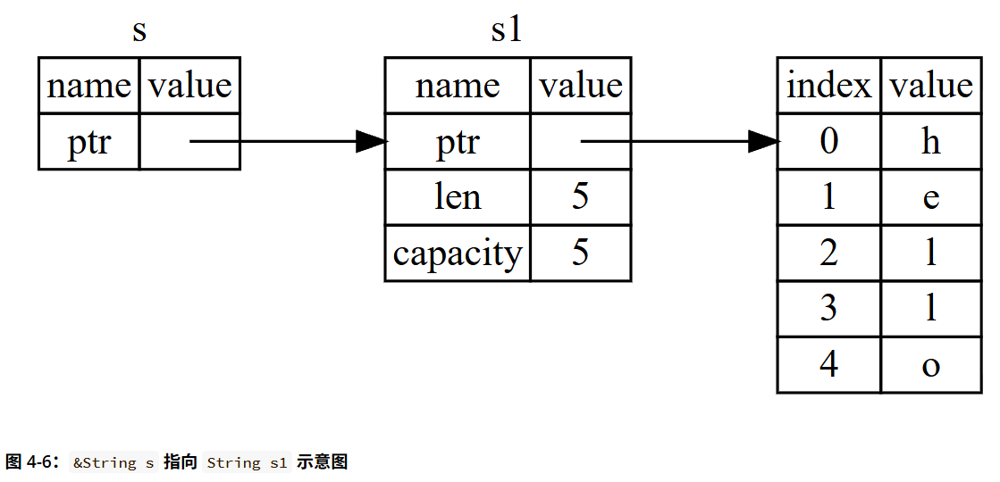
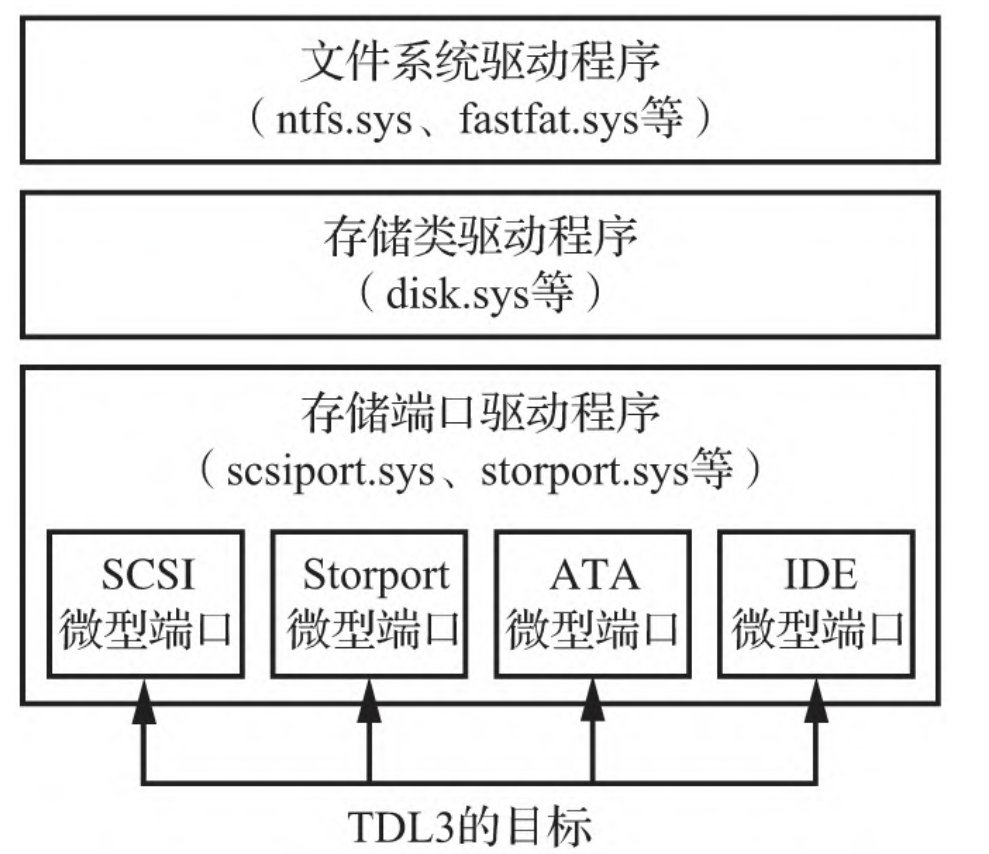
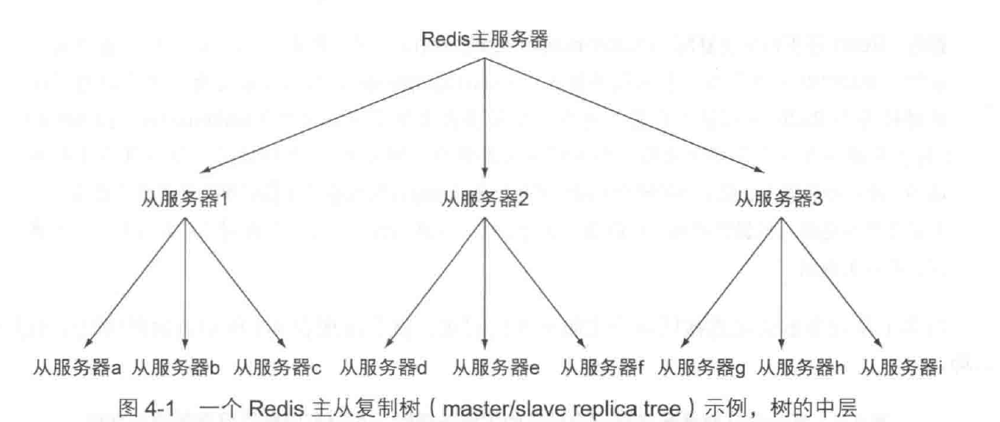
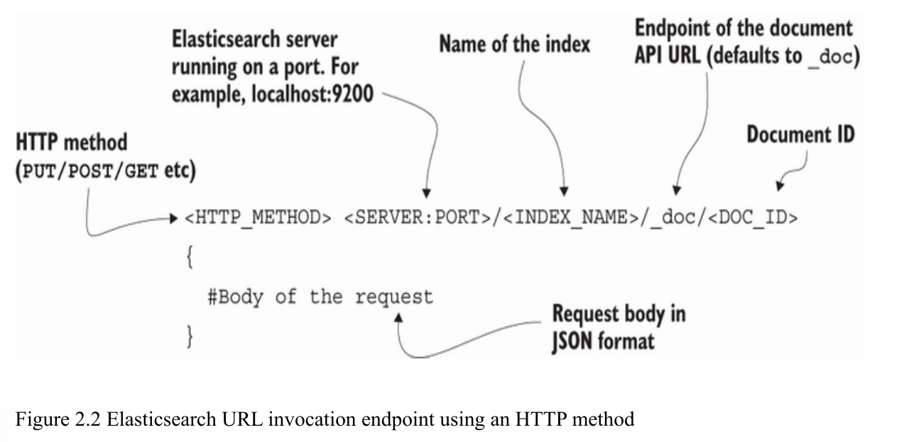
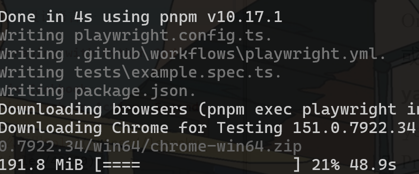
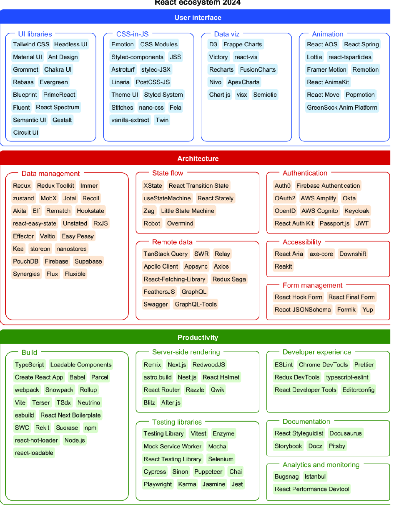
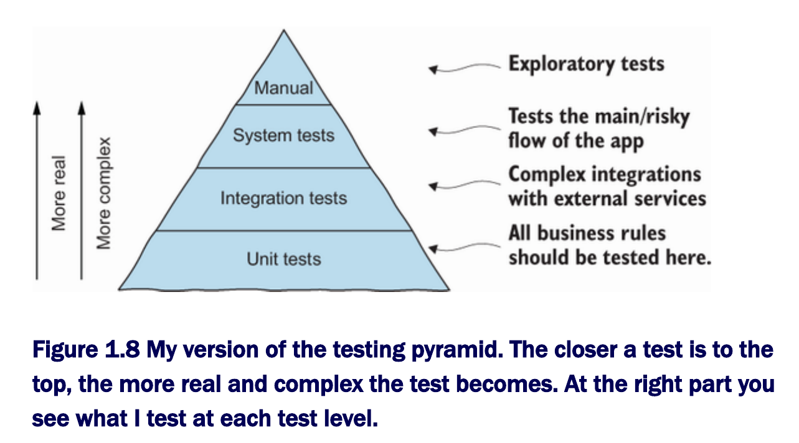
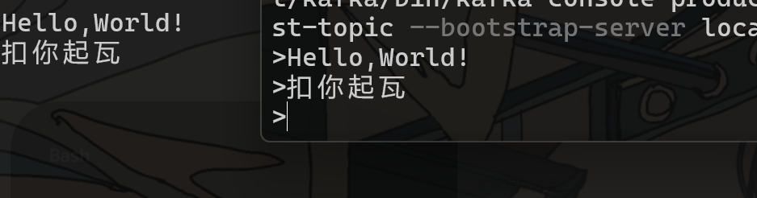
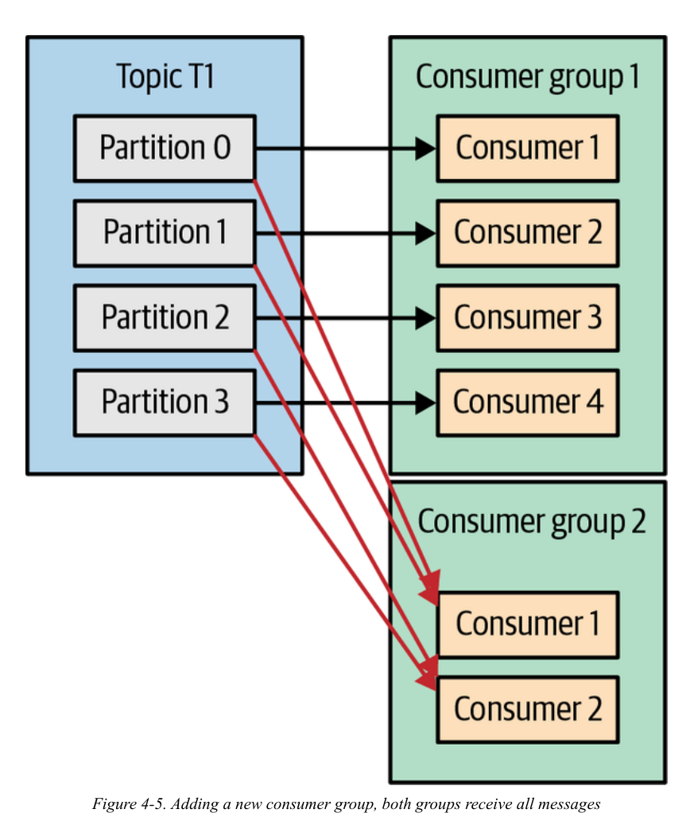

# Rust程序设计语言
- 由浅入深,这才是正常的教科书,不吊打Go圣经几条街.

## 基础
### 变量与常量
1. rust中变量用`let`声明,可以隐式推导类型,但默认为不可变的,即初始化后就不可改变,如果想要让它可变,则要加上mut修饰符,如:

```rs
fn main() {
    let x = 5;
    println!("The value of x is: {x}");
    x = 6;
    println!("The value of x is: {x}");
}
```
>Rust 编译器保证，如果声明一个值不会变，它就真的不会变，所以你不必自己跟踪它。这意味着你的代码更易于推导。

rust中有一个神奇的语法叫做遮蔽(shadowing),当你第二次用`let`声明同一个变量时,就可以覆盖该变量,这可以在同一个作用域中进行,因此与cpp的规则不太一样.


2. 常量用`const`声明,不可加上`mut`修饰,永远不可变,声明时必须要有类型注释(这比隐式推导的Go要好上不少).

```rs
const THREE_HOURS_IN_SECONDS: u32 = 60 * 60 * 3;
```
### 复合类型
1. 元组(tuple): 大致与python中tuple没有什么区别,一旦声明，它的大小就不能增长或缩小:

```rs
fn main() {
    let tup: (i32, f64, u8) = (500, 6.4, 1);
}
// another file
fn main() {
    let tup = (500, 6.4, 1);

    let (x, y, z) = tup;

    println!("The value of y is: {y}");
}
```

2. 数组(array): rust的数组长度是固定的,每个元素必须有相同类型.另一个支持的数组类型则是vector,可变长度,与cpp的vector相似.

```rs
let a: [i32; 5] = [1, 2, 3, 4, 5];
```

### 函数
>Rust 代码中的函数名和变量名通常使用 snake case 风格。在 snake case 中，所有字母都使用小写，并用下划线分隔单词

rust中**语句**是一类没有分号的表达式.

函数可以把值返回给调用它的代码。我们不会给返回值命名，但必须在箭头（->）后面声明它的类型。在 Rust 中，函数的返回值等同于函数体中最后一个表达式的值。你也可以使用 return 关键字并指定一个值，从函数中提前返回；不过大多数函数都会隐式返回最后一个表达式的值。下面是一个带有返回值的函数示例：
```rs
fn five() -> i32 {
    5
}

fn main() {
    let x = five();

    println!("The value of x is: {x}");
}
```
### 控制流
>与Go一样,rust中的if表达式中的条件必须是bool值,不允许隐式的类型转换,否则会报错,使用的仍然是C系的`else if`写法.

Rust 有三种循环：loop、while 和 for:
1. loop 关键字告诉 Rust 反复执行一段代码，要么永远执行下去，要么直到你明确要求它停止。

rust一个比较神奇的地方是可以把控制流赋值给变量:

```rs
fn main() {
    let mut counter = 0;

    let result = loop {
        counter += 1;

        if counter == 10 {
            break counter * 2;
        }
    };

    println!("The result is {result}");
}
```

loop还可以带有标签,这类似于c中的label关键字:
```rs
fn main() {
    let mut count = 0;
    'counting_up: loop {
        println!("count = {count}");
        let mut remaining = 10;

        loop {
            println!("remaining = {remaining}");
            if remaining == 9 {
                break;
            }
            if count == 2 {
                break 'counting_up;
            }
            remaining -= 1;
        }

        count += 1;
    }
    println!("End count = {count}");
}
```
- 与label的待遇一样,正常的代码里是不应该有loop出现的

2. while关键字则为正常的写法:
```rs
fn main() {
    let a = [10, 20, 30, 40, 50];
    let mut index = 0;

    while index < 5 {
        println!("the value is: {}", a[index]);

        index += 1;
    }
}
```
3. for用于遍历容器:
```rs
fn main() {
    let a = [10, 20, 30, 40, 50];

    for element in a {
        println!("the value is: {element}");
    }
}
```
### 所有权（ownership）
>所有程序都必须管理其运行时使用计算机内存的方式。一些语言中具有垃圾回收机制，在程序运行时有规律地寻找不再使用的内存；在另一些语言中，程序员必须亲自分配和释放内存。Rust 则选择了第三种方式：通过所有权系统管理内存，编译器在编译时会根据一系列的规则进行检查。

首先，让我们看一下所有权的规则:
1. Rust 中的每一个值都有一个 所有者（owner）。
2. 值在任一时刻有且只有一个所有者。
3. 当所有者离开作用域，这个值将被丢弃。

```rs
    {
        let s = String::from("hello"); // 从此处起，s 是有效的

        // 使用 s
    }                                  // 此作用域已结束，
                                       // s 不再有效

```

当 s 离开作用域的时候。当变量离开作用域，Rust 为我们调用一个特殊的函数。这个函数叫做 drop，在这里 String 的作者可以放置释放内存的代码。Rust 在结尾的 `}` 处自动调用 drop。

当你给一个已有的变量赋一个全新的值时，Rust 将会立即调用 drop 并释放原始值的内存
```rs
    let s1 = String::from("hello");
    let s2 = s1;
```
当 s2 和 s1 离开作用域，它们都会尝试释放相同的内存。这是一个叫做 二次释放（double free）的错误，也是之前提到过的内存安全性 bug 之一。两次释放（相同）内存会导致内存污染，它可能会导致潜在的安全漏洞。

为了确保内存安全，在 let s2 = s1; 之后，Rust 认为 s1 不再有效，因此 Rust 不需要在 s1 离开作用域后清理任何东西

- 这种语法相当独特,不过确实很合理,正常情况下不应该在同一个作用域中出现两个相同的指针变量.


```rs
fn main() {
    let s = String::from("hello");  // s 进入作用域

    takes_ownership(s);             // s 的值移动到函数里 ...
                                    // ... 所以到这里不再有效

    let x = 5;                      // x 进入作用域

    makes_copy(x);                  // x 应该移动函数里，
                                    // 但 i32 是 Copy 的，
    println!("{}", x);              // 所以在后面可继续使用 x

} // 这里，x 先移出了作用域，然后是 s。但因为 s 的值已被移走，
  // 没有特殊之处

fn takes_ownership(some_string: String) { // some_string 进入作用域
    println!("{some_string}");
} // 这里，some_string 移出作用域并调用 `drop` 方法。
  // 占用的内存被释放

fn makes_copy(some_integer: i32) { // some_integer 进入作用域
    println!("{some_integer}");
} // 这里，some_integer 移出作用域。没有特殊之处
```
调用一次无返回值的函数`takes_ownership`后,s就被置为无效了,这确实是我闻所未闻的语法,不过另一方面,这确实很合理,正常编写代码的时候不会这样写的.

```rs
fn main() {
    let s1 = gives_ownership();        // gives_ownership 将它的返回值传递给 s1

    let s2 = String::from("hello");    // s2 进入作用域

    let s3 = takes_and_gives_back(s2); // s2 被传入 takes_and_gives_back, 
                                       // 它的返回值又传递给 s3
} // 此处，s3 移出作用域并被丢弃。s2 被 move，所以无事发生
  // s1 移出作用域并被丢弃

fn gives_ownership() -> String {       // gives_ownership 将会把返回值传入
                                       // 调用它的函数

    let some_string = String::from("yours"); // some_string 进入作用域

    some_string                        // 返回 some_string 并将其移至调用函数
}

// 该函数将传入字符串并返回该值
fn takes_and_gives_back(a_string: String) -> String {
    // a_string 进入作用域

    a_string  // 返回 a_string 并移出给调用的函数
}
```
如果不显式返回所有权,那么就说明这个变量不再有用,那么直接收回确实很合理.

### reference and borrow
```rs
fn main() {
    let s1 = String::from("hello");

    let len = calculate_length(&s1);

    println!("The length of '{s1}' is {len}.");
}

fn calculate_length(s: &String) -> usize {
    s.len()
}
```
& 符号表示 引用；它们让你引用某个值而不取得它的所有权,我们将创建一个引用的行为称为 **借用（borrowing）**。正如现实生活中，如果一个人拥有某样东西，你可以从他那里借来。当你使用完后，必须还回去。因为我们并不拥有它的所有权。



既然是借用,那么我们自然不能损坏它,所以引用变量均无法修改:
```rs
fn main() {
    let s = String::from("hello");

    change(&s);
}

fn change(some_string: &String) {
    some_string.push_str(", world");
    // failed!
}
```

如果要想修改借用的值,就要加上`mut`关键字,这被称为可变引用:
```rs
fn main() {
    let mut s = String::from("hello");

    change(&mut s);
}

fn change(some_string: &mut String) {
    some_string.push_str(", world");
}
```
可变引用有一个很大的限制：在同一个作用域内,如果你有一个对该变量的可变引用，你就不能再创建对该变量的引用。这些尝试创建两个 s 的可变引用的代码会失败：
```rs
    let mut s = String::from("hello");

    let r1 = &mut s;
    let r2 = &mut s;

    println!("{r1}, {r2}");
```

我们也不能在拥有不可变引用的同时拥有可变引用,因为不可变引用的借用者可不希望在借用时值会突然发生改变！
```rs
    let mut s = String::from("hello");

    let r1 = &s; // 没问题
    let r2 = &s; // 没问题
    let r3 = &mut s; // 大问题

    println!("{r1}, {r2}, and {r3}");
```

>在带有指针的语言中，如果释放了一块内存，却保留了指向它的指针，就很容易错误地制造出一个悬垂指针（dangling pointer）：这个指针指向的内存位置可能已经被分配作其他用途。相比之下，在 Rust 中，编译器保证引用永远不会变成悬垂引用：如果你持有某些数据的引用，编译器会确保这些数据不会在它们的引用之前离开作用域。


# THE GHIDRA BOOK
# Web Scraping with Python,3rd edition
# Go Web Scraping Quick Start Guide

# GraphQL in Action
# Rootkit和Bootkit：现代恶意软件逆向分析和下一代威胁
Rootkit: 针对操作系统内核
Bootkit: 针对MBR等引导扇区
## Rootkit
### TDL3
为了在系统重新启动时幸存下来，TDL3通过在驱动程序的二进制文件中注入恶意代码来感染加载操作系统所必需的一个引导启动驱动程序.

一旦选择了一个目标驱动程序，TDL3感染程序就会用一个恶意加载程序覆盖它的资源部分.rsrc的前几百个字节，从而修改驱动程序在内存中的映像。这个加载程序非常简单：它只是在启动时从硬盘上加载它需要的其余恶意软件代码。

这种方式只能针对x32位系统起作用,因为x64位系统需要对内核代码进行完整性的检查,通过数字签名即可阻止TDL3的运行.



>TDL3是第一个将配置文件和有效负载存储在目标系统隐藏的加密存储区域的恶意软件系统，不依赖于操作系统提供的文件系统服务。

### Festi
>本章专门讨论发现的最先进的垃圾邮件和分布式拒绝服务
（DDoS）僵尸网络之一—Win32/Festi僵尸网络，我们将其简称为Festi。Festi拥有强大的垃圾邮件发送和DDoS功能，以及有趣的Rootkit功能，这使得它可以连接到文件系统和系统注册表而不被人发现。Festi还通过使用调试器和沙箱规避技术来对抗动态分析，以隐藏自己的存在。

Festi的Dropper（植入程序）有一个相当简单的功能—在系统中安装一个内核模式驱动程序，该驱动程序实现了恶意软件的主要逻辑。内核模式组件注册为“系统启动”内核模式驱动程序，并随机生成名称，这意味着在初始化期间，恶意驱动程序将在系统启动时加载和执行。

内核模式驱动程序有两个主要职责：从命令和控制（C&C）服务器请求配置信
息，以及以插件的形式下载和执行恶意模块（见图2-2）。每个插件专用于特定的任
务，例如对指定的网络资源执行DDoS攻击，或向C&C服务器提供的电子邮件列表发送
垃圾邮件。

有趣的是，插件并不存储在系统硬盘驱动器上，而是存储在易失性内存中，这意
味着当受感染的计算机被关闭或重新启动时，插件就会从系统内存中消失。这使得恶
意软件的取证分析变得非常困难，因为存储在硬盘上的唯一文件是主内核模式驱动程
序，它既不包含有效负载，也不包含攻击目标的任何信息。

## Bootkit
可以看到,由于操作系统的安全性能不断提高,Rootkit已经式微,随之而来的是更加深入底层的Bootkit类型软件.
# Responsive Web Design with HTML5 and CSS,Fourth Edition
# Mastering API Architecture
## 前言
>One of the hardest things to track during the life of a project is the motivation behind certain decisions. A new person coming on to a project may be perplexed, baffled, delighted, or infuriated by some past decision.

因此,我们需要通过ADR（Architecture Decision Record，架构决策记录）来保存架构设计时的各种考量
## Designing, Building, and Testing APIs
### gRPC与Rest
Rest基于HTTP1.1规范,而gRPC基于HTTP2.0,二者之间的一个关键区别在于状态,Rest是无状态的,而RPC的底层是持续连接,有状态的
# Python for Algorithmic Trading

# Data Storage Architectures and Technologies
# Redis in action
## 介绍
Redis有5种基础数据类型:
1. string: 支持字符串,整数和浮点数
2. list: 链表,每个节点包含一个元素,元素可重复
3. set: 无序的字符串集合,元素不可重复
4. hash: 哈希表,存储键值对
5. zset: 有序字典,存储键值对


string类型支持get,set,del三种方法:


list类型支持以下命令:
| 命令     | 行为                                     |
| -------- | ---------------------------------------- |
| `RPUSH`  | 将给定值推入列表的右端                   |
| `LRANGE` | 获取列表在给定范围上的所有值             |
| `LINDEX` | 获取列表在给定位置上的单个元素           |
| `LPOP`   | 从列表的左端弹出一个值，并返回被弹出的值 |

- 左右端都可以进行操作,前缀分别是`L`,`R`.

set类型支持`sadd`,`srem`等命令


## 数据存储
Redis有两种数据存储方式:
1. snapshot(快照): 将某一时刻内存中保存的所有数据写入硬盘
2. append-only file(AOF): 执行某条写入命令时,将指令复制到硬盘里.
### 复制(replication)
单个Redis节点无法应对高并发,所以我们需要用到主从服务器的配置,从服务器在连接主服务器的时候会发生以下过程:

| 步骤 | 主服务器操作                                                                            | 从服务器操作                                                                                               |
| ---- | --------------------------------------------------------------------------------------- | ---------------------------------------------------------------------------------------------------------- |
| 1    | （等待命令进入）                                                                        | 连接（或者重连接）主服务器，发送 `SYNC` 命令                                                               |
| 2    | 开始执行 `BGSAVE`，并使用缓冲区记录 `BGSAVE` 之后执行的所有写命令                       | 根据配置选项来决定是继续使用现有的数据（如果有的话）来处理客户端的命令请求，还是向发送请求的客户端返回错误 |
| 3    | `BGSAVE` 执行完毕，向从服务器发送快照文件，并在发送期间继续使用缓冲区记录被执行的写命令 | 丢弃所有旧数据（如果有的话），开始载入主服务器发来的快照文件                                               |
| 4    | 快照文件发送完毕，开始向从服务器发送存储在缓冲区里面的写命令                            | 完成对快照文件的解释操作，像往常一样开始接受命令请求                                                       |
| 5    | 缓冲区存储的写命令发送完毕；从现在开始，每执行一个写命令，就向从服务器发送相同的写命令  | 执行主服务器发来的所有存储在缓冲区里面的写命令；并从现在开始，接收并执行主服务器传来的每个写命令           |



主从复制只有复制和冗余,并没有实现扩容,要想扩容就必须用到多个主服务器.

## 总结
剩下的内容就都是一些不太实用的扯淡了,可以直接跳过

# Elasticsearch in Action, Second Edition(待补充)
- [为什么不用Solr](https://learnku.com/articles/43880)
## 概述
传统的数据库仅能返回普通的查询结果,而若是要实现智能提示和多样化搜索,就需要搜索引擎这些经过了优化处理的数据库来解决了.

Es的底层引擎为使用Java编写的Lucene,再在外面套了一层符合Rest规范的API,然后还有一个配套的前端管理程序Kibana.




到这里我们也看明白了,Es的使用方法就是通过Restful API来传输Json文档而已,这种方法非常高效,而且掩盖了背后的复杂优化过程.

- 不过,也只有搜索引擎才能这么干,毕竟搜索请求都是幂等的,所以不会受到并发的困扰.而对于普通的数据库来说,只好老老实实地通过底层驱动连接了,如果有人能够想到更美妙的解决方法,诺奖不说,图灵奖是绝对有的.

>Elasticsearch has an algorithm called **Okapi Best Match 25** (BM25), which is an **enhanced** term frequency/inverse document frequency (**TF/IDF**) similarity algorithm that calculates the relevancy scores for the results and sorts them in that order when presenting them to the client.

而在执行搜索时,我们也可以手动给关键字分配对应的权重,来返回自己想要的搜索结果,而在我们平常的搜索时,这一过程都是自动进行的.

## 架构
Elasticsearch按节点和数据类型对数据进行分类。每个节点都有一个专用文件夹，其中包含若干存储相关数据的桶。Elasticsearch会根据每种数据类型创建一组桶（在Elasticsearch术语中称为索引）

分片是 Apache Lucene 的物理实例，是幕后将数据存入和取出存储的关键载体。换言之，分片负责数据的物理存储与检索工作。从 7.x 版本起，默认情况下新创建的每个索引仅配备一个主分片和一个副本

主分片负责存储文档，而副本分片（简称副本）顾名思义是主分片的副本。每个分片可以有多个副本，也可不设置副本，但这种方式不推荐用于生产环境——在实际生产环境中，通常会为每个分片创建多个副本。副本存储着数据副本，既能提升系统冗余度，又能帮助加速搜索查询。

# Security Chaos Engineering
很好奇这种丝毫不涉及现实,而是空泛提及理论的书是如何出版的.
# Tailwind CSS
## ch1
```html
  <body>
    <div class="container mx-auto">
      <header
        class="flex justify-between items-center sticky top-0 z-10 py-4 bg-blue-900"
      >
        <div class="flex-shrink-0 ml-6 cursor-pointer">
          <i class="fas fa-wind fa-2x text-yellow-500"></i>
          <span class="text-3xl font-semibold text-blue- 200"
            >Tailwind School</span
          >
        </div>
        <ul class="flex mr-10 font-semibold">
          <li class="mr-6 p-1 border-b-2 border-yellow-500">
            <a class="cursor-default text-blue-200" href="#">Home</a>
          </li>
          <li class="mr-6 p-1">
            <a class="text-white hover:text-blue-300" href="#">News</a>
          </li>
          <li class="mr-6 p-1">
            <a class="text-white hover:text-blue-300" href="#">Tutorials</a>
          </li>
          <li class="mr-6 p-1">
            <a class="text-white hover:text-blue-300" href="#">Videos</a>
          </li>
        </ul>
      </header>
    </div>
  </body>
```
1. container作为容器,限制页面与网页边框的间距
2. mx-auto作用于div,section,或者设置了flex的元素,使得这些元素在父容器中水平居中,`m=margin`,`x=横向`,若为`my-auto`则表示纵向
3. justify-between (justify-content: space-between)：将子元素沿水平方向向两端推开
4. items-center (align-items: center)：让不同高度的子元素在垂直方向居中对齐。
5. sticky: 固定该元素,会随着页面滚动
6. `z-10`,z轴优先级,设置高优先级保证始终位于页面最上层.
7. `py-4`: padding-y为4*4px
8. `bg-blue-900`: 背景为蓝色,强度为900,色调的默认范围为50到950

```html
<div class="flex-shrink-0 ml-6 cursor-pointer">
  <i class="fas fa-wind fa-2x text-yellow-500"></i>
  <span class="text-3xl font-semibold text-blue-200">Tailwind
  School</span>
</div>
```
1. `fas fa-wind`: 风图标,属于Font Awesome库
2. `fa-2x`: 放大为2倍.
3. `ml-6`: margin-left,6*4px
4. `cursor-pointer`: 悬停时光标变成pointer(手),自然还有`cursor-wait`等其他的光标形状
5. `text-2xl`: 2倍字号大小
6. `font-semibold`: 半粗体
7. `flex-shrink-0`: 控制当 Flex 容器空间不足时，元素是否以及如何按比例缩小,若为0则表示不缩小.

```html
<ul class="flex mr-10 font-semibold">
          <li class="mr-6 p-1 border-b-2 border-yellow-500">
            <a class="cursor-default text-blue-200" href="#">Home</a>
          </li>
          <li class="mr-6 p-1">
            <a class="text-white hover:text-blue-300" href="#">News</a>
          </li>
          <li class="mr-6 p-1">
            <a class="text-white hover:text-blue-300" href="#">Tutorials</a>
          </li>
          <li class="mr-6 p-1">
            <a class="text-white hover:text-blue-300" href="#">Videos</a>
          </li>
        </ul>
```
- `text-white hover:text-blue-300`:很好看懂

## 补充学习
遗憾的是,这篇教程剩下的内容用的是vue,而且还是tailwind v3版本,不具备任何的实用性,所以只好做点个人的补充了.

在某个文件夹运行下述命令:
```bash
npx create-next-app@latest . --src-dir --ts --no-agents-md
```
如果用pnpm的话则这样写:
```bash
pnpm dlx create-next-app@latest . --src-dir --ts --no-agents-md
```

之所以不要额外干什么活儿,是因为nextjs已经将tailwindcss全部内置统一安装了,还是非常不错的.

好在ch1学的东西已经够用了,现在再来看`page.tsx`就不觉得是鬼画符了:
```tsx
// 省略了几个图像
export default function Home() {
  return (
    <div className="flex flex-col flex-1 items-center justify-center bg-zinc-50 font-sans dark:bg-black">
      <main className="flex flex-1 w-full max-w-3xl flex-col items-center justify-between py-32 px-16 bg-white dark:bg-black sm:items-start">
        <div className="flex flex-col items-center gap-6 text-center sm:items-start sm:text-left">
          <h1 className="max-w-xs text-3xl font-semibold leading-10 tracking-tight text-black dark:text-zinc-50">
            To get started, edit the page.tsx file.
          </h1>
          <p className="max-w-md text-lg leading-8 text-zinc-600 dark:text-zinc-400">
            Looking for a starting point or more instructions? Head over to{" "}
            <a
              href="https://vercel.com/templates?framework=next.js&utm_source=create-next-app&utm_medium=appdir-template-tw&utm_campaign=create-next-app"
              className="font-medium text-zinc-950 dark:text-zinc-50"
            >
              Templates
            </a>{" "}
            or the{" "}
            <a
              href="https://nextjs.org/learn?utm_source=create-next-app&utm_medium=appdir-template-tw&utm_campaign=create-next-app"
              className="font-medium text-zinc-950 dark:text-zinc-50"
            >
              Learning
            </a>{" "}
            center.
          </p>
        </div>
      </main>
    </div>
  );
}
```
1. `flex-1`,等价于下述代码:

```css
flex: 1 1 0%;
/* 等价拆解：
   flex-grow: 1;   (允许拉伸放大以填满剩余空间)
   flex-shrink: 1; (允许在空间不足时按比例缩小)
   flex-basis: 0%; (初始基准尺寸忽略内容固有宽度)
*/
```

2. `max-w-md`: 最大宽度为medium尺寸
3. `dark:bg-black`: 当主题被设置为dark时,背景变成black
4. `leading-8`: line-height为8*4px大小

必须承认,tailwind确实很好记,怪不得这么火.

# Web Automation Testing Using Playwright
## 介绍
人工编写测试用例并逐一运行过于繁琐,这也是测试工具不断演进不断发展的原因,而在其中名气处于第一梯队的就是Playwright了,而它这么火爆的另一个原因是还可以被用于爬虫.谁能想到,Playwright的正式发布时间也才在2020年呢,至于老牌的Selenium由于更差性能和更复杂的调用方式则逐渐落伍.有力的竞争者之一则是Cypress,由于它运行在浏览器内部,不需要额外安装驱动,所以也占有了一席之地.


## 安装Playwright
- 每次安装都麻烦的过头了好不好


```bash
pnpm create playwright@latest
```
## locators
playwright中的定位器都很朴素,调用方法如下:
```ts
import { test, expect } from '@playwright/test';

test('has title', async ({ page }) => {
  await page.goto('https://playwright.dev/');

  // Expect a title "to contain" a substring.
  await expect(page).toHaveTitle(/Playwright/);
});

test('get started link', async ({ page }) => {
  await page.goto('https://playwright.dev/');

  // Click the get started link.
  await page.getByRole('link', { name: 'Get started' }).click();

  // Expects page to have a heading with the name of Installation.
  await expect(page.getByRole('heading', { name: 'Installation' })).toBeVisible();
});
```
如果用于css的话,则是这样写:
```ts
await page.locator('#sum1’);
```
显然,对于爬虫来说,这一功能确实很不错,至少能够保证
## 总结
必须承认,这本书写的很烂,也没什么系统性,不过基本能够了解playwright是什么,而且它远远没有达到所谓的自动化的程度.
# Fluent Python ,second edition
比较一般,讲的不够深入,尽管名气很大,但不推荐阅读.
# Full Stack Testing,2rd edition
- July/9 2026: Second Edition
  - 我读这本书的日期为7/19,而zlib上就已经有资源了,确实离谱

## ch1
>Starting testing early in the delivery cycle to provide faster feedback is referred to as **shift-left testing**, and it’s a key principle of full stack testing.


## 总结
基本都是概念,没多少实战,还教我用AI写测试,跟我原来想的差距有点大.
# Node.js Cookbook
## 介绍
>Node.js 创建于2009年，是一个跨平台的开源JavaScript运行时，允许你在浏览器环境之外执行JavaScript。它封装了谷歌浏览器的JavaScript引擎——V8引擎，使JavaScript能够在脱离浏览器的情况下运行

Node的执行环境为单线程,通过异步I/O来实现高并发,这与Python的GIL极为相似,不过也正是因为这样,后端通常不会让Node来负责,否则就会受到性能上的限制.
## 总结
忽然想到,我不太需要知道node.js的api用法,毕竟框架都帮我做好了,而且我即便学习好了,或许日后也会被其他框架取代,只是现在还看不出这个趋势而已.
# Metasploit
讲Metasploit渗透测试框架的,写的挺烂.
# Flutter实战 第二版
## 入门
### 起步
| 技术类型              | UI渲染方式      | 性能 | 开发效率        | 动态化     | 框架代表       |
| --------------------- | --------------- | ---- | --------------- | ---------- | -------------- |
| H5 + 原生             | WebView渲染     | 一般 | 高              | 支持       | Cordova、Ionic |
| JavaScript + 原生渲染 | 原生控件渲染    | 好   | 中              | 支持       | RN、Weex       |
| 自绘UI + 原生         | 调用系统API渲染 | 好   | Flutter高, Qt低 | 默认不支持 | Qt、Flutter    |

#### Dart基础
>Dart 在静态语法方面和 Java 非常相似，如类型定义、函数声明、泛型等，而在动态特性方面又和 JavaScript 很像，如函数式特性、异步支持等

- 变量声明

```dart
var t = "hello";
// 报错,Dart是静态类型语言
t = 1000; 
```

- 常量声明

```dart
//可以省略String这个类型声明
final str = "hi world";
//final String str = "hi world"; 
const str1 = "hi world";
//const String str1 = "hi world";
```
>final变量在第一次使用时才会被初始化,而const是一个编译时的常量,会被直接替换成常量值.

- 函数声明

Dart中的函数也是对象,有一个类型Function,但可以不指定返回类型(你要么全都指定,要么全都默认推断,这样在中间卡着也太不利索了)

>Dart函数声明如果没有显式声明返回值类型时会默认当做dynamic处理，注意，函数返回值没有类型推断：
```dart
typedef bool CALLBACK();

//不指定返回类型，此时默认为dynamic，不是bool
isNoble(int atomicNumber) {
  return _nobleGases[atomicNumber] != null;
}

void test(CALLBACK cb){
   print(cb()); 
}
//报错，isNoble不是bool类型
test(isNoble);
```

- 我受不了了,直接跳过吧,太乱了
#### 官方示例
看一下官方给的代码样例来速通一下:
```dart
import 'package:flutter/material.dart';
// 类似Js的导入语法

void main() {
  runApp(const MyApp());
}

class MyApp extends StatelessWidget {
// extends类似Java的写法
  const MyApp({super.key});
// super调用父类也是java的写法
  @override
// override装饰器也是java写法
  Widget build(BuildContext context) {
    return MaterialApp(
      title: 'Flutter Demo',
      theme: ThemeData(
        colorScheme: ColorScheme.fromSeed(seedColor: Colors.deepPurple),
      ),
      home: const MyHomePage(title: 'Flutter Demo Home Page'),
    );
    // 这种用:来声明参数变量的方式就是C#写法
  }
}

class MyHomePage extends StatefulWidget {
  const MyHomePage({super.key, required this.title});
// const和final傻傻分不清,这是Dart的一个很大败笔
  final String title;

  @override
  State<MyHomePage> createState() => _MyHomePageState();
}

class _MyHomePageState extends State<MyHomePage> {
  int _counter = 0;

  void _incrementCounter() {
    setState(() {
      _counter++;
    });
  }

  @override
  Widget build(BuildContext context) {
    return Scaffold(
      appBar: AppBar(
        backgroundColor: Theme.of(context).colorScheme.inversePrimary,
        title: Text(widget.title),
      ),
      body: Center(
        child: Column(
          mainAxisAlignment: .center,
          // .前缀符,如果类型可以自动推导,则直接省略
          children: [
            const Text('You have pushed the button this many times:'),
            Text(
              '$_counter',
              style: Theme.of(context).textTheme.headlineMedium,
            ),
          ],
        ),
      ),
      floatingActionButton: FloatingActionButton(
        onPressed: _incrementCounter,
        tooltip: 'Increment',
        child: const Icon(Icons.add),
      ),
    );
  }
}
```
对于学过Java和Js的人来说,Dart语法确实很容易掌握,但这种乱糟糟的写法开发效率显然弗如JSX远甚.
## 总结
越看越头痛呢,虽然知道这种跨平台框架到头来还是写前端样式,但是静态类型和杂糅的语法让Dart的样式函数变得面目可憎:
```dart
import 'package:flutter/material.dart';

class ClipTestRoute extends StatelessWidget {
  @override
  Widget build(BuildContext context) {
    // 头像  
    Widget avatar = Image.asset("imgs/avatar.png", width: 60.0);
    return Center(
      child: Column(
        children: <Widget>[
          avatar, //不剪裁
          ClipOval(child: avatar), //剪裁为圆形
          ClipRRect( //剪裁为圆角矩形
            borderRadius: BorderRadius.circular(5.0),
            child: avatar,
          ), 
          Row(
            mainAxisAlignment: MainAxisAlignment.center,
            children: <Widget>[
              Align(
                alignment: Alignment.topLeft,
                widthFactor: .5,//宽度设为原来宽度一半，另一半会溢出
                child: avatar,
              ),
              Text("你好世界", style: TextStyle(color: Colors.green),)
            ],
          ),
          Row(
            mainAxisAlignment: MainAxisAlignment.center,
            children: <Widget>[
              ClipRect(//将溢出部分剪裁
                child: Align(
                  alignment: Alignment.topLeft,
                  widthFactor: .5,//宽度设为原来宽度一半
                  child: avatar,
                ),
              ),
              Text("你好世界",style: TextStyle(color: Colors.green))
            ],
          ),
        ],
      ),
    );
  }
}
```

如果以后有机会的话,我会再来学习的...
# React in Depth
## 介绍


前端的技术栈比起后端要可怕的多,这也是为什么资深前端这么少的原因.
## 总结
不推荐,看来前端还是要以文档和实战为主,因为技术栈的变化太快了,几年前的经验到现在就根本不适用了.
## Advanced component patterns

### The Provider pattern

# Node.js in Action, Second Edition
- 十年前写的,用的还是CommonJS的写法
不推荐,太老了,涉及的技术栈也都非常老旧,基本都死透了.
# Powerful Python
尽管是24年出版的书,但内容都很老套,也都讲的很简单.
# High Performance Python 3rd edition
- 25年5月出版的,新鲜的很

讲的一般般,大多数内容我都已经学过了.
# Effective Software Testing(待补充)
## 软件测试介绍
>软件工程中的实证研究一再表明，简洁无味的代码比复杂代码更不易出现缺陷（参见 Shatnawi 和 Li 2006年的论文）。
然而，仅有简洁远远不够。
认为测试可以完全被简洁取代是天真的看法。"通过设计保证正确性"同样如此：设计好代码并不意味着能避免所有可能的错误。


# Kafka: The Definitive Guide,2rd edition
## 介绍
- Kafka由Linkedin在09年研发出来,并在11年捐献给Apache基金会,所以又叫Apache Kafka.

>I thought that since Kafka was a system optimized for writing, 
using a writer’s name would make sense. 
I had taken a lot of lit classes in college and liked Franz Kafka. 
Plus the name sounded cool for an open source project.

Kafka中的数据单位称为消息(messages)。如果你有数据库背景，可以将此视为类似行或记录的概念。对Kafka而言，消息本质上就是一个字节数组，因此其中包含的数据对Kafka没有特定格式或含义。消息可以附带一个可选的元数据片段，称为键,可以辅助消息写入kafka中.

- Kafka传输的消息格式一般为紧凑的Apache Avro而不是可读性强的Json
- Kafka中的消息按照topic进行分类(类似于文件系统中的文件夹),每个topic可以有多个partition(分区),消息以追加形式写入分区中,按照顺序从头到尾读取.
- 不同服务器可以存储一个分区的多个副本,从而保障数据安全.
- stream表示消息传输时的数据流.

Kafka clients是Kafka server的使用者,有两种基本类型: producers and consumers.

- 单个Kafka server被称为Broker(代理),它从生产者处接受消息并存储,并响应消费者的服务请求.
- 多个Broker组成一个cluster(代理集群),Broker中自动选举一个Controller作为管理员.

消息保留了一定时间(例如7天)或者分区达到特定的容量大小就会自动进行删除,这是Kafka的独特之处,简化了其他消息队列系统中复杂的数据库管理方式.

## 补充: docker启动kafka
由于这本书出版于2021年,当时kafka版本为2.8.0,底层用的还是ZooKeeper,而现在Kafka更新到了4.3.1版本,底层全面换成了KRaft,所以书中的安装指南基本没有任何作用了.

- [原因](https://spoud-io.medium.com/embracing-the-future-of-kafka-why-its-time-to-migrate-from-zookeeper-to-kraft-f1a5225ac48a)

要想跨平台使用Kafka,显然只能让Docker来干活儿了,自然,我是不知道怎么写kafka的compose文档的,看一下
[官方](https://hub.docker.com/r/apache/kafka)推荐的单节点写法:

```yml
services:
  broker:
    image: apache/kafka:latest
    container_name: broker
    ports:
      - 9092:9092
    environment:
      KAFKA_NODE_ID: 1
      KAFKA_PROCESS_ROLES: broker,controller
      KAFKA_LISTENERS: PLAINTEXT://localhost:9092,CONTROLLER://localhost:9093
      KAFKA_ADVERTISED_LISTENERS: PLAINTEXT://localhost:9092
      KAFKA_CONTROLLER_LISTENER_NAMES: CONTROLLER
      KAFKA_LISTENER_SECURITY_PROTOCOL_MAP: CONTROLLER:PLAINTEXT,PLAINTEXT:PLAINTEXT
      KAFKA_CONTROLLER_QUORUM_VOTERS: 1@localhost:9093
      KAFKA_OFFSETS_TOPIC_REPLICATION_FACTOR: 1
      KAFKA_TRANSACTION_STATE_LOG_REPLICATION_FACTOR: 1
      KAFKA_TRANSACTION_STATE_LOG_MIN_ISR: 1
      KAFKA_GROUP_INITIAL_REBALANCE_DELAY_MS: 0
      KAFKA_NUM_PARTITIONS: 3
```
考虑到我们只是测试使用,所以就不需要绑定到数据卷上了,kafka,启动!

```bash
docker compose up -d 
```
启动成功后,首先运行以下命令创建topic:
```bash
docker exec -it kafka /opt/kafka/bin/kafka-topics.sh --create --topic test-topic --partitions 1 --replication-factor 1 --bootstrap-server localhost:9092
```
在该终端启动producer:
```bash
docker exec -it kafka /opt/kafka/bin/kafka-console-producer.sh --topic test-topic --bootstrap-server localhost:9092
```

另开一个终端启动consumer:
```bash
docker exec -it kafka /opt/kafka/bin/kafka-console-consumer.sh --topic test-topic --from-beginning --bootstrap-server localhost:9092
```

在producer这边随意发送消息,都可以在consumer那边接收到并输出:



效果很不错!

- 上述命令中的第一行完全相同,因为都要用到kafka随安装自带的CLI工具.
## 生产者
首先配置`bootstrap.servers`等参数来初始化Producer,接着构建一个ProducerRecord对象,该对象对应所有kafka能发送的信息(纯文本,Json字符串,key-value对,数据表),最终由producer发送给kafka的client.
## 消费者
>消费者数量超过topic中的分区数量是毫无意义的——部分消费者将处于空闲状态



创建消费者的过程与创建生产者没有太大的区别,同样需要先配置servers等属性,并分配特定的消费者组id,再通过订阅(subscribe)方法来接受特定的topic下的消息.

## 总结
了解到这里就基本足够了,后面就是一些琐碎的配置环节了.
# RabbitMQ in Depth
该说是太老了还是怎么呢,讲的一点都不清晰,看了两章都没看明白RabbitMQ的基本原理
# Python3网络爬虫开发实战
## 爬虫基础
讲的还不错,基本涉及了爬虫所需的所有知识,尤其是关于session,cookie的地方讲的很好,帮我扫清了一点疑惑


## 数据的存储
### Elasticsearch
- 这部分的简短介绍比官网讲的好得多

Elasticsearch是使用Lucene作为底层引擎的开源搜索引擎.
- Es本质上是一个分布式数据库,每台服务器可以运行多个Es实例,一个实例被称为一个节点(Node),一组节点构成一个集群
- Es会索引所有的字段,根据索引来查找数据,所以Es管理的顶层单位就是索引,对应MySQL中数据库的概念,索引的名字必须小写
- 索引中的单条记录称为文档(document)
- ~~文档可以进行分组,这种分组被称为类型(type),用于过滤文档,~~,已在8.x版本后被废除
- 每个文档都类似一个Json结构,与MongoDB中的结构非常相似.

这么来看,Es展现出来的确实就是一个数据库而已.
### RabbitMQ
>爬取数据时,我们需要用到一些进程间的通信机制,例如一个进程负责构造爬取请求,另一个负责执行爬取请求,或者一个进程爬取完毕后通知另一个进程来处理数据,尽管yield,async,await等关键字能够解决部分的问题,但用起来还是不太顺手

这就是我们要用到消息队列的地方了,RabbitMQ则是其中的代表框架.


## 异步爬虫
- 前面的概念辨析很有看头
## 总结
尽管确实很全面,奈何讲解都简单的过分了,不够深入,基本都是依靠框架来实现爬虫的.但还是为数不多的爬虫好书.