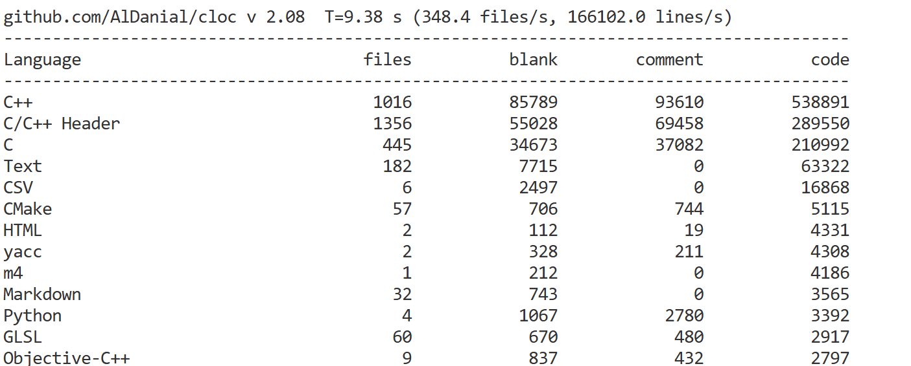

## 源码类
### [Redis](https://github.com/redis/redis)
要是一来就冲着最新版本去那还是太高看自己了,所以退而求其次,找个10年前的3.0版本的就行了.


命令如下:
```bash
git clone --branch 3.0 --depth 1 https://github.com/redis/redis.git
```
这样一对比,立刻就赏心悦目了:


使用cloc统计一下源码数量:

简直可以说是小巧得可爱.

### [Cpython](https://github.com/python/cpython)
3.0版本就够用了...
```bash
git clone --branch 3.0 https://github.com/python/cpython.git --depth 1
```

## Agents
### [AgentGPT](https://github.com/reworkd/AgentGPT)
刚开始看到的时候以为和我的项目撞车了,但后来发现完全不是这样,有以下缺点:
1. 项目在今年1月份被archive了,最近的更新也在1年前,实际来说有两年多没正式维护了
2. python版本为3.11,用的包管理器竟然是poetry,models构建用的是难看的sqlalchemy,对于习惯了sqlmodel写法的我来说看的确实很痛苦.
3. 创建初始表用的是sql,而没用alembic,导致必须要单独弄一个db文件夹出来调整.
4. 由于用的是next13,所以还是pages router写法,看着确实很不适应,也有很多如今不太实用的写法
5. 命名和架构让人看的很难受,现在要想继续维护的唯一方法就是把所有文件删了重写.

我看这个项目倒不是冲着批判来的,重点是看api的写法,不过这也很难说的上有什么可学习的地方了:
```py
from typing import List, Optional

from fastapi import APIRouter, Depends
from fastapi.responses import StreamingResponse as FastAPIStreamingResponse
from pydantic import BaseModel

from reworkd_platform.schemas.agent import (
    AgentChat,
    AgentRun,
    AgentSummarize,
    AgentTaskAnalyze,
    AgentTaskCreate,
    AgentTaskExecute,
    NewTasksResponse,
)
from reworkd_platform.web.api.agent.agent_service.agent_service import AgentService
from reworkd_platform.web.api.agent.agent_service.agent_service_provider import (
    get_agent_service,
)
from reworkd_platform.web.api.agent.analysis import Analysis
from reworkd_platform.web.api.agent.dependancies import (
    agent_analyze_validator,
    agent_chat_validator,
    agent_create_validator,
    agent_execute_validator,
    agent_start_validator,
    agent_summarize_validator,
)
from reworkd_platform.web.api.agent.tools.tools import get_external_tools, get_tool_name

router = APIRouter()


@router.post(
    "/start",
)
async def start_tasks(
    req_body: AgentRun = Depends(agent_start_validator),
    agent_service: AgentService = Depends(get_agent_service(agent_start_validator)),
) -> NewTasksResponse:
    new_tasks = await agent_service.start_goal_agent(goal=req_body.goal)
    return NewTasksResponse(newTasks=new_tasks, run_id=req_body.run_id)


@router.post("/analyze")
async def analyze_tasks(
    req_body: AgentTaskAnalyze = Depends(agent_analyze_validator),
    agent_service: AgentService = Depends(get_agent_service(agent_analyze_validator)),
) -> Analysis:
    return await agent_service.analyze_task_agent(
        goal=req_body.goal,
        task=req_body.task or "",
        tool_names=req_body.tool_names or [],
    )


@router.post("/execute")
async def execute_tasks(
    req_body: AgentTaskExecute = Depends(agent_execute_validator),
    agent_service: AgentService = Depends(
        get_agent_service(validator=agent_execute_validator, streaming=True),
    ),
) -> FastAPIStreamingResponse:
    return await agent_service.execute_task_agent(
        goal=req_body.goal or "",
        task=req_body.task or "",
        analysis=req_body.analysis,
    )


@router.post("/create")
async def create_tasks(
    req_body: AgentTaskCreate = Depends(agent_create_validator),
    agent_service: AgentService = Depends(get_agent_service(agent_create_validator)),
) -> NewTasksResponse:
    new_tasks = await agent_service.create_tasks_agent(
        goal=req_body.goal,
        tasks=req_body.tasks or [],
        last_task=req_body.last_task or "",
        result=req_body.result or "",
        completed_tasks=req_body.completed_tasks or [],
    )
    return NewTasksResponse(newTasks=new_tasks, run_id=req_body.run_id)


@router.post("/summarize")
async def summarize(
    req_body: AgentSummarize = Depends(agent_summarize_validator),
    agent_service: AgentService = Depends(
        get_agent_service(
            validator=agent_summarize_validator,
            streaming=True,
            llm_model="gpt-3.5-turbo-16k",
        ),
    ),
) -> FastAPIStreamingResponse:
    return await agent_service.summarize_task_agent(
        goal=req_body.goal or "",
        results=req_body.results,
    )


@router.post("/chat")
async def chat(
    req_body: AgentChat = Depends(agent_chat_validator),
    agent_service: AgentService = Depends(
        get_agent_service(
            validator=agent_chat_validator,
            streaming=True,
            llm_model="gpt-3.5-turbo-16k",
        ),
    ),
) -> FastAPIStreamingResponse:
    return await agent_service.chat(
        message=req_body.message,
        results=req_body.results,
    )


class ToolModel(BaseModel):
    name: str
    description: str
    color: str
    image_url: Optional[str]


class ToolsResponse(BaseModel):
    tools: List[ToolModel]


@router.get("/tools")
async def get_user_tools() -> ToolsResponse:
    tools = get_external_tools()
    formatted_tools = [
        ToolModel(
            name=get_tool_name(tool),
            description=tool.public_description,
            color="TODO: Change to image of tool",
            image_url=tool.image_url,
        )
        for tool in tools
        if tool.available()
    ]

    return ToolsResponse(tools=formatted_tools)
```
混乱的架构与难以解耦的代码,希望这种事情不要发生在我负责的项目里.
## Games
### [Zdoom](https://zdoom.org/index)
由于GZdoom是手搓的引擎,所以源码不太是正常人能看懂的,这种离谱的硬编码应该很难在现代工程中看到了吧:


尽管代码量不是太离谱,但架构实在是太混乱了:

### [Pypvz](https://github.com/wszqkzqk/pypvz)
- [项目根本来源](https://github.com/marblexu/PythonPlantsVsZombies)

非常有意思的Pvz版本,推荐所有初学python/pygame的人都拿这个项目来练练手,不过这个架构实在是太难看了,如果有时间的话我或许会帮忙重构一下.

## 爬虫