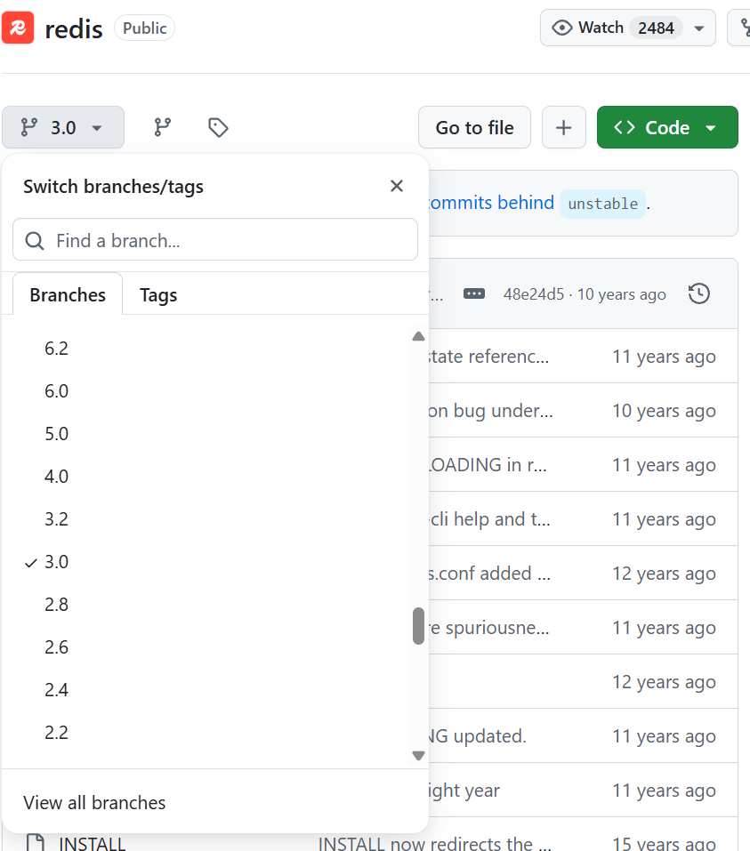
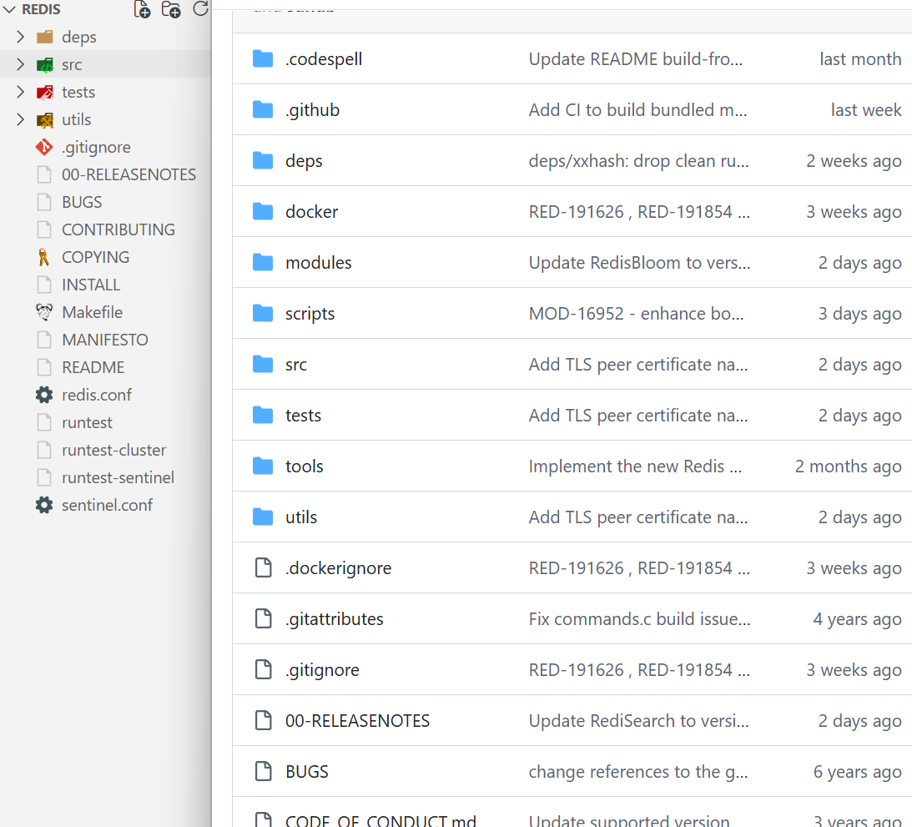
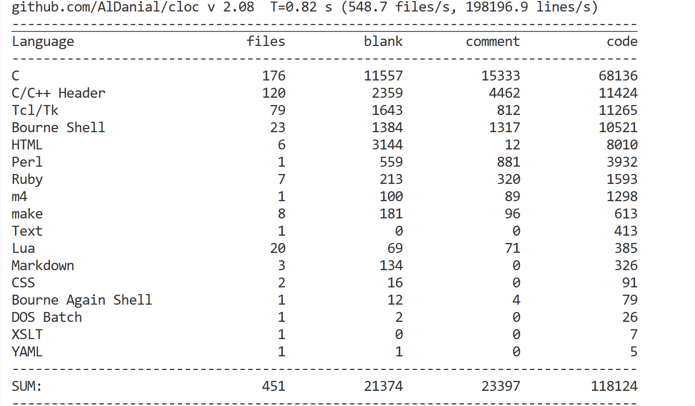
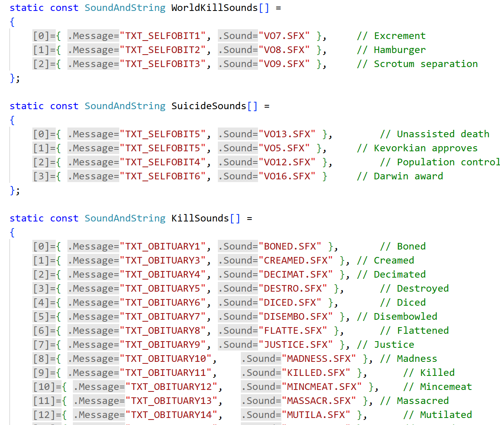

## 基础类
### [Redis](https://github.com/redis/redis)
要是一来就冲着最新版本去那还是太高看自己了,所以退而求其次,找个10年前的3.0版本的就行了.


命令如下:
```bash
git clone --branch 3.0 --depth 1 https://github.com/redis/redis.git
```
这样一对比,立刻就赏心悦目了:


使用cloc统计一下源码数量:

简直可以说是小巧得可爱.

### [Cpython](https://github.com/python/cpython)
3.0版本就够用了...
```bash
git clone --branch 3.0 https://github.com/python/cpython.git --depth 1
```
### [FFmpeg](https://github.com/FFmpeg/FFmpeg)
```bash
git clone --branch release/1.0 --depth 1 https://github.com/FFmpeg/FFmpeg.git
```
## Agents
### [AgentGPT](https://github.com/reworkd/AgentGPT)
刚开始看到的时候以为和我的项目撞车了,但后来发现完全不是这样,有以下缺点:
1. 项目在今年1月份被archive了,最近的更新也在1年前,实际来说有两年多没正式维护了
2. python版本为3.11,用的包管理器竟然是poetry,models构建用的是难看的sqlalchemy,对于习惯了sqlmodel写法的我来说看的确实很痛苦.
3. 创建初始表用的是sql,而没用alembic,导致必须要单独弄一个db文件夹出来调整.
4. 由于用的是next13,所以还是pages router写法,看着确实很不适应,也有很多如今不太实用的写法
5. 命名和架构让人看的很难受,现在要想继续维护的唯一方法就是把所有文件删了重写.

我看这个项目倒不是冲着批判来的,重点是看api的写法,不过这也很难说的上有什么可学习的地方了:
```py
router = APIRouter()


@router.post(
    "/start",
)
async def start_tasks(
    req_body: AgentRun = Depends(agent_start_validator),
    agent_service: AgentService = Depends(get_agent_service(agent_start_validator)),
) -> NewTasksResponse:
    new_tasks = await agent_service.start_goal_agent(goal=req_body.goal)
    return NewTasksResponse(newTasks=new_tasks, run_id=req_body.run_id)

# 省略一大堆代码

class ToolModel(BaseModel):
    name: str
    description: str
    color: str
    image_url: Optional[str]


class ToolsResponse(BaseModel):
    tools: List[ToolModel]


@router.get("/tools")
async def get_user_tools() -> ToolsResponse:
    tools = get_external_tools()
    formatted_tools = [
        ToolModel(
            name=get_tool_name(tool),
            description=tool.public_description,
            color="TODO: Change to image of tool",
            image_url=tool.image_url,
        )
        for tool in tools
        if tool.available()
    ]

    return ToolsResponse(tools=formatted_tools)
```
混乱的架构与难以解耦的代码,希望这种事情不要发生在我负责的项目里.
## Games
### [Zdoom](https://zdoom.org/index)
由于GZdoom是手搓的引擎,所以源码不太是正常人能看懂的,这种离谱的硬编码应该很难在现代工程中看到了吧:



尽管代码量不是太离谱,但架构实在是太混乱了:

### [Pypvz](https://github.com/wszqkzqk/pypvz)
- [项目根本来源](https://github.com/marblexu/PythonPlantsVsZombies)

非常有意思的Pvz版本,推荐所有初学python/pygame的人都拿这个项目来练练手,不过这个架构实在是太难看了,如果有时间的话我或许会帮忙重构一下.
## 计算机网络
### trojan
#### 文档阅读
>Trojan features multiple protocols over TLS to avoid both active/passive detections and ISP QoS limitations.
>
>Trojan is not a fixed program or protocol. It's an idea, an idea that imitating the most common service, to an extent that it behaves identically, could help you get across the *** permanently, without being identified ever. We are the GreatER Fire; we ship Trojan Horses.

## Full-Stack
### full-stack-fastapi-template
- (9/11): 最近心烦意乱,就来看看带我走入编程世界的奠基项目了
```bash
git clone https://github.com/fastapi/full-stack-fastapi-template.git
```
- 如此优美的项目是所有新人工程师要效仿的榜样.

不过这项目半年来的变化也太大了,新人或许都找不到启动方法了😄


#### 启动方法
首先定位到`deployment-docker-compose.md`文件,找到启动方法:
```bash
docker compose -f compose.yml up -d
```
结果发现只有backend容器,而没有以前的frontend容器了.

打开`compose.yml`一看,发现原来的frontend镜像消失了,然后在文档里是这么说的:

>The backend Docker image builds the frontend, so the server does not need Bun or prebuilt frontend files.

?还能这么玩,看一下后端的dockerfile:

```dockerfile
FROM oven/bun:1 AS frontend-build

WORKDIR /app

COPY package.json bun.lock /app/
COPY frontend/package.json /app/frontend/

WORKDIR /app/frontend

RUN bun install

COPY ./frontend /app/frontend

ARG VITE_API_URL=

RUN bun run build


FROM python:3.14

ENV PYTHONUNBUFFERED=1

# Install uv
# Ref: https://docs.astral.sh/uv/guides/integration/docker/#installing-uv
COPY --from=ghcr.io/astral-sh/uv:0.9.26 /uv /uvx /bin/

# Compile bytecode
# Ref: https://docs.astral.sh/uv/guides/integration/docker/#compiling-bytecode
ENV UV_COMPILE_BYTECODE=1

# uv Cache
# Ref: https://docs.astral.sh/uv/guides/integration/docker/#caching
ENV UV_LINK_MODE=copy

WORKDIR /app/

# Place executables in the environment at the front of the path
# Ref: https://docs.astral.sh/uv/guides/integration/docker/#using-the-environment
ENV PATH="/app/.venv/bin:$PATH"

# Install dependencies
# Ref: https://docs.astral.sh/uv/guides/integration/docker/#intermediate-layers
RUN --mount=type=cache,target=/root/.cache/uv \
    --mount=type=bind,source=uv.lock,target=uv.lock \
    --mount=type=bind,source=pyproject.toml,target=pyproject.toml \
    uv sync --frozen --no-install-workspace --package app

COPY ./backend/scripts /app/backend/scripts

COPY ./backend/pyproject.toml ./backend/alembic.ini /app/backend/

COPY ./backend/app /app/backend/app

COPY --from=frontend-build /app/backend/app/frontend /app/backend/app/frontend

# Sync the project
# Ref: https://docs.astral.sh/uv/guides/integration/docker/#intermediate-layers
RUN --mount=type=cache,target=/root/.cache/uv \
    --mount=type=bind,source=uv.lock,target=uv.lock \
    --mount=type=bind,source=pyproject.toml,target=pyproject.toml \
    uv sync --frozen --package app

WORKDIR /app/backend/

CMD ["fastapi", "run", "--workers", "4"]
```

仔细一看,这前端岂不是完全没有考虑到缓存删除的问题,而且每次修改前端都会触发镜像的重新构建,不过确实是这样,毕竟UI的修改确实是有必要每次都触发重新构建的.

可以说这是精简镜像,但我觉得反而有点过于优化了,作为普通的网站项目,不够清晰.

#### 外文件
##### main.py
```py
from pathlib import Path

import sentry_sdk
from fastapi import FastAPI
from fastapi.routing import APIRoute
from starlette.middleware.cors import CORSMiddleware

from app.api.main import api_router
from app.core.config import settings

FRONTEND_DIR = Path(__file__).parent / "frontend"


def custom_generate_unique_id(route: APIRoute) -> str:
    return f"{route.tags[0]}-{route.name}"


if settings.SENTRY_DSN and settings.FASTAPI_ENV != "development":
    sentry_sdk.init(dsn=str(settings.SENTRY_DSN), enable_tracing=True)

app = FastAPI(
    title=settings.PROJECT_NAME,
    openapi_url=f"{settings.API_V1_STR}/openapi.json",
    generate_unique_id_function=custom_generate_unique_id,
)

app.add_middleware(
    CORSMiddleware,
    allow_origins=[settings.FRONTEND_HOST],
    allow_credentials=True,
    allow_methods=["*"],
    allow_headers=["*"],
)

app.include_router(api_router, prefix=settings.API_V1_STR)
app.frontend("/", directory=FRONTEND_DIR)
```

最后一行这个方法真没见过,发现是今年6月份才引入的,更新的确实快.

##### models.py
```py
# Shared properties
class UserBase(SQLModel):
    email: EmailStr = Field(unique=True, index=True, max_length=255)
    is_active: bool = True
    is_superuser: bool = False
    full_name: str | None = Field(default=None, max_length=255)

class UserCreate(UserBase):
    password: str = Field(min_length=8, max_length=128)


class UserRegister(SQLModel):
    email: EmailStr = Field(max_length=255)
    password: str = Field(min_length=8, max_length=128)
    full_name: str | None = Field(default=None, max_length=255)
```

看一下路由代码便知道,`UserRegister`用于用户在前端的输入返回模型,而`UserCreate`用于最终的CRUD验证,还是很合理的.

唯一需要吐槽的地方就是schema和model放在一起了,看起来其实非常麻烦,我认为更好的方式是分成两个文件,甚至分成两个文件夹.


#### API设计
##### item.py
```py
@router.get("/", response_model=ItemsPublic)
def read_items(
    session: SessionDep, current_user: CurrentUser, skip: int = 0, limit: int = 100
) -> Any:
    """
    Retrieve items.
    """

    if current_user.is_superuser:
        count_statement = select(func.count()).select_from(Item)
        count = session.exec(count_statement).one()
        statement = (
            select(Item).order_by(col(Item.created_at).desc()).offset(skip).limit(limit)
        )
        items = session.exec(statement).all()
    else:
        count_statement = (
            select(func.count())
            .select_from(Item)
            .where(Item.owner_id == current_user.id)
        )
        count = session.exec(count_statement).one()
        statement = (
            select(Item)
            .where(Item.owner_id == current_user.id)
            .order_by(col(Item.created_at).desc())
            .offset(skip)
            .limit(limit)
        )
        items = session.exec(statement).all()

    items_public = [ItemPublic.model_validate(item) for item in items]
    return ItemsPublic(data=items_public, count=count)
```
没有单独为管理员另外设计一个路由,而是通过条件判断直接分离,还是很有想法的.

### [Zulip](https://zulip.com/)


