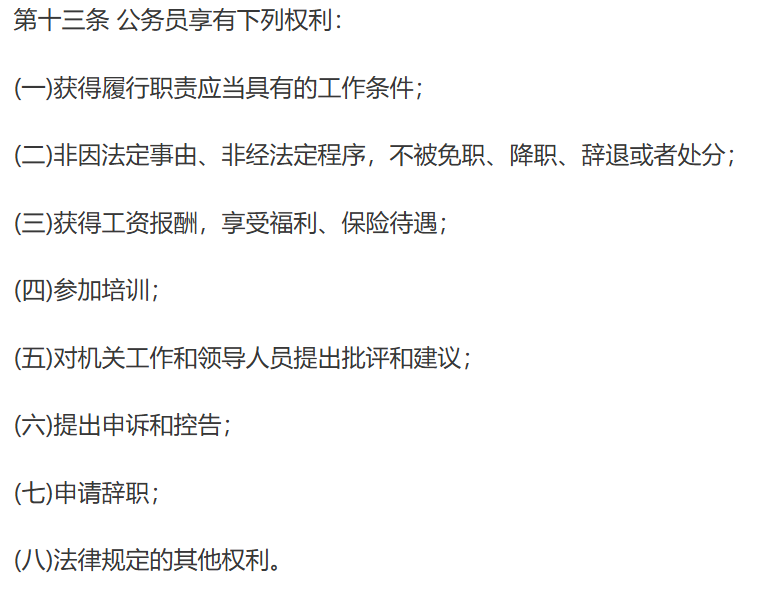
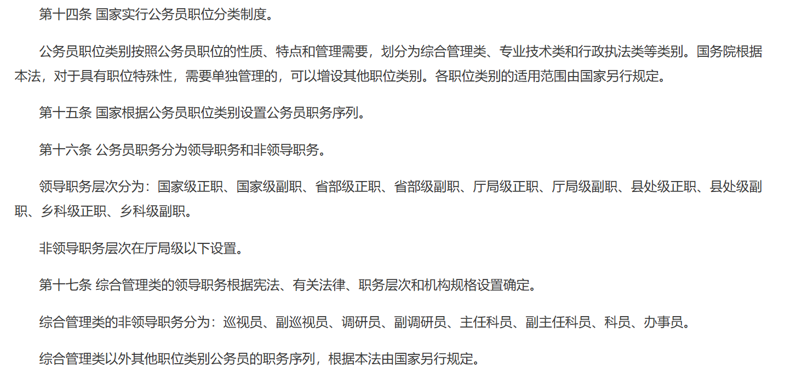

## 工作
### 公务员相关
- [来源](https://www.gjxfj.gov.cn/gjxfj/fgwj/flfg/webinfo/2014/05/1601761496733526.htm)

也就是说,只要不犯法,公务员是不可能被辞退的,这也是为什么说公务员是铁饭碗.

至于如何升迁,如何入职,自然是不会涉及的...

大多数国家的相关法律其实也都差不多,毕竟为了稳定起见,不可能让行政人员能够随便被辞退,不然谁还有心思去认真办事.不过也正是因此,很多行政人员即便犯下了许多严重的"无心之过",也只是打个哈哈了事,毕竟也只有百姓受苦.

即便如此,这一法律也是从06年才颁布的,而轰轰烈烈的下岗潮早就结束了十年之久.一般来说的话,这个法律应该是不太容易被改变的.但考虑到当下的情况,只能通过降薪和减免福利来适当的延缓一下局势,但即便如此,行政岗位也依旧很吃香,那么其他岗位的状况也就可见一斑了.
## 出行
### 高铁票价
- [wiki](https://zh.wikipedia.org/wiki/%E4%B8%AD%E5%9B%BD%E9%93%81%E8%B7%AF%E5%AE%A2%E8%BF%90%E8%BD%A6%E7%A5%A8%E4%B8%8E%E7%A5%A8%E4%BB%B7)

>中国大陆目前的铁路客运票价是由客票票价与附加票票价组成。基本票价以每人每公里的票价率为基础，加上按各种列车等级、空调、席别的上浮比率，以“递远递减”的方式计算,分段实行折扣。**其中500公里以内执行原价，500—1000公里约执行9折，1000公里以上约执行8折（此为大致标准，各线路的具体票价计算方法，以国家发改委的文件为准）**

现行动车组票价计价公式如下：
- 普通动车组（D字头车次）一等座票价：0.37×里程
- 普通动车组（D字头车次）二等座票价：0.3×里程
- 高速动车组（G字头车次）一等座票价：0.74×里程
- 高速动车组（G字头车次）二等座票价：0.46×里程

这样来看,坐高速动车的二等座确实是最有性价比的,又省时又不是太贵.

