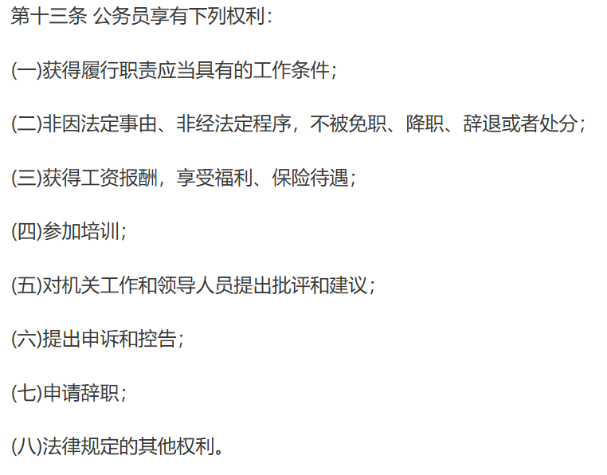
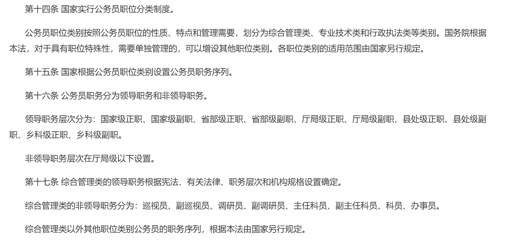
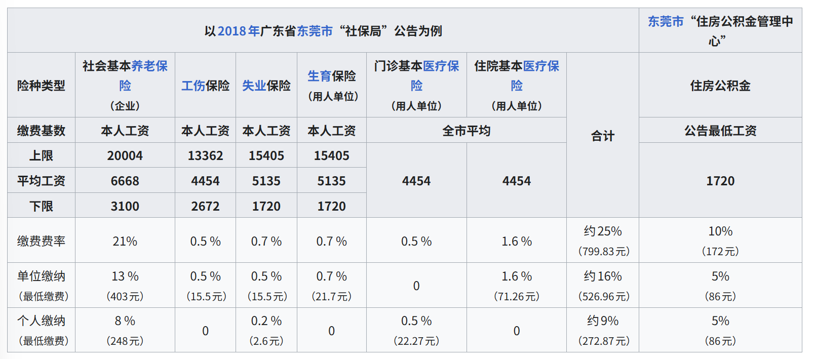

## 法律
### 基本名词
1. 自然人: 法律上的真实个人
2. 法人: 法人不是“某一个人”，而是法律把一个组织当成一个独立的“人”来对待,从而可以轻松裁定基本的责任关系,比如有三个合伙人A,B,C成立了一家公司,那么法人就是这个公司的名字:
```text
A ─┐
B ─┼─→ 青松科技有限公司
C ─┘        │
            ├─ 拥有服务器
            ├─ 与员工签合同
            ├─ 与客户签合同
            └─ 持有银行账户
```
### 公司名称
| 缩写      | 全称                      | 最简单的理解                                   | 常见地区             |
| --------- | ------------------------- | ---------------------------------------------- | -------------------- |
| **Inc.**  | Incorporated              | 已经依法注册成“公司法人”的 Corporation         | 美国、加拿大         |
| **Corp.** | Corporation               | 公司法人，通常股东承担有限责任                 | 美国等               |
| **LLC**   | Limited Liability Company | 有限责任公司，管理和税务通常更灵活             | 美国                 |
| **Ltd.**  | Limited                   | “有限责任”的公司                               | 英国、香港、新加坡等 |
| **Co.**   | Company                   | 只是“公司”的意思，本身通常不能说明具体法律类型 | 全球                 |

1. Inc: 公司和股东本人分开,股东只承担有限责任,有独立的法人
2. Corp: 公司和股东完全分离,但基本来说可以约等于Inc,法律结构相似
3. LLC: 常见于创业公司,比Corp更加灵活,管理层级简单,但对于股东和合伙人的保护责任有限
4. Ltd: 股东对公司的债务承担有限责任,例如投资10万也最多亏损10万
5. Co: 没有任何有效信息,单纯表示这是一个公司

一个简单的类比如下:

中国有限责任公司 ↔ 美国 LLC

中国股份有限公司 ↔ 美国 Corporation


### 公务员相关
- [来源](https://www.gjxfj.gov.cn/gjxfj/fgwj/flfg/webinfo/2014/05/1601761496733526.htm)



也就是说,只要不犯法,公务员是不可能被辞退的,这也是为什么说公务员是铁饭碗.



至于如何升迁,如何入职,自然是不会涉及的...

大多数国家的相关法律其实也都差不多,毕竟为了稳定起见,不可能让行政人员能够随便被辞退,不然谁还有心思去认真办事.不过也正是因此,很多行政人员即便犯下了许多严重的"无心之过",也只是打个哈哈了事,毕竟也只有百姓受苦.

即便如此,这一法律也是从06年才颁布的,而轰轰烈烈的下岗潮早就结束了十年之久.一般来说的话,这个法律应该是不太容易被改变的.但考虑到当下的情况,只能通过降薪和减免福利来适当的延缓一下局势,但即便如此,行政岗位也依旧很吃香,那么其他岗位的状况也就可见一斑了.
### 合同

## 工作
### 五险一金
- [wiki](https://zh.wikipedia.org/wiki/%E4%BA%94%E9%99%A9%E4%B8%80%E9%87%91)

>五险一金，指中国大陆地区劳动者所享有的社会保险和公积金福利的一种通俗化称呼，其中“五险”是指养老保险、医疗保险、工伤保险、失业保险、生育保险五种社会保险，“一金”是指住房公积金，是中国政府为保障职工权利而采取的一项基本措施。“五险一金”中的工伤保险与生育保险全部由用人单位缴纳，其他由用人单位与劳动者共同缴纳的四种也被称为“四金”

- 五险一金尽管说的是福利,但却是在法定上要强制缴纳的,不过,很多公司却不帮你缴纳,这实际上是[违法行为](https://www.zhihu.com/question/12732875595/answer/1904483040425645879),只要建立了劳动关系,是完全可以去仲裁的
- 但问题又来了,如果你这个人随时都可以辞退,那么不缴纳的话你也不敢去闹事,这就是那些无良公司在当今世代的底气了.

至于比例是怎么算的,就没必要去了解了,因为实在是太混乱了:



可以看到,养老保险的缴费比例是大头中的大头,俗称为工资消失术,但这笔钱却只能到退休之后才能按月领取,

大多数国家尽管有类似五险的保证制度,但没有住房公积金这个极具特色的东西.

## 出行
### 高铁票价
- [wiki](https://zh.wikipedia.org/wiki/%E4%B8%AD%E5%9B%BD%E9%93%81%E8%B7%AF%E5%AE%A2%E8%BF%90%E8%BD%A6%E7%A5%A8%E4%B8%8E%E7%A5%A8%E4%BB%B7)

>中国大陆目前的铁路客运票价是由客票票价与附加票票价组成。基本票价以每人每公里的票价率为基础，加上按各种列车等级、空调、席别的上浮比率，以“递远递减”的方式计算,分段实行折扣。**其中500公里以内执行原价，500—1000公里约执行9折，1000公里以上约执行8折（此为大致标准，各线路的具体票价计算方法，以国家发改委的文件为准）**

现行动车组票价计价公式如下：
- 普通动车组（D字头车次）一等座票价：0.37×里程
- 普通动车组（D字头车次）二等座票价：0.3×里程
- 高速动车组（G字头车次）一等座票价：0.74×里程
- 高速动车组（G字头车次）二等座票价：0.46×里程


这样来看,坐高速动车的二等座确实是最有性价比的,又省时又不是太贵.

