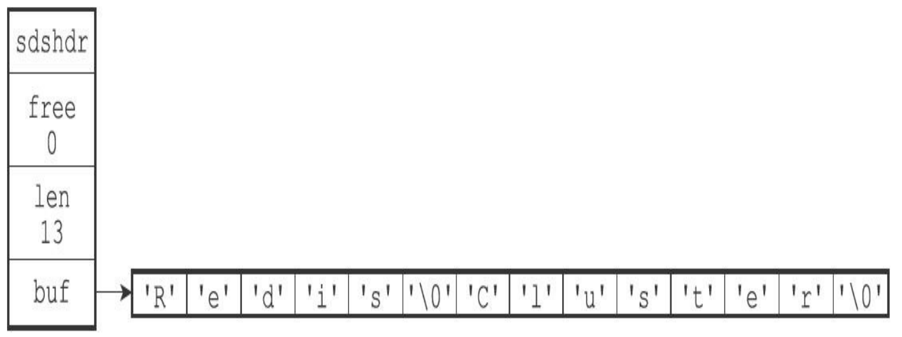
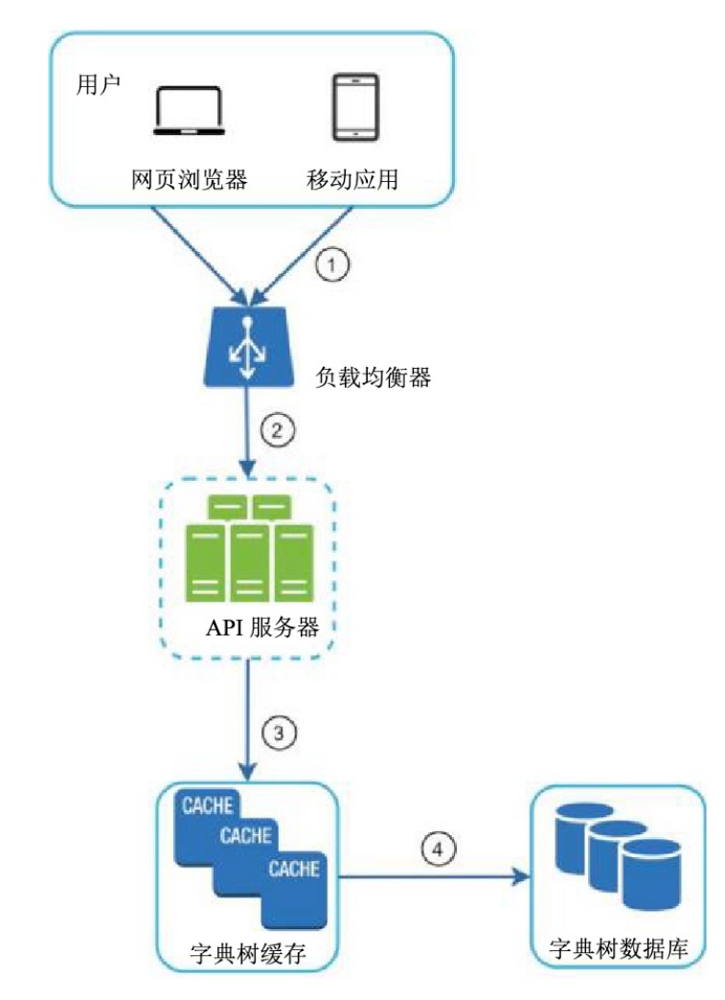
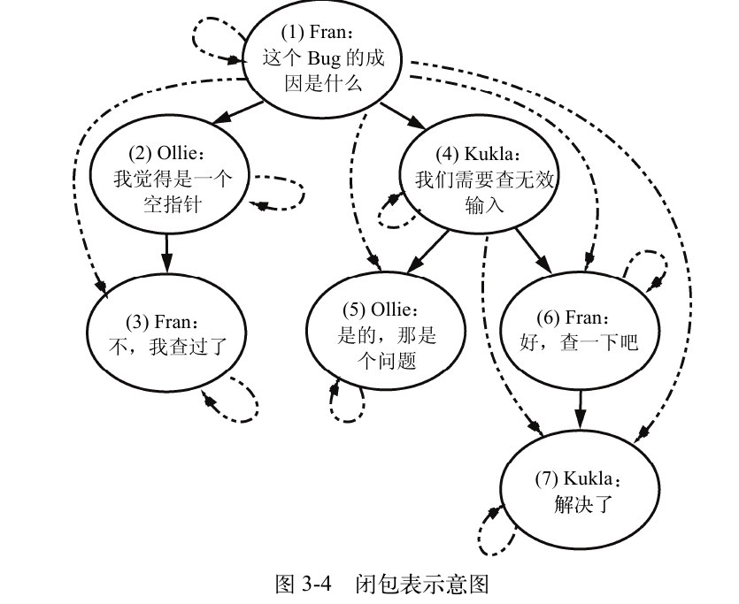
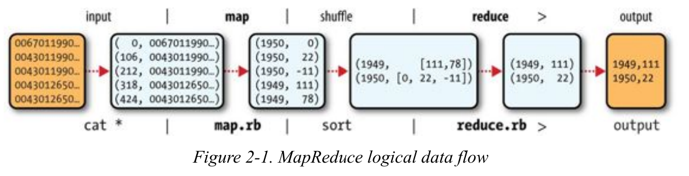

# Learning Go
## ch1: 搭建环境
```bash
# 创建go模块
go mod init hello_word
# 编译go程序
go build hello.go
# 格式化go程序,应用于当前目录及所有子目录
go fmt ./...
```
### 使用make
```makefile
.DEFAULT_GOAL := build
.PHONY:fmt vet build
fmt:
	go fmt ./...
vet: fmt 
	go vet ./...
build: vet
	go build
```
在终端敲上`make`这个单词就可以自动运行build命令了.

## ch2: 类型和声明
### 字符串
>Go 语言中的字符串是不可变的；你可以重新赋值给一个字符串变量，但你不能改变赋值给它的字符串的值。
### 变量声明

如果有初始化值,Go中的var声明都可以省略类型:
```go
var x = 10
var x, y int = 10, 20
var x, y = 10, "hello"
var x int
// 如果不写初始化值则构造为零值
```


另一个则是只能写在函数中作为局部变量声明的`:=`,同样不用指定类型:
```go
var x, y = 10, "hello"
x, y := 10, "hello"
```

Go中的const声明如下:
```go
const x int64 = 10
const (
    idKey = "id"
    nameKey = "name"
)
const z = 20 * 10
```
其中第二种声明方式显然比较有特色

## ch3: 复合类型
### 数组
```go
var x [3]int
var x = [3]int{10, 20, 30}
var x = [...]int{10, 20, 30} //自动推断长度
```
>Go 语言中的数组很少被显式使用。这是因为它们有一个特殊的限制：Go 将数组的大小视为数组类型的一部分。这使得声明为[3]int 的数组与声明为 [4]int 的数组类型不同
### 切片
切片的用法与数组类似,但声明时不用指定数组大小:
```go
var x = []int{10, 20, 30}
```
#### make内置函数
指定切片类型,零值数量,总容量.
```go
x := make([]int, 5,10)
```
#### 从数组/切片中创建切片
```go
x := []string{"a", "b", "c", "d"}
y := x[:2]
z := x[1:]
d := x[1:3]
e := x[:]
fmt.Println("x:", x)
fmt.Println("y:", y)
fmt.Println("z:", z)
fmt.Println("d:", d)
fmt.Println("e:", e)
```
依然遵循前闭后开的准则.

切片彼此之间是相互引用的,修改一个切片会影响到其他相同位置的切片.

```go
xArray := [4]int{5, 6, 7, 8}
xSlice := xArray[:]
```
数组转换成切片.

```go
xSlice := []int{1, 2, 3, 4}
xArray := [4]int(xSlice)
smallArray := [2]int(xSlice)
xSlice[0] = 10
```
切片转换成数组.


#### copy内置函数
```go
x := []int{1, 2, 3, 4}
y := make([]int, 4)
num := copy(y, x)
fmt.Println(y, num)
```
copy函数可以创建一个独立于原始切片的切片.

### Maps
#### 声明与创建
普通的声明方式如下,`[]`中写key,后面跟着任何可映射的value类型:
```go
var nilMap map[string]int
totalWins := map[string]int{}
```

通用的make函数声明:
```go
ages := make(map[int][]string, 10)
```
#### 访问Map
```go
m := map[string]int{
    "hello": 5,
    "world": 0,
}
v, ok := m["hello"]
fmt.Println(v, ok)
v, ok = m["world"]
fmt.Println(v, ok)
v, ok = m["goodbye"]
fmt.Println(v, ok)
```
可以看到,Map访问内置了异常处理,还是很方便的.

### Structs
#### 声明
```go
type person struct {
    name string
    age int
    pet string
}
```
Go中的结构体不支持默认值,只有零值.

对于结构体来说,赋值一个空结构体字面量和完全不赋值之间没有区别,都会将所有字段初始化为零值:
```go
var fred person

bob := person{}
```

和python一样,go支持指名赋值或者按照成员声明的顺序来进行不指名赋值.


#### 匿名结构体
```go
var person struct {
	name string
	age  int
	pet  string
}

person.name = "bob"
person.age = 50
person.pet = "dog"

pet := struct {
	name string
	kind string
}{
	name: "Fido",
	kind: "dog",
}
```
pet还比较好理解,是一个经典的匿名结构体,在声明后立即使用.但person就比较神奇了,原来的`type person struct`变成了`var person struct`,然后就同时完成了类型声明和初始化变量两件事情.

匿名结构体显然是那种只会用到一两次的数据仓库.
## ch4: 逻辑结构
### if
```go
if n := rand.Intn(10); n == 0 {
    fmt.Println("That's too low")
} else if n > 5 {
    fmt.Println("That's too big:", n)
} else {
    fmt.Println("That's a good number:", n)
}
```
Go中的if语句可以定义存活到else语句结束时的变量,很容易用在那些当属性名称太长时的简写.

### for
Go中的for有四种形式:
- A complete, C-style `for`
- A condition-only `for`
- An infinite `for`
- `for-range`
```go
package main

import "fmt"

func main() {
	// 一、完整的、C 风格的 for (A complete, C-style for)
	// 包含初始化语句、条件表达式和后置语句
	fmt.Println("--- 一、完整的、C 风格的 for ---")
	for i := 0; i < 3; i++ {
		fmt.Println("C-style:", i)
	}

	// 二、仅限条件的 for (A condition-only for)
	// 只有条件表达式，相当于其他语言中的 while
	fmt.Println("--- 二、仅限条件的 for ---")
	j := 0
	for j < 3 {
		fmt.Println("Condition-only:", j)
		j++
	}

	// 三、无限的 for (An infinite for)
	// 没有条件表达式，如果不使用 break 跳出，会一直循环
	fmt.Println("--- 三、无限的 for ---")
	count := 0
	for {
		fmt.Println("Infinite:", count)
		count++
		if count >= 3 {
			break // 必须使用 break 跳出循环，否则会造成死循环
		}
	}

	// 四、for-range
	// 用于遍历数组、切片、字符串、map 或 channel
	fmt.Println("--- 四、for-range ---")
	nums := []int{10, 20, 30}
	for index, value := range nums {
		fmt.Printf("Index: %d, Value: %d\n", index, value)
	}
}
```

>需要注意的是，每次 `for-range` 循环遍历复合类型时，它都会将复合类型的值复制到 value 变量中。修改 value 变量不会修改复合类型的值

如果要修改原复合类型,就必须要通过下标来处理:
```go
for i := range nums {
    nums[i] *= 10
}


m := map[string]User{
    "tom": {"Tom", 18},
}

for key, user := range m {
    user.Age++
    m[key] = user
}
```
## ch5: 函数
### 基本形式
在Go中,你必须为函数提供所有参数,并不存在命名参数和可选参数,如果参数过多,可以包裹在一个结构体里面再传入:
```go
func DefaultConfig() Config {
    return Config{
        Host:    "localhost",
        Port:    8080,
        Timeout: 30,
    }
}

func NewServer(cfg Config) *Server {
    // ...
}
```

但Go支持可变参数,也就是说可以传入任意数量的参数:
```go
func addTo(base int, vals ...int) []int {
	out := make([]int, 0, len(vals))
	for _, v := range vals {
		out = append(out, base+v)
	}
	return out
}

func main() {
	fmt.Println(addTo(3))
	fmt.Println(addTo(3, 2))
	fmt.Println(addTo(3, 2, 4, 6, 8))
	a := []int{4, 3}
	fmt.Println(addTo(3, a...))
	fmt.Println(addTo(3, []int{1, 2, 3, 4, 5}...))
}
```

Go的另一个独特之处就是支持多个返回值:
```go
func divAndRemainder(num, denom int) (int, int, error) {
	if denom == 0 {
		return 0, 0, errors.New("cannot divide by zero")
	}
	return num / denom, num % denom, nil
}
```
接受变量需要与返回值的数量一一对应,如果有不需要的值,则用`_`表示,如` result, _, err := divAndRemainder(5, 2)`

Go还支持对返回值命名:
```go
func divAndRemainder(num, denom int) (result int, remainder int, err error) {
	if denom == 0 {
		err = errors.New("cannot divide by zero")
		return result, remainder, err
	}
	result, remainder = num/denom, num%denom
	return result, remainder, err
}
```
>命名的返回值在创建时会被初始化为零。这意味着你可以在任何显式使用或赋值之前直接返回它们。


# Redis设计与实现
- 本书基于Redis 2.9(Redis 3.0开发版)编写,而现在已经更新到8.10版本了,不过仍然值得一读
## 数据结构与对象
### simple dynamic string，SDS
>Redis没有直接使用C语言传统的字符串表示（以空字符结尾的字符数组，以下简称C字符串），而是自己构建了一种名为简单动态字符串（simple dynamic string，SDS）的抽象类型，并将SDS用作Redis的默认字符串表示。

主要原因自然是C字符串本身的问题,如字符串拼接函数`strcat`不会自动扩容,C字符串默认以`./0`结尾,并不会记录自身的长度,而是需要程序员自己控制.

格式如下:


- len记载占用空间,free记载剩余空间,通过结构体实现
### 链表
Redis中的链表设计如下:
* 双端：链表节点带有 `prev` 和 `next` 指针，获取某个节点的前置节点和后置节点的复杂度都是 O(1)。

* 无环：表头节点的 `prev` 指针和表尾节点的 `next` 指针都指向 `NULL`，对链表的访问以 `NULL` 为终点。

* 带表头指针和表尾指针：通过 `list` 结构的 `head` 指针和 `tail` 指针，程序获取链表的表头节点和表尾节点的复杂度为 O(1)。

* 带链表长度计数器：程序使用 `list` 结构的 `len` 属性来对 `list` 持有的链表节点进行计数，程序获取链表中节点数量的复杂度为 O(1)。

* 多态：链表节点使用 `void*` 指针来保存节点值，并且可以通过 `list` 结构的 `dup`、`free`、`match` 三个属性为节点值设置类型特定函数，所以链表可以用于保存各种不同类型的值。

### 字典
>字典在Redis中的应用相当广泛，比如Redis的数据库就是使用字典来作为底层实现的，对数据库的增、删、查、改操作也是构建在对字典的操作之上的。
#### 哈希表
Redis的字典使用哈希表实现:
```c
typedef struct dictht {
    // 哈希表数组
    dictEntry **table;//指针数组

    // 哈希表大小
    unsigned long size;

    // 哈希表大小掩码，用于计算索引值
    // 总是等于 size - 1
    unsigned long sizemask;

    // 该哈希表已有节点的数量
    unsigned long used;
} dictht;
```
具体的单节点结构如下:
```c
typedef struct dictEntry {
    // 键
    void *key;

    // 值
    union {
        void *val;
        uint64_t u64;
        int64_t s64;
    } v;

    // 指向下一个哈希表节点，形成链表
    struct dictEntry *next;
} dictEntry;
```
- 这里的union非常有意思,完美解决了节点的替换问题.

#### 哈希算法
Redis计算哈希值和索引值的方法如下：
```c
// 使用字典设置的哈希函数，计算键 key 的哈希值
hash = dict->type->hashFunction(key);

// 使用哈希表的 sizemask 属性和哈希值，计算出索引值
// 根据情况不同，ht[x] 可以是 ht[0] 或者 ht[1]
index = hash & dict->ht[x].sizemask;
```
hashFunction用的算法是MurmurHash2算法,而现在用的则是SipHash算法
#### 哈希冲突
发生哈希冲突时,由于没有指向尾部的指针,所以Redis会将新节点放在链表的头部
#### rehash
当哈希冲突过多/加入节点过多时,Redis会自动执行Rehash来渐进式地扩展哈希表,详细步骤如下:
1. 为 `ht[1]` 分配空间，让字典同时持有 `ht[0]` 和 `ht[1]` 两个哈希表。

2. 在字典中维持一个索引计数器变量 `rehashidx`，并将它的值设置为 `0`，表示 rehash 工作正式开始。

3. 在 rehash 进行期间，每次对字典执行添加、删除、查找或者更新操作时，程序除了执行指定的操作以外，还会顺带将 `ht[0]` 哈希表在 `rehashidx` 索引上的所有键值对 rehash 到 `ht[1]`。当 rehash 工作完成之后，程序将 `rehashidx` 属性的值增一。

4. 随着字典操作的不断执行，最终在某个时间点上，`ht[0]` 的所有键值对都会被 rehash 至 `ht[1]`。这时程序将 `rehashidx` 属性的值设为 `-1`，表示 rehash 操作已完成。

设计上确实很简单,但不是那么容易想得到的.
### 跳表
>和链表、字典等数据结构被广泛地应用在Redis内部不同，Redis只在两个地方用到了跳跃表，一个是实现有序集合键，另一个是在集群节点中用作内部数据结构，除此之外，跳跃表在Redis里面没有其他用途

- 我以前还以为Redis主要靠跳表呢,结果并没有我想的那么简单
### 整数集合
>整数集合（intset）是集合键的底层实现之一，当一个集合只包含整数值元素，并且这个集合的元素数量不多时，Redis就会使用整数集合作为集合键的底层实现。

基本原理就是把整数按照顺序放进一块连续内存中,所有元素的类型统一,有三种类型:
```text
INTSET_ENC_INT16
INTSET_ENC_INT32
INTSET_ENC_INT64
```
### 压缩列表
>压缩列表（ziplist）是列表键和哈希键的底层实现之一。当一个列表键只包含少量列表项，并且每个列表项要么就是小整数值，要么就是长度比较短的字符串，那么Redis就会使用压缩列表来做列表键的底层实现。

可以说只是一个优化过的链表而已.

### 对象
>在前面的数个章节里，我们陆续介绍了Redis用到的所有主要数据结构，比如简单动态字符串（SDS）、双端链表、字典、压缩列表、整数集合等等。
>
>Redis并没有直接使用这些数据结构来实现键值对数据库，而是基于这些数据结构创建了一个对象系统，这个系统包含字符串对象、列表对象、哈希对象、集合对象和有序集合对象这五种类型的对象，每种对象都用到了至少一种我们前面所介绍的数据结构。
#### 对象类型
Redis使用对象来表示数据库中的键和值，每次当我们在Redis的数据库中新创建一个键值对时，我们至少会创建两个对象，一个对象用作键值对的键（键对象），另一个对象用作键值对的值（值对象）。

经典的5个对象类型如下:

| 类型常量       | 对象的名称   |
| -------------- | ------------ |
| `REDIS_STRING` | 字符串对象   |
| `REDIS_LIST`   | 列表对象     |
| `REDIS_HASH`   | 哈希对象     |
| `REDIS_SET`    | 集合对象     |
| `REDIS_ZSET`   | 有序集合对象 |

>对于Redis数据库保存的键值对来说，键总是一个字符串对象，而值则可以是字符串对象、列表对象、哈希对象、集合对象或者有序集合对象的其中一种，
#### 字符串对象
字符串对象的编码可以是int、raw或者embstr,分别对应整数,长字符串,短于32字节的字符串
#### 列表对象
列表对象的编码可以是ziplist或者linkedlist,当列表中所有字符串元素的长度都小于64字节,且保存元素少于512个时,使用zpilist,否则就用linkedlist,二者的实现方式上有一点不同:

linkedlist是一个真正的双端列表,而ziplist中所有元素紧凑排列在一段连续内存中.


|     命令      | ziplist 编码的实现方法                                                                                                     | linkedlist 编码的实现方法                                                                                          |
| :-----------: | :------------------------------------------------------------------------------------------------------------------------- | :----------------------------------------------------------------------------------------------------------------- |
|  **`LPUSH`**  | 调用 `ziplistPush` 函数，将新元素推入到压缩列表的表头                                                                      | 调用 `listAddNodeHead` 函数，将新元素推入到双端链表的表头                                                          |
|  **`RPUSH`**  | 调用 `ziplistPush` 函数，将新元素推入到压缩列表的表尾                                                                      | 调用 `listAddNodeTail` 函数，将新元素推入到双端链表的表尾                                                          |
|  **`LPOP`**   | 调用 `ziplistIndex` 函数定位压缩列表的表头节点，在向用户返回节点所保存的元素之后，调用 `ziplistDelete` 函数删除表头节点    | 调用 `listFirst` 函数定位双端链表的表头节点，在向用户返回节点所保存的元素之后，调用 `listDelNode` 函数删除表头节点 |
|  **`RPOP`**   | 调用 `ziplistIndex` 函数定位压缩列表的表尾节点，在向用户返回节点所保存的元素之后，调用 `ziplistDelete` 函数删除表尾节点    | 调用 `listLast` 函数定位双端链表的表尾节点，在向用户返回节点所保存的元素之后，调用 `listDelNode` 函数删除表尾节点  |
| **`LINDEX`**  | 调用 `ziplistIndex` 函数定位压缩列表中的指定节点，然后返回节点所保存的元素                                                 | 调用 `listIndex` 函数定位双端链表中的指定节点，然后返回节点所保存的元素                                            |
|  **`LLEN`**   | 调用 `ziplistLen` 函数返回压缩列表的长度                                                                                   | 调用 `listLength` 函数返回双端链表的长度                                                                           |
| **`LINSERT`** | 插入新节点到压缩列表的表头或者表尾时，使用 `ziplistPush` 函数；插入新节点到压缩列表的其他位置时，使用 `ziplistInsert` 函数 | 调用 `listInsertNode` 函数，将新节点插入到双端链表的指定位置                                                       |


问了一下AI,现在list的主要实现变成了`quicklist`,是一个由多个`ziplist`组成的链表,这个设计确实很不错
#### 哈希对象
哈希对象的编码可以是ziplist或者hashtable。

如果使用ziplist,那么就满足以下性质:
- **保存了同一键值对的两个节点总是紧挨在一起**，保存键的节点在前，保存值的节点在后；
- **先添加到哈希对象中的键值对**会被放在压缩列表的表头方向，而**后来添加到哈希对象中的键值对**会被放在压缩列表的表尾方向。

这与列表其实没有任何区别,只不过存储的量多了一倍而已,同样,当所有元素的字符串长度小于64字节,键值对数量小于512时才会启用ziplist,否则使用hashtable.

hashtable使用前面所说的字典实现.
#### 集合对象
集合对象的编码可以是intset或者hashtable。同样也是根据元素数量来进行转换的.
#### 有序集合对象
有序集合的编码可以是ziplist或者skiplist。

如果是ziplist,每次插入都要重新排序

# RAG with Python Cookbook
## RAG介绍
| RAG 拟合度 | 用例                                              | 适配理由                                                                                                                         |
| ---------: | ------------------------------------------------- | -------------------------------------------------------------------------------------------------------------------------------- |
|      **1** | 我想和我的季度报告聊聊                            | 只有单份文档，数据量较小。直接阅读或使用 ChatGPT、Claude 等通用大模型即可完成，自建 RAG 的收益很低。                             |
|      **2** | 请帮我总结这一份文档                              | 通用大模型已经能够较好地完成单文档总结任务，引入 RAG 通常不会带来明显额外价值。                                                  |
|      **2** | 自动执行需要作出高风险决策的任务                  | 技术上可以实现，但大模型仍可能出错。若缺少人工审核、审计机制和故障保护等措施，风险较高，因此不适合单纯依赖 RAG 自动完成。        |
|      **4** | 大量会议录音不断积累，但其中的信息无法进入知识库  | RAG 可以将音频、视频、长篇非结构化笔记等难以检索的信息转化为可搜索、可查询的知识，具有持续价值；最终效果会受到语音转录质量影响。 |
|      **4** | 将技术图纸与规格文档进行核对                      | 适合利用多模态模型结合 RAG 进行跨材料比对，可以减少大量人工核查工作；但需要完善的评估机制和异常处理流程。                        |
|      **5** | 有 1 万份合同，需要找出其中包含自动续约条款的合同 | 文档规模很大，人工逐份检查成本过高；任务目标明确，可以通过检索和信息提取定位相关合同，结果也容易人工验证。                       |
|      **5** | 客户支持工单中包含大量产品问题，但无法有效汇总    | RAG 适合跨大量文档检索、聚合和发现重复模式，可以从大量工单中识别共同问题及趋势，这是人工难以大规模完成的任务。                   |
|      **5** | 每天收到数百条客户咨询，需要自动分配给合适的团队  | 属于高频、重复的分类与路由任务，任务标准清晰，结果容易评估，并且可以通过自动化显著降低人工成本。                                 |

**核心判断原则：**RAG 的价值通常随着**数据量、跨文档检索需求、信息更新频率和人工处理成本**的增加而提高。对于单份、短小且可以直接放入大模型上下文的文档，通常没有必要专门构建 RAG 系统。

>当数据结构不规则且变化多端时，这种能力尤为重要。当每个输入略有不同但处理方式类似时，例如客户电子邮件、合同条款或事件报告，可以使用 RAG。不要将 RAG 用于简单的查找、固定格式的数据提取或基于不变规则的任务。如果您可以编写正则表达式（regex）或 SQL 查询来处理 95% 的情况，那么 RAG 只会增加不必要的复杂性和成本。

RAG常用的库和框架如下:
| 类别                              | 示例库                                                                          | 主要作用                                                                                                                        |
| --------------------------------- | ------------------------------------------------------------------------------- | ------------------------------------------------------------------------------------------------------------------------------- |
| **RAG 与代理式 RAG 编排**         | LangChain、LangGraph、LlamaIndex                                                | 将检索器、生成器、提示词、记忆等常见 RAG 组件封装为统一抽象，并负责连接向量数据库、LLM 和传统数据库，使开发者更专注于业务逻辑。 |
| **大语言模型与嵌入模型**          | OpenAI、Anthropic、Transformers、Sentence Transformers                          | 为 RAG 系统提供核心智能能力，用于理解用户查询、生成向量嵌入以及生成最终回答。                                                   |
| **向量存储**                      | Chroma、FAISS、Pinecone、Milvus、Weaviate                                       | 存储和检索向量嵌入，通过相似度搜索快速找到与用户查询相关的内容。                                                                |
| **数据处理**                      | pandas、NumPy、PyPDF2、pypdf、python-docx、Unstructured、openpyxl、scikit-learn | 用于数据处理、文件读取、清洗和预处理，在文档进入 RAG 系统之前将原始数据转换为可处理的形式。                                     |
| **多模态与媒体处理**              | Pillow、Pytesseract、MoviePy、pdf2image、OpenCV                                 | 用于加载和处理图片、视频、播客、PDF、Word、PowerPoint 等不同媒体和文件格式。                                                    |
| **文本处理与自然语言处理（NLP）** | NLTK、Transformers、Rank-BM25、Beautiful Soup 4                                 | 用于文本清洗、分词、关键词检索、传统 NLP 分析等任务，避免所有文本处理步骤都依赖大语言模型。                                     |
| **评估与监控**                    | Ragas、Phoenix、LangSmith、Prometheus-Eval                                      | 提供预定义的评估指标，用于衡量检索器、生成器以及整个 RAG 应用的准确性、质量和运行表现。                                         |
| **Web 框架与部署**                | Streamlit、Gradio、Flask、Django                                                | 用于构建 RAG 应用的用户界面和 Web 服务。其中 Streamlit、Gradio 更适合快速原型，Flask、Django 更适合完整应用开发。               |
| **数据库与存储**                  | SQLAlchemy、Psycopg 2、SQLite3                                                  | 用于连接传统 SQL 数据库，并通过数据库连接器或 ORM 将关系型数据作为 RAG 系统的数据来源。                                         |
## 基础模型
### Ollama
>Ollama 在http://localhost:11434/v1 公开了一个与 OpenAI 兼容的端点，因此您现有的代码几乎无需更改。

```py
from openai import OpenAI

# Point the client to your local Ollama server
client = OpenAI(
    base_url="http://localhost:11434/v1",
    api_key="ollama",  # Ollama does not require a real key,
                       # but the SDK expects one
)

response = client.chat.completions.create(
    model="qwen3:4b",
    messages=[
        {"role": "system", "content": "You are a helpful assistant."},
        {
            "role": "user",
            "content": "What is retrieval augmented generation?"
        },
    ],
)

print(response.choices[0].message.content)
```
还可以试试选用多个模型:
```py
from openai import OpenAI

models = ["llama2", "mistral", "codellama"]

client = OpenAI(
    base_url="http://localhost:11434/v1",
    api_key="ollama"
)

for model in models:
    print(f"\n--- Testing {model} ---")

    response = client.chat.completions.create(
        model=model,
        messages=[
            {"role": "user", "content": "Explain RAG in one sentence."}
        ]
    )

    print(response.choices[0].message.content)
```


> **将公开排行榜视为筛选工具，而非最终决策标准。常见的局限性包括以下几点：**
>
> **基准泄漏或数据污染**
> 一些基准测试题及答案是公开的，可能已被直接或间接包含在训练数据中，从而抬高模型分数。
>
> **古德哈特定律或过度优化**
> 一旦某个基准成为目标，模型开发者可能会专门针对该基准进行调整，从而提高分数，但并不会相应提高模型的通用能力。
>
> **与实际使用情况不符**
> 生产环境中的具体配置——包括提示模板、检索质量、工具使用、长上下文、多语言内容、量化方式以及延迟限制——都会显著影响最终结果。
> 因此，即使某个模型在公开排行榜上“胜出”，在你自己的 RAG 查询或真实业务场景中，也可能表现得更差。


### 图片解析
```py
from pydantic import BaseModel
from openai import OpenAI
import base64


class Invoice(BaseModel):
    invoice_number: str
    vendor: str
    total: float
    currency: str


client = OpenAI()

with open("invoice.png", "rb") as f:
    image_base64 = base64.b64encode(f.read()).decode("utf-8")

result = client.responses.parse(
    model="gpt-5-mini",
    input=[
        {
            "role": "user",
            "content": [
                {
                    "type": "input_text",
                    "text": "Extract the invoice data."
                },
                {
                    "type": "input_image",
                    "image_url": f"data:image/png;base64,{image_base64}"
                },
            ],
        }
    ],
    text_format=Invoice,
)
```

第一次知道API还可以定制返回模型,不过对话中是不需要的,工具调用时却很有必要
## 加载数据
# Prometheus: Up & Running
## 介绍
- Prometheus是一个开源的、基于指标的监控系统.

监控(monitor)可以定义如下:
* **告警（Alerting）**：知道事情何时出错，通常是监控最重要的用途。监控系统应能够在出现异常时通知人工介入检查。

* **调试（Debugging）**：当人工介入后，需要进一步调查问题，确定根本原因，并最终解决已经出现的故障。

* **热门趋势（Trending）**：告警和调试通常发生在几分钟到几小时的时间尺度上。虽然趋势分析没有那么紧急，但了解系统如何被使用、如何随时间变化同样重要。趋势信息可以为设计决策、容量规划等工作提供依据。

* **水管工程（Plumbing）**：监控系统本质上也是一套数据处理管道。在实践中，有时可以复用监控系统的部分能力去完成其他任务，而不必重新构建专门的解决方案。严格来说这不完全属于监控，但实际工程中很常见。


## 入门
### 补充: 使用docker运行Prometheus
新建一个文件夹,放三个文件:

**prometheus.yml**
```yml
global:
  scrape_interval: 15s
  evaluation_interval: 15s

scrape_configs:
  # 监控 Prometheus 自身
  - job_name: "prometheus"

    static_configs:
      - targets:
          - "localhost:9090"
```
**dockerfile**
```dockerfile
FROM prom/prometheus:latest

COPY prometheus.yml /etc/prometheus/prometheus.yml

EXPOSE 9090
```

**compose.yml**
```yml
services:
  prometheus:
    build:
      context: .
      dockerfile: Dockerfile

    container_name: prometheus

    ports:
      - "9090:9090"

    volumes:
      # 持久化 Prometheus 时序数据
      - prometheus_data:/prometheus

      # 开发时推荐挂载配置文件，
      # 修改配置后不需要重新 build 镜像
      - ./prometheus.yml:/etc/prometheus/prometheus.yml:ro

    command:
      - "--config.file=/etc/prometheus/prometheus.yml"
      - "--storage.tsdb.path=/prometheus"
      - "--storage.tsdb.retention.time=15d"
      - "--web.enable-lifecycle"

    restart: unless-stopped

volumes:
  prometheus_data:
```

然后用`docker compose up -d`运行,成功打开页面:


# Hugging Face in Action
## 简介
HuggingFace有Transformers库和各种pipeline,大量的预训练模型,构建网页UI的Gradio库(21年被Hugging Face收购).
# Vision Language Models
## 导论
### Brief Introduction to Computer Vision


# The Architecture of Open Source Applications
## 引言
>建筑架构和软件架构有很多共同之处，但有一个关键区别。建筑师在培训和职业生涯中会研究成千上万座建筑，而大多数软件开发人员一生中真正熟悉的却寥寥无几的大型程序。而且，这些程序往往是他们自己编写的。他们从未有机会接触历史上那些伟大的程序，也从未阅读过经验丰富的从业者对这些程序设计的评论。结果，他们往往是在重复彼此的错误，而不是借鉴彼此的成功经验。


# Zero To Production In Rust
# Minimal CMake
# Rust 中文学习教程
由于另一本书太难啃了,所以换这本书来试试咸淡.

- 即便这个文档已经相当有耐心了,但看着依然很累,由此可见Rust是真的很难
## 基础
### 语句
```rs
fn add_with_extra(x: i32, y: i32) -> i32 {
    let x = x + 1; // 语句
    let y = y + 5; // 语句
    x + y // 表达式
}
```
语句会执行一些操作但是不会返回一个值，而表达式会在求值后返回一个值，因此在上述函数体的三行代码中，前两行是语句，最后一行是表达式。
### 函数
单元类型 ()，是一个零长度的元组。它没啥作用，但是可以用来表达一个函数没有返回值:
```rs
use std::fmt::Debug;

// 隐式返回
fn report<T: Debug>(item: T) {
  println!("{:?}", item);

}

// 显式返回
fn clear(text: &mut String) -> () {
  *text = String::from("");
}
```
### 所有权和引用
Rust引入了所有权之后,我们写函数时就要尽量地通过引用来处理数据,不然一不小心就会发生所有权转移问题.

- 正如变量默认不可变一样，引用指向的值默认也是不可变的,如果变量没写mut,自然无法修改引用的值,如果引用没写mut,也无法修改引用的值.

### 复合类型
#### 字符串
>Rust 在语言级别，只有一种字符串类型： str，它通常是以引用类型出现 &str，也就是上文提到的字符串切片。虽然语言级别只有上述的 str 类型，但是在标准库里，还有多种不同用途的字符串类型，其中使用最广的即是 String 类型。

str 类型是硬编码进可执行文件，也无法被修改，但是 String 则是一个可增长、可改变且具有所有权的 UTF-8 编码字符串

- 这一段话太关键了,之前那本rust书都没有清楚的指出这一点,导致我之前都懵懵懂懂的

简单来说,`String`可以自动被编译器转换成`&str`:
```rs
fn print_text(s: &str) {
    println!("{}", s);
}

let s = String::from("hello");

print_text(&s);
// 自动解引用
```
而`&str`想要转换成`&String`,则需要用到转换函数,并发生新的内存分配:
```rs
let s: &str = "hello";

let owned: String = s.to_string();
```

##### 切片
切片的写法如下:
```rs
let s = String::from("hello");

let slice = &s[0..2];
let slice = &s[..2];
```
由于切片是引用,所以必须通过`&`来标明借用
##### 索引
Rust不允许字符串索引,因为要避免其他语言中常见的UTF-8字符报错(中文常常要占用3个或者4个字节),所以我们只能用切片来分割字符串,但如果分割不当,rust也会报错:
```rs
let hello = "中国人";

let s = &hello[0..2];

// thread 'main' panicked at 'byte index 2 is not a char boundary; it is inside '中' (bytes 0..3) of `中国人`', src/main.rs:4:14
// note: run with `RUST_BACKTRACE=1` environment variable to display a backtrace
```

- 这管的也太宽了...

#### 元组
```rs
fn main() {
    let x: (i32, f64, u8) = (500, 6.4, 1);

    let five_hundred = x.0;

    let six_point_four = x.1;

    let one = x.2;
}
```
#### 结构体
```rs
struct User {
    active: bool,
    username: String,
    email: String,
    sign_in_count: u64,
}

let user1 = User {
    email: String::from("someone@example.com"),
    username: String::from("someusername123"),
    active: true,
    sign_in_count: 1,
};
```
如果要修改结构体,就必须将结构体实例声明为可变的:
```rs
    let mut user1 = User {
        email: String::from("someone@example.com"),
        username: String::from("someusername123"),
        active: true,
        sign_in_count: 1,
    };

    user1.email = String::from("anotheremail@example.com");
```

```rs
fn build_user(email: String, username: String) -> User {
    User {
        email,
        username,
        active: true,
        sign_in_count: 1,
    }
}
```
如上所示，当函数参数和结构体字段同名时，可以直接使用缩略的方式进行初始化，跟 TypeScript 中一模一样。

```rs
  let user2 = User {
        active: user1.active,
        username: user1.username,
        email: String::from("another@example.com"),
        sign_in_count: user1.sign_in_count,
    };
  let user2 = User {
    email: String::from("another@example.com"),
    ..user1
  };
```
可能是为了表示这并非对象展开,而是原样继承,才用的两个点吧.


把结构体中具有所有权的字段转移出去后，将无法再访问该字段，但是可以正常访问其它的字段。
```rs
# #[derive(Debug)]
# struct User {
#     active: bool,
#     username: String,
#     email: String,
#     sign_in_count: u64,
# }
# fn main() {
let user1 = User {
    email: String::from("someone@example.com"),
    username: String::from("someusername123"),
    active: true,
    sign_in_count: 1,
};
let user2 = User {
    active: user1.active,
    username: user1.username,
    email: String::from("another@example.com"),
    sign_in_count: user1.sign_in_count,
};
println!("{}", user1.active);
// 下面这行会报错
println!("{:?}", user1);
# }
```
#### Enum
```rs
enum PokerSuit {
  Clubs,
  Spades,
  Diamonds,
  Hearts,
}

let heart = PokerSuit::Hearts;
let diamond = PokerSuit::Diamonds;
```
可以看到rust使用`::`来访问枚举成员,这一点是继承了Cpp的写法的.

枚举自然可以赋值:
```rs
enum PokerCard {
    Clubs(u8),
    Spades(u8),
    Diamonds(u8),
    Hearts(u8),
}

fn main() {
   let c1 = PokerCard::Spades(5);
   let c2 = PokerCard::Diamonds(13);
}
```
#### 数组
>在 Rust 中，最常用的数组有两种，第一种是速度很快但是长度固定的 array，第二种是可动态增长的但是有性能损耗的 Vector，在本书中，我们称 array 为数组，Vector 为动态数组。

```rs
use std::io;

fn main() {
    let a = [1, 2, 3, 4, 5];

    println!("Please enter an array index.");

    let mut index = String::new();
    // 读取控制台的输出
    io::stdin()
        .read_line(&mut index)
        .expect("Failed to read line");

    let index: usize = index
        .trim()
        .parse()
        .expect("Index entered was not a number");

    let element = a[index];

    println!(
        "The value of the element at index {} is: {}",
        index, element
    );
}
```
与Go一样,[u8; 3]和[u8; 4]是不同的类型，数组的长度也是类型的一部分.


### 流程控制
```rs
fn main() {
    let condition = true;
    let number = if condition {
        5
    } else {
        6
    };

    println!("The value of number is: {}", number);
}
```
Rust中的流程控制可以返回语句,但也可以普通的执行:
```rs
fn main() {
    let n = 6;

    if n % 4 == 0 {
        println!("number is divisible by 4");
    } else if n % 3 == 0 {
        println!("number is divisible by 3");
    } else if n % 2 == 0 {
        println!("number is divisible by 2");
    } else {
        println!("number is not divisible by 4, 3, or 2");
    }
}
```

for-in循环:
```rs
// 第一种
let collection = [1, 2, 3, 4, 5];
for i in 0..collection.len() {
  let item = collection[i];
  // ...
}

// 第二种
for item in collection {

}
```
普通循环while:

```rs
fn main() {
    let mut n = 0;

    while n <= 5  {
        println!("{}!", n);

        n = n + 1;
    }

    println!("我出来了！");
}
```
无条件循环loop:
```rs
fn main() {
    let mut n = 0;

    loop {
        if n > 5 {
            break
        }
        println!("{}", n);
        n+=1;
    }

    println!("我出来了！");
}
```
### 模式匹配
#### match
```rs
enum Direction {
    East,
    West,
    North,
    South,
}

fn main() {
    let dire = Direction::South;
    match dire {
        Direction::East => println!("East"),
        Direction::North | Direction::South => {
            println!("South or North");
        },
        _ => println!("West"),
    };
}
```
- match 的匹配必须要穷举出所有可能，因此这里用 _ 来代表未列出的所有可能性
- match 的每一个分支都必须是一个表达式，且所有分支的表达式最终返回值的类型必须相同

- 这种简单的`=>`标记过于粗暴了

复杂一些的模式匹配:
```rs
enum Action {
    Say(String),
    MoveTo(i32, i32),
    ChangeColorRGB(u16, u16, u16),
}

fn main() {
    let actions = [
        Action::Say("Hello Rust".to_string()),
        Action::MoveTo(1,2),
        Action::ChangeColorRGB(255,255,0),
    ];
    for action in actions {
        match action {
            Action::Say(s) => {
                println!("{}", s);
            },
            Action::MoveTo(x, y) => {
                println!("point from (0, 0) move to ({}, {})", x, y);
            },
            Action::ChangeColorRGB(r, g, _) => {
                println!("change color into '(r:{}, g:{}, b:0)', 'b' has been ignored",
                    r, g,
                );
            }
        }
    }
}
```


#### if let
有时会遇到只有一个模式的值需要被处理，其它值直接忽略的场景，如果用 match 来处理就要写成下面这样：
```rs
let v = Some(3u8);
match v {
    Some(3) => println!("three"),
    _ => (),
}
```
简单的写法如下:
```rs
if let Some(3) = v {
    println!("three");
}
```
不管怎么看都很难看懂这个写法,不过这种情况使用if判断就足够了,不过可能之后有更高级的用法,所以就先放着.

#### Option
rust使用Option枚举来解决空指针问题
```rs
enum Option<T> {
    None,
    Some(T),
}
```

匹配:
```rs
fn plus_one(x: Option<i32>) -> Option<i32> {
    match x {
        None => None,
        Some(i) => Some(i + 1),
    }
}

let five = Some(5);
let six = plus_one(five);
let none = plus_one(None);
```
### 方法
Rust 使用 impl 来定义方法，例如以下代码：
```rs
struct Circle {
    x: f64,
    y: f64,
    radius: f64,
}

impl Circle {
    // new是Circle的关联函数，因为它的第一个参数不是self，且new并不是关键字
    // 这种方法往往用于初始化当前结构体的实例
    fn new(x: f64, y: f64, radius: f64) -> Circle {
        Circle {
            x: x,
            y: y,
            radius: radius,
        }
    }

    // Circle的方法，&self表示借用当前的Circle结构体
    fn area(&self) -> f64 {
        std::f64::consts::PI * (self.radius * self.radius)
    }
}
```
因为是函数，所以不能用 . 的方式来调用，我们需要用 :: 来调用，例如 `let sq = Rectangle::new(3, 3);。`

Rust中的self是需要显式声明的,如果用不到self,就说明这个函数与该结构体的内部没有关系,而是与结构体的构造有关系,这被称为关联函数.

`&self`参数表示不获取所有权的指针,而`self`参数则会转移该结构体的所有权.所以一般都用`&self`的形式.
### 泛型Generics
```rs
struct Point<T> {
    x: T,
    y: T,
}

impl<T> Point<T> {
    fn x(&self) -> &T {
        &self.x
    }
}

fn main() {
    let p = Point { x: 5, y: 10 };

    println!("p.x = {}", p.x());
}
```

Rust中的泛型在很多情况下都要加上特征的限制才可以正常运行,因为Rust不主动猜测,只有你的泛型可以在所有约束下都成立时才能编译成功:
```rs
use std::fmt::Display;

fn create_and_print<T>() where T: From<i32> + Display {
    let a: T = 100.into(); // 创建了类型为 T 的变量 a，它的初始值由 100 转换而来
    println!("a is: {}", a);
}

fn main() {
    create_and_print::<i64>();
}
```

### 特征Trait
如文中所说,Trait和其他语言中的Interface其实很相似,它定义了一组可以被共享的行为，只要实现了特征，你就能使用这组行为。

一个自定义特征Summary的实现方式如下:
```rs
pub trait Summary {
    fn summarize(&self) -> String;
}
pub struct Post {
    pub title: String, // 标题
    pub author: String, // 作者
    pub content: String, // 内容
}

impl Summary for Post {
    fn summarize(&self) -> String {
        format!("文章{}, 作者是{}", self.title, self.author)
    }
}

pub struct Weibo {
    pub username: String,
    pub content: String
}

impl Summary for Weibo {
    fn summarize(&self) -> String {
        format!("{}发表了微博{}", self.username, self.content)
    }
}

fn main() {
    let post = Post{title: "Rust语言简介".to_string(),author: "Sunface".to_string(), content: "Rust棒极了!".to_string()};
    let weibo = Weibo{username: "sunface".to_string(),content: "好像微博没Tweet好用".to_string()};

    println!("{}",post.summarize());
    println!("{}",weibo.summarize());
}

```
当然,我们可以直接给特征定义一个默认实现的方法,这样其他的类型只要象征性地实现一下就可以了:
```rs
pub trait Summary {
    fn summarize(&self) -> String {
        String::from("(Read more...)")
    }
}

impl Summary for Post {}

impl Summary for Weibo {
    fn summarize(&self) -> String {
        format!("{}发表了微博{}", self.username, self.content)
    }
}
```

#### 使用特征作为函数参数
```rs
pub fn notify(item: &impl Summary) {
    println!("Breaking news! {}", item.summarize());
}
```
`impl Summary`表示实现了该特征的任何数据类型,然后就可以在函数中调用该特征的任何方法

上述写法只是语法糖,它的完整版本如下:
```rs
pub fn notify<T: Summary>(item: &T) {
    println!("Breaking news! {}", item.summarize());
}
```
形如 T: Summary 被称为特征约束。

当特征约束很多时,函数的签名就会非常复杂,这时候可以用where关键字来改进:
```rs
fn some_function<T: Display + Clone, U: Clone + Debug>(t: &T, u: &U) -> i32 {}

fn some_function<T, U>(t: &T, u: &U) -> i32
    where T: Display + Clone,
          U: Clone + Debug
{}
```
#### 派生特征
>在本书中，形如 #[derive(Debug)] 的代码已经出现了很多次，这种是一种特征派生语法，被 derive 标记的对象会自动实现对应的默认特征代码，继承相应的功能。
#### 特征对象
#### 特征的进阶

### 动态数组Vector
Vector只支持存放相同类型的元素.
#### 创建方法
1. new方法创建:
```rs
let v: Vec<i32> = Vec::new();
```
2. `vec!`宏创建,可以指定初始化值,如此就不用标注类型:

```rs
let v = vec![1, 2, 3];
```
#### 更新
```rs
let mut v = Vec::new();
v.push(1);
```
#### 访问Vector
```rs
let v = vec![1, 2, 3, 4, 5];

let third: &i32 = &v[2];
println!("第三个元素是 {}", third);

match v.get(2) {
    // 新版本的格式化输出下显然好看得多
    Some(third) => println!("第三个元素是 {third}"),
    None => println!("去你的第三个元素，根本没有！"),
}
```
>和其它语言一样，集合类型的索引下标都是从 0 开始，&v[2] 表示借用 v 中的第三个元素，最终会获得该元素的引用。而 v.get(2) 也是访问第三个元素，但是有所不同的是，它返回了 Option<&T>，因此还需要额外的 match 来匹配解构出具体的值。

```rs
let v = vec![1, 2, 3, 4, 5];

let does_not_exist = &v[100];
let does_not_exist = v.get(100);
```
>运行以上代码，&v[100] 的访问方式会导致程序无情报错退出，因为发生了数组越界访问。 但是 v.get 就不会，它在内部做了处理，有值的时候返回 Some(T)，无值的时候返回 None，因此 v.get 的使用方式非常安全。


### KV存储HashMap
- HashMap没有包含在Rust的Prelude中

#### 创建方法
- new方法
```rs
use std::collections::HashMap;

// 创建一个HashMap，用于存储宝石种类和对应的数量
let mut my_gems = HashMap::new();

// 将宝石类型和对应的数量写入表中
my_gems.insert("红宝石", 1);
my_gems.insert("蓝宝石", 2);
my_gems.insert("河边捡的误以为是宝石的破石头", 18);
```

- Vector转换:
```rs
fn main() {
    use std::collections::HashMap;

    let teams_list = vec![
        ("中国队".to_string(), 100),
        ("美国队".to_string(), 10),
        ("日本队".to_string(), 50),
    ];

    let teams_map: HashMap<_,_> = teams_list.into_iter().collect();
    
    println!("{:?}",teams_map)
}
```
#### 获取元素
```rs
use std::collections::HashMap;

let mut scores = HashMap::new();

scores.insert(String::from("Blue"), 10);
scores.insert(String::from("Yellow"), 50);

let team_name = String::from("Blue");
let score: Option<&i32> = scores.get(&team_name);
```
查询到的是一个枚举类型,要想直接获得值,我们需要这么写:
```rs
let score: i32 = scores.get(&team_name).copied().unwrap_or(0);
```
其中,`copied`函数把枚举中的`&`去掉,即`&i32`变成了`i32`,然后`unwrap_or`负责从枚举中获得值

如果想要简单的获取,只能通过遍历来处理:
```rs
use std::collections::HashMap;

let mut scores = HashMap::new();

scores.insert(String::from("Blue"), 10);
scores.insert(String::from("Yellow"), 50);

for (key, value) in &scores {
    println!("{}: {}", key, value);
}
```
### 认识生命周期
```rs
{
    let r;                // ---------+-- 'a
                          //          |
    {                     //          |
        let x = 5;        // -+-- 'b  |
        r = &x;           //  |       |
    }                     // -+       |
                          //          |
    println!("r: {}", r); //          |
}                         // ---------+
```
上述的`'a`和`'b`表示生命周期,即变量的存活时间.为了使得程序正常运行,生命周期更长的变量不能借用生命周期更短的变量,否则容易引发悬垂指针等问题.

```rs
fn main() {
    let string1 = String::from("abcd");
    let string2 = "xyz";

    let result = longest(string1.as_str(), string2);
    println!("The longest string is {}", result);
}

fn longest(x: &str, y: &str) -> &str {
    if x.len() > y.len() {
        x
    } else {
        y
    }
}
```


尽管确实无法提前得知这个返回值是引用的哪个变量,但直接报错也太过分了吧.

为了让编译器听话,我们需要加上生命周期的注释,跟Java中的注解作用类似,只不过我们的目的是为了不报错而已.

生命周期的语法也颇为与众不同，以 ' 开头，名称往往是一个单独的小写字母，大多数人都用 'a 来作为生命周期的名称。 如果是引用类型的参数，那么生命周期会位于引用符号 & 之后，并用一个空格来将生命周期和引用参数分隔开:
```rs
&i32        // 一个引用
&'a i32     // 具有显式生命周期的引用
&'a mut i32 // 具有显式生命周期的可变引用
```

上述的代码我们可以这么改:
```rs
fn longest<'a>(x: &'a str, y: &'a str) -> &'a str {
    if x.len() > y.len() {
        x
    } else {
        y
    }
}
```
此处生命周期标注仅仅说明，这两个参数至少活得和'a 一样久，至于到底活多久或者哪个活得更久，抱歉我们都无法得知.

实际上，在 Rust 1.0 版本之前， Rust 要求必须显式的为所有引用标注生命周期：
```rs
fn first_word<'a>(s: &'a str) -> &'a str {}
```
>在写了大量的类似代码后，Rust 社区抱怨声四起，包括开发者自己都忍不了了，最终揭锅而起，这才有了我们今日的幸福。
#### 编译规则

编译器使用三条消除规则来确定哪些场景不需要显式地去标注生命周期。其中第一条规则应用在输入生命周期上，第二、三条应用在输出生命周期上。若编译器发现三条规则都不适用时，就会报错，提示你需要手动标注生命周期。

1. 每一个引用参数都会获得独自的生命周期

例如一个引用参数的函数就有一个生命周期标注：

```rust
fn foo<'a>(x: &'a i32)
````

两个引用参数的有两个生命周期标注：

```rust
fn foo<'a, 'b>(x: &'a i32, y: &'b i32)
```

依此类推。

1. 若只有一个输入生命周期（函数参数中只有一个引用类型），那么该生命周期会被赋给所有的输出生命周期

也就是所有返回值的生命周期都等于该输入生命周期。

例如函数：

```rust
fn foo(x: &i32) -> &i32
```

`x` 参数的生命周期会被自动赋给返回值 `&i32`，因此该函数等同于：

```rust
fn foo<'a>(x: &'a i32) -> &'a i32
```

1. 若存在多个输入生命周期，且其中一个是 `&self` 或 `&mut self`，则 `&self` 的生命周期被赋给所有的输出生命周期

拥有 `&self` 形式的参数，说明该函数是一个方法，该规则让方法的使用便利度大幅提升。


#### 方法中的生命周期
```rs
struct Point<T> {
    x: T,
    y: T,
}

impl<T> Point<T> {
    fn x(&self) -> &T {
        &self.x
    }
}
```
生命周期的语法和泛型相同:
```rs
struct ImportantExcerpt<'a> {
    part: &'a str,
}

impl<'a> ImportantExcerpt<'a> {
    fn level(&self) -> i32 {
        3
    }
}
```
- impl 中必须使用结构体的完整名称，包括 <'a>，因为生命周期标注也是结构体类型的一部分！
- 方法签名中，往往不需要标注生命周期，得益于生命周期消除的第一和第三规则

#### 静态生命周期
在 Rust 中有一个非常特殊的生命周期，那就是 'static，拥有该生命周期的引用可以和整个程序活得一样久。

>这时候，有些聪明的小脑瓜就开始开动了：当生命周期不知道怎么标时，对类型施加一个静态生命周期的约束 T: 'static 是不是很爽？这样我和编译器再也不用操心它到底活多久了。

### 返回值和错误处理
#### panic 深入剖析
在某些特殊场景中，开发者想要主动抛出一个异常，例如开头提到的在系统启动阶段读取文件失败。

对此，Rust 为我们提供了 panic! 宏，当调用执行该宏时，程序会打印出一个错误信息，展开报错点往前的函数调用堆栈，最后退出程序。
```rs
fn main() {
    panic!("crash and burn");
}

thread 'main' panicked at 'crash and burn', src/main.rs:2:5
note: run with `RUST_BACKTRACE=1` environment variable to display a backtrace
```

>长话短说，如果是 main 线程，则程序会终止，如果是其它子线程，该线程会终止，但是不会影响 main 线程。因此，尽量不要在 main 线程中做太多任务，将这些任务交由子线程去做，就算子线程 panic 也不会导致整个程序的结束。

显然,panic是一个大杀器,只适合于抛出那些一定有严重影响的异常,如果仅仅是用户的输入错误,那用普通的异常处理就够了.

#### 异常枚举Result
Result的定义如下:
```rs
enum Result<T, E> {
    Ok(T),
    Err(E),
}
```
用法如下:
```rs
use std::fs::File;

fn main() {
    // open返回一个Result枚举类型
    let f = File::open("hello.txt");

    let f = match f {
        Ok(file) => file,
        Err(error) => {
            panic!("Problem opening the file: {:?}", error)
        },
    };
}
```
直接panic有点过了,还可以这样写:
```rs
use std::fs::File;
use std::io::ErrorKind;

fn main() {
    let f = File::open("hello.txt");

    let f = match f {
        Ok(file) => file,
        Err(error) => match error.kind() {
            ErrorKind::NotFound => match File::create("hello.txt") {
                Ok(fc) => fc,
                Err(e) => panic!("Problem creating the file: {:?}", e),
            },
            other_error => panic!("Problem opening the file: {:?}", other_error),
        },
    };
}
```
#### 失败就 panic: unwrap 和 expect
expect 跟 unwrap 很像，也是遇到错误直接 panic, 但是会带上自定义的错误提示信息，相当于重载了错误打印的函数：
```rs
use std::fs::File;

fn main() {
    let f = File::open("hello.txt").unwrap();
}

use std::fs::File;

fn main() {
    let f = File::open("hello.txt").expect("Failed to open hello.txt");
}
```
#### 大杀器?
```rs
use std::fs::File;
use std::io;
use std::io::Read;

fn read_username_from_file() -> Result<String, io::Error> {
    let mut f = File::open("hello.txt")?;
    let mut s = String::new();
    f.read_to_string(&mut s)?;
    Ok(s)
}
```
其实 ? 就是一个宏，它的作用跟 match 几乎一模一样：
```rs
let mut f = match f {
    // 打开文件成功，将file句柄赋值给f
    Ok(file) => file,
    // 打开文件失败，将错误返回(向上传播)
    Err(e) => return Err(e),
};
```

甚至还有调用链:
```rs
use std::fs::File;
use std::io;
use std::io::Read;

fn read_username_from_file() -> Result<String, io::Error> {
    let mut s = String::new();

    File::open("hello.txt")?.read_to_string(&mut s)?;

    Ok(s)
}
```
看着很吓人,但联想一下Ts中的`?.`可选链,其实还是挺好看懂的.
### 包和模块
#### Package与Crate
Package可以视作一个完整的Rust项目,通过`cargo.toml`管理,分为可直接执行的二进制Package和只能作为第三方库被其他项目引用的库类型Package.

而Crate则被包含在Package之中,是一个编译单元,编译后会得到一个可执行文件或者一个库.

- 这种不清不白的边界迟早会改掉吧.

#### Module(待补充)
一个Crate对应一个或者多个Module,可以是由多个文件组成,也可以只有一个文件.

模块的声明方式如下:
```rs
mod front_of_house {
    pub mod hosting {
        pub fn add_to_waitlist() {}
    }
}

pub fn eat_at_restaurant() {
    // 绝对路径
    crate::front_of_house::hosting::add_to_waitlist();

    // 相对路径
    front_of_house::hosting::add_to_waitlist();
}
```
>Rust 出于安全的考虑，默认情况下，所有的类型都是私有化的，包括函数、方法、结构体、枚举、常量，是的，就连模块本身也是私有化的


### 注释和文档
Rust的代码注释和Cpp完全相同,但它额外有一个文档注释的神奇功能

当查看一个 crates.io 上的包时，往往需要通过它提供的文档来浏览相关的功能特性、使用方式，这种文档就是通过文档注释实现的。

Rust 提供了 cargo doc 的命令，可以用于把这些文档注释转换成 HTML 网页文件，最终展示给用户浏览，这样用户就知道这个包是做什么的以及该如何使用。

格式如下:
```rs
/// `add_one` 将指定值加1
///
/// # Examples
///
/// ```
/// let arg = 5;
/// let answer = my_crate::add_one(arg);
///
/// assert_eq!(6, answer);
/// ```
pub fn add_one(x: i32) -> i32 {
    x + 1
}
```
使用单行的`///`或者多行的`/** ... */`标明文档注释,并可以使用md语法

除了给函数加注释,还可以给包和模块加注释,包级别的注释也分为两种：行注释 `//!` 和块注释 `/*! ... */`。只要放在文件内部的最上方就可以:
```rs
/*! lib包是world_hello二进制包的依赖包，
 里面包含了compute等有用模块 */

pub mod compute;
```
### 格式化输出
```rs
println!("Hello");                 // => "Hello"
println!("Hello, {}!", "world");   // => "Hello, world!"
println!("The number is {}", 1);   // => "The number is 1"
println!("{:?}", (3, 4));          // => "(3, 4)"
println!("{value}", value=4);      // => "4"
println!("{} {}", 1, 2);           // => "1 2"
println!("{:04}", 42);             // => "0042" with leading zeros
```
rust别具一格的使用`{}`作为占位符,并通过`"?`这样的简洁语法实现不同的格式化输出.


## 高级
### 生命周期
看力竭了,速度跳过
### 函数式编程
#### 闭包
闭包是一种匿名函数，它可以赋值给变量也可以作为参数传递给其它函数，不同于函数的是，它允许捕获调用者作用域中的值，例如：
```rs
fn main() {
   let x = 1;
   let sum = |y| x + y;

    assert_eq!(3, sum(2));
}
```

如果不用闭包,我们需要这么写代码:
```rs
use std::thread;
use std::time::Duration;

// 开始健身，好累，我得发出声音：muuuu...
fn muuuuu(intensity: u32) -> u32 {
    println!("muuuu.....");
    thread::sleep(Duration::from_secs(2));
    intensity
}

fn workout(intensity: u32, random_number: u32) {
    let action = muuuuu;
    if intensity < 25 {
        println!(
            "今天活力满满, 先做 {} 个俯卧撑!",
            action(intensity)
        );
        println!(
            "旁边有妹子在看，俯卧撑太low, 再来 {} 组卧推!",
            action(intensity)
        );
    } else if random_number == 3 {
        println!("昨天练过度了，今天还是休息下吧！");
    } else {
        println!(
            "昨天练过度了，今天干干有氧, 跑步 {} 分钟!",
            action(intensity)
        );
    }
}

fn main() {
    // 强度
    let intensity = 10;
    // 随机值用来决定某个选择
    let random_number = 7;

    // 开始健身
    workout(intensity, random_number);
}
```
但如果用闭包,就可以省略掉参数的传递:
```rs
use std::thread;
use std::time::Duration;

fn workout(intensity: u32, random_number: u32) {
    let action = || {
        println!("muuuu.....");
        thread::sleep(Duration::from_secs(2));
        intensity
    };

    if intensity < 25 {
        println!(
            "今天活力满满，先做 {} 个俯卧撑!",
            action()
        );
        println!(
            "旁边有妹子在看，俯卧撑太low，再来 {} 组卧推!",
            action()
        );
    } else if random_number == 3 {
        println!("昨天练过度了，今天还是休息下吧！");
    } else {
        println!(
            "昨天练过度了，今天干干有氧，跑步 {} 分钟!",
            action()
        );
    }
}

fn main() {
    // 动作次数
    let intensity = 10;
    // 随机值用来决定某个选择
    let random_number = 7;

    // 开始健身
    workout(intensity, random_number);
}
```

闭包可以由编译器自己进行类型推导,但是必须在声明后使用,否则编译器是无从下手的.

```rs
fn  add_one_v1   (x: u32) -> u32 { x + 1 }
let add_one_v2 = |x: u32| -> u32 { x + 1 };
let add_one_v3 = |x|             { x + 1 };
let add_one_v4 = |x|               x + 1  ;
```
在rust中,即使是两个签名一摸一样的闭包的,它们的类型也是不同的:
```rs
let a = |x: i32| x + 1;
let b = |x: i32| x + 1;
```
- 这太反直觉了

因此,要在结构体中声明闭包就必须要通过泛型来解决,并用特征来说明闭包:
```rs
struct Cacher<T>
where
    T: Fn(u32) -> u32,
{
    query: T,
    value: Option<u32>,
}

impl<T> Cacher<T>
where
    T: Fn(u32) -> u32,
{
    fn new(query: T) -> Cacher<T> {
        Cacher {
            query,
            value: None,
        }
    }

    // 先查询缓存值 `self.value`，若不存在，则调用 `query` 加载
    fn value(&mut self, arg: u32) -> u32 {
        match self.value {
            Some(v) => v,
            None => {
                let v = (self.query)(arg);
                self.value = Some(v);
                v
            }
        }
    }
}
```

### 异步
```rs
use futures::executor::block_on;

struct Song {
    author: String,
    name: String,
}

async fn learn_song() -> Song {
    Song {
        author: "曲婉婷".to_string(),
        name: String::from("《我的歌声里》"),
    }
}

async fn sing_song(song: Song) {
    println!(
        "给大家献上一首{}的{} ~ {}",
        song.author, song.name, "你存在我深深的脑海里~ ~"
    );
}

async fn dance() {
    println!("唱到情深处，身体不由自主的动了起来~ ~");
}

async fn learn_and_sing() {
    // 这里使用`.await`来等待学歌的完成，但是并不会阻塞当前线程，该线程在学歌的任务`.await`后，完全可以去执行跳舞的任务
    let song = learn_song().await;

    // 唱歌必须要在学歌之后
    sing_song(song).await;
}

async fn async_main() {
    let f1 = learn_and_sing();
    let f2 = dance();

    // `join!`可以并发的处理和等待多个`Future`，若`learn_and_sing Future`被阻塞，那`dance Future`可以拿过线程的所有权继续执行。若`dance`也变成阻塞状态，那`learn_and_sing`又可以再次拿回线程所有权，继续执行。
    // 若两个都被阻塞，那么`async main`会变成阻塞状态，然后让出线程所有权，并将其交给`main`函数中的`block_on`执行器
    futures::join!(f1, f2);
}

fn main() {
    block_on(async_main());
}
```
## 总结
弃坑了弃坑了,尽管看得出来教程已经很想教会我了,奈何Rust的特性实在太超出常规了.只好靠项目来一点点学Rust了

# System Design Interview: An Insider’s Guide
你就读吧,很久没见过这么干净利落的技术书籍了,对我的感触远比DDIA要震撼的多.
## ch1: 网络扩展
一个非常好的网络服务进阶流程概览

## ch10: 通知系统设计


尽管TCP的重传机制保证了我们的消息一定能够发送到用户设备里,但是这只是到了传输层为止,而在应用层,完全可能出现断连(如手机突然关机)等情况,这个时候由于我们收不到用户的通知反馈,只能选择重传,并通过`通知ID`来去重.

## ch12: 聊天系统
聊天系统中,尽管发送端发送消息是实时的,但接收端接收消息却不可能是这样的,一个简单的方法是通过长时的轮询(polling),每过一段时间就重新连接消息系统,查看有没有新消息.

而官方的解决方案是WebSocket,这是一个由客户端发起的双向且持续的HTTP连接,从而保证用户能够实时地接收到消息.


### 用户连接断开

>我们都希望互联网连接是稳定可靠的，但实际上并非总是如此，因此我们在设计中必须为这个问题给出应对方法。当用户与互联网断开连接时，客户端和服务器之间的持久连接就丢失了。处理用户断开连接的一个简单方法是，把用户状态标记为离线，然后当连接被重新建立时再将用户状态改为在线。但是，这个方法有个大缺陷。用户在短时间内频繁地断开连接和重新连接互联网是很常见的。举个例子，当用户正在穿越隧道时，网络连接会时有时无。在每次断开连接/重新连接时都更新在线状态，会让在线状态指示器变化太频繁，导致用户体验很差。


这个问题可以通过心跳机制解决,客户端定期向服务器发送一次心跳,如果服务器在x秒内收到了信号,那么就认为用户是在线的.
## ch13: Google补全
一般的字典树每个节点存储一个前缀符或者单词,但这样一来在自动补全时就要经过大量的查询,一个非常合理的方法是在每个节点保留最高频的几个查询词,结构如下:





# Effective Python,3rd edition
尽管东西很多,但不到真正要用的时候也根本记不住呢
# SQL Antipatterns: Avoiding the Pitfalls of Database Programming
- 原版出版于2010年,中文版是2011年的,不过后来在22年出了一个重制版,并在今年3月出了第二卷,叫做`More SQL Antipatterns`(很惊人的是在网上找不到资源),不过既然有中文版就先看中文版吧.

## 引言
- 什么是“反模式”？反模式是一种试图解决问题的方法，但通常会同时引发别的问题。

换句话说,这本书通过不当使用SQL的例子来告诉读者如何正确使用SQL,每一章都有一个具体的例子,所以只看有需要的几章就可以了.
## 乱穿马路
程序员通常使用逗号分隔的列表来避免在多对多的关系中创建交叉表，我将这种设计方式定义为一种反模式，称为**乱穿马路（Jaywalking）**，因为乱穿马路也是避免过十字路口的一种方式。

也就是说,本来是这样的:

| product_id | product_name | account_id |
| ---------: | ------------ | ---------: |
|          1 | iPhone       |        101 |
|          2 | MacBook      |        102 |


结果魔改成这样了:

| product_id | product_name | account_id    |
| ---------: | ------------ | ------------- |
|          1 | iPhone       | `101,102,108` |
|          2 | MacBook      | `102,205`     |
|          3 | iPad         | `101`         |

本来加一个关联表就能解决的事情被折腾的一塌糊涂

## 单纯的树
```sql
CREATE TABLE Comments (
    comment_id SERIAL PRIMARY KEY,
    parent_id BIGINT UNSIGNED,
    comment TEXT NOT NULL,
    FOREIGN KEY (parent_id) REFERENCES Comments(comment_id)
);
```
如果评论允许多级嵌套(如Reddit中所做的那样),那么就可能出现一个深度过高的评论树,大幅度降低查询性能.


容易想到的嵌套查询方法如下:
```sql
SELECT c1.*, c2.*, c3.*, c4.*
FROM Comments c1                     -- 1st level
LEFT OUTER JOIN Comments c2
    ON c2.parent_id = c1.comment_id   -- 2nd level
LEFT OUTER JOIN Comments c3
    ON c3.parent_id = c2.comment_id   -- 3rd level
LEFT OUTER JOIN Comments c4
    ON c4.parent_id = c3.comment_id;  -- 4th level
```
如果对树高有一定限制的话(这是大多数网站的做法,到了2级评论就结束了),这个做法还是可行的.

>之所以使用左外连接,是因为无论 c1 有没有子评论，都必须保留 c1。
### 解决方案
1. 使用动态数组来存储路径:

| comment_id | path     | author | comment             |
| ---------: | :------- | :----- | :------------------ |
|          1 | 1/       | Fran   | 这个Bug的成因是什么 |
|          2 | 1/2/     | Ollie  | 我觉得是一个空指针  |
|          3 | 1/2/3/   | Fran   | 不，我查过了        |
|          4 | 1/4/     | Kukla  | 我们需要查无效输入  |
|          5 | 1/4/5/   | Ollie  | 是的，那是个问题    |
|          6 | 1/4/6/   | Fran   | 好，查一下吧        |
|          7 | 1/4/6/7/ | Kukla  | 解决了              |

2. 使用嵌套集,即反过来,存储子节点的id,而不是存储父节点的id

3. 闭包表(Closure Table),将任何具有祖先-后代关系的节点都记录在一张表中,如图所示:


### 补充说明
不过,如果是社交平台的话,我们可以通过好友找到好友的好友,再通过好友的好友,找到好友的好友的好友,不断迭代下去,永远不会有一个尽头.这就是图数据库大展神威的地方了,这本书出版的时候显然还没有这个概念吧.

## 需要ID
>这章的目标就是要确认那些使用了主键，却混淆了主键的本质而造成的一种反模式。

很多的书、文章以及程序框架都会告诉你，每个数据库的表都需要一个主键，且具有如下三个特性：
- 主键的列名叫做 id ；
- 数据类型是 32 位或者 64 位整型；
- 主键的值是自动生成来确保唯一的。

但为了让数据库更加清晰,简洁,我们应该做到如下几点:
1. 尽量详细说明id的类型,如Bugs表的主键叫做bug_id
2. 通过关联关系定位主键,这样就可以不用给关联表加上id了.
## 不用钥匙的入口
说明外键约束是很有必要的.
## 实体-属性-值(Entity-Attribute-Value,EAV)


EAV或许看着很美观,插入起来也更简单,但却让查询操作变得痛苦无比,所以不要轻易把列变成行,而是老老实实写关系型数据库.

## 幽灵文件
>当一个理论看上去像是唯一可能的理论时，那意味着你既不理解这个理论，也不理解它所要解决的问题。

理论上来说，图片是一张表中的一个字段，在 Accounts 表中可能会有一个 portrait_image 列。

```sql
CREATE TABLE Accounts (
    account_id     SERIAL PRIMARY KEY,
    account_name   VARCHAR(20),
    portrait_image BLOB
);
```
我们可以选择BLOB类型存储,也可以选择存在文件系统中,并通过VARCHAR记录对应的文件系统路径.

但对于后一种方法,有以下缺点:
1. 删除路径属性并不能自动删除路径所在的文件,然后图片就会堆积在那里,除非自己再写一个后端处理函数
2. 不支持事务隔离,其他客户端也可以找到图片文件
3. 不支持数据库备份和访问权限设置

如果我们简单直接一点,可以把图片直接存储在数据库之外,与数据库管理分离,显然也是一个不错的选择.

# PROFESSIONAL C++(待补充)
# A Tour of C++,Third Edition
事实证明,任何由Bjarne Stroustrup亲自动笔的C++书都不具备任何的可读性.
# C++ CRASH COURSE(待补充)
>本书面向已经熟悉基本编程概念的中级到高级程序员。若您没有特定的系统编程经验也没关系，欢迎有经验的应用程序程序员阅读。

## C++基础
过于Crash了,讲的不够详细.只好摘抄重点了.
### 异常处理
先在try代码中抛出异常,再在catch代码中处理异常:
```cpp
#include <stdexcept>
#include <cstdio>

struct Groucho {
    void forget(int x) {
        if (x == 0xFACE) {
            throw std::runtime_error{"I'd be glad to make an exception."};
        }
        printf("Forgot 0x%x\n", x);
    }
};

int main() {
    Groucho groucho;

    try {
        groucho.forget(0xC0DE);
        groucho.forget(0xFACE);
        groucho.forget(0xC0FFEE);
    } catch (const std::runtime_error& e) {
        printf("exception caught with message: %s\n", e.what());
    }
}
```

我们可以给那些不可能抛出异常的函数加上`noexcept`标记,但如果发生了异常,程序会被强行终止:
```cpp
bool is_odd(int x) noexcept {
    return 1 == (x % 2);
}
```
### 构造与析构
构造和析构的顺序和栈相同,遵循后构造先析构的顺序.

成员的构造顺序由声明顺序决定:
```cpp
class Test {
    A a;
    B b;

public:
    Test()
        : b(),
          a()
    {
    }
};
```
上述代码中,会先构造A,再构造B.
### Copy Semantics
>Copy semantics is “the meaning of copy.” 

也就是说,x被复制到y后,二者是相互独立的,对x的修改不会影响到y.
### Move Semantics
移动语义是拷贝语义在移动操作上的对应概念，它要求将对象 y 移入对象x后，x等价于 y原先的值。移动完成后，y 处于一种特殊状态，称为 “ 已移动状态 ” 。对于已移动状态的对象，你只能执行两种操作：（重新）赋值或销毁它们


# Hadoop: The Definitive Guide(4th)(待补充)
## 基础
### 起源
Hadoop这个名字并不是一个首字母缩略词；它是一个杜撰出来的名字。该项目的创建者Doug Cutting解释了这个名字的由来：

>The name my kid gave a stuffed yellow elephant. Short, relatively easy to spell and pronounce, meaningless, and not used elsewhere

Hadoop起源于Lucene的研发过程,结合了04年Google公开的MapReduce算法,并在08年成为Apache的顶级项目,在之后被主流企业广泛使用
### MapReduce
#### 简单例子
1. 首先我们有一个数据集,想要从中找出每一年的最大数
```text
(0,   0067011990999991950051507004...9999999N9+00001+99999999999...)
(106, 0043011990999991950051512004...9999999N9+00221+99999999999...)
(212, 0043011990999991950051518004...9999999N9-00111+99999999999...)
(318, 0043012650999991949032412004...0500001N9+01111+99999999999...)
(424, 0043012650999991949032418004...0500001N9+00781+99999999999...)
```
2. 设置一个Map函数,从中过滤后并提取出标准格式的信息:
```text
(1950, 0)
(1950, 22)
(1950, -11)
(1949, 111)
(1949, 78)
```
整理得到:
```text
(1949, [111, 78])
(1950, [0, 22, -11])
```
3. 设置一个Reduce函数,遍历Map函数的结果得到最终值:
```text
(1949, 111)
(1950, 22)
```

流程图如下:



Map函数:
```java
import java.io.IOException;

import org.apache.hadoop.io.IntWritable;
import org.apache.hadoop.io.LongWritable;
import org.apache.hadoop.io.Text;
import org.apache.hadoop.mapreduce.Mapper;

public class MaxTemperatureMapper
        extends Mapper<LongWritable, Text, Text, IntWritable> {

    private static final int MISSING = 9999;

    @Override
    public void map(LongWritable key, Text value, Context context)
            throws IOException, InterruptedException {

        String line = value.toString();
        String year = line.substring(15, 19);

        int airTemperature;

        if (line.charAt(87) == '+') { // parseInt doesn't like leading plus signs
            airTemperature = Integer.parseInt(line.substring(88, 92));
        } else {
            airTemperature = Integer.parseInt(line.substring(87, 92));
        }

        String quality = line.substring(92, 93);

        if (airTemperature != MISSING && quality.matches("[01459]")) {
            context.write(new Text(year), new IntWritable(airTemperature));
        }
    }
}
```
Reduce函数:
```java
import java.io.IOException;

import org.apache.hadoop.io.IntWritable;
import org.apache.hadoop.io.Text;
import org.apache.hadoop.mapreduce.Reducer;

public class MaxTemperatureReducer
        extends Reducer<Text, IntWritable, Text, IntWritable> {

    @Override
    public void reduce(Text key, Iterable<IntWritable> values, Context context)
            throws IOException, InterruptedException {

        int maxValue = Integer.MIN_VALUE;

        for (IntWritable value : values) {
            maxValue = Math.max(maxValue, value.get());
        }

        context.write(key, new IntWritable(maxValue));
    }
}
```


在实现了Map和Reduce方法后,调用方法如下:
```java
import org.apache.hadoop.fs.Path;
import org.apache.hadoop.io.IntWritable;
import org.apache.hadoop.io.Text;
import org.apache.hadoop.mapreduce.Job;
import org.apache.hadoop.mapreduce.lib.input.FileInputFormat;
import org.apache.hadoop.mapreduce.lib.output.FileOutputFormat;

public class MaxTemperature {

    public static void main(String[] args) throws Exception {
        if (args.length != 2) {
            System.err.println("Usage: MaxTemperature <input path> <output path>");
            System.exit(-1);
        }

        Job job = new Job();
        job.setJarByClass(MaxTemperature.class);
        job.setJobName("Max temperature");

        FileInputFormat.addInputPath(job, new Path(args[0]));
        FileOutputFormat.setOutputPath(job, new Path(args[1]));

        job.setMapperClass(MaxTemperatureMapper.class);
        job.setReducerClass(MaxTemperatureReducer.class);

        job.setOutputKeyClass(Text.class);
        job.setOutputValueClass(IntWritable.class);

        System.exit(job.waitForCompletion(true) ? 0 : 1);
    }
}
```
### The Hadoop Distributed Filesystem(HDFS)
# Beginning C,From Beginner to Pro
确实很适合入门,可惜的是当初没看到这本书
## 指针与内存分配
当你使用malloc()函数时，你需要在程序中包含stdlib.h头文件。，你将希望分配的内存字节数作为参数指定。该函数返回它根据你的请求分配的内存中第一个字节的地址。因为你得到一个返回的地址，所以指针是唯一能存放它的地方。
```c
int *pNumber = (int*)malloc(100);
```
由于malloc返回的是`void*`,会自动转换,所以右边那个强制转换可以不用写,而在cpp中,我们推荐直接用new,从而避开万恶的空指针问题:
```cpp
int* pNumber = new int[100];

// 使用 pNumber[0] 到 pNumber[99]

delete[] pNumber;
pNumber = nullptr;
```

更多的还有calloc,realloc等方法,但我真切的希望这些函数我之后再也碰不到比较好.
## 属性语法
很惊讶的是这本书引入了不少C23的内容,其中属性语法是我觉得很不错的一个功能,该语法于C++11引入,而C语言直到C23才开始使用.

一个最简单的属性写法如下:
```c
[[ noreturn ]] void f(){ exit(0); }
```
属性使用两个`[]`来标识,里面的属性名用于告诉编译器这是什么类型的函数,我们还可以额外提供调试输出语句,用`()`包裹:
```c
[[deprecated("Use mobile_phone() instead.")]]
void payphones()
{
printf("Payphones are deprecated.\n");
}
```
可以发现,这和Java5中的注解极其相似,而实现难度其实并不大,但仍旧过了这么久才正式推出,足以说明C的陈旧.

## 基本输入与输出
>Each serial input source and output destination in C is called a stream.

流独立于所涉及的物理设备，如显示器或键盘。程序使用的每个设备都可以关联一个或多个流，这取决于它是单向设备（如键盘）还是能代表多个数据源或目标的设备（如磁盘驱动器）。
## 结构体
```c
struct Horse
{
    int age;
    int height;
    char name[20];
    char father[20];
    char mother[20];
};

struct Horse dobbin = {
    24, 17, "Dobbim", "Trigger", "Flossie"
};
```
## Union
```c
union U_example
{
    float decval;
    int *pnum;
    double my_value;
} ul;

union U_example u2, u3;
u1.decval = 2.5;
u2.decval = 3.5*u1.decval;
```
Union与结构体的不同之处在于,所有成员都共享最长变量的内存空间,赋值时会覆盖之前的变量值,同一时刻只有最后一次被赋值的成员是有效的,总的来说我们不会这么缺内存,所以Struct几乎永远是Union的上位替代.

## 处理文件
简单涉及了几个文件操作函数的使用方法
## The Preprocessor and Debugging
直到这里才开始讲头文件和static关键字,完美诠释了真正的循序渐进是怎样的.

避免头文件被包含多次:
```c
// MyHeader.h
#if !defined MYHEADER_H
#define MYHEADER_H
// All the statements in the file...
#endif
```

预处理中的选择语句:
```c
#if CPU == Intel_i7
printf_s("Performance should be good.\n" );
#else
printf_s("Performance may not be so good.\n" );
#endif
```
# EFFECTIVE C
非常一般,实际上就是讲一遍C语言基础,远不如上面那本书
# Fluent C
结构比较清晰,先给一个上下文(context),再指出其中的问题(problem),最后给出推荐的解决方案(Solution),重复个几十遍.

也正因为如此,不是精通C的程序员看了也记不住,精通C的程序员遇到了问题来看才差不多.

# MySQL是怎样运行的(待补充)
## 基本
### 架构


- MySQL的查询缓存过于低效,需要查询语句完全相同才可以生效,所以在8.0版本后被彻底废除


>在客户端程序发起连接的时候，需要携带主机信息、用户名、密码，服务器程序会对客户端程序提供的这些信息进行认证，如果认证失败，服务器程序会拒绝连接

MySQL中的存储引擎列举:
| 存储引擎  | 描述                                 |
| --------- | ------------------------------------ |
| ARCHIVE   | 用于数据存档（行被插入后不能再修改） |
| BLACKHOLE | 丢弃写操作，读操作会返回空内容       |
| CSV       | 在存储数据时，以逗号分隔各个数据项   |
| FEDERATED | 用来访问远程表                       |
| InnoDB    | 具备外键支持功能的事务存储引擎       |
| MEMORY    | 置于内存的表                         |
| MERGE     | 用来管理多个MyISAM表构成的表集合     |
| MyISAM    | 主要的非事务处理存储引擎             |
| NDB       | MySQL集群专用存储引擎                |

我们最常用的就是InnoDB(默认引擎)和MyISAM(旧系统),有时候会用Memory(临时数据),用法如下:
```sql
CREATE TABLE users (
    id BIGINT PRIMARY KEY,
    name VARCHAR(100)
) ENGINE = InnoDB;

CREATE TABLE cache_data (
    id INT PRIMARY KEY,
    value VARCHAR(255)
) ENGINE = MEMORY;
```
这被称为“可插拔存储引擎架构”

### 记录
>真实数据在不同存储引擎中存放的格式一般是不同的，甚至有的存储引擎比如 Memory 都不用磁盘来存储数据，也就是说关闭服务器后表中的数据就消失了。

>设计 InnoDB 存储引擎的大叔们到现在为止设计了4种不同类型的 行格式 ，分别是 Compact 、 Redundant 、Dynamic 和 Compressed 行格式


### 索引
MySQL采用B+树索引,叶子节点中存储了页号,行号等定位信息,InnoDB中一个B+树节点就是一个Page.

>InnoDB 内节点记录存“索引键 + 子页号”；聚簇索引叶子存完整行；二级索引叶子存“二级键 + 主键”，不存聚簇数据页号。
### 数据存储
因为 MySQL 的数据都是存在文件系统中的，就不得不受到文件系统的一些制约，这在数据库和表的命名、表的大小和性能方面体现的比较明显，比如下边这些方面：
- 数据库名称和表名称不得超过文件系统所允许的最大长度。
- 每个数据库都对应 数据目录 的一个子目录，数据库名称就是这个子目录的名称
- 文件长度受文件系统最大长度限制

总的来说,MySQL使用frm格式(frame)的文件来描述表结构,使用ibd文件来标记表的具体数据存放位置,这被称为表空间(table space),一个表空间可以对应多个区(extent),每个区由连续的64页组成(默认为1MB大小),我们的数据就存储在页中.

具体的文件结构就没必要去看了,看了也看不懂...
## 进阶
等工作了再来看吧,目前这些知识也够用了.

# 深入理解 AI Agent(待补充)
# Linkers and Loaders
本来以为这么有名的书内容一定很充实吧,结果发现完全比不上修养那本书,白期待一场.
# Data Storage Architectures and Technologies
## 简介
一开始是从Zlib上看到了英文版,觉得可能很适合我,随意地翻阅了一下,发现果然是本比较优秀的教材,后来发现原来这书是先出的中文版嘛,叫做`数据存储架构与技术 (第2版)`
## 简要介绍
>数据存储性能通常以**吞吐量和延迟**来衡量。吞吐量指单位时间内存储系统能处理的操作数量，而延迟则是完成单次操作所需的时间

数据存储的另一个目标是高可用性(high usability)，这能提升上层应用与存储系统之间的交互效率，包括更快速的数据写入和更高效的读取操作,也就是说要能设计出一个良好的接口供其他人使用


高可靠性(High Reliability)存储能够在系统异常（包括磁盘、服务器和网络故障以及人为错误）时防止数据丢失和服务中断,实现高可靠性最基础的方法之一是利用数据冗余,最著名的就是RAID了,通过多副本和纠错码,能够大幅度降低出错的概率.
## 存储介质
>**磁存储介质**利用磁性粒子的磁极来记录数据，两种磁化方向分别代表数据“0”和“1”。采用磁存储介质的常见存储盘有**磁盘和磁带**。**电存储介质**利用存储单元中存储的电子数量来记录数据，电子数量影响位线的电平，表示数据“0”或“1”。采用电存储介质的常见存储盘包括**闪存和动态随机存取存储器**。对于**光存储介质**，使用激光照射介质，使介质发生物理或化学变化来表示“0”和“1”。采用光存储介质的常见存储盘有**CD光盘、DVD光盘、蓝光光盘和归档光盘**。
### HDD(hard disk drives)-硬盘驱动器,也被称为机械硬盘
机械硬盘由于需要等待盘片的旋转和磁头的定位时间,所以在性能上并没有多好,但由于价格便宜,所以仍然在不断发展和改进中.
### SSD(solid-state drives)-固态硬盘
目前，固态硬盘主要使用闪存或其他非易失性内存芯片，如相变存储器。


- 可以发现SSD的结构比起HDD来相当复杂.

由于闪存是一种electrically erasable programmable read-only memory,所以每次写入新数据时都要进行擦写,而一个存储单元的擦写次数是有上限的,一旦达到这个上限,SSD也就等于失效了.为延长SSD寿命，闪存转换层采用磨损均衡策略，尽可能将擦写次数均匀分配给所有页面

### Main Memory
目前，主存储器普遍使用DRAM介质,如名字所说,是Random Access的,所以存取速度极快.
### 剩余部分
介绍了PCM,RRAM,MRAM等新型结构,不太需要关注.

## Storage Arrays
简单介绍了一下RAID等阵列结构
## 存储协议
>目前，计算机存储架构主要采用存储块协议，按照固定数据块大小的倍数对存储设备进行数据访问。典型的存储块协议包括SCSI(Small Computer System Interface)协议和专门为SSD设计的NVMe(non-volatile memory express)协议

而具体原理可以说是相当的复杂,所以不深入了.
## 键-值存储
简单介绍了B+树,LSM树
## 文件系统
有一个非常好的引入!
## 网络存储架构
### DAS: direct-attached storage
DAS这一概念是在网络存储技术出现后才被提出的。与网络存储不同，DAS不涉及网络或网络设备。任何将硬盘驱动器（HDD）或固态硬盘（SSD）直接连接至计算机的存储架构，均可称为DAS。

### NAS: network-attached storage


客户可以通过各种基于网络的文件访问协议（如NFS和CIFS）在NAS系统上操作文件

NFS协议由SUN公司于1984年提出，允许用户如同访问本地文件一样访问远程服务器上的文件。该协议采用基于远程过程调用（RPC）机制的客户端/服务器模型。由于具有高性能和高灵活性，NFS已成为UNIX和Linux系统中最流行的网络文件访问协议。

CIFS 由微软提出，通常用于 Windows 主机之间的网络文件共享。与 NFS 协议不同，CIFS 协议是面向网络连接的，要求网络可靠性较高。此外，CIFS 是一种有状态协议，对故障非常敏感。


### SAN:  storage area network
广义而言，任何能够实现计算机、专用存储网络与存储设备互联的存储形式均可称为SAN。不过，由于光纤通道（FC）协议在商业上的成功，SAN这一术语已逐渐成为基于FC的网络存储架构的代名词。

## 总结
总的来说还是比较全面详细的.值得一读

# Designing Data-Intensive Applications, Second Edition(待补充)
## 前言
- 第一版于2017年出版,第二版于2026年出版,中间间隔了十年,所以章节内容上有了大幅度的改动.
- 第一版出版后就被很多人奉为神书,那么再版后想必更厉害了吧.

>There are hundreds of databases to choose from. Which one should you use for your application? The short answer is, “It depends.” The long answer is…​this book.

这才是软件工程最美丽的地方,技术的变迁和环境的动荡迫使着程序员们殚精竭虑,设计出符合当前情况的最好架构.
## 背景
先看看两位作者的title: Martin Kleppmann and Chris Riccomini

>Martin Kleppmann（马丁·克莱普曼）目前是英国剑桥大学计算机科学与技术系副教授（Associate Professor），主要研究去中心化系统、Local-first 协作软件和安全协议，并教授分布式系统和密码协议相关课程。此前曾在慕尼黑工业大学从事研究，并在剑桥大学获得博士学位。
>
>Kleppmann 在进入学术界以前做过多年互联网工程和创业。他曾共同创办并出售两家创业公司，也曾在 LinkedIn 等互联网公司从事大规模数据基础设施工作；其中还包括创业公司 Rapportive。

第一版的作者只有他一个人,还是很厉害的,他甚至还有一个[博客](https://martin.kleppmann.com)

Chris Riccomini,O'Reilly 对他的介绍是：拥有 15年以上软件工程经验，先后在 PayPal、LinkedIn、WePay 工作，目前经营 Materialized View Capital，投资基础设施类创业公司
## 基本
>如果一个应用程序开发过程中的主要挑战之一是数据管理，我们便称之为**数据密集型应用**.
>在计算密集型系统中，挑战在于将极其庞大的计算任务并行化；而在数据密集型应用中，我们通常更关注存储和处理海量数据、管理数据变更、在面临故障和并发时确保一致性，以及保证服务的高可用性等问题。

前两章基本都是经验之谈,可看的地方不多.
## 数据模型
对常见数据库的一个总结,稍微有一点看头
## 存储
>实际上，哈希表在数据库索引中的使用并不普遍。更常见的做法是按照键的顺序来组织数据

>本章目前为止讨论的数据结构都是为了解决磁盘的限制问题。与主存相比，磁盘操作起来更为不便。无论是机械硬盘还是固态硬盘，若要实现良好的读写性能，都需要精心安排数据布局。我们容忍这种不便，是因为磁盘拥有两大显著优势：持久性（断电时内容不会丢失）以及每吉字节成本低于RAM。

## 编码
介绍了Avro,Protobuf,Json Schema等主流编码方式
### Json Schema
不看不知道,原来Json Schema这么出名,MCP,OpenAPI,OAuth都用的是它,格式如下:
```json
{
  "type": "object",
  "properties": {
    "first_name": { "type": "string" },
    "last_name": { "type": "string" },
    "birthday": { "type": "string", "format": "date" },
    "address": {
       "type": "object",
       "properties": {
         "street_address": { "type": "string" },
         "city": { "type": "string" },
         "state": { "type": "string" },
         "country": { "type" : "string" }
       }
    }
  }
}
```

### RPC介绍
>本地函数调用是可预测的，其成功与否仅取决于你控制的参数。而网络请求则不可预测，原因完全不受你控制。例如，请求或响应可能因网络问题丢失，远程机器可能响应缓慢或不可用。网络问题很常见，因此应用程序必须预见这些问题（例如，通过重试失败的请求）。
>
>一个本地函数调用要么返回结果、抛出异常，要么永不返回（例如进入无限循环或进程崩溃）。而网络请求则有另一种可能的结果：可能因超时而无结果返回

- 这也是网络游戏制作的一个难点之一


## Replication
>如果你复制的数据不随时间变化，复制操作就很简单：只需将数据一次性复制到所有节点即可完成任务。复制的所有难点在于处理被复制数据的变更

复制最大的难点在于如何保持同步,即便通过发送日志的方式来保持主从一致性,但如果SQL指令中有`Now,Rand`等结果未知的语句,或者具有无法预知的副作用如`trigger`,就会破坏这个一致性.

更为特殊的地方是,由于我们不可避免地要使用异步复制,那么很容易就出现读写不一致的问题,为了保证用户体验,我们需要通过单调读(Monotonic reads)来解决用户读取到更老版本的问题.

复制一共有三种方式: Single-leader,Multi-leader,Leaderless,各有千秋,只好看情况使用了.

# Coding Video,A Practical Guide to HEVC and Beyond(待补充)
## 介绍
>一秒标准的未压缩SD(576p)视频，每秒25帧，大约占用15.5 MB存储空间。这意味着，通过网络或广播频道实时传输这段视频，即每秒发送一秒可播放的视频内容，需要124 Mbit/s的带宽。而一秒未压缩的UHD/4K视频、每秒50帧捕捉，则大约占用620 MB存储空间，实时传输将需要高达5 Gbit/s的传输带宽。

- 由此可知,我们在电子产品中存储的视频都是压缩形式的,只在播放时进行实时的解码.


尽管我们拥有的存储容量和网络带宽比以往任何时候都要多，但存储和传输视频的需求仍在不断超出可用容量。到2023年，约三分之二的消费级电视机已达到4K分辨率或更高。将高性能视频编解码器集成到智能手机和电视等消费设备中，以及对高分辨率视频的期望，使得在存储或传输前压缩或编码视频，并在显示前解码视频成为常态
# Building Microservices(待补充)
## 基础