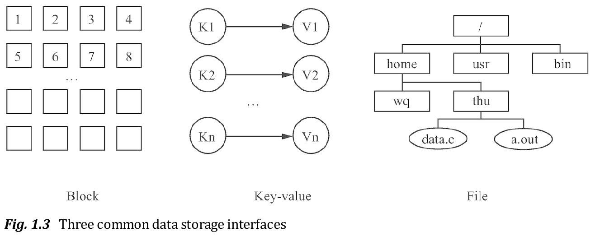
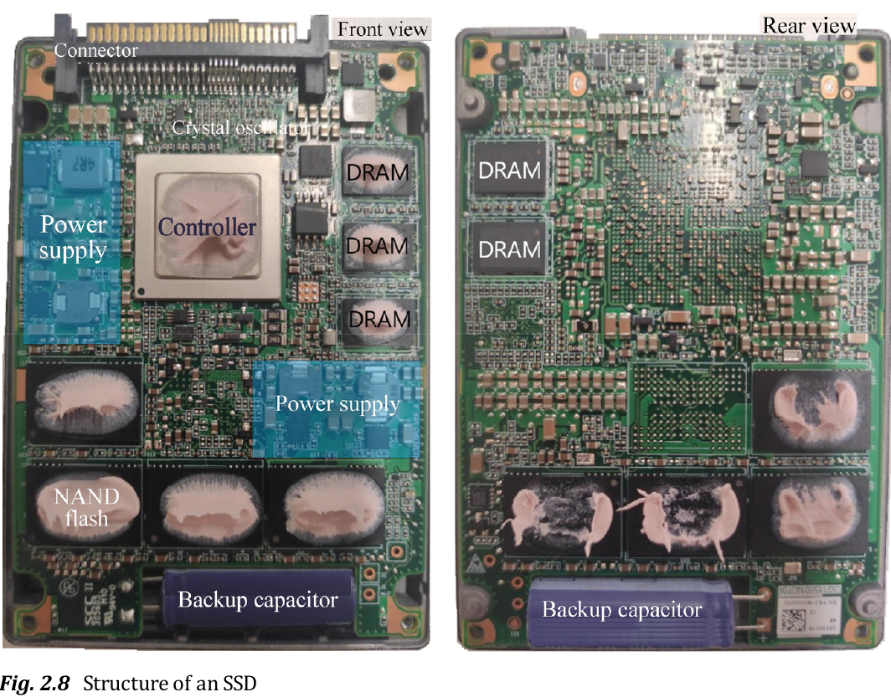

# Rust 中文学习教程
由于另一本书太难啃了,所以换这本书来试试咸淡.
## 基础
### 语句
```rs
fn add_with_extra(x: i32, y: i32) -> i32 {
    let x = x + 1; // 语句
    let y = y + 5; // 语句
    x + y // 表达式
}
```
语句会执行一些操作但是不会返回一个值，而表达式会在求值后返回一个值，因此在上述函数体的三行代码中，前两行是语句，最后一行是表达式。
### 函数
单元类型 ()，是一个零长度的元组。它没啥作用，但是可以用来表达一个函数没有返回值:
```rs
use std::fmt::Debug;

// 隐式返回
fn report<T: Debug>(item: T) {
  println!("{:?}", item);

}

// 显式返回
fn clear(text: &mut String) -> () {
  *text = String::from("");
}
```
### 所有权和引用
Rust引入了所有权之后,我们写函数时就要尽量地通过引用来处理数据,不然一不小心就会发生所有权转移问题.

- 正如变量默认不可变一样，引用指向的值默认也是不可变的,如果变量没写mut,自然无法修改引用的值,如果引用没写mut,也无法修改引用的值.

### 复合类型
#### 字符串
>Rust 在语言级别，只有一种字符串类型： str，它通常是以引用类型出现 &str，也就是上文提到的字符串切片。虽然语言级别只有上述的 str 类型，但是在标准库里，还有多种不同用途的字符串类型，其中使用最广的即是 String 类型。

str 类型是硬编码进可执行文件，也无法被修改，但是 String 则是一个可增长、可改变且具有所有权的 UTF-8 编码字符串

- 这一段话太关键了,之前那本rust书都没有清楚的指出这一点,导致我之前都懵懵懂懂的

##### 切片
切片的写法如下:
```rs
let s = String::from("hello");

let slice = &s[0..2];
let slice = &s[..2];
```
由于切片是引用,所以必须通过`&`来标明借用
##### 索引
Rust不允许字符串索引,因为要避免其他语言中常见的UTF-8字符报错(中文常常要占用3个或者4个字节),所以我们只能用切片来分割字符串,但如果分割不当,rust也会报错:
```rs
let hello = "中国人";

let s = &hello[0..2];

// thread 'main' panicked at 'byte index 2 is not a char boundary; it is inside '中' (bytes 0..3) of `中国人`', src/main.rs:4:14
// note: run with `RUST_BACKTRACE=1` environment variable to display a backtrace
```

- 这管的也太宽了...

#### 元组
```rs
fn main() {
    let x: (i32, f64, u8) = (500, 6.4, 1);

    let five_hundred = x.0;

    let six_point_four = x.1;

    let one = x.2;
}
```
#### 结构体
```rs
struct User {
    active: bool,
    username: String,
    email: String,
    sign_in_count: u64,
}

let user1 = User {
    email: String::from("someone@example.com"),
    username: String::from("someusername123"),
    active: true,
    sign_in_count: 1,
};
```
如果要修改结构体,就必须将结构体实例声明为可变的:
```rs
    let mut user1 = User {
        email: String::from("someone@example.com"),
        username: String::from("someusername123"),
        active: true,
        sign_in_count: 1,
    };

    user1.email = String::from("anotheremail@example.com");
```

```rs
fn build_user(email: String, username: String) -> User {
    User {
        email,
        username,
        active: true,
        sign_in_count: 1,
    }
}
```
如上所示，当函数参数和结构体字段同名时，可以直接使用缩略的方式进行初始化，跟 TypeScript 中一模一样。

```rs
  let user2 = User {
        active: user1.active,
        username: user1.username,
        email: String::from("another@example.com"),
        sign_in_count: user1.sign_in_count,
    };
  let user2 = User {
    email: String::from("another@example.com"),
    ..user1
  };
```
可能是为了表示这并非对象展开,而是原样继承,才用的两个点吧.


把结构体中具有所有权的字段转移出去后，将无法再访问该字段，但是可以正常访问其它的字段。
```rs
# #[derive(Debug)]
# struct User {
#     active: bool,
#     username: String,
#     email: String,
#     sign_in_count: u64,
# }
# fn main() {
let user1 = User {
    email: String::from("someone@example.com"),
    username: String::from("someusername123"),
    active: true,
    sign_in_count: 1,
};
let user2 = User {
    active: user1.active,
    username: user1.username,
    email: String::from("another@example.com"),
    sign_in_count: user1.sign_in_count,
};
println!("{}", user1.active);
// 下面这行会报错
println!("{:?}", user1);
# }
```
#### Enum
```rs
enum PokerSuit {
  Clubs,
  Spades,
  Diamonds,
  Hearts,
}

let heart = PokerSuit::Hearts;
let diamond = PokerSuit::Diamonds;
```
可以看到rust使用`::`来访问枚举成员,这一点是继承了Cpp的写法的.

枚举自然可以赋值:
```rs
enum PokerCard {
    Clubs(u8),
    Spades(u8),
    Diamonds(u8),
    Hearts(u8),
}

fn main() {
   let c1 = PokerCard::Spades(5);
   let c2 = PokerCard::Diamonds(13);
}
```
#### 数组
>在 Rust 中，最常用的数组有两种，第一种是速度很快但是长度固定的 array，第二种是可动态增长的但是有性能损耗的 Vector，在本书中，我们称 array 为数组，Vector 为动态数组。

```rs
use std::io;

fn main() {
    let a = [1, 2, 3, 4, 5];

    println!("Please enter an array index.");

    let mut index = String::new();
    // 读取控制台的输出
    io::stdin()
        .read_line(&mut index)
        .expect("Failed to read line");

    let index: usize = index
        .trim()
        .parse()
        .expect("Index entered was not a number");

    let element = a[index];

    println!(
        "The value of the element at index {} is: {}",
        index, element
    );
}
```
与Go一样,[u8; 3]和[u8; 4]是不同的类型，数组的长度也是类型的一部分.


### 流程控制
```rs
fn main() {
    let condition = true;
    let number = if condition {
        5
    } else {
        6
    };

    println!("The value of number is: {}", number);
}
```
Rust中的流程控制可以返回语句,但也可以普通的执行:
```rs
fn main() {
    let n = 6;

    if n % 4 == 0 {
        println!("number is divisible by 4");
    } else if n % 3 == 0 {
        println!("number is divisible by 3");
    } else if n % 2 == 0 {
        println!("number is divisible by 2");
    } else {
        println!("number is not divisible by 4, 3, or 2");
    }
}
```

for-in循环:
```rs
// 第一种
let collection = [1, 2, 3, 4, 5];
for i in 0..collection.len() {
  let item = collection[i];
  // ...
}

// 第二种
for item in collection {

}
```
普通循环while:

```rs
fn main() {
    let mut n = 0;

    while n <= 5  {
        println!("{}!", n);

        n = n + 1;
    }

    println!("我出来了！");
}
```
无条件循环loop:
```rs
fn main() {
    let mut n = 0;

    loop {
        if n > 5 {
            break
        }
        println!("{}", n);
        n+=1;
    }

    println!("我出来了！");
}
```
### 模式匹配
#### match
```rs
enum Direction {
    East,
    West,
    North,
    South,
}

fn main() {
    let dire = Direction::South;
    match dire {
        Direction::East => println!("East"),
        Direction::North | Direction::South => {
            println!("South or North");
        },
        _ => println!("West"),
    };
}
```
- match 的匹配必须要穷举出所有可能，因此这里用 _ 来代表未列出的所有可能性
- match 的每一个分支都必须是一个表达式，且所有分支的表达式最终返回值的类型必须相同

- 这种简单的`=>`标记过于粗暴了

复杂一些的模式匹配:
```rs
enum Action {
    Say(String),
    MoveTo(i32, i32),
    ChangeColorRGB(u16, u16, u16),
}

fn main() {
    let actions = [
        Action::Say("Hello Rust".to_string()),
        Action::MoveTo(1,2),
        Action::ChangeColorRGB(255,255,0),
    ];
    for action in actions {
        match action {
            Action::Say(s) => {
                println!("{}", s);
            },
            Action::MoveTo(x, y) => {
                println!("point from (0, 0) move to ({}, {})", x, y);
            },
            Action::ChangeColorRGB(r, g, _) => {
                println!("change color into '(r:{}, g:{}, b:0)', 'b' has been ignored",
                    r, g,
                );
            }
        }
    }
}
```


#### if let
有时会遇到只有一个模式的值需要被处理，其它值直接忽略的场景，如果用 match 来处理就要写成下面这样：
```rs
let v = Some(3u8);
match v {
    Some(3) => println!("three"),
    _ => (),
}
```
简单的写法如下:
```rs
if let Some(3) = v {
    println!("three");
}
```
不管怎么看都很难看懂这个写法,不过这种情况使用if判断就足够了,不过可能之后有更高级的用法,所以就先放着.

#### Option
rust使用Option枚举来解决空指针问题
```rs
enum Option<T> {
    None,
    Some(T),
}
```

匹配:
```rs
fn plus_one(x: Option<i32>) -> Option<i32> {
    match x {
        None => None,
        Some(i) => Some(i + 1),
    }
}

let five = Some(5);
let six = plus_one(five);
let none = plus_one(None);
```
### 方法
Rust 使用 impl 来定义方法，例如以下代码：
```rs
struct Circle {
    x: f64,
    y: f64,
    radius: f64,
}

impl Circle {
    // new是Circle的关联函数，因为它的第一个参数不是self，且new并不是关键字
    // 这种方法往往用于初始化当前结构体的实例
    fn new(x: f64, y: f64, radius: f64) -> Circle {
        Circle {
            x: x,
            y: y,
            radius: radius,
        }
    }

    // Circle的方法，&self表示借用当前的Circle结构体
    fn area(&self) -> f64 {
        std::f64::consts::PI * (self.radius * self.radius)
    }
}
```
因为是函数，所以不能用 . 的方式来调用，我们需要用 :: 来调用，例如 `let sq = Rectangle::new(3, 3);。`


### 注释和文档
Rust的代码注释和Cpp完全相同,但它额外有一个文档注释的神奇功能

当查看一个 crates.io 上的包时，往往需要通过它提供的文档来浏览相关的功能特性、使用方式，这种文档就是通过文档注释实现的。

Rust 提供了 cargo doc 的命令，可以用于把这些文档注释转换成 HTML 网页文件，最终展示给用户浏览，这样用户就知道这个包是做什么的以及该如何使用。

格式如下:
```rs
/// `add_one` 将指定值加1
///
/// # Examples
///
/// ```
/// let arg = 5;
/// let answer = my_crate::add_one(arg);
///
/// assert_eq!(6, answer);
/// ```
pub fn add_one(x: i32) -> i32 {
    x + 1
}
```
使用单行的`///`或者多行的`/** ... */`标明文档注释,并可以使用md语法

除了给函数加注释,还可以给包和模块加注释,包级别的注释也分为两种：行注释 `//!` 和块注释 `/*! ... */`。只要放在文件内部的最上方就可以:
```rs
/*! lib包是world_hello二进制包的依赖包，
 里面包含了compute等有用模块 */

pub mod compute;
```
### 格式化输出
```rs
println!("Hello");                 // => "Hello"
println!("Hello, {}!", "world");   // => "Hello, world!"
println!("The number is {}", 1);   // => "The number is 1"
println!("{:?}", (3, 4));          // => "(3, 4)"
println!("{value}", value=4);      // => "4"
println!("{} {}", 1, 2);           // => "1 2"
println!("{:04}", 42);             // => "0042" with leading zeros
```
rust别具一格的使用`{}`作为占位符,并通过`"?`这样的简洁语法实现不同的格式化输出.

# Data Storage Architectures and Technologies
## 简介
一开始是从Zlib上看到了英文版,觉得可能很适合我,随意地翻阅了一下,发现果然是本比较优秀的教材,后来发现原来这书是先出的中文版嘛,叫做`数据存储架构与技术 (第2版)`
## 简要介绍
>数据存储性能通常以**吞吐量和延迟**来衡量。吞吐量指单位时间内存储系统能处理的操作数量，而延迟则是完成单次操作所需的时间

数据存储的另一个目标是高可用性(high usability)，这能提升上层应用与存储系统之间的交互效率，包括更快速的数据写入和更高效的读取操作,也就是说要能设计出一个良好的接口供其他人使用



高可靠性(High Reliability)存储能够在系统异常（包括磁盘、服务器和网络故障以及人为错误）时防止数据丢失和服务中断,实现高可靠性最基础的方法之一是利用数据冗余,最著名的就是RAID了,通过多副本和纠错码,能够大幅度降低出错的概率.
## 存储介质
>**磁存储介质**利用磁性粒子的磁极来记录数据，两种磁化方向分别代表数据“0”和“1”。采用磁存储介质的常见存储盘有**磁盘和磁带**。**电存储介质**利用存储单元中存储的电子数量来记录数据，电子数量影响位线的电平，表示数据“0”或“1”。采用电存储介质的常见存储盘包括**闪存和动态随机存取存储器**。对于**光存储介质**，使用激光照射介质，使介质发生物理或化学变化来表示“0”和“1”。采用光存储介质的常见存储盘有**CD光盘、DVD光盘、蓝光光盘和归档光盘**。
### HDD(hard disk drives)-硬盘驱动器,也被称为机械硬盘
机械硬盘由于需要等待盘片的旋转和磁头的定位时间,所以在性能上并没有多好,但由于价格便宜,所以仍然在不断发展和改进中.
### SSD(solid-state drives)-固态硬盘
目前，固态硬盘主要使用闪存或其他非易失性内存芯片，如相变存储器。



- 可以发现SSD的结构比起HDD来相当复杂.

由于闪存是一种electrically erasable programmable read-only memory,所以每次写入新数据时都要进行擦写,而一个存储单元的擦写次数是有上限的,一旦达到这个上限,SSD也就等于失效了.为延长SSD寿命，闪存转换层采用磨损均衡策略，尽可能将擦写次数均匀分配给所有页面

### Main Memory
目前，主存储器普遍使用DRAM介质,如名字所说,是Random Access的,所以存取速度极快.
### 剩余部分
介绍了PCM,RRAM,MRAM等新型结构,不太需要关注.

## Storage Arrays
简单介绍了一下RAID等阵列结构
## 存储协议
>目前，计算机存储架构主要采用存储块协议，按照固定数据块大小的倍数对存储设备进行数据访问。典型的存储块协议包括SCSI协议和NVMe协议


# SQL反模式


# C++ CRASH COURSE
>本书面向已经熟悉基本编程概念的中级到高级程序员。若您没有特定的系统编程经验也没关系，欢迎有经验的应用程序程序员阅读。

## C++基础
过于Crash了,讲的不够详细.只好摘抄重点了.
### 对象生命周期


# PROFESSIONAL C++
# C++ High Performance
# Beginning C,From Beginner to Pro
确实很适合入门,可惜的是当初没看到这本书
## 指针与内存分配
当你使用malloc()函数时，你需要在程序中包含stdlib.h头文件。，你将希望分配的内存字节数作为参数指定。该函数返回它根据你的请求分配的内存中第一个字节的地址。因为你得到一个返回的地址，所以指针是唯一能存放它的地方。
```c
int *pNumber = (int*)malloc(100);
```
由于malloc返回的是`void*`,会自动转换,所以右边那个强制转换可以不用写,而在cpp中,我们推荐直接用new,从而避开万恶的空指针问题:
```cpp
int* pNumber = new int[100];

// 使用 pNumber[0] 到 pNumber[99]

delete[] pNumber;
pNumber = nullptr;
```

更多的还有calloc,realloc等方法,但我真切的希望这些函数我之后再也碰不到比较好.
## 属性语法
很惊讶的是这本书引入了不少C23的内容,其中属性语法是我觉得很不错的一个功能,该语法于C++11引入,而C语言直到C23才开始使用.

一个最简单的属性写法如下:
```c
[[ noreturn ]] void f(){ exit(0); }
```
属性使用两个`[]`来标识,里面的属性名用于告诉编译器这是什么类型的函数,我们还可以额外提供调试输出语句,用`()`包裹:
```c
[[deprecated("Use mobile_phone() instead.")]]
void payphones()
{
printf("Payphones are deprecated.\n");
}
```
可以发现,这和Java5中的注解极其相似,而实现难度其实并不大,但仍旧过了这么久才正式推出,足以说明C的陈旧.

## 基本输入与输出
>Each serial input source and output destination in C is called a stream.

流独立于所涉及的物理设备，如显示器或键盘。程序使用的每个设备都可以关联一个或多个流，这取决于它是单向设备（如键盘）还是能代表多个数据源或目标的设备（如磁盘驱动器）。
## 结构体
```c
struct Horse
{
    int age;
    int height;
    char name[20];
    char father[20];
    char mother[20];
};

struct Horse dobbin = {
    24, 17, "Dobbim", "Trigger", "Flossie"
};
```
## Union
```c
union U_example
{
    float decval;
    int *pnum;
    double my_value;
} ul;

union U_example u2, u3;
u1.decval = 2.5;
u2.decval = 3.5*u1.decval;
```
Union与结构体的不同之处在于,所有成员都共享最长变量的内存空间,赋值时会覆盖之前的变量值,同一时刻只有最后一次被赋值的成员是有效的,总的来说我们不会这么缺内存,所以Struct几乎永远是Union的上位替代.

## 处理文件
简单涉及了几个文件操作函数的使用方法
## The Preprocessor and Debugging
直到这里才开始讲头文件和static关键字,完美诠释了真正的循序渐进是怎样的.

避免头文件被包含多次:
```c
// MyHeader.h
#if !defined MYHEADER_H
#define MYHEADER_H
// All the statements in the file...
#endif
```

预处理中的选择语句:
```c
#if CPU == Intel_i7
printf_s("Performance should be good.\n" );
#else
printf_s("Performance may not be so good.\n" );
#endif
```
# EFFECTIVE C
非常一般,实际上就是讲一遍C语言基础,远不如上面那本书
# Fluent C
结构比较清晰,先给一个上下文(context),再指出其中的问题(problem),最后给出推荐的解决方案(Solution),重复个几十遍.

也正因为如此,不是精通C的程序员看了也记不住,精通C的程序员遇到了问题来看才差不多.

# MySQL是怎样运行的(待补充)
## 基本
### 架构


- MySQL的查询缓存过于低效,需要查询语句完全相同才可以生效,所以在8.0版本后被彻底废除


>在客户端程序发起连接的时候，需要携带主机信息、用户名、密码，服务器程序会对客户端程序提供的这些信息进行认证，如果认证失败，服务器程序会拒绝连接

MySQL中的存储引擎列举:
| 存储引擎  | 描述                                 |
| --------- | ------------------------------------ |
| ARCHIVE   | 用于数据存档（行被插入后不能再修改） |
| BLACKHOLE | 丢弃写操作，读操作会返回空内容       |
| CSV       | 在存储数据时，以逗号分隔各个数据项   |
| FEDERATED | 用来访问远程表                       |
| InnoDB    | 具备外键支持功能的事务存储引擎       |
| MEMORY    | 置于内存的表                         |
| MERGE     | 用来管理多个MyISAM表构成的表集合     |
| MyISAM    | 主要的非事务处理存储引擎             |
| NDB       | MySQL集群专用存储引擎                |

我们最常用的就是InnoDB(默认引擎)和MyISAM(旧系统),有时候会用Memory(临时数据),用法如下:
```sql
CREATE TABLE users (
    id BIGINT PRIMARY KEY,
    name VARCHAR(100)
) ENGINE = InnoDB;

CREATE TABLE cache_data (
    id INT PRIMARY KEY,
    value VARCHAR(255)
) ENGINE = MEMORY;
```
这被称为“可插拔存储引擎架构”

### 记录
>真实数据在不同存储引擎中存放的格式一般是不同的，甚至有的存储引擎比如 Memory 都不用磁盘来存储数据，也就是说关闭服务器后表中的数据就消失了。

>设计 InnoDB 存储引擎的大叔们到现在为止设计了4种不同类型的 行格式 ，分别是 Compact 、 Redundant 、Dynamic 和 Compressed 行格式


### 索引
MySQL采用B+树索引,叶子节点中存储了页号,行号等定位信息,InnoDB中一个B+树节点就是一个Page.

>InnoDB 内节点记录存“索引键 + 子页号”；聚簇索引叶子存完整行；二级索引叶子存“二级键 + 主键”，不存聚簇数据页号。
### 数据存储
因为 MySQL 的数据都是存在文件系统中的，就不得不受到文件系统的一些制约，这在数据库和表的命名、表的大小和性能方面体现的比较明显，比如下边这些方面：
- 数据库名称和表名称不得超过文件系统所允许的最大长度。
- 每个数据库都对应 数据目录 的一个子目录，数据库名称就是这个子目录的名称
- 文件长度受文件系统最大长度限制

总的来说,MySQL使用frm格式(frame)的文件来描述表结构,使用ibd文件来标记表的具体数据存放位置,这被称为表空间(table space),一个表空间可以对应多个区(extent),每个区由连续的64页组成(默认为1MB大小),我们的数据就存储在页中.

具体的文件结构就没必要去看了,看了也看不懂...
## 进阶
等工作了再来看吧,目前这些知识也够用了.

# 深入理解 AI Agent(待补充)
# Linkers and Loaders
本来以为这么有名的书内容一定很充实吧,结果发现完全比不上修养那本书,白期待一场.

# Designing Data-Intensive Applications, Second Edition(待补充)
## 前言
- 第一版于2017年出版,第二版于2026年出版,中间间隔了十年,所以章节内容上有了大幅度的改动.
- 第一版出版后就被很多人奉为神书,那么再版后想必更厉害了吧.

>There are hundreds of databases to choose from. Which one should you use for your application? The short answer is, “It depends.” The long answer is…​this book.

这才是软件工程最美丽的地方,技术的变迁和环境的动荡迫使着程序员们殚精竭虑,设计出符合当前情况的最好架构.
## 背景
先看看两位作者的title: Martin Kleppmann and Chris Riccomini

>Martin Kleppmann（马丁·克莱普曼）目前是英国剑桥大学计算机科学与技术系副教授（Associate Professor），主要研究去中心化系统、Local-first 协作软件和安全协议，并教授分布式系统和密码协议相关课程。此前曾在慕尼黑工业大学从事研究，并在剑桥大学获得博士学位。
>
>Kleppmann 在进入学术界以前做过多年互联网工程和创业。他曾共同创办并出售两家创业公司，也曾在 LinkedIn 等互联网公司从事大规模数据基础设施工作；其中还包括创业公司 Rapportive。

第一版的作者只有他一个人,还是很厉害的,他甚至还有一个[博客](https://martin.kleppmann.com)

Chris Riccomini,O'Reilly 对他的介绍是：拥有 15年以上软件工程经验，先后在 PayPal、LinkedIn、WePay 工作，目前经营 Materialized View Capital，投资基础设施类创业公司
## 基本
>如果一个应用程序开发过程中的主要挑战之一是数据管理，我们便称之为**数据密集型应用**.
>在计算密集型系统中，挑战在于将极其庞大的计算任务并行化；而在数据密集型应用中，我们通常更关注存储和处理海量数据、管理数据变更、在面临故障和并发时确保一致性，以及保证服务的高可用性等问题。

前两章基本都是经验之谈,可看的地方不多.
## 数据模型
对常见数据库的一个总结,稍微有一点看头
## 存储
>实际上，哈希表在数据库索引中的使用并不普遍。更常见的做法是按照键的顺序来组织数据

>本章目前为止讨论的数据结构都是为了解决磁盘的限制问题。与主存相比，磁盘操作起来更为不便。无论是机械硬盘还是固态硬盘，若要实现良好的读写性能，都需要精心安排数据布局。我们容忍这种不便，是因为磁盘拥有两大显著优势：持久性（断电时内容不会丢失）以及每吉字节成本低于RAM。

## 编码
介绍了Avro,Protobuf,Json Schema等主流编码方式
### Json Schema
不看不知道,原来Json Schema这么出名,MCP,OpenAPI,OAuth都用的是它,格式如下:
```json
{
  "type": "object",
  "properties": {
    "first_name": { "type": "string" },
    "last_name": { "type": "string" },
    "birthday": { "type": "string", "format": "date" },
    "address": {
       "type": "object",
       "properties": {
         "street_address": { "type": "string" },
         "city": { "type": "string" },
         "state": { "type": "string" },
         "country": { "type" : "string" }
       }
    }
  }
}
```

### RPC介绍
>本地函数调用是可预测的，其成功与否仅取决于你控制的参数。而网络请求则不可预测，原因完全不受你控制。例如，请求或响应可能因网络问题丢失，远程机器可能响应缓慢或不可用。网络问题很常见，因此应用程序必须预见这些问题（例如，通过重试失败的请求）。
>
>一个本地函数调用要么返回结果、抛出异常，要么永不返回（例如进入无限循环或进程崩溃）。而网络请求则有另一种可能的结果：可能因超时而无结果返回

- 这也是网络游戏制作的一个难点之一


## Replication
>如果你复制的数据不随时间变化，复制操作就很简单：只需将数据一次性复制到所有节点即可完成任务。复制的所有难点在于处理被复制数据的变更

复制最大的难点在于如何保持同步,即便通过发送日志的方式来保持主从一致性,但如果SQL指令中有`Now,Rand`等结果未知的语句,或者具有无法预知的副作用如`trigger`,就会破坏这个一致性.

更为特殊的地方是,由于我们不可避免地要使用异步复制,那么很容易就出现读写不一致的问题,为了保证用户体验,我们需要通过单调读(Monotonic reads)来解决用户读取到更老版本的问题.

复制一共有三种方式: Single-leader,Multi-leader,Leaderless,各有千秋,只好看情况使用了.

# Coding Video,A Practical Guide to HEVC and Beyond(待补充)
## 介绍
>一秒标准的未压缩SD(576p)视频，每秒25帧，大约占用15.5 MB存储空间。这意味着，通过网络或广播频道实时传输这段视频，即每秒发送一秒可播放的视频内容，需要124 Mbit/s的带宽。而一秒未压缩的UHD/4K视频、每秒50帧捕捉，则大约占用620 MB存储空间，实时传输将需要高达5 Gbit/s的传输带宽。

- 由此可知,我们在电子产品中存储的视频都是压缩形式的,只在播放时进行实时的解码.


尽管我们拥有的存储容量和网络带宽比以往任何时候都要多，但存储和传输视频的需求仍在不断超出可用容量。到2023年，约三分之二的消费级电视机已达到4K分辨率或更高。将高性能视频编解码器集成到智能手机和电视等消费设备中，以及对高分辨率视频的期望，使得在存储或传输前压缩或编码视频，并在显示前解码视频成为常态
# Building Microservices(待补充)
## 基础