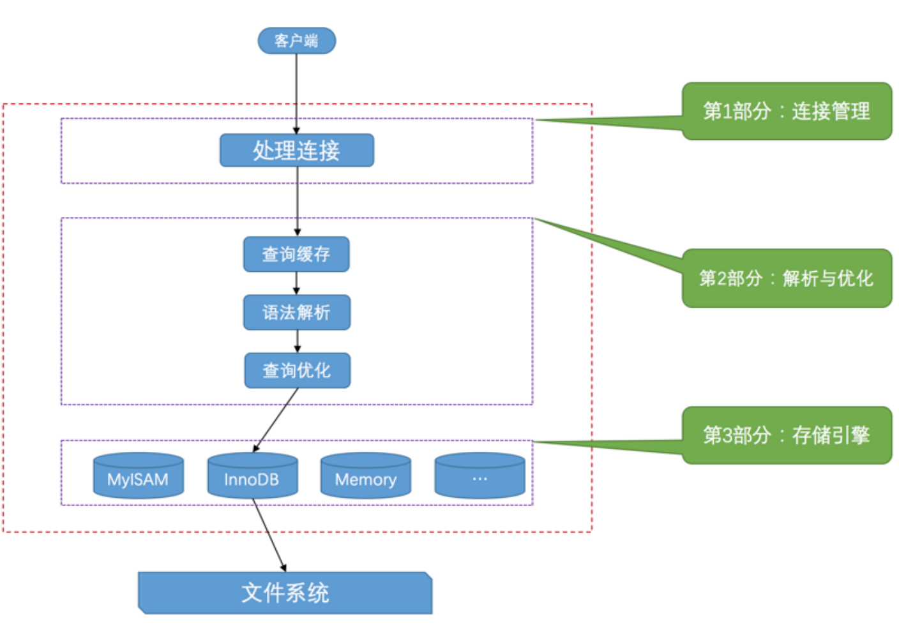

# Rust 中文学习教程
由于另一本书太难啃了,所以换这本书来试试咸淡.
## 基础
### 语句
```rs
fn add_with_extra(x: i32, y: i32) -> i32 {
    let x = x + 1; // 语句
    let y = y + 5; // 语句
    x + y // 表达式
}
```
语句会执行一些操作但是不会返回一个值，而表达式会在求值后返回一个值，因此在上述函数体的三行代码中，前两行是语句，最后一行是表达式。
### 函数
单元类型 ()，是一个零长度的元组。它没啥作用，但是可以用来表达一个函数没有返回值:
```rs
use std::fmt::Debug;

// 隐式返回
fn report<T: Debug>(item: T) {
  println!("{:?}", item);

}

// 显式返回
fn clear(text: &mut String) -> () {
  *text = String::from("");
}
```
### 所有权和引用
Rust引入了所有权之后,我们写函数时就要尽量地通过引用来处理数据,不然一不小心就会发生所有权转移问题.

- 正如变量默认不可变一样，引用指向的值默认也是不可变的,如果变量没写mut,自然无法修改引用的值,如果引用没写mut,也无法修改引用的值.

### 复合类型
#### 字符串
>Rust 在语言级别，只有一种字符串类型： str，它通常是以引用类型出现 &str，也就是上文提到的字符串切片。虽然语言级别只有上述的 str 类型，但是在标准库里，还有多种不同用途的字符串类型，其中使用最广的即是 String 类型。

str 类型是硬编码进可执行文件，也无法被修改，但是 String 则是一个可增长、可改变且具有所有权的 UTF-8 编码字符串

- 这一段话太关键了,之前那本rust书都没有清楚的指出这一点,导致我之前都懵懵懂懂的

##### 切片
切片的写法如下:
```rs
let s = String::from("hello");

let slice = &s[0..2];
let slice = &s[..2];
```
由于切片是引用,所以必须通过`&`来标明借用
##### 索引
Rust不允许字符串索引,因为要避免其他语言中常见的UTF-8字符报错(中文常常要占用3个或者4个字节),所以我们只能用切片来分割字符串,但如果分割不当,rust也会报错:
```rs
let hello = "中国人";

let s = &hello[0..2];

// thread 'main' panicked at 'byte index 2 is not a char boundary; it is inside '中' (bytes 0..3) of `中国人`', src/main.rs:4:14
// note: run with `RUST_BACKTRACE=1` environment variable to display a backtrace
```

- 这管的也太宽了...

#### 元组
```rs
fn main() {
    let x: (i32, f64, u8) = (500, 6.4, 1);

    let five_hundred = x.0;

    let six_point_four = x.1;

    let one = x.2;
}
```
#### 结构体
```rs
struct User {
    active: bool,
    username: String,
    email: String,
    sign_in_count: u64,
}

let user1 = User {
    email: String::from("someone@example.com"),
    username: String::from("someusername123"),
    active: true,
    sign_in_count: 1,
};
```
如果要修改结构体,就必须将结构体实例声明为可变的:
```rs
    let mut user1 = User {
        email: String::from("someone@example.com"),
        username: String::from("someusername123"),
        active: true,
        sign_in_count: 1,
    };

    user1.email = String::from("anotheremail@example.com");
```

```rs
fn build_user(email: String, username: String) -> User {
    User {
        email,
        username,
        active: true,
        sign_in_count: 1,
    }
}
```
如上所示，当函数参数和结构体字段同名时，可以直接使用缩略的方式进行初始化，跟 TypeScript 中一模一样。

```rs
  let user2 = User {
        active: user1.active,
        username: user1.username,
        email: String::from("another@example.com"),
        sign_in_count: user1.sign_in_count,
    };
  let user2 = User {
    email: String::from("another@example.com"),
    ..user1
  };
```
可能是为了表示这并非对象展开,而是原样继承,才用的两个点吧.


把结构体中具有所有权的字段转移出去后，将无法再访问该字段，但是可以正常访问其它的字段。
```rs
# #[derive(Debug)]
# struct User {
#     active: bool,
#     username: String,
#     email: String,
#     sign_in_count: u64,
# }
# fn main() {
let user1 = User {
    email: String::from("someone@example.com"),
    username: String::from("someusername123"),
    active: true,
    sign_in_count: 1,
};
let user2 = User {
    active: user1.active,
    username: user1.username,
    email: String::from("another@example.com"),
    sign_in_count: user1.sign_in_count,
};
println!("{}", user1.active);
// 下面这行会报错
println!("{:?}", user1);
# }
```

# MySQL是怎样运行的
## 基本
### 架构


- MySQL的查询缓存过于低效,需要查询语句完全相同才可以生效,所以在8.0版本后被彻底废除


>在客户端程序发起连接的时候，需要携带主机信息、用户名、密码，服务器程序会对客户端程序提供的这些信息进行认证，如果认证失败，服务器程序会拒绝连接

MySQL中的存储引擎列举:
| 存储引擎  | 描述                                 |
| --------- | ------------------------------------ |
| ARCHIVE   | 用于数据存档（行被插入后不能再修改） |
| BLACKHOLE | 丢弃写操作，读操作会返回空内容       |
| CSV       | 在存储数据时，以逗号分隔各个数据项   |
| FEDERATED | 用来访问远程表                       |
| InnoDB    | 具备外键支持功能的事务存储引擎       |
| MEMORY    | 置于内存的表                         |
| MERGE     | 用来管理多个MyISAM表构成的表集合     |
| MyISAM    | 主要的非事务处理存储引擎             |
| NDB       | MySQL集群专用存储引擎                |

我们最常用的就是InnoDB(默认引擎)和MyISAM(旧系统),有时候会用Memory(临时数据),用法如下:
```sql
CREATE TABLE users (
    id BIGINT PRIMARY KEY,
    name VARCHAR(100)
) ENGINE = InnoDB;

CREATE TABLE cache_data (
    id INT PRIMARY KEY,
    value VARCHAR(255)
) ENGINE = MEMORY;
```
这被称为“可插拔存储引擎架构”

### 记录
>真实数据在不同存储引擎中存放的格式一般是不同的，甚至有的存储引擎比如 Memory 都不用磁盘来存储数据，也就是说关闭服务器后表中的数据就消失了。

>设计 InnoDB 存储引擎的大叔们到现在为止设计了4种不同类型的 行格式 ，分别是 Compact 、 Redundant 、Dynamic 和 Compressed 行格式


### 索引
MySQL采用B+树索引,叶子节点中存储了页号,行号等定位信息,InnoDB中一个B+树节点就是一个Page.

>InnoDB 内节点记录存“索引键 + 子页号”；聚簇索引叶子存完整行；二级索引叶子存“二级键 + 主键”，不存聚簇数据页号。

# Data Storage Architectures and Technologies
# Beginning C,From Beginner to Pro
确实很适合入门,可惜的是当初没看到这本书
## 指针

# EFFECTIVE C
# Fluent C
# C++ CRASH COURSE
# PROFESSIONAL C++

# 深入理解 AI Agent
# Linkers and Loaders
本来以为这么有名的书内容一定很充实吧,结果发现完全比不上修养那本书,白期待一场.

# Designing Data-Intensive Applications, Second Edition(待补充)
## 前言
- 第一版于2017年出版,第二版于2026年出版,中间间隔了十年,所以章节内容上有了大幅度的改动.
- 第一版出版后就被很多人奉为神书,那么再版后想必更厉害了吧.

>There are hundreds of databases to choose from. Which one should you use for your application? The short answer is, “It depends.” The long answer is…​this book.

这才是软件工程最美丽的地方,技术的变迁和环境的动荡迫使着程序员们殚精竭虑,设计出符合当前情况的最好架构.
## 背景
先看看两位作者的title: Martin Kleppmann and Chris Riccomini

>Martin Kleppmann（马丁·克莱普曼）目前是英国剑桥大学计算机科学与技术系副教授（Associate Professor），主要研究去中心化系统、Local-first 协作软件和安全协议，并教授分布式系统和密码协议相关课程。此前曾在慕尼黑工业大学从事研究，并在剑桥大学获得博士学位。
>
>Kleppmann 在进入学术界以前做过多年互联网工程和创业。他曾共同创办并出售两家创业公司，也曾在 LinkedIn 等互联网公司从事大规模数据基础设施工作；其中还包括创业公司 Rapportive。

第一版的作者只有他一个人,还是很厉害的,他甚至还有一个[博客](https://martin.kleppmann.com)

Chris Riccomini,O'Reilly 对他的介绍是：拥有 15年以上软件工程经验，先后在 PayPal、LinkedIn、WePay 工作，目前经营 Materialized View Capital，投资基础设施类创业公司
## 基本
>如果一个应用程序开发过程中的主要挑战之一是数据管理，我们便称之为**数据密集型应用**.
>在计算密集型系统中，挑战在于将极其庞大的计算任务并行化；而在数据密集型应用中，我们通常更关注存储和处理海量数据、管理数据变更、在面临故障和并发时确保一致性，以及保证服务的高可用性等问题。

前两章基本都是经验之谈,可看的地方不多.
## 数据模型
对常见数据库的一个总结,稍微有一点看头
## 存储
>实际上，哈希表在数据库索引中的使用并不普遍。更常见的做法是按照键的顺序来组织数据

>本章目前为止讨论的数据结构都是为了解决磁盘的限制问题。与主存相比，磁盘操作起来更为不便。无论是机械硬盘还是固态硬盘，若要实现良好的读写性能，都需要精心安排数据布局。我们容忍这种不便，是因为磁盘拥有两大显著优势：持久性（断电时内容不会丢失）以及每吉字节成本低于RAM。

## 编码
介绍了Avro,Protobuf,Json Schema等主流编码方式
### Json Schema
不看不知道,原来Json Schema这么出名,MCP,OpenAPI,OAuth都用的是它,格式如下:
```json
{
  "type": "object",
  "properties": {
    "first_name": { "type": "string" },
    "last_name": { "type": "string" },
    "birthday": { "type": "string", "format": "date" },
    "address": {
       "type": "object",
       "properties": {
         "street_address": { "type": "string" },
         "city": { "type": "string" },
         "state": { "type": "string" },
         "country": { "type" : "string" }
       }
    }
  }
}
```

### RPC介绍
>本地函数调用是可预测的，其成功与否仅取决于你控制的参数。而网络请求则不可预测，原因完全不受你控制。例如，请求或响应可能因网络问题丢失，远程机器可能响应缓慢或不可用。网络问题很常见，因此应用程序必须预见这些问题（例如，通过重试失败的请求）。
>
>一个本地函数调用要么返回结果、抛出异常，要么永不返回（例如进入无限循环或进程崩溃）。而网络请求则有另一种可能的结果：可能因超时而无结果返回

- 这也是网络游戏制作的一个难点之一


## Replication
>如果你复制的数据不随时间变化，复制操作就很简单：只需将数据一次性复制到所有节点即可完成任务。复制的所有难点在于处理被复制数据的变更

复制最大的难点在于如何保持同步,即便通过发送日志的方式来保持主从一致性,但如果SQL指令中有`Now,Rand`等结果未知的语句,或者具有无法预知的副作用如`trigger`,就会破坏这个一致性.

更为特殊的地方是,由于我们不可避免地要使用异步复制,那么很容易就出现读写不一致的问题,为了保证用户体验,我们需要通过单调读(Monotonic reads)来解决用户读取到更老版本的问题.

复制一共有三种方式: Single-leader,Multi-leader,Leaderless,各有千秋,只好看情况使用了.

# Coding Video,A Practical Guide to HEVC and Beyond(待补充)
## 介绍
>一秒标准的未压缩SD(576p)视频，每秒25帧，大约占用15.5 MB存储空间。这意味着，通过网络或广播频道实时传输这段视频，即每秒发送一秒可播放的视频内容，需要124 Mbit/s的带宽。而一秒未压缩的UHD/4K视频、每秒50帧捕捉，则大约占用620 MB存储空间，实时传输将需要高达5 Gbit/s的传输带宽。

- 由此可知,我们在电子产品中存储的视频都是压缩形式的,只在播放时进行实时的解码.


尽管我们拥有的存储容量和网络带宽比以往任何时候都要多，但存储和传输视频的需求仍在不断超出可用容量。到2023年，约三分之二的消费级电视机已达到4K分辨率或更高。将高性能视频编解码器集成到智能手机和电视等消费设备中，以及对高分辨率视频的期望，使得在存储或传输前压缩或编码视频，并在显示前解码视频成为常态
# Building Microservices(待补充)
## 基础