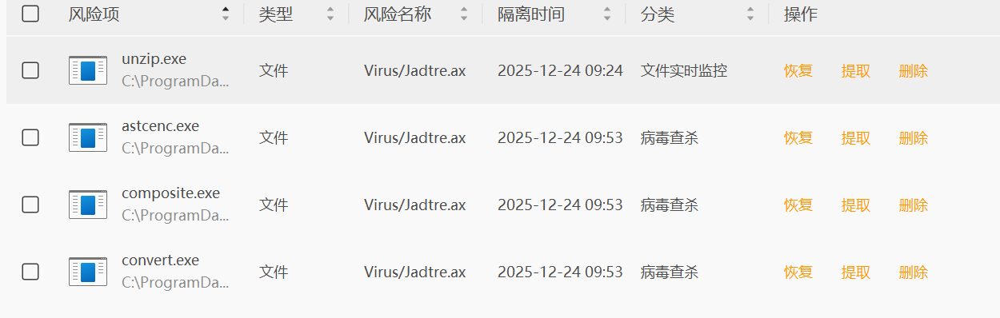

下了一个破解版游戏,结果火绒直接弹出窗口提示我有三百多个exe感染了jadtre ax 病毒

到这个时候我才发现我对网络安全实际上是一窍不通,
只好先用火绒把所有感染的exe放到隔离区,然后来了一个全盘扫描,我以后一定要好好研究一下计算机的底层知识和病毒攻击原理.

首先我找到了[计算机病毒百科](https://www.virusview.net/malware/Virus/Win32/Jadtre)里关于这个病毒的详细信息

>它会修改系统文件，包括操作系统的关键文件，以隐藏自身并且避免被杀软检测到。
该病毒会通过劫持用户的浏览器、修改主页和搜索引擎设置等方式，进行钓鱼攻击，诱导用户点击恶意链接，从而进一步传播病毒。
它会窃取用户的个人敏感信息，如登录密码、银行账号等，并将这些信息发送到黑客的服务器上。
病毒会利用系统的漏洞，进行远程控制，从而盗取用户的隐私信息或者操控计算机进行其他恶意行为。
该病毒还会利用系统资源进行挖矿或者进行分布式拒绝服务（DDoS）攻击。
它会禁用或损坏杀软程序的功能，以保证自身不被杀软识别和清除。

发现它主要是诱导用户点击恶意链接,还好火绒直接帮我拦截了网页跳转.

顺藤摸瓜找到了这个[网站](https://www.antiycloud.com/#/antiy/safeinfor),我才发现网络安全确实是一个壁垒高却极为重要的领域,
想着在网上找一点入门教程,结果用中文搜全是AI文章或者垃圾文字,再一次体会到中文互联网的封闭性,只好问gpt,找到了以下网站:
>By Sunday evening, you could have taken your first real step into cybersecurity.
Here are 15 websites to kick-start your cybersecurity journey (all beginner-friendly):
    1.	TryHackMe  – Hands-on labs for all skill levels
https://tryhackme.com
	2.	Hack The Box  – Gamified hacking challenges
https://www.hackthebox.com
	3.	Blue Team Labs Online  – Defensive security scenarios
https://lnkd.in/dckAehnQ
	4.	OverTheWire – Fun war games to learn Linux & networking
https://lnkd.in/d66wAqDb
	5.	PortSwigger Web Security Academy – Web app hacking from the pros
https://lnkd.in/dyrBGjRh
	6.	VulnHub – Download vulnerable machines and hack away
https://www.vulnhub.com
	7.	LetsDefend  – SOC analyst simulation
https://letsdefend.io
	8.	CyberDefenders  – Threat hunting and forensics labs
https://cyberdefenders.org
	9.	CTFtime – Find Capture the Flag competitions
https://ctftime.org
	10.	Security Blue Team  – Blue teaming certifications and practice
https://lnkd.in/dmuUFfQX
	11.	PentesterLab – Web security training
https://pentesterlab.com
	12.	MITRE ATT&CK – Learn real adversary tactics and techniques
https://attack.mitre.org
	13.	OWASP – Secure coding & app security resources
https://owasp.org
	14.	DFIR Diva – Free digital forensics resources
https://dfirdiva.com
	15.	Flare-On Challenges – Reverse engineering practice
https://flare-on.com

>[找到了一个汇总链接](https://github.com/404notf0und/Security-Data-Analysis-and-Visualization)
不多说了,尽管期末周快来了,兴趣学习的时间还是有的,开练.

---
**25号更新**
一开始我觉得这个病毒没什么危害性,就又把火绒隔离区里的exe给恢复了,现在发现我确实是智障,今晚扫描全盘发现基本所有的exe文件都被感染了,
里面有几百款游戏exe和工具exe,受不了了,太蠢了这也.我决定不再点击恢复文件,只能把这些文件全部删掉了.
好的,这下真的激发我对网络安全的兴趣了,做病毒真有这么好玩吗(😡)

这件事还让我看到火绒并不好用,虽然平时没什么弹窗打扰我,但是一但出事一点都救不了我.
病急乱投医,我甚至下载了360来试试,果不其然,连安装页面都没弹出来,就已经在修改我的注册表了,去你的吧!

然后看了看别人的推荐,又综合了各种考虑,先拿卡巴斯基来试试全盘扫描,竟然要花9个小时多.

**26号更新**
今天早上来看,发现问题并没有那么严重,大多数都是火绒的误报,我把那些隔离区里的exe上传到[文件病毒检测网站](https://internxt.com/virus-scanner)里发现根本没有病毒,受不了了.而卡巴斯基也成功地把那些真正的病毒删除干净了,滚吧您呐,让我投入卡巴斯基的怀抱吧!

### 参考链接
[1](https://iliu.org/thoughts-on-struggling-with-antivirus-software/)
[2](https://meledee.com/2025/03/4617.html)