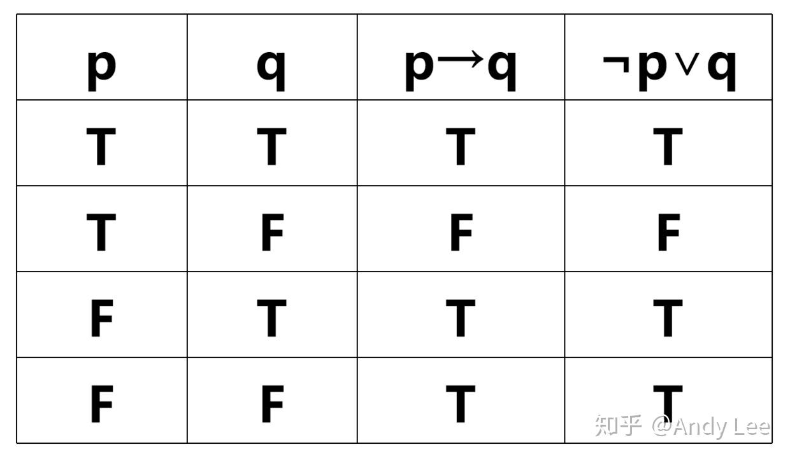
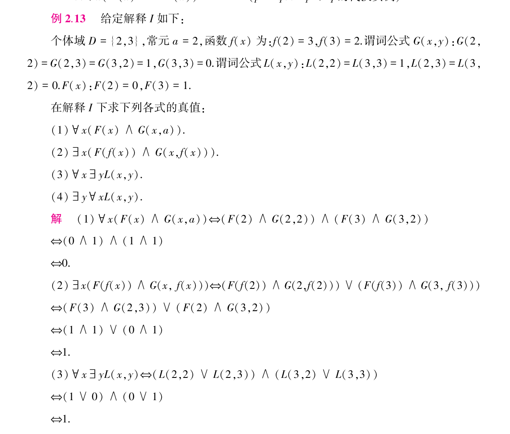
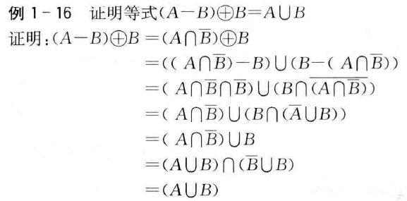
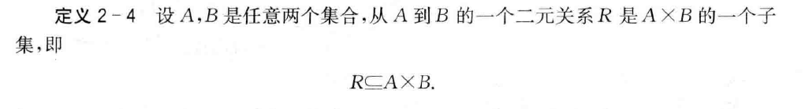
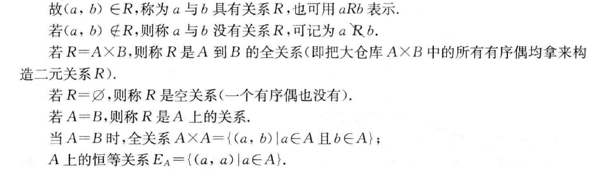
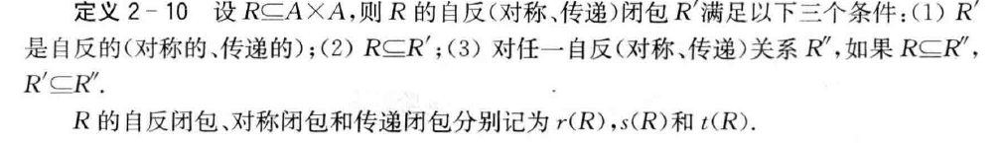
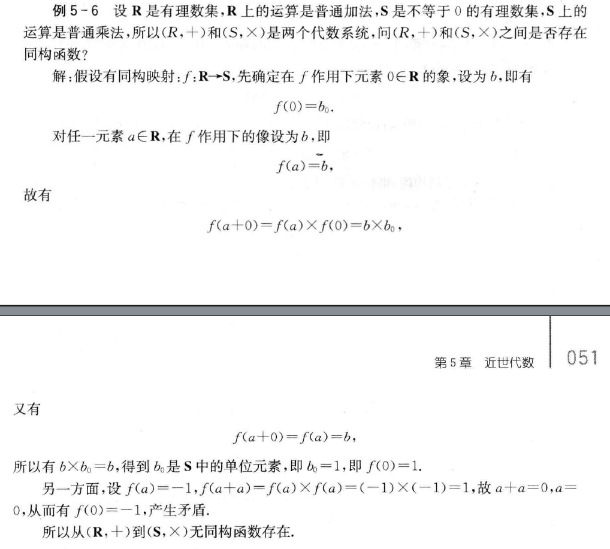
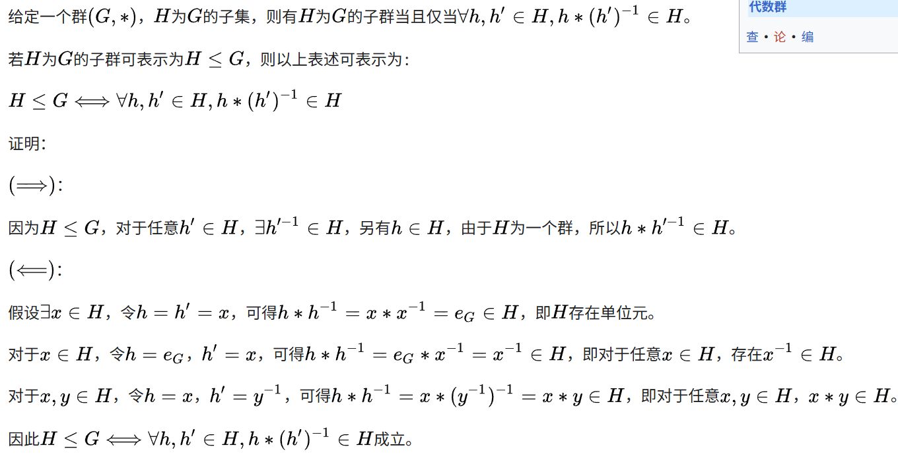

# 命题逻辑
## 逻辑联结词
### 析取与合取
>析取符号: ∨
>合取符号: ∧
+ 想象合取就是两个条件都要满足,析取符号就像漏斗一样析取东西,因此朝上

### 蕴含与等价
> p->q =¬p∨q


- 不要读作`如果p,那么q`,而是读作p蕴含q,表示p是q的充分条件,q是p的必要条件
- 我的理解:当p为真自然可以推出q为真,故p真q假真值为F,当p为假时无法得知q的情况,故只能默认为T

**真值表**


> p ↔ q=(¬p∨q)∧(¬q∨p)

- 由于p,q互为充要条件,故p与q真值相同时等价式为真
## 命题 
设A为一个命题公式
- 若A在所有赋值下都为真,则为重言式
- 若A在所有赋值下都为假,则为矛盾式
- 若至少有一组成真赋值,则为可满足式
---
>*不能被分解*,*真值确定*的简单陈述句称为**简单命题**(*原子命题*,*命题常项*) 
- (真值未知但确定也是命题)
- 真值可以变化的简单陈述句称为命题变项(**不是命题!!!!!!!!!!!!!!!!!!!!!!!!!!!**)
使用联结词联结简单命题形成的命题称为复合命题
## 逻辑等值式汇总

**双重否定律**
- `¬¬A ⇔ A`

**幂等律**
- `A ∧ A ⇔ A`
- `A ∨ A ⇔ A`

**交换律**
- `A ∨ B ⇔ B ∨ A`
- `A ∧ B ⇔ B ∧ A`

**结合律**
- `(A ∧ B) ∧ C ⇔ A ∧ (B ∧ C)`
- `(A ∨ B) ∨ C ⇔ A ∨ (B ∨ C)`

**分配律**
- `A ∨ (B ∧ C) ⇔ (A ∨ B) ∧ (A ∨ C)`
- `A ∧ (B ∨ C) ⇔ (A ∧ B) ∨ (A ∧ C)`

**德·摩根律**
- `¬(A ∨ B) ⇔ ¬A ∧ ¬B`
- `¬(A ∧ B) ⇔ ¬A ∨ ¬B`

**吸收律**
- `A ∨ (A ∧ B) ⇔ A`
- `A ∧ (A ∨ B) ⇔ A`

**零律**
- `A ∨ 1 ⇔ 1`
- `A ∧ 0 ⇔ 0`

**同一律**
- `A ∨ 0 ⇔ A`
- `A ∧ 1 ⇔ A`

**排中律**
- `A ∨ ¬A ⇔ 1`

**矛盾律**
- `A ∧ ¬A ⇔ 0`

**蕴涵等值式**
- `A → B ⇔ ¬A ∨ B`

**等价等值式**
- `A ↔ B ⇔ (A → B) ∧ (B → A)`

**假言易位（逆否命题）**
- `A → B ⇔ ¬B → ¬A`

**等价否定等值式**
- `A ↔ B ⇔ ¬A ↔ ¬B`

**归谬论**
- `(A → B) ∧ (A → ¬B) ⇔ ¬A`

**对称差等值式**
- `A ⊕ B ⇔ (A ∨ B) ∧ ¬(A ∧ B)`
- `A ⊕ B ⇔ (A ∧ ¬B) ∨ (¬A ∧ B)`
## 联结词完备集
### 定义
>设 S 是一个联结词集合。若任意真值函数都可以由**仅含 S 中联结词**构成的命题公式来表示，则称 S 为**联结词完备集**
- 这里的真值函数可以看作是命题对应的函数,不同形式但等价的命题有相同的真值函数
### 与非和或非

- 与非:`p ↑ q = ¬(p ∧ q)`

- 或非:`p ↓ q = ¬(p ∨ q)`

>可以把箭头想象成水流,自然要从开口进入,这样就好记忆了

### 联结词完备集整理

| 编号 | 联结词集合      | 是否完备 | 证明思路 / 说明                                                                                                   |
| ---- | --------------- | -------- | ----------------------------------------------------------------------------------------------------------------- |
| S1   | {¬, ∧, ∨, →, ↔} | 完备     | 包含 ¬（非）、∧（与）、∨（或）三种基本联结词，可表示所有 n 元真值函数（经典教材定理）。→ 和 ↔ 可由 ¬、∧、∨ 表示。 |
| S2   | {¬, ∧, ∨, →}    | 完备     | 包含 ¬、∧、∨，能表示任意 n 元真值函数；→ 可由 ¬、∨ 表示（p → q ≡ ¬p ∨ q）。                                       |
| S3   | {¬, ∧, ∨}       | 完备     | 经典完备集，¬、∧、∨ 可表示任意 n 元真值函数。                                                                     |
| S4   | {¬, ∧}          | 完备     | 通过与非公式可表示 ∨：p ∨ q ≡ ¬(¬p ∧ ¬q)。因此可表示 ¬、∧、∨ → 完备。                                             |
| S5   | {¬, ∨}          | 完备     | 通过或非公式可表示 ∧：p ∧ q ≡ ¬(¬p ∨ ¬q)。因此可表示 ¬、∧、∨ → 完备。                                             |
| S6   | {¬, →}          | 完备     | 通过 ¬ 与 → 可以表示 ∧ 和 ∨：                                                                                     |

>观察可以知道,只要有¬和基础联结词中三个中的一个就是完备集

同时↑和↓可以单独作为完备集

#### 与非（↑）单独作为完备集

- ¬p ≡ p ↑ p
- p ∧ q ≡ (p ↑ q) ↑ (p ↑ q)

**证明提示**
- ¬¬(p ∧ q)=¬(p↑q)

#### 或非（↓）单独作为完备集

- ¬p ≡ p ↓ p
- p ∨ q ≡ (p ↓ q) ↓ (p ↓ q)


## 范式

### 合取范式和析取范式

>析取范式:由有限个简单合取式构成的析取式
合取范式:由有限个简单析取式构成的合取式

`极小项:简单合取式中每个命题变项及其否定有且只有一个出现过一次`
`极大项:简单析取式中每个命题变项及其否定有且只有一个出现过一次`

>为什么说是极小项,因为所有命题的交集覆盖范围是最小的,效力最弱;而极大则是因为所有命题的并集覆盖范围是最大的,效力最强

- 若命题A的析取范式中所有合取式都是极小项,则称为A的**主析取范式**
- 若命题A的合取范式中所有析取式都是极大项,则称为A的**主合取范式**
  
>这时可以对每个极小项进行编码成m(001),每个极大项为M(001)这样的形式,用角标来表示主析取范式和主合取范式
#### 计算方法
求A的主析取范式的方法
>若合取式B中不含命题变项p及其否定,则将B展开为合取形式B ∧ (p ∨ ¬p),消去重复出现的命题和极小项,将极小项按照角标由小到大的形式排列
- 至于为什么用合取形式而不是用析取形式B ∨(p ∧ ¬p),是因为要保证每个字式仍然是简单合取式

>求出主析取范式后就可以求主合取范式了,主析取范式中没出现的极小项的角标作为极大项的角标,这些极大项构成的合取式为A的主合取范式.
- 当然反过来也是可以的
  


# 一阶逻辑
## 个体与谓词
> - 个体常项:表示具体或特定个体的词,用a,b,c...表示
> - 个体变项:表示抽象或泛指个体的词,用x,y,z...表示
> - 个体变项的取值范围称为个体域
>当无特殊声明时,个体域可以表示所有事物,称为全总个体域
> - 谓词常项与谓词变项和上述概念对应,用F,G,H...表示
> 谓词中包含的个体数称为元数,n元谓词含有n个个体词,0元谓词就是简单命题


## 合式公式
> 合式公式:也叫谓词公式,简称**公式**,看做是命题A加上量词或者个体变项后的形态例如"∀x(A∧B)"就行了
>
>在"∀xA","∃xA"中的x称为指导变项,A为相应量词的辖域,在辖域x的所有出现称为约束出现,不受辖域约束的出现称为自由出现

- 若公式A中**无自由出现的个体变项**,则称A为封闭的合式公式,简称闭式

>**换名规则**: 将一个指导变项及其在辖域中所有的约束出现替换成没出现过的个体变项符号

- 换句话说换名就是让公式中不存在既是自由出现又是约束出现的个体变项
  
解释: 对公式A中出现的每个个体常项和谓词变项进行赋值,由以下四部分构成
1. 非空个体域D
2. 给个体常项指定一个D中的元素
3. 给函数变项指定一个D上的函数
4. 给谓词变项指定一个D上的谓词

>这个时候∀可以看作是∧,∃就看作是∨,这个通过下面的例题就很好理解了

 **例子**

- (1)中直接把x=2和x=3的情况用∧连接了

## 等值式和前束范式

>等值式:若A ↔ B为永真式,则称A与B是等值的,记作`A⇔B`
>前束范式:A=QB,其中Q为∀x或者∃x这样的形式,B为不含量词的谓词公式
### 一、量词否定等值式

* `¬∀xA(x) ⇔ ∃x¬A(x)`
* `¬∃xA(x) ⇔ ∀x¬A(x)`

### 二、量词辖域收缩与扩张等值式（B 中不含 x）

* `∀x(A(x) ∨ B) ⇔ ∀xA(x) ∨ B`

* `∀x(A(x) ∧ B) ⇔ ∀xA(x) ∧ B`

* `∀x(A(x) → B) ⇔ ∃xA(x) → B`

* `∀x(B → A(x)) ⇔ B → ∀xA(x)`

* `∃x(A(x) ∨ B) ⇔ ∃xA(x) ∨ B`

* `∃x(A(x) ∧ B) ⇔ ∃xA(x) ∧ B`

* `∃x(A(x) → B) ⇔ ∀xA(x) → B`

* `∃x(B → A(x)) ⇔ B → ∃xA(x)`

### 三、量词分配等值式

* `∀x(A(x) ∧ B(x)) ⇔ ∀xA(x) ∧ ∀xB(x)`
* `∃x(A(x) ∨ B(x)) ⇔ ∃xA(x) ∨ ∃xB(x)`
  
注意到∀对∨是不可分配的,∃对∧是不可分配的,这也很好理解.
>因为含有B的公式中的约束变元x都本应该写成y(防止与A中的x相同),但在`∀xA(x) ∧ ∀yB(y)`中由于`∧`需要满足两边式子都成立,因此x=y时也要成立,所以可以写成`∀x(A(x) ∧ B(x))`,而若 是`∀xA(x) ∨ ∀yB(y)`只需要有一边式子成立,故当x=y时可能有一边不满足.
>
>同时,`∃xA(x) ∨ ∃yB(y)`由于只要找到一个数z满足一边条件就能让式子成立,无论是x=z还是y=z都可以,因此可以写成`∃x(A(x) ∨ B(x)) `,而`∃xA(x) ∧ ∃yB(y)`中由于需要找到两个数z1,z2使得这个式子满足,而这两个数不一定相等,故不能合并.

# 集合与关系
## 集合概念
### 真包含
* A ⊂ B 当且仅当

  * 对任意 x，若 x ∈ A，则 x ∈ B
  * 且 A ≠ B
### 幂集

> P(A)：A 的所有子集组成的集合

**公式：**
P(A) = { B | B ⊆ A }
|p(A)|=2^|A|
## 集合运算
### 相对补
* `A - B = A ∩ ~B`
### 对称差
* `A ⊕ B = (A − B) ∪ (B − A)`
* `A ⊕ B = (A ∪ B) − (A ∩ B)`

>对称差运算满足结合律,交换律,分配律,消去律
其中分配律最难理解

证明：`A ∩ (B ⊕ C) = (A ∩ B) ⊕ (A ∩ C)`
```
A ∩ (B ⊕ C)
= A ∩ [(B − C) ∪ (C − B)]
= [A ∩ (B − C)] ∪ [A ∩ (C − B)]
= [(A ∩ B) − (A ∩ C)] ∪ [(A ∩ C) − (A ∩ B)]
= (A ∩ B) ⊕ (A ∩ C)
```
### 例题



## 关系的定义

- A到A的关系R称为A上的关系

### 全域关系与恒等关系

* **全域关系（EA）**：集合 A 上的全体可能的有序对，即 EA = A × A。
* **恒等关系（IA）**：集合 A 上所有元素与自身配对的关系，即 IA = {<x, x> | x ∈ A}

## 关系的几种性质
这里都是对于A上的关系R进行展开的
| **性质名称** | **定义**                                 | **关系矩阵特点**                         | **关系图特点**                        |
| ------------ | ---------------------------------------- | ---------------------------------------- | ------------------------------------- |
| **自反性**   | `∀x∈A，(x,x)∈R`                          | **主对角线元素全为 `1`**                 | **每个结点都有自环**                  |
| **反自反性** | `∀x∈A，(x,x)∉R`                          | **主对角线元素全为 `0`**                 | **所有结点均无自环**                  |
| **对称性**   | `∀x,y∈A，(x,y)∈R ⇒ (y,x)∈R`              | **矩阵关于主对角线对称**                 | **任一有向边必有反向边**              |
| **反对称性** | `∀x,y∈A，(x,y)∈R 且 (y,x)∈R ⇒ x=y`       | **主对角线外不出现对称的 `1`**           | **不同结点间不能出现双向边**          |
| **传递性**   | `∀x,y,z∈A，(x,y)∈R 且 (y,z)∈R ⇒ (x,z)∈R` | **若 `m_xy=1` 且 `m_yz=1`，则 `m_xz=1`** | **存在长度为 2 的路径则必须有直接边** |

注意到反对称和对称可以是在单位矩阵中同时存在,因为两个对称位置都为0也可以认为是反对称的
## 关系的运算
### 关系的逆

设关系 (R) 是集合 (A) 到集合 (B) 的一个二元关系，即 R ⊆ A × B，则关系 R 的逆关系记作 R⁻¹，定义为：

* R⁻¹ = {(b, a) | (a, b) ∈ R}
  即将 R 中每一对元素的顺序交换。

**性质**：

* (R⁻¹)⁻¹ = R
* 如果 R 是 A 上的关系，则 R⁻¹ 仍是 A 上的关系

---

### 关系合成

设 R 是集合 A 到 B 的关系，S 是集合 B 到 C 的关系，则关系 S 与 R 的合成（或复合）记作 S ∘ R，定义为：

* S ∘ R = {(a, c) | 存在 b ∈ B，使得 (a, b) ∈ R 且 (b, c) ∈ S}

**性质**：

>`(F ∘ G) ∘ H = F ∘ (G ∘ H)`
`(F ∘ G)⁻¹ = G⁻¹ ∘ F⁻¹`

#### 关系合成结合律的证明

要证：(F ∘ G) ∘ H = F ∘ (G ∘ H)

**证明思路**：通过任意元素对 <x, y> 来判断两边是否相等。

1. 任取一对 <x, y>，假设 <x, y> ∈ (F ∘ G) ∘ H。
   根据关系合成的定义，存在 t 使得：

   * <x, t> ∈ F ∘ G
   * <t, y> ∈ H

2. 进一步展开 <x, t> ∈ F ∘ G 的定义，存在 s 使得：

   * <x, s> ∈ F
   * <s, t> ∈ G

3. 现在我们有：

   * <x, s> ∈ F
   * <s, t> ∈ G
   * <t, y> ∈ H

   也就是存在 s 和 t，使得上述三条都成立。

4. 可以先固定 s，再看 t 是否存在：

   * 对于固定的 s，存在 t 使得 <s, t> ∈ G 且 <t, y> ∈ H
   * 根据合成定义，这说明 <s, y> ∈ G ∘ H

5. 因此我们得到：

   * <x, s> ∈ F
   * <s, y> ∈ G ∘ H
   * 所以 <x, y> ∈ F ∘ (G ∘ H)

6. 反向也类似（从 F ∘ (G ∘ H) → (F ∘ G) ∘ H），所以两边相等。
---
### 关系的幂

设 R 是集合 A 上的关系，n 为自然数，则定义 R 的 n 次幂如下：

1. **零次幂**
   R⁰ = {<x, x> | x ∈ A} = IA（恒等关系）

2. **递推定义**
   Rⁿ⁺¹ = Rⁿ ∘ R（与矩阵乘法类似，用关系合成定义）

## 集合 A 上关系的个数

设集合 A 有 n 个元素，即 |A| = n。

1. **关系的定义**
   A 上的一个关系 R 是 A × A 的任意子集。

   * 因为 A × A 有 n² 个有序对
   * 每个有序对可以选择“在关系中”或“不在关系中”

2. **关系数计算**

   * 对每个有序对有 2 种选择
   * 总共有 n² 个有序对
   * 因此关系的总数为 2^(n²)

**结论**：
集合 A 上关系的总数 = 2^(n²)

---

## 关系闭包


### 自反闭包(reverse)

* `r(R) = R ∪ {(x,x) | x ∈ A}`
相当于加上单位矩阵I
### 对称闭包(symmetry)

* `s(R) = R ∪ R⁻¹`
补全另一半即可
### 传递闭包(transfer)

* `t(R) = R ∪ R² ∪ R³ ∪ ···`
这个只好一个个推了,不出错就行'

## 等价类, 商集与划分

### 等价类

**定义**

> 设 R 是集合 A 上的等价关系，对任意 a ∈ A，
> a 的等价类定义为
> [a] = { x ∈ A | (a, x) ∈ R }

#### 四条性质及其证明

---

**性质一：a ∈ [a]**

> 即每个元素属于自己的等价类

**证明**

> 因为 R 是等价关系，满足自反性，
> 所以 (a, a) ∈ R，
> 由等价类定义可知 a ∈ [a]。

---

**性质二：若 b ∈ [a]，则 [b] = [a]**

**证明**

> b ∈ [a] 等价于 (a, b) ∈ R。
>
> 先证 [b] ⊆ [a]：
> 任取 x ∈ [b]，则 (b, x) ∈ R。
> 又因 (a, b) ∈ R，R 具有传递性，
> 得 (a, x) ∈ R，故 x ∈ [a]。
>
> 再证 [a] ⊆ [b]：
> 由 (a, b) ∈ R 且 R 具有对称性，
> 得 (b, a) ∈ R，
> 同理可证任意 x ∈ [a] 有 x ∈ [b]。
>
> 因此 [a] = [b]。

---

**性质三：若 [a] ∩ [b] ≠ ∅，则 [a] = [b] (即aRy)**

**证明**

> 设存在 c ∈ [a] ∩ [b]，
> 则 (a, c) ∈ R 且 (b, c) ∈ R。
>
> 由 (b, c) ∈ R 和对称性得 (c, b) ∈ R，
> 再由 (a, c) ∈ R 和传递性得 (a, b) ∈ R。
>
> 于是 b ∈ [a]，由性质二可得 [a] = [b]。

---

**性质四：所有等价类的并集等于原集合 A**

**证明**

> 任取 x ∈ A，
> 由于 R 是等价关系，满足自反性，
> 有 (x, x) ∈ R，
> 因而 x ∈ [x]。
>
> 又因为 [x] 是 A 上的一个等价类，
> 所以 x 属于所有等价类的并集中。
>
> 由 x 的任意性可得
> ⋃{ [a] | a ∈ A } = A。


### 商集
**定义**
>
>设 R 是集合 A 上的等价关系,  
A 关于 R 的商集定义为  
A / R = { [a] | a ∈ A }

- 也就是说把A划分成多个等价类
---

### 划分
**定义**
>设 A 为非空集合, 若 A 的一个子集族 P 满足  
>1. 任意 B ∈ P, B ≠ ∅  
>2. 任意 B1, B2 ∈ P, 若 B1 ≠ B2, 则 B1 ∩ B2 = ∅  
>3. ⋃P = A  

**则称 P 是 A 的一个划分**

---

#### 由集合 A 的一个划分得到 A 上的等价关系
> 设 A 为非空集合，
> π = { A₁, A₂, … } 是 A 的一个划分。

**定义关系 R：**

> R = { <x, y> | x, y ∈ A，且 x 与 y 属于 π 中的同一划分块 }

**说明：**

* 对任意 x ∈ A，x 与自身属于同一划分块，故 <x, x> ∈ R
* 若 <x, y> ∈ R，则 x、y 在同一划分块中，对称性显然成立
* 若 <x, y> ∈ R 且 <y, z> ∈ R，则 x、y、z 属于同一划分块，传递性成立

> 因此，R 是集合 A 上的等价关系。
### 例题

> 给出 A = {1, 2, 3} 上所有的等价关系

* **求解思路**
  先写出 A 的所有划分，再由每个划分得到对应的等价关系。

---

#### 第一步：列出 A 的所有划分

A = {1, 2, 3} 的所有划分共有 5 种：

1. π₁ = { {1}, {2}, {3} }
2. π₂ = { {1, 2}, {3} }
3. π₃ = { {1, 3}, {2} }
4. π₄ = { {2, 3}, {1} }
5. π₅ = { {1, 2, 3} }

---

#### 第二步：由划分写出对应的等价关系

**π₁ = { {1}, {2}, {3} }**

> R₁ = { <1,1>, <2,2>, < 3,3> }

---

**π₂ = { {1,2}, {3} }**

> R₂ = {
> <1,1>, <2,2>, < 3,3>,
> <1,2>, <2,1>
> }

---

**π₃ = { {1,3}, {2} }**

> R₃ = {
> <1,1>, < 3,3>, <2,2>,
> <1,3>, < 3,1>
> }

---

**π₄ = { {2,3}, {1} }**

> R₄ = {
> <2,2>, < 3,3>, <1,1>,
> <2,3>, < 3,2>
> }

---

**π₅ = { {1,2,3} }**

> R₅ = {
> <1,1>, <2,2>, < 3,3>,
> <1,2>, <2,1>,
> <1,3>, < 3,1>,
> <2,3>, < 3,2>
> }

---

**结论**

> 集合 A = {1,2,3} 上一共有 **5 个等价关系**，
> 与 A 的 **5 种划分一一对应**。


## 等价关系与偏序关系

>等价关系:要求集合A上的R关系是自反,对称,传递的.
偏序关系:要求集合A上的R关系是自反,反对称,传递的.

- *从定义可以知道偏序关系图中不存在双向箭头.*
- *注意下面的小于等于只是表示偏序关系中的上下级关系*
>**偏序集**:A与A上的偏序关系R一起称做偏序集,记为<A,R>,对于任意的x,y∈A,若x<=y或者y<=x成立,则称x与y是可比的,若x<y,且x与y之间不存在z∈A使得x<z<y,则称y盖住x.

- 简略一点说,y盖住x表示y是x的直属上司,y与x可比表示二者在同一条分支上,具有亲缘关系

>**全序集**:若偏序集中∀x,y∈A,x与y都可比,则称(A,<=)是全序集


> 设 (A, ≤) 为偏序集，B ⊆ A。
>
> - **最小元**：若存在 m ∈ B，使得 ∀x ∈ B，都有 m ≤ x，则称 m 为 B 的最小元。
> - **最大元**：若存在 M ∈ B，使得 ∀x ∈ B，都有 x ≤ M，则称 M 为 B 的最大元。
> - **极小元**：若 m ∈ B，且不存在 x ∈ B 使得 x < m，则称 m 为 B 的极小元。
> - **极大元**：若 M ∈ B，且不存在 x ∈ B 使得 M < x，则称 M 为 B 的极大元。
>
> ---
>
> - **上界**：若 u ∈ A，使得 ∀x ∈ B，都有 x ≤ u，则称 u 为 B 的一个上界。
> - **下界**：若 l ∈ A，使得 ∀x ∈ B，都有 l ≤ x，则称 l 为 B 的一个下界。
> - **最小上界**：u是B的上界集合中的最小元，则称 u 为 B 的最小上界。
> - **最大下界**：l是B的下界集合中的最大元，则称 l 为 B 的最大下界。

- 简单一点说,最大元就是跟所有元素都可比,故需要位于哈斯图的上顶点,约束所有分支,故只能有一个,同理,最小元位于哈斯图的下顶点,只能有一个
- 极小元和极大元可以有多个,只要位于某一条分支的上顶点或者下顶点就可以了,因此最大元也是极小元,最小元也是极大元.
- 如果有多个极大元,就一定没有最大元,有多个极小元,就一定没有最小元,因为分支没有收束.
- 上界可以看成是偏序集中所有元素的上司,可以有多个,但最小上界只能有一个

>我想到的问题:如果一个偏序子集B上方连接的两个直属上司构成了一个三角形时还会有最小上界吗

- 经过思考后我发现偏序关系图中**不存在三角形**,因为反对称性决定了`如果a<=b,b<=a则a=b`,故不会有两个分支在同级连接的情况,否则两个元素就相互可比了.

# 函数
## 函数定义
> 设 f 是集合 A 与 B 之间的二元关系，
> 若满足：
> 对任意 x ∈ dom(f)，存在**唯一**的 y ∈ ran(f) 使得 x f y 成立，
> 则称 f 为 **函数**（从 A 到 B 的函数）。

> 对于函数 f，如果 x f y，则通常记作
y = f(x)

### 单射 / 满射 / 双射

> 设 f : A → B 为函数。

* **单射**

  > 若对任意 x₁, x₂ ∈ A，
  > f(x₁) = f(x₂) ⟹ x₁ = x₂，
  > 则称 f 为从 A 到 B 的单射。

* **满射**

  > 若对任意 y ∈ B，
  > 存在 x ∈ A，使得 f(x) = y，
  > 则称 f 为从 A 到 B 的满射。

* **双射**

  > 若 f 既是单射又是满射，
  > 则称 f 为从 A 到 B 的双射。

---

### 特征函数

> 设 A 为集合，B ⊆ A，
> 定义函数 χ_B : A → {0, 1} 为

> χ_B(x) = 1，当 x ∈ B
> χ_B(x) = 0，当 x ∉ B

> χ_B 称为集合 B 在 A 上的特征函数。

### B 上 A

> **定义**

> 所有从集合 A 到集合 B 的函数所组成的集合，记作 B 上 A，
> 读作“B 上 A”。

**符号化表示**

> B^A = { f | f : A → B }


**计数性质**

* 设 |A| = m，|B| = n，且 m，n > 0，
  则

  > |B^A| = n^m

**特殊情况**

* 若 A = ∅，则

  > B^∅ = { ∅ }

* 若 A ≠ ∅ 且 B = ∅，则

  > ∅^A = ∅


# 图的基本概念
## 有向图

- `<V,E>`（`v = vertex(节点)`，`e = edge(边)`）
- 平凡图：只有一个 `v`，没有 `e` 的图
- n 阶图：`n` 为节点数
- 邻接：有向边起点邻接到终点，故邻接矩阵中第 `n` 行为第 `n` 个节点作为起点，第 `n` 列为第 `n` 个节点作为终点，以此统计出度和入度

---

## 子图

- 真子图：与原图不一样就行
- 生成子图：节点数一样就行，边可以比原图连的少，但不能自己加边
- 导出子图：可以不用到所有节点，但母图中对应用到节点的边都要保留（或者不用到所有边，但对应的节点保留（废话，你都用到边了，那没节点哪来的边））

---

## 补图

> **补图**：设简单无向图 G = (V, E)，其补图记为 Ḡ = (V, Ē)，其中  
> - Ē = { {u, v} | u, v ∈ V，u ≠ v，且 {u, v} ∉ E }  
> 即在保持顶点集不变的情况下，Ḡ 中的边恰好是 G 中不存在的边。
---

## 同构图

> **同构图**：设图 G₁ = (V₁, E₁)，G₂ = (V₂, E₂)，若存在一个双射 f : V₁ → V₂，使得  
>- 对任意 u, v ∈ V₁，{u, v} ∈ E₁ 当且仅当 {f(u), f(v)} ∈ E₂， 
> 
> 则称 G₁ 与 G₂ 同构，记为 G₁ ≅ G₂。


- 顶点数相同，边数相同，度数序列相同,但这只是必要条件，充分条件只能用瞪眼法了

---

## 连通性

### 回路与通路

> 当一条回路中的所有边互不相同时为简单回路，与此相反，有边相同时就是复杂回路，一个由 3 个节点形成的 `8` 是简单回路
若简单回路中除了初始节点和结束节点相同外，其他节点都不相同，则为初级回路，上文的 `8` 就不是初级回路
- 初级回路和简单回路**区分**:初级想成是最基本的,结构最为合理,故不会出现重复节点;简单说明是回路就行,要求少一点
- 把上面的回路两个字换成通路就可以得到简单通路,复杂通路,初级通路的定义了
  
>如果 `u` 到 `v` 存在通路，则称u和v是连通的,在有向图中称 `u` 可达 `v`，若图 `G` 任意两个顶点都连通，则称 `G` 是**连通图**，注意平凡图也是连通图
**连通分支**:图G相互之间不连通的导出子图
G的连通分支的数量记为p(G)
---

### 有向图的连通性

#### 可达与相互可达

设有向图 D = <V, E>，u, v ∈ V。
- **u 可达 v**：  
  从 u 到 v 存在一条有向通路。  
  规定：u 到自身总是可达。

- **u 与 v 相互可达**：  
  u 可达 v 且 v 可达 u。
---
- **弱连通**  
>将 D 中所有有向边忽略方向，得到的无向图是连通图。
- **单向连通**  
>对任意 u, v ∈ V,u 可达 v 或 v 可达 u


- **强连通**  
>对任意 u, v ∈ V,u 与 v 相互可达

### 割集

设 G = (V, E) 为连通图。

> **边割集**：设 C ⊆ E，若  
> - 图 G − C 不连通；  
> - 对任意 e ∈ C，G − (C \ {e}) 仍连通；  
> 则称 C 为 G 的边割集。

- 即C已经是能够让G不连通的最小边集合了,若C只有一条边e,称e为割边或桥
---

> **点割集**：设 S ⊆ V，若  
> - 图 G − S 不连通或退化为单点图；  
> - 对任意 v ∈ S，G − (S \ {v}) 仍连通；  
> 则称 S 为 G 的点割集。

- 即S已经是能够让G不连通的最小点集合了,若S只有一个顶点v,称v为割点


### 分量与割

#### 连通分量

- **无向图的连通分量**  
  无向图 G 的一个极大连通子图称为 G 的一个连通分量（或连通分支）。  
  - 每一个顶点和每一条边都属于唯一的一个连通分量  
  - 连通图只有一个连通分量，即其自身  
  - 非连通无向图有多个连通分量  

- **有向图的强连通分量**  
  有向图中的强连通分量是其极大的强连通子图。  
  - 强连通图只有一个强连通分量，即其自身  
  - 非强连通的有向图有多个强连通分量  

---

#### 点割与点连通度

- **割点集**  
  在连通图 G 中，一个由顶点组成的集合，若从 G 中删除这些顶点后图变得不连通，则称该集合为割点集。

- **点连通度**  
  点连通度 κ(G) 定义为割点集中顶点数的最小值。

- **k-点连通图**  
  若图 G 可以在删除 k 个顶点后变得不连通，但不能在删除 k−1 个顶点后变得不连通，则称 G 为 k-点连通图。  
  特别地，阶数为 n 的完全图是 (n−1)-点连通的。

---

#### 局部连通度

- **u, v 的割点集**  
  对一对顶点 u, v，若删除某个顶点集合后使 u 与 v 不连通，则该集合称为 u, v 的割点集。

- **局部连通度**  
  κ(u, v) 表示使 u 与 v 不连通的最小割点集的大小。

- **性质**
  - 在无向图中，κ(u, v) = κ(v, u)
  - 除完全图外，κ(G) 等于所有不相邻顶点对 u, v 的 κ(u, v) 的最小值

---

#### 边割与边连通度

- **桥**  
  在图 G 中，删除某一条边后图变得不连通，则该边称为桥。

- **割边集**  
  一个由边组成的集合，若删除这些边后图变得不连通，则称为割边集。

- **边连通度**  
  λ(G) 表示最小割边集的大小。

- **局部边连通度**  
  λ(u, v) 表示使 u 与 v 不连通的最小割边集的大小。

- **k-边连通图**  
  若 λ(G) ≥ k，则称图 G 为 k-边连通图。

---

#### 连通度之间的关系

- 设 δ(G) 为图 G 的最小度，则有不等式：
```

κ(G) ≤ λ(G) ≤ δ(G)

```

- **极大连通图**
- 若 κ(G) = δ(G)，称 G 为极大连通图
- 若 λ(G) = δ(G)，称 G 为极大边连通图


## 图的矩阵表示

---

### 无向图的关联矩阵

> **定义**：设无向图 G = (V, E)，|V| = n，|E| = m。  
> 无向图的关联矩阵是一个 n × m 的 0-1 矩阵 M，其中  
> - M[i][j] = 1或2，当且仅当顶点 v_i 与边 e_j 关联；  
> - 否则 M[i][j] = 0。

- 关联即顶点作为该边的起点或者终点出现次数,当出现自环时关联次数为2
- 每一列都恰好有两个1或一个2
- 第i行元素之和为vi的度数,所有元素之和为2m
**例**：  
- V = {v1, v2, v3, v4}  
- E = {  
e1 = {v1, v2},  
e2 = {v1, v3},  
e3 = {v2, v3},  
e4 = {v4, v4}  
}

|     | e1  | e2  | e3  | e4  |
| --- | --- | --- | --- | --- |
| v1  | 1   | 1   | 0   | 0   |
| v2  | 1   | 0   | 1   | 0   |
| v3  | 0   | 1   | 1   | 0   |
| v4  | 0   | 0   | 0   | 2   |

---

### 有向图的关联矩阵

> **定义**：设无环有向图 G = (V, E)，|V| = n，|E| = m。  
> 有向图的关联矩阵是一个 n × m 的矩阵 M，其中  
> - M[i][j] = -1，若边 e_j 从 v_i 出发；  
> - M[i][j] = 1，若边 e_j 指向 v_i；  
> - 否则 M[i][j] = 0。

- 每一列都有一个-1和1

**例**：  
- V = {v1, v2, v3, v4}  
- E = {  
e1: v1 → v2,  
e2: v1 → v3,  
e3: v2 → v4,  
e4: v3 → v4  
}

|     | e1  | e2  | e3  | e4  |
| --- | --- | --- | --- | --- |
| v1  | -1  | -1  | 0   | 0   |
| v2  | 1   | 0   | -1  | 0   |
| v3  | 0   | 1   | 0   | -1  |
| v4  | 0   | 0   | 1   | 1   |

---

### 有向图的邻接矩阵

> **定义**：设有向图 G = (V, E)，|V| = n。  
> 有向图的邻接矩阵是一个 n × n 的矩阵 A，其中  
> - A[i][j] = 1，表示存在从 v_i 到 v_j 的有向边；  
> - 否则 A[i][j] = 0。

- 所有元素之和等于边数

**例**：  
- v1 → v2，v1 → v3，v2 → v4，v3 → v4

|     | v1  | v2  | v3  | v4  |
| --- | --- | --- | --- | --- |
| v1  | 0   | 1   | 1   | 0   |
| v2  | 0   | 0   | 0   | 1   |
| v3  | 0   | 0   | 0   | 1   |
| v4  | 0   | 0   | 0   | 0   |

---

### 有向图的可达矩阵

> **定义**：设有向图 G = (V, E)，|V| = n。  
> 可达矩阵是一个 n × n 的矩阵 R，其中  
> - R[i][j] = 1，表示从 v_i 出发存在一条路径可到达 v_j；  
> - 否则 R[i][j] = 0。

- 由于顶点到自身都是可达的,故可达矩阵对角线上的元素恒为1
**例**：  
基于上述有向图

|     | v1  | v2  | v3  | v4  |
| --- | --- | --- | --- | --- |
| v1  | 1   | 1   | 1   | 1   |
| v2  | 0   | 1   | 0   | 1   |
| v3  | 0   | 0   | 1   | 1   |
| v4  | 0   | 0   | 0   | 1   |

## 着色问题

> *着色问题*：设 G = (V, E) 为无向无环图，给每个顶点分配一种颜色，使得  
> - 若 {u, v} ∈ E，则 u 与 v 的颜色不同,即**相邻顶点颜色不同**
> 记使用的最少颜色数为k,称G为k-可着色的

> **Welsh–Powell 算法**：  
> 是一种求图顶点着色的启发式算法，其基本思想是优先为度数大的顶点着色。

**算法步骤**：  
1. 将图中所有顶点按度数从大到小排序（若度数相同，可任意排列）；  
2. 取尚未着色的第一个顶点，赋予一种新颜色；  
3. 在剩余未着色顶点中，按排序顺序选择与已着该颜色顶点均不相邻的顶点，赋予同一颜色；  
4. 重复步骤 2–3，直到所有顶点均被着色。

---
**例题**
```：  
设  
V = {v1, v2, v3, v4, v5}  
E = { {v1,v2}, {v1,v3}, {v1,v4}, {v2,v3}, {v3,v4}, {v4,v5} }

各顶点度数：  
deg(v1)=3，deg(v3)=3，deg(v4)=3，deg(v2)=2，deg(v5)=1  

排序结果：  
v1, v3, v4, v2, v5  

着色过程：  
- 颜色 1：v1，v5  
- 颜色 2：v3  
- 颜色 3：v4  
- 颜色 4：v2  

因此该算法得到 G 为 4-可着色（不一定是最小色数）。
```
### 练手


---
**答案**

# 特殊的图

## 二部图

> 把一个图的顶点划分为两个不相交子集，使得每一条边都分别连接两个集合中的顶点，如果存在这样的划分，则此图为一个二部图
> 
> [深入理解](htt ps://blog.csdn.net/qq_26822029/article/details/90382581)
> 若 `G` 中无长度为奇数的回路，则无向图 `G` 是二部图
> [证明](https://www.zhihu.com/question/474576285)

- 也就是说各自的子集中两个顶点之间都没有边
### 匹配

> **匹配（Matching）**  
在无向图 `G = (V, E)` 中，若边集 `M ⊆ E` 满足：  
任意两条边不共享公共顶点(即**不相连**)，则称 `M` 为图 `G` 的一个匹配。

> **极大匹配（Maximal Matching）**  
若匹配 `M` 满足：  
在图中不能再加入任何一条边而仍保持是匹配，则称 `M` 为极大匹配。

> **最大匹配（Maximum Matching）**  
在图 `G` 的所有匹配中，边数最多的匹配称为最大匹配。

- **匹配数**  
最大匹配 `M` 中边的条数称为匹配数

---

> **完美匹配（Perfect Matching）**  
若匹配 `M` 覆盖图中所有顶点，即每个顶点都恰好与一条匹配边相关联，  
则称 `M` 为完美匹配。

> **完备匹配（Complete Matching）**  
在二部图 `G = (X, Y, E)` 中，若存在一个匹配使得 `X` 中的每个顶点  
都与 `Y` 中某个顶点匹配，则称该匹配为完备匹配。(*当|X|<|Y|时允许存在有顶点不匹配的情况*)

---

### Hall 定理及其引申

> **Hall 定理（婚姻定理）**  
设 `G = (X, Y, E)` 为二部图。  
存在一个覆盖 `X` 的完备匹配，当且仅当对 `X` 的任意子集 `S`，  
`S` 的邻接顶点集合 `N(S)` 满足：

- `|N(S)| ≥ |S|`

---

> **Hall 定理的等价表述**  
二部图 `G = (X, Y, E)` 中存在完备匹配  
当且仅当 `X` 的任意子集都不“缺少”可匹配的邻接顶点。

- 用人话说,当|X|<=|Y|时需要保证X中任意k个顶点至少邻接Y中k个顶点

> **Hall 定理的推论**  
设 `G = (X, Y, E)` 为二部图，若存在t>0,使得:
> - X中每个顶点至少关联t条边
> - Y中每个顶点至多关联t条边
则称G中存在X到Y的完备匹配

- 显然这是一个很强烈的充分条件而非必要条件


## 欧拉图


> **欧拉回路**:通过图中所有边且每边仅通过一次的回路，具有欧拉回路的图称为欧拉图（Euler Graph）

- 将回路改为通路就得到了欧拉通路的定义
  
> 无向图中：
>
> * 有欧拉回路：当且仅当 `G` 是连通图且无奇度顶点
> * 有欧拉通路但没有欧拉回路：当且仅当 `G` 是连通图且恰好有两个奇度顶点

- 当然有欧拉回路就有欧拉通路,少连一条边就是了
>有向图中：
> * 有欧拉回路：当且仅当 `G` 是连通图且每个顶点的入度等于出度
>   直观上很好理解，证明还是算了吧

---

## 哈密顿图

> 通过图 `G` 的每个结点一次且仅一次的通路（回路），就是**哈密顿通路**（回路），存在哈密顿回路的图就是哈密顿图

### 判定方法
>若n阶有向图G对应的无向图中含有生成子图Kn(即生成子图为完全图),则G中存在哈密顿通路
- 这个挺显然的,如果每个顶点间都有连线,怎么都能把所有顶点连接起来
---

## 平面图

> 若 `G` 能画在平面上而不出现边交叉，则为**平面图**，画出的图称为 `G` 的平面嵌入

>**面**:设G是一个平面嵌入,G
的边将整个平面划分成若干区域,每个区域称为G的一个面,其中面积无限的区域称为*无限面*或*外部面*,面积有限的区域称为*有限面*或*内部面*

- *nnd图论这一堆中文别名就不能统一一下,自己研究起来不麻烦吗*

>包围面R的所有边构成的回路称为R的边界,边界的长度称为R的次数,记为deg(R)
- 注意若外部面包含割边,需要沿着割边的两侧绕行形成回路,故会计算两次
- 在简单平面图中，每个面的次数 ≥ 3 （因为不存在长度为 1 或 2 的回路）。
- 各面次数之和等于边数的 2 倍：
- **平面图各面的次数之和等于边数的2倍**
>证明
>在平面图中，每一条边都有两侧：
>   - 要么分别邻接两个不同的面；
>   - 要么作为桥或割边，在同一个面边界上出现两次
>
>无论哪种情况，
**每一条边都会被恰好计入两个面的次数中**。
### 极大平面图
>若G是简单平面图, 且在任意两个不相邻的顶点
之间加一条新边所得图为非平面图, 则称G为极大平面图

- 极大平面图是连通的 (若不连通则可以继续加边,矛盾)
- 设G为n(n3)阶简单图, G为极大平面图的充分必要条件是, G每个面的次数均为3.

### 欧拉公式
> 对于连通平面图有欧拉公式：`n + r - 2 = m`，其中 `n` 为顶点数，`m` 为边数，`r` 为面数（显然边数总是最多的一方）
- 记住有个两个数相加减2等于另一个数,然后立方体中边数为12,顶点数为8,面数为6,就能记住欧拉公式

---

# 树

**定义**
> 不含回路的连通无向图称为树，平凡图(即一个点)称为平凡树,度数为 `1` 的顶点称为树叶，度数大于 `1` 的称为分支点

- **注意!!!!!!!!**
**关于二叉树本教材默认第一层高度为0,第二层高度为1,以此类推!!!!!!!**

## 生成树

生成树

> `G` 是无向连通图，`T` 是 `G` 的生成子图且是树，则 `T` 为 `G` 的生成树（即连接了所有节点），`G` 在 `T` 中的边称为 `T` 的树枝，不在 `T` 中的边称为 `T` 的弦，`T` 中所有弦生成的导出子图称为 `T` 的余树(不一定是树,也未必连通)

### 定理:任何无向连通图G都有生成树
>证明:若G无回路,则本身就是生成树,若含有回路,则删去回路上任意一条边,直到图中不再有回路,这不影响G的连通性,从而得到生成树

### 推论:n阶无向连通图G的边数大于等于n-1
>证明:其生成树的边数为n-1


### 基本回路和基本割集

> **基本回路（Fundamental Circuit）**  
设 `T` 是连通图 `G` 的一棵生成树。  
对任意一条不属于 `T` 的边 `e`(弦)，将 `e` 加入 `T` 中，  
则在 `T ∪ {e}` 中产生且**唯一**的回路，称为关于生成树 `T` 的一个基本回路。

---

> **基本回路系统**  
由生成树 `T` 中**所有弦**各自对应的基本回路所组成的集合，  
称为图 `G` 的一个基本回路系统。

---

> **基本割集（Fundamental Cutset）**  
设 `T` 是连通图 `G` 的一棵生成树。  
对任意一条属于 `T` 的边 `e`，从 `T` 中删去 `e`，  
生成树被分成两个连通分量。  
在原图 `G` 中，所有连接这两个分量的边构成的集合，  
称为关于生成树 `T` 和边 `e` 的基本割集。

---

> **基本割集系统**  
由生成树 `T` 中**每一条树边**所对应的基本割集组成的集合，  
称为图 `G` 的一个基本割集系统。

---

- **加一条非树边 → 一个基本回路**
- **删一条树边 → 一个基本割集**
- 基本回路数 = 非树边数  (m-n+1)
- 基本割集数 = 树边数    (n-1)


---
**真整理完了发现确实是文科,基本上所有例题只要懂了概念就能做,唯一难的地方就是证明题,很多证明想破脑袋都想不到,只好继续背书了**


# 群论
<iframe src="//player.bilibili.com/player.html?isOutside=true&aid=113979489780353&bvid=BV1H2NoeiE1K&cid=28736228422&p=1"        width="100%"
  height="500"
  frameborder="0"
  allowfullscreen></iframe>

由于学校规定的那本臭不可闻的ts离散教材已经沉浸在自己的优越感里了,找不到一点点系统性,只好我自己从头开始梳理,大多数定义都是直接引用的wiki
## 运算律

### 结合律
- `a+(b+c)=(a+b)+c`
结合律是群论中最为重要的部分,只有满足结合律的代数系统才可以进行两项以上的计算,例如计算a+b+c.如果(a+b)+c!=q+(b+c),那就无法得出唯一的结果了

### 交换律
- `a+b=b+a`
很多代数系统不满足交换律,例如矩阵乘法

### 分配律
如果*对+满足以下式子,则称*对+满足分配律
- `a*(b+c)=a*b+a*c`


### 幂等律
- `a+a=a`
在幂等律成立的代数系统中，对同一元素重复运算不会产生新的结果，常见于集合的并运算与交运算中。

### 吸收律
需要同时满足下面两个式子
- `a+(a*b)=a`
- `a*(a+b)=a`


### 消去律

逆元和结合律保证了消去律的存在
### 例题


## 代数系统
### 概览

半群满足加法,群还满足减法,环还满足乘法,域还满足除法

### 子代数
子代数与原代数系统含有相同的代数常数,且对于所有运算都是封闭的
### 封闭性


>封闭性其实是非常重要的性质,保证了集合内的运算结果保留在集合内,而不会出现任何特殊情况,而由于作为整个群论基础的半群具有封闭性,故下文讨论到的所有代数系统都具有封闭性.
### 同态和同构


如果同态满足单射,称为单同态,满足满射,称为满同态,满足双射,则称为同构
#### 例题

通过这个例题可以明确几点关于映射的知识
- 没参与映射的元素不会计入原像集合,例如这里的0在原像集合中,故一定有像存在
- 双射时像和原像一定是一一对应的

### 半群
满足结合律的封闭代数系统称为半群  

例子: 自然数下的加法

含有幺元的半群称为独异点(垃圾翻译)

### 群

#### 定义
存在一个数e,使得对于集合S内所有的元素a都满足以下公式,则称e为集合S的幺元
- `e+a=a,a+e=a`

若一个半群S存在幺元e,且对于集合S内所有的元素a都有逆元b满足以下公式,则称S为群
- `b+a=a+b=e`

1. 由于零元不存在逆元,故群都不含零元  
2. 除单位元素e外群不存在等幂元素

#### 群的阶数
群G中元素的个数称为阶数,记作|G|,若个数有限,称为有限群,否则为无限群,若G只有一个单位元素e,则称为平凡群

#### 交换群(阿贝尔群)
>满足交换律的群称为交换群

#### Klein四元群

>Klein四元群G的运算具有以下特点:
1. e为G中的幺元
2. .是可交换的
3. 任何G中元素与自己运算的结果都为e
4. 除幺元外任意两个元素的运算结果都等于另一个元素

>可以看出Klein四元群既是交换群又是有限群

#### 子群
显然只要是群S的子集,并满足群的性质就可以称为子群,重点在于证明一个子集是一个群的子群

>关键在于一点点补全群的定义,首先找到幺元,接着找到逆元存在,由于集合被划分,故原来的封闭性可能被破坏,还需要证明封闭性,而结合律不用证明,因为所有半群的子集都是满足结合律的
#### 循环群

+ 这里的幂次不一定是乘方,只是表示对g进行多次运算
+ 生成元g与群G的阶数是一样的,无限循环群的生成元是a和a^-1,而n阶循环群的生成元是与a所有与n互质的幂次(互质:最大公约数为1,因此1也包含在互质的幂次里)
+ 从定义可以知道循环群一定是交换群
+ >由于要满足封闭性,故n阶循环群子群的生成元的幂次一定都是n的因数,可以把g的n次方计为幺元e,这个刚看到时很难理解,但如果没有幺元,那么就可以一直运算下去,就不是有限群了,故一定存在一个边界保证阶数不超过n,那么把g的n次方看作e就非常合适了.

#### 置换群
```md
置换通常写作轮换形式。例如，在轮换表示法中，给定集合  
M = {1, 2, 3, 4}。

设 M 的一个置换 g 满足：
- g(1) = 2  
- g(2) = 4  
- g(4) = 1  
- g(3) = 3  

则该置换可以写作：
(1, 2, 4)(3)

或者更常见地写作：
(1, 2, 4)

因为元素 3 在该置换下保持不变。

当对象用单个字母或数字表示时，逗号通常也可以省略，因此也可记作：
(1 2 4)
```

+ 涉及集合S中m个不同数的置换称为m阶轮换

### 环和域
显然wiki上定义的环是真环,乘法有幺元;教材里用的定义是伪环,乘法不含幺元
```md
一个环是一个集合 R，具有两个二元运算（+ 和 ·），分别称为“加法”和“乘法”。

其中，乘法对加法满足分配律,并且满足以下代数结构条件：

- (R, +) 是一个阿贝尔群  
- (R, ·) 是一个半群
```

**零因子**:
```md
对所有 (a, b) ∈ R × R， 若当a,b都不为0时存在a × b = 0
则a称为左零因子,b称为右零因子
```
**证明零因子可以用消去律代替**
```md
假设 R 中没有零因子。

已知：
a ≠ 0 
a x b = a x c

两边相减，得到：
a x (b − c) = 0

由于 a ≠ 0，
又因为没有零因子，

只能推出：
b − c = 0

即：
b = c
```
- 只有所有非零数相乘都不为0才可以说环不存在零因子,称为无零因子环
- 若环R中乘法满足交换律,含有幺元,无零因子,则R称为整环
- 若环R至少含有两个元素且含有幺元,无零因子,所有非零元素都存在乘法逆元,则称R为除环

>- 简短说来,环中多了一个对有无零因子的考察,因为如果不满足消去律的话研究这个代数系统就很困难了,而整环中乘法是一个可交换独异点,除环除开零以外是一个群

>- 若环R既是整环又是除环,则称R是域 
### 格与布尔代数
```md
考虑一个偏序集合 (L, ≤)。  
如果对集合 L 中的任意两个元素 a、b，  
它们在 L 中都存在最大下界和最小上界，  
则称 (L, ≤) 是一个格。
(由于偏序符号不好打,这里的小于等于都是偏序符号,表示可比,可比要求两个元素在哈斯图里处于同一分支上)
从这个定义可以看出：
格并不要求像全序集合那样，任意两个元素都必须可比；
但仍要求任意两个元素都具有最大下界和最小上界。
```
```md
在这里，取 a、b 的最大下界的运算记作  
a ∧ b；

取 a、b 的最小上界的运算记作  
a ∨ b。
```
---
> - 格和全序集的区别:
简单画哈斯图便可以知道,全序集是一条线,而格可以有多个分支,只要分支最后能汇合到一点就可以

> - 格满足交换律,结合律,幂等律和吸收律,这些从定义来看就很好理解,故无需证明
#### 补充概念
**最大元和最小元**
```md
设 (P, ≤) 为一个偏序集 ，S 为其子集。

若 S 中的元素 g 满足：  
对 S 的任意元素 s，都有 s ≤ g，  
则称 g 为 S 的最大元（greatest element）。

对偶地，若 S 中的元素 l 满足：  
对 S 的任意元素 s，都有 l ≤ s，  
则称 l 为 S 的最小元（least element）。

由定义可知，S 的最大元（最小元）必定是 S 的上界（下界）。

并且集合 S 至多只能有一个最大元：  
若 g₁ 和 g₂ 都是 S 的最大元，则由定义有  
g₁ ≤ g₂，且 g₂ ≤ g₁，  
由反对称性可得 g₁ = g₂。

因此，若 S 存在最大元,则该最大元必定是唯一的,最小元同理
```
**最小上界和最大上界**
```md
设 (A, ≤) 为一个偏序集，B ⊆ A。

若存在 y ∈ A，使得对任意 x ∈ B 都有  
x ≤ y，  
则称 y 为集合 B 的上界。

对称地，若存在 z ∈ A，使得对任意 x ∈ B 都有  
z ≤ x，  
则称 z 为集合 B 的下界。

偏序集A的子集B在A中的上界集合的最小元称为最小上界,对偶概念即为最大下界
```
#### 特殊的格
**分配格**
```md
设 (L, ∨, ∧) 是一个格。  
若对任意 a、b、c ∈ L，都有：

a ∧ (b ∨ c) = (a ∧ b) ∨ (a ∧ c)  
a ∨ (b ∧ c) = (a ∨ b) ∧ (a ∨ c)

则称 L 为一个分配格。
```
---
**有界格**  
```md
设 (L, ∨, ∧) 是一个格。  
若 L 有最小元0和最大元1,即对任意 a ∈ L 都满足  
a ∨ 0 = a 和 a ∧ 1 = a，  
则称 L 为一个有界格,这里的最小元称为全下界,最大元称为全上界
```
- 可以认为所有元素有限的格都是有界格,因为格的定义就要求了哈斯图的两端是封闭的,故一定有上下界
---

**有补格**  
```md
设 (L, ∨, ∧) 是一个有界格  
并且 L 中的每个元素 a 都存在一个b ∈ L 使得  
a ∨ b = 1 且 a ∧ b = 0。  
这样的 b 称为 a 的补元。
L则称为有补格
```

*证明分配格中任意元素的补元唯一*
> 设 L 是一个分配格，有界格，且 a ∈ L 有两个补元 b 和 c。
> 根据补元的定义：
>
> 1. a ∨ b = 1 且 a ∧ b = 0
> 2. a ∨ c = 1 且 a ∧ c = 0
>
> 要证明 b = c。
>
> 步骤 1：利用分配律
>
> 考虑 b ∧ (a ∨ c)：
>
> b ∧ (a ∨ c) = (b ∧ a) ∨ (b ∧ c)  （分配律）
>
> 代入已知 a ∧ b = 0：
>
> 0 ∨ (b ∧ c) = b ∧ c
>
> 而 a ∨ c = 1，所以：
>
> b ∧ 1 = b
>
> 所以 b = b ∧ c。
>
> 步骤 2：对称地
>
> 同理，c = a ∨ b ∧ c，经过类似推导可得：
>
> c = b ∧ c
>
> 步骤 3：结合得到
>
> b = b ∧ c = c
>
> 因此，补元是唯一的。


**布尔格(布尔代数)**  
```md
布尔格是一个有补分配格,换句话说，它是一个有最小元 0 和最大元 1 的格,
满足分配律，并且每个元素都有补元
```

- 由上述证明可以明确布尔代数每个元素的补元唯一,求补元可以看成是一元运算


---
**仔细一看就算都理解透了,还是有一堆要背的,因为不可能到考试的时候现推啊,能把数学课教成文科也是挺nb的.**

