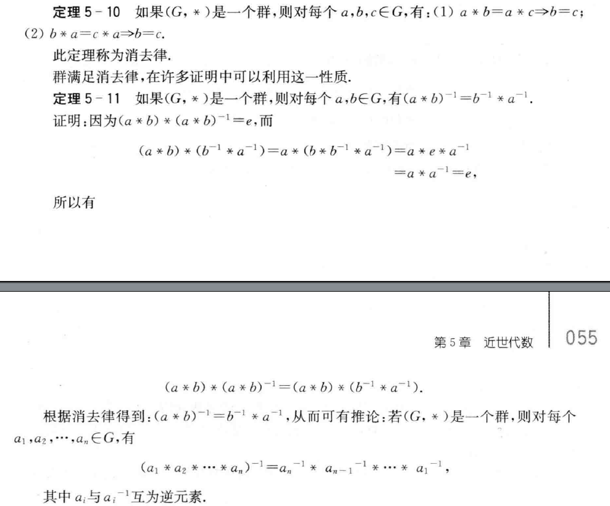
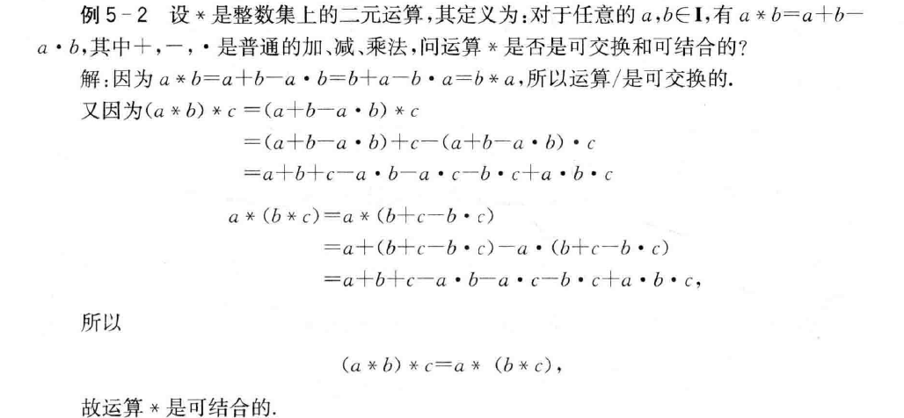
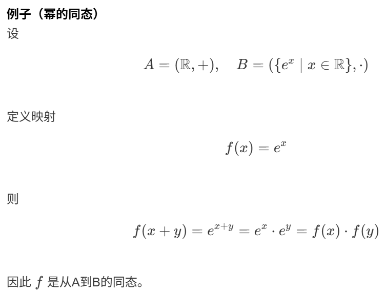
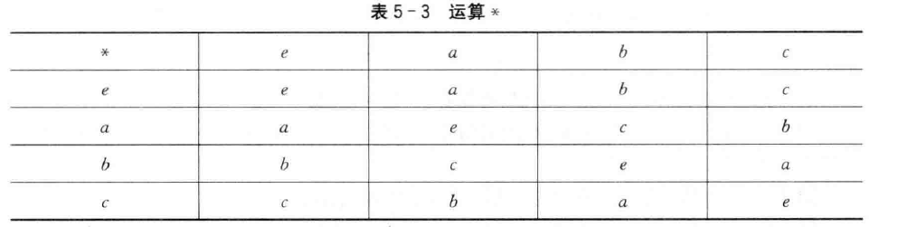
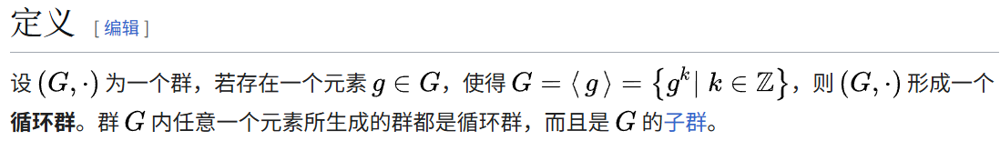

<iframe src="//player.bilibili.com/player.html?isOutside=true&aid=113979489780353&bvid=BV1H2NoeiE1K&cid=28736228422&p=1"        width="100%"
  height="500"
  frameborder="0"
  allowfullscreen></iframe>

由于学校规定的那本臭不可闻的ts离散教材已经沉浸在自己的优越感里了,找不到一点点系统性,只好我自己从头开始梳理,大多数定义都是直接引用的wiki
## 运算律

### 结合律
- `a+(b+c)=(a+b)+c`
结合律是群论中最为重要的部分,只有满足结合律的代数系统才可以进行两项以上的计算,例如计算a+b+c.如果(a+b)+c!=q+(b+c),那就无法得出唯一的结果了

### 交换律
- `a+b=b+a`
很多代数系统不满足交换律,例如矩阵乘法

### 分配律
如果*对+满足以下式子,则称*对+满足分配律
- `a*(b+c)=a*b+a*c`


### 幂等律
- `a+a=a`
在幂等律成立的代数系统中，对同一元素重复运算不会产生新的结果，常见于集合的并运算与交运算中。

### 吸收律
需要同时满足下面两个式子
- `a+(a*b)=a`
- `a*(a+b)=a`


### 消去律

逆元和结合律保证了消去律的存在
### 例题



## 代数系统
### 概览

半群满足加法,群还满足减法,环还满足乘法,域还满足除法

### 子代数
子代数与原代数系统含有相同的代数常数,且对于所有运算都是封闭的
### 封闭性


>封闭性其实是非常重要的性质,保证了集合内的运算结果保留在集合内,而不会出现任何特殊情况,而由于作为整个群论基础的半群具有封闭性,故下文讨论到的所有代数系统都具有封闭性.
### 同态和同构



如果同态满足单射,称为单同态,满足满射,称为满同态,满足双射,则称为同构
#### 例题

通过这个例题可以明确几点关于映射的知识
- 没参与映射的元素不会计入原像集合,例如这里的0在原像集合中,故一定有像存在
- 双射时像和原像一定是一一对应的

### 半群
满足结合律的封闭代数系统称为半群  

例子: 自然数下的加法

含有幺元的半群称为独异点(垃圾翻译)

### 群

#### 定义
存在一个数e,使得对于集合S内所有的元素a都满足以下公式,则称e为集合S的幺元
- `e+a=a,a+e=a`

若一个半群S存在幺元e,且对于集合S内所有的元素a都有逆元b满足以下公式,则称S为群
- `b+a=a+b=e`

1. 由于零元不存在逆元,故群都不含零元  
2. 除单位元素e外群不存在等幂元素

#### 群的阶数
群G中元素的个数称为阶数,记作|G|,若个数有限,称为有限群,否则为无限群,若G只有一个单位元素e,则称为平凡群

#### 交换群(阿贝尔群)
>满足交换律的群称为交换群

#### Klein四元群

>Klein四元群G的运算具有以下特点:
1. e为G中的幺元
2. .是可交换的
3. 任何G中元素与自己运算的结果都为e
4. 除幺元外任意两个元素的运算结果都等于另一个元素

>可以看出Klein四元群既是交换群又是有限群

#### 子群
显然只要是群S的子集,并满足群的性质就可以称为子群,重点在于证明一个子集是一个群的子群

>关键在于一点点补全群的定义,首先找到幺元,接着找到逆元存在,由于集合被划分,故原来的封闭性可能被破坏,还需要证明封闭性,而结合律不用证明,因为所有半群的子集都是满足结合律的
#### 循环群

+ 这里的幂次不一定是乘方,只是表示对g进行多次运算
+ 生成元g与群G的阶数是一样的,无限循环群的生成元是a和a^-1,而n阶循环群的生成元是与a所有与n互质的幂次(互质:最大公约数为1,因此1也包含在互质的幂次里)
+ 从定义可以知道循环群一定是交换群
+ >由于要满足封闭性,故n阶循环群子群的生成元的幂次一定都是n的因数,可以把g的n次方计为幺元e,这个刚看到时很难理解,但如果没有幺元,那么就可以一直运算下去,就不是有限群了,故一定存在一个边界保证阶数不超过n,那么把g的n次方看作e就非常合适了.

#### 置换群
```md
置换通常写作轮换形式。例如，在轮换表示法中，给定集合  
M = {1, 2, 3, 4}。

设 M 的一个置换 g 满足：
- g(1) = 2  
- g(2) = 4  
- g(4) = 1  
- g(3) = 3  

则该置换可以写作：
(1, 2, 4)(3)

或者更常见地写作：
(1, 2, 4)

因为元素 3 在该置换下保持不变。

当对象用单个字母或数字表示时，逗号通常也可以省略，因此也可记作：
(1 2 4)
```

+ 涉及集合S中m个不同数的置换称为m阶轮换

### 环和域
显然wiki上定义的环是真环,乘法有幺元;教材里用的定义是伪环,乘法不含幺元
```md
一个环是一个集合 R，具有两个二元运算（+ 和 ·），分别称为“加法”和“乘法”。

其中，乘法对加法满足分配律,并且满足以下代数结构条件：

- (R, +) 是一个阿贝尔群  
- (R, ·) 是一个半群
```

**零因子**:
```md
对所有 (a, b) ∈ R × R， 若当a,b都不为0时存在a × b = 0
则a称为左零因子,b称为右零因子
```
**证明零因子可以用消去律代替**
```md
假设 R 中没有零因子。

已知：
a ≠ 0 
a x b = a x c

两边相减，得到：
a x (b − c) = 0

由于 a ≠ 0，
又因为没有零因子，

只能推出：
b − c = 0

即：
b = c
```
- 只有所有非零数相乘都不为0才可以说环不存在零因子,称为无零因子环
- 若环R中乘法满足交换律,含有幺元,无零因子,则R称为整环
- 若环R至少含有两个元素且含有幺元,无零因子,所有非零元素都存在乘法逆元,则称R为除环

>- 简短说来,环中多了一个对有无零因子的考察,因为如果不满足消去律的话研究这个代数系统就很困难了,而整环中乘法是一个可交换独异点,除环除开零以外是一个群

>- 若环R既是整环又是除环,则称R是域 
### 格与布尔代数
```md
考虑一个偏序集合 (L, ≤)。  
如果对集合 L 中的任意两个元素 a、b，  
它们在 L 中都存在最大下界和最小上界，  
则称 (L, ≤) 是一个格。
(由于偏序符号不好打,这里的小于等于都是偏序符号,表示可比,可比要求两个元素在哈斯图里处于同一分支上)
从这个定义可以看出：
格并不要求像全序集合那样，任意两个元素都必须可比；
但仍要求任意两个元素都具有最大下界和最小上界。
```
```md
在这里，取 a、b 的最大下界的运算记作  
a ∧ b；

取 a、b 的最小上界的运算记作  
a ∨ b。
```
---
> - 格和全序集的区别:
简单画哈斯图便可以知道,全序集是一条线,而格可以有多个分支,只要分支最后能汇合到一点就可以

> - 格满足交换律,结合律,幂等律和吸收律,这些从定义来看就很好理解,故无需证明
#### 补充概念
**最大元和最小元**
```md
设 (P, ≤) 为一个偏序集 ，S 为其子集。

若 S 中的元素 g 满足：  
对 S 的任意元素 s，都有 s ≤ g，  
则称 g 为 S 的最大元（greatest element）。

对偶地，若 S 中的元素 l 满足：  
对 S 的任意元素 s，都有 l ≤ s，  
则称 l 为 S 的最小元（least element）。

由定义可知，S 的最大元（最小元）必定是 S 的上界（下界）。

并且集合 S 至多只能有一个最大元：  
若 g₁ 和 g₂ 都是 S 的最大元，则由定义有  
g₁ ≤ g₂，且 g₂ ≤ g₁，  
由反对称性可得 g₁ = g₂。

因此，若 S 存在最大元,则该最大元必定是唯一的,最小元同理
```
**最小上界和最大上界**
```md
设 (A, ≤) 为一个偏序集，B ⊆ A。

若存在 y ∈ A，使得对任意 x ∈ B 都有  
x ≤ y，  
则称 y 为集合 B 的上界。

对称地，若存在 z ∈ A，使得对任意 x ∈ B 都有  
z ≤ x，  
则称 z 为集合 B 的下界。

偏序集A的子集B在A中的上界集合的最小元称为最小上界,对偶概念即为最大下界
```
#### 特殊的格
**分配格**
```md
设 (L, ∨, ∧) 是一个格。  
若对任意 a、b、c ∈ L，都有：

a ∧ (b ∨ c) = (a ∧ b) ∨ (a ∧ c)  
a ∨ (b ∧ c) = (a ∨ b) ∧ (a ∨ c)

则称 L 为一个分配格。
```
---
**有界格**  
```md
设 (L, ∨, ∧) 是一个格。  
若 L 有最小元0和最大元1,即对任意 a ∈ L 都满足  
a ∨ 0 = a 和 a ∧ 1 = a，  
则称 L 为一个有界格,这里的最小元称为全下界,最大元称为全上界
```
- 可以认为所有元素有限的格都是有界格,因为格的定义就要求了哈斯图的两端是封闭的,故一定有上下界
---

**有补格**  
```md
设 (L, ∨, ∧) 是一个有界格  
并且 L 中的每个元素 a 都存在一个b ∈ L 使得  
a ∨ b = 1 且 a ∧ b = 0。  
这样的 b 称为 a 的补元。
L则称为有补格
```

*证明分配格中任意元素的补元唯一*
> 设 L 是一个分配格，有界格，且 a ∈ L 有两个补元 b 和 c。
> 根据补元的定义：
>
> 1. a ∨ b = 1 且 a ∧ b = 0
> 2. a ∨ c = 1 且 a ∧ c = 0
>
> 要证明 b = c。
>
> 步骤 1：利用分配律
>
> 考虑 b ∧ (a ∨ c)：
>
> b ∧ (a ∨ c) = (b ∧ a) ∨ (b ∧ c)  （分配律）
>
> 代入已知 a ∧ b = 0：
>
> 0 ∨ (b ∧ c) = b ∧ c
>
> 而 a ∨ c = 1，所以：
>
> b ∧ 1 = b
>
> 所以 b = b ∧ c。
>
> 步骤 2：对称地
>
> 同理，c = a ∨ b ∧ c，经过类似推导可得：
>
> c = b ∧ c
>
> 步骤 3：结合得到
>
> b = b ∧ c = c
>
> 因此，补元是唯一的。


**布尔格(布尔代数)**  
```md
布尔格是一个有补分配格,换句话说，它是一个有最小元 0 和最大元 1 的格,
满足分配律，并且每个元素都有补元
```

- 由上述证明可以明确布尔代数每个元素的补元唯一,求补元可以看成是一元运算


---
**仔细一看就算都理解透了,还是有一堆要背的,因为不可能到考试的时候现推啊,能把数学课教成文科也是挺nb的.**