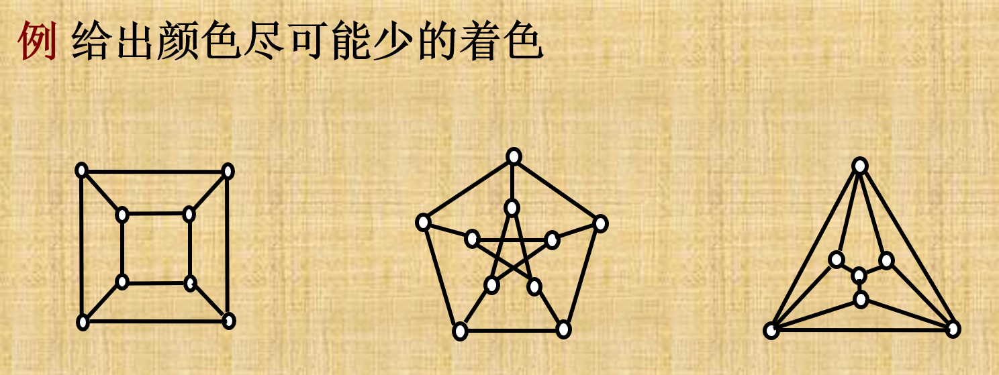
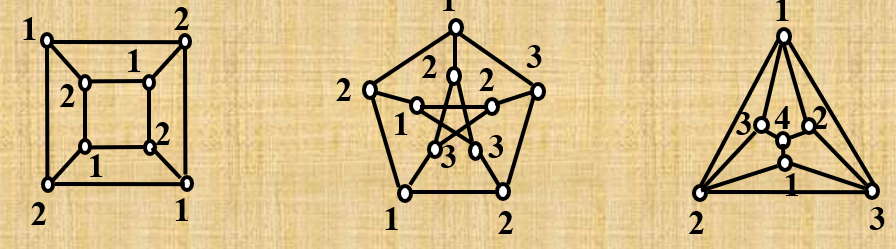

# 鍥剧殑鍩烘湰姒傚康
## 鏈夊悜鍥?
- `<V,E>`锛坄v = vertex(鑺傜偣)`锛宍e = edge(杈?`锛?- 骞冲嚒鍥撅細鍙湁涓€涓?`v`锛屾病鏈?`e` 鐨勫浘
- n 闃跺浘锛歚n` 涓鸿妭鐐规暟
- 閭绘帴锛氭湁鍚戣竟璧风偣閭绘帴鍒扮粓鐐癸紝鏁呴偦鎺ョ煩闃典腑绗?`n` 琛屼负绗?`n` 涓妭鐐逛綔涓鸿捣鐐癸紝绗?`n` 鍒椾负绗?`n` 涓妭鐐逛綔涓虹粓鐐癸紝浠ユ缁熻鍑哄害鍜屽叆搴?
---

## 瀛愬浘

- 鐪熷瓙鍥撅細涓庡師鍥句笉涓€鏍峰氨琛?- 鐢熸垚瀛愬浘锛氳妭鐐规暟涓€鏍峰氨琛岋紝杈瑰彲浠ユ瘮鍘熷浘杩炵殑灏戯紝浣嗕笉鑳借嚜宸卞姞杈?- 瀵煎嚭瀛愬浘锛氬彲浠ヤ笉鐢ㄥ埌鎵€鏈夎妭鐐癸紝浣嗘瘝鍥句腑瀵瑰簲鐢ㄥ埌鑺傜偣鐨勮竟閮借淇濈暀锛堟垨鑰呬笉鐢ㄥ埌鎵€鏈夎竟锛屼絾瀵瑰簲鐨勮妭鐐逛繚鐣欙紙搴熻瘽锛屼綘閮界敤鍒拌竟浜嗭紝閭ｆ病鑺傜偣鍝潵鐨勮竟锛夛級

---

## 琛ュ浘

> **琛ュ浘**锛氳绠€鍗曟棤鍚戝浘 G = (V, E)锛屽叾琛ュ浘璁颁负 G虅 = (V, E虅)锛屽叾涓? 
> - E虅 = { {u, v} | u, v 鈭?V锛寀 鈮?v锛屼笖 {u, v} 鈭?E }  
> 鍗冲湪淇濇寔椤剁偣闆嗕笉鍙樼殑鎯呭喌涓嬶紝G虅 涓殑杈规伆濂芥槸 G 涓笉瀛樺湪鐨勮竟銆?---

## 鍚屾瀯鍥?
> **鍚屾瀯鍥?*锛氳鍥?G鈧?= (V鈧? E鈧?锛孏鈧?= (V鈧? E鈧?锛岃嫢瀛樺湪涓€涓弻灏?f : V鈧?鈫?V鈧傦紝浣垮緱  
>- 瀵逛换鎰?u, v 鈭?V鈧侊紝{u, v} 鈭?E鈧?褰撲笖浠呭綋 {f(u), f(v)} 鈭?E鈧傦紝 
> 
> 鍒欑О G鈧?涓?G鈧?鍚屾瀯锛岃涓?G鈧?鈮?G鈧傘€?


- 椤剁偣鏁扮浉鍚岋紝杈规暟鐩稿悓锛屽害鏁板簭鍒楃浉鍚?浣嗚繖鍙槸蹇呰鏉′欢锛屽厖鍒嗘潯浠跺彧鑳界敤鐬溂娉曚簡

---

## 杩為€氭€?
### 鍥炶矾涓庨€氳矾

> 褰撲竴鏉″洖璺腑鐨勬墍鏈夎竟浜掍笉鐩稿悓鏃朵负绠€鍗曞洖璺紝涓庢鐩稿弽锛屾湁杈圭浉鍚屾椂灏辨槸澶嶆潅鍥炶矾锛屼竴涓敱 3 涓妭鐐瑰舰鎴愮殑 `8` 鏄畝鍗曞洖璺?鑻ョ畝鍗曞洖璺腑闄や簡鍒濆鑺傜偣鍜岀粨鏉熻妭鐐圭浉鍚屽锛屽叾浠栬妭鐐归兘涓嶇浉鍚岋紝鍒欎负鍒濈骇鍥炶矾锛屼笂鏂囩殑 `8` 灏变笉鏄垵绾у洖璺?- 鍒濈骇鍥炶矾鍜岀畝鍗曞洖璺?*鍖哄垎**:鍒濈骇鎯虫垚鏄渶鍩烘湰鐨?缁撴瀯鏈€涓哄悎鐞?鏁呬笉浼氬嚭鐜伴噸澶嶈妭鐐?绠€鍗曡鏄庢槸鍥炶矾灏辫,瑕佹眰灏戜竴鐐?- 鎶婁笂闈㈢殑鍥炶矾涓や釜瀛楁崲鎴愰€氳矾灏卞彲浠ュ緱鍒扮畝鍗曢€氳矾,澶嶆潅閫氳矾,鍒濈骇閫氳矾鐨勫畾涔変簡
  
>濡傛灉 `u` 鍒?`v` 瀛樺湪閫氳矾锛屽垯绉皍鍜寁鏄繛閫氱殑,鍦ㄦ湁鍚戝浘涓О `u` 鍙揪 `v`锛岃嫢鍥?`G` 浠绘剰涓や釜椤剁偣閮借繛閫氾紝鍒欑О `G` 鏄?*杩為€氬浘**锛屾敞鎰忓钩鍑″浘涔熸槸杩為€氬浘
**杩為€氬垎鏀?*:鍥綠鐩镐簰涔嬮棿涓嶈繛閫氱殑瀵煎嚭瀛愬浘
G鐨勮繛閫氬垎鏀殑鏁伴噺璁颁负p(G)
---

### 鏈夊悜鍥剧殑杩為€氭€?
#### 鍙揪涓庣浉浜掑彲杈?
璁炬湁鍚戝浘 D = <V, E>锛寀, v 鈭?V銆?- **u 鍙揪 v**锛? 
  浠?u 鍒?v 瀛樺湪涓€鏉℃湁鍚戦€氳矾銆? 
  瑙勫畾锛歶 鍒拌嚜韬€绘槸鍙揪銆?
- **u 涓?v 鐩镐簰鍙揪**锛? 
  u 鍙揪 v 涓?v 鍙揪 u銆?---
- **寮辫繛閫?*  
>灏?D 涓墍鏈夋湁鍚戣竟蹇界暐鏂瑰悜锛屽緱鍒扮殑鏃犲悜鍥炬槸杩為€氬浘銆?- **鍗曞悜杩為€?*  
>瀵逛换鎰?u, v 鈭?V,u 鍙揪 v 鎴?v 鍙揪 u


- **寮鸿繛閫?*  
>瀵逛换鎰?u, v 鈭?V,u 涓?v 鐩镐簰鍙揪

### 鍓查泦

璁?G = (V, E) 涓鸿繛閫氬浘銆?
> **杈瑰壊闆?*锛氳 C 鈯?E锛岃嫢  
> - 鍥?G 鈭?C 涓嶈繛閫氾紱  
> - 瀵逛换鎰?e 鈭?C锛孏 鈭?(C \ {e}) 浠嶈繛閫氾紱  
> 鍒欑О C 涓?G 鐨勮竟鍓查泦銆?
- 鍗矯宸茬粡鏄兘澶熻G涓嶈繛閫氱殑鏈€灏忚竟闆嗗悎浜?鑻鍙湁涓€鏉¤竟e,绉癳涓哄壊杈规垨妗?---

> **鐐瑰壊闆?*锛氳 S 鈯?V锛岃嫢  
> - 鍥?G 鈭?S 涓嶈繛閫氭垨閫€鍖栦负鍗曠偣鍥撅紱  
> - 瀵逛换鎰?v 鈭?S锛孏 鈭?(S \ {v}) 浠嶈繛閫氾紱  
> 鍒欑О S 涓?G 鐨勭偣鍓查泦銆?
- 鍗砈宸茬粡鏄兘澶熻G涓嶈繛閫氱殑鏈€灏忕偣闆嗗悎浜?鑻鍙湁涓€涓《鐐箆,绉皏涓哄壊鐐?


### 鍒嗛噺涓庡壊

#### 杩為€氬垎閲?
- **鏃犲悜鍥剧殑杩為€氬垎閲?*  
  鏃犲悜鍥?G 鐨勪竴涓瀬澶ц繛閫氬瓙鍥剧О涓?G 鐨勪竴涓繛閫氬垎閲忥紙鎴栬繛閫氬垎鏀級銆? 
  - 姣忎竴涓《鐐瑰拰姣忎竴鏉¤竟閮藉睘浜庡敮涓€鐨勪竴涓繛閫氬垎閲? 
  - 杩為€氬浘鍙湁涓€涓繛閫氬垎閲忥紝鍗冲叾鑷韩  
  - 闈炶繛閫氭棤鍚戝浘鏈夊涓繛閫氬垎閲? 

- **鏈夊悜鍥剧殑寮鸿繛閫氬垎閲?*  
  鏈夊悜鍥句腑鐨勫己杩為€氬垎閲忔槸鍏舵瀬澶х殑寮鸿繛閫氬瓙鍥俱€? 
  - 寮鸿繛閫氬浘鍙湁涓€涓己杩為€氬垎閲忥紝鍗冲叾鑷韩  
  - 闈炲己杩為€氱殑鏈夊悜鍥炬湁澶氫釜寮鸿繛閫氬垎閲? 

---

#### 鐐瑰壊涓庣偣杩為€氬害

- **鍓茬偣闆?*  
  鍦ㄨ繛閫氬浘 G 涓紝涓€涓敱椤剁偣缁勬垚鐨勯泦鍚堬紝鑻ヤ粠 G 涓垹闄よ繖浜涢《鐐瑰悗鍥惧彉寰椾笉杩為€氾紝鍒欑О璇ラ泦鍚堜负鍓茬偣闆嗐€?
- **鐐硅繛閫氬害**  
  鐐硅繛閫氬害 魏(G) 瀹氫箟涓哄壊鐐归泦涓《鐐规暟鐨勬渶灏忓€笺€?
- **k-鐐硅繛閫氬浘**  
  鑻ュ浘 G 鍙互鍦ㄥ垹闄?k 涓《鐐瑰悗鍙樺緱涓嶈繛閫氾紝浣嗕笉鑳藉湪鍒犻櫎 k鈭? 涓《鐐瑰悗鍙樺緱涓嶈繛閫氾紝鍒欑О G 涓?k-鐐硅繛閫氬浘銆? 
  鐗瑰埆鍦帮紝闃舵暟涓?n 鐨勫畬鍏ㄥ浘鏄?(n鈭?)-鐐硅繛閫氱殑銆?
---

#### 灞€閮ㄨ繛閫氬害

- **u, v 鐨勫壊鐐归泦**  
  瀵逛竴瀵归《鐐?u, v锛岃嫢鍒犻櫎鏌愪釜椤剁偣闆嗗悎鍚庝娇 u 涓?v 涓嶈繛閫氾紝鍒欒闆嗗悎绉颁负 u, v 鐨勫壊鐐归泦銆?
- **灞€閮ㄨ繛閫氬害**  
  魏(u, v) 琛ㄧず浣?u 涓?v 涓嶈繛閫氱殑鏈€灏忓壊鐐归泦鐨勫ぇ灏忋€?
- **鎬ц川**
  - 鍦ㄦ棤鍚戝浘涓紝魏(u, v) = 魏(v, u)
  - 闄ゅ畬鍏ㄥ浘澶栵紝魏(G) 绛変簬鎵€鏈変笉鐩搁偦椤剁偣瀵?u, v 鐨?魏(u, v) 鐨勬渶灏忓€?
---

#### 杈瑰壊涓庤竟杩為€氬害

- **妗?*  
  鍦ㄥ浘 G 涓紝鍒犻櫎鏌愪竴鏉¤竟鍚庡浘鍙樺緱涓嶈繛閫氾紝鍒欒杈圭О涓烘ˉ銆?
- **鍓茶竟闆?*  
  涓€涓敱杈圭粍鎴愮殑闆嗗悎锛岃嫢鍒犻櫎杩欎簺杈瑰悗鍥惧彉寰椾笉杩為€氾紝鍒欑О涓哄壊杈归泦銆?
- **杈硅繛閫氬害**  
  位(G) 琛ㄧず鏈€灏忓壊杈归泦鐨勫ぇ灏忋€?
- **灞€閮ㄨ竟杩為€氬害**  
  位(u, v) 琛ㄧず浣?u 涓?v 涓嶈繛閫氱殑鏈€灏忓壊杈归泦鐨勫ぇ灏忋€?
- **k-杈硅繛閫氬浘**  
  鑻?位(G) 鈮?k锛屽垯绉板浘 G 涓?k-杈硅繛閫氬浘銆?
---

#### 杩為€氬害涔嬮棿鐨勫叧绯?
- 璁?未(G) 涓哄浘 G 鐨勬渶灏忓害锛屽垯鏈変笉绛夊紡锛?```

魏(G) 鈮?位(G) 鈮?未(G)

```

- **鏋佸ぇ杩為€氬浘**
- 鑻?魏(G) = 未(G)锛岀О G 涓烘瀬澶ц繛閫氬浘
- 鑻?位(G) = 未(G)锛岀О G 涓烘瀬澶ц竟杩為€氬浘


## 鍥剧殑鐭╅樀琛ㄧず

---

### 鏃犲悜鍥剧殑鍏宠仈鐭╅樀

> **瀹氫箟**锛氳鏃犲悜鍥?G = (V, E)锛寍V| = n锛寍E| = m銆? 
> 鏃犲悜鍥剧殑鍏宠仈鐭╅樀鏄竴涓?n 脳 m 鐨?0-1 鐭╅樀 M锛屽叾涓? 
> - M[i][j] = 1鎴?锛屽綋涓斾粎褰撻《鐐?v_i 涓庤竟 e_j 鍏宠仈锛? 
> - 鍚﹀垯 M[i][j] = 0銆?
- 鍏宠仈鍗抽《鐐逛綔涓鸿杈圭殑璧风偣鎴栬€呯粓鐐瑰嚭鐜版鏁?褰撳嚭鐜拌嚜鐜椂鍏宠仈娆℃暟涓?
- 姣忎竴鍒楅兘鎭板ソ鏈変袱涓?鎴栦竴涓?
- 绗琲琛屽厓绱犱箣鍜屼负vi鐨勫害鏁?鎵€鏈夊厓绱犱箣鍜屼负2m
**渚?*锛? 
- V = {v1, v2, v3, v4}  
- E = {  
e1 = {v1, v2},  
e2 = {v1, v3},  
e3 = {v2, v3},  
e4 = {v4, v4}  
}

|     | e1  | e2  | e3  | e4  |
| --- | --- | --- | --- | --- |
| v1  | 1   | 1   | 0   | 0   |
| v2  | 1   | 0   | 1   | 0   |
| v3  | 0   | 1   | 1   | 0   |
| v4  | 0   | 0   | 0   | 2   |

---

### 鏈夊悜鍥剧殑鍏宠仈鐭╅樀

> **瀹氫箟**锛氳鏃犵幆鏈夊悜鍥?G = (V, E)锛寍V| = n锛寍E| = m銆? 
> 鏈夊悜鍥剧殑鍏宠仈鐭╅樀鏄竴涓?n 脳 m 鐨勭煩闃?M锛屽叾涓? 
> - M[i][j] = -1锛岃嫢杈?e_j 浠?v_i 鍑哄彂锛? 
> - M[i][j] = 1锛岃嫢杈?e_j 鎸囧悜 v_i锛? 
> - 鍚﹀垯 M[i][j] = 0銆?
- 姣忎竴鍒楅兘鏈変竴涓?1鍜?

**渚?*锛? 
- V = {v1, v2, v3, v4}  
- E = {  
e1: v1 鈫?v2,  
e2: v1 鈫?v3,  
e3: v2 鈫?v4,  
e4: v3 鈫?v4  
}

|     | e1  | e2  | e3  | e4  |
| --- | --- | --- | --- | --- |
| v1  | -1  | -1  | 0   | 0   |
| v2  | 1   | 0   | -1  | 0   |
| v3  | 0   | 1   | 0   | -1  |
| v4  | 0   | 0   | 1   | 1   |

---

### 鏈夊悜鍥剧殑閭绘帴鐭╅樀

> **瀹氫箟**锛氳鏈夊悜鍥?G = (V, E)锛寍V| = n銆? 
> 鏈夊悜鍥剧殑閭绘帴鐭╅樀鏄竴涓?n 脳 n 鐨勭煩闃?A锛屽叾涓? 
> - A[i][j] = 1锛岃〃绀哄瓨鍦ㄤ粠 v_i 鍒?v_j 鐨勬湁鍚戣竟锛? 
> - 鍚﹀垯 A[i][j] = 0銆?
- 鎵€鏈夊厓绱犱箣鍜岀瓑浜庤竟鏁?
**渚?*锛? 
- v1 鈫?v2锛寁1 鈫?v3锛寁2 鈫?v4锛寁3 鈫?v4

|     | v1  | v2  | v3  | v4  |
| --- | --- | --- | --- | --- |
| v1  | 0   | 1   | 1   | 0   |
| v2  | 0   | 0   | 0   | 1   |
| v3  | 0   | 0   | 0   | 1   |
| v4  | 0   | 0   | 0   | 0   |

---

### 鏈夊悜鍥剧殑鍙揪鐭╅樀

> **瀹氫箟**锛氳鏈夊悜鍥?G = (V, E)锛寍V| = n銆? 
> 鍙揪鐭╅樀鏄竴涓?n 脳 n 鐨勭煩闃?R锛屽叾涓? 
> - R[i][j] = 1锛岃〃绀轰粠 v_i 鍑哄彂瀛樺湪涓€鏉¤矾寰勫彲鍒拌揪 v_j锛? 
> - 鍚﹀垯 R[i][j] = 0銆?
- 鐢变簬椤剁偣鍒拌嚜韬兘鏄彲杈剧殑,鏁呭彲杈剧煩闃靛瑙掔嚎涓婄殑鍏冪礌鎭掍负1
**渚?*锛? 
鍩轰簬涓婅堪鏈夊悜鍥?
|     | v1  | v2  | v3  | v4  |
| --- | --- | --- | --- | --- |
| v1  | 1   | 1   | 1   | 1   |
| v2  | 0   | 1   | 0   | 1   |
| v3  | 0   | 0   | 1   | 1   |
| v4  | 0   | 0   | 0   | 1   |

## 鐫€鑹查棶棰?
> *鐫€鑹查棶棰?锛氳 G = (V, E) 涓烘棤鍚戞棤鐜浘锛岀粰姣忎釜椤剁偣鍒嗛厤涓€绉嶉鑹诧紝浣垮緱  
> - 鑻?{u, v} 鈭?E锛屽垯 u 涓?v 鐨勯鑹蹭笉鍚?鍗?*鐩搁偦椤剁偣棰滆壊涓嶅悓**
> 璁颁娇鐢ㄧ殑鏈€灏戦鑹叉暟涓簁,绉癎涓簁-鍙潃鑹茬殑

> **Welsh鈥揚owell 绠楁硶**锛? 
> 鏄竴绉嶆眰鍥鹃《鐐圭潃鑹茬殑鍚彂寮忕畻娉曪紝鍏跺熀鏈€濇兂鏄紭鍏堜负搴︽暟澶х殑椤剁偣鐫€鑹层€?
**绠楁硶姝ラ**锛? 
1. 灏嗗浘涓墍鏈夐《鐐规寜搴︽暟浠庡ぇ鍒板皬鎺掑簭锛堣嫢搴︽暟鐩稿悓锛屽彲浠绘剰鎺掑垪锛夛紱  
2. 鍙栧皻鏈潃鑹茬殑绗竴涓《鐐癸紝璧嬩簣涓€绉嶆柊棰滆壊锛? 
3. 鍦ㄥ墿浣欐湭鐫€鑹查《鐐逛腑锛屾寜鎺掑簭椤哄簭閫夋嫨涓庡凡鐫€璇ラ鑹查《鐐瑰潎涓嶇浉閭荤殑椤剁偣锛岃祴浜堝悓涓€棰滆壊锛? 
4. 閲嶅姝ラ 2鈥?锛岀洿鍒版墍鏈夐《鐐瑰潎琚潃鑹层€?
---
**渚嬮**
```锛? 
璁? 
V = {v1, v2, v3, v4, v5}  
E = { {v1,v2}, {v1,v3}, {v1,v4}, {v2,v3}, {v3,v4}, {v4,v5} }

鍚勯《鐐瑰害鏁帮細  
deg(v1)=3锛宒eg(v3)=3锛宒eg(v4)=3锛宒eg(v2)=2锛宒eg(v5)=1  

鎺掑簭缁撴灉锛? 
v1, v3, v4, v2, v5  

鐫€鑹茶繃绋嬶細  
- 棰滆壊 1锛歷1锛寁5  
- 棰滆壊 2锛歷3  
- 棰滆壊 3锛歷4  
- 棰滆壊 4锛歷2  

鍥犳璇ョ畻娉曞緱鍒?G 涓?4-鍙潃鑹诧紙涓嶄竴瀹氭槸鏈€灏忚壊鏁帮級銆?```
### 缁冩墜


---
**绛旀**

# 鐗规畩鐨勫浘

## 浜岄儴鍥?
> 鎶婁竴涓浘鐨勯《鐐瑰垝鍒嗕负涓や釜涓嶇浉浜ゅ瓙闆嗭紝浣垮緱姣忎竴鏉¤竟閮藉垎鍒繛鎺ヤ袱涓泦鍚堜腑鐨勯《鐐癸紝濡傛灉瀛樺湪杩欐牱鐨勫垝鍒嗭紝鍒欐鍥句负涓€涓簩閮ㄥ浘
> 
> [娣卞叆鐞嗚В](htt ps://blog.csdn.net/qq_26822029/article/details/90382581)
> 鑻?`G` 涓棤闀垮害涓哄鏁扮殑鍥炶矾锛屽垯鏃犲悜鍥?`G` 鏄簩閮ㄥ浘
> [璇佹槑](https://www.zhihu.com/question/474576285)

- 涔熷氨鏄鍚勮嚜鐨勫瓙闆嗕腑涓や釜椤剁偣涔嬮棿閮芥病鏈夎竟
### 鍖归厤

> **鍖归厤锛圡atching锛?*  
鍦ㄦ棤鍚戝浘 `G = (V, E)` 涓紝鑻ヨ竟闆?`M 鈯?E` 婊¤冻锛? 
浠绘剰涓ゆ潯杈逛笉鍏变韩鍏叡椤剁偣(鍗?*涓嶇浉杩?*)锛屽垯绉?`M` 涓哄浘 `G` 鐨勪竴涓尮閰嶃€?
> **鏋佸ぇ鍖归厤锛圡aximal Matching锛?*  
鑻ュ尮閰?`M` 婊¤冻锛? 
鍦ㄥ浘涓笉鑳藉啀鍔犲叆浠讳綍涓€鏉¤竟鑰屼粛淇濇寔鏄尮閰嶏紝鍒欑О `M` 涓烘瀬澶у尮閰嶃€?
> **鏈€澶у尮閰嶏紙Maximum Matching锛?*  
鍦ㄥ浘 `G` 鐨勬墍鏈夊尮閰嶄腑锛岃竟鏁版渶澶氱殑鍖归厤绉颁负鏈€澶у尮閰嶃€?
- **鍖归厤鏁?*  
鏈€澶у尮閰?`M` 涓竟鐨勬潯鏁扮О涓哄尮閰嶆暟

---

> **瀹岀編鍖归厤锛圥erfect Matching锛?*  
鑻ュ尮閰?`M` 瑕嗙洊鍥句腑鎵€鏈夐《鐐癸紝鍗虫瘡涓《鐐归兘鎭板ソ涓庝竴鏉″尮閰嶈竟鐩稿叧鑱旓紝  
鍒欑О `M` 涓哄畬缇庡尮閰嶃€?
> **瀹屽鍖归厤锛圕omplete Matching锛?*  
鍦ㄤ簩閮ㄥ浘 `G = (X, Y, E)` 涓紝鑻ュ瓨鍦ㄤ竴涓尮閰嶄娇寰?`X` 涓殑姣忎釜椤剁偣  
閮戒笌 `Y` 涓煇涓《鐐瑰尮閰嶏紝鍒欑О璇ュ尮閰嶄负瀹屽鍖归厤銆?*褰搢X|<|Y|鏃跺厑璁稿瓨鍦ㄦ湁椤剁偣涓嶅尮閰嶇殑鎯呭喌*)

---

### Hall 瀹氱悊鍙婂叾寮曠敵

> **Hall 瀹氱悊锛堝濮诲畾鐞嗭級**  
璁?`G = (X, Y, E)` 涓轰簩閮ㄥ浘銆? 
瀛樺湪涓€涓鐩?`X` 鐨勫畬澶囧尮閰嶏紝褰撲笖浠呭綋瀵?`X` 鐨勪换鎰忓瓙闆?`S`锛? 
`S` 鐨勯偦鎺ラ《鐐归泦鍚?`N(S)` 婊¤冻锛?
- `|N(S)| 鈮?|S|`

---

> **Hall 瀹氱悊鐨勭瓑浠疯〃杩?*  
浜岄儴鍥?`G = (X, Y, E)` 涓瓨鍦ㄥ畬澶囧尮閰? 
褰撲笖浠呭綋 `X` 鐨勪换鎰忓瓙闆嗛兘涓嶁€滅己灏戔€濆彲鍖归厤鐨勯偦鎺ラ《鐐广€?
- 鐢ㄤ汉璇濊,褰搢X|<=|Y|鏃堕渶瑕佷繚璇乆涓换鎰弅涓《鐐硅嚦灏戦偦鎺涓璳涓《鐐?
> **Hall 瀹氱悊鐨勬帹璁?*  
璁?`G = (X, Y, E)` 涓轰簩閮ㄥ浘锛岃嫢瀛樺湪t>0,浣垮緱:
> - X涓瘡涓《鐐硅嚦灏戝叧鑱攖鏉¤竟
> - Y涓瘡涓《鐐硅嚦澶氬叧鑱攖鏉¤竟
鍒欑ОG涓瓨鍦╔鍒癥鐨勫畬澶囧尮閰?
- 鏄剧劧杩欐槸涓€涓緢寮虹儓鐨勫厖鍒嗘潯浠惰€岄潪蹇呰鏉′欢


## 娆ф媺鍥?

> **娆ф媺鍥炶矾**:閫氳繃鍥句腑鎵€鏈夎竟涓旀瘡杈逛粎閫氳繃涓€娆＄殑鍥炶矾锛屽叿鏈夋鎷夊洖璺殑鍥剧О涓烘鎷夊浘锛圗uler Graph锛?
- 灏嗗洖璺敼涓洪€氳矾灏卞緱鍒颁簡娆ф媺閫氳矾鐨勫畾涔?  
> 鏃犲悜鍥句腑锛?>
> * 鏈夋鎷夊洖璺細褰撲笖浠呭綋 `G` 鏄繛閫氬浘涓旀棤濂囧害椤剁偣
> * 鏈夋鎷夐€氳矾浣嗘病鏈夋鎷夊洖璺細褰撲笖浠呭綋 `G` 鏄繛閫氬浘涓旀伆濂芥湁涓や釜濂囧害椤剁偣

- 褰撶劧鏈夋鎷夊洖璺氨鏈夋鎷夐€氳矾,灏戣繛涓€鏉¤竟灏辨槸浜?>鏈夊悜鍥句腑锛?> * 鏈夋鎷夊洖璺細褰撲笖浠呭綋 `G` 鏄繛閫氬浘涓旀瘡涓《鐐圭殑鍏ュ害绛変簬鍑哄害
>   鐩磋涓婂緢濂界悊瑙ｏ紝璇佹槑杩樻槸绠椾簡鍚?
---

## 鍝堝瘑椤垮浘

> 閫氳繃鍥?`G` 鐨勬瘡涓粨鐐逛竴娆′笖浠呬竴娆＄殑閫氳矾锛堝洖璺級锛屽氨鏄?*鍝堝瘑椤块€氳矾**锛堝洖璺級锛屽瓨鍦ㄥ搱瀵嗛】鍥炶矾鐨勫浘灏辨槸鍝堝瘑椤垮浘

### 鍒ゅ畾鏂规硶
>鑻闃舵湁鍚戝浘G瀵瑰簲鐨勬棤鍚戝浘涓惈鏈夌敓鎴愬瓙鍥綤n(鍗崇敓鎴愬瓙鍥句负瀹屽叏鍥?,鍒橤涓瓨鍦ㄥ搱瀵嗛】閫氳矾
- 杩欎釜鎸烘樉鐒剁殑,濡傛灉姣忎釜椤剁偣闂撮兘鏈夎繛绾?鎬庝箞閮借兘鎶婃墍鏈夐《鐐硅繛鎺ヨ捣鏉?---

## 骞抽潰鍥?
> 鑻?`G` 鑳界敾鍦ㄥ钩闈笂鑰屼笉鍑虹幇杈逛氦鍙夛紝鍒欎负**骞抽潰鍥?*锛岀敾鍑虹殑鍥剧О涓?`G` 鐨勫钩闈㈠祵鍏?
>**闈?*:璁綠鏄竴涓钩闈㈠祵鍏?G
鐨勮竟灏嗘暣涓钩闈㈠垝鍒嗘垚鑻ュ共鍖哄煙,姣忎釜鍖哄煙绉颁负G鐨勪竴涓潰,鍏朵腑闈㈢Н鏃犻檺鐨勫尯鍩熺О涓?鏃犻檺闈?鎴?澶栭儴闈?,闈㈢Н鏈夐檺鐨勫尯鍩熺О涓?鏈夐檺闈?鎴?鍐呴儴闈?

- *nnd鍥捐杩欎竴鍫嗕腑鏂囧埆鍚嶅氨涓嶈兘缁熶竴涓€涓?鑷繁鐮旂┒璧锋潵涓嶉夯鐑﹀悧*

>鍖呭洿闈鐨勬墍鏈夎竟鏋勬垚鐨勫洖璺О涓篟鐨勮竟鐣?杈圭晫鐨勯暱搴︾О涓篟鐨勬鏁?璁颁负deg(R)
- 娉ㄦ剰鑻ュ閮ㄩ潰鍖呭惈鍓茶竟,闇€瑕佹部鐫€鍓茶竟鐨勪袱渚х粫琛屽舰鎴愬洖璺?鏁呬細璁＄畻涓ゆ
- 鍦ㄧ畝鍗曞钩闈㈠浘涓紝姣忎釜闈㈢殑娆℃暟 鈮?3 锛堝洜涓轰笉瀛樺湪闀垮害涓?1 鎴?2 鐨勫洖璺級銆?- 鍚勯潰娆℃暟涔嬪拰绛変簬杈规暟鐨?2 鍊嶏細
- **骞抽潰鍥惧悇闈㈢殑娆℃暟涔嬪拰绛変簬杈规暟鐨?鍊?*
>璇佹槑
>鍦ㄥ钩闈㈠浘涓紝姣忎竴鏉¤竟閮芥湁涓や晶锛?>   - 瑕佷箞鍒嗗埆閭绘帴涓や釜涓嶅悓鐨勯潰锛?>   - 瑕佷箞浣滀负妗ユ垨鍓茶竟锛屽湪鍚屼竴涓潰杈圭晫涓婂嚭鐜颁袱娆?>
>鏃犺鍝鎯呭喌锛?**姣忎竴鏉¤竟閮戒細琚伆濂借鍏ヤ袱涓潰鐨勬鏁颁腑**銆?### 鏋佸ぇ骞抽潰鍥?>鑻鏄畝鍗曞钩闈㈠浘, 涓斿湪浠绘剰涓や釜涓嶇浉閭荤殑椤剁偣
涔嬮棿鍔犱竴鏉℃柊杈规墍寰楀浘涓洪潪骞抽潰鍥? 鍒欑ОG涓烘瀬澶у钩闈㈠浘

- 鏋佸ぇ骞抽潰鍥炬槸杩為€氱殑 (鑻ヤ笉杩為€氬垯鍙互缁х画鍔犺竟,鐭涚浘)
- 璁綠涓簄(n飩?)闃剁畝鍗曞浘, G涓烘瀬澶у钩闈㈠浘鐨勫厖鍒嗗繀瑕佹潯浠舵槸, G姣忎釜闈㈢殑娆℃暟鍧囦负3.

### 娆ф媺鍏紡
> 瀵逛簬杩為€氬钩闈㈠浘鏈夋鎷夊叕寮忥細`n + r - 2 = m`锛屽叾涓?`n` 涓洪《鐐规暟锛宍m` 涓鸿竟鏁帮紝`r` 涓洪潰鏁帮紙鏄剧劧杈规暟鎬绘槸鏈€澶氱殑涓€鏂癸級
- 璁颁綇鏈変釜涓や釜鏁扮浉鍔犲噺2绛変簬鍙︿竴涓暟,鐒跺悗绔嬫柟浣撲腑杈规暟涓?2,椤剁偣鏁颁负8,闈㈡暟涓?,灏辫兘璁颁綇娆ф媺鍏紡

---

# 鏍?
**瀹氫箟**
> 涓嶅惈鍥炶矾鐨勮繛閫氭棤鍚戝浘绉颁负鏍戯紝骞冲嚒鍥?鍗充竴涓偣)绉颁负骞冲嚒鏍?搴︽暟涓?`1` 鐨勯《鐐圭О涓烘爲鍙讹紝搴︽暟澶т簬 `1` 鐨勭О涓哄垎鏀偣

- **娉ㄦ剰!!!!!!!!**
**鍏充簬浜屽弶鏍戞湰鏁欐潗榛樿绗竴灞傞珮搴︿负0,绗簩灞傞珮搴︿负1,浠ユ绫绘帹!!!!!!!**

## 鐢熸垚鏍?
鐢熸垚鏍?
> `G` 鏄棤鍚戣繛閫氬浘锛宍T` 鏄?`G` 鐨勭敓鎴愬瓙鍥句笖鏄爲锛屽垯 `T` 涓?`G` 鐨勭敓鎴愭爲锛堝嵆杩炴帴浜嗘墍鏈夎妭鐐癸級锛宍G` 鍦?`T` 涓殑杈圭О涓?`T` 鐨勬爲鏋濓紝涓嶅湪 `T` 涓殑杈圭О涓?`T` 鐨勫鸡锛宍T` 涓墍鏈夊鸡鐢熸垚鐨勫鍑哄瓙鍥剧О涓?`T` 鐨勪綑鏍?涓嶄竴瀹氭槸鏍?涔熸湭蹇呰繛閫?

### 瀹氱悊:浠讳綍鏃犲悜杩為€氬浘G閮芥湁鐢熸垚鏍?>璇佹槑:鑻鏃犲洖璺?鍒欐湰韬氨鏄敓鎴愭爲,鑻ュ惈鏈夊洖璺?鍒欏垹鍘诲洖璺笂浠绘剰涓€鏉¤竟,鐩村埌鍥句腑涓嶅啀鏈夊洖璺?杩欎笉褰卞搷G鐨勮繛閫氭€?浠庤€屽緱鍒扮敓鎴愭爲

### 鎺ㄨ:n闃舵棤鍚戣繛閫氬浘G鐨勮竟鏁板ぇ浜庣瓑浜巒-1
>璇佹槑:鍏剁敓鎴愭爲鐨勮竟鏁颁负n-1


### 鍩烘湰鍥炶矾鍜屽熀鏈壊闆?
> **鍩烘湰鍥炶矾锛團undamental Circuit锛?*  
璁?`T` 鏄繛閫氬浘 `G` 鐨勪竴妫电敓鎴愭爲銆? 
瀵逛换鎰忎竴鏉′笉灞炰簬 `T` 鐨勮竟 `e`(寮?锛屽皢 `e` 鍔犲叆 `T` 涓紝  
鍒欏湪 `T 鈭?{e}` 涓骇鐢熶笖**鍞竴**鐨勫洖璺紝绉颁负鍏充簬鐢熸垚鏍?`T` 鐨勪竴涓熀鏈洖璺€?
---

> **鍩烘湰鍥炶矾绯荤粺**  
鐢辩敓鎴愭爲 `T` 涓?*鎵€鏈夊鸡**鍚勮嚜瀵瑰簲鐨勫熀鏈洖璺墍缁勬垚鐨勯泦鍚堬紝  
绉颁负鍥?`G` 鐨勪竴涓熀鏈洖璺郴缁熴€?
---

> **鍩烘湰鍓查泦锛團undamental Cutset锛?*  
璁?`T` 鏄繛閫氬浘 `G` 鐨勪竴妫电敓鎴愭爲銆? 
瀵逛换鎰忎竴鏉″睘浜?`T` 鐨勮竟 `e`锛屼粠 `T` 涓垹鍘?`e`锛? 
鐢熸垚鏍戣鍒嗘垚涓や釜杩為€氬垎閲忋€? 
鍦ㄥ師鍥?`G` 涓紝鎵€鏈夎繛鎺ヨ繖涓や釜鍒嗛噺鐨勮竟鏋勬垚鐨勯泦鍚堬紝  
绉颁负鍏充簬鐢熸垚鏍?`T` 鍜岃竟 `e` 鐨勫熀鏈壊闆嗐€?
---

> **鍩烘湰鍓查泦绯荤粺**  
鐢辩敓鎴愭爲 `T` 涓?*姣忎竴鏉℃爲杈?*鎵€瀵瑰簲鐨勫熀鏈壊闆嗙粍鎴愮殑闆嗗悎锛? 
绉颁负鍥?`G` 鐨勪竴涓熀鏈壊闆嗙郴缁熴€?
---

- **鍔犱竴鏉￠潪鏍戣竟 鈫?涓€涓熀鏈洖璺?*
- **鍒犱竴鏉℃爲杈?鈫?涓€涓熀鏈壊闆?*
- 鍩烘湰鍥炶矾鏁?= 闈炴爲杈规暟  (m-n+1)
- 鍩烘湰鍓查泦鏁?= 鏍戣竟鏁?   (n-1)


---
**鐪熸暣鐞嗗畬浜嗗彂鐜扮‘瀹炴槸鏂囩,鍩烘湰涓婃墍鏈変緥棰樺彧瑕佹噦浜嗘蹇靛氨鑳藉仛,鍞竴闅剧殑鍦版柟灏辨槸璇佹槑棰?寰堝璇佹槑鎯崇牬鑴戣閮芥兂涓嶅埌,鍙ソ缁х画鑳屼功浜?*
