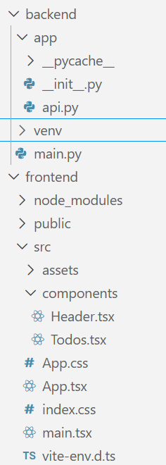

>前后端到底是怎么通信的?

这个问题在我接触计算机后就一直在想,但是一直都没有一个清晰的认识,因此我将在下文以两个基础项目入手来谈一谈这个问题

# 极简版fastapi+react
- [深入浅出的教程](https://testdriven.io/blog/fastapi-react/)

强烈安利上面的教程,可以让小白迅速了解到前后端通信的实质操作



我们可以清楚的看到,只需要用到这么一点文件就可以写出一个非常基础的支持增删日程的表格网站.

## 后端

```py
# api.py
from fastapi import FastAPI
from fastapi.middleware.cors import CORSMiddleware

# mock data
todos = [
    {
        "id": "1",
        "item": "Read a book."
    },
    {
        "id": "2",
        "item": "Cycle around town."
    }
]
app = FastAPI()

origins = [
    "http://localhost:5173",
    "localhost:5173"
]


app.add_middleware(
    CORSMiddleware,
    allow_origins=origins,
    allow_credentials=True,
    allow_methods=["*"],
    allow_headers=["*"]
)


@app.get("/", tags=["root"])
async def read_root() -> dict:
    return {"message": "Welcome to your todo list."}
@app.get("/todo",tags=["todos"])
async def get_todos()->dict:
    return {"data": todos}

@app.post("/todo", tags=["todos"])
async def add_todo(todo: dict) -> dict:
    todos.append(todo)
    return {
        "data": { "Todo added." }
    }

@app.put("/todo/{id}", tags=["todos"])
async def update_todo(id: int, body: dict) -> dict:
    for todo in todos:
        if int(todo["id"]) == id:
            todo["item"] = body["item"]
            return {
                "data": f"Todo with id {id} has been updated."
            }

    return {
        "data": f"Todo with id {id} not found."
    }

@app.delete("/todo/{id}", tags=["todos"])
async def delete_todo(id: int) -> dict:
    for todo in todos:
        if int(todo["id"]) == id:
            todos.remove(todo)
            return {
                "data": f"Todo with id {id} has been removed."
            }

    return {
        "data": f"Todo with id {id} not found."
    }

#main.py
import uvicorn


if __name__ == "__main__":
    uvicorn.run("app.api:app", host="0.0.0.0", port=8000, reload=True)
```
可以发现,后端实质上只有两个文件,一个是使用uvicorn的启动文件,一个是用来处理前端传来的请求的api文件.

我们首先要知道以下几件事:
1. Uvicorn 是一个超轻量级的 ASGI (Asynchronous Server Gateway Interface) 服务器。它的任务是物理监听网络端口，并将接收到的 HTTP 请求“翻译”给 FastAPI 处理。
2. app是一个FastAPI实例,在你用语法糖指明某个函数的作用对象时(例如`@app.get("/", tags=["root"])`),他会自动在前端传来对应请求时执行这个函数,并将合法的返回值交付给前端
3. middleware字面意思是中间件,可以理解为夹在fastapi和前端之间的保安,会帮助fastapi执行以下操作:
   1. `allow_origins=origins`:只接收位于origins列表里的前端端口或地址发来的请求,其他端口一律过滤掉
   2. `allow_credentials=True`:允许前端携带Cookies或者认证信息
   3. `allow_methods=["*"]`:允许所有的HTTP method,当然我们可以把内容改为"GET",意为只允许GET请求
   4. `allow_headers=["*"]`:允许前端在request headers里自定义任何字段(如Content-Type)

事实上,我的上述说法是不完整的,在middleware与前端之间还有一个通信框架协议,也就是著名的Restful API协议,这个API框架严格定义了前端和后端相互发送的报文格式,也就是你在上述fastapi语法糖里看到的那些关键字,没有这些的话前后端是无法相互理解的.

我们现在来深入看一下api.py这个文件,它总共定义了5个app函数:
1. `@app.get("/", tags=["root"])`: 执行`read_root`函数,返回一个欢迎访问的message到根页面
2. `@app.get("/todo",tags=["todos"])`: 执行`get_todos`函数,将mock data返回到todo子页面
3. `@app.post("/todo", tags=["todos"])`: 执行`add_todo`函数,接收todo对象并加到mock data里,同时返回成功添加的信息
4. `@app.put("/todo/{id}", tags=["todos"])`: 执行`update_todo`函数,接收要更新的一个todo元素,遍历todos列表,将对应id的item字段改为body包含的item字段,并在找不到该id时返回错误提示
5. `@app.delete("/todo/{id}", tags=["todos"])`: 执行`delete_todo`函数,与put函数原理类似,但这次找到对应的id直接删除

### "message","data","tags"是个什么东西?
后端返回的对象实际上会再套一层大括号变成json格式,前端需要拆分这个json文件来提取所需的字段.
那么,显然前后端需要提前沟通好这些字段对应的用处,因为前端和后端编写人员在实际生产中是不太可能去仔细看对方代码的.
而fastapi推荐使用的json规范是[openapi](https://www.openapis.org/),规定好了各个字段和各个method的具体用途.
而在我们这个项目里,message作为调试信息,data作为返回数据,tags是一个便于openapi标识的标签,并不会发给前端,但可以帮助swagger UI分类路由(swagger UI是一个将json渲染成网页的中间产物).

---
到这里,整个后端就分析完了,怎么想都不是很复杂吧!

## 前端
如果你不太会react但是懂前端三件套的话,其实看下述内容只需要知道一点:
- react采用的jsx语法可以将函数作为页面组件导入和导出,使用语法如`<Header />`这样

但如果你连js都不懂的话,那还是去补补课吧...


先让我们看一下`main.tsx`这个文件:
```tsx
import { StrictMode } from 'react'
import { createRoot } from 'react-dom/client'
import './index.css'
import App from './App.tsx'

createRoot(document.getElementById('root')!).render(
  <StrictMode>
    <App />
  </StrictMode>,
)
```
可以看到核心组件就是这个App,那我们再看一下App.tsx:
```jsx
import { ChakraProvider } from "@chakra-ui/react";
import { defaultSystem } from "@chakra-ui/react";
import Header from "./components/Header";
import Todos from "./components/Todos"; // new

export default function App() {
  return (
    <ChakraProvider value={defaultSystem}>
      <Header />
      <Todos />
    </ChakraProvider>
  );
}
```
可以看到App组件使用了Header组件和Todos组件,先看Header组件:
```tsx
import React from "react";
import { Heading, Flex, Separator } from "@chakra-ui/react";

export default function Header() {
  return (
    <Flex
      as="nav"
      align="center"
      justify="space-between"
      wrap="wrap"
      padding="1rem"
      bg="gray.400"
      width="100%"
      position="fixed"
      top="0"
      left="0"
      right="0"
      zIndex="1000"
    >
      <Flex align="center" as="nav" mr={5}>
        <Heading as="h1" size="sm">
          Todos
        </Heading>
        <Separator />
      </Flex>
    </Flex>
  );
}
```
可以看到仅仅是个标题而已,没有其他的内容,那么可想而知重头戏都在Todos.tsx里了:
```tsx
import React, { useEffect, useState, createContext, useContext } from "react";
import {
  Box,
  Button,
  Container,
  Flex,
  Input,
  DialogBody,
  DialogContent,
  DialogFooter,
  DialogHeader,
  DialogRoot,
  DialogTitle,
  DialogTrigger,
  Stack,
  Text,
  DialogActionTrigger,
} from "@chakra-ui/react";

interface Todo {
  id: string;
  item: string;
}
interface UpdateTodoProps {
  item: string;
  id: string;
  fetchTodos: () => void;
}
interface TodoHelperProps {
  item: string;
  id: string;
  fetchTodos: () => void;
}
interface DeleteTodoProps {
  id: string;
  fetchTodos: () => void;
}
const TodosContext = createContext({
  todos: [],
  fetchTodos: () => {},
});

export default function Todos() {
  const [todos, setTodos] = useState([]);
  const fetchTodos = async () => {
    const response = await fetch("http://localhost:8000/todo");
    const todos = await response.json();
    setTodos(todos.data);
  };
  useEffect(() => {
    fetchTodos();
  }, []);

  return (
    <TodosContext.Provider value={{ todos, fetchTodos }}>
      <Container maxW="container.xl" pt="100px">
        <AddTodo />
        <Stack gap={5}>
          {todos.map((todo: Todo) => (
            <TodoHelper item={todo.item} id={todo.id} fetchTodos={fetchTodos} />
          ))}
        </Stack>
      </Container>
    </TodosContext.Provider>
  );
}
function AddTodo() {
  const [item, setItem] = React.useState("");
  const { todos, fetchTodos } = React.useContext(TodosContext);
  const handleInput = (event: React.ChangeEvent<HTMLInputElement>) => {
    setItem(event.target.value);
  };

  const handleSubmit = (event: React.FormEvent<HTMLFormElement>) => {
    event.preventDefault();
    const newTodo = {
      id: todos.length + 1,
      item: item,
    };

    fetch("http://localhost:8000/todo", {
      method: "POST",
      headers: { "Content-Type": "application/json" },
      body: JSON.stringify(newTodo),
    }).then(fetchTodos);
  };
  return (
    <form onSubmit={handleSubmit}>
      <Input
        pr="4.5rem"
        type="text"
        placeholder="Add a todo item"
        aria-label="Add a todo item"
        onChange={handleInput}
      />
    </form>
  );
}

const UpdateTodo = ({ item, id, fetchTodos }: UpdateTodoProps) => {
  const [todo, setTodo] = useState(item);
  const updateTodo = async () => {
    await fetch(`http://localhost:8000/todo/${id}`, {
      method: "PUT",
      headers: { "Content-Type": "application/json" },
      body: JSON.stringify({ item: todo }),
    });
    await fetchTodos();
  };
  return (
    <DialogRoot>
      <DialogTrigger asChild>
        <Button h="1.5rem" size="sm">
          Update Todo
        </Button>
      </DialogTrigger>
      <DialogContent
        position="fixed"
        top="50%"
        left="50%"
        transform="translate(-50%, -50%)"
        bg="white"
        p={6}
        rounded="md"
        shadow="xl"
        maxW="md"
        w="90%"
        zIndex={1000}
      >
        <DialogHeader>
          <DialogTitle>Update Todo</DialogTitle>
        </DialogHeader>
        <DialogBody>
          <Input
            pr="4.5rem"
            type="text"
            placeholder="Add a todo item"
            aria-label="Add a todo item"
            value={todo}
            onChange={(event) => setTodo(event.target.value)}
          />
        </DialogBody>
        <DialogFooter>
          <DialogActionTrigger asChild>
            <Button variant="outline" size="sm">
              Cancel
            </Button>
          </DialogActionTrigger>
          <Button size="sm" onClick={updateTodo}>
            Save
          </Button>
        </DialogFooter>
      </DialogContent>
    </DialogRoot>
  );
};

function TodoHelper({ item, id, fetchTodos }: TodoHelperProps) {
  return (
    <Box p={1} shadow="sm">
      <Flex justify="space-between">
        <Text mt={4} as="div">
          {item}
          <Flex align="end">
            <UpdateTodo item={item} id={id} fetchTodos={fetchTodos} />
            <DeleteTodo id={id} fetchTodos={fetchTodos} /> {/* new */}
          </Flex>
        </Text>
      </Flex>
    </Box>
  );
}
const DeleteTodo = ({ id, fetchTodos }: DeleteTodoProps) => {
  const deleteTodo = async () => {
    await fetch(`http://localhost:8000/todo/${id}`, {
      method: "DELETE",
      headers: { "Content-Type": "application/json" },
      body: JSON.stringify({ id: id }),
    });
    await fetchTodos();
  };

  return (
    <Button h="1.5rem" size="sm" marginLeft={2} onClick={deleteTodo}>
      Delete Todo
    </Button>
  );
};
```
- 没接触过interface的可以理解为是一个要求js变量必须实现对应字段的接口,其实这与java里的interface没有什么区别

大概浏览一下便知道,该文件有五个函数,我们按照从上到下的方式看一遍.
### Todos
```tsx
export default function Todos() {
  const [todos, setTodos] = useState([]);
  const fetchTodos = async () => {
    const response = await fetch("http://localhost:8000/todo");
    const todos = await response.json();
    setTodos(todos.data);
  };
  useEffect(() => {
    fetchTodos();
  }, []);

  return (
    <TodosContext.Provider value={{ todos, fetchTodos }}>
      <Container maxW="container.xl" pt="100px">
        <AddTodo />
        <Stack gap={5}>
          {todos.map((todo: Todo) => (
            <TodoHelper item={todo.item} id={todo.id} fetchTodos={fetchTodos} />
          ))}
        </Stack>
      </Container>
    </TodosContext.Provider>
  );
}
```
在这里需要先明确一个事实: 尽管项目是在本地运行的,但前后端之间并不是直接通信的,而是需要相互通过http通信获取报文,然后分别拆分报文得到具体内容.
- 如果不这样的话,前后端就无法真正实现分开部署了.
因此,我们前面所说的fastapi发送json其实不完全正确,实际上我们在写fastapi的时候只是填写了json内部的字段,但fastapi会帮我们封装成json文件,再由编译器处理后装入HTTP响应报文,前端读取响应报文后在拆分处理;至于前端是怎么发送请求报文的我们后面会提到.

再讲一下这个函数内部运行的全过程:
1. `const [todos, setTodos] = useState([]);`将todos这个列表与setTodos函数绑定,这个setTodos会在react编译器实现,我们只需要知道当我们调用setTodos并在括号里填入值时就会相应更改todos列表并**重新渲染相关组件**
2. 这个response接收"http://localhost:8000/todo"传来的信息,其中`8000/todo`是fastapi所在的8000端口对应的todo页面,而由于fetch函数在不指定具体method时默认为get请求,也就是说,这里向后端发送了get请求.
3. todos变量接收response的json部分,然后将todos的data字段填入**todos列表**,也就是说todos变量只是一个中间变量而已(所以这里的命名有一点不规范,比较难理解)
4. `useEffect`是一个Hook组件,用useEffect包裹的函数将会根据第二个参数的状态来执行:首次渲染时一定执行,如果之后参数变化则会再次执行.但由于我们这里第二个参数是`[]`,故只会在第一次渲染时执行fetchTodos函数,也就是只起到了初始化的作用.
5. 至于return部分需要在我们讲完其他函数后再来分析

### AddTodo
```tsx
function AddTodo() {
  const [item, setItem] = React.useState("");
  const { todos, fetchTodos } = React.useContext(TodosContext);
  const handleInput = (event: React.ChangeEvent<HTMLInputElement>) => {
    setItem(event.target.value);
  };

  const handleSubmit = (event: React.FormEvent<HTMLFormElement>) => {
    event.preventDefault();
    const newTodo = {
      id: todos.length + 1,
      item: item,
    };

    fetch("http://localhost:8000/todo", {
      method: "POST",
      headers: { "Content-Type": "application/json" },
      body: JSON.stringify(newTodo),
    }).then(fetchTodos);
  };
  return (
    <form onSubmit={handleSubmit}>
      <Input
        pr="4.5rem"
        type="text"
        placeholder="Add a todo item"
        aria-label="Add a todo item"
        onChange={handleInput}
      />
    </form>
  );
}
```
这个片段最难理解的地方其实是`const { todos, fetchTodos } = React.useContext(TodosContext);`,让我们把调用层级涉及的代码单独列出来,好容易理解一点:
```tsx
// Todos.tsx

//createContext对象
const TodosContext = createContext({
  todos: [],
  fetchTodos: () => {},
});

//主函数Todos
export default function Todos() {
    //...
    return (
        <TodosContext.Provider value={{ todos, fetchTodos }}>
        <Container>
            <AddTodo />
            {/* ... */}
        </Container>
        </TodosContext.Provider>
        );
}
//AddTodo函数
function AddTodo() {
    // const [item, setItem] = React.useState("");
    const { todos, fetchTodos } = React.useContext(TodosContext);

    const handleSubmit = (event: React.FormEvent<HTMLFormElement>) => {
    // event.preventDefault(); 可以理解为防止触发提交表单时会刷新整个页面的旧浏览器bug
    const newTodo = {
      id: todos.length + 1,
      item: item,
    };
  };
}
```
我们可以将`createContext`理解为一个可以跨越组件进行通信的Hook函数,也就是说父组件可以跨越多层子组件直接将值传给目标子组件,而**不需要层层传递所需的js变量或者函数**.

在这里,创建的`TodosContext`对象具有Provider子对象,它可以将TodosContext涉及的对象和变量传入被Provider组件包裹的所有子组件,但是子组件要用到这些对象和变量是需要声明的,也就是这里所用的`const { todos, fetchTodos } = React.useContext(TodosContext);`,这行代码将TodosContext解构后获取了todos列表和fetchTodos函数.

**tips**
React 19.0后的版本不用再写provider了,可以直接写成以下形式
```tsx
    return (
        <TodosContext value={{ todos, fetchTodos }}>
        <Container>
            <AddTodo />
            {/* ... */}
        </Container>
        </TodosContext>
        );
```
当然,并没有简化太多,还是需要提前在子组件中解构

### UpdateTodo

```tsx
const UpdateTodo = ({ item, id, fetchTodos }: UpdateTodoProps) => {
  const [todo, setTodo] = useState(item);
  const updateTodo = async () => {
    await fetch(`http://localhost:8000/todo/${id}`, {
      method: "PUT",
      headers: { "Content-Type": "application/json" },
      body: JSON.stringify({ item: todo }),
    });
    await fetchTodos();
  };
  return (
    <DialogRoot>
      <DialogTrigger asChild>
        <Button h="1.5rem" size="sm">
          Update Todo
        </Button>
      </DialogTrigger>
      <DialogContent
        position="fixed"
        top="50%"
        left="50%"
        transform="translate(-50%, -50%)"
        bg="white"
        p={6}
        rounded="md"
        shadow="xl"
        maxW="md"
        w="90%"
        zIndex={1000}
      >
        <DialogHeader>
          <DialogTitle>Update Todo</DialogTitle>
        </DialogHeader>
        <DialogBody>
          <Input
            pr="4.5rem"
            type="text"
            placeholder="Add a todo item"
            aria-label="Add a todo item"
            value={todo}
            onChange={(event) => setTodo(event.target.value)}
          />
        </DialogBody>
        <DialogFooter>
          <DialogActionTrigger asChild>
            <Button variant="outline" size="sm">
              Cancel
            </Button>
          </DialogActionTrigger>
          <Button size="sm" onClick={updateTodo}>
            Save
          </Button>
        </DialogFooter>
      </DialogContent>
    </DialogRoot>
  );
};
```
看着长,其实真正有效的内容只有以下部分:
```tsx
const UpdateTodo = ({ item, id, fetchTodos }: UpdateTodoProps) => {
//   const [todo, setTodo] = useState(item);
  const updateTodo = async () => {
    await fetch(`http://localhost:8000/todo/${id}`, {
      method: "PUT",
      headers: { "Content-Type": "application/json" },
      body: JSON.stringify({ item: todo }),
    });
    await fetchTodos();
  };
  return (
    // <DialogRoot>
    //   <DialogContent>
        <DialogBody>
          <Input
            value={todo}
            onChange={(event) => setTodo(event.target.value)}
          />
        </DialogBody>
        <DialogFooter>
          <Button  onClick={updateTodo}>
            Save
          </Button>
        </DialogFooter>
    //   </DialogContent>
    // </DialogRoot>
  );
};
```
可以看到在按下save时会执行updateTodo函数,向后端传入要更改对象的id和内容.
同时,在输入框内输入的值会传入对应的to变量

### DeleteTodo
```tsx
const DeleteTodo = ({ id, fetchTodos }: DeleteTodoProps) => {
  const deleteTodo = async () => {
    await fetch(`http://localhost:8000/todo/${id}`, {
      method: "DELETE",
      headers: { "Content-Type": "application/json" },
      body: JSON.stringify({ id: id }),
    });
    await fetchTodos();
  };

  return (
    <Button h="1.5rem" size="sm" marginLeft={2} onClick={deleteTodo}>
      Delete Todo
    </Button>
  );
};
```
与前面的内容基本一样,不用讲了

### TodoHelper
```tsx
function TodoHelper({ item, id, fetchTodos }: TodoHelperProps) {
  return (
    <Box p={1} shadow="sm">
      <Flex justify="space-between">
        <Text mt={4} as="div">
          {item}
          <Flex align="end">
            <UpdateTodo item={item} id={id} fetchTodos={fetchTodos} />
            <DeleteTodo id={id} fetchTodos={fetchTodos} /> 
          </Flex>
        </Text>
      </Flex>
    </Box>
  );
}
```
仅仅是把UpdateTodo和DeleteTodo两个组件封装在一起了而已.

### 回到Todos函数
现在让我们看一下Todos函数的返回值:
```tsx
return (
    <TodosContext.Provider value={{ todos, fetchTodos }}>
      <Container maxW="container.xl" pt="100px">
        <AddTodo />
        <Stack gap={5}>
          {todos.map((todo: Todo) => (
            <TodoHelper item={todo.item} id={todo.id} fetchTodos={fetchTodos} />
          ))}
        </Stack>
      </Container>
    </TodosContext.Provider>
  );
```
可以看到,返回值是一个AddTodo输入框,再加上一个纵向的Todo事项列表而已,每个Todo有一个item标题,有两个操作组件:更新和删除

>事实上,看到这里你会发现,虽然使用了createContext,但其实只在AddTodo组件里和Stack里使用了.我们当然也可以单独让fetchTodos成为一个createContext,避免多次传递,但这是个人喜好问题,你想怎么写就怎么写.
### 前端是如何发送请求报文的
现代的前端框架之所以如此复杂和臃肿,不仅仅是因为为了美观和修饰,还为的是能够实现本地启动web服务器并生成网页的功能:
1. nodejs(使用cpp编写)通过与操作系统内核交互,提供一个类似于浏览器进程的运行环境
2. vite在运行时扫描下载的库和本地文件,构建一个静态页面,并根据用户交互或者外部API来将请求或者响应传入本地代码进行处理,之后重新渲染对应组件并**将请求报文传给后端**


## 总结
看完这个项目我们基本了解了最基础的前后端通信问题,那么,接下来,我们要处理一个中级的工程项目,解决数据库,后端,前端三者之间的复杂通信问题.

# TO BE CONTINUED