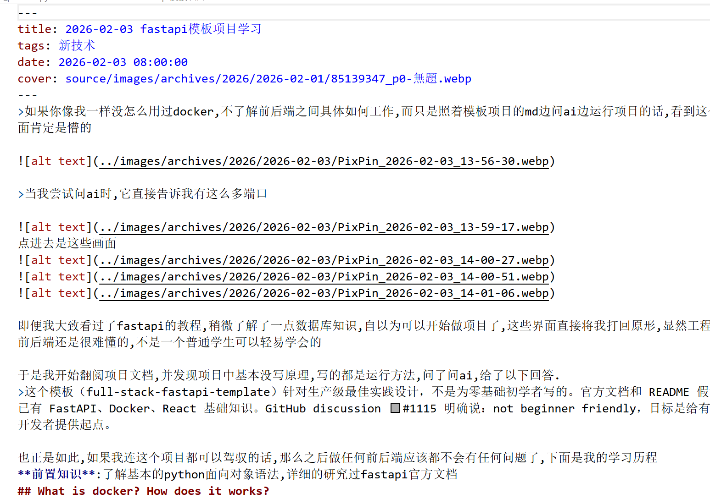
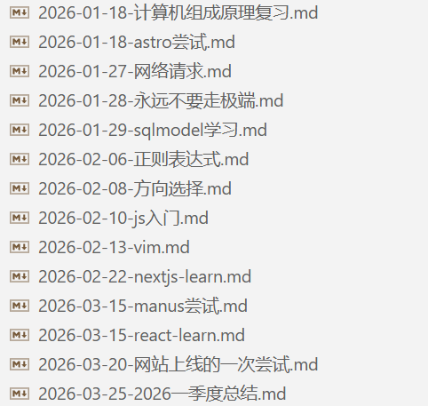

我的第一篇博客发表于**2025/11/15**,或许更早的时候也发过一两篇,但我已经没有印象了.不管怎样,写博客让我真正的入门编程,真正的开始喜欢编程,真正的愿意去为了某项事业奋斗终生.所以,就把这第一篇博客的发表日期作为我的编程起点吧.

先谈谈我早时候对于编程的认识.我大一下的时候有门课叫做<< 高级语言程序设计 >>,这门课由理论课和实验课组成,理论课2学分,实验课1学分.相比高数课的6学分可以说是少得可怜.

这门课教些什么呢?简单的来说,就是入门级别的C和CPP,包括基本语法,函数和简单的面向对象知识,具体来说只大致涉及了class和structure的基本特性,连泛型和Enum都没有提到.

看着确实很简单,知识点也不难,如果用正常的方式来学,只要用半个月就可以入门了,遗憾的是,这门有一千多人都要学的专选课有一个非常非常专横的负责人,姑且称他为J吧.

这门课是有很多老师来上的,毕竟选课人数摆在那里,但所有的教学课件,答疑,作业,考试的具体事由,都有J来决定,其他老师能够拿主意的只有念PPT和签到而已.

更离谱的是,这个J只是一个普通的讲师,要问一个讲师是怎么在一所大学里搭建起自己的独立王国的,我不清楚.不管怎样,他的乾纲独断持续了十几年之久,并继续影响着我之后的学弟学妹们.

他的教学模式是这样的: 每个新章节开始前,会在一千多人的QQ群里发一个PPT,供我们进行预习,并布置预习作业,并在学习完章节后布置后续的项目作业,特定章节学完后还会布置一个大作业,将前面的内容整合到一起.

乍一看还挺好的,但他有一个非常讨厌的观点: 你们跟着我学就行了,不要自己去学.类似这样偏激的观点他还有很多,比如,`本科生要写上十万行代码才能称为程序员`.

不管怎样,他的作业布置也是按照上述理念执行的,作业量特别大,知识点极其琐碎,能够在`cout`,`cin`这种简单的知识点上弄出几十页ppt的题目,每页ppt都或多或少有些题目要你填空后再提交.

我也是在做他的大作业项目时发现我的编程能力比较强的,那个时候的AI还不是很强,而且他恐吓学生说严禁作业使用AI,否则直接将你的作业总分**记为零**.比如说别人做大作业要做三四天,我一般一天不到就能搞定,而且是边玩边写的.而高级语言程序设计这门课我的成绩也是两个优秀.

但我只是一个特例,况且我一点都不喜欢这样的学习方式,大多数人也因为他失去了对编程的兴趣,在大一之后的分流选择了计算机学院之外的其他专业.

>计算机领域从来都不应该是某个人拿着鞭子抽着你来学的,应该说任何领域都是这样的.

由于我非常讨厌他,所以也选择了唯一一个计算机学院内不用上他的课的软件工程专业,毕竟都是敲代码,这些专业也没什么区别.但直到我写博客之前,我都是浑浑噩噩的,因为我们这个专业的老师都非常佛系,平常的作业也少,我当时也并没有特别的喜欢编程,只不过天天刷一点算法题,幻想着打进ACM,之后保研加分.

当然,凭我这贫乏的脑容量,刷几道题就累了,即便跟着算法书大致打好了基础,但看到难题时仍然一筹莫展,就算我知道算法不是一蹴而就的,也还是提不起劲去认真学习算法;相反,我经常刷几道题后就去翻阅阮一峰周刊,天天看好几篇周刊,自认为跟上了时代潮流,是个懂风向的程序员.但我当时就连基本的cpp语法都不太会.

后来,搜资料时看到了别人写的博客,觉得很帅气,就让AI推荐了一个博客模板,也就是我之前使用的Hexo butterfly.当时的我啥也不会,只跟着某个大佬的图文教程走完,糊里糊涂就用Github创建一个自己的博客,而我当时连基本的Git命令都没搞懂.

有了自己写的博客后,我就很喜欢去看看别人是怎么写博客的,一天能够速览好几个博客的文章.慢慢的我发现,写代码只是生活中的一小部分,程序员还有各种各样的事情要操心,升职加薪,照顾家人,出国留学,辞职创业,各种各样的生活坎坷都在我面前展开.

但我最终下定决心要开始认真学习编程,是在12月份下旬的大作业中,我的小组总共三个人,有一个大佬从一开始就承担了大部分的工作,而我只是单纯的用AI填写他用AI编写的接口文件而已.

尽管大佬的性格很怪,说话含混不清,但我也不好意思去问他,毕竟他已经承担了大部分工作(也因为他性格很怪...).所以就酿成悲剧了,在大作业结项前,发现我和其他人用AI编写的接口对不上,导致项目无法成功运行,项目答辩的时候那叫一个尴尬...

不出意外的,我这门课的结课成绩是良,而其他几门课的捷报频传也让我开始思考,到底还要不要拼绩点保研,于是到处搜罗别人的博客和各种分享,有人大二就翘课找实习,也有人在保研和就业中选择了后者,有人在北大专硕和微软就业中选择了前者...

渐渐的,我的想法从要不要保研跳转到了要不要考研,但我对自己的专业技能仍然没有信息,所以还是很焦虑.

大二寒假时(也就是3个月前的二月初),由于我的某个好朋友托我帮他组装一个校级科研项目(水分十足的那种),这个项目已经有另外一个人用AI糊弄出了一个flutter前端,想要我补充后端.

这我当然一筹莫展,因为首先这个项目是AI的,没有任何接口,代码写的非常烂;其次我当时也看不出代码的质量好坏,怎么写后端也无从下手.

不管怎样,AI推荐我学习fastapi来搭后端,那有啥,就开始学呗,但跟着fastapi破碎的官方教程下来,虽然我啥都没有学到,但自以为可以下手了,于是就点开前端部分的代码,发现实在是无从下手,于是就开始从零学习前端,自然也是问的AI,AI推荐我学习js后再学习nextjs.

于是我草草学习了js后就直奔nextjs,跟着nextjs的教程敲代码,做出一个像模像样的项目.

自然,这也是没有一点用的,因为我的基础一点都不牢固,但我还是自认为现在可以算是个全栈程序员.

- 后来这个项目不了了之了.基本所有学校的科创训练项目都是这样结尾的,鬼知道浪费了多少经费和人力.

>一个插曲是,我在学完fastapi后看到了官方模板项目,见识到了真正的前后端开发,明白了自己要学什么.
当然当时的我只是把项目中的代码喂给AI让他帮我解释而已:

后来,朋友又托我帮他搭建一个智能体项目,我才发现自己其实对全栈开发一无所知,所有的信念都是AI和无知赐予我的,于是我辗转找到了Manus,让他帮我做项目,并且真的做出来了!

尽管如此,他的代码我还是看不太懂的,于是我终于明白自己的基础还是太烂了,开始恶补基础的编程知识.并自己总结了一些适合我的学习方法,开始真正的入门编程.

总体来看,我的学习道路是异常曲折的,我相信很少有人会有这样一波三折的学习历程,但这段曲折的学习经历同样是非常宝贵的,我知道了什么是脚踏实地的编程,什么是不负责任的吹牛;我知道了什么是日拱一卒的学习,什么是AI带来的自我幻觉.

所以,就算你之前没能打牢基础,选错了学习方向,那又如何,你永远可以像我一样,从零重新开始,找到自己的学习方法,并在短短几个月内成长为一个能够独立思考,能够悉心钻研技术的程序员.