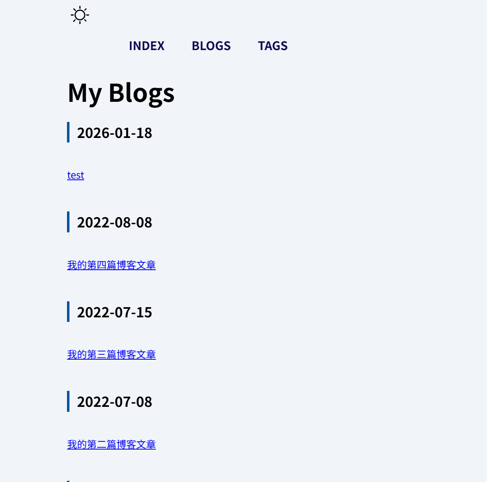
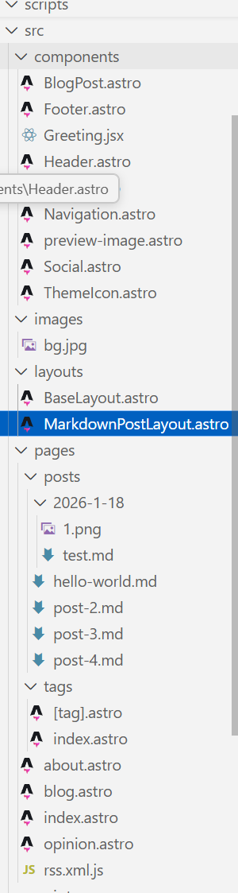
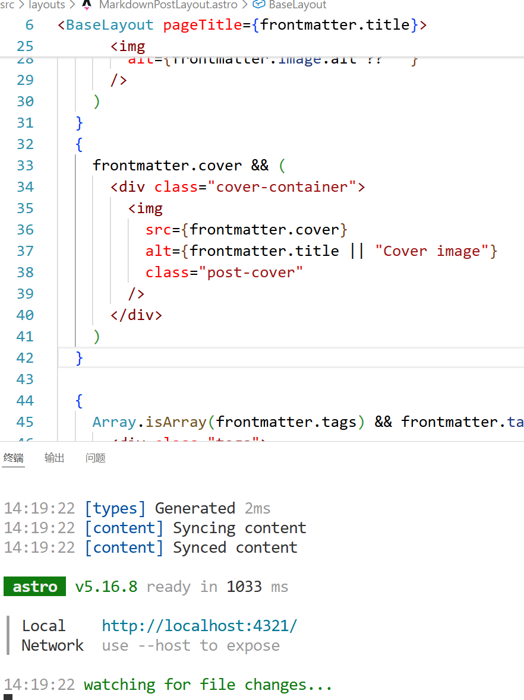
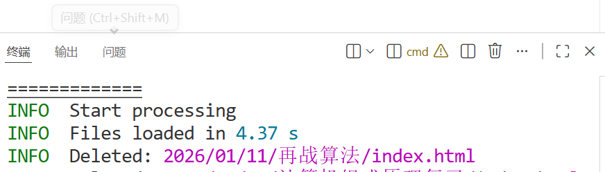

本来觉得hexo的图片管理太麻烦了,部署速度又比较慢,做不到动态同步,就想着换其他的博客框架试试,经过多方搜寻敲定了astro来尝鲜,下面是没有模板时的效果

>看着还不错,之后再改改就是个还不错的博客框架了,但问题就是所有组件都要我一个个自己写,没有前端基础的话光靠AI做不出太好的效果,而当我一点点添加组件的时候部署速度就飞速下降了

>尽管相比起来的话astro还是快了不少,但我一想到之后再加入图片管理功能和访客统计,评论系统,加载动画这些东西之后那臃肿的package库,就觉得不太可能会有多快,所以决定及时止损,虽然hexo跑的不够快,但也是一辆历久弥新的自行车!
- 而且不用我自己写组件

>准备再试试hugo,如果真的有质的飞跃,再考虑换过去