## 考试事项
考试分数占比60%
填空15分 一空一分
选择20分 20道题
综合题65分 七道大题,基本一个章节一道题
## 重要的杂项
### 片选信号
CS(chip select): 片选信号,低电平有效,通过地址逻辑生成,故在原理图中一般都在上面加一横来表示
### 译码器
译码器(decoder)是一种具有“翻译”功能的多输入多输出的组合逻辑电路器件。
译码器的功能：将每一组编码序列信号转换为一个特定的输出信号
译码器的输入：一组编码序列信号
译码器的输出：一条特定的译码信号（与每组输入信号对应）
译码器的工作原理：当某组编码进入输入端时，相应的译码线输出为低电平，与此同时，其他所有译码线输出保持为高电平。
通常，译码器的输出端与输入端的数量关系为（2^n）

## 第一章 概论
### 计算机5个部件的示意图
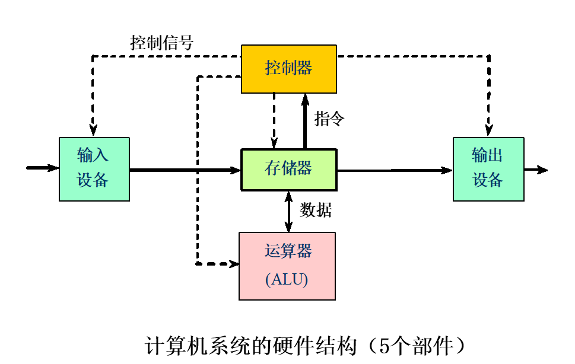
>由于运算器(ALU)与控制器都集成在cpu上,因此可以写成下图形式

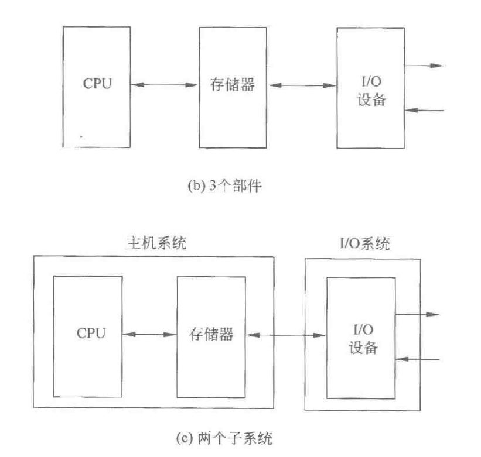
而早期的冯诺伊曼结构是这样的
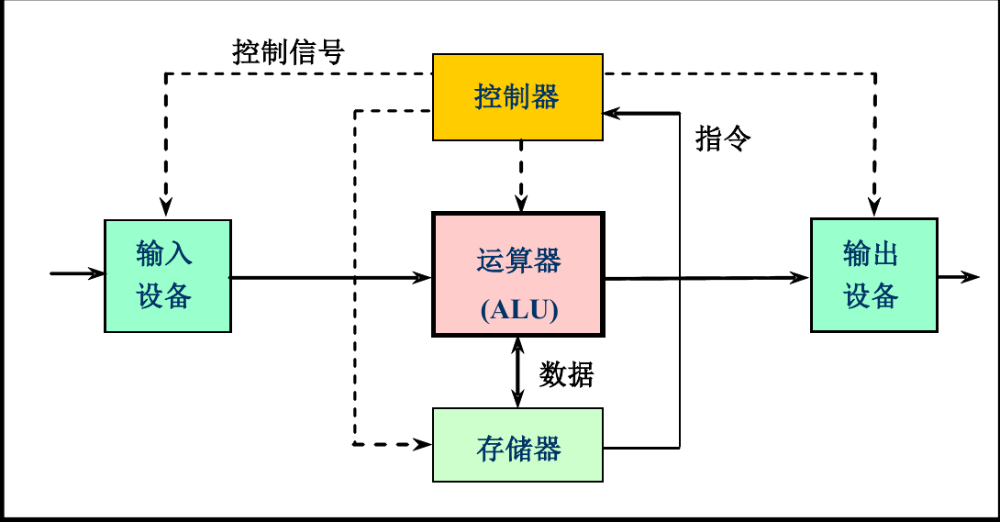

### 各部件详解
>运算器: 算术逻辑单元,用于完成算术运算和逻辑运算
控制器: 计算机的管理机构和指挥中心,协调计算机各部件自动工作
存储器: 计算机的存储部件,用于存储程序和数据,由内存和外存两部分构成
内存: 由大量存储单元组成,构成一个按地址访问的一维线性空间,也称为主存
输入设备: 将程序和数据以计算机能识别的形式输入到计算机内
输出设备: 将计算机处理的结果以人们能接受或其他系统所要求的形式输出到外部世界
操作系统: 最主要的系统软件,负责管理系统资源,为应用程序提供运行环境,为用户提供操作界面

---
其中,控制器由以下6部分构成:
1. 指令寄存器(IR): 用于存放当前正在执行的指令
2. 程序计数器(PC): 用于存放当前正在执行的指令的地址
3. 指令译码器: 对指令进行译码,形成相应的控制信号
4. 时钟脉冲(CP): 协调计算机各部件的同步主时钟,工作频率称为计算机的**主频**
5. 时序信号发生器: 按时间顺序发出节拍信号
6. 微操作控制部件: 根据时序信号发生器的节拍信号和指令译码器的译码结果产生微操作控制信号给各个计算机部件

>而运算部件由运算器和通用寄存器组构成,寄存器组用于暂存运算数据和中间结果
内存则由存储体,地址寄存器AR,数据寄存器DR三部分构成
### 计算机的性能指标
1. 主频: 衡量计算机工作速度的主要指标之一
2. 运算速度: 以每秒执行多少条指令或完成多少次浮点运算来表示
3. 基本字长: 直接参与运算的数据的二进制位数,标志着运算精度,位数越多,精度越高
4. 主存容量: 主存能储存信息的总量
5. 主存存取周期: 对主存连续两次访问的最小时间间隔
6. 外部设备的配置

>其中运算速度由两种计量单位,分别是
1. MIPS:百万条指令/秒(million instructions per second)
2. MFLOPS:百万次浮点运算/秒(million flops per second)
## 第二章 数的表示（作为第十章的基础）

> **机器数**：用二进制编码表示的数据
> 在计算机中，常用 **原码、补码、反码** 三种方法来表示带符号的机器数

---
- 下面的.表示拼接
### 原码表示法

**定义**
原码由 **符号位 + 数值位** 组成

* 符号位 s：0 表示正，1 表示负
* 数值位表示绝对值的二进制

**表示公式**

* 正数

  * 原码 = 0 · |x|₂
* 负数

  * 原码 = 1 · |x|₂

- **简单说就是负数前面加个1**
>举例:
[-0.1101]_原=1.1101
[-1101]_原=11101

**特点**

* 表示直观
* 存在 +0 与 −0
* 加减运算用根据符号来判断,但符号位不参与运算

---
### 反码表示法

**定义**
补码的中间过程
**表示公式**

* 正数

  * 反码 = 原码 = 0 · |x|₂

* 负数

  * 反码 = 符号位不变，数值位逐位取反

**特点**

* 存在 +0 与 −0
* 运算仍不方便

### 补码表示法

**定义**
补码是计算机中实际采用的带符号数表示方法

**表示公式**

* 正数

  * 补码 = 原码 = 0 · |x|₂
* 负数

  * 补码 = 原码数值位逐位取反 + 1

**补充说明**

* 小数补码中，“加 1”是对最低有效位加 1
* 若产生进位，直接舍去最高进位

**特点**

* 只有一个 0
* 加减法统一为加法
* 硬件实现简单

#### 深入理解
>一个数减去小于模的另一个数,可以用加上模与另一个数的绝对值之差来代替

>实际上负数的补码是用2的(n+1)次方加上该负数得到的,若负数x有n位,则补码相当于(11...11)n +1 +x,这也就是负数补码之所以要对所有位取反再加一的真相

- 当最高位即符号位有进位时实际上相当于加上了一个2的(n+1)次方,对结果取模时可以舍去

---
### 移码表示法

>无论正负均用一个式子表示

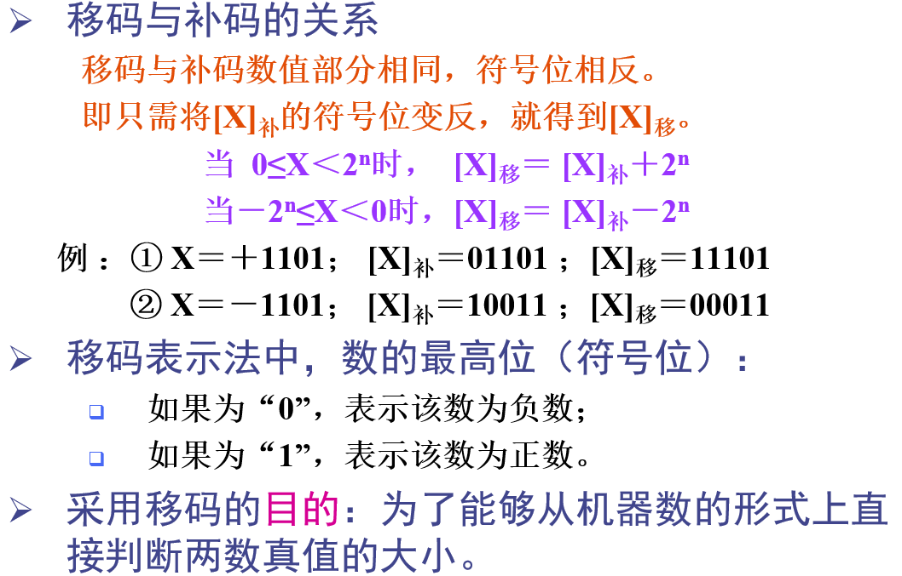

### 数的浮点表示
>浮点是指小数点的位置不固定,随时浮动

\[
X = M \times 2^{E}
\]

>其中：
  $E$：阶码，用定点整数表示,采用移码
  $M$：尾数，用定点小数表示

#### 规格化浮点数

当浮点数的基数为 2 时，如果其尾数 $M$ 满足：
\[
\frac{1}{2} \le |M| < 1
\]
则称该浮点数为规格化浮点数

- 很好理解,如果尾数小于1/2,说明有前导0,那么就可以将阶码减小1来消去0

#### 例题
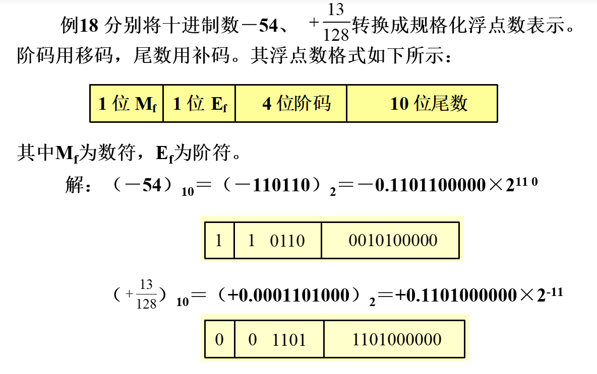

>步骤如下:
1. 先将十进制数化成尾数乘以阶码的形式,
2. 而在实际存储中,将阶码用移码表示,也就是加上2的4次方,从而保证都是正数
3. 再把尾数用补码的形式表示出来,符号位放到最前面的数符位置,数值位放在最后面

## 第六章 计算机执行程序的过程
### 指令说明

#### Load 指令（装载寄存器指令）
- 功能：把一个数据送入指定的寄存器  
- 数据来源：
  - 立即数
  - 存储器中的某个单元

---

#### Store 指令（存储指令）
- 功能：把指定寄存器中的数据存入存储器的某个单元

---

#### Add 指令（加法指令）
- 功能：将两个寄存器中的数据相加,把运算结果存入指定寄存器

---

#### Jump 指令（跳转指令）
- 功能：跳转到新的地址继续执行指令

---

### 记号说明

- `[Rx]`：寄存器 Rx 中的内容  
- `MEM[y]`：存储器中地址为 y 的存储单元内容  
- `→`：传送（数据流向）

### 指令示例说明

#### 第 1 条  
**Load R1，200(R0)**  
MEM[[R0] + 200] → R1  
以 R0 为基址，加偏移量 200，将对应存储单元内容送入 R1  

#### 第 2 条  
**Load R2，#4**  
4 → R2  
4 直接包含在指令中，称为**立即数**

#### 第 3 条  
**Add R3，R1，R2**  
[R1] + [R2] → R3  
将 R1 与 R2 中的数据相加，结果送入 R3  

#### 第 4 条  
**Store R3，200(R2)**  
[R3] → MEM[[R2] + 200]  
以 R2 为基址，加偏移量 200，将 R3 的内容存入存储器  

#### 第 5 条  
**Store R2，@(208)**  
[R2] → MEM[ MEM[208] ]  
@ 表示间接寻址，208 中的内容作为有效地址  

#### 第 6 条  
**Jump 1000**  
1000 → PC  
将程序计数器 PC 置为 1000，跳转执行

---
- 指令后面跟着的第一个数就是指令操作的结果存储对象,再后面才是这个操作需要的数据
- 注意到这里的R1,R2,R3都是寄存器(register)

### 第一条指令**Load R1，200(R0)**详解
**第一步**
1. [PC]->AR,将pc存放的当前指令地址传入地址寄存器AR
2. 从存储体读出对应地址的指令放入数据寄存器DR
3. 将DR送入指令寄存器IR

**第二步**
指令译码器进行译码,结合CP和时序信号发生器产生的节拍信号,产生微操作控制信号

**第三步**
1. 计算访问地址:[R0]+200->AR
   1. [R0]->ALU,把寄存器R0中的内容送入ALU
   2. IR中的操作数200送入ALU
   3. [ALU]->AR,ALU进行加法运算,把结果传给AR
2. 从存储器读出数据,送入寄存器R1
   1. 从存储器中地址200的存储单元读出数据,送入DR
   2. DR->R1,将DR中的数据送入R1

**第四步**
PC+4,指向下一条指令

- 显然所有指令的第1步(取指令),第2步(指令译码),第4步(PC+4)都是一样的,只是第三步的执行指令有区别 
---
## 第七章 指令系统

### 指令格式
>一条指令必须包含以下三条信息
1. 要执行的操作
2. 操作的对象
3. 操作的结果(操作结果要保存到哪里)

- 操作数:操作码操作的对象数据
**指令的基本格式**

### 指令的地址码
地址码中的地址可以为0,1个或多个,根据指令中地址码中的地址数量可以分为以下5种指令

#### 零地址指令

>通常在两种情况下可能采用零地址指令
1. 指令本身不需要任何操作数
2. 指令中所需的操作数是隐含指定的
#### 一地址指令

>在两种情况下可能采用一地址指令
1. 指令本身只需要一个操作数,如加1,求补等
   - A <- OP[A]
2. 指令操作需要两个操作数，指令中指明一个操作数，而另外一个操作数在默认的某个地方
   - 如 ：累加器AC中，操作结果存放到累加器AC中
   - AC <- [AC] OP [A]
#### 二地址指令
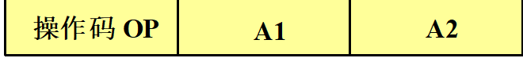
- A1 <- [A1] OP [A2]
>根据存放操作数的位置不同，分为3种。
1. 寄存器-寄存器型（R-R型）指令
2. 存储器-存储器型（M-M型）指令
3. 寄存器-存储器型（R-M型）指令

- 显然其中一个是用来存放操作结果地址的
#### 三地址指令和多地址指令 
>三地址指令被广泛采用,特别是在RISC计算机中

>多地址指令用于描述一批数据，指令中需要多个地址来指出数据存放的首地址、长度和下标等信息

### 指令的操作码

>指令系统中的每一条指令都有唯一确定的操作码，不同指令的操作码是不相同的。  
操作码的长度决定了指令系统的最大规模。  
若操作码的位数为 n 位，则该指令系统最多能有 $2^{n}$ 条指令
---

#### 固定长度操作码

>所有指令操作码的长度都是固定的，且集中放在指令的一个字段内。  
有利于简化硬件设计，减少指令译码时间。  
很多现代计算机都采用了固定长度操作码。

---

#### 可变长度操作码

指令系统中操作码的长度有多种，不同指令的操作码长度不完全相同。  

- 使用频率高的指令使用短的操作码  
- 使用频率低的指令使用较长的操作码  

可以缩短操作码的平均长度，但会使硬件设计复杂化，增加指令译码的时间和难度。

---

#### 扩展操作码

将操作码设计为几种不同的固定长度，且相互之间按某种规则进行扩展。

**优点**
- 可以简化硬件设计；  
- 当指令总长度一定时，可以使操作码的长度随地址数的增加而减少，  
  不同地址数的指令的操作码长度也不同，从而有效缩短指令总长度。

**扩展操作码的方法**
- 等长扩展  
- 不等长扩展

**扩展示例**
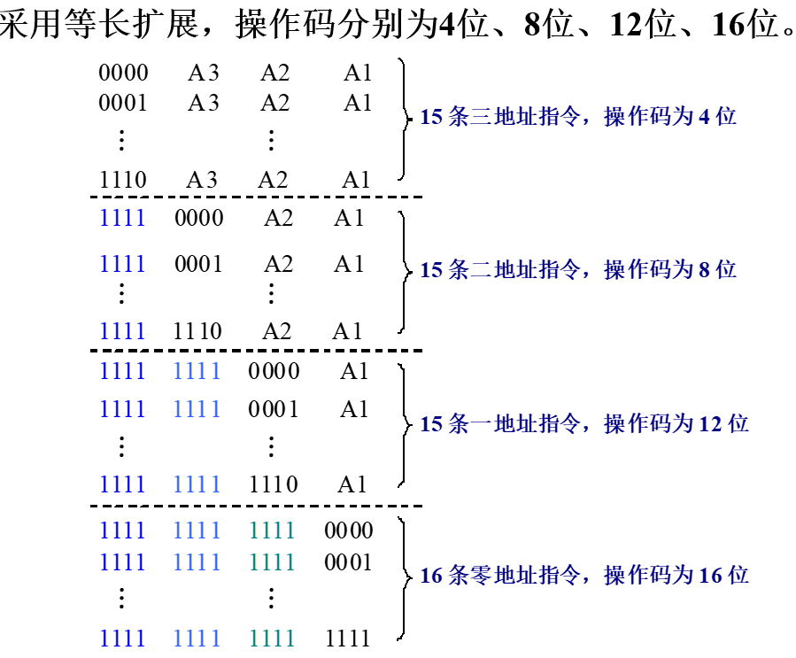

### 指令长度

**指令长度**：指一条指令所包含的二进制代码的总位数。

指令长度主要取决于以下因素：  
- 操作码的长度  
- 操作数地址的长度  
- 操作数地址的个数  

指令长度通常与机器字长存在简单的倍数关系。

---

#### 按与机器字长的关系分类

- **单字长指令**  
  指令长度等于机器字长的指令  

- **半字长指令**  
  指令长度等于半个机器字长的指令  

- **双字长指令**  
  指令长度等于机器字长两倍的指令  
---

- 指令长度一般应是**字节的整数倍**

### 寻址方式
>指令的地址码给出的地址不一定是操作数的真正地址,而是形式地址,确定操作数有效地址的方法就叫寻址方式
#### 直接寻址
>在指令的地址码字段直接给出操作数所在主存单元的地址。
- 简单、快速的寻址方式，但寻址范围受限于地址码字段的位数
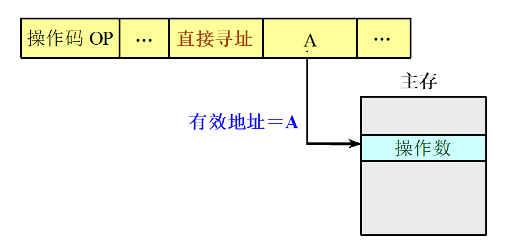

#### 间接寻址
>指令的地址码字段给出的是操作数所在内存单元的地址的地址。
1. 指令中形式地址所指定的内存单元中存放的内容才是操作数的真正地址。
2. 得到操作数需要访问两次内存，指令的执行速度比较慢

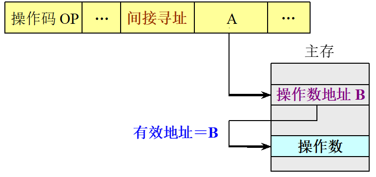
#### 立即寻址
- 指令的地址码字段直接给出操作数本身，而不是操作数的地址。
- 指令执行速度最快，得到指令的同时就得到了操作数，不需要再访问内存。

#### 寄存器直接寻址与寄存器间接寻址
>寄存器直接寻址：指令的地址码字段给出一个寄存器编号，该寄存器中存放的内容就是操作数。
寄存器间接寻址：寄存器中存放的内容是操作数的地址，根据此地址访问内存取得操作数。 

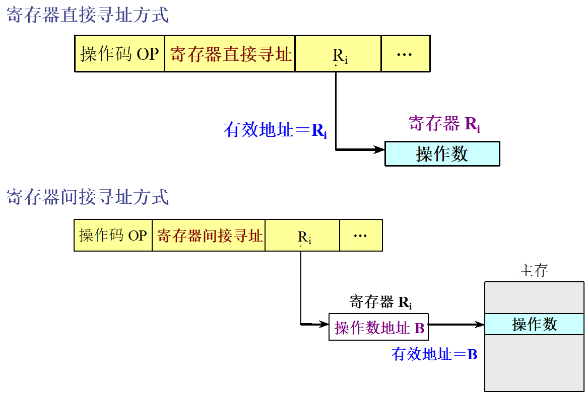
#### 隐含寻址
>指令中不给出操作数的地址

- 操作数约定在某个特定的寄存器或堆栈中

#### PC相对寻址
>将程序计数器PC的内容与指令中给出的形式地址（偏移量）的值相加，形成操作数的有效地址
- 形式地址（偏移量）的值可正可负。
- 对于短跳转和程序的再定位很有用。 
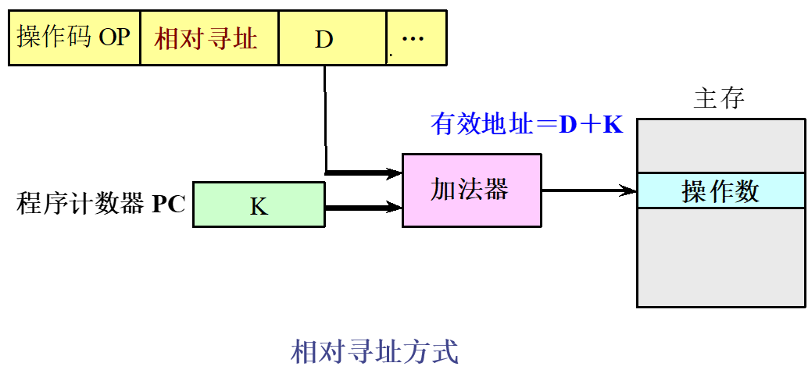

#### 变址寻址 
>将指令中给出的形式地址的值与变址寄存器的内容相加，形成操作数的有效地址。

- 变址寄存器可以是专用寄存器，也可以是通用寄存器中的一个。
- 常用于字符串处理、数组运算等成批数据处理中，主要是面向用户，解决程序循环控制问题。
- 通常地址的变化体现在变址寄存器中，指令中的形式地址相对固定。
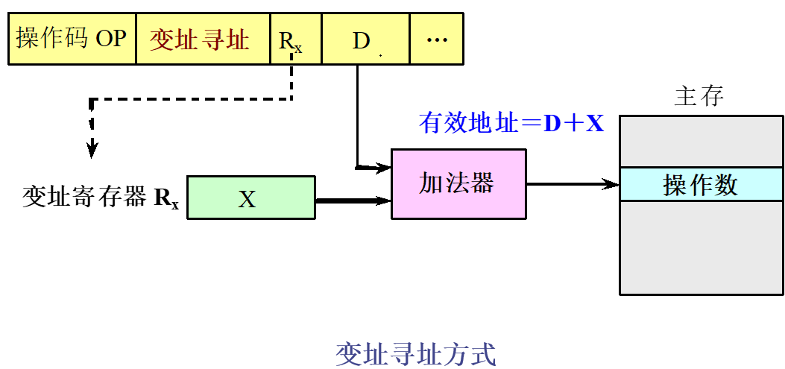
#### 基址寻址
>把指令中给出的形式地址的值与基址寄存器的内容相加，形成操作数的有效地址。

>- 基址寄存器的内容称为基地址。
>- 主要用于将用户程序的逻辑地址转换成主存的实际地址。它面向系统，解决程序重定位和扩大寻址空间等问题。 
>- 通常地址变化体现形式地址上，基地址相对不变。

#### “基址+变址”寻址
         有效地址=（RB）+（RX）+D 
其中:
- （RB）：基址寄存器RB中的内容
- （RX）：变址寄存器RX中的内容
- D：指令字中给出的形式地址（偏移量）
### 指令按功能分类
1. >**数据传送类指令**
将数据从一个地方传送到另一个地方
- 主要实现主存和主存之间、主存和寄存器之间、寄存器和寄存器之间的数据传送。
- 数据传送指令一次可以传送一个数据，也可以一次传送一批数据。

2. >数据运算类指令
用来实现数据的算术运算、逻辑运算和移位运算

- 算术运算：加、减、乘、除运算；加1 、减1；比较指令等。
- 逻辑运算：包括与、或、非 、异或等运算。
- 移位指令：算术移位、逻辑移位和循环移位三类，它们又可分为左移和右移两种。 

3. >程序控制类指令
主要用来控制程序执行的顺序和方向。
- 包含转移指令、子程序调用和返回指令、自陷指令等

4. >输入输出指令
- 简称I/O指令,主要用于实现主机与外部设备之间的信息交换

### 指令系统设计  
>指令系统的设计包括指令的功能设计,指令格式的设计两部分

>在确定哪些基本功能用硬件来实现时，主要考虑3个因素：速度、成本、灵活性。
- 硬件实现的特点
    - 速度快、成本高、灵活性差
- 软件实现的特点
    - 速度慢、价格便宜、灵活性好
#### 对指令系统的基本要求
1. >完整性：在一个有限可用的存储空间内，对于任何可解的问题，编制计算程序时，指令集所提供的指令足够用。

- 要求指令集功能齐全、使用方便

2. 规整性：主要包括对称性和均匀性。

- >对称性：所有与指令集有关的存储单元的使用,操作码的设置等都是对称的。
    - 例如：在存储单元的使用上，所有通用寄存器都要同等对待。在操作码的设置上，如果设置了A-B的指令，就应该也设置B-A的指令。 
- >均匀性：指对于各种不同的操作数类型、字长、操作种类和数据存储单元，指令的设置都要同等对待。
    - 例如：如果某机器有5种数据表示，4种字长，两种存储单元，则要设置5×4×2=40种同一操作的指令。 

3. >正交性：指在指令中各个不同含义的字段，如操作类型、数据类型、寻址方式字段等，在编码时应互不相关、相互独立。
    
4. >高效率：指指令的执行速度快、使用频度高。
   
5. >兼容性：主要是要实现向后兼容，指令系统可以增加新指令，但不能删除指令或更改指令的功能。

#### 指令格式的设计
>3种常用的指令编码格式:可变长度编码格式、固定长度编码格式、混合型编码格式

##### 可变长度编码格式
>当指令系统包含多种寻址方式和操作类型时，这种编码方式可以有效减少指令系统的平均指令长度，降低目标代码的大小。

- 可能会使各条指令的字长和执行时间相差很大。
- 多数CISC指令系统均采用了这种编码格式。 

##### 固定长度编码格式
>将操作类型和寻址方式一起编码到操作码中。

- 当寻址方式和操作类型非常少时,这种编码格式非常好,可以有效地降低译码的复杂度，提高译码的速度。
- 大部分RISC的指令系统均采用这种编码格式。

##### 混合型编码格式
>提供若干种固定的指令字长,以期达到既能够减少目标代码长度又能降低译码复杂度的目标。
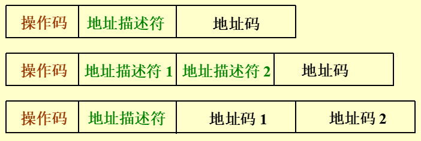

#### 指令系统的两种设计策略

##### CISC（复杂指令系统计算机）
Complex Instruction Set Computer
- 增强指令功能  
- 将越来越多的功能交由硬件实现  
- 指令数量不断增加  
- 单条指令可完成较复杂的操作  

---

##### RISC（精简指令系统计算机）
Reduced Instruction Set Computer
- 尽可能简化指令系统  
- 指令条数较少  
- 指令功能相对简单  
- 复杂功能由多条简单指令组合完成  
##### 为什么研发RISC
>CISC的优点:指令数量多、功能多样
问题:
1. 各种指令的使用频度相差悬殊，许多指令很少用
   - 据统计：只有20％的指令使用频度比较高，占运
   行时间的80％。而其余80％的指令只在20％的运行时
   间内才会用到。
   
2. 指令系统庞大，指令条数很多，许多指令的功能又很复杂，使得控制器硬件非常复杂。
    - 占用了大量的芯片面积
    - 增加了研制时间和成本，容易造成设计错误。
3. 许多指令由于操作繁杂，其CPI值比较大，执行速度慢。采用这些复杂指令有可能使整个程序的执行时间反而增加。
4. 由于指令功能复杂，规整性不好，不利于采用流      
   水技术来提高性能。 

>设计RISC机器遵循的原则 
1. 指令条数少、指令功能简单。只选取使用频度很高的指令，在此基础上补充一些最有用的指令
2. 采用简单而又统一的指令格式，并减少寻址方式；指令字长都为32位或64位
3. 指令的执行在单个机器周期内完成
4. 采用load-store结构:只有load和store指令才能访问存储器,其它指令的操作都是在寄存器之间进行
5. 大多数指令都采用硬连逻辑来实现
6. 强调优化编译器的作用,为高级语言程序生成优化的代码
7. 充分利用流水技术来提高性能

### 典型RISC实例:MIPS
#### 寄存器
- 32个64位通用寄存器,其中R0的值永远是0(GPRs)
- 32个64位浮点数寄存器(FPRs)
- 一些特殊寄存器
#### 数据表示
- 整数:字节（8位）;半字（16位）;字（32位）; 双字（64位）
- 浮点数:单精度浮点数（32位）  双精度浮点数（64位）

>字节、半字或者字在装入64位寄存器时，用零扩展或者用符号位扩展来填充该寄存器的剩余部分。装入以后，对它们将按照64位整数的方式进行运算。

#### 数据寻址方式 
只有立即数寻址与偏移量寻址两种
#### 指令格式
>只有三种指令格式,都是32位,其中操作码占6位
##### I 类指令（Immediate）

**包含类型**

* Load / Store 指令
* 立即数指令
* 分支指令
* 寄存器跳转指令
* 寄存器链接跳转指令

**特点**

* 立即数字段长度：16 位
* 用途：提供立即数或地址偏移量

**指令语义**

* **Load 指令**

  * 有效地址：`Regs[rs] + immediate`
  * 从存储器读取数据，写入寄存器 `rt`

* **Store 指令**

  * 有效地址：`Regs[rs] + immediate`
  * 将寄存器 `rt` 中的数据写入存储器

* **立即数指令**

  * `Regs[rt] ← Regs[rs] op immediate`

* **分支指令**

  * 转移目标地址：`Regs[rs] + immediate`
  * 寄存器 `rt` 不使用

* **寄存器跳转并链接**

  * 转移目标地址：`Regs[rs]`

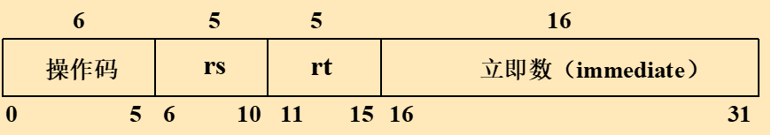

---

##### R 类指令（Register）

**包含类型**

* ALU 运算指令
* 专用寄存器读 / 写指令
* move 指令等
 
**ALU 指令语义**

* `Regs[rd] ← Regs[rs] funct Regs[rt]`
* `funct` 字段指定具体运算类型

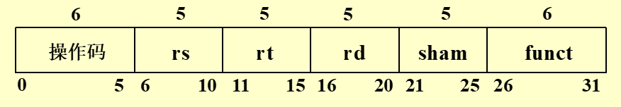

---

##### J 类指令（Jump）

**包含类型**

* 跳转指令
* 跳转并链接指令
* 自陷指令
* 异常返回指令

**特点**

* 指令字低 26 位为偏移量
* 与当前 PC 值组合形成跳转目标地址

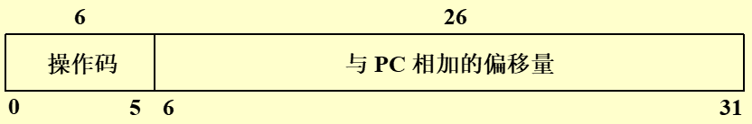

#### MIPS的操作 
MIPS指令可以分为四大类
load和store
ALU操作
分支与跳转
浮点操作
#### 数据表示
#### 数据表示
## 第八章 CPU
### CPU的功能
CPU具有以下4个方面的基本功能
- 指令顺序控制
  - 指控制程序中指令的执行顺序。
  - 程序中各指令之间是有严格先后顺序的，必须严格按程序规定的顺序执行，才能保证计算机工作的正确性
- 操作控制
  - 一条指令的功能往往是由计算机中的部件执行一序列的操作来实现的。
  - CPU要根据指令的功能，产生相应的操作控制信号，发送给相应的部件，从而控制这些部件按指令的要求进行动作
- 时间控制
对各种操作实施时间上的定时。
  - 在一条指令的执行过程中，在什么时间做什么操作均应受到严格的控制
- 数据加工
  - 即对数据进行算术运算和逻辑运算，或进行其他的信息处理 
  
#### 基本组成
- 现代CPU一般由运算器、控制器、数据通路和Cache组成

#### 指令执行的基本步骤
>一条指令的执行过程包括3个基本步骤：

1. 取指令：从存储器取出一条指令，该指令的地址由程序计数器PC给出。
2. 译码：对该指令的操作码进行译码分析，确定是哪一种指令，并转到这种指令对应的执行阶段。
3. 执行：按指令操作码的要求执行该指令。执行过程可能需要多步操作，控制器将为之形成完成该指令功能所需要的操作控制信号。执行完毕后,回到取指令阶段，去取下一条指令。如此反复，直到整个程序执行完。

### 模型机:MIPS结构的简单实现
所包含的指令
- 算术逻辑运算指令（R类型指令格式）
  - add，sub，and，or，slt 
  - 操作码字段Op=0
- 存储器访问指令（I类型指令格式）
  - lw（load word，op=35）
  - sw（store word，Op=43）
- 等于“0”分支（I类型指令格式）
  - beqz，Op=63  
  - 说明：beqz在MIPS中实际上是条伪指令。
**R**

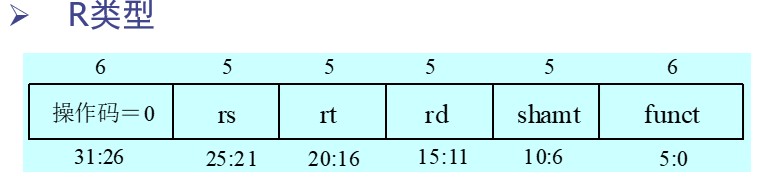

* **Op** —— 操作码字段
  用 IR[Op] 或 IR[31:26] 表示

* **rs** —— 第一源操作数字段
  用 IR[rs] 或 IR[25:21] 表示

* **rt** —— 第二源操作数字段
  用 IR[rt] 或 IR[20:16] 表示

* **rd** —— 目标操作数字段(或结果字段)
  用 IR[rd] 或 IR[15:11] 表示

* **shamt** —— 无用

* **funct** —— ALU 指令的运算函数码字段
  用 IR[funct] 或 IR[5:0] 表示

---

**I**

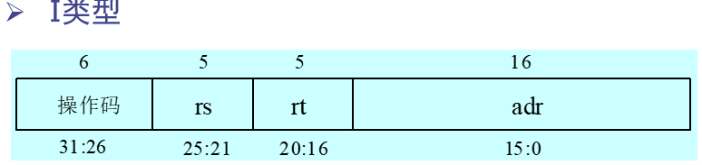

* **rs** —— 基址寄存器字段
  用 IR[rs] 或 IR[25:21] 表示
  对于 beqz 指令来说, 是存放被检测的数据

* **adr** —— 偏移量字段
  用 IR[adr] 或 IR[15:0] 表示
  rs 和 adr 用于计算访存有效地址或分支目标地址

* **rt** —— 寄存器字段
  对于 load 指令来说, rt 所指出的寄存器是存放所取的数据
  对于 store 指令来说, 是存放要写入存储器的数据

### 构建基本的数据通路
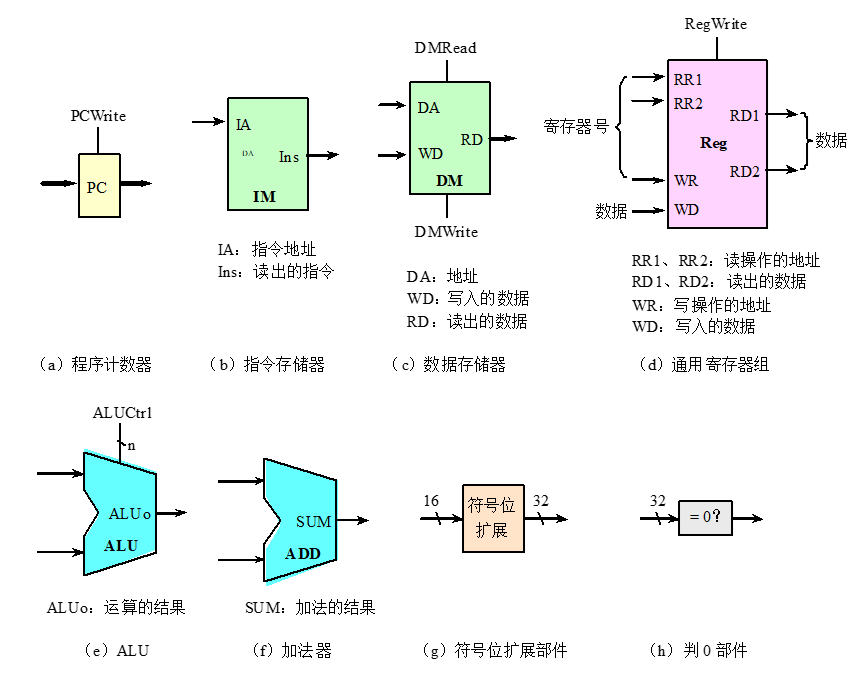
- 程序计数器(PC):指出当前正在执行的指令的地址,每执行一条指令,PC+4
- 指令存储器(IM):假设IM内已经加载好了所需的指令,在IA加载地址,就可以从Ins得到对应指令
- 数据存储器(DM):两个输入端,一个是DA,给出要写入或读出的存储单元的地址,另一个是WD,给出要写入DM的数据;有两个控制信号:DMRead和DMWrite,任何时候最多只有一个有效
- 通用寄存器组:输入端有4个,RR1和RR2给出两个读操作的地址,WR给出写操作的地址,WD给出要写入的数据;输出端有两个:RD1和RD2分别给出读出的寄存器单元的数据;有一个控制信号RegWrite,当对寄存器组进行写入时才有效
- ALU:输入两个32位的数据,输出ALUo是运算结果,由ALUCtrl(4位)给出运算操作
- 加法器:将两个输入数据相加,结果放到输出端SUM
- 符号位扩展部件:把16位的数据按符号扩展为32位的数据
- 判0部件:输入一个32位的数据,输出是一位信号,若输入为0时输出为真
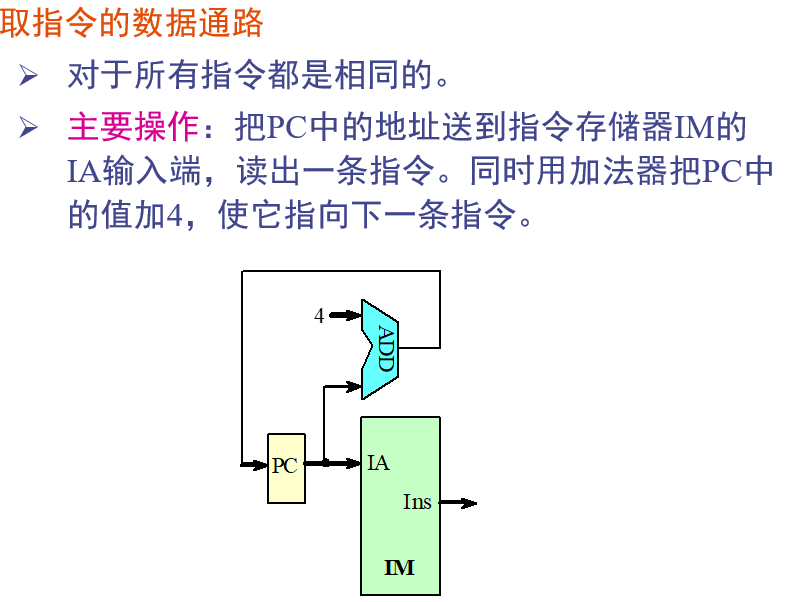
#### 构建R类指令
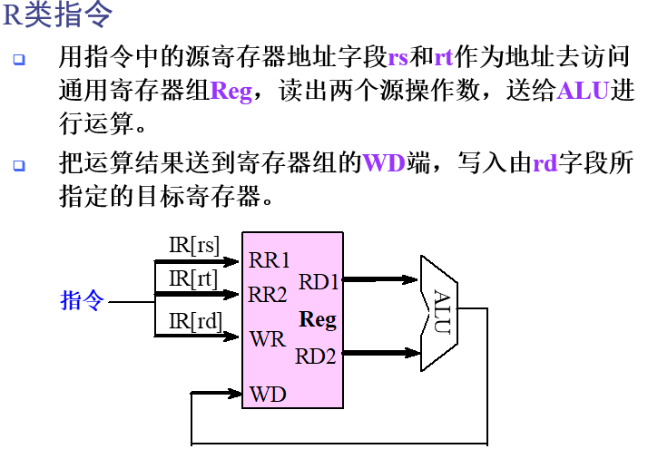
#### 构建访存指令(load和store)
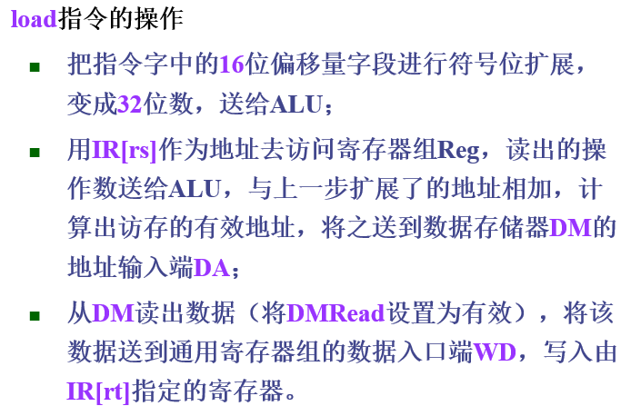
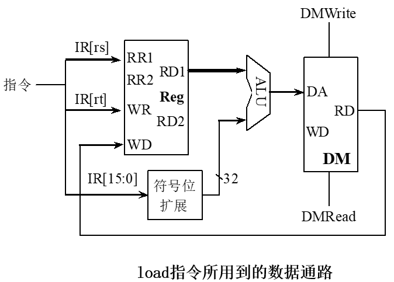
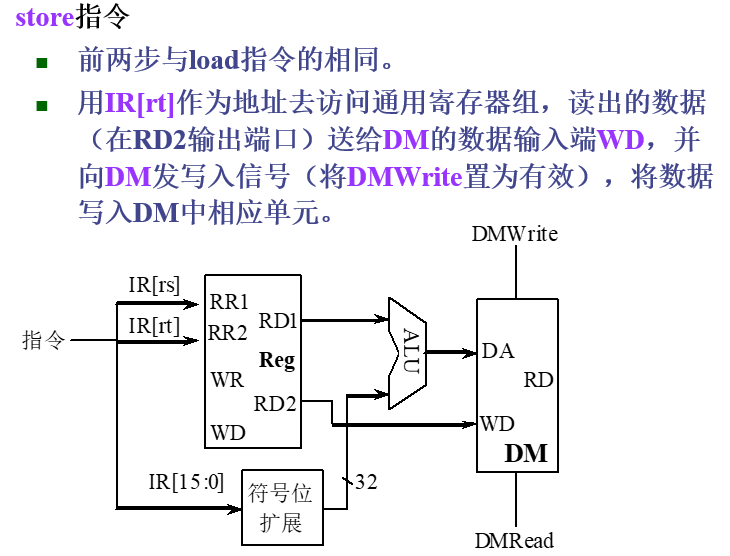
#### beqz指令
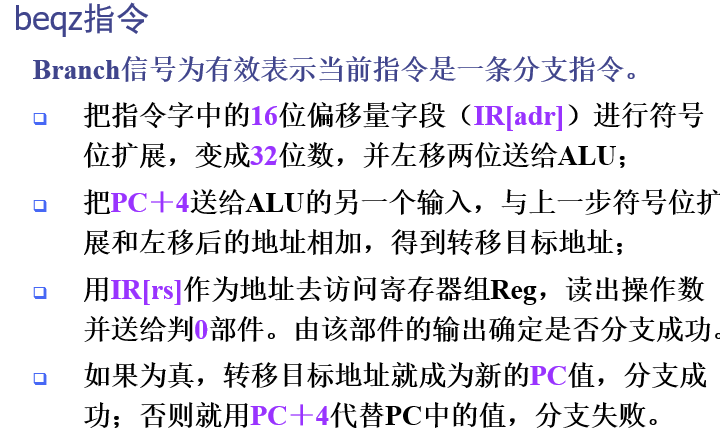
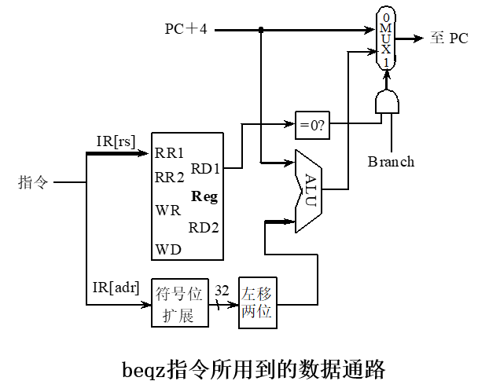
### ALU控制器
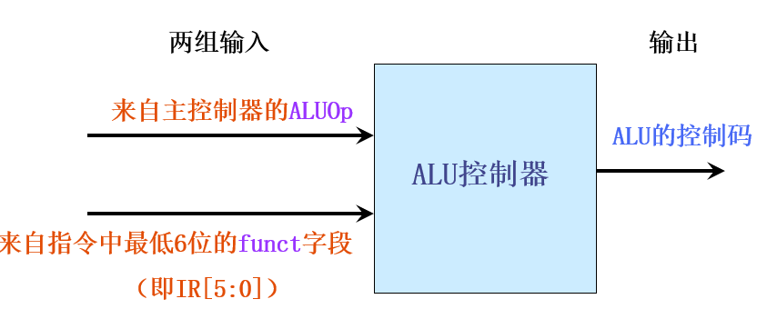
>ALU完成具体的运算有5个：加、减、或、与、比较

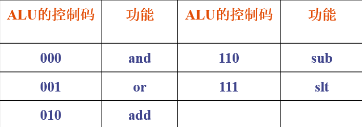
### 多周期实现方案
#### 为什么用多周期

**单周期方案的不足**

* **效率低下**
  不同类型的指令所完成的工作量有很大的差别
  所要用到的部件和所通过的数据通路不同
  所用时间的长短也有很大的差别

* **硬件利用率低**
  每个时钟周期中功能部件最多被使用一次
  如果在执行一条指令的过程中多次使用某一部件
  就需要重复设置该部件（增加实现成本）

---

**解决方法：采用多周期方案**

* 采用更短的时间作为时钟周期
* 允许一条指令的执行跨越多个时钟周期
* 该时钟周期通常等于一个基本部件的延迟时间

**好处**

* 可以共享同一个功能部件

### 控制器设计
实现控制器的技术有两种：硬连逻辑和微程序设计
- 硬连逻辑是建立在有限状态机的基础上，并且一般是以状态图的形式表示。
- 微程序设计则是采用微指令的方式来表示和实现控制。 

#### 控制器的组成
- 指令部件
  - 程序计数器PC
  - 指令寄存器IR
  - 指令译码器ID
  - 地址形成部件
- 时序控制部件
  - 时钟脉冲CP
  - 时序信号发生器
- 微操作控制信号形成部件
- 中断控制逻辑
- 程序状态寄存器

### 流水线技术

>什么是流水线技术
定义：
流水线技术是把一条指令的执行过程划分为若干个顺序阶段，每个阶段由专门的部件完成，不同指令在不同阶段上并行执行的一种处理技术。

>为什么要采用流水线技术
提高处理器吞吐率：在同一时间并行处理多条指令的不同阶段，使单位时间内完成的指令数增加
提高硬件利用率：各功能部件（取指、译码、执行等）可以同时工作，减少空闲时间
提升整体性能：在不显著增加主频的情况下，提高平均指令执行速度

## 第九章 微程序控制器
>组合逻辑控制器存在的两个比较突出的缺点:
- 设计复杂、繁琐，缺乏规律性，设计效率低
- 不易修改和扩充，缺乏灵活性

>微程序控制器的缺点:速度比较慢
- 因此RISC仍旧采用硬连逻辑设计
### 基本原理
>用二进制编码字（称为微指令字）来代替组合逻辑控制器中的微操作控制信号的产生

#### 微操作和微命令
微命令:构成控制信号序列的最小单位
微操作:接受微命令后进行的最基本的操作
- 分为两种：
  - 相容的微操作：可以同时进行的微操作
  - 互斥的微操作：不能同时进行的微操作
#### 微指令和微程序

**微指令**
微指令：用来产生微控制信号的二进制编码字,用于控制完成一组微操作

**微程序**
微程序：由一系列微指令构成的有序集合
每一条机器指令都对应一段微程序
通过解释执行该微程序，完成指令所规定的操作

---

#### 微指令周期

**微指令周期**
微指令周期：微程序控制器的工作周期
从控制存储器中读取一条微指令到执行完相应微操作所需时间的最大值
### 微指令的编码方法

> 设计目标: 减少微指令的宽度, 减少微程序的长度, 提高执行速度, 保持微程序设计的灵活性

共有四种编码方法

---

#### 直接控制编码法(不译码法)

* 微操作控制字段的每一位直接对应一个微操作
* 当某位为 1 时, 表示执行相应的微操作;为 0 时不执行该微操作

**优点**

* 结构简单
* 并行性最好
* 操作速度快

**缺点**

* 微指令字太长
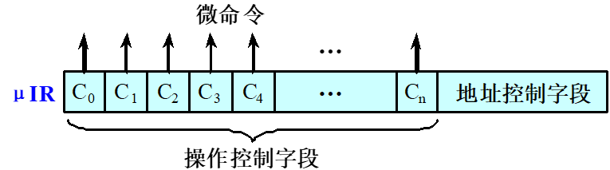

---

#### 最短字长编码法

* 将所有微命令进行统一的二进制编码
* 每条微指令只定义一个微操作

**微操作控制字段长度关系**

* 微操作控制字段长度 L 与微命令总数 N 的关系

  * L ≥ log2 N

**优缺点**

* 微指令字长最短
* 需要经过译码才能得到所需的微命令, 执行速度受影响
* 一条微指令只能产生一个微命令
* 无法利用硬件的并行性
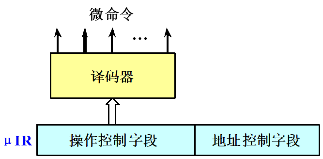

---

#### 字段直接编码法

* 将微操作控制字段进一步划分为若干字段
* 每个字段单独编码
* 每个码点表示一个微命令

**折中方案**

* 字段之间采用直接控制
* 字段内部采用最短字长编码

**字段划分原则**

* 可按功能或部件划分

  * 对机器中的每一类功能或每一个部件分配一个字段
* 将互斥的微操作分在同一字段
* 将相容的微操作分在不同字段
* 字段划分应与数据通路相适应
* 一般每个字段应保留一个码点,用于表示不发任何微命令
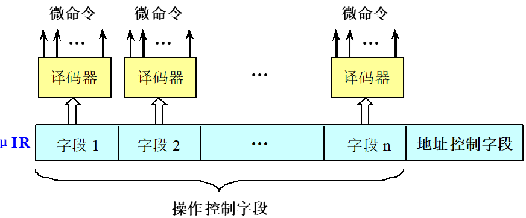

---

#### 字段间接编码

* 字段编码的含义需要由另一个字段的编码来解释确定
* 一个解释字段可同时对多个字段进行控制
* 只有这样才能有效缩短微指令字长
* 解释字段应具有一定的分类特征
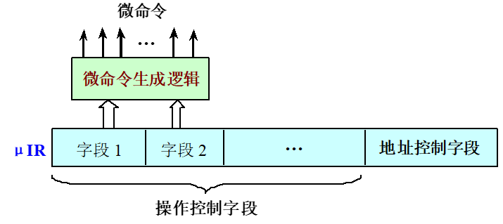

---

#### 常数源字段的设置

**作用**

* 提供常数
* 参与其他字段的间接编码
### 微指令的格式

分为两大类: 水平型微指令 和 垂直型微指令

---

#### 水平型微指令

一次能定义并执行多个微操作的微指令

**特点**

* 微指令字较长,一般为几十位到上百位

* 描述并行微操作的能力强
  在一个微周期中可并行执行多个微操作

* 微指令译码简单
  一般采用直接控制编码法和分段直接编码法

**优缺点**

* 优点

  * 并行操作能力强
  * 执行速度快
  * 代码长度短

* 缺点

  * 微指令字较长,明显增加控存宽度
  * 微程序编制复杂,难度较大,不易实现设计自动化

---

#### 垂直型微指令

>一次只能定义一两个微操作,微指令字长较短

**特点**

* 微指令字短
  一般为十几位到二十位左右

* 并行微操作能力差
  一条微指令只能控制数据通路的一两种信息传送

* 通过微操作码字段定义微指令的基本功能和信息传送路径
  执行时需要完全译码
  译码过程较复杂

* 微指令各二进制位与数据通路控制点之间不存在直接对应关系

**优缺点**

* 优点

  * 结构直观、规整,易于编制微程序
  * 微指令字较短,控存横向较窄

* 缺点
  * 微程序较长,微指令需经译码产生微命令,执行速度较慢
  * 描述并行微操作能力差,不适合并行性较强的数据通路机器

### 后续微地址的产生

> 两种方式: 增量方式, 断定方式

---

#### 增量方式

* 设置一个微程序计数器 μPC
* 顺序执行时
  给 μPC 增加一个增量(通常为 1), 得到下一条微指令地址
* 遇到转移时
  由微指令给出转移目标微地址

**微地址字段 SCF 的组成**

* 转移控制字段 BCF
  用于规定是顺序执行还是转移
  若为转移, 由 BCF 指出转移地址的来源

* 转移地址字段 BAF
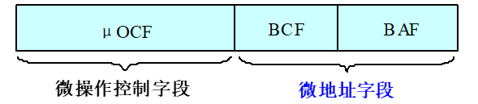
**转移地址的来源有 3 种**

* 由 BAF 给出的地址
* 机器指令所对应微程序的入口地址
* 微子程序入口地址和返回地址
  返回地址存放在返回地址寄存器中

**优点**

* SCF 字段较短
* 后继微地址生成逻辑较简单
* 微程序编制较容易

**缺点**

* 不能直接实现多路转移

---

#### 断定方式

**后继微地址的确定方式**

* 由微程序设计者直接指定
* 由微程序设计者指定的测试判别逻辑字段控制产生

**后继微地址的组成**

* 非测试地址
  由微程序设计者直接指定
  地址不变
  构成微地址的高位部分

* 测试地址
  在微程序执行过程中
  通过测试某些状态位动态决定
  构成微地址的低位部分

**分支能力与字段位数**

* 若测试地址位数为 m
  分支路数为 2^m
  测试字段个数为 m

* 测试字段位数 n 取决于测试条件个数 N
  一般有
  n = [log2 N] + 1

**优点**

* 可实现快速多路转移
* 提高微程序执行速度
* 微程序在控存中的存放位置灵活、方便

**缺点**

* 后继微地址生成逻辑较复杂
* 微程序执行顺序不直观
### 微指令的执行方式
#### 串行执行
>取微指令和执行微指令串行进行。在前一条的微指令执行完之后，才能取下一条微指令。 
**特点**
>设备效率低，执行速度慢。控制简单，易于实现。 
#### 并行执行
>当前微指令的执行和下一条微指令的取出重叠进行

**优点**

* 提高了执行速度和设备利用率

---

**存在的问题**

* 当需要根据当前微指令的执行结果进行转移时
  会产生控制上的困难

---

**两种处理方法**

* **方法一: 推迟取指**
  推迟下一条微指令的取出
  使其取出时间与串行执行方式相同

* **方法二: 猜测法**
  采用猜测方式
  在两条可能的分支中
  猜测性地选择其中一条作为后继微指令

## 第十章 运算方法和运算器
### 移位运算
#### 逻辑移位
逻辑移位中,被移动的数据是逻辑数,没有符号和数值大小
1. 逻辑左移: 数据各位左移一位,最高位丢弃,最低位移入0
2. 逻辑右移: 依次右移,最低位丢弃,最高位移入0

#### 循环移位
将被移位的数据左右两端相连形成闭合回路
如10011左移变成00111
#### 算术移位
对带符号的数进行移位;会引发数值变化
##### 原码算术移位
符号位不参加移位,将相应数值进行逻辑移位
##### 补码算术移位
对补码进行算术移位时,符号位一起参与移位
1. 算术左移: 连同符号位一起左移一位,最高位丢弃,最低位移入0
2. 算术右移:连同符号位一起右移一位,符号位不变,最低位移出丢弃

- 左移时可能发生溢出,取模时得到负数
  
### 定点数加减法运算
#### 补码加减法
若符号位产生进位则舍弃进位
#### 判断溢出

>**采用两个操作数和结果的符号来判断**
当两个同号数的补码相加，若得到的结果的符号与两个操作数的符号不同，则发生了溢出

>**采用最高数值位产生的进位与符号位产生的进位是否相同来判断** ,当不相同时，则发生了溢出

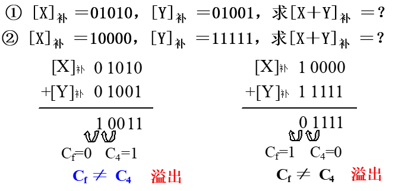

>采用变形补码,将符号位扩展为2位,若运算结果的两个符号位不同,则发生了溢出

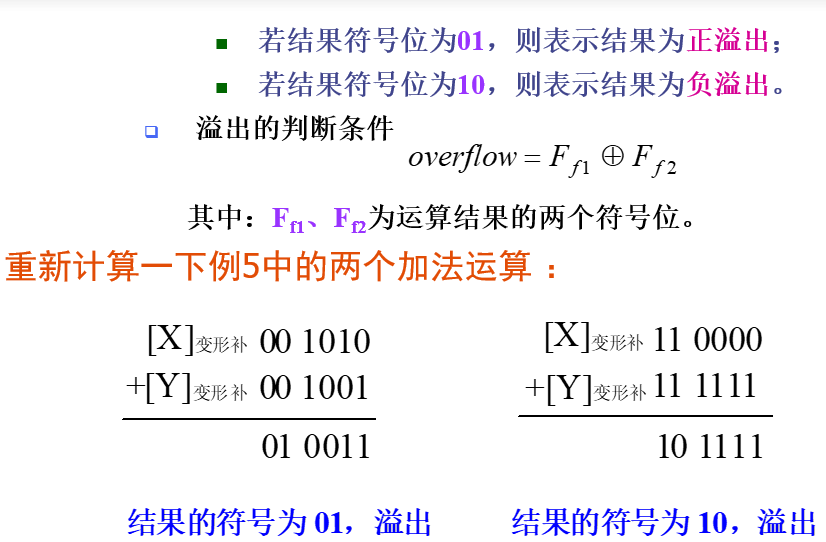
### 定点数乘除法运算
#### 原码一位乘法
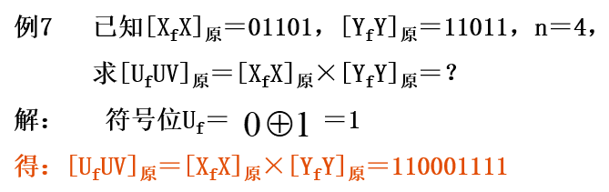
### 浮点数加减法运算

设有两个规格化浮点数 X 和 Y, 分别为
X: XEXM
Y: YEYM

其中

* XE 和 YE: 阶码
* XM 和 YM: 尾数

---

#### 浮点加减法运算的步骤

1. 判 0 操作
2. 对阶
3. 尾数加减
4. 规格化与舍入
   （在规格化过程中需要判断运算结果是否溢出）

---

#### 1. 判 0 操作

* 若两个操作数 X 和 Y 中有一个为 0
  则不需要进行运算
  直接设置运算结果为 0
  运算结束

* 否则进入下一步

---

#### 2. 对阶

**目的**

* 使小数点对齐

**方法**

* 对其中一个操作数进行变换
  使两个操作数的阶码相等

- 对齐大阶码
**实现步骤**

1. 求阶差
   △E = XE − YE

2. 若 △E > 0

   * 表示 X 的阶码大于 Y 的阶码
   * 调整操作数 Y

     * 将 Y 的尾数 YM 右移
     * 每右移一位
       阶码 YE 加 1
     * 直到两数阶码相等

3. 若 △E < 0

   * 表示 X 的阶码小于 Y 的阶码
   * 调整操作数 X
   * 调整方法与上述相同

---

#### 3. 尾数加减

* 将两数的尾数 XM 和 YM
  按照相应的定点加减运算规则
  进行加法或减法运算
* 得到运算结果的尾数

---

#### 4. 结果规格化并判溢出

1. 右规情况

   * 若运算结果的绝对值大于 1

     * 将结果右移一位
     * 相应的阶码加 1
     * 右规最多只需一位

2. 左规情况

   * 若运算结果的绝对值小于 1

     * 将结果左移
     * 每左移一位
       阶码减 1
     * 直到结果的绝对值大于等于 1/2 为止

3. 溢出判断

   * 每次阶码加 1 或减 1 后
     都要判断阶码是否越界

   * 阶码上溢

     * 阶码大于可表示的最大正数
     * 可置溢出标志
     * 或将结果作为 +∞ 或 −∞ 处理

   * 阶码下溢

     * 阶码小于可表示的最小负数
     * 可置溢出标志
     * 或将结果作为 0 处理

---

#### 5. 舍入处理

常用的舍入方法有

1. 0 舍 1 入法:类似四舍五入
2. 截断法:直接舍去右移的数字
3. 朝 +∞ 舍入法:若为正数,只要移出的数位不全为0,则最低有效位加1;若为负数则采用截断法
4. 朝 −∞ 舍入法:若为负数,只要移出的数位不全为0,则最低有效位加1;若为正数则采用截断法 

## 第十一章 存储器
### 存储子系统概述
>三级存储系统:
>- Cache（高速缓冲存储器）
>- 主存储器
>- 磁盘存储器（辅存）

- 最靠近CPU的Cache速度最快,容量最小;离CPU最远的硬盘速度最慢，但容量最大
- CPU所访问的指令和数据的绝大部分都能在Cache中找到,之所以可以做到,是根据程序访问的局部性原理,即程序在一小段时间间隔内访问的指令和数据在地址上是相对集中的

- 两个存储层次
    - “Cache—主存”层次：解决主存速度不足的问题
    - “主存—辅存”层次：解决主存容量不足的问题
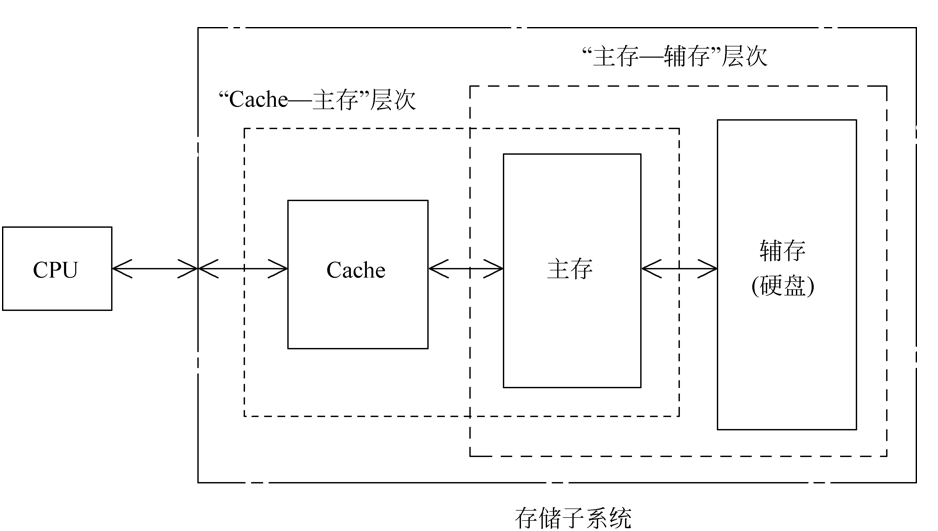
### 存储器分类
#### 按在计算机系统中的作用分类 
1. **主存储器**,又简称为主存或内存。
- 它是整个存储系统的核心，用来存放计算机当前运行的程序以及所需的数据，CPU可直接随机地对它进行访问。
2. **辅助存储器**,简称为辅存或外存
- 弥补主存的容量不足,用来存放暂时不用的程序和数据。CPU不能直接访问它，当需要运行辅助存储器中的程序时，需将它们调入主存后供CPU使用。
3. 高速缓冲存储器Cache
- 弥补主存的速度不足,位于CPU和主存储器之间

#### 按照存取方式分类
>存取方式：指访问存储单元的方法
* **随机存储器 RAM**
  Random Access Memory

* **只读存储器 ROM**
  Read Only Memory

* **顺序存取存储器 SAM**
  Sequential Access Memory

1. 随机存储器RAM
>可随机地读取或写入存储器的任何一个单元，访问时间是固定的，与存储单元的物理位置无关
- 在系统断电后大多数随机存储器RAM所保存的信息将丢失
- 常用来作主存和Cache
2. 只读存储器ROM
>只能随机读取存储器的任何一个单元，不能写入信息。
- 系统断电后，所保存的信息不会丢失。
- 用来存放不需要改变的信息,比如存放系统程序
3. 顺序存取存储器SAM
>只能按顺序访问存储器中的信息，访问时间与信息在存储器中所处的物理位置有关。
- 信息通常以文件或数据块的形式存放,如磁带
#### 按照存储介质分类
>存储介质一般具备3个特点:
1. 具有两种稳定的状态，分别代表二进制代码0和1
2. 能方便地检测出存储介质所处的状态
3. 两种状态容易相互转换

1. 半导体存储器
2. 磁表面存储器
3. 光存储器

### 主存储器

#### 主存的组成结构
1. 存储体
>存储二进制信息的主体，由许多存储单元构成，每一个存储单元存放1～8个字节
每一个存储单元都有一个统一的编号，称为地址,地址与存储单元之间是一一对应的。
2. 地址译码和驱动电路 
3. 读写电路 
4. 存储控制电路

### 主存的主要技术指标

#### 存储容量

一个存储器中所能存储的二进制信息的总量.  
常用位 b 和字节 B 来表示
如 64Kb, 512KB, 4MB.

---

#### 存取速度

指访问存储器的速度.

**存取时间 TA**  
又称访问时间或读写时间, 指从启动一次存储器访存操作到完成该操作所需要的时间.

**存储周期 TM**  
指连续两次启动存储器访问所需的最小时间间隔.  
- 包括存储器的存取时间和自身恢复时间.  
- 存储周期通常大于或等于存取时间.

**主存带宽 BM**  
存储器单位时间内所能存取的信息量.  
- 也称为数据传输率或主存的数据传输频率.  
- 单位为 bit/s 或 byte/s.

BM 的计算公式为:  
- BM = 每个存储单元的位数 / TM (bit/s)  
- BM = 每个存储单元的位数 / (TM × 8) (byte/s)

提高 BM 的方法有三种:  
- 增加存储单元的位数  
- 减少 TM  
- 采用多个存储体  

---

#### 可靠性

在规定的时间内, 存储器无故障读写的概率.  
通常用平均无故障间隔时间 MTBF (Mean Time Between Failures) 来衡量.  
MTBF 越长, 说明存储器的可靠性越高.

---

#### 功耗

指单位时间存储器所消耗的电能,功耗越小越好

### 随机存储器

#### 静态随机存储器SRAM
>利用触发器来储存二进制信息
优点：SRAM 工作速度快，稳定可靠，不需要外加刷新电路，从而简化了外电路设计
缺点：所含晶体管较多，故集成度较低，功耗较大
#### 动态随机存储器DRAM
>利用 MOS 晶体管的管极电容来存储二进制信息
优点：基本存储位元电路中所含晶体管数目少、集成度高、成本低、功耗小
缺点：它需外加刷新电路，工作速度比 SRAM 慢得多（破坏性读出且需要刷新）

### DRAM的刷新
>什么叫刷新：为维持 DRAM 所存信息不变，需要定时地对 DRAM 中的电容充电，以补充泄漏掉的电荷。这个过程叫刷新

>DRAM 为什么需要刷新： DRAM 是利用电容上保存的电荷来存储信息的，由于存在漏电阻，即使电源不掉电，时间长了，电容上的电荷也会慢慢泄漏掉，DRAM 内存储的信息会自动消失。

>什么叫刷新周期：从上一次对整个存储器刷新结束到下一次对整个存储器刷新结束所需的时间

1. 集中式刷新：在一个刷新周期内，集中一段时间连续地对全部存储单元逐行刷新一遍。
- 在刷新操作期间，不允许 CPU 对存储器进行正常的访问

优点：读写操作时不受刷新工作的影响，系统的存取速度比较高
缺点：在集中刷新期间必须停止读写，这一段时间称为“死区”，而且存储容量越大，死区就越长。
2. 分散式刷新：把对每行存储单元的刷新分散到每个系统存取周期内完成。此时系统存取周期被分为两部分，周期前半段时间进行正常的存储器访问，后半段时间进行刷新操作。在一个系统存取周期内刷新存储矩阵中的一行,增加了系统的存取周期
优点：没有死区
缺点：刷新过于频繁。系统存取周期是存储芯片存取周期的两倍，降低了访问存储器的速度。
3. 异步式刷新：把刷新操作平均分配到整个最大刷新间隔内进行，相邻两行的刷新间隔为：刷新周期÷行数