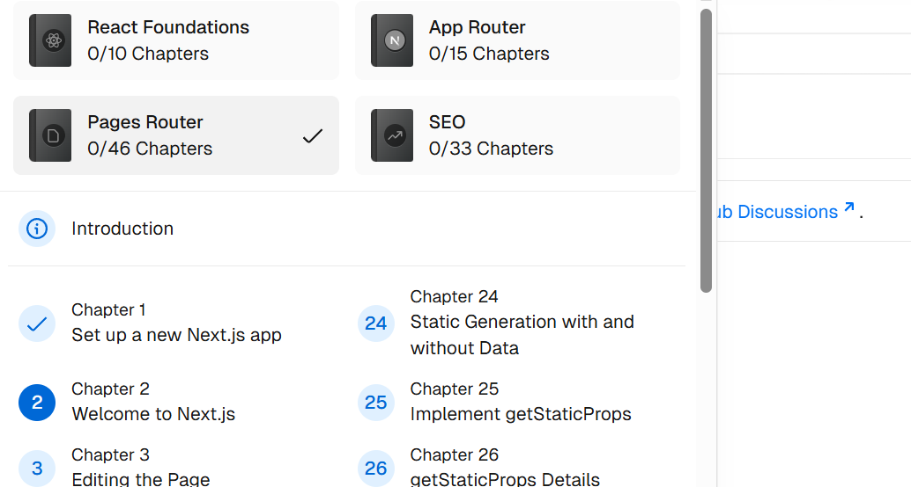

- [瀹樻柟鏁欑▼](https://nextjs.org/learn/react-foundations/what-is-react-and-nextjs)

## React Intro
- 浜嬪疄涓婅繖涓狪ntro鍐欑殑寰堢儌,濡傛灉鏄垵瀛﹁€呰繕鏄€佽€佸疄瀹炵湅React鐨勫畼鏂规暀绋?鍐欑殑璇︾粏涓嶅皯(3/7)

Part of React's success is that it is relatively unopinionated about the other aspects of building applications. This has resulted in a flourishing ecosystem of third-party tools and solutions, including Next.js.

The HTML represents the initial page content, whereas the DOM (Document Object Model) represents the updated page content which was changed by the JavaScript code you wrote.

### A Brief Overview About Component,Props,State(2/25)
```html
<html>

<body>
    <div id="app"></div>
    <script src="https://unpkg.com/react@18/umd/react.development.js"></script>
    <script src="https://unpkg.com/react-dom@18/umd/react-dom.development.js"></script>
    <script src="https://unpkg.com/@babel/standalone/babel.min.js"></script>
    
    <script type="text/jsx">
      const app = document.getElementById('app');
      function Header() {
        return <h1>Develop. Preview. Ship.</h1>;
        }
        
        function HomePage() {
        return (
            <div>
            {/* Nesting the Header component */}
            <Header />
            </div>
        );
        }
        
        const root = ReactDOM.createRoot(app);
        root.render(<HomePage />);
    </script>
</body>

</html>
```
1. Component 棣栧瓧姣嶉兘瑕?*澶у啓**,璋冪敤鏃堕噰鐢ㄧ被html鏍煎紡(<.../>)
2. 瀹為檯涓簀sx鏍煎紡,闇€瑕佺粡杩嘼abel鏉ヨ浆璇?
```jsx
function Header({ title }) {
  console.log({title});
  return <h1>{title}</h1>;
}
function HomePage() {
  const names = ['Ada Lovelace', 'Grace Hopper', 'Margaret Hamilton'];
 
  return (
    <div>
      <Header title="Develop. Preview. Ship." />
      <ul>
        {names.map((name) => (
          <li key={name}>{name}</li>
        ))}
      </ul>
    </div>
  );
}
```
1. `function Header({ title }) `璋冪敤鏃跺疄闄呬笂浼犲叆鐨勬槸涓€涓璞?jsx浼氬皢杩欎釜瀵硅薄瑙ｆ瀯,灏卞彲浠ョ湅浣滄槸涓€涓櫘閫氬瓧绗︿覆鍙橀噺杩涜澶勭悊浜?2. `{names.map((name) => (<li key={name}>{name}</li>))}`涓殑`{name}`鍙互鐪嬩綔鏄櫘閫氱殑js鎻掑€?鑰?name)鍒欐槸浼犲叆鐨勫瓧绗︿覆鑰屼笉鏄璞?
浜嬪疄涓?璁╂垜浠啀浠旂粏鐪嬬湅杩欎釜浠ｇ爜:
```jsx
function Header({ title }) {
  console.log({title});
  return <h1>{title}</h1>;
}
```
杩欎釜`Header()`鍑芥暟鍦╜Homepage()`鍑芥暟涓珶鐒朵互`<Header />`鐨勫舰寮忓嚭鐜?杩欐墠鏄渶鍊煎緱娉ㄦ剰鐨勫湴鏂?jsx閫氳繃鍑芥暟灏唄tml鍏冪礌鍦ㄤ笉鍚岀粍浠朵箣闂翠紶閫?瀹炵幇浜嗕笌鏅€氱殑涓変欢濂楀啓娉曞畬鍏ㄤ笉鍚岀殑浣撻獙.
```jsx
 
function HomePage() {
 const names = ['Ada Lovelace', 'Grace Hopper', 'Margaret Hamilton'];
 const [likes, setLikes] = React.useState(0);
 function handleClick() {
    setLikes(likes + 1);
  }     
  return (
    <div>
      <Header title="Develop. Preview. Ship." />
      <ul>
        {names.map((name) => (
          <li key={name}>{name}</li>
        ))}
      </ul>
      <button onClick={handleClick}>Likes ({likes})</button>
    </div>
  );
}
```

1. 杩欓噷鐨剈seState瀹為檯涓婃槸鎶妉ikes鍜宻etLikes鍦≧eact鍐呴儴鍏宠仈璧锋潵浜?2. 姣忔鐐瑰嚮鎸夐挳鏃?`setLikes(likes + 1);`浼氬皢likes澧炲姞1,濡傛灉鍙啓`likes=likes+1`杩欐牱鐨勫紡瀛?React鍐呴儴灏辨棤娉曞悓姝ikes鐨勬洿鏀?3. 涔熷氨鏄,state鏄叿鏈夎蹇嗘€х殑鐢ㄦ埛浜や簰绠＄悊鍣?

## 琛ュ厖(3/7)
鍓嶉潰鐨処ntro閬楁紡浜咼SX涓渶鍏抽敭鐨勫璞?props,鏄痯roperties鐨勭畝绉?鍙互瀹炵幇鍑芥暟,瀵硅薄,鍙橀噺鍦ㄤ笉鍚屽嚱鏁?涓嶅悓鏂囦欢涔嬮棿鐨勪紶閫?浜嬪疄涓?鍑芥暟缁勪欢鍙帴鏀朵竴涓弬鏁帮細props 瀵硅薄.JSX浼犲叆鐨勬墍鏈夊睘鎬ч兘浼氳鎵撳寘鎴愪竴涓璞′綔涓鸿鍙傛暟
浠ヤ笅鏂逛唬鐮佷负渚?
```jsx
import { getImageUrl } from './utils.js';

function Avatar({ person, size }) {
  return (
    
  );
}

export default function Profile() {
  return (
    <div>
      <Avatar
        size={100}
        person={{ 
          name: 'Katsuko Saruhashi', 
          imageId: 'YfeOqp2'
        }}
      />
      <Avatar
        size={80}
        person={{
          name: 'Aklilu Lemma', 
          imageId: 'OKS67lh'
        }}
      />
      <Avatar
        size={50}
        person={{ 
          name: 'Lin Lanying',
          imageId: '1bX5QH6'
        }}
      />
    </div>
  );
}
```


鍏朵腑`function Avatar({ person, size })`瀹炶川涓婃槸璇硶绯?鐪熸鍦ㄨВ鏋愮殑鏃跺€欎細鍙樻垚涓嬫柟浠ｇ爜
```jsx
function Avatar(props){
  const person = props.person
  const size = props.size
}
```
鑰屼笅鏂逛唬鐮佷篃浼氬皢size鍜宲erson鎵撳寘涓簆rops浼犲叆Avatar缁勪欢
```jsx
<Avatar
        size={100}
        person={{ 
          name: 'Katsuko Saruhashi', 
          imageId: 'YfeOqp2'
        }}
/>
```
## App Router(鍙洿鎺ョ暐杩?
### CSS Styling
```css
@tailwind base;
@tailwind components;
@tailwind utilities;

input[type='number'] {
  -moz-appearance: textfield;
  appearance: textfield;
}

input[type='number']::-webkit-inner-spin-button {
  -webkit-appearance: none;
  margin: 0;
}

input[type='number']::-webkit-outer-spin-button {
  -webkit-appearance: none;
  margin: 0;
}

```
鍦╜/app/ui`涓嬬殑`global.css`閲屽彧鏈夎繖涔堝嚑琛?浣嗗嵈璁╂暣涓祻瑙堥〉闈㈠彉寰楁祦鐣呯幇浠ｄ簡璁稿

- 鏁欑▼閲屽tailwind鐨勪粙缁嶅お杩囩矖鐣?鍙堝緱鍘荤湅瀹樻柟鏂囨。浜?
>(3/5)璋佹兂琚珫鐗堟帓搴忛獥浜?瀹樻柟鏁欑▼涓殑Pages Router鎵嶆槸鎺ョ潃React Foundations鐨勪竴绔?


鎴戣鐪嬩簡杩欎箞涔匒pp Router鏁欑▼鐪嬬殑绱浜轰簡,鎰熻鐣ヨ繃浜嗗緢澶氱粏鑺?鍚屾椂鏁欏椤圭洰宸茬粡闈炲父瀹屽杽浜?涔熸病鏁欎粈涔堝緢鏈夌敤鐨勪笢瑗?閲嶅紑涓€涓?
## Pages Router
- [棰濆瀛︿範](https://www.cnblogs.com/silva/p/17948723)
### Build Pages
nextjs涓枃浠惰矾寰勫搴旂綉椤佃矾寰?濡傛灉鍒涘缓浜哷pages/posts/first-post.js`,閭ｄ箞灏卞彲浠ュ湪`http://localhost:3000/posts/first-post`閲岃闂埌杩欎釜jsx鏂囦欢娓叉煋鍑虹殑缃戦〉

```jsx
import Link from "next/link";

export default function FirstPost() {
  return (
    <>
      <h1>First Post</h1>
      <h2>
        <Link href="/">Back to home</Link>
      </h2>
    </>
  );
}
```
浠庤繖閲屼篃鍙互鐪嬪埌nextjs/React瑕佹眰杩斿洖澶氫釜璇彞鏃惰鐢╜<> ... </>`鍙樻垚涓€涓鍙?
>If you鈥檝e used <a href="鈥?> instead of <Link href="鈥?> and did this, the background color will be cleared on link clicks because the browser does a full refresh.

涔熷氨鏄nextjs瀵归摼鎺ユ柟寮忎綔浜嗕紭鍖?浠庤€屼繚璇佽烦杞笉鐢ㄥ埛鏂版暣涓猦tml,鑰屾槸鍙洿鏀逛簡js鐨勬覆鏌撳唴瀹?
>Furthermore, in a production build of Next.js, whenever Link components appear in the browser鈥檚 viewport, Next.js automatically prefetches the code for the linked page in the background. By the time you click the link, the code for the destination page will already be loaded in the background, and the page transition will be near-instant!

#### className
className鏄痡sx鐨勮娉?寰堝ソ鐨勬憭寮冧簡浼犵粺css鐨勬贩涔卞啓娉?**components/layout.module.css**
```css
.container {
  max-width: 36rem;
  padding: 0 1rem;
  margin: 3rem auto 6rem;
}
```
**components/layout.js**
```jsx
import styles from './layout.module.css';
 
export default function Layout({ children }) {
  return <div className={styles.container}>{children}</div>;
}
```
>This is what CSS Modules does: It automatically generates unique class names. As long as you use CSS Modules, you don鈥檛 have to worry about class name collisions.

#### md parsing
**posts/ssg.md**
```md
---
title: 'When to Use Static Generation v.s. Server-side Rendering'
date: '2020-01-02'
---
 
We recommend using **Static Generation** (with and without data) whenever possible because your page can be built once and served by CDN, which makes it much faster than having a server render the page on every request.
```
椤堕儴yaml鏍煎紡鐨刴etadata鍙互鐢╣ray-matter涔嬬被鐨勫伐鍏疯繘琛岃В鏋?

鍘熺悊濡備笅:
```md
---
title: Hello
slug: home
---
<h1>Hello world!</h1>
```
鍙互鍙樻垚
```json
{
  content: '<h1>Hello world!</h1>',
  data: {
    title: 'Hello',
    slug: 'home'
  }
}
```
### Pre-rendering
鍦╪extjs涓?涓€鑸殑椤甸潰閮藉彲浠ュ湪璁块棶鑰呯偣鍑讳箣鍓嶆彁鍓嶆覆鏌?浣嗗鏋滈〉闈㈤渶瑕佸閮ˋPI鎴栬€呮暟鎹簱杩炴帴,鍒欏彲浠ヤ娇鐢╜export async function getStaticProps()`鏉ヤ繚璇侀〉闈㈠湪瀹炵幇杩欎釜鍑芥暟涔嬪悗鎵嶅姞杞藉嚭鏉?浠ヤ笅闈唬鐮佷负渚?
```jsx
import Head from "next/head";
import Layout, { siteTitle } from "../components/layout";
import utilStyles from "../styles/utils.module.css";
import { getSortedPoseData } from "../lib/posts";
export default function Home({ allPostsData }) {
  return (
    <Layout home>
      <Head>
        <title>{siteTitle}</title>
      </Head>
      <section className={utilStyles.headingMd}>
        <p>[Your Self Introduction]</p>
        <p>
          (This is a sample website - you鈥檒l be building a site like this on{" "}
          <a href="https://nextjs.org/learn">our Next.js tutorial</a>.)
        </p>
      </section>
      <section className={`${utilStyles.headingMd} ${utilStyles.padding1px}`}>
        <h2 className={utilStyles.headingLg}>Blog</h2>
        <ul className={utilStyles.list}>
          {allPostsData.map(({ id, date, title }) => (
            <li className={utilStyles.listItem} key={id}>
              {title}
              <br />
              {id}
              <br />
              {date}
            </li>
          ))}
        </ul>
      </section>
    </Layout>
  );
}

export async function getStaticProps() {
  const allPostsData = getSortedPostsData();
  return {
    props: {
      allPostsData,
    },
  };
}
```
Home鍑芥暟闇€瑕佹帴鏀跺閮ㄧ殑`allPostsData`瀵硅薄,鏁呬娇鐢ㄤ簡`xport async function getStaticProps()`鏉ヤ繚璇侀〉闈㈠厛鎷垮埌`allPostsData`鍐嶅姞杞?
- 闇€瑕佹敞鎰忕殑鏄痐getStaticProps`鏄壒瀹氬嚱鏁板悕,涓嶈兘闅忎究鏀圭殑,绫讳技鐨勮繕鏈塦getServerSideProps`杩欐牱鐨勫嚱鏁?

### Dynamic Router
>In our case, we want to create dynamic routes for blog posts:

- We want each post to have the path /posts/<id>, where <id> is the name of the markdown file under the top-level posts directory.
- Since we have ssg-ssr.md and pre-rendering.md, we鈥檇 like the paths to be /posts/ssg-ssr and /posts/pre-rendering.

```jsx
export function getAllPostIds() {
  const fileNames = fs.readdirSync(postsDirectory);
 
  // Returns an array that looks like this:
  // [
  //   {
  //     params: {
  //       id: 'ssg-ssr'
  //     }
  //   },
  //   {
  //     params: {
  //       id: 'pre-rendering'
  //     }
  //   }
  // ]
  return fileNames.map((fileName) => {
    return {
      params: {
        id: fileName.replace(/\.md$/, ''),
      },
    };
  });
}
```
>The returned list is not just an array of strings 鈥?it must be an array of objects that look like the comment above. Each object must have the params key and contain an object with the id key (because we鈥檙e using [id] in the file name). Otherwise, getStaticPaths will fail.

## 鎬荤粨
浜嬪疄涓?鏁欑▼鍒拌繖閲屽熀鏈氨鎴涚劧鑰屾浜?璁茬殑鐪嬩技寰堝,浣嗗緢澶氶兘鏄竟瑙掓枡,鍚屾椂寰堝鐭ヨ瘑閮借鐨勪笉鏄庝笉鐧?骞朵笖鐪嬪緱鍑烘潵浣撶郴闈炲父鍓茶,浠呬粎鏄妸鍑犱釜鐗囨鍚堝苟鍦ㄤ竴璧?娌℃湁鍔ㄤ换浣曞績鎬濆幓鎶婂墠鍚庢枃绔犲叧鑱旇捣鏉?寰堝鏄撹浜烘€€鐤?鍐欐暀绋嬬殑鑷繁鎳傛€庝箞鐢╪extjs鍚楌煒?
鎴戠湡姝ｆ兂鐪嬬殑鍏跺疄鏄被浼间簬澶勭悊`PUT auth/users`璇锋眰鐨勮矾鐢?鑰屼笉鏄繖绉嶉潤鎬佺綉椤?浣嗚瘽鍙堣鍥炴潵浜?鍗充究鍦ˋpp Router鏁欑▼涓?瀹冧篃缁濆彛涓嶆彁鏈€閲嶈鐨剅oute.ts鏂囦欢,鑰屾槸璁╀綘鍘诲啓鐐箄i鍟?鍙栨秷娉ㄩ噴浠ｇ爜鍟婅繖浜涗竴瑷€闅惧敖鐨勬椿鍎?鎴栬瀹樻柟鐢熸€曟暀浼氬埆浜烘€庝箞鐢╪extjs鍚?


