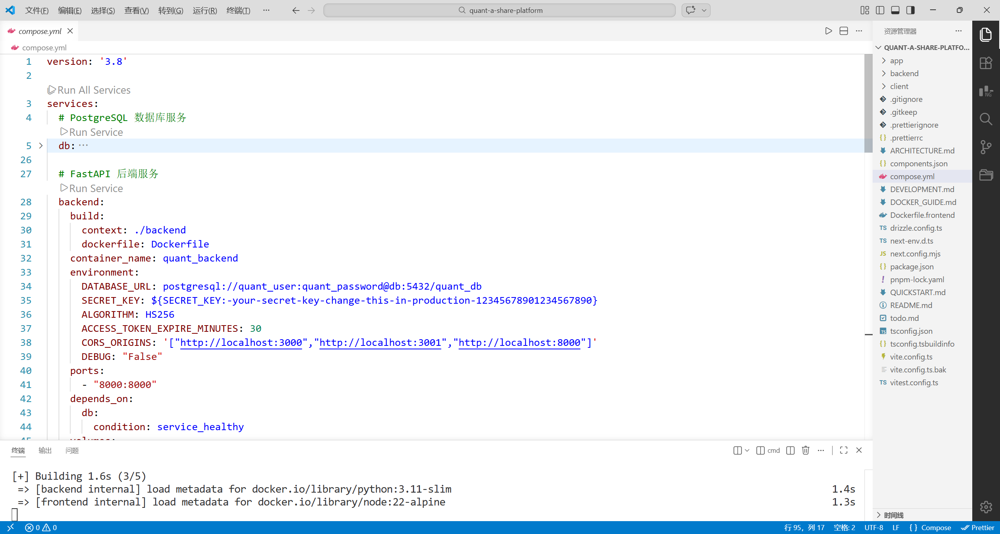
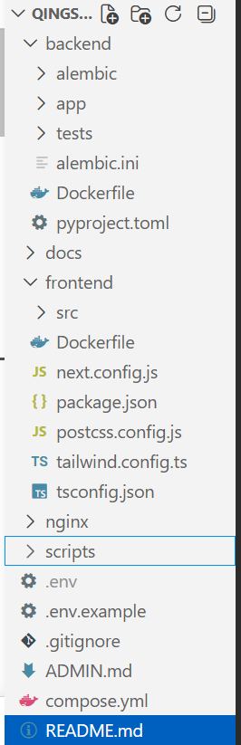
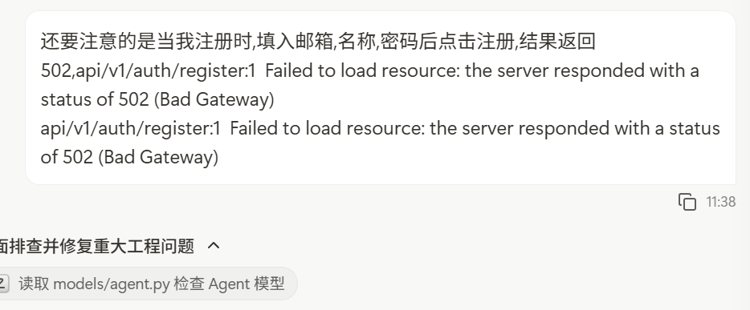
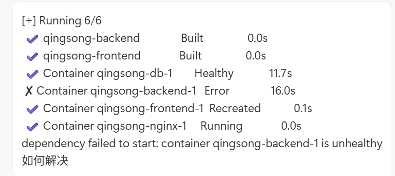
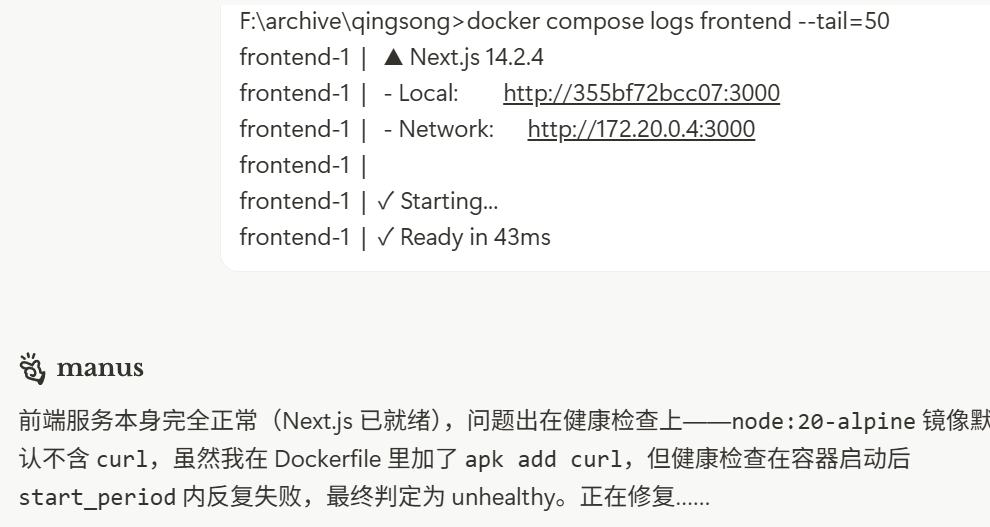
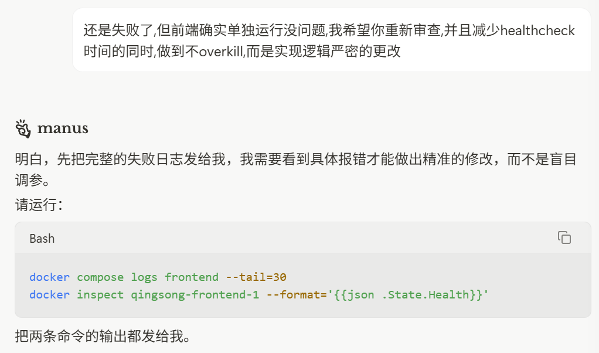
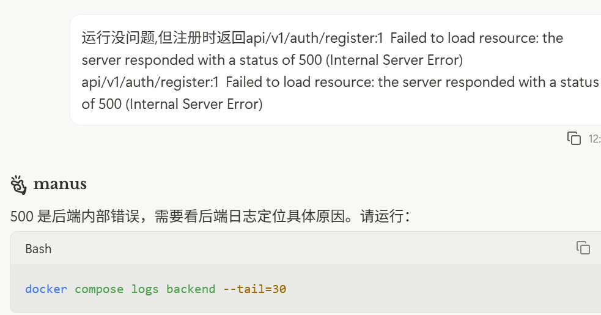
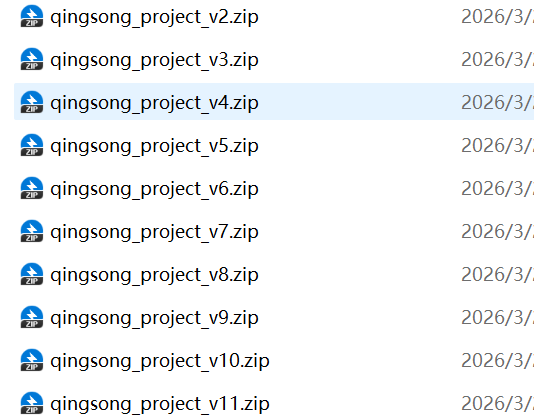

从来没用过manus,这次试试水,我只给出了以下命令,用的是免费的lite版本:

>帮我做一个量化A股网站,要求使用了fastapi作为后端,nextjs作为前端,数据库用postgresql,要求使用docker配置连接,用compose.yml部署,每次生成时如果有必要重构立刻重构,保证项目结构清晰分明,routes文件夹写明,提前针对不同路由拆分好routes为多个文件.

然后生成了这个架构:


还是挺像模像样的.
- 后记:实际上有不少bug


## 实战(3/20)
由于有朋友想让我帮他的大创弄个智能体出来,尽管我基本学习了前端和后端需要的知识,但真要我写还是无从下手的.

于是我就打算用manus来试试水,先充了一个20刀的会员(竟然可以用支付宝).

然后写了个项目需求md后贴给它,这是需求的大致结构,我没有全部贴是为了照顾别人的隐私.

```md

## 1. 核心技术栈 (Physical Stack)
* **前端**: Next.js (App Router), Tailwind CSS (UI 框架)。
* **后端**: FastAPI (异步 Web 框架), SQLModel (ORM 映射),PostgreSql作为存储数据库
* **AI 编排**: LangChain (LLM 逻辑链), 允许使用 DeepSeek API (核心推理引擎)和一个本地部署的ollama模型接口
* **基础设施**: Docker, `compose.yml` (容器化与端口转发)。
* **环境文件**: 将要用到的基础配置变量写入环境文件env,并让数据库和python从这个环境库中读取配置,而非在代码中填写

**架构示例**

Socrates_AI/
├── docker-compose.yml
├── .env                  # 全局环境变量映射中心
├── prompt.json           # 系统人格与逻辑配置文件
├── data/                 # 本地 RAG 训练资料文件夹
├── scripts/
│   └── deploy.sh         # Linux 一键部署脚本
├── frontend/             # Next.js 源码
│   └── Dockerfile
└── backend/              # FastAPI 源码
    ├── main.py
    ├── models.py         # SQLModel 定义
    └── Dockerfile

该分文件和文件夹的时候就需要分

### 2. 物理布局与 UI 要求 (Gemini Style)
* **深色极简**: 采用 `zinc-900` 主色调，模拟高质感的思辨氛围。
* **两栏架构**:
    * **左侧边栏**: 物理展示对话历史、新建对话按钮。
    * **中央对话区**: 气泡式对话流，底部固定悬浮输入框。
* **输入组件**: 
    * 支持多行文本输入。
    * 具备**附件上传图标**，物理支持文件拖拽或点击上传。
* 增加一个旁栏图标,对应的是已经本地配置好的智能体

```
然后在我要求manus向我核实一些需要我确认的内容后,花了差不多10min就完成了主要的架构.


但非常遗憾的是,我前前后后调了11版才实现了基础的调api进行对话的功能,耗时总计为2个多小时.





不得不承认,现在的智能体真的比一年前要聪明了不少,至少看上去是这样,而且经过一系列排查之后,总是能够找到实际的解决方案.


期间我基本上是这么做的:
1. 使用docker运行当前版本并测试基本功能
2. 查看终端报错或者按F12
3. 将报错信息贴给他
4. manus自己修改生成下一版

最后,成功实现了本地对话:


**部署智能体**
```md
针对你的情况（学生、1–2 个月、低流量、操作简单、要临时域名），最适合的方案是 Railway，理由如下：
推荐方案：Railway
网址：railway.app
为什么选它
有免费额度：注册后每月赠送 5 美元的使用额度，你这个项目（后端 + 前端 + 数据库）一个月的实际消耗大约在 3–5 美元之间，基本可以免费跑完，流量费用几乎为零。
自带临时域名：每个服务部署后 Railway 会自动分配一个 xxx.up.railway.app 的免费域名，并且自带 HTTPS，不需要买域名。
操作极简：把项目文件夹上传或推送到 GitHub，Railway 识别 compose.yml 后点几下鼠标就部署完成，全程不需要登录服务器、不需要敲命令。
用完即删：1–2 个月后直接在网页上删除项目，不产生任何后续费用。
操作步骤（简版）
第一步：将项目推送到 GitHub（免费私有仓库即可）。
第二步：用 GitHub 账号登录 railway.app，点击 New Project → Deploy from GitHub repo，选择你的仓库。
第三步：Railway 会自动识别 compose.yml，分别创建后端、前端、数据库、Nginx 四个服务。在每个服务的 Variables 页面填入 .env 中的环境变量（主要是 DEEPSEEK_API_KEY 和 SECRET_KEY）。
第四步：点击 Deploy，等待 3–5 分钟构建完成。Railway 会自动给 Nginx 服务分配一个 xxx.up.railway.app 的临时域名，直接访问即可。
唯一需要注意的事
Railway 的免费额度是按 CPU + 内存用量计时计算的，不是按流量。你的项目在无人访问时几乎不消耗资源，所以 5 美元的额度对于低流量的 1–2 个月使用完全够用。如果超出，Railway 会发邮件提醒，你可以选择充值（最低 5 美元）或直接关闭项目。
备选方案：Render（如果 Railway 注册有问题）
render.com 操作逻辑类似，同样支持 Docker 部署和免费临时域名。免费套餐的服务在 15 分钟无流量后会自动休眠（首次访问需要等待约 30 秒唤醒），对于偶尔演示的场景可以接受，但不适合需要随时响应的场景。
结论：Railway 是你这个场景下操作最简单、费用最低、最省心的方案，临时域名开箱即用，1–2 个月后删掉项目即可，不会有任何遗留费用。
```
- 补充: Railway只支持dockerfile前后端分开部署,不支持compose.yml,真要用可以试试Vultr

在有一定docker,python,nextjs的前提下,我基本能够看懂错误出自什么地方,有哪些地方写错了,有哪些地方的架构不够好,哪些库是不必导入的.
但是如果你自己啥也不懂,就单纯是复制粘贴信息,甚至是截图的话,我想应该要花上两倍以上的时间,还不一定能够完全搞定.

所以,我的体会是:
>即便AI能够包办整个代码的生成,但如果你连什么是好的代码,什么是应该使用的框架都不知道的话,我想AI对你的意义并没有那么大;相反,如果你能够精通所需的技术栈,再让AI帮你写代码,那么就真正做到了事半功倍,成功的实现了所谓的vibe coding.

**纸上得来终觉浅,绝知此事要躬行**
