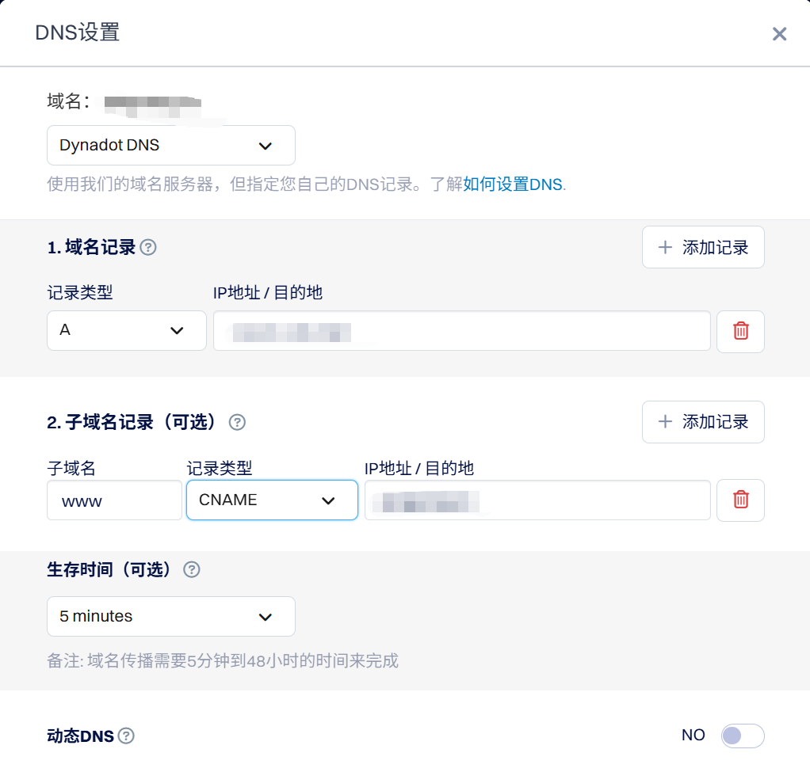
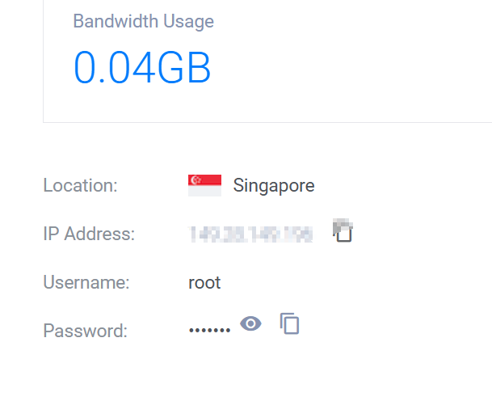
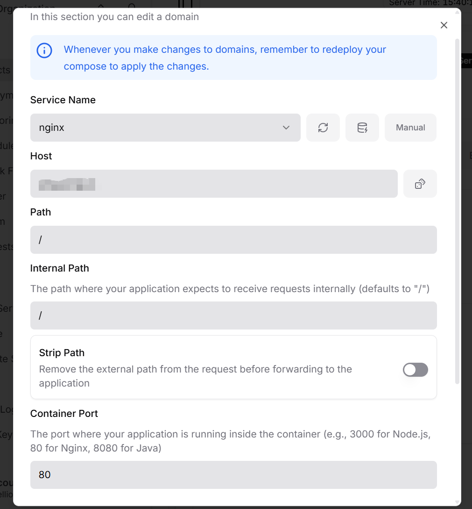

# Intro
有一个项目要做成网站部署上线,但我从来没有部署过一个完整的网站,最多是用github.io部署一个静态的hexo博客再加上用vercel部署评论系统而已.所以折腾了差不多半天.
**工具集**
- [查询自己的域名是否同步到主流dns服务器](https://dnschecker.org/)
- [生成随机的香港地址](https://www.meiguodizhi.com/hk-address)
- [vultr教程](https://blog.naibabiji.com/tutorial/vultr-jiao-cheng.html)
首先我们需要明白一点计算机网络的知识:
>如何让别人看到你的网页?

1. 首先你需要让自己的网站部署在一个云服务器或者本地服务器上,为什么需要服务器呢,是因为服务器具有以下几个功能:
   1. 提供一个合法的ip地址
   2. 一般使用Linux系统,从而保证能够在低功耗下24小时不间断运行
2. 其次为了让自己的网站变得容易被搜索引擎爬取并让他人发现,我们需要在域名注册商内注册购买自己的域名,并通过DNS映射到服务器ip地址
3. 其实部署到这里就结束了,如果有需要可以在服务器上配置防火墙,预防ddos攻击,预存快照等功能

所以,为了能够让自己的网页顺利上线,你需要保证自己的代码能够在通用的linux版本上运行,其次,需要选择一个适合自己架构的服务器,最次要的要素才是选择域名.

由于我的项目使用了docker compose,故可以轻松在linux上运行,但很可惜的是不少服务器都不支持直接用compose部署(或者不支持Alipay...).

我辗转找到了[vultr](https://my.vultr.com/)这样一个支持compose直接部署的服务器厂商,它的收费政策先充钱进账户,按使用量收费.

但vultr的部分ip[有时会被封](https://blog.naibabiji.com/tutorial/vultr-jiao-cheng.html),故你如果当你ping不通ip地址的时候,需要销毁后重新建一个虚拟机.

服务器正常运行后,便可以使用Dokploy来在服务器上部署自己的项目(如果不知道如何操作的可以看文末的ai教程备份)

部署成功后就可以申请域名并绑定了,我用的是**dynadot**域名注册商,也是因为能用支付宝而且不用备案...


域名记录栏填入ip地址,子域名记录栏填入域名即可,这样别人无论访问**www.域名.com**还是直接访问**域名.com**都可以定向到你的网站了.
# 如何远程连接服务器?

在服务器后台看到自己的ip地址和对应密码后,在cmd输入以下命令:
```bash
ssh 你的用户名@你的服务器IP
```
之后再输入密码,就可以连上服务器并进行各种各样的操作了.


如果你和我一样打算用compose.yml来部署网站并遇到了一些问题,欢迎在评论区提出!
# AI教程备份
---

## 🚀 第一步：Vultr 服务器选型与开机

你的项目包含 4 个容器（PostgreSQL + pgvector、FastAPI 后端、Next.js 前端、Nginx），其中 pgvector 和 Next.js 构建时比较吃内存。

### 1. 推荐配置（性价比最高）
* **类型**：`Cloud Compute (Shared CPU)` -> `Regular Performance`
* **节点**：**Singapore（新加坡）** 或 **Tokyo（东京）**（对中国大陆延迟最低，通常在 50-80ms）
* **系统**：`Ubuntu 22.04 LTS` 或 `Ubuntu 24.04 LTS`
* **配置**：**1 vCPU / 2GB RAM / 55GB SSD**（价格：$12/月）
* **注**：虽然有 $6/月（1GB RAM）的选项，但 1GB 内存跑 4 个容器极易 **OOM（内存溢出）** 导致数据库崩溃，强烈建议 2GB 起步。

### 2. 开机步骤
1.  注册并登录 Vultr，绑定支付方式（支持支付宝/微信/信用卡）。
2.  点击右上角 **Deploy +** -> **Deploy New Server**。
3.  按上述推荐选择节点、系统和配置。
4.  **Server Settings**：取消勾选 "Auto Backups"（可省 $2.4/月，后续可用 Dokploy 备份）。
5.  点击右下角 **Deploy Now**。
6.  等待 1-2 分钟，状态变为 "Running" 后，点击服务器名称，记录下 **IP Address** 和 **Password**。

---

## 🛠️ 第二步：安装 Dokploy（可视化面板）

Dokploy 是一个开源的轻量级 PaaS 面板，能让你像用 Railway 一样通过网页管理 Docker Compose 项目。

1.  在你的电脑上打开终端（Windows 用 PowerShell，Mac 用 Terminal）。
2.  **SSH 连接** 到你的 Vultr 服务器：
    ```bash
    ssh root@你的服务器IP
    ```
    输入 `yes`，然后粘贴 Vultr 面板里的密码。
3.  运行 **Dokploy 一键安装脚本**：
    ```bash
    curl -sSL https://dokploy.com/install.sh | sh
    ```
4.  安装大约需要 **3-5 分钟**。完成后，在浏览器中访问：`http://你的服务器IP:3000`
5.  **首次访问会要求你设置管理员账号和密码**，设置完成后进入 Dokploy 控制台。

---

## 📦 第三步：部署青松项目

### 1. 准备项目文件
将你本地的 `x` 文件夹或者上传到 GitHub 私有仓库

### 2. 在 Dokploy 中创建项目
1.  在 Dokploy 左侧菜单点击 **Projects** -> **Create Project**，命名为 `x`。
2.  进入项目，点击 **Create Service** -> 选择 **Compose**。
3.  命名为 `x-app`。

### 3. 配置代码源
* **如果你用 GitHub**：选择 Github，绑定你的账号，选择仓库和分支。

### 4. 配置环境变量
在 Dokploy 的 **Environment** 选项卡中，粘贴你的 `.env` 文件内容。

### 5. 启动部署
点击右上角的 **Deploy** 按钮。Dokploy 会自动拉取镜像、构建前端和后端、启动数据库。你可以在 **Logs** 选项卡中实时查看构建进度。

---

## 🌐 第四步：绑定域名与 HTTPS

### 1. 购买与解析域名
1.  在 Cloudflare 或阿里云购买一个便宜的域名（如 `.xyz` 或 `.top`，首年通常不到 10 块钱）。
2.  在域名 DNS 设置中，添加一条 **A 记录**：
    * **Name**: `@` 或 `chat`（取决于你想用主域名还是子域名）
    * **Content**: 你的 Vultr 服务器 IP
    * **Proxy status**: **仅限 DNS**（关闭小黄云，让 Dokploy 自己处理 SSL）

### 2. 在 Dokploy 中配置域名
1.  回到 Dokploy 面板，进入你的 `x-app` Compose 服务。
2.  找到 **Domains** 选项卡。
3.  添加你的域名（例如 `chat.yourdomain.com`）。
4.  **目标端口（Target Port）** 填写 `80`（因为你的 `compose.yml` 中 Nginx 暴露的是 80 端口）。
5.  勾选 **Enable SSL**（Dokploy 会自动向 Let's Encrypt 申请免费的 HTTPS 证书）。
6.  点击 **Save**。

- 如果使用了nginx,在domains选项只需要像下面这样填写就行了:

其中马赛克部分填写自己申请的域名