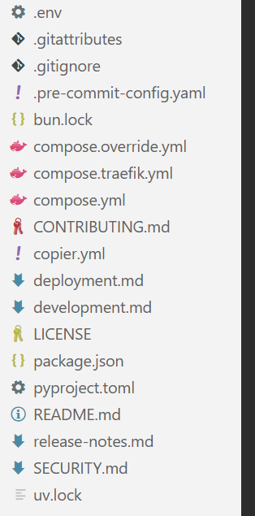

- (待补充)
事实上,当你刚入门一个架构或者语言时,理解代码永远不是最难的地方,真正困难的一关是各种各样的配置文件!

- 你能想象一个编程小白看到这些配置文件的绝望感吗...(尽管小白未必会接触到这么复杂的配置结构)
我们先来梳理一下到底有多少种**主流**配置文件,就知道为什么我这么讲了.
- 以下的分类仅仅是为了我个人处理的方便,可能不够严谨
# 配置文件分类
## 版本控制
### git
**.gitignore**
```text
.vscode/*
!.vscode/extensions.json
node_modules/
/test-results/
/playwright-report/
/blob-report/
/playwright/.cache/
```
- 过滤掉不需要加入版本控制的文件
  - 前一个`/`表示根目录,后一个`/`表示文件夹
**.gitattributes**
```text
* text=auto
*.sh text eol=lf
```
- 定义特定路径或者文件属性
**.gitkeep**
- 保留需要的空文件夹
### CONTRIBUTING.md
这个应该还是很好懂的,大型开源项目都要用这个md文件来告诉别人少发没用的pull request.
```md
# Contributing

Thank you for your interest in contributing to the Full Stack FastAPI Template! 🙇

## Discussions First

For **big changes** (new features, architectural changes, significant refactoring), please start by opening a [GitHub Discussion](https://github.com/fastapi/full-stack-fastapi-template/discussions) first. This allows the community and maintainers to provide feedback on the approach before you invest significant time in implementation.

For small, straightforward changes, you can go directly to a Pull Request without starting a discussion first. This includes:

- Typos and grammatical fixes
- Small reproducible bug fixes
- Fixing lint warnings or type errors
- Minor code improvements (e.g., removing unused code)
```

### LICENSE
做开源项目不可或缺的一部分就是选一个符合自身理念的许可证
- 如果你的项目不指明任何LICENSE,默认所有人都不可以借用你的代码库
**LICENSE**
```text
MIT License

Copyright (c) 2019 Sebastián Ramírez

Permission is hereby granted, free of charge, to any person obtaining a copy
of this software and associated documentation files (the "Software"), to deal
in the Software without restriction, including without limitation the rights
to use, copy, modify, merge, publish, distribute, sublicense, and/or sell
copies of the Software, and to permit persons to whom the Software is
furnished to do so, subject to the following conditions:

The above copyright notice and this permission notice shall be included in all
copies or substantial portions of the Software.

THE SOFTWARE IS PROVIDED "AS IS", WITHOUT WARRANTY OF ANY KIND, EXPRESS OR
IMPLIED, INCLUDING BUT NOT LIMITED TO THE WARRANTIES OF MERCHANTABILITY,
FITNESS FOR A PARTICULAR PURPOSE AND NONINFRINGEMENT. IN NO EVENT SHALL THE
AUTHORS OR COPYRIGHT HOLDERS BE LIABLE FOR ANY CLAIM, DAMAGES OR OTHER
LIABILITY, WHETHER IN AN ACTION OF CONTRACT, TORT OR OTHERWISE, ARISING FROM,
OUT OF OR IN CONNECTION WITH THE SOFTWARE OR THE USE OR OTHER DEALINGS IN THE
SOFTWARE.
```

## 部署

### copier
**copier.yml**
简单介绍一下这个python库:
>It will copy all the files, ask you configuration questions, and update the `.env` files with your answers.
然后只要这么用就可以生成一个新项目了:
```bash
copier copy https://github.com/fastapi/full-stack-fastapi-template my-awesome-project --trust
```
**copier.yml**
```yml
project_name:
  type: str
  help: The name of the project, shown to API users (in .env)
  default: FastAPI Project

stack_name:
  type: str
  help: The name of the stack used for Docker Compose labels (no spaces) (in .env)
  default: fastapi-project

secret_key:
  type: str
  help: |
    'The secret key for the project, used for security,
    stored in .env, you can generate one with:
    python -c "import secrets; print(secrets.token_urlsafe(32))"'
  default: changethis

first_superuser:
  type: str
  help: The email of the first superuser (in .env)
  default: admin@example.com

first_superuser_password:
  type: str
  help: The password of the first superuser (in .env)
  default: changethis

smtp_host:
  type: str
  help: The SMTP server host to send emails, you can set it later in .env
  default: ""

smtp_user:
  type: str
  help: The SMTP server user to send emails, you can set it later in .env
  default: ""

smtp_password:
  type: str
  help: The SMTP server password to send emails, you can set it later in .env
  default: ""

emails_from_email:
  type: str
  help: The email account to send emails from, you can set it later in .env
  default: info@example.com

postgres_password:
  type: str
  help: |
    'The password for the PostgreSQL database, stored in .env,
    you can generate one with:
    python -c "import secrets; print(secrets.token_urlsafe(32))"'
  default: changethis

sentry_dsn:
  type: str
  help: The DSN for Sentry, if you are using it, you can set it later in .env
  default: ""

_exclude:
  # Global
  - .vscode
  - .mypy_cache
  # Python
  - __pycache__
  - app.egg-info
  - "*.pyc"
  - .mypy_cache
  - .coverage
  - htmlcov
  - .cache
  - .venv
  # Frontend
  # Logs
  - logs
  - "*.log"
  - npm-debug.log*
  - yarn-debug.log*
  - yarn-error.log*
  - pnpm-debug.log*
  - lerna-debug.log*
  - node_modules
  - dist
  - dist-ssr
  - "*.local"
  # Editor directories and files
  - .idea
  - .DS_Store
  - "*.suo"
  - "*.ntvs*"
  - "*.njsproj"
  - "*.sln"
  - "*.sw?"

_answers_file: .copier/.copier-answers.yml

_tasks:
  - ["{{ _copier_python }}", .copier/update_dotenv.py]
```

### docker
**.dockerfile**
```dockerfile
FROM python:3.10

ENV PYTHONUNBUFFERED=1

# Install uv
# Ref: https://docs.astral.sh/uv/guides/integration/docker/#installing-uv
COPY --from=ghcr.io/astral-sh/uv:0.9.26 /uv /uvx /bin/

# Compile bytecode
# Ref: https://docs.astral.sh/uv/guides/integration/docker/#compiling-bytecode
ENV UV_COMPILE_BYTECODE=1

# uv Cache
# Ref: https://docs.astral.sh/uv/guides/integration/docker/#caching
ENV UV_LINK_MODE=copy

WORKDIR /app/

# Place executables in the environment at the front of the path
# Ref: https://docs.astral.sh/uv/guides/integration/docker/#using-the-environment
ENV PATH="/app/.venv/bin:$PATH"

# Install dependencies
# Ref: https://docs.astral.sh/uv/guides/integration/docker/#intermediate-layers
RUN --mount=type=cache,target=/root/.cache/uv \
    --mount=type=bind,source=uv.lock,target=uv.lock \
    --mount=type=bind,source=pyproject.toml,target=pyproject.toml \
    uv sync --frozen --no-install-workspace --package app

COPY ./backend/scripts /app/backend/scripts

COPY ./backend/pyproject.toml ./backend/alembic.ini /app/backend/

COPY ./backend/app /app/backend/app

# Sync the project
# Ref: https://docs.astral.sh/uv/guides/integration/docker/#intermediate-layers
RUN --mount=type=cache,target=/root/.cache/uv \
    --mount=type=bind,source=uv.lock,target=uv.lock \
    --mount=type=bind,source=pyproject.toml,target=pyproject.toml \
    uv sync --frozen --package app

WORKDIR /app/backend/

CMD ["fastapi", "run", "--workers", "4", "app/main.py"]
```
- 可以简单理解为一个docker专用的运行脚本,还是很好看懂的

**.dockerignore**
```dockerfile
# Python
__pycache__
app.egg-info
*.pyc
.mypy_cache
.coverage
htmlcov
.venv
```
- 在构建时忽略的文件和文件夹

**compose.yml**
```yml
services:
  # ---- PostgreSQL + pgvector 数据库 ----
  db:
    image: pgvector/pgvector:pg16
    restart: unless-stopped
    env_file: .env
    environment:
      POSTGRES_USER: ${POSTGRES_USER}
      POSTGRES_PASSWORD: ${POSTGRES_PASSWORD}
      POSTGRES_DB: ${POSTGRES_DB}
    volumes:
      - postgres_data:/var/lib/postgresql/data
    healthcheck:
      test: ["CMD-SHELL", "pg_isready -U ${POSTGRES_USER} -d ${POSTGRES_DB}"]
      interval: 10s
      timeout: 5s
      retries: 5

  # ---- Adminer 数据库管理界面 ----
  adminer:
    image: adminer:latest
    restart: unless-stopped
    ports:
      - "8081:8080"
    depends_on:
      db:
        condition: service_healthy
    environment:
      ADMINER_DEFAULT_SERVER: db
      ADMINER_DESIGN: pepa-linha
```
鉴于一个个运行容器并配置环境过于痛苦,于是我们又有了compose.yml这一神器,能够轻松的统合多个容器并实现通信

当然我们有时候会看到`compose.override.yml`这个文件,作用原理如下所述.

>当你运行 docker compose up 而不指定文件时，Docker 引擎会按照以下物理顺序自动寻找并合并文件：

1. docker-compose.yml（基础配置：定义通用服务、镜像、网络）
2. docker-compose.override.yml（覆盖配置：物理修改或增加基础文件中的项）

>核心规则：如果两个文件定义了相同的配置项，override 文件中的值会物理覆盖基础文件；如果是列表（如 ports 或 volumes），则会进行物理追加合并。

**.env**
```yml
# Domain
# This would be set to the production domain with an env var on deployment
# used by Traefik to transmit traffic and aqcuire TLS certificates
DOMAIN=localhost
# To test the local Traefik config
# DOMAIN=localhost.tiangolo.com

# Used by the backend to generate links in emails to the frontend
FRONTEND_HOST=http://localhost:5173
# In staging and production, set this env var to the frontend host, e.g.
# FRONTEND_HOST=https://dashboard.example.com

# Environment: local, staging, production
ENVIRONMENT=local

PROJECT_NAME="Full Stack FastAPI Project"
STACK_NAME=full-stack-fastapi-project

# Backend
BACKEND_CORS_ORIGINS="http://localhost,http://localhost:5173,https://localhost,https://localhost:5173,http://localhost.tiangolo.com"
SECRET_KEY=changethis
FIRST_SUPERUSER=admin@example.com
FIRST_SUPERUSER_PASSWORD=changethis

# Emails
SMTP_HOST=
SMTP_USER=
SMTP_PASSWORD=
EMAILS_FROM_EMAIL=info@example.com
SMTP_TLS=True
SMTP_SSL=False
SMTP_PORT=587

# Postgres
POSTGRES_SERVER=localhost
POSTGRES_PORT=5432
POSTGRES_DB=app
POSTGRES_USER=postgres
POSTGRES_PASSWORD=changethis

SENTRY_DSN=

# Configure these with your own Docker registry images
DOCKER_IMAGE_BACKEND=backend
DOCKER_IMAGE_FRONTEND=frontend
```
尽管这个文件并非docker独有,但在docker配置环境,设置密码和账户的时候是非常有用的
## 前端
### nodejs
**package.json**
```json
{
  "name": "frontend",
  "version": "0.1.0",
  "private": true,
  "scripts": {
    "dev": "next dev",
    "build": "next build",
    "start": "next start",
    "lint": "next lint"
  },
  "dependencies": {
    "next": "14.2.4",
    "react": "^18",
    "react-dom": "^18",
    "zustand": "^4.5.4",
    "react-markdown": "^9.0.1",
    "remark-gfm": "^4.0.0",
    "react-syntax-highlighter": "^15.5.0",
    "react-textarea-autosize": "^8.5.3",
    "lucide-react": "^0.400.0",
    "clsx": "^2.1.1",
    "tailwind-merge": "^2.4.0",
    "eventsource-parser": "^2.0.0"
  },
  "devDependencies": {
    "typescript": "^5",
    "@types/node": "^20",
    "@types/react": "^18",
    "@types/react-dom": "^18",
    "@types/react-syntax-highlighter": "^15.5.13",
    "postcss": "^8",
    "tailwindcss": "^3.4.1",
    "autoprefixer": "^10.4.19",
    "eslint": "^8",
    "eslint-config-next": "14.2.4"
  }
}
```
- 管理前端依赖,定义调试脚本

**package-lock.json / pnpm-lock.yaml / yarn.lock**
分别为npm,pnpm,yarn三个nodejs包管理器的依赖锁定文件,详细记录了所用到的依赖项的具体参数

**node_modules/**
自然,还有臃肿到可怕的包存放文件夹

**tsconfig.json**
```json
{
  "compilerOptions": {
    "target": "ES2020",
    "useDefineForClassFields": true,
    "lib": ["ES2020", "DOM", "DOM.Iterable"],
    "module": "ESNext",
    "skipLibCheck": true,
    /* Bundler mode */
    "moduleResolution": "bundler",
    "allowImportingTsExtensions": true,
    "resolveJsonModule": true,
    "isolatedModules": true,
    "noEmit": true,
    "jsx": "react-jsx",
    /* Linting */
    "strict": true,
    "noUnusedLocals": true,
    "noUnusedParameters": true,
    "noFallthroughCasesInSwitch": true,
    "baseUrl": ".",
    "paths": {
      "@/*": ["./src/*"]
    }
  },
  "include": ["src", "tests", "playwright.config.ts"],
  "references": [
    {
      "path": "./tsconfig.node.json"
    }
  ]
}
```
ts项目特有,指定了编译项目所需的根目录下的文件以及编译选项。
#### vite
**vite.config.ts**
```ts
import path from "node:path"
import tailwindcss from "@tailwindcss/vite"
import { tanstackRouter } from "@tanstack/router-plugin/vite"
import react from "@vitejs/plugin-react-swc"
import { defineConfig } from "vite"

// https://vitejs.dev/config/
export default defineConfig({
  resolve: {
    alias: {
      "@": path.resolve(__dirname, "./src"),
    },
  },
  plugins: [
    tanstackRouter({
      target: "react",
      autoCodeSplitting: true,
    }),
    react(),
    tailwindcss(),
  ],
})
```
- 用来配置路径和插件
#### next
**next.config.js**
nextjs项目专用
### bun
**bun.lock**
使用bun来进行包管理产生的锁文件
**bunfig.toml**
>通常，Bun 依赖于已有的配置文件（如 package.json 和 tsconfig.json）来配置其行为。bunfig.toml 仅用于配置 Bun 特定的内容。此文件是可选的，Bun 在没有它时也能正常工作。

## 后端

### python
**.venv/**
虚拟环境文件夹,里面有python包和特定版本的python
#### uv
**pyproject.toml**
```toml
[project]
name = "app"
version = "0.1.0"
description = ""
requires-python = ">=3.10,<4.0"
dependencies = [
    "fastapi[standard]<1.0.0,>=0.114.2",
    "python-multipart<1.0.0,>=0.0.7",
    "email-validator<3.0.0.0,>=2.1.0.post1",
    "tenacity<9.0.0,>=8.2.3",
    "pydantic>2.0",
    "emails<1.0,>=0.6",
    "jinja2<4.0.0,>=3.1.4",
    "alembic<2.0.0,>=1.12.1",
    "httpx<1.0.0,>=0.25.1",
    "psycopg[binary]<4.0.0,>=3.1.13",
    "sqlmodel<1.0.0,>=0.0.21",
    "pydantic-settings<3.0.0,>=2.2.1",
    "sentry-sdk[fastapi]<2.0.0,>=1.40.6",
    "pyjwt<3.0.0,>=2.8.0",
    "pwdlib[argon2,bcrypt]>=0.3.0",
]

[dependency-groups]
dev = [
    "pytest<8.0.0,>=7.4.3",
    "mypy<2.0.0,>=1.8.0",
    "ruff<1.0.0,>=0.2.2",
    "prek>=0.2.24,<1.0.0",
    "coverage<8.0.0,>=7.4.3",
]

[build-system]
requires = ["hatchling"]
build-backend = "hatchling.build"

[tool.mypy]
strict = true
exclude = ["venv", ".venv", "alembic"]

[tool.ruff]
target-version = "py310"
exclude = ["alembic"]

[tool.ruff.lint]
select = [
    "E",  # pycodestyle errors
    "W",  # pycodestyle warnings
    "F",  # pyflakes
    "I",  # isort
    "B",  # flake8-bugbear
    "C4",  # flake8-comprehensions
    "UP",  # pyupgrade
    "ARG001", # unused arguments in functions
    "T201",   # print statements are not allowed
]
ignore = [
    "E501",  # line too long, handled by black
    "B008",  # do not perform function calls in argument defaults
    "W191",  # indentation contains tabs
    "B904",  # Allow raising exceptions without from e, for HTTPException
]

[tool.ruff.lint.pyupgrade]
# Preserve types, even if a file imports `from __future__ import annotations`.
keep-runtime-typing = true

[tool.coverage.run]
source = ["app"]
dynamic_context = "test_function"

[tool.coverage.report]
show_missing = true
sort = "-Cover"

[tool.coverage.html]
show_contexts = true
```
管理python包环境
**uv.lock**
python包的锁定文件

**.python-version**
指示该项目使用的python版本
#### pip
**requirements.txt**
一次导入大量包,虽然uv也可以用这个文件来导入
#### alembic
简单介绍一下Alembic,它是 SQLAlchemy 的“版本控制系统”,将数据库表结构的变更（DDL）物理抽象为一系列有序的 Python 脚本
**alembic.ini**
```ini
# A generic, single database configuration.

[alembic]
# path to migration scripts
script_location = app/alembic

# template used to generate migration files
# file_template = %%(rev)s_%%(slug)s

# timezone to use when rendering the date
# within the migration file as well as the filename.
# string value is passed to dateutil.tz.gettz()
# leave blank for localtime
# timezone =

# max length of characters to apply to the
# "slug" field
#truncate_slug_length = 40

# set to 'true' to run the environment during
# the 'revision' command, regardless of autogenerate
# revision_environment = false

# set to 'true' to allow .pyc and .pyo files without
# a source .py file to be detected as revisions in the
# versions/ directory
# sourceless = false

# version location specification; this defaults
# to alembic/versions.  When using multiple version
# directories, initial revisions must be specified with --version-path
# version_locations = %(here)s/bar %(here)s/bat alembic/versions

# the output encoding used when revision files
# are written from script.py.mako
# output_encoding = utf-8

# Logging configuration
[loggers]
keys = root,sqlalchemy,alembic

[handlers]
keys = console

[formatters]
keys = generic

[logger_root]
level = WARN
handlers = console
qualname =

[logger_sqlalchemy]
level = WARN
handlers =
qualname = sqlalchemy.engine

[logger_alembic]
level = INFO
handlers =
qualname = alembic

[handler_console]
class = StreamHandler
args = (sys.stderr,)
level = NOTSET
formatter = generic

[formatter_generic]
format = %(levelname)-5.5s [%(name)s] %(message)s
datefmt = %H:%M:%S
```
### java

#### maven
**pom.xml**
核心文件
```xml
<project>
  <modelVersion>4.0.0</modelVersion>
  <groupId>com.app</groupId>
  <artifactId>my-module</artifactId>
  <version>1.0.0</version>
</project>
```
#### gradle
**build.gradle**
gradle核心文件
```gradle
plugins { id 'java' }
dependencies { implementation 'org.slf4j:slf4j-api:2.0.0' }
```
**settings.gradle**
gradle入口文件
### cpp
#### CMake

**CMakeLists.txt**
```text
cmake_minimum_required(VERSION 3.16)

# Remove when sharing with others.
@if %{JS: Util.isDirectory('%{QtCreatorBuild}/Qt Creator.app/Contents/Resources/lib/cmake/QtCreator')}
list(APPEND CMAKE_PREFIX_PATH "%{QtCreatorBuild}/Qt Creator.app/Contents/Resources")
@else
  @if %{JS: Util.isDirectory('%{QtCreatorBuild}/Contents/Resources/lib/cmake/QtCreator')}
list(APPEND CMAKE_PREFIX_PATH "%{QtCreatorBuild}/Contents/Resources")
  @else
list(APPEND CMAKE_PREFIX_PATH "%{QtCreatorBuild}")
  @endif
@endif

project(%{PluginName})

set(CMAKE_AUTOMOC ON)
set(CMAKE_AUTORCC ON)
set(CMAKE_AUTOUIC ON)
set(CMAKE_CXX_STANDARD 20)
set(CMAKE_CXX_STANDARD_REQUIRED ON)
set(CMAKE_CXX_EXTENSIONS OFF)

find_package(QtCreator REQUIRED COMPONENTS Core)
find_package(Qt6 COMPONENTS Widgets REQUIRED)

# Add a CMake option that enables building your plugin with tests.
# You don't want your released plugin binaries to contain tests,
# so make that default to 'NO'.
# Enable tests by passing -DWITH_TESTS=ON to CMake.
option(WITH_TESTS "Builds with tests" NO)

if(WITH_TESTS)
  # Look for QtTest
  find_package(Qt6 REQUIRED COMPONENTS Test)

  # Tell CMake functions like add_qtc_plugin about the QtTest component.
  set(IMPLICIT_DEPENDS Qt::Test)

  # Enable ctest for auto tests.
  enable_testing()
endif()

add_qtc_plugin(%{PluginName}
  PLUGIN_DEPENDS
    QtCreator::Core
  DEPENDS
    Qt::Widgets
    QtCreator::ExtensionSystem
    QtCreator::Utils
  SOURCES
    .github/workflows/build_cmake.yml
    .github/workflows/README.md
    README.md
    %{SrcFileName}
    %{ConstantsHdrFileName}
    %{TrHdrFileName}
)
```
- 打倒CMake独裁统治!大型cpp项目的cmakelists真的是又臭又长,让人看着头皮发麻

#### xmake
国人编写的,使用lua进行开发的cpp构建工具
**xmake.lua**
```lua
target("test")
    set_kind("binary")
    add_files("src/*.c")
    on_load(function (target)
        if is_plat("linux", "macosx") then
            target:add("links", "pthread", "m", "dl")
        end
    end)
    after_build(function (target)
        import("core.project.config")
        local targetfile = target:targetfile()
        os.cp(targetfile, path.join(config.buildir(), path.filename(targetfile)))
        print("build %s", targetfile)
    end)
```
- 自然你要说,这不还是很复杂吗?
cpp的特性就决定了构建项目的复杂,所以更需要我们去使用逻辑清晰好看懂的构建工具


## 反向代理
### nginx
**nginx.conf**
```conf
upstream frontend {
    server frontend:3000;
}

upstream backend {
    server backend:8000;
}

server {
    listen 80;
    server_name _;

    # 最大上传文件大小
    client_max_body_size 20M;

    # 后端 API 请求
    location /api/ {
        proxy_pass http://backend;
        proxy_http_version 1.1;
        proxy_set_header Host $host;
        proxy_set_header X-Real-IP $remote_addr;
        proxy_set_header X-Forwarded-For $proxy_add_x_forwarded_for;
        proxy_set_header X-Forwarded-Proto $scheme;

        # SSE 流式响应支持
        proxy_set_header Connection '';
        proxy_buffering off;
        proxy_cache off;
        proxy_read_timeout 300s;
        chunked_transfer_encoding on;
    }

    # 前端请求
    location / {
        proxy_pass http://frontend;
        proxy_http_version 1.1;
        proxy_set_header Upgrade $http_upgrade;
        proxy_set_header Connection 'upgrade';
        proxy_set_header Host $host;
        proxy_cache_bypass $http_upgrade;
    }
}

```
配置各种各样的流量控制

# 总结
程序开发最怕出现哪些你看都看不懂的报错,希望大家都能去好好学习自己所需的配置工具,而不是一律粘贴给AI,万一不管用的话你咋办?