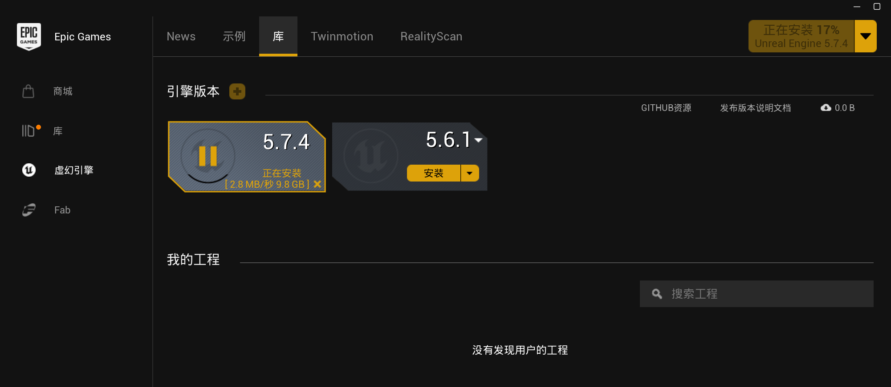
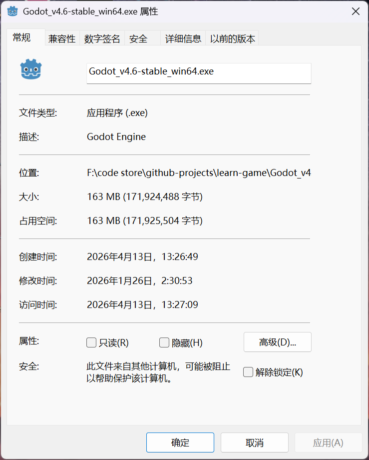

- 我编程学习的动力很大程度上是为了做游戏,但这只是作为一个爱好而已,真要去大厂做游戏的话还是很累的.

不管怎样,我先在这里介绍一下一些常用的游戏引擎,方便游戏开发的新手来选择自己喜欢的开发语言和开发环境

## Unity
垄断级别的游戏引擎,市面上你能看到的游戏大部分都是用它开发的.
### 著名游戏
原神,炉石传说,纪念碑谷,空洞骑士
### 引擎历史
- [wiki](https://en.wikipedia.org/wiki/Unity_(game_engine))

#### Unity 1.0 (2005)
Unity 游戏引擎于 2005 年发布，旨在通过降低开发门槛来实现游戏开发的“民主化”。
* **发布背景**：由 Scott Forstall 在 2005 年苹果全球开发者大会（WWDC）上首次展示，运行于 Mac OS X。
* **荣誉**：次年获得苹果设计奖“最佳 Mac OS X 图形使用”亚军。
* **平台**：最初仅支持 Mac OS X，随后增加了对 Windows 和网页浏览器的支持。

#### Unity 2.0 (2007)
Unity 2.0 带来了约 50 项新功能，标志着引擎进入快速成长期。
* **核心更新**：新增了 **DirectX 支持**、优化的地形引擎、实时动态阴影、视频播放等。
* **协作与网络**：引入版本控制系统以支持团队协作；增加了基于 UDP 的网络层，提供 NAT 穿透、状态同步和远程过程调用（RPC）。
* **移动端开端**：2008 年苹果推出 App Store 后，Unity 迅速增加了对 **iPhone** 的支持。
* **编辑器扩展**：2009 年的 2.5 版本首次增加了 Windows 版编辑器。

#### Unity 3.0 (2010)
Unity 3.0 极大扩展了引擎在桌面和主机端的图形性能。
* **图形技术**：集成了 Beast 光照贴图工具，支持**延迟渲染**、内置树木编辑器、原生字体渲染及音频滤镜。
* **市场地位**：2012 年其开发者数量达到 130 万。调研显示 Unity 成为当时移动平台的首选引擎，助力了独立游戏的爆发。
* **Android 支持**：正式加入对 Android 系统的支持。

#### Unity 4.0 (2012)
该版本致力于强化动画系统与生态整合。
* **技术突破**：支持 **DirectX 11** 和 Adobe Flash，推出了全新的动画工具系统 **Mecanim**，并发布了 Linux 预览版。
* **社交整合**：2013 年 Facebook 集成了 Unity SDK，支持广告追踪、深度链接及跨平台游戏发布。

#### Unity 5 (2015)
Unity 5 被视为实现“通用开发”目标的重要一步。
* **图形与物理**：引入**实时全局光照 (GI)**、PhysX 3.3 物理引擎以及电影级图像效果，改善了“Unity 游戏”廉价的视觉印象。
* **无插件 Web**：通过 **WebGL** 技术，使游戏无需插件即可在浏览器运行。
* **多平台扩展**：5.6 版本增加了对 Nintendo Switch、Vulkan API、Google Daydream 及 4K/360 度虚拟现实视频的支持。

#### 年度版本时期 (2017–2023)
从 2017 年起，Unity 将版本号改为年份标识，以匹配更频繁的更新节奏。
* **Unity 2017**：推出了 **Timeline**（时间轴动画）和 **Cinemachine**（智能摄像机系统），并加强了与 Autodesk 工具的集成。
* **Unity 2018**：
    * **可编程渲染管线 (SRP)**：推出了面向高性能的 HDRP 和面向移动端的 LWRP（后更名为 **URP**）。
    * **技术演进**：引入机器学习工具、Magic Leap 支持以及 **Unity Hub** 管理工具。
* **Unity 2020 - 2022**：
    * **硬件适配**：原生支持 **Apple Silicon**。
    * **工具增强**：引入可视化编程系统 **Bolt**、MARS（增强现实开发）、大幅优化了 Play Mode 的进入速度和 2D 物理系统。

#### Unity 6 (2024)
2023 年底，Unity 宣布回归数字版本号规则。
* **AI 集成**：正式推出 **Unity Muse** 和 **Unity Sentis** 等生成式 AI 工具。
* **性能飞跃**：优化了在线多人内容开发流、Web 项目性能以及图形渲染质量。
* **政策变动**：曾计划推行“运行时费用（Runtime Fee）”，但在 2024 年 9 月因社区强烈抵制而宣布**取消**该费用。
### 环境问题
如今的内地开发者学习unity的第一步是下载真正的unity,而非tuanjie引擎,尽管在国内开发游戏的话现在貌似只能用tuanjie引擎了...
- 这么丑陋的名字是谁想出来的
>[官方介绍](https://unity.cn/tuanjie/tuanjieyinqing)
团结引擎是 Unity 中国的引擎研发团队基于 Unity 2022 LTS 版本**为中国开发者定制的实时 3D 引擎**；基于 Unity 的核心能力，团结引擎团队倾听中国开发者的声音和需求，为团结引擎加入了一些中国开发者需要的定制化功能，并会在未来持续不断的为中国开发者量身定制需要的功能。
团结引擎以 Unity 2022 LTS 为研发基础，融入了团结引擎独有功能和优化，未来会加入更多为中国开发者量身定制的功能和优化。

>[unity is losing users in china](https://discussions.unity.com/t/unity-is-losing-users-in-china/1711678)
>It’s also worth noting that in certain industries, foreign companies in China are required to form a joint venture with a Chinese partner and **are not allowed to hold more than 50%**. That’s why Unity created Unity China, and it’s likely the reason why the regular global version of Unity can no longer be distributed directly in China by Unity itself.
>
>The global Asset Store probably operated in a gray area for a while and was tolerated, but that seems to have changed.
>
>As far as I know, there is no technical exchange between Unity and Unity China, Unity China operates completely independently. And from what it looks like, Unity even plans to sell its shares in Unity China and fully withdraw from the Chinese market.
>
>It’s also possible that Epic may eventually have to change how it operates in China as well.

因此,要想下载真正的unity的话需要挂日本,美国等国家的梯子,用香港梯子也会把你重定位到tuanjie的官网...

### 开发环境
需要注册Unity账户后下载Unity Hub,在Unity Hub中选择所需的Unity引擎版本.
由于Unity引擎的功能极其繁多,而且大部分操作都被图形化了,所以极其臃肿,什么扩展都不添加直接下载时也要占用6,7个G.

- 而且由于功能多,有时候会出现一些莫名其妙的bug.
### 开发语言
脚本语言只能使用C#,C#的参考语言是cpp和java,所以如果你先学了这两门语言再来学C#的话基本能直接看懂大部分代码了.
微软官方的C#教程写的很烂(或者说没有教程),建议找第三方网站如w3schools.当然,直接根据游戏开发教程来上手也可以.

## Unreal Engine
### 著名游戏
黑神话悟空,绝地求生,无畏契约,幻兽帕鲁
### 引擎历史

#### 第一代：Unreal Engine 1 (1995–1998)
虚幻引擎的起点，由 Epic Games 创始人 Tim Sweeney 为游戏《虚幻》（Unreal）独立开发。
* **技术核心**：支持**软件渲染**与硬件加速并行，通过 **3dfx Glide API** 适配早期的 3D 加速卡（如 Voodoo Graphics）。
* **跨平台性**：支持 Windows、Linux、Mac 及 Unix 系统。
* **商业模式**：Epic 开始尝试将引擎授权给其他游戏工作室。

#### 第二代：Unreal Engine 2 (2002–2005)
标志着引擎全面进入硬件渲染时代，并开启了主机市场的扩张。
* **硬件转型**：彻底从软件渲染转向硬件加速。
* **主机适配**：增加了对 PlayStation 2、Xbox 和 GameCube 等主流家用机的支持。
* **发布节奏**：首款基于 UE2 的游戏于 2002 年问世，版本更新持续至 2005 年。

#### 第三代：Unreal Engine 3 (2006–2012)
UE 历史上统治力最强的版本，确立了其在 3A 游戏市场的地位。
* **并行计算**：首批支持**多线程**处理的游戏引擎之一。
* **渲染简化**：以 **DirectX 9** 为基准图形 API，简化了渲染代码逻辑。
* **工业化标准**：首款游戏于 2006 年底发布，随后成为 PS3/Xbox 360 时代大型项目的通用标准。

#### 第四代：Unreal Engine 4 (2014–2021)
虚幻引擎大众化与现代化的里程碑。
* **视觉革命**：引入了**基于物理的材质 (PBR)**，大幅提升了写实感。
* **蓝图系统**：推出了 **"Blueprints"** 可视化脚本系统，让非程序员也能构建复杂的游戏逻辑。
* **分成模式**：首个提供**免费下载**的版本，仅在游戏收入达标后收取版税。

#### 第五代：Unreal Engine 5 (2022–2025)
打破资产复杂度瓶颈的颠覆性版本。
* **Nanite**：虚拟化几何体系统，允许开发者直接使用数亿面数的高质量模型，引擎自动生成细节等级（LOD）。
* **Lumen**：全动态全局光照与反射系统，结合了软件与硬件光线追踪技术。
* **发布历程**：2020 年 5 月首次揭晓，2022 年 4 月正式发布。

### 开发环境
下载Epic Games后直接在面板上下载就行了:

虚幻引擎比起unity引擎更为臃肿,达到了可怕的十个G,启动速度也更慢,性能优化上也比较差.

### 开发语言
蓝图和cpp

## Godot
使用了MIT协议的开源游戏引擎,历史比一般人想象的要悠久的多
### 著名游戏
杀戮尖塔2,战地6,背包乱斗,土豆兄弟,恶魔轮盘
- 开发出来的游戏风格如此多样,反过来说明Godot的可操作性极高
### 引擎历史

* **1999年－2014年**
    Juan Linietsky 与 Ariel Manzur 成立 Codenix 公司并开始研发代号为“Larvotor”的引擎。在此期间，引擎经历了 Legacy、NG3D、Larvita 等多次更名，最终定名为 Godot。该引擎当时主要用于为 Square Enix 等公司提供商业技术咨询。

* **2014年－2018年**
    2014年，Godot 源代码正式以 MIT 协议在 GitHub 开源。2018年，3.0 版本发布，完成了闭源时期无法实现的重大重构，并在微软支持下引入了 C# 脚本语言，随后 3.1 版本增加了针对移动端的 OpenGL ES 2.0 渲染支持。

* **2019年－2022年**
    引擎开发分为两个分支：3.x 分支维持更新，4.0 分支则着手重构核心架构以适配多核处理器与 Vulkan 渲染。2022年，开发团队成立 W4 Games 公司，旨在处理开源代码库无法包含的主机移植等商业咨询服务；同年，Godot 宣布成立独立的 Godot 基金会。

* **2023年－2025年**
    2023年，支持 Vulkan 的 4.0 正式版发布，并上线 Epic 游戏商城。由于unity的`runtime fee`政策，不少开发者从 Unity 迁移至 Godot

### 开发环境
官网下载引擎即可,主引擎极其轻量:

- 这反过来说明Godot本身有的功能极其有限,需要你自己去造很多轮子,但搞计算机的最喜欢造轮子了...

### 开发语言
支持C#和GDScript,后者是Godot自己研发的语言.

## libgdx
开源的Java游戏引擎,弥补了当年unity没有采用Java作为脚本语言的遗憾,历史比较短
### 著名游戏
Mindustry,杀戮尖塔1
### 引擎历史

* **2009 年中**：Mario Zechner 开发 Android Effects (AFX) 框架。为解决移动端调试低效问题，引入桌面端兼容逻辑，奠定跨平台基础。
* **2010 年 3 月**：AFX 在 Google Code 开源，采用 LGPL 协议。
* **2010 年 7 月**：应社区要求切换至 **Apache License 2.0**，允许商业闭源使用。同年发布 phpBB 社区论坛。
* **2010 年 10 月**：主要贡献者 Nathan Sweet 加入，后续共同持有版权并主导开发。
* **2011 年初**：
    * 音频后端由 Java Sound 迁移至 **OpenAL**。
    * 集成基于 STB 库的图像处理库 Gdx2D。
    * 引入 UI 库组件及初步 3D API。
* **2012 年初**：发布 **gdx-jnigen** 辅助工具，简化 JNI 绑定开发，催生了 gdx-audio 和 gdx-freetype 扩展。
* **2012 年中**：
    * 受 PlayN 启发，利用 GWT 实现 HTML5/WebGL 后端。
    * 版本控制由 Subversion 迁移至 **Git (GitHub)**。
    * 构建系统由自定义结构迁移至 **Maven**。
* **2013 年**：
    * **3 月**：引入 RoboVM 以解决 iOS 后端兼容性问题。
    * **5 月**：重构并集成全新 3D API。
    * **9 月**：项目完全搬迁至 GitHub（含 Issue 与 Wiki）；构建系统由 Maven 切换至 **Gradle**。
* **2014 年 4 月 20 日**：**libGDX 1.0** 正式版发布。
* **2016 年**：因 RoboVM 停止维护，项目组分叉（Fork）了开源版 RoboVM 以维持现状，并引入 Intel Multi-OS Engine (MOE) 作为 iOS 备选方案。
* **近年现状**：核心后端持续迭代。RoboVM 分支演进为 **MobiVM** 以支持现代 iOS 版本；GWT 后端由于技术老化，社区开始探索基于 **TeaVM** 的新一代 Web 解决方案；构建环境全面适配 Java 8 及以上版本。

## RPG Maker
专门用来开发RPG游戏的引擎,有很多版本,但又不采用标准的年份或者版本号命名,所以很容易搞蒙.
- 最为人称道的是开发者只需要付买引擎的钱,后续的盈利均归开发者所有
### 著名游戏
blacksouls1&&2,恐惧与饥饿1&&2,Lisa两部曲,魔女之家
### 引擎历史

#### 1988 - 1992：起源与 Dante 98
* **早期探索**：ASCII 公司自 1988 年起发布了一系列基于用户代码扩展的制作工具。
* **RPG Tsukūru Dante 98 (1992)**：官方认定的系列首作，运行于 NEC PC-9801。其后续版本 Dante 98 II 亦在该平台发布。

#### 1995 - 2003：Windows 时代的开启与普及
* **RPG Maker 95**：首个 Windows 版本。提供高分辨率位图，但角色行走图固定为两帧（始终处于走动状态），且无法直接删除已创建的事件。
* **RPG Maker 2000 (RM2k)**：系列最普及的版本之一。降低了素材分辨率以提升运行效率，引入了可无限调用的素材包（素材库概念），解决了 95 版的删除逻辑问题。
* **RPG Maker 2003 (RM2k3)**：Enterbrain 接手后的首作。核心改进为引入了类似《最终幻想》的侧视角战斗系统（Side-view），并支持从 RM2k 升级工程。

#### 2005 - 2011：脚本化与高分辨率化
* **RPG Maker XP (RMXP)**：引入基于 Ruby 语言的 RGSS 脚本系统，允许开发者直接修改底层游戏逻辑。支持更高的 640x480 运行分辨率和更灵活的素材尺寸。
* **RPG Maker VX**：将帧率提升至 60fps，并改用 RGSS2 脚本。简化了编辑器界面，但由于去除了多层图层支持（仅支持单一图块集），导致场景丰富度受限。
* **RPG Maker VX Ace**：VX 的加强版。解决了图块集限制问题，引入了自定义伤害公式功能和素材 DLC 系统。

#### 2015 - 2020：JavaScript 与跨平台
* **RPG Maker MV**：底层全面转向 JavaScript，弃用 Ruby。支持多平台发布（PC、移动端、浏览器），回归了自动化图层系统，并原生支持侧视角战斗切换。
* **RPG Maker MZ**：MV 的迭代版本。重新引入了类 XP 时代的图层手动管理功能，整合了 Effekseer 粒子特效系统，并增加了自动存档等现代游戏功能。

#### 2023 至今：引擎融合
* **RPG Maker Unite**：首次脱离独立运行环境，作为 Unity 引擎的一项插件资产发布。旨在利用 Unity 的渲染管线和跨平台能力，同时保留 RPG Maker 的工作流。

- [拓展阅读](https://felipepepe.medium.com/the-history-of-rpg-maker-its-games-c93685f41ae6)
### 开发环境
- 由于是一次性收费,故怎么想都不会便宜的,而且不同版本的引擎素材不可混用,只能针对特定引擎购买特定的官方素材或者自己画素材
以2020年发布,使用js的RPG Maker MZ为例,我们先看看它的[steam商品页面](https://store.steampowered.com/app/1096900/RPG_Maker_MZ/),只够买引擎本体的话需要四百多人名币,如果想使用官方素材的话还得额外购买,不过本地带的素材也已经很多了
### 学习资料
[新手入门](https://forum.gamer.com.tw/C.php?bsn=4918&snA=31047)
[插件与素材网站合集](https://rpg.blue/forum.php?mod=viewthread&tid=483881)
## cocos2d
>Cocos2d is an **open-source** game development framework for creating 2D games and other graphical software for iOS, Android, Windows, macOS, Linux, HarmonyOS, OpenHarmony and web platforms. It is written in C++ and provides bindings for various programming languages, including C++, C#, Lua, and JavaScript. The framework offers a wide range of features, including physics, particle systems, skeletal animations, tile maps, and others.
>
>Cocos2d was first released in 2008, and was originally written in Python. It contains many branches with the best known being Cocos2d-ObjC (formerly known as Cocos2d-iPhone), Cocos2d-x, Cocos2d-JS and Cocos2d-XNA. There are also many third-party tools, editors and libraries made by the Cocos2d community, such as particle editors, spritesheet editors, font editors, and level editors, like SpriteBuilder and CocoStudio.

### 引擎历史
#### 2008年：起源与早期迭代
* **2月（Los Cocos）**：Ricardo Quesada 与 Lucio Torre 等人在阿根廷 Los Cocos 村开发了基于 **Python** 的 2D 游戏引擎。
* **3月（Cocos2d 诞生）**：发布 0.1 版本，正式更名为 **Cocos2d**。
* **6月（Cocos2d-iPhone）**：紧随苹果 App Store 的潜力，Quesada 用 **Objective-C** 重写引擎，发布 Cocos2d-iPhone v0.1。此版本确立了 Cocos2d 家族的架构基础。

#### 2010 - 2013：全球化与多平台扩张
* **2010年11月（Cocos2d-x 诞生）**：中国开发者王哲基于 Cocos2d 分叉出 **Cocos2d-x** 项目。该版本采用 C++ 开发，支持一套代码多平台运行，并遵循 MIT 开源协议。
* **2013年**：Ricardo Quesada 离开 Cocos2d-iPhone 团队，正式加入 Cocos2d-x 团队。

#### 2015 - 2017：商业化与结构调整
* **2015年**：Cocos2d 家族保持四个分支活跃。触控科技（Chukong Technologies）成为 Cocos2d-x 与 Cocos2d-html5 的主要赞助商和维护者，并开发了可视化编辑器 CocoStudio。
* **2017年3月**：Ricardo Quesada 从触控科技离职。

#### 现状与分支
* **分支架构**：目前 Cocos2D-ObjC（由原 iPhone 版本演变）由 Lars Birkemose 维护；Cocos2d-x 及其 HTML5 版本由中国团队主导开发。
* **品牌标识**：由 Michael Heald 设计了现行的 Cocos2d Logo，取代了最初的“奔跑的椰子”形象。
### 与Cocos Creator的关系

Cocos Creator是**Cocos2d-x**的内地商业化版本,在后端为主的游戏开发生态中拥抱前端开发,并在早期错误的投入大量精力在lua脚本上,因此发展的不是很好...
以下是AI总结的Cocos Creator特性:
#### 技术架构的更迭
* **Cocos2d-x (API 驱动):** 传统的编程框架。开发者通过 C++、Lua 或 JavaScript 编写代码来构建场景、添加节点。这种方式高度依赖代码逻辑，缺乏可视化支撑，开发过程类似“盲写”布局。
* **Cocos Creator (编辑器驱动):** 以 **数据驱动** 为核心。它借鉴了 Unity 的组件化（Component-Based）设计思路，提供了一个可视化编辑器。开发者在界面中拖拽资源、配置属性，代码仅作为挂载在节点上的脚本组件。

#### 核心语言的转变
* **Cocos2d-x:** 主打 **C++**，同时支持 Lua 和 JS 绑定。追求底层控制力和执行效率。
* **Cocos Creator:** 早期支持 JavaScript，现已全面转向 **TypeScript**。这使得开发更符合现代前端工程化标准，且更易于维护大型项目。

#### 渲染引擎的重构
* **Cocos2d-x:** 主要是为 2D 游戏设计，3D 功能是后续强行修补的插件化功能，架构较为沉重。
* **Cocos Creator (3.x 系列):** 底层合并了原有的 2D 引擎与 3D 引擎分支，实现了真正的 **2D/3D 一体化** 渲染架构。它支持基于物理的渲染（PBR）和 GPU 粒子系统，而这些在旧版 Cocos2d-x 中难以实现。

#### 跨平台能力的差异
* **Cocos2d-x:** 侧重于原生平台（iOS, Android, Windows）。虽然有 Cocos2d-js 对应 Web，但双端表现往往不一致。
* **Cocos Creator:** 针对 **小游戏平台**（微信、TikTok、华为等）进行了底层定制优化，拥有极高的 Web 运行时性能，同时兼顾原生跨平台打包。

## 总结
事实上,做游戏最难的地方其实是**找素材**和**坚持开发**,用什么引擎真的关系不大,如果你能够像神之天平的超人作者一样能够十几年如一日的开发,就算是在Windows xp上用RPG Maker 2000开发,我想都能够做出一款超神的作品.
不过,为了避免重复造轮子,还是需要根据自己想要开发的游戏选择引擎的:
1. VR/XR类型: Unity,最为成熟
2. RPG类型(黄油类): RPG Maker,最能减少心智负担
3. 3D: 虚幻(更推荐)和unity,参考黑神话悟空和原神
4. 2D且逻辑简单: Godot,参考杀戮尖塔2和土豆兄弟
5. 2D且逻辑复杂: Unity,参考奥日和空洞骑士
6. 微信小游戏: cocos creator,参考大部分微信唐氏小游戏

