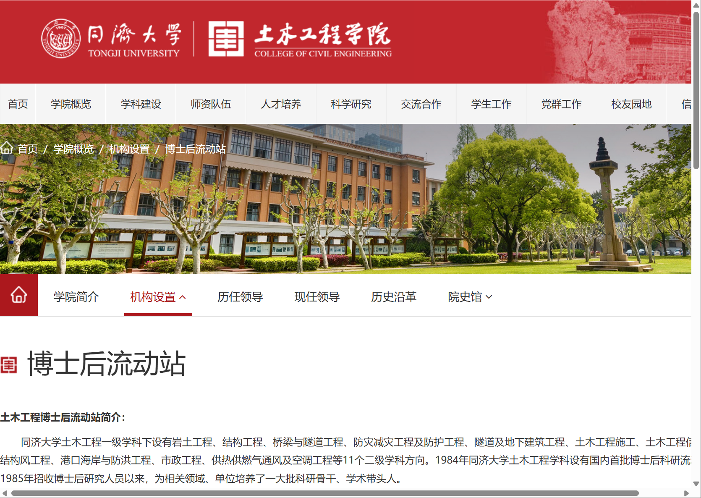
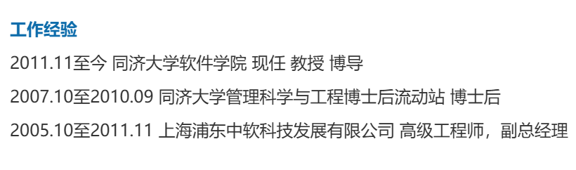
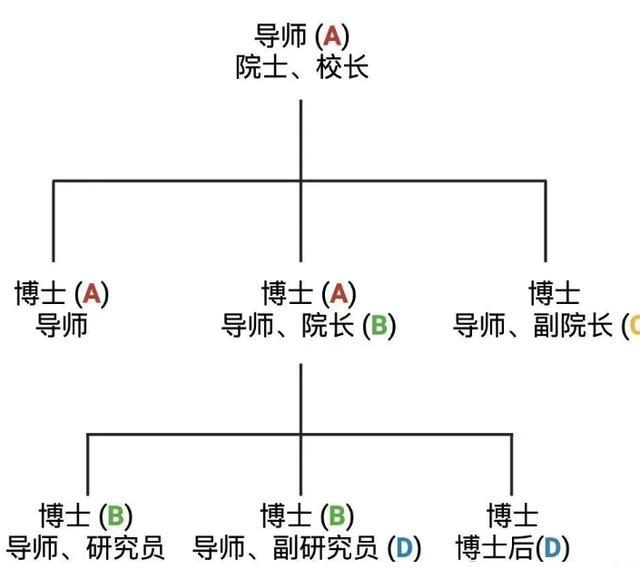
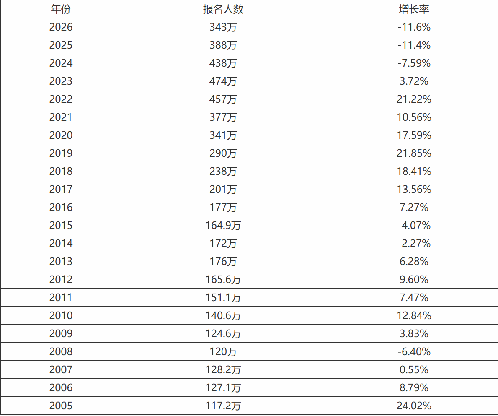
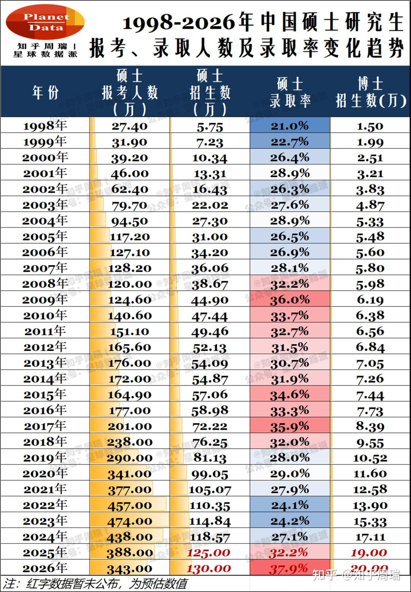

- 黄色的树林里分出了两条路,我选择了人迹罕至的那条,从此决定了我一生的道路

人总会美化自己未曾选择过的那条道路,为了更加坚定自己的决心,接下来我会探讨一下学术路径的可能性.

# 科研: 被利益侵染的社交圈
## 科研头衔
### 欧美的硕士分类
不同国家的硕士分类不同,差别很大.

按入学与学制结构分类:

*   **传统研究生硕士 (Postgraduate/Graduate Master's)**：
    *   **要求**：入学前已拥有学士学位。
    *   **学制**：英国通常为 1 年，美国通常为 2 年。
    *   **代表**：MA, MSc, MBA, LLM。
*   **本硕连读学位 (Integrated Master's)**：
    *   **特征**：英国特有，将本科与硕士阶段合并为一个 4-5 年的课程。
    *   **代表**：MEng (工程), MPhys (物理), MChem (化学)。
    *   **授予**：通常只授予一个硕士学位，部分学校会同时颁发学士与硕士证书。
*   **非硕士级别的“硕士” (Non-master's level master's)**：
    *   **苏格兰 MA**：苏格兰四所古老大学授予的学士级别学位。
    *   **牛剑/都柏林 MA**：牛津、剑桥及都柏林圣三一大学授予，无需进一步考试，授予已有 BA 学位的校友。


英国高等教育质量保障署（QAA）将硕士分为以下三大类：

**A. 研究型硕士 (Research Master's)**

*   **核心**：以研究为主，包含科研方法培训。
*   **代表**：
    *   **MPhil** (哲学硕士)：通常是博士的“预备级”。
    *   **MLitt** (文学硕士)：通常为研究型。
    *   **MbyRes / ResM** (Master's by Research)：纯研究学位。
    *   *注意：MRes (Master of Research) 虽然名字像研究型，但被归类为讲授科研方法的“授课型”学位。*

**B. 专业或高级学习型硕士 (Specialised or Advanced Study Master's)**

*   **核心**：以课程讲授（Taught）为主，但通常包含至少三分之一的毕业论文/研究项目。
*   **代表**：常见的 MSc, MA 或 MRes。

**C. 职业或实践型硕士 (Professional or Practice Master's)**

*   **核心**：为特定职业生涯做准备，侧重应用与实践，可能包含实习（Work Placements）。
*   **要求**：部分项目需要相关工作经验方可入学。
*   **代表**：MBA (工商管理), MDiv (神学), LLM (法学), MSW (社会工作)。


国外的硕士只要读一两年就够了,而国内学硕却必须要读三年,浪费了多少人的青春啊!

- [专硕延长](https://yz.chsi.com.cn/kyzx/kydt/202402/20240219/2293252935.html)


### 内地的专硕与学硕
- [参考文章](https://yz.chsi.com.cn/kyzx/jyxd/202207/20220712/2201735855.html)
  - 好歹是考研官网上的说明,稍微权威一点

- 学术学位硕士研究生: **简称“学硕”**，以学术研究为导向，偏重理论和研究，以培养从事教学和科研的高层次学术研究型人才为主，学习方式一般为全日制，少量学校有非全日制。
- 专业学位硕士研究生: **简称“专硕”**，以职业培养为导向，实践与学术并重，以培养工程师、医师、设计师等高层次应用型人才为主，学习方式分为全日制与非全日制。
#### 历史缘故
>我国于1978年正式恢复招收研究生，当时学硕一支独秀，后来陆续有MBA、软件工程等专硕陆续开始进入学历教育培养；2009年开始，我国学历教育开始招收专硕，一开始规模较小，但发展较快，招生指标以每年5%的速度，逐年递增，而学硕比例则在逐年减少。到2015年，学硕、专硕各占半壁江山。2017年，我国统筹全日制和非全日制研究生管理，学历教育中非全日制专硕数量急剧增长。自此，我国学历研究生教育的学习形式，便形成了全日制学硕、全日制专硕、非全日制专硕多元并存，协调发展的良好局面。
#### 部分细微的区别
学硕一般实行独立导师制。在基本职能方面，研究生导师对学生进行研究生课程教学、课题研究指导与学位论文指导。在导学内容方面，研究生导师对其研究生在读研期间的全过程进行指导，并根据学校要求进入学位论文答辩程序。

专硕一般实行双导师制。根据教育部相关文件精神，各专业学位研究生培养单位要建立健全校内外双导师制，以校内导师指导为主，校外导师应参与实践过程、项目研究、课程与论文等多个环节的指导工作。在培养过程中校内导师以教授理论知识、学术指导为主，而校外导师则以培养技能、指导实践为主。
##### 总体认识
如果是考研的话,专硕和学硕的初试考题是一样的,顶多是一个更偏向科研一点,另一个则偏向就业一点.但如今的用人单位是不考量这二者的区别的,只要是硕士就可以了

### 博士的种类
- [wiki](https://en.wikipedia.org/wiki/Doctorate)

我们通常说的phd只是一个小类,真正划分博士的话有以下四种:


#### 1. 研究型博士 (Research Doctorate)
这是最常见的博士类型，核心要求是完成**原创性研究**并提交可发表的学术论文（Dissertation/Thesis）。
*   **代表学位**：**PhD** (Doctor of Philosophy)，在英国某些学校也称 **DPhil**。
*   **多样性**：除 PhD 外，美国还有 15 种以上的研究型博士，如 **EdD** (教育学)、**ScD/DSc** (科学)、**DBA** (工商管理)、**DEng** (工程) 等。
*   **评价方式**：通常需通过论文答辩（Oral examination/Viva）。
*   **学制**：在美英等国可从学士直接攻读，而在欧洲多国（如芬兰）则通常需要硕士学位。

#### 2. 专业博士 (Professional Doctorate)
侧重于将研究与**职业实践**相结合，其定义在不同国家差异显著。
*   **美国模式**：属于“专业实践博士”，通常不强制要求论文，主要为职业准入（Licensure）设置，需至少 6 年高等教育。
*   **英澳模式**：这类专业博士（如 DClinPsy, EngD）等同于 PhD 级别的研究学位，通常包含授课模块，但仍需完成正式研究。
*   **特殊情况**：在加拿大和澳大利亚，像 **MD** (医学) 或 **JD** (法学) 虽带有“Doctor”字样，但在这些国家有时不被视为严格意义上的“博士学位”，而是职业资格学位。

#### 3. 高级博士与博士后学位 (Higher Doctorates & Post-doctoral Degrees)
这是高于普通研究型博士（PhD）的层级，授予在该领域有卓越贡献的资深学者。
*   **高级博士**：常见于英国、爱尔兰及英联邦国家，如 **DD** (神学)、**DLitt** (文学)、**LLD** (法学)。
*   **授课资格 (Habilitation)**：常见于德国（Dr. habil.）、法国、奥地利等。它是独立指导博士生和申请教授职位的先决条件，被称为“比博士更高一级”的学位。
*   **科学博士 (Doctor of Sciences)**：在前苏联国家（如俄罗斯、乌克兰）存在，主要侧重于极高的科研成就。
*   **博士后学位**：部分拉美国家设有正式的博士后文凭或学位（Posdoctorado）。

#### 4. 荣誉博士 (Honorary Doctorate)
*   **性质**：由大学授予在社会公益、慈善或专业领域有重大贡献的个人，**无需履行任何学术要求**（honoris causa）。
*   **识别**：通常标注为 *Hon LLD* 或 *LittD h.c.*。
*   **注意**：并非所有顶尖名校都授予荣誉博士（如 MIT、康奈尔、弗吉尼亚大学明确不设此项）。

#### 总结
可以看到,不同学校,不同国家对博士学位并没有一个特定的称谓,需要根据具体情况来分析,中国的博士学位主要是仿照美国设置的,分成学术型博士和专业型博士两大类.

### 读了博士之后
- 非常奇怪的是,很多人都喜欢在学历里加上一句"在某某学校做博士后",但**博士后(postdoc)本身是没有学历证书的,它是一段工作经历,而不是一个教育阶段**

一般来说,读了博士之后要想在大学任教的话,你必须要先在高校,企业或者科研院所做几年研究,发点论文,你的工作岗位被称为**工作站**或者**流动站**,如下图所示:

**流动站**


**工作站**



如上图所示,有了类似的工作经历后,你就可以申请学校的教职了,至于如何申请?那自然是各显神通了.

- 没有博士后经历也能申请到教职的大有人在,有些是真的本人非常优秀,另外一部分就不清楚了.


### 教职分类
尽管不同学校对教职的称呼有所不同,但大致的晋升道路如下:
```md
讲师/助理教授/特聘研究员 -> 副教授 -> 教授 -> 院长/院士
```
- 讲师/助理教授/特聘研究员: 非升即走
- 副教授: 基本拿到铁饭碗了
- 优青: 特色头衔,晋升副教授/教授的硬通货
- 杰青(国家杰出青年科学基金): 特色头衔,表明你已经是院士预备役了


## 期刊,会议与专利(待补充)
## 科研门阀的现状
### 案例
最近沸沸扬扬的tj三代学术造假门阀:


亲戚圈:

### 场景推演
先大致推演一个情景:

浩劫后的中国百废待兴,科学研究特别是社会科学研究的人才消耗殆尽,你作为前几批参加高考的小镇青年,凭借着自己在知青时的知识积累和刻苦学习,成功考入了名牌大学,由于当时的政治环境极其宽松,再加上导师们都还保留着曾经在欧美学习时结识的人脉,交换到欧美去非常容易.

于是,带上全额奖学金,你远渡重洋,接连攻读了硕士和博士学位后,回来建设祖国,由于海外人才特别稀少,众多高校争先向你发出教职的邀请,考虑到母校对你的培养,你毅然决然选择了自己的母校.

回到母校后,你自然也要负起责任教授新来的研究生和博士生,由于你本人的能力突出,你很快就成为了母校该系的扛把子,并获评了一系列国家级和省级奖项.那些研究生和博士生自然也沾了你的光,靠着一大堆论文飞向国内的众多名牌高校担任教职.

后来,某个学生在申请教职的时候遇到了一点困难,打电话向你求助,你二话不说抓起电话,跟对应学校的老友攀谈了一下,问题立刻就解决了.另外一个兢兢业业,能力突出的候选人由于没有一个靠山,遗憾落选,只好跑去更差的学校当教授了.

- 大致就推演到这里吧,这自然是我臆想的


# 保研: 服从性测试,做题家与内卷地狱
- [CS保研必看: CSWiki](https://csbaoyan.top/)
  - 由于保研向来就是你死我活的斗争,靠信息差打赢保研战是非常常见的,因此那些无私的分享就显得更为可贵
- [记录了各个夏令营/预推免的ddl](https://ddl.csbaoyan.top/)

## 保研条件
尽管不同学校的保研条件有所差别,加分比例有所不同,但保研总成绩大致可分为以下部分:
1. 绩点(占比85%-95%)
   1. 做题蛆未必能保研,但能保研的一定是做题蛆
2. 科研(占比5%)
   1. 期刊论文/会议论文/专利 都可以加分,但一般都会针对不同等级制定不同的加分比例,如果你离保研的分数线并不遥远,可以通过水一篇论文,交点版面费,实现弯道超车.
3. 竞赛(占比5%)
   1. 不同学校对竞赛的等级划分不同,高等级竞赛加分多,低等级竞赛加分少,换句话说可以通过多个水赛二等奖实现挑战杯金奖的效果
4. 志愿服务(占比0%-5%)
   1. 不同学校对志愿服务的要求不同,有些学校不会把它计入保研加分,但如果计入了,想要保研的话就要去好好钻营如何参加大规模的志愿服务了.

不管怎样,绩点才是王道,大多数学校的大一,大二绩点占比最重,决定了你能不能保研.所以真想读研的话就必须在**一入学就拼命的卷啊卷**,一刻不能放松,即便到了大三下学期排名出来后,还是需要准备夏令营的面试和笔试,直到获得优营和offer后才可以松一口气.

换句话说,如果你选择保研,你需要痛苦三年换取轻松一年,但如果选择考研,你可以轻松三年,然后痛苦半年,再轻松半年.单纯这么算账的话还是考研划算...
## 保研流程
保研并非是"保证读研",而是给了你一个推免名额,可以进入国家推免网站申请自己想要读研的学校.

但学校没道理直接接收你啊,所以大多数头部高校都在大三下的那个暑假开设夏令营,让具有推免名额的学生到学校里面进行笔试和面试,不仅让导师了解学生,也让学生了解导师.

如果你的表现较好,会获得一个优秀营员的证书,但它本身不具有什么效力,需要你选择的导师或者招生组给你发邮件,告诉你被预录取了,这也就是**口头offer**.

有了口头offer后,对面的招生组就会手动在系统里为你预留一个名额(所以鸽掉名额会让招生组很生气),你在**9月份下旬**时打开推免网站申请该学校时,对面就可以将你的信息与之比对,从而直接录取你,而无需再经过笔试和面试.如果愿意的话,你可以提前跑到老师的实验室去打工,或者去爽玩个一年.

当然,这是通常的流程,如果很不幸没有得到offer,你有以下方法:

- 预推免阶段（8月-9月）： 如果你没参加夏令营，或者在夏令营被刷了，可以参加预推免。这本质上就是正式的推免面试，流程非常快，通常只有一两天。
- 九月正式推免（9月底）： 如果学校在预推免后还有名额，会通过国家推免系统发放通知。这种复试通常非常紧迫。

如果这也没被录取上,那就只好考研了...

## 保研与考研
保研时导师都对你知根知底的,而且通常都是本校的学生,不会有问题,而考研通常都是向上考,很多都是从双非考入名校的,导师也不认识你.那么导师更偏爱哪种学生也就很容易理解了.

事实也是如此,如今头部高校中优秀导师的考研名额正在慢慢缩减,保研名额正在慢慢扩张,所以考研分到的导师很有可能是大家都避之不及的那种人,而你都考到这个学校来了,也不好轻易放弃,只好默默吃三年苦.

# 考研: 卷土重来的高考
- [计算机考研杂货铺](https://www.csgraduates.com/)
  - 收集了历年的408考研真题和知识点

## 考研要求
- [官方网站: 研究生招生信息网](https://yz.chsi.com.cn/kyzx/zcdh/)
  - 由于其他的二手总结和第三方消息过于含混不清,所以直接拿25年发放的**教育部关于印发《2026年全国硕士研究生招生工作管理规定》的通知**作为大杀器了.
### 前置概念
>第六条 全国硕士研究生招生考试分初试和复试两个阶段。初试**由国家统一组织**，复试**由招生单位自行组织**。初试和复试都是硕士研究生招生考试的重要组成部分。**教育部统一确定初试、复试时间。**
>
>初试方式分为全国统一考试、单独考试以及推荐免试。全国统一考试、单独考试的初试科目包括全国统一命题科目和招生单位自命题、联合命题科目。

>第八条 硕士研究生学习方式分为**全日制和非全日制**。**全日制和非全日制研究生考试招生依据国家统一要求，执行相同的政策和标准。**
>
>硕士研究生就业方式分为定向就业和非定向就业。

### 报名条件
第十五条 报名参加全国硕士研究生招生考试的人员，须符合下列条件：

（一）中华人民共和国公民。

（二）拥护中国共产党的领导，遵纪守法，品德良好。

（三）身体健康状况符合国家和招生单位规定的体检要求。

（四）考生学业水平须符合下列条件之一，本章另有规定的除外：

1. 国家承认学历的**应届本科毕业生**（含普通高校、成人高校、普通高校举办的成人高等学历教育等应届本科毕业生）及自学考试和网络教育届时可毕业本科生。
2. 具有国家承认的**本科毕业学历**的人员。
3. 获得国家承认的**高职（专科）毕业学历后满2年及以上**人员（毕业后到录取当年入学前，下同）或国家承认学历的本科结业生，且符合招生单位提出的具体学业要求的，按本科毕业同等学力身份报考。
4. 已获硕士、博士研究生学历或学位的人员。

>也就是说,如果你打算工作几年后再去考研究生,是完全没问题的.

### 加分条件
第二十二条 符合下列条件之一后3年内报名参加全国硕士研究生招生考试（不含单独考试）的考生，可申请享受初试总成绩加10分，同等条件下优先录取。符合多项加分项目的考生，分值不得累加。

（一）**参加“大学生志愿服务西部计划”“三支一扶计划”“农村义务教育阶段学校教师特设岗位计划”“国际中文教育志愿者”项目之一**，服务期满且考核合格。

（二）**退役大学生士兵**〔即高校学生应征入伍退出现役者，其中，高校学生指全日制普通本专科（含高职）、研究生、第二学士学位的应（往）届毕业生、在校生和入学新生，以及成人高校招收的普通本专科（含高职）应（往）届毕业生、在校生和入学新生，下同〕达到全国硕士研究生招生考试报考条件。

**除上述加分项目外，各地各招生单位不得擅自扩大加分范围、另设标准。**
### 网上报名环节
第十九条 报名包括网上报名和网上确认两个阶段。

网上报名时间为2025年10月16日至10月27日（网上预报名时间为2025年10月10日至10月13日，相关工作安排由各省级教育招生考试机构确定并公布），每日9:00—22:00。**考生应在规定时间登录“中国研究生招生信息网”（网址：https://yz.chsi.com.cn）参加报名，按要求如实填写并提供真实材料。**

网上确认时间由各省级教育招生考试机构根据教育部有关工作安排和本地区报考组织情况自行确定和公布，具体确认工作由相关报考点组织实施。

**所有考生均须参加网上报名和网上确认**，积极配合签署《考生诚信考试承诺书》并遵守相关约定，认真核对并确认本人报名信息，根据核验工作要求提交补充材料，逾期不得补办。在读研究生报考须在报名前征得所在培养单位同意。考生因网报信息填写错误、填报虚假信息而造成不能考试（含初试、复试）或录取的，后果由考生本人承担。

### 初试考试科目

>第三十二条 初试一般设置四个单元考试科目，即**思想政治理论、外国语**、业务课（一）和业务课（二），满分分别为100分、100分、150分、150分。

- 可以看到英语和思政是必考项,但还是专业课占了大头

>第三十四条 全国统一命题科目有，思想政治理论、英语（一）、英语（二）、俄语、日语、数学（一）、数学（二）、数学（三）、教育学专业基础、心理学专业基础、历史学专业基础、临床医学综合能力（中医）、临床医学综合能力（西医）、数学（农）、化学（农）、植物生理学与生物化学、动物生理学与生物化学、**计算机学科专业基础**、管理类综合能力、法律硕士专业基础（非法学）、法律硕士综合（非法学）、法律硕士专业基础（法学）、法律硕士综合（法学）、经济类综合能力、教育综合。

**以大多数学校的计算机专业为例**,初试里你需要考的是这四门:
1. 思想政治理论
2. 英语(一)
3. 数学(一)
4. 全国统考408,涵盖内容如下:
   1. 数据结构（45分）
   2. 计算机组成原理（45分）
   3. 操作系统（35分）
   4. 计算机网络（25分）

408 考试的卷面结构非常死板（这也方便了考生针对性复习）：
*   **单项选择题**：1-40 题，每小题 2 分，共 80 分。
    *   1-11 题：数据结构
    *   12-22 题：计组
    *   23-32 题：操作系统
    *   33-40 题：计网
*   **综合应用题（大题）**：41-47 题，共 70 分。
    *   41、42 题：数据结构（通常含一道算法设计）
    *   43、44 题：计组
    *   45、46 题：操作系统
    *   47 题：计网


### 初试考试安排
>第三十六条 初试方式均为笔试。初试时间为2025年12月20日至21日。其中，12月20日上午8:30—11:30，思想政治理论或管理类综合能力；12月20日下午14:00—17:00，外国语；12月21日上午8:30—11:30，业务课（一）或专业基础综合；12月21日14:00开始，业务课（二）。考试时间以北京时间为准。
>
>**不在规定日期举行的考试，一律不予承认。具体考试时间、考试科目及有关要求等由报考点和招生单位公布。**

- 如上所述,时间和高考一样是定死的,你必须严格按着考试时间来调整状态和复习
#### 误区辨析
- **考研并非在“毕业后”考，而是在“毕业前”考。**

对于本科生而言，最标准的参加时间是**大四上学期**。
*   **报名时间**：大四上学期的10月份。
*   **初试时间**：大四上学期的12月下旬（通常是倒数第一个或第二个周末）。
*   **复试时间**：大四下学期的3月至4月。
*   **录取与入学**：大四下学期的6月领取录取通知书，7月本科毕业，9月以研究生身份入学。

>这种安排是为了确保学历的**无缝衔接**。如果你在大四毕业后的那个12月才考，那在法律和档案意义上，你已经属于“往届生”或“社会考生”，并且会经历一个为期一年的“脱产复习期”（即Gap Year）。

- 换句话说,所谓的26考研实际上是在25年12月考试.

### 复试安排
>第四十六条 复试的主要形式有笔试、面试、实践（实验）能力考核等，其中面试是必要环节。招生单位应对复试考核总成绩设立合格标准，也可在此基础上，根据部分学科专业特点对复试中的单项考核成绩设立合格标准。复试不合格者不予录取。

>第四十八条 **教育部按照一区、二区制定并公布参加全国硕士研究生招生考试考生进入复试的初试成绩基本要求**（以下简称国家分数线）。一区包括北京、天津、河北、山西、辽宁、吉林、黑龙江、上海、江苏、浙江、安徽、福建、江西、山东、河南、湖北、湖南、广东、重庆、四川、陕西等21省（市）；二区包括内蒙古、广西、海南、贵州、云南、西藏、甘肃、青海、宁夏、新疆等10省（区）。原则上按学科门类分别划线，“少数民族高层次骨干人才计划”、少数民族照顾政策、工商管理等管理类专业学位、以及有关照顾专业（指工学、教育学照顾专业，具体范围由教育部根据国家战略需要、社会发展需求、考生报考情况等因素适时调整，下同）单独划线。

尽管如此,每个学校都会单独根据各自的报考的学生的成绩水平来制定分数线的,显然越好的学校分数线越高.如果你的初试分数很高,但很不幸的选择了分数线巨高无比的学校,就算只差了一两分,就算你选其他的学校报考都绰绰有余,你还是落榜了,只能选择调剂或者再考一年
### 调剂
>**招生单位在第一志愿合格生源不足时**，可组织开展调剂工作。招生单位接受所有考生（含报考“退役大学生士兵计划”与普通计划之间调剂的考生等）调剂申请均须通过教育部“全国硕士生招生复试调剂服务系统”（网址：https://yz.chsi.com.cn/yztj）进行，严禁通过其他渠道接受考生调剂申请。

也就是说,只有当学校生源不够时才会接受调剂,按照现在**向上考**的趋势来看,211,985是不可能被调剂上的,能够调剂到个一本就不错了...
### 总结
考研的话就全靠自己实力了,但是吧,就算是工作了好几年的青壮年码农,除了思想政治要背模板和高等数学要重新复习外,其他的科目照理来说都是很简单的,再去考个研究生也是不迟的.

- **可是为什么这种上班上到一半再去考研的事例特别少见呢**,那其实就说明本科毕业的码农很少有再要去读研的必要了,不过这些事情很少会有人提到而已.
## 考研状况调研
- [图片来源](https://www.dxsbb.com/news/124228.html)


可以看到,早年的报名人数是比较保守的,一年只有几万的变动,到了后面就一发不可收拾,都冲来考研了,而在最近几年却又火速下降.

对比一下招生人数:

- [图片来源](https://zhuanlan.zhihu.com/p/1976399587787948953)

可以看到的是,招生人数一直是稳步上升的,在最近几年的增长速度开始放缓,说明很多学校的研究生名额已经饱和.

也就是说,研究生名额的增长和考研人数的下降说明现在的考研难度更高了,大多数人都挤破头冲击头部高校,而头部高校的研究生名额却不会轻易改变,而且大部分名额尤其是优质导师的名额都已经在保研的时候被瓜分走了.


# 留学: 第三条道路(待补充)
