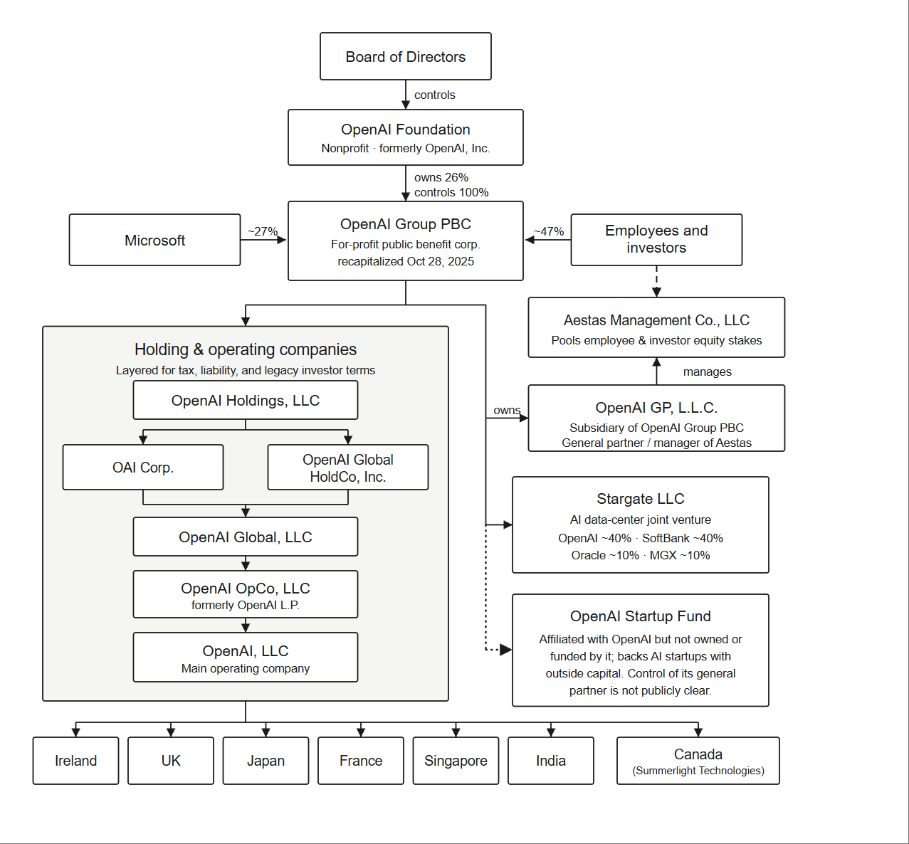

# 大模型: 一切的开端
## OpenAI: 我一开始没想挣钱的
- [wiki](https://en.wikipedia.org/wiki/OpenAI)
### 草莽开端
OpenAI在2015年以非盈利公司的性质成立,创始人有很多,但最值得关注的就是Elon Musk和Sam Altman,集资10亿美元.公司一开始的口号是**ensuring that artificial general intelligence (AGI) "benefits all of humanity"**,这与这家公司如今的现状可不太一样.

尽管OpenAI的薪资待遇不如Facebook或者Google那样优渥,但还是吸引了不少优秀的神经网络科学家,有了这些大佬在,OpenAI的口号看上去也不是那么不切实际了
### 研究成果
这部分我只做一个时间线的简单说明:
1. 2018年: 提出GPT-1,认为模型只需要经过大量的自监督训练和简单的监督数据微调就可以适配多种任务,这一思想颠覆了整个深度学习领域的以往认识
2. 2019年: 提出GPT-2,提出了更为激进的观点,认为模型不需要任何的监督数据微调,只通过适当的语料进行自监督训练就可以适配多种NLP任务.
3. 2020年: 提出GPT-3,大幅度增加了参数数量,达到了175B的大小,并发现这种规模的模型的能力超越了普通的NLP任务,它似乎能够真的理解你在说什么,这打开了新世界的大门,并创造了一个新词,大语言模型(large language model).
4. 2022年: 发布了基于GPT-3.5的ChatGPT,让大语言模型第一次实现了真正的落地,并震撼了全世界
5. 2023年: 发布了GPT-4,是第一款多模态大模型,具备了图像理解能力
6. 2024年: 发布了GPT-4o,性能上有了更好的优化
7. 2025年: 继GPT-4o3模型后,发布了GPT-5,引入了Thinking模式,并于当年的5月份推出了Codex智能体
8. 2026年: 发布了GPT-5.4/5.5,已经可以独立应付中小型的项目任务了;同时GPT-Image2的威力也不容小觑
### 转变目标
2019年,在看到GPT的巨大潜力后,OpenAI转型为盈利公司,由三个子公司组成:
1. OpenAI GP LLC: 普通合伙人(General Partner,GP)公司,负责公司的主要决策,并被非盈利的董事会进行管辖
2. OpenAI LP: 有限合伙公司(Limited Partnership),负责接受来自微软和其他风投机构的资金,投资回报率被设定为100倍
3. OpanAI Global LLC: 有限责任公司(Limited Liability Company),负责实际的研发任务和商业合作

- 在转型后,OpenAI的研究成果基本转向闭源模式,只提供有限的开源渠道.

2018年Elon Musk从CEO席位辞职后,一直由Sam Altman领导公司,2023年11月,Sam Altman被董事会[罢免](https://en.wikipedia.org/wiki/Removal_of_Sam_Altman_from_OpenAI),主要缘由大致是OpenAI内部分裂为了支持盈利模式和反对盈利模式的两派,Sam Altman的一些强力支持者因此而辞职,导致剩余的董事会成员得以投票并罢免他.尽管不久后Altman就恢复原职了,但这次冲突直接加剧了OpenAI向着盈利模式的演变.

2025年十月,OpenAI转型成为了PBC(Public Benefit Corporation)类公司,其中,OpenAI基金会持有PBC 26%的股份，微软持有27%的股份，剩余47%的股份由员工和其他投资者持有.这一重组象征着OpenAI彻底背离了最初设定的目标,离正式的融资上市想必也不久了

>之所以我们没怎么看到微软推出自己的大模型,是因为微软早就和OpenAI深度合作了,没必要自己再搞幺蛾子了.

## Anthropic: 娜拉走后怎样
- [wiki](https://en.wikipedia.org/wiki/Anthropic)

Anthropic由七个OpenAI的前员工在2021年一月成立,启动资金为1亿美金,由Daniela Amodei和Dario Amodei兄妹分别担任主席和CEO.

- 关于Dario Amodei的早期经历以及离开百度的原因,可以看[这篇文章](https://www.guancha.cn/economy/2025_09_09_789531.shtml)

Anthropic于2022年暑期就已经训练出了Claude的测试版本,但直到2023年三月才正式发布1.0版本,由于公司的底蕴并不深厚,所以一开始的表现平平无奇.

2024年,Anthropic推出了Claude 3.5 Opus和Sonnet,很多地方都超过了GPT-4,并在之后一路高歌猛进,吸引了大批量的融资,累积了不俗的人才底蕴和经济实力.

2025年5月,Anthropic正式发布了终端AI工具Claude Code和Claude 4,代码编写能力上已经稳稳站在了第一梯队,因此吸引了更多的融资,在2025年9月达到了1830亿美元的估值,并在26年5月份直接冲向接近1万亿估值,实际上超越了OpenAI在2026年3月的8520亿美元估值.

- 投资者也不是傻子,之所以能够吸这么多钱,那肯定是因为Anthropic确实有这个实力了.

>不管怎样,Anthropic实际上是踩着OpenAI的头上位了,后来者居上的事情不罕见,但"白手起家"还能后来居上的案例还是太少了.

## Google DeepMind: 明明是我先来的

## DeepSeek: 给世界带来一点中国震撼

# AI芯片公司: 上游市场

# API中转站: 灰色市场

# Agent/智能体: 被争抢的焦点版块

