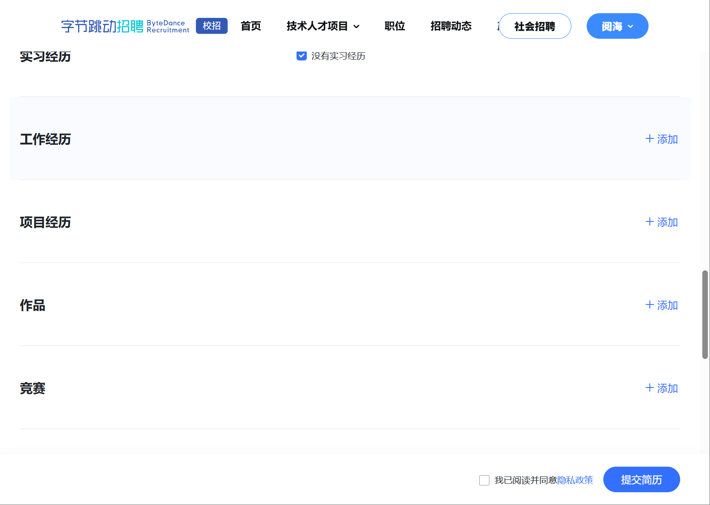

在了解了前两部分的内容后,我们就可以准备投递实习和面试了,显然,我们需要先有一份**简历**.
# 简历编写
## 简历模板
- [闻所未闻的动态简历](https://jirengu-inc.github.io/animating-resume/public/)
  - 这个模板让人耳目一新,但只适合前端工程师
- [可在线编辑的简历](https://visiky.github.io/resume/?template=template2&user=visiky)
  - 中规中矩,比较清晰,推荐使用
- [精美简历](https://github.com/salomonelli/best-resume-ever)
  - 需要专门去下载老版本的node才可以运行,根据issue和实测,至少大于18版本的node都不行
- [md格式简历](https://github.com/geekcompany/ResumeSample)
  - 没什么弯弯绕绕,也很好编辑
- [简历模板大集合](https://github.com/mmmlllnnn/ResumeCollection)
  - 如果都不满意,就来这里找适合自己的

写简历最难的地方就是找自己的优点了,我们需要通过一种实在的角度来夸自己,不过分包装,但要让自己显得很专业很厉害,需要一点语言上的基本功.
## 简历之外
有时候,公司的简历提交网站上除了提交简历之外还要你填写其他的内容:

所以我们需要将简历上没写的一些不是很重要的补充信息填上去,帮助面试官加深印象.
# 内推码
在有了简历之后,我们就可以去对应公司的官网投递了,由于内地公司盛行内推码(真不知道最早是哪个**小可爱**想出来的),所以你需要先去小红书/微信上搜索对应公司的内推码,一般直接搜就会有最新的内推码了,直接用就可以.
- 当然有认识的学长学姐更好,但正常来说不会这么凑巧吧...
# 准备面试
不管怎样,投递了简历之后就要开始准备面试了,面试中的问题大致有四种:
1. 算法题
2. 技术题(通常会拷打你简历上的项目)
3. 生活相关的提问
4. 反问环节

所以我们针对每一类题型都要做好相应的准备,接下来我重点谈谈两个环节: **算法题和反问环节**,技术题和生活题真全靠个人修养了.
# 算法题
刷题是面试的必备环节,尽管这些算法你以后再也不会在项目中用到,但还是需要你背得滚瓜烂熟.

至于为什么要考算法题,我之前看到有个人说的很好: **企业不敢招连算法题都不会的人**.

这本质上是一场服从性测试,如果你面试前连算法都不愿意去刷的话,你又怎么愿意为了这个公司付出更大的努力呢.

而由于面试的算法题跟竞赛题比起来简直是小儿科,因此基本只要**一个月每天刷个10道题**就可以秒杀所有的面试题了.如果你不满足于刷题的话,可以去看洛谷的**深入浅出系列**,并跟着题单来刷,保证可以快速入门算法.至于其他的算法书,由于不成体系或者体量过大,基本全都是狗屁...
# 反问环节
- 可参考GitHub仓库: reverse-interview-zh

**"你有什么想问的吗?"**,这个问题基本是面试的收尾必备环节,到了这一步你的表现其实已经不大重要了,毕竟该暴露的都已经暴露了...所以情商不要太低就行,随便问点问题水过去.

尽管如此,工程师一般都是心地淳朴(~~呆头呆脑~~)的人,所以有人特定总结了一点反问用的语句(根据上面的仓库总结):
## 职责
- 我的日常工作是什么？
- 有给我设定的特定目标吗？
- 团队里面初级和高级工程师的比例是多少？（有计划改变吗）
- 入职培训 (onboarding) 会是什么样的？
## 技术
- 公司常用的技术栈是什么？
- 你们怎么使用源码控制系统？
- 你们怎么测试代码？
## 团队
- 工作是怎么组织的？
- 团队内 / 团队间的交流通常是怎样的？
- 你们使用什么工具来做项目组织？你的实际体会是什么？
- 如果遇到不同的意见怎样处理？
- 不同的意见如何处理？
- 如果被退回了会怎样？（“这个在预计的时间内做不完”）
- 当团队有压力并且在超负荷工作的时候怎么处理？
- 如果有人注意到了在流程或者技术等其他方面又改进的地方，怎么办？
