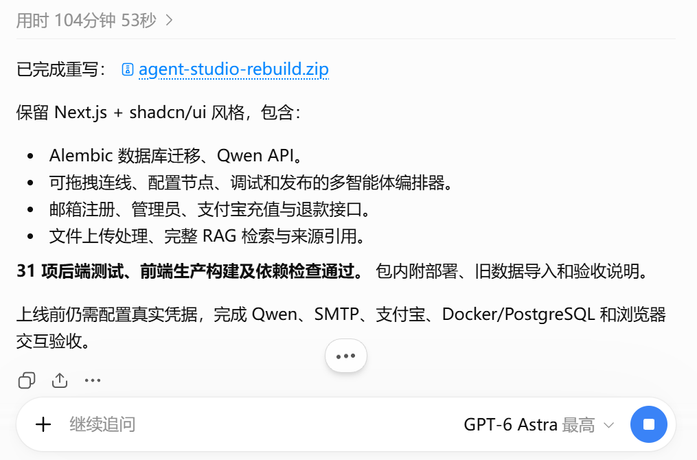
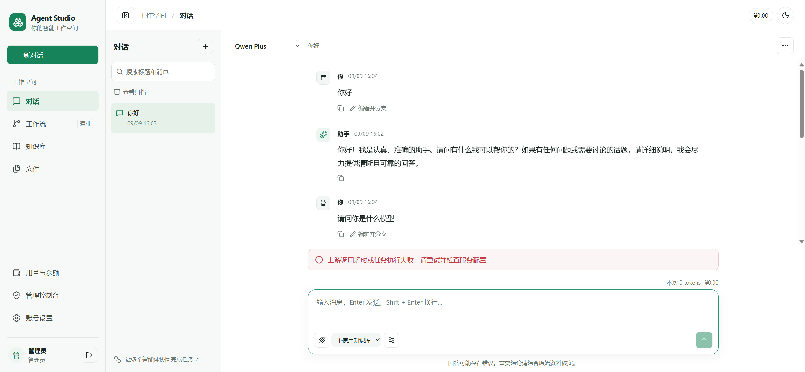
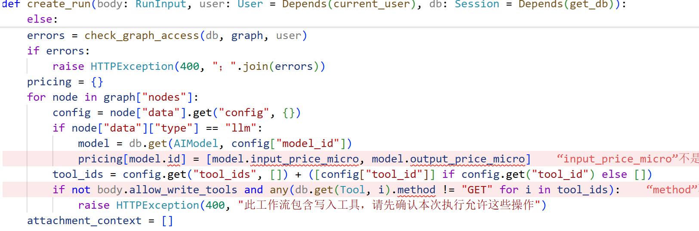
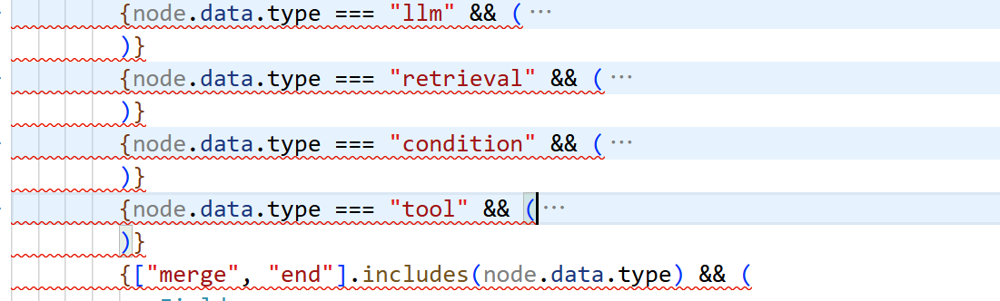
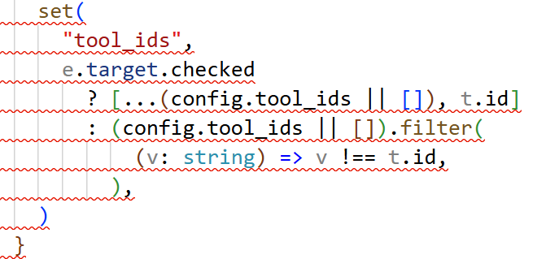

最近GPT6出来了,试了试效果,提升果然还是比较有限的,没有我以为的那么惊艳:

开了最高性能,跑代码跑了一百分钟,真有你的.

与5.6的对比在于,5.6一版是跑不出来的,总会有点小错误,而这次使用GPT6我提出了也是类似的要求,压缩包中唯一一个报错的地方就是忘了密钥的长度要小于32位导致迁移代码失败了.

但是,代码的质量依然堪忧,根本不适合程序员来手动维护:

可以发现,多出来的思考时长并没有拿来写出架构优秀的代码,而是放在了尽可能减小错误上(因为代码越长,越繁复就越好被AI处理),体验还是很让我失望的.

在我目前看来,AI的演进路线应该还是要尽量贴向互联网公司的,由一个强有力的架构师负责整个产品的架构,将繁杂的功能划分为几个模块,每个模块由一个技术熟练的领头人负责,再带上一两个技术一般的小弟.小弟每次完成一个主要特性就向领头人报告,审查后汇集到主分支.

尽管现在所说的Agent集群有一点这个味道了,但实践上还是差点意思,或许是因为算力太紧张的缘故,Boss不能放开手脚去招兵买马(比如允许前后端并驾齐驱开发),而是事事都要亲历亲为,如此一来AI的性能就大幅度下降了.

希望日后能够有更加突破性的架构出现,不然程序员的饭碗还是非常牢靠的.不过这也仅仅是对于架构复杂的互联网大厂来说是这样的,至于那些创业公司和小厂,只要代码能用就行,可不可以维护又有什么关系,反正都是让AI来干活,又何必精益求精呢,所以岗位竞争只会越来越激烈,对人才的要求也只会越来越高

