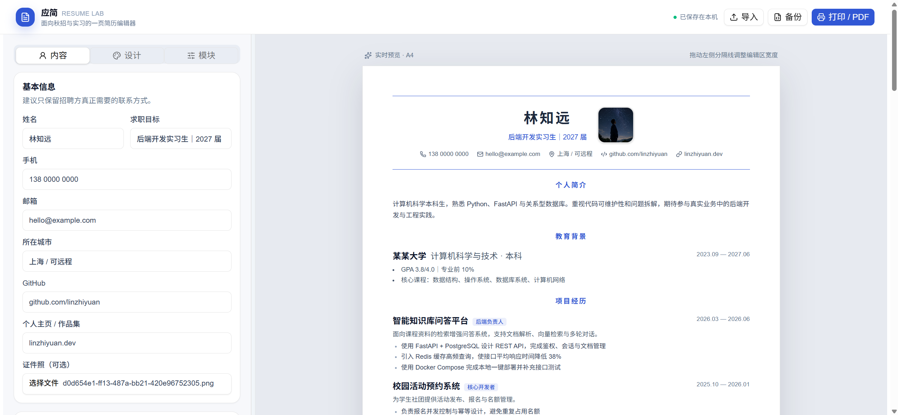

最近在用这个[简历模板](https://visiky.github.io/resume/?template=template2&user=visiky),但很多地方都不符合我的胃口,于是想着让GPT帮我生成一版更好用的,提示词如下:

```text
https://visiky.github.io/resume/?template=template2&user=visiky
查看一下这个网站,帮我生成一个更加美观的可在线编辑的简历网站,但是功能上差不多,不过是面向秋招和实习的,所以去掉工作经验一栏,并提供多种多样的选择,最好关键地方由用户自己定制
```

总共花了20min,结果咯噔一下给我弄了一个可公开访问的网站出来:



- [网站链接](https://grad-resume-studio.breezewind6579.chatgpt.site/)

看了一下源码,可维护性可以说是依托答辩,但架不住nmd确实能跑啊,这才是软件工程师的悲哀之处吧,明明AI写的确实很烂,但架不住自己的开发效率连它的百分之一都未必有啊.

不多说了,愿意试的就来看看这个网站吧,你别说真的比原版好用,在这里给原作者道个歉,我这不是和一个小偷没什么区别嘛.

