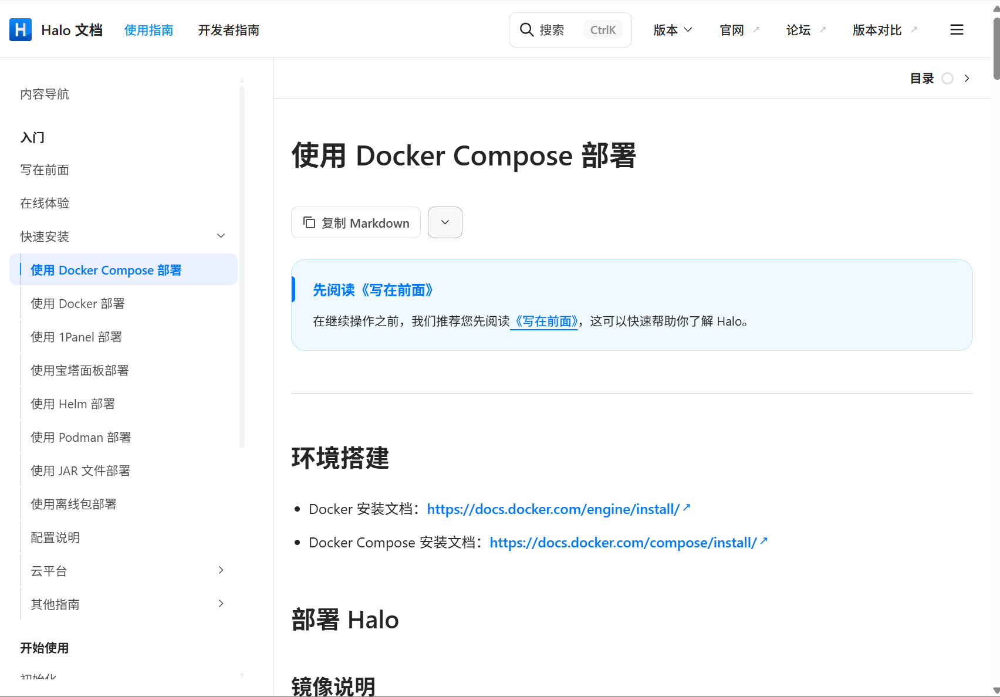
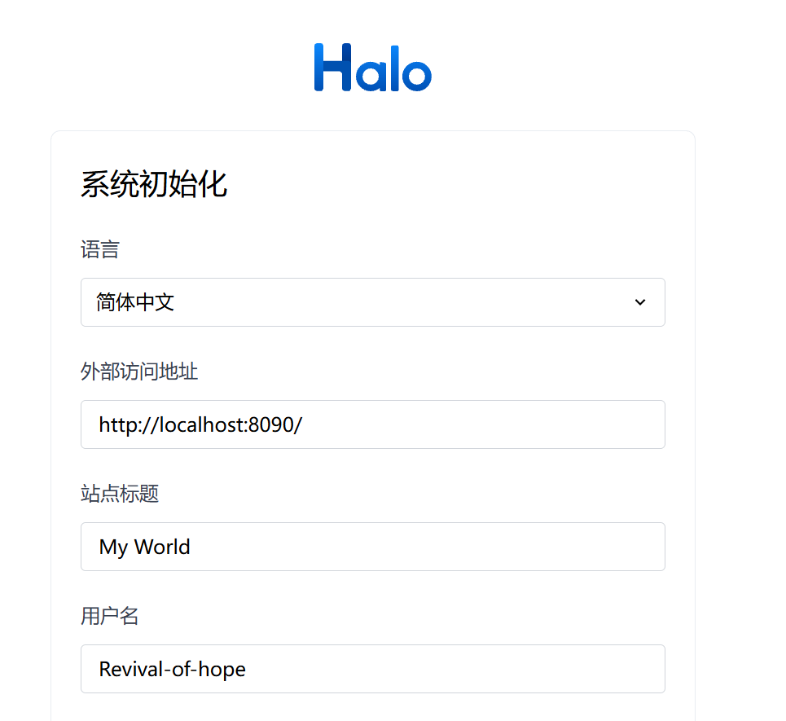
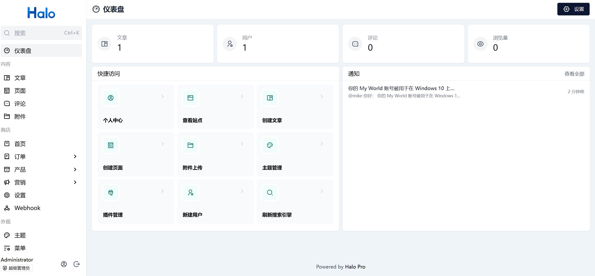
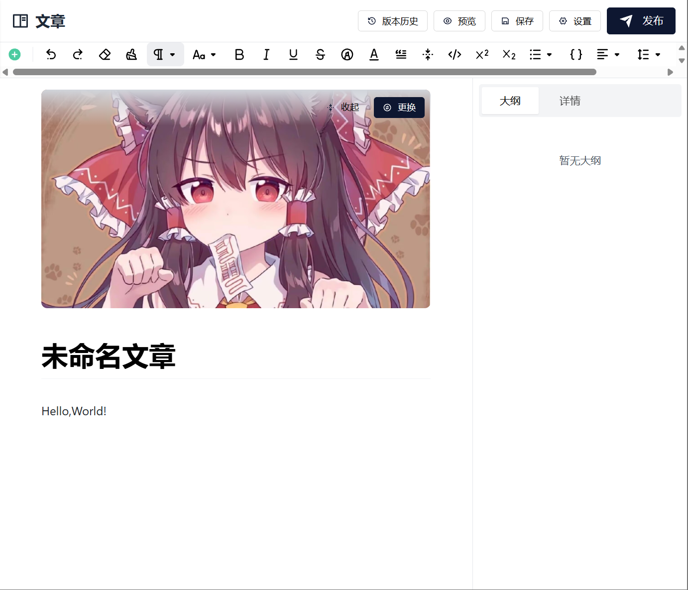
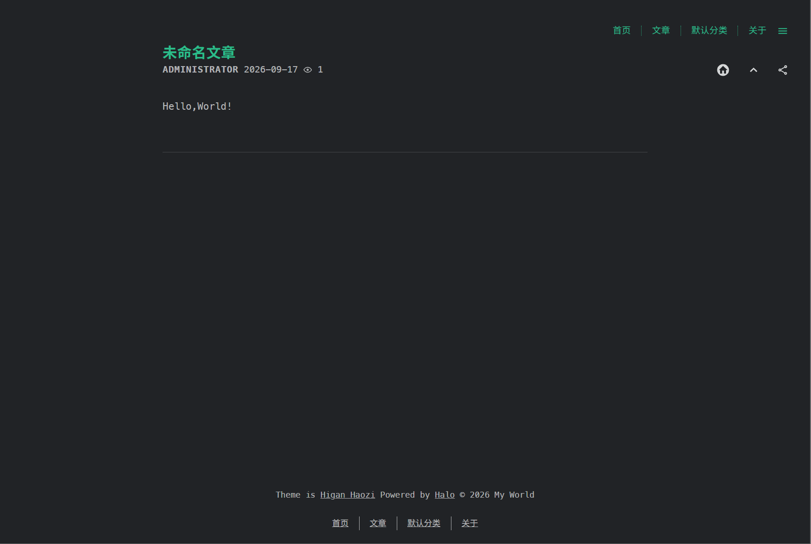

最近看到了halo这个博客框架,就想着来试试.

首先,由于halo是社区版和商业版并行的,所以文档做的非常好:



一看到支持`docker compose`部署,我眼睛都亮了,先试试创建一个`compose.yml`并运行:
```yml
services:
  halo:
    image: registry.fit2cloud.com/halo/halo-pro:2.26
    restart: on-failure:3
    depends_on:
      halodb:
        condition: service_healthy
    networks:
      halo_network:
    volumes:
      - ./halo2:/root/.halo2
    ports:
      - "8090:8090"
    healthcheck:
      test:
        ["CMD", "curl", "-f", "http://localhost:8090/actuator/health/readiness"]
      interval: 30s
      timeout: 5s
      retries: 5
      start_period: 30s
    environment:
      # JVM 参数，默认为 -Xmx256m -Xms256m，可以根据实际情况做调整，置空表示不添加 JVM 参数
      - JVM_OPTS=-Xmx256m -Xms256m
    command:
      - --spring.r2dbc.url=r2dbc:pool:postgresql://halodb/halo
      - --spring.r2dbc.username=halo
      # PostgreSQL 的密码，请保证与下方 POSTGRES_PASSWORD 的变量值一致。
      - --spring.r2dbc.password=openpostgresql
      - --spring.sql.init.platform=postgresql
      # 外部访问地址，请根据实际需要修改
      - --halo.external-url=http://localhost:8090/
  halodb:
    image: postgres:16-alpine
    restart: on-failure:3
    networks:
      halo_network:
    volumes:
      - ./db:/var/lib/postgresql/data
    healthcheck:
      test: ["CMD", "pg_isready"]
      interval: 10s
      timeout: 5s
      retries: 5
    environment:
      - POSTGRES_PASSWORD=openpostgresql
      - POSTGRES_USER=halo
      - POSTGRES_DB=halo
      - PGUSER=halo

networks:
  halo_network:
```
然后打开默认端口,首先是初始化界面:



注册后没能直接给我跳到404我也是没招了,官方文档上解释要先到console路由去看看,打开一看,确实很惊艳:



然后新建文章:



点击发布后再访问,还是给我404了:


额,尽管文档中没说,但我问了AI后发现要先选一个主题,选了主题后Halo才知道要怎么渲染我这个页面,随便选了一个主题后效果如下:



而且,主题的切换十分简单,想用什么样式就用什么样式:


总的来说,确实可以,但唯一的缺点就是不太符合我的使用习惯呢,因为我喜欢一边粘贴图片/引用一边写作,而这种在线编辑界面弄起来就远不如VScode方便了,每次都要上传图片和文件才可以进行引用,还是差点意思.

