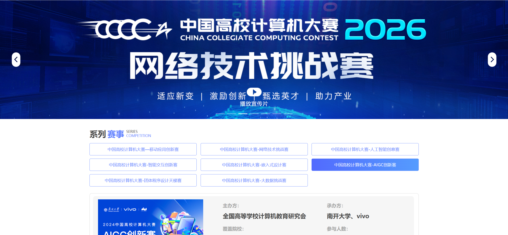

如果你不知道要打什么比赛,可以稍微参考一下这个表格:

| 竞赛名称                          | 量级 | 核心任务                                                                  | 报名与截止时间 (参考)                 | 官方网站                                                                 |
| --------------------------------- | ---- | ------------------------------------------------------------------------- | ------------------------------------- | ------------------------------------------------------------------------ |
| **ACM-ICPC (WF)**                 | 1    | 3人1机，数小时内现场编写算法解决 10+ 难度极高的程序设计题。               | **WF (全球总决赛):** 需通过区域赛晋级 | [icpc.global](https://icpc.global/)                                      |
| **ACM-ICPC (Region)**             | 0.9  | 亚洲区预选赛，争夺进入全球总决赛的资格，题目难度与 WF 衔接。              | **报名:** 8-9月；**截止:** 10月       | [icpc.global](https://icpc.global/)                                      |
| **CCPC 全国大学生程序设计竞赛**   | 0.9  | 国内最高规格的算法竞赛，侧重于纯算法逻辑、复杂数学建模与代码实现。        | **报名:** 8-9月；**截止:** 10月       | [ccpc.io](https://ccpc.io/)                                              |
| **全国大学生计算机系统能力大赛**  | 0.9  | 俗称“龙芯杯”或“编译/OS挑战赛”，需自研 CPU、编译器或操作系统底层。         | **报名:** 3-5月；**截止:** 8-9月      | [pacc.ict.ac.cn](https://www.google.com/search?q=http://pacc.ict.ac.cn/) |
| **C4-大数据挑战赛/天梯赛**        | 0.8  | 大数据赛侧重海量数据挖掘预测；天梯赛考核团队算法平均解决能力。            | **报名:** 3-5月；**截止:** 7-8月      | [c4contest.com]()                                                        |
| **全国大学生信息安全竞赛**        | 0.8  | **作品赛:** 开发安全工具系统；**创新实践赛:** CTF 夺旗对抗模式。          | **报名:** 3-5月；**截止:** 6月        | [ciscn.cn]()                                                             |
| **全国大学生电子设计竞赛**        | 0.7  | 4天3夜封闭赛制，现场根据题目要求设计电路、焊接并编写嵌入式代码。          | **报名:** 4-6月；**单/双年赛制**      | [nuedc.xjtu.edu.cn]()                                                    |
| **全国大学生物联网设计竞赛**      | 0.7  | 结合传感器、云平台与边缘计算，开发完整的物联网垂直领域应用系统。          | **报名:** 4-6月；**截止:** 8月        | [iot.sjtu.edu.cn]()                                                      |
| **华为 ICT 大赛 (AI/网络)**       | 0.7  | 学习并运用华为自研平台（昇腾/鲲鹏等）解决 AI 算法开发与网络部署。         | **报名:** 9-11月；**截止:** 12月      | [e.huawei.com]()                                                         |
| **百度之星·程序设计大赛**         | 0.7  | 百度主办，包含经典算法竞赛与紧跟技术前沿（如 AI 调度）的工程赛。          | **报名:** 5-7月；**截止:** 8月        | [astar.baidu.com]()                                                      |
| **ISCC 信息安全与对抗技术竞赛**   | 0.7  | 开展 CTF 夺旗赛与模拟实战对抗，侧重于渗透测试与漏洞分析。                 | **报名:** 4-5月；**截止:** 6月        | [isclab.org.cn]()                                                        |
| **中国大学生计算机设计大赛**      | 0.7  | 涵盖软件开发、微课、数字媒体等，要求提交完整的计算机应用作品。            | **报名:** 3-4月；**截止:** 5-6月      | [jsjds.blcu.edu.cn]()                                                    |
| **蓝桥杯**                        | 0.7  | 规模最大的个人赛，考察常用算法数据结构或嵌入式开发实操能力。              | **报名:** 10-12月；**截止:** 次年1月  | [lanqiao.cn]()                                                           |
| **“中国软件杯”**                  | 0.7  | 企业实际命题，开发具备商业价值或解决工业痛点的软件系统。                  | **报名:** 3-5月；**截止:** 7月        | [cnsoftbei.com]()                                                        |
| **中国大学生服务外包大赛**        | 0.7  | 模拟企业真实外包项目，涉及金融、医疗等领域的软件架构与落地。              | **报名:** 11-12月；**截止:** 次年3月  | [fwwb.org.cn]()                                                          |
| **全国大学生软件创新大赛**        | 0.7  | 强调创新性，通常有特定主题（如 AI 驱动的移动端软件开发）。                | **报名:** 10-11月；**截止:** 次年4月  | [swcontest.com.cn]()                                                     |
| **Apple WWDC Scholarship**        | 0.7  | 使用 Swift 语言设计并制作一个具有创意、互动性强的 Swift Playground 作品。 | **报名:** 2-3月；**截止:** 4月        | [developer.apple.com]()                                                  |
| **微软"创新杯" (Imagine Cup)**    | 0.7  | 利用 Azure 云平台和 AI 技术解决社会或商业领域的复杂挑战。                 | **报名:** 10-12月；**截止:** 次年1月  | [imaginecup.microsoft.com]()                                             |
| **中美青年创客大赛**              | 0.7  | 48小时黑客松或作品展示，利用开源软硬件开发解决可持续发展的产品。          | **报名:** 5-6月；**截止:** 7月        | [cscse.edu.cn]()                                                         |
| **全国大学生数学建模竞赛**        | 0.7  | 3人组队在 72 小时内针对复杂工程问题建立数学模型并编程求解。               | **报名:** 5-6月；**截止:** 9月初      | [mcm.edu.cn]()                                                           |
| **C4-AIGC/人工智能创意赛**        | 0.5  | 使用大模型、深度学习技术设计 Agent 或内容生成类创新应用。                 | **报名:** 4-5月；**截止:** 5月下旬    | [c4contest.com]()                                                        |
| **CCF CCSP 计算机系统与程序设计** | 0.5  | 考察个人对算法与底层系统（如文件系统、指令集）综合实现的硬实力。          | **报名:** 8-9月；**截止:** 10月       | [ccsp.ccf.org.cn]()                                                      |
| **CCF BDCI (大数据与计算智能)**   | 0.5  | 真实工业数据集下的算法挑战，如推荐算法、风控、时序预测等。                | **报名:** 9-11月；**截止:** 12月      | [datafountain.cn]()                                                      |
| **强网杯/网鼎杯**                 | 0.5  | 国家级高水平 CTF 赛事，涵盖 Pwn、Reverse、Web 等全方位攻防技巧。          | **报名:** 5-6月；**视具体赛季而定**   | [qiangwangcup.com]()                                                     |
| **全球校园 AI 算法精英大赛**      | 0.5  | 针对计算机视觉、自然语言处理等垂直领域的算法模型优化比拼。                | **报名:** 9-10月；**截止:** 11月      | [caia.org.cn]()                                                          |
| **“西门子杯”智能制造赛**          | 0.5  | 利用西门子软硬件平台，针对离散或过程控制进行仿真建模与调试。              | **报名:** 3-5月；**截止:** 6月        | [siemenscup-cimc.org.cn]()                                               |
| **中国高校智能机器人创意大赛**    | 0.5  | 设计具备特定功能的机器人原型，涉及机械设计、电子控制与视觉算法。          | **报名:** 3-5月；**截止:** 6-7月      | [robotcontest.cn]()                                                      |
| **中国机器人大赛 (RoboCup)**      | 0.5  | 包含足球机器人、救援机器人等，考验多机协同与实时计算机视觉。              | **报名:** 4-6月；**截止:** 8-9月      | [rcccaa.org]()                                                           |
| **睿抗机器人开发者大赛 (RAICOM)** | 0.5  | 开发具有自主导航、智能抓取等能力的各种轮式或足式机器人系统。              | **报名:** 3-5月；**截止:** 6月        | [raicom.com.cn]()                                                        |
| **全国大学生智能汽车竞赛**        | 0.5  | 制作自主寻线竞赛小车，涉及运动控制算法、传感器融合与 PID 调试。           | **报名:** 11-12月；**截止:** 次年3月  | [smartcar.cdhu.edu.cn]()                                                 |
| **全国集成电路创新创业大赛**      | 0.5  | 涉及芯片设计（数字/模拟）、EDA 工具应用及电路系统优化。                   | **报名:** 1-3月；**截止:** 4月        | [univ.ciciec.com]()                                                      |
| **中国机器人及人工智能大赛**      | 0.5  | 集成 AI 算法于机器人平台，实现人机交互、自主决策等功能。                  | **报名:** 4-6月；**截止:** 8月        | [caia.org.cn]()                                                          |
| **全国大学生嵌入式设计竞赛**      | 0.5  | 基于特定芯片平台开发创新系统，涉及底层驱动、RTOS 及应用开发。             | **报名:** 3-4月；**截止:** 5-6月      | [embeddedcontest.org]()                                                  |
| **全国大学生三创赛 (电子商务)**   | 0.5  | 偏重商业方案与软件实现的结合，需开发原型系统并撰写策划书。                | **报名:** 10-12月；**截止:** 次年3月  | [3chuang.net]()                                                          |
| **全国大学生数学竞赛 (非数)**     | 0.5  | 纯纸笔考试，考察高等数学的理解与解题技巧。                                | **报名:** 9-10月；**考试:** 11月      | [cmathc.cn]()                                                            |
| **全国大学生统计建模大赛**        | 0.5  | 利用统计学方法、机器学习模型对社会经济数据进行深度挖掘分析。              | **报名:** 3-4月；**截止:** 5月        | [tjjm.univs.cn]()                                                        |
| **SAS 数据分析大赛**              | 0.5  | 使用 SAS 软件进行大规模数据处理、统计建模与商业预测。                     | **报名:** 8-9月；**截止:** 10月       | [sas.com]()                                                              |
| **国际遗传工程机器大赛 (iGEM)**   | 0.5  | 结合合成生物学与计算机建模（Dry Lab），设计基因电路并进行仿真。           | **报名:** 1-3月；**截止:** 4月        | [igem.org]()                                                             |
计算机专业大学生可以接触到的比赛大致可以以下三类:

需要注明的是中国高校计算机大赛系列赛事一共有八个,一般来说总会有你擅长的那个:

大致可以分成以下四类:
1. 算法类比赛: 难度普遍较高,到最后考的都是数学
2. 网络安全类比赛: 门槛高,领域深,内容多
3. 软件类/商业类比赛: 难度最低,一般占比更多的反而是计划书和吹牛能力
4. 硬件类比赛: 难度也很高,和硬件打交道,设计系统机构,做机器人和嵌入式.

如果你对自己的算法能力有自信或者觉得算法不难,可以稍微瞅一眼百度之星的往年决赛题,如果有自信可以经过一段时间的学习后解决它的话,那就建议打算法比赛.

如果你对自己的硬件能力有自信,能够搞得懂各种嵌入式的话,可以试试硬件类.

网络安全类比赛需要自己真的感兴趣才可以去打,比较耗精力.

不管怎样,对于我这个菜鸡来说,适合就只有软件设计类比赛了,我接下来也会逐一简单介绍几个我个人比较感兴趣的比赛

## 中国高校计算机大赛-移动应用创新赛
- [一个很详尽的说明](https://jluios.club/competitions/maic/)

该比赛说是移动应用,但实质上做的是ios应用,因为是苹果公司主办的,需要使用Swift进行开发,分为三个赛道:

**启迪赛道**
>启迪赛道的参赛作品须为具有一定功能的原创性应用程序（App），适合具有App开发人员的团队。每支参赛队最多由3名队员组成。共设国奖共近60个名额，具体奖项设置可前往竞赛官网查看。奖品丰厚，最高奖团队总计可获得总价值约 12 万元的苹果全家桶奖励。获奖团队有机会直推互联网+全国总决赛。

**启明赛道**
>启明赛道的作品须提供iOS/iPadOS系统设计开发的应用程序原型，适合只有设计人员的团队。每支参赛队最多由2名队员组成。复赛获奖团队有机会转至启迪赛道参与全国总决赛，组委会将为其在比赛官方平台发布队员招募通知。

**启航赛道**
>采用邀请制+报名制，鼓励曾参加过竞赛的上架作品，或是有创业、宣传需求的毕业生（五年内），参加竞赛。要求 App 必须上架 App Store 或 Testflight 可运行。关注作品商业模式与商业前景，选择启航赛道的参赛队伍必须提交商业计划书（10页以内）及作品下载链接，可自主选择提交作品介绍视频。

## 微软创新杯(Imagine Cup)
- [一个比较详尽的说明](https://www.hanlin.com/imagine-cup)

这个比赛的商业能力远超过代码能力,只要有一个还算说得过去的项目就能参赛,但是要拿奖还是需要一点包装和技术实力的.

