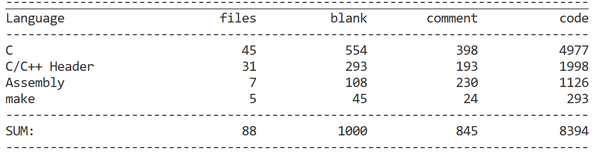

# 基本概念

## 常用终端命令
### 文件操作
1. pwd: print working directory,显示当前目录
2. ls: list,列出当前目录的文件
3. cd: change directory,切换目录
4. clear: 清屏
5. touch: 创建新文件
6. cat: catenate,输出文件内容
7. head/tail: 查看文件开头末尾
8. wc: word count,统计该文件的行数/词数
9. mkdir: make directory,创建目录(文件夹)
10. cp: copy,复制文件,如`cp a.txt b.txt`
11. rm: remove,删除文件,`rm -r`为删除目录,`rm -rf`为递归删除该目录
12. find: 按照条件查找目标文件,如`find . -name "*.txt"`
13. grep: `global regular expression print`,在文本中搜索内容,如`grep "error" app.log`

# Linux

## Linux0.01分析
### 前期准备
1. 从[这个网站](https://seiya.me/blog/reading-linux-v0.01)下载Linux0.01,博主的分析也是不错的
2. 下载[cloc](https://github.com/AlDanial/cloc/releases)用于代码行数统计,这就是Linux0.01的全部代码:

