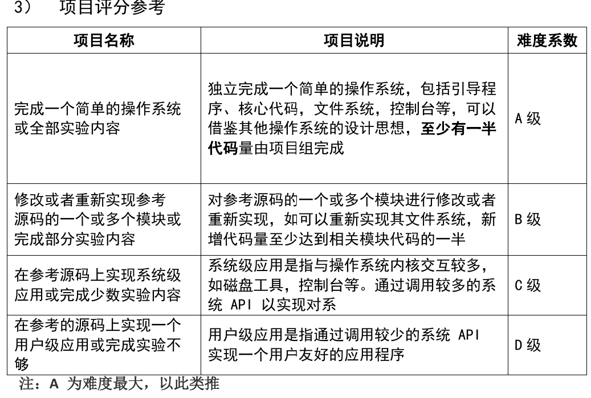
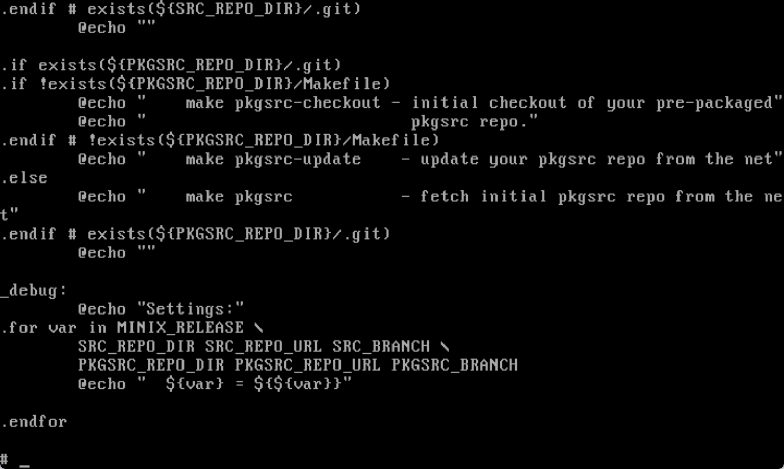

# 基本概念
## 操作系统历史
- [wiki](https://en.wikipedia.org/wiki/History_of_operating_systems)
  - 以前我都是把内容直接丢给AI让它来总结的,但现在我还是想自己来总结,或许会更有趣一点.


## 常用终端命令
### 文件操作
1. pwd: print working directory,显示当前目录
2. ls: list,列出当前目录的文件
3. cd: change directory,切换目录
4. clear: 清屏
5. touch: 创建新文件
6. cat: catenate,输出文件内容
7. head/tail: 查看文件开头末尾
8. wc: word count,统计该文件的行数/词数
9. mkdir: make directory,创建目录(文件夹)
10. cp: copy,复制文件,如`cp a.txt b.txt`
11. rm: remove,删除文件,`rm -r`为删除目录,`rm -rf`为递归删除该目录
12. find: 按照条件查找目标文件,如`find . -name "*.txt"`
13. grep: `global regular expression print`,在文本中搜索内容,如`grep "error" app.log`


# MINIX
## 前言
操作系统课程设计这门课有以下选题:
a. 完成《Orange's:一个操作系统的实现》项目要求

b. 完成 xv6 相关要求，要求详见《xv6 及 Labs 课程项目》文档说明：相关文档见课程群文件共享目录 “OS 小学期课程设计”

c. 蒋炎岩老师课程（[http://jyywiki.cn/OS/2026](http://jyywiki.cn/OS/2026)）配套的实验（包括系统实验+编程实验）

d. 完成对 Minix 操作系统的学习，详见 [http://www.minix3.org/](http://www.minix3.org/)

e. Linux 内核分析（版本号要求 2.0 以上）

f. 自选（需和老师确认选题）

由于我非常怕麻烦,所以就只锁定了d和e两个选题,由于从来没有听过minix这个东西,就先下载了minix3.3.0版本的代码,看了下代码量:

```bash
---------------------------------------------------------------------------------------
Language                             files          blank        comment           code
---------------------------------------------------------------------------------------
C++                                   8814         249768         336958        1389982
C                                     7887         244437         460398        1383144
C/C++ Header                          5153         173451         306565         608482
LLVM IR                               7436          80241         138815         364744
Assembly                              1840          29324         112588         242373
Bourne Shell                           499          21483          27468         167584
TableGen                               263          19768          25094         121916
Text                                   446          12574              0          58015
reStructuredText                       136          18436          13834          42693
Objective-C                           1121          11805          56441          41555
make                                  2157          10942           9183          40481
m4                                      99           3420           1253          32355
HTML                                    49           5479            362          32096
diff                                    18           2052          13010          22200
Python                                 137           4210           5295          16198
Objective-C++                          299           3328          21787          11467
PO File                                 16           2945           3635           9611
yacc                                    33           1584           1174           9143
BitBake                                348           1394            851           9091
Windows Module Definition               41           1061              9           7836
CMake                                  277           1298            968           7458
MSBuild script                          13              1              7           6162
XML                                     61            721            207           6083
Perl                                    29           1326           1280           5667
TeX                                      1            731           2941           5619
OCaml                                   68           1718           2918           5250
lex                                     84           1371           1801           4777
Pascal                                  18           1031           3956           2468
CSS                                     19            243            142           2074
Ada                                     10            599            560           1681
Gencat NLS                              14              5           1587           1620
SQL                                      7            295            613           1569
PHP                                     20            265            470           1498
GLSL                                     1              0              0           1368
awk                                     30            138            381           1121
Snakemake                                2            603           2417           1100
C#                                      14            247            571           1080
JavaScript                               7            159            211            817
OpenCL                                  62            280            299            764
XSLT                                     4             89             56            754
Bourne Again Shell                       9            129            157            685
DOS Batch                               10             93              6            638
Korn Shell                               3             90            135            595
Expect                                  13             58              0            575
Logos                                    2             38             14            528
Lua                                     21            101             92            507
Lisp                                     6             82            205            442
SWIG                                     1              0              0            347
YAML                                    15             55            157            292
Visual Studio Solution                   4              2              2            259
sed                                      7              7             88            259
Tcl/Tk                                   4             22             14            234
C Shell                                  3             40             21            233
Windows Message File                     2             23             46            224
Windows Resource File                    9             15             38            188
Clojure                                  2             42              0            174
R                                       29              2              0            162
CUDA                                    11             63             57            120
vim script                               2             23             21            119
JSON                                     5              6              0            117
Pawn                                     1             20              3             65
Igor Pro                                19              1              0             52
Brainfuck                                1              0              7             49
C# Designer                              1              9             23             32
SAS                                      1             14             19             32
NAnt script                              1              7              0             26
DTD                                      1              8             33             20
IDL                                      1              0              0             20
AppleScript                              1              3              8             16
Markdown                                 1              1              0             16
INI                                      1              1              0              6
Fortran 90                               1              0            244              0
---------------------------------------------------------------------------------------
SUM:                                 37721         909777        1557495        4676928
---------------------------------------------------------------------------------------
```

比起Linux肯定是要简单不少的,所以就直接开始学吧.

不过说是分析,其实需要仿照着结构搭建几个功能相近的模块出来,可不是写个实验报告这么简单的事.



显然,这个要求非常的随意,说明老师也非常的佛性,不过也不能随便应付了事,学点真东西为好.

## 概览
### 试运行MINIX
首先从官网下载打包好的镜像,并用Virtualbox(Oracle的开源虚拟机)试着运行一下,看看效果.

AI推荐的配置是这样的:
```md
名称：MINIX3
类型：Other
版本：Other/Unknown
内存：512 MB 或 1024 MB
硬盘：VDI，动态分配，2 GB 到 8 GB 都可以
```


在输入`root`和`setup`后,就会进入漫长的操作系统安装环节,还是很有意思的.


MINIX没有图形界面,只有终端,不少命令和Linux是通用的,所以用起来还是很清爽的.


不过遗憾的是,MINIX不支持鼠标操作,所以无法应付长文本的显示:



### 学习MINIX
非常离谱的是,官方的代码仓库甚至没有一个ReadMe文件,而上官网查询后,有以下说明:

>The **main documentation** for MINIX 3 is the book Operating Systems: Design and Implementation 3/e by **Andrew S. Tanenbaum** and Albert S. Woodhull, Prentice Hall, 2006. 

- 谁能想到在这里也能看到这位大牛.

不过说实话这有点搞笑,号称开源,却不公开文档,而是把文档放在商业出版的书里面.没有办法,只好老老实实去看书了.(由于与这篇文章的主线无关,所以我直接放入阅读笔记中,之后再回来做一个总结.)

**(7.5)**
我以为这本书会涉及很多内容,但后来发现它只深入讲了minix子文件夹中的几个子模块:
1. kernel: 核心代码,用于进程调度
2. drivers: 驱动程序
3. servers: 进程管理和文件系统

然后这本书对于这些子模块的讲解是相当繁琐的,试图一下子塞给你一大堆概念,并在源代码的讲解上相当随意.

没有法子,只好硬着头皮先看源码了,再拿这本书当参考书,因为整个MINIX仓库没有一个真正意义上的Readme文件,我非常好奇他们内部是怎么开发的,难不成通过托梦来告诉新人怎么看源码吗.


