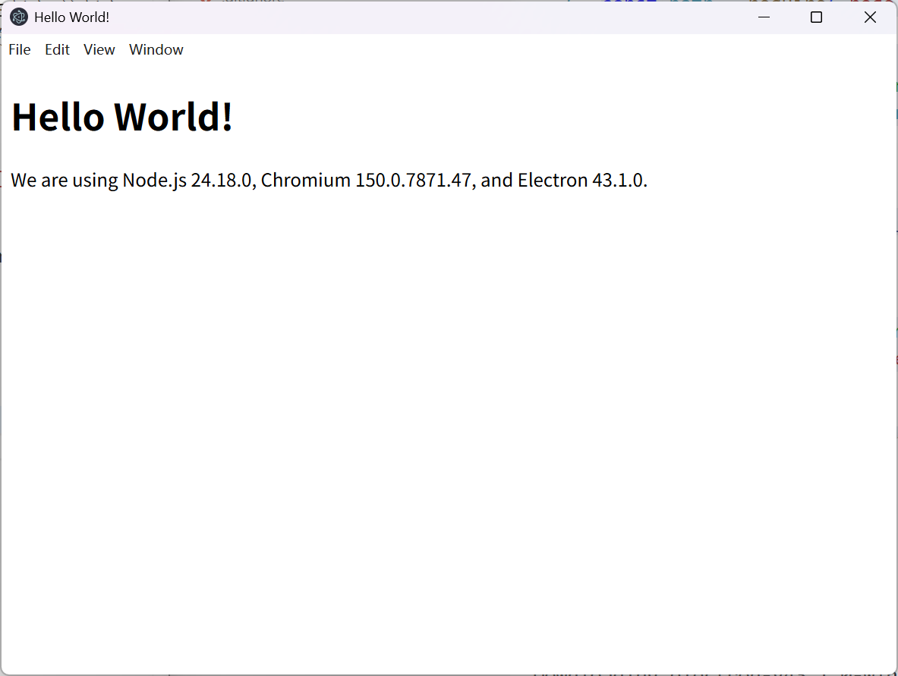
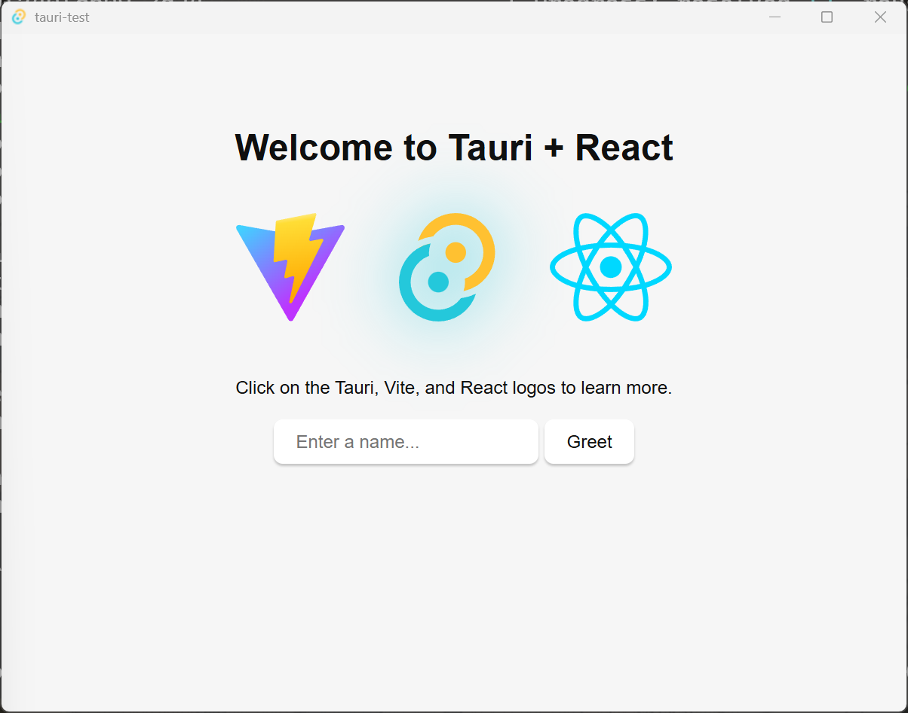

## 前言
试想一下,当你辛辛苦苦学了好几个月,能够勉强搭出一个前后端网站时,你却发现只能把它部署在服务器上,要是能够简单的把它变成桌面应用和手机应用该有多好啊!

于是,就让我们来看一下将网站变成应用程序的几个常见方法.

## 桌面端
### Electron
#### 介绍
- [wiki](https://en.wikipedia.org/wiki/Electron_(software_framework))

Electron是由Github在13年发布的开源打包框架,可以把你的前端应用变成桌面端上的应用程序,著名的应用由VScode,Github Desktop等

Electron

缺点是更新太快,但社区活力不够,截止发布了v43版本的当下,官网的文档还是用的22年11月发布的v23版本,这版本号都翻倍了,而且文档里用的还是CommonJS,你就说这怎么看.
#### 基本架构
运行以下命令获取官方的模板项目:
```bash
git clone https://github.com/electron/minimal-repro.git electron-learn
```
- 很遗憾的是,这个模板项目用的也还是CommonJS

根据Readme文档启动该项目,效果如下:


看一下主要文件`main.js`:
```js
const { app, BrowserWindow } = require('electron')
const path = require('node:path')

function createWindow () {
  // Create the browser window.
  const mainWindow = new BrowserWindow({
    width: 800,
    height: 600,
    webPreferences: {
      preload: path.join(__dirname, 'preload.js')
    }
  })

  // and load the index.html of the app.
  mainWindow.loadFile('index.html')

}

app.whenReady().then(() => {
  createWindow()

  app.on('activate', function () {
    // On macOS it's common to re-create a window in the app when the
    // dock icon is clicked and there are no other windows open.
    if (BrowserWindow.getAllWindows().length === 0) createWindow()
  })
})

app.on('window-all-closed', function () {
  if (process.platform !== 'darwin') app.quit()
})

```
可以看到Electron的底层与普通的浏览器引擎并没有太大区别,多出来的这些函数也都是调用操作系统接口的封装而已.

总的来说,目前要学习Electron,就需要忍受陈旧的文档和全新的界面操作函数,市面上关于Electron的新书也是聊胜于无,而且不能够复用面向网站的前端写法,后端只能用api调用来实现,开发体验给个2星.

## 手机端


## 多端
### Tauri
#### 介绍
-[wiki](https://en.wikipedia.org/wiki/Tauri_(software_framework))

Tauri是于20年发布的构建工具,支持所有主流桌面和移动平台,比起Electron更加有活力,但由于技术栈比较新,所以基本没有大公司会有Tauri来构建应用.
#### 基本架构
```bash
pnpm create tauri-app tauri-test
cd tauri-test
pnpm install
pnpm tauri dev
```
运行上述命令后可以构建出以下界面:



项目结构如下:
```bash
.
├── package.json
├── index.html
├── src/
│   ├── main.js
├── src-tauri/
│   ├── Cargo.toml
│   ├── Cargo.lock
│   ├── build.rs
│   ├── tauri.conf.json
│   ├── src/
│   │   ├── main.rs
│   │   └── lib.rs
│   ├── icons/
│   │   ├── icon.png
│   │   ├── icon.icns
│   │   └── icon.ico
│   └── capabilities/
│       └── default.json
```

最显眼的地方在于,前端界面可以使用诸如Nextjs等现代前端框架,因为Tauri是通过Webview组件实现应用包装的.

至于后端,可以使用Rust来编写,也可以通过api来调用.这一点也很不错,开发体验给个4.5星.
### React Native
#### 介绍
- [wiki](https://en.wikipedia.org/wiki/React_Native)

React Native由Facebook于15年发布的多平台(除了Linux)打包框架.

### Flutter

