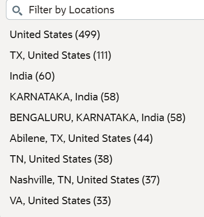
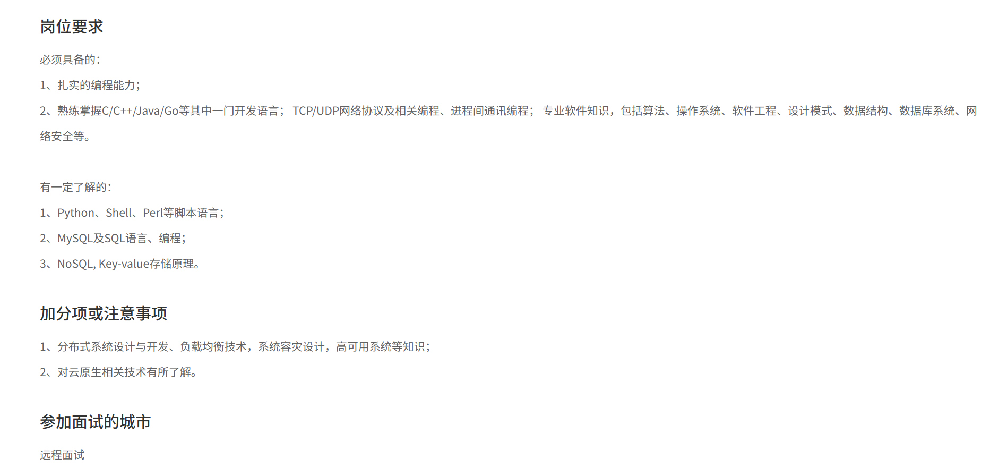

在了解了可以面试哪些岗位之后,就可以根据自己想去的岗位来投递自己的意向公司了,但是参加面试之前总得对自己要面试的公司有个了解吧,因此我在这里介绍了一些常见的大型互联网公司.

该文对于一个公司的调研主要分为以下四点:
1. 公司概况: 快速了解这家公司
2. 公司历史: 公司的发展历史
3. 主要产品: 该公司的优秀产品
4. 招聘需求: 内地应聘的条件和要求


# 国际企业
该类企业有以下优缺点:
1. 工资较高,福利好,无996
2. 晋升难
3. 难外调(relocate)
4. **招聘岗位少**,竞争激烈,大牛多

由于招聘岗位少,招聘需求部分就不贴具体岗位分析了,只写一点吐槽
## Microsoft (微软)
### 公司概况
### 公司历史
- [Wiki](https://en.wikipedia.org/wiki/Microsoft)
### 主要产品
### 招聘需求
[招聘官网](https://apply.careers.microsoft.com/)
公众号: 微软招聘

内地的招聘岗位主要在北京,上海,苏州,岗位很少,但比谷歌已经多不少了.
## Google (谷歌)
### 公司概况
### 公司历史
- [Wiki](https://en.wikipedia.org/wiki/Google)
### 主要产品
### 招聘需求
[招聘官网](https://www.google.com/about/careers/applications/)
公众号: 谷歌招聘包打听

之所以内地很少看见有人应聘谷歌是因为它在内地的岗位确实少,而且产品人员招的比技术人员多...

- [大牛的上岸分享](https://zhuanlan.zhihu.com/p/362736343)
## Apple (苹果)
### 公司概况
### 公司历史

- [Wiki](https://en.wikipedia.org/wiki/Apple_Inc.)
### 主要产品
### 招聘需求
[招聘官网](https://www.apple.com/careers/cn/)
公众号: Apple招聘

招聘岗位比起谷歌和微软都多上不少,但产品人员和硬件开发招的比较多,软件开发的岗位实际上也很少
## Amazon (亚马逊)
### 公司概况
### 公司历史

- [Wiki](https://en.wikipedia.org/wiki/Amazon_(company))
### 主要产品
### 招聘需求
[招聘官网](https://www.amazon.jobs/zh)
公众号: 亚马逊招聘

- 不得不说亚马逊的招聘官网是特别用心的,还专门适配了中文

与Apple一样,管理岗位和产品岗位招的特别多,真正的软件开发岗位很少


## Intel (英特尔)

### 公司概况
### 公司历史
- [Wiki](https://en.wikipedia.org/wiki/Intel)
### 主要产品
### 招聘需求
[招聘官网](https://jobs.intel.cn/intel/home/index#/index/about/icg)
服务号: 英特尔招聘在线

只在上海闵行区招聘AI岗位,目标院校是什么不用多说...
- 招聘岗位特别少,看的出来是不愿意在中国招人的那种,可以直接跳过


## Tesla (特斯拉)
尽管是汽车公司,但是还是有不少软件需求的...
### 公司概况
### 公司历史
- [Wiki](https://en.wikipedia.org/wiki/Tesla,_Inc.)
### 主要产品
### 招聘需求
[招聘官网](https://app.mokahr.com/)
公众号: 特斯拉招聘

在江浙沪一带的岗位特别多
## Nvidia
- 严格来说它不算互联网公司..
### 公司概况

NVIDIA 是一家全球领先的科技巨头，总部位于美国加利福尼亚州圣克拉拉。公司由黄仁勋、Chris Malachowsky 和 Curtis Priem 于 1993 年创立。其核心竞争力在于设计与研发**图形处理器 (GPU)**、**系统级芯片 (SoC)** 以及支撑高性能计算的 **CUDA** 软件架构。

#### 业务架构与产品线
* **数据中心 (核心增长极)**：提供 Blackwell、Ampere 架构的 AI 加速器（如 H100、GB200）。截至 2026 财年，该业务营收占比已接近 **90%**，是全球 AI 算力基础设施的垄断级供应商。
* **游戏与创作**：主力产品为 **GeForce** 系列显卡。虽然在公司总收入中占比下降至约 11%，但在独立 GPU 市场仍维持超过 90% 的份额。
* **专业可视化**：提供 RTX 系列专业级显卡，用于科学研究、工业设计及 **Omniverse** 数字孪生平台。
* **汽车与机器人**：研发 **DRIVE** 自动驾驶平台及 **Jetson/Thor** 机器人 SoC，聚焦于物理 AI 与智能化交通解决方案。

#### 行业地位
* **软硬件生态**：通过 **CUDA** API 建立了极高的开发者粘性，在 AI 模型训练与部署市场占有率超过 80%。
* **资本市场表现**：2025 年，NVIDIA 成为全球首个市值突破 **5 万亿美元** 的公司。
* **战略转型**：公司已从传统的游戏显卡厂商转型为一家**全栈加速计算公司**，其技术支撑了全球超过 75% 的最强超级计算机及绝大部分主流大语言模型 (LLM) 的运行。
### 公司历史
- [Wiki](https://en.wikipedia.org/wiki/Nvidia)

#### 早期初创与架构试错 (1993–1996)
* **1993年**：黄仁勋、Chris Malachowsky 及 Curtis Priem 创立 NVIDIA。
* **1995年**：推出首款芯片 **NV1**。该产品尝试集成图形、音频及游戏控制，但因采用非主流的**四边形纹理映射**技术，在微软发布以三角形映射为核心的 DirectX 标准后失去竞争力。
* **1996年**：因 NV1 失败导致财务崩溃，世嘉 (Sega) 的 500 万美元投资成为关键救命钱。

---

#### 图形标准确立与 GPU 诞生 (1997–2005)
* **1997年**：发布 **RIVA 128**。这是公司首款支持三角形渲染的 128 位图形处理器，市场反响剧烈，解决了生存危机。
* **1998年**：发布 **RIVA TNT**，确立了在多纹理处理领域的领先地位。
* **1999年**：发布 **GeForce 256**。NVIDIA 正式定义了 **GPU (图形处理器)**，通过硬件集成 T&L（几何转换与光照）引擎，将图形处理从 CPU 中解放出来。
* **2000–2002年**：收购竞争对手 **3dfx**；发布 **GeForce 3**，引入可编程着色器技术。
* **2004年**：推出基于 SLI 技术的 **GeForce 6 系列**，允许双显卡并联。

---

#### CUDA 生态与移动端探索 (2006–2015)
* **2006年**：发布 **Tesla 架构**及 **CUDA** 计算平台。这是一次战略性赌注，使 GPU 能够处理通用并行计算任务，为后续 AI 爆发奠定基础。
* **2008–2010年**：发布 **Fermi 架构**，强化高性能计算性能。同期推出 **Tegra** 系列移动处理器，尝试进入智能手机与平板市场。
* **2012年**：发布 **Kepler 架构**。同年 AlexNet 神经网络利用 NVIDIA GPU 在 ImageNet 竞赛中获胜，开启了深度学习时代。
* **2014年**：发布 **Maxwell 架构**，大幅提升能效比；业务重心向游戏、数据中心、汽车电子及可视化四大方向多元化转型。

---

#### AI 算力爆发与光追时代 (2016–2023)
* **2016年**：发布 **Pascal 架构** (GTX 10系列)，采用 16nm 工艺，性能飞跃。发布专门针对 AI 训练的 **DGX-1** 超级计算机。
* **2017年**：发布 **Volta 架构** (V100)，首次引入 **Tensor Core (张量核心)**，专为深度学习加速设计。
* **2018年**：发布 **Turing 架构** (RTX 20系列)，引入 **RT Core** 实现硬件级实时光线追踪及 DLSS 技术。
* **2019–2020年**：完成对 **Mellanox** 的收购，整合 InfiniBand 高速网络技术。发布 **Ampere 架构** (RTX 30系列及 A100)，A100 成为大模型训练的标准配置。
* **2022年**：发布 **Hopper 架构** (H100)，专门针对 Transformer 模型优化；同年发布 **Ada Lovelace 架构** (RTX 40系列)。

---

#### 万亿市值与全栈算力帝国 (2024–2026)
* **2024年**：发布 **Blackwell 架构** (B200/GB200)，单芯片支持万亿参数模型推理。市值突破 3 万亿美元。
* **2025年1月**：面对 DeepSeek 等算法优化带来的算力需求波动，市场出现剧烈震荡，但随后通过技术迭代稳固地位。
* **2025年7–10月**：市值接连突破 **4 万亿**与 **5 万亿美元**大关，成为全球市值第一。
* **2025年下半年**：发布 **Alpamayo-R1** 自动驾驶模型及 **Nemotron-3** 混合专家 (MoE) 模型。
* **2026年**：通过注资英特尔 (Intel) 强化 X86 架构兼容性，并与 OpenAI **达成协议**，转型为提供“算力+网络+模型”的全栈 AI 服务商。

### 主要产品


#### 数据中心与加速计算 (Data Center)
* **Blackwell 架构 GPU**
    * **代表作：B200 / GB200**
    * **地位**：当前 AI 算力的巅峰。GB200 超级芯片由一颗 Grace CPU 和两颗 Blackwell GPU 组成，专为万亿参数规模的大模型 (LLM) 训练与推理设计。
* **Hopper 架构 GPU**
    * **代表作：H100 / H200**
    * **地位**：AI 工业革命的“功勋机型”。H200 凭借 141GB HBM3e 内存，成为大模型部署的主力军。
* **Vera Rubin 架构 (2026 新品)**
    * **代表作：Vera CPU / BlueField-4**
    * **地位**：最新发布的下一代平台，聚焦“智能体 AI (Agentic AI)”，通过 **BlueField-4 STX** 架构极大提升了存储访问与上下文缓存处理能力。

#### 游戏与桌面计算 (Gaming)
* **GeForce RTX 系列**
    * **代表作：RTX 5090 / RTX 5080 (Blackwell 架构)**
    * **地位**：2026 年最新旗舰，搭载 **DLSS 4.5** 技术。其核心特点是引入了动态多帧生成技术，仅支持 50 系列显卡，为 4K/8K 游戏提供极限帧率。


#### 汽车与自动驾驶 (Automotive)
* **NVIDIA DRIVE Thor**
    * **代表作：极越 (Jiyue) 2026 款量产车型**
    * **地位**：集中式车载计算平台，单颗芯片算力达 2000 TFLOPS，首批搭载 Blackwell GPU 架构，支持端到端智驾及车内生成式 AI。

#### 网络与基础设施 (Networking)
* **BlueField DPU**
    * **代表作：BlueField-3 / BlueField-4**
    * **地位**：数据中心基础设施的加速器，负责卸载 CPU 的网络、存储和安全任务。BlueField-4 是 2026 年推出的最新款，针对智能体 AI 的数据瓶颈进行了专项优化。
* **Spectrum-X / Quantum-X800**
    * **代表作：Spectrum-X800 以太网平台**
    * **地位**：为超大规模 AI 云设计的网络架构，支持 800Gb/s 高速互联。

#### 企业级软件与平台
* **NVIDIA Omniverse**
    * **代表作：Omniverse Cloud**
    * **地位**：工业数字孪生标准平台，用于模拟工厂、气候及物理精确的虚拟环境。
* **NVIDIA Nemotron (模型家族)**
    * **代表作：Nemotron-3 500B (Ultra)**
    * **地位**：英伟达自研的大语言模型系列，深度适配其硬件架构，提供从 Nano 到 Ultra 的全尺寸选择。
### 招聘需求
[招聘官网](https://www.nvidia.cn/about-nvidia/careers/)
公众号: NVIDIA英伟达

招聘岗位在外企里算多的了,建议优先考虑.
## AMD 
### 公司概况
### 公司历史
- [Wiki](https://en.wikipedia.org/wiki/Advanced_Micro_Devices)
### 主要产品
### 招聘需求
[招聘官网](https://careers.amd.com/careers-home/jobs)

招的岗位也很多,但不少是面向AI模型的,难度较高.

## Cisco (思科)
### 公司概况
### 公司历史
- [Wiki](https://en.wikipedia.org/wiki/Cisco)
### 主要产品
### 招聘需求

## Airbnb (爱彼迎)
### 公司概况
### 公司历史
- [Wiki](https://en.wikipedia.org/wiki/Airbnb)
### 主要产品
### 招聘需求

## SAP
### 公司概况
### 公司历史
- [Wiki](https://en.wikipedia.org/wiki/SAP)
### 主要产品
### 招聘需求
## Oracle (甲骨文)
### 公司概况
### 公司历史
- [Wiki](https://en.wikipedia.org/wiki/Oracle_Corporation)
### 主要产品
### 招聘需求

不在中国招人,印度人倒是招的挺多,就别看了.


# 内地企业
目录的编排大致有一个排名顺序
## 腾讯
### 公司概况
腾讯是一家总部位于深圳的全球顶尖科技与投资控股公司，成立于1998年。它是全球最大的游戏发行商及领先的社交媒体巨头，运营着微信（WeChat）和QQ等国民级应用。业务横跨娱乐、人工智能、金融科技及云服务，通过对全球600多家企业的股权投资，构建了庞大的产业生态。
- 横跨多个领域的巨头
### 公司历史
- [Wiki](https://en.wikipedia.org/wiki/Tencent)


#### 1998–2010：初创与快速成长
* **1998年11月：** 马化腾、张志东、许晨晔、陈一丹、曾李青在开曼群岛创办腾讯。
* **1999年2月：** 发布即时通讯产品 **OICQ**（后更名为 **QQ**）。
* **2001年：** 南非媒体巨头 **Naspers** 购入腾讯 46.5% 的股份。
* **2004年6月16日：** 腾讯控股在**香港联交所**正式挂牌上市。
* **2005年：** 收入模式多元化，涵盖移动 QQ、电信增值服务及周边授权。
* **2007年：** 成立腾讯公益慈善基金会。
* **2008年：** 腾讯被纳入**恒生指数成份股**；虚拟物品销售成为利润增长点；开始大规模代理游戏（如《穿越火线》、《地下城与勇士》）。

---

#### 2011–2014：移动转型与投资扩张
* **2011年1月21日：** 推出 **微信 (Weixin/WeChat)**，开启移动社交新时代。
* **2011年2月：** 以约 2.3 亿美元收购 **Riot Games**（英雄联盟开发商）92.78% 的股权。
* **2012年6月：** 收购 **Epic Games**（虚幻引擎、堡垒之夜开发商）少数股权。
* **2013年：** 投资搜狗（4.48 亿美元）及金山网络；成为动视暴雪的被动投资者。
* **2014年：**
    * **1月：** 投资华南城，进军物流电商。
    * **2月：** 4 亿美元购入**大众点评** 20% 股份。
    * **3月：** 购入 **JD.com (京东)** 15% 股份，并将旗下电商业务并入京东。
    * **11月：** 与 **HBO** 达成独家分销协议。
    * **12月：** 领投滴滴打车；上线 **微众银行 (WeBank)**。

---

#### 2015–2020：全球布局与市值巅峰
* **2015年：** 与 NBA 签署 7 亿美元独家流媒体协议；完成对 Riot Games 的全资收购。
* **2016年：**
    * 以 86 亿美元收购 **Supercell**（部落冲突开发商）84.3% 股权。
    * 入股 **特斯拉 (Tesla)** 5% 股权（2017年披露，价值 17.8 亿美元）。
* **2017年：**
    * 5月：市值超越富国银行，进入全球前 10。
    * 6月：入榜 BrandZ 全球最有价值品牌前 8。
    * 11月：市值突破 **5000 亿美元**，超越 Facebook 成为亚洲首家跨过此门槛的公司。
* **2018年：** 投资万达商业、乐高、家乐福；设立 10 亿元“科学探索奖”。
* **2020年：** 收购 **iflix**；在新加坡设立亚洲中心；购买《系统震荡 3》及其续作版权。

---

#### 2021–至今：监管合规与 AI 转型
* **2021年：**
    * **7月：** 虎牙斗鱼合并案因反垄断监管被正式禁止；搜狗私有化获批。
    * **12月：** 收购 **Turtle Rock Studios**。
* **2022年：**
    * **1月：** 因未按规定申报并购交易多次受罚。
    * **11月：** 以实物分红方式减持 **美团** 绝大部分股份。
* **2023年：** 减持特斯拉股份；收购育碧母公司 49.9% 股份；12 月受网络游戏监管新规草案影响，市值一度单日大幅波动。
* **2024年：**
    * **12月：** 苹果公司洽谈在华销售的 iPhone 中集成腾讯 AI 模型。
* **2025年：**
    * **1月：** 发布 3D 模型生成器 **Hunyuan3D**。
    * **3月：** 发布基于 Transformer-Mamba 架构的推理语言模型 **Hunyuan T1**。
    * **截至年底：** 持有环球音乐集团 (UMG) 11.45% 的股份。
### 旗下公司及产品

#### 主要产品
- **通信与社交：**
    - **QQ：** 经典即时通讯平台，目前侧重年轻用户生态及频道化运营。
    - **微信 (WeChat)：** 全球用户超13亿的超级App，包含朋友圈、视频号、小程序、微信支付及企业微信。
- **数字内容：**
    - **腾讯视频：** 头部长视频流媒体平台。
    - **腾讯音乐 (TME)：** 旗下拥有 QQ音乐、酷狗音乐、酷我音乐及全民 K 歌。
    - **腾讯新闻：** 资讯服务平台。
    - **腾讯阅文集团：** 掌管起点中文网等头部网络文学平台（控股）。
- **金融科技与企业服务：**
    - **微信支付 (财付通)：** 移动支付解决方案。
    - **微众银行：** 中国首家互联网银行（第一大股东）。
    - **腾讯云：** 基础设施及产业互联网核心支撑。
    - **腾讯混元 (Hunyuan)：** 旗下全链路自研大语言模型，包含 Hunyuan-DiT、Hunyuan-T1（推理模型）。

#### 腾讯游戏 (Tencent Games)
- **核心工作室群：**
    - **天美工作室群 (TiMi)：** 代表作《王者荣耀》、《使命召唤手游》。
    - **光子工作室群 (Lightspeed)：** 代表作《和平精英》、《PUBG Mobile》。
    - **魔方工作室群 (Morefun)：** 代表作《火影忍者》手游。
    - **北极光工作室群：** 代表作《天涯明月刀》。

#### 控股及核心关联公司
- **直播领域：**
    - **虎牙 (Huya)：** 控股子公司，财务已并表。
    - **斗鱼 (DouYu)：** 第一大股东。
- **全球游戏巨头 (控股/全资)：**
    - **Riot Games (拳头游戏)：** 100% 控股，代表作《英雄联盟》、《瓦罗兰特》。
    - **Supercell：** 控股股东，代表作《部落冲突》、《荒野乱斗》。
    - **Turtle Rock Studios：** 全资收购，代表作《求生之路》开发团队。
    - **Sumo Group：** 全资收购的英国游戏开发巨头。
- **全球游戏巨头 (重要持股)：**
    - **Epic Games：** 持有约 40% 股份。
    - **Ubisoft (育碧)：** 通过持有其母公司股权拥有约 9.9% 股份。
    - **蓝洞 (Krafton)：** 持有约 13.5% 股份，代表作《绝地求生》。
    - **环球音乐集团 (UMG)：** 持有约 20% 股份。
- **本地生活与电商 (策略持股)：**
    - **美团：** 虽然 2022 年进行了实物分红减持，但仍保持战略合作。
    - **京东：** 重要股东及战略合作伙伴。
    - **拼多多：** 重要股东。
### 招聘需求
[官网](https://careers.tencent.com/home.html)
[腾讯面试流程](https://github.com/0voice/cpp_backend_awsome_blog/blob/main/%E3%80%90NO.82%E3%80%91%E8%80%97%E6%97%B61%E4%B8%AA%E6%9C%88%EF%BC%8C%E4%B8%87%E5%AD%97%E5%B9%B2%E8%B4%A7%EF%BC%8C%E8%AF%A6%E8%A7%A3%E8%85%BE%E8%AE%AF%E9%9D%A2%E8%AF%95%EF%BC%88T1-T9%EF%BC%89%E6%A0%B8%E5%BF%83%E6%8A%80%E6%9C%AF%E7%82%B9%EF%BC%8C%E9%9D%A2%E8%AF%95%E9%A2%98%E6%95%B4%E7%90%86.md)

腾讯的业务很多,岗位也非常多,官网上的要求也都很简单,但实际应聘的时候都是会狠狠拷打你的:

- 翻了翻都是远程面试.


#### 面经1
- [来源](https://www.nowcoder.com/feed/main/detail/f054aef412104109a1dfa85e273e6faf?sourceSSR=enterprise)

```md
## 项目深挖与常规问答


* **自我介绍**
* **核心项目介绍：** 挑一个花费时间最多、最重点的项目介绍，并罗列一两个难点。
* **后续追问：** 目前项目的访问量多大？（如实回答目前仅作个人和朋友测试使用）。

---

## 计算机基础与后端八股

### 操作系统与网络
* Python多进程解决OOM问题，为什么不用多线程？
* 进程和线程在操作系统层面的核心区别是什么？
* FastAPI 服务端延迟极低，客户端发起请求时，TCP 建立连接的过程是怎样的？
* 项目中实现在线推送为什么使用 WebSocket 而不用 HTTP 轮询？

### JVM 基础
* Java 程序运行时，JVM 内存分为哪几块？
* 堆里的对象是一定会被回收的吗？
* 引用类型会被回收吗？

### Redis
* 项目中的布隆过滤器、互斥锁、逻辑过期分别是解决什么问题的？
* 逻辑过期和物理过期的区别是什么？
* HyperLogLog、ZSet、Bitmap 的底层原理和适用场景是什么？
* 场景题：如何统计最近七天内每天都活跃的日活用户交集？

### 消息队列 (RabbitMQ)
* 如何保证消息百分之百入库？描述消息从生产到消费的完整可靠链路。
* 死信队列里面是怎么处理的？
* 怎么保证消息的幂等性？

### 数据库 (MySQL)
* 索引场景题：有用户表、签到表（自增ID，user_id，签到时间，状态），要查某个用户某个月的签到记录，怎么加索引？
* 如果不用 Redis，直接在 MySQL 层面避免高并发下的重复点赞，怎么设计？
* 如果并发量很大，使用乐观锁和悲观锁的区别？使用悲观锁有什么问题？

---

## 算法与代码手撕

* 实现 `O(1)` 时间复杂度的 LRU 缓存
* 合并 K 个升序链表

---

## AI 与大模型工程

* RAG（检索增强生成）的工作流分哪几步？
* RAG 知识库生成的步骤是什么？
* 向量检索时，怎么判断相似度？
* 你项目里的 Agent 架构是怎么设计的？

---

## 反问环节

* 如果有幸入职，主要会做哪些工作？难点在哪里？
* 腾讯内部对使用 AI 辅助编程的态度是什么？
* 对我今天的面试表现有什么评价或建议？
```
## 阿里
### 公司概况
阿里巴巴是一家成立于1999年、总部位于杭州的全球性科技巨头，也是全球最大的电子商务与零售平台之一。其业务体系以淘宝、天猫为核心，覆盖了云计算、数字媒体、物流及金融科技（蚂蚁集团）等多元领域。2014年阿里巴巴在纽交所完成了当时全球规模最大的IPO。进入2026年，阿里通过“千问”大模型全面向AI驱动转型，旗下云智能与国际商业板块表现强劲，目前仍是全球最具价值的互联网公司之一。
- 目标是商务和云计算等上游产业,从而摆脱腾讯的限制
### 公司历史
- [Wiki](https://en.wikipedia.org/wiki/Alibaba_Group)


#### 1. 1999–2004：初创与淘宝崛起
* **1999年6月28日：** 马云带领 18 人在杭州公寓创立 **Alibaba.com**（B2B 平台）。
* **1999年10月：** 获得高盛、软银等 2500 万美元投资。
* **2002年：** 阿里巴巴 B2B 业务开始盈利。
* **2003年：** 为了应对 eBay 进入中国市场，秘密成立 **淘宝网 (Taobao)**。
* **2004年：** 淘宝凭借免费模式和第三方信用担保（支付宝前身）迅速获得市场信任。

---

#### 2. 2005–2014：全球最大 IPO 与扩张
* **2005年：** **雅虎 (Yahoo!)** 以 10 亿美元和雅虎中国资产交换阿里巴巴 40% 的股份。
* **2007年：** 淘宝市场份额超越 eBay；后者随后退出中国市场。
* **2012年：** 中投公司领衔回购雅虎所持有的 40% 股份。
* **2014年：**
    * **3月：** 投资银泰商业，开启线下零售布局。
    * **6月：** 12 亿元收购广州恒大足球俱乐部 50% 股权。
    * **9月19日：** 在纽约证券交易所挂牌上市，融资 **250 亿美元**，创下当时全球最大 IPO 纪录。

---

#### 3. 2015–2022：领导层更迭与监管风暴
* **2015年：** 成立阿里文学；开始投资印度支付平台 Paytm。
* **2018年：** 成为奥运会全球赞助商；市值突破 5000 亿美元。
* **2019年9月：** 马云正式卸任董事局主席，由 **张勇 (Daniel Zhang)** 接任。
* **2019年11月：** 在香港二次上市，成为当年全球最大融资案。
* **2020年11月：** **蚂蚁集团 (Ant Group)** IPO 被监管部门叫停，阿里股价受挫。
* **2021年4月：** 因违反反垄断法被处以 **28 亿美元 (182.28亿元)** 罚款。
* **2022年：** 被美国证监会列入预摘牌名单；国资背景基金入股优酷、UC 业务子公司（“金股”）。

---

#### 4. 2023–至今：拆分重组与 AI 时代
* **2023年3月：** 启动 **“1+6+N” 组织变革**，将业务拆分为云智能、淘天、菜鸟、本地生活、阿里国际数字商业、大文娱六大业务集团，计划独立上市。
* **2023年9月：** 菜鸟向港交所提交上市申请（后撤回）；领导层再次更迭（蔡崇信接任董事局主席，吴泳铭接任 CEO）。
* **2024年12月：** 将银泰百货出售给雅戈尔集团，退出非核心零售业务。
* **2025年11月：** 股价及估值逐步回升；面临关于提供技术支持的指控（阿里否认）。
* **2026年1月：** 由于地缘政治及数据安全考量，美国德克萨斯州禁止在政府设备上使用阿里产品和服务。
### 旗下公司及产品

#### 主要产品
- **核心电商：**
    - **淘宝 (Taobao)：** 全球最大的 C2C 零售平台。
    - **天猫 (Tmall)：** 品牌 B2C 平台，包含天猫超市、天猫国际。
    - **闲鱼：** 闲置物品交易社区。
- **全球与批发：**
    - **Alibaba.com：** 核心 B2B 贸易平台。
    - **速卖通 (AliExpress)：** 面向全球消费者的跨境零售平台。
    - **Lazada：** 东南亚领先的电商平台。
- **基础设施与服务：**
    - **阿里云 (Alibaba Cloud)：** 全球领先的云计算服务商，包含**通义千问大模型**体系。
    - **菜鸟 (Cainiao)：** 智慧物流网络，提供端到端供应链服务。
    - **钉钉 (DingTalk)：** 智能协同办公平台。
- **本地生活：**
    - **饿了么：** 本地即时配送平台。
    - **高德地图：** 领先的移动出行与位置服务平台。
    - **飞猪 (Fliggy)：** 在线旅游服务平台。

#### 控股及核心关联公司
- **金融科技 (核心关联)：**
    - **蚂蚁集团 (Ant Group)：** 腾讯持有约 33% 股份；运营 **支付宝 (Alipay)**。
- **数字媒体与娱乐：**
    - **优酷 (Youku)：** 头部长视频平台。
    - **阿里影业：** 影视内容投资与发行平台。
    - **大麦网：** 现场娱乐票务平台。
    - **UC 浏览器：** 移动互联网入口及内容资讯。
- **新零售与制造：**
    - **盒马 (Freshippo)：** 数据驱动的新零售连锁。
    - **银泰商业：** 曾高度控股，2024 年底已宣布将其转让给雅戈尔集团。
    - **犀牛智造：** 数字化服装制造工厂。
- **海外市场：**
    - **Trendyol：** 土耳其最大电商平台（控股）。
    - **Daraz：** 南亚领先电商平台（全资）。

### 招聘需求

## 字节
### 公司概况
字节跳动（ByteDance）是一家成立于2012年、总部位于北京的全球领先互联网技术巨头，由张一鸣、梁汝波等人创立。公司凭借TikTok和抖音（Douyin）重塑了全球短视频社交格局，同时拥有资讯平台今日头条（Toutiao）、视频剪辑工具剪映（CapCut）以及Lemon8等多元化产品矩阵，并在生成式人工智能领域积极布局。
### 公司历史
- [Wiki](https://en.wikipedia.org/wiki/ByteDance)

#### 2012–2015：初创与算法起步
* **2012年3月：** 张一鸣与梁汝波在中关村成立字节跳动；发布首款应用**内涵段子**（2018年被关停）。
* **2012年8月：** 旗舰产品**今日头条**（Toutiao）首个版本上线，利用大数据算法实现个性化内容推荐。
* **2013年1月：** 制定国际化愿景，计划建立英文版头条以进军海外。

#### 2016–2018：短视频爆发与全球扩张
* **2016年3月：** 成立 **ByteDance AI Lab**，发力人工智能底层研究。
* **2016–2017年：** 开启全球收购潮，投资印尼平台 BABE，收购 Flipagram 及 News Republic。
* **2017年11月：** 以约 10 亿美元收购 **musical.ly**，为 TikTok 的全球扩张奠定基础。
* **2018年8月：** 将 musical.ly 与 **TikTok** 合并，统一品牌开启全球化运营。
* **2018年起：** 与腾讯陷入长期法律诉讼，涉及不正当竞争及数据抓取争议。

#### 2019–2022：业务多元化与监管挑战
* **2021年4月：** 成立 **BytePlus** 部门，向外部企业输出 TikTok 核心底层算法技术。
* **2021年8月：** 收购虚拟现实（VR）初创公司 **Pico**。
* **2022年6月：** 伦敦办公室因文化冲突引发员工离职潮，引发对其内部“赛马机制”文化的关注。

#### 2023–至今：生成式 AI 与算力布局
* **2023年：** 成立 AI 团队“Seed”；8 月发布首款 AI 聊天机器人**豆包**（Doubao）。
* **2023年12月：** 因在训练过程中使用 OpenAI API 数据引发争议，随后进行合规整改。
* **2024年：** 进行全球业务优化，裁减约 1000 名用户运营及市场人员；6 月推出图片社交应用 **Whee**。
* **2025年2月：** 展示 AI 视频生成系统 **OmniHuman-1**，可由单图及动作信号生成逼真视频。
* **2026年3月：** 披露与 Aolani Cloud 合作，在马来西亚部署包含 **36,000 片英伟达 B200 芯片**的 Blackwell 计算系统。
。
### 旗下公司及产品

#### 主要产品
* **短视频与社交：**
    * **抖音 (Douyin)：** 中国领先的短视频社交平台，包含电商、生活服务等生态。
    * **TikTok：** 抖音海外版，全球下载量最高的社交应用之一。
    * **Whee：** 2024 年推出的海外图片分享社交应用。
* **信息流与工具：**
    * **今日头条 (Toutiao)：** 基于算法推荐的通用信息平台。
    * **剪映 (CapCut)：** 全球领先的视频编辑工具，海外版名为 CapCut。
    * **番茄小说：** 免费网络文学平台。
* **人工智能 (AI)：**
    * **豆包 (Doubao)：** 核心 AI 聊天机器人，基于其自研大模型。
    * **OmniHuman-1：** 2025 年发布的 AI 视频生成系统，支持单图转视频。
* **办公与企业服务：**
    * **飞书 (Lark)：** 企业协作与管理平台，海外版名为 Lark。
    * **BytePlus：** 向企业输出推荐算法、数据分析等底层技术的服务部门。
* **其他领域：**
    * **Lemon8：** 种草类兴趣社区，定位类似小红书。
    * **8th Note Press：** 2023 年设立的图书出版品牌。

#### 核心事业部 (BU) 架构
字节跳动目前采取以下六大业务板块架构：
* **抖音：** 负责抖音、西瓜视频、今日头条、搜索等国内信息流业务。
* **大力教育：** 涵盖智慧学习等教育技术业务。
* **飞书：** 负责领跑协同办公领域。
* **火山引擎：** 企业级技术服务平台（云服务）。
* **朝夕光年：** 游戏研发与发行（近年来进行了战略收缩与调整）。
* **TikTok：** 负责 TikTok 全球业务及其海外延伸产品（如 Lemon8）。

#### 控股及核心关联公司
* **Pico (小鸟看看)：** 2021 年全资收购的 VR 硬件及内容平台。
* **沐瞳科技 (Moonton)：** 全球知名移动游戏开发商（《无尽对决》）。
* **沐九歌 (Aolani Cloud)：** 2026 年披露的算力合作伙伴，助力其在东南亚部署英伟达 Blackwell 计算集群。
* **BABE (印尼)：** 控股的印尼新闻推荐平台。
* **News Republic：** 收购自猎豹移动的全球新闻平台。
### 招聘需求

## 网易
### 公司概况
网易是一家成立于1997年、总部位于杭州的领先互联网技术公司，由丁磊创立。作为全球顶尖的游戏开发商，其核心支柱为《梦幻西游》等自研游戏及暴雪游戏的中国代理，同时深度布局网易云音乐、网易有道（在线教育）和网易邮箱等多元化服务。凭借2023年达146亿美元的营收规模，网易在深耕国内内容社区的同时，正通过在全球建立工作室加速向国际化游戏市场转型。

- 核心业务是游戏
### 公司历史
- [Wiki](https://en.wikipedia.org/wiki/NetEase)

#### 1997–2003：从邮箱服务到游戏转型
* **1997年6月：** 丁磊在广州创立网易，初期仅有3名员工，主要销售邮件服务器软件。
* **1998–1999年：** 推出 163 邮箱，成为中国首个提供免费邮箱、在线社区和个性化信息的门户网站。
* **2000年7月1日：** 在美国纳斯达克（Nasdaq）上市，发行价 15.5 美元。
* **2001年：** 成立网易游戏（NetEase Games）；推出首款自主研发的 MMORPG《大话西游 Online》，标志着公司战略重心的转移。
* **2003年：** 获得高盛、软银等机构投资；邮箱注册用户达到 170 万。

#### 2004–2014：多元化探索与暴雪合作
* **2005–2007年：** 推出博客服务；正式上线自主搜索引擎“有道（Youdao）”，取代与谷歌的合作。
* **2008年：** 开始与**暴雪娱乐**（Blizzard Entertainment）合作，获得《魔兽世界》等作品在中国内地的代理权。
* **2011年：** 推出网易轻博客 **LOFTER**，成为中国最活跃的同人文化平台之一。
* **2013年：** 与 Coursera 合作推出中文公开课平台；上线**网易云音乐**，进入音乐流媒体市场。
* **2014年：** 与腾讯产生版权纠纷，最终达成音乐版权转授权协议，成为行业标准模型。

#### 2015–2022：电商高潮、全球收购与监管挑战
* **2015–2016年：** 推出跨境电商**考拉海购**及自营品牌**网易严选**；在旧金山设立首个美国办公室。
* **2017年：** 与漫威（Marvel）达成合作，出版中国超级英雄漫画；邮箱用户突破 9.4 亿。
* **2019年：** 将考拉海购以 20 亿美元出售给阿里巴巴。
* **2020年：** 在香港联交所完成二次上市。
* **2021–2022年：** * **收购与扩张：** 全资收购 Quantic Dream、草蜢工作室（Grasshopper Manufacture）；入股 Devolver Digital。
    * **合作伙伴关系：** 推出《永劫无间》及《暗黑破坏神：不朽》。
* **2023年1月：** 由于授权协议到期，暴雪旗下游戏（除《暗黑破坏神：不朽》）在中国内地暂时停服。

#### 2023–至今：AI 驱动、暴雪回归与海外收缩
* **2023年3月：** 推出动画品牌 Anici。
* **2024年4月：** 宣布与暴雪娱乐更新协议，暴雪游戏重返中国市场；同时与微软达成战略合作。
* **2024年12月：** 自研游戏《漫威争锋》（Marvel Rivals）上线，前三天注册用户即突破 1000 万。
* **2024–2025年：** **战略调整期。** 为应对行业变化并与腾讯、米哈游竞争，网易开始收缩海外投资，关停包括 Ouka Studios、Jar of Sparks、Fantastic Pixel Castle 在内的多家海外工作室，寻求更小而精的全球布局。
* **2025–2026年：** 发布《命运：崛起》等重磅作品；部分海外工作室（如名越工作室、GPTRACK50）转向自筹资金或自出版模式。
  
### 旗下公司及产品

#### 主要产品
- **核心游戏：**
    - **经典自研：** 《梦幻西游》、《大话西游》、《倩女幽魂》、《天下》、《逆水寒》（端手游）。
    - **爆款竞技/生存：** 《永劫无间》、《第五人格》、《蛋仔派对》、《荒野行动》、《明日之后》。
    - **国际合作：** 《漫威争锋》（Marvel Rivals）、《命运：崛起》（Destiny: Rising）、《暗黑破坏神：不朽》、《光·遇》（国内代理）。
- **通信与工具：**
    - **网易邮箱：** 包含 163、126、Yeah.net，中国领先的电子邮件服务商。
    - **网易有道：** 包含有道词典、有道翻译、有道精品课等智能学习工具。
- **数字内容：**
    - **网易云音乐：** 领先的音乐社区，主打独立音乐人扶持与歌单社交。
    - **网易新闻：** 门户网站 163.com 及移动端新闻客户端。
    - **LOFTER：** 泛兴趣创作社区（国内领先的同人/绘画社区）。
- **生活与电商：**
    - **网易严选：** 自营生活方式品牌。
    - **网易味央：** 现代农业品牌（网易黑猪）。

#### 核心工作室群 (NetEase Games)
- **国内事业群：**
    - **梦幻事业部：** 负责核心西游 IP 运营。
    - **雷火游戏/雷火事业群：** 驻地杭州，代表作《倩女幽魂》、《逆水寒》、《永劫无间》。
    - **互动娱乐事业群 (在线游戏)：** 包含广州和上海等地的多个工作室，负责《阴阳师》、《第五人格》等。
- **国际工作室 (控股/全资)：**
    - **Quantic Dream (法国)：** 代表作《底特律：变人》，全资收购。
    - **Grasshopper Manufacture (日本)：** 由须田刚一领导，全资收购。
    - **SkyBox Labs (加拿大)：** 曾支持《光环》、《我的世界》开发，全资收购。

#### 控股及关联公司
- **网易有道 (Youdao, Inc.)：** 纽交所上市公司，网易控股。
- **云音乐 (Cloud Village Inc.)：** 港交所上市公司，网易控股。
- **24 Entertainment：** 《永劫无间》开发商，隶属于雷火事业群。
- **Mattel163：** 与美泰 (Mattel) 合资成立，开发《UNO》等手游。
- **策略投资：** 持有 **Bungie**（少数股权）、**Devolver Digital**（约 8% 股份）等全球游戏公司的股权。

### 招聘需求
## 美团
### 公司概况
美团（Meituan）是一家成立于2010年、总部位于北京的领先生活服务电子商务平台，由王兴创立。公司通过美团、大众点评及境外品牌 KeeTa，构建了涵盖外卖配送、到店餐饮、酒店旅游及即时零售的全方位业务矩阵。截至2024年底，美团年度交易用户已突破7.7亿，年活跃商家达1450万，是全球最大的本地生活服务平台之一，并于2018年在香港联交所成功上市。
- 专注于生活领域
### 公司历史
- [Wiki](https://en.wikipedia.org/wiki/Meituan)

#### 2010–2014：团购大战与市场突围
* **2010年：** 王兴在北京创立美团网，最初定位于团购（deal-of-the-day）模式。
* **2011–2014年：** 经历“千团大战”，美团从2000多家团购公司中脱颖而出，迅速向二三线城市扩张；获得红杉资本、泛大西洋资本等机构多轮融资。
* **2014年：** 美团在中国团购市场的份额达到 60%，确立行业领先地位。
##### 千团大战AI总结
```md
“千团大战”是中国互联网史上最残酷的存量淘汰赛，也是美团确立其“本地生活”霸主地位的关键战役。

#### 1. 背景：疯狂的“C2C”模式 (2010 - 2011)
2010年初，受美国团购鼻祖 Groupon 启发，中国市场在半年内涌现出超过 **5000 家** 团购网站。
* **资本狂热：** 当时VC（风险投资）疯狂注资，拉手网、窝窝团、满座网等头部玩家动辄融资数千万美元。
* **野蛮生长：** 行业门槛极低，基本模式就是“扫街签商户+线上卖券+线下消费”。

#### 2. 混乱割据：烧钱与广告战
在2010年到2011年间，多数公司采取了**“高空轰炸”**战略：
* **疯狂烧钱：** 头部玩家砸数亿元聘请代言人、购买地铁和电视广告。
* **恶性竞争：** 为了抢占商户，有些平台甚至提供“负毛利”结算，即商家卖100元的东西，平台补贴后只收80元，甚至直接给商家现金提成。
* **美团的选择：** 王兴在此时表现出极度的**财务克制**。美团几乎不打电视广告，而是将资金投入到后台 IT 系统建设和地推团队的管理工具上。

#### 3. 转折点：资本寒冬与“死人堆里爬出来” (2011下半年)
2011年中期，由于中概股诚信危机和资本市场遇冷，融资渠道瞬间关闭。
* **断粮潮：** 那些依赖高获客成本、高运营杠杆的网站（如拉手网、24券）因为烧光了钱且无法持续融资，迅速崩盘。
* **美团的“剩者为王”：** * **账上有钱：** 阿里注资的 5000 万美元被王兴死死握住，不仅没烧光，还趁对手倒闭时低价接收人才。
    * **效率机器：** 依靠自研的 ERP 系统，美团商户审核和结款速度极快，赢得了在动荡中极其焦虑的商户的信任。

#### 4. 决胜时刻：从“团购”向“本地生活”升维
当其他对手还在纠结如何卖券时，美团完成了两次关键跳跃：
* **T型战略：** 以团购为“一横”，迅速切入酒店、电影票（猫眼）等垂直细分领域作为“一竖”。
* **移动端转型：** 在移动互联网爆发前夕，果断倾斜资源到 App 开发，抓住流量红利。

#### 5. 结果：定局
到2014年，中国团购市场从“千团”缩减至“三强”（美团、大众点评、糯米），美团以 **60% 以上** 的份额占据绝对优势。

---

#### 核心逻辑总结
美团能赢，本质上不是因为比别人更有钱，而是因为王兴践行了**“极高效率、极低成本”**的工程学思维：
* **反逻辑：** 在同行都在扩张时，美团在算账；在同行都在裁员时，美团在抄底。
* **第一性原理：** 王兴认为团购的核心是**服务效率**而非**广告声量**。这让美团在“死人堆”里熬到了最后，并最终通过与大众点评的合并彻底终结了战场。
```

#### 2015–2019：战略合并与香港上市
* **2015年10月8日：** 美团与大众点评宣布合并，成立“美团点评”，整合了到店餐饮、评价与团购资源。
* **2016年1月：** 完成超 33 亿美元融资，估值大幅提升。
* **2018年9月20日：** 美团点评在香港联交所正式挂牌上市，发行价为每股 69 港元。

#### 2020–2022：品牌更名与监管挑战
* **2020年9月30日：** 公司名称由“美团点评”简化为“美团”，旨在建立更统一的品牌形象。
* **2021年4月：** 通过配售股票及发行可转债融资近 100 亿美元，用于投入社区团购（零售）及无人机、自动配送车等前沿技术。
* **2021年4–10月：** 国家市场监管总局因涉嫌垄断行为对其立案调查。美团随后接受罚款并进行全面合规整改。

#### 2023–至今：出海布局与技术落地
* **2023年5月：** 在香港推出外卖品牌 **KeeTa**，开启迈向国际市场（内地以外）的第一步。
* **2024–2025年：** KeeTa 在香港市场份额显著提升，公司重点发力“即时零售”及自动驾驶技术在城市配送场景的大规模应用。
* **2025年：** 年度交易用户突破 7.7 亿，继续巩固其作为本地生活服务领域第一大平台的地位。

### 旗下公司及产品
基本上来说,美团旗下最常用的就是两个App: 美团和大众点评,而不是像其他公司一样做精细化拆分,这种把功能绑定在一个软件上的做法有利有弊,但技术难度上显然比较高.
#### 主要产品
* **本地生活服务：**
    * **美团 App：** 核心入口，整合外卖、到店、打车、共享单车、电影票（猫眼）等多项服务。
    * **大众点评 (Dazhong Dianping)：** 国内领先的城市生活信息与消费者评论平台，侧重于“发现”与“评价”。
* **即时零售与配送：**
    * **美团外卖：** 全球最大的即时配送服务平台。
    * **美团闪购：** 30分钟送达的即时零售业务，涵盖超市、药品、鲜花等。
    * **美团配送：** 开放式的即时配送网络。
* **零售与民生：**
    * **美团优选：** 社区电商平台，采取“预付款+自提”模式。
    * **小象超市 (原美团买菜)：** 前置仓模式的自营即时零售。
* **旅游与交通：**
    * **美团酒店/美团门票：** 酒店预订及旅游景点票务。
    * **美团单车/助力车：** 共享出行服务。
* **出海品牌：**
    * **KeeTa：** 专门面向内地以外市场（如香港、利雅得等）的外卖与即时配送品牌。

#### 核心业务事业部 (BU)
* **到家事业群：** 负责外卖、配送及即时零售（闪购）。
* **到店事业群：** 负责餐饮到店、婚庆、休闲娱乐及丽人等本地生活服务。
* **核心本地商业：** 2024 年组织架构调整后，将到家与到店整合，由王莆中负责。
* **科技/自动配送：** 负责无人机、自动配送车（无人车）的研发与运营。

#### 控股及关联公司
* **摩拜单车 (Mobike)：** 2018 年全资收购，现已全面更名为“美团单车”。
* **光年之外：** 2023 年全资收购王慧文创立的 AI 初创公司，加强大模型技术储备。
* **猫眼娱乐 (Maoyan)：** 由美团电影业务拆分独立，美团仍是其核心股东及战略合作伙伴。
* **美团金融：** 运营支付（美团支付）、小额贷款等金融服务相关实体。
### 招聘需求


## 京东
### 公司概况
京东（JD.com）是一家成立于1998年、总部位于北京的中国最大零售商，由刘强东创立。公司自2004年转型线上零售以来，凭借自建物流体系和B2C自营模式，发展成为与天猫比肩的电商巨头，2024年营收超过1588亿美元，位列财富世界500强前列。其业务版图涵盖零售、物流、科技、健康、工业及国际商业等多个领域，以正品保障和极速配送为核心竞争力。
- 主打电商平台
### 公司历史
- [Wiki](https://en.wikipedia.org/wiki/JD.com)


#### 1998–2009：从线下柜台到自建物流
* **1998年：** 刘强东在北京中关村创立“京东多媒体”，名称取自其女友龚晓京与自己名字的组合。
* **2004年：** 转型线上零售，建立 B2C 网站 **jdlaser.com**；随后启用 **360buy.com** 域名。
* **2007年：** 这是一个决定性的转折点，京东开始**自建物流部门**，旨在提供更可靠、及时的配送服务。同年更名为“京东商城”。
* **2009年：** 在宿迁设立行业规模最大的自营客服中心。

#### 2010–2014：图书大战与纳斯达克上市
* **2010年：** 刘强东发起图书价格战，宣布比竞争对手便宜 20%，与当当网展开激烈博弈。
* **2013年：** 正式切换域名为 **JD.com**，并发布新的 Logo 和金属狗吉祥物 Joy。
* **2014年：** 在美国**纳斯达克（Nasdaq）**上市，融资 18 亿美元，当时估值约 260 亿美元，是当时仅在美国上市的最大中国公司。

#### 2015–2021：多板块拆分与回港上市
* **2017–2018年：** **京东金融**（现京东科技）完成拆分并融资 21 亿美元；销售额持续刷新纪录。
* **2020年6月：** 在**香港联交所**完成二次上市。
* **2020–2021年：** 资本化加速。**京东健康**于 2020 年完成 35 亿美元 IPO；**京东物流**于 2021 年完成 32 亿美元 IPO。

#### 2023–至今：全球化布局与欧洲扩张
* **2023–2024年：** 在香港开启“4小时极速达”服务；上线美国、日本及东南亚的全球直邮业务。
* **2025年7–11月：** 开启大规模海外并购。以 25 亿美元收购德国零售巨头 **Ceconomy**（MediaMarkt 及 Saturn 的母公司）超 70% 的股权，确立欧洲市场据点。
* **2025年9月：** 曾尝试收购英国零售商 Argos，但最终因条款未能达成一致而终止。
* **2026年1–3月：** 在欧洲扩张遭遇不同监管反馈。德国准许其收购案，但**法国政府**于 2026 年 1 月正式封锁了其对 Fnac Darty 的收购意向。此外，在奥地利面临国家投资控制法的严格审查，京东需在数据保护和本地就业方面做出额外承诺。


### 旗下公司及产品

#### 主要产品
* **京东零售：** 核心 B2C 自营平台，主打 3C 家电、快消等全品类。
* **京东物流 (JD Logistics)：** 以仓配一体为核心，提供极速达、211限时达服务。
* **京东健康：** 在线诊疗与医药电商平台。
* **京东科技 (原京东金融)：** 提供数字支付、财富管理及金融科技服务。
* **海外零售：** 收购后的德国 Ceconomy 连锁体系（MediaMarkt / Saturn）。

#### 控股及关联公司
* **京东物流：** 港交所上市公司，京东控股。
* **京东健康：** 港交所上市公司，京东控股。
* **达达集团 (Dada Group)：** 旗下即时零售平台（京东到家），京东控股。
* **德邦快递：** 2022 年由京东物流完成控股。
* **Ceconomy (德国)：** 控股超 70%，京东欧洲扩张的核心支点。


### 招聘需求
## 快手
### 公司概况
快手科技（Kuaishou Technology）是一家成立于2011年、总部位于北京海淀区的中国上市科技公司（由宿华和程一笑创立）。公司主要通过同名短视频 App、社交网络及视频特效编辑工具提供服务，是中国领先的短视频与直播平台之一。在海外市场，该应用以 **Kwai** 之名运营，而在印度、巴基斯坦及印度尼西亚等地区则被称为 **Snack Video**。目前，快手已在香港联交所上市，且包含部分国有股份。

### 公司历史
- [Wiki](https://en.wikipedia.org/wiki/Kuaishou)
#### 2011–2013：从 GIF 工具到短视频转型
* **2011年3月：** 曾在谷歌和百度工作的工程师宿华与程一笑在北京创立“GIF 快手”，最初是一款制作和分享 GIF 图片的工具。
* **2013年：** 转型为短视频社交平台，用户数迅速突破 1 亿。

#### 2014–2020：流量爆发与国际化受挫
* **2017–2018年：** 获得腾讯领投的 3.5 亿美元融资，估值达 180 亿美元。2018 年因涉及未成年妈妈等低俗内容被央视曝光并短暂下架整改。
* **2019年：** 日活用户突破 2 亿；与《人民日报》达成 AI 技术合作。
* **2020年：** 受中印边境冲突影响，海外版 Kwai 在印度被禁。

#### 2021–2023：港股上市与裁员重组
* **2021年2月：** 在**香港联交所**上市，首日股价飙升 194%，市值一度突破 1590 亿美元。
* **2021年12月：** 受监管环境及业绩压力影响，股价从巅峰下跌近 80%。公司启动大规模重组，裁员 30%，主要针对高薪中层。
* **2022年10月：** 北京广播电视台入股快手，快手正式成为部分国有的控股公司。

#### 2024–2025：AI 突破与安全危机
* **2024年4-6月：** * 媒体曝光其内部代号为“石灰石”的裁员计划，被指清退 35 岁以上高龄员工。
    * 进军巴西市场，在圣保罗建立分支中心。
    * **技术飞跃：** 发布视频生成大模型 **Kling（可灵）**，支持生成 2 分钟 1080p 视频，性能对标 OpenAI 的 Sora。
* **2025年12月：** 遭受网络攻击，导致平台短时间内涌入大量违禁暴力与色情内容。

#### 核心争议与标签

* **年龄歧视：** 内部“石灰石”计划被指针对 30 岁中后期员工进行结构性优化。
* **内容监管：** 历史上多次因低俗内容引发监管关注，并曾遭受严重的黑客攻击导致内容失控。
* **资本背景：** 拥有腾讯等头部互联网资本支持，并包含地方官方媒体的国有股份。

### 旗下产品

* **快手/快手极速版：** 国内核心短视频与直播电商平台，以“老铁文化”和高互动率为特征。
* **Kwai / Snack Video：** 负责拉美（巴西为主）及东南亚市场的国际化拓展。
* **快影 (KwaiCut)：** 视频剪辑工具，目前是可灵（Kling）大模型的主要入口。
* **可灵 (Kling)：** 领先的 Diffusion Transformer 架构视频生成模型。
### 招聘需求
## 米哈游
### 公司概况
米哈游（miHoYo）是一家长安成立于 2012 年、总部位于上海的全球领先电子游戏开发商。公司以开发《原神》、《崩坏》系列、《未定事件簿》及《绝区零》等高产值、全球化运作的抽卡类（Gacha）游戏闻名，业务范围涵盖动画、小说、漫画、音乐及周边产品。凭借《原神》获得的巨大全球成功，公司于 2022 年在新加坡设立全球发行品牌 **HoYoverse**（其运营实体为 Cognosphere），负责中国大陆以外市场的全球化内容制作与发行，目前在蒙特利尔、洛杉矶、东京及首尔设有办事处。
>The letters "H" and "Y" in **miHoYo**'s name are derived from the names of two of the three founders, Cai Haoyu and Luo Yuhao. 
The letter "O" was then added because famous companies like Facebook, Google and Microsoft contain that letter. 
Since the combination "HoYo" was already registered, the prefix "mi" was prepended to the name. The prefix "mi" **was inspired by the VOCALOID software Hatsune Miku**, who was chosen due to her widespread popularity among the otaku community. 
- 这名字到底是怎么想出来的...

### 公司历史
- [wiki](https://en.wikipedia.org/wiki/MiHoYo)
#### 2011–2012：技术宅男的宿舍创业
* **2011年：** 上海交通大学学生蔡浩宇、刘伟和罗宇皓在宿舍创立 miHoYo 工作室，核心理念为“技术宅拯救世界”。同年发布首款移动游戏 **《FlyMe2theMoon》**，主角为琪亚娜·卡斯兰娜（Kiana）。
* **2012年2月：** **上海米哈游网络科技股份有限公司**正式成立。随后发布横版射击游戏《崩坏学园》（Zombiegal Kawaii）。

#### 2013–2016：崩坏 IP 的确立
* **2014年：** **《崩坏学园2》**（Guns Girl Z）上线并走红，为公司积累了早期核心粉丝。同年启动《崩坏3》项目。
* **2016年10月：** **《崩坏3》**（Honkai Impact 3rd）发布，凭借 3D 渲染技术和极致的打击感，米哈游实现了从 2D 到 3D 的技术跨越，并开始走向亚洲市场。

#### 2017–2020：破圈与《原神》奇迹
* **2017年：** 启动开放世界项目《原神》。同年申请 A 股 IPO，因过度依赖单一 IP 等原因面临质疑。
* **2018年：** 推出官方社区 **米游社**（Miyoushe）。
* **2020年：** * 撤回 IPO 申请，保持私人控股。
    * 7月发布乙女向律政手游《未定事件簿》。
    * **9月28日：** **《原神》**（Genshin Impact）全球全平台同步上线，迅速成为全球收入最高的移动游戏之一，标志着米哈游跻身世界顶级开发商行列。

#### 2021–2024：全球化布局与多赛道并发
* **2021年：** 员工人数突破 1000 人。虚拟偶像 **鹿鸣 (Lumi)** 走红。
* **2022年2月：** 推出全球发行品牌 **HoYoverse**（新加坡运营），正式确立全球化战略。
* **2023年：** * 4月发布银河冒险回合制游戏 **《崩坏：星穹铁道》**，市场表现极佳。
    * 9月蔡浩宇卸任董事长，由刘伟接任。蔡浩宇转向北美专注于 AI 与前沿技术研究。
* **2024年7月：** 都市动作冒险游戏 **《绝区零》**（Zenless Zone Zero）全球公测。

#### 2025–2026：法律维权与 AI 深耕
* **2025年：** 米哈游通过打击内鬼（泄密者）诉讼获得约 538 万美元赔偿金。
* **2026年2月：** 在美国佐治亚州对著名内鬼 **HomDGCat** 提起诉讼，指控其非法获取并泄露未发布的测试版本内容（侵犯版权与窃取商业秘密）。
* **2026年：** 鹿鸣 (Lumi) 停止活跃，公司资源进一步向 AI 模型研究及新项目整合。


#### 核心标签与特质

* **技术驱动：** 坚持自主研发引擎技术，将 3D 卡通渲染（Cel-shading）推向行业顶尖。
* **IP 宇宙：** 围绕“崩坏”和“提瓦特”构建多媒体矩阵（动画、漫画、音乐、周边）。
* **独立性：** 极少接受外部投资（仅有一笔 100 万人民币的天使投资），由创始团队绝对控股。
* **反泄密铁腕：** 长期与“内鬼”进行法律博弈，通过 DMCA 警告和高额索赔维护商业秘密。

### 主要产品
* **崩坏系列：** 《FlyMe2theMoon》、《崩坏学园2》、《崩坏3》、《崩坏：星穹铁道》。
* **开放世界：** 《原神》（Genshin Impact）。
* **都市/动作：** 《绝区零》（Zenless Zone Zero）。
* **女性向：** 《未定事件簿》（Tears of Themis）。
* **虚拟技术：** N0va Desktop（鹿鸣）、HoYoLAB（玩家社区）。

### 招聘需求


## 百度
### 公司概况
百度（Baidu）是一家成立于2000年、总部位于北京的全球领先人工智能及互联网服务巨头，由李彦宏和徐勇创立。作为中国搜索引擎市场的统治者，百度不仅拥有百度搜索、百度百科、爱奇艺及百度贴吧等核心互联网产品，更转型为拥有全栈AI技术实力的科技公司，业务涵盖自动驾驶（Apollo）、智能硬件（小度）及云计算基础设施。作为首家入选纳斯达克100指数的中国企业.


曾经的头部企业,由于战略走向问题逐渐衰落,如今抱牢着人工智能和智能驾驶慢慢恢复生机,但是既然有这么多战略失误,而且方向都向智能驾驶靠拢了,所以建议放到第二梯队.

### AI总结的战略失误
百度在互联网时代的战略失误，常被外界总结为“错过了一个时代”或“在关键路口反复横跳”。其核心症结在于过早建立的搜索霸权带来的路径依赖，导致在多次行业重塑中落后。

以下是百度公认的四大战略失误：

#### 1. 错过移动互联网的“入口门票”
* **失误点：** 百度在移动化转型上极其迟钝。当阿里巴巴布局手机淘宝、腾讯孵化微信时，百度仍寄希望于通过“手机百度”浏览器承载一切。
* **后果：** 移动时代形成了“App孤岛”，搜索不再是唯一入口。百度直到 2013 年才斥资 19 亿美元收购 91 无线，试图通过应用商店补票。但这被公认为一次昂贵的失败，因为随后 App Store 和各手机厂商自带商店迅速封死了第三方商店的空间。

#### 2. O2O 战略的摇摆与收缩
* **失误点：** 2015 年，李彦宏曾高调宣布“拿 200 亿砸向 O2O（百度外卖、糯米）”，试图将搜索与生活服务闭环。
* **后果：** 在与美团、饿了么的烧钱大战中，百度由于内部资源整合不力及战略耐性不足，最终在 2017 年前后全面退缩，卖掉外卖业务。这导致百度失去了继搜索之后最真实的用户消费场景和支付数据。

#### 3. 短视频与内容生态的缺位
* **失误点：** 百度拥有强大的技术基因，却缺乏产品经理基因。在短视频爆发前夕，百度并未利用其搜索带来的巨大流量孵化出类似抖音、快手的短视频应用。
* **后果：** 当用户的信息获取习惯从“搜文字”转向“看短视频”时，百度流量遭到字节跳动等对手的结构性打击。虽然百度后来补齐了好看视频和百家号，但已无法撼动已成型的市场格局。

#### 4. “医疗广告”对品牌护城河的侵蚀
* **失误点：** 过度依赖医疗竞价排名带来的高利润。2016 年的“魏则西事件”成为百度的品牌分水岭。
* **后果：** 这次危机不仅导致了严格的监管处罚，更重创了公众对百度的信任。这种品牌负资产使得百度在后来的产品推广中（如 AI、自动驾驶）背负了极高的心理信任成本。

---

#### 总结
百度的技术基因使其在 AI 领域领先（如 2017 年起全力押注 Apollo 和大模型），但**产品化能力的缺失**和**对核心营收（广告）的过度依赖**，使其在过去十年中不断面临“赢了技术、输了场景”的尴尬局面。

直到 2024-2025 年，随着萝卜快跑（Robotaxi）和文心大模型（ERNIE）在 B 端与 C 端的落地，百度才算真正找到了摆脱“搜索路径依赖”的第二增长曲线。
### 公司历史
- [Wiki](https://en.wikipedia.org/wiki/Baidu)

#### 1994–2004：RankDex 算法与搜索引擎诞生
* **1996年：** 李彦宏在 IDD 期间开发了 **RankDex** 站点评分算法，这是全球首个利用超链接评估网站质量的引擎，比谷歌的 PageRank 早两年。
* **2000年1月18日：** 李彦宏与徐勇在北京创立百度。
* **2001年：** 推出竞价排名（竞标广告位），早于谷歌采用类似的广告模式。
* **2003年：** 上线新闻搜索和图片搜索，利用识别技术对文章进行自动聚类。

#### 2005–2016：纳斯达克上市与移动转型
* **2005年8月5日：** 百度在纳斯达克挂牌上市，成为当时美股市场的焦点。
* **2007–2008年：** 成为首个获得新闻发布牌照的搜索平台；启动日本搜索业务（后于2015年关闭）。
* **2010年1月：** 遭遇著名的 DNS 劫持攻击，导致服务中断四小时。
* **2013年：** 以 18.5 亿美元收购 **91 无线**，创下当时中国互联网史上最大并购案；收购纵横中文网成立百度文学。
* **2014年：** 吴恩达（Andrew Ng）加盟担任首席科学家，百度研究院开始发力人工智能（AI）。

#### 2017–2022：自动驾驶与 AI 转型
* **2017年4月：** 推出 **Apollo（阿波罗）** 自动驾驶开放平台，正式进军智能驾驶领域。
* **2017年9月：** 联合阿里、腾讯等注资 120 亿美元入股中国联通。
* **2018年：** 剥离全球移动应用业务（如 ES 文件浏览器），更名为 DO Global 独立运营；被中国政府指定为“人工智能国家队”。
* **2021年3月：** 在香港联交所完成二次上市。
* **2022年6月：** 旗下集度汽车（Jidu Auto）发布首款概念车 ROBO-01。

#### 2023–至今：大模型爆发与全球布局
* **2023年8月：** 正式向公众发布大语言模型 **文心一言（Ernie Bot）**。
* **2024年4月：** 自动驾驶出行平台“萝卜快跑（Apollo Go）”累计订单突破 600 万单，在武汉部署超 400 辆无人车。
* **2025年3月：** 发布 **文心大模型 4.5** 及推理模型 **ERNIE X1**，宣称在性能对标 DeepSeek R1 的同时成本仅为一半。
* **2025年7月：** 与 **Uber** 达成合作，计划将萝卜快跑（Apollo Go）部署至美国和中国内地以外的市场。
* **2026年1月：** 百度正式向港交所提交申请，拆分其半导体业务子公司 **昆仑芯（Kunlunxin）** 独立上市。
### 旗下公司及产品

#### 1. 移动生态与人工智能应用
* **百度 App：** 旗舰产品，集成搜索、信息流、百家号、小程序等功能，目前深度嵌入 **文心一言 (ERNIE Bot)** 实现 AI 原生搜索。
* **文心大模型 (ERNIE)：**
    * **文心一言 5.0：** 2026 年 1 月发布的下一代原生多模态大模型，支持文字、视觉、音频的统一理解与生成。
    * **ERNIE X1：** 高性能推理模型，主打逻辑推理与深度思考（Deep Thinking），对标全球顶尖推理模型。
* **百度百科 & 百度贴吧：** 核心内容社区，国内最大的百科全书和基于兴趣的中文论坛。
* **爱奇艺 (iQIYI)：** 控股的长视频流媒体平台。

#### 2. 智能云与算力基础设施
* **百度智能云 (Baidu AI Cloud)：** 国内市场份额领先的 AI 云供应商，主打 **MaaS (Model-as-a-Service)** 模型即服务，为企业提供大模型训练与部署环境。
* **昆仑芯 (Kunlunxin)：** 百度旗下的半导体子公司，专注 AI 芯片（如 M100/M300 系列），已于 2026 年 1 月正式启动在港上市流程。

#### 3. 智能驾驶与机器人
* **萝卜快跑 (Apollo Go)：** 全球领先的无人驾驶出行服务平台。
    * **规模：** 截至 2026 年初，累计订单突破 2000 万单，在武汉、北京等地实现商业化盈利（Unit Economics Breakeven）。
    * **全球布局：** 与 **Uber** 达成全球战略合作，2026 年上半年开始在英国伦敦及中东迪拜测试及部署无人车车队。
* **Apollo RT6：** 自研 Level 4 级量产无人车，采用无方向盘设计，单车成本降至 3 万美元（约 20 万人民币）以内。

#### 4. 智能硬件与消费电子
* **小度 (Xiaodu)：** 独立运营的智能硬件品牌。
    * **智能屏与音箱：** 搭载 DuerOS 系统的智能家居核心。
    * **小度添添家庭智能机器人：** 2025 年推出的全球首款大模型驱动的家庭机器人，具备情绪互动与护理功能。
    * **AI 酒店解决方案 4.0：** 2026 年 4 月发布，覆盖客房数突破 260 万间，并拓展至新加坡、泰国市场。

---

#### 核心事业部架构
* **MEG (移动生态事业群)：** 负责搜索、信息流、贴吧、百家号等。
* **ACG (智能云事业群)：** 负责云计算、企业级 AI 服务、昆仑芯业务。
* **IDG (智能驾驶事业群)：** 负责 Apollo 自动驾驶、萝卜快跑、智能交通。
* **SLG (智能生活事业群)：** 即小度科技，负责智能硬件与语音助手。
### 招聘需求

## 滴滴
### 公司概况
滴滴出行（DiDi）是一家成立于2012年、总部位于北京的全球领先移动出行科技公司，由程维创立。公司通过整合原滴滴打车与快的打车，并于2016年收购优步中国（Uber China），确立了在中国共享出行市场的统治地位，业务涵盖网约车、出租车、单车、汽车服务及自动驾驶等。尽管在2021年纽交所上市后经历了严峻的网络安全审查、退市及巨额罚款，滴滴于2023年初恢复新用户注册并重回正常运营，目前正持续深耕国内市场并积极拓展拉美等海外业务。
- 负责打车业务,中国uber
### 公司历史
- [Wiki](https://en.wikipedia.org/wiki/DiDi)

#### 2012–2014：初创与补贴大战
* **2012年6月：** 程维在北京创立“滴滴打车”（小桔科技），最初仅提供出租车呼叫服务。随后获得腾讯 1500 万美元投资。
* **2014年：** 与阿里巴巴支持的“快的打车”展开疯狂的补贴大战，争夺刚兴起的移动出行市场入口。

#### 2015–2016：巨头合并与击退 Uber
* **2015年2月：** 滴滴打车与快的打车宣布战略合并，成立“滴滴快的”，占据国内出租车打车市场 99% 的份额。随后更名为“滴滴出行”。
* **2016年8月：** 滴滴宣布收购 **优步中国 (Uber China)**。交易完成后，Uber 获得滴滴 17.7% 的经济权益。此举标志着滴滴彻底终结了中国网约车市场的混战，确立了绝对统治地位。

#### 2017–2020：安全危机与整改
* **2017年：** 完成多轮巨额融资（包括软银、苹果投资），公司估值达到 500 亿美元。
* **2018年：** 发生两起“顺风车”乘客遇害严重安全事件。滴滴随后无限期下线顺风车业务（后逐步恢复），并投入 2000 万美元用于安全系统升级，设立 8000 人客服团队。
* **2018年：** 启动“红旗方向盘”计划，招募 1000 名党员司机以增强合规与安全性。

#### 2021–2022：监管风暴与纽交所退市
* **2021年6月30日：** 滴滴在**纽约证券交易所 (NYSE)** 挂牌上市。
* **2021年7月：** 上市仅数日，因违反《网络安全法》等法规，滴滴被国家网信办（CAC）实施网络安全审查，旗下 25 款应用被要求下架。
* **2022年6月：** 滴滴正式从纽交所退市。同年 7 月，网信办对其处以 **80.26 亿元人民币**巨额罚款。

#### 2023–至今：恢复增长与造车业务整合
* **2023年1月：** 经报网络安全审查办公室同意，滴滴恢复“新用户注册”。
* **2023年8月：** 滴滴策略性收缩造车业务。将旗下智能电动汽车（Mona 项目）及自动驾驶资产以约 7.44 亿美元对价出售给 **小鹏汽车 (XPeng)**，并成为小鹏的战略股东。
* **2024年5月：** 联合创始人**柳青 (Jean Liu)** 辞去总裁及董事职务，转任“永久合伙人”及首席人才官，公司不再设总裁职位。
* **2025–2026年：** 滴滴持续深耕海外市场（如拉美、非洲），并加速与小鹏、比亚迪在定制网约车及自动驾驶技术上的协同落地。

---

### 旗下业务与产品板块

* **核心出行：** 滴滴快车、滴滴优享、滴滴专车、滴滴豪华车。
* **公共出行：** 滴滴出租车、滴滴公交（路线查询及定制巴士）。
* **两轮车：** 青桔单车、青桔电单车。
* **汽车服务：** 小桔能源（充电、加油）、养车、租赁及二手车。
* **自动驾驶：** **DiDi Autonomous Driving**（已与小鹏、广汽等深入合作落地 L4 级技术）。
* **海外业务：** 覆盖巴西（收购 99 平台）、墨西哥、智利、南非、日本等多个国际市场。

### 招聘需求

## 小米

### 公司概况
小米（Xiaomi）是一家成立于2010年、总部位于北京的全球顶尖科技巨头，由雷军及其合伙人创立。公司以智能手机、互联网物联网（IoT）平台及电动汽车为核心业务，凭借高性价比策略和独特的粉丝文化迅速崛起，2025年已稳居全球第三大智能手机厂商，并成为《财富》世界500强中最年轻的企业。通过自研的澎湃 OS（HyperOS）及庞大的生态链系统，小米构建了涵盖家电、穿戴设备及智能出行的全方位科技生态。

- 手机和汽车厂商,计算机的只招ML和硬件领域的,同样放在第二梯队
### 公司历史
- [Wiki](https://en.wikipedia.org/wiki/Xiaomi)

#### 2010–2013：初创与“互联网手机”风暴
* **2010年4月6日：** 雷军联合林斌（原谷歌）、周光平（原摩托罗拉）等七人于北京创立小米。
* **2010年8月：** 发布基于 Android 的自研系统 **MIUI**（现已演进为 HyperOS）。
* **2011年8月：** 首款手机 **小米1** 发布，以 1999 元的颠覆性价格和“为发烧而生”的定位开启互联网手机时代。
* **2013年：** 引入谷歌副总裁 Hugo Barra 负责国际化；同年发布小米3及首款小米智能电视。

#### 2014–2020：生态链扩张与港股上市
* **2014年：** 以 360 万美元购买 **mi.com** 域名；小米成为中国市场份额第一的手机品牌，估值达 450 亿美元。
* **2015–2017年：** 经历巴西扩张受挫及国内市场调整；2017 年在印度市场超越三星夺冠；确立“小米生态链”模式，投资石头科技等初创公司。
* **2018年7月：** 在**香港联交所**正式挂牌上市。随后推出游戏手机品牌黑鲨（Black Shark）及高性价比品牌 **POCO**。
* **2020年：** 小米手机出货量升至全球第三；发布首款折叠屏手机 Mi Mix Fold。

#### 2021–2024：造车战略与高端化转型
* **2021年3月：** 雷军宣布“人生最后一次重大创业”——**投入 100 亿美元进军电动汽车领域**。同时更换由原研哉设计的“超椭圆”新 Logo。
* **2022–2023年：** 成立半导体公司芯片研发团队；与徕卡（Leica）达成影像战略合作；与华为达成 5G 等通信技术全球专利交叉许可协议。
* **2024年：** 首款电动轿车 **小米 SU7** 正式上市并交付，凭借强大的生态连接能力迅速引爆汽车市场。

#### 2025–至今：自研芯片、AI 大模型与 SUV 落地
* **2025年4-5月：** 进军大模型领域，推出 **Xiaomi MiMo**；5月正式发布自研 **3nm 工艺**手机处理器芯片 **XRING O1**，首搭于小米 15S Pro。
* **2025年6月：** 首款纯电 SUV 车型 **小米 YU7** 正式上市。
* **2025年10月：** 推出短剧应用“微观短剧”，探索内容分发新赛道。
* **2026年4月：** 发布万亿参数大语言模型 **MiMo-V2-Pro**；雷军宣布未来三年将投入至少 **87 亿美元** 深耕人工智能领域。

### 旗下公司及产品

#### 1. 智能终端
* **手机：** 小米系列（高端/影像）、红米（Redmi，高性价比）、POCO（海外）。
* **可穿戴设备：** 小米手环、小米手表、耳机。
* **自研芯片：** 澎湃 (Surge) 系列（电源管理、影像处理）、XRING 系列（核心 SoC）。

#### 2. 小米汽车 (Xiaomi EV)
* **小米 SU7：** 纯电 C 级高性能轿车。
* **小米 YU7：** 2025 年发布的纯电 SUV。
* **核心技术：** 超级电机 (HyperEngine)、自研 CTB 电池技术、全栈自研自动驾驶系统（Deepmotion 收购支持）。

#### 3. AI 与软件生态
* **HyperOS (澎湃 OS)：** 贯穿手机、人、家、车的全生态操作系统。
* **MiMo 系列大模型：** 涵盖轻量化端侧模型及万亿参数专业模型。

#### 4. 生态链控股/参股公司
* **智米 (Smartmi)：** 空气净化器、空调等。
* **石头科技 (Roborock)：** 扫地机器人。
* **华米 (Zepp Health)：** 智能穿戴。
* **九号公司 (Segway-Ninebot)：** 平衡车、电动滑板车。
* **半导体布局：** 珠海芯试半导体、湖北小米长江产业基金投资的多家国产芯片厂商。

### 招聘需求

## 华为
### 公司概况
华为（Huawei）是一家成立于1987年、总部位于深圳的全球通信技术巨头，由任正非创立。公司业务涵盖电信网络基础设施、智能终端、云服务、智能汽车解决方案及光伏产品，是全球最大的电信设备制造商。尽管近年来面临严峻的美国制裁与国际准入限制，华为通过剥离荣耀品牌、自主研发鸿蒙系统（HarmonyOS）及麒麟芯片实现战略突围，2025年起重回中国智能手机市场前列。作为技术领先的“国家冠军”企业，华为正全面发力 5.5G 通信、全栈 AI 算力及汽车智能化转型。
- 真正的国家队,基岩后台,横跨手机,汽车,通信,芯片等硬件领域
### 公司历史
- [wiki](https://en.wikipedia.org/wiki/Huawei)

### 华为发展历史时间线 (1987–2026)

---

#### 1987–1995：初创与农村包围城市
* **1987年：** 前解放军团级干部任正非在深圳创立华为，注册资本 2.1 万人民币。初期业务为代销香港交换机（PBX）。
* **1992–1993年：** 确立“农村包围城市”战略，避开国际巨头（阿尔卡特、朗讯）直面竞争。1993 年发布 **C&C08** 数字程控交换机，打破国外垄断。
* **1994年：** 任正非提出“交换机技术关乎国家安全”观点，获得国家高层认可。

#### 1996–2009：全球扩张与技术积淀
* **1996年：** 被政府和军队确立为“国家冠军”企业，获得政策支持并限制海外竞争对手进入。
* **1997–1998年：** 开启全球扩张，从非洲和中东起步；1999 年在印度班加罗尔建立 R&D 中心。
* **2003–2007年：** 先后与 3Com（成立 H3C）、赛门铁克成立合资公司；2005 年海外合同首次超过国内销售额。
* **2009年：** 在挪威奥斯陆交付全球首个 LTE/EPC 商业网络。

#### 2010–2020：登顶全球与制裁冲击
* **2010年：** 首次入选《财富》世界 500 强。
* **2012年：** 超越爱立信成为全球最大电信设备商。
* **2018–2019年：** 美国启动制裁；CFO 孟晚舟在加拿大被拘。华为发布 **鸿蒙系统 (HarmonyOS)** 应对安卓禁令；将荣耀（Honor）品牌出售以求生存。
* **2020年Q2：** 华为手机出货量首次超越三星，登顶全球第一。

#### 2021–2024：战略突围与重回巅峰
* **2021–2022年：** 业绩因制裁大幅下滑；孟晚舟获释回国。华为加码 R&D 投入，位列全球第二。
* **2023–2024年：** 实现供应链去美化，国产零件替代成功。2024 年 Q1 利润同比增长近 6 倍；6 月宣布 **HarmonyOS** 装机量突破 9 亿台。
* **2024年：** 萝卜快跑及其他无人驾驶技术落地，华为智能汽车解决方案（华为系车型）市场爆发。

#### 2025–至今：全球合规争议与 AI 算力布局
* **2025年3–4月：** 遭遇欧洲合规危机。因涉嫌贿赂、伪造和洗钱，华为说客被禁止进入欧洲议会，欧盟委员会宣布不再会见华为相关利益代表。
* **2026年：** 保持全球 PCT 专利申请量第一（连续 8 年）。华为全栈 AI 算力集群（昇腾系列）成为中国大模型训练的核心基础设施。

---

### 旗下公司及产品

#### 1. 终端与生态
* **智能手机：** Mate 系列（商务旗舰）、Pura 系列（原 P 系列，影像旗舰）、Nova 系列。
* **操作系统：** **HarmonyOS**（手机/全场景）、**OpenHarmony**（开源底座）、**EulerOS**（服务器）。
* **硬件：** 平板电脑（MatePad）、笔记本（MateBook）、智能穿戴及全屋智能。

#### 2. 华为智能汽车解决方案 (Huawei Inside / 鸿蒙智行)
* **问界 (AITO)：** 与赛力斯合作。
* **智界 (Luxeed)：** 与奇瑞合作。
* **享界 (Stelato)：** 与北汽合作。
* **自研技术：** 乾崑 (Qiankun) 智驾、ADS 3.0 高阶辅助驾驶、鸿蒙座舱。

#### 3. 运营商与企业业务
* **5.5G (5G-A)：** 推动 5G 向万兆速率演进。
* **华为云 (Huawei Cloud)：** 提供基础设施及盘古大模型（Pangu Models）。
* **昇腾 (Ascend) & 鲲鹏 (Kunpeng)：** 自研 AI 算力芯片及通用计算芯片。

#### 4. 其它领域
* **华为数字能源：** 智能光伏、车载充电系统。
* **海思 (HiSilicon)：** 负责核心半导体芯片设计。


### 招聘需求


## 拼多多

### 公司概况
拼多多（Pinduoduo）是拼多多控股（PDD Holdings）旗下的核心电商平台，由黄峥于2015年在上海创立。通过开创性的“拼购”社交电商模式和对下沉市场及农产品供应链的深耕，拼多多在阿里与京东的垄断中迅速崛起，并在2020年成为中国用户规模最大的电商平台。2023年公司更名为拼多多控股，并将法律总部迁至爱尔兰都柏林，同时推出全球化平台 **Temu**。截至2026年初，凭借“C2M”模式和全球化的半托管策略，PDD Holdings 已成为全球利润率最高的零售实体之一，2025年营收突破617亿美元，其现金储备甚至一度超越阿里巴巴。
- 一家初创公司能够在非常成熟的电商领域里,在阿里和京东两大巨头的垄断下,杀出一条血路,用的手段一定**非常肮脏**
### 公司历史
- [Wiki](https://en.wikipedia.org/wiki/PDD_Holdings)

#### 2015–2017：差异化崛起
* **2015年：** 软件工程师黄峥创立拼多多，初期深耕农业领域，在阿里与京东垄断的电商市场中通过“社交拼团”模式寻找生存空间。
* **2017年：** 凭借微信生态的病毒式传播迅速扩张，触达传统电商忽视的下沉市场和低收入群体。

#### 2018–2020：纳斯达克上市与用户增长神话
* **2018年7月：** 拼多多在**纳斯达克 (NASDAQ)** 上市。随后因假货和“山寨”产品问题遭遇中国监管部门（SAMR）调查及卖家抗议。
* **2019年：** 推出“百亿补贴”战略，试图扭转品牌形象并吸引一二线城市用户。
* **2020年：** * 疫情期间推出“多多买菜”，进军社区团购。
    * 上线“多多批发” B2B 平台。
    * **里程碑：** 年度活跃买家数达 7.88 亿，首次超越阿里巴巴成为中国用户规模最大的购物 App。

#### 2021–2023：全球化与总部迁移
* **2021年：** GMV（成交总额）达到 4.17 万亿人民币。黄峥辞任董事长。
* **2022年9月：** 姊妹公司 **Temu** 在美国上线，开启全球化扩张。
* **2023年：** PDD Holdings 将法律总部（注册地）从上海迁至**爱尔兰都柏林**。同年，主站 App 因存在利用 Android 漏洞的恶意代码风险被谷歌下架。

#### 2024–至今：合规压力与东南亚版图
* **2024年：** * 因强迫劳动质疑和知识产权盗窃指控，Temu 在美国遭遇严厉审查，多个州对其提起消费欺诈诉讼。
    * 内部“竞业协议”争议引发媒体关注，被指通过视频监控证据起诉跳槽员工。
* **2025年12月：** 启动马来西亚战役，在当地推行免运费政策，加速深耕东南亚。
* **2026年：** PDD Holdings 成为全球利润率最高的零售企业之一。


### 核心争议与挑战

* **假货与山寨：** 长期被美国贸易代表办公室 (USTR) 列入“恶名市场”名单。尽管公司采取封店和 10 倍赔偿措施，但供应链监管压力持续存在。
* **网络安全与隐私：** 2023 年被多家国际安全机构（如卡巴斯基、CNN 访谈团队）贴上“恶意软件”标签，指控其非法获取用户文件及通知权限。
* **劳工与竞业：** 极高强度的工作节奏及针对基层员工的严苛竞业条款在行业内引发广泛争议。


### 旗下产品

* **拼多多 (Pinduoduo)：** 国内 C2M 社交电商平台，核心竞争力在于农产品直采和低价策略。
* **Temu：** 全球化跨境电商平台，通过“全托管/半托管”模式在北美、欧洲、东南亚极速扩张。
* **多多买菜：** 高频生活服务入口，负责生鲜配送及社区自提业务。
### 招聘需求
自己搜吧


