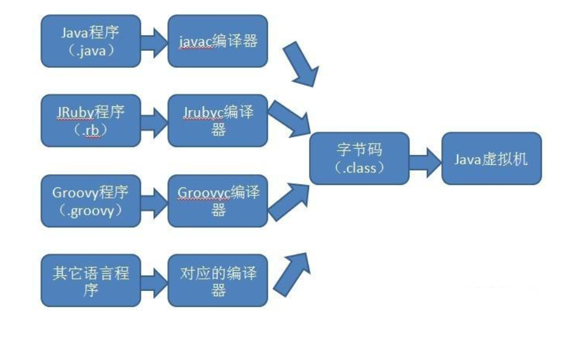
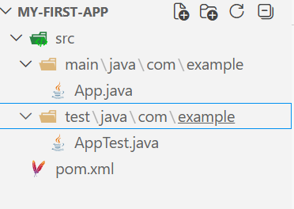
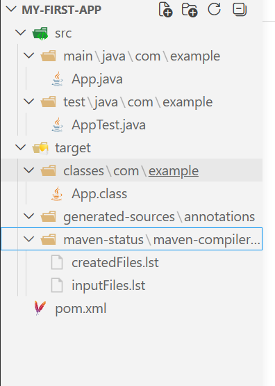
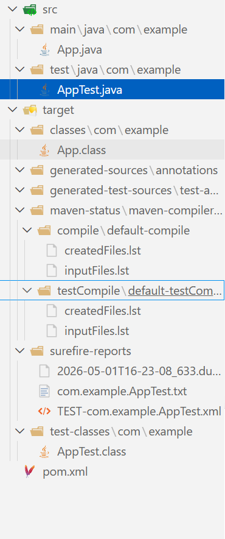

# Java历史
- [wiki](https://en.wikipedia.org/wiki/Java_(programming_language))

之所以把Java历史摆在最前面,是因为我们需要知道Java的生态为何如此混乱.

## 整体历史
* **1991年06月：项目启动**
  * James Gosling、Mike Sheridan 与 Patrick Naughton 发起 Java 语言项目，最初命名为 **Oak**，随后曾更名为 **Green**，最终定名为 **Java**。
* **1995年05月：初次亮相**
  * Sun Microsystems 在 SunWorld 大会上正式发布 Java 语言及其浏览器插件 HotJava，其口号“Write Once, Run Anywhere”直击跨平台痛点。
* **1996年：正式发布**
  * Sun Microsystems 发布 **Java 1.0** 实现。该版本确立了核心理念，并因其安全特性和浏览器对 Java Applet 的支持迅速普及。
* **1997年：标准化博弈**
  * Sun 曾尝试通过 ISO/IEC JTC 1 和 Ecma International 推动 Java 标准化，但随后撤出，转而通过 **Java Community Process (JCP)** 维持控制。
* **1998年12月：架构分化**
  * **Java 2 (J2SE 1.2)** 发布。Java 体系被正式划分为三个方向：面向企业级的 **J2EE**、面向桌面的 **J2SE** 以及面向移动设备的 **J2ME**。
* **2004年09月：泛型与元数据**
  * **J2SE 5.0** 发布。引入泛型、注解、自动装箱、可变参数及枚举，这是 Java 语法层面的一次重大演进。
* **2006年：更名与开源启动**
  * 出于市场营销考虑，Sun 将版本重新命名为 **Java EE**、**Java SE** 和 **Java ME**。同年 11 月，Sun 开始基于 **GPL-2.0** 协议发布 JVM 开源软件。
* **2007年：完成开源**
  * 除了极少数不持有版权的代码外，Sun 完成了 JVM 核心代码的开源分发，OpenJDK 社区开始形成。
* **2009年-2010年：所有权更迭**
  * **Oracle 收购 Sun Microsystems**。随后不久，Oracle 就 Android SDK 中使用 Java 的问题对 Google 发起长期法律诉讼。
* **2010年04月：核心人物离职**
  * Java 之父 James Gosling 从 Oracle 辞职。
* **2011年07月：Oracle 时代首个大版本**
  * **Java SE 7** 发布。引入 try-with-resources、动态语言支持（invokedynamic）以及 Fork/Join 框架。
* **2014年03月：函数式编程**
  * **Java SE 8** 发布。引入 Lambda 表达式、Stream API 和 Optional 类，标志着 Java 向函数式编程风格转型。
* **2017年09月：模块化革命**
  * **Java SE 9** 发布。历经多次推迟的 Project Jigsaw（模块化系统）正式落地，同时 Oracle 宣布改为每六个月发布一个新版本。
* **2018年09月：付费策略调整**
  * **Java 11 (LTS)** 发布。Oracle 调整了 JDK 的授权协议，商用版开始收费，推动了 OpenJDK 发行版的多元化（如 Amazon Corretto, Alibaba Dragonwell）。
* **2021年09月：LTS 周期加速**
  * **Java 17 (LTS)** 发布。Oracle 将长期支持版本的发布周期从三年缩短为两年。


## 版本历史
>我们经常说Java 8,Java 21,但实际上指的是JDK 8,JDK 21,也就是说,是Oracle发布的JDK版本决定了对应版本的Java语法.

### 起源时代（1995–1999）

- **1995年5月** · Java语言正式发布
- **1996年1月** · **JDK 1.0**（代号Oak）——首个正式开发工具包，包含基础类库、Applet支持和图形用户界面功能。
- **1997年2月** · **JDK 1.1**——引入内部类（Inner Class）、JavaBeans、JDBC（数据库连接）、RMI（远程方法调用）和反射API。
- **1998年12月** · **JDK 1.2（Java 2）**——平台更名为Java 2，拆分为标准版J2SE、企业版J2EE和微型版J2ME三大平台；引入Swing图形组件、集合框架、JIT编译器。

### 成熟时代（2000–2010）

- **2000年5月** · **JDK 1.3**——增强AWT和Swing用户界面，优化底层类库。
- **2002年2月** · **JDK 1.4（LTS）**——引入NIO（New I/O）、断言（assert）、内置XML解析器（SAX/DOM）、Java管理扩展（JMX）。
- **2004年9月** · **JDK 5.0（Java SE 5）**——一次里程碑式升级：引入泛型、枚举类型、自动装箱/拆箱、注解、增强for循环和并发编程API（Java.util.concurrent）。版本号从1.x跃升至5.0。
- **2006年12月** · **JDK 6（Java SE 6）**——引入JDBC 4.0、Java监视与管理控制台（JConsole）、动态语言支持与性能提升。

### 现代转型时代（2011–2017）

- **2011年7月** · **JDK 7（Java SE 7）**——引入**G1垃圾回收器**、**NIO.2新文件系统API**、**InvokeDynamic指令**（支持动态类型语言）；Project Coin带来一系列语言简化特性：字符串switch、try-with-resources自动资源管理、“钻石”泛型推断、多异常捕获等。
- **2014年3月** · **JDK 8（LTS，历史性版本）**——被誉为Java史上最具革命性的版本：引入**Lambda表达式、方法引用、函数式接口、Stream API、Optional类、新日期时间API（Java.time）**、Nashorn JavaScript引擎、接口默认方法和静态方法；JVM用Metaspace替代永久代。

### 加速迭代时代（2017–2020）


- **2017年9月** · **JDK 9**——引入**模块化系统（Project Jigsaw/JPMS）**、**G1成为默认垃圾收集器**、HTTP/2客户端API（孵化）、JShell交互式编程工具、私有接口方法、响应式流API。
- **2018年3月** · **JDK 10**——引入**局部变量类型推断（`var`关键字）**、G1支持并行全GC以降低停顿时间。
- **2018年9月** · **JDK 11（LTS）**——标准化**HTTP Client API**（原孵化API转正）、引入**ZGC低延迟垃圾回收器（实验性）**、Epsilon空操作垃圾回收器、Flight Recorder飞行记录仪、直接在命令行运行单文件源码程序功能。
- **2019年3月** · **JDK 12**——引入**Switch表达式（预览）**、G1垃圾回收器改进。
- **2019年9月** · **JDK 13**——引入**文本块（预览）**，多行字符串处理更便捷。
- **2020年3月** · **JDK 14**——引入**Records数据类（预览）**、Pattern Matching for instanceof（预览）、**NullPointerException增强信息**。
- **2020年9月** · **JDK 15**——引入**密封类（sealed classes，预览）**、文本块正式转正、空指针异常信息改进、ZGC正式转正。
- **2021年3月** · **JDK 16**——Records正式转正、Pattern Matching for instanceof正式转正、Vector API（孵化）。

### 2021至今

- **2021年9月** · **JDK 17（LTS，第三个长期支持版本）**——**密封类正式转正、`switch`模式匹配（预览）**、改进伪随机数生成器（统一API）、macOS Metal渲染管线。
- **2022年3月** · **JDK 18**——默认UTF-8编码、简易Web服务器、外部函数与内存API（第二轮孵化）、向量API（第三轮孵化）。
- **2022年9月** · **JDK 19**——**虚拟线程（预览）**、Record模式（预览）、结构化并发（孵化）。
- **2023年3月** · **JDK 20**——虚拟线程、作用域值、Record模式、结构化并发等持续预览迭代。


# 环境配置
## 编译器下载
与Cpp运行需要MSVC等编译器,python运行需要python虚拟环境一样,Java运行需要的是JDK(Java Development Kit).
如前面所说,尽管Java版权归Oracle公司所有,但也有开源的社区版本和基于开源版本制作的第三方JDK,性能上的差别非常小.
为了省事,我们直接上[微软官网](https://www.oracle.com/Java/technologies/downloads/#Java21)下载JDK21即可,这样可以**跳过烦人的环境变量配置环节**.
- 至于为什么不选最新的25版本是因为体积更大也没必要.

## 配置环境变量(可跳过)
与cpp类似,如果不配置编译器的环境变量的话,系统是无法识别你的命令的:
```bash
Java --version
Java : 无法将“Java”项识别为 cmdlet、函数、脚本文件或可运行程序的名称。请检查名称的拼写，如果包括路径，请确保路径正确
，然后再试一次。
所在位置 行:1 字符: 1
+ Java --version
+ ~~~~
    + CategoryInfo          : ObjectNotFound: (Java:String) [], CommandNotFoundException
    + FullyQualifiedErrorId : CommandNotFoundException
```
但是,如果你用的是微软的OpenJDK,就可以在安装的时候勾选配置环境变量直接跳过这一步:
```bash
Java --version
openjdk 21.0.10 2026-01-20 LTS
OpenJDK Runtime Environment Microsoft-13106404 (build 21.0.10+7-LTS)
OpenJDK 64-Bit Server VM Microsoft-13106404 (build 21.0.10+7-LTS, mixed mode, sharing)
```

但如果你铁着头选择了Oracle官方版本的话,那么还是需要自己配置的...**预先警告这很麻烦**


## VScode配置Java环境
当你第一次创建`.Java`文件时,VScode会自动为你推荐所需的扩展并配置好环境,所以无需额外操作.

# Java语法学习
- [W3schools](https://www.w3schools.com/Java/)
  - 不要看廖雪峰教程...写的并不是很好,而且很枯燥,搞不懂为什么流量这么大.
- 建议先学好cpp后再学Java,本部分经常会拿cpp来跟Java做比较
## 基础语法
### 学习前的要点
我们首先需要知道Java的面向对象特性:
1. 所有函数和变量都写在类里面,因此函数都变成了`方法`,变量都变成了`属性`
2. 如果源文件中包含public类,则文件名必须与该类名完全一致
3. 所有的类名都需要大写,仅是一种规范,但最好大写.

例如:
```Java
public class Main {
  public static void main(String[] args) {
    System.out.println("Hello World");
  }
}
```
包含了这个代码的文件必须叫做Main.Java,区分大小写.

### 主函数
上述代码中的main函数是Java程序的入口,其作用与c/cpp中的main函数别无二致:
```Java
public static void main(String[] args) {
    System.out.println("Hello World");
  }
```
如果你不觉得main函数里的`String[] args`参数很奇怪的话,那我就觉得你很奇怪了.

>这个参数作为命令行交互的接收器,尽管你未必会显式用到这个参数,但是必须要写上.
尽管从Java21开始允许不写这个参数了,但是很多企业内部的数据库交互用的依然是Java8,所以还是写上比较好.

### 变量类型
```Java
// 常用变量类型
int myNum = 5;
float myFloatNum = 5.99f;
double myDoubleNum = 3.14159;
char myLetter = 'D';
boolean myBool = true;
String myText = "Hello";
```
值得注意的是唯独String这个变量类型是大写的,因为它是一个类,如前面所说,Java中的类名都需要大写,所以这里就大写了.

Java  10(2018年发布)引入了类似于cpp中auto的变量类型`var`:
```Java
var x = 5;  // x is an int
System.out.println(x);
```
与auto一样,var不允许只声明不赋值:
```Java
var x; // Error
var x = 5;  // OK
```
### Java数组
由于cpp反直觉的类似`int a[10]`这样的语法,所以Java将声明时的`[]`优化到了变量名前面,变成了这样:
```Java
String[] cars = {"Volvo", "BMW", "Ford", "Mazda"};
System.out.println(cars[0]);
// Outputs Volvo
```
- 看上去顺眼多了,毕竟我们都说`int 数组a`,而不会说`int a数组`.
#### 数组的声明与构造
**数组声明**
```java
int[] arr; // 正确
int[5] arr; // 错误：声明阶段不分配空间
arr = new int[5] // 在声明之后补充数组空间大小的分配
```
**数组构造**
```java
// 第一种写法
int[] arr ={1,2,3};
// 第二种写法
int[] arr;
arr = new int[]{1,2,3};
// 第三种写法
int[] arr = new int[]{1,2,3};
```

#### 二维数组
自然,如果是二维数组,就要写两个[]了:
```Java
int[][] myNumbers = { {1, 4, 2}, {3, 6, 8, 5, 2} };

for (int row = 0; row < myNumbers.length; row++) {
  for (int col = 0; col < myNumbers[row].length; col++) {
    System.out.println("myNumbers[" + row + "][" + col + "] = " + myNumbers[row][col]);
  }
}
```
### Java的for-each循环
由于Java的大多数逻辑语句和cpp别无二致,因此全都略过,但值得一提的是下面这个语法:
```Java
String[] cars = {"Volvo", "BMW", "Ford", "Mazda"};

for (String car : cars) {
  System.out.println(car);
}
```
这被称为for-each循环,于04年的Java5.0引入,而cpp直到c++11才正式引入:
```cpp
std::vector<std::string> cars = {"Volvo", "BMW", "Ford", "Mazda"};

for (const std::string& car : cars) {
    std::cout << car << std::endl;
}
```
## OOP
### 修饰符
先概览一下Java中的常用修饰符,之后会逐渐根据代码理解的
#### 类修饰符 (Class Modifiers)

在 Java 中，类修饰符决定了类的访问权限、继承特性以及实例化规则。

| 修饰符        | 描述                                                   | 适用范围       |
| :------------ | :----------------------------------------------------- | :------------- |
| **public**    | 最宽泛的访问级别。该类对所有类可见。                   | 顶级类、内部类 |
| **protected** | 对同一包内的类及所有子类可见。                         | **仅内部类**   |
| **default**   | (不写关键字) 仅对同一包内的类可见。                    | 顶级类、内部类 |
| **private**   | 仅对定义它的外部类可见。                               | **仅内部类**   |
| **abstract**  | 抽象类。不能被实例化，必须由子类继承并实现其抽象方法。 | 顶级类、内部类 |
| **final**     | 最终类。不能被继承（例如 `Java.lang.String`）。        | 顶级类、内部类 |
| **static**    | 静态内部类。不需要依赖外部类实例即可创建。             | **仅内部类**   |
| **sealed**    | 密封类（Java 17+）。限制哪些类可以继承它。             | 顶级类         |

- 外部类: 直接定义在.java文件中的类
- 内部类: 定义在外部类内部的类

对于外部类来说,类既不能是 private 的（这样除了该类自身，任何类都不能访问它），也不能是 protected 的。所以对于类的访问权限只有两种选择：包访问权限或者 public。为了防止类被外界访问，可以将所有的构造器声明为 private，这样只有你自己能创建对象（在类的 static 成员中）：

```java
// hiding/Lunch.java
// Demonstrates class access specifiers. Make a class
// effectively private with private constructors:

class Soup1 {
    private Soup1() {}

    public static Soup1 makeSoup() { // [1]
        return new Soup1();
    }
}

class Soup2 {
    private Soup2() {}

    private static Soup2 ps1 = new Soup2(); // [2]

    public static Soup2 access() {
        return ps1;
    }

    public void f() {}
}
// Only one public class allowed per file:
public class Lunch {
    void testPrivate() {
        // Can't do this! Private constructor:
        //- Soup1 soup = new Soup1();
    }

    void testStatic() {
        Soup1 soup = Soup1.makeSoup();
    }

    void testSingleton() {
        Soup2.access().f();
    }
}
```
#### 方法修饰符 (Method Modifiers)

方法修饰符控制方法的访问权限、执行逻辑、以及子类覆盖规则。

##### 访问控制修饰符
* **public**: 方法对所有类可见。
* **protected**: 方法对同一包内的类及所有子类可见。
* **default**: (不写关键字) 仅对同一包内的类可见。
* **private**: 仅在当前类内部可见。

##### 非访问控制修饰符
* **static**: 静态方法。属于类而非实例，通过类名直接调用，不能访问非静态成员。
* **final**: 最终方法。子类可以继承但不能覆盖（Override）此方法。
* **abstract**: 抽象方法。没有方法体，必须由非抽象子类实现。


### static修饰符详解
首先我们需要知道一件事:尽管Java强制要求所有方法都写在类中,但是有一些方法我们并不想让它与某个类的实例有任何关系,也就是说,我们想要像cpp定义**全局函数**那样,直接在类内方法中调用该函数,而不需要带上类访问符`.`,那么就可以用`static`关键字来修饰某个方法:
```Java
public class Main {
  static void myMethod() {
    System.out.println("Hello World!");
  }

  public static void main(String[] args) {
    myMethod();
  }
}

// Outputs "Hello World!"
```
- 这里我们直接调用了`myMethod`方法而不需要通过this指针或者类访问符来操作它

总结一下就是说,Java的static方法属于这个类,类外访问时通过`类名.方法`调用,类内访问可以直呼其名,而非static方法属于类实例,需要先实例化一个类后再通过实例调用.

### 创建类实例
Java创建类实例的方法有很多,但最常用的还是通过new操作符:
```Java
public class Main {
  int x = 5;

  public static void main(String[] args) {
    Main myObj = new Main();
    System.out.println(myObj.x);
  }
}
```
由于Java的垃圾回收机制(很后面会提到),我们不用像在cpp中一样,new一个对象后就要使用`delete`操作符删除它,还是很便利的.
### 构造函数
与Java有new没有delete同理,Java有构造函数但没有析构函数,构造函数的写法与cpp的写法相同:与类同名

```Java
public class Main {
  int x;

  public Main(int y) {
    x = y;
  }

  public static void main(String[] args) {
    Main myObj = new Main(5);
    System.out.println(myObj.x);
  }
}

// Outputs 5
```

#### this引用符
由于Java不再显式使用指针,但又需要像cpp一样用某个符号代指类实例,否则无法通过类内方法访问私有属性.

因此,Java引入了this引用符,**用来指向当前的类实例**:
```Java
public class Main {
  int x;  // Class variable x

  // Constructor with one parameter x
  public Main(int x) {
    this.x = x; // refers to the class variable x
  }

  public static void main(String[] args) {
    // Create an object of Main and pass the value 5 to the constructor
    Main myObj = new Main(5);
    System.out.println("Value of x = " + myObj.x);
  }
}
```

- 这与Python中的self有异曲同工之处,但不同的是self需要**显示声明**,而Java的this与cpp的this一样都是**隐式存在**的
#### 构造函数的重载
```Java
public class Main {
  int modelYear;
  String modelName;

  // Constructor with one parameter
  public Main(String modelName) {
    // Call the two-parameter constructor to reuse code and set a default year    
    this(2020, modelName);
  }

  // Constructor with two parameters
  public Main(int modelYear, String modelName) {
    // Use 'this' to assign values to the class variables
    this.modelYear = modelYear;
    this.modelName = modelName;
  }

  // Method to print car information
  public void printInfo() {
    System.out.println(modelYear + " " + modelName);
  }

  public static void main(String[] args) {
    // Create a car with only model name (uses default year)
    Main car1 = new Main("Corvette");

    // Create a car with both model year and name
    Main car2 = new Main(1969, "Mustang");

    car1.printInfo();
    car2.printInfo();
  }
}
```
通过构造函数的重载可以实现类的不同初始化数值

**非常值得注意**
>上述代码的`this(2020, modelName)`并非是简单的语法糖,它指向的是完整版本的构造函数,从而实现代码的复用,换句话说,如果只写这一句而不写完整构造函数就会报错.

- 这么来看的话,它与cpp中的初始化列表完全不同
```cpp
class Main {
public:
    int modelYear;
    string modelName;

    // 使用初始化列表：变量(值)
    Main(string name) : modelYear(2020), modelName(name) {
    }
}
```
### 继承与多态
由于cpp中的继承符号`:`过于简单和抽象,因此Java将继承符号改为了继承关键字`extends`:
```Java
class Vehicle {
  protected String brand = "Ford";        // Vehicle attribute
  public void honk() {                    // Vehicle method
    System.out.println("Tuut, tuut!");
  }
}

class Car extends Vehicle {
  private String modelName = "Mustang";    // Car attribute
  public static void main(String[] args) {

    // Create a myCar object
    Car myCar = new Car();

    // Call the honk() method (from the Vehicle class) on the myCar object
    myCar.honk();

    // Display the value of the brand attribute (from the Vehicle class) and the value of the modelName from the Car class
    System.out.println(myCar.brand + " " + myCar.modelName);
  }
}
```
#### final修饰符详解
Java将cpp中的常量修饰符`const`改成了`final`,这可不是脱裤子放屁,而是因为Java中的final还可以限制某些类不可被继承:
```Java
final class Vehicle {
  ...
}

class Car extends Vehicle {
  ...
}
// Main.Java:9: error: cannot inherit from final Vehicle
// class Main extends Vehicle {
//                   ^
// 1 error)
```
将类也看做常量的想法确实挺奇妙的,但一般来说根本用不到吧.
#### 多态
Java中的方法默认是可以被重载的,这比起cpp要便利很多,同样,被final修饰的方法只能被继承但不能被重载:
```Java
class Animal {
  public void animalSound() {
    System.out.println("The animal makes a sound");
  }
}

class Pig extends Animal {
  public void animalSound() {
    System.out.println("The pig says: wee wee");
  }
}

class Dog extends Animal {
  public void animalSound() {
    System.out.println("The dog says: bow wow");
  }
}
```
#### super引用符
Java设计了super引用符来指向父类:
```Java
class Animal {
  public void animalSound() {
    System.out.println("The animal makes a sound");
  }
}

class Dog extends Animal {
  public void animalSound() {
    super.animalSound(); // Call the parent method
    System.out.println("The dog says: bow wow");
  }
}

public class Main {
  public static void main(String[] args) {
    Dog myDog = new Dog();
    myDog.animalSound();
  }
}
```
当然,super更强大的地方在于能够调用父类的构造函数:
```Java
class Animal {
  Animal() {
    System.out.println("Animal is created");
  }
}

class Dog extends Animal {
  Dog() {
    super(); // Call parent constructor
    System.out.println("Dog is created");
  }
}

public class Main {
  public static void main(String[] args) {
    Dog myDog = new Dog();
  }
}
// Animal is created
// Dog is created
```
这其实很好理解,把super换成父类的类名即可看懂了.

### 抽象与接口
Java将Cpp中的虚函数与重载机制进一步发扬光大,发明了**抽象方法和接口**,简单来说的话,抽象类内的抽象方法没有函数内容,而且必须被子类重载实现;而接口就是抽象类的简写版,里面的所有函数和属性默认都要被重载实现.
**抽象类和抽象方法**
```Java
// Abstract class
abstract class Animal {
  // Abstract method (does not have a body)
  public abstract void animalSound();
  // Regular method
  public void sleep() {
    System.out.println("Zzz");
  }
}

// Subclass (inherit from Animal)
class Pig extends Animal {
  public void animalSound() {
    // The body of animalSound() is provided here
    System.out.println("The pig says: wee wee");
  }
}

class Main {
  public static void main(String[] args) {
    Pig myPig = new Pig(); // Create a Pig object
    myPig.animalSound();
    myPig.sleep();
  }
}
```
为了区分抽象类和接口,Java特定设置了接口的继承关键字`implements`,从而与`extends`区分开来:
```Java
// Interface
interface Animal {
  public void animalSound(); // interface method (does not have a body)
  public void sleep(); // interface method (does not have a body)
}

// Pig "implements" the Animal interface
class Pig implements Animal {
  public void animalSound() {
    // The body of animalSound() is provided here
    System.out.println("The pig says: wee wee");
  }
  public void sleep() {
    // The body of sleep() is provided here
    System.out.println("Zzz");
  }
}

class Main {
  public static void main(String[] args) {
    Pig myPig = new Pig();  // Create a Pig object
    myPig.animalSound();
    myPig.sleep();
  }
}
```
至于为什么Java要单独设置`implements`关键字,是因为它确实与`extends`有些许不同,`implements`后可以跟多个接口,而`extends`后只可以跟一个父类.
- 为什么这么设计?那是设计者的问题了
```Java
interface FirstInterface {
  public void myMethod(); // interface method
}

interface SecondInterface {
  public void myOtherMethod(); // interface method
}

class DemoClass implements FirstInterface, SecondInterface {
  public void myMethod() {
    System.out.println("Some text..");
  }
  public void myOtherMethod() {
    System.out.println("Some other text...");
  }
}

class Main {
  public static void main(String[] args) {
    DemoClass myObj = new DemoClass();
    myObj.myMethod();
    myObj.myOtherMethod();
  }
}
```
## Java系统库
**随便看看即可,用上的时候再去详细了解**
### Java文件读写
The **File** class from the **Java.io** package, allows us to work with files:
```Java
import Java.io.File;  // Import the File class

File myObj = new File("filename.txt"); // Specify the filename
```

#### 创建文件
```Java
import Java.io.File;       // Import the File class
import Java.io.IOException; // Import IOException to handle errors

public class CreateFile {
  public static void main(String[] args) {
    try {
      File myObj = new File("filename.txt"); // Create File object
      if (myObj.createNewFile()) {           // Try to create the file
        System.out.println("File created: " + myObj.getName());
      } else {
        System.out.println("File already exists.");
      }
    } catch (IOException e) {
      System.out.println("An error occurred.");
      e.printStackTrace(); // Print error details
    }
  }
}
```
#### 写入文件 
```Java
import Java.io.FileWriter;   // Import the FileWriter class
import Java.io.IOException;  // Import the IOException class

public class WriteToFile {
  public static void main(String[] args) {
    try {
      FileWriter myWriter = new FileWriter("filename.txt");
      myWriter.write("Files in Java might be tricky, but it is fun enough!");
      myWriter.close();  // must close manually
      System.out.println("Successfully wrote to the file.");
    } catch (IOException e) {
      System.out.println("An error occurred.");
      e.printStackTrace();
    }
  }
}
```
#### 读取文件
```Java
import Java.io.File;                  // Import the File class
import Java.io.FileNotFoundException; // Import this class to handle errors
import Java.util.Scanner;             // Import the Scanner class to read text files

public class ReadFile {
  public static void main(String[] args) {
    File myObj = new File("filename.txt");

    // try-with-resources: Scanner will be closed automatically
    try (Scanner myReader = new Scanner(myObj)) {
      while (myReader.hasNextLine()) {
        String data = myReader.nextLine();
        System.out.println(data);
      }
    } catch (FileNotFoundException e) {
      System.out.println("An error occurred.");
      e.printStackTrace();
    }
  }
}
```

### Java I/O
#### 读缓冲区
```Java
import Java.io.BufferedReader;
import Java.io.FileReader;
import Java.io.IOException;

public class Main {
  public static void main(String[] args) {
    try (BufferedReader br = new BufferedReader(new FileReader("filename.txt"))) {
      String line;
      while ((line = br.readLine()) != null) {
        System.out.println(line);
      }
    } catch (IOException e) {
      System.out.println("Error reading file.");
    }
  }
}
```
#### 写缓冲区
```Java
import Java.io.BufferedWriter;
import Java.io.FileWriter;
import Java.io.IOException;

public class Main {
  public static void main(String[] args) {
    try (BufferedWriter bw = new BufferedWriter(new FileWriter("filename.txt"))) {
      bw.write("First line");
      bw.newLine();  // add line break
      bw.write("Second line");
      System.out.println("Successfully wrote to the file.");
    } catch (IOException e) {
      System.out.println("Error writing file.");
    }
  }
}
```
### Java数据结构
最常用的数据结构都被包装到Java.util包中了:
- ArrayList
- HashSet
- HashMap

这三个数据结构同样也是Java岗面试的必考点,尽管不太看得出来考的必要

#### 快速对照表

| Java 数据结构 | C++ (STL) 对照       | 底层实现 | 排序性   |
| :------------ | :------------------- | :------- | :------- |
| **ArrayList** | `std::vector`        | 动态数组 | 插入顺序 |
| **HashSet**   | `std::unordered_set` | 哈希表   | 无序     |
| **HashMap**   | `std::unordered_map` | 哈希表   | 无序     |
| *TreeSet*     | `std::set`           | 红黑树   | 自动排序 |
| *TreeMap*     | `std::map`           | 红黑树   | 自动排序 |
## Java包管理
- 根据On Java 8整理
### 导入外部包
>例如，标准 Java 发布中有一个工具库，它被组织在 java.util 命名空间下。java.util 中含有一个类，叫做 ArrayList。使用 ArrayList 的一种方式是用其全名 java.util.ArrayList。
```java
public class FullQualification {
    public static void main(String[] args) {
        java.util.ArrayList list = new java.util.ArrayList();
    }
}
```

>这种方式使得程序冗长乏味，因此你可以换一种方式，使用 import 关键字。如果需要导入某个类，就需要在 import 语句中声明：

```java
import java.util.ArrayList;

public class SingleImport {
    public static void main(String[] args) {
        ArrayList list = new ArrayList();
    }
}
```

如果想要使用java.util包中的所有类,则使用以下导入方法:

```java
import java.util.*
```
### 自制工具包
自制包时需要用到`package`关键字,必须在文件的第一个非注释行声明,且按照惯例,包名一律小写.

例如,我们想要让某个java文件能够被其他文件访问,我们可以根据文件目录对应的写成这样:
```java
// hiding/mypackage/MyClass.java
package hiding.mypackage;

public class MyClass {
    // ...
}
```

## Java高级特性
说是高级,其实都很简单,都怪营销号和垃圾博客把Java渲染的多么复杂高深,比起Cpp来说,Java简直不能再简单了.
### Wrapper Classes(封装类)
| Primitive Data Type | Wrapper Class |
| :------------------ | :------------ |
| byte                | Byte          |
| short               | Short         |
| int                 | Integer       |
| long                | Long          |
| float               | Float         |
| double              | Double        |
| boolean             | Boolean       |
| char                | Character     |

由于Java内置的数据结构如`ArrayList`只能存储对象,所以我们需要将数据类型包装成一个数据类来处理:
```Java
import Java.util.ArrayList;

public class Main {
  public static void main(String[] args) {
    ArrayList<String> cars = new ArrayList<String>();
    cars.add("Volvo");
    cars.add("BMW");
    cars.add("Ford");
    cars.add("Mazda");
    System.out.println(cars);
  }
}
```
- 自然,这种脱裤子放屁的事情在Java中还有很多...

### Java 泛型(generic)

**将不同类型的数据统一处理**
```Java
class Box<T> {
  T value; // T is a placeholder for any data type

  void set(T value) {
    this.value = value;
  }

  T get() {
    return value;
  }
}

public class Main {
  public static void main(String[] args) {
    // Create a Box to hold a String
    Box<String> stringBox = new Box<>();
    stringBox.set("Hello");
    System.out.println("Value: " + stringBox.get());

    // Create a Box to hold an Integer
    Box<Integer> intBox = new Box<>();
    intBox.set(50);
    System.out.println("Value: " + intBox.get());
  }
}
```
**处理不同的数据输入**
```Java
public class Main {
  // Generic method: works with any type T
  public static <T> void printArray(T[] array) {
    for (T item : array) {
      System.out.println(item);
    }
  }

  public static void main(String[] args) {
    // Array of Strings
    String[] names = {"Jenny", "Liam"};

    // Array of Integers
    Integer[] numbers = {1, 2, 3};

    // Call the generic method with both arrays
    printArray(names);
    printArray(numbers);
  }
}
```
### Java Annotations(Java注解)
>Annotations are **special notes** you add to your Java code. They start with the `@` symbol.


注解并不会改变程序的运行方式,但是会为编译器和构建工具提供额外的信息,这与Python中的`@`语法糖完全不同.

最常用的注解有三个:
1. `@Override`: Indicates that a method overrides a method in a superclass
2. `@Deprecated`: Marks a method or class as outdated or discouraged from use
3. `@SuppressWarnings`: Tells the compiler to ignore certain warnings

- 尽管看着是累赘设计,不过在Java测试中,Java注解将会真正发挥强大的作用
### Java多线程
Java中有两种方法可以创建进程:
```Java
// 1.继承Thread系统类
public class Main extends Thread {
  public void run() {
    System.out.println("This code is running in a thread");
  }
}
// 2.实现Runnable接口,更推荐
public class Main implements Runnable {
  public void run() {
    System.out.println("This code is running in a thread");
  }
}
```
真正要详细了解多线程需要在后面的Java线程池中学习

### Java反射(待补充)
#### 前言
我一直都十分怀疑中文互联网对于Java反射指定有什么奇怪的共识,所有讲Java反射的教程一上来就会抛给你一段类似这样的代码:

```java
Class clz = Class.forName("com.chenshuyi.reflect.Apple");
Method method = clz.getMethod("setPrice", int.class);
Constructor constructor = clz.getConstructor();
Object object = constructor.newInstance();
method.invoke(object, 4);
```

- 当一个兴致冲冲的小白想要了解Java反射是什么的时候,立刻就被劝退了...

不管怎样,我打算从更底层更初级的角度来学习反射.
#### 反射是什么

#### 反射用到了哪些库

#### 实战
# Java构建与打包

## JDK
- [参考博文](https://www.wdbyte.com/java/jdk-jre-jvm/)

JDK（Java Development Kit）、JRE（Java Runtime Environment）、JVM （Java Virtual Machine）是 Java 开发中的三个重要概念，**JDK 包含了 JRE 和开发工具，JRE 包含了 JVM 和类库，JVM 是 Java 程序的运行环境**。


这张图说的很清楚了:
1. JDK除了包含JRE以外,还有javac,javadoc,jar等开发工具
2. JRE除了包含JVM外,还包含有各类Java系统库,如`java.util`,`java.io`库等.
   1. 如果自己不需要开发Java项目,只用JRE就足够运行已经被javac编译器编译出的class文件.
3. JVM负责执行class文件,从而运行java程序,在需要时由JRE帮助导入系统库和第三方库.

>这样看来,底层根本就不存在所谓的java到c/cpp的转换,就算JVM是用cpp写的,但实际上来说根本不需要将java转换成cpp,而是让JVM逐个执行class文件即可.所以java比起cpp慢的主要原因在于多了一个从.java文件到.class文件的转换构建,而cpp程序编译得到的可执行文件由于更贴近底层,程序改动后的即时编译构建不需要做很大的改动即可运行,所以速度更快.
## JVM
>我们总说Java"一次编写,处处运行",靠的就是JVM实现的.要想更好的理解这句话,可以这么说,不同操作系统使用的JVM不同,但是我们可以编写同一份java代码,无需像Cpp那样需要适配不同的平台来编写不同的代码.

推荐阅读: 深入理解Java虚拟机
## Class文件
- [参考博客](https://www.cnblogs.com/zsql/p/12907120.html)

class文件是java文件被javac等编译器编译后得到的平台无关的**中间文件**,其地位类似于cpp/c中的目标文件(尽管cpp中的目标文件是平台相关的).

一张非常简洁明了的示意图如下:



## Java打包(待补充)
我们时常能够看到java项目中的.jar(Java Archive)文件

# Java测试: JUnit
- 由于JUnit库在Java的测试库中占据了绝对主流,所以就只讲JUnit了.
- [官方文档](https://docs.junit.org/6.0.3/overview.html)
- 为什么先讲测试再讲构建框架呢,是因为我运行maven教程项目的时候会自己引入测试框架...

## 概览
JUnit is composed of several different modules from **three different sub-projects**:
```txt
JUnit 6.0.3 = JUnit Platform + JUnit Jupiter + JUnit Vintage
```

- JUnit Platform: 作为测试的基础,与JVM交互,启动测试引擎
- JUnit Jupiter: 作为测试的引擎和框架,我们编写的测试代码由Jupiter负责启动
- JUnit Vintage: 被废弃的引擎,只在运行3.0和4.0版本的JUnit时采用
## 写测试
### 一个简单的测试代码
```java
import static org.junit.jupiter.api.Assertions.assertEquals;

import example.util.Calculator;

import org.junit.jupiter.api.Test;

class MyFirstJUnitJupiterTests {

	private final Calculator calculator = new Calculator();

	@Test
	void addition() {
		assertEquals(2, calculator.add(1, 1));
	}

}
```
### 注解
>Unless otherwise stated, **all core annotations** are located in the **org.junit.jupiter.api package** in the junit-jupiter-api module.

重要的注解有以下几个:
- @Test
  - 注明这个方法是一个测试方法
- @BeforeEach
  - 注明
# Java构建工具
与Cpp有Make,ninja,CMake类似,Java也有自己的构建工具,早期的构建工具为Ant,目前由Maven和Gradle两款工具统治,它俩也同时承担了包管理器的责任,功能基本等价于Python中的uv.
## Maven
### Maven历史
#### 1. 概念起源与孵化 (2002 - 2003)
* **2002年**：由 Jason van Zyl 创建，最初作为 Apache Turbine 的子项目，旨在解决该项目极其复杂的构建过程。
* **2003年**：正式被接纳为 Apache 软件基金会的顶级项目。

#### 2. 标准确立与快速普及 (2004 - 2005)
* **2004年7月 (Version 1.0)**：第一个里程碑版本发布。确立了“约定优于配置”的核心理念。
* **2005年10月 (Version 2.0)**：重大架构升级版本。
    * **核心贡献**：确立了 **Maven 中央仓库** (Central Repository) 机制，支持动态下载依赖。
    * **插件架构**：采用基于插件的架构，使其具备了跨语言构建（如 C/C++）的潜力。

#### 3. 架构优化与并行化 (2010)
* **2010年10月 (Version 3.0)**：
    * **解耦与兼容**：在保持与 2.x 项目兼容的同时，重构了核心项目构建器。
    * **性能提升**：引入**并行构建**特性，能够利用多核 CPU 处理大型多模块项目。
    * **非 XML 尝试**：开始支持非 XML 的项目定义文件（如 Ruby、YAML、Groovy），解耦了内存表示与文件格式。
### 安装方法
[官网](https://maven.apache.org/install.html)下载压缩包后解压,将解压路径的bin目录添加到环境变量:


命令行输入`mvn -v`,成功:


### 使用方法
#### 命令行使用
- 官网甚至没有新手教程,只有参考(reference)...
- [菜鸟教程](https://www.runoob.com/maven/maven-intro.html)

打开powershell在当前目录创建一个maven初始项目:
```bash
mvn archetype:generate '-DgroupId=com.example' '-DartifactId=my-first-app' '-DarchetypeArtifactId=maven-archetype-quickstart' '-DinteractiveMode=false'
```

初始结构长这样:



输入`mvn compile`,构建后增加了target文件夹和其中的一些文件:



输入`mvn test`,增加了测试结果文件:



输入`mvn package`,将项目打包成了jar:


为了运行这个jar
#### pom.xml
## Gradle
### Gradle历史
#### 1. 概念孵化与 Groovy 基因 (2007 - 2008)
* **2007年**：Hans Dockter 开始构思一种结合 Ant 的灵活性与 Maven 的依赖管理能力的新工具。
* **2008年4月 (Version 0.1)**：首个版本发布。创始人最初想命名为“Cradle”，但为了使其更具独特性，取 **Groovy** 语言的首字母 **G**，更名为 **Gradle**。其核心特征是使用基于 Groovy 的 DSL 取代繁琐的 XML 配置。

#### 2. 核心架构确立 (2012 - 2014)
* **2012年6月 (Version 1.0)**：历经四年迭代，首个正式稳定版发布。确立了有向无环图 (DAG) 任务模型，解决了复杂构建流程的编排问题。
* **2013年**：**Google 宣布 Android Studio 采用 Gradle 作为官方构建系统**。这一决策直接将 Gradle 推向了顶级构建工具的地位。
* **2014年7月 (Version 2.0)**：提升了构建性能，并正式引入了对原生语言（C/C++）构建的初步支持，展示了其跨语言构建的野心。

#### 3. 性能突破与 Kotlin 引入 (2016 - 2018)
* **2016年8月 (Version 3.0)**：引入 **Gradle Daemon**（守护进程）并默认开启，极大地缩短了短周期任务的启动时间。
* **2017年6月 (Version 4.0)**：引入 **Build Cache**（构建缓存）技术，允许跨机器共享编译产物，大幅减少了大型项目的重复编译时间。
* **2018年11月 (Version 5.0)**：正式支持 **Kotlin DSL**。开发者可以使用类型安全的 Kotlin 编写构建脚本，解决了 Groovy 脚本缺乏 IDE 智能补全和编译时检查的痛点。

#### 4. 现代化与大规模构建优化 (2019 - 2025)
* **2021年4月 (Version 7.0)**：引入 **Version Catalogs**（版本目录），实现了多项目之间依赖版本的集中管理，正式统一了大型项目的依赖规范。
* **2023年2月 (Version 8.0)**：针对配置阶段进行了深度优化，支持 **Configuration Cache**，使得复杂项目的构建配置速度提升数倍。
* **2025年7月 (Version 9.0)**：最新里程碑版本。进一步强化了云端构建能力和对现代 JDK 特性的深度适配，确立了其在高复杂度、高性能要求构建场景下的统治地位。
### 安装方法
[官网](https://docs.gradle.org/current/userguide/installation.html#installation)下载二进制版本,解压后将bin目录添加到环境变量,命令行输入`gradle -v`,成功:


- 不要下载完整(complete)版,下了也可以,但没必要.


### 使用方法
- [官网教程](https://docs.gradle.org/current/userguide/part1_gradle_init.html#part1_begin)


# spring
# spring boot
# 使用Docker开发Java
