# 前端概览
- [W3schools](https://www.w3schools.com/css/css_intro.asp)
  - 本文的主要参考教程
- [wiki](https://en.wikipedia.org/wiki/Front_end_and_back_end)

>前端与后端是一对概念,前端用于指代用户交互层,后端用于指代数据处理层

前端最令人遗憾的地方在于,早期的浏览器大战使得网络生态混乱不堪,不同企业之间高筑护城河,诞生了各种各样的框架和新特性,让新入门的程序员一筹莫展,不知道学什么好.

不管怎样,我还是按照前端三件套到JSX,TSX的步骤来学习,从而更深入的理解前端的方方面面.
# HTML
**Hypertext Markup Language**(HTML)是一门用来处理网页文档内容的标记语言,通过dom(Document Object Model)将HTML中的元素映射到引擎中,从而展示出你现在看到的网页.
## HTML历史
- [wiki](https://en.wikipedia.org/wiki/HTML)

* **1980年 - 1989年：概念原型**
    * **1980年**：Tim Berners-Lee 在 CERN 开发 ENQUIRE 系统，用于共享文档。
    * **1989年**：Berners-Lee 编写备忘录，提议建立基于互联网的超文本系统。
* **1990年 - 1991年：诞生与初步公开**
    * **1990年**：Berners-Lee 编写了首个浏览器和服务器软件。
    * **1991年10月**：首次公开提及“HTML Tags”，包含 18 个元素，设计深受 CERN SGML（标准通用标记语言）影响。
* **1993年 - 1995年：标准化尝试**
    * **1993年6月**：IETF 发布首个 HTML 规范草案。
    * **1993年末**：HTML+ 草案提出支持表格和表单。
    * **1995年11月**：**HTML 2.0** 发布（RFC 1866），成为首个正式标准。
* **1997年 - 1999年：W3C 主导时期**
    * **1997年1月**：**HTML 3.2** 发布，W3C 接手标准化工作，吸收了大量浏览器厂商的专有标签。
    * **1997年12月**：**HTML 4.0** 发布，开始推行结构与样式分离（引入 CSS），并分为 Strict、Transitional、Frameset 三种变体。
    * **1999年12月**：**HTML 4.01** 发布，成为长期稳定的 Web 基础。
* **2000年 - 2009年：XHTML 转向与停滞**
    * **2000年**：XHTML 1.0 发布，将 HTML 4.01 重新表述为 XML。
    * **2004年**：由于 W3C 坚持 XHTML 2.0 方向（不向下兼容），部分成员成立 **WHATWG**，开始研发 HTML5。
    * **2009年**：W3C 停止 XHTML 2.0 工作，转向 HTML5。
* **2014年至今：HTML5 与活标准**
    * **2014年10月**：**HTML5** 正式成为 W3C 推荐标准。
    * **2019年5月**：W3C 与 WHATWG 达成协议，HTML 与 DOM 标准的发布权交由 WHATWG。
    * **现状**：HTML 采取“Living Standard”（活标准）模式，由 WHATWG 持续更新。
      * 换句话说就是不再用版本号来标识了,很长一段时间会一直定格在HTML5.


- [参考教程](https://www.w3schools.com/html/html_intro.asp)
## 学习html的前提
首先,我们需要知道诸如`<p><p/>`这样的独特标签语法的来源: **SGML(Standard Generalized Markup Language)**,它诞生于1986年,使用`<`和`>`定义标签,通过重叠的标签来展示层次化的内容.

由于SGML的语法过于繁琐,XML与HTML均对其进行了简化和处理,但保留了**标签语法**.

其次,我们时常可以看到两种html文件格式: `.html`与`.htm`,显然这个`htm`是简化版本,但它为什么会存在呢?
>由于早期Windows的文件系统均采用“8.3 格式”。即：文件名最长 8 个字符，扩展名最长 3 个字符,所以无法表示html,为了兼容Windows系统,不得不将`html`后缀变成`htm`.
>但现在就没有这个问题了,所以都统一用html后缀了.

- `yaml`与`yml`也是同样的道理.

接着我们要知道的是,html元素内部是**不存在逗号**的,**只能通过空白**来区分两个属性或者属性的内部值,而且,属性值可以写引号但也可以不写,但如果不写引号的话,当有多个属性时就非常混乱,所以官方推荐全部加上引号,而且是双引号.

```html
<button type="submit" id="main-auth-btn" class="ui-button primary-style large-size" name="login-action" value="execute" title="点击进行登录" aria-label="登录账户" data-api-endpoint="/v1/auth" data-loading="false" disabled>立即登录</button>
```

由于下面的属性中style本质上是**css代码**,遵循css语法,故可以出现分号:
```html
<button class="btn btn-primary btn-large" style="color: white; background-color: blue; padding: 10px 20px;">
  Click Me
</button>
```
最后,特别要注意的是,html里的标签是**大小写不敏感**的,官方推荐**全都小写**


## 主体架构
一个简化的html文档如下所示:
```html
<!DOCTYPE html>

<html>

<head>
<title>Page Title</title>
</head>

<body>
<h1>My First Heading</h1>
<p>My first paragraph.</p>
</body>

</html>
```
我做了相应的缩进以让层次划分更加明显:

1. 首行的`<!DOCTYPE html>`声明: 历史遗留语法,供浏览器识别这个文档为html类型,无论如何都必须写,而且写在第一行.
2. 整个网页内容由`<html><html/>`包裹,尽管大家都知道这是html文档了,但还是需要用html标签来声明.
3. 整个网页内容分成两部分: **head与body**,head部分包括了网页的各种属性,供搜索引擎和浏览器识别;body部分包括了整个网页的内容,决定了渲染的用户界面

## 文本表示
**标题**
```html
<h1>This is heading 1</h1>
<h2>This is heading 2</h2>
<h3>This is heading 3</h3>
```
- h对应的英文全称为Heading


**段落**
```html
<p>This is a paragraph.</p>
<p>This is another paragraph.</p>
```
- p对应的英文全称为paragraph

需要注意的是,p标签会自动过滤多余的空格和换行,根据窗口大小自动渲染文本:
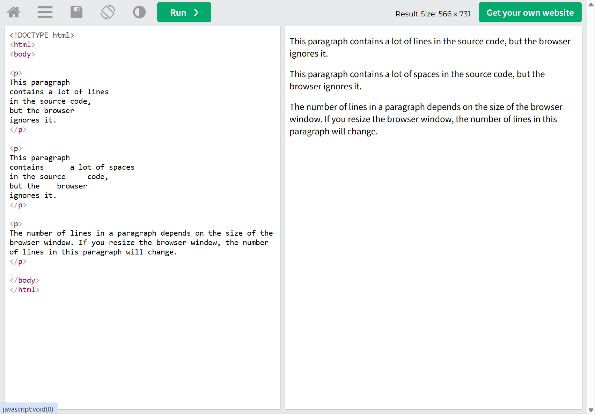


## html常用属性
### style
```html
<p style="color:red;">This is a red paragraph.</p>
```
- 一般都通过css来操纵样式,没必要用这个属性

### lang
```html
<!DOCTYPE html>
<html lang="zh-CN">
<body>
...
</body>
</html>
```
帮助搜索引擎和爬虫了解该文章所用的语言,我们平常浏览页面时弹出的是否翻译此页面,就是根据这个属性来判断,当前页面语言和浏览器默认语言是否相同的.
### class
为css提供一个访问入口,css通过`.`前缀来绑定dom中的class属性:
```html
<!DOCTYPE html>
<html>
<head>
<style>
.city {
  background-color: tomato;
  color: white;
  border: 2px solid black;
  margin: 20px;
  padding: 20px;
}
</style>
</head>
<body>

<div class="city">
  <h2>London</h2>
  <p>London is the capital of England.</p>
</div>

<div class="city">
  <h2>Paris</h2>
  <p>Paris is the capital of France.</p>
</div>

<div class="city">
  <h2>Tokyo</h2>
  <p>Tokyo is the capital of Japan.</p>
</div>

</body>
</html>
```

**效果**

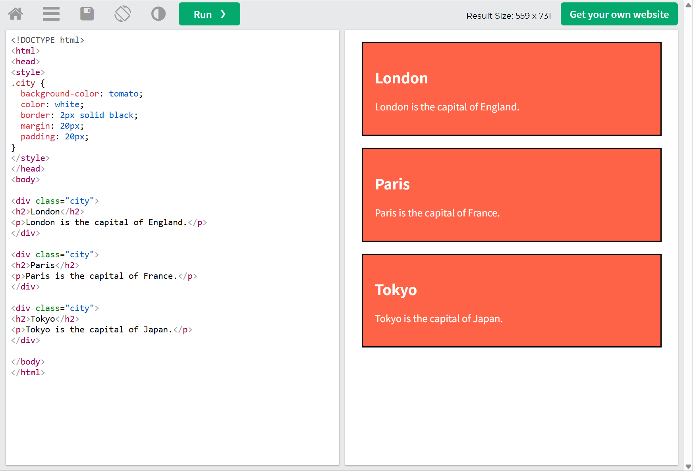

class有以下特点:

1. **一个元素可以有多个class,一个class也可以被多个元素使用**.
2. **后定义的class会覆盖先定义的class**

### id
显然,如果只有class的话,当两个标签的排版只有些微的不同时,我们是不希望重新写一个只有些微不同的class的,所以,html引入了**id**属性,用于额外标识标签元素,从而实现元素的精细化操控.

在同一个HTML页面中,ID必须是唯一的(类似身份证号),并且可被css通过`#`前缀来绑定:

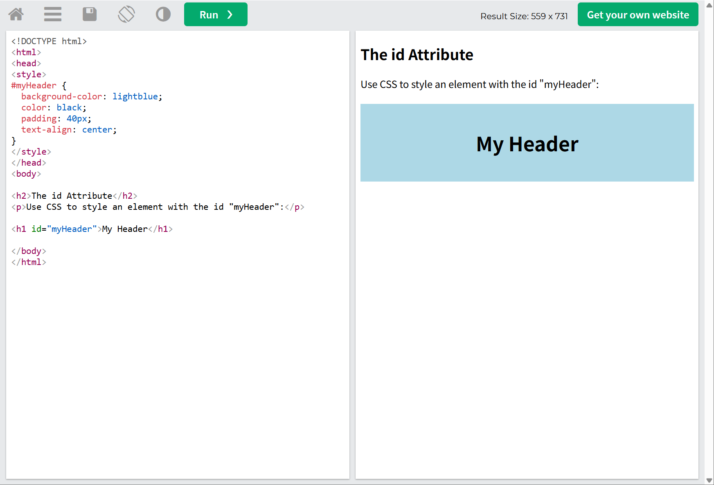

如前所说,我们引入id属性是为了对标签进行独特的修改,那么当一个元素同时拥有 id 和 class，且两者定义了同一个属性时,**id 的样式会覆盖 class 的样式**,这与它们在代码中出现的先后顺序无关.
## 中断符
### hr
`<hr>`表示界面的中断,会在文本中间划一道分割线.通常用它来分割内容:
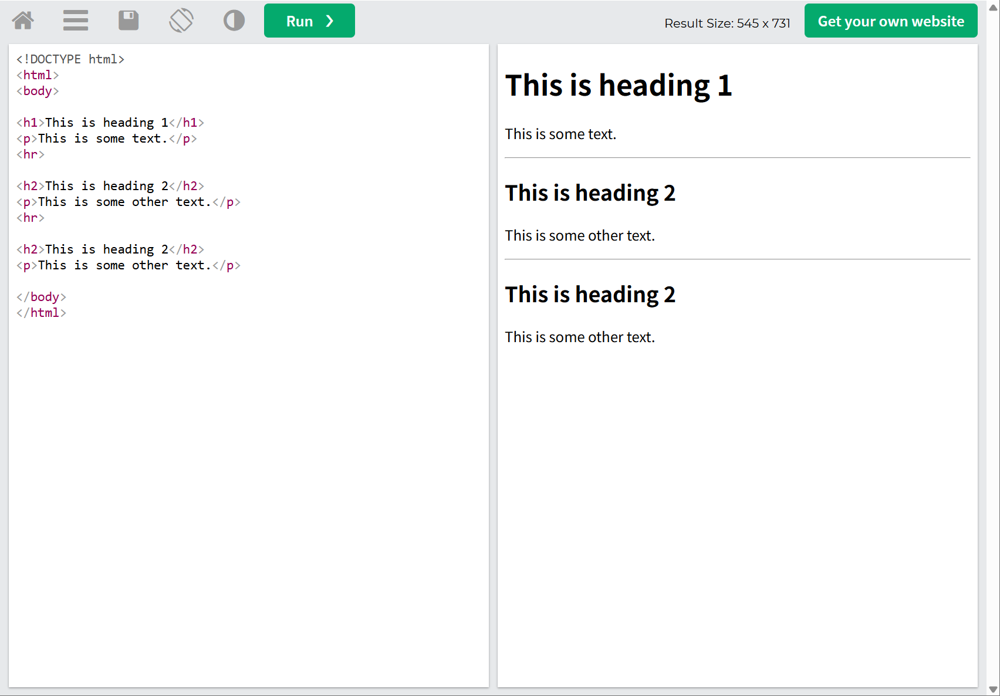
- hr: Horizontal Rule,水平分割线
### br
`<br>`表示换行,在文本中强制插入一个换行符,但不会开启新的段落:
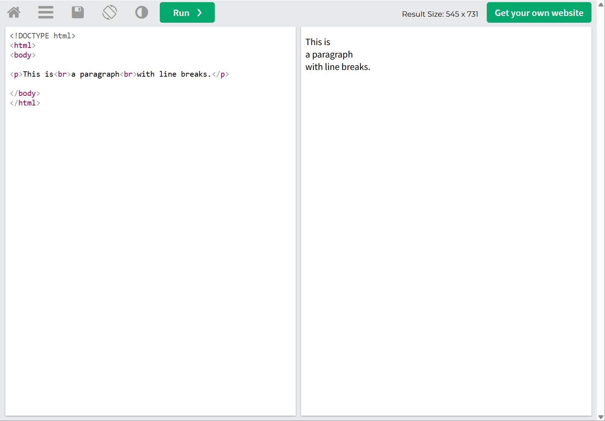

- br: Line Break,换行
## 排版元素表示
主要涉及: 表格/列表/容器/按钮
### 表格
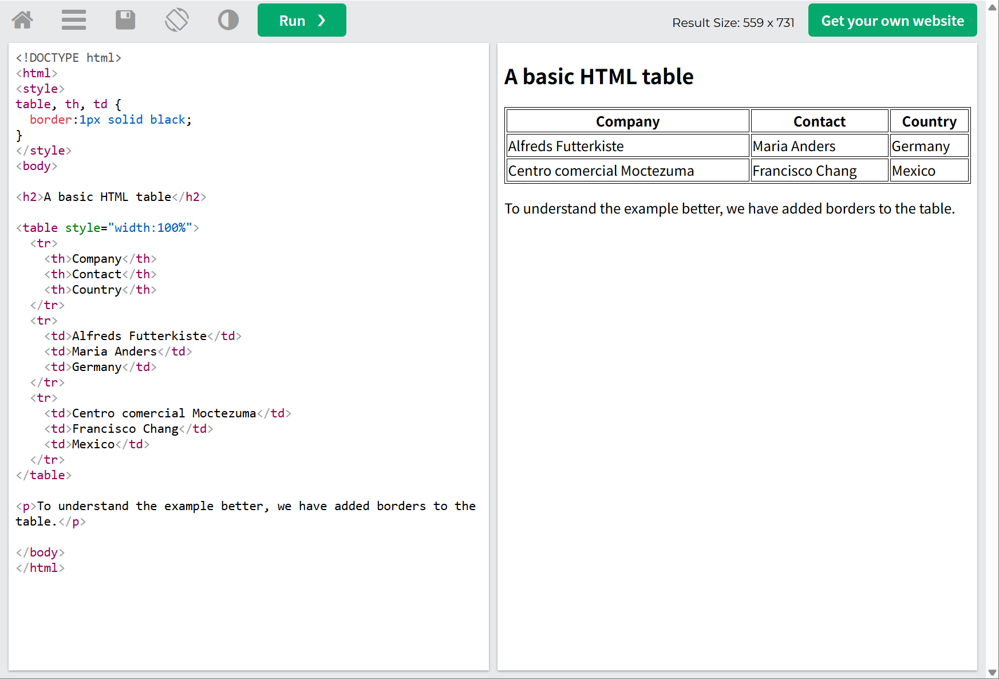
在table标签中`tr`意思是**table row**,`td`意思是**table data**,`td`意思是`table head`,都很好理解
### 列表
看首字母即可知道这几个元素的意思:

- ul: **unordered list**
- ol: **ordered list**
- dl: **description list**
- li: **list item**
- dt: **description term**(不用description item的原因可能是怕与div标签搞混)
- dd: **description details**

**分点列表(没有序号)**

```html
<ul>
  <li>Coffee</li>
  <li>Tea</li>
  <li>Milk</li>
</ul>
```
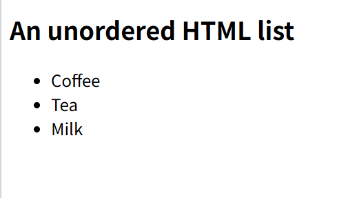

**数字列表**

```html
<ol>
  <li>Coffee</li>
  <li>Tea</li>
  <li>Milk</li>
</ol>
```
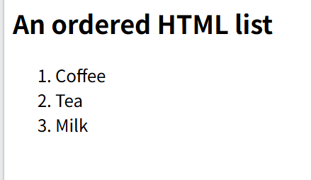

**加入描述的列表**

```html
<dl>
  <dt>Coffee</dt>
  <dd>- black hot drink</dd>
  <dt>Milk</dt>
  <dd>- white cold drink</dd>
</dl>
```

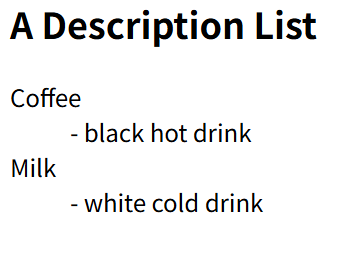
#### 嵌套列表
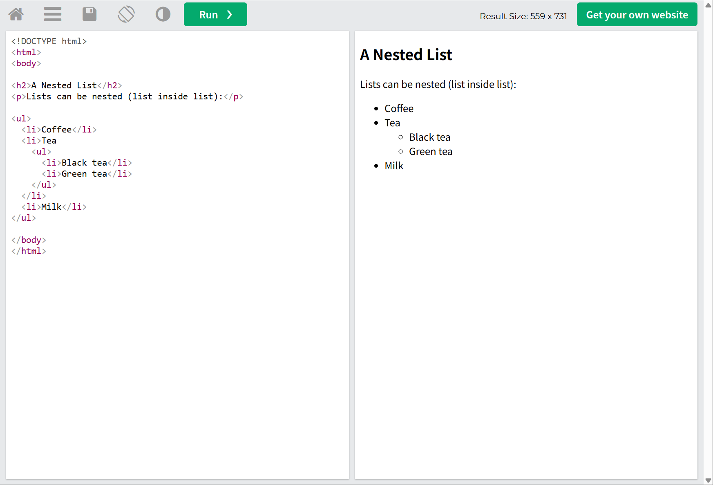
### 容器(div)
>The <div> element is by default a **block element**, meaning that **it takes all available width**, and comes with line breaks before and after.

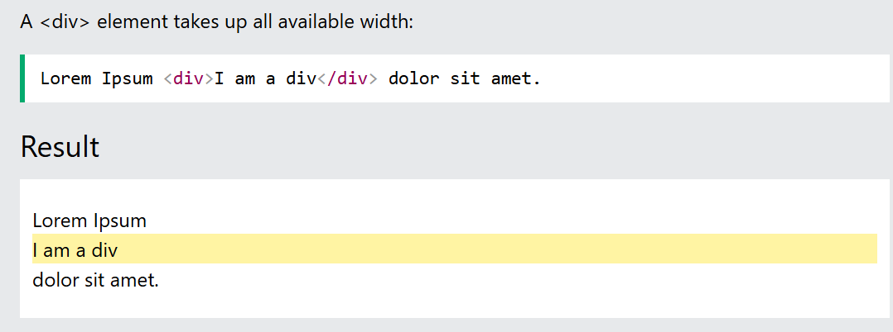

之所以div叫做容器,因为它可以装载html元素成一个单独的分块,方便被css和js处理并渲染:

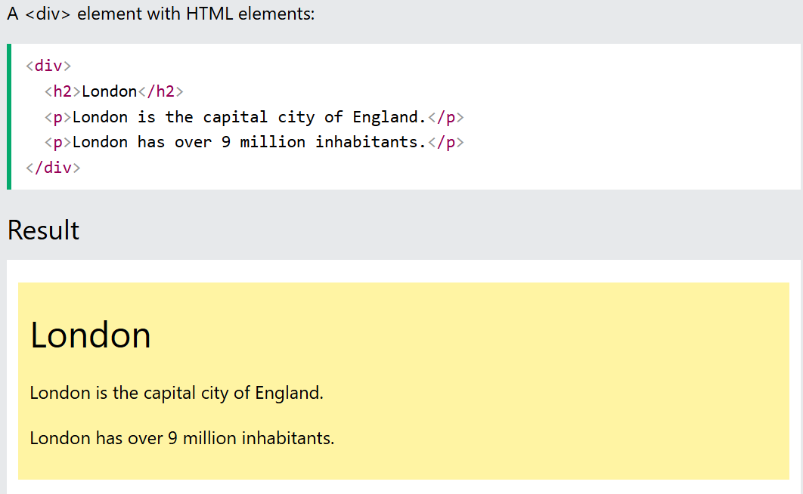

### span
该标签没有任何实质作用,仅仅是将一部分文本标记起来,方便通过设定class属性来供css和js操控:

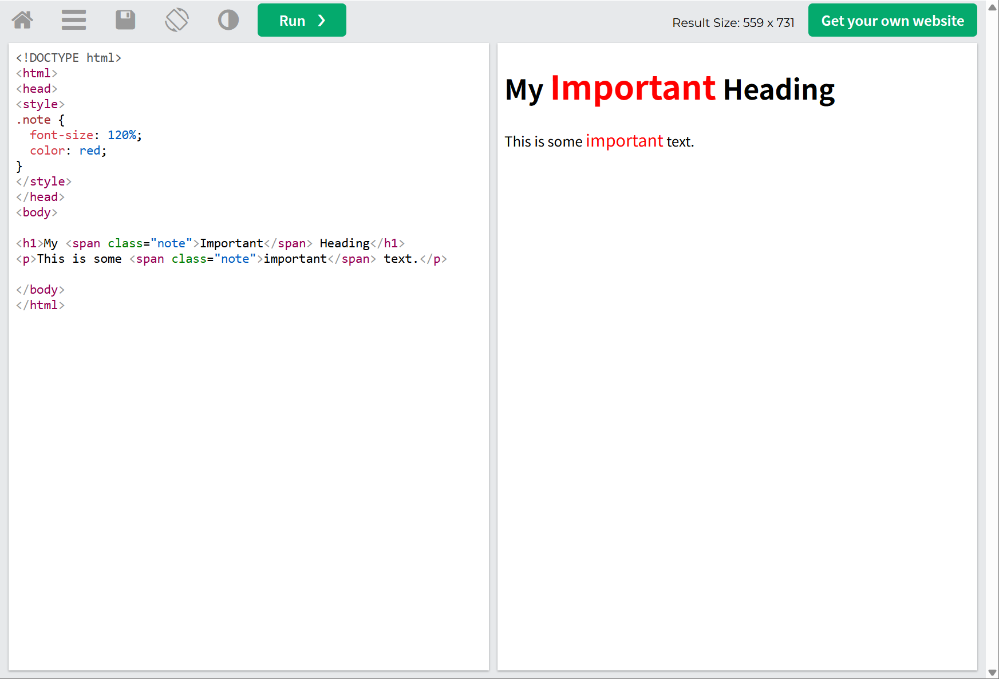

### 按钮
```html
<button>Click Me</button>
```

- 不太懂html制定者的标准是什么,image五个字母要变成img,button六个字母却不变成btn甚至bt...

button最强大的地方在于可以通过onclick属性绑定js:
```html
<button onclick="alert('Hello!')">Click Me</button>
```


## 链接表示
**超文本链接**
```html
<a href="https://www.w3schools.com">This is a link</a>
```
- href: Hypertext Reference,意为跳转链接

>**a标签的详细说明**
>
>a对应的全称为anchor(锚点),指代互联网海洋中相互勾连的节点,你可以从一个锚点跳转到另一个锚点.

**图像链接**
```html

```
这是我们目前为止看到的第一个不需要闭合的标签,因为我们无法用文本来指代图像.

- **src**: source,图片路径,可以是文件路径也可以是网页路径
- **alt**: **Alternate Text**,备用文本,以防图片无法正常显示时出现的占用文字,同时可以帮助盲人和爬虫理解.
- 宽高比通常由css设置,没必要在html中指定


## 嵌入文本文件/音视频
### iframe
>**iframe**用于在html内部展示另一个html文件或者其他文本文件.

- iframe: **inline frame**,行内框架
**基本结构**
```html
<iframe src="url" title="description"></iframe>
```

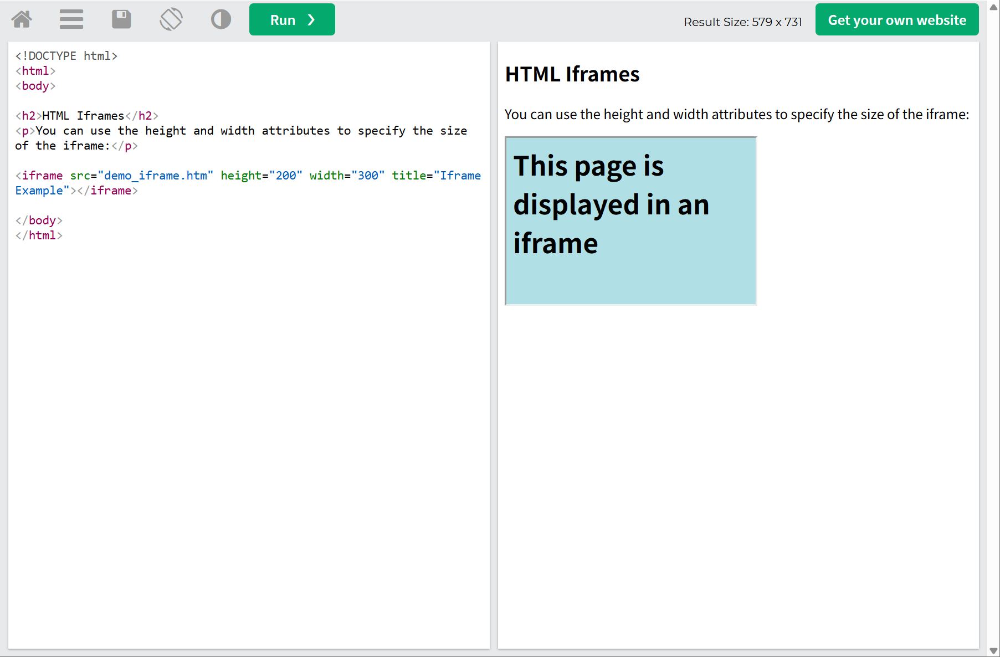

#### 流媒体展示
由于可以直接展示html网页,自然也就可以展示流媒体(B站,Youtube)中的音视频:
```html
<iframe 
    src="//player.bilibili.com/player.html?bvid=BV1yVQFBNEPn&page=1&high_quality=1&danmaku=0" 
    allow="autoplay; fullscreen; encrypted-media" 
    allowfullscreen="true" 
    width="100%" 
    height="500" 
    frameborder="0">
</iframe>
```

<iframe 
    src="//player.bilibili.com/player.html?bvid=BV1yVQFBNEPn&page=1&high_quality=1&danmaku=0" 
    allow="autoplay; fullscreen; encrypted-media" 
    allowfullscreen="true" 
    width="100%" 
    height="500" 
    frameborder="0">
</iframe>


### video
video的用法与image标签别无二致
```html
<video 
    src="https://www.w3schools.com/html/mov_bbb.mp4" 
    controls 
    width="640">
    您的浏览器不支持 video 标签。
</video>
```

<video 
    src="https://www.w3schools.com/html/mov_bbb.mp4" 
    controls 
    width="640">
    您的浏览器不支持 video 标签。
</video>

### audio
用法别无二致:

```html
<audio controls>
  <source src="horse.ogg" type="audio/ogg">
  <source src="horse.mp3" type="audio/mpeg">
Your browser does not support the audio element.
</audio>
```
值得注意的是,我们这里使用了source内部标签而没有将src作为父标签`audio`的属性,source标签用于为浏览器提供多样的选择,自上而下扫描第一个可用的源.
## 表单(form)
>早期不使用js的时候我们只能通过html中的表单(form)元素来提交用户输入,所以还是有必要了解的.

### form标签
该标签作为所有输入标签的容器,不会单独出现
### input标签
最常用的输入标签,根据内部的type属性来决定输入的内容,下面是一些常用的type属性值:
| Type                      | Description                                                      |
| :------------------------ | :--------------------------------------------------------------- |
| `<input type="text">`     | Displays a single-line text input field                          |
| `<input type="radio">`    | Displays a radio button (for selecting one of many choices)      |
| `<input type="checkbox">` | Displays a checkbox (for selecting zero or more of many choices) |
| `<input type="submit">`   | Displays a submit button (for submitting the form)               |
| `<input type="button">`   | Displays a clickable button                                      |
### name属性
除了submit类型外,每个input标签都需要有一个**name属性**才可以被发送到服务器并被识别:
```html
<form action="/action_page.php">
  <label for="fname">First name:</label><br>
  <input type="text" id="fname" value="John"><br><br>
  <input type="submit" value="Submit">
</form>
```
### label标签
该标签用于显示输入提示,因为**input标签是无闭合的**,所以需要额外的信息来提示用户输入:
```html
<form>
  <label for="fname">First name:</label><br>
  <input type="text" id="fname" name="fname"><br>
  <label for="lname">Last name:</label><br>
  <input type="text" id="lname" name="lname">
</form>
```

**渲染出来的界面如下:**

<form>
  <label for="fname">First name:</label><br>
  <input type="text" id="fname" name="fname"><br>
  <label for="lname">Last name:</label><br>
  <input type="text" id="lname" name="lname">
</form>


我们可以看到label标签中有个for属性,可以看到它与input标签中的id属性值相同.它主要用于将label和input标签绑定起来,当点击标签文素时,**浏览器可以自动帮你将光标聚焦到输入框内**.

事实上,尽管form有很多功能还没提及,但了解到这里就够了,能够看懂JSX中的输入标签即可.

## Head部分的标签
### 概览
| Tag        | Description                                                           |
| :--------- | :-------------------------------------------------------------------- |
| `<head>`   | Defines information about the document                                |
| `<title>`  | Defines the title of a document                                       |
| `<base>`   | Defines a default address or a default target for all links on a page |
| `<link>`   | Defines the relationship between a document and an external resource  |
| `<meta>`   | Defines metadata about an HTML document                               |
| `<script>` | Defines a client-side script                                          |
| `<style>`  | Defines style information for a document                              |

下面开始逐个解释这些标签:

### **title**
功能:
1. defines a title in the browser toolbar
2. provides a title for the page when it is added to favorites
3. displays a title **for the page in search engine-results**

```html
<!DOCTYPE html>
<html>
<head>
  <title>A Meaningful Page Title</title>
</head>
<body>

The content of the document......

</body>
</html>
```

### **style**
功能:

- 写入内嵌css

```html
<style>
  body {background-color: powderblue;}
  h1 {color: red;}
  p {color: blue;}
</style>
```

### **link**
功能:

1. 引入外部静态文件

说明:

1. rel: relationship,点名这个文件的格式和功能
2. type: 对于图像等格式众多的文件,需要额外说明它的具体格式

引入外部css文件
```html
<link rel="stylesheet" href="mystyle.css">
```
引入标题栏的图标:
```html
<!DOCTYPE html>
<html>
<head>
  <title>My Page Title</title>
  <link rel="icon" type="image/x-icon" href="/images/favicon.ico">
</head>
<body>
<!-- omitted -->
</body>
</html>
```

### **meta**

功能:

1. pecify the character set, page description, keywords, author of the document, and viewport settings.
2. 不会展示在页面上,仅供浏览器/搜索引擎识别和处理

Define the character set used:

```html
<meta charset="UTF-8">
```

Define keywords for search engines:

```html
<meta name="keywords" content="HTML, CSS, JavaScript">
```

Define a description of your web page:

```html
<meta name="description" content="Free Web tutorials">
```

Define the author of a page:

```html
<meta name="author" content="John Doe">
```

Refresh document every 30 seconds:

```html
<meta http-equiv="refresh" content="30">
```

Setting the viewport to make your website look good on all devices:

```html
<meta name="viewport" content="width=device-width, initial-scale=1.0">
```

### script
由于html的某些设计问题,js代码没有像css一样用link进行导入,而是单独引入了一个标签script:

```html
<script>
function myFunction() {
  document.getElementById("demo").innerHTML = "Hello JavaScript!";
}
</script>
```
## body部分的语义标签(semantic elements)
这一部分主要是谈一下一些常用的语义标签,它们基本都可以在JSX中找到对应的元素

### section标签
将文档分节,一般用在以下位置:

1. Chapters
2. Introduction
3. News items
4. Contact information

```html
<section>
<h1>WWF</h1>
<p>The World Wide Fund for Nature (WWF) is an international organization working on issues regarding the conservation, research and restoration of the environment, formerly named the World Wildlife Fund. WWF was founded in 1961.</p>
</section>

<section>
<h1>WWF's Panda symbol</h1>
<p>The Panda has become the symbol of WWF. The well-known panda logo of WWF originated from a panda named Chi Chi that was transferred from the Beijing Zoo to the London Zoo in the same year of the establishment of WWF.</p>
</section>
```

- 没什么难懂的

### article标签
用于展示文章和评论:

```html
<article>
<h2>Google Chrome</h2>
<p>Google Chrome is a web browser developed by Google, released in 2008. Chrome is the world's most popular web browser today!</p>
</article>

<article>
<h2>Mozilla Firefox</h2>
<p>Mozilla Firefox is an open-source web browser developed by Mozilla. Firefox has been the second most popular web browser since January, 2018.</p>
</article>

<article>
<h2>Microsoft Edge</h2>
<p>Microsoft Edge is a web browser developed by Microsoft, released in 2015. Microsoft Edge replaced Internet Explorer.</p>
</article>
```
### header标签
展示引言:
```html
<article>
  <header>
    <h1>What Does WWF Do?</h1>
    <p>WWF's mission:</p>
  </header>
  <p>WWF's mission is to stop the degradation of our planet's natural environment,
  and build a future in which humans live in harmony with nature.</p>
</article>
```
### footer标签
展示脚注:
```html
<footer>
  <p>Author: Hege Refsnes</p>
  <p><a href="mailto:hege@example.com">hege@example.com</a></p>
</footer>
```
### nav标签
展示导航链接:

```html
<nav>
  <a href="/html/">HTML</a> |
  <a href="/css/">CSS</a> |
  <a href="/js/">JavaScript</a> |
  <a href="/jquery/">jQuery</a>
</nav>
```
### figure与figcaption标签
由于img,video等标签无法展示说明文字或者标题,只能通过div容器的包装实现假标题,所以HTML5中引入了这figure和figcaption标签,用于更好地展示图表:

```html
<figure>
  
  <figcaption>Fig1. - Trulli, Puglia, Italy.</figcaption>
</figure>
```


## 总结
首先我们需要知道的是,大多数html标签都是闭合的,需要写成类似`<p> </p>`的格式,少数标签如img,input,meta和换行符才不需要闭合.

其次,我们一直没有深入探讨html元素的原生style修饰,那是因为在html中指明样式太麻烦了,所以在html诞生不久之后,又一个划时代的标记语言: CSS,产生了.

# CSS
- [wiki](https://en.wikipedia.org/wiki/CSS)

>**Cascading Style Sheets** (CSS) is a style sheet language used for specifying the presentation and styling of a document written in a markup language, such as **HTML or XML**.

- 总结一下就是,**css是因为html中的style写法很麻烦才发明出来的**

## CSS历史
### 单体版本阶段 (1994 - 2011)
此阶段 CSS 作为一个整体规范进行线性迭代。

* **1994 - 1996：诞生与 CSS1**
    * **1994**：Håkon Wium Lie 提出 CSS 构想。
    * **1996**：**CSS 1.0** 正式发布。定义了基础的文字颜色、字体和盒模型。
* **1998：功能扩张与 CSS2**
    * 发布 **CSS 2.0**。引入了 `absolute/relative` 定位、`z-index` 及媒体类型（如打印样式）。
* **2011：基石奠定与 CSS 2.1**
    * 经过 13 年的浏览器兼容性博弈与修正，**CSS 2.1** 发布。它删除了未被实现的特性，成为现代 CSS 的核心基石。


### 模块化演进阶段 (1999 - 至今)
自 CSS3 起，W3C 废弃了整体版本号，将规范拆分为数十个独立的**模块 (Modules)**。

* **1999 - 2011：CSS3 模块化开启**
    * 规范被拆分为“选择器”、“颜色”、“盒模型”等模块。
    * **版本逻辑**：在 CSS2.1 已有的功能基础上，新版本编号从 **Level 3** 开始（即常说的 CSS3）。
* **2012 - 2020：高版本模块迭代 (CSS4/5 概念)**
    * 不存在整体的“CSS4”文件。
    * **Level 4 演进**：当 Level 3 模块开发完成后，自动进入 **Level 4**（如 `Selectors Level 4` 引入了 `:has()` 选择器）。
    * **Level 1 起步**：对于全新特性（如 Flexbox、Grid），版本号从 **Level 1** 开始。
* **2021 - 2026：年度快照 (Snapshots)**
    * W3C 定期发布 **CSS Snapshot**，定义当前已稳定并被主流浏览器广泛支持的模块集合，作为开发者的实践参考。

看得出来CSS本身的生态比起HTML来更加混乱,甚至没有一个统一的版本号.

## CSS语法与CSS选择器
一个常见的css写法如下:
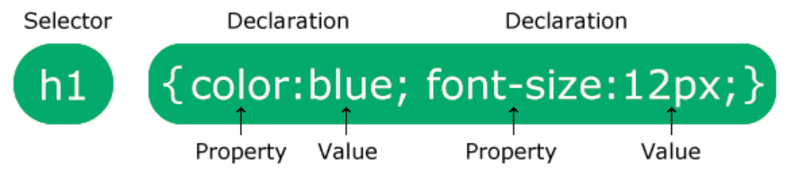

- selector: 选择器,指向被修饰的元素
- declaration: 修饰语句
- property: 修饰所用的属性
- value: 属性值

可以看到css用分号将多个修饰语句隔开,用`{}`隔离不同的修饰段,比起html语义更加清晰了:

```css
p {
  color: red;
  text-align: center;
}
```
### 选择器
#### 标签元素的修饰
该方法通常用于全局样式的处理,例如下面的代码会将所有的p标签变红:
```css
p {
  text-align: center;
  color: red;
}
```
#### id和class属性的修饰
id选择器只会处理单个标签:
```css
#para1 {
  text-align: center;
  color: red;
}
```
而class选择器处理一类标签:
```css
/* In this example all HTML elements with class="center" will be red and center-aligned:  */
.center {
  text-align: center;
  color: red;
}
```
#### 多个元素的选择
通配符`*`会影响**html中的所有元素**:
```css
* {
  text-align: center;
  color: blue;
}
```

而有时候如果多个元素的处理方法相同的话:
```css
h1 {
  text-align: center;
  color: red;
}

h2 {
  text-align: center;
  color: red;
}

p {
  text-align: center;
  color: red;
}
```
显然这么写太麻烦了,我们可以合并一下变成下面这样:
```css
h1, h2, p {
  text-align: center;
  color: red;
}
```

### 层叠的css
之所以CSS叫做**Cascading Style Sheets**,是因为当一个html中含有多个css时,它按照以下顺序解读:
1. Inline style (inside an HTML element)
2. External and internal style sheets (in the head section)
   1. 后定义的样式表属性会覆盖先定义的样式表中的相同属性
3. Browser default
## CSS调色
### 颜色属性名
**color**,调整标签中文本的颜色:
```html
<h1 style="color:Tomato;">Hello World</h1>
<p style="color:DodgerBlue;">Lorem ipsum...</p>
<p style="color:MediumSeaGreen;">Ut wisi enim...</p>
```

**border**,调整标签的边框颜色:
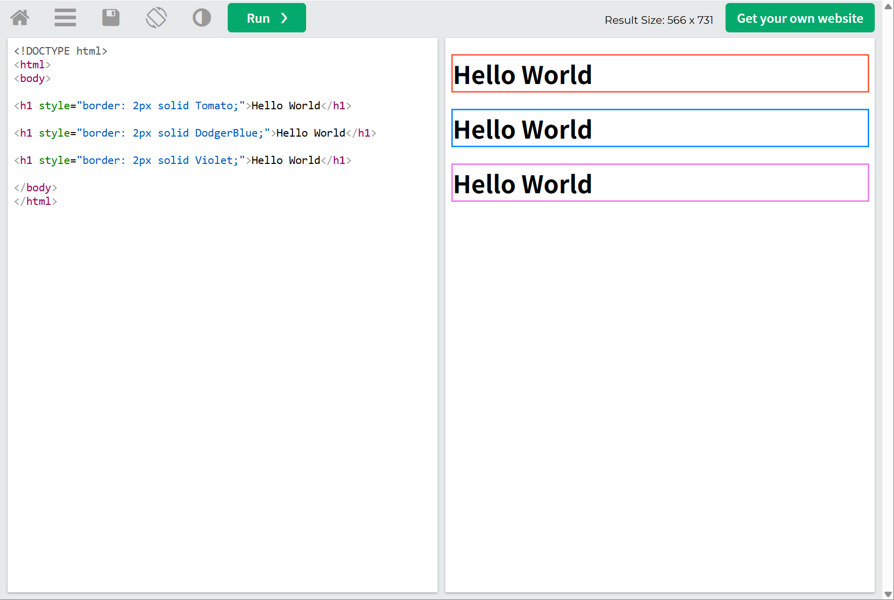

**background-color**,调整标签背景颜色:

```html
<h1 style="background-color:rgb(255, 99, 71);">...</h1>
<h1 style="background-color:#ff6347;">...</h1>
<h1 style="background-color:hsl(9, 100%, 64%);">...</h1>

<h1 style="background-color:rgba(255, 99, 71, 0.5);">...</h1>
<h1 style="background-color:hsla(9, 100%, 64%, 0.5);">...</h1>
```

效果:
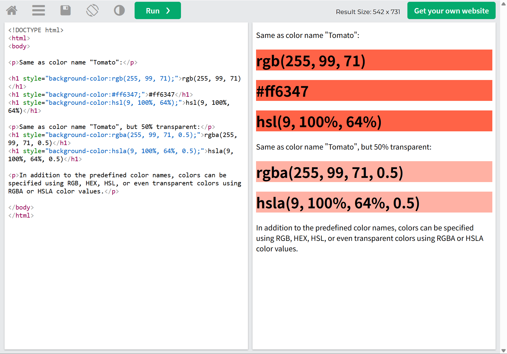


### 调色方法
#### 通过颜色名调色
```html
<h1 style="color:Tomato;">Hello World</h1>
<p style="color:DodgerBlue;">Lorem ipsum...</p>
<p style="color:MediumSeaGreen;">Ut wisi enim...</p>
```
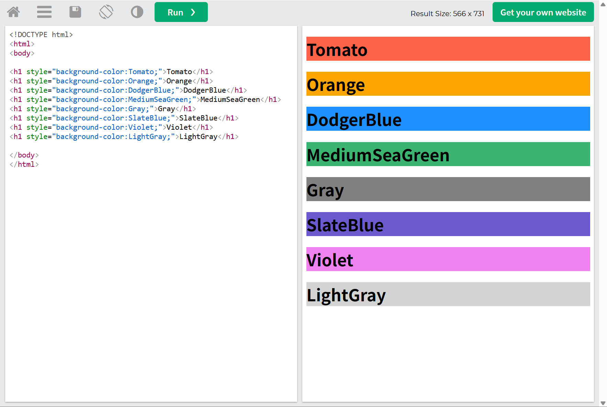
#### 通过RGB调色
**RGB**: red,green,blue,通过调整三原色的数值(取值为0-255),我们可以展示所有的颜色.
```html
<!DOCTYPE html>
<html>
<body>

<h1>Specify colors using RGB values</h1>

<h2 style="background-color:rgb(255, 0, 0);">rgb(255, 0, 0)</h2>
<h2 style="background-color:rgb(0, 0, 255);">rgb(0, 0, 255)</h2>
<h2 style="background-color:rgb(60, 179, 113);">rgb(60, 179, 113)</h2>
<h2 style="background-color:rgb(238, 130, 238);">rgb(238, 130, 238)</h2>
<h2 style="background-color:rgb(255, 165, 0);">rgb(255, 165, 0)</h2>
<h2 style="background-color:rgb(106, 90, 205);">rgb(106, 90, 205)</h2>

</body>
</html>
```
**效果**
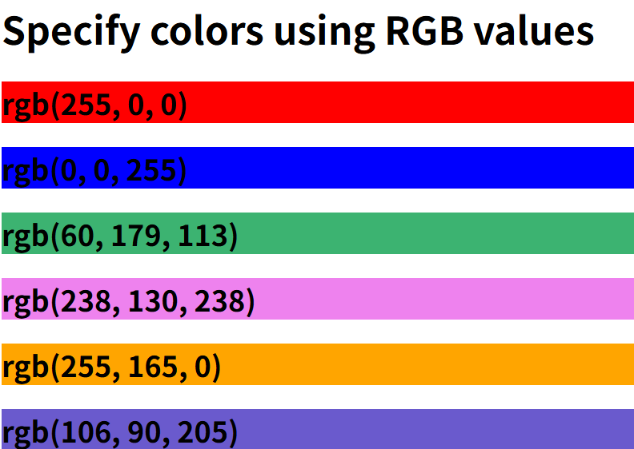

**RGBA**: red,green,blue,alpha,其中,alpha用于调整背景颜色的**不透明度**,取值为0-1.

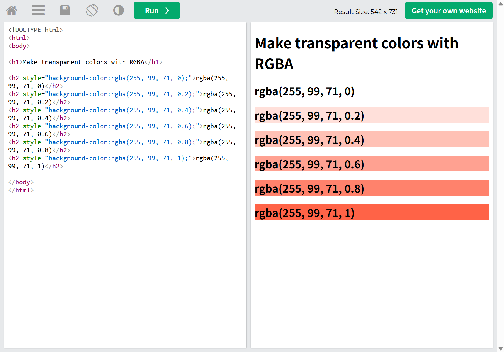

RGBA本质上是线性插值运算:

$$C_o = \alpha C_f + (1 - \alpha) C_b$$
其中：
*   $C_o$：输出颜色（Output）
*   $C_f$：前景颜色（Foreground）
*   $C_b$：背景颜色（Background）
*   $\alpha$：[0, 1] 之间的取值

#### 通过HEX调色
HEX: **hexadecimal**,用十六进制来表示之前的RGB,那么每种原色就需要两位数字,相当于`#rrggbb`:
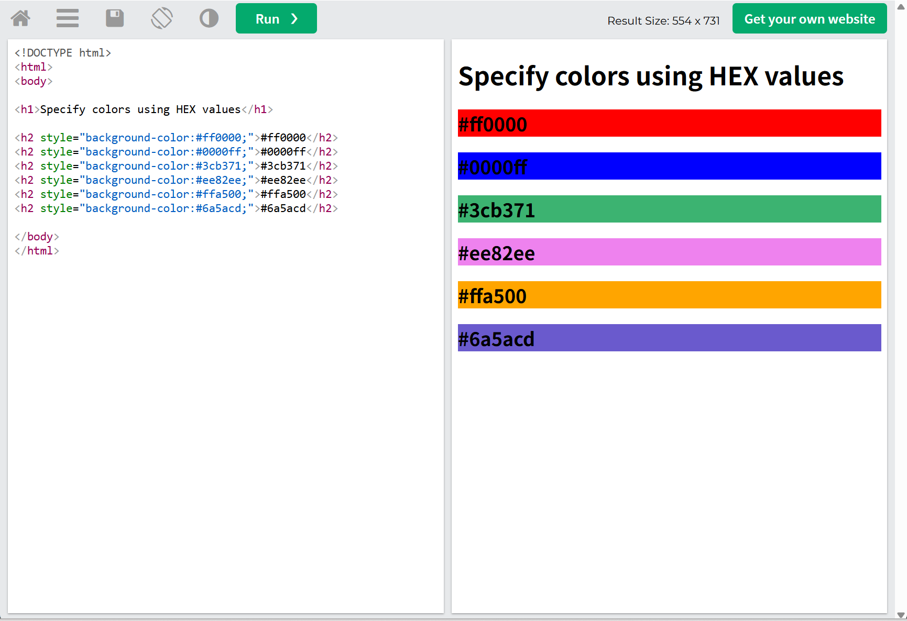

由于个位数上的差别不会对颜色有多大的影响,故我们可以使用三位数的缩写:
```css
body {
  background-color: #fc9; /* same as #ffcc99 */
}

h1 {
  color: #f0f; /* same as #ff00ff */
}

p {
  color: #b58; /* same as #bb5588 */
}
```
#### 通过HSL调色
hsl,**(hue, saturation, lightness)**:

- Hue is **a degree on the color wheel** (from 0 to 360):
  - 0 (or 360) is red
  - 120 is green
  - 240 is blue
- Saturation is a percentage value: 0% means a shade of gray, and 100% is the full color.
  - 灰度层,相当于调整颜色的鲜艳度
- Lightness is also a percentage; 0% is black, 50% is neither light or dark, 100% is white.
  - 亮度层,相当于调整颜色的打光度

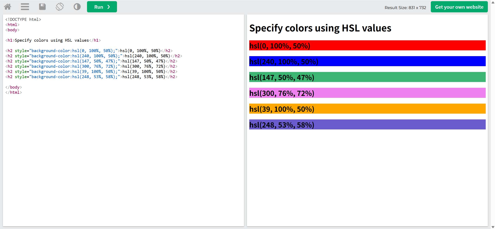
## CSS调整背景
### 调整背景颜色
**background-color**可以对所有的html元素生效:

```css
h1 {
  background-color: green;
}

div {
  background-color: lightblue;
}

p {
  background-color: yellow;
}
```

还可以在background-color的基础上调整背景颜色的透明度:
```css
div {
  background-color: green;
  opacity: 0.3;
}
```

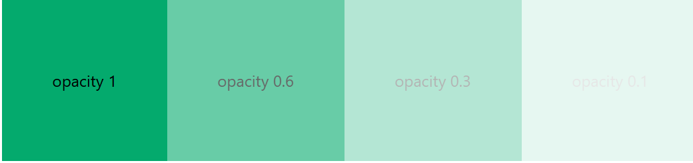

### 设置背景图像

我们需要通过url参数来定位图像
```css
body {
  background-image: url("paper.gif");
}
/* 这里的引号不是必须的,但可以提升兼容性 */
```

By default, the image is repeated so it covers the entire element:
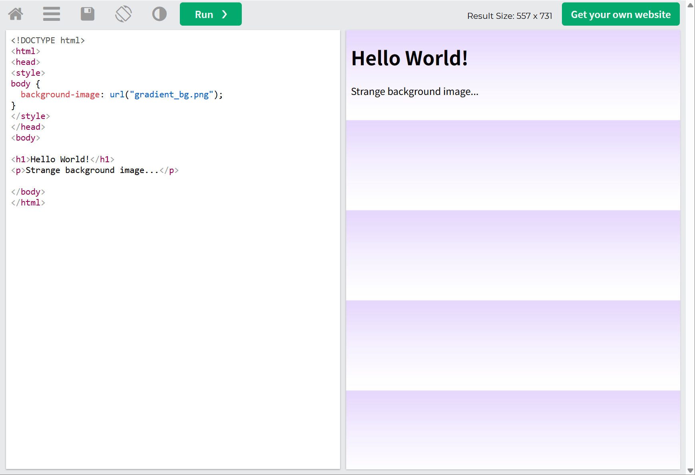

因此,我们需要对图像的默认重复做出调整,比如调整为只在水平方向/垂直方向重复,或者调整为不重复:
```css
body {
  background-image: url("gradient_bg.png");
  background-repeat: repeat-x;
}
```

```css
body {
  background-image: url("img_tree.png");
  background-repeat: no-repeat;
}
```
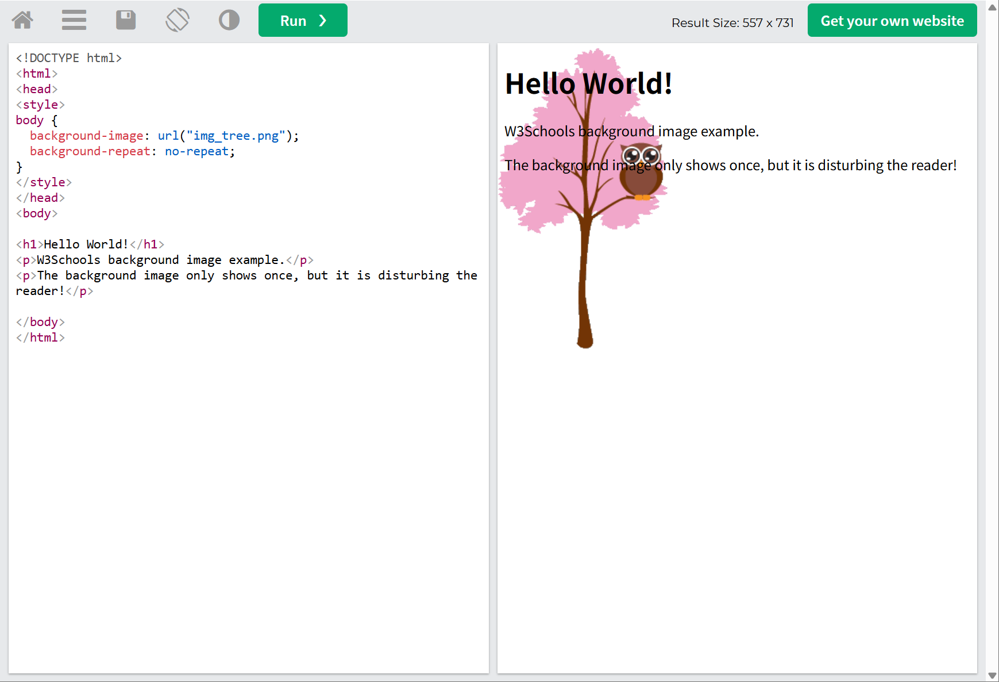

我们还可以设置图像的位置:
```css
body {
  background-image: url("img_tree.png");
  background-repeat: no-repeat;
  background-position: right top;
}
```
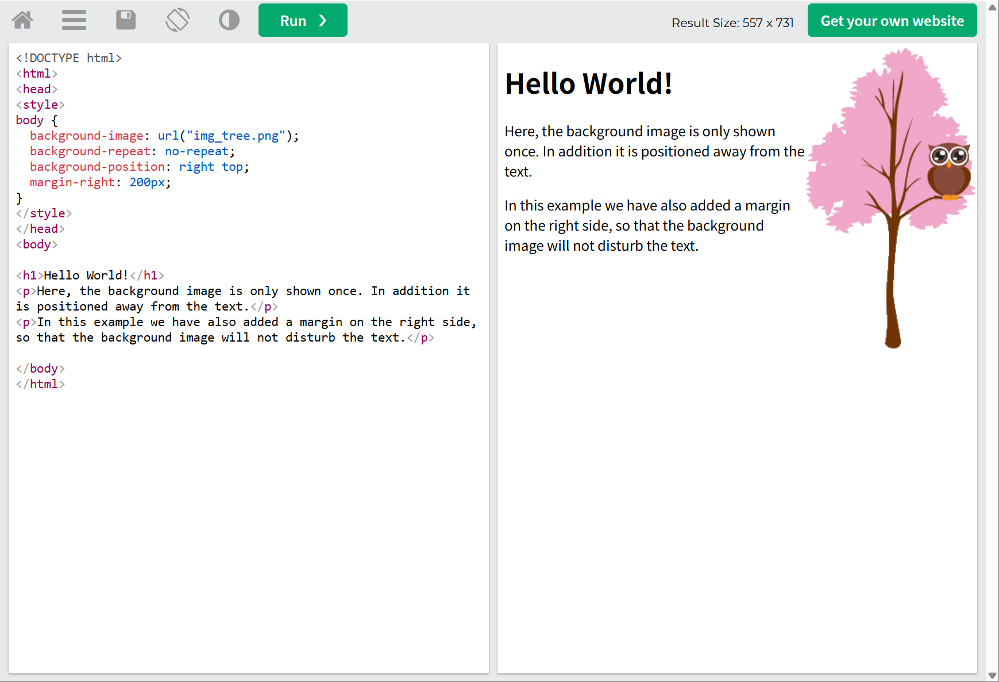

还可以让图像随着页面一起滚动:
```css
body {
  background-image: url("img_tree.png");
  background-repeat: no-repeat;
  background-position: right top;
  background-attachment: fixed;
}
```

四个参数一个个写太麻烦了,所以我们可以全都合并到background参数里面:
```css
body {
  background: #ffffff url("img_tree.png") no-repeat right top;
}
```

The `background` property is a shorthand property for the following properties:

*   **background-color**
*   **background-image**
*   **background-position**
*   **background-size**
*   **background-repeat**
*   **background-attachment**
*   **background-origin**
*   **background-clip**

If some of the property values are missing, they will be set to their initial (default) values.
## CSS调整边界/页边距/空白(待补充)
## 高级CSS选择器
### 选择符
- [简单有效的知乎专栏](https://zhuanlan.zhihu.com/p/180011240)
#### 空格
选择某元素内的所有子元素
```css
<style type="text/css">
	h1 strong {
		color: red;
	}
</style>

<body>
	<h1>
		<strong>一代子元素</strong>
	</h1>
	<h1>
		<span>
			<strong>二代子元素</strong>
		</span>
	</h1>
</body>
```
- 上述的两个strong标签都会被选中

#### 大于号
选择某元素后的一代子元素
```css
<style type="text/css">
	h1>strong {
		color: red;
	}
</style>

<body>
	<h1>
		<strong>一代子元素</strong>
	</h1>
	<h1>
		<span>
			<strong>二代子元素</strong>
		</span>
	</h1>
</body>
```
- 只有一代的strong标签会被选中


### 合并选择
我们可以将普通的选择和类选择合并,变成这样:
```css
p.dotted {outline-style: dotted;}
```
- 上述代码只会选择具有dotted类的p标签.
### 伪类
css中有一类关键词被称为**伪类(Pseudo-classes)**,它可以加在选择器的后面,达成一些特殊的目的,如:
1. Style an element when a user moves the mouse over it
2. Style visited and unvisited links differently
3. Style an element when it gets focus
4. Style valid/invalid/required/optional form elements
5. Style an element that is the first child of its parent

语法如下,使用了冒号:
```css
selector:pseudo-class-name {
  CSS properties
}
```

常用的一些伪类如下:
*   `:hover`：鼠标指针悬停在元素上时。
*   `:active`：元素被激活时（如鼠标按下未释放）。
*   `:focus`：元素获得焦点时（如通过 Tab 键选中输入框）。
*   `:visited`：链接已被访问过。
*   
*   `:disabled`：匹配禁用的表单元素。
*   `:enabled`：匹配可用的表单元素。
*   `:checked`：匹配选中的复选框（checkbox）或单选按钮（radio）。
*   
*   `:first-child`：匹配其父元素的第一个子元素。
*   `:last-child`：匹配其父元素的最后一个子元素。
*   `:nth-child(n)`：匹配其父元素的第 n 个子元素（可用 `2n` 表示偶数，`odd` 表示奇数）。
*   `:only-child`：匹配父元素中唯一的子元素。

例如,我们可以这样调整a标签:
```css
/* unvisited link */
a:link {
  color: #FF0000;
}

/* visited link */
a:visited {
  color: #00FF00;
}

/* mouse over link */
a:hover {
  color: #FF00FF;
}

/* selected link */
a:active {
  color: #0000FF;
}
```

例如,选择特定的子元素:
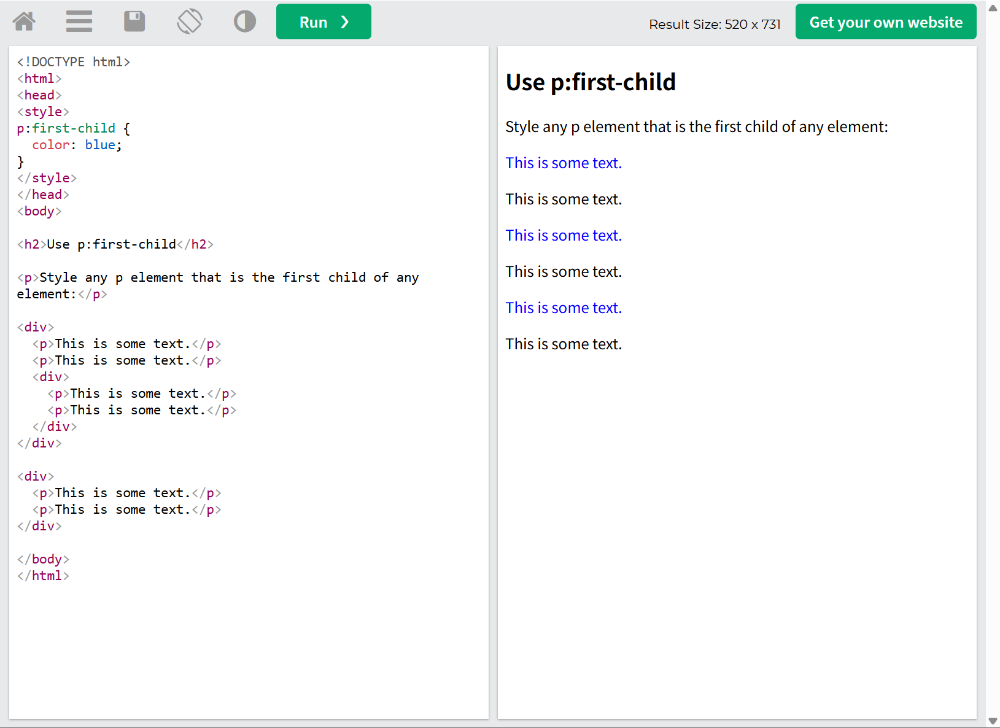

### 伪元素
另一类更少见的关键词是**伪元素（Pseudo-Elements）**,它主要用来更改一段文本的特定部分,例如:
1. Style the first letter or first line, of an element
2. Style the user-selected portion of an element
3. Style the viewbox behind a dialog box

语法如下:
```css
selector::pseudo-element-name {
  CSS properties
}
```

例如,我们可以只渲染一个段落的第一行:
```css
p::first-line {
  color: red;
  font-variant: small-caps;
  font-size: 19px;  
}
```
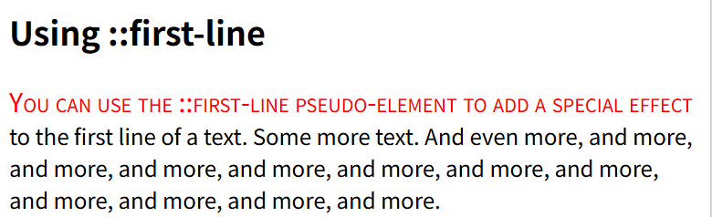


我们偶尔会看到CSS代码中出现`@`这个符号,它的作用十分广大,属于CSS的高级语法
## @规则


# JavaScript
- [wiki](https://en.wikipedia.org/wiki/JavaScript)

JS是一门让静态网页`动起来`的脚本语言,CSS和HTML只用于展示内容,而JS用于真正的**用户交互**.

## JS历史
### 1. 诞生与混乱期 (1995 - 1996)
* **1995年5月**：Brendan Eich 在 Netscape 仅用 10 天设计出原型，初名 **Mocha**。
* **1995年9月**：更名为 **LiveScript** 随 Navigator 2.0 beta 发布。
* **1995年12月**：Netscape 与 Sun 联手，将其正式定名为 **JavaScript**（纯粹的营销策略，与 Java 无关）。
* **1996年**：微软发布 **JScript**（IE3.0），浏览器战争爆发，兼容性碎片化开始。


### 2. 标准化初期 (1997 - 1999)
* **1997年6月**：**ECMAScript 1 (ES1)** 发布，确立了语言的标准核心。
* **1998年6月**：**ES2** 发布，主要与 ISO 国际标准对齐。
* **1999年12月**：**ES3** 发布。引入正则表达式、try/catch、`switch` 等现代语法，成为此后十年网页脚本的基石。


### 3. 停滞与再生期 (2000 - 2009)
* **2000 - 2008年**：由于微软 IE 占据 95% 市场份额，标准制定陷入僵局，激进的 **ES4** 提案因过于复杂被废弃。
* **2005年**：**AJAX** 概念提出，JS 从“弹窗小工具”转型为开发 Web 应用的核心。
* **2008年**：Google 发布 **Chrome (V8 引擎)**，引入 JIT 编译技术，JS 运行速度实现量级跨越。
* **2009年**：**Node.js** 诞生，JS 脱离浏览器进入服务器端领域。
* **2009年12月**：**ES5** 正式发布。增加“严格模式”、JSON 支持及数组原型方法（如 `map`, `filter`）。


### 4. 现代爆发期 (2015 - 至今)
* **2015年6月**：**ES6 (ECMAScript 2015)** 发布。这是历史上最大的更新，引入了类 (Class)、箭头函数、模块化 (Modules)、Promise 等现代编程特性。
* **年度迭代机制**：自 ES6 后，TC39 委员会改为每年发布一个小版本，不再通过版本号（如 ES7/8）而是通过年份命名。
    * **ES2016 - ES2023**：持续引入 `async/await`、可选链 (`?.`)、空值合并 (`??`) 等特性。

## JS语法
- [js.info教程](https://zh.javascript.info/)
  - 很全面,但会谈到很多不必要的琐碎知识点,建议该跳过的就跳过,不然看的很累
JS的设计一开始非常糟糕,现在的良好架构都是在后来加上的,所以我们只学习最新的语法即可,而不用管哪些琐碎的老旧知识点.

### 基础语法
- 学js前建议先入门一个后端语言如cpp和python,不然js的混乱语法会把你搞得很懵
#### 变量声明与定义
普通变量的定义如下:
```js
// 先声明再赋值

let message;
message = 'Hello'; // 将字符串 'Hello' 保存在名为 message 的变量中

// 定义多个变量的两种方法

let user = 'John', age = 25, message = 'Hello';

let user = 'John';
let age = 25;
let message = 'Hello';
```

常量定义如下:
```js
const myBirthday = '18.04.1982';

myBirthday = '01.01.2001'; // 错误，不能对常量重新赋值
```
#### 变量类型
由于JS和python一样本身是动态类型的,所以一个变量可以被赋不同类型的值多次,需要重点理解的是null和undefined类型,它们是一类特殊的值,也是js的一大难点.
##### null与undefined
- undefined: 未被赋值,表示该值未初始化.
- null: 空值,通常用在占位符和函数的返回值中.
#### 严格相等: ===运算符
普通的相等性检查存在一个问题,它不能区分0和false,也不能区分空字符串和flase,原因是`==`会在进行比较时先进行类型转换.

最值得诟病的就是以下这个特性:

```js
null == undefined //true
null == 0;           // false
undefined == false;  // false
```

- 而当使用其他数学式(<,>,<=,>=)时,null被转换成0,undefined被转换成`NaN`,`NaN`值与任何值进行大小比较都会返回false


因此,js又设计了`===`运算符,在比较时不进行转换,而是直接进行比较.

所以下面这个结果就比较正常:
```js
alert( null === undefined ); // false
```

因此,我们需要在恰当的时机使用`===`,从而规避`undefined`和`null`带来的麻烦.
#### 问号运算符的新特性
ECMAScript 2020 引入了`?.`和`??`运算符,由于这两个运算符特别强大,不久便被广泛用在前端代码中,所以需要特别了解.

##### 可选链运算符: ?.
- 功能: 如果`?.`左侧的值为`null`或者`undefined`,表达式将短路并返回`undefined`,而不会报错

**使用.会导致报错**
```js
let user = {}; // 一个没有 "address" 属性的 user 对象

alert(user.address.street); // Error!
```

**而使用?.就不会**
```js
let user = {}; // user 没有 address 属性

alert( user?.address?.street ); // undefined（不报错）
```

##### 空值合并运算符: ??
- 功能: 当左侧的操作数为null或者undefined时,返回右侧操作数,否则返回左侧操作数

至于为什么在有`||`的情况下还要推出`??`,是因为`|| `会在左侧为任何“虚值”（如 0, "", false和 null/undefined）时返回右侧，而 `??` 只针对 null 和 undefined。
```js
const count = 0;
const result1 = count || 10; // 结果为 10，因为 0 是虚值
const result2 = count ?? 10; // 结果为 0，因为 0 不是 null 或 undefined
```

如此一来,即便我们对于某个变量的值赋为0和空字符串,也可以正常运作,而不是在使用`||`的时候被替换成默认值.
#### 反引号
js中的单双引号都不支持跨行字符串,也不支持变量嵌入,而反引号可以做到上述两点,并在JSX和TSX中发挥出非常大的威力:

```js
function sum(a, b) {
  return a + b;
}

alert(`1 + 2 = ${sum(1, 2)}.`); // 1 + 2 = 3.

let guestList = `Guests:
 * John
 * Pete
 * Mary
`;

alert(guestList); // 客人清单，多行
```
### 函数
#### 函数的创建
有三种语法可以创建函数:
1. 函数声明
2. 函数表达式
3. 箭头函数(ES6引入)
**函数声明**
```js
function sayHi() {
  alert( "Hello" );
}
// 函数声明没有分号
```

**函数表达式**
```js
let sayHi = function() {
  alert( "Hello" );
};
// 写成表达式要有分号
```
**箭头函数**
```js
let sum = (a, b) => a + b;

/* 这个箭头函数是下面这个函数的更短的版本：

let sum = function(a, b) {
  return a + b;
};
*/

alert( sum(1, 2) ); // 3
```

如果只有一个参数,我们还可以省略参数外的圆括号:
```js
let double = n => n * 2;
// 差不多等同于：let double = function(n) { return n * 2 }

alert( double(3) ); // 6
```

但如果是多行函数,我们需要在函数体外加上花括号,并使用return来返回值:
```js
let sum = (a, b) => {  // 花括号表示开始一个多行函数
  let result = a + b;
  return result; // 如果我们使用了花括号，那么我们需要一个显式的 “return”
};

alert( sum(1, 2) ); // 3
```
#### 将函数作为参数
js的一大特性就是可以**将函数作为参数**:
```js
function ask(question, yes, no) {
  if (confirm(question)) yes()
  else no();
}

function showOk() {
  alert( "You agreed." );
}

function showCancel() {
  alert( "You canceled the execution." );
}

// 用法：函数 showOk 和 showCancel 被作为参数传入到 ask
ask("Do you agree?", showOk, showCancel);
```
- 函数 showOk 和 showCancel被称为**回调(callback)函数**

我们可以在调用时定义函数,不需要再写函数名字,这被称为**匿名函数**:
```js
function ask(question, yes, no) {
  if (confirm(question)) yes()
  else no();
}

ask(
  "Do you agree?",
  function() { alert("You agreed."); },
  function() { alert("You canceled the execution."); }
);
```


### 对象
#### 创建对象
有两种方法来创建对象:
```js
let user = new Object(); // “构造函数” 的语法
let user = {};  // “字面量” 的语法
```
>第一种写法一看就知道是为了取悦Java,标榜自己是JavaScipt才诞生的,而下面一种写法与c语言的结构体很像,事实上也确实如此.

一个常见的js对象如下:
```js
let user = {     // 一个对象
  name: "John",  // 键 "name"，值 "John"
  age: 30        // 键 "age"，值 30
};

// 读取文件的属性：
alert( user.name ); // John
alert( user.age ); // 30
```
- 可以看到这就是普通的json字典或者说python字典而已,实际使用时我们也可以将对象作为字典来存储数据.

#### 遍历对象
js使用`for in`遍历字典对象,而非Java使用的`for :`:
```js
let user = {
  name: "John",
  age: 30,
  isAdmin: true
};

for (let key in user) {
  // keys
  alert( key );  // name, age, isAdmin
  // 属性键的值
  alert( user[key] ); // John, 30, true
}
```

#### 将函数加入对象中
```js
// 完整版本
user = {
  sayHi: function() {
    alert("Hello");
  }
};

// 简写版本
let user = {
  sayHi() { // 与 "sayHi: function(){...}" 一样
    alert("Hello");
  }
};
```

上述的两种方法都可以将函数写入对象里,一个采用了`key: value`的正式写法,另一个采用了简写语法糖,尽管简写版本才更符合平常写c结构体的直觉.
#### this关键字
与python一样,js引入了this引用符,用于指向实例化的对象,当然目前的对象都是实例化了的,我们可以直接使用,来访问对象内部定义的变量:
```js
let user = {
  name: "John",
  age: 30,

  sayHi() {
    // "this" 指的是“当前的对象”
    alert(this.name);
  }

};

user.sayHi(); // John
```

#### 构造函数
前面的对象都是使用{}构造符直接进行构造的,要想使用new关键字进行构造,我们需要先写一个**构造函数**:
```js
function User(name) {
  this.name = name;
  this.isAdmin = false;
}

let user = new User("Jack");

alert(user.name); // Jack
alert(user.isAdmin); // false
```

可以看到构造函数使用this引用符指向了某个对象,只在对象初始化的时候才会真正实现.

除此之外,构造函数有两个特点:
1. 首字母大写
2. 只能由new操作符执行

##### 向构造函数中加入方法
```js
function User(name) {
  this.name = name;

  this.sayHi = function() {
    alert( "My name is: " + this.name );
  };
}

let john = new User("John");

john.sayHi(); // My name is: John

/*
john = {
   name: "John",
   sayHi: function() { ... }
}
*/
```
### 解构赋值
- 这个语法会被经常用在React中,所以需要特别关注

**解构赋值**: 将对象或者数组拆开,将其中的元素复制给一个或多个变量,而不修改原先的对象或数组.

- 有时候我们可以对任何可迭代对象使用解构赋值:

```js
let [a, b, c] = "abc"; // ["a", "b", "c"]
let [one, two, three] = new Set([1, 2, 3]);
```
#### 数组解构
一个简单的数组解构如下:

```js
let [firstName, surname] = "John Smith".split(' ');
alert(firstName); // John
alert(surname);  // Smith
```

但如果数组比左边的列表长,那么其余的数组将被忽略,这点与python还是有所不同的:
```js
let [name1, name2] = ["Julius", "Caesar", "Consul", "of the Roman Republic"];

alert(name1); // Julius
alert(name2); // Caesar
// 其余数组项未被分配到任何地方
```

如果你想一个不漏地接收,可以在最后一个变量名前加上`...`:
```js
let [name1, name2, ...rest] = ["Julius", "Caesar", "Consul", "of the Roman Republic"];

// rest 是包含从第三项开始的其余数组项的数组
alert(rest[0]); // Consul
alert(rest[1]); // of the Roman Republic
alert(rest.length); // 2
```

如果数组比左边的列表短,缺少对应值的变量都会被赋值undefined:
```js
let [firstName, surname] = [];

alert(firstName); // undefined
alert(surname); // undefined
```
如果想要给没有对应值的变量赋给默认值,可以用`=`提供,这在JSX中特别常见:
```js
// 默认值
let [name = "Guest", surname = "Anonymous"] = ["Julius"];

alert(name);    // Julius（来自数组的值）
alert(surname); // Anonymous（默认值被使用了）
```
#### 对象解构
很多时候我们需要将对象中的各个键值对拆分出来,这时候就可以使用对象解构:
```js
let options = {
  title: "Menu",
  width: 100,
  height: 200
};

let {title, width, height} = options;
// 均与对象中的键名字对应

alert(title);  // Menu
alert(width);  // 100
alert(height); // 200
```
但键的顺序并不重要:
```js
// 改变 let {...} 中元素的顺序也是等价的
let {height, width, title} = { title: "Menu", height: 200, width: 100 }
```

如果我们想自己给键起个新名字,可以这样写:
```js
let options = {
  title: "Menu",
  width: 100,
  height: 200
};

// { sourceProperty: targetVariable }
let {width: w, height: h, title} = options;

// width -> w
// height -> h
// title -> title

alert(title);  // Menu
alert(w);      // 100
alert(h);      // 200
```

同样,对于可能缺失的值,我们使用`=`赋予默认值:
```js
let options = {
  title: "Menu"
};

let {width = 100, height = 200, title} = options;

alert(title);  // Menu
alert(width);  // 100
alert(height); // 200
```
与数组解构一样,多余的变量会被忽略:
```js
let options = {
  title: "Menu",
  width: 100,
  height: 200
};

// 仅提取 title 作为变量
let { title } = options;

alert(title); // Menu
```

一个复杂的例子如下:
```js
let options = {
  size: {
    width: 100,
    height: 200
  },
  items: ["Cake", "Donut"],
  extra: true
};

// 为了清晰起见，解构赋值语句被写成多行的形式
let {
  size: { // 把 size 赋值到这里
    width,
    height
  },
  items: [item1, item2], // 把 items 赋值到这里
  title = "Menu" // 在对象中不存在（使用默认值）
} = options;

alert(title);  // Menu
alert(width);  // 100
alert(height); // 200
alert(item1);  // Cake
alert(item2);  // Donut
```
#### 真实应用
很多时候我们会写出这种难看的函数:
```js
function showMenu(title = "Untitled", width = 200, height = 100, items = []) {
  // ...
}
```
但更为实际的方法是将这些参数通通装入对象中,再在函数参数中解构:
```js
// 我们传递一个对象给函数
let options = {
  title: "My menu",
  items: ["Item1", "Item2"]
};

// ……然后函数马上把对象解构成变量
function showMenu({title = "Untitled", width = 200, height = 100, items = []}) {
  // title, items – 提取于 options，
  // width, height – 使用默认值
  alert( `${title} ${width} ${height}` ); // My Menu 200 100
  alert( items ); // Item1, Item2
}

showMenu(options);
```

要想使用函数的默认参数,我们必须传入一个空对象才可以:
```js
showMenu({}); // 不错，所有值都取默认值

showMenu(); // 这样会导致错误
```
因此我们可以在函数里就写明默认值为空对象:
```js
function showMenu({ title = "Menu", width = 100, height = 200 } = {}) {
  alert( `${title} ${width} ${height}` );
}

showMenu(); // Menu 100 200
```
#### 对象展开
- 由于对象展开与解构赋值干的事情差不多,所以就放在这里了.

如前所说,我们有时候会使用`...`来接收多余或者多出的变量:
```js
function showName(firstName, lastName, ...titles) {
  alert( firstName + ' ' + lastName ); // Julius Caesar

  // 剩余的参数被放入 titles 数组中
  // i.e. titles = ["Consul", "Imperator"]
  alert( titles[0] ); // Consul
  alert( titles[1] ); // Imperator
  alert( titles.length ); // 2
}

showName("Julius", "Caesar", "Consul", "Imperator");
```

但是js开发者显然很喜欢这个`...`,在**对象展开**的时候也要用它来干活,这被称为**Spread语法**:
```js
let arr = [3, 5, 1];

alert( Math.max(...arr) ); // 5（spread 语法把数组转换为参数列表）
```

一个更为复杂的应用如下:
```js
let obj = { a: 1, b: 2, c: 3 };

let objCopy = { ...obj }; // 将对象 spread 到参数列表中
                          // 然后将结果返回到一个新对象

// 两个对象中的内容相同吗？
alert(JSON.stringify(obj) === JSON.stringify(objCopy)); // true

// 两个对象相等吗？
alert(obj === objCopy); // false (not same reference)

// 修改我们初始的对象不会修改副本：
obj.d = 4;
alert(JSON.stringify(obj)); // {"a":1,"b":2,"c":3,"d":4}
alert(JSON.stringify(objCopy)); // {"a":1,"b":2,"c":3}
```

显然,对象展开与解构赋值干的活儿差不多,但是对象展开没必要知道对象内部有什么,而解构赋值是必须要一个个重新赋值或者确认的.因此,当我们仅仅是要跨越函数传递参数时,一般都使用**对象展开**,直到最后的执行函数才使用解构赋值.
### OOP
js直到ES6才引入了class,大致的结构和python中的类没有区别.

#### 构造函数
class中的构造函数是`constructor`:
```js
class User {

  constructor(name) {
    this.name = name;
  }

  sayHi() {
    alert(this.name);
  }

}

// 用法：
let user = new User("John");
user.sayHi();
```
#### 继承与多态
js中的继承和java中一样使用关键字`extends`:
```js
class Rabbit extends Animal {
  hide() {
    alert(`${this.name} hides!`);
  }
}
```
与python中一样,JavaScript的所有方法都是默认可被重载的,在子类中重写方法会覆盖父类的方法,但可以通过super指向父类,调用父类的方法:
```js
class Rabbit extends Animal {
  stop() {
    // ……现在这个将会被用作 rabbit.stop()
    // 而不是来自于 class Animal 的 stop()
  }
}
```
与java一样,js可以用super关键字来指向父类:
```js
class Rabbit extends Animal {
  hide() {
    alert(`${this.name} hides!`);
  }

  stop() {
    super.stop(); // 调用父类的 stop
    this.hide(); // 然后 hide
  }
}
```
#### static关键字
尽管没有引入其他的修饰符,但js引入了static关键字,用于修饰静态方法和静态属性:
```js
class User {
  static staticMethod() {
    alert(this === User);
  }
}

User.staticMethod(); // true
```
### 异常处理
```js
try {
  lalala; // error, variable is not defined!
} catch (err) {
  alert(err.name); // ReferenceError
  alert(err.message); // lalala is not defined
  alert(err.stack); // ReferenceError: lalala is not defined at (...call stack)

  // 也可以将一个 error 作为整体显示出来
  // error 信息被转换为像 "name: message" 这样的字符串
  alert(err); // ReferenceError: lalala is not defined
}
```
- js中的异常简单处理时,不需要专门用一个异常类指明,还是比较方便的

当然,js中也有专门的异常类:
```js
let error = new Error(message);
// 或
let error = new SyntaxError(message);
let error = new ReferenceError(message);
// ...
```
使用异常类可以让程序更加清晰,更好调试:
```js
let json = '{ "age": 30 }'; // 不完整的数据

try {

  let user = JSON.parse(json); // <-- 没有 error

  if (!user.name) {
    throw new SyntaxError("数据不全：没有 name"); // (*)
  }

  alert( user.name );

} catch(err) {
  alert( "JSON Error: " + err.message ); // JSON Error: 数据不全：没有 name
}
```
同样,js中也有一个收尾的finally关键字:
```js
try {
  alert( 'try' );
  if (confirm('Make an error?')) BAD_CODE();
} catch (err) {
  alert( 'catch' );
} finally {
  alert( 'finally' );
}
```


### Promise与异步
- 同样于ES6引入,属于一个比较高级的语法

**标准语法如下:**
```js
let promise = new Promise(function(resolve, reject) {
  // executor（生产者代码，“歌手”）
});
```
#### 生产者详解
executor(**生产者**)内部执行代码后,如果成功,则调用resolve函数执行;如果失败,则调用reject函数执行.

实例化的Promise对象promise有以下两个属性:
1. state: 初始值是"pending",在resolve被调用时变成"fulfilled";在reject被调用时变成"rejected".
2. result: 初始值是undefined,在resolve被调用时得到executor的返回值,在reject被调用时得到executor产生的error.

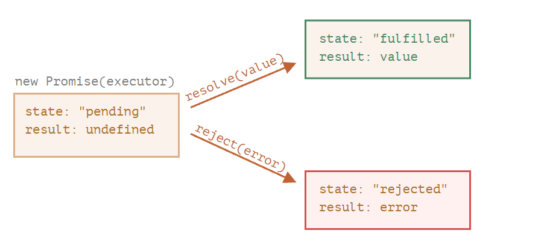

#### 消费者详解
promise实例具有三个**消费者**方法:
1. then
2. catch
3. finally

then方法内可以有两个函数,分别在生产者执行成功时调用它的**返回值**和失败时调用抛出的**错误**:
```js
promise.then(
  function(result) { /* handle a successful result */ },
  function(error) { /* handle an error */ }
);
```

但是有时候我们希望将异常处理和代码执行区分开来,就可以将`function(error)`部分提出来放在catch方法里:
```js
downloadFile("https://example.com/logo.png")
  .then((response) => {
    console.log("✅ 成功：", response.msg);
  })
  .catch((err) => {
    console.error("❌ 失败：", err.message);
  })
```

有时候我们希望执行一点收尾工作,就可以使用`finally`方法:
```js
downloadFile("https://example.com/logo.png")
  .then((response) => {
    console.log("✅ 成功：", response.msg);
  })
  .catch((err) => {
    console.error("❌ 失败：", err.message);
  })
  .finally(() => {
    console.log("🏁 进度条结束（无论成功失败均隐藏）");
  });
```

一个完整的实战代码如下:
```js
// 1. 生产者：封装下载逻辑
function downloadFile(url) {
  return new Promise((resolve, reject) => {
    console.log("正在从 " + url + " 下载文件...");

    // 模拟真实的资源加载（例如图片加载）
    const image = new Image();
    
    // 成功时的回调函数
    image.onload = () => {
      resolve({ status: 200, msg: "文件已成功载入" });
    };

    // 失败时的回调函数
    image.onerror = () => {
      reject(new Error("文件地址无效或网络异常"));
    };

    // 触发下载
    image.src = url;
  });
}

// 2. 消费者：根据下载结果更新界面
downloadFile("https://example.com/logo.png")
  .then((response) => {
    console.log("✅ 成功：", response.msg);
  })
  .catch((err) => {
    console.error("❌ 失败：", err.message);
  })
  .finally(() => {
    console.log("🏁 进度条结束（无论成功失败均隐藏）");
  });
```
#### Promise链
鉴于前端有时候需要对某个异步操作进行反复处理,所以js引入了promise链语法: 将一个then方法写在一个then方法之后时,前一个then方法的返回值会自动包装成Promise实例,供下一个then方法使用,置于具体原理就没必要去了解了,可以看成是一个高阶语法糖.

```js
new Promise(function(resolve, reject) {

  setTimeout(() => resolve(1), 1000); // (*)

}).then(function(result) { // (**)

  alert(result); // 1
  return result * 2;

}).then(function(result) { // (***)

  alert(result); // 2
  return result * 2;

}).then(function(result) {

  alert(result); // 4
  return result * 2;

});
```
- 本质上来说,这减少了函数的层层缩进,不同阶段的处理都使用同样的缩进,更符合阅读习惯.


**实战代码**
```js
function loadJson(url) {
  return fetch(url)
    .then(response => response.json());
}

function loadGithubUser(name) {
  return loadJson(`https://api.github.com/users/${name}`);
}

function showAvatar(githubUser) {
  return new Promise(function(resolve, reject) {
    let img = document.createElement('img');
    img.src = githubUser.avatar_url;
    img.className = "promise-avatar-example";
    document.body.append(img);

    setTimeout(() => {
      img.remove();
      resolve(githubUser);
    }, 3000);
  });
}

// 使用它们：
loadJson('/article/promise-chaining/user.json')
  .then(user => loadGithubUser(user.name))
  .then(showAvatar)
  .then(githubUser => alert(`Finished showing ${githubUser.name}`));
  // ...
```

#### Promise.all
promise除了then,catch方法,还有all方法可以使用,它的本质是: **并行执行多个promise,等待所有promise执行完后再进行处理**,示例代码如下:
```js
Promise.all([
  new Promise(resolve => setTimeout(() => resolve(1), 3000)), // 1
  new Promise(resolve => setTimeout(() => resolve(2), 2000)), // 2
  new Promise(resolve => setTimeout(() => resolve(3), 1000))  // 3
]).then(alert); // 1,2,3 当上面这些 promise 准备好时：每个 promise 都贡献了数组中的一个元素
```
- 这个示例代码并不那么容易好懂,可以看到then方法中的那个alert函数并没有任何参数,却依旧可以打印出三个promise函数的返回值,原因如下: **当你直接把一个函数名传递给then方法时,引擎会自动将上一步的结果作为参数传递给该函数**.
  - 显然,js最令后端开发者难受的地方就是这些莫名其妙的简写了.

#### async/await
鉴于promise过于复杂和难懂,所以js使用关键字`async`和`await`来实现接近相同的功能,事实上在可能的情况下,我们都使用这两个关键字,而非promise调用.

- 以fastapi模板项目为例:
- >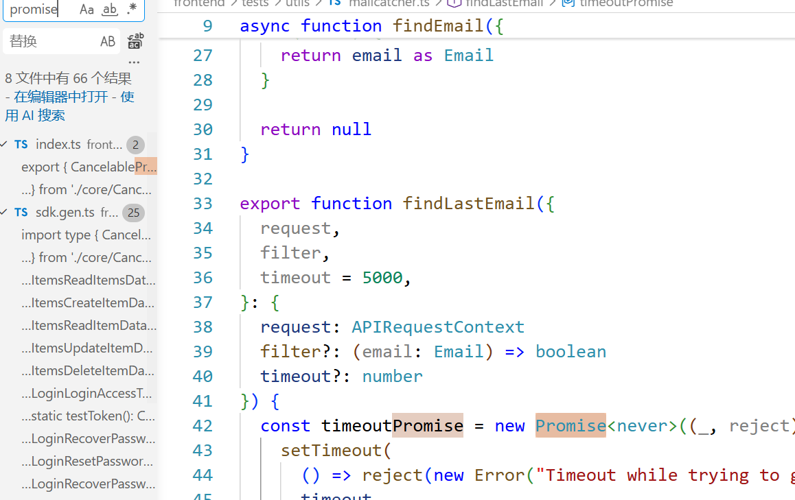
- 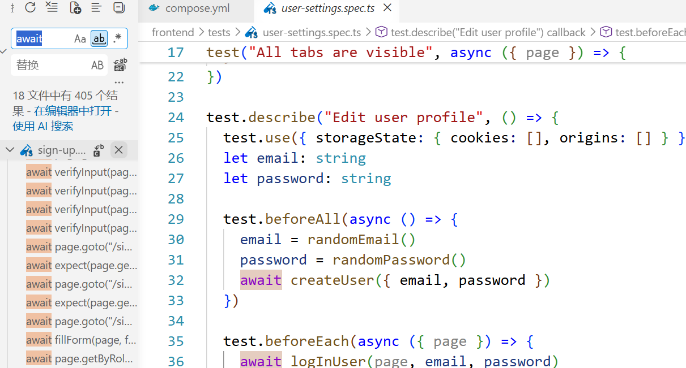

##### 详细用法
```js
async function f() {
  return 1;
}

f().then(alert); // 1
```
上述代码与下面的代码作用相同:
```js
function f() {
  return Promise.resolve(1);
}

f().then(alert);
```

换句话说,async会自动将函数的返回值包装成Promise实例.

而await则是对promise.then的包装:
```js
async function f() {

  let promise = new Promise((resolve, reject) => {
    setTimeout(() => resolve("done!"), 1000)
  });

  let result = await promise; // 等待，直到 promise resolve (*)

  alert(result); // "done!"
}

f();
```


上面的说明还不是很清晰,让我们看看**实战代码**:
```js
function getOrderData() {
  return fetch('/api/user')
    .then(response => response.json())
    .then(user => fetch(`/api/orders?userId=${user.id}`))
    .then(response => response.json())
    .then(orders => fetch(`/api/order/${orders[0].id}`))
    .then(response => response.json())
    .catch(error => console.error("请求失败:", error));
}

getOrderData().then(detail => console.log(detail));
```
上面这个丑陋的函数可以改写成这样:
```js
async function getOrderData() {
  try {
    const userRes = await fetch('/api/user');
    const user = await userRes.json();

    const ordersRes = await fetch(`/api/orders?userId=${user.id}`);
    const orders = await ordersRes.json();

    const detailRes = await fetch(`/api/order/${orders[0].id}`);
    const detail = await detailRes.json();

    return detail;
  } catch (error) {
    console.error("请求失败:", error);
  }
}

getOrderData().then(detail => console.log(detail));
```

- 这样看起来就舒服多了.

#### 总结
如果对js中的异步还不是很清晰的话,可以看一下这个示例代码:
```js
async function test() {
  console.log("A"); 
  await fetch('/api/user'); // 暂停在这里，释放主线程
  console.log("B"); // 等数据回来后再执行
}

console.log("C");
test();
console.log("D");

// 实际输出顺序：
// C
// A (进入函数执行到 await 之前)
// D (遇到 await，函数挂起，主线程继续执行函数外部的代码)
// ... 过了很久 ...
// B (请求完成，微任务触发)
```
异步就是,**挂起需要等待数据传来的函数,优先执行其他的函数.**

### 模块
>一个模块（module）就是一个文件。一个脚本就是一个模块。就这么简单。

模块可以相互加载，并可以使用特殊的指令 export 和 import 来交换功能，从另一个模块调用一个模块的函数：
- export 关键字标记了可以从当前模块外部访问的变量和函数。
- import 关键字允许从其他模块导入功能。

**一个简单的例子**
```js
// 📁 sayHi.js
export function sayHi(user) {
  alert(`Hello, ${user}!`);
}

// 📁 main.js
import { sayHi } from './sayHi.js';

alert(sayHi); // function...
sayHi('John'); // Hello, John!
```
#### 导出与导入
我们可以通过在声明之前放置 export 来标记任意声明为导出，无论声明的是变量，函数还是类都可以。
```js
// 导出数组
export let months = ['Jan', 'Feb', 'Mar','Apr', 'Aug', 'Sep', 'Oct', 'Nov', 'Dec'];

// 导出 const 声明的变量
export const MODULES_BECAME_STANDARD_YEAR = 2015;

// 导出类
export class User {
  constructor(name) {
    this.name = name;
  }
}
```

通常，我们把要导入的东西列在花括号 import {...} 中，就像这样：
```js
// 📁 main.js
import {sayHi, sayBye} from './say.js';

sayHi('John'); // Hello, John!
sayBye('John'); // Bye, John!

// 或者一并导入
// 📁 main.js
import * as say from './say.js';

say.sayHi('John');
say.sayBye('John');
```

鉴于js使用{}来区分导入变量,所以就不像python一样将别名写在最后面,而是直接跟在变量名后面:
```js
// 📁 main.js
import {sayHi as hi, sayBye as bye} from './say.js';

hi('John'); // Hello, John!
bye('John'); // Bye, John!
```
#### 默认导出
每个文件都可以指定一个默认导出的元素(变量/函数/类),在其他文件中导入时不需要用花括号包裹:
```js
// 📁 user.js
export default class User { // 只需要添加 "default" 即可
  constructor(name) {
    this.name = name;
  }
}

// 📁 main.js
import User from './user.js'; // 不需要花括号 {User}，只需要写成 User 即可

new User('John');
```

- 看上去作用不大,但它将在jsx和tsx中发挥强大的能量.

### fetch函数
- 鉴于该函数的应用广泛性,所以有必要专门了解它

**基本语法**
```js
let promise = fetch(url, [options])
```
- url —— 要访问的 URL。
- options —— 可选参数：method，header 等.若不写参数则默认使用GET请求

可以看到fetch函数返回的就是一个promise对象,原生就支持异步调用.

该函数的执行有两个阶段:
1. 解析响应头(response header)
2. 解析响应体(response body)

返回的promise对象有以下常用的方法或者属性:
- **status** —— HTTP 状态码，例如 200。
- **ok** —— 布尔值，如果 HTTP 状态码为 200-299，则为 true。
- **text()** —— 读取 response，并以文本形式返回 response。
- **json()** —— 将 response 解析为 JSON 格式。
- **blob()** —— 以 Blob（具有类型的二进制数据）形式返回 response，

如果我们通过await来调用的话,可以这么写:
```js
let response = await fetch(url);

if (response.ok) { // 如果 HTTP 状态码为 200-299
  // 获取 response body（此方法会在下面解释）
  let json = await response.json();
} else {
  alert("HTTP-Error: " + response.status);
}
```
- fetch首先会返回状态码,但这个时候响应体可能还在传输中,所以需要再使用一次await来获取.

一个更典型的写法是这样的:
```js
let response = await fetch(url, options); // 解析 response header
let result = await response.json(); // 将 body 读取为 json
```
response可能尚未完全加载完毕,所以需要再用一次await确保获取完整内容.

#### 加入请求头
```js
let response = fetch(protectedUrl, {
  headers: {
    Authentication: 'secret'
  }
});
```
- 可以看到除了url之外的参数都用`{}`包裹起来了.

#### 使用其他方法进行请求
```js
let user = {
  name: 'John',
  surname: 'Smith'
};

let response = await fetch('/article/fetch/post/user', {
  method: 'POST',
  headers: {
    'Content-Type': 'application/json;charset=utf-8'
  },
  body: JSON.stringify(user)
});

let result = await response.json();
alert(result.message);
```
#### 一个完整的fetch请求
```js
let promise = fetch(url, {
  method: "GET", // POST，PUT，DELETE，等。
  headers: {
    // 内容类型 header 值通常是自动设置的
    // 取决于 request body
    "Content-Type": "text/plain;charset=UTF-8"
  },
  body: undefined // string，FormData，Blob，BufferSource，或 URLSearchParams
  referrer: "about:client", // 或 "" 以不发送 Referer header，
  // 或者是当前源的 url
  referrerPolicy: "no-referrer-when-downgrade", // no-referrer，origin，same-origin...
  mode: "cors", // same-origin，no-cors
  credentials: "same-origin", // omit，include
  cache: "default", // no-store，reload，no-cache，force-cache，或 only-if-cached
  redirect: "follow", // manual，error
  integrity: "", // 一个 hash，像 "sha256-abcdef1234567890"
  keepalive: false, // true
  signal: undefined, // AbortController 来中止请求
  window: window // null
});
```

## 总结
尽管ES6之后的js终于变得像是一门正式语言了,但是如果我们每次写网页都需要写一个个html文档,再通过script标签嵌入js代码的话,是很难做到模块化开发的,大量的代码杂糅在一起,十分难看又很难维护.

因此,又一门出色的语言:JSX诞生了,它将模块式开发引入了js,解决了上述的开发难题.

# JavaScript XML

## 概览
- [jsx的简单历史介绍](https://www.greatfrontend.com/zh-CN/react-interview-playbook/react-landscape-history)
- [官方文档](https://react.dev/learn)
  - 写的不是很好,但对于js基础扎实的人也够用了
- [w3schools](https://www.w3schools.com/react)

JSX于2013年正式发布,由Facebook的工程师们发明,在诞生初期遭受了不少质疑,但在几年后迅速席卷了整个前端开发界.

- 尽管JSX起初是只用在React框架中的,但由于Babel等转译器的支持,大多数框架都可以使用JSX来编写了.
- 为了更好地学习JSX,最好直接看React的官方文档

如果熟练掌握了ES6语法和html语法的话,看JSX会觉得相当轻松:
```jsx
function MyButton() {
  return (
    <button>
      I'm a button
    </button>
  );
}

export default function MyApp() {
  return (
    <div>
      <h1>Welcome to my app</h1>
      <MyButton />
    </div>
  );
}
```

**效果图**:
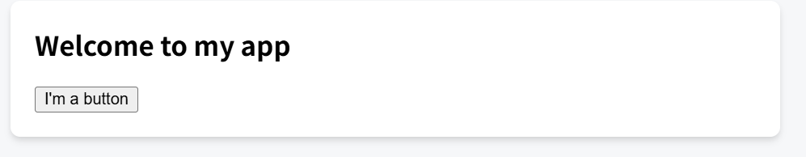

可以看到,JSX将html标签作为js函数的返回值,并通过类似`<MyButton />`的语法来将函数编程组件.


## 基础语法
### 前置概念
1. 如果我们只需要在函数中返回一个标签的话,直接写就行了,但如果要返回多个标签,那么就需要用空标签来包裹这些元素:
```jsx
return (
    <>
      <div className="board-row">
        <Square value={squares[0]} onSquareClick={() => handleClick(0)} />
        <Square value={squares[1]} onSquareClick={() => handleClick(1)} />
        <Square value={squares[2]} onSquareClick={() => handleClick(2)} />
      </div>
      <div className="board-row">
        <Square value={squares[3]} onSquareClick={() => handleClick(3)} />
        <Square value={squares[4]} onSquareClick={() => handleClick(4)} />
        <Square value={squares[5]} onSquareClick={() => handleClick(5)} />
      </div>
      <div className="board-row">
        <Square value={squares[6]} onSquareClick={() => handleClick(6)} />
        <Square value={squares[7]} onSquareClick={() => handleClick(7)} />
        <Square value={squares[8]} onSquareClick={() => handleClick(8)} />
    </>
  );
```

2. 鉴于class在ES6中是关键字,所以jsx将html标签中的class修改成了`className`:
```jsx
export default function Square() {
  return <button className="square">X</button>;
}
```
3. JSX中的所有标签都需要闭合,所以像html中``这样的自闭合标签要写成``
```jsx
<>
  
  <ul>
      <li>发明一种新式交通信号灯</li>
      <li>排练一个电影场景</li>
      <li>改进频谱技术</li>
  </ul>
</>
```
4. JSX使用驼峰命名法,即除了第一个单词的其他单词首字母都要大写.
5. 如果要在标签中直接嵌入js值,就需要使用`{}`:
```jsx
export default function Avatar() {
  const avatar = 'https://react.dev/images/docs/scientists/7vQD0fPs.jpg';
  const description = 'Gregorio Y. Zara';
  return (
    
  );
}
```
6. 有时候我们需要使用双大括号用于传递对象,比如这种情况:
```html
<button class="btn btn-primary btn-large" style="color: white; background-color: blue; padding: 10px 20px;">
  Click Me
</button>
```
原生html中使用引号来包裹值,并且style内部的属性使用`;`划分,而这会在JSX中被单纯的认为是一个字符串,所以需要改成用js对象传递值,类似这样:
```jsx
export default function TodoList() {
  return (
    <ul style={{
      backgroundColor: 'black',
      color: 'pink'
    }}>
      <li>Improve the videophone</li>
      <li>Prepare aeronautics lectures</li>
      <li>Work on the alcohol-fuelled engine</li>
    </ul>
  );
}
```
### props: 在组件间传递js值
JSX既然可以在原生html标签中传递js值,自然也可以在自定义的标签(这被称为**组件**)中传递js值:
```jsx
import { getImageUrl } from './utils.js';

function Avatar({ person, size }) {
  return (
    
  );
}

export default function Profile() {
  return (
    <div>
      <Avatar
        size={100}
        person={{
          name: 'Katsuko Saruhashi',
          imageId: 'YfeOqp2'
        }}
      />
      <Avatar
        size={80}
        person={{
          name: 'Aklilu Lemma',
          imageId: 'OKS67lh'
        }}
      />
      <Avatar
        size={50}
        person={{
          name: 'Lin Lanying',
          imageId: '1bX5QH6'
        }}
      />
    </div>
  );
}
```
很显然,写在组件中的js参数是作为一个js对象传入Avatar函数的,并通过解构语法被分别赋值.

我们甚至可以在组件间传递组件:
```jsx
import Avatar from './Avatar.js';

function Card({ children }) {
  return (
    <div className="card">
      {children}
    </div>
  );
}

export default function Profile() {
  return (
    <Card>
      <Avatar
        size={100}
        person={{
          name: 'Katsuko Saruhashi',
          imageId: 'YfeOqp2'
        }}
      />
    </Card>
  );
}
```
### main.jsx与index.html
当我们使用各种模板创建jsx项目时,目录下通常都有这两个文件,先看看index.html:
```html
<!DOCTYPE html>
<html lang="en">
  <head>
    <meta charset="UTF-8" />
    <link rel="icon" type="image/svg+xml" href="/vite.svg" />
    <meta name="viewport" content="width=device-width, initial-scale=1.0" />
    <title>Full Stack FastAPI Project</title>
    <link rel="icon" type="image/x-icon" href="/assets/images/favicon.png" />
  </head>
  <body>
    <div id="root"></div>
    <script type="module" src="./src/main.jsx"></script>
  </body>
</html>
```
去掉无关信息后是这样的:
```html
<!DOCTYPE html>
<html lang="en">
  <body>
    <div id="root"></div>
    <script type="module" src="./src/main.jsx"></script>
  </body>
</html>
```

它仅仅嵌入了main.jsx,其他并没有什么特殊的地方,那来看看main.jsx:
```jsx
import { StrictMode } from 'react'
import { createRoot } from 'react-dom/client'
import './index.css'
import App from './App.jsx'

createRoot(document.getElementById('root')).render(
  <StrictMode>
      <App />
    </StrictMode>
  )  
```
- 可以看到,main.jsx通过html中的`root`标签来渲染页面,这就是jsx的工作原理.

>就算将`<div>`换成`<header>`等无关紧要的标签,或者把`root`这个名字换成`candy`,都不影响jsx的渲染
## Hook
以use开头的函数称为**Hook**,用来保留用户状态.
### useState
useState是最常用的Hook,所以需要重点了解.

>**State** generally refers to data or properties that need to be tracking in an application.

useState accepts an initial state and returns two values:
1. The current state.
2. A function that updates the state.

```jsx
import { useState } from "react";

function FavoriteColor() {
  const [color, setColor] = useState("red");
}
```
>useState返回的是一个二元数组,通过数组解构来获取对应值即可(数组解构可以任意命名,但习惯上我们将这对值命名为`var`和`setVar`的形式).

要更新初始值,我们调用更新函数即可:
```jsx
import { useState } from 'react';
import { createRoot } from 'react-dom/client';

function FavoriteColor() {
  const [color, setColor] = useState("red");

  return (
    <>
      <h1>My favorite color is {color}!</h1>
      <button
        type="button"
        onClick={() => setColor("blue")}
      >Blue</button>
    </>
  )
}

createRoot(document.getElementById('root')).render(
  <FavoriteColor />
);
```

- setColor本质上是一个回调函数,会在触发时去更新被绑定的state.

state也可以是对象:
```jsx
import { useState } from 'react';
import { createRoot } from 'react-dom/client';

function MyCar() {
  const [car, setCar] = useState({
    brand: "Ford",
    model: "Mustang",
    year: "1964",
    color: "red"
  });

  return (
    <>
      <h1>My {car.brand}</h1>
      <p>
        It is a {car.color} {car.model} from {car.year}.
      </p>
    </>
  )
}

createRoot(document.getElementById('root')).render(
  <MyCar />
);
```


### useEffect
useEffect是第二常用的React Hook,用来执行一些**side effects**,包括:
1. fetching data
2. updating the DOM
3. 计时

>鉴于官方把useEffect的效果称为`side effects`,但它实质上并不是那种常规的**有危害的副作用**的意思,所以就保持原文算了.

useEffect有两个参数,第二个参数是可选的:
```jsx
useEffect(<function>, <dependency>)
```

**用例**
```jsx
import { useState, useEffect } from 'react';
import { createRoot } from 'react-dom/client';

function Timer() {
  const [count, setCount] = useState(0);

  useEffect(() => {
    setTimeout(() => {
      setCount((count) => count + 1);
    }, 1000);
  });

  return <h1>I've rendered {count} times!</h1>;
}

createRoot(document.getElementById('root')).render(
  <Timer />
);
```
上述代码每过一秒便会将count+1并渲染出来,永不停息,这是因为我们没给setTimeout函数加上任何限制,一般来说我们有三种写法:
```jsx
useEffect(() => {
  //Runs on every render
});

// 有时候我们希望只用useEffect进行初始化
useEffect(() => {
  //Runs only on the first render
}, []);

// 当界面状态改变时我们希望再次进行渲染.
useEffect(() => {
  //Runs on the first render
  //And any time any dependency value changes
}, [prop, state]);
```

下面这个代码就是一个很好的例子:
```jsx
import { useState, useEffect } from 'react';
import { createRoot } from 'react-dom/client';

function Counter() {
  const [count, setCount] = useState(0);
  const [calculation, setCalculation] = useState(0);

  useEffect(() => {
    setCalculation(() => count * 2);
  }, [count]); // <- add the count variable here

  return (
    <>
      <p>Count: {count}</p>
      <button onClick={() => setCount((c) => c + 1)}>+</button>
      <p>Calculation: {calculation}</p>
    </>
  );
}

createRoot(document.getElementById('root')).render(
  <Counter />
);
```
### useContext
useState只能写在函数中,这意味着它不能通过全局变量来在组件中共享,想要跨越文件传递值则更加困难:
```jsx
import { useState } from 'react';
import { createRoot } from 'react-dom/client';

function Component1() {
  const [user, setUser] = useState("Linus");

  return (
    <>
      <h1>{`Hello ${user}!`}</h1>
      <Component2 user={user} />
    </>
  );
}

function Component2({ user }) {
  return (
    <>
      <h1>Component 2</h1>
      <Component3 user={user} />
    </>
  );
}

function Component3({ user }) {
  return (
    <>
      <h1>Component 3</h1>
      <h2>{`Hello ${user} again!`}</h2>
    </>
  );
}

createRoot(document.getElementById('root')).render(
  <Component1 />
);
```
>Even though component 2 did not need the state, it had to pass the state along so that it could reach component 3.

要使用useContext,我们需要导入createContext:
```jsx
import { useState, createContext, useContext } from 'react';
import { createRoot } from 'react-dom/client';

const UserContext = createContext();
```

然后就可以通过Provider组件来跨越组件传值:
```jsx
function Component1() {
  const [user, setUser] = useState("Linus");

  return (
    <UserContext.Provider value={user}>
      <h1>{`Hello ${user}!`}</h1>
      <Component2 />
    </UserContext.Provider>
  );
}
```
要想在子组件中直接传递变量,就需要用到useContext了:
```jsx
function Component3() {
  const user = useContext(UserContext);

  return (
    <>
      <h1>Component 3</h1>
      <h2>{`Hello ${user} again!`}</h2>
    </>
  );
}
```

**完整代码如下**:
```jsx
import { useState, createContext, useContext } from 'react';
import { createRoot } from 'react-dom/client';

const UserContext = createContext();

function Component1() {
  const [user, setUser] = useState("Linus");

  return (
    <UserContext.Provider value={user}>
      <h1>{`Hello ${user}!`}</h1>
      <Component2 />
    </UserContext.Provider>
  );
}

function Component2() {
  return (
    <>
      <h1>Component 2</h1>
      <Component3 />
    </>
  );
}

function Component3() {
  const user = useContext(UserContext);

  return (
    <>
      <h1>Component 3</h1>
      <h2>{`Hello ${user} again!`}</h2>
    </>
  );
}

createRoot(document.getElementById('root')).render(
  <Component1 />
);
```

>是不是很匪夷所思,组件3中的user是如何获取组件1中的变量的? 我们需要注意的是,应该以一种自顶向下的方法来使用useContext.组件1中使用了Provider组件来广播这个值到组件2中,尽管组件2本身没有使用user变量,但它调用了组件3,React会顺势将user变量通过`useContext(UserContext)`传递进组件3中.
### useRef
如果我们想统计useState的渲染次数的话,我们可不能再引入useState或者useEffect,因为它们执行时都会重新渲染一次页面,所以,我们需要用到useRef:
```jsx
import { useState, useRef, useEffect } from 'react';
import { createRoot } from 'react-dom/client';

function App() {
  const [inputValue, setInputValue] = useState("");
  const count = useRef(0);

  useEffect(() => {
    count.current = count.current + 1;
  });

  return (
    <>
      <p>Type in the input field:</p>
      <input
        type="text"
        value={inputValue}
        onChange={(e) => setInputValue(e.target.value)}
      />
      <h1>Render Count: {count.current}</h1>
    </>
  );
}

createRoot(document.getElementById('root')).render(
  <App />
);
```
useRef只返回一个对象变量,它只有一个current属性.

在 React 中，你不能直接用 `document.getElementById`。你需要用 useRef 挂载到标签上:
```jsx
const inputRef = useRef(null);

const handleClick = () => {
  // 直接操作底层 DOM 元素
  inputRef.current.focus(); 
};

return <input ref={inputRef} />;
```
### useCallback
这是最后一个比较常用的Hook了,主要用来缓存回调函数,接受两个参数:
```jsx
useCallback(callback, dependencies)
```
1. callback: The function that you want to memoize.
2. dependencies: An array of dependencies for the callback function. The memorized callback will only change if one of these dependencies has changed.

```jsx
//Without useCallback:
import React, { useState } from 'react';
import { createRoot } from 'react-dom/client';

// Child component that receives a function prop
const Button = React.memo(({ onClick, text }) => {
  alert(`Child ${text} button rendered`);
  return <button onClick={onClick}>{text}</button>;
});

// Parent component without useCallback
function WithoutCallbackExample() {
  const [count1, setCount1] = useState(0);
  const [count2, setCount2] = useState(0);

  // This function is recreated on every render
  const handleClick1 = () => {
    setCount1(count1 + 1);
  };

  const handleClick2 = () => {
    setCount2(count2 + 1);
  };

  alert("Parent rendered");
  return (
    <div>
      <h2>Without useCallback:</h2>
      <p>Count 1: {count1}</p>
      <p>Count 2: {count2}</p>
      <Button onClick={handleClick1} text="Button 1" />
      <Button onClick={handleClick2} text="Button 2" />
    </div>
  );
}

createRoot(document.getElementById('root')).render(
  <WithoutCallbackExample />
);  
```
上述代码没有使用useCallback函数,每次按按钮时都会重新渲染所有组件,如果改成使用useCallback,是这样的:
```jsx
//With useCallback:
import React, { useState, useCallback } from 'react';
import { createRoot } from 'react-dom/client';

// Child component that receives a function prop
const Button = React.memo(({ onClick, text }) => {
  console.log(`${text} button rendered`);
  return <button onClick={onClick}>{text}</button>;
});

// Parent component with useCallback
function WithCallbackExample() {
  const [count1, setCount1] = useState(0);
  const [count2, setCount2] = useState(0);

  // These functions are memoized and only recreated when dependencies change
  const handleClick1 = useCallback(() => {
    setCount1(count1 + 1);
  }, [count1]);

  const handleClick2 = useCallback(() => {
    setCount2(count2 + 1);
  }, [count2]);

  console.log("Parent rendered");
  return (
    <div>
      <h2>With useCallback:</h2>
      <p>Count 1: {count1}</p>
      <p>Count 2: {count2}</p>
      <Button onClick={handleClick1} text="Button 1" />
      <Button onClick={handleClick2} text="Button 2" />
    </div>
  );
}

createRoot(document.getElementById('root')).render(
  <WithCallbackExample />
);  
```

上述的例子还是太难看懂了,也不够直观,我们拿一个时常要用到的黑夜/白天主题切换情景作为例子,顺便复习一下前面的知识:
```jsx
import {
  createContext,
  useCallback,
  useContext,
  useEffect,
  useState,
} from "react"

export type Theme = "dark" | "light" | "system"

const ThemeProviderContext = createContext<ThemeProviderState>(initialState)

export function ThemeProvider({
  children,
  defaultTheme = "system",
  storageKey = "vite-ui-theme",
  ...props
}: ThemeProviderProps) {
  const [theme, setTheme] = useState<Theme>(
    () => (localStorage.getItem(storageKey) as Theme) || defaultTheme,
  )

  const getResolvedTheme = useCallback((theme: Theme): "dark" | "light" => {
    if (theme === "system") {
      return window.matchMedia("(prefers-color-scheme: dark)").matches
        ? "dark"
        : "light"
    }
    return theme
  }, [])

  const [resolvedTheme, setResolvedTheme] = useState<"dark" | "light">(() =>
    getResolvedTheme(theme),
  )

  const updateTheme = useCallback((newTheme: Theme) => {
    const root = window.document.documentElement

    root.classList.remove("light", "dark")

    if (newTheme === "system") {
      const systemTheme = window.matchMedia("(prefers-color-scheme: dark)")
        .matches
        ? "dark"
        : "light"

      root.classList.add(systemTheme)
      return
    }

    root.classList.add(newTheme)
  }, [])

  useEffect(() => {
    updateTheme(theme)
    setResolvedTheme(getResolvedTheme(theme))

    const mediaQuery = window.matchMedia("(prefers-color-scheme: dark)")

    const handleChange = () => {
      if (theme === "system") {
        updateTheme("system")
        setResolvedTheme(getResolvedTheme("system"))
      }
    }

    mediaQuery.addEventListener("change", handleChange)

    return () => {
      mediaQuery.removeEventListener("change", handleChange)
    }
  }, [theme, updateTheme, getResolvedTheme])

  const value = {
    theme,
    resolvedTheme,
    setTheme: (theme: Theme) => {
      localStorage.setItem(storageKey, theme)
      setTheme(theme)
    },
  }

  return (
    <ThemeProviderContext.Provider {...props} value={value}>
      {children}
    </ThemeProviderContext.Provider>
  )
}
export const useTheme = () => {
  const context = useContext(ThemeProviderContext)

  if (context === undefined)
    throw new Error("useTheme must be used within a ThemeProvider")

  return context
}
```

我们看一看使用了useCallback部分的代码:
```jsx
const getResolvedTheme = useCallback((theme: Theme): "dark" | "light" => {
    if (theme === "system") {
      return window.matchMedia("(prefers-color-scheme: dark)").matches
        ? "dark"
        : "light"
    }
    return theme
  }, [])

const updateTheme = useCallback((newTheme: Theme) => {
    const root = window.document.documentElement

    root.classList.remove("light", "dark")

    if (newTheme === "system") {
      const systemTheme = window.matchMedia("(prefers-color-scheme: dark)")
        .matches
        ? "dark"
        : "light"

      root.classList.add(systemTheme)
      return
    }

    root.classList.add(newTheme)
  }, [])
```
如果不用useCallback包裹这两个函数,那么之后每次渲染时这些函数都会重新执行一遍,对于整个页面的渲染是个很大的开销.

- 这里的依赖项为空数组的作用与在useEffect中的作用一样,都是只在初始化执行一次,后续不再改变.


## 总结
事实上,JSX需要了解的就是Hook和组件写法了,其他的基本都属于原生JS的语法范畴.

但是,用JS写项目还是不太顺手,大型JS项目的维护也无比艰难,因为JS没有**静态类型检查**,这让代码编写变得十分痛苦.

所以,Typescript诞生了,带来了前端领域的又一场变革.
# Typescript
## 概览
- [官方文档](https://www.typescriptlang.org/docs/handbook/intro.html)
  - 内容很杂很乱,只看需要的部分即可

Typescript由微软在2014年发布,主要目的就是为了解决Javascript中的动态类型带来的各种疑难问题,所以引入的新特性不是很多.但也足够使用了.
## ts编译
鉴于typescript不是原生的js语法,无法被浏览器直接处理,需要导入typescript编译器后运行:
```bash
npm install -g typescript
```

比如我们现在写了一个ts文件,命名为`test.ts`,要编译它就可以在终端输入:
```bash
tsc test.ts
```
ts编译器会将`test.ts`编译成`test.js`文件,去掉其中的ts语法.

如果我们的ts文件中出错了,那么编译过程就会报错,比如下列代码:
```ts
// This is an industrial-grade general-purpose greeter function:
function greet(person, date) {
  console.log(`Hello ${person}, today is ${date}!`);
}
 
greet("Brendan");
```

尽管ts代码仍然会变成js代码,但是命令行会抛出错误,告诉你哪些类型检查没通过
## 类型注释
ts的类型注释只有一种写法`var/func(): type`:
```ts
// Parameter type annotation
function greet(name: string): any {
  console.log("Hello, " + name.toUpperCase() + "!!");
}
```

ts中的类型注释有以下几种:
1. 基本类型: `string`,`number`,`boolean`
2. 任意类型: any
   1. 与python的Any类型一样,类型检查时会直接跳过它
3. 未知类型: unknown
   1. 由于any不够安全,所以TS3.0引入了该类型,它是所有类型的顶级类型.
4. 可选属性: `?: type`,一个例子如下:

```ts
function printName(obj: { first: string; last?: string }) {
  // ...
}
// Both OK
printName({ first: "Bob" });
printName({ first: "Alice", last: "Alisson" });
```

4. null类型: 鉴于undefined只用在变量未定义时,因此类型注释只有null即可,毕竟你传入的变量一定是已经定义好了的

>当然,在ts中更多的是由用户自定义的类或者type进行类型注释.

5. 至于对象这种键值对的类型,想要对键也进行类型注释的话可不能再直接写一个`:`号,那样没人看得懂的,ts的写法是这样的:

```ts
type OnlyBoolsAndHorses = {
  [key: string]: boolean | Horse;
};
 
const conforms: OnlyBoolsAndHorses = {
  del: true,
  rodney: false,
};
```

上述写法表示: 该类型中的所有新定义的键值对都要满足key是string类型,值是boolean或者Horse类型.

### type关键字
ts使用type关键字声明自定义的类型:
```ts
type Point = {
  x: number;
  y: number;
};
 
// Exactly the same as the earlier example
function printCoord(pt: Point) {
  console.log("The coordinate's x value is " + pt.x);
  console.log("The coordinate's y value is " + pt.y);
}
 
printCoord({ x: 100, y: 100 });
```

### readonly修饰符
该类修饰符禁止在使用时直接修改被修饰的变量:
```ts
interface Config {
  readonly meta: { version: string };
}
const cfg: Config = { meta: { version: "1.0" } };
// cfg.meta = { version: "2.0" }; // 报错：无法分配到 "meta" ，因为它是只读属性。
cfg.meta.version = "2.0";        // 允许：内部属性未受保护。
```

## 加强的OOP
鉴于原生js的OOP实在是不堪入目,所以TS大大加强了OOP特性,让它成为了一个更加面向对象的语言(尽管本质上还是面向函数的).
### 接口
ts中的接口与Java中的接口别无二致,声明也是一样的:
```ts
interface Point {
  x: number;
  y: number;
}
 
function printCoord(pt: Point) {
  console.log("The coordinate's x value is " + pt.x);
  console.log("The coordinate's y value is " + pt.y);
}
 
printCoord({ x: 100, y: 100 });
```

继承写法也是一样:
```ts
interface Colorful {
  color: string;
}
 
interface Circle {
  radius: number;
}
 
interface ColorfulCircle extends Colorful, Circle {}
 
const cc: ColorfulCircle = {
  color: "red",
  radius: 42,
};
```
### 泛型
- ts项目中会大量用到泛型,所以需要重点理解.
#### 用在类和接口中
有时候某些变量我们希望他能够接受多种类型的值,一个直觉上的写法是这样的:
```ts
interface Box {
  contents: number|string|boolean;
}
```
但上面这种写法有一个问题,当我们希望这个接口作为number类型使用的时候,不应该由其他维护者传入其他的类型如string和boolean.

那么一个更加安全的写法是将这个接口拆分成三个:
```ts
interface NumberBox {
  contents: number;
}
 
interface StringBox {
  contents: string;
}
 
interface BooleanBox {
  contents: boolean;
}
```
这显然太麻烦了,而cpp的泛型思想刚好适用于这种情况,我们将cpp的泛型写法直接照搬过来就行了:
```ts
interface Box<Type> {
  contents: Type;
}

let boxA: Box<string> = { contents: "hello" };
```
那么当这个接口被使用时,由于类型注释的限制,其他维护者也无法传入其他类型的值了.
#### 用在函数中
```ts
function identity<Type>(arg: Type): Type {
  return arg;
}
```
函数中的用法实质上与用在类中没什么太大的区别.

### 加强的类
只给一个类的示例就能看懂ts中多了什么了:
```ts
export class CancelError extends Error {
	constructor(message: string) {
		super(message);
		this.name = 'CancelError';
	}

	public get isCancelled(): boolean {
		return true;
	}
}
```
多出来的只有三种类型修饰符(`public`,`private`,`protected`),其他的改进很有限,也不是很有必要了解.

## 总结
我上面只给了最基础的ts语法,遗漏了很多语法,如果一看到真正的ts项目是完全应付不了的:
```ts
export class CancelError extends Error {
	constructor(message: string) {
		super(message);
		this.name = 'CancelError';
	}

	public get isCancelled(): boolean {
		return true;
	}
}

export interface OnCancel {
	readonly isResolved: boolean;
	readonly isRejected: boolean;
	readonly isCancelled: boolean;

	(cancelHandler: () => void): void;
}

export class CancelablePromise<T> implements Promise<T> {
	private _isResolved: boolean;
	private _isRejected: boolean;
	private _isCancelled: boolean;
	readonly cancelHandlers: (() => void)[];
	readonly promise: Promise<T>;
	private _resolve?: (value: T | PromiseLike<T>) => void;
	private _reject?: (reason?: unknown) => void;

	constructor(
		executor: (
			resolve: (value: T | PromiseLike<T>) => void,
			reject: (reason?: unknown) => void,
			onCancel: OnCancel
		) => void
	) {
		this._isResolved = false;
		this._isRejected = false;
		this._isCancelled = false;
		this.cancelHandlers = [];
		this.promise = new Promise<T>((resolve, reject) => {
			this._resolve = resolve;
			this._reject = reject;

			const onResolve = (value: T | PromiseLike<T>): void => {
				if (this._isResolved || this._isRejected || this._isCancelled) {
					return;
				}
				this._isResolved = true;
				if (this._resolve) this._resolve(value);
			};

			const onReject = (reason?: unknown): void => {
				if (this._isResolved || this._isRejected || this._isCancelled) {
					return;
				}
				this._isRejected = true;
				if (this._reject) this._reject(reason);
			};

			const onCancel = (cancelHandler: () => void): void => {
				if (this._isResolved || this._isRejected || this._isCancelled) {
					return;
				}
				this.cancelHandlers.push(cancelHandler);
			};

			Object.defineProperty(onCancel, 'isResolved', {
				get: (): boolean => this._isResolved,
			});

			Object.defineProperty(onCancel, 'isRejected', {
				get: (): boolean => this._isRejected,
			});

			Object.defineProperty(onCancel, 'isCancelled', {
				get: (): boolean => this._isCancelled,
			});

			return executor(onResolve, onReject, onCancel as OnCancel);
		});
	}

	get [Symbol.toStringTag]() {
		return "Cancellable Promise";
	}

	public then<TResult1 = T, TResult2 = never>(
		onFulfilled?: ((value: T) => TResult1 | PromiseLike<TResult1>) | null,
		onRejected?: ((reason: unknown) => TResult2 | PromiseLike<TResult2>) | null
	): Promise<TResult1 | TResult2> {
		return this.promise.then(onFulfilled, onRejected);
	}

	public catch<TResult = never>(
		onRejected?: ((reason: unknown) => TResult | PromiseLike<TResult>) | null
	): Promise<T | TResult> {
		return this.promise.catch(onRejected);
	}

	public finally(onFinally?: (() => void) | null): Promise<T> {
		return this.promise.finally(onFinally);
	}

	public cancel(): void {
		if (this._isResolved || this._isRejected || this._isCancelled) {
			return;
		}
		this._isCancelled = true;
		if (this.cancelHandlers.length) {
			try {
				for (const cancelHandler of this.cancelHandlers) {
					cancelHandler();
				}
			} catch (error) {
				console.warn('Cancellation threw an error', error);
				return;
			}
		}
		this.cancelHandlers.length = 0;
		if (this._reject) this._reject(new CancelError('Request aborted'));
	}

	public get isCancelled(): boolean {
		return this._isCancelled;
	}
}
```

我相信任何人看到这段代码后都不会认为写前端是很简单的活儿.

>好在ts生态中有各种各样的框架,有了这些框架后,我们可以尽可能少的写出这么离谱难懂的代码.

不管怎样,写前端项目还是以实战为主,所以就让我们先抛开难懂的ts语法,大踏步进入当代前端语言演进的最后终点: TSX.

# TypeScript XML
## 概览和总结
15年9月,ts1.6发布,引入了对tsx文件的解析支持,将jsx语法直接融入了ts中,从此,前端项目既实现了标准的类型检查,也能够真正的使用组件化的模式进行开发.

如今的前端项目中,一般只有两种涉及js的文件,一个是ts文件,只放置符合ts语法的代码,如类/接口/类型的声明及定义;另一个是tsx文件,用于设计组件和UI.

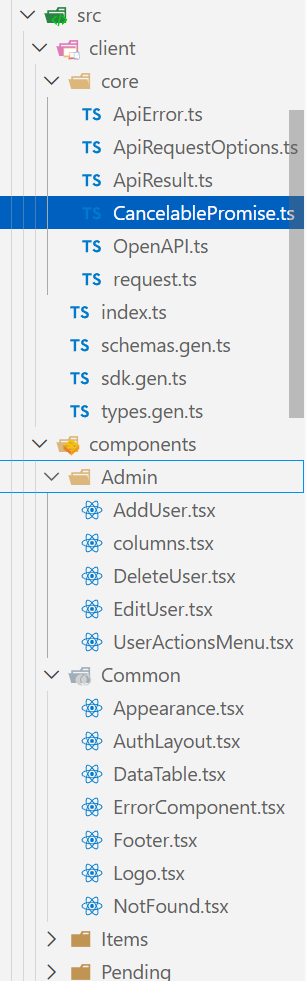

不管怎样,现在写前端代码终于能够和写后端一样舒服了...

# 前端运行环境
## 前置概念
如同cpp,java等语言需要经过编译后才能执行一样,前端项目也有自己的编译器: **浏览器引擎**,它有以下功能:
* **HTML 解析与 DOM 树构建**：将从网络接收到的 HTML 原始字节流转换为符合 W3C 标准的文档对象模型（DOM）树结构。
* **CSS 解析与 CSSOM 树构建**：解析所有样式表（包含行内、内联、外部 CSS 文件及浏览器默认样式），构建出定义层级样式的 CSSOM 树。
* **渲染树生成（Render Tree）**：将 DOM 树与 CSSOM 树进行物理合并，过滤掉不显示的节点（如 `display: none`），生成仅包含可见元素的渲染树。
* **布局/排版计算（Layout/Reflow）**：从渲染树根节点开始遍历，精确计算每个可见节点在屏幕上的几何大小、相对位置和所占用的物理像素。
* **元素绘制（Painting）**：遍历布局树和图层，将每个节点的文本、颜色、边框、背景、阴影等视觉样式转换为底层的具体绘图指令。
* **图层栅格化与合成（Rasterization & Compositing）**：将绘图指令转换为屏幕底层的位图（Pixels），并调用 GPU 将各个图层合成一帧，最终输出到显示器上。
* **JavaScript 引擎集成与通信**：为 JavaScript 引擎（如 V8）提供宿主环境，通过 DOM API 桥接底层 C++ 核心，实现脚本对网页结构的动态操作。
* **事件流调度（Event Dispatching）**：监听并捕获来自操作系统的底层物理输入（如鼠标点击、屏幕触摸、键盘输入、页面滚动），并按照冒泡/捕获机制分发给网页代码。

最典型的浏览器引擎就是开源的Blink引擎,chorome,egde,国产浏览器都使用它来渲染页面.

浏览器引擎只能处理html代码和css代码,而js单独由js引擎编译,最常见的js引擎就是**v8引擎**.

而Node则彻底将js引擎和浏览器引擎分离,从而让我们在不使用浏览器的情况下处理前端代码.
## Node
- [wiki](https://en.wikipedia.org/wiki/Node.js)

>目前Node仍然是前端项目的主流运行时.
### Node的历史
#### 1. 诞生与初期（2009 - 2011）

* **起源**：2009年由 **Ryan Dahl** 基于 Google V8 引擎开发。其初衷是解决 Apache 等服务器在高并发（10,000+ 连接）下的瓶颈，推行事件驱动和非阻塞 I/O 范式。
* **生态起步**：2010年，**npm** 诞生，简化了包的发布与安装。
* **跨平台**：2011年，在微软与 Joyent 的合作下发布了原生 Windows 版本。

#### 2. 管理更迭与分裂（2012 - 2014）

* **领导权更替**：Ryan Dahl 之后，项目先后由 Isaac Schlueter（npm 创始人）和 Timothy J. Fontaine 领导。
* **社区分裂**：由于对 Joyent 治理模式及 V8 更新速度不满，Fedor Indutny 于 2014 年创建了分支 **io.js**，旨在建立更开放的社区治理结构。

#### 3. 合并与统一（2015 - 2019）

* **基金会成立**：2015年初成立 Node.js 基金会以调和双方矛盾。
* **回归统一**：2015年9月，Node.js v0.12 与 io.js v3.3 合并为 **Node v4.0**，引入了 ES6 特性并确立了长期支持（LTS）周期。
* **最终合并**：2019年，JS 基金会与 Node.js 基金会合并为 **OpenJS 基金会**。

**版本演进**
- 偶数版本（如 18, 20, 22）：每年的 4 月发布，10 月进入 LTS 阶段，生命周期通常为 3 年，适合生产环境。
- 奇数版本（如 19, 21, 23）：每年的 10 月发布，生命周期短（约 6 个月），主要用于测试新特性。

而现在已经迭代到26版本号了.
### Node使用与npm
- [官方文档](https://docs.npmjs.com/cli/v11/commands/npm)

Node项目中都有一个`package.json`文件,记录了导入的包和可使用的命令行命令等信息:
```json
{
  "name": "vite-project",
  "private": true,
  "version": "0.0.0",
  "type": "module",
  "scripts": {
    "dev": "vite",
    "build": "tsc -b && vite build",
    "lint": "eslint .",
    "preview": "vite preview"
  },
  "dependencies": {
    "react": "^19.2.6",
    "react-dom": "^19.2.6"
  },
  "devDependencies": {
    "@babel/core": "^7.29.0",
    "@eslint/js": "^10.0.1",
    "@rolldown/plugin-babel": "^0.2.3",
    "@types/babel__core": "^7.20.5",
    "@types/node": "^24.12.3",
    "@types/react": "^19.2.14",
    "@types/react-dom": "^19.2.3",
    "@vitejs/plugin-react": "^6.0.1",
    "babel-plugin-react-compiler": "^1.0.0",
    "eslint": "^10.3.0",
    "eslint-plugin-react-hooks": "^7.1.1",
    "eslint-plugin-react-refresh": "^0.5.2",
    "globals": "^17.6.0",
    "typescript": "~6.0.2",
    "typescript-eslint": "^8.59.2",
    "vite": "^8.0.12"
  }
}
```

- scripts: 表明了可以使用的脚本命令,比如dev对应的命令可以通过`npm run dev`来运行

接下来重点介绍一些常用的npm命令
#### npm install

- `npm install 包名1 包名2 ...`: 安装所需的npm包
- `npm i 包名`: 简写形式
- `npm i 包名 --global`/`npm i 包名 -g`: 全局安装,安装在本地文件夹而非项目文件夹中,除非你确实需要用这个npm包来执行全局命令,否则不要这么做
- `npm install 包名@1.2.1`: 安装该包的特定版本
- `npm install 包名@latest`: 安装或者升级到该包的最新版本,这也是默认命令


有时候我们安装npm包后,命令行会弹出类似这样的警告:
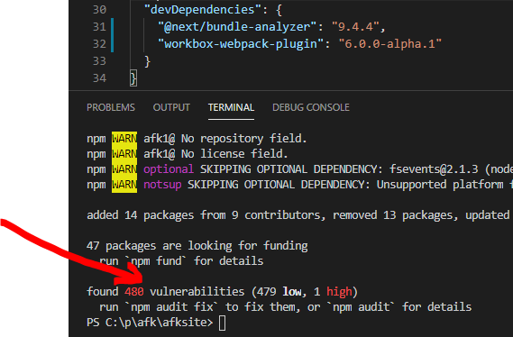

这就涉及到了npm的安全漏洞知识了.
#### npm安全漏洞解析
- [官方文档](https://docs.npmjs.com/auditing-package-dependencies-for-security-vulnerabilities)

npm 将漏洞分为四个风险等级：

1. Low (低度): 难以被恶意利用，通常需要本地访问权限。
2. Moderate (中度): 具备一定的被攻击风险，例如特定构造下的拒绝服务攻击（DoS）。
3. High (高度): 漏洞可能导致数据泄露、跨站脚本攻击（XSS）。
4. Critical (严重): 极度危险，攻击者可能借此远程执行恶意代码（RCE），必须立刻修复。

所以,当我们安装npm包的时候需要额外注意,不要下载了恶意的代码包(这也被称为**供应链投毒**),而由于所有的包管理器(pnpm,bun,yarn)都共享同一个仓库源,所以用其他下载方式也会被感染.
#### npm audit
- `npm audit fix`: 该命令用于修复一些比较简单的包漏洞
- `npm audit fix --force`: 强制将包升级到绝对安全的版本,很有可能会导致项目无法运行.
#### npx/npm exec
>npx本质上是`npm exec`的别名,用法基本一样.

运行`npx 包名`时,它会按照以下路径查找包:
1. 项目目录
2. 本地全局目录

如果没有找到,它就会在临时目录中创建该包的缓存,并不会下载到项目目录中,在运行结束后会进行清理.
#### npm create/npm init
- [博客文章](https://www.cnblogs.com/itkkk/p/18184613)

- `npm create`是`npm init`的别名,由于`create`比起`init`来说更直观,能够表达出构建模板项目的意思,所以很多时候都会使用`npm create`来代替`npm init`.

官方对`npm init`的解释如下:
- npm init foo -> npm exec create-foo
- npm init @usr/foo -> npm exec @usr/create-foo
- npm init @usr -> npm exec @usr/create
- npm init @usr@2.0.0 -> npm exec @usr/create@2.0.0
- npm init @usr/foo@2.0.0 -> npm exec @usr/create-foo@2.0.0

大致来说就是,运行`npm create vite@latest`相当于运行`npm init vite@latest`,而后一个命令相当于运行`npm exec create-vite@latest`,能够执行初始化脚本后搭建一个基本项目出来.


## 新兴的包管理器
后来,有开发者觉得npm运行太慢了,就又开发了yarn和pnpm两种包管理器.


当然,长江后浪推前浪,后来又出现了一个新的包管理器Bun,它的速度更是快的吓人.
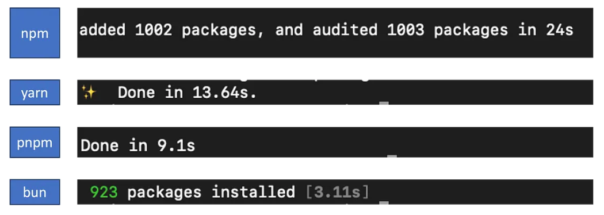

- [图片来源](https://javascript.plainenglish.io/npm-yarn-pnpm-bun-install-real-app-benchmarking-72c475498024)


然而,Bun本身并不仅仅是一个包管理器,它的目标是彻底代替Node.js,作为新的js运行时:
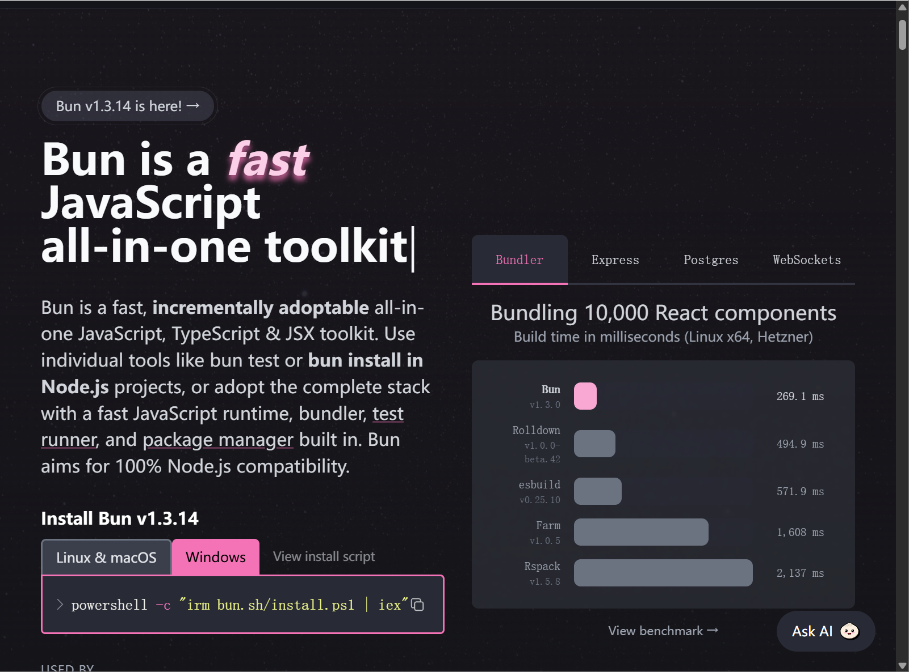

## 新兴的js运行时
### Bun
- [官网](https://bun.com/)

Bun于2023年正式发布,由于构建速度很快,且兼容Node项目,很快就爆火了,但最近两年的Bun可以说是All-in-AI了,我很不看好,甚至在前两天做出了这么离谱的事情(今天是5/17):
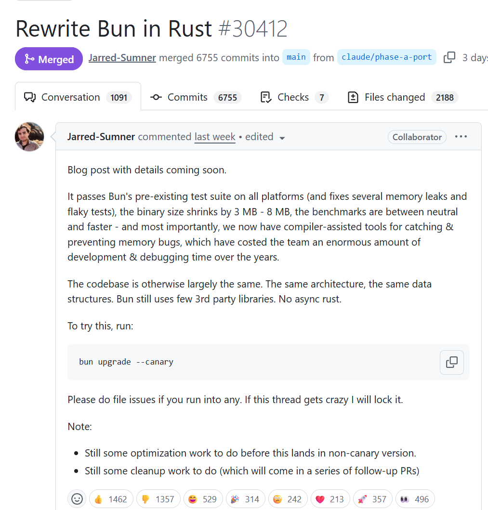

- 哈?一百万行代码?你直接梭哈了?
- [知乎讨论](https://www.zhihu.com/question/2038401743025854118)

真的无法理解:
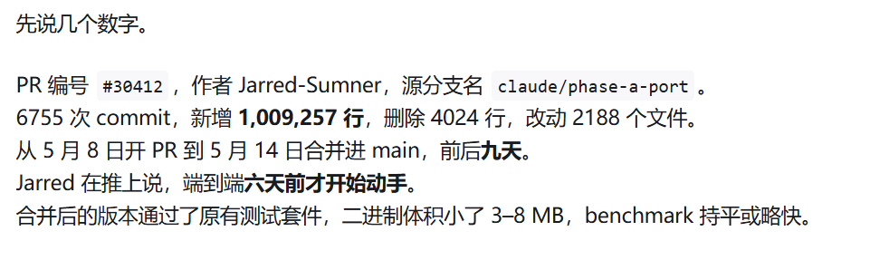

不过看到bun项目的issues数量后,我释怀了:

### Deno
- [wiki](https://en.wikipedia.org/wiki/Deno_(software))
Deno是由Node.js创始人于2018年的演讲中推出的Node.js替代品,为的是消除Node.js的种种缺陷:


- Deno最初用Go编写,但后来用Rust取代了Go

尽管如此,买账的人并不太多,Deno往往是Bun和Node.js后的第三选项.


## 构建器
### Webpack
- [官网](https://webpack.docschina.org/concepts/)
- [wiki](https://zh.wikipedia.org/wiki/Webpack)

>Webpack 是一款由 Tobias Koppers 于 2012 年发布的静态模块打包器，它通过建立一个包含项目所有资源（JS、CSS、图片等）的依赖关系图，将各种不同规范的模块转化为浏览器可识别的静态资源.

Webpack是前端构建器的始祖,如果用npm导入它的话,是这样写的:
```bash
npm install webpack webpack-cli
```
然后就可以用`webpack.config.js`进行基本的构建配置,当然我们没有必要去深入了解,毕竟现在确实不会用到webpack了.
### Rollup
- [官网](https://www.rollupjs.com/)
>Rollup 是一款由 Rich Harris 于 2015 年推出的 JavaScript 模块打包器，它开创性地引入了 **Tree-shaking**（摇树优化）技术，通过静态分析 ES 模块依赖关系来剔除未使用的代码，从而生成体积极小、结构扁平的生产环境资源包，因其输出代码纯净且符合标准，现已成为 Vite 生产构建核心及多数开源库（如 React、Vue）打包的首选工具。

- [教程](https://www.rollupjs.com/tutorial/)
  - 非常他推荐跟着这个教程走一遍,然后就可以懂得前端打包的基本原理了.
### esbuild
- [官网](https://esbuild.bootcss.com/getting-started/)
  - 推荐跟着教程来快速入门

现代构建器esbuild于2020年正式发布,并以他超绝的构建速度震惊了全世界,官网上有一个对比图:
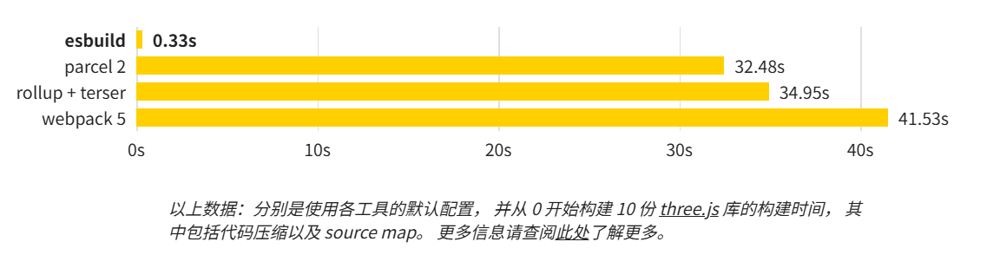

不管怎样,它的构建速度确实很快,我们看看它是如何做到的,首先新建一个项目后运行以下命令:
```bash
npm i esbuild react react-dom
```
之后在根目录新建一个`app.jsx`文件:
```jsx
import * as React from "react";
import * as Server from "react-dom/server";

let Greet = () => <h1>Hello, world!</h1>;
console.log(Server.renderToString(<Greet />));
```
之后运行以下命令执行esbuild脚本:
```bash
.\node_modules\.bin\esbuild app.jsx --bundle --outfile=out.js
```
然后就得到了一个一万多行的js代码:
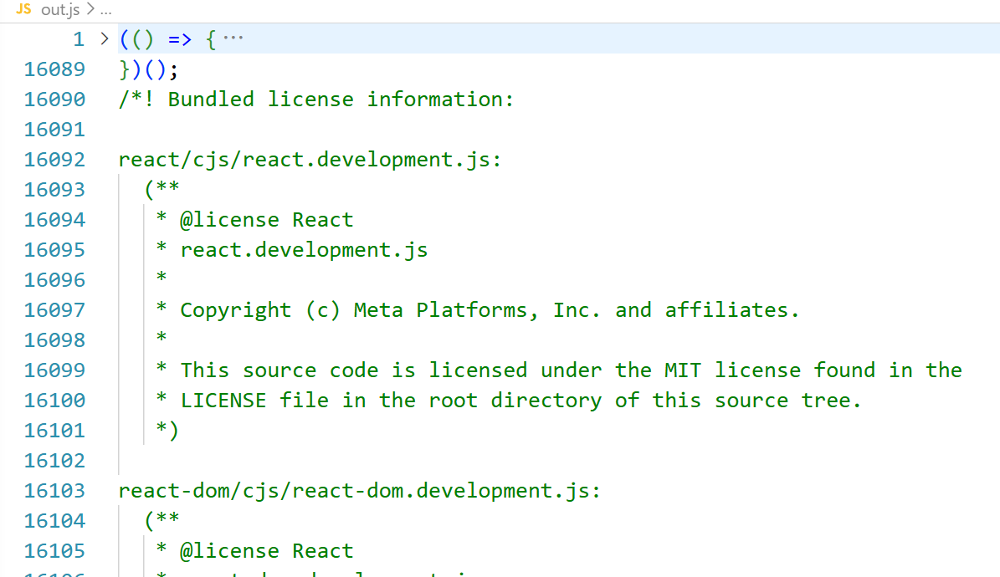

很惊人吧,而且,之前的构件工具只能处理html,css和普通的js代码,而它不需要转译器的帮助就可以处理jsx代码了,自然ts和tsx文件也是支持的,从而直接取代了转译器的活儿.

### Vite
#### 概览
>Vite 是由 Vue.js 作者尤雨溪（Evan You）于 2020 年发起的新一代前端构建工具

>Vite 诞生之初，浏览器刚刚获得了对 ES 模块（ESM）的广泛支持。ESM 允许浏览器直接加载 JavaScript 文件，无需工具事先将它们打包成单个文件。而传统的构建工具（通常称为 打包器）会在浏览器展示任何内容之前，将整个应用预先处理一遍。应用越大，等待的时间就越长。

Vite 采用了一种截然不同的方式，将工作拆分为两部分：

1. 依赖（几乎不会变动的库）：使用快速的原生工具 预构建 一次，即可随时就绪。
2. 源码（频繁变动的应用代码）：通过原生 ESM 按需提供。浏览器只加载当前页面所需的内容，Vite 则在请求时对每个文件进行转换。

这意味着无论应用规模多大，开发服务器的启动几乎都是即时的。当你修改某个文件时，Vite 通过原生 ESM 的 **模块热替换**（HMR）只更新浏览器中的对应模块，无需整页刷新，也无需等待重新构建。

>Vite 最初在底层依赖两个独立的工具：esbuild 负责开发阶段的快速编译，Rollup 负责生产构建中的深度优化。这套方案可行，但维护两条流水线带来了不一致性：不同的转换行为、各自独立的插件系统，以及越来越多的粘合代码来保持两者对齐。

>**Rolldown** 的出现将二者统一为一个打包器：用 Rust 编写以获得原生速度，并与生态系统已依赖的同一套插件 API 兼容。它使用 Oxc 进行解析、转换和压缩。这赋予了 Vite 一条端到端的工具链，其中构建工具、打包器和编译器共同维护，作为一个整体协同演进。

换句话说vite是前端构建工具的集大成者,将前端项目的构建速度优化到了极致.
#### 配置文件
使用vite的前端项目中,根目录下都有一个`vite.config.ts`文件:
```ts
import path from "node:path"
import tailwindcss from "@tailwindcss/vite"
import { tanstackRouter } from "@tanstack/router-plugin/vite"
import react from "@vitejs/plugin-react-swc"
import { defineConfig } from "vite"

// https://vitejs.dev/config/
export default defineConfig({
  resolve: {
    alias: {
      "@": path.resolve(__dirname, "./src"),
    },
  },
  plugins: [
    tanstackRouter({
      target: "react",
      autoCodeSplitting: true,
    }),
    react(),
    tailwindcss(),
  ],
})
```

以下代码非常值得关注:
```ts
resolve: {
    alias: {
      "@": path.resolve(__dirname, "./src"),
    },
  },
```
我们在前端项目中看到有些文件是以`@`的形式导入的,就是通过这个别名设置实现的:
```js
import { zodResolver } from "@hookform/resolvers/zod"
import { useMutation, useQueryClient } from "@tanstack/react-query"
```

## 转译器
### Babel
>Babel 是一类比较常用的jsx转换工具

```js
// 转换前
const element = <h1>Hello</h1>;

// 转换后
var element = React.createElement("h1", null, "Hello");
```
### typescript compiler(tsc)
用于将tsx和ts代码转换成普通的js代码,前面已经介绍过它的效果了,这里就不多说了.

### SWC
- [官网](https://swc.rs/docs/getting-started)

使用Rust编写的现代转译器,速度极快,是现代前端框架的标准配置.
## 测试工具(待补充)
### playwright
### eslint
## 总结
前端项目中有好几个概念:
1. 运行时: Node,Bun,Deno
2. 构建器: Vite,Webpack,Rollup等
3. 转译器: Babel,tsc

运行时是现代前端项目开发的基石,它负责处理网络通信,IO读取等原本由浏览器引擎来做的活儿,让前端的开发能够暂时离开浏览器.

构建器将html,css,js文件打包成一个或几个文件,并进行大量的优化工作,方便项目的打包和运行.

转译器将jsx,ts,tsx等代码转换成普通的js文件,供构建器调用处理.

了解了这些概念,你就会明白为什么前端项目会比后端项目多出那么多配置文件了:
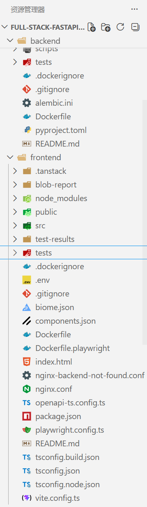

- 当然,上述的介绍都很浅薄,真要实战的话需要专门去看相应的官方文档.
- 前端工具开发目前正在全面转向Rust/Go,说明这两个语言确实很快.
# Tailwind

# Next.js
