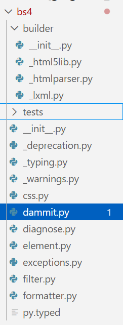
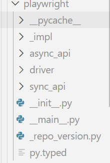

python最大的魅力在于各种各样的第三方库让它能够适配几乎所有的应用场景

- [官方文档](https://docs.python.org/zh-cn/3.11/tutorial/classes.html)
  - 学习python的各种疑难问题都是因为没有去阅读第一手资料


# python进阶语法
##  python类进阶
>如果用 C++ 术语来描述的话，类成员（包括数据成员）通常为 public,所有成员函数都为 virtual
### super()详解
### self详解
由于python没有指针,自然也没有this指针,但又需要像cpp一样,提供一个直接访问类内函数或者变量的方法,所以python引入了关键字self.

>事实上,上述的说法是不严谨的:
>>方法的第一个参数常常被命名为 self。 这也不过就是一个约定: **self 这一名称在 Python 中绝对没有特殊含义**。 但是要注意，不遵循此约定会使得你的代码对其他 Python 程序员来说缺乏可读性，而且也可以想像一个 类浏览器 程序的编写可能会依赖于这样的约定。
>也就是说,我们可以起名叫this,apple,但别人不一定看得懂就是了.


我们可以看到,大多数类中的函数都需要至少给出一个参数,也就是self,即使函数中并没有用到self,原因如下:
- Python 的类实例方法在调用时，解释器会自动将实例对象作为第一个位置参数传入,如果你没有写self参数,那么由于该函数没有参数,但却传入了一个参数,就会报错
  - 至于为什么会这样,那就是设计上的问题了,只能被动接受.
  - 这也解释了为什么我们从来没有手动处理self参数过

```py
class Dog:

    tricks = []             # mistaken use of a class variable

    def __init__(self, name):
        self.name = name

    def add_trick(self, trick):
        self.tricks.append(trick)

>>> d = Dog('Fido')
>>> e = Dog('Buddy')
>>> d.add_trick('roll over')
>>> e.add_trick('play dead')
>>> d.tricks                # unexpectedly shared by all dogs
['roll over', 'play dead']
```


## python关键字与内置函数

### with
### is和is not
### yield
### try finally catch throw
### async与await
- 于2015年的python3.5引入


### assert
- [官方文档](https://docs.python.org/3/reference/simple_stmts.html)
- [菜鸟教程](https://www.runoob.com/python3/python3-assert.html)
**基础用法**
```py
assert expression
# 等价于:
if __debug__:
    if not expression:
        raise AssertionError
```
**报错后输出提示**
```py
import sys
assert ('linux' in sys.platform), "该代码只能在 Linux 下执行"
```
## 常用语法糖
- [官方文档](https://docs.python.org/3/library/functions.html#classmethod)
### @classmethod
>Transform a method into a class method.

字面意思,将某个方法实例化到这个类中,从而可以直接调用,不需要使用self来指向实例,也不需要进行类的实例化.
但仍然需要填入参数cls(自然可以叫别的名字,cls只是一个习惯上的写法),用来指向这个类
- 因为这个类还没完成,就不能用类名.var/method来调用类内变量和函数,故需要通过cls来指向该类.
```py
class A(object):
    bar = 1
    def func1(self):  
        print ('foo') 
    @classmethod
    def func2(cls):
        print ('func2')
        print (cls.bar)
        cls().func1()   # 调用 foo 方法
 
A.func2()               # 不需要实例化
```
### @property
>Return a **property attribute**.


A property object has **getter, setter, and deleter** methods usable as decorators that create a copy of the property with the corresponding accessor function set to the decorated function. This is best explained with an example:
```py
class C:
    def __init__(self):
        self._x = None

    @property
    def x(self):
        """I'm the 'x' property."""
        return self._x

    @x.setter
    def x(self, value):
        self._x = value

    @x.deleter
    def x(self):
        del self._x
```

```py
class Parrot:
    def __init__(self):
        self._voltage = 100000

    @property
    def voltage(self):
        """Get the current voltage."""
        return self._voltage
```
- The @property decorator **turns the voltage() method into a “getter” for a read-only attribute with the same name**, and it sets the docstring for voltage to “Get the current voltage.”

如果还是看不懂的话,就把property看成是一个将方法转换成类内只读属性的语法糖(可以少写一对括号,并且不可修改),但可以通过setter和deleter来修改.
### @dataclass
- [官方文档](https://docs.python.org/zh-cn/3/library/dataclasses.html)
- [参考教程](https://www.cnblogs.com/wang_yb/p/18077397)
#### 是什么,怎么用
一般来说,我们定义类时需要这么写来初始化:
```py
class CoinTrans:
    def __init__(
        self,
        id: str,
        symbol: str,
        price: float,
        is_success: bool,
        addrs: list,
    ) -> None:
        self.id = id
        self.symbol = symbol
        self.price = price
        self.addrs = addrs
        self.is_success = is_success

if __name__ == "__main__":
    coin_trans = CoinTrans("id01", "BTC/USDT", "71000", True, ["0x1111", "0x2222"])
    print(coin_trans)
# <__main__.CoinTrans object at 0x0000022A891FADD0>
```
自然,python打印类的时候默认是打印类的内存地址的,这需要我们去单独实现一个打印函数返回类中的各种信息.

但如果使用dataclass装饰器的话,可以这样写:

```py
from dataclasses import dataclass

@dataclass
class CoinTrans:
    id: str
    symbol: str
    price: float
    is_success: bool
    addrs: list

if __name__ == "__main__":
    coin_trans = CoinTrans("id01", "BTC/USDT", "71000", True, ["0x1111", "0x2222"])
    print(coin_trans)
# CoinTrans(id='id01', symbol='BTC/USDT', price='71000', is_success=True, addrs=['0x1111', '0x2222'])
```
不需要写`__init__`,也不需要写打印函数,就可以直接实现上述的效果.


# python类型注释
类型注释在PEP484中引入,也就是2015年的python3.5,从而在很大程度上解决了python动态类型带来的混乱.
## 简单的类型注释
如下方代码所示,类型注释有两种格式:
1. `变量名: 类型`: 用于提示参数的类型
2. `函数末尾 -> 类型:`: 用于提示函数的返回值类型
```py
def surface_area_of_cube(edge_length: float) -> str:
    return f"The surface area of the cube is {6 * edge_length ** 2}."
```
大多数类型注释都不需要导入任何库即可使用,下面是一个常用的系统直接支持的类型注释表格:
| 分类            | 语法示例                                                        | 说明                                                  | 适用版本 |
| :-------------- | :-------------------------------------------------------------- | :---------------------------------------------------- | :------- |
| **基础标量**    | `var: int`, `var: float`, `var: bool`, `var: str`, `var: bytes` | 整数、浮点、布尔、字符串、字节流                      | 全版本   |
| **空值/无返回** | `def fn() -> None:`                                             | 表示函数没有返回值                                    | 全版本   |
| **列表**        | `var: list[int]`                                                | 元素全为整数的列表                                    | 3.9+     |
| **字典**        | `var: dict[str, int]`                                           | 键为字符串、值为整数的字典                            | 3.9+     |
| **元组 (定长)** | `var: tuple[int, str]`                                          | 包含一个整数和一个字符串的二元组                      | 3.9+     |
| **元组 (变长)** | `var: tuple[int, ...]`                                          | 包含任意数量整数的元组                                | 3.9+     |
| **集合**        | `var: set[str]`                                                 | 元素全为字符串的集合                                  | 3.9+     |
| **联合类型**    | `var: int \| str`                                               | 变量可以是整数或字符串 (Union)                        | 3.10+    |
| **可选类型**    | `var: str \| None`                                              | 变量可以是字符串或为空 (Optional)                     | 3.10+    |
| **类对象**      | `var: type[MyClass]`                                            | 变量是类本身，而不是类的实例                          | 3.9+     |
| **自定义类**    | `var: MyClass`                                                  | 变量是该类的实例                                      | 全版本   |
| **双向队列**    | `var: collections.deque[int]`                                   | 需 Python 3.9+，虽在 collections 但无需 import typing | 3.9+     |
| **切片**        | `var: slice`                                                    | 内存索引切片对象                                      | 全版本   |
| **范围**        | `var: range`                                                    | 迭代范围对象                                          | 全版本   |
| **枚举迭代**    | `var: enumerate`                                                | 枚举对象                                              | 全版本   |

这些简单类型已经可以涵盖大多数应用场景了,如果需要使用更高级的类型注释功能,就需要导入typing库来使用.
## typing系统库
- [官方文档](https://docs.python.org/zh-cn/3/library/typing.html)

### 类型别名: type
类型别名是使用 `type 简写 = 复杂类型` 语句来定义的，它将创建一个 `TypeAliasType` 的实例.
```py
type Vector = list[float]

def scale(scalar: float, vector: Vector) -> Vector:
    return [scalar * num for num in vector]

# 通过类型检查；浮点数列表是合格的 Vector。
new_vector = scale(2.0, [1.0, -4.2, 5.4])
```

### Any: 支持任何类型
不使用类型注释时,所有的变量和返回值都被视为Any,用Any类型注解的变量不会在类型检查时报错.

在现代python项目中,有三种情况会用到它:
1. 某一个变量支持不同类型的值
2. 你不知道它应该是什么值
3. 无论它是什么值都无所谓

显然,如果你全用Any的话也可以通过类型检查,但这样就没有意义了.


# 测试与格式检查库
## 如何写测试
- [pytest文档](https://docs.pytest.org/en/stable/explanation/anatomy.html#test-anatomy)
  - 写的很好,所以全文摘录
>In the simplest terms, a test is meant to look at the result of a particular behavior, and make sure that result aligns with what you would expect. Behavior is not something that can be empirically measured, which is why writing tests can be challenging.

“Behavior” is the way in which some system acts in response to a particular situation and/or stimuli. But exactly how or why something is done is not quite as important as what was done.

You can think of a test as being broken down into four steps:
1. Arrange
2. Act
3. Assert
4. Cleanup

Arrange is where we prepare everything for our test. This means pretty much everything except for the “act”. It’s lining up the dominoes so that the act can do its thing in one, state-changing step. This can mean preparing objects, starting/killing services, entering records into a database, or even things like defining a URL to query, generating some credentials for a user that doesn’t exist yet, or just waiting for some process to finish.

Act is the singular, state-changing action that kicks off the behavior we want to test. This behavior is what carries out the changing of the state of the system under test (SUT), and it’s the resulting changed state that we can look at to make a judgement about the behavior. This typically takes the form of a function/method call.

Assert is where we look at that resulting state and check if it looks how we’d expect after the dust has settled. It’s where we gather evidence to say the behavior does or does not align with what we expect. The assert in our test is where we take that measurement/observation and apply our judgement to it. If something should be green, we’d say `assert thing == "green"`.

Cleanup is where the test picks up after itself, so other tests aren’t being accidentally influenced by it.

At its core, the test is ultimately the act and assert steps, with the arrange step only providing the context. Behavior exists between act and assert.

也就是说,在写测试之前,我们需要设计一些能够体现代码功能或者bug的操作,放入测试函数中,然后执行函数并检测输出是否与预期的一致,并保证测试结果彼此之间互不影响.
## pytest
### Intro
pytest在python测试库中占据了统治地位,而python系统库自带的unittest就显得逊色很多了,故测试库里我只介绍pytest.

我们先创建一个`test_parts.py`文件,填入以下代码:
```py
def func(x):
    return x + 1


def test_answer():
    assert func(3) == 5
```
1. 如果是全局安装过,或者在虚拟环境安装了的话,只要在终端输入`pytest`即可
2. 如果使用uv管理的话,只需输入以下命令:
```bash
uv run pytest
```
该命令将运行当前目录并递归运行子目录中所有形式为 test_*.py 或 *_test.py 的文件.
- 如果文件中的代码块不是全局的而是位于函数中,则需要函数名带有类似的`test_*()`格式
- 如果把函数放在类里面,则需要在类名前面加上`Test`,否则该类被整个跳过
来看看输出结果:
```bash
================================= test session starts ==================================
platform win32 -- Python 3.13.7, pytest-9.0.2, pluggy-1.6.0
rootdir: xxx
configfile: pyproject.toml
plugins: anyio-4.12.1
collected 1 item                                                                        

test_parts.py F                                                                   [100%]

======================================= FAILURES ======================================= 
_____________________________________ test_answer ______________________________________ 

    def test_answer():
>       assert func(3) == 5
E       assert 4 == 5
E        +  where 4 = func(3)

test_parts.py:7: AssertionError
=============================== short test summary info ================================ 
FAILED test_parts.py::test_answer - assert 4 == 5
================================== 1 failed in 0.10s =================================== 
```
- [100%] 指的是运行所有测试用例的总体进度

### 使用pytest语法糖
- [官方教程](https://docs.pytest.org/en/stable/explanation/fixtures.html)
- [参考教程](https://www.cnblogs.com/hiyong/p/14163280.html)

用`@pytest.fixture()`修饰的函数在文件内部可以直接被其他函数调用名字并获取返回值,具体如下所示:
```py
import pytest

@pytest.fixture()
def login():
    print("登录")
    return 8

class Test_Demo():
    def test_case1(self):
        print("\n开始执行测试用例1")
        assert 1 + 1 == 2

    def test_case2(self, login):
        print("\n开始执行测试用例2")
        print(login)
        assert 2 + login == 10

    def test_case3(self):
        print("\n开始执行测试用例3")
        assert 99 + 1 == 100

if __name__ == '__main__':
    pytest.main()
```
- login()在这里相当于一个测试工具函数
  
### 语法糖参数: autouse
默认情况下,被`@pytest.fixture()`修饰的工具函数只在被请求时才被加载,如果没有任何一个测试用例用到这个函数,它就永远不会运行,也就是懒加载(lazy loading).

乍一看挺好的,但是如果测试中有大量的测试用例更改了数据库,我们不希望一个个去撤销数据库更改后还原,不仅让代码变得臃肿,而且很累.

所以,我们使用`autouse=True`来让被修饰的函数强制生效,而不管测试用例有没有调用这个函数.

```py
import pytest

@pytest.fixture(autouse=True)
def login():
    print("登录...")

class Test_Demo():
    def test_case1(self):
        print("\n开始执行测试用例1")
        assert 1 + 1 == 2

    def test_case2(self):
        print("\n开始执行测试用例2")
        assert 2 + 8 == 10

    def test_case3(self):
        print("\n开始执行测试用例3")
        assert 99 + 1 == 100


if __name__ == '__main__':
    pytest.main()
```
**终端输出**
```bash
登录...
PASSED                    [ 33%]
开始执行测试用例1
登录...
PASSED                    [ 66%]
开始执行测试用例2
登录...
PASSED                    [100%]
开始执行测试用例3
```
### 语法糖参数: scope
>fixture作用范围可以为module、class、session和function，默认作用域为function。

其核心逻辑是：**在指定作用域内，只执行一次初始化，然后所有人共享这个缓存的对象。**

#### function（函数级）
* **频率**：最高。
* **含义**：每个测试函数执行前，都会重新运行一遍 Fixture。
* **场景**：你需要每个测试用例都拥有一个全新的、干净的数据副本，防止 A 用例的操作影响到 B 用例。

#### class（类级）
* **频率**：中。
* **含义**：如果一个测试类（`class TestXXX`）里有 10 个测试方法，这个 Fixture 只会在进入该类时运行一次，10 个方法共用同一个对象。
* **场景**：测试类中的所有方法都需要同一个昂贵的对象（如一个已经打开的浏览器窗口）。

#### module（模块级）
* **频率**：低。
* **含义**：在一个 `.py` 文件中，无论有多少个类或函数，Fixture 只在该文件开始时运行一次。
* **场景**：同一个文件内的测试都依赖于同一个外部配置函数。

#### session（会话级）
* **频率**：最低。
* **含义**：当你运行 `pytest` 命令开始，到所有测试结束，Fixture 只运行一次。
* **场景**：启动整个项目的测试数据库、初始化大型算法模型或全局 API 客户端。


### yield关键字在pytest中的使用
在yield关键字之前的代码在测试函数开始运行之前执行，yield之后的代码在函数运行结束后执行
```py
import pytest

@pytest.fixture()
def login():
    print("登录")
    yield
    print("退出登录")

class Test_Demo():
    def test_case1(self):
        print("\n开始执行测试用例1")
        assert 1 + 1 == 2

    def test_case2(self, login):
        print("\n开始执行测试用例2")
        assert 2 + 8 == 10

    def test_case3(self):
        print("\n开始执行测试用例3")
        assert 99 + 1 == 100


if __name__ == '__main__':
    pytest.main()
```
**终端输出**
```bash
PASSED                      [ 33%]
开始执行测试用例1
登录
PASSED                      [ 66%]
开始执行测试用例2
退出登录
PASSED                      [100%]
开始执行测试用例3
```

### conftest.py文件

#### 自动识别机制
只要文件名为 `conftest.py`，pytest 会在启动时自动扫描并加载它。你**不需要**在测试文件中显式 `import` 它。

#### 作用范围（层级继承）
`conftest.py` 的作用范围遵循**目录树结构**：
* **根目录**：如果放在项目根目录，其定义的配置对整个项目生效。
* **子目录**：如果放在某个子目录（如 `tests/unit/conftest.py`），则仅对该目录及其子目录下的测试文件生效。
* **优先级**：子目录中的 `conftest.py` 会重写或扩展父目录中的同名配置。

#### 核心用途
它本质上是一个**本地插件库**，主要处理以下三类任务：

* **Fixtures（固件）共享**：
    在 `conftest.py` 中定义的 `@pytest.fixture` 可以被该目录下的所有测试用例直接通过参数名调用,不用再进行导入
* **Hook函数自定义**：
    可以修改 pytest 的内部行为。例如 `pytest_runtest_setup`（在测试开始前执行）或 `pytest_addoption`（添加自定义命令行参数）。
* **外部插件加载**：
    通过 `pytest_plugins = ["plugin1", "plugin2"]` 在特定目录下引入额外的插件。

#### 关键限制
* **不可跨目录手动导入**：永远不要尝试 `from conftest import ...`。如果这样做，会破坏 pytest 的加载机制，可能导致配置冲突或重复初始化。
* **文件命名固定**：必须严格命名为 `conftest.py`，否则 pytest 会将其视为普通的 Python 模块


### 实战
事实上,上述的内容基本涵盖了我们所需的pytest知识了,我们现在拿fastapi模板项目中的test部分来做例子,深入探讨一下pytest的实际应用
- 看来我这个博客可以靠着fastapi啃很久了

先翻到后端的Readme:
>If your stack is already up and you just want to run the tests, you can use:
```bash
docker compose exec backend bash scripts/tests-start.sh
```

看来这就是测试脚本了,让我们看看**tests-start.sh**的内容:

```bash
#! /usr/bin/env bash
set -e 
# 立即退出模式,脚本中任何一条命令执行失败将停止脚本继续执行
set -x
# 调试模式: 执行每条命令前先将命令打印到终端
python app/tests_pre_start.py
# 执行预启动脚本
bash scripts/test.sh "$@"
# 执行test.sh脚本
# "$@": 将当前脚本用到的参数传给test.sh脚本
# 如果我执行./tests-start.sh --verbose --fail-fast
# 那么执行test.sh时也会带有--verbose --fail-fast参数

```

那我们再看看**test.sh**脚本
```bash
#!/usr/bin/env bash

set -e
set -x

coverage run -m pytest tests/
# 执行tests文件夹下的测试
coverage report
# 在终端输出测试信息
coverage html --title "${@-coverage}"
# 生成可视化html报告,通常位于 htmlcov/ 目录
```

也就是说,到头来还是用pytest执行了tests文件夹里的测试,只不过多了一些其他的包装而已.


- 这就是全部的测试文件了,还是很多的,这说明测试并非是无关轻重的代码部分

先来看看最外层的conftest.py文件:
**conftest.py**
```py
from collections.abc import Generator

import pytest
from fastapi.testclient import TestClient
from sqlmodel import Session, delete

from app.core.config import settings
from app.core.db import engine, init_db
from app.main import app
from app.models import Item, User
from tests.utils.user import authentication_token_from_email
from tests.utils.utils import get_superuser_token_headers


@pytest.fixture(scope="session", autouse=True)
def db() -> Generator[Session, None, None]:
    with Session(engine) as session:
        init_db(session)
        yield session
        statement = delete(Item)
        session.execute(statement)
        statement = delete(User)
        session.execute(statement)
        session.commit()


# @pytest.fixture(scope="module")
# def client() -> Generator[TestClient, None, None]:
#     with TestClient(app) as c:
#         yield c


# @pytest.fixture(scope="module")
# def superuser_token_headers(client: TestClient) -> dict[str, str]:
#     return get_superuser_token_headers(client)


# @pytest.fixture(scope="module")
# def normal_user_token_headers(client: TestClient, db: Session) -> dict[str, str]:
#     return authentication_token_from_email(
#         client=client, email=settings.EMAIL_TEST_USER, db=db
#     )

```

第一个函数`db`在整个测试开始时启动一次,将数据库初始化,并删除Item和User关系表,从而清空所有数据;至于其他被注释掉的函数都是给其他测试模块用的工具函数

- 换句话说,这个测试只能在开发环境做,一旦部署好了就不要再搞测试了

除了utils文件夹下的文件都是工具函数外,其余的文件基本都是以test_前缀打头的pytest文件了.我们只挑一个最精华的文件来看:
**test_items.py**
```py
import uuid

from fastapi.testclient import TestClient
from sqlmodel import Session

from app.core.config import settings
from tests.utils.item import create_random_item


def test_create_item(
    client: TestClient, superuser_token_headers: dict[str, str]
) -> None:
    data = {"title": "Foo", "description": "Fighters"}
    response = client.post(
        f"{settings.API_V1_STR}/items/",
        headers=superuser_token_headers,
        json=data,
    )
    assert response.status_code == 200
    content = response.json()
    assert content["title"] == data["title"]
    assert content["description"] == data["description"]
    assert "id" in content
    assert "owner_id" in content


def test_read_item(
    client: TestClient, superuser_token_headers: dict[str, str], db: Session
) -> None:
    item = create_random_item(db)
    response = client.get(
        f"{settings.API_V1_STR}/items/{item.id}",
        headers=superuser_token_headers,
    )
    assert response.status_code == 200
    content = response.json()
    assert content["title"] == item.title
    assert content["description"] == item.description
    assert content["id"] == str(item.id)
    assert content["owner_id"] == str(item.owner_id)


def test_read_item_not_found(
    client: TestClient, superuser_token_headers: dict[str, str]
) -> None:
    response = client.get(
        f"{settings.API_V1_STR}/items/{uuid.uuid4()}",
        headers=superuser_token_headers,
    )
    assert response.status_code == 404
    content = response.json()
    assert content["detail"] == "Item not found"
```

- 第一个函数`test_create_item`模拟管理员创建一个测试数据,并判断收到的响应报文中的数据是否相同.
- 第二个函数`test_read_item`模拟管理员在创建一个随机物品后,判断使用get请求是否正常.
- 第三个函数`test_read_item_not_found`模拟管理员直接访问一个不存在的物品,需要注意的是,这里的uuid4方法有可能产生恰好与之前测试生成相同的物品id,而我们的数据库清空是只在开始运行时执行,而不是每次执行测试函数都执行,因此有极低的概率会返回200状态码导致测试失败

后面的函数都大差不差了,基本就是构造测试数据,使用client模拟前端进行访问,并判断响应是否正常,但是有一个问题:既然要模拟前端访问,自然需要后端能够响应,才能执行测试,但根据前面的脚本分析,我们仅仅是用了pytest启动test文件夹中的测试而已,并没有真正的启动后端,那么测试是如何执行的呢?

答案在最开始的`conftest.py`中,我们的测试函数中都引入了`client: TestClient`这个工具函数,而这个函数在`conftest.py`中早就定义好了:
```py
from app.main import app
from fastapi.testclient import TestClient
@pytest.fixture(scope="module")
def client() -> Generator[TestClient, None, None]:
    with TestClient(app) as c:
        yield c
```
这里的TestClient方法的作用域为模块级,即只在该文件的测试开始执行时调用一次,使用了main.py中的app对象:

```py
# 真实后端里的main.py

app = FastAPI(
    title=settings.PROJECT_NAME,
    openapi_url=f"{settings.API_V1_STR}/openapi.json",
    generate_unique_id_function=custom_generate_unique_id,
)
```
也就是说,我们启动了后端中的关键部分,从而实现对后端的整体调用,测试整个应用的运行是否正常.
## ruff
### 是什么,怎么用
ruff是用rust编写的python格式检查库,可以迅速将py文件规范化,速度比一版的格式检查库都要快很多.


要使用ruff,我们需要先将它加入到当前项目中:
```bash
uv add --dev ruff
```
之后再运行以下命令就可以检查该项目是否规范
```bash
uv run ruff check
```

### 基本用法
**ruff check**
```bash
ruff check                  # Lint files in the current directory.
ruff check --fix            # Lint files in the current directory and fix any fixable errors.
ruff check --watch          # Lint files in the current directory and re-lint on change.
ruff check path/to/code/    # Lint files in `path/to/code`.
```

# rst文件
有时候会在一些古老的python项目中看到`README.rst`文件,由于rst的语法跟md比起来差别比较大,因此需要在这里介绍一下.

## 历史
- [wiki](https://en.wikipedia.org/wiki/ReStructuredText)
rst的全称是reStructuredText,是一个于2001年发布的文档语言,而更为常用的md则于2004年发布,由于存在一定空窗期,故语法更为繁琐的rst仍然占据了一定的文档语言市场,并在早期的python项目中大量使用.

## 用法
- [官方网站](https://docutils.sourceforge.io/rst.html)
真想深入了解的话还是自己上网站查吧,因为尽管rst文件比较繁琐,但是层次还是清晰分明的:
```rst
backtrader
==========

.. image:: https://img.shields.io/pypi/v/backtrader.svg
   :alt: PyPi Version
   :scale: 100%
   :target: https://pypi.python.org/pypi/backtrader/

..  .. image:: https://img.shields.io/pypi/dm/backtrader.svg
       :alt: PyPi Monthly Donwloads
       :scale: 100%
       :target: https://pypi.python.org/pypi/backtrader/

.. image:: https://img.shields.io/pypi/l/backtrader.svg
   :alt: License
   :scale: 100%
   :target: https://github.com/backtrader/backtrader/blob/master/LICENSE
.. image:: https://travis-ci.org/backtrader/backtrader.png?branch=master
   :alt: Travis-ci Build Status
   :scale: 100%
   :target: https://travis-ci.org/backtrader/backtrader
.. image:: https://img.shields.io/pypi/pyversions/backtrader.svg
   :alt: Python versions
   :scale: 100%
   :target: https://pypi.python.org/pypi/backtrader/

**Yahoo API Note**:

  [2018-11-16] After some testing it would seem that data downloads can be
  again relied upon over the web interface (or API ``v7``)

**Tickets**

  The ticket system is (was, actually) more often than not abused to ask for
  advice about samples.

For **feedback/questions/...** use the `Community <https://community.backtrader.com>`_

Here a snippet of a Simple Moving Average CrossOver. It can be done in several
different ways. Use the docs (and examples) Luke!
::

  from datetime import datetime
  import backtrader as bt

  class SmaCross(bt.SignalStrategy):
      def __init__(self):
          sma1, sma2 = bt.ind.SMA(period=10), bt.ind.SMA(period=30)
          crossover = bt.ind.CrossOver(sma1, sma2)
          self.signal_add(bt.SIGNAL_LONG, crossover)

  cerebro = bt.Cerebro()
  cerebro.addstrategy(SmaCross)

  data0 = bt.feeds.YahooFinanceData(dataname='MSFT', fromdate=datetime(2011, 1, 1),
                                    todate=datetime(2012, 12, 31))
  cerebro.adddata(data0)

  cerebro.run()
  cerebro.plot()

Including a full featured chart. Give it a try! This is included in the samples
as ``sigsmacross/sigsmacross2.py``. Along it is ``sigsmacross.py`` which can be
parametrized from the command line.

Features:
=========

Live Trading and backtesting platform written in Python.

  - Live Data Feed and Trading with

    - Interactive Brokers (needs ``IbPy`` and benefits greatly from an
      installed ``pytz``)
    - *Visual Chart* (needs a fork of ``comtypes`` until a pull request is
      integrated in the release and benefits from ``pytz``)
    - *Oanda* (needs ``oandapy``) (REST API Only - v20 did not support
      streaming when implemented)

  - Data feeds from csv/files, online sources or from *pandas* and *blaze*
  - Filters for datas, like breaking a daily bar into chunks to simulate
    intraday or working with Renko bricks
  - Multiple data feeds and multiple strategies supported
  - Multiple timeframes at once
  - Integrated Resampling and Replaying
  - Step by Step backtesting or at once (except in the evaluation of the Strategy)
  - Integrated battery of indicators
  - *TA-Lib* indicator support (needs python *ta-lib* / check the docs)
  - Easy development of custom indicators
  - Analyzers (for example: TimeReturn, Sharpe Ratio, SQN) and ``pyfolio``
    integration (**deprecated**)
  - Flexible definition of commission schemes
  - Integrated broker simulation with *Market*, *Close*, *Limit*, *Stop*,
    *StopLimit*, *StopTrail*, *StopTrailLimit*and *OCO* orders, bracket order,
    slippage, volume filling strategies and continuous cash adjustmet for
    future-like instruments
  - Sizers for automated staking
  - Cheat-on-Close and Cheat-on-Open modes
  - Schedulers
  - Trading Calendars
  - Plotting (requires matplotlib)
```

- 不过看到一个库用的是README.rst而不是通用的README.md的时候还是建议尽早绕道,因为这个库一定用的都是老掉牙的实践方式和相关库.


# 包管理器: uv
## 管理python版本
>如果系统上已经安装了 Python，uv 将无需配置即可检测并使用它。但是，uv 也可以安装和管理 Python 版本。uv 会根据需要自动安装缺失的 Python 版本——你无需为了开始使用而预先安装 Python。

- `uv python install`：安装最新 Python 版本。
  - eg: `uv python install 3.12 `
- `uv python list`：查看可用的 Python 版本。

但是:
>当 uv 安装 Python 后，它不会在全局范围内可用（即通过 python 命令）。 此功能的支持尚处于_预览_阶段
你仍然可以使用uv run 或 创建并激活虚拟环境来直接使用 python。

## 运行python脚本
如果脚本没有依赖模块或者依赖标准库中的模块,可以直接使用 uv run 来执行它,例如:`uv run example.py`.

uv可以使用特定的python版本运行脚本
```bash
$ # 使用特定的 Python 版本
$ uv run --python 3.10 example.py
3.10.15
```

## 包的使用
uvx 命令可以在不安装工具的情况下调用它:
```bash
uvx ruff
```
使用 uvx 时，工具会安装到临时的、隔离的环境中.

如果一个工具经常使用，最好将其安装到持久环境中并添加到 PATH，而不是重复调用 uvx.
```bash
uv tool install ruff
```
安装工具后，其可执行文件会放在 PATH 中的 bin 目录中，这样就可以在没有 uv 的情况下运行该工具.

## 项目中的包管理
uv通过`pyproject.toml`文件来定义依赖项.

使用 `uv init` 命令创建一个新的 Python 项目:
```bash
uv init hello-world
cd hello-world
```
或者在工作目录中初始化uv
```bash
$ mkdir hello-world
$ cd hello-world
$ uv init
```
### 项目结构
>一个项目由几个协同工作的重要部分组成，这些部分允许 uv 管理你的项目。除了 uv init 创建的文件外，当你第一次运行项目命令（即 uv run、uv sync 或 uv lock）时，uv 将在你的项目根目录中创建一个虚拟环境和 uv.lock 文件。
```bash
.
├── .venv
│   ├── bin
│   ├── lib
│   └── pyvenv.cfg
├── .python-version
├── README.md
├── main.py
├── pyproject.toml
└── uv.lock
```

- 直接震惊了好吧,终于不用输入`python -m venv venv`这种东西了

**pyproject.toml**
```toml
[project]
name = "uv"
version = "0.1.0"
description = "Add your description here"
readme = "README.md"
requires-python = ">=3.13"
dependencies = []

```

**.python-version**
.python-version 文件包含项目的Python 版本。此文件告诉 uv 在创建项目的虚拟环境时使用哪个 Python 版本。

>我相信应该不只有我一个人好奇:就这一条信息为什么不合并到toml文件中呢?
经过[浏览](https://github.com/astral-sh/uv/issues/8247)我推测: requires-python配置项要求了在特定python版本下才能运行项目,如果把当前使用的不合规python版本写入toml,那么uv编译的时候要听谁的呢?
因此,单独分出这一个文件既是为了保证python版本管理的方便,也为了防止错误的python版本被用来执行.

**uv.lock**
uv.lock 是一个人类可读的 TOML 文件，但由 uv 管理，不应手动编辑,包含有关你的项目依赖项的精确信息.

### 包管理和从pip迁移
你可以使用 uv add 命令将依赖项添加到你的 pyproject.toml 中。这也将更新锁文件和项目环境：
```bash
$ # 指定版本约束
$ uv add 'requests==2.31.0'

$ # 添加一个 git 依赖
$ uv add git+https://github.com/psf/requests
```

```bash
$ # 从 `requirements.txt` 添加所有依赖项。
$ uv add -r requirements.txt -c constraints.txt
```

```bash
# --upgrade-package 标志将尝试将指定的包更新到最新的兼容版本，同时保持锁文件的其余部分不变
$ uv lock --upgrade-package requests
```

### 运行和同步
>在每次调用 uv run 之前，uv 将验证锁文件是否与 pyproject.toml 同步，以及环境是否与锁文件同步，从而使你的项目保持同步，无需手动干预。uv run 保证你的命令在一致、锁定的环境中运行。

当接手一个使用了uv的项目时,建议先运行uv sync命令以创建虚拟环境并下载库进行同步,尽管使用uv run **随便一个python文件** 会默认使用uv sync,但就不够优雅了.
### 构建分发包
```bash
$ uv build
$ ls dist/
hello-world-0.1.0-py3-none-any.whl
hello-world-0.1.0.tar.gz
```

## TL;DR
如果是自己新建python项目,则运行:
```bash
uv init hello-world
# 这会在创建子文件夹并填入初始内容
uv init 
# 在当前文件夹填入初始内容
uv add ...
# 本地加入自己需要的依赖
# 或者自己在toml里填入包,如果这样的话需要使用uv sync

uv run main.py
# 使用uv运行某个脚本
```
如果是接手某个项目:
```bash
uv sync
uv run main.py
# 使用uv运行某个脚本
```

## 实战:Using uv with PyTorch
- [参考](https://docs.astral.sh/uv/guides/integration/pytorch/)

```toml
[project]
name = "project"
version = "0.1.0"
requires-python = ">=3.14"
dependencies = [
  "torch>=2.9.1",
  "torchvision>=0.24.1",
]
```
>This is a valid configuration for projects that want to use **CPU** builds on Windows and macOS, and CUDA-enabled builds on Linux. However, if you need to support different platforms or accelerators, you'll need to configure the project accordingly.

**使用CUDA13.0**
```toml
[[tool.uv.index]]
name = "pytorch-cu130"
url = "https://download.pytorch.org/whl/cu130"
explicit = true
```
**TL;DR**:
先在nvidia官网下载cuda13.0,然后根据这个toml运行uv sync即可.
- 提示:要下载差不多2个G.
```toml
[project]
name = "ml"
version = "0.1.0"
description = "Add your description here"
readme = "README.md"
requires-python = ">=3.13"
dependencies = [
    "torch",
    "torchvision",
    "torchaudio",
]

[tool.uv]
# 1. 物理定义 PyTorch 的专用硬件加速索引库
[tool.uv.index]
name = "pytorch-cu130"
url = "https://download.pytorch.org/whl/cu130"
explicit = true # 强制：只有在 sources 中明确指定的包才去这里找，防止污染其他依赖

[tool.uv.sources]
# 2. 将核心组件物理绑定到上述索引
torch = { index = "pytorch-cu130" }
torchvision = { index = "pytorch-cu130" }
torchaudio = { index = "pytorch-cu130" }
```
解释一下:
1. tool.uv: 告诉uv编译器,下面是我要你遵循的规则
2. tool.uv.index: 提供自定义组件源,而不是到官方库下载
3. tool.uv.sources: 将组件与index绑定,只有与index绑定的组件才会去自定义组件源下载

运行一下代码,很成功:
```py
import torch
print(f"CUDA status: {torch.cuda.is_available()}")
print(f"CUDA version: {torch.version.cuda}")
```

```bash
uv run ch1.py
CUDA status: True
CUDA version: 13.0
```

# python读取文件
本部分所用的weekly_hiring_comments.json示例的结构如下:
```json
[
  {
    "issue": 692,
    "author": "ruanyf",
    "created_at": "2019-07-18T07:00:46Z",
    "text": "### **高级 Web 前端工程师**\r\n  \r\n[深圳追一科技](https://zhuiyi.ai/)，人工智能创业公司。工作地点：深圳市南山区。\r\n\r\n公司主打 NLP 方向的 B 端 AI 产品落地，诚求英才。要求4年以上实际前端项目的开发经验，熟练掌握 Vue 或 React 生态，查看[详细信息](https://www.zhipin.com/job_detail/79ca9be7fb736e4d03Nz3924FVA~.html)。\r\n\r\nEmail 联系：[winchang@wezhuiyi.com](mailto:winchang@wezhuiyi.com)",
    "url": "https://github.com/ruanyf/weekly/issues/692#issuecomment-512691467"
  },
//   ...
]
```
## open方法
读写文件一般都通过open方法来进行操作,基本用法看下面的代码就很容易理解了:
```py
with open("weekly_hiring_comments.json", "r", encoding="utf-8") as f:
    posts = json.load(f)

with open("本科及以上.json", "w", encoding="utf-8") as f:
    json.dump(bachelor_posts, f, ensure_ascii=False, indent=2)
```
三个参数分别为:
1. file(文件路径)
2. mode(操作方式)
3. encoding(解码方式)

mode 的值包括以下几种:
- 'r' ，表示读取文件
- 'w' 表示写入文件（现有同名文件会被覆盖）
- 'a' 表示打开文件并追加内容，任何写入的数据会自动添加到文件末尾
- 'r+' 表示打开文件进行读写
- **mode 实参是可选的，省略时的默认值为 'r'**


当然,如果看源码的话还能看到一堆参数,但我们一般只用得到上述的三个参数:
```py
def open(
    file: FileDescriptorOrPath,
    mode: OpenTextMode = "r",
    buffering: int = -1,
    encoding: str | None = None,
    errors: str | None = None,
    newline: str | None = None,
    closefd: bool = True,
    opener: _Opener | None = None,
) -> TextIOWrapper: ...
```

现在的问题是这个读写的文件会有很多种格式(.pdf,.txt,.json,.html,.js, ...),我们来看看open是怎么处理的:
1. text mode - 默认格式: 通常情况下,文件以该模式打开,一般使用utf-8进行编码,该模式主要用于处理文本文件
2. binary mode - 以二进制模式读取文件,需要在mode词尾加上一个'b',如`wb`,`ab`等,在二进制模式下无法指定encoding(也没有必要指定),该模式主要用于读取.png,.mp3,.pdf这样的二进制文件

换句话说,open函数根本不会对每种文件进行特殊处理,只是有两种读取方式而已了,对于一些特殊的文件格式,我们都需要额外用其他库去处理.

但是对于一般的文件格式,open函数读取文件名后会返回一个TextIOWrapper对象,它有两种常用的方法:
1. .read()方法: 将全文读入一个字符串变量
   1. 例子: `content = f.read()`
2. .write()方法: 写入字符串
   1. 例子: `f.write(f"## 招聘 \n\n")`


### json系统库:处理json文件
既然是系统库,那自然要先导入后使用,事实上只有两个常用函数: json.load()和json.dump().

**示例**
```py
with open("weekly_hiring_comments.json", "r", encoding="utf-8") as f:
    posts = json.load(f)

bachelor_posts = []

with open(out_dir / "本科及以上.json", "w", encoding="utf-8") as f:
    json.dump(bachelor_posts, f, ensure_ascii=False, indent=2)
```
看看源码和参数:
```py
# load()
(function) def load(
    fp: SupportsRead[str | bytes],
    *,
    cls: type[JSONDecoder] | None = None,
    object_hook: ((dict[Any, Any]) -> Any) | None = None,
    parse_float: ((str) -> Any) | None = None,
    parse_int: ((str) -> Any) | None = None,
    parse_constant: ((str) -> Any) | None = None,
    object_pairs_hook: ((list[tuple[Any, Any]]) -> Any) | None = None,
    **kwds: Any
) -> Any

# dump()
(function) def dump(
    obj: Any,
    fp: SupportsWrite[str],
    *,
    skipkeys: bool = False,
    ensure_ascii: bool = True,
    check_circular: bool = True,
    allow_nan: bool = True,
    cls: type[JSONEncoder] | None = None,
    indent: int | str | None = None,
    separators: tuple[str, str] | None = None,
    default: ((Any) -> Any) | None = None,
    sort_keys: bool = False,
    **kwds: Any
) -> None
```
速览一下就知道用法了,读json文件时指定文件名,写json文件时指定写入内容和写入文件名就可以了
### 处理md文件
md文件没有专门的库,直接读写就可以了
```py
with open("weekly_hiring_comments.json", "r", encoding="utf-8") as f:
    posts = json.load(f)

out = Path("weekly_hiring_comments.md")

with out.open("w", encoding="utf-8") as f:
    for i, p in enumerate(posts, 1):
        f.write(f"## 招聘 {i}\n\n")
        f.write(f"- Issue: #{p['issue']}\n")
        f.write(f"- 作者: {p['author']}\n")
        f.write(f"- 时间: {p['created_at']}\n")
        f.write(f"- 来源: {p['url']}\n\n")
        f.write(p["text"])
        f.write("\n\n---\n\n")
```

## pathlib库
**该库在不同平台下都能轻松读取文件路径**,而不需要操心系统问题或者字符串问题.

- [官方文档](https://docs.python.org/zh-cn/3/library/pathlib.html)

>如果以前从未用过此模块，或不确定哪个类适合完成任务，那要用的可能就是 Path。它在运行代码的平台上实例化为具体路径.

接下来我们来详细介绍这个Path对象
### Path对象的创建
```py
from pathlib import Path

# 基础用法
out_file: Path = Path("a.md")

# 拼接路径的两种写法

# 简写
out_file: Path = Path("modules") / "a.py"

# 分开写
out_dir: Path = Path("modules")
out_file: Path = out_dir / "issues.md"

```
上述的代码由于没有指定绝对路径,故都是相对于python运行目录的路径,但我们也可以指定绝对路径,如下文所示:
```py
from pathlib import Path

# Windows 风格
abs_path_win = Path("C:/Users/Admin/Desktop/a.md")

# Linux/macOS 风格
abs_path_unix = Path("/home/user/project/a.md")
```
也就是说,我们不需要再去折腾不同操作系统的路径问题了,统一用`/`就可以确定相对的路径.
### 使用Path来创建文件夹
只需要调用mkdir方法即可:
```py
out_dir: Path = Path("issues_md")
out_dir.mkdir(exist_ok=True)
```
- exist_ok参数的作用: 默认为False,设置为True时,即便当前路径下有这个文件夹,也不会报错
### Path对象的open方法
事实上,这个open方法与python内置的open方法基本没有区别,只是把文件路径提到外面来了而已:
```py
out_dir: Path = Path("issues_md")
out_dir.mkdir(exist_ok=True)

for issue, items in by_issue.items():
    path = out_dir / f"issue_{issue}.md"
    with path.open("w", encoding="utf-8") as f:
        f.write(f"# Issue #{issue} 招聘汇总\n\n")
```

### Path对象的glob方法(待补充)

### 实战
```py
import json
from pathlib import Path
from collections import defaultdict

with open("weekly_hiring_comments.json", "r", encoding="utf-8") as f:
    posts = json.load(f)
# 读取json列表
by_issue = defaultdict(list)
for p in posts:
    by_issue[p["issue"]].append(p)
# 处理为一个有序字典,这在json列表本身是无序的时候比较好用
out_dir: Path = Path("issues_md")
out_dir.mkdir(exist_ok=True)

for issue, items in by_issue.items():
    path = out_dir / f"issue_{issue}.md"
    with path.open("w", encoding="utf-8") as f:
        f.write(f"# Issue #{issue} 招聘汇总\n\n")

        for i, p in enumerate(items, 1):
            f.write(f"## 招聘 {i}\n\n")
            f.write(f"- 作者: {p['author']}\n")
            f.write(f"- 时间: {p['created_at']}\n")
            f.write(f"- 来源: {p['url']}\n\n")
            f.write(p["text"])
            f.write("\n\n---\n\n")
```

## re系统库
- [官方文档](https://docs.python.org/zh-tw/3.8/library/re.html)

该库是对正则表达式(regular expression)的封装,所以叫re.

### compile方法
compile是一个实例化pattern对象的方法,pattern一词在re中指的是正则表达式字符串
```py
prog = re.compile(pattern)
result = prog.match(string)
# 上述代码等价于下面的这个
result = re.match(pattern, string)
# 为了规范化和复用,我们还是多用compile方法来指明pattern对象
```

>事实上,re库中的大多数常用方法都有两种写法,一种是`模式.方法(参数)`,另一种是`方法.(模式,参数)`.为了规范起见,我们后面都采用`模式.方法(参数)`写法,就不再次说明了


### search方法与match方法
- [菜鸟教程](https://www.runoob.com/python/python-reg-expressions.html)

>re.match只匹配字符串的开始，如果字符串开始不符合正则表达式，则匹配失败，函数返回None；而re.search匹配整个字符串，直到找到一个匹配。

```py
#!/usr/bin/python
import re
 
line = "Cats are smarter than dogs";
 
matchObj = re.match( r'dogs', line, re.M|re.I)
if matchObj:
   print "match --> matchObj.group() : ", matchObj.group()
else:
   print "No match!!"
 
matchObj = re.search( r'dogs', line, re.M|re.I)
if matchObj:
   print "search --> searchObj.group() : ", matchObj.group()
else:
   print "No match!!"
```
**运行结果**
```bash
No match!!
search --> searchObj.group() :  dogs
```

### 实战
下面的整个代码流程为:
1. 载入json文件为列表posts
2. 使用compile方法组织匹配模式
3. 将posts里对应学历要求的帖子中的text字段里的值插入列表中
4. 导出json文件
```py
with open("weekly_hiring_comments.json", "r", encoding="utf-8") as f:
    posts = json.load(f)

bachelor_patterns = [
    r"本科及以上",
    r"本科以上",
]

master_patterns = [
    r"硕士及以上",
    r"硕士以上",
]
# 这里的r是为了禁用`\`转义符,但这里都是中文,不写也可以,为了规范所以加上了

bachelor_re = re.compile("|".join(bachelor_patterns))
master_re = re.compile("|".join(master_patterns))
# 拼接了两个匹配字符串

bachelor_posts = []
master_posts = []

for p in posts:
    # 这个p是列表的子元素,在这里为字典
    text = p.get("text", "")
    # get方法的第一个参数是,查找该字典中的对应字段并返回值,第二个参数是,若查找不到返回的默认值
    if master_re.search(text):
        master_posts.append(p)
    elif bachelor_re.search(text):
        bachelor_posts.append(p)

# === 输出目录 ===
out_dir = Path("degree_split")
out_dir.mkdir(exist_ok=True)

# === 写文件 ===
with open(out_dir / "本科及以上.json", "w", encoding="utf-8") as f:
    json.dump(bachelor_posts, f, ensure_ascii=False, indent=2)

with open(out_dir / "硕士及以上.json", "w", encoding="utf-8") as f:
    json.dump(master_posts, f, ensure_ascii=False, indent=2)

```


## 读取.env文件
对于密码,API密钥这些文件,用json文件存取不够方便也不够安全,因此我们有了.env文件,样式如下:
```toml
# github token
token="ghp_xxxxxxxxxxxx"
```
当我们想要读取这个.env文件中的token字段时,我们可以导入dotenv库和os库来进行简单的读取:
```py
from dotenv import load_dotenv
import os

load_dotenv()
TOKEN = os.getenv("token")
```
`load_dotenv()`函数会递归寻找.env文件并返回内容供os库读取,从而避免了写路径的麻烦.

# python爬虫
和机器学习一样,我第一次学习python爬虫是没有任何成果的,一开始是听说有这么个东西,就去zlib上随便下了本参考书,由于参考书是十年前的,因此使用了很多老掉牙的库和奇奇怪怪的语法,再加上当时水平有限,根本无法复现,于是就浅尝辄止了.

但现在,我想要试着用爬虫找到合适的招聘数据用来为以后的暑期实习和秋招服务,所以又把这门技术捡起来从零开始学了.

- 参考文章: 菜鸟教程以及官方文档
## 爬虫概念
>[wiki](https://en.wikipedia.org/wiki/Web_crawler)
Web crawler, sometimes called a spider or spiderbot and often shortened to crawler, is an Internet bot that systematically browses the World Wide Web and that is typically operated by **search engines** for the purpose of Web indexing (web spidering)
实际上,只要一个自动化程序做了下列的某一件事情,就可以认定为爬虫:
- 获取web资源
- 模拟浏览器/用户行为
- 批量获取数据

这几个操作基本涵盖了抢票脚本,pdf下载,训练数据爬取等一系列常见的爬虫情景.

最常见的爬虫无疑就是搜索引擎了,这些巨无霸爬虫不间断的访问数以千万计的网站,并给数据做好归类和索引.


## 爬虫历史
翻遍全网,我确实找不到一个能够好好讲讲从爬虫概念的诞生到最新爬虫框架应用的博客文章(难道谈这个是犯法吗!)

遗憾的是,我目前没有做这方面梳理的打算,等我真正闲下来再写吧,毕竟随便一想就知道这需要大量的检索和查证.

## python爬虫工具时间线
- 04年: [BeautifulSoup](https://www.crummy.com/software/BeautifulSoup/bs4/doc/),绝对的老资历,爬虫入门书十本有十本会谈到它
- 08年: [Scrapy](https://docs.scrapy.org/en/latest/),工业级别的异步爬虫框架,也是推荐的爬虫入门库
- 08年: [Selenium](https://www.selenium.dev/documentation/),浏览器自动化鼻祖, 物理驱动 WebDriver 模拟真实用户操作
- 12年: [Requests](https://requests.readthedocs.io/en/latest/),物理简化 HTTP 请求逻辑
- 20年: [Playwright](https://github.com/microsoft/playwright),微软出品,物理支持多驱动与自动等待,现代爬虫框架

- 但我不打算按照时间顺序来,而是按照难易程度来讲解😊
## requests库学习
- [官方文档](https://requests.readthedocs.io/en/latest/)
  - 质量比较高,深入浅出
### 是什么,怎么用
>Requests is an **elegant and simple HTTP library** for Python, built for human beings.
- 官方的宣言非常简单明了

```py
import requests

r = requests.get('https://api.github.com/events')
r = requests.post('https://httpbin.org/post', data={'key': 'value'})
r = requests.put('https://httpbin.org/put', data={'key': 'value'})
r = requests.delete('https://httpbin.org/delete')
r = requests.head('https://httpbin.org/get')
r = requests.options('https://httpbin.org/get')
```
自然,当我们使用爬虫时,只需要使用get请求就足够了

### 给get请求带上参数
>If you were constructing the URL by hand, this data would be given as key/value pairs in the URL after a question mark, e.g. `httpbin.org/get?key=val`. Requests allows you to provide these arguments as a dictionary of strings, using the params keyword argument.
```py
payload = {'key1': 'value1', 'key2': 'value2'}
r = requests.get('https://httpbin.org/get', params=payload)
print(r.url)
# https://httpbin.org/get?key2=value2&key1=value1

# another file
payload = {'key1': 'value1', 'key2': ['value2', 'value3']}

r = requests.get('https://httpbin.org/get', params=payload)
print(r.url)
# https://httpbin.org/get?key1=value1&key2=value2&key2=value3
```
- 通过在对应地址后面加参数可以实现按页数/分类爬取
### 给get请求设置超时时限
```py
requests.get('https://github.com/', timeout=0.001)
```
当get请求用时超过timeout值时自动报错
### 定制头部(Headers)
>If you’d like to add HTTP headers to a request, simply pass in a **dict** to the headers parameter.

```py
url = 'https://api.github.com/some/endpoint'
headers = {'user-agent': 'my-app/0.0.1'}

r = requests.get(url, headers=headers)
```
### 处理get请求获取的内容
```py
import requests

r = requests.get('https://api.github.com/events')
# 我们可以以多种文本形式来处理这个r对象,requests库会自动帮我们返回所需的文本形式

r.text  # 纯文本形式   '[{"repository":{"open_issues":0,"url":"https://github.com/...

r.content  # 二进制形式  b'[{"repository":{"open_issues":0,"url":"https://github.com/...

r.json()   # json形式   [{'repository': {'open_issues': 0, 'url': 'https://github.com/...
```
#### 处理返回的状态码
```py
r = requests.get('https://httpbin.org/get')
r.status_code
# 200
```
- 状态码在判断是否正常爬取内容的时候非常重要
#### 处理返回的头部
```py
r.headers
# {
#     'content-encoding': 'gzip',
#     'transfer-encoding': 'chunked',
#     'connection': 'close',
#     'server': 'nginx/1.0.4',
#     'x-runtime': '148ms',
#     'etag': '"e1ca502697e5c9317743dc078f67693f"',
#     'content-type': 'application/json'
# }

# we can access the headers using any capitalization we want
r.headers['Content-Type']
'application/json'

r.headers.get('content-type')
'application/json'
```
### 实战
爬取仓库的issues
```py
SEARCH_URL="https://api.github.com/search/issues"
# 爬虫专用的GitHub api网址
HEADERS: dict = {
    "Authorization": f"token {TOKEN}", 
    "Accept": "application/vnd.github+json",
}
# 带有TOKEN认证的请求头部可以扩大爬虫的权限
# Accept字段表明希望获取json格式的数据
def fetch_issues(start, end):
    page = 1
    issues = []

    while True:
        r = requests.get(
            SEARCH_URL, 
            headers=HEADERS,
            params={
                "q": f"repo:ruanyf/weekly 谁在招人 created:{start}..{end}",
                # start..end 为时间范围筛选
                "per_page": 100,
                # 单次请求返回的数据条数,100为最大值
                "page": page,
                # 当前页码
                "sort": "created",
                # 按照创建时间排序
                "order": "asc",
                # asc-ascend(升序),另外有desc-descend(降序)
            },
        )

        data = r.json() 
        # 用json格式读取数据
        items = data.get("items", [])
        # 用get方法获取data的items键对应的列表,若不存在该键则返回空列表
        if not items:
            break
        # 若为空则说明全部爬取完了
        issues.extend(items)
        # 将新列表连接到issues列表的末尾
        page += 1
        # 爬取下一页
        time.sleep(1)
        # 等一秒再请求,避免被封
    return issues
    # 返回issues列表
```
items中元素的结构示例
```json
{
  "url": "https://api.github.com/repos/ruanyf/weekly/issues/737",
  "repository_url": "https://api.github.com/repos/ruanyf/weekly",
  "labels_url": "https://api.github.com/repos/ruanyf/weekly/issues/737/labels{/name}",
  "comments_url": "https://api.github.com/repos/ruanyf/weekly/issues/737/comments",
  "events_url": "https://api.github.com/repos/ruanyf/weekly/issues/737/events",
  "html_url": "https://github.com/ruanyf/weekly/issues/737",
  "id": 474420491,
  "node_id": "MDU6SXNzdWU0NzQ0MjA0OTE=",
  "number": 737,
  "title": "谁在招人？",
  "user": {
    "login": "hobo-tt",
    "id": 53465562,
    "node_id": "MDQ6VXNlcjUzNDY1NTYy",
    "avatar_url": "https://avatars.githubusercontent.com/u/53465562?v=4",
    "gravatar_id": "",
    "url": "https://api.github.com/users/hobo-tt",
    "html_url": "https://github.com/hobo-tt",
    "followers_url": "https://api.github.com/users/hobo-tt/followers",
    "following_url": "https://api.github.com/users/hobo-tt/following{/other_user}",
    "gists_url": "https://api.github.com/users/hobo-tt/gists{/gist_id}",
    "starred_url": "https://api.github.com/users/hobo-tt/starred{/owner}{/repo}",
    "subscriptions_url": "https://api.github.com/users/hobo-tt/subscriptions",
    "organizations_url": "https://api.github.com/users/hobo-tt/orgs",
    "repos_url": "https://api.github.com/users/hobo-tt/repos",
    "events_url": "https://api.github.com/users/hobo-tt/events{/privacy}",
    "received_events_url": "https://api.github.com/users/hobo-tt/received_events",
    "type": "User",
    "user_view_type": "public",
    "site_admin": false
  },
  "labels": [],
  "state": "closed",
  "locked": false,
  "assignees": [],
  "milestone": null,
  "comments": 0,
  "created_at": "2019-07-30T07:28:48Z",
  "updated_at": "2019-07-30T07:29:41Z",
  "closed_at": "2019-07-30T07:29:41Z",
  "assignee": null,
  "author_association": "NONE",
  "active_lock_reason": null,
  "sub_issues_summary": {
    "total": 0,
    "completed": 0,
    "percent_completed": 0
  },
  "issue_dependencies_summary": {
    "blocked_by": 0,
    "total_blocked_by": 0,
    "blocking": 0,
    "total_blocking": 0
  },
  "body": "北京国际音乐节文化传播有限公司\r\n地点：北京市朝阳区三间房南里4号院第96栋综合办公楼\r\n简历投递Email：[](url)yuanweitong@bmfbj.com\r\n\r\n### 前端工程师\r\n**岗位职责：**\r\n1、负责项目前端架构设计及研发工作；\r\n3、参与复杂业务系统技术选型，架构设计实现，新兴技术研究职责要求；\r\n4、负责前端界面的开发工作；\r\n5、根据产品和需求，依照当前技术架构进行前端开发；\r\n6、负责页面布局优化和调整。\r\n7、对接API数据、并可协调整体数据对接\r\n**任职条件：**\r\n1、本科及以上学历，三年以上web前端开发工作经验；\r\n2、精通HTML，CSS，了解W3C标准，能够熟练配合美工完成兼容主流浏览器的前端页面精通JavaScript，Ajax，DOM等前端技术，精通Vue前端框架；\r\n3、熟悉HTML5/CSS3de.js/Less/Scss等技术能持续优化前端页面的兼 容性和执行效率了解前端页面组件化；\r\n4、对单页WEB应用开发有极强的学习能力，对新技术有浓厚的研究兴趣；\r\n5、熟悉一门非JavaScript语言，如Java、Python、Ruby等\r\n6、熟悉小程序、VUE\r\n\r\n职位详情见[招聘网](https://www.lagou.com/jobs/6077252.html?source=pl&i=pl-1&show=b0079c35e8a042c49b24a6018cec2bac)",
  "reactions": {
    "url": "https://api.github.com/repos/ruanyf/weekly/issues/737/reactions",
    "total_count": 0,
    "+1": 0,
    "-1": 0,
    "laugh": 0,
    "hooray": 0,
    "confused": 0,
    "heart": 0,
    "rocket": 0,
    "eyes": 0
  },
  "timeline_url": "https://api.github.com/repos/ruanyf/weekly/issues/737/timeline",
  "performed_via_github_app": null,
  "state_reason": "completed",
  "pinned_comment": null,
  "score": 1.0
}
``` 
## bs4学习
- [官方文档](https://www.crummy.com/software/BeautifulSoup/)
  - 一般只用得上其中的一小部分功能,所以翻翻就好了

Beautiful Soup现在的版本为4.13.3,且第四版从12年就已经发布,故一般称为bs4.

**名字来源**
>It takes its name from the poem Beautiful Soup from *Alice's Adventures in Wonderland* and is a reference to the term "tag soup" meaning poorly-structured HTML code.

### 是什么,怎么用

bs4主要用于解析HTML和XML文档,但是它本身不负责解析,而是需要你配合解析库如"lxml"或者python内置的html.parser来进行解析,但是你没有单独在文件里导入,只要虚拟环境中有这个lxml库就可以了
```py
from bs4 import BeautifulSoup
import requests
# 使用 requests 获取网页内容
url = 'https://cn.bing.com/' # 抓取bing搜索引擎的网页内容
response = requests.get(url)

# 使用 BeautifulSoup 解析网页
soup = BeautifulSoup(response.text, 'lxml')  # 使用 lxml 解析器
# 解析网页内容 html.parser 解析器
# soup = BeautifulSoup(response.text, 'html.parser')
```


### find与find_all
**基础用法**
```py
from bs4 import BeautifulSoup
import requests

# 指定你想要获取标题的网站
url = 'https://www.baidu.com/' # 抓取bing搜索引擎的网页内容

# 发送HTTP请求获取网页内容
response = requests.get(url)

soup = BeautifulSoup(response.text, 'lxml')

# 查找第一个 <a> 标签
first_link = soup.find('a')
print(first_link)
print("----------------------------")

# 获取第一个 <a> 标签的 href 属性
first_link_url = first_link.get('href')
print(first_link_url)
print("----------------------------")

# 查找所有 <a> 标签
all_links = soup.find_all('a')
print(all_links)


# 获取第一个 <p> 标签中的文本内容
paragraph_text = soup.find("p").get_text()

# 获取页面中所有文本内容
all_text = soup.get_text()
print(all_text)
```
**加入标签或属性**
```py
# 查找所有 class="example-class" 的 <div> 标签
divs_with_class = soup.find_all('div', class_='example-class')

# 查找具有 id="unique-id" 的 <p> 标签
unique_paragraph = soup.find('p', id='unique-id')
```


非常显然的是,bs4仅支持获取静态网页内容,在现在很多网页都是用js渲染的情况下不太实用了,但作为新手入门库还是很不错的,可以一下子感受到爬虫的威力,没有任何学习难度.

### bs4源码概览

>如果你闲的蛋疼,可以像我一样下载bs4的源码:
```bash
git clone https://git.launchpad.net/beautifulsoup
```


事实上,当我们翻阅源码时,会惊讶的发现这个有着20年悠久历史的python库竟然只有这么一点文件!
- 而且还能看到**dammit.py**这么一个神奇的名字

## 小结
结合requests(,bs4)和支持读写文件的库,我们现在基本可以爬取所有的静态网页资源,并在处理后进行存储了.
## Selenium学习

- [官方教程](https://www.selenium.dev/zh-cn/documentation/webdriver/getting_started/)
  - 非常遗憾的是,官方的文档写的很烂
- [geeksforgeeks](https://www.geeksforgeeks.org/python/selenium-python-tutorial/)
  - 翻来翻去能找到的唯一质量比较好的教程,反过来说明selenium本身的用户生态太差了

### 是什么,怎么用
>Selenium 通过使用 WebDriver 支持市场上所有主流浏览器的自动化。 WebDriver 是一个 API 和协议，它定义了一个语言中立的接口，用于控制 web 浏览器的行为。 每个浏览器都有一个特定的 WebDriver 实现，称为驱动程序。 驱动程序是负责委派给浏览器的组件，并处理与 Selenium 和浏览器之间的通信。

换句话说,没有WebDriver就用不了selenium,所以我们需要下载自己浏览器版本对应的驱动器.

当然,去官方慢慢翻驱动器版本还是太琐碎了,现在的selenium支持**自动下载**对应的驱动器,就没必要如过时的教程所说去配置驱动器的环境变量了.
```py
from selenium import webdriver

driver = webdriver.Chrome()
driver.get("https://www.google.com")
# 只写这三行代码也会自动下载对应的驱动器到本地缓存目录中
```
运行上方代码,我们成功用chrome打开了google网站
- 至于为什么会自动退出,是因为我们后面没有其他代码了,webdriver会自动关闭


如果你还是没明白selenium的用法的话,你可以想一下,如果有一个实验要你去找一百个人填问卷,你可以将问卷设定为允许多次填写,安排一些合理的选择题,就可以很轻松的用selenium模拟真实用户登录问卷星网站,用预先设定的随机值去逐个填写问卷,这样一下来,就算要填一千份你一个小时也能搞定了.
- 注意!这是严重的学术不端行为!请大家千万不要模仿!
#### 可能的vpn问题
我用的clash设定了系统代理,在终端配置了代理端口,还在bypass列表里设定了排除系统端口,但selenium还是会被拦截...

**~~我~~AI的解决方案**

```py
import os
os.environ["HTTP_PROXY"] = ""
os.environ["HTTPS_PROXY"] = ""
os.environ["no_proxy"] = "localhost,127.0.0.1"
# 在代码上方加上这个,但更推荐单独放入一个文件后再导入
```

### 基础用法一览
**进入网页并输入**
- 注意用chrome的话容易被拦截,反正我被拦截了
```py
from selenium import webdriver
from selenium.webdriver.common.by import By
from selenium.webdriver.common.keys import Keys
import time

# Launch browser and open Google
drv = webdriver.Chrome()
drv.get("https://www.google.com//")

# Search "GeeksforGeeks"
box = drv.find_element(By.NAME, "q")
# 寻找第一个name="q"的元素,也就是搜索框
box.send_keys("GeeksforGeeks", Keys.RETURN)
# Keys.RETURN模拟回车键

# Wait and close browser
time.sleep(5)
drv.quit()
```
#### find_element与find_elements方法
该方法的第一个参数为要查找的属性名,第二个参数为属性值
```py
element = driver.find_element(By.ID, "passwd-id")
element = driver.find_element(By.NAME, "passwd")
element = driver.find_element(By.XPATH, "//input[@id='passwd-id']")

# If you need to find multiple elements, use:
elements = driver.find_elements(By.NAME, "passwd")
```
#### 模拟键盘交互
```py
# If you want to input text into a field, you can use:
element.send_keys("some text")
# You can also simulate pressing arrow keys or other keys using the Keys class:

element.send_keys(" and some", Keys.ARROW_DOWN)

# To clear the contents of a text field or textarea, use the clear method:

element.clear()
```
#### 实战
```py
# Import the necessary modules from Selenium
from selenium import webdriver
from selenium.webdriver.common.by import By
from selenium.webdriver.common.keys import Keys  # Added import for Keys
from selenium.webdriver.support.ui import WebDriverWait  # To wait for elements
from selenium.webdriver.support import (
    expected_conditions as EC,
)  # For expected conditions
import time


def test():
    # you can choose other browsers like Chrome, Firefox, etc.
    driver = webdriver.Edge()

    # Navigate to the GeeksforGeeks website
    driver.get("https://www.geeksforgeeks.org/")

    # Maximize the browser window
    driver.maximize_window()

    # Wait for 3 seconds to ensure the page is loaded
    time.sleep(3)

    # Handle iframe if one exists (e.g., an overlay)
    iframe_element = driver.find_element(
        By.XPATH, "//iframe[contains(@src,'accounts.google.com')]"
    )
    driver.switch_to.frame(iframe_element)

    # Close the overlay (e.g., Google sign-in iframe)
    closeele = driver.find_element(By.XPATH, "//*[@id='close']")
    closeele.click()

    # Wait for the iframe action to complete
    time.sleep(3)

    # Switch back to the main content
    driver.switch_to.default_content()

    # Locate the search icon element using XPath
    searchIcon = driver.find_element(By.XPATH, "//span[@class='flexR gs-toggle-icon']")

    # Wait for 3 seconds before interacting with the search input
    time.sleep(3)

    # Locate the input field for search text using XPath
    enterText = driver.find_element(By.XPATH, "//input[@class='gs-input']")

    # Enter the search query "Data Structure" into the input field
    enterText.send_keys("Data Structure")

    # Send the RETURN key to submit the search query
    enterText.send_keys(Keys.RETURN)
```

### 真>>实战
```py
from selenium import webdriver
from selenium.webdriver.common.by import By
from selenium.webdriver.chrome.options import Options
import time
import random

wjx_url = ""
# wjx问卷网址


def generate_one_response():
    return {
        "div1": random.choice(["男", "女"]),
        "div2": random.choice(
            ["理工类", "文史哲类", "社会科学类（法学、管理学等）", "艺术类", "其他"]
        ),
        "div3": random.choice(["非常重要", "重要", "一般", "不重要"]),
        "div4": random.choice(
            ["深入学习过", "了解过部分内容", "听说过但不了解", "完全不了解"]
        ),
        "div5": random.choice(["是，应该加强", "不需要，当前已足够", "无所谓"]),
        "div6": random.choice(["总是", "经常", "偶尔", "很少"]),
        "div7": random.choice(
            [
                "先转发再说",
                "只分享来自官方渠道的信息",
                "自己查证后再决定是否转发",
                "看到也不管，不会转发",
            ]
        ),
        "div8": random.choice(["从不", "偶尔", "经常"]),
        "div9": random.choice(["从不", "偶尔", "经常"]),
        "div10": random.choice(["经常", "偶尔", "很少", "从不"]),
        "div11": random.choice(["是，经常", "偶尔", "有过一次", "没有遇到过"]),
        "div12": random.sample(
            [
                "网络暴力（如恶意攻击、辱骂）",
                "网络诈骗（如假兼职、中奖信息）",
                "虚假信息或网络谣言",
                "侵犯隐私（如曝光个人信息）",
                "不良言论或低俗内容",
                "网络沉迷（如过度使用短视频/游戏）",
            ],
            random.randint(2, 4),
        ),
    }


def fill_and_submit():
    # options.add_argument("--headless")  # 可取消注释用于无头运行
    driver = webdriver.Chrome()

    driver.get(wjx_url)
    time.sleep(2)

    # 点击“开始作答”按钮
    try:
        start_button = driver.find_element(By.CLASS_NAME, "startbtn")
        start_button.click()
        print("已点击开始作答按钮")
    except Exception as e:
        print("未找到开始按钮，可能已跳转页面")

    time.sleep(3)  # 等待问卷加载

    answers = generate_one_response()

    for div_id, value in answers.items():
        try:
            div = driver.find_element(By.ID, div_id)
            if isinstance(value, list):
                for val in value:
                    labels = div.find_elements(By.CLASS_NAME, "label")
                    for label in labels:
                        if val in label.text:
                            label.click()
                            break
            else:
                labels = div.find_elements(By.CLASS_NAME, "label")
                for label in labels:
                    if value in label.text:
                        label.click()
                        break
        except Exception as e:
            print(f"{div_id} 填写失败: {e}")

        time.sleep(0.3)

    # 点击提交按钮
    try:
        submit_btn = driver.find_element(By.ID, "ctlNext")
        submit_btn.click()
        print("问卷提交成功！")
    except Exception as e:
        print(f"提交失败: {e}")

    time.sleep(2)
    driver.quit()


fill_and_submit()
# 我们可以加上一个while循环...
```
- 整个代码并没有任何难懂的地方,只需要我们亲自去查html元素对应的名字就可以实现自动化答题了

## PlayWright学习
- [官方文档](https://playwright.dev/python/docs/intro)
  - 看似内容很多,其实有用的东西很少...
### 是什么,怎么用
>Playwright was created specifically to accommodate the needs of end-to-end testing. Playwright **supports all modern rendering engines including Chromium, WebKit, and Firefox**. Test on Windows, Linux, and macOS, locally or on CI, headless or headed with native mobile emulation.

这段文字把playwright介绍为一个测试工具,乍一看与爬虫没有任何关系,但黑体部分不正是selenium支持的功能吗,那它自然也可以实现selenium的爬虫功能了.

playwright的历史并不很长,最开始是以js版本推出的,不知为何又引入到了python里,并制作了两个python库,一个是我们常用的playwright库,还有一个是pytest-playwright,试图取代常规的pytest库,并在官方文档里反复提及...,在我看来完全没有必要.

以下代码是一个playwright功能展示的简单示例,光是学习的话,我们可以使用自己电脑里的浏览器内核,不必像官网或者其他博客所说先运行`playwright install`命令,那会默认在**全局**安装多种浏览器内核,占用体积还不小😇.
- 由于playwright与selenium不同,不能在代码中默认安装,而是需要提前下载好驱动.因此在生产环境下还是得老老实实装的,当然也只要装自己所需的那一款内核就行了
```py
from playwright.sync_api import sync_playwright

with sync_playwright() as p:
    browser = p.chromium.launch(
        executable_path="C:/Program Files/Google/Chrome/Application/chrome.exe",
        headless=True,
    )
    # 如果chrome.exe路径不对你就改成自己的路径
    page = browser.new_page()
    page.goto("https://playwright.dev")
    print(page.title())
    page.goto("https://google.com")
    print(page.title())
    browser.close()
```

### 基本语法
#### 同步/异步API
- [参考](https://devtest-notes.readthedocs.io/zh/latest/web/web-testing-with-playwright-introduction.html)

看上图就知道playwright中有两个主要的模块:sync_api和async_api,分别对应着同步和异步的请求,我们先来看同步请求的用法:
```py
from playwright.sync_api import sync_playwright
def testcase1():
    print("testcase1 start")
    with sync_playwright() as p:
        browser = p.chromium.launch(
            executable_path="C:/Program Files/Google/Chrome/Application/chrome.exe",
            headless=False,
        )
        page = browser.new_page()
        page.goto("https://www.baidu.com/")
        print(page.title())
        page.fill("#chat-textarea", "test")
        # 文本框输入test
        page.click("#chat-submit-button")
        # 提交
        browser.close()
    print("testcase1 done")


def testcase2():
    print("testcase2 start")
    with sync_playwright() as p:
        browser2 = p.chromium.launch(
            executable_path="C:/Program Files/Google/Chrome/Application/chrome.exe",
            headless=False,
        )
        page2 = browser2.new_page()
        page2.goto("https://www.sogou.com/")
        print(page2.title())
        page2.fill('input[name="query"]', "test")
        page2.click("text=搜索")
        browser2.close()
    print("testcase2 done")
```
显然,同步的用法和selenium几乎没有差别,那我们再来看看异步:
```py
import asyncio
from playwright.async_api import async_playwright


async def testcase1():
    print("testcase1 start")
    async with async_playwright() as p:
        browser = await p.chromium.launch(
            executable_path="C:/Program Files/Google/Chrome/Application/chrome.exe",
            headless=False,
        )
        page = await browser.new_page()
        await page.goto("https://www.baidu.com/")
        print(await page.title())
        await page.fill("#chat-textarea", "test")
        # 文本框输入test
        await page.click("#chat-submit-button")
        # 提交
        await browser.close()
    print("testcase1 done")


async def testcase2():
    print("testcase2 start")
    async with async_playwright() as p:
        browser2 = await p.chromium.launch(
            executable_path="C:/Program Files/Google/Chrome/Application/chrome.exe",
            headless=False,
        )
        page2 = await browser2.new_page()
        await page2.goto("https://www.sogou.com/")
        print(await page2.title())
        await page2.fill('input[name="query"]', "test")
        await page2.click("text=搜索")
        await browser2.close()
    print("testcase2 done")


async def main():
    await testcase2()
    await testcase1()


if __name__ == "__main__":
    asyncio.run(main())
```
其实异步版本只是给关键的函数调用加上了异步的修饰而已,但这样就可以显著提升爬取速度了;而selenium并不支持异步爬取,因此逐渐被playwright取代.

## Scrapy学习

- [官方文档](https://docs.scrapy.org/en/latest/intro/overview.html#walk-through-of-an-example-spider)
  - 比较详尽

### 是什么,怎么用
scrapy是一个一体化爬虫框架,request的上位替代,支持异步处理和终端交互

**test.py**
```py
import scrapy


class QuotesSpider(scrapy.Spider):
    name = "quotes"
    start_urls = [
        "https://quotes.toscrape.com/tag/humor/",
    ]

    def parse(self, response):
        for quote in response.css("div.quote"):
            yield {
                "author": quote.xpath("span/small/text()").get(),
                "text": quote.css("span.text::text").get(),
            }

        next_page = response.css('li.next a::attr("href")').get()
        if next_page is not None:
            yield response.follow(next_page, self.parse)
```
运行方式:
`scrapy runspider test.py -o quotes.jsonl`
运行之后将得到这样这样的内容:
```jsonl
{"author": "Jane Austen", "text": "\u201cThe person, be it gentleman or lady, who has not pleasure in a good novel, must be intolerably stupid.\u201d"}
{"author": "Steve Martin", "text": "\u201cA day without sunshine is like, you know, night.\u201d"}
{"author": "Garrison Keillor", "text": "\u201cAnyone who thinks sitting in church can make you a Christian must also think that sitting in a garage can make you a car.\u201d"}
// ...
```
可以看出来,scrapy通过类来封装爬虫(这类似于pytest中对测试的封装),并且不需要我们再进行额外的库导入,而是在后台包办一切.

### scrapy命令行
虽然可以修改，但默认情况下所有 Scrapy 项目都具有相同的文件结构，类似于：
```txt
scrapy.cfg
tutorial/
    __init__.py
    items.py
    middlewares.py
    pipelines.py
    settings.py
    spiders/
        __init__.py
        spider1.py
        spider2.py
        ...
```

>scrapy.cfg 文件所在的目录被称为 *项目根目录*。该文件包含定义项目设置的 Python 模块名称。示例如下：

```toml
[settings]
default = tutorial.settings

[deploy]
project = tutorial
```

#### 创建和运行项目
```bash
scrapy startproject myproject [project_dir]
```
这将在当前目录下创建一个project_dir文件夹,里面有一个Scrapy 项目,名字为myproject.
- 如果未指定 project_dir，project_dir的名字将与 myproject 相同

#### 命令行参数一览
**全局命令**

- `startproject`: 创建项目
- `genspider`: 在当前项目的spiders文件夹中创建一个新爬虫文件
  - 示例: `uv run scrapy genspider hello_world www.bing.com`将在文件夹中创建hello_world.py文件.
- `settings`: 过
- `runspider`: 不创建项目直接运行python文件中的独立爬虫
- `shell`: 过
- `fetch`: 使用scrapy下载器访问给定的网页
- `view`: 过
- `version`: 过

**仅限项目的命令**

- `crawl`: 运行某一个爬虫文件
- `check`: 自动化测试
- `list`: 列出该项目中可用的爬虫文件
- `edit`: 编辑某个爬虫文件
- `parse`: 过
- `bench`: 过

显然,大多数命令都没什么用,还是需要自己去写爬虫文件和测试.

### Spider类
**基本调用方法**
```py
import scrapy
class HelloWorldSpider(scrapy.Spider):
    name = "hello_world"
    allowed_domains = ["www.bing.com"]
    start_urls = ["https://www.bing.com"]

    def parse(self, response):
        pass
```

#### Spider源码剖析

```py
 """Base class that any spider must subclass.

    It provides a default :meth:`start` implementation that sends
    requests based on the :attr:`start_urls` class attribute and calls the
    :meth:`parse` method for each response.
    """
```
上述代码为Spider类的注释,也就是说这个类会自动调用start()方法并爬取目标网址后使用parse()方法解析.
让我们看看具体的实现:
```py
class Spider(object_ref):
# 三个默认参数
    name: str
    custom_settings: dict[_SettingsKey, Any] | None = None

    #: Start URLs. See :meth:`start`.
    start_urls: list[str]

# 实例化三个参数
    def __init__(self, name: str | None = None, **kwargs: Any):
        if name is not None:
            self.name: str = name
        elif not getattr(self, "name", None):
            raise ValueError(f"{type(self).__name__} must have a name")
        self.__dict__.update(kwargs)
        if not hasattr(self, "start_urls"):
            self.start_urls: list[str] = []
# 启用调试函数log
    @property
    def logger(self) -> SpiderLoggerAdapter:
        # circular import
        from scrapy.utils.log import SpiderLoggerAdapter  # noqa: PLC0415

        logger = logging.getLogger(self.name)
        return SpiderLoggerAdapter(logger, {"spider": self})

    def log(self, message: Any, level: int = logging.DEBUG, **kw: Any) -> None:

        self.logger.log(level, message, **kw)
# 初始化爬虫
    @classmethod
    def from_crawler(cls, crawler: Crawler, *args: Any, **kwargs: Any) -> Self:
        spider = cls(*args, **kwargs)
        spider._set_crawler(crawler)
        return spider

    def _set_crawler(self, crawler: Crawler) -> None:
        self.crawler: Crawler = crawler
        self.settings: BaseSettings = crawler.settings
        crawler.signals.connect(self.close, signals.spider_closed)
# 核心函数start,使用start_requests()函数
    async def start(self) -> AsyncIterator[Any]:

        with warnings.catch_warnings():
            warnings.filterwarnings(
                "ignore", category=ScrapyDeprecationWarning, module=r"^scrapy\.spiders$"
            )
            for item_or_request in self.start_requests():
                yield item_or_request
# 默认会使用start_urls变量进行爬取
    def start_requests(self) -> Iterable[Any]:
        warnings.warn(
            (
                "The Spider.start_requests() method is deprecated, use "
                "Spider.start() instead. If you are calling "
                "super().start_requests() from a Spider.start() override, "
                "iterate super().start() instead."
            ),
            ScrapyDeprecationWarning,
            stacklevel=2,
        )
        if not self.start_urls and hasattr(self, "start_url"):
            raise AttributeError(
                "Crawling could not start: 'start_urls' not found "
                "or empty (but found 'start_url' attribute instead, "
                "did you miss an 's'?)"
            )
# 这里的Request并非是request库
        for url in self.start_urls:
            yield Request(url, dont_filter=True)

    def _parse(self, response: Response, **kwargs: Any) -> Any:
        return self.parse(response, **kwargs)
# 省略其他部分代码
```

看了源码就可以知道,start,parse两个方法并不会自动调用,换句话说,使用scrapy命令行的时候,其内部是通过调用了这两个方法来进行爬取的.


