- (5/7): 本来想着把笔记全部写一起的,但太多了翻起来确实不方便,就先再开一栏,日后如果有好方法解决再说

# HTTP权威指南
不推荐阅读.

- 这本书于2002年出版,所以大多数概念可以直接跳过

本书分成以下五个部分:
- 第一部分 HTTP：Web 的基础
- 第二部分 HTTP 结构
- 第三部分 识别、认证与安全
- 第四部分 实体、编码和国际化
- 第五部分 内容发布与分发

## ch2: URL
一个URL由以下部分组成,其中方案(如`http:`,`ftp:`),主机(域名或者ip地址)和路径是必须的,其他的是可选项:

| 组件 | 描述                                                                                                                                                                          | 默认值         |
| ---- | ----------------------------------------------------------------------------------------------------------------------------------------------------------------------------- | -------------- |
| 方案 | 访问服务器以获取资源时要使用哪种协议                                                                                                                                          | 无             |
| 用户 | 某些方案访问资源时需要的用户名                                                                                                                                                | 匿名           |
| 密码 | 用户名后面可能包含的密码，中间由冒号 (:) 分隔                                                                                                                                 | <E-mail 地址 > |
| 主机 | 资源宿主服务器的主机名或点分 IP 地址                                                                                                                                          | 无             |
| 端口 | 资源宿主服务器正在监听的端口号。很多方案都有默认端口号（HTTP 的默认端口号为 80）                                                                                              | 每个方案特有   |
| 路径 | 服务器上资源的本地名，由一个斜杠 (/) 将其与前面的 URL 组件分隔开来。路径组件的语法是与服务器和方案有关的（本章稍后会讲到 URL 路径可以分为若干段，每段都可以有其特有的组件。） | 无             |
| 参数 | 某些方案会用这个组件来指定输入参数。参数为名 / 值对。URL 中可以包含多个参数字段，它们相互之间以及与路径的其余部分之间用分号 (;) 分隔                                          | 无             |
| 查询 | 某些方案会用这个组件传递参数以激活应用程序（比如数据库、公告板、搜索引擎以及其他因特网网关）。查询组件的内容没有通用格式。用字符 “?” 将其与 URL 的其余部分分隔开来            | 无             |
| 片段 | 一小片或一部分资源的名字。引用对象时，不会将 frag 字段传送给服务器；这个字段是在客户端内部使用的。通过字符 “#” 将其与 URL 的其余部分分隔开来                                  | 无             |

### 端口
我们平常使用http和https时都省略了端口,比如说`https://github.com/`实际上是`https://github.com/:443`,但浏览器会自动帮我们处理,如图所示:


- 事实上访问`https://github.com/:443`也可以实现一样的效果,如果这么考量的话,我们看到`localhost:3000`等URL的时候就不会太迷糊
### 查询字符串
诸如下方这样的以`?`打头的查询参数非常常见,一般来说会用于搜索窗口上.
```text
http://www.joes-hardware.com/inventory-check.cgi?item=12731
```
### 片段
有时候我们会遇到以`#`打头的字符串,它表示该文档或者资源的一个片段,可以理解成某一章节或者某个特定图片:
```text
http://www.joes-hardware.com/tools.html#drills
```
## ch6: 代理
### 代理与网关的对比
代理连接的是多个使用相同协议的应用程序,而网关连接多个使用不同协议的断点,更像是协议转换器.


## ch8: 网关
网关进行协议间的转换,如"ftp转http","https转http"


## 总结
由于内容太老,讲的也不深入,所以收获很少.
# 微服务设计
不推荐阅读
## 微服务
### 补充: 什么是微服务
- 这本书说了很多,但还是没说清楚
- [wiki](https://en.wikipedia.org/wiki/Microservices)

>In software engineering, a **microservice** architecture is an architectural pattern that organizes an application into a collection of loosely coupled, fine-grained services that communicate through lightweight protocols.

在具有不同功能的代码之间划清界限,将代码库分割到一个足够小的程度(有多小则看个人的考量),通过API和网络通信相互连接,每一部分都可以独立地运行,这就是**微服务**,每一部分的独立代码被称为**服务**(service).

- 也就是说微服务相当于是对**良好架构设计**的一个狂霸酷炫拽的称呼.
### 微服务的好处
1. 可以轻松的**升级/替换**某一个服务而不影响其他的服务
2. 可以轻松的扩展服务,而不需要重构整个项目
3. 由于各个服务的部署是独立的,在出问题时可以专精于出错的特定服务,容易定位和筛查

## 演化式架构师
架构师并不是建筑师,互联网行业也不是建筑行业,鉴于软件开发的多变性,我们需要灵活调整软件的架构.

>架构师应该专注在大方向上,在有限的情况下才会参与到具体的细节实现上.

## 部署
- 持续集成(Continuous Integration): 将新提交的代码与原代码进行集成,从而让所有人保持同步
- 持续交付(Continuous Delivery): 检查每次提交是否达到了部署到生产环境的要求

## 总结
前几章看看就可以了,收获并不大,不如直接看维基百科还来的快一些.
# Understanding The Linux Kernel(深入理解Linux内核)
不推荐阅读


- 总结的太到位了,这本书确实写的很烂.
## 绪论
本书描述的是Linux2.6.11版的内核,而现在的Linux内核版本号都到7.1了,甚至还有不少代码是由rust写的:

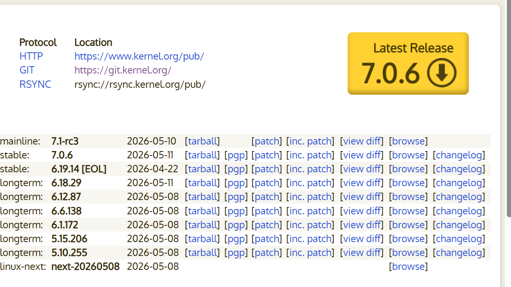
### 操作系统基本概念
任何计算机系统都包含一个名为**操作系统**的基本程序集合,在这个集合里,最重要的程序称为**内核**(kernel).当操作系统启动时,内核被映射到内存中运行,是其他程序运行的基底


操作系统需要完成两个目标:
1. 与硬件部分交互
2. 为用户程序提供执行环境

某些系统如MS-DOS允许用户程序与硬件部分交互,但类Unix操作系统如Linux,MaCOS等将硬件部分隐藏起来,需要程序向操作系统发出请求才能通过内核与硬件部分交互.
### 用户与组
在多用户系统(支持多个用户使用)的系统中,每个用户在机器上都有自己专用的私有空间,所有用户由一个唯一的数字来标识,叫做用户标识符(User ID,UID),用户通过ID和口令来登录自己的账号.

类Unix操作系统都有一个特殊的用户,叫做**root**,即超级用户(superuser),他可以访问系统中的所有文件并干涉所有的用户程序.

### Unix文件系统
Unix文件被组织在一个树结构的命名空间中:


- 与树根对应的目录被称为根目录(root directory),名字是"/".

Unix的每个进程都有一个当前的工作目录,我们通过相对路径或者绝对路径来标识目录文件的位置.

- `.`和`..`分别标识当前工作目录和父目录.

## 内存寻址
### 地址
80x86微处理器架构下,存在以下三种地址:
1. 逻辑地址(logical address): 由一个段和偏移量组成,指定一个操作数或者一条指令的地址.
2. 虚拟地址(也称线性地址): 将指令映射到虚拟空间时的地址,在32位Linux系统中可寻址的空间为4GB
3. 物理地址: 虚拟地址实际映射的内存地址

#### 逻辑地址
具体来说,一个逻辑地址实际上是由16位长的段选择符和32位长的偏移量组成的.

处理器中提供了6个段寄存器用来存放**段选择符**:
1. cs: 代码段寄存器
   - 含有一个两位的字段,用于指明CPU的当前级别,0级为最高优先级,3级为最低优先级,Linux只用0和3级,称为内核态与用户态.
2. ss: 栈段寄存器
3. ds: 数据段寄存器
4. es,fs,gs: 通用型寄存器,可以指向任意的数据段.

### Cache
由于从内存(DRAM)中读取指令还是太慢了,我们设计了cache(高速缓存),它基于局部性原理设计: 最近最常用的相邻地址在将来又被用到的可能性极大.

80x86体系引入了一个叫做行(**line**)的单位,它由几十个连续的字节组成.cache就由多个行组成.

>Cache 单元位于分页单元与主内存之间。它由硬件 Cache 存储器（Hardware Cache Memory）和 Cache 控制器（Cache Controller）组成。Cache 存储器负责存放内存数据行。Cache 控制器则维护一个入口数组,每个入口对应的是Cache 存储器中的一行.

>Each entry includes a tag and
a few flags that describe the status of the cache line. The tag consists of some bits
that allow the cache controller to recognize the memory location currently mapped
by the line. The bits of the **memory’s physical address** are usually split into **three groups**: the most significant ones correspond to the tag, the middle ones to the cache controller subset index, and the least significant ones to the offset within the line.

>When accessing a RAM memory cell, the CPU extracts the subset index from the
physical address and compares the tags of all lines in the subset with the high-order
bits of the physical address. If a line with the same tag as the high-order bits of the
address is found, the CPU has a **cache hit**; otherwise, it has a **cache miss**.

- 也就是说缓存是否命中只需比对缓存控制器中的标签是否与RAM中的高位物理地址对应即可,还是很快的.

## 进程
- **进程**: 程序执行时的一个实例,进程之间有共享的程序代码,但每个进程都有独立的数据存储空间
- **线程**: 一个进程可以由一个或者多个线程组成
- **轻量级进程**: 轻量级进程间可以共享资源,一个轻量级进程对应一个线程.

### 进程描述符
进程描述符(process descriptor)存放了一个进程所有信息的结构体,它的主要结构如下:


#### 进程的状态
进程可能处于以下状态中,状态之间是互斥的:
1. 可运行状态: 进程要么正在执行,要么准备执行
2. 中断状态: 进程被挂起,等待所需的信号或者资源,由进程主动执行.
3. 不可中断的等待状态: 进程被挂起,无法被信号唤醒,直到某个必要进程执行完毕
   - 例如Windows突然死机,用户无法执行任何操作
4. 暂停状态: 进程接收到信号后被强制暂停运行,进程是被动暂停的,这也是与2的不同点所在.
5. 跟踪状态: 当一个进程被另一个进程（通常是调试器如 GDB）监控时，它会进入 TASK_TRACED 状态。此时，被跟踪进程的执行权被完全移交给跟踪者。
6. 僵尸状态: 进程执行完毕后,父进程尚未开始处理关于该子进程的终止信息
7. 复活状态: 父进程开始处理子进程的终止信息

#### 进程的标识
类Unix操作系统中都有一个叫做进程标识符(**process ID**,PID)的数来标识进程,它同样位于进程描述符中.

- 同一个进程的多个线程使用相同的PID

#### 进程的组织
Linux使用双向链表来存储进程队列,并根据PID的不同将不同类型的PID分成了4个hash表:
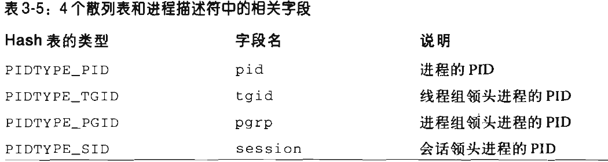

当需要分配新进程时,会根据进程的PID字段进行hash映射到对应的空间中.

运行和等待状态的进程是最重要的,Linux内核为这两种进程设定了专门的队列用于调度进程.
- 运行队列: 将可运行状态的进程用链表组织在一起
- 等待队列: 将等待状态的进程用链表组织在一起

### 创建进程
传统的Unix操作系统使用唯一一种方式创建所有的进程: 子进程复制父进程所有的资源,这种方法的效率相当低下,现代Unix内核使用以下三种机制来优化进程创建:
1. 写时复制: 允许父进程和子进程读取相同的存储空间
2. 轻量级进程: 通过`clone()函数`创建,父子进程间共享各类数据
3. vfork()系统调用: 使用vfork()函数创建的进程可以与父进程共享相同的内存地址空间.

>看着迷糊吗,但这并非翻译的锅,原文同样也很迷糊,很好奇这本书为什么这么有名
## 中断和异常
- 中断: 由I/O设备,硬件设备发出
- 异常: 由CPU发出,有三种类型的异常
  - 故障(fault): 通常可以被纠正,之后会重新执行引起故障的指令
  - 陷阱(trap): 一般用于调试,之后不再执行故障指令,而是执行下一条指令
  - 中止(abort): 发生了严重错误,需要专门处理

## 总结
及时止损,看不下去了,显然作者沉浸在自己的代码分析世界里了,完全没能从一个更高的维度来对Linux的运作机制做一个概括
# GAME ENGINE ARCHITECTURE
- 内容太老了,而且很多概念都是宽泛的讲一下就结束了,没有深入.不推荐阅读.
## 导论
### 典型游戏团队的结构
- **工程师**: 设计引擎,制作游戏
- **艺术家**: 有很多分类
  - 概念艺术家: 制作整个游戏的蓝图
  - 三维建模师: 制作物体,角色,地形,建筑物
  - 灯光师: 布置光源,调整场景的美感
  - 动画师: 为角色,物体设计动作
  - 音效设计师
  - 作曲家
  - 配音演员
- **游戏设计师**: 有的在宏观上设定故事主线,整体的章节安排,有的在具体关卡中设定角色/道具的位置,设计游戏谜题和战斗场景
- **制作人**: 管理开发进度,联系其他公司.
- **发行商**: 负责游戏的市场策划,制造和分销.有些游戏工作室隶属于某些发行商,但也有很多独立工作室,他们会将游戏委托给条件最好的发行商.有时候还需要给跨越国际的游戏设置代理商.
### 游戏类型概览
#### 第一人称射击游戏(FPS)
该类游戏的开发难度很高,需要能够实现以下功能:
* 高效地渲染大型三维虚拟世界。
* 快速反应的摄像机控制及瞄准机制。
* 玩家的虚拟手臂和武器的逼真动画。
* 各式各样的手持武器。
* 宽容的玩家角色运动及碰撞模型，通常使游戏有种“漂浮”的感觉。
* 非玩家角色（NPC，如玩家的敌人及同盟）有逼真的动画及智能。
* 小规模在线多人游戏的能力（通常支持多至同时 64 位玩家在线），以及无处不在的死亡竞赛（death match）游戏模式。
#### 第三人称游戏
第三人称游戏的种类比较多,比如森林冰火人这种平台游戏,比如生化危机这种第三人称动作游戏,一般需要以下技术:
* 移动平台、梯子、绳子、棚架及其他有趣的运动模式。
* 用来解谜的环境元素。
* 第三人称的“跟踪摄像机”会一直注视玩家角色，也通常会让玩家用手柄右摇杆（在游戏主机上）或鼠标（在 PC 上）旋转摄像机（虽然在 PC 上有很多流行的第三人称射击游戏，但平台游戏类型几乎是游戏主机上独有的）。
* 复杂的摄像机碰撞系统，以保证视点不会穿过背景几何物体或动态的前景物体。

#### 其他类型
- 格斗游戏: 拳皇
- 竞速游戏: 卡丁车
- 实时策略游戏(real-time strategy,RTS): 魔兽称霸,星际争霸
- 大型多人在线游戏(massively multiplayer online game,MMO): 魔兽世界
- 体育游戏: 足球经理
- 角色扮演游戏(role playing game,RPG)


### 游戏开发全貌

## 游戏支持系统
### 子系统的启动和终止
>游戏引擎由多个互相合作的子系统结合组成,当引擎启动/终止时,需要按照一定的顺序启动/终止子系统.

如果使用C++原生的构造函数和析构函数,尽管同一文件中的构造/析构顺序是一定的,但不同文件中的构造/析构顺序是未知的,那么这就会导致子系统的构造/析构顺序发生紊乱,导致程序崩溃.

书中提出的解决方法是:不使用原生的构造函数和析构函数,改成自定义的启动管理器函数和终止管理器函数,在调用某个子系统时,直接调用其启动函数,并在终止子系统时,调用终止函数.如此一来,就可以避免原生语法带来的混乱.
### 内存管理
由于new/malloc操作符需要操作系统从用户模式切换至内核模式来进行堆分配,存在一个**上下文切换**的时间开销,一旦这类动态内存分配多了,就会极大的影响游戏的运行速度.c++类游戏引擎为了解决这个问题,通常会定制分配器来是实现内存分配

## 总结
不推荐阅读...
# Multiplayer Game Programming
- 不推荐阅读
## OVERVIEW OF NETWORKED GAMES
- 简单讲了讲联网游戏的历史,可以直接略过不看.

## BERKELEY SOCKETS
### Sockets概览
>Originally released as part of BSD 4.2, the **Berkeley Sockets API** provides a standardized way
for processes to interface with various levels of the TCP/IP stack. Since its release, the API has
been ported to **every major operating system and most popular programming languages**, so it
is the veritable standard in network programming.

- 换句话说socket其实是Berkey研究组对网络协议和硬件交互的封装API,并在之后普及到了所有的主流操作系统和编程语言中.

创建一个socket对象可以这么写:
```cpp
SOCKET socket(int af,int type,int protocol);
```
1. af: address family,表示socket底层使用的是什么网络层协议,最常用的两个值是`AF_INET`:IPV4和`AF_INET6`:IPV6.
2. type: 表示通过socket传输的包的类型,最常用的有`SOCK_STREAM`,表示 `Packets represent segments of an ordered, reliable stream of data`,对应的传输层协议为TCP;另一个常用的是`SOCK_DGRAM`,表示`Packets represent discrete datagrams`,对应的传输层协议为UDP
3. protocol: 表示使用的具体传输层协议,常用值如下:

| Macro              | Required Type | Meaning                                     |
| ------------------ | ------------- | ------------------------------------------- |
| `IPPROTO_UDP`      | `SOCK_DGRAM`  | Packets wrap UDP datagrams                  |
| `IPPROTO_TCP`      | `SOCK_STREAM` | Packets wrap TCP segments                   |
| `IPPROTO_IP` / `0` | Any           | Use the default protocol for the given type |

- 如果protocl填0就表示选择type字段对应的传输层协议

4. To close a socket, regardless of type, use the closesocket function:
```cpp
int closesocket( SOCKET sock );
```
5. To cease transmitting or receiving before closing, use the shutdown function:
```cpp
int shutdown(SOCKET sock, int how)
```
## ch4&&ch5&&ch6
- 这几章书上讲的很烂,沉浸在自己的代码里了,但这部分的内容却是这本书的核心,我只好重新自己梳理一下

我们需要考虑一个问题,游戏联机与普通的网站开发不同,网站开发可以在前后端内传递json文件,将数据有组织的接收和传送,并存放在数据库中;

但是游戏联机要求我们玩家能够与服务器间进行低延迟通信,而且需要实际地更改玩家的游戏数据,有一个非常严重的问题就是,尽管玩家的账户数据是可以用数据库存储的,但游戏中的实时数据(比如玩家的位置,剩余血量等)是不能存放在数据库中的,这些实时数据彼此之间以指针相互引用,很有可能在不同玩家的主机上使用不同的内存地址:
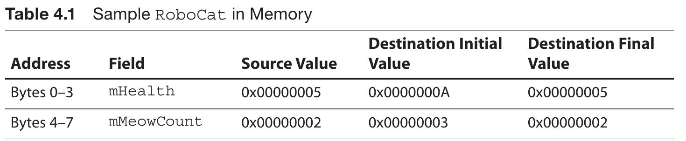

因此,我们不能简单的把在玩家的本地数据映射到服务器数据上,实际的解决方法有两种:
- 状态同步 (State Synchronization)： 服务端计算所有游戏逻辑、碰撞和数值，将结果（如怪物坐标、玩家血量）广播给客户端。客户端只负责渲染。防作弊能力强，适合 MMORPG。
- 帧同步 (Lockstep / Frame Sync)： 服务端只负责收集转发玩家的操作输入（如：按了向左键），不计算逻辑。各个客户端在相同的帧执行相同的输入，计算出相同的结果。对网络延迟要求极高，流量小，适合 MOBA、格斗、局域网联机。

但谁来作为服务器呢?我们有两种解决方案:
1. Client-Server (C/S)：必须有一个中心节点（服务器）。所有客户端都只和服务器连，客户端之间不直接通信。
2. Peer-to-Peer (P2P)：没有固定的中心服务器，或者服务器只负责牵线。每个客户端（玩家）同时也是服务器，客户端之间直接互发数据。

### 不同的通信方案

#### 帧同步 ＋ P2P（早期经典）

* **代表作**：《魔兽争霸 3》、《星际争霸》、早期的局域网格斗游戏。
* **机制**：玩家 A 按了下技能，直接通过网络把“A 释放技能”的指令发给玩家 B，玩家 B 也把自己的操作发给 A。没有中央服务器算逻辑，大家各算各的。

#### 帧同步 ＋ C/S（现代主流）

* **代表作**：《王者荣耀》、《乱斗西游》。
* **机制**：玩家 A 按了向左走，这个输入先发给**中央服务器**。服务器收集齐这一帧所有玩家的输入后，打包成一个“帧包”，统一广播给所有玩家。客户端收到服务器的统一帧包后才开始执行。这样操作是为了解决 P2P 架构下某一个玩家断线导致全员卡死（Lockstep 严格同步）的问题。

#### 状态同步 ＋ C/S（绝对统治）

* **代表作**：《魔兽世界》、《反恐精英 (CS)》、《PUBG》。
* **机制**：这是最标准的组合。服务器在云端运行完整的游戏世界，算好一切，再把状态压进网络包发给客户端。客户端如果作弊改了本地坐标，服务器下一次状态刷新会直接强制把你拉回原位。

#### 状态同步 ＋ P2P（极少见/主机常用）

* **代表作**：<< 幻兽帕鲁 >> 。
* **机制**：为了省服务器成本，不架设中央高性能服务器。由系统自动选出一个玩家的电脑作为“主机（Host）”，它承担状态同步中“服务器”的角色，负责计算逻辑并广播给其他 P2P 连接的玩家。缺点是一旦该玩家退出，游戏就必须中断并“迁移主机”。

## 总结
不推荐阅读,前面两三章还可以,后面完全变成毫无意义的代码分析了.

## OBJECT REPLICATION
# 网络游戏核心技术与实战
- 讲的挺全面的,要想搞懂联机游戏是什么看这本书就对了.尽管如此,很多地方都讲的很啰嗦,实战代码部分也不够清晰,中规中矩吧.

## 要点总结
### 为什么不能用数据库存储游戏信息
>假如要在搭载了 6502 芯片的家用游戏机上使用 RDBMS 会怎么样呢？当然首先必须通过 SQL 语句，但是像 SELECT * from FlyingObjects 这样的语句，单单判断语法是否正确就要消耗几百个 CPU 周期，显然不现实。
>
>游戏编程必须在 1 帧内完成坐标的判断和保存。为此，必须只通过组合 CPU 所具有的一些最原始的命令来实现这些处理，只是读取数据就要花费几百个周期是相当不合理的。因此，在家用游戏机中，基本不考虑使用 RDBMS 这种方式。
# Agentic Design Patterns
不推荐阅读,一开始以为是讲Agent设计的,但实际上是讲一些宽泛的关于Agent使用的知识,调用几个框架就结束了,甚至还教你怎么写提示词😅
# AI Engineering Building Applications with Foundation Models
不推荐阅读,读起来有一种受骗上当的感觉...

# Generative AI with Python 
- 不推荐阅读
# 基于大模型的RAG应用开发与优化
- 值得一看,尽管很多地方都是不太重要的接口调用和代码分析,但讲的还算不错,能有不少收获

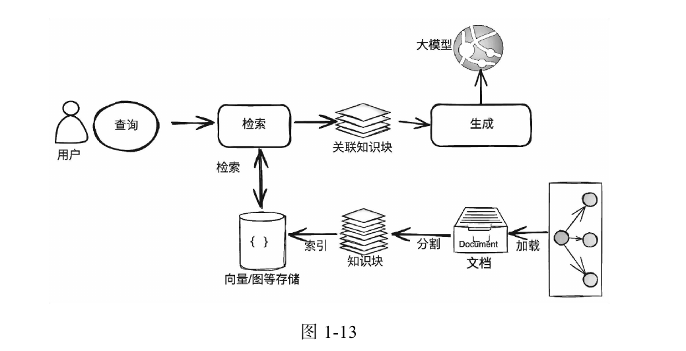
# Essential GraphRAG Knowledge Graph-Enhanced RAG
## 总结
很高兴能够看到这本书,尽管只有薄薄的一百多页,但它成功帮我拨开了关于RAG的迷雾,让我真正地明白了一件事:
- 在部署端使用RAG的效果是微乎其微的.

我们可以将RAG拆成一个比较完整的几步:
1. 将本地文件拆分成向量并存入向量数据库中
2. 调用第三方的embedding API或者使用本地部署的小模型来将用户的提示词转变成embedding层的向量
3. 根据提示词向量在数据库中查询得到关联度最大的文档向量(通常是计算两个向量的余弦相似度)
4. 将文档向量对应的文本块附加在提示词之后交给API
5. API返回经过了RAG的回答.

尽管如此,RAG的原型论文是说的用这一回答来微调大模型本身,而非用在API上的微调.如果我们需要让大模型来处理隐私文档和数据,那就不应该走API,而应该使用本地训练的模型,那么就无所谓RAG了,直接把内部文件作为初始训练语料就可以了;但话又说回来,不具备本地训练模型条件的公司和个人又不太需要保护所谓的内部知识库,大方交给API就行了.

而在如今,主流大模型的知识库储备都是相当恐怖的,完全不需要我们来给API额外提供公开的文档知识,如果你希望了解最近发生的事情,现在的AI甚至还可以主动去联网搜索,在大模型端进行RAG处理,而不需要我们这边提供任何的信息.

总体来看,要不要在部署端用RAG是相当矛盾的一件事,粗暴一点说的话,这事我看成不了.

>但话又说回来,在大模型端使用RAG确实很有必要,所以自2021年RAG被正式提出后,这方面的论文层出不穷

# C和指针
不推荐阅读,甚至没找到有必要做笔记的地方,你就说写的有多烂吧.


可是这种书却能拿到这么高的分数,反而说明了C系语言的教材有多么匮乏和枯燥.
# 深度探索C++对象模型
不推荐阅读,内容太老了,讲的也不清晰
# Linux内核设计与实现
- 尽管源码分析很多,好在都有一些比较概括性的介绍,只看介绍就行了,谁愿意看你那些破碎的代码分析呢.再说Linux的0.01版只有一万行代码,真要研究的话看那个也足够了.


## 进程管理
### 前置概念
- 进程: 处于执行期的程序
- 线程: 进程中活动的对象,在Linux中,线程是一种特殊的进程.
- 进程创建: Linux调用`fork`复制一个现有进程(父进程),创建一个新进程(子进程),执行完毕后,父进程恢复执行,子进程开始执行.
- 进程执行: Linjx调用`exec`创建新进程的地址空间,并通过`exit`终结进程.

进程有以下五种状态:
1. TASK_RUNNING: 进程是可执行的,要么正在执行,要么在运行队列中等待执行
2. TASK_INTERRUPTIBLE: 进程正在睡眠,等待某些条件被满足,一旦满足这些条件,进程就会进入TASK_RUNNING状态
3. TASK_UNINTERRUPTIBLE: 进程正在睡眠,但外界信号不会影响它,由进程主动进入其他状态
4. TASK_TRACED: 被其他进程跟踪的进程
5. TASK_STOPPRD: 进程没有运行也无法运行
### 进程描述符与任务结构
>Linux内核用一个叫做任务队列的双向循环链表来保存进程,链表中的每一项都是类型为`task_struct`,称为进程描述符(process descriptor)的结构,**包含一个具体进程的所有信息.**

内核通过一个唯一的进程标识值(process identification,PID)来标识每个进程.

Linux中所有的进程都是PID为1的init进程的后代.

### 进程创建
其他的操作提供都提供了产生(spawn)进程的机制: 在新的地址空间里创建进程,并读入可执行文件后开始执行;而Unix类操作系统将上述的两个步骤分解为两个函数: `fork和exec`.

首先,fork通过拷贝当前进程创建一个子进程,子进程的大部分数据与父进程相同,除了PID和PPID(父进程的进程号).

然后,exec负责读取可执行文件并将其载入地址空间开始运行.

#### 写时拷贝
由于整个复制父进程的数据非常浪费空间,如果在进程创建后马上运行一个可执行文件,在运行时与父进程共享同一份数据,那么就可以大大减小开销,这被称为**写时拷贝**.


### 线程
>在其他操作系统中,线程被称为"轻量级进程",可以消耗更少的资源迅速执行任务;而在Linux中,线程就像是一个普通的进程,只是会与其他的进程共享某些资源

## 进程调度
>当运行状态的进程数量多于处理器个数时,就必须要调度程序来决定哪些进程优先执行,哪些进程稍后执行.
### 补充: Linux调度程序的历史
- 由于这本书太老了,所以让AI介绍一下完整的调度程序历史

从 Linux 2.5 至今，调度器经历了四次重大的架构级跃迁：

#### 1. O(1) 调度器 (Linux 2.5 - 2.6.22)

**引入背景**：早期的 `O(N)` 调度器在每次挑选进程时，都要遍历链表中的所有进程，耗时与进程总数 $N$ 成正比。在多核、多进程环境下，CPU 时间全部浪费在了遍历链表上。

##### 核心特性与机制

* **常数级时间复杂度**：引入了 `runqueue`（运行队列）结构，每个 CPU 拥有独立的队列，挑选进程的时间复杂度变成了 $O(1)$，与系统内运行的进程数量无关。
* **双阵营设计（Active/Expired）**：每个队列包含两个位图（Bitmap）加链表的组合：
* **Active 阵营**：存放还有时间片的进程。
* **Expired 阵营**：存放时间片耗尽的进程。
* **切换方式**：CPU 总是通过汇编指令（如 `bsfl` 寻找位图第一个非 0 位）在 Active 阵营中极速查找优先级最高的进程。当 Active 清空，直接交换 Active 和 Expired 指针，周而复始。


* **启发式交互评估**：为了给桌面交互进程（如鼠标、键盘响应）提供低延迟，内核通过一套复杂的“启发式算法”，根据进程的睡眠时间来**猜测**它是不是交互进程。如果是，就给它更高的优先级，甚至在其时间片用完后继续留在 Active 阵营。

##### 淘汰原因

这套“猜测”算法很快成为了灾难。随着应用变复杂，内核无法通过简单的公式准确区分哪些是真正的交互进程。这导致大名鼎鼎的 3D 射击游戏《Doom 3》在当时的 Linux 上运行时，由于被误判为非交互进程，掉帧极其严重，引起了社区的强烈不满。

---

#### 2. RSDL 与 CFS (Linux 2.6.23 - 6.5)

**引入背景**：为了彻底废除 O(1) 调度器中恶心的“启发式猜测”，澳大利亚医生兼内核天才 Con Kolivas 提出了 RSDL（反转台阶截止日期调度器），证明了无需猜测、仅靠纯粹的公平数学模型就能完美搞定交互体验。受此启发，Ingo Molnar 在 2007 年的 Linux 2.6.23 中引入了 **CFS（Completely Fair Scheduler，完全公平调度器）**。

##### 核心特性与机制

* **红黑树取代链表**：CFS 废除了时间片的概念，改用红黑树（Red-Black Tree）来管理进程。
* **虚拟运行时间 ($vruntime$)**：这是 CFS 的灵魂。每个进程都有一个 $vruntime$，代表它在 CPU 上实际运行的“虚拟时间”。
* 优先级低（Nice 值大）的进程，其 $vruntime$ 增加得快；
* 优先级高（Nice 值小）的进程，其 $vruntime$ 增加得慢。


* **绝对公平调度**：CFS 的逻辑非常纯粹：**永远选择红黑树最左侧（即 $vruntime$ 最小值）的节点运行**。

$$vruntime_{new} = vruntime_{old} + \Delta exec\_time \times \frac{NICE\_0\_LOAD}{weight}$$

##### 淘汰原因

CFS 运行了 16 年，但它有一个致命的结构性缺陷：**它把“公平（Fairness）”和“延迟（Latency）”这两个维度绑定在了同一个 Nice 值（权重）上**。
当一个高优先级的音频进程长期睡眠后突然醒来，它的 $vruntime$ 虽然落后，但由于红黑树的机制，它必须按照既定的步长去追赶，CFS 无法在“不破坏全局公平性”的前提下，强制让它**立即**抢占 CPU，这在高吞吐量的服务器或混合负载下会导致无法忍受的毛刺延迟。

---

#### 3. EEVDF 调度器 (Linux 6.6 - 至今)

**引入背景**：为了彻底解决 CFS 的延迟毛刺，Linux 核心调度器维护者 Peter Zijlstra 在 2023 年（Linux 6.6）移除了 CFS，换上了基于 1995 年学术理论实现的 **EEVDF（Earliest Eligible Virtual Deadline First）**。

##### 核心特性与机制

* **解耦“公平”与“延迟”**：EEVDF 引入了两个全新维度来衡量进程：
1. **Eligible（可行性）**：通过计算 $Lag$（进程“应得的 CPU 时间”与“实际得到的 CPU 时间”之差）。如果 $Lag \ge 0$，说明进程被亏欠了，属于 Eligible 状态；如果 $Lag < 0$，说明它透支了，不合格。
2. **Virtual Deadline（虚拟截止日期）**：进程被允许运行的最终期限。对延迟极其敏感的任务，其 Deadline 会被设得非常近。


* **双阶筛选算法**：
* **第一步**：剔除所有透支的（非 Eligible）进程，只在合格 of 进程里挑。
* **第二步**：在合格进程中，**直接挑选 Virtual Deadline 最早的那一个运行**。


通过这种设计，一个短时间醒来的音频或 UI 进程，不仅合格，而且其截止日期极短，可以在不破坏长线公平的前提下，瞬间切入 CPU 执行，完美解决了延迟毛刺。

### 前置概念
#### 多任务
多任务操作系统支持并发执行多个进程,在单处理器计算机中,这会产生多个进程在同时运行的幻觉,而在多处理器计算机上,多个进程会在不同的处理器上真正地同时运行.

多任务系统有两种:
1. 非抢占式多任务: 除非进程主动停止运行,否则将会一直运行下去,现在的操作系统都不再采用这种方案
2. 抢占式多任务: 由系统调度程序来决定什么时候停止一个进程运行,以供其他进程在处理器上运行,这被称为**抢占**.这是绝大部分操作系统采用的方案.
#### 进程类型
进程大致可分为两种类型:
1. I/O消耗型: 大部分时间用来提交I/O请求或者等待I/O请求,经常处于可运行状态,但实际的运行时间很短
2. 处理器消耗型: 大部分时间用来执行,代表性的例子有那些大量执行数学计算的程序如MATLAB

Linux为了优化交互体验和提升性能,更倾向于优先调度I/O消耗型的进程.
#### 时间片
- 时间片: 进程被抢占前能持续运行的时间,默认情况下很短,比如10ms,从而保证系统与用户交互的延迟较低.
#### 进程优先级
进程调度的一个简单想法是: 优先级高的进程优先运行,相同优先级的进程轮流运行.

Linux采用两种不同的优先级算法:
1. 使用nice值: 它的范围从-20到+19,默认值为0,nice值越大优先级越低(你对系统中的其他进程太好了,让它们比你先运行).在Linux中,nice值越低,进程占用的时间片比例越高.
   1. 对应调度管理器算法
2. 使用实时优先级: 它的范围从0到99,数值越高进程优先级越高,可以手动配置,使用该类优先级算法的进程比默认使用nice值的进程优先级都高.
   1. 对应实时的调度策略,不受调度管理器管辖

### Linux调度算法
如果直接按照nice值映射到进程占用的时间片大小,会产生以下问题:
- nice值越高的进程占用的时间片越短,需要经过频繁的上下文切换,但这种进程往往是不应该被打断的计算密集型的后台进程,导致运行效率显著下降

Linux2.6版本引入了CFS(完全公平调度)机制:
1. 将nice值作为进程获得的处理器运行比的权重,而不是分得的时间片大小
2. 设定一个目标延迟值(如20ms),每个进程严格按照延迟值来运行,如果有4个进程,每个进程只能运行5ms;如果有20个进程,则只能运行1ms;
3. 设定一个最小时间片大小(如1ms),每个进程获得的时间片大小不得小于该长度
4. CFS通过红黑树来调度进程.

>显然,如果进程数量过多,必须让一些进程终止运行,否则进程的运行时间会小于最小时间片大小.

## 系统调用
- 系统调用: 用户进程与内核进行交互的一组接口,可以让应用程序在一定的限制下访问硬件设备
  - 实际使用方法和调用库函数没有任何的区别,所以就直接略过了
## 中断
- 中断: 由硬件向内核发出的常规通知,内核针对中断值来区分不同的中断信号
- 异常: 由处理器向内核发出的错误通知,实际处理方式与处理中断类似

>二者的差异就在于中断是由硬件引发而非由软件引发
## 内核同步
- 临界区: 存放共享数据的代码段
- 同步: 避免两个进程在同一个临界区中同时执行,因为进程调度中发生进程抢占的情况经常出现,例如中断,内核抢占和多处理器
- 加锁: 在进程执行时给临界区加锁可以让其他进程无法进入临界区,从而实现进程同步
- 死锁: 每个进程都在等待被加锁的资源才能继续执行,而这个资源被解锁的条件恰恰是该进程执行完毕
  - 自死锁: 一个进程在执行中申请获得自己持有的锁,那么该进程只能永远等待下去
  - 自旋锁(spin lock): 最多只能被一个可执行进程持有的锁,其他进程在等待该进程执行完毕时必须不停地反复询问,原地旋转(spin).
  - 读/写自旋锁: 多个读任务可以同时持有读者锁,但只能由一个写任务持有写者锁,且写者代码执行时不可以有读者代码同时执行.**该类锁显然是针对读写任务设计的**
  - 信号量: 信号量是一种睡眠锁,如果一个进程试图获取被占用的信号量时,将会被推进一个等待队列并睡眠,只有当信号量被释放时才能被唤醒.**该类锁是针对需要长时间执行的进程设定的.**


## 时间管理
1. **处理器的时钟频率是可调的**,操作系统可以根据自己的需要动态调节时钟频率,这也是为什么在低功耗模式下打游戏会卡顿,时钟频率下降后,单位时间内操作系统能够处理的任务数就变少了.
2. 更高的时钟频率可以提高内核定时器的精度,细化每个任务的分配时间,从而提高整体的运行速度.
## 虚拟文件系统(virtual file system,VFS)
>之所以我们能够直接对外接硬盘进行操作,就是虚拟文件系统的功劳

VFS定义了所有文件系统都支持的接口,通过把文件视为文件对象来做统一的处理.

VFS 中有四个主要的对象类型，它们分别是：

* 超级块对象，它代表一个具体的已安装文件系统。
* 索引节点对象，它代表一个具体文件。
* 目录项对象，它代表一个目录项，是路径的一个组成部分。
* 文件对象，它代表由进程打开的文件。
## 块I/O层

- 块设备: 能够随机访问固定大小的数据片的硬件设备,如硬盘和闪存
- 字符设备: 可以按照字符流的方式有序访问,如键盘和音箱
- 块: 文件系统的最小寻址单元,为固定大小的数据片,需要是扇区的整数倍大小,通常为4KB
- 扇区: 设备的最小寻址单元,为512B/4KB大小
- 缓冲区: 块被调入内存时的存储区,每个缓冲区对应一个块
### I/O调度程序
Linux2.6中同时存在四种I/O调度程序:

| 调度器                | 主要目标       | 特点                                               |
| --------------------- | -------------- | -------------------------------------------------- |
| `noop`                | 尽量少做事     | 简单 FIFO，适合硬件自己已经会调度的场景            |
| `deadline`            | 避免请求饿死   | 给请求设置期限，尤其保护读请求延迟                 |
| `anticipatory` / `as` | 预测后续读请求 | 服务完一次读请求后短暂等待，避免马上切去远处写请求 |
| `cfq`                 | 公平性         | 按进程/队列分配 I/O 时间，强调公平和桌面体验       |


## 进程地址空间
用户空间中的进程内存被称为**进程地址空间**,由虚拟内存(VMA)映射而成.


将虚拟内存映射到物理内存是通过页表实现的:

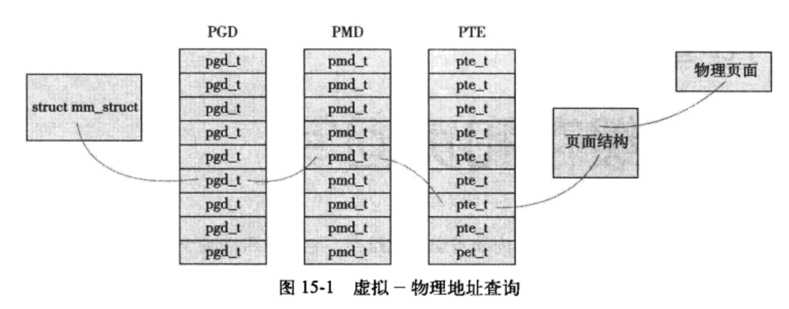
# 深度学习理论与实战：基础篇
- 写的不是很好,也不够通俗,看的出来很多论述都是戛然而止的,非常浅显,我只能认为是被编辑砍掉了,不然和姊妹书的差别还是太大了
# 深度学习理论与实战：提高篇
- 这本书我是偶然发现的,知名度并不高,但是里面的不少内容都讲的很好,比起某些深度依赖框架的深度学习书好很多,希望能有更多人看到这种优秀的中文文章.

# Hello算法
- [官网](https://www.hello-algo.com/chapter_computational_complexity/time_complexity/#5-olog-n)
## 前言
说来也好笑,尽管我一开始学算法时觉得这本书写的不太好,转而去看其他的算法书了,但现在回头重学算法的时候却发现,这本书的目录编排恰恰是我想要学习的内容:


缘分就是这么妙不可言.
## 数据结构
### 基本数据结构
链表
```cpp
struct ListNode{
  int val;
  ListNode* next;
  ListNode(int x): val(x),next(nullptr){}
};
```
列表
```cpp
vector<int> nums;
nums.clear();
nums.push_back(1);
nums.insert(nums.begin()+1,6);
nums.erase(nums.begin()+1);
sort(nums.begin(),nums.end());
```
- 之所以不叫push是因为vector还可以从前端插入,但实际上并没有`push_front`方法,因为开销太大了

栈
```cpp
stack<int> stack;
stack.push(1);
stack.push(2);

int top = stack.top();

stack.pop();

int size =stack.size();

bool empty =stack.empty();
```

队列
```cpp
queue<int> queue;
queue.push(1);
queue.push(2);

int front = queue.front();

queue.pop();

int size =queue.size();

bool empty =queue.empty();
```

双向队列(double-ended queue)
```cpp
deque<int> deque;
deque.push_back(1);
deque.push_front(2);

int front =deque.front();
int back =deque.back();

deque.pop_front();
deque.pop_back();

int size = deque.size();

bool empty =deque.empty();
```
哈希表
```cpp
unordered_map<int,string>map;

map[12345]="hello";
string name = map[12345];

map.erase(12345);

/* 遍历哈希表 */
// 遍历键值对 key->value
for (auto kv: map) {
    cout << kv.first << " -> " << kv.second << endl;
}
// 使用迭代器遍历 key->value
for (auto iter = map.begin(); iter != map.end(); iter++) {
    cout << iter->first << "->" << iter->second << endl;
}
```


### 进阶数据结构
#### 二叉树
```cpp
/* 二叉树节点结构体 */
struct TreeNode {
    int val;          // 节点值
    TreeNode *left;   // 左子节点指针
    TreeNode *right;  // 右子节点指针
    TreeNode(int x) : val(x), left(nullptr), right(nullptr) {}
};

/* 初始化二叉树 */
// 初始化节点
TreeNode* n1 = new TreeNode(1);
TreeNode* n2 = new TreeNode(2);
TreeNode* n3 = new TreeNode(3);
TreeNode* n4 = new TreeNode(4);
TreeNode* n5 = new TreeNode(5);
// 构建节点之间的引用（指针）
n1->left = n2;
n1->right = n3;
n2->left = n4;
n2->right = n5;
```
层序遍历,本质上是广度优先遍历
```cpp
/* 层序遍历 */
vector<int> levelOrder(TreeNode *root) {
    // 初始化队列，加入根节点
    queue<TreeNode *> queue;
    queue.push(root);
    // 初始化一个列表，用于保存遍历序列
    vector<int> vec;
    while (!queue.empty()) {
        TreeNode *node = queue.front();
        queue.pop();              // 队列出队
        vec.push_back(node->val); // 保存节点值
        if (node->left != nullptr)
            queue.push(node->left); // 左子节点入队
        if (node->right != nullptr)
            queue.push(node->right); // 右子节点入队
    }
    return vec;
}
```
三种深度优先遍历:
```cpp
/* 前序遍历 */
void preOrder(TreeNode *root) {
    if (root == nullptr)
        return;
    // 访问优先级：根节点 -> 左子树 -> 右子树
    vec.push_back(root->val);
    preOrder(root->left);
    preOrder(root->right);
}

/* 中序遍历 */
void inOrder(TreeNode *root) {
    if (root == nullptr)
        return;
    // 访问优先级：左子树 -> 根节点 -> 右子树
    inOrder(root->left);
    vec.push_back(root->val);
    inOrder(root->right);
}

/* 后序遍历 */
void postOrder(TreeNode *root) {
    if (root == nullptr)
        return;
    // 访问优先级：左子树 -> 右子树 -> 根节点
    postOrder(root->left);
    postOrder(root->right);
    vec.push_back(root->val);
}
```
尽管上述代码很简单,但在简单算法题中的用法确实就有这么简单.
#### 二叉搜索树
查找
```cpp
/* 查找节点 */
TreeNode *search(int num) {
    TreeNode *cur = root;
    // 循环查找，越过叶节点后跳出
    while (cur != nullptr) {
        // 目标节点在 cur 的右子树中
        if (cur->val < num)
            cur = cur->right;
        // 目标节点在 cur 的左子树中
        else if (cur->val > num)
            cur = cur->left;
        // 找到目标节点，跳出循环
        else
            break;
    }
    // 返回目标节点
    return cur;
}
```

插入
```cpp
/* 插入节点 */
void insert(int num) {
    // 若树为空，则初始化根节点
    if (root == nullptr) {
        root = new TreeNode(num);
        return;
    }
    TreeNode *cur = root, *pre = nullptr;
    // 循环查找，越过叶节点后跳出
    while (cur != nullptr) {
        // 找到重复节点，直接返回
        if (cur->val == num)
            return;
        pre = cur;
        // 插入位置在 cur 的右子树中
        if (cur->val < num)
            cur = cur->right;
        // 插入位置在 cur 的左子树中
        else
            cur = cur->left;
    }
    // 插入节点
    TreeNode *node = new TreeNode(num);
    if (pre->val < num)
        pre->right = node;
    else
        pre->left = node;
}
```

删除
```cpp
/* 删除节点 */
void remove(int num) {
    // 若树为空，直接提前返回
    if (root == nullptr)
        return;
    TreeNode *cur = root, *pre = nullptr;
    // 循环查找，越过叶节点后跳出
    while (cur != nullptr) {
        // 找到待删除节点，跳出循环
        if (cur->val == num)
            break;
        pre = cur;
        // 待删除节点在 cur 的右子树中
        if (cur->val < num)
            cur = cur->right;
        // 待删除节点在 cur 的左子树中
        else
            cur = cur->left;
    }
    // 若无待删除节点，则直接返回
    if (cur == nullptr)
        return;
    // 子节点数量 = 0 or 1
    if (cur->left == nullptr || cur->right == nullptr) {
        // 当子节点数量 = 0 / 1 时， child = nullptr / 该子节点
        TreeNode *child = cur->left != nullptr ? cur->left : cur->right;
        // 删除节点 cur
        if (cur != root) {
            if (pre->left == cur)
                pre->left = child;
            else
                pre->right = child;
        } else {
            // 若删除节点为根节点，则重新指定根节点
            root = child;
        }
        // 释放内存
        delete cur;
    }
    // 子节点数量 = 2
    else {
        // 获取中序遍历中 cur 的下一个节点
        TreeNode *tmp = cur->right;
        while (tmp->left != nullptr) {
            tmp = tmp->left;
        }
        int tmpVal = tmp->val;
        // 递归删除节点 tmp
        remove(tmp->val);
        // 用 tmp 覆盖 cur
        cur->val = tmpVal;
    }
}
```
#### 堆
- 堆是一种完全二叉树,可以使用优先队列实现.分为根节点最大的大顶堆和根节点最小的小顶堆

```cpp
#include <queue>
#include <vector>
#include <functional>

std::priority_queue<T, Container, Compare> pq;
```

cpp的优先队列默认的底层容器是vector,默认采用大顶堆:
```cpp
// 默认写法为大顶堆
std::priority_queue<int> pq;

// 小顶堆,由于第三个参数依赖第二个参数,所以要全部写出来
std::priority_queue<int, std::vector<int>, std::greater<int>> pq;

pq.push(3);
pq.push(1);
pq.push(5);

std::cout << pq.top(); // 1
```


```cpp
/* 初始化堆 */
// 初始化小顶堆
priority_queue<int, vector<int>, greater<int>> minHeap;
// 初始化大顶堆
priority_queue<int, vector<int>, less<int>> maxHeap;

/* 元素入堆 */
maxHeap.push(1);
maxHeap.push(3);
maxHeap.push(2);
maxHeap.push(5);
maxHeap.push(4);

/* 获取堆顶元素 */
int peek = maxHeap.top(); // 5

/* 堆顶元素出堆 */
// 出堆元素会形成一个从大到小的序列
maxHeap.pop(); // 5
maxHeap.pop(); // 4
maxHeap.pop(); // 3
maxHeap.pop(); // 2
maxHeap.pop(); // 1

/* 获取堆大小 */
int size = maxHeap.size();

/* 判断堆是否为空 */
bool isEmpty = maxHeap.empty();

/* 输入列表并建堆 */
vector<int> input{1, 3, 2, 5, 4};
priority_queue<int, vector<int>, greater<int>> minHeap(input.begin(), input.end());
```

#### 图
实际的图有两种表示方法:
1. 邻接矩阵: 有n个节点就要用nxn大小的矩阵来表示
2. 邻接表: 存储实际存在的边,空间复杂度更小,但时间复杂度更高.
## 算法
### 搜索
#### 二分查找(过)
### 排序
#### 选择排序(selection sort)
>每轮从未排序的区间选择最小的元素,将其放到已排序区间的末尾

```cpp
/* 选择排序 */
void selectionSort(vector<int> &nums) {
    int n = nums.size();
    // 外循环：未排序区间为 [i, n-1]
    for (int i = 0; i < n - 1; i++) {
        // 内循环：找到未排序区间内的最小元素
        int k = i;
        for (int j = i + 1; j < n; j++) {
            if (nums[j] < nums[k])
                k = j; // 记录最小元素的索引
        }
        // 将该最小元素与未排序区间的首个元素交换
        swap(nums[i], nums[k]);
    }
}
```
这显然是O(n^2)的时间复杂度,对于相同大小的元素,有可能发生相对顺序的改变,因此是非稳定的:

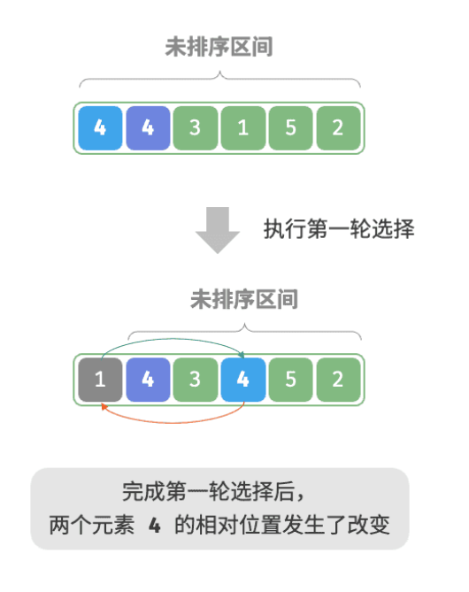


#### 冒泡排序(bubble sort)
>连续地与相邻元素交换,每一轮将当前最大的元素交换至正确位置

```cpp
/* 冒泡排序（标志优化）*/
void bubbleSortWithFlag(vector<int> &nums) {
    // 外循环：未排序区间为 [0, i]
    for (int i = nums.size() - 1; i > 0; i--) {
        bool flag = false; // 初始化标志位
        // 内循环：将未排序区间 [0, i] 中的最大元素交换至该区间的最右端
        for (int j = 0; j < i; j++) {
            if (nums[j] > nums[j + 1]) {
                // 交换 nums[j] 与 nums[j + 1]
                // 这里使用了 std::swap() 函数
                swap(nums[j], nums[j + 1]);
                flag = true; // 记录交换元素
            }
        }
        if (!flag)
            break; // 此轮“冒泡”未交换任何元素，直接跳出
    }
}
```
由于相等元素之间不交换,所以,前后顺序能够保持不变,是稳定的.
#### 插入排序(insertion sort)
>从第一个元素开始保证局部有序,不断将后面的元素插入到前面已经排序好的队列中

```cpp
/* 插入排序 */
void insertionSort(vector<int> &nums) {
    // 外循环：已排序区间为 [0, i-1]
    for (int i = 1; i < nums.size(); i++) {
        int base = nums[i], j = i - 1;
        // 内循环：将 base 插入到已排序区间 [0, i-1] 中的正确位置
        while (j >= 0 && nums[j] > base) {
            nums[j + 1] = nums[j]; // 将 nums[j] 向右移动一位
            j--;
        }
        nums[j + 1] = base; // 将 base 赋值到正确位置
    }
}
```
由于需要遍历读取和遍历查找,所以还是n^2的时间复杂度.如果如上述示例中所写,相等的值将会被插入到右侧,因此是稳定的.

#### 快速排序(quick sort)
- 逻辑比较复杂,所以我以前学算法的时候都没彻底搞懂快排...

>首先锚定一个基准数,将左侧比基准数大的放到右侧,右侧比基准数小的放到左侧,处理完后的两边对于基准数来说是有序的,之后再递归处理即可.


```cpp
/* 哨兵划分 */
int partition(vector<int> &nums, int left, int right) {
    // 以 nums[left] 为基准数
    int i = left, j = right;
    while (i < j) {
        while (i < j && nums[j] >= nums[left])
            j--;                // 从右向左找首个小于基准数的元素
        while (i < j && nums[i] <= nums[left])
            i++;                // 从左向右找首个大于基准数的元素
        swap(nums[i], nums[j]); // 交换这两个元素
    }
    swap(nums[i], nums[left]);  // 将基准数交换至两子数组的分界线
    return i;                   // 返回基准数的索引
}

/* 快速排序 */
void quickSort(vector<int> &nums, int left, int right) {
    // 子数组长度为 1 时终止递归
    if (left >= right)
        return;
    // 哨兵划分
    int pivot = partition(nums, left, right);
    // 递归左子数组、右子数组
    quickSort(nums, left, pivot - 1);
    quickSort(nums, pivot + 1, right);
}
```
#### 归并排序(merge sort)
>大致想法其实和快速排序差不多,都是将大数组不断拆分成小数组后进行排序,不同的是快速排序在拆分前就排序,而归并排序是在拆分后进行排序
```cpp
/* 合并左子数组和右子数组 */
void merge(vector<int> &nums, int left, int mid, int right) {
    // 左子数组区间为 [left, mid], 右子数组区间为 [mid+1, right]
    // 创建一个临时数组 tmp ，用于存放合并后的结果
    vector<int> tmp(right - left + 1);
    // 初始化左子数组和右子数组的起始索引
    int i = left, j = mid + 1, k = 0;
    // 当左右子数组都还有元素时，进行比较并将较小的元素复制到临时数组中
    while (i <= mid && j <= right) {
        if (nums[i] <= nums[j])
            tmp[k++] = nums[i++];
        else
            tmp[k++] = nums[j++];
    }
    // 将左子数组和右子数组的剩余元素复制到临时数组中
    while (i <= mid) {
        tmp[k++] = nums[i++];
    }
    while (j <= right) {
        tmp[k++] = nums[j++];
    }
    // 将临时数组 tmp 中的元素复制回原数组 nums 的对应区间
    for (k = 0; k < tmp.size(); k++) {
        nums[left + k] = tmp[k];
    }
}

/* 归并排序 */
void mergeSort(vector<int> &nums, int left, int right) {
    // 终止条件
    if (left >= right)
        return; // 当子数组长度为 1 时终止递归
    // 划分阶段
    int mid = left + (right - left) / 2;    // 计算中点
    mergeSort(nums, left, mid);      // 递归左子数组
    mergeSort(nums, mid + 1, right); // 递归右子数组
    // 合并阶段
    merge(nums, left, mid, right);
}
```

- 实际上我并没有听说过有什么程序使用归并排序来处理数据结构的.

#### 堆排序(heap sort)

```cpp
/* 堆的长度为 n ，从节点 i 开始，从顶至底堆化 */
void siftDown(vector<int> &nums, int n, int i) {
    while (true) {
        // 判断节点 i, l, r 中值最大的节点，记为 ma
        int l = 2 * i + 1;
        int r = 2 * i + 2;
        int ma = i;
        if (l < n && nums[l] > nums[ma])
            ma = l;
        if (r < n && nums[r] > nums[ma])
            ma = r;
        // 若节点 i 最大或索引 l, r 越界，则无须继续堆化，跳出
        if (ma == i) {
            break;
        }
        // 交换两节点
        swap(nums[i], nums[ma]);
        // 循环向下堆化
        i = ma;
    }
}

/* 堆排序 */
void heapSort(vector<int> &nums) {
    // 建堆操作：堆化除叶节点以外的其他所有节点
    for (int i = nums.size() / 2 - 1; i >= 0; --i) {
        siftDown(nums, nums.size(), i);
    }
    // 从堆中提取最大元素，循环 n-1 轮
    for (int i = nums.size() - 1; i > 0; --i) {
        // 交换根节点与最右叶节点（交换首元素与尾元素）
        swap(nums[0], nums[i]);
        // 以根节点为起点，从顶至底进行堆化
        siftDown(nums, i, 0);
    }
}
```
### 动态规划(dynamic programming)
要点:
1. 明确初始状态
2. 找到状态转移方程
3. 开始递归

>**无后效性**是动态规划能够有效解决问题的重要特性之一，其定义为：给定一个确定的状态，它的未来发展只与当前状态有关，而与过去经历的所有状态无关。

如果待求解问题的"有后效性"特别显著,那么就不能用动态规划,而是换成其他的算法.
#### 背包问题
>在一定的背包容量下,尽可能让装入物品的总价值最大.

之所以背包问题能够用动态规划来解决,也是因为我们可以将背包问题拆分成逐个放入物品的过程,当前的最大价值只与当前放入的物品有关.

**0-1背包问题**


**完全背包问题**

之所以叫完全背包,是因为每个物品都可以重复选取

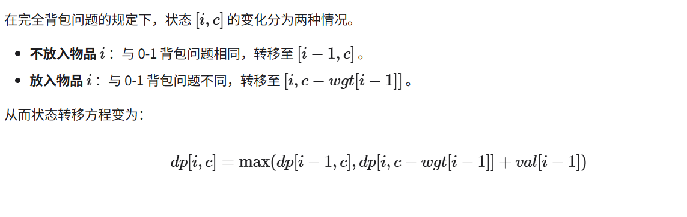

# 计算机组成与设计: 硬件/软件接口
## 教材介绍和错误澄清
- 这本书的作者是John L. Hennessy 与 David A. Patterson,都是硬件领域中极其杰出的人物


>这本书有三个指令集版本: RISC-V 版、MIPS 版和 ARM 版。当然推荐看新兴的RISC-V版本,如果出于国内应试的考量,就只能看MIPS版本了.

>"There are two textbooks for the course: Computer Organization and Design by Patterson and Hennessy... The expectation is that the same text will also be useful to you in a later architecture course (CS 152). Do not get 'Computer Architecture, a Quantitative Approach' by mistake; it's a similar-looking graduate text by the same authors."
>
>千万不要错买成《计算机体系结构：量化研究方法》(CAQA)，那是一本看起来很像、但由同作者撰写的研究生阶段教材


- 没错,我就是那个不小心先看了CAQA的人,在没有前置基础的情况下确实看的有点难受.
## 引言
**计算机体系结构的7个伟大设计思想:**
1. 使用抽象来隐藏底层实现细节,简化设计
2. 加速大概率事件,这比优化小概率事件更能提高性能
3. 通过并行来提高性能
4. 通过流水线提高性能
5. 通过预测来提高性能
6. 设计分层的存储器
7. 通过冗余提高系统的可靠性

## 指令
### 前置概念
- MIPS的寄存器有32个,大小均为32位,由于对32位数据进行整体操作的情况经常出现,所以将32位的数据称为字(**word**).
  - 也有64位的MIPS,但没必要了解.
- MIPS约定书写指令时用一个`$`后面跟两个字符来表示寄存器,比如说用`$s0`,`$s1`表示常规寄存器,用`$t0`表示临时寄存器.

>由于MIPS是按字节编址的,但指令都是32位的,所以加上偏移量比如说8时,实际上是加上了4x8个字节,这样才能正确读到A[8]处存储的指令,而不会错读到A[8/4].

| 硬件概念        | 数学表示 (十六进制) | 物理对应关系                                                   |
| --------------- | ------------------- | -------------------------------------------------------------- |
| **PC = 0x0000** | 基准地址            | 指向物理内存中的 **第 0 个字节**（里面包含 8 个 bit）          |
| **PC = 0x0001** | 地址加 1            | 指向物理内存中的 **第 1 个字节**（里面包含另外 8 个 bit）      |
| **PC = 0x0004** | 地址加 4            | 指向物理内存中的 **第 4 个字节**（跨过了 1 个 32 位的字/指令） |


### 基本操作数

1. add(加法)/sub(减法)指令后一般跟三个寄存器,第一个寄存器存储计算结果,后两个为要参与运算的寄存器
2. load指令用来装载从存储器复制到寄存器的数据,使用`lw`和`lb`符号,表示`load word`和`load byte`
3. store指令用来将数据从寄存器复制到寄存器中,使用`sw`和`sb`符号,表示`store word`和`store byte`.
4. MIPS中经常会用到常数运算,因此专门设计了立即数的加减法,记为`addi`,即`add immediate`,如`addi $s3,$s3,4`.

>MIPS还支持对半字和无符号半字的存取

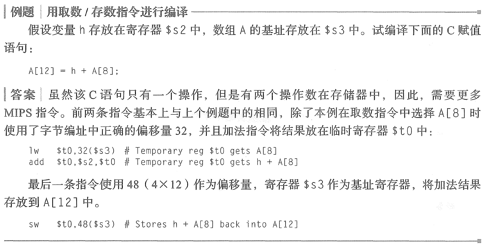
### 基本指令格式
MIPS为了保证所有的指令长度均为32位,针对不同的需求,将不同类型的指令拆分成了不同的指令格式,最常用的格式为R型和I型.

R型,用于普通的寄存器运算指令:


I型,用于立即数和数据传送指令:


- op: 操作码(opcode)
- rs: 第一个寄存器
- rt: 第二个寄存器
- rd: 存放操作结果的寄存器
- shamt: 移位量(shift amount),若用不到则置为0
- funct: 功能码,用于操作码的扩展.

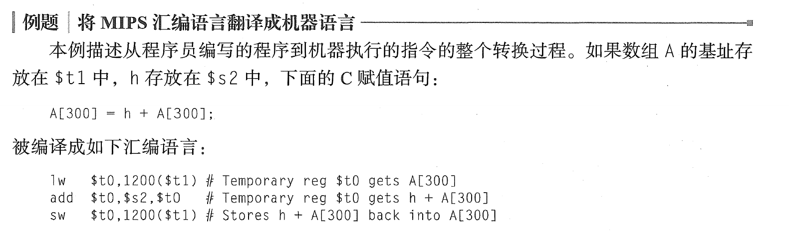

>可以看到,例题中的写法是把rd放在最前面了,但操作码格式中rd是放在最后面的,这个真心搞不太懂.
### 进阶操作数
**逻辑指令:**
1. 移位(shift): 分为左移(shift left logical,sll)和右移(srl)
2. 按位操作:按位与(AND)和按位或(OR),会逐个比较位数得出结果.
3. 或非指令(NOT OR,NOR): 为了保持三操作数的格式,MIPS用NOR来代替普通的NOT指令,只需要将一个辅助寄存器的值设定为0,结果就等价于NOT.

**决策指令**:
1. 分支指令: beq(branch if equal)和bne(branch if not equal),例子如下:

```bash
beq r1,r2,l1
```
如果r1与r2中的数值相等,则跳转到标签l1

```bash
bne r1,r2,l1
```
如果r1与r2中的数值不相等,则跳转到标签l1

2. 无条件分支指令: 即跳转指令`jr`,表示jump register,如`jr r1`
3. 跳转并链接指令: jump-and-link,jal,会在跳转地址的同时,将下一条指令的地址保存在特定的返回地址寄存器中.
## 算术运算
### 加法和减法
在加法和减法运算中,可能发生溢出,MIPS使用两种类型的算术指令来解决溢出:
1. add,addi,sub在溢出时抛出异常
2. addu,addiu,subu,在溢出时不产生异常

>由于C语言忽略溢出,所以MIPS C编译器只是用第二种算术指令.
### 乘法


如果我们将乘数的32位全部拆开,每一位分别用到一个加法器的话,就可以大幅度加速运算:
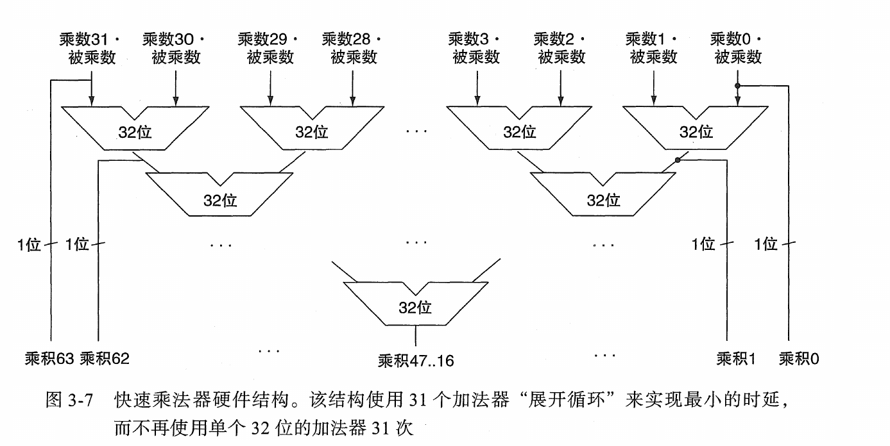

上面讨论的是正数乘法,如果是有符号乘法的话,符号位不参与运算即可.

MIPS提供了两条乘法指令: 乘法(mult)和无符号乘法(multu)
### 除法


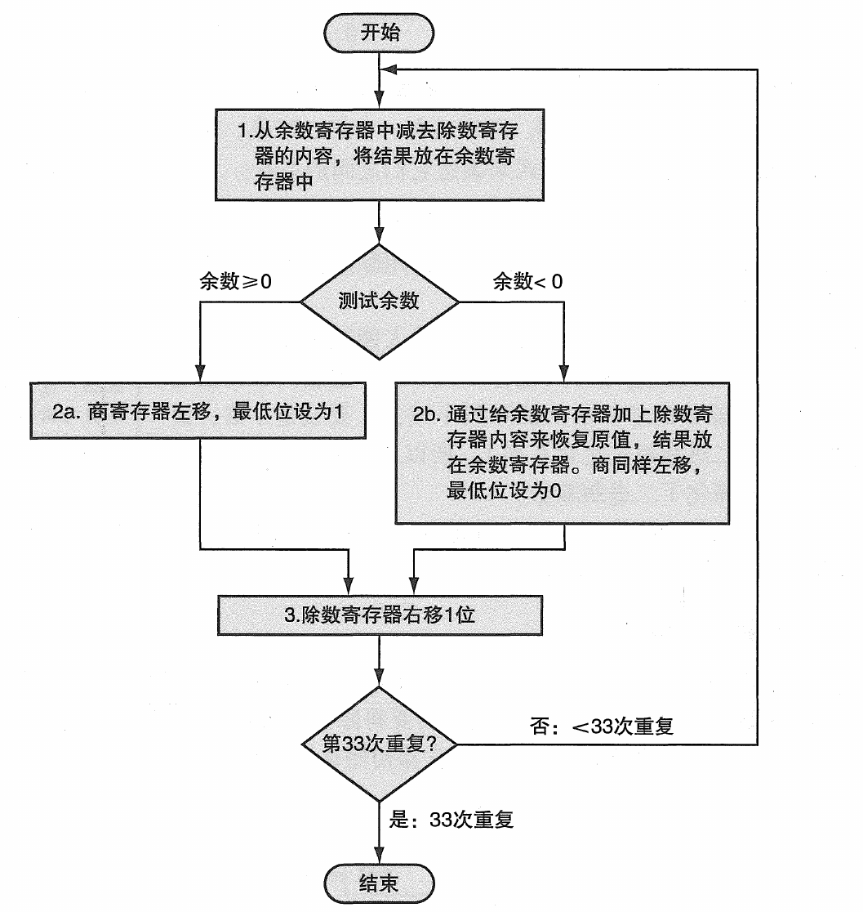

解释一下流程:
1. 之所以除数寄存器和余数寄存器是商寄存器的双倍长度,是因为要保证除数能从最高位慢慢向右移动,才知道够不够除被除数
2. 一开始余数寄存器初始化为被除数,发现余数比除数大时,将商寄存器左移,最低位记为1,否则记为0
3. 除数寄存器右移1位,继续相除,如果余数比除数小,则说明计算完成,可以退出循环,余数寄存器中的值则为最终的余数

>这个设计还是很精妙的,不是那么容易看懂的.

MIPS中提供了两条除法指令: 除法(div)和无符号除法(divu)

### 浮点运算
浮点数的基本运算法则与整数计算没有区别,只是要考虑一下指数的转换.

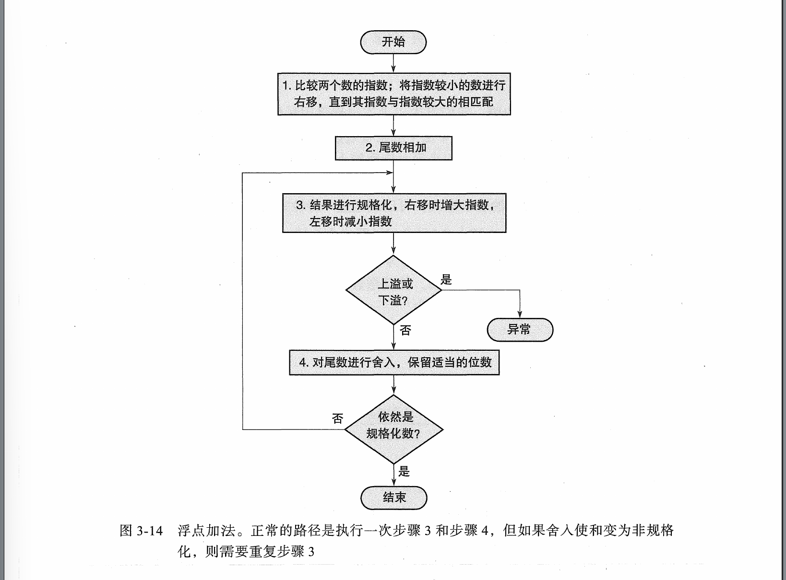

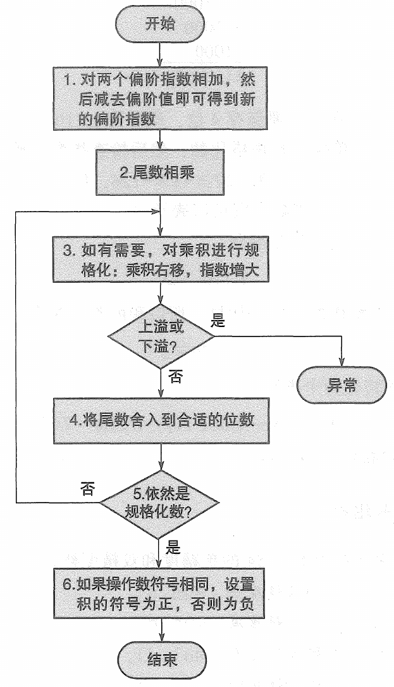

MIPS中有以下浮点计算指令:
- 浮点单精度加 (add.s) 和双精度加 (add.d) 。
- 浮点单精度减 (sub.s) 和双精度减 (sub.d) 。
- 浮点单精度乘 (mul.s) 和双精度乘 (mul.d) 。
- 浮点单精度除 (div.s) 和双精度除 (div.d) 。
## 附录B: 逻辑设计基础(过)
- 书上讲的太烂了,只好另外找书恶补基础了

现代计算机的内部电路为数字电路,只工作在两个电压: 高电压和低电压,与二进制的0和1相匹配.

数字电路按照是否包含存储器件(电容,电感)可以分成两种逻辑电路:
1. 组合逻辑(combinational logic): 当前的输出只取决于当前的输入
2. 时序逻辑(sequential logic): 当前的输出不仅于当前的输入相关,还和存储器件中存储的值有关.

### 组合逻辑
仅仅使用**与门**,**或门**,**非门**,我们可以得到所有的逻辑器件,常用的组合逻辑器件如下:

- 译码器: 有n个输入和2^n个输出,对于每一种输入组合,都只有一个输出信号为1


- 多路选择器: 输出由控制信号从多个输入中选择一个产生


- 只读存储器(Read-Only Memory,ROM): 包含一组地址输入线和一组输出

- 算术逻辑单元(Arithmetic Logic Unit,ALU): 执行算术运算和逻辑运算


### 时序逻辑
#### 时钟
在时序电路中,时钟非常重要,决定了包含状态的存储元件何时更新,它只有两种状态: 高电平和低电平.

MIPS中采用`边沿触发时钟(edge-triggered clocking)`,所有的状态改变都发生在时钟边沿(即高低电平切换的时间点)

## 处理器
### 流水线
- 跳过了一大堆可怕的逻辑设计电路分析


流水线可以最大限度的利用硬件,对于特定的硬件来说,每个周期都可以执行新指令的该阶段操作.

- 流水线的级数:指令中涉及的总操作个数,例如某个指令涉及了6个操作,它的级数就是6

对于MIPS来说,由于所有指令的长度都是相同的,而且指令格式的种类很少,每一条指令中源寄存器字段的位置也相同,所有的操作都可以通过流水线完成.

流水线冒险,意为**在下一个时钟周期中无法执行下一条指令**,可以分为三种类型:
1. 结构冒险: 硬件不支持多条指令在同一时钟周期执行,例如存储器在同一周期被两条指令的特定阶段都同时访问
2. 数据冒险: 一个流水级必须等待另一个流水级完成,导致流水线暂停.这是由于一条指令依赖于另一条还在流水线中的指令造成的.

一种解决方法是: 我们可以让需要等待来自其他指令结果x的流水线先进行到需要x的地方,再由特定的硬件直接将计算好的x送给该流水线,这被称为旁路(bypassing).


| 符号    | 全称               | 中文含义        | 主要功能                             |
| ------- | ------------------ | --------------- | ------------------------------------ |
| **IF**  | Instruction Fetch  | 取指令          | 从指令存储器中取出当前 PC 指向的指令 |
| **ID**  | Instruction Decode | 指令译码        | 解析指令，读取寄存器，生成控制信号   |
| **EX**  | Execute            | 执行 / 地址计算 | ALU 运算、分支判断、计算访存地址     |
| **MEM** | Memory Access      | 访存            | 访问数据存储器，完成 load / store    |
| **WB**  | Write Back         | 写回            | 将运算结果或访存结果写回寄存器       |


上述的示例是理想的情况,由于ALU运算的结果刚好在下一个周期前回流到了减法的流水线,所以流水线不会中断.但实际上很多时候我们需要停留一两个周期才能获取上一个流水线的结果,停留的周期被称为**阻塞**(stall).

我们可以通过重排指令来避免阻塞:


3. 控制冒险: 接下来的决策依赖于某一条正在执行的指令结果,这类指令通常都是条件分支指令(beq,ben),有可能产生不同的指令结果.

指令集采用**预测(predict)**的方法来处理条件分支问题,在预测正确的时候不停止流水线的运行,在预测失败的时候需要重新执行流水线.

一种简单的设想是,认为所有的分支都不会生效,那么当预测正确的时候(分支生效),流水线可以全速执行,当分支生效时才会阻塞流水线.

更为成熟的做法是,预测一些分支生效而另一些分支不生效,对于分支生效的指令,会提前跳转到对应的分支地址进行执行.

>控制冒险实际上就是我们在程序编写中常见的while和for循环操作.

## 存储器
### 前置概念
- 局部性原理:
  - 时间局部性(temporal locality): 如果某个数据项被访问，那么在不久的将来它可能再次被访问
  - 空间局部性(spatial locality): 如果某个数据项被访问,与它地址相邻的数据项可能很快也将被访问

根据局部性原理,我们可以将存储器设计成分层的结构:

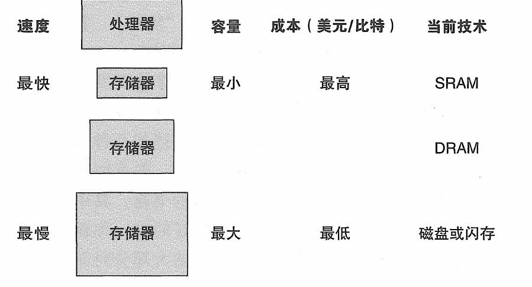

### cache的设计
cache的基本原理可以这样表述:
>将主存中的内存块映射到cache中的每一行中,如果cache有8行,那么就对主存地址取模8,将余数相同的地址全部对应到cache的一行中

当然,我们需要对cache中某一行存储的内存块设置**标签**(tag),否则无法区分这到底是哪个内存块,如果cache有8行,那么我们可以直接将内存地址的低三位设置为余数,其他位数设置为标签,例如(10111)对应的是cache第8行,标签为10.


## 总结
总体看下来的感受还是可以的,大多数内容都讲的比较详细,解决了我关于MIPS指令集的不少疑问.
# 计算机体系结构: 量化研究方法
- 如上一本书所说明的,这本书属于进阶版本的教材,但因为是相同的作者写的,所以编排风格十分相似.

## 量化设计与分析基础
### 前置概念
应用程序中主要有两种并行:
1. 数据级并行(DLP): 同时操作多个数据项
2. 任务级并行(TLP): 同时执行多个工作任务

计算机硬件为了实现上述的两种架构,有以下四种并行方法:
1. 指令级并行: 利用流水线实现数据级并行
2. 使用向量处理机和GPU: 将单条指令并行应用于一个数据集,实现数据级并行
3. 线程级并行: 在并行线程间进行交互,实现数据级/任务级并行
4. 请求级并行

我们还可以根据指令流与数据流的关系将计算机架构分成4类:
1. 单指令流,单数据流(SISD): 使用单处理器,顺序执行指令,但可以实现指令级并行
2. 单指令流,多数据流(SIMD): 使用多处理器,不同的处理器可以装载不同的数据流,但只能由一个处理器来装载指令,是现代GPU的主要架构
3. 多指令流,单数据流(MISD): 不太有开发的必要,指令容易冲突,还不能并行处理多个数据.
4. 多指令流,多数据流(MIMD): 每个处理器都使用自己的指令操控自己的数据,是现代CPU的主要架构.

### 指令集体系结构(ISA)
几乎所有的ISA都属于通用寄存器体系结构,80x86有16个通用寄存器和16个存储浮点数据的寄存器;MIPS有32个通用寄存器和32个浮点寄存器.

所有的计算机都使用**字节寻址**来访问存储器操作数,MIPS有三种寻址方式: 寄存器寻址,立即数寻址,位移量寻址.

MIPS的操作指令比较简单,大致可分为以下几种:
1. 数据传输指令
2. 算术逻辑指令
3. 控制指令
4. 浮点指令

| 指令类型/操作码                       | 指令含义                                                                                                         |
| ------------------------------------- | ---------------------------------------------------------------------------------------------------------------- |
| **数据传输**                          | 在寄存器和存储器之间，或者在整数和FP或特殊寄存器之间移动数据；唯一的存储器寻址模式是16位位移量加上GPR的内容      |
| LB, LBU, SB                           | 载入字节、载入无符号字节、存储字节（至/自整数寄存器）                                                            |
| LH, LHU, SH                           | 载入半字、载入无符号半字、存储半字（至/自整数寄存器）                                                            |
| LW, LWU, SW                           | 载入字、载入无符号字、存储字（至/自整数寄存器）                                                                  |
| LD, SD                                | 载入双字、存储双字（至/自整数寄存器）                                                                            |
| L.S, L.D, S.S, S.D                    | 载入SP浮点、载入DP浮点、存储SP浮点、存储DP浮点                                                                   |
| MFC0, MTC0                            | 在GPR与特殊寄存器之间复制数据                                                                                    |
| MOV.S, MOV.D                          | 将一个SP或DP FP寄存器复制到另一个FP寄存器                                                                        |
| MFC1, MTC1                            | 在FP寄存器与整数寄存器之间复制32位                                                                               |
| **算术/逻辑**                         | 对GPR中的整数或逻辑数据进行操作；带有符号算术运算溢出时进行陷阱捕获                                              |
| DADD, DADDI, DADDU, DADDIU            | 加，加立即数（所有立即数为16位），有符号和无符号                                                                 |
| DSUB, DSUBU                           | 减，有符号和无符号                                                                                               |
| DMUL, DMULU, DDIV, DDIVU, MADD        | 乘和除，有符号和无符号，乘-加；所有运算的操作数和结果都是64位数值                                                |
| AND, ANDI                             | 与，和立即数相与                                                                                                 |
| OR, ORI, XOR, XORI                    | 或，和立即数求或，异或，和立即数求异或                                                                           |
| LUI                                   | 载入高位立即数；将立即数载入到寄存器的32~47位，然后进行符号扩展                                                  |
| DSLL, DSRL, DSRA, DSLLV, DSRLV, DSRAV | 移位：立即数形式（DS__）和变量形式（DS__V），移位为左逻辑移位、右逻辑移位、右算术移位                            |
| SLT, SLTI, SLTU, SLTIU                | 若小于操作数则置位、若小于立即数则置位、有符号和无符号                                                           |
| **控制**                              | 控制分支和跳转，相对于PC寄存器或通过寄存器控制                                                                   |
| BEQZ, BNEZ                            | GPR等于/不等于0时转移，相对于PC+4偏移16位偏移量                                                                  |
| BEQ, BNE                              | GPR相等/不等时转移、相对于PC+4偏移16位偏移量                                                                     |
| BC1T, BC1F                            | 测试FP状态寄存器中的对比位，并转移；相对于PC+4偏移16位偏移量                                                     |
| MOVN, MOVZ                            | 如果第三个GPR为负数/零，则将第一个GPR复制到第二个GPR                                                             |
| J, JR                                 | 跳转至与PC+4偏移26位偏移量的位置（J）、跳转至寄存器中的目标位置（JR）                                            |
| JAL, JALR                             | 跳转和链接：将PC+4保存在R31中，目标为相对于PC（JAL）或寄存器（JALR）                                             |
| TRAP                                  | 转移到操作系统的一个向量地址                                                                                     |
| ERET                                  | 从异常中返回用户代码，恢复用户模式                                                                               |
| **浮点**                              | 对DP和SP格式执行FP操作                                                                                           |
| ADD.D, ADD.S, ADD.PS                  | DP、SP相加，一对SP数相加                                                                                         |
| SUB.D, SUB.S, SUB.PS                  | DP、SP相减，一对SP数相减                                                                                         |
| MUL.D, MUL.S, MUL.PS                  | DP、SP浮点数相乘，一对SP数相乘                                                                                   |
| MADD.D, MADD.S, MADD.PS               | DP、SP浮点数相乘加，一对SP数相乘加                                                                               |
| DIV.D, DIV.S, DIV.PS                  | DP、SP浮点数相除，一对SP数相除                                                                                   |
| CVT.*.*                               | 转换指令：CVT.x.y从类型x转换为类型y，其中x和y为L（64位整数）、W（32位整数）、D（DP）或S（SP）。两个操作数都是FRP |
| C.*.D, C.*.S                          | DP和SP对比：“_”=LT, GT, LE, GE, EQ, NE；在FP状态寄存器中置位                                                     |

MIPS中所有指令的长度都是32位,从而简化了指令译码:


### Amdahl定律: 计算加速比
Amdahl定律用于计算升级某个部件/功能时获得的**加速比**,即采用升级前所用的时间与升级后所用时间的比值,从而衡量出某个部件/功能的贡献大小:

$$S_{\text{latency}} = \frac{1}{(1 - p) + \frac{p}{s}}$$

* $S_{\text{latency}}$：整个任务执行速度的理论加速比。
* $p$：任务中受益于资源改进的部分所占的时间比例（$0 \le p \le 1$）。
* $s$：受改进部分原本的性能提升倍数。


### CPI: 衡量处理器的性能
所有计算机都有一个时钟周期,那么CPU执行某个任务的时间就等于**经过的周期数乘以一个时钟周期的时间**.

我们使用**每条指令的周期数**(Cycle Per Instruction,CPI)来衡量某条指令所花的时间长度:

$$\text{CPI} = \frac{\text{程序的CPU时钟周期数}}{\text{指令数}}$$

那么处理器的性能就取决于三个变量: 时钟周期,CPI,指令数.

## 存储器层次结构设计
鉴于快速存储器非常昂贵,现代计算机都使用分层的存储器结构,从而实现以下效果:
- **每字节的成本几乎与最便宜的存储器级别相同,速度几乎与最快速的级别相同**


- 下一级存储器通常会保留上一级存储器的所有信息,才能保证信息不会丢失
### 优化缓存性能
1. 使用小而简单的第一级缓存,缩短命中时间
2. 采用**路预测**,缩短命中时间
   1. 缓存中留出一部分空间用于预测下一次要访问的数据
3. 缓存访问流水化(Cache Access Pipelining),即将缓存访问拆成多个步骤,提高缓存带宽:

```md
时钟周期：   |  Cycle 1  |  Cycle 2  |  Cycle 3  |  Cycle 4  |
指令 A:     [ 地址解码 ] [ 阵列驱动 ] [ 数据读出 ]
指令 B:                 [ 地址解码 ] [ 阵列驱动 ] [ 数据读出 ]
指令 C:                             [ 地址解码 ] [ 阵列驱动 ] [ 数据读出 ]
````
4. 采用无阻塞缓存,提高缓存带宽
   1. 出现缓存不命中(miss)时,不中断缓存访问,这是通过在缓存内部引入了一组特殊的硬件寄存器实现的,它被称为**未命中状态保持寄存器**（MSHR，Miss Status Holding Registers）.


5. 采用多种缓存,提高缓存带宽.
   1. 将缓存划分成多个相互独立的,支持同时访问的缓存组
6. 关键字优先和提前重启动,降低缓存不命中的代价
   1. 缓存与主存交换数据的最小单位是块(Block),一个块包含多个字(word),当CPU只需要某一块其中的一个字时,缓存控制器直接跳转到对应的地址获取那个缺失的字,让CPU恢复执行后再发送该块的剩余部分
   2. 另一种实现方法,缓存保持顺序读取,实时检查当前块中是否出现了CPU需要的字,一旦出现就直接发送给CPU,再接着发送剩余部分.

7. 合并写缓冲区,降低缓存不命中的代价
   1. 为了不让CPU每次执行缓存的写入操作时都等待新数据从缓存慢慢传回内存,我们会设计一个写缓冲区,CPU将数据写入该缓冲区后继续执行,缓冲区负责将数据异步写入下级存储.
   2. 如果新写入的数据与缓冲区中某个数据属于一个块(这是非常常见的情况,因为代码和数据通常都保存在一块连续内存上),则直接将这两部分数据合并,节省写缓冲区空间

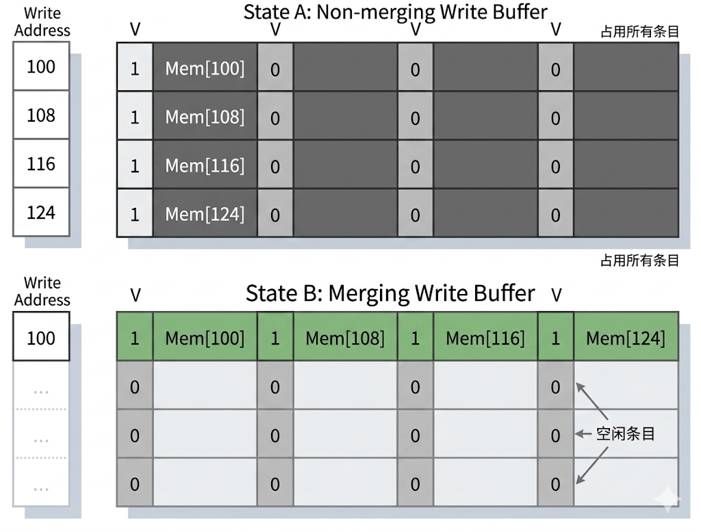

8. 采用编译器优化,降低缓存不命中的概率
   1. 编译器会对代码进行优化处理,帮助处理器以更高的效率执行代码

上面的这些做法都在现代计算机体系结构中得到了广泛的应用.
### 存储器种类
- Static Random Access Memory(SRAM): 通常用作缓存,集成在处理器的芯片上,响应速度远超DRAM
- Dynamic Random Access Memory(DRAM): 用作内存条,在每次读取信息后会破坏该信息,所以要进行**刷新**后写回数据,速度比较慢,适合放在硬盘和缓存中间作为缓冲存储器.
- SDRAM: 同步DRAM,DRAM的优化版本,现代的内存条都是SDRAM.
- NAND flash(闪存): 最常见的闪存就是SSD(固态硬盘),通常为最后一级存储器,速度很慢,但比起HDD(机械硬盘)又快得多.

## 附录B: 存储器层次结构
### 前置概念
1. 根据主存块在cache中的放置位置,可以讲cache的组织方式分成三种:
   1. 直接映射: `(块地址)MOD(缓存行数)`
   2. 全相联: 块可以放在缓存中的任意位置
   3. 组相联: 块可以放在缓存中的有限个位置组成的组(set)中.块首先通过`(块地址)MOD(缓存组数)`映射到组,可以放在组中的任意位置.
      1. 如果组中有n个块,就被称为n路组相联
      2. 有m块的全相联实际上就是只有一组的m路组相联
2. 处理器在寻找一个主存块时,会提供给cache两个信息: **块地址和块偏移**,块地址可以拆分成**tag**字段和**索引**字段,索引字段可以定位cache的某一行/某几行,tag字段可以与cache中的tag位进行比较,从而判断cache中该行是否存储了要寻找的主存块,如果不匹配,则说明发生了cache miss,需要从主存中加载数据到cache中,并重置cache中对应的tag位.
3. 发生cache miss时,由于直接映射时只需替换被映射的那一行,所以不用多操心;但对于组相联的cache,我们主要有三种算法来决定替换该组中的哪一行:
   1. RAND: 随机选择该组中的任意一行
   2. LRU(最近最少使用): 替换掉最近最少使用的一行,这应用了局部性原理.
   3. FIFO(先入先出): 替换掉最早被使用的哪一行.

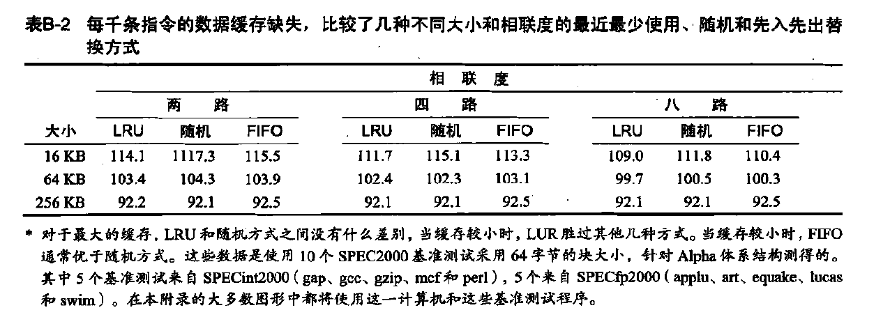

4. 将数据写入缓存时,有两种方法:
   1. 直写: 写入缓存和主存中
      1. 实现起来比较简单,而且发生cache miss时也不需要再对主存进行写入,主存中存有数据的最新副本
   2. 写回: 写入缓存,缓存中的数据如果被修改了,那么在被替换时才会被写入主存中.
      1. 写入时占用的时钟周期短,节省功耗

### 缓存优化
1. 增加相联度: 主存块可以放进cache的候选位置变多,被替换的概率下降
2. 增大存取的主存块大小: 根据空间局部性,如果程序访问了某个地址,它很可能马上访问附近的地址;但主存块太大的话,cache容纳的主存块个数过少,反而会降低性能
3. 增大cache容量: 装的主存块个数变多
4. 使用多级缓存,多级缓存的存储器平均访问时间计算方法如下:

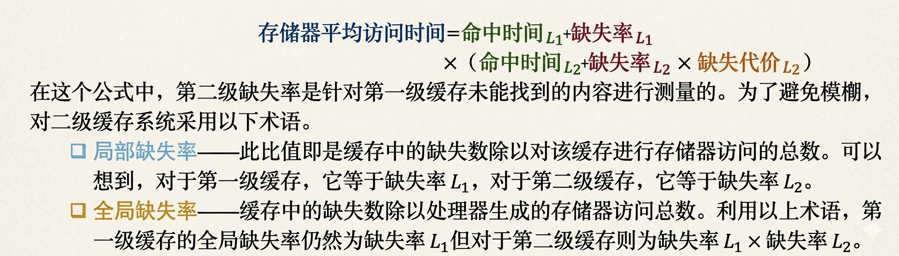


### 虚拟存储器
>如果由程序员亲自负责物理内存的分配,拆分过于庞大的内存,确保程序不会越界访问,这显然很累人,尽管早期计算机确实是这么做的.

为了解决这个问题,虚拟存储器诞生了,处理器负责计算得到要处理的虚拟地址,由MMU单元按照操作系统提供的页表完成从虚拟地址到物理地址的映射(通过偏移量实现),再访问cache/主存中的实际物理地址.
## 指令级并行
### 前置概念
- 指令级并行: 有两种实现方式,一种是依靠硬件来动态实现并行,一种是依靠编译器来静态发现并实现并行.

为了确定能否开展指令级并行,我们需要判断指令间是否相关,总共有三种类型的相关:
1. **数据相关**: 指令i的结果可能会被指令j使用,或者指令i的结果会被指令k使用,而指令k的结果会被指令j使用,这两种情况都被称为数据相关.
   1. 如果两条指令数据相关,那么他们必须顺序执行,无法真正的并行.
2. **名称相关**: 指令i需要用到指令j需要的寄存器/存储器位置
   1. 名称相关非常好解决,既可以让编译器对涉及冲突的寄存器进行**重命名**(即更换寄存器),也可以让硬件更改冲突的存储器位置.
3. **控制相关**: 条件语句中的条件指令与执行语句只能顺序执行.
### 编译器优化
编译器可以智能地帮助我们合并指令,减少流水线停顿:

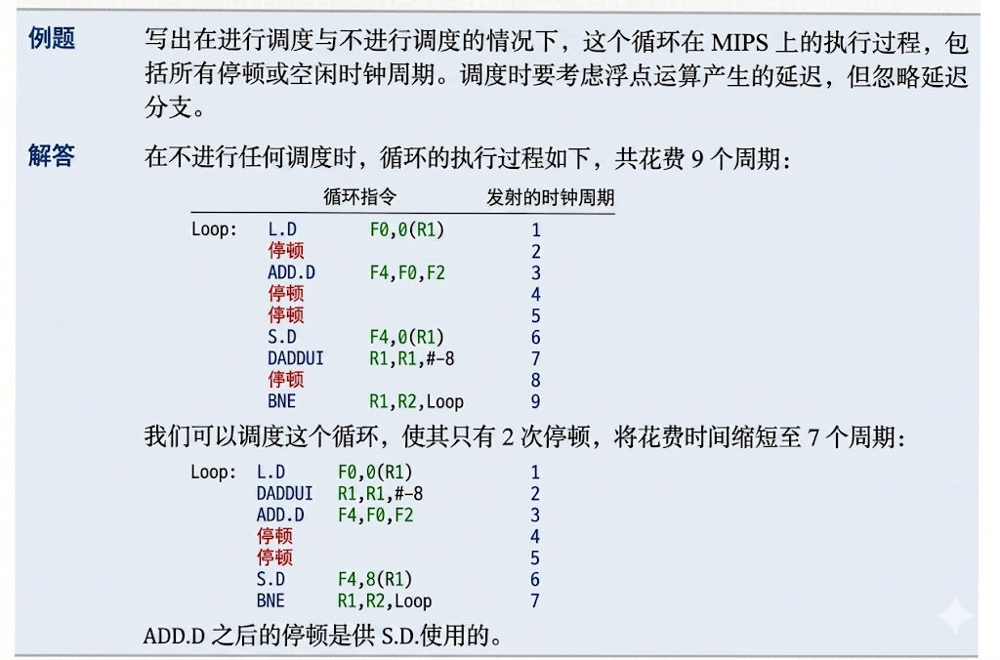
### 硬件优化(待补充)
硬件优化的代表性算法是**Tomasulo算法**,它能够通过寄存器重命名降低数据相关和名称相关的指令数量,实现流水线的乱序执行(在指令可用时立刻执行而无需等待).


例如,上面这个指令序列可以通过两个临时寄存器被改写成这样,让指令间互不相关:

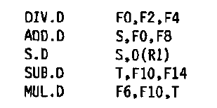

## 数据级并行
>SIMD通过使用单条指令启动多次数据运算,比起MIMD更为高效.

SIMD有以下三种实际应用:
1. 向量处理机: 将处理器硬件全部替换成适配向量操作的结构,当需要大规模的数据运算时,可以直接使用矩阵来快速简化运算,而无需如同普通处理器一样通过多次循环来迭代处理.
   1. 很明显,向量处理机不是那么好实现的,效果也未必有多好,不然不会在推出几十年后也没成功商业化
2. 多媒体SIMD扩展: 简单来说就是对MIMD进行扩展,例如允许64位寄存器同时操作8个8位操作数,这适用于诸如图形处理,色彩渲染等功能.本质上来说是延续了向量处理机的实现方法.
3. GPU(Graphic Process Unit): 与CPU的架构差别很大

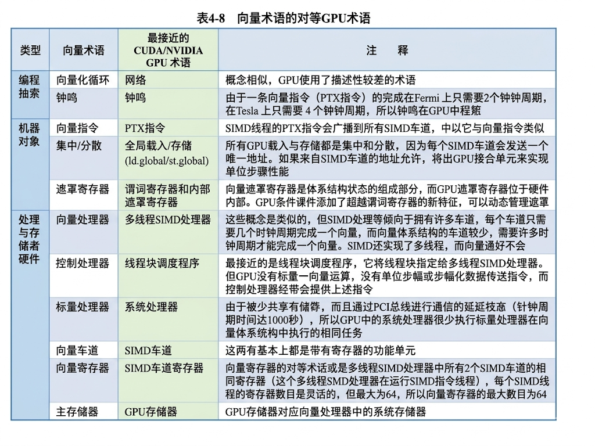

## 线程级并行
为了实现线程级并行,我们需要同时运行多个处理器,按照存储器的组织方式,多处理器方案可以分成两种:
1. SMP(对称多处理器): 处理器数量少,有各自的独立缓存,但同时共享一个下一级缓存:


2. DSM(分布式共享存储器): 处理器数量多,处理器之间不共享存储器,缩短了存储器存取延迟,但也让处理器之间传送数据变得更加复杂

# Python3网络爬虫开发实战
## 爬虫基础
讲的还不错,基本涉及了爬虫所需的所有知识,尤其是关于session,cookie的地方讲的很好,帮我扫清了一点疑惑
## 数据的存储
## Ajax数据爬取
## 异步爬虫

# 操作系统导论

## 概览
本书围绕操作系统的三个特征展开:
1. 虚拟化(virtualization): 这与程序装载相关
2. 并发(concurrency): 这与程序调度相关
3. 持久性(persistence): 这与硬盘/文件系统相关

## 系统调用
>谁能想到这本书竟然帮我解决了关于系统调用的许多疑问

1. fork(): 复制当前进程创建一个子进程,子进程拥有独立的地址空间,寄存器和程序计数器
   1. fork()系统调用实质上是在执行到当前代码时再新建一个进程,两个进程同时运行,因此,下面这段条件语句能够返回两个值,一个是父进程返回的子进程pid,一个是子进程返回的0
```c
#include <stdio.h>
#include <stdlib.h>
#include <unistd.h>

int main(int argc, char *argv[]) {
    printf("hello world (pid:%d)\n", (int)getpid());
    int rc = fork();
    if (rc < 0) {
        // fork failed; exit
        fprintf(stderr, "fork failed\n");
        exit(1);
    } else if (rc == 0) {
        // child (new process)
        printf("hello, I am child (pid:%d)\n", (int)getpid());
    } else {
        // parent goes down this path (main)
        printf("hello, I am parent of %d (pid:%d)\n", rc, (int)getpid());
    }
    return 0;
}
```


2. wait(): 让父进程等待子进程执行完毕再继续执行,这显然是I/O,网络请求等让我们深恶痛绝的阻塞的源头.
3. exec(): 因为`fork()`只是创建了一个近乎完全相同的进程,所以我们需要`exec()`来真正的创建一个不同的进程.该调用会从指定的可执行程序中加载代码和静态数据,并覆盖当前子进程的内存区域.


>要执行系统调用，程序必须执行特殊的陷阱（trap）指令。该指令同时跳入内核并将特
权级别提升到内核模式。一旦进入内核，系统就可以执行任何需要的特权操作（如果允许），
从而为调用进程执行所需的工作。完成后，操作系统调用一个特殊的从陷阱返回
（return-from-trap）指令，如你期望的那样，该指令返回到发起调用的用户程序中，同时将
特权级别降低，回到用户模式。

## 进程调度
### 进程切换问题
>如果一个进程在 CPU 上运行，这就意味着操作系统没有运行。如果操作系统没有运行，它怎么能做事情？

- 这一问题直接打入了操作系统的核心,非常的透彻.

早期的操作系统由进程来决定何时将CPU的控制权交给内核,内核只能在进程执行时被动地等待.

后来,我们引入了时钟中断(timer interrupt),当中断发生时,当前运行的进程被停止,CPU的控制权会重新交给内核

# 深入浅出密码学

## 概述
>本书不会涉及令人害怕的数学公式。本书的目的是揭开密码学的
神秘面纱，介绍当今常用的密码学技术，并给出这些技术在我们身边
的应用案例。本书适合那些对密码学怀有好奇心的人、有强烈求知欲
的工程师、富有冒险精神的软件开发人员和兴趣广泛的研究人员。
## 哈希函数
哈希函数有以下特性:
1. 任意长度的输入都会得到相同的输出长度
2. 同一个输入可以得到相同的输出
3. 实践中无法根据输出得到输入,这被称为**Pre-image Resistance**
4. 根据一个输入无法找到另一个输入得到相同的输出,这被称为**Second Pre-image Resistance**
5. 实践中无法找到两个不同的输入能够产生相同的输出,这被称为**Collision Resistance**

### SHA-2哈希函数
SHA-2算法族于2001年标准化,有4个子类,分别是SHA-224、SHA-256、SHA-384 和 SHA-512,它们分别产生 224、256、384 和 512 比特的输出.
### SHA-3 哈希函数
SHA-3算法族于2015年标准化,同样有4个子类,分贝是SHA-3-224、SHA-
3-256、SHA-3-384 和 SHA-3-512
# The Elements of Computing Systems
## 概览
- www.nand2tetris.org: 配套官网
- 该书被尊称为**Nand to Tetris**,至于为什么,看完这本书就会知道了
- 第二版于2021年发行,距离第一版已经过了将近二十年,内容上做了相当大的革新

>We wrote this book because we felt that many computer science students are **missing the forest for the trees**. The typical learner is marshaled through a series of courses in programming, theory, and engineering, without pausing to appreciate the beauty of the picture at large. And the picture at large is such that hardware, software, and application systems are **tightly interrelated** through a hidden web of abstractions, interfaces, and contract-based implementations.
>
>We believe that the best way to understand how computers work is to build one from scratch.

涵盖的内容如下:

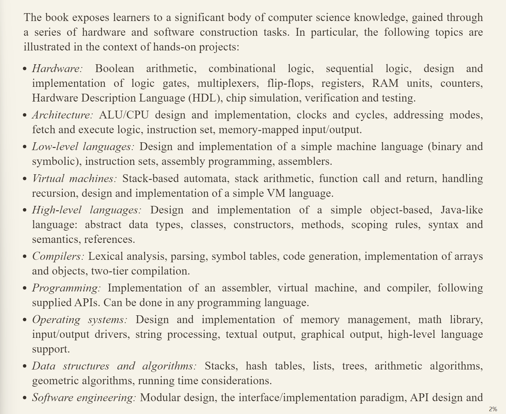
## 布尔逻辑
>所有布尔运算都可以被Nand(Not and,与非)一个运算表示出来


# Go语言圣经
- [中文版网站](https://golang-china.github.io/gopl-zh/preface-zh.html)
- (5/7): 看多了Java总觉得有些烦躁,就想着先学习一下Go来看看它的神奇之处
- (5/29): 不推荐拿这本书入门Go,建议先学习了Go的基础语法后再来看,不然会看的很难受

## 前言
>就事后诸葛的角度来看，Go语言的这些地方都做的还不错：拥有**自动垃圾回收**、一个**包系统**、**函数作为一等公民**、词法作用域、系统调用接口、只读的UTF8字符串等。但是Go语言本身只有很少的特性，也不太可能添加太多的特性。例如，它没有隐式的数值转换，没有构造函数和析构函数，没有运算符重载，没有默认参数，也没有继承，没有泛型，没有异常，没有宏，没有函数修饰，更没有线程局部存储。但是，**语言本身是成熟和稳定的，而且承诺保证向后兼容**：用之前的Go语言编写程序可以用新版本的Go语言编译器和标准库直接构建而不需要修改代码。

- 尽管Go现在支持泛型了,但是没有异常,也没有继承,重载,宏,隐式数值转换等一切让cpp变得面目可憎的东西.还是很不错的.

>Go语言有足够的类型系统以避免动态语言中那些粗心的类型错误，但是，**Go语言的类型系统相比传统的强类型语言又要简洁很多**。虽然，有时候这会导致一个“无类型”的抽象类型概念，但是Go语言程序员并不需要像C++或Haskell程序员那样纠结于具体类型的安全属性。在实践中，Go语言简洁的类型系统给程序员带来了更多的安全性和更好的运行时性能

## 入门
### 入门代码
```go
package main

import "fmt"

func main() {
    fmt.Println("Hello, 世界")
}
```
- fmt: format,格式化输入与输出

>Go 语言**不需要在语句或者声明的末尾添加分号**，除非一行上有多条语句。实际上，编译器会主动把特定符号后的换行符转换为分号，因此换行符添加的位置会影响 Go 代码的正确解析
### 循环语句
Go 语言**只有 for 循环这一种循环语句**。for 循环有多种形式，其中一种如下所示：
```go
for initialization; condition; post {
    // zero or more statements
}
```
>for 循环三个部分不需括号包围。大括号强制要求，左大括号必须和 post 语句在同一行。

- 格式很严格,但也很符合一般的编程习惯

```go
// Echo1 prints its command-line arguments.
package main

import (
    "fmt"
    "os"
)

func main() {
    var s, sep string
    for i := 1; i < len(os.Args); i++ {
        s += sep + os.Args[i]
        sep = " "
    }
    fmt.Println(s)
```

for的另一种写法类似python中的enumerate遍历:
```go
// Echo2 prints its command-line arguments.
package main

import (
    "fmt"
    "os"
)

func main() {
    s, sep := "", ""
    for _, arg := range os.Args[1:] {
        s += sep + arg
        sep = " "
    }
    fmt.Println(s)
}
```
- 与python一样,用不到的变量可以直接用下划线`_`代替.事实上Go中只能这么写,因为Go不允许使用**无用的局部变量**.

该`for ... range ...`循环用于遍历某一种数据结构,每次迭代都会返回一对值,第一个是索引,第二个是索引处的元素值.
### 总结
看到这就可以了,后面只是对Go的基础功能的一些展示.
## 程序结构
### 变量
#### 变量声明
基本语法如下:
```go
var 变量名字 类型 = 表达式
```

>其中“类型”或“= 表达式”两个部分可以省略其中的一个。如果省略的是类型信息，那么将根据初始化表达式来推导变量的类型信息。如果初始化表达式被省略，那么将用零值初始化该变量。 数值类型变量对应的零值是0，布尔类型变量对应的零值是false，字符串类型对应的零值是空字符串，接口或引用类型（包括slice、指针、map、chan和函数）变量对应的零值是nil。数组或结构体等聚合类型对应的零值是每个元素或字段都是对应该类型的零值。


```go
var s string
fmt.Println(s) // ""
```

也可以用两种方法同时声明多个变量:
```go
var i, j, k int                 // int, int, int
var b, f, s = true, 2.3, "four" // bool, float64, string
```

Go还有一种非常简短的方式来声明和初始化**局部变量**,这被称为**简短变量声明**:
```go
anim := gif.GIF{LoopCount: nframes}
freq := rand.Float64() * 3.0
t := 0.0
```
- 我们不需要写前置的var关键字,也不需要写后置的变量类型,而是由编译器自动推导

我们同样可以一次声明一组变量:
```go
i, j := 0, 1
```
需要注意的是,`:=`必须要至少声明一个新的变量,否则会报错:
```go
f, err := os.Open(infile)
// ...
f, err := os.Create(outfile) // compile error: no new variables
```


### 指针
由于Go的底层不是和Java,Python一样的引用传值,而是和Cpp,Rust一样的值拷贝,所以还是需要引入指针,**来避免大规模的复制拷贝**.

- 任何类型指针的零值都是**nil**,对应于cpp中的nullptr.
- 非常遗憾的是,Go仍旧没有把解引用符号和指针声明符号区分开,看来设计者真的非常喜欢`*`这个符号

```go
var p = f()

func f() *int {
    v := 1
    return &v
}
```
- 上述代码并不会报错,因为Go底层的垃圾收集器会智能地把依旧要使用的局部变量分配到堆上,不会被回收.这很大程度上解决了C++的指针问题.


## 补充:整合得到的Go特性
- 完全无法理解这本书的组织架构,想必作者也是想到哪写到哪
### const声明
const有两种声明方式:
1. 常规写法:
```go
const Pi float64 = 3.141592653589793
```
2. 分组声明:

```go
const (
    StatusOk      = 200
    StatusTimeout = 408
    StatusError   = 500
)
```
### 字符串
Go中的字符串用双引号括起来,唯一一处会用到单引号的地方是用来表示单个字符,这与cpp的用法一致.

但是,Go中的字符串是不可修改的,不能用类似`s[0]=1`的方式进行修改.

尽管如此,我们可以对字符串进行拼接,在底层实际上是创建了一个更长的字符串,把原来的字符串丢弃掉:

```go
s := "left foot"
t := s
s += ", right foot"
```

# 深入理解Java虚拟机(待补充)
如果要理解Java为什么能够"一次编写,处处运行",就需要来看这本书
## ch1: 走进Java
- 这一章很值得看,深入探讨了JDK的历史
## ch2: Java内存区域与内存溢出异常


# On Java 8(待补充)
- [中文翻译版链接](https://zyb0408.github.io/gitbooks/onjava8/)

讲的还算详细和有体系,但由于我已经了解过其中的大多数内容了,所以就只摘抄一些比较难懂和重要的部分,很多我这辈子都未必能用到的零碎知识点就直接跳过了.
## Java的垃圾回收
### 文章摘录
如果你以前用过的语言，在堆上分配对象的代价十分高昂，你可能自然会觉得 Java 中所有对象（基本类型除外）在堆上分配的方式也十分高昂。然而，垃圾回收器能很明显地提高对象的创建速度。这听起来很奇怪——存储空间的释放影响了存储空间的分配，但这确实是某些 Java 虚拟机的工作方式。这也意味着，Java 从堆空间分配的速度可以和其他语言在栈上分配空间的速度相媲美。

例如，你可以把 C++ 里的堆想象成一个院子，里面每个对象都负责管理自己的地盘。一段时间后，对象可能被销毁，但地盘必须复用。在某些 Java 虚拟机中，堆的实现截然不同：它更像一个传送带，每分配一个新对象，它就向前移动一格。这意味着对象存储空间的分配速度特别快。Java 的"堆指针"只是简单地移动到尚未分配的区域，所以它的效率与 C++ 在栈上分配空间的效率相当。当然实际过程中，在簿记工作方面还有少量额外开销，但是这部分开销比不上查找可用空间开销大。

你可能意识到了，Java 中的堆并非完全像传送带那样工作。要是那样的话，势必会导致频繁的内存页面调度——将其移进移出硬盘，因此会显得需要拥有比实际需要更多的内存。页面调度会显著影响性能。最终，在创建了足够多的对象后，内存资源被耗尽。其中的秘密在于垃圾回收器的介入。当它工作时，一边回收内存，一边使堆中的对象紧凑排列，这样"堆指针"就可以很容易地移动到更靠近传送带的开始处，也就尽量避免了页面错误。垃圾回收器通过重新排列对象，实现了一种高速的、有无限空间可分配的堆模型。

要想理解 Java 中的垃圾回收，先了解其他系统中的垃圾回收机制将会很有帮助。一种简单但速度很慢的垃圾回收机制叫做引用计数。每个对象中含有一个引用计数器，每当有引用指向该对象时，引用计数加 1。当引用离开作用域或被置为 null 时，引用计数减 1。因此，管理引用计数是一个开销不大但是在程序的整个生命周期频繁发生的负担。垃圾回收器会遍历含有全部对象的列表，当发现某个对象的引用计数为 0 时，就释放其占用的空间（但是，引用计数模式经常会在计数为 0 时立即释放对象）。这个机制存在一个缺点：如果对象之间存在循环引用，那么它们的引用计数都不为 0，就会出现应该被回收但无法被回收的情况。对垃圾回收器而言，定位这样的循环引用所需的工作量极大。引用计数常用来说明垃圾回收的工作方式，但似乎从未被应用于任何一种 Java 虚拟机实现中。

- Python一直采用的垃圾回收机制就是引用计数

在更快的策略中，垃圾回收器并非基于引用计数。它们依据的是：对于任意"活"的对象，一定能最终追溯到其存活在栈或静态存储区中的引用。这个引用链条可能会穿过数个对象层次，由此，如果从栈或静态存储区出发，遍历所有的引用，你将会发现所有"活"的对象。对于发现的每个引用，必须追踪它所引用的对象，然后是该对象包含的所有引用，如此反复进行，直到访问完"根源于栈或静态存储区的引用"所形成的整个网络。你所访问过的对象一定是"活"的。注意，这解决了对象间循环引用的问题，这些对象不会被发现，因此也就被自动回收了。

在这种方式下，Java 虚拟机采用了一种自适应的垃圾回收技术。至于如何处理找到的存活对象，取决于不同的 Java 虚拟机实现。其中有一种做法叫做停止-复制（stop-and-copy）。顾名思义，这需要先暂停程序的运行（不属于后台回收模式），然后将所有存活的对象从当前堆复制到另一个堆，没有复制的就是需要被垃圾回收的。另外，当对象被复制到新堆时，它们是一个挨着一个紧凑排列，然后就可以按照前面描述的那样简单、直接地分配新空间了。

当对象从一处复制到另一处，所有指向它的引用都必须修正。位于栈或静态存储区的引用可以直接被修正，但可能还有其他指向这些对象的引用，它们在遍历的过程中才能被找到（可以想象成一个表格，将旧地址映射到新地址）。

这种所谓的"复制回收器"效率低下主要因为两个原因。其一：得有两个堆，然后在这两个分离的堆之间来回折腾，得维护比实际需要多一倍的空间。某些 Java 虚拟机对此问题的处理方式是，按需从堆中分配几块较大的内存，复制动作发生在这些大块内存之间。

其二在于复制本身。一旦程序进入稳定状态之后，可能只会产生少量垃圾，甚至没有垃圾。尽管如此，复制回收器仍然会将所有内存从一处复制到另一处，这很浪费。为了避免这种状况，一些 Java 虚拟机会进行检查：要是没有新垃圾产生，就会转换到另一种模式（即"自适应"）。这种模式称为标记-清扫（mark-and-sweep），Sun 公司早期版本的 Java 虚拟机一直使用这种技术。对一般用途而言，"标记-清扫"方式速度相当慢，但是当你知道程序只会产生少量垃圾甚至不产生垃圾时，它的速度就很快了。

"标记-清扫"所依据的思路仍然是从栈和静态存储区出发，遍历所有的引用，找出所有存活的对象。但是，每当找到一个存活对象，就给对象设一个标记，并不回收它。只有当标记过程完成后，清理动作才开始。在清理过程中，没有标记的对象将被释放，不会发生任何复制动作。"标记-清扫"后剩下的堆空间是不连续的，垃圾回收器要是希望得到连续空间的话，就需要重新整理剩下的对象。

"停止-复制"指的是这种垃圾回收动作不是在后台进行的；相反，垃圾回收动作发生的同时，程序将会暂停。在 Oracle 公司的文档中会发现，许多参考文献将垃圾回收视为低优先级的后台进程，但是早期版本的 Java 虚拟机并不是这么实现垃圾回收器的。当可用内存较低时，垃圾回收器会暂停程序。同样，"标记-清扫"工作也必须在程序暂停的情况下才能进行。

如前文所述，这里讨论的 Java 虚拟机中，内存分配以较大的"块"为单位。如果对象较大，它会占用单独的块。严格来说，"停止-复制"要求在释放旧对象之前，必须先将所有存活对象从旧堆复制到新堆，这导致了大量的内存复制行为。有了块，垃圾回收器就可以把对象复制到废弃的块。每个块都有年代数来记录自己是否存活。通常，如果块在某处被引用，其年代数加 1，垃圾回收器会对上次回收动作之后新分配的块进行整理。这对处理大量短命的临时对象很有帮助。垃圾回收器会定期进行完整的清理动作——大型对象仍然不会复制（只是年代数会增加），含有小型对象的那些块则被复制并整理。Java 虚拟机会监视，如果所有对象都很稳定，垃圾回收的效率降低的话，就切换到"标记-清扫"方式。同样，Java 虚拟机会跟踪"标记-清扫"的效果，如果堆空间出现很多碎片，就会切换回"停止-复制"方式。这就是"自适应"的由来，你可以给它个啰嗦的称呼："自适应的、分代的、停止-复制、标记-清扫"式的垃圾回收器。

Java 虚拟机中有许多附加技术用来提升速度。尤其是与加载器操作有关的，被称为"即时"（Just-In-Time, JIT）编译器的技术。这种技术可以把程序全部或部分翻译成本地机器码，所以不需要 JVM 来进行翻译，因此运行得更快。当需要装载某个类（通常是创建该类的第一个对象）时，编译器会先找到其 .class 文件，然后将该类的字节码装入内存。你可以让即时编译器编译所有代码，但这种做法有两个缺点：一是这种加载动作贯穿整个程序生命周期内，累加起来需要花更多时间；二是会增加可执行代码的长度（字节码要比即时编译器展开后的本地机器码小很多），这会导致页面调度，从而一定降低程序速度。另一种做法称为惰性评估，意味着即时编译器只有在必要的时候才编译代码。这样，从未被执行的代码也许就压根不会被 JIT 编译。新版 JDK 中的 Java HotSpot 技术就采用了类似的做法，代码每被执行一次就优化一些，所以执行的次数越多，它的速度就越快。
### 总结
首先我们需要知道的是**Java将对象通通放在堆上**,当有新的对象要被分配时,Java 的"堆指针"只是简单地移动到尚未分配的区域，所以它的效率与 C++ 在栈上分配空间的效率相当。

但是,当对象数量一多,内存容量极小的缓存(cache)就有可能没有保留我们所需的对象,需要从主存(main memory)甚至是硬盘中读取,俗称(缓存不命中,cache miss),这大大延长了扫描对象的时间,从而影响程序运行的速度,所以我们需要通过**垃圾回收**机制处理**未被实际引用**的对象.

早期的JVM采用两种垃圾回收机制,分别对应程序启动和程序稳定运行的情况:
1. **停止-复制（stop-and-copy）**: 暂停程序运行,将所有对象复制到一个新的堆
2. **标记-清扫（mark-and-sweep）**: 当程序产生的垃圾很少时,再用停止-复制机制的开销就太大了,所以我们可以通过遍历栈和静态存储区的方式,**标记**那些被实际引用的对象,并在遍历结束后**清扫**未被标记的对象.

这两种垃圾回收都必须在程序暂停时才可以进行,所以还是不够理想,至于更深入的讨论,需要去阅读其他书籍来理解

## 函数式编程
>大多数面向对象语言都或多或少的学习和吸收了函数式语言的特点,JAva也不例外,在Java 8中引入了Lambda表达式和函数式编程.

### 新旧对比
下面是传统方式和Java 8的方式对比:
```java
// functional/Strategize.java

interface Strategy {
  String approach(String msg);
}

class Soft implements Strategy {
  public String approach(String msg) {
    return msg.toLowerCase() + "?";
  }
}

class Unrelated {
  static String twice(String msg) {
    return msg + " " + msg;
  }
}

public class Strategize {
  Strategy strategy;
  String msg;
  Strategize(String msg) {
    strategy = new Soft(); // [1]
    this.msg = msg;
  }

  void communicate() {
    System.out.println(strategy.approach(msg));
  }

  void changeStrategy(Strategy strategy) {
    this.strategy = strategy;
  }

  public static void main(String[] args) {
    Strategy[] strategies = {
      new Strategy() { // [2]
        public String approach(String msg) {
          return msg.toUpperCase() + "!";
        }
      },
      msg -> msg.substring(0, 5), // [3]
      Unrelated::twice // [4]
    };
    Strategize s = new Strategize("Hello there");
    s.communicate();
    for(Strategy newStrategy : strategies) {
      s.changeStrategy(newStrategy); // [5]
      s.communicate(); // [6]
    }
  }
}
```

**输出结果**
```java
hello there?
HELLO THERE!
Hello
Hello there Hello there
```

对应序号的说明:

- [1] 在 Strategize 中，Soft 作为默认策略，在构造函数中赋值。
- [2] 一种略显简短且更自发的方法是创建一个匿名内部类。即使这样，仍有相当数量的冗余代码。你总是要仔细观察：“哦，原来这样，这里使用了匿名内部类。”
- [3] Java 8 的 Lambda 表达式。由箭头 -> 分隔开参数和函数体，箭头左边是参数，箭头右侧是从 Lambda 返回的表达式，即函数体。这实现了与定义类、匿名内部类相同的效果，但代码少得多。
- [4] Java 8 的方法引用，由 :: 区分。在 :: 的左边是类或对象的名称，在 :: 的右边是方法的名称，但没有参数列表。
- [5] 在使用默认的 Soft strategy 之后，我们逐步遍历数组中的所有 Strategy，并使用 changeStrategy() 方法将每个 Strategy 放入 变量 s 中。
- [6] 现在，每次调用 communicate() 都会产生不同的行为，具体取决于此刻正在使用的策略代码对象。我们传递的是行为，而非仅数据

>在 Java 8 之前，我们能够通过 [1] 和 [2] 的方式传递功能。然而，这种语法的读写非常笨拙，并且我们别无选择。方法引用和 Lambda 表达式的出现让我们可以在需要时传递功能，而不是仅在必要才这么做。

上述的代码对于新手来说非常难以理解,所以接下来要好好探析一下.
### Lambda表达式
Lambda 表达式是使用最小可能语法编写的函数定义：

1. Lambda 表达式产生函数，而不是类。 在 JVM（Java Virtual Machine，Java 虚拟机）上，一切都是一个类，因此在幕后执行各种操作使 Lambda 看起来像函数 —— 但作为程序员，你可以高兴地假装它们“只是函数”。
2. Lambda 语法尽可能少，这正是为了使 Lambda 易于编写和使用。


## 异常
## 泛型
## 并发编程
# [设计数据密集型应用](https://ddia.vonng.com/v1/)(待补充)
## 数据系统
数据系统有以下几个作用:
- 存储数据，以便自己或其他应用程序之后能再次找到 （数据库，即 databases）
- 记住开销昂贵操作的结果，加快读取速度（缓存，即 caches）
- 允许用户按关键字搜索数据，或以各种方式对数据进行过滤（搜索索引，即 search indexes）
- 向其他进程发送消息，进行异步处理（流处理，即 stream processing）
- 定期处理累积的大批量数据（批处理，即 batch processing）
因此,常规的数据库,消息队列等信息处理系统都可以被归类为数据系统.

我们可以从三个维度来评价一个数据系统写的怎么样:
1. 可靠性: 出了故障仍然可以正常运行
2. 可伸缩性: 能够应付系统的扩大和其他变化
3. 可维护性: 架构清晰,职责分明,方便维护
### 可靠性
#### 处理硬件故障
>当想到系统失效的原因时，硬件故障（hardware faults） 总会第一个进入脑海。硬盘崩溃、内存出错、机房断电、有人拔错网线…… 任何与大型数据中心打过交道的人都会告诉你：一旦你拥有很多机器，这些事情总会发生！

我们可以通过**硬件冗余**(redundancy of hardware)来解决这个问题,即提供后备组件来及时接替故障硬件,防止系统崩溃.

#### 软件故障
软件故障有以下几个例子:
- 接受特定的错误输入，便导致所有应用服务器实例崩溃的 BUG。例如 2012 年 6 月 30 日的闰秒，由于 Linux 内核中的一个错误，许多应用同时挂掉了。
- 级联故障，一个组件中的小故障触发另一个组件中的故障，进而触发更多的故障


#### 管理员的失误导致的故障
>一项关于大型互联网服务的研究发现，运维配置错误是导致服务中断的首要原因，而硬件故障（服务器或网络）仅导致了 10-25% 的服务中断

### 可伸缩性
>系统今天能可靠运行，并不意味未来也能可靠运行。服务 降级（degradation） 的一个常见原因是负载增加，例如：系统负载已经从一万个并发用户增长到十万个并发用户，或者从一百万增长到一千万。也许现在处理的数据量级要比过去大得多

#### 负载: 以推特为例
以推特在 2012 年 11 月发布的数据为例,推特的两个主要业务是：
- 发布推文
  - 用户可以向其粉丝发布新消息（平均 4.6k 请求 / 秒，峰值超过 12k 请求 / 秒）。
- 主页时间线
  - 用户可以查阅他们关注的人发布的推文（300k 请求 / 秒）。

大体上讲，这一对操作有两种实现方式。

1. 发布推文时，只需将新推文插入全局推文集合即可。当一个用户请求自己的主页时间线时，首先查找他关注的所有人，查询这些被关注用户发布的推文并按时间顺序合并。在如 图 1-2 所示的关系型数据库中，可以编写这样的查询：
```sql
SELECT tweets.*, users.*
  FROM tweets
  JOIN users   ON tweets.sender_id = users.id
  JOIN follows ON follows.followee_id = users.id
  WHERE follows.follower_id = current_user
```
2. 为每个用户的主页时间线维护一个缓存，就像每个用户的推文收件箱。当一个用户发布推文时，查找所有关注该用户的人，并将新的推文插入到每个主页时间线缓存中。因此读取主页时间线的请求开销很小，因为结果已经提前计算好了。

>推特的第一个版本使用了方法 1，但系统很难跟上主页时间线查询的负载。所以公司转向了方法 2，方法 2 的效果更好，因为发推频率比查询主页时间线的频率几乎低了两个数量级，所以在这种情况下，最好在写入时做更多的工作，而在读取时做更少的工作。
>
>然而方法 2 的缺点是，发推现在需要大量的额外工作。平均来说，一条推文会发往约 75 个关注者，所以每秒 4.6k 的发推写入，变成了对主页时间线缓存每秒 345k 的写入。但这个平均值隐藏了用户粉丝数差异巨大这一现实，一些用户有超过 3000 万的粉丝，这意味着一条推文就可能会导致主页时间线缓存的 3000 万次写入！及时完成这种操作是一个巨大的挑战 —— 推特尝试在 5 秒内向粉丝发送推文。

>推特轶事的最终转折：现在已经稳健地实现了方法 2，推特逐步转向了两种方法的混合。大多数用户发的推文会写入其粉丝主页时间线缓存中。但是少数拥有海量粉丝的用户（即名流）会被排除在外。当用户读取主页时间线时，分别地获取出该用户所关注的每位名流的推文，再与用户的主页时间线缓存合并

##### 如何处理负载
>适应某个级别负载的架构不太可能应付 10 倍于此的负载。如果你正在开发一个快速增长的服务，那么每次负载发生数量级的增长时，你可能都需要重新考虑架构 —— 或者更频繁。

>大规模的系统架构通常是应用特定的 —— 没有一招鲜吃遍天的通用可伸缩架构（不正式的叫法：万金油（magic scaling sauce） ）。应用的问题可能是读取量、写入量、要存储的数据量、数据的复杂度、响应时间要求、访问模式或者所有问题的大杂烩。
>
>举个例子，用于处理每秒十万个请求（每个大小为 1 kB）的系统与用于处理每分钟 3 个请求（每个大小为 2GB）的系统看上去会非常不一样，尽管两个系统有同样的数据吞吐量。

### 可维护性
众所周知，软件的大部分开销并不在最初的开发阶段，而是在持续的维护阶段，包括修复漏洞、保持系统正常运行、调查失效、适配新的平台、为新的场景进行修改、偿还技术债和添加新的功能。

## 数据模型
多数应用使用层层叠加的数据模型构建。对于每层数据模型的关键问题是：它是如何用低一层数据模型来 表示 的？例如：
1. 作为一名应用开发人员，你观察现实世界（里面有人员、组织、货物、行为、资金流向、传感器等），并采用对象或数据结构，以及操控那些数据结构的 API 来进行建模。那些结构通常是特定于应用程序的。
2. 当要存储那些数据结构时，你可以利用通用数据模型来表示它们，如 JSON 或 XML 文档、关系数据库中的表或图模型。
3. 数据库软件的工程师选定如何以内存、磁盘或网络上的字节来表示 JSON / XML/ 关系 / 图数据。这类表示形式使数据有可能以各种方式来查询，搜索，操纵和处理。
4. 在更低的层次上，硬件工程师已经想出了使用电流、光脉冲、磁场或者其他东西来表示字节的方法。

>握一个数据模型需要花费很多精力（想想关系数据建模有多少本书）。即便只使用一个数据模型，不用操心其内部工作机制，构建软件也是非常困难的。然而，因为数据模型对上层软件的功能（能做什么，不能做什么）有着至深的影响，所以选择一个适合的数据模型是非常重要的。

### 关系模型VS文档模型
>关系模型曾是一个理论性的提议，当时很多人都怀疑是否能够有效实现它。然而到了 20 世纪 80 年代中期，关系数据库管理系统（RDBMSes）和 SQL 已成为大多数人们存储和查询某些常规结构的数据的首选工具。关系数据库已经持续称霸了大约 25~30 年 —— 这对计算机史来说是极其漫长的时间。
>
>关系数据库起源于商业数据处理，在 20 世纪 60 年代和 70 年代用大型计算机来执行。从今天的角度来看，那些用例显得很平常：典型的 事务处理（将销售或银行交易，航空公司预订，库存管理信息记录在库）和 批处理（客户发票，工资单，报告）。

#### NoSQL 
采用 NoSQL 数据库的背后有几个驱动因素，其中包括：
1. 需要比关系数据库更好的可伸缩性，包括非常大的数据集或非常高的写入吞吐量
2. 相比商业数据库产品，免费和开源软件更受偏爱
3. 关系模型不能很好地支持一些特殊的查询操作


常见的NoSQL数据库有以下几个:
1. Redis: 基于内存的存储,核心逻辑是哈希表
2. MongoDB: 存储格式为JSON
#### 文档和关系数据库的融合
>随着时间的推移，关系数据库和文档数据库似乎变得越来越相似，这是一件好事：数据模型相互补充，如果一个数据库能够处理类似文档的数据，并能够对其执行关系查询，那么应用程序就可以使用最符合其需求的功能组合。

- (26/4/7): 我发现这本书我现在看太早了,很难有切实的收获,还是等几年再来探索吧

# The Garbage Collection Handbook

