# 深度学习论文
## 前置概念
- 论文大致按照年份排序,有一个先后关系
- 学习前提: 阅读过<< Deep Learning From Scratch>>即可,然后就可以大致跟着时间线走,如果忽略前人的研究成果直接跳到最新模型的话,那绝对是看不懂的.

首先,深度学习领域的主要框架类型有如下几个:
1. CNN(卷积神经网络): 通过卷积层来实现高维的图像/3D输入,适用于处理图像.
   1. 代表框架有LeNet,ResNet等.
   2. [wiki](https://en.wikipedia.org/wiki/Convolutional_neural_network)
2. RNN(循环神经网络): 适用于处理具有时间先后顺序的数据,例如音频
   1. 代表框架有LSTM,GRU等
   2. [wiki](https://en.wikipedia.org/wiki/Recurrent_neural_network)
3. Transformer: 适用于处理文本,代码,多模态信号
   1. 代表框架有GPT,Llama,BERT等
4. GNN(图神经网络): 适用于处理社交网络等网络数据
   1. 代表框架有GCN,GAT等


然后,我们需要大致明白一条主要的时间线:
1. 1986年<< Learning representations by back-propagating errors >>将反向传播算法引入了神经网络
2. 1989年<< Backpropagation applied to handwritten zip code recognition >>是第一篇真正将反向传播算法实际应用到学习过程中的论文,也是CNN的原型论文
3. 1990年<< Finding Structure in Time >>是RNN的原型论文.
4. 1997年<< Long Short-Term Memory >>提出了LSTM框架
5. 2015年<< Deep Residual Learning for Image Recognition >>提出了深度残差网络
6. 2017年<< Attention Is All You Need >>提出了Transformer框架.
7. 2018年<< Improving Language Understanding by Generative Pre-Training >>提出了GPT框架
8. 2023年<< LLaMA: Open and Efficient Foundation Language Models >>提出了LLaMA框架.
9. 2025年<< DeepSeek-R1: Incentivizing Reasoning Capability in LLMs via Reinforcement Learning >>提出了DeepSeek-r1框架.


- 这些主要论文中间穿插着许多奠基者的研究成果,我也会适当地学习这些论文.
- 由于我只是一个业余爱好者,只想准确的了解现代大模型背后的原理,所以只会挑选最经典或者最优秀的论文来大致学习一下.
- (5/22): 早期论文大多会深入底层的原理,讲的特别深入和透彻,能够洋洋洒洒写三四十页;而越是新的论文,就越是含混不清,潦草的介绍了公式和框架就结束了,总共十几页中能有四五页真东西就不错了.这固然有版面限制的原因在,但我想还是因为风气出了问题.
- (5/28): 早期的经典论文都是大学里的研究者提出的,而近十年的突破性论文都是由大公司里的研究者提出的,这不仅说明巨头科技公司垄断了顶尖的人才,也说明学术研究的环境不再像以前那般淳朴了.
- (5/29): 早期的经典论文之间时间跨度很大,随着深度学习的不断火爆,论文数量呈指数级上升,每一年都有新的突破性成果,这又何尝不是一场你死我活的大跃进.
- (6/1): GPT的突破性成果让所有人都见识到了大模型的可怕,但至今为止都没有人能够清晰的告诉我们,为什么把模型变大就可以实现这种奇迹般的涌现,还有就是,模型的大小到底有没有极限,大模型的发展是否存在一个瓶颈,没有人能够说明.前方,有可能是天堂,也可能是地狱.

### 卷积神经网络是如何实现反向传播计算的
一般神经网络的反向传播计算很好理解,我们只需要对某一位置的参数求偏导就行了,但卷积神经网络多了一个卷积层和池化层,这显然没有那么好处理.

- [一个比较好的说明](https://zhuanlan.zhihu.com/p/61898234)
  - 由于讲的挺好的,我就不讲了...

## Learning representations by back-propagating errors(1986)


如标题所说,这篇论文将反向传播算法引入了多层神经网络的学习,堪称深度学习领域的祖师爷,不过由于内容很简单,就没有深入看的必要了,真的就只讲了一个反向传播算法而已.

## Serial Order: A Parallel Distributed Processing Approach(1986)
>该论文是<< Finding Structure in Time >>这篇论文的灵感来源,很有必要阅读.


- 还是有点长的...
### 总结
>总体来看,这篇论文花了大量的篇幅介绍前人的研究成果和技术的底层原理,但整体的架构是非常简单的,一张图就可以表示:


---
AI总结

传统的并行分布式处理（PDP，即早期的神经网络）擅长处理静态的空间模式输入输出，但无法解决**序列行为（Serial Order）**。人类在说话、打字、走路时，动作是有先后顺序的，且当前的动作高度依赖于之前的状态。Jordan 探讨的是：一个没有内部时钟的并行网络，如何按顺序产出一系列有特定先后关系、有时间跨度的动作。

Jordan 提出了一种通过外部反馈（External Feedback）引入时间维度的方法。

```
 [计划层 Plan Layer] (保持不变，代表当前任务目标)
        │
        ▼
 [隐藏层 Hidden Layer] ◄───┐
        │                 │
        ▼                 │
 [输出层 Output Layer] ───┐ │ (即时反馈：100% 当前输出)
        │                 │ │
        ▼                 │ │
 [状态层 State Layer] ────┼─┘ 
   (循环自反馈：μ * 上一次状态 + 当前输出)

```

网络由四层结构组成：

1. **计划层 (Plan Layer)**：输入端。在整个序列输出期间，计划层的激活状态保持**恒定**。它代表整体意图（例如“单词 X”或“动作序列 A”）。
2. **隐藏层 (Hidden Layer)**：进行非线性特征组合。
3. **输出层 (Output Layer)**：产生当前时间步的实际动作或特征。
4. **状态层 (State Layer / Context Layer)**：这是该架构的核心创新。
* 状态层接收两个来源的输入：一个是**输出层当前的直接反馈**，另一个是**状态层自身的自连接循环反馈**。
* 数学物理机制：状态层单元具有持续性，其更新公式为：

$$x_{state}(t+1) = \mu \cdot x_{state}(t) + x_{output}(t)$$


其中 $\mu$ 介于 0 到 1 之间（衰减因子）。这意味着状态层对过去所有输出进行了加权指数衰减式的累积，形成了对“过去行为轨迹”的记忆。


## Backpropagation Applied to Handwritten Zip Code Recognition(1989)
- [一个很不错的复现仓库](https://github.com/karpathy/lecun1989-repro)


### 概览与总结
>这篇论文将反向传播算法用来训练一个可以识别从邮件中获取的手写数字的卷积神经网络,是第一次将反向传播用在实际工程中的论文,也证明了神经网络相比其他算法的优越性.


首先,研究者将40到60像素的手写数字图片通过线性映射处理成16x16像素的图片,尽可能的保留了原图像的灰度特征:
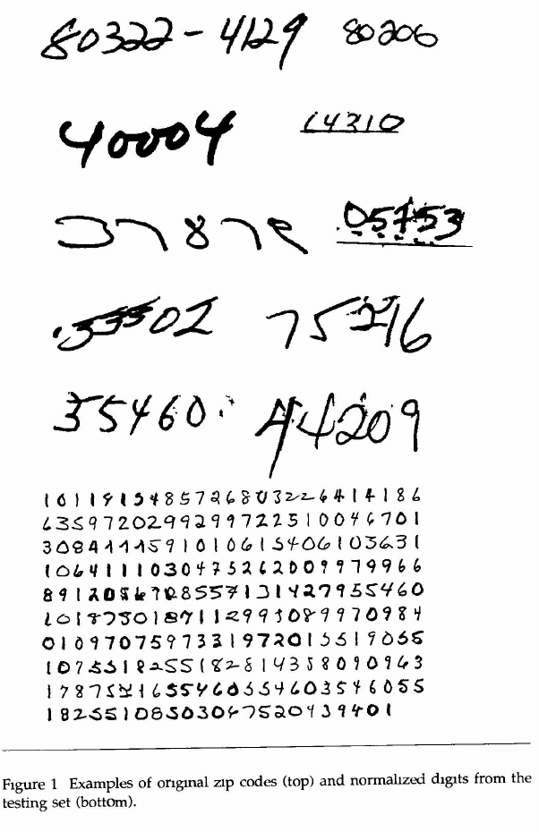

然后通过卷积神经网络和反向传播计算,我们会得到10个数字的概率输出:


- 如果你阅读过<< Deep Learning From Scratch>>的话,就会发现这正是这本书前几章所用的例子,换句话说,作者把这篇论文用简单的语言和代码又翻译了一遍而已.

大概的训练方法:
1. 所有的连接权重（Weights）和偏置（Biases）全部使用均匀分布（Uniform Distribution）进行随机初始化,随机范围严格控制在 $[-\frac{2.4}{F_i}, \frac{2.4}{F_i}]$ 之间
2. 使用MSE(均方误差)来计算误差
3. 使用小批量的SGD算法进行反向传播计算
4. 总训练次数为23轮

>全文的内容大致就是这样,在今天看来是平平无奇的,在当时来看的话那可真的是天纵英才的设计啊.

## Finding Structure in Time(1990)

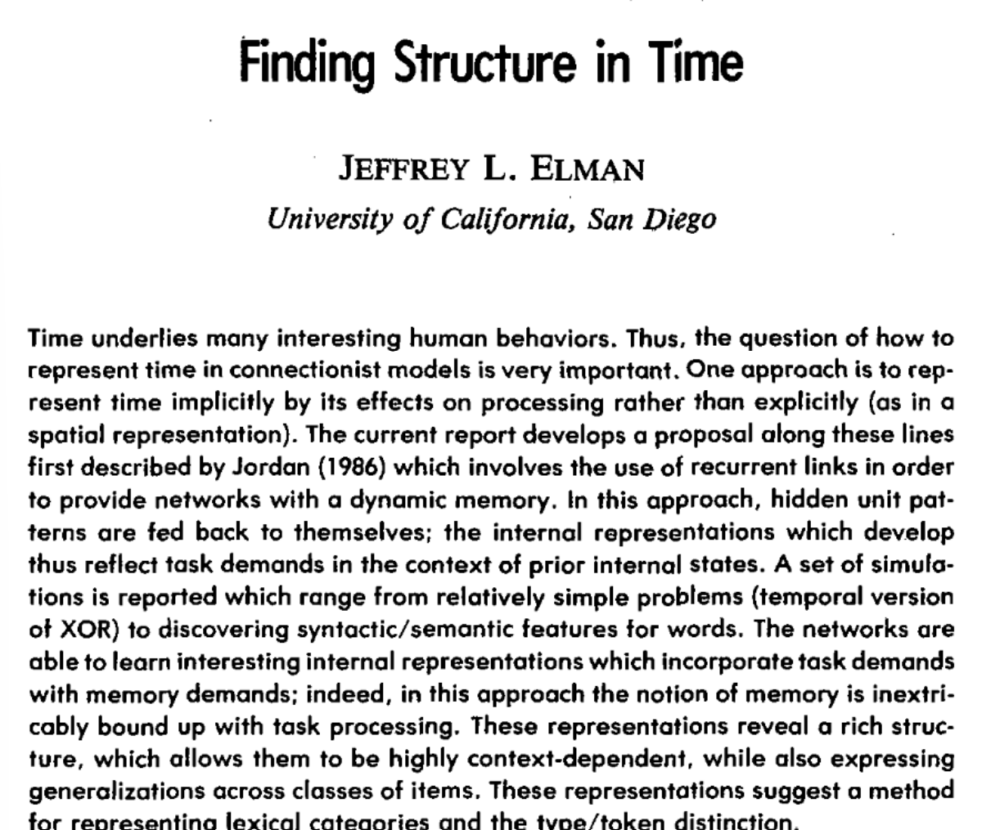
### 引言
具有时间顺序的数据(后简称时序数据)在实际生产中很常见,但以往的模型最常用的方法是,将不同时间的数据拆分到一个序列中输入,也就是以空间换时间,但作者提出,我们不应该把时间看作一个额外的输入维度,而应该在加工数据时就把时间考虑进去.

该论文接下来分为几个部分:
1. 介绍用空间换时间带来的问题(略过不看,因为全是作者的主观论述,没有一点点实际数据的支撑,这在顶刊论文中还是很少见的)
2. 研究方法
3. 实验结果

### 研究方法
作者提出,要能够处理时序数据,最好的解决方法是让模型具有记忆能力.在Jordan(1986)论文的基础上,他设计了这样一个模型:

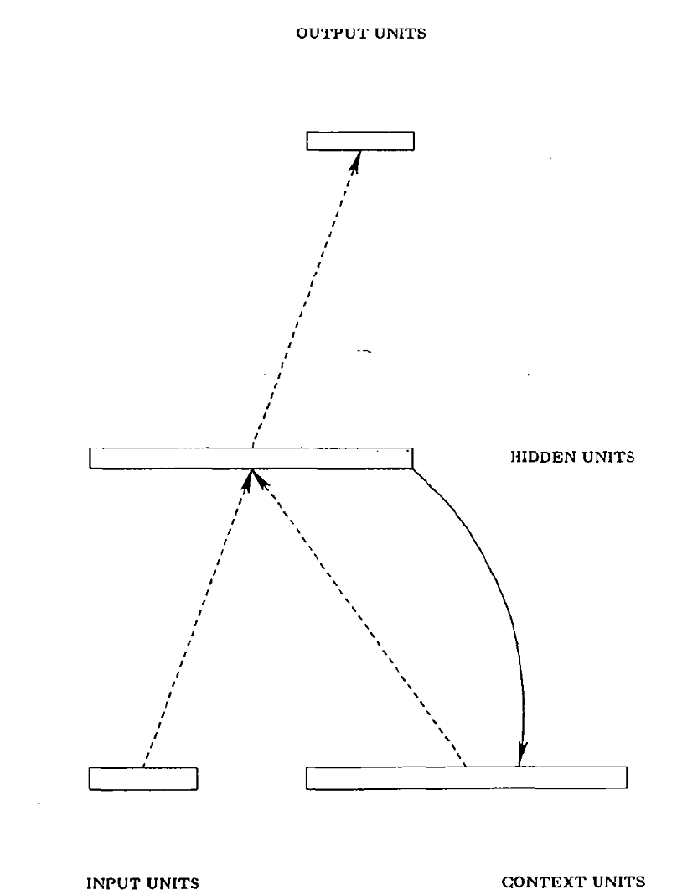

- 如果看过Jordan论文的话就会知道,Elman只是把状态层改成与隐藏层绑定,而非和输出层绑定,这就是唯一的区别,但这样一来,我们就可以让训练参数与输出结果解耦,实现更好的训练效果.

在之后就没有什么内容了,基本都是实验和不痛不痒的论述,重点在于说明这种架构为什么可以适配时序数据,因为相邻的输入确实比距离遥远的输入权重关系更近:


## LONG SHORT-TERM MEMORY(1997)
- 机器学习领域划时代的论文不多,但这篇论文可以算上.
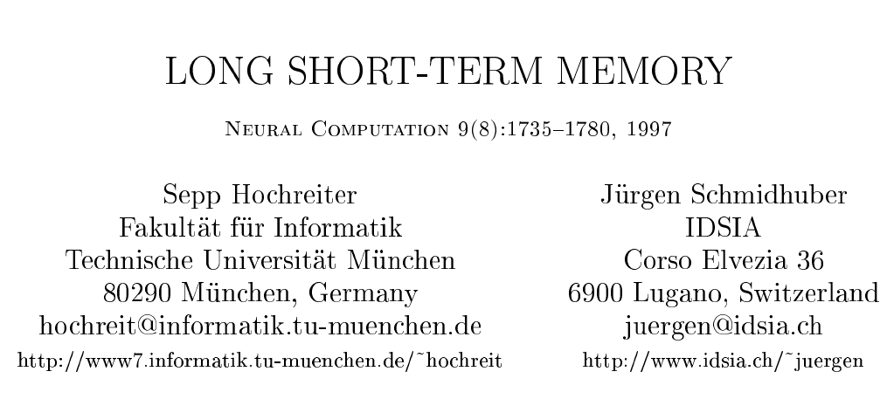

### 总结
尽管这篇论文很经典,但论述实在太专业了,而且理论公式让人看着头疼:


简单来说就是,LSTM将RNN中的隐藏层单元替换成了LSTM单元(Cell);
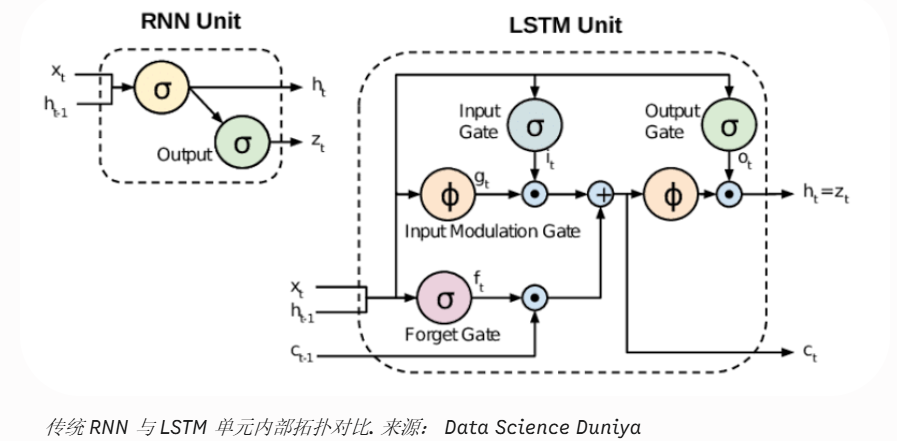

这个单元可以进行循环计算,能够将不同时刻的数据联系起来:
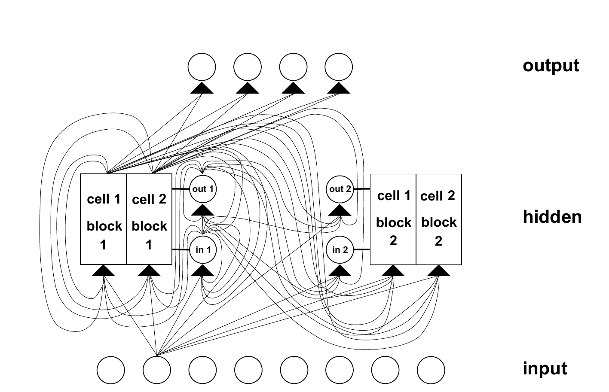

这种架构能够大大加速训练过程,并减少时间间隔过长引发的信息丢失.

>在Transformer诞生之前,LSTM是主流的NLP框架,尽管它能够处理更长的时间步长,但在面对大量的数据时仍然无能无力,所以现在的大模型都不会使用它了.
## A Neural Probabilistic Language Model(2003)
- 这篇论文引入了embedding的雏形概念,是后续NLP模型的必要组成部分.

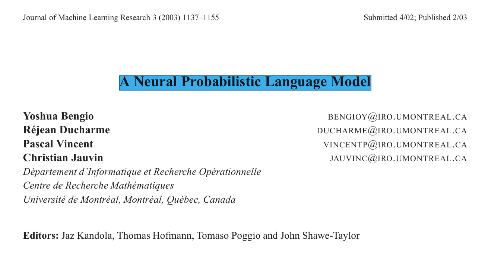
### 引入
>NLP的一大难点在于输入的词向量可能有各种各样的维度,与训练数据完全不同,该论文提出,可以通过训练让模型学会比训练数据多上指数级别的语义相近的实际数据.具体来说就是模型同时学习离散的单词和完整的句子,当出现与训练数据结构类似的句子时也可以很好的做出应对.

- 我已经尽力翻译了,但原文确实太难看懂了,不像是摘要,还是接着看具体实现吧.

传统的词估计方法n-gram(n为上下文词个数,如trigram只看前两个词)无法理解句子之前的相似性,不能将训练集的结果扩展到无数的可能输入中,效果很差.

该论文提出,尽管潜在的词向量维度很大(比如有17000个用于训练的英文单词,每个单词都用one-hot表示,就需要17000个17000维度向量,但有效的信息其实只有一个维度),但我们可以用一个比较小的维度向量来存储单词(例如30,60维):

```text
dog  → [0.12, -0.34, 0.88, ...]
cat  → [0.10, -0.31, 0.85, ...]
table → [-0.56, 0.21, -0.09, ...]
```

但是,这个词向量要怎么训练呢,又如何将这种词向量转换成预测的输出呢,这就需要探究一下该论文的模型架构了.
### 模型架构
输入时,我们可以将句子拆分成一个个英文单词(而非如今常说的token),这些英文单词不再使用高维向量的one-hot表示,而是使用数字编号(例如the对应1,cat对应2).每个数字编号对应一个低维度(30维或者60维)的词向量(如前所说).

最初的词向量是选用特定的随机算法产生的初始值,训练时,会将输入的句子送进神经网络中,得到下一个词的预测概率,如果词表中有17000个词,那么就有17000个输出,概率总和为1,选取概率最大的那个词输出即可.

具体的神经网络结构如下:

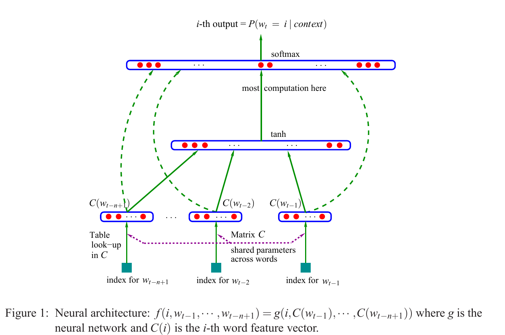

可以看到,我们首先使用tanh函数处理输入的词向量,得到词表中每个词的基本输出分数,再通过softmax计算出最大概率的词是哪个.

>该论文还提出,由于softmax层涉及大量的指数运算,所以需要相对大的算力来进行,可以采用各种各样的并行算法来优化计算.


### 总结
整体原理相当简单,遗憾的是写文章的人相当咬文嚼字,长难句一大堆,不太喜欢把技术实现写明白点.
## Linguistic Regularities in Continuous Space Word Representations(2013)
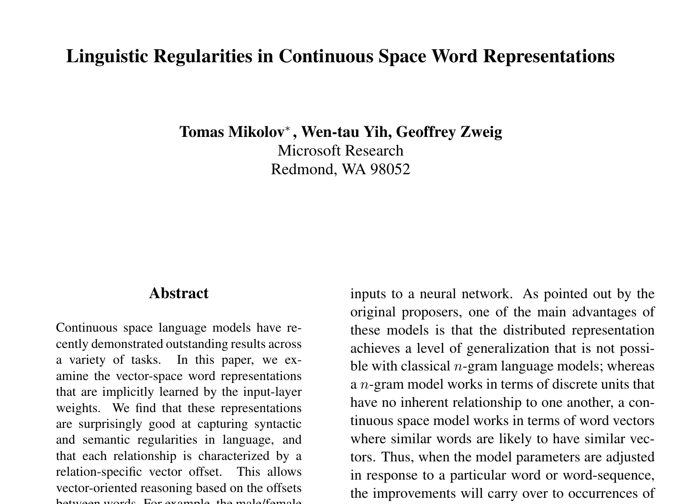
### 概览和总结
该论文提出了一种词向量相似性的计算方法: The Vector Offset Method,如果两对词向量对应的词语语义相近,那么它们在词向量上的分布也是相近的,例如:

$$\text{king} - \text{man} + \text{woman} \approx \text{queen}$$

具体的方法就是通过其他三个向量计算出目标向量:

**y=xb​−xa​+xc​**

词表中于y余弦相似度最高的词即为目标词向量.

该论文通过实验证明,如果词向量的维度越高,计算出来的相似词的准确度就越高,部分解答了为什么词向量能够对应现实文本的语义,为后续的模型训练提供了一定的理论依据.

## Efficient Estimation of Word Representations in Vector Space(2013)

### 模型架构
在03年那篇论文的基础上,该论文提出了两种新的简化模型架构: **CBOW(Continuous Bag-of-Words Model)**和**Skip-gram**,架构图如下:


>CBOW根据上下文语境预测中间词,而Skip-gram根据中间词预测上下文


## Dropout: A Simple Way to Prevent Neural Networks from Overfitting(2014)(待补充)

- 在一大堆公司冠名的论文中突然冒出来一个多伦多大学还是很惊艳的

## Learning Phrase Representations using RNN Encoder–Decoder for Statistical Machine Translation(2014)


- 这篇论文可能是最早提出编码器-解码器架构的,但我也不太确定.

### 总结

>该论文提出了用两个循环神经网络(RNN)组成的编码器-解码器架构,编码器将输入数据处理成固定长度的向量,解码器将向量处理成输出数据.


在此之上,论文还提出了一个LSTM单元的简化版本作为RNN的隐藏层,是后续GRU(Gated Recurrent Unit)的雏形:


完整的流程如下:
1. 编码器不断读取输入,将其处理成固定长度的向量
2. 解码器根据向量逐个输出预测值,最大化下一个词的条件概率,每个预测值都与之前的所有输入相关:

$$P(y_t \mid y_1, ..., y_{t-1}, c)$$


由于当时SMT(statistical machine translation)是主流的NLP模型,所以该论文仅仅是把这个新架构作为SMT的补充部分,没有预想到它的潜力会有这么大.


## Sequence to Sequence Learning with Neural Networks(2014)

### 概括与总结
该论文提出,可以使用两个多层的LSTM网络,一个用于将输入序列(sequence)编码成固定长度的词向量,另一个用于将词向量解码成输出序列.与上一篇论文相同,也是拿把英语翻译成法语的任务来做实验.

- 这篇论文基本贡献只是把上一篇论文中的RNN隐藏层换成了LSTM单元,彻底脱离了SMT system,尽管如此,它的影响力还是比较大的,后续论文尊称该论文的模型架构为seq2seq模型.


## ADAM: A METHOD FOR STOCHASTIC OPTIMIZATION(2015)
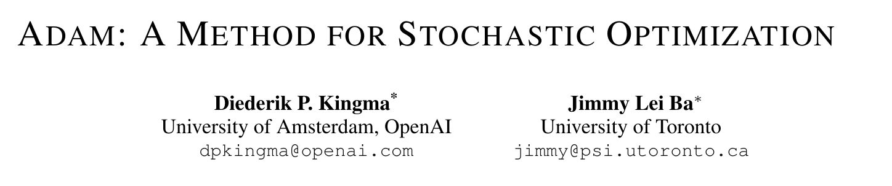
- 这篇2015年的论文提出了一种新的神经网络学习方法:ADAM,是两年后推出的Transformer模型的核心算法,还是很有必要了解的
- (2026/4): 第一次读论文,也不知道怎么读,总不至于全部复制过来再逐个翻译吧,想了想还是读完全文后做一点要点总结算了.

### 引入
>在机器学习中,常见的优化算法都属于一阶方法**first-order methods**,即只使用目标函数(例如损失函数)的一阶导数(例如梯度)来更新参数.其中,随机梯度下降法**stochastic gradient descent (SGD)**是最著名也是非常有效的学习方法.

本文提出的Adam算法同样也是一个随机最优化(**stochastic optimization**)的一阶算法,它的名字来源于`adaptive moment estimation`.

该算法借鉴了两个优秀算法的长处:
1. AdaGrad,于2011年提出,可以很好地处理稀疏梯度(即梯度向量中绝大多数元素为0的情况)
2. RMSProp,于2012年提出,能够很好地处理小批量训练?(on-line)和非平稳环境(not-stationary).
### 算法实现
### 伪代码
$$\begin{array}{l}
\hline \mathbf{Algorithm\ 1:} \text{ Adam, our proposed algorithm for stochastic optimization. See section 2 for details,} \\
\text{and for a slightly more efficient (but less clear) order of computation. } g_{t}^{2} \text{ indicates the elementwise} \\
\text{square } g_{t} \odot g_{t} \text{. Good default settings for the tested machine learning problems are } \alpha=0.001, \\
\beta_{1}=0.9, \beta_{2}=0.999 \text{ and } \epsilon=10^{-8} \text{. All operations on vectors are element-wise. With } \beta_{1}^{t} \text{ and } \beta_{2}^{t} \\
\text{we denote } \beta_{1} \text{ and } \beta_{2} \text{ to the power } t . \\
\hline \mathbf{Require:} \alpha: \text{Stepsize} \\
\mathbf{Require:} \beta_{1}, \beta_{2} \in[0,1): \text{Exponential decay rates for the moment estimates} \\
\mathbf{Require:} f(\theta): \text{Stochastic objective function with parameters } \theta \\
\mathbf{Require:} \theta_{0}: \text{Initial parameter vector} \\
\quad m_{0} \leftarrow 0 \text{ (Initialize } 1^{\text {st }} \text{ moment vector)} \\
\quad v_{0} \leftarrow 0 \text{ (Initialize } 2^{\text {nd }} \text{ moment vector)} \\
\quad t \leftarrow 0 \text{ (Initialize timestep)} \\
\quad \mathbf{while} \ \theta_{t} \text{ not converged } \mathbf{do} \\
\quad\quad t \leftarrow t+1 \\
\quad\quad g_{t} \leftarrow \nabla_{\theta} f_{t}\left(\theta_{t-1}\right) \text{ (Get gradients w.r.t. stochastic objective at timestep } t) \\
\quad\quad m_{t} \leftarrow \beta_{1} \cdot m_{t-1}+\left(1-\beta_{1}\right) \cdot g_{t} \text{ (Update biased first moment estimate)} \\
\quad\quad v_{t} \leftarrow \beta_{2} \cdot v_{t-1}+\left(1-\beta_{2}\right) \cdot g_{t}^{2} \text{ (Update biased second raw moment estimate)} \\
\quad\quad \widehat{m}_{t} \leftarrow m_{t} /\left(1-\beta_{1}^{t}\right) \text{ (Compute bias-corrected first moment estimate)} \\
\quad\quad \widehat{v}_{t} \leftarrow v_{t} /\left(1-\beta_{2}^{t}\right) \text{ (Compute bias-corrected second raw moment estimate)} \\
\quad\quad \theta_{t} \leftarrow \theta_{t-1}-\alpha \cdot \widehat{m}_{t} /\left(\sqrt{\widehat{v}_{t}}+\epsilon\right) \text{ (Update parameters)} \\
\quad \mathbf{end\ while} \\
\quad \mathbf{return} \ \theta_{t} \text{ (Resulting parameters)} \\
\hline
\end{array}$$

有几个专业名词不太好懂:
1. first moment: 一阶矩,即梯度的期望(均值)
2. second raw moment: 二阶原始矩,不对数据减去均值直接求平方期望,若减去均值在求平方期望,则称为中心矩(即方差)
3. `exponential decay rates`: 指数衰减率,衰减率越大参数更新越慢,之所以叫指数是因为某一时刻的值是先前所有历史值的加权和:
   - $$V_t = (1-\beta)(g_t + \beta g_{t-1} + \beta^2 g_{t-2} + \beta^3 g_{t-3} + \dots)$$


- 大概这种论文都有一个伪代码来简单的解释自己算法的整个流程吧,乍一看有点懵,实际上确实比看文字更好懂一点
### 具体原理
>The stochasticity might come from the evaluation at random subsamples (minibatches)
of datapoints, or arise from inherent function noise.

- 之所以说这个算法是随机的,是因为它的数据可能是一个随机的小批量抽取,或者说数据本身存在噪音

> However, these moving averages are
initialized as (vectors of) 0’s, leading to moment estimates that are biased towards zero, especially
during the initial timesteps, and especially when the decay rates are small (i.e. the βs are close to 1).

- 由于m和v的初始值被置为0,所以在函数刚起步的时候,特别是当衰减率也很低(β接近1)时,会导致矩估计(均值)偏向0,导致学习失败.

>因此,我们需要用一点技巧来克服这个问题,这会在下一章被解决.

- 看了一个小时,明天再来,看论文确实很累
### 误差修正
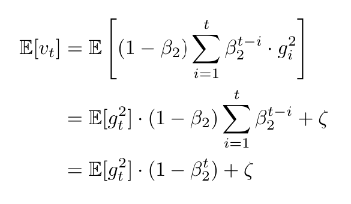
通过一个简单的等比数列求和,我们发现某一时刻的梯度被缩小到了真实值的$(1 - \beta_2^t)$ 倍,所以在伪代码中我们会在计算出两个参数后对其进行误差修正.

### 4个实验
选取的实验都是非常经典的模型,而不是像某些垃圾论文一样用一些奇怪的数据集在奇怪的模型上训练.

- training cost: 指的就是损失函数值
#### LOGISTICR EGRESSION

#### MULTI-LAYER NEURAL NETWORKS

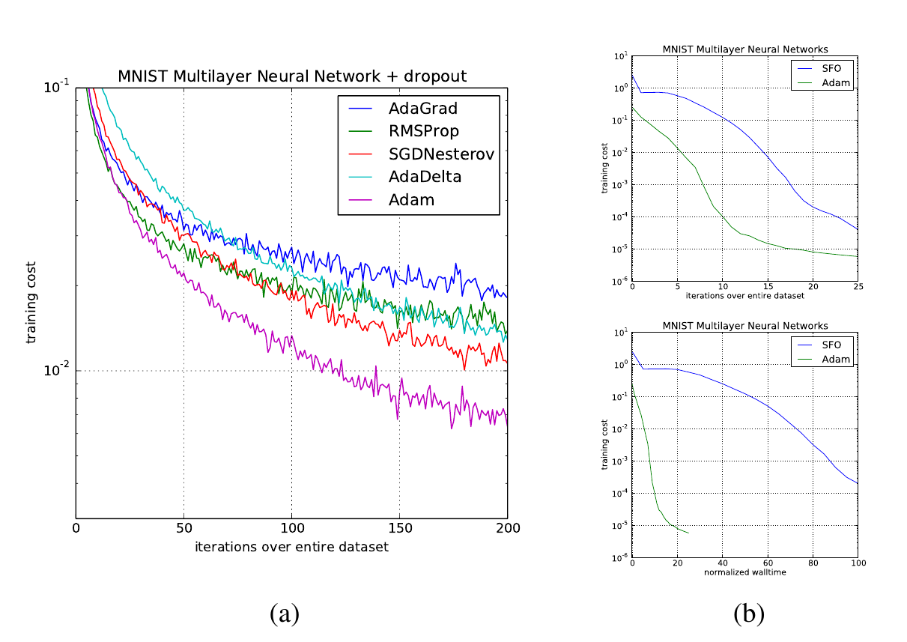
#### CONVOLUTIONAL NEURAL NETWORKS

#### BIAS-CORRECTION TERM
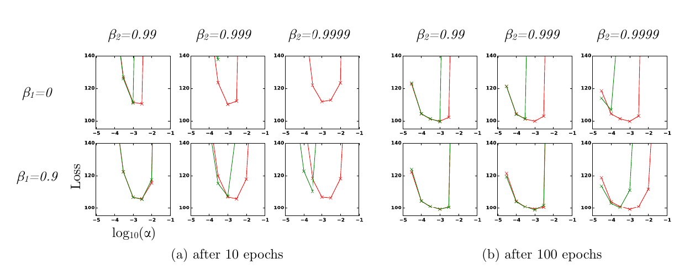

基本都是全方位打压以前的反向传播算法
### 结论
- 有个扩展的AdaMax算法被我忽略掉了
- 附录也被我省略了,数学不好的人是看不得这种东西的
  - 

>The method combines the advantages of
two recently popular optimization methods: the ability of AdaGrad to deal with sparse gradients,
and the ability of RMSProp to deal with non-stationary objectives. 
>
>The method is straightforward
to implement and requires little memory. 

>The experiments confirm the analysis on the rate of convergence in **convex problems**.
>
>Overall, we found Adam to be **robust and well-suited to a wide range of non-convex optimization problems** in the field machine learning.

第一篇论文看下来的感受还是挺好的,既没有什么宏大叙事,也没有多少弯弯绕绕,很清楚的把一个算法的前前后后都讲清楚了,非常推荐阅读.
## Batch Normalization: Accelerating Deep Network Training by Reducing Internal Covariate Shift(2015)
- 影响非常深远的BN方法就是这篇论文提出的

### 概览与总结
>在深层神经网络中,由于位置靠后的层在训练时总是需要根据位置靠前的层的参数的变化而调整,会严重拖累训练的进度,这种现象被称为**Internal Covariate Shift**,大意为,其他层的变化导致该层也不得不变化而产生的训练偏差.
>
>因此,该论文提出可以使用Batch Normalization来处理训练时输入的mini-batch,从而加速训练和减少偏差,实际的应用效果也非常好.

**核心算法步骤**

对于一个拥有 $m$ 个样本的小批量（Mini-batch）数据 $\mathcal{B} = \{x_{1...m}\}$：

1. **计算批次均值**（Mini-batch Mean）：

$$\mu_{\mathcal{B}} = \frac{1}{m} \sum_{i=1}^{m} x_i$$


2. **计算批次方差**（Mini-batch Variance）：

$$\sigma_{\mathcal{B}}^2 = \frac{1}{m} \sum_{i=1}^{m} (x_i - \mu_{\mathcal{B}})^2$$


3. **标准化**（Normalize）：

$$\hat{x}_i = \frac{x_i - \mu_{\mathcal{B}}}{\sqrt{\sigma_{\mathcal{B}}^2 + \epsilon}}$$


*注：$\epsilon$ 是一个为了防止分母为0而加入的极小常数。*
4. **缩放与平移**（Scale and Shift）：

$$y_i = \gamma \hat{x}_i + \beta$$

*注：$\gamma$ 和 $\beta$ 是网络需要学习的标量参数。*

>实际上确实是很简单的处理,但偏偏就是很有效.


## Deep Residual Learning for Image Recognition(2015)
- 深度残差网络在2015年的ImageNet比赛中问世,成功击败了所有的竞争模型,一举夺魁.


### 概览与总结
仅仅是普通的加深网络层数未必会让训练效果更好,甚至会反过来让训练效果变差,该论文提出可以引入一个**残差学习框架**,这个框架基于以下原理:

假设有一个56层的网络,那么我们可以让前20层于普通的20层网络一样训练,后36层只做恒等映射,直接输出原值,那么这样加深多少层理论上都不可能会比原来的训练效果更差,如果我们对这些恒等映射层做一些简单的正向优化,那么训练结果就一定比20层网络更好.

实际的优化做法相当简单,更改附加层的训练目标即可:

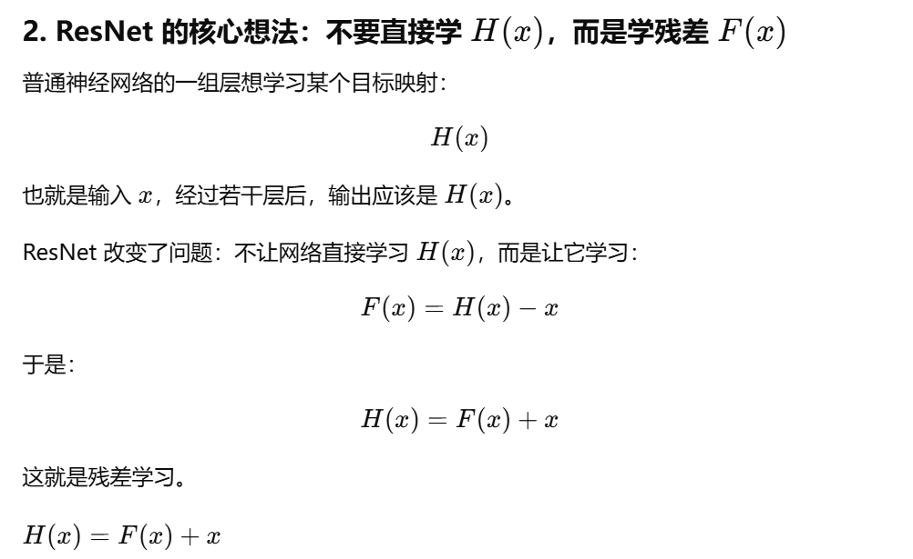


该框架后来被称为**Deep residual network**,简称为**ResNet**.

- 至于要看具体是怎么做的,该论文提供了[github仓库](https://github.com/kaiminghe/deep-residual-networks),还是很不错的

>后续的<< Identity Mappings in Deep Residual Networks(2016) >>中这四个作者对ResNet做了进一步的分析,并提出了一个优化版本.
## Neural Machine Translation by Jointly Learning to Align and Translate(2016)
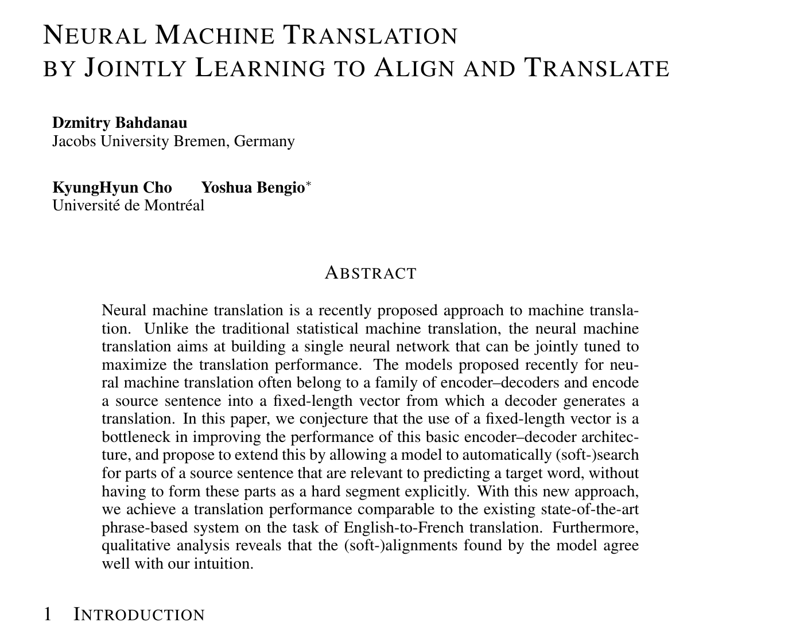
- 首先提出注意力机制的论文
### 概览与总结
>两年前提出的RNN 编码器-解码器架构很难应付长难句,该论文提出,解码器不应该在输出时关注前后的几个单词和以往输出,而是应该**聚焦于句子中与当前要输出的向量关联最大的部分**和以往输出.
>
>为了实现这个目的,该论文在编码器部分进行了特别的处理,不再针对一个输入生成一个特定的输出向量,而是针对输入中的每个单词都生成一个特定的向量h_i.
>
>对于解码器的每一个输出单词y_t,它都会在考虑之前的输出的基础上,还考虑输入中的每个单词对应的向量h_i与该输出单词的关系.


- 实际做法还是通过softmax计算每个向量h_i对于这个输出单词y_t的贡献,并做加权求和,而不是只选取贡献最大的向量h_i.

## Attention Is All You Need(2017)(待补充)


- (5/29): 为了能够看懂这篇威名远扬的论文,我作为一个完全的小白,在阅读完入门书后,又前前后后花了20天阅读前人的研究成果,终于得以一瞥这一横空出世的集大成者.
- (5/30): 成功败下阵来,信息密度太大了,在了解了前面这么多历史文献的情况下,我看这篇论文依然觉得很难受,待我过段时间再来研究


### 引言
该论文提出,我们完全不需要依赖RNN的循环单元或者CNN的卷积层,只用注意力机制就可以很好地解决输入与输出之间的依赖关系.

### 模型架构


1. Encoder: 由6个完全相同的层堆叠而成,每层由两个子层构成,一个是多头的注意力计算单元,一个是简单的全连接层,在这两个子层后,都跟着一个残差网络和正规化层,最终输出一个512维的向量
2. Decoder: 同样由6个完全相同的层堆叠而成,在编码器的基础上多加了一个子层,用于在推理时处理之前的输出和在训练时喂入标准答案
## Deep contextualized word representations(2018)
## Improving Language Understanding by Generative Pre-Training(2018)

- GPT-1
### 引入
>先前的模型架构都只适配于单一的任务,针对不同的任务都要提供不同的标注好了的训练数据和参数.该论文提出,我们可以通过将自监督的预训练和有监督的调参结合起来,让模型能够只做很小的改动就可以适应各种各样的任务.
>
>具体来说,就是把模型训练分为两步,第一步只使用未标注的数据来初始化模型,第二步才针对不同的任务使用不同的标注数据进行调参.

- 事实上,如文中所承认的那样,GPT的做法并不新颖,前人已经把**Unsupervised pre-training**用在了LSTM模型上,GPT只是把这个方法挪用到了Transformer上而已.
### 训练过程
#### Unsupervised pre-training
对于文本补全任务来说,我们只需要用到Transformer的后半部分,也就是解码器就足够了,论文中实际上也是这么做的.

>Given an unsupervised corpus of **tokens** $\mathcal{U} = \{u_1, \dots, u_n\}$, we use a standard language modeling objective to **maximize the following likelihood**:

$$L_1(\mathcal{U}) = \sum_i \log P(u_i|u_{i-k}, \dots, u_{i-1}; \Theta)$$

>where $k$ is **the size of the context window**(这也是这几年的大模型着重强化的部分), and the **conditional probability** $P$ is modeled using a neural network with parameters $\Theta$. These parameters are trained using stochastic gradient descent.

- 之所以要取log(这实际上是自然对数),是因为我们最终需要计算所有输出token的条件概率的乘积,使用log可以把乘法变成加法,简化运算

上面只是训练的最终目标,而训练的中间过程可以用三个公式概括:

$$\begin{aligned}
h_0 &= UW_e + W_p \\
h_l &= \text{transformer\_block}(h_{l-1}) \forall i \in [1, n]  \\
P(u) &= \text{softmax}(h_n W_e^T)
\end{aligned}$$

>where $U = (u_{-k}, \dots, u_{-1})$ is the context vector of tokens, $n$ is the number of layers, $W_e$ is the token embedding matrix, and $W_p$ is the position embedding matrix.

第一步将token变成带有位置信息的向量,第二步通过多层的transformer进行迭代计算,得到针对每个要输出token位置的"注意力向量",第三步使用softmax查找与该"注意力向量"最匹配的那个token并输出.

- 实际上来说就是把Attention那篇论文重新阐述了一遍,把原理讲的更清晰了.

总的来说,这一步的预处理最大化地应用了Transformer的结构优势,因为Transformer的解码器架构由于带有mask层,天生就适合用来进行自我监督训练.
#### Supervised fine-tuning

>We assume a labeled dataset $\mathcal{C}$, where each instance consists of a sequence of input tokens, $x^1, \dots, x^m$, along with a label $y$. 
The inputs are passed through our pre-trained model to obtain the final transformer block's activation $h_l^m$, which is then fed into an added linear output layer with parameters $W_y$ to predict $y$:

$$P(y|x^1, \dots, x^m) = \text{softmax}(h_l^m W_y)$$

>This gives us the following objective to maximize:

$$L_2(\mathcal{C}) = \sum_{(x,y)} \log P(y|x^1, \dots, x^m)$$

- 实际上这与前面的步骤完全相同,只不过这次提供的语料是标注好了的而已.
## BERT: Pre-training of Deep Bidirectional Transformers for Language Understanding(2019)

- BERT: Bidirectional Encoder Representations from Transformers

### 引入
>There are two existing strategies for applying pre-trained language representations to downstream tasks: feature-based and fine-tuning. The feature-based approach, such as ELMo (Peters et al., 2018a), uses task-specific architectures that include the pre-trained representations as additional features.
>
>The fine-tuning approach, such as the Generative Pre-trained Transformer (OpenAI GPT) (Radford et al., 2018), introduces minimal task-specific parameters, and is trained on the downstream tasks by simply fine-tuning all pre-trained parameters.
>
>The two approaches share the same objective function during pre-training, where they use unidirectional language models to learn general language representations.

### 模型架构


BERT使用了Transformer的编码器部分,除了参数上有更改外,基本架构没有任何改动.

由于编码器是用来处理语料输出向量的,我们需要在编码器的输出部分加上一个OUTPUT LAYER,根据不同的任务调整不同的输出目标.

鉴于编码器的架构天生就适合处理文本,所以BERT适合文本分类,情感分析等文本处理任务,而不太适合文本生成任务.

## Language Models are Unsupervised Multitask Learners(2019)
- GPT-2

### 概览与总结
>如标题所说的那样,该论文认为,当语言模型大到一定程度时,甚至可以不需要任何标注数据集来进行微调,而是可以全部使用未经过标注的自然语料来训练,这是对GPT-1的一个大胆革新.

GPT-2的基本架构与GPT-1没有什么区别,值得注意的地方就是把上下文长度从512扩充到了1024个token(军备竞赛的开端...),然后更改了一下模型层的摆放,微调了一点参数.

但是,之所以它能够在多个测试中表现优良,是因为它的参数大小:1.5B! 足足有15亿个参数,最大的原因就是GPT-2将GPT-1中的6层重叠变成了48层重叠.

>这么恐怖的参数量让深度学习不再是以往那个普通的样子了,成为了一个没有人能够纵览全局的黑箱.

- OpenAI提供了gpt-2的示例代码,使用`git clone https://github.com/openai/gpt-2.git`下载即可查阅
  - 是用tensorflow实现的,所以看起来会不太习惯

## CodeBERT: A Pre-Trained Model for Programming and Natural Languages(2020)
## Language Models are Few-Shot Learners (2020)
- GPT-3
- 一年一篇突破性论文,你不发财谁发财.


### 概览与总结
- 由于GPT-2的标题已经把话说满了,所以GPT-3就找不到什么好词来当标题了,实际上这个标题和真实的论文内容没什么关系


简单说,GPT-3就是把GPT-2的参数扩充到了175B,也就是接近2000亿个参数,这是通过把堆叠层增加到了96和把上下文长度从1024提高到2048个token实现的,其他的结构几乎没有任何改动.

可是,就是这样的暴力堆叠参数,产生了令人惊讶的突破性成果,模型的泛化能力远超出了普通的NLP模型所能处理的范围.尽管模型实质上还是在对提示词做文本补全,但它的输出变得越来越合理,就好像它真的理解了你在说什么一样.

这篇论文证明了,即便不使用监督数据进行处理,具有大量参数的模型光依靠高质量的数据集就足够实现各种各样的文本任务了.

也是因为这篇论文,后续的大参数语言模型都被称为**大语言模型(large language model).**
## Evaluating Large Language Models Trained on Code(2021)
## Retrieval-Augmented Generation for Knowledge-Intensive NLP Tasks(2021)
- 在Agent构建中被广泛应用的RAG概念就是这篇2021年的论文提出的


### 摘要
>由于预训练的模型针对特定的语料时的表现较差,研究人员引入了**retrieval-augmented generation**模型,它使用了预训练的seq2seq模型(于2014年提出的编码器-解码器模型)和未被模型学习过的Wikipedia语料,这种模型比单独的预训练模型和专门针对Wikipedia语料训练的模型效果还要好.

### 引入
>由于预训练好的模型不能轻易的扩展或者修改参数,所以有研究者提出了将预训练模型和外部语料结合在一起的混合模型架构,如REALM和ORQA模型,而RAG架构就是在这些研究的基础上提出来的.

>We build RAG models where the parametric memory is a pre-trained seq2seq transformer, and the
non-parametric memory is a dense vector index of Wikipedia, accessed with a pre-trained neural retriever.

### 原理
- RAG的具体原理确实比较复杂,怪不得这么缺这方面的人才.
- 这部分的原文不太像人话,就算是论文也请你写的正常一点吧...
- 更别提整篇论文只有一张说明图,和一两张实验图表,你好意思去上顶刊,去评优秀论文吗😀
```md

## RAG 核心模型架构

RAG（Retrieval-Augmented Generation）模型结合了**参数化记忆**（Generator）与**非参数化记忆**（Retriever）。其核心逻辑是利用输入序列 $x$ 检索文档 $z$，并将 $z$ 作为生成目标序列 $y$ 的额外上下文。

模型包含两个组件：

1. **检索器 $p_\eta(z|x)$**：给定查询 $x$，返回文本段落的分布（通常取 Top-K）。
2. **生成器 $p_\theta(y_i|x, z, y_{1:i-1})$**：基于原始输入 $x$、检索到的文档 $z$ 以及已生成的 $i-1$ 个token，生成当前token $y_i$。


## 处理潜在变量 $z$ 的两种方式

为了实现端到端训练，文档 $z$ 被视为**潜在变量（Latent Variable）**。根据对 $z$ 边缘化（Marginalize）方式的不同，分为两种模型：

### 1. RAG-Sequence 模型

该模型假设生成整个序列时使用的是**同一篇文档**。它将 $z$ 视为单个潜在变量，通过对 Top-K 文档的概率进行求和来计算 $p(y|x)$：

$$p_{\text{RAG-Sequence}}(y|x) \approx \sum_{z \in \text{top-k}(p(\cdot|x))} p_\eta(z|x) p_\theta(y|x, z) = \sum_{z \in \text{top-k}(p(\cdot|x))} p_\eta(z|x) \prod_i^N p_\theta(y_i|x, z, y_{1:i-1})$$

### 2. RAG-Token 模型

该模型允许在生成每个token时**切换文档**。生成器可以从多个文档中挑选内容来组织答案：

$$p_{\text{RAG-Token}}(y|x) \approx \prod_i^N \sum_{z \in \text{top-k}(p(\cdot|x))} p_\eta(z|x) p_\theta(y_i|x, z, y_{1:i-1})$$


## 关键组件实现

### 检索器：DPR (Dense Passage Retriever)

检索概率基于双编码器（Bi-encoder）架构：


$$p_\eta(z|x) \propto \exp(d(z)^\top q(x))$$

* $d(z) = \text{BERT}_d(z)$：文档编码。
* $q(x) = \text{BERT}_q(x)$：查询编码。
检索过程通过 **MIPS（最大内积搜索）** 在线性时间内完成。

### 生成器：BART

使用预训练的 **BART-large**（seq2seq Transformer）。处理时直接将输入 $x$ 与检索内容 $z$ 进行拼接。

## 训练与解码

### 训练 (Training)

* **目标函数**：最小化负边际对数似然 $\sum_j -\log p(y_j|x_j)$。
* **更新策略**：为了降低计算成本，不更新文档编码器 $\text{BERT}_d$ 和索引，仅微调查询编码器 $\text{BERT}_q$ 和生成器 $\theta$。

### 解码 (Decoding)

* **RAG-Token**：可以视为标准的自回归模型，直接使用标准**束搜索（Beam Search）**。
* 转移概率：$p'_\theta(y_i|x, y_{1:i-1}) = \sum_{z \in \text{top-k}(p(\cdot|x))} p_\eta(z|x) p_\theta(y_i|x, z, y_{1:i-1})$。


* **RAG-Sequence**：由于似然函数无法分解为单token概率，需针对每个文档 $z$ 分别运行束搜索，得到候选集 $Y$。
* **Thorough Decoding**：对不在某些文档束中的候选序列进行额外的正向传播计算，补全概率后求和。
* **Fast Decoding**：假设未在某文档束中出现的序列概率为 0，直接在现有候选集中求和，提高效率。
```

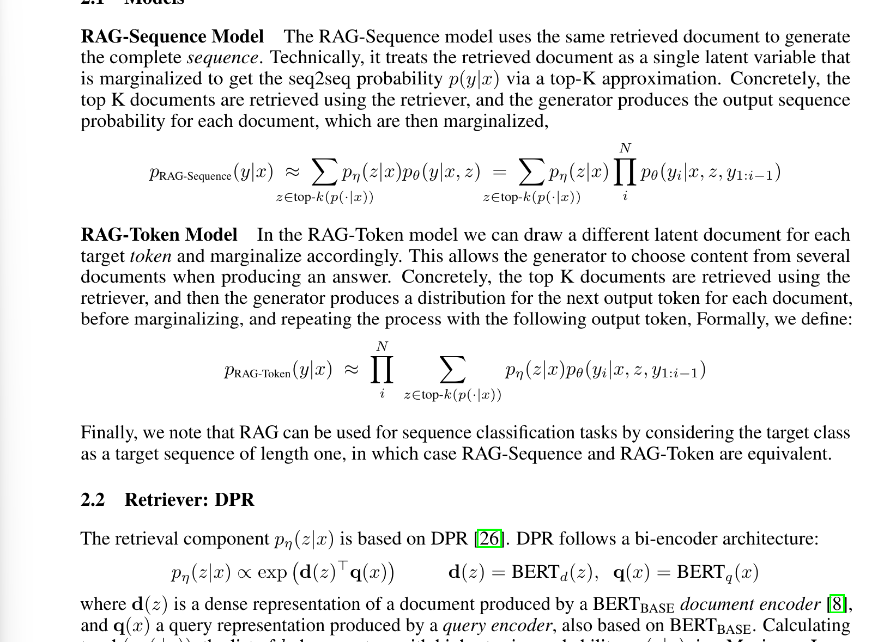
- 这种东西没人看了不迷糊吧,真搞算法的话还是很难的

大致意思是,我们可以用两种方法实现RAG,一个是一口气生成完整答案的,一个是逐token参考文档生成答案的,第二种方案中,预训练模型在每生成一个token时会参考前文和多个文档语料,选择最优的文档语料来生成.

具体的原理如下:

我们将本地文档切分成短片段,存储在向量数据库中,当用户提问时,我们把用户输入向量和文档向量组合拼接起来,再喂给模型让它输出.

问题来了,我们输入的本地文档可能非常庞大,超过了模型的上下文限制,不可能也直接输入进去.我们需要**通过检索器进行快速的筛选**,找到与用户提问最符合的几个文档向量后再进行拼接.

检索器的实现原理还比较简单:

$p_{\eta}(z|x) \propto \exp(d(z)^\top q(x))$
$d(z) = \text{BERT}_d(z)$
$q(x) = \text{BERT}_q(x)$

**1. 向量化（Bi-Encoder 架构）**
检索器使用了两个独立的 BERT 模型：

* **查询编码器 $q(x)$**：把你的提问（Query）转换成一串数字（特征向量）。
* **文档编码器 $d(z)$**：把海量的背景资料（Documents）也转换成相同维度的数字串。


**2. 相似度计算（内积运算）**
公式中的 $d(z)^\top q(x)$ 代表两个向量的**点积**。通俗来说：

* 如果提问和某个文档在语义上越接近，它们生成的数字串在空间中的方向就越一致。
* 方向越一致，点积的数值（得分）就越高。
* $\exp$ 函数的作用是拉大分值差距，让得分高的文档脱颖而出。

**3. 极速筛选（MIPS 问题）**
面对数以亿计的文档，逐一计算点积太慢。该模型将问题转化为**最大内积搜索（MIPS）**, 通过建立特殊的“索引”结构，就能在接近线性的时间内锁定最匹配的前 $k$ 个文档。

至于MIPS怎么实现的?不好意思原文没怎么提😅

### 总结
尽管RAG通俗的解释还是很好理解的,但这篇论文对于具体原理的实现总有一点不情愿解释的感觉,就好像自己也实现不了的样子,而且根据论文中的实验结果来说,很多任务RAG并不是最优解:


真正做Agent的话,RAG的能力还是很有限的,它有以下弊端:
1. 企业要想真正使用RAG,就需要把开源的模型或者自己开发的模型部署好后,在每次针对特定语料库训练时进行参数上的微调,这是很麻烦的,如果不微调的话表现会更差.
   1. 况且这篇论文没怎么讲如何实现参数微调,我有理由怀疑只是把语料喂进去重新训练了而已,而非是在输出端口进行微调.
2. 鉴于大多数企业不具备自主开发优秀大模型的能力,就需要调用第三方的API,调用API的话就不能对模型做手脚,而是要对自己本地的语料进行处理,储存一个向量数据库,并在输出时进行拼接.至于怎么实现,我看也不是很成熟,不然为什么这么缺这方面的人才.


## Training Compute-Optimal Large Language Models(2022)

## Training language models to follow instructions with human feedback(2022)
- InstructGPT,实际基本对应了GPT3.5
  - 在见识到了chatGPT的巨大潜力后,OpenAI不再就新模型阐释任何的技术细节了
## LLaMA: Open and Efficient Foundation Language Models(2023)


### 概览与总结
>
## Instruction Pre-Training: Language Models are Supervised Multitask Learners(2024)
- 很明显,这个标题是对GPT-2的一个强力反击

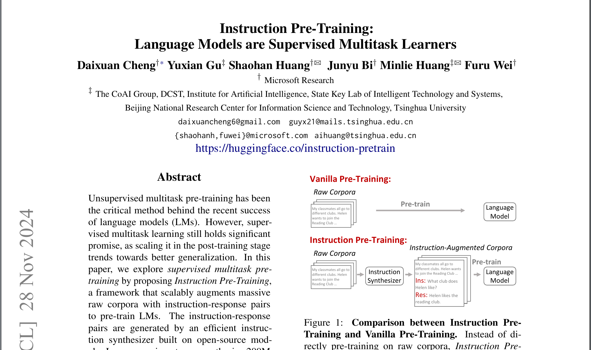

## DeepSeek-R1: Incentivizing Reasoning Capability in LLMs via Reinforcement Learning(2025)
# 计算机视觉论文