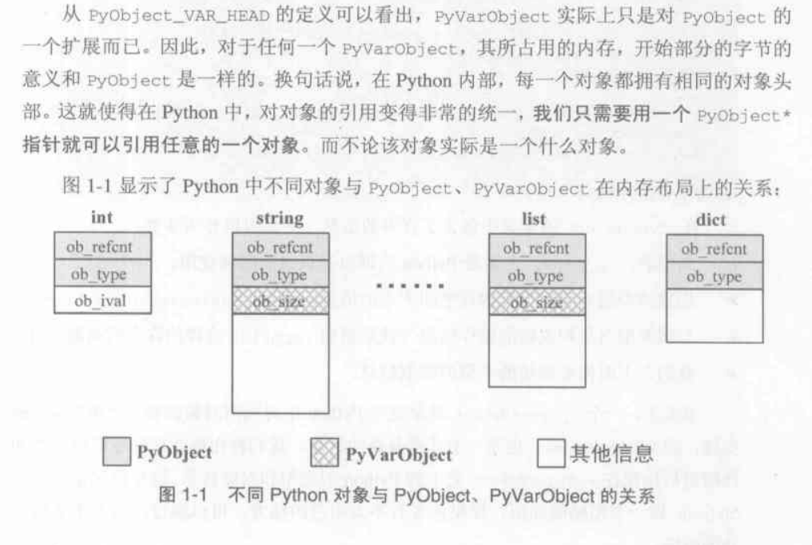

**参考书籍:(python源码剖析:深度探索动态语言核心技术),本书围绕的是06年的python2.5.0**

## 概览(include/object.h)
>我觉得python最明显的优点是自动内存管理,不需要进行垃圾收集,减少了写代码的各种烦恼
### pyobject


>python中所有对象和类型都用pyobject指针类型来表示,可以通过将指针指向不同的内存区域来实现内存区域的扩张与收缩,这也是python之所以能够称为动态语言的本钱,其中pyobject定义如下

```c
#define _PyObject_HEAD_EXTRA		\
	struct _object *_ob_next;	\
	struct _object *_ob_prev;

#define PyObject_HEAD			\
	_PyObject_HEAD_EXTRA		\
	Py_ssize_t ob_refcnt;		\
	struct _typeobject *ob_type;
/*
...
*/
typedef struct _object {
	PyObject_HEAD
} PyObject;
```

- 这里的Py_ssize_t实际上就是 long long,我就说世界是一个巨大的草台班子
```c
typedef ssize_t		Py_ssize_t;
//...
typedef __int64 ssize_t;
```
>而每次pyobject对象A被引用时,引用计数就增加1,当引用对象被删除时,引用计数就减小1,减小到零时就会从堆上被删除
```c

#define _Py_INC_REFTOTAL	_Py_RefTotal++
#define _Py_DEC_REFTOTAL	_Py_RefTotal--
/*
...
*/
#define Py_INCREF(op) (				\
	_Py_INC_REFTOTAL  _Py_REF_DEBUG_COMMA	\
	(op)->ob_refcnt++)
```

```c
#define PyObject_VAR_HEAD		\
	PyObject_HEAD			\
	Py_ssize_t ob_size; /* Number of items in variable part */

typedef struct {
	PyObject_VAR_HEAD
} PyVarObject;
```
>可以看到python里还有一类PyVarObject,用来管理可变长度的容器对象



## PyIntObject
**intobject.h**
```c

/* Integer object interface */

/*
PyIntObject represents a (long) integer.  This is an immutable object;
an integer cannot change its value after creation.

There are functions to create new integer objects, to test an object
for integer-ness, and to get the integer value.  The latter functions
returns -1 and sets errno to EBADF if the object is not an PyIntObject.
None of the functions should be applied to nil objects.

The type PyIntObject is (unfortunately) exposed here so we can declare
_Py_TrueStruct and _Py_ZeroStruct in boolobject.h; don't use this.
*/

#ifndef Py_INTOBJECT_H
#define Py_INTOBJECT_H
#ifdef __cplusplus
extern "C" {
#endif

typedef struct {
    PyObject_HEAD
    long ob_ival;
} PyIntObject;

PyAPI_DATA(PyTypeObject) PyInt_Type;

#define PyInt_Check(op) PyObject_TypeCheck(op, &PyInt_Type)
#define PyInt_CheckExact(op) ((op)->ob_type == &PyInt_Type)

PyAPI_FUNC(PyObject *) PyInt_FromString(char*, char**, int);
#ifdef Py_USING_UNICODE
PyAPI_FUNC(PyObject *) PyInt_FromUnicode(Py_UNICODE*, Py_ssize_t, int);
#endif
PyAPI_FUNC(PyObject *) PyInt_FromLong(long);
PyAPI_FUNC(PyObject *) PyInt_FromSize_t(size_t);
PyAPI_FUNC(PyObject *) PyInt_FromSsize_t(Py_ssize_t);
PyAPI_FUNC(long) PyInt_AsLong(PyObject *);
PyAPI_FUNC(Py_ssize_t) PyInt_AsSsize_t(PyObject *);
PyAPI_FUNC(unsigned long) PyInt_AsUnsignedLongMask(PyObject *);
#ifdef HAVE_LONG_LONG
PyAPI_FUNC(unsigned PY_LONG_LONG) PyInt_AsUnsignedLongLongMask(PyObject *);
#endif

PyAPI_FUNC(long) PyInt_GetMax(void);

/* Macro, trading safety for speed */
#define PyInt_AS_LONG(op) (((PyIntObject *)(op))->ob_ival)

/* These aren't really part of the Int object, but they're handy; the protos
 * are necessary for systems that need the magic of PyAPI_FUNC and that want
 * to have stropmodule as a dynamically loaded module instead of building it
 * into the main Python shared library/DLL.  Guido thinks I'm weird for
 * building it this way.  :-)  [cjh]
 */
PyAPI_FUNC(unsigned long) PyOS_strtoul(char *, char **, int);
PyAPI_FUNC(long) PyOS_strtol(char *, char **, int);

#ifdef __cplusplus
}
#endif
#endif /* !Py_INTOBJECT_H */
```
- 涉及的代码并不长,因此整个贴出来了