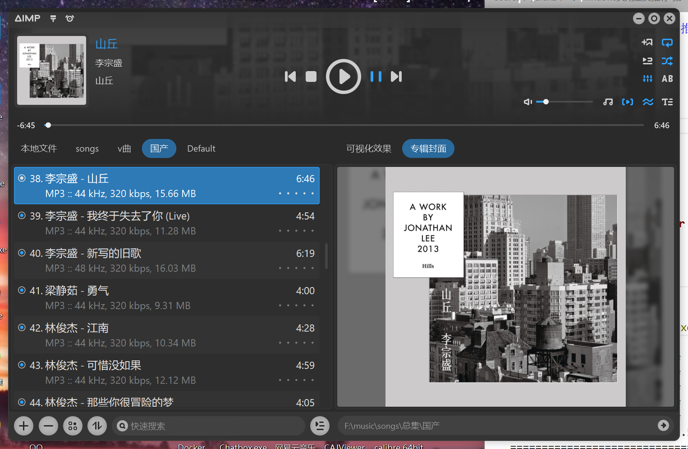
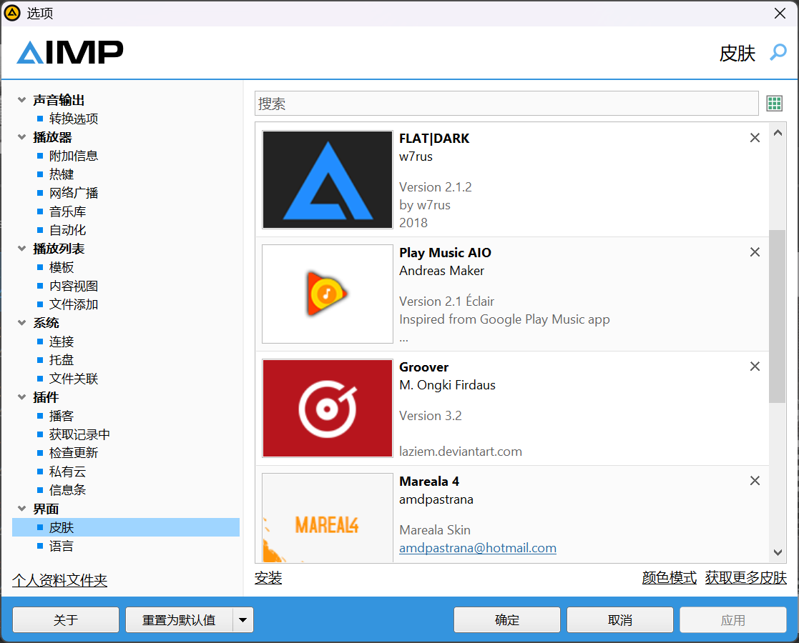

# Windows端
- 把先前的推荐重新整理了一下,方便自己重装电脑时知道要装哪些软件
## Magpie
强大的窗口缩放器,畅玩一切古早游戏.
## ContextMenuManager
不多解释,改注册表还是太麻烦了,用这个快速除去流氓软件的菜单项.
## okular
不多解释,薄纱其他所有的windows pdf阅读器,真正的秒天秒地,我就是想看个pdf要那么多其他功能干什么.另外提一嘴安卓端的阅读神器是readera,同样遥遥领先.
## calibre
支持的书籍格式还是很多的,可惜启动有点慢,太臃肿了,但我找到的SumatraPDF等阅读器由于支持格式少代替不了它.
## Anki 
背单词神器,可以自己定制卡片这点就非常nice.
[有史料为证](https://galgame.dev/topic/639/%E5%85%B3%E4%BA%8E%E6%88%91%E4%B8%80%E5%B9%B4%E4%B8%8D%E5%88%B0%E9%80%9F%E9%80%9An1%E8%BF%99%E4%BB%B6%E4%BA%8B-%E5%9F%BA%E4%BA%8E%E5%95%83%E7%94%9F%E8%82%89galgame%E7%9A%84%E6%97%A5%E8%AF%AD%E5%AD%A6%E4%B9%A0%E6%94%BB%E7%95%A5)

## AIMP

由于网易云启动太慢,加载音乐太卡,很多功能太臃肿了,因此我转而加入AIMP神教,不仅可以自定义界面,还可以下载各式各样的皮肤.运行速度飞快,而且有手机桌面双端.尽管这个软件是离线的,只能下好歌之后再导入,歌词也要自己下,但这一切都值得!


## qView
Windows自己的图片浏览器真的是拉完了,加载慢的离谱,换成qview后就舒服多了,界面简洁的异常,毕竟看个图片而已,要什么名堂.


## 常见
- Everything,PotPlayer,JiJiDown,Motrix,Quicker,Pixpin

# 浏览器插件
## [免费看CSDN付费文章](https://github.com/Mrlimuyu/CSDN-VIP)
```js
// ==UserScript==
// @name         100%解锁CSDN文库vip文章阅读限制
// @namespace    http://tampermonkey.net/
// @version      2.2
// @description  CSDN文库阅读全文，去除VIP文章遮罩
// @author       Mrlimuyu
// @match        *://*.csdn.net/*
// @grant        none
// @license      yagiza
// @downloadURL https://update.greasyfork.org/scripts/495150/100%25%E8%A7%A3%E9%94%81CSDN%E6%96%87%E5%BA%93vip%E6%96%87%E7%AB%A0%E9%98%85%E8%AF%BB%E9%99%90%E5%88%B6.user.js
// @updateURL https://update.greasyfork.org/scripts/495150/100%25%E8%A7%A3%E9%94%81CSDN%E6%96%87%E5%BA%93vip%E6%96%87%E7%AB%A0%E9%98%85%E8%AF%BB%E9%99%90%E5%88%B6.meta.js
// ==/UserScript==

(function() {
    'use strict';

    const adjustArticle = () => {
        // 移除遮罩层和限制高度的内容
        document.querySelectorAll('.hide-article-box, .login-mark, .mask, .vip-caise').forEach(el => el.remove());

        // 展开被限制高度的内容
        const articleContainer = document.querySelector('.article_content');
        if (articleContainer) {
            articleContainer.style.maxHeight = 'none';
            articleContainer.style.height = 'auto';
        }
    };

    // 启用复制功能
    const enableCopy = () => {
        document.body.oncopy = null;
        document.oncopy = null;
        document.querySelectorAll('*').forEach(el => {
            el.style.userSelect = 'auto';
            el.style.webkitUserSelect = 'auto';
            el.style.msUserSelect = 'auto';
            el.style.mozUserSelect = 'auto';
        });
    };

    // 使用MutationObserver来监视文档的变化
    const observer = new MutationObserver((mutations) => {
        mutations.forEach((mutation) => {
            if (mutation.addedNodes.length) {
                adjustArticle();
                enableCopy();
            }
        });
    });

    observer.observe(document.body, {
        childList: true,
        subtree: true
    });

    // 页面加载时尝试执行一次
    window.addEventListener('load', () => {
        adjustArticle();
        enableCopy();
    });
})();
```
- 很难想象这么简单的代码就可以破解成功

尽管CSDN上绝大部分内容都是垃圾,但架不住多年的历史沉淀,还是有些优质的中文文章的,其中还有一部分是付费的,有了这个插件就好办多了

## Powerful Pixiv Downloader
喜欢逛Pixiv的有福了

将图片从内嵌文件夹中提取出来的脚本:
```py
import os
import shutil

src = r"F:\\archive\\pixiv"
dst = r"F:\\output"

for root, dirs, files in os.walk(src):
    for f in files:
        if f.lower().endswith((".jpg", ".jpeg", ".png", ".webp", ".bmp", ".gif")):
            src_path = os.path.join(root, f)
            dst_path = os.path.join(dst, f)
            shutil.copy(src_path, dst_path)
```


## Bypass Paywalls Clean
没钱看外刊的有福了

## uBlacklist
讨厌csdn的有福了,不过一般用Google搜索的话比bing搜索出来的垃圾就是会少很多
```yml
# CSDN
*://*.csdnimg.cn/*
/csdn\.(com|net)/
/gitcode\.(com|net|host)/
# 营销号（标题党、洗稿等低质或错误内容）
*://*.sohu.com/*
*://*.sina.cn/*
*://*.163.com/*
*://*.douyin.com/*
*://www.doubao.com/*
*://*.tiktok.com/*
*://*.toutiao.com/*
*://new.qq.com/*
*://news.qq.com/*
*://cloud.tencent.com/developer/*
*://cloud.tencent.cn/developer/*
*://www.showapi.com/news/*

# 电商平台产品
*://*.taobao.com/*
*://*.1688.com/*
*://www.jd.com/*
*://m.jd.com/*
*://so.m.jd.com/*
*://*.jd.hk/*
*://i-search.jd.com/*
# 抄袭（复制/镜像/同步搬运原创者内容）
*://*.iii80.com/*
*://*.iii80.cc/*
*://i80.free.fr/*
*://iii80.free.fr/*
*://kknews.cc/*
*://read01.com/*
*://shrimpskin.com/*
# AI 生成
*://*.jimowang.com/*
*://docs.pingcode.com/*
*://*.worktile.com/kb/*
*://*.anzhuoe.net/*
*://*.blog.51cto.com/*
*://developer.baidu.com/*
*://www.oryoy.com/*
*://cloud.tencent.com/*
*://developer.aliyun.com/*
*://zhidao.baidu.com/*
*://*.zeeklog.com/*
```
这是我结合大佬数据后弄的光荣榜
## Competitive Companion
喜欢打oi的有福了

