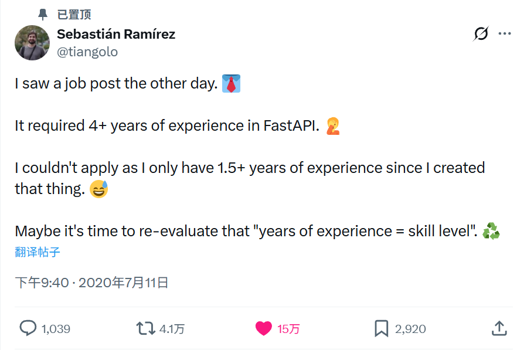
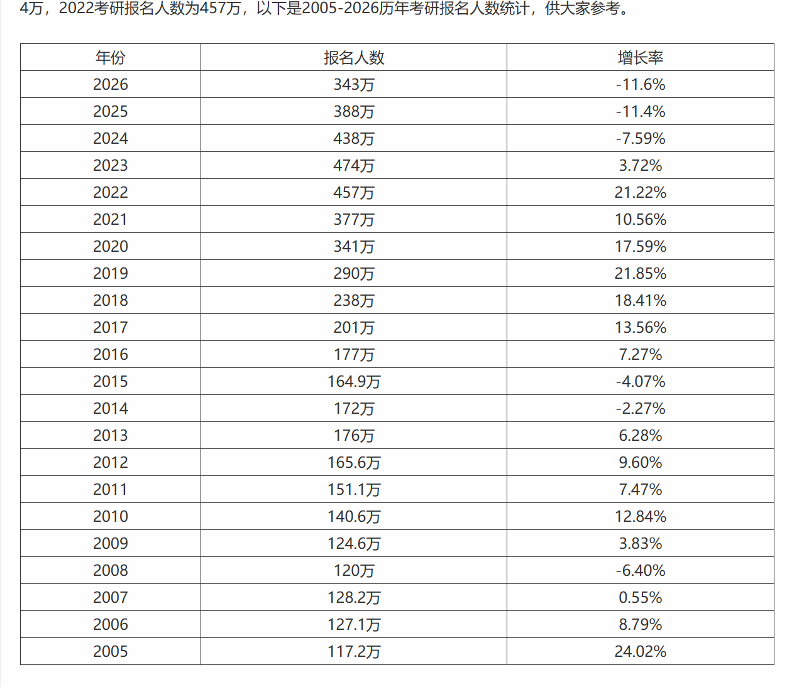
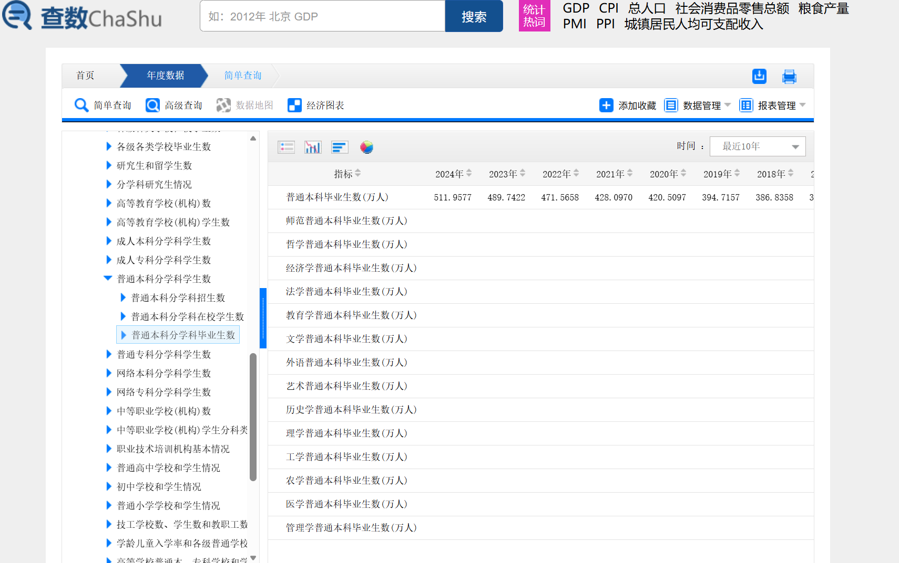
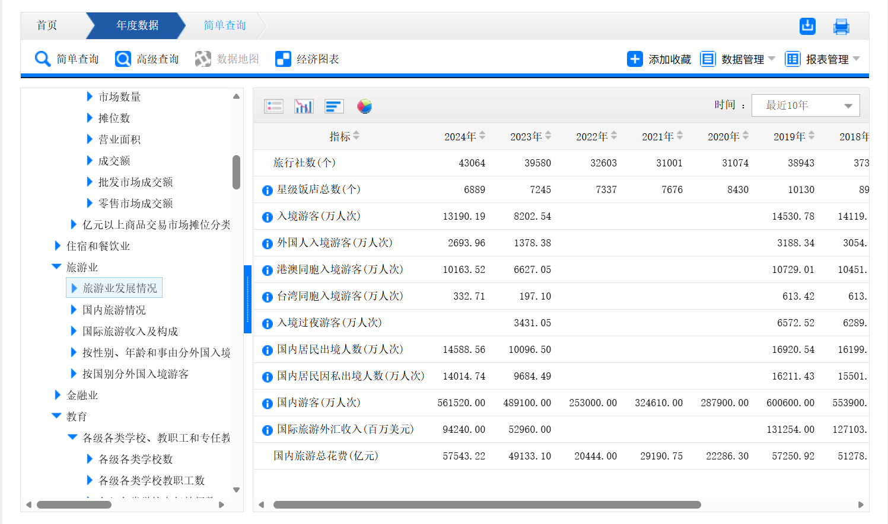
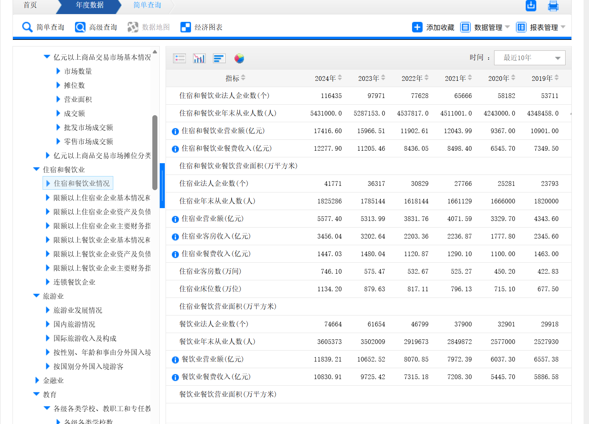
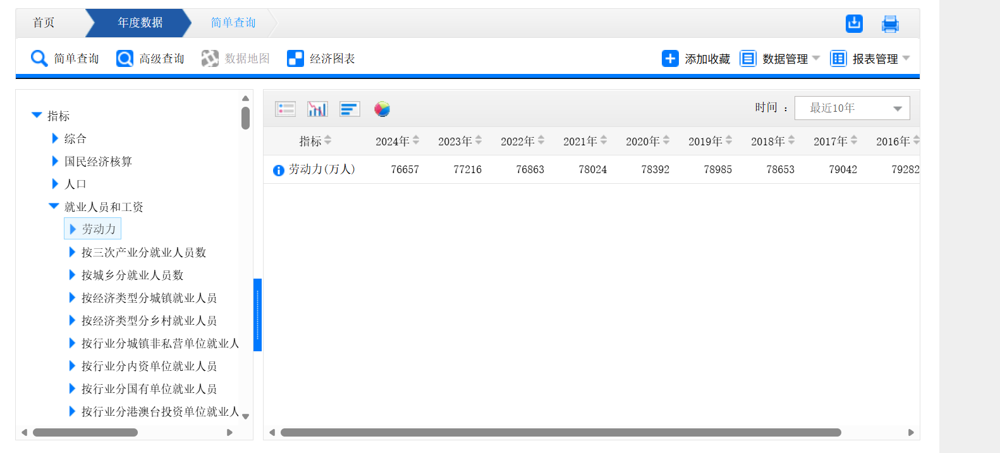

# 每日阅读
## 2025-11-15
1.

>很多人意识不到运气的重要性，而错把成功归功于自己的才能和努力，
却没有意识到好运在其中的重要性。忽视了这一点就难以保持谦虚，难以不断学习。
明白了运气的重要性，就知道不是人人生而能得到平等的机会的，
在遇到处境不如自己的人，不能假设这种差别是聪明或努力程度的不同造成的，应该知道善待弱者。
2.
>此后不久，王先生得了脑血栓。我很有些感慨：敢于直面自己一丁点儿小错的性情中人，活在一个是非不分，且明知错了却死不认账的世道里，能不得脑血
栓？
3.
>我从 D 道开始，接受了大量的指导。周围的人都对我很好，我慢慢进步，终于进入了 C 道。那组的人也热情欢迎我。
但是，我注意到，旁边 B 道的人并不像 C 道那样友善。A 道选手都非常友善，慷慨给予鼓励、表扬和提示。
我怀疑这是普遍现象：A 道、C 道和 D 道的人都很友善，大家几乎都乐于助人；B 道的人则是对 A 道和其他 B 道选手友善，但对 C 道和 D 道则不然。
因为我后来发现，其他运动领域也是如此。那些仅次于顶级选手的运动员，往往对不如自己的选手很苛刻，害怕别人超过自己。
学术界也有这种现象。真正伟大的研究者慷慨而热于助人，许多普通水平的研究者也是这样。然而，那些有一定知名度、但又没有做出顶尖成果的研究者，对不如自己的人就不友善了。
当你是最好的 A 组时，很容易表现得宽宏大量，你确信自己会有成果，这让你安心无忧。
当你处于平均水平或低于平均水平（C 组或 D 组）时，表现得友善也很容易。远离顶尖水平，意味着竞争压力不大，所需要付出的努力可能也不大，你会有一种“放轻松”的心态（反正我到不了顶峰，就当作玩呗）。
那些仅次于优秀水平的人，感受到最大的竞争压力。你离顶峰如此之近，追赶却又艰难无比，放弃又不甘心。最令人沮丧的是，没有人记得第二名。同时，后面的人还可能超过你。所有这些因素，都可能导致一种不友善的态度。

4.
>我从来不想辩论，但如果必须辩论，我希望自己会输。
我宁愿对方的观点是正确的，他来说服我，因为这样会比我的观点是正确的，我来说服他，对我更有趣。

有些是周刊上的,有些是杂志里的,很后悔我以前不会用博客把这些记录下来,想要找到来源都是难上加难.

## 2025-11-17
最近上wiki看了杨靖宇的词条[杨靖宇wiki](https://zh.wikipedia.org/wiki/%E6%9D%A8%E9%9D%96%E5%AE%87),缘由是看了周海婴写的回忆录,里面提到了民主元老马叙伦,马叙伦界面里提到了白朗,白朗界面里提到了杨靖宇,才发现自己的杨靖宇的了解确实贫乏.(或许我可以不断的跳转下去看一整天吧,wiki确实是一个知识宝库,五湖四海的人们四处搜集信息再将他们合并,方便后人来看,这也是开源精神触动我的核心)

纵览杨将军的生平,确实是一个典型的共产主义战士,为了人民的解放先后与地主,军阀,日寇斗争,抱持着自己的信念和理想战斗到了最后一刻,即便只剩自己一人.这与古巴的切.格瓦拉又是何其相似.他们用自己的生命彰显了信念的力量,让其他或多或少抱有私心的灵魂都黯然退下,战栗不已.

要抱有一个纯粹的理想,做一个纯粹的人多难啊,在当下更是如此.
## 2025-11-19
>现在的孩子们比以前更容易接触到成年人的世界，因此他们更早成人化。
从很小的年龄起，他们就在视频网站观看暴力和战争，在社交网络上看到性感和暴露的照片和视频。
然而，当孩子们成年以后，他们往往无法实现经济独立，也没有机会承担足够的责任。
结果，整个社会的文化就变得很幼稚，成年人感到无法做出承诺，即使承诺了也缺乏信心，对以后的生活感到难以把握。
他们的行事方式和处事态度，就像还在青少年时期。
[周刊263期](https://github.com/ruanyf/weekly)

最近在看周海婴写的回忆录<<我与鲁迅七十年>>,最令人惊奇的地方在于他能记得许许多多零碎的小事情,以当时他七十岁的高龄来看,记忆力已经算很不错了,但另一方面,他的回忆基本是由这些琐事构成的,因此整篇传记的时间线有点散乱,主线不明晰,没什么重要的叙述点,经常在叙述一个人的时候联想到当下的事情,看得很累.

正当我想就此放下这本书不再看的时候,突然想到,这个传记不就是我们一般人的生平吗,除了顶着鲁迅儿子的光环之外,他的日常生活与我们并没有什么不同,
都是由一件件琐事构成的,并没什么值得写入历史大书特书的事情,只是在随着时代的潮流艰难的生存着,没有大起大落,但确实有悲欢离合,这才是我们的生活.想到这里,我把这本书又拿起来了.
## 2025-11-28
1.
>生命太短暂，不能花在那些不值得阅读的内容上面。
就算你是一个很爱读书的人，活到70岁最多大概能阅读15000本书，这只占世界最大图书馆美国国会图书馆3800万册藏书的0.04%。
我们一生中能够阅读的书籍其实很少。因此，关键技能不是多读，而是跳过那些不值得读的内容。
[-- Hacker News 读者](https://news.ycombinator.com/item?id=34310318)

2.
>有些领域变化非常快，在有人写书之前，博客有时是唯一的信息来源。Stable diffusion 模型出现后的第二天，人们就已经在写博客了，书籍永远不会那么快。
而且，博客往往是免费的，而书籍和论文则被锁定在付费墙之后。因此，你可以这么认为，博客获取灵感，书籍获取知识
[-- Hacker News 读者](https://news.ycombinator.com/item?id=34310109)
## 2025-12-09

>每当有人给我的开源项目，提出这样或那样的要求，我就给他三个 F，让他自己选一个。
Fix it, Fork it, F**k off.
[来源](https://boyter.org/posts/the-three-f-s-of-open-source/)

每当我看到一个比较小众的实用开源项目,通常都是只有一个contributer或者一个branch,而issue却有好几个或者几十个,这些issue很少是提修改建议的,更多的是要求增加各种各样的自己想要的需求.

如果每个人都这样做,从不想到自己加入到这个项目中帮助创建者完善功能,那么开发者的热情将会急速冷却,开源社区也将不复存在,幸好现在还不是这样.

>人生有没有意义？人类又有什么意义？
我说，人生是有意义的，而人类则是没有意义的。
询问人类的存在有没有意义，就等于询问地球或宇宙的存在有没有意义一样，是得不到答案的。
人生的意义是什么呢？它的意义就在于为没有意义的人类工作、服务等等，其目的不外乎是使人类生活得更好并得以延续。
反正人类是现实的存在，你又是其中一员，你有义务使它发展延续。你只要这样做了，你的人生就具有了意义，或者说价值，并不一定要去理会人类存在的意义。
[来源](https://ruanyf-weekly.vercel.app/weekly/issue-228)

要我说这段话只是消极中的乐观而已,人类没有意义,人生也没有意义.

人类只是感觉的动物,我们当前的体验决定了我们的感受,也正是一次次体验塑造了我们.所以尽管人生没有意义,我还是想去多体验目前所没能看到和听到的一切.

因此我不愿意沿着别人的老路走,因为这终究是别人的体验,重走一次未免太乏味;但我也不愿意去走一条全新的,险峻的道路,因为我不想让自己遭罪.

## 2025-12-14
[克伦斯基wiki](https://zh.wikipedia.org/wiki/%E4%BA%9A%E5%8E%86%E5%B1%B1%E5%A4%A7%C2%B7%E5%85%8B%E4%BC%A6%E6%96%AF%E5%9F%BA)

今天翻wiki时通过多次跳转转到了克伦斯基的界面,之前对他的印象只有布尔什维克对他主政政府时期的控诉,以为他只是一个常见的反对派角色.

看完wiki之后才发现他与*陈独秀*,*托洛茨基*并无区别,同样是内心向往着一个更加美好,自由的社会,同样是怀有或多或少的高士情怀,但是每况愈下的社会形势迫使他们站出来,担任自己本不想担任的领袖角色,在时代的浪潮下起起落落,最终被推上风口浪尖,只是因为不愿意参与尔虞我诈的政治斗争,狠不下心去为自己谋求应有的利益,怀着革命为人民的期望,最后却成为被革命的对象,从先驱者变成背叛者,不为敌我双方所认同,无路可走,跌下本就不属于自己的神坛,摔得粉碎.
被尘封在历史的角落,所有的功绩都被后来者掠夺殆尽.

**他们宛若一颗流星,照亮了整个世界,而后轰然坠落,再无人记得他们.**

这也是我厌恶英雄光环和领袖情结的原因,很多人之所以能够从渺渺众生中脱颖而出,原因便是对自己狠得下心,愿意去做那些旁人坚持不下去或者难以接受的事情,可是如果一个人对自己都能如此狠心,那对待别人又怎么可能会不狠心,不使用一些肮脏的手段,又怎么能让不甘居于人下的自己摘取桂冠,不通过残酷的斗争,又怎么可能胜过同样是英雄俊杰的对手甚至是同志.

可惜我对自己也狠不下心,又何从说对别人狠心,只好默默地给英雄们让道了.

之后会出一系列文章分析俄国革命的全流程,之所以写在这,是提醒自己别忘了.

## 2025-12-18
>
>
>我对 Quora 上瘾，情不自禁使用这个网站。那里有一些很棒的问题和讨论，激发了我的灵感和想法。
>
>但是当我重新阅读自己写的答案，一方面欣赏我的修辞和洞察力，另一方面也看到了很多想法可以成长为更大的成果。它们本可能进一步发展为软件、文章、论文、创业公司、书籍或社会运动，但任何事都没有发生。
>
>不仅如此，还有许多篇我写的长篇大论已经无关紧要，沦为了废文。还有很多我花了好几个小时写的评论，试图说服对于这些问题永远不可能改变观点的那些读者。
>
>我花了数千（也许是数万）小时在 Quora 上写作。我写的远不止11000个答案，还有5000多个草稿答案，其中很多已经写得很长了，只是因为来不及最终润色而没​​有发表。

这篇文章说出了我想说的,我见过很多极其优秀的故事或者技术讲解,可作者发布的网站恰恰是贴吧,天涯或者知乎这样的问答网站或者论坛,作者的观点被一篇篇孤立的文章或者一条条回复分割开来,很难形成一个完整的体系.

而天涯的倒闭也说明了在这些自己不能掌控的平台上并不能保证自己的思想可以永久保留下来,那些优秀的文章随着服务器的关闭直接成为了无法触及的历史,即便是作者本人也无法找回.

因此,我拒绝在论坛里写长篇大论,而是作为读者去发掘优秀的文章,可惜的是现在优秀的文章也越来越少了,而AI生成的无意义内容充斥着论坛的每个角落,很难找到真正有意义的东西,这也是我悲哀的一点.

一方面,论坛不能让作者的文字体系化,另一方面,博客不能保证作者的文章能广泛传播,比如我这个博客就不是所有国人都能访问到的,很难找到一个折衷点.

如果我有那个能力,我可能会去开发一个跨平台的博客论坛吧,侧重点在于分享生活和技术,每个人都能像写博客一样把文章从自己本地上传,改进一下SEO算法,保证最好的文章优先显示,集成了评论系统和follow功能,最大幅度减少作者需要折腾的东西,只写md就行了,呈现的页面也由作者自己在前端设置.重点是这个网站能长久保存,不会让作者的心血白费.
## 2025-12-21

>1.
[周刊210期](https://ruanyf-weekly.vercel.app/weekly/issue-210)
诺拉·劳森还说了一个观点。大家通常认为，复杂系统往往会在经济繁荣的时候崩溃，因为业务太多，支撑不过来，但他认为不是这样的，系统崩溃往往发生在经济收缩期。
经济繁荣时期，软件公司会大量雇佣新员工，投入更多的财力和人力，支撑复杂系统。等到经济收缩期，公司开始减少投入、冻结招聘或裁员，复杂系统可能就会在这个时候出问题，变得难以维护。
现在就是经济收缩期，那么接下来，会不会就是软件故障的高发期，我们将看到很多复杂系统的崩溃？

>2.
IT 行业与传统制造业有一个重要区别，就是 IT 行业有着严重的垄断。
全世界的智能手机有70亿部，比汽车多出5倍（14亿辆）。但是，智能手机制造商比汽车制造商少了好几个数量级。搜索引擎、社交网络、操作系统都是这样，几个巨头就垄断了整个市场。

>3.[来源](https://blog.amamiyayuuko.com/p/ai-new-bing/)
各个互联网公司都试图把自己的网站做成一个完全封闭的APP，你没法在搜索引擎上搜索到微信公众号的文章、小红书的内容、淘宝的商品描述……这就导致bing只能从非常有限的地方获得中文语料，最后就导致他的回答特别池沼……而且比别的AI都池沼十倍甚至九倍……

## 2025-12-24
>[来源](https://www.zackwu.com/posts/2020-07-19-why-i-choose-to-work-after-graduation/)
我是一个习惯于早做规划与反复思索的人。
而坚持写博客最大的好处就是，可以时不时翻看之前写的文章，宛若跨越时间的荆棘，与曾经的自己促膝长谈。

>现在想来，十九岁时，我的迷惘归结下来，即是对将来自己的出路无所适从：出国留学，国内升学，抑或是早日进入职场。这几条路上，都有前人留下的无数足迹与丰碑，但也无可避免地悬着前人用泪水濯洗的种种失败警示牌。我曾尝试从中选出最优解，然而反复的纠结过后，我所意识到的，是这种比较的注定无结果：每当我觉得某个选择优于其他选择时，总会有某些信息刷新我的认知，让我匆忙撤回自己的决定。一如盲人同时摸象与鲸鱼，用片面的认知去比较复杂的事物，注定失败。

>先是出国。关于这个选项，我曾仔细考虑，然而最终出于经济上的原因（赴美读硕开销实在过于昂贵）和人生规划的原因（**我对学术无甚兴趣，不愿耗费多年去追求博士学位**），出国成为了三者中第一个被排除的选项。而站在当下（2020 年）来看，全球疫情的扩散与民族主义情绪的对立，出国虽然依旧有着不可抗拒的诱惑力（比如优渥的学术环境与工作环境），但是更显得充满了极度未知的不确定性。

>「选择比努力更重要。」这句话近年来已经广为人知，不少人以此自我调侃，感叹自己当初选择的失误（比如选错学校、选错专业），但当下一次选择到来时，却又不假思索地下意识地站到了主流的人群中，甚至拼尽全力挤出一条道路以加入主流人群。
>
>诚然，作为一个才识普通的人，我或许不具备选择最合适的道路的能力，但我所希望的，是不盲从、不追随，依靠自身的观察与思考，尽量选出一条相对合适的道路。
>人类的悲欢并不相通，但是相似。
>
>关于读研与工作，面临同样困扰的也并非只有我一个人。
>
>在做出决定的过程中，我阅读了不少人的博客与帖子，从中获得了一些宝贵的信息与经验，或多或少地影响了我最终的决定。
>
>由于之前并未刻意保存浏览过的网页，在此，仅仅列出其中的一小部分：
<ul>
<li><a href="https://laike9m.com/blog/suo-yi-dao-di-yao-bu-yao-du-yan,119/">所以，到底要不要读研？ - laike9m’s blog</a></li>
<li><a href="http://gaocegege.com/Blog/%E9%9A%8F%E7%AC%94/master">研究生复盘 | 高策</a></li>
<li><a href="https://ipotato.me/article/65">iPotato | 在读研 &amp; 工作中选择后者</a></li>
<li><a href="https://www.v2ex.com/t/580275">已有名校 CS 本科学历，读研对于计算机行业的职业发展有多大的意义？ - V2EX</a></li>
</ul>

这恰恰是我当下迷惘而又感到无路可走的心境,专业课程的枯燥与无用让我感到厌烦,愈加激烈的保研争夺战让我望而却步,而那些学术论文里面的水分都可以让海平面再升高一米了.

可日愈恶化的工作环境阻断了我得过且过的想法,作为雏鸟在第一家公司所学习的架构未必对我的技术提升有任何的助益,而我的学历劣势也将在很长一段时间内保持下去.

这种左右为难的状况让我一边痛苦一边踟蹰,只好到处翻阅博客,搜寻资源,希望能够对当前的我有些微的救赎.

这篇博客可惜的地方在于没有考虑到提前工作的坏处,但看了看他[最近的文章](https://www.zackwu.com/posts/2025-11-26-think-long-term-and-work-hard/),过得还算不错,可我现在还没有那个胆量去直接放弃保研,因为我讨厌唯一的选择,希望能多几条路可以走,而现在我仅仅是在本专业保研排名的边缘上(笑).这解释为是对我自己负责,但更可能只是我胆小罢了.

### 题外话:

博客是我最喜欢的信息传播方式,我永远都可以在某个博客里找到一些用一般手段怎么搜都搜不到的棘手问题的解决方案,永远都可以找到一个处境和你相似的人,永远都可以找到能够为你指引道路的人.

这半年来我搜集了差不多一百多个博客,我打算之后整理一下把里面的精华部分传到GitHub上,

## 2025-12-26
>[来源](https://ipotato.me/article/65)
说实话大三上就开始找实习其实是一个有些冒险，但相应收益会比较高的做法。风险点在于学校的课程安排趋近于收尾，一些比较难的专业课也会集中在这个学期，如何平衡好学习和工作是一个首先要考虑的因素，这一点上我的做法比较粗暴：直接翘课。一是因为成绩也够不着保研的尾巴，无需那么在意绩点，二是因为除了体育课这种比较难逃的课，其他一律统统全翘，只是为了挤出了一周 4 天的实习时长，至于课业，只能安排到工作日下班，周末以及考试临近时的请假进行学习。但即便是翘课，对于一些专业课程还是要用心，比如 OS 以及编译原理等课程，可以说是专业的重中之重，不光学习会接触，在面试以及工作中也是非常核心的内容。好在一个学期下来课虽然都翘了，但最后的结果也不坏，没有顾此失彼而整出来个挂科。

* 其实如果没打算读研的话就可以这么做,既然是本科毕业就工作,那绩点的意义就消失了.

这几天用[rawweb](https://rawweb.org/)不知道看了多少博客,足够大的体量保证了我搜任何一个关键词基本都能找到答案,每一个博客对我来说都是一个全新的领域,仿佛博主的生活就是我的生活,他们的迷惘和彷徨就是我的迷惘和彷徨.就比如我搜索关键词保研,一下就得到了一千多条结果,里面的很多文章对我来说都是对读研和工作这一抉择的重新认识.

## Ramírez(2026-02-01)

阅读fastapi和sqlmodel的教程就觉得作者是一个风趣,谦虚,对于疑问要穷追不舍,对于新手非常友好的hacker
>[Ramírez主页](https://github.com/tiangolo)
[汉堡店比喻](https://tiangolo.medium.com/concurrent-burgers-understand-async-await-eeec05ae7cfe)

潦草搜了搜,互联网上关于他的信息还是比较少的,也没有什么比较亮眼的镜头表现,他的英语口音我也比较难接受.只大概知道他没有读大学,从哥伦比亚到了德国工作.

看得出来,他将几乎所有的心血都投入到了开源项目中,所以才不会有时间去包装,宣传自己.

这是一位真正令人尊重的hacker.

## 迷茫时就多看看博客(02-04)
大学也已经过了一年半了,但我还是没能看清之后要怎么做,保研已经非常够呛了,除非之后一年半我能保持几乎满绩,但厌恶填鸭教育的我看来是很难做到了.所以,工作or保研? 
>[来源](https://ddadaal.me/articles/summary-for-2022/cn)
本科前两年半时，我拿定主意直接工作，却在最后时刻，抱着想看看有没有新的机会的想法，极限转弯踏入了研究生的大门。而研究生的前两年的体验让我认识到高校做工程不靠谱，回去看业界的机会时，发现实验室做的工作不能让我踏入一个所谓更“高阶”的工作，我能投向的业界工作和读本科时基本没有区别。后来，当我意识到，当前国内大环境下体制内的技术工作也并非一无是处，想把握北大应届毕业生这个机会了解一下体制内的机会，但却错过了这个时间窗口，最后仍然投向了微软，和三年前的唯一的区别也就是大组（C+AI vs STCA）和工作地点（苏州 vs 上海）的区别了。

>[来源](https://blog.cugxuan.cn/2025/01/23/Mood/record/2024-record/)
这次在各种因素的推动下终于做出改变，总共就简单面试了 3 家公司，最后拿到的机会是深圳的国企和武汉的互联网公司。之前加了一个武汉的交流群，了解到武汉更为恶劣的就业环境，如果回武汉工作几年被裁或者一定要跳槽换工作，那将是很困难的事情，也打消了最近几年有机会就考虑回武汉的念头。
>最近几年经历了互联网的动荡，在互联网跟大家一起卷已经卷不动了，最终选择了深圳相对稳定的工作。参加工作后，自己对互联网的热情完全消磨殆尽了，我虽然不够上进，执行力也很弱，但是在学校比较闲就会捣鼓东西，写博客分享很开心。
>
>当前的经济形势下，今年的情况明显比去年前年更加严峻，各家互联网公司都十分默契地通过裁员来降本。几个月前，上周还在一起吃饭朋友某天午休过后，被叫去谈话沟通裁员。几乎没有交接流程，当天就收拾东西滚蛋，十分残酷。

>[来源](https://hoa.moe/blog/summer-intern/)
整体来说今年就业环境在部分岗位还是有所回暖。最卷的赛道应该是后端，据我了解三月初各大厂开始面人，四月初就基本没有 hc 了，完全是地狱难度。前端和客户端今年有所扩招，有时候你投的是后端岗 HR 也会打电话来问你有没有面前端的意向。

>[来源](https://www.cnkirito.moe/fresh-seek-job/)
此文我是想写给应届生的，1-3 年的工作经验没那么恐怖，大多数情况下，你的能力够了，公司不会跟你较真，用年限压你，所以看到自己技术水平能够达到，资历却不符合的岗位，也可以尝试着投一投。
这类公司其实已经算是对技术有了要求了，而且技术细节都明确了出来，但是，看到只对 jsp，servlet 这些技术有所要求，明眼人都知道，这是在招初级开发，了解一点框架，懂计算机基础，这样的新手，公司还是可以接受的，上海这边针对可以独立开发的应届生，或者培训班出来可以直接上手的非科班生：软件公司，实习开价大概在 4-5k，转正开价大概在 7-8k；互联网公司实习大概在 5-6k，转正开价 9-10k 起步。985/211 或者能力不错能够入职的高校生，在互联网名企的开价，就以阿里为例，我了解到的情况大概是 12k14 or 1216。这里都是说一个上海地区价格，不适用与全国。北京的情况是 IT 非常发达，很多互联网公司都在北京，而上海，深圳，广州其次，注意，上海是金融之都，并非 IT 之都。
...
很多学生没有实习计划，或者出于对工作的恐惧，或者出于对自身能力的不自信，又或者是对实习工资的不屑…也有一大部分同学，觉得春招太早了，希望留着机会等到秋招。我这里有一份据阿里巴巴某部门的公开数据：2020 年转正入职的校招生中 80% 来自于春招，20% 来自于秋招。「好书一本，明日在读」，我不推荐大家错过现在这个最好的时机。

>[来源](https://laike9m.com/blog/suo-yi-dao-di-yao-bu-yao-du-yan,119/)
这些幻想要批判起来说一年也说不完。不过相信大家也发现了一些共性，就是这种盲目推崇读研的人，往往对很多问题都缺乏基本了解，看问题也非常片面。我暗自揣测，他们中大部分可能并没有真正读过研究生，却又把自己目前的不如意归咎于没有读研，并幻想出了所谓读研之后的美好生活。我在计算所的时候，周围很多同学都觉得读研浪费时间，也包括我在内。有个哥们实在受不了实验室安排的无聊工作直接退学然后面试进了头条，人家也没嫌他学历不够。总之呢，读研这件事好不好，各人有各人的情况。对想进互联网行业的同学，可能确实是浪费时间，但若是想去考公务员或者拿户口，可能又很必要。关键还是要清楚自己的目标，分析自身情况，再来判断读研到底是不是一个好的选择。

>[来源](https://bitmingw.github.io/2016/12/13/study-abroad-review/)
整个找实习过程确实挺不容易，毕竟直接和研二学生对线，但最后结果还算不错，去了自己最想去的，对于AI整个行业来说，个人认为在现阶段显然是能实际落地的工程大于算法本身，数据质量大于算法。
## 博客阅读(4/2)
很久没看博客了,今天来看一下:

>[链接](https://halfrost.com/halfrost_2021/)
详细到可怕的CS硕士申请指南,尽管博客没有再更新过,但祝愿博主在美国能过得很好吧.

>[链接](https://halfrost.com/halfrost_2018/)
同一位博主身为过来人给初学者的建议.
博主认为年轻的时候就要选定一个专精的方向,进入工作岗位后再去随兴趣学习.

这个观念我不敢苟同,因为如果不是运气特别好,能够进入一家允许你去尝试不同技术栈的公司的话,你是很容易在一个技术栈上把牢底坐穿的,枯燥的CRUD也会逐渐的消磨你的学习兴趣,对于其他的技术栈也会逐渐生疏,想要换方向就会非常非常的困难.

然而,应届招聘的时候又确实要求你的技术深度过关,这就真没办法了,我们只能在短短的三年内(但一般人意识到紧迫性的时候就已经是大二,甚至大三了)去尽可能的探索多的技术栈,找到自己最感兴趣并且真的有市场需求的技术后,做到一定程度的精通.
大厂面试看的终归是你的成长潜力和基本功,而对于记忆力过关的年轻人来说,熟悉一个技术的基础特性和常用框架只需要三个月就够了,并且可以同时学习多个技术而不至于感到吃力,但还是建议越早开始学越好.
## 开曼群岛(4/23)
之前看到某些头部公司的注册地在开曼群岛,就试着搜了一下,结果发现这个地方确实不得了.
- [wiki](https://en.wikipedia.org/wiki/Cayman_Islands)

开曼群岛位于加勒比海地区,是英国的自治领地,以宽松的税收政策闻名,**公司除了年度牌照费外不需申报和缴纳任何税项**,所以无论是对个人、公司还是信托行业，开曼群岛都**不征收任何直接税**.吸引了无数公司在此注册以逃避本国的税收政策.
- 到1997年6月，世界50家大银行中有47家在岛上设有分支机构。到1999年6月，在岛上注册的公司有4.1万多家，银行和信托机构590家，保险公司475家。
- 内地的主要互联网公司都在此处注册
# 思考
这里放一些不值得单独写一篇文章的吐槽
## ai思考(2025-11-24)
随着我在计算机学习方面的逐渐深入,ai对我的作用越来越有限,顶多是在配置环境里帮我减少一点阅读文档的时间了,大多数时候它都不能给我一个正确的解答,而是说些通用的,却不符合我当前情况的解答.

因此,现阶段的ai还是更多的用在文档办公,图像生成等这些日常场景或者娱乐场景中比较好,一旦想要深入的学习一些技术,ai的劣势就一览无遗,就连洛谷的黄题它也很多时候做不出来(虽然我有时候也做不出来~).

因此,我现在更偏爱于技术博客和技术文档,书籍,再也不会去想用ai火速掌握一门技术的可能,而按照当前ai发展的状态来看,所谓的ai编辑器既然底层都是调用的热门大模型的api,那么自然也就不能处理太高端的技术,最多是辅助学生完成基础的代码作业而已.

总结一下,如果ai不能在字面意义上实现自主学习,它永远只会是一个文档翻译器,当成省时间的阅读工具可以,想用来提升自我,学习技术,我看还是算了.一句话,你懂的越多,ai就越傻.
## 道路与选择(2025-12-16)
这几天有点焦躁和郁闷,总有种无所适从的感觉,浑浑噩噩的,对很多事都不上心了,于是现在静下来认真思考了一下当前的处境.

人生是由一大堆选择构成的,每一个分岔路口都决定了我以后的人生道路,有时候选择多种多样,似乎哪里都是通路,有时候仿佛是山穷水尽,让我别无选择.

人自然是希望选择越多越好,这就是我以前为什么倾向于做事提早做准备的原因,为的就是不让自己在ddl的时候显得无路可走.

但过多的选择,太多的可能,悲观的现实又让我痛苦万分,人生的道路总是要自己走的,但如果有一个引路人就更好了.看不清未来的道路只会使我无所适从,一边厌恶着填鸭式的教育,一边追求绩点的完美,只怕到头来也是一场空.
## 考研人数的下降(2026-01-03)

可以看出来,尽管本科毕业人数越来越多,研究生招生人数越来越多,报考研究生的人数却越来越少,接着看下图

疫情的影响太大了,大家都开始捂住钱包,不会再去做大胆的投资了,因此收入较稳定的餐饮业扶摇直上,而旅游业直到现在也未必恢复了元气.

越来越多的人选择去找一些稳定的工作如公务员,医护人员,不愿意去创业了.

顺带一提还有战败cg,尽管没有今年的数据,但我相信降幅不会相差太多

>这也是普通人的无奈吧,尽管身处这个时代,却连发生了什么都难以把握,只能隐约感觉到大环境不好,却找不到合理的数据来帮自己掌握一点点情况,连知情权也被剥夺,不知道下一步要怎么走,迷茫的在原地打转,只好依着惯例提心吊胆的生活,提不上享受生活,只看得见压抑和悲哀,失去了相信他人的胆量,失去了期盼明天的幸福,只是靠本分承担着责任,不是为了自己,而是为了亲人

很早就想要拿日本跟本国做一个对比了,尽管人口基数差的很离谱,但以前的日本或许就是现在的我们,现在这里预告提醒我自己一下
## 再战算法(2026-01-11)
昨天考了程序设计范式,一开始觉得三个小时三道题不是有手就行,后来发现我太天真了.

第一道题是leetcode2002,一道关于不相交回文子串的中级题,我硬是没想到用dfs做,可能是一个月没碰算法生疏了吧,
第二道题是设计几个角色的类,考察多态和继承,还真有点难,报错信息我都看不懂,第三道题是求满足给定和的最短子串,尽管我一开始就把双指针写出来了,但却在一些测试数据中一直死循环,还好机房上装了vscode,不然我都不知道要怎么调试,前前后后最少调了半个小时才解决这个问题,只能说是在第一题没做出来的情况下太紧张脑子短路了.

这一顿折腾下来,我才发现我连最基本的dfs都没能很好地掌握,连普通的课程考试都过不了关,啥也不说了,速速去刷题,
之前看了百度之星的题目,彻底断了打acm的念想,但刷点水题娱乐一下也是挺好的,不仅能应付考试,还能应付面试.
## 渺小的自我(2026-01-25)
今天看到了[这篇博客](https://nzooherd.github.io/posts/%E6%A0%A1%E6%8B%9B%E6%80%BB%E7%BB%93/),匆匆看了一遍博主的往年博客,仿佛就看到了一年之后的自己.

我跟博主的经历极其相似,都是在一个不发达地区的小镇经历了懵懵懂懂的少年时光,觉得自己未来有无限可能,进入高中后才发现自己并不是天之骄子,最终考入一个中流985,并发现自己只是一个普通的不能再普通的人,并没有用读书改变命运的可能,也不存在任何奇幻的邂逅,只有一个灰暗的,却又捉摸不定的未来,为了最后一丝甜蜜的幻想而苦痛挣扎.

或许,一年后的今天,我就要像他一样懵懵懂懂的参加实习,之后通过秋招走入职场,陷入都市的牢笼,住在一个窄小的出租屋,每天来回通勤两小时,熬夜加班赶文档,为了晋升和加薪的机会苦苦挣扎,因为被解雇的可能而夜不能寐,一个人蜷缩在屋内度过新年.

可不知为什么,当想到这些的时候,我的内心却无比平静,仿佛认定了这就是我该走的道路一样.也罢,渺小的自我,又怎么能容纳什么宏大的理想呢.
## ai幻想(2026-01-31)
- **ai幻想**:认为ai可以帮自己包揽技术上的难题

>我大学这两年经历了不少ai幻想的例子,但也看见过有些同辈依然脚踏实地钻研技术.不得不承认,后者的比例要小的多,而他们的知识水平和成绩都让我不得不低头,承认他们与众不同的技术造诣.

很难想象ai浪潮下的普通大学毕业生在真实的工作场景下会暴露出怎样的一种丑态,而这样一批靠ai吃ai,从来没能真正掌握技术的人攻读研究生,博士生的时候又要去怎样的水出一篇sci.

如果ai真的有他们想象的那么强大,那倒还可以糊弄过去,可惜的是目前ai的水平还远远不到家,近两年业界也并没有突破性的进展,依旧是在倒腾同一个模型,同一种方法,更多的是吃老本而不是真正的开拓创新.

可惜我早就听说在技术好的人未必晋升的快,说不定这些用ai糊弄架构,用心美化ppt的人反而能混的风生水起呢,哈哈,其实现在就是这样了:smile:
## 反思(2026-03-03)
家里人都希望我读研,有的是觉得程序员不稳定,有的是想让我进体制内当官,有的是觉得我可以扩大圈子.

而我一开始以为自己之所以不想读研而是想直接工作,是因为想要干一些有创造力的活,想要挑战自己,但现在我发现,如果在保证有稳定收入的情况下,最理想的条件是事少空闲多,可以有大把的时间干自己喜欢的事情,但事实上并没有这样的工作.

如果我选择进大厂,虽然有可能进一个很push很压抑的组,甚至还需要花力气去打点人际关系,走点向上社交,但这终归是可能,我可以通过各种方式改变自己的工作环境,即便可能在以后被裁员,我也总可以找到一份合适的工作,就算舆论再怎么渲染ai的可怕,我想自动化在取代高级程序员之前一定会先取代公务员和蓝领工人,如果当局不愿意动这个刀子(很大概率不愿意),那就一损俱损,如果经济危机来了,到头来还是要下手.(你要问为什么下手?因为当局总是优先保证高位者的权利,再通过裙带关系来让下位者吃残羹冷炙,如果你威胁到了他的切身利益,那肯定一脚踢开啊,无论在哪都是这样,民族国家之所以维持高军费警费,一方面是逗人的对外防御,更多的是对内防御,怕你不听话呢)

而到了那个时候,若参考1930年代,由于当局的弱势,无法进行像样的改革,又无法向外转移矛盾,再加上绝大部分人口都在农村,可以实现自给自足,城市里的所谓知识分子和公务员基本都受了老罪;而现在由于新兴人口都在城市,当局强势,加上过度依赖当代技术,向内转移矛盾将会导致全面崩坏,故只能向外转移矛盾,而且是非常猛烈的那种,可参考当前美国的外交政策.

所以,我坚决不选择考公,第一是因为流动性小,过于乏味,过多迎合,工资只能保证不饿死,加班也多(假期的值班,重要岗位的加班,什么,你说你的岗位很轻松基本没工作?那肯定是边缘岗位,未来反而更容易被裁),第二是因为太多人来考公,机遇过小难逢贵人,就算限制录取比例,但单位里(尤其是基层单位)的所谓元老都只是80年代生人,离退休还远着呢,导致机关臃肿无比,一定要疯狂的内卷才能吸引领导的注意,当然不卷也行,如果一辈子当个科员(当然博士有正科级待遇,说说而已啦,放首都里你算个屁,处级都没有实权,努力十年不如天降关系,若是像大多数博士公务员一样远离政治中心,晋升机会就小的多),我看你退休金未必会比爸妈高呢.

事实上,现在我也不太愿意去高强度岗位累死累活挣大钱,除非工作内容合我的胃口,挣钱的目的是什么,如果单纯是为了存钱而挣钱,那就有点好笑了;如果是为了脸上有光的虚荣心,那就更好笑了.

我的娱乐活动基本不是很花钱,也没什么旅游的欲望,目前也没有家庭的负担,但如果是为了未来,为了一点飘渺的机缘,为了所谓的经济自由,也可以去打拼打拼吧.

一代人有一代人的路要走,我不想走老一辈的路了.
## ChatGPT大失败(26/3/10)
现在GPT开始搞内部wiki,并且大幅度给免费版降智了,就连luogu的黄题都不太能搞得定,还总是输出垃圾文字和不存在的文献,可能是更改战略打算像Claude一样面向高端付费用户吧

即便是最近降智的Gemini也更好用一点,而Grok更是非常擅长查找资料和总结文献,所以,我决定彻底抛弃gpt

- (3/24) Gemini终于把复制选项单独列在下面了...
## 外文文献并非就比中文好
如果你不是很熟悉英文阅读,那么在读英文文献的时候你一定会逐行逐句的仔细阅读,不然你就看不懂了,而读中文文献的时候由于大多数句子一扫而过就能看懂,正常人不太会对某一个知识点看上太长时间.

所谓的英文教材精炼详细,只是因为你花了更多时间在阅读和思考而已了,未必是教材本身写的有多好,我见过太多看似详细其实是废话太多的外文教材和文档了.

事实上,如果去看中文翻译版的话,即使翻译质量再怎么差,花上与阅读外文同样的时间去扩展阅读,收获一定会大得多.

至于讲座视频更是如此,之所以说看国外讲座学的更好只是因为你花精力去理解英文了而已,同样的时间你花在看教材上我想会有用的多.总不可能米国人人都是至圣先师,随便一句都是金口玉言吧,低质量的讲授才是常态,随便一句话或者一页ppt就让你醍醐灌顶那只能说明你本来就啥也不会,不如好好看文献.
- 补充(3/22): 我错了,遇到垃圾翻译时中英文版本夹杂着看的话,可以实现既能一目十行,也能深刻理解
## 建议学生只用AI来打杂
我身边有不少人用AI来应付比赛和项目,费尽千辛万苦调试出一个勉强能过关的APP或者网站.但事实上这样啥也没学会.与其让AI去修复一个AI生成的大杂烩,不如靠自己的所学知识去排查异常,只有这样,才能真正的学到东西.

当你想学习一门新技术的时候,最可怕的就是问AI来它来手把手教你,事实上,AI所作的只不过是去查文档,然后把它破碎的理解喂给你而已,得到的知识远不如自己去看文档来的有体系.

## 英文翻译(3/17)
我认为中文的优点在于句式变换多样,能够以最少的字符表达出最多的意思,通过各种同义词和同音词实现独特的诙谐语感,需要读者从深层次理解句法的内涵,在文学领域是别领风骚的高端语言;
而英文则相反,以尽可能多的字符来表达足够精确的意思,这注定了英文句子大多是枯燥无味的,但是由于英文的表意精确,用语地道,从而在学术研究中占据了统治地位.

那么这样看来,广传的翻译原则"信,达,雅"其实是有道理的,"信"意味着能够真实反映原文的意思,"达"意味着好理解,可以让普通人也能看懂,"雅"意味着足够优美,能够体现出汉语的独特美感.

很可惜的是,在我看过的用中文翻译英文的学术文献中,很少有真正能实践这一点的,大多数译者都是硬着头皮把原文中的分词或者定义对照着词典一个个敲出来.如果自身不是技术专业的话就别来翻译技术类书籍啊(我不了解翻译界,或许有硬性指标之类的吗),但如果自身是技术专业还翻译成这个样子,就有点过分了.

### 批判用例
>这些CPU执行时间已大量测试过。虽然它们随进程和计算机的不同而变化很大，但是它们的频率曲线类似于图5-2所示。该曲线通常为指数或超指数的形式，具有大量短CPU执行和少量长CPU执行。I/O密集型程序通常具有大量短CPU执行。CPU 密集型程序可能只有少量长CPU执行。对于选择合适的CPU调度算法，这种分布是很重要的。

尽管勉强能看懂,但这个名词翻译确实很离谱,看看原文:
>The durations of CPU bursts have been measured extensively. Although they vary greatly from process to process and from computer to computer, they tend to have a frequency curve similar to that shown in Figure 6.2. The curve is generally characterized as exponential or hyperexponential, with a large number of short CPU bursts and a small number of long CPU bursts.
An I/O -bound program typically has many short CPU bursts. A CPU-bound program might have a few long CPU bursts. This distribution can be important in the selection of an appropriate CPU-scheduling algorithm.

首先这个**The durations of CPU bursts**翻译成CPU执行时间,是动了一点脑子的,但是完全没有体现出周期的意思,翻译为CPU周期长度应该会好一点.

这个"不同而变化很大"够吐槽了,直接翻译成"随着...不同而不同",我想才像一个正常的中国人的思维,没必要非要代入副词.

**exponential or hyperexponential**能翻译成"指数或超指数"也是无敌了好吧,翻译成"指数级或者超过指数级别的增长速度"我想才对,如果原文很难翻译,你倒是加一点副词啊.

**short CPU bursts**翻译成"短CPU执行"你自己不会笑吗?
我不得不怀疑译者真的系统学过英语不,直接翻译成"短区间"就可以了,在有上下文的环境,读者很容易理解这指的是cpu执行区间.
### 总结
翻译英文的时候你就应该用中国人的思维来看原文,用中国人的想法去理解原文,在保持大致意思的情况下尽可能的还原中文的语法结构才是最重要的.

## AI取代程序员(26/4/1)
尽管很多人(包括程序员)都在说工作会被AI取代,但鲜有人真正懂得LLM的基本原理,只是看着AI输出一大段代码或者信息后就开始附和媒体的喧嚷,也给了大厂借着AI的名义大幅度裁员的机会.

我的意见是: What the hell?

到底是哪来的自信让你能够轻易的对一个自己一无所知的领域下判断的?如果你自己连LLM的原理都不清楚,那么你又怎么能知道它具有成长为包办一切的神器的潜力?是谁告诉你的?最会见风使舵的媒体吗?

至少,我是没看到有真正在这一领域精通的大牛站出来信誓旦旦的说: 我保证它可以解决所有的代码难题!

我想,在大学实验室里看到的那些大模型炼丹师,未必与闭源大模型的开发者有多大的区别.如果生物领域连大脑的运作机制都没搞明白,那又怎么可能通过普通的数学运算就精确的模拟人脑的认知呢?

LLM目前就只是一个概率模型而已,直到泡沫破裂了,才会有优秀的人才去探索更为实际的研究方向,才会有真正的进步和突破.

## 某code源码泄露(26/4/1)

谁看到这个图能不笑🤣,可惜不是在今天泄露的,不然更有乐子了.
- 不许你们再说小龙虾的star是沽名钓誉了🤢

- 第一次见fork数量比肩star数量的,也是唯一一个fork数量逼近百万的仓库

## 文档学习法(26/4/3)
最好的学习方法就是去阅读一手的文档,而不是去看二手甚至三手的博客教程.

毕竟官方文档的撰写者一般都是该领域的大牛甚至是作者本人,他对这个领域的了解程度会远远超过我们这些初学者.

而二手的博客教程一般都是作者在经过了自己的处理之后再片面的告诉你,很难做到十全十美的程度.

官方文档写的好不好,有没有及时更新或者维护,更是判断这个技术的生态是否足够好的硬性指标之一.

## 数据库小测(4/8)
- (4/7): 明天就要小测了,但还是没有一点底...不过心态还是要放平,我有预感这次小测会带给我一点启发或者冲击.

这次小测确实有点过于逆天了,我以为不会考的procedure和trigger各考了一个11分的大题,关系代数也考了一个10分的大题,而这三个部分我都基本上没怎么学...
看来下次小测和期末要认真一点了,不然真要挂科重修了.

## 以人文的方式去学习技术(4/14)
现在,我在学习一门新技术之前,总是倾向于先去了解这门技术的演变历史,创作的背景和社区的现状,只有这样我才可以判断这门技术值不值得学,好不好学,需不需要学.

因此,我不再是像以往那样看到一个新名词,直奔AI了解大概意思,看一点二手博客就企图直接上手了

相反,我会通过wiki和官方文档去深入了解这门技术的历史,接着阅读官方的教程说明和社区的最佳实践(Github仓库/教程案例),从而逐渐掌握这门技术的基本操作,最后再去实战和根据AI边问边学.

这恰好对应了人文学科的学习方法:先是了解一门学科的历史,再接着了解这门学科的主要代表人物,然后理解该学科的主要研究内容,最后学习该学科的现代演进和实际案例.

我想,这种学习方法才是最适合技术人员的学习方法.

## 博客是为了自己写的(4/23)
>**博客是为了自己写的**

大多数博客的大多数文章都只是自我发泄而已,我们装作自己很优秀很清醒,发布各种各样的技术笔记和人生阅历分享.但实际上这些内容**没多少经得起推敲的**.

你的人生阅历分享终归是个人的问题,很有可能掺杂了大量的私人感情和不可重复的性格印记,是**无法复刻的**,也不能从中学到什么,只能用垃圾情绪去感染读者而已.

你的技术笔记大多是**破碎的,凌乱不堪的,草草了结的**,远不如官方文档和书籍有体系,反而是在搜索引擎里增加了垃圾资料的权重.

抛开这些来说,博客仅仅是一个技术人灵魂的呐喊而已,他想要被人发现,被人称赞,被人尊敬;他想要宣泄悲哀,宣泄愤怒,宣泄无奈;他想要升职加薪,事业顺利,生活美满.

真正优质的博客是与你平起平坐,促膝长谈的;是能够让你幡然醒悟的;是能够让你真正学到优质知识的.可惜的是,这样的博客很少很少.

博客是为了自己写的,读懂了这句话,你就很少会去看博客了.

### 当天晚上的思考
我觉得为了贯彻上述的说法,还是把之前我自己写的劣质文章通通删掉来个整合吧.
本来是想留着警醒我自己技术不够好的,但确实一点都不够看,质量都很低,也没必要留着了.

**重构之前**:
