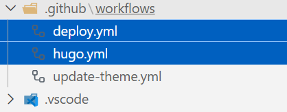
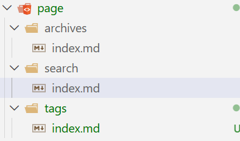

# 折腾博客

## hexo图片管理困难,帖子多了很难阅读
解决方法:
config_yml里修改
`new_post_name: :year-:month-:day-:title.md`
同时,听从大佬建议,将所有图片改成webp格式,效果立竿见影


## 还是图片问题,每次复制images子文件夹路径太麻烦
根据[](https://www.hwpo.top/posts/d87f7e0c/index.html)教程在post文件夹里设置同名文件夹没解决
```yml
post_asset_folder: true
marked:
  prependRoot: true
  postAsset: true
relative_link: false
```

最后写了一个脚本
```JavaScript
const fs = require('fs');
const path = require('path');

hexo.on('new', function(data) {
  // 用 data.path 生成文件夹名
  // data.path 是相对于 _posts 的路径，带后缀
  const filename = path.basename(data.path, path.extname(data.path)); // 去掉扩展名
  const imagesDir = path.join(hexo.base_dir, 'images', filename);

  if (!fs.existsSync(imagesDir)) {
    fs.mkdirSync(imagesDir, { recursive: true });
    console.log(`Created image folder: ${imagesDir}`);
  }
});
```
在同级目录下生成图像文件夹来管理,麻烦的是每次都要删去相对路径里的''


## 改用butterfly主题
这个主题确实好用了不少

## 增加评论系统
[参考文章](https://tech.yemengstar.com/vercel-twikoo-comment-your-hexo/)

## 尝试新部署方式

[](https://tech.yemengstar.com/github-actions-auto-hexo/)

## 增加了category条目,tag条目和背景图片 
原来要用`hexo new page tag`才能在hexo里显示tag页和category页

## 发现md只要在posts下都能被直接解析(25/12/21)
于是我将不会再修改的文章都移动到了archives文件夹,图片路径也做了对应的修改,
之前我还想文章多了要怎么处理呢.

## 还是图片问题,hexo本地无法正确解析相对路径
例如`images/archives/2025/2025-11-26/image.png`
需要改为'images/archives/2025/2025-11-26/image.png',每次改就很麻烦了
于是找ai弄了脚本
```javascript
hexo.extend.filter.register('before_post_render', function (data) {

  if (typeof data.cover === 'string') {
    data.cover = data.cover.replace(
      /^\/?source\//,
      '/'
    )
  }

  return data
})
```
完美解决,以后只要复制相对路径就可以了,不用再删删减减了.

## 增加rss订阅图标
[参考文章](https://mitpoppy.github.io/posts/fe13d434.html)
发现了RSS订阅方式,于是增加了这一功能

## 更改了图像文件夹创建方式(25/12/26)
```JavaScript
const fs = require('fs');
const path = require('path');

hexo.on('new', function (data) {
  // data.path: 2025-12-26-xxx.md
  const basename = path.basename(data.path, path.extname(data.path));

  // 取前 10 个字符作为日期
  const date = basename.substring(0, 10);

  // 图片目录：images/2025-12-26
  const imagesDir = path.join(
    hexo.base_dir,
    'images',
    date
  );

  if (!fs.existsSync(imagesDir)) {
    fs.mkdirSync(imagesDir, { recursive: true });
    console.log(`Created image folder: ${imagesDir}`);
  }
});
```
由于我的post创建格式在config里面改成了这样子
`new_post_name: :year-:month-:day-:title.md`
故可以根据日期直接找到对应的图片,这样图片管理起来更加方便了,但原来的几十个文件夹我是真不想再改了.

## 突然发现没必要用file utils粘贴相对路径,直接复制图片就好了(12/27)

在settings.json里加上
```json
"markdown.copyFiles.destination": {
    "**/*.md": "images/${documentBaseName}/"
    },
```
就可以在md里直接复制图片而不是自己写了这些东西了,
甚至会根据图片复制的位置智能选择是插入相对路径还是插入整个图片链接格式,又能偷一点懒了.

## 每次hexo d的时候都要报warning(2026/1/1)

```bash
warning: in the working copy of 'tags/离散数学/index.html', LF will be replaced by CRLF the next time Git touches it
```


>[详细解释CR和CRLF](https://zhuanlan.zhihu.com/p/586324681)
LF和CRLF区别
LF: Line Feed换行
feed v.喂养,供给;将(信息)输入 line feed直译是”将行输入”,再意译”换行”
CRLF: Carriage Return Line Feed 回车换行
Carriage n.马车,火车车厢;运输费用 在carriage return中,carriage译为“车”,return译为“回”
在过去的机械打字机上有个部件叫「字车」（Typewriter carriage），每打一个字符，字车前进一格，打完一行后，我们需要让字车回到起始位置，而“Carriage Return”键最早就是这个作用，因此被直接翻译为「回车」。尽管后来回车键的作用已经不止” 倒回字车”那么简单，但这个译名一直被保留下来。

>[解决方法](https://github.com/g199209/BlogMarkdown/blob/master/Hexo%20Git%E9%83%A8%E7%BD%B2%E8%AD%A6%E5%91%8Awarning%20LF%20will%20be%20replaced%20by%20CRLF%E7%9A%84%E5%8E%BB%E9%99%A4%E6%96%B9%E6%B3%95.md)
这个警告的意思很直接，就是Git会把LF替换为CRLF，不过这是无关紧要的，完全可以禁用此功能，这样还可以避免这个警告信息刷屏。设置方法也很简单，在MinGW窗口中输入以下命令即可：
`git config --global core.autocrlf false`

+ 很奇怪的是很少有人去想为什么回车叫做回车,这种粗暴的翻译在用电脑打字的时代显得非常奇怪,习惯的力量真有点可怕.
+ [扔掉CRLF](https://www.163.com/dy/article/JEG01TL50511FQO9.html)


## 嵌入数学公式(unsolved)
按照[官方文档](https://butterfly.js.org/posts/4aa8abbe/)的步骤进行操作并没有解决,尝试了[这个教程](https://nickxu.me/2022/04/17/Hexo-Butterfly-%E5%BB%BA%E7%AB%99%E6%8C%87%E5%8D%97%EF%BC%88%E5%85%AB%EF%BC%89%E4%BD%BF%E7%94%A8-KaTeX-%E6%95%B0%E5%AD%A6%E5%85%AC%E5%BC%8F/)也没有解决

## 图片路径又出问题了
待我期末周回来再搞,毕竟本地看图片还是正常的
(2026/1/18)
修好了,只要保证都是相对路径的格式就能正常渲染,尽管我也不知道为什么
``
>这大概是图片路径的最终解决方案了
## 觉得'hexo g -d'还是太长了
写一个bat脚本,命名为d.bat,每次只要输一个d就可以了,完美解决懒癌,自然我还写了一个s脚本,作用是什么不言而喻
## 将twikoo改为giscus(2026/1/24)
发现twikoo还是太麻烦了,于是改成不要动脑子操作的giscus
## 将busuanzi换成Vercount(1/30)
busuanzi现在天天转圈,于是换成[别人推荐的](https://youyeyejie.github.io/_posts/Hexo%E4%BD%BF%E7%94%A8Vercount%E7%BB%9F%E8%AE%A1%E8%AE%BF%E9%97%AE%E6%95%B0%E6%8D%AE/)Vercount,由于busuanzi写在了源代码pug里,因此不太好直接改,问了问ai,提前**存档**,改了之后发现立刻就不转圈了.

只要在以下两个地方中改一下就行了


>这里插入脚本`<script defer src="https://events.vercount.one/js"></script>`


>这里可以直接换成下面代码,因为busuanzi真没必要再放上去了
```pug
if theme.aside.card_webinfo.enable
  .card-widget.card-webinfo
    .item-headline
      i.fas.fa-chart-line
      span= _p('aside.card_webinfo.headline')
    .webinfo
      if theme.aside.card_webinfo.post_count
        .webinfo-item
          .item-name= `${_p('aside.card_webinfo.article_name')} :`
          .item-count= site.posts.length
      if theme.aside.card_webinfo.runtime_date
        .webinfo-item
          .item-name= `${_p('aside.card_webinfo.runtime.name')} :`
          .item-count#runtimeshow(data-publishDate=date_xml(theme.aside.card_webinfo.runtime_date))
            i.fa-solid.fa-spinner.fa-spin
      if theme.wordcount.enable && theme.wordcount.total_wordcount
        .webinfo-item
          .item-name= `${_p('aside.card_webinfo.site_wordcount')} :`
          .item-count= totalcount(site)
      if theme.umami_analytics.enable && theme.umami_analytics.UV_PV.site_uv
        .webinfo-item
          .item-name= `${_p('aside.card_webinfo.site_uv_name')} :`
          .item-count#umami-site-uv
            i.fa-solid.fa-spinner.fa-spin
      else
        .webinfo-item
          .item-name= `${_p('aside.card_webinfo.site_uv_name')} :`
          .item-count#vercount_value_site_uv Loading

      if theme.umami_analytics.enable && theme.umami_analytics.UV_PV.site_pv
        .webinfo-item
          .item-name= `${_p('aside.card_webinfo.site_pv_name')} :`
          .item-count#umami-site-pv
            i.fa-solid.fa-spinner.fa-spin
      else
        .webinfo-item
          .item-name= `${_p('aside.card_webinfo.site_pv_name')} :`
          .item-count#vercount_value_site_pv Loading

      if theme.aside.card_webinfo.last_push_date
        .webinfo-item
          .item-name= `${_p('aside.card_webinfo.last_push_date.name')} :`
          .item-count#last-push-date(data-lastPushDate=date_xml(Date.now()))
            i.fa-solid.fa-spinner.fa-spin
```

## 增加google-analytics
- [参考教程](https://lizhening.github.io/posts/b467327c/)
vercount也出问题了,显示一堆乱码,这次换个大杀器.
google_analytics 是免费的,给自己网站注册一下获得一串以G打头的神秘数字-tag,再填入butterfly的config.yml就可以了,当然网站上是看不到访客数据的,只能去后台看.


- (2/13)发现之前的vercount乱码只是因为我把同名压缩包放到脚本里面所以出错了
## 加入live2d(2/22)
看大家都有那么帅的看板娘,我也试试整一个,在butterfly的_config.yml里对应的bottom注入js就可以了
```yml
inject:
  head:
    - <link rel="stylesheet" href="/css/custom.css">
    # - <link rel="stylesheet" href="/xxx.css">
  bottom:
    #live2d看板娘
    - <script src="https://fastly.jsdelivr.net/npm/live2d-widgets@1.0.0/dist/autoload.js"></script>
    # - <script src="xxxx"></script>
```
确实可爱😄
## 尝试加密文章(4/7)
- [参考文章](https://insectmk.cn/posts/ca85c64c/#%E6%A0%B9%E6%8D%AE%E6%A0%87%E7%AD%BE%E5%AF%B9%E6%96%87%E7%AB%A0%E8%BF%9B%E8%A1%8C%E5%8A%A0%E5%AF%86)

```md
---
title: 这是一个私密文章
date: 2026-04-07 20:00:00
tags: [秘密]

# 以下是加密核心配置
password: your_password_here
abstract: 输入密码前，读者能看到的预览文字（可选）
message: 这里是密码提示语（可选）
---

这里是加密后的正文内容，只有输入正确密码才能看到。
```
## 将博客从hexo迁移到hugo-stack(4/24)
由于hexo有很多地方是我不满意的,而且当时创建博客的时候还不太懂编程,用AI魔改了很多地方,修复起来很难.
所以就想着换一下博客框架,顺便整理以往的所有文章,把魔改的地方全部清空.
### 整理原仓库
- 正常人的博客不会像我一样混乱的

因为我的图片路径弄得特别混乱,而hugo默认只支持文章md与图片在同一文件夹下时,才能识别图片,所以还得去整一些脚本来帮助我快速转换:

**将魔改的路径还原**
```ps1
[Console]::OutputEncoding = [System.Text.Encoding]::UTF8
$contentDir = "content/post"
$imagesSourceDir = "images"
$utf8NoBom = New-Object System.Text.UTF8Encoding $false

# 1. 预构建图片全局索引（解决路径偏移问题）
Write-Host "Building image library index..." -ForegroundColor Cyan
if (-not (Test-Path $imagesSourceDir)) {
    Write-Error "Source images directory not found!"; exit
}
$imageLibrary = Get-ChildItem -Path $imagesSourceDir -File -Recurse

# 2. 获取所有待处理的 .md 文件
$mdFiles = Get-ChildItem -Path $contentDir -Filter "*.md" -Recurse | Where-Object { 
    $_.Name -ne "index.md" -and $_.Name -ne "_index.md" 
}

foreach ($file in $mdFiles) {
    Write-Host "`nProcessing: $($file.Name)" -ForegroundColor Cyan
    
    # 3. 创建 Page Bundle 文件夹
    $folderName = $file.BaseName
    $targetDir = Join-Path $file.DirectoryName $folderName
    if (-not (Test-Path $targetDir)) {
        New-Item -ItemType Directory -Path $targetDir | Out-Null
    }

    # 4. 预读取内容并重命名/移动 MD 文件
    $content = [System.IO.File]::ReadAllText($file.FullName, [System.Text.Encoding]::UTF8)
    $newMdPath = Join-Path $targetDir "index.md"
    
    # 5. 图片处理逻辑
    $hasChanged = $false
    # 匹配各类 images/ 路径变体
    $pattern = '(?:"|(?<=\())(?:(?:\.\./)+|\./)?images/([^")\r\n\s]+)(?:"|\))'
    $matches = [regex]::Matches($content, $pattern)
    
    foreach ($match in $matches) {
        $extractedPath = $match.Groups[1].Value.Trim()
        $fileName = Split-Path $extractedPath -Leaf
        
        # 忽略变量占位符
        if ($fileName -like "*$*") { continue }

        # 搜索图片：先查直接路径，找不到再查全局索引
        $sourceFile = Join-Path (Get-Location) (Join-Path $imagesSourceDir $extractedPath)
        if (-not (Test-Path -LiteralPath $sourceFile)) {
            $foundFile = $imageLibrary | Where-Object { $_.Name -eq $fileName } | Select-Object -First 1
            if ($foundFile) { $sourceFile = $foundFile.FullName }
        }

        if (Test-Path -LiteralPath $sourceFile) {
            $destFile = Join-Path $targetDir $fileName
            
            # 移动图片到新文件夹
            if (Test-Path -LiteralPath $sourceFile) {
                Move-Item -LiteralPath $sourceFile -Destination $destFile -Force
            }
            
            # 修正 Markdown 引用路径为纯文件名
            $oldFullString = $match.Value
            $newFullString = $oldFullString.Substring(0,1) + $fileName + $oldFullString.Substring($oldFullString.Length - 1)
            $content = $content.Replace($oldFullString, $newFullString)
            $hasChanged = $true
            Write-Host "  [Image] Moved & Relinked: $fileName" -ForegroundColor Green
        } else {
            Write-Warning "  [Image] Missing: $fileName"
        }
    }

    # 6. 写入新 index.md 并物理删除旧 .md
    [System.IO.File]::WriteAllText($newMdPath, $content, $utf8NoBom)
    Remove-Item -Path $file.FullName -Force
    Write-Host "  [Bundle] Created folder and index.md" -ForegroundColor Gray
}

Write-Host "`nAll operations completed." -ForegroundColor Yellow

```

**注册环境变量将hugo的复杂命令简化为`hn <文章名>`并给目录加上日期前缀**

1. 在 PowerShell 中输入以下命令，如果文件不存在会自动创建：
```bash
if (!(Test-Path $PROFILE)) { New-Item -Type File -Path $PROFILE -Force }
notepad $PROFILE
```
2. 将以下代码粘贴进记事本并保存：
```ps1
function hn {
    param($name)
    # 调用下面定义的拦截函数
    hugo new "post/$name/index.md"
}

function hugo {
    # 仅拦截 hugo new 命令，且参数包含路径
    if ($args[0] -eq "new" -and $args.Count -ge 2) {
        $datePrefix = Get-Date -Format "yyyy-MM-dd-"
        $originalPath = $args[1]

        # 逻辑：匹配最后一个斜杠后的名称，在名称前插入日期
        # 示例：post/test/index.md -> post/2026-04-24-test/index.md
        if ($originalPath -match '(.*/)([^/]+/[^/]+)$') {
            $newPath = $matches[1] + $datePrefix + $matches[2]
        } 
        else {
            # 如果没有深层路径，直接加在前缀
            $newPath = $datePrefix + $originalPath
        }

        $newArgs = @($args[0], $newPath) + $args[2..($args.Count-1)]
        & (Get-Command hugo.exe -CommandType Application) $newArgs
    }
    else {
        & (Get-Command hugo.exe -CommandType Application) $args
    }
}
```
3. 回到 PowerShell，执行：
```bash
. $PROFILE
```

光是处理这些前前后后也花了差不多两个小时,可知处理糟糕的架构设计确实很累人.
### 初始化hugo仓库
- 将原博客仓库名字改成随便的其他名字,预留`username.github.io`仓库名字
先fork[stack仓库](https://github.com/CaiJimmy/hugo-theme-stack)命名为`username.github.io`后,`git clone`到本地.

进入仓库的settings>Pages页面,给该仓库配置以下两个GitHub Actions:
1. build and deploy
2. hugo模板

之后在根目录的.github\workflows文件夹下会出现两个新文件分别对应两个actions


然后将原仓库整理好的文档一键复制到hugo仓库的content/post文件夹中,除了`cover`字段需要改成`image`字段外,其他的frontmatter都是兼容的.
- 至于其他的初始化操作由于[官方文档](https://hugo.opendocs.io/)都写的很明白我就不加上了
### 加入vercount访客统计
- [参考链接](https://blog.farb.top/p/hugo_stack_vercount/)
### 加入gisgus评论系统
- [参考链接](https://www.lixueduan.com/posts/blog/02-add-giscus-comment/)
### 配置tags界面

在pages目录里新增该tags文件夹即可,可以这么写从而启用内置的tag-cloud样式:
```md
---
title: "Tags"
slug: "tags"
layout: "tag-cloud"
menu:
    main:
        weight: 4
        params:
            icon: tag

---
```
- 但实际效果不是很好,能用就行

### 修改目录属性保证一级标题和五级标题可以被识别
在markup.toml里修改下列字段即可:
```toml
[tableOfContents]
    endLevel   = 5
    ordered    = true
    startLevel = 1
```
### 修改刺眼的白色背景
在项目根目录下编辑或创建 assets/scss/custom.scss,添加以下代码:
```css
:root {
  /* 1. 背景色：由纯白改为柔和的浅米色或灰白色 */
  --body-background: #f5f5f3;

  /* 2. 卡片背景：略亮于底色，增加层次感 */
  --card-background: #fafafa;

  /* 3. 文字颜色：避免纯黑，使用深灰色减轻对比压力 */
  --body-text-color: #333333;

  /* 4. 标题颜色：稍深一点以保持清晰度 */
  --heading-text-color: #222222;

  /* 5. 链接与强调色：如果觉得原生的蓝色太刺眼，可以调暗 */
  --accent-color: #536471;

  /* 6. 代码块背景：调为更稳重的颜色 */
  --code-background-color: #f0f0f0;
}

/* 针对侧边栏背景的微调（如果是 Stack 主题） */
.sidebar {
  background-color: var(--body-background);
}

/* 降低图片亮度（可选：防止亮色模式下图片太晃眼） */
.article-content img {
  filter: brightness(0.95);
  transition: filter 0.3s ease;
}
.article-content img:hover {
  filter: brightness(1);
}

```
- 比默认配置柔和了不少
### 总结
不得不说,hugo的部署比起hexo快了好几倍,而且界面更加现代流畅.

# 折腾环境问题

## vscode powershell终端打字缺字漏字
解决方法:
>搜索设置
Terminal > Integrated > Default Profile: Windows
换为cmd

## 左斜线和右斜线问题

windows路径都是\,转义符是\,而网页链接,linux都是/
解决方法:
>在搜索框输入："Explorer: Copy Relative Path Separator"
将\改为正斜杠/
[参考链接](https://blog.csdn.net/kdz6511/article/details/148712726)

## gpt废话太多
解决方法
>在设置里可以加入自定义提示词,这样就不用每次都提示让他精简输出了

## cmd输入python弹出微软应用商店
解决方法
>进入设置里的应用执行别名,去掉跟python有关的别名(很好奇为什么要把这玩意加进来)
## path环境变量变成一行
解决方法
>由于Windows的无敌bug,第一个如果是带有%开头的变量会把path变成一行,把带有盘符的变量放到第一行即可

## 右键菜单中用vscode打开消失
- [参考链接](https://jishuzhan.net/article/1954427652328173570)
```bash
Windows Registry Editor Version 5.00

[HKEY_CLASSES_ROOT\Directory\Background\shell\VSCode]
@="使用 VSCode 打开"
"Icon"="your vscode path"

[HKEY_CLASSES_ROOT\Directory\Background\shell\VSCode\\command]
@="\"your vscode path" ." \"%V\""

[HKEY_CLASSES_ROOT\Directory\shell\VSCode]
"Icon"="your vscode path"

[HKEY_CLASSES_ROOT\Directory\shell\VSCode\\command]
@="\"your vscode path" ." \"%V\""
```
这样加入了两个注册表项,分别是右键目录和目录背景,注意路径要用双斜线,然后将文件名字改为1.reg打开就行
- 更改注册表后不必重启电脑,重启文件浏览器就能生效

- 很久以后我发现其实重新安装一次vscode就行了,不用先卸载😅
## 右键菜单去除系统自带压缩选项
- [参考链接](https://www.bilibili.com/read/cv37179594/?opus_fallback=1)
```bash
Windows Registry Editor Version 5.00

[HKEY_LOCAL_MACHINE\SOFTWARE\Microsoft\Windows\CurrentVersion\Shell Extensions\Blocked]
"{b8cdcb65-b1bf-4b42-9428-1dfdb7ee92af}"="Compressed (zipped) Folder Menu"
"{EE07CEF5-3441-4CFB-870A-4002C724783A}"="Compressed Archive Folder Context Menu" 
```

## VMware装载32位win10虚拟机

- [参考链接](https://www.reddit.com/r/vmware/comments/171pf4m/windows_10_virtual_machine_wont_install_in_vmware/?tl=zh-hans)


>It turns out that VMWare Workstation Player 17 defaults to creating an NVMe disk and that is not compatible with the Windows 10 x86 installer. Changing the disk type to SATA or SCSI allows the build to run successfully.

Here are the steps to build Windows 10 x86 on VMWare Workstation Player 17:

* **Create a New Virtual Machine**
* Select your Windows 10 x86 ISO, **Next**
* Edit the name as desired, **Next**
* Accept default disk options, **Next**
* Uncheck "**Power on this virtual machine after creation**", **Finish**
* Select Windows 10 x86 VM, **Edit virtual machine settings**
* **Hard Disk (NVMe)**, **Remove**
* **Add**, **Hard Disk**, **Next**, **SATA**, **Next**
* **Use an existing virtual disk**, **Next**
* Select the existing VMDK, **Finish**, **OK**
* **Play virtual machine** and continue your build


## 设置vscode对所有语言自动格式化
```json
//  格式化部分
  "editor.formatOnSave": true,
  "editor.formatOnPaste": true,
  "editor.formatOnType": true,
  // 设置默认格式化器为 Prettier: 仅支持常用前端语言
  "editor.defaultFormatter": "esbenp.prettier-vscode",
  // clangd: cpp
  "[cpp]": {
    "editor.defaultFormatter": "llvm-vs-code-extensions.vscode-clangd",
  },
  // black: python
  "[python]": {
    "editor.defaultFormatter": "ms-python.black-formatter",
  },
  // rust-analyzer: rust
  "[rust]": {
    "editor.defaultFormatter": "rust-lang.rust-analyzer",
    "editor.formatOnSave": true,
  },
```
尽管全局设定了自动格式化,但是对于对应的语言,vscode是没办法自动识别的,需要单独安装对应的格式化插件

## What is the difference between Windows Terminal, Powershell and Cmd?
- [来源](https://www.reddit.com/r/windows/comments/1b11hzf/what_is_the_difference_between_windows_terminal/?tl=zh-hans)

1. CMD是Windows命令处理器——Windows的命令行界面。它存在了几乎永远的时间，并且可以说是DOS的残留物。
2. Windows PowerShell是一种基于.NET的脚本语言。你可以几乎把它当作CMD的替代品来用，因为许多命令都有别名，可以转换为Windows PowerShell cmdlet（例如，在PowerShell中输入'DIR'实际上会执行'Get-ChildItem'，这是PowerShell的语法）。然而，它主要被设计成一种脚本语言，如果你需要自动化一些事情，这就是它的用武之地——它也有很多模块可以连接到其他系统，例如Active Directory、Exchange、365等等，所以它更倾向于管理员而不是家用。
3. Windows Terminal本身什么也不是——它只是上面两者以及你系统上任何其他CLI或shell的前端应用程序。所以，你可以用一个标签页运行CMD，另一个标签页运行PowerShell。如果你有WSL（Windows Subsystem for Linux），那么你可以在另一个标签页运行BASH。如果你安装了GIT，那么你可以在另一个标签页运行GIT shell。对于可能需要快速切换不同shell的开发者/管理员来说，它非常有用。


