- (5/7): 本来想着把笔记全部写一起的,但太多了翻起来确实不方便,就先再开一栏,日后如果有好方法解决再说

# HTTP权威指南
不推荐阅读.

- 这本书于2002年出版,所以大多数概念可以直接跳过

本书分成以下五个部分:
- 第一部分 HTTP：Web 的基础
- 第二部分 HTTP 结构
- 第三部分 识别、认证与安全
- 第四部分 实体、编码和国际化
- 第五部分 内容发布与分发

## ch2: URL
一个URL由以下部分组成,其中方案(如`http:`,`ftp:`),主机(域名或者ip地址)和路径是必须的,其他的是可选项:

| 组件 | 描述                                                                                                                                                                          | 默认值         |
| ---- | ----------------------------------------------------------------------------------------------------------------------------------------------------------------------------- | -------------- |
| 方案 | 访问服务器以获取资源时要使用哪种协议                                                                                                                                          | 无             |
| 用户 | 某些方案访问资源时需要的用户名                                                                                                                                                | 匿名           |
| 密码 | 用户名后面可能包含的密码，中间由冒号 (:) 分隔                                                                                                                                 | <E-mail 地址 > |
| 主机 | 资源宿主服务器的主机名或点分 IP 地址                                                                                                                                          | 无             |
| 端口 | 资源宿主服务器正在监听的端口号。很多方案都有默认端口号（HTTP 的默认端口号为 80）                                                                                              | 每个方案特有   |
| 路径 | 服务器上资源的本地名，由一个斜杠 (/) 将其与前面的 URL 组件分隔开来。路径组件的语法是与服务器和方案有关的（本章稍后会讲到 URL 路径可以分为若干段，每段都可以有其特有的组件。） | 无             |
| 参数 | 某些方案会用这个组件来指定输入参数。参数为名 / 值对。URL 中可以包含多个参数字段，它们相互之间以及与路径的其余部分之间用分号 (;) 分隔                                          | 无             |
| 查询 | 某些方案会用这个组件传递参数以激活应用程序（比如数据库、公告板、搜索引擎以及其他因特网网关）。查询组件的内容没有通用格式。用字符 “?” 将其与 URL 的其余部分分隔开来            | 无             |
| 片段 | 一小片或一部分资源的名字。引用对象时，不会将 frag 字段传送给服务器；这个字段是在客户端内部使用的。通过字符 “#” 将其与 URL 的其余部分分隔开来                                  | 无             |

### 端口
我们平常使用http和https时都省略了端口,比如说`https://github.com/`实际上是`https://github.com/:443`,但浏览器会自动帮我们处理,如图所示:
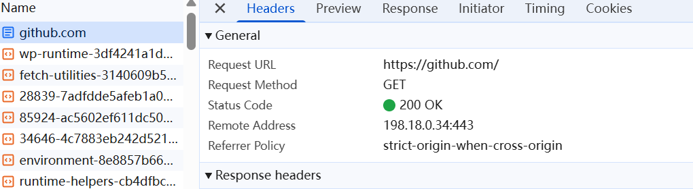

- 事实上访问`https://github.com/:443`也可以实现一样的效果,如果这么考量的话,我们看到`localhost:3000`等URL的时候就不会太迷糊
### 查询字符串
诸如下方这样的以`?`打头的查询参数非常常见,一般来说会用于搜索窗口上.
```text
http://www.joes-hardware.com/inventory-check.cgi?item=12731
```
### 片段
有时候我们会遇到以`#`打头的字符串,它表示该文档或者资源的一个片段,可以理解成某一章节或者某个特定图片:
```text
http://www.joes-hardware.com/tools.html#drills
```
## ch6: 代理
### 代理与网关的对比
代理连接的是多个使用相同协议的应用程序,而网关连接多个使用不同协议的断点,更像是协议转换器.
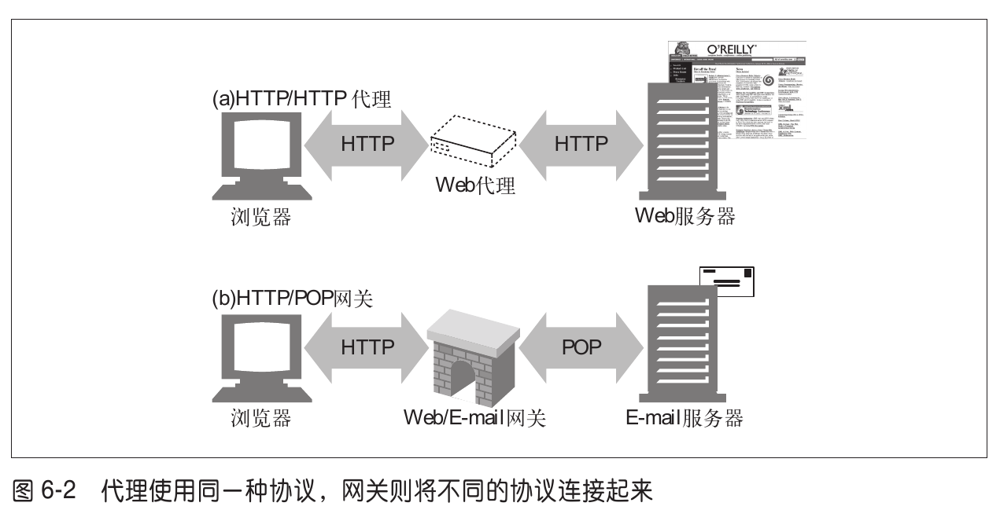

## ch8: 网关
网关进行协议间的转换,如"ftp转http","https转http"

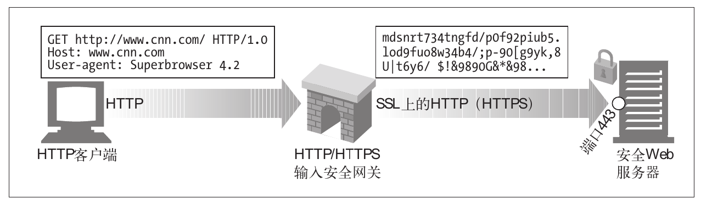
## 总结
由于内容太老,讲的也不深入,所以收获很少.
# 微服务设计
不推荐阅读
## 微服务
### 补充: 什么是微服务
- 这本书说了很多,但还是没说清楚
- [wiki](https://en.wikipedia.org/wiki/Microservices)

>In software engineering, a **microservice** architecture is an architectural pattern that organizes an application into a collection of loosely coupled, fine-grained services that communicate through lightweight protocols.

在具有不同功能的代码之间划清界限,将代码库分割到一个足够小的程度(有多小则看个人的考量),通过API和网络通信相互连接,每一部分都可以独立地运行,这就是**微服务**,每一部分的独立代码被称为**服务**(service).

- 也就是说微服务相当于是对**良好架构设计**的一个狂霸酷炫拽的称呼.
### 微服务的好处
1. 可以轻松的**升级/替换**某一个服务而不影响其他的服务
2. 可以轻松的扩展服务,而不需要重构整个项目
3. 由于各个服务的部署是独立的,在出问题时可以专精于出错的特定服务,容易定位和筛查

## 演化式架构师
架构师并不是建筑师,互联网行业也不是建筑行业,鉴于软件开发的多变性,我们需要灵活调整软件的架构.

>架构师应该专注在大方向上,在有限的情况下才会参与到具体的细节实现上.

## 部署
- 持续集成(Continuous Integration): 将新提交的代码与原代码进行集成,从而让所有人保持同步
- 持续交付(Continuous Delivery): 检查每次提交是否达到了部署到生产环境的要求

## 总结
前几章看看就可以了,收获并不大,不如直接看维基百科还来的快一些.
# Understanding The Linux Kernel(深入理解Linux内核)
不推荐阅读

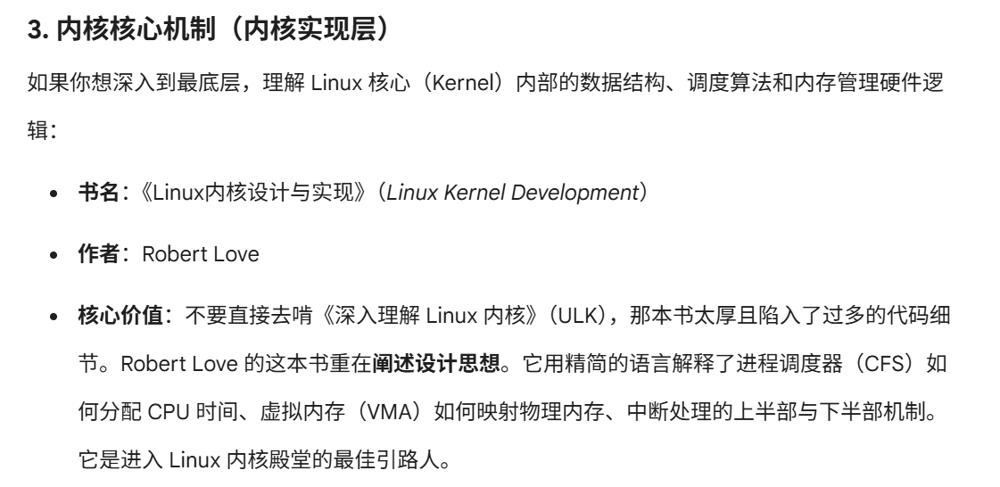
- 总结的太到位了,这本书确实写的很烂.
## 绪论
本书描述的是Linux2.6.11版的内核,而现在的Linux内核版本号都到7.1了,甚至还有不少代码是由rust写的:


### 操作系统基本概念
任何计算机系统都包含一个名为**操作系统**的基本程序集合,在这个集合里,最重要的程序称为**内核**(kernel).当操作系统启动时,内核被映射到内存中运行,是其他程序运行的基底


操作系统需要完成两个目标:
1. 与硬件部分交互
2. 为用户程序提供执行环境

某些系统如MS-DOS允许用户程序与硬件部分交互,但类Unix操作系统如Linux,MaCOS等将硬件部分隐藏起来,需要程序向操作系统发出请求才能通过内核与硬件部分交互.
### 用户与组
在多用户系统(支持多个用户使用)的系统中,每个用户在机器上都有自己专用的私有空间,所有用户由一个唯一的数字来标识,叫做用户标识符(User ID,UID),用户通过ID和口令来登录自己的账号.

类Unix操作系统都有一个特殊的用户,叫做**root**,即超级用户(superuser),他可以访问系统中的所有文件并干涉所有的用户程序.

### Unix文件系统
Unix文件被组织在一个树结构的命名空间中:
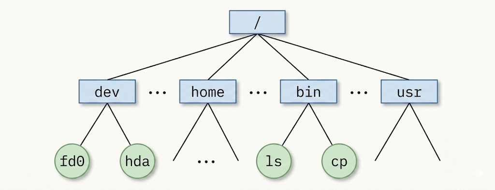

- 与树根对应的目录被称为根目录(root directory),名字是"/".

Unix的每个进程都有一个当前的工作目录,我们通过相对路径或者绝对路径来标识目录文件的位置.

- `.`和`..`分别标识当前工作目录和父目录.

## 内存寻址
### 地址
80x86微处理器架构下,存在以下三种地址:
1. 逻辑地址(logical address): 由一个段和偏移量组成,指定一个操作数或者一条指令的地址.
2. 虚拟地址(也称线性地址): 将指令映射到虚拟空间时的地址,在32位Linux系统中可寻址的空间为4GB
3. 物理地址: 虚拟地址实际映射的内存地址

#### 逻辑地址
具体来说,一个逻辑地址实际上是由16位长的段选择符和32位长的偏移量组成的.

处理器中提供了6个段寄存器用来存放**段选择符**:
1. cs: 代码段寄存器
   - 含有一个两位的字段,用于指明CPU的当前级别,0级为最高优先级,3级为最低优先级,Linux只用0和3级,称为内核态与用户态.
2. ss: 栈段寄存器
3. ds: 数据段寄存器
4. es,fs,gs: 通用型寄存器,可以指向任意的数据段.

### Cache
由于从内存(DRAM)中读取指令还是太慢了,我们设计了cache(高速缓存),它基于局部性原理设计: 最近最常用的相邻地址在将来又被用到的可能性极大.

80x86体系引入了一个叫做行(**line**)的单位,它由几十个连续的字节组成.cache就由多个行组成.

>Cache 单元位于分页单元与主内存之间。它由硬件 Cache 存储器（Hardware Cache Memory）和 Cache 控制器（Cache Controller）组成。Cache 存储器负责存放内存数据行。Cache 控制器则维护一个入口数组,每个入口对应的是Cache 存储器中的一行.

>Each entry includes a tag and
a few flags that describe the status of the cache line. The tag consists of some bits
that allow the cache controller to recognize the memory location currently mapped
by the line. The bits of the **memory’s physical address** are usually split into **three groups**: the most significant ones correspond to the tag, the middle ones to the cache controller subset index, and the least significant ones to the offset within the line.

>When accessing a RAM memory cell, the CPU extracts the subset index from the
physical address and compares the tags of all lines in the subset with the high-order
bits of the physical address. If a line with the same tag as the high-order bits of the
address is found, the CPU has a **cache hit**; otherwise, it has a **cache miss**.

- 也就是说缓存是否命中只需比对缓存控制器中的标签是否与RAM中的高位物理地址对应即可,还是很快的.

## 进程
- **进程**: 程序执行时的一个实例,进程之间有共享的程序代码,但每个进程都有独立的数据存储空间
- **线程**: 一个进程可以由一个或者多个线程组成
- **轻量级进程**: 轻量级进程间可以共享资源,一个轻量级进程对应一个线程.

### 进程描述符
进程描述符(process descriptor)存放了一个进程所有信息的结构体,它的主要结构如下:
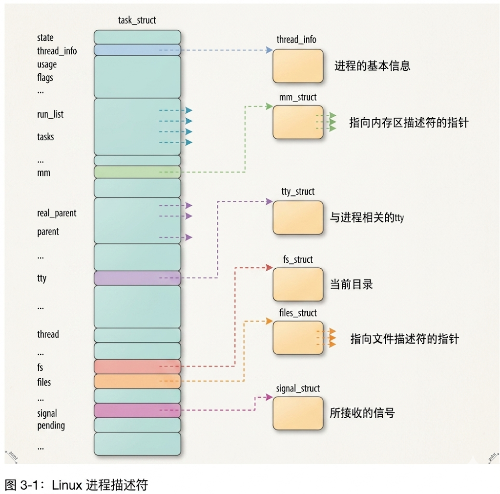

#### 进程的状态
进程可能处于以下状态中,状态之间是互斥的:
1. 可运行状态: 进程要么正在执行,要么准备执行
2. 中断状态: 进程被挂起,等待所需的信号或者资源,由进程主动执行.
3. 不可中断的等待状态: 进程被挂起,无法被信号唤醒,直到某个必要进程执行完毕
   - 例如Windows突然死机,用户无法执行任何操作
4. 暂停状态: 进程接收到信号后被强制暂停运行,进程是被动暂停的,这也是与2的不同点所在.
5. 跟踪状态: 当一个进程被另一个进程（通常是调试器如 GDB）监控时，它会进入 TASK_TRACED 状态。此时，被跟踪进程的执行权被完全移交给跟踪者。
6. 僵尸状态: 进程执行完毕后,父进程尚未开始处理关于该子进程的终止信息
7. 复活状态: 父进程开始处理子进程的终止信息

#### 进程的标识
类Unix操作系统中都有一个叫做进程标识符(**process ID**,PID)的数来标识进程,它同样位于进程描述符中.

- 同一个进程的多个线程使用相同的PID

#### 进程的组织
Linux使用双向链表来存储进程队列,并根据PID的不同将不同类型的PID分成了4个hash表:


当需要分配新进程时,会根据进程的PID字段进行hash映射到对应的空间中.

运行和等待状态的进程是最重要的,Linux内核为这两种进程设定了专门的队列用于调度进程.
- 运行队列: 将可运行状态的进程用链表组织在一起
- 等待队列: 将等待状态的进程用链表组织在一起

### 创建进程
传统的Unix操作系统使用唯一一种方式创建所有的进程: 子进程复制父进程所有的资源,这种方法的效率相当低下,现代Unix内核使用以下三种机制来优化进程创建:
1. 写时复制: 允许父进程和子进程读取相同的存储空间
2. 轻量级进程: 通过`clone()函数`创建,父子进程间共享各类数据
3. vfork()系统调用: 使用vfork()函数创建的进程可以与父进程共享相同的内存地址空间.

>看着迷糊吗,但这并非翻译的锅,原文同样也很迷糊,很好奇这本书为什么这么有名
## 中断和异常
- 中断: 由I/O设备,硬件设备发出
- 异常: 由CPU发出,有三种类型的异常
  - 故障(fault): 通常可以被纠正,之后会重新执行引起故障的指令
  - 陷阱(trap): 一般用于调试,之后不再执行故障指令,而是执行下一条指令
  - 中止(abort): 发生了严重错误,需要专门处理

## 总结
及时止损,看不下去了,显然作者沉浸在自己的代码分析世界里了,完全没能从一个更高的维度来对Linux的运作机制做一个概括
# GAME ENGINE ARCHITECTURE
- 内容太老了,而且很多概念都是宽泛的讲一下就结束了,没有深入.不推荐阅读.
## 导论
### 典型游戏团队的结构
- **工程师**: 设计引擎,制作游戏
- **艺术家**: 有很多分类
  - 概念艺术家: 制作整个游戏的蓝图
  - 三维建模师: 制作物体,角色,地形,建筑物
  - 灯光师: 布置光源,调整场景的美感
  - 动画师: 为角色,物体设计动作
  - 音效设计师
  - 作曲家
  - 配音演员
- **游戏设计师**: 有的在宏观上设定故事主线,整体的章节安排,有的在具体关卡中设定角色/道具的位置,设计游戏谜题和战斗场景
- **制作人**: 管理开发进度,联系其他公司.
- **发行商**: 负责游戏的市场策划,制造和分销.有些游戏工作室隶属于某些发行商,但也有很多独立工作室,他们会将游戏委托给条件最好的发行商.有时候还需要给跨越国际的游戏设置代理商.
### 游戏类型概览
#### 第一人称射击游戏(FPS)
该类游戏的开发难度很高,需要能够实现以下功能:
* 高效地渲染大型三维虚拟世界。
* 快速反应的摄像机控制及瞄准机制。
* 玩家的虚拟手臂和武器的逼真动画。
* 各式各样的手持武器。
* 宽容的玩家角色运动及碰撞模型，通常使游戏有种“漂浮”的感觉。
* 非玩家角色（NPC，如玩家的敌人及同盟）有逼真的动画及智能。
* 小规模在线多人游戏的能力（通常支持多至同时 64 位玩家在线），以及无处不在的死亡竞赛（death match）游戏模式。
#### 第三人称游戏
第三人称游戏的种类比较多,比如森林冰火人这种平台游戏,比如生化危机这种第三人称动作游戏,一般需要以下技术:
* 移动平台、梯子、绳子、棚架及其他有趣的运动模式。
* 用来解谜的环境元素。
* 第三人称的“跟踪摄像机”会一直注视玩家角色，也通常会让玩家用手柄右摇杆（在游戏主机上）或鼠标（在 PC 上）旋转摄像机（虽然在 PC 上有很多流行的第三人称射击游戏，但平台游戏类型几乎是游戏主机上独有的）。
* 复杂的摄像机碰撞系统，以保证视点不会穿过背景几何物体或动态的前景物体。

#### 其他类型
- 格斗游戏: 拳皇
- 竞速游戏: 卡丁车
- 实时策略游戏(real-time strategy,RTS): 魔兽称霸,星际争霸
- 大型多人在线游戏(massively multiplayer online game,MMO): 魔兽世界
- 体育游戏: 足球经理
- 角色扮演游戏(role playing game,RPG)


### 游戏开发全貌
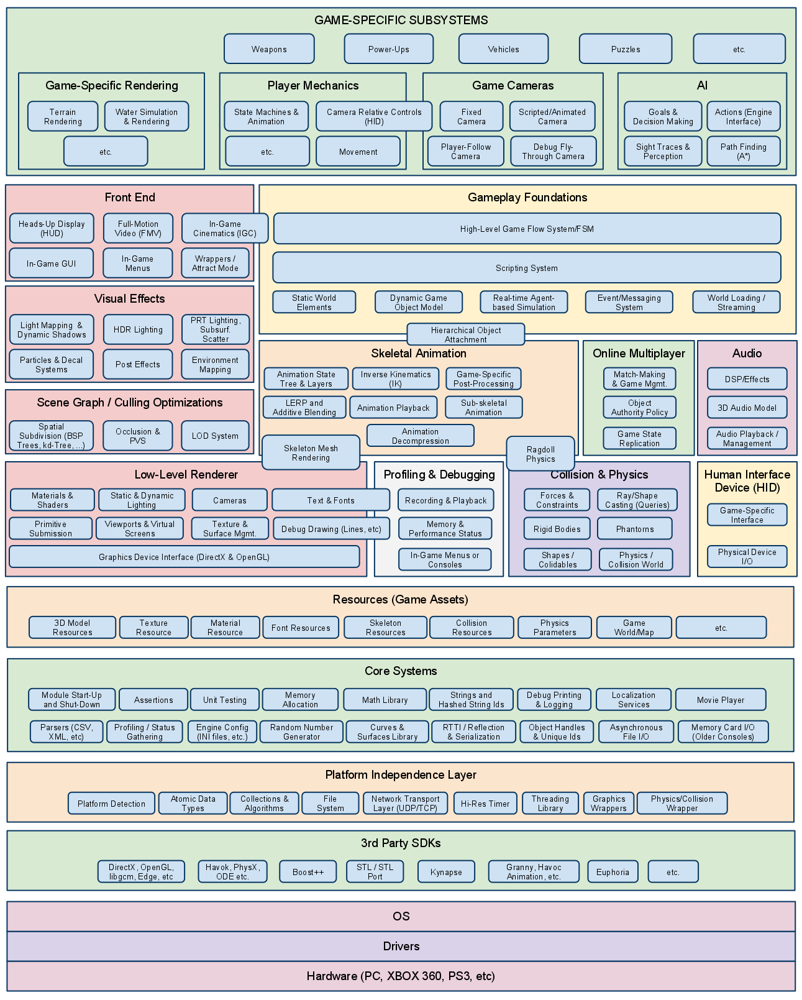
## 游戏支持系统
### 子系统的启动和终止
>游戏引擎由多个互相合作的子系统结合组成,当引擎启动/终止时,需要按照一定的顺序启动/终止子系统.

如果使用C++原生的构造函数和析构函数,尽管同一文件中的构造/析构顺序是一定的,但不同文件中的构造/析构顺序是未知的,那么这就会导致子系统的构造/析构顺序发生紊乱,导致程序崩溃.

书中提出的解决方法是:不使用原生的构造函数和析构函数,改成自定义的启动管理器函数和终止管理器函数,在调用某个子系统时,直接调用其启动函数,并在终止子系统时,调用终止函数.如此一来,就可以避免原生语法带来的混乱.
### 内存管理
由于new/malloc操作符需要操作系统从用户模式切换至内核模式来进行堆分配,存在一个**上下文切换**的时间开销,一旦这类动态内存分配多了,就会极大的影响游戏的运行速度.c++类游戏引擎为了解决这个问题,通常会定制分配器来是实现内存分配

## 总结
不推荐阅读...
# Multiplayer Game Programming
- 不推荐阅读
## OVERVIEW OF NETWORKED GAMES
- 简单讲了讲联网游戏的历史,可以直接略过不看.

## BERKELEY SOCKETS
### Sockets概览
>Originally released as part of BSD 4.2, the **Berkeley Sockets API** provides a standardized way
for processes to interface with various levels of the TCP/IP stack. Since its release, the API has
been ported to **every major operating system and most popular programming languages**, so it
is the veritable standard in network programming.

- 换句话说socket其实是Berkey研究组对网络协议和硬件交互的封装API,并在之后普及到了所有的主流操作系统和编程语言中.

创建一个socket对象可以这么写:
```cpp
SOCKET socket(int af,int type,int protocol);
```
1. af: address family,表示socket底层使用的是什么网络层协议,最常用的两个值是`AF_INET`:IPV4和`AF_INET6`:IPV6.
2. type: 表示通过socket传输的包的类型,最常用的有`SOCK_STREAM`,表示 `Packets represent segments of an ordered, reliable stream of data`,对应的传输层协议为TCP;另一个常用的是`SOCK_DGRAM`,表示`Packets represent discrete datagrams`,对应的传输层协议为UDP
3. protocol: 表示使用的具体传输层协议,常用值如下:

| Macro              | Required Type | Meaning                                     |
| ------------------ | ------------- | ------------------------------------------- |
| `IPPROTO_UDP`      | `SOCK_DGRAM`  | Packets wrap UDP datagrams                  |
| `IPPROTO_TCP`      | `SOCK_STREAM` | Packets wrap TCP segments                   |
| `IPPROTO_IP` / `0` | Any           | Use the default protocol for the given type |

- 如果protocl填0就表示选择type字段对应的传输层协议

4. To close a socket, regardless of type, use the closesocket function:
```cpp
int closesocket( SOCKET sock );
```
5. To cease transmitting or receiving before closing, use the shutdown function:
```cpp
int shutdown(SOCKET sock, int how)
```
## ch4&&ch5&&ch6
- 这几章书上讲的很烂,沉浸在自己的代码里了,但这部分的内容却是这本书的核心,我只好重新自己梳理一下

我们需要考虑一个问题,游戏联机与普通的网站开发不同,网站开发可以在前后端内传递json文件,将数据有组织的接收和传送,并存放在数据库中;

但是游戏联机要求我们玩家能够与服务器间进行低延迟通信,而且需要实际地更改玩家的游戏数据,有一个非常严重的问题就是,尽管玩家的账户数据是可以用数据库存储的,但游戏中的实时数据(比如玩家的位置,剩余血量等)是不能存放在数据库中的,这些实时数据彼此之间以指针相互引用,很有可能在不同玩家的主机上使用不同的内存地址:


因此,我们不能简单的把在玩家的本地数据映射到服务器数据上,实际的解决方法有两种:
- 状态同步 (State Synchronization)： 服务端计算所有游戏逻辑、碰撞和数值，将结果（如怪物坐标、玩家血量）广播给客户端。客户端只负责渲染。防作弊能力强，适合 MMORPG。
- 帧同步 (Lockstep / Frame Sync)： 服务端只负责收集转发玩家的操作输入（如：按了向左键），不计算逻辑。各个客户端在相同的帧执行相同的输入，计算出相同的结果。对网络延迟要求极高，流量小，适合 MOBA、格斗、局域网联机。

但谁来作为服务器呢?我们有两种解决方案:
1. Client-Server (C/S)：必须有一个中心节点（服务器）。所有客户端都只和服务器连，客户端之间不直接通信。
2. Peer-to-Peer (P2P)：没有固定的中心服务器，或者服务器只负责牵线。每个客户端（玩家）同时也是服务器，客户端之间直接互发数据。

### 不同的通信方案

#### 帧同步 ＋ P2P（早期经典）

* **代表作**：《魔兽争霸 3》、《星际争霸》、早期的局域网格斗游戏。
* **机制**：玩家 A 按了下技能，直接通过网络把“A 释放技能”的指令发给玩家 B，玩家 B 也把自己的操作发给 A。没有中央服务器算逻辑，大家各算各的。

#### 帧同步 ＋ C/S（现代主流）

* **代表作**：《王者荣耀》、《乱斗西游》。
* **机制**：玩家 A 按了向左走，这个输入先发给**中央服务器**。服务器收集齐这一帧所有玩家的输入后，打包成一个“帧包”，统一广播给所有玩家。客户端收到服务器的统一帧包后才开始执行。这样操作是为了解决 P2P 架构下某一个玩家断线导致全员卡死（Lockstep 严格同步）的问题。

#### 状态同步 ＋ C/S（绝对统治）

* **代表作**：《魔兽世界》、《反恐精英 (CS)》、《PUBG》。
* **机制**：这是最标准的组合。服务器在云端运行完整的游戏世界，算好一切，再把状态压进网络包发给客户端。客户端如果作弊改了本地坐标，服务器下一次状态刷新会直接强制把你拉回原位。

#### 状态同步 ＋ P2P（极少见/主机常用）

* **代表作**：<< 幻兽帕鲁 >> 。
* **机制**：为了省服务器成本，不架设中央高性能服务器。由系统自动选出一个玩家的电脑作为“主机（Host）”，它承担状态同步中“服务器”的角色，负责计算逻辑并广播给其他 P2P 连接的玩家。缺点是一旦该玩家退出，游戏就必须中断并“迁移主机”。

## 总结
不推荐阅读,前面两三章还可以,后面完全变成毫无意义的代码分析了.

## OBJECT REPLICATION
# 网络游戏核心技术与实战
- 讲的挺全面的,要想搞懂联机游戏是什么看这本书就对了.尽管如此,很多地方都讲的很啰嗦,实战代码部分也不够清晰,中规中矩吧.

## 要点总结
### 为什么不能用数据库存储游戏信息
>假如要在搭载了 6502 芯片的家用游戏机上使用 RDBMS 会怎么样呢？当然首先必须通过 SQL 语句，但是像 SELECT * from FlyingObjects 这样的语句，单单判断语法是否正确就要消耗几百个 CPU 周期，显然不现实。
>
>游戏编程必须在 1 帧内完成坐标的判断和保存。为此，必须只通过组合 CPU 所具有的一些最原始的命令来实现这些处理，只是读取数据就要花费几百个周期是相当不合理的。因此，在家用游戏机中，基本不考虑使用 RDBMS 这种方式。
# Agentic Design Patterns
不推荐阅读,一开始以为是讲Agent设计的,但实际上是讲一些宽泛的关于Agent使用的知识,调用几个框架就结束了,甚至还教你怎么写提示词😅
# AI Engineering Building Applications with Foundation Models
不推荐阅读,读起来有一种受骗上当的感觉...
# Generative AI with Python 
- 不推荐阅读
# 基于大模型的RAG应用开发与优化
- 值得一看,尽管很多地方都是不太重要的接口调用和代码分析,但讲的还算不错,能有不少收获


# Essential GraphRAG Knowledge Graph-Enhanced RAG
## 总结
很高兴能够看到这本书,尽管只有薄薄的一百多页,但它成功帮我拨开了关于RAG的迷雾,让我真正地明白了一件事:
- 在部署端使用RAG的效果是微乎其微的.

我们可以将RAG拆成一个比较完整的几步:
1. 将本地文件拆分成向量并存入向量数据库中
2. 调用第三方的embedding API或者使用本地部署的小模型来将用户的提示词转变成embedding层的向量
3. 根据提示词向量在数据库中查询得到关联度最大的文档向量(通常是计算两个向量的余弦相似度)
4. 将文档向量对应的文本块附加在提示词之后交给API
5. API返回经过了RAG的回答.

尽管如此,RAG的原型论文是说的用这一回答来微调大模型本身,而非用在API上的微调.如果我们需要让大模型来处理隐私文档和数据,那就不应该走API,而应该使用本地训练的模型,那么就无所谓RAG了,直接把内部文件作为初始训练语料就可以了;但话又说回来,不具备本地训练模型条件的公司和个人又不太需要保护所谓的内部知识库,大方交给API就行了.

而在如今,主流大模型的知识库储备都是相当恐怖的,完全不需要我们来给API额外提供公开的文档知识,如果你希望了解最近发生的事情,现在的AI甚至还可以主动去联网搜索,在大模型端进行RAG处理,而不需要我们这边提供任何的信息.

总体来看,要不要在部署端用RAG是相当矛盾的一件事,粗暴一点说的话,这事我看成不了.

>但话又说回来,在大模型端使用RAG确实很有必要,所以自2021年RAG被正式提出后,这方面的论文层出不穷
# 数据库系统实现
- 不推荐,内容太老了,讲的也比较宽泛
# C和指针
不推荐阅读,甚至没找到有必要做笔记的地方,你就说写的有多烂吧.


可是这种书却能拿到这么高的分数,反而说明了C系语言的教材有多么匮乏和枯燥.
# 深度探索C++对象模型
不推荐阅读,内容太老了,讲的也不清晰
# Linux内核设计与实现
- 尽管源码分析很多,好在都有一些比较概括性的介绍,只看介绍就行了,谁愿意看你那些破碎的代码分析呢.再说Linux的0.01版只有一万行代码,真要研究的话看那个也足够了.


## 进程管理
### 前置概念
- 进程: 处于执行期的程序
- 线程: 进程中活动的对象,在Linux中,线程是一种特殊的进程.
- 进程创建: Linux调用`fork`复制一个现有进程(父进程),创建一个新进程(子进程),执行完毕后,父进程恢复执行,子进程开始执行.
- 进程执行: Linjx调用`exec`创建新进程的地址空间,并通过`exit`终结进程.

进程有以下五种状态:
1. TASK_RUNNING: 进程是可执行的,要么正在执行,要么在运行队列中等待执行
2. TASK_INTERRUPTIBLE: 进程正在睡眠,等待某些条件被满足,一旦满足这些条件,进程就会进入TASK_RUNNING状态
3. TASK_UNINTERRUPTIBLE: 进程正在睡眠,但外界信号不会影响它,由进程主动进入其他状态
4. TASK_TRACED: 被其他进程跟踪的进程
5. TASK_STOPPRD: 进程没有运行也无法运行
### 进程描述符与任务结构
>Linux内核用一个叫做任务队列的双向循环链表来保存进程,链表中的每一项都是类型为`task_struct`,称为进程描述符(process descriptor)的结构,**包含一个具体进程的所有信息.**

内核通过一个唯一的进程标识值(process identification,PID)来标识每个进程.

Linux中所有的进程都是PID为1的init进程的后代.

### 进程创建
其他的操作提供都提供了产生(spawn)进程的机制: 在新的地址空间里创建进程,并读入可执行文件后开始执行;而Unix类操作系统将上述的两个步骤分解为两个函数: `fork和exec`.

首先,fork通过拷贝当前进程创建一个子进程,子进程的大部分数据与父进程相同,除了PID和PPID(父进程的进程号).

然后,exec负责读取可执行文件并将其载入地址空间开始运行.

#### 写时拷贝
由于整个复制父进程的数据非常浪费空间,如果在进程创建后马上运行一个可执行文件,在运行时与父进程共享同一份数据,那么就可以大大减小开销,这被称为**写时拷贝**.


### 线程
>在其他操作系统中,线程被称为"轻量级进程",可以消耗更少的资源迅速执行任务;而在Linux中,线程就像是一个普通的进程,只是会与其他的进程共享某些资源

## 进程调度
>当运行状态的进程数量多于处理器个数时,就必须要调度程序来决定哪些进程优先执行,哪些进程稍后执行.
### 补充: Linux调度程序的历史
- 由于这本书太老了,所以让AI介绍一下完整的调度程序历史

从 Linux 2.5 至今，调度器经历了四次重大的架构级跃迁：

#### 1. O(1) 调度器 (Linux 2.5 - 2.6.22)

**引入背景**：早期的 `O(N)` 调度器在每次挑选进程时，都要遍历链表中的所有进程，耗时与进程总数 $N$ 成正比。在多核、多进程环境下，CPU 时间全部浪费在了遍历链表上。

##### 核心特性与机制

* **常数级时间复杂度**：引入了 `runqueue`（运行队列）结构，每个 CPU 拥有独立的队列，挑选进程的时间复杂度变成了 $O(1)$，与系统内运行的进程数量无关。
* **双阵营设计（Active/Expired）**：每个队列包含两个位图（Bitmap）加链表的组合：
* **Active 阵营**：存放还有时间片的进程。
* **Expired 阵营**：存放时间片耗尽的进程。
* **切换方式**：CPU 总是通过汇编指令（如 `bsfl` 寻找位图第一个非 0 位）在 Active 阵营中极速查找优先级最高的进程。当 Active 清空，直接交换 Active 和 Expired 指针，周而复始。


* **启发式交互评估**：为了给桌面交互进程（如鼠标、键盘响应）提供低延迟，内核通过一套复杂的“启发式算法”，根据进程的睡眠时间来**猜测**它是不是交互进程。如果是，就给它更高的优先级，甚至在其时间片用完后继续留在 Active 阵营。

##### 淘汰原因

这套“猜测”算法很快成为了灾难。随着应用变复杂，内核无法通过简单的公式准确区分哪些是真正的交互进程。这导致大名鼎鼎的 3D 射击游戏《Doom 3》在当时的 Linux 上运行时，由于被误判为非交互进程，掉帧极其严重，引起了社区的强烈不满。

---

#### 2. RSDL 与 CFS (Linux 2.6.23 - 6.5)

**引入背景**：为了彻底废除 O(1) 调度器中恶心的“启发式猜测”，澳大利亚医生兼内核天才 Con Kolivas 提出了 RSDL（反转台阶截止日期调度器），证明了无需猜测、仅靠纯粹的公平数学模型就能完美搞定交互体验。受此启发，Ingo Molnar 在 2007 年的 Linux 2.6.23 中引入了 **CFS（Completely Fair Scheduler，完全公平调度器）**。

##### 核心特性与机制

* **红黑树取代链表**：CFS 废除了时间片的概念，改用红黑树（Red-Black Tree）来管理进程。
* **虚拟运行时间 ($vruntime$)**：这是 CFS 的灵魂。每个进程都有一个 $vruntime$，代表它在 CPU 上实际运行的“虚拟时间”。
* 优先级低（Nice 值大）的进程，其 $vruntime$ 增加得快；
* 优先级高（Nice 值小）的进程，其 $vruntime$ 增加得慢。


* **绝对公平调度**：CFS 的逻辑非常纯粹：**永远选择红黑树最左侧（即 $vruntime$ 最小值）的节点运行**。

$$vruntime_{new} = vruntime_{old} + \Delta exec\_time \times \frac{NICE\_0\_LOAD}{weight}$$

##### 淘汰原因

CFS 运行了 16 年，但它有一个致命的结构性缺陷：**它把“公平（Fairness）”和“延迟（Latency）”这两个维度绑定在了同一个 Nice 值（权重）上**。
当一个高优先级的音频进程长期睡眠后突然醒来，它的 $vruntime$ 虽然落后，但由于红黑树的机制，它必须按照既定的步长去追赶，CFS 无法在“不破坏全局公平性”的前提下，强制让它**立即**抢占 CPU，这在高吞吐量的服务器或混合负载下会导致无法忍受的毛刺延迟。

---

#### 3. EEVDF 调度器 (Linux 6.6 - 至今)

**引入背景**：为了彻底解决 CFS 的延迟毛刺，Linux 核心调度器维护者 Peter Zijlstra 在 2023 年（Linux 6.6）移除了 CFS，换上了基于 1995 年学术理论实现的 **EEVDF（Earliest Eligible Virtual Deadline First）**。

##### 核心特性与机制

* **解耦“公平”与“延迟”**：EEVDF 引入了两个全新维度来衡量进程：
1. **Eligible（可行性）**：通过计算 $Lag$（进程“应得的 CPU 时间”与“实际得到的 CPU 时间”之差）。如果 $Lag \ge 0$，说明进程被亏欠了，属于 Eligible 状态；如果 $Lag < 0$，说明它透支了，不合格。
2. **Virtual Deadline（虚拟截止日期）**：进程被允许运行的最终期限。对延迟极其敏感的任务，其 Deadline 会被设得非常近。


* **双阶筛选算法**：
* **第一步**：剔除所有透支的（非 Eligible）进程，只在合格 of 进程里挑。
* **第二步**：在合格进程中，**直接挑选 Virtual Deadline 最早的那一个运行**。


通过这种设计，一个短时间醒来的音频或 UI 进程，不仅合格，而且其截止日期极短，可以在不破坏长线公平的前提下，瞬间切入 CPU 执行，完美解决了延迟毛刺。

### 前置概念
#### 多任务
多任务操作系统支持并发执行多个进程,在单处理器计算机中,这会产生多个进程在同时运行的幻觉,而在多处理器计算机上,多个进程会在不同的处理器上真正地同时运行.

多任务系统有两种:
1. 非抢占式多任务: 除非进程主动停止运行,否则将会一直运行下去,现在的操作系统都不再采用这种方案
2. 抢占式多任务: 由系统调度程序来决定什么时候停止一个进程运行,以供其他进程在处理器上运行,这被称为**抢占**.这是绝大部分操作系统采用的方案.
#### 进程类型
进程大致可分为两种类型:
1. I/O消耗型: 大部分时间用来提交I/O请求或者等待I/O请求,经常处于可运行状态,但实际的运行时间很短
2. 处理器消耗型: 大部分时间用来执行,代表性的例子有那些大量执行数学计算的程序如MATLAB

Linux为了优化交互体验和提升性能,更倾向于优先调度I/O消耗型的进程.
#### 时间片
- 时间片: 进程被抢占前能持续运行的时间,默认情况下很短,比如10ms,从而保证系统与用户交互的延迟较低.
#### 进程优先级
进程调度的一个简单想法是: 优先级高的进程优先运行,相同优先级的进程轮流运行.

Linux采用两种不同的优先级算法:
1. 使用nice值: 它的范围从-20到+19,默认值为0,nice值越大优先级越低(你对系统中的其他进程太好了,让它们比你先运行).在Linux中,nice值越低,进程占用的时间片比例越高.
   1. 对应调度管理器算法
2. 使用实时优先级: 它的范围从0到99,数值越高进程优先级越高,可以手动配置,使用该类优先级算法的进程比默认使用nice值的进程优先级都高.
   1. 对应实时的调度策略,不受调度管理器管辖

### Linux调度算法
如果直接按照nice值映射到进程占用的时间片大小,会产生以下问题:
- nice值越高的进程占用的时间片越短,需要经过频繁的上下文切换,但这种进程往往是不应该被打断的计算密集型的后台进程,导致运行效率显著下降

Linux2.6版本引入了CFS(完全公平调度)机制:
1. 将nice值作为进程获得的处理器运行比的权重,而不是分得的时间片大小
2. 设定一个目标延迟值(如20ms),每个进程严格按照延迟值来运行,如果有4个进程,每个进程只能运行5ms;如果有20个进程,则只能运行1ms;
3. 设定一个最小时间片大小(如1ms),每个进程获得的时间片大小不得小于该长度
4. CFS通过红黑树来调度进程.

>显然,如果进程数量过多,必须让一些进程终止运行,否则进程的运行时间会小于最小时间片大小.

## 系统调用
- 系统调用: 用户进程与内核进行交互的一组接口,可以让应用程序在一定的限制下访问硬件设备
  - 实际使用方法和调用库函数没有任何的区别,所以就直接略过了
## 中断
- 中断: 由硬件向内核发出的常规通知,内核针对中断值来区分不同的中断信号
- 异常: 由处理器向内核发出的错误通知,实际处理方式与处理中断类似

>二者的差异就在于中断是由硬件引发而非由软件引发
## 内核同步
- 临界区: 存放共享数据的代码段
- 同步: 避免两个进程在同一个临界区中同时执行,因为进程调度中发生进程抢占的情况经常出现,例如中断,内核抢占和多处理器
- 加锁: 在进程执行时给临界区加锁可以让其他进程无法进入临界区,从而实现进程同步
- 死锁: 每个进程都在等待被加锁的资源才能继续执行,而这个资源被解锁的条件恰恰是该进程执行完毕
  - 自死锁: 一个进程在执行中申请获得自己持有的锁,那么该进程只能永远等待下去
  - 自旋锁(spin lock): 最多只能被一个可执行进程持有的锁,其他进程在等待该进程执行完毕时必须不停地反复询问,原地旋转(spin).
  - 读/写自旋锁: 多个读任务可以同时持有读者锁,但只能由一个写任务持有写者锁,且写者代码执行时不可以有读者代码同时执行.**该类锁显然是针对读写任务设计的**
  - 信号量: 信号量是一种睡眠锁,如果一个进程试图获取被占用的信号量时,将会被推进一个等待队列并睡眠,只有当信号量被释放时才能被唤醒.**该类锁是针对需要长时间执行的进程设定的.**

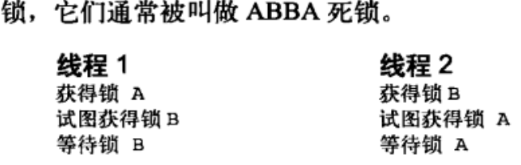

## 时间管理
1. **处理器的时钟频率是可调的**,操作系统可以根据自己的需要动态调节时钟频率,这也是为什么在低功耗模式下打游戏会卡顿,时钟频率下降后,单位时间内操作系统能够处理的任务数就变少了.
2. 更高的时钟频率可以提高内核定时器的精度,细化每个任务的分配时间,从而提高整体的运行速度.
## 虚拟文件系统(virtual file system,VFS)
>之所以我们能够直接对外接硬盘进行操作,就是虚拟文件系统的功劳

VFS定义了所有文件系统都支持的接口,通过把文件视为文件对象来做统一的处理.

VFS 中有四个主要的对象类型，它们分别是：

* 超级块对象，它代表一个具体的已安装文件系统。
* 索引节点对象，它代表一个具体文件。
* 目录项对象，它代表一个目录项，是路径的一个组成部分。
* 文件对象，它代表由进程打开的文件。
## 块I/O层

- 块设备: 能够随机访问固定大小的数据片的硬件设备,如硬盘和闪存
- 字符设备: 可以按照字符流的方式有序访问,如键盘和音箱
- 块: 文件系统的最小寻址单元,为固定大小的数据片,需要是扇区的整数倍大小,通常为4KB
- 扇区: 设备的最小寻址单元,为512B/4KB大小
- 缓冲区: 块被调入内存时的存储区,每个缓冲区对应一个块
### I/O调度程序
Linux2.6中同时存在四种I/O调度程序:

| 调度器                | 主要目标       | 特点                                               |
| --------------------- | -------------- | -------------------------------------------------- |
| `noop`                | 尽量少做事     | 简单 FIFO，适合硬件自己已经会调度的场景            |
| `deadline`            | 避免请求饿死   | 给请求设置期限，尤其保护读请求延迟                 |
| `anticipatory` / `as` | 预测后续读请求 | 服务完一次读请求后短暂等待，避免马上切去远处写请求 |
| `cfq`                 | 公平性         | 按进程/队列分配 I/O 时间，强调公平和桌面体验       |


## 进程地址空间
用户空间中的进程内存被称为**进程地址空间**,由虚拟内存(VMA)映射而成.

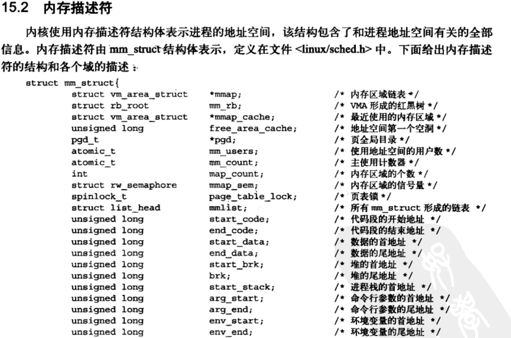

将虚拟内存映射到物理内存是通过页表实现的:


# 深度学习理论与实战：基础篇
- 写的不是很好,也不够通俗,看的出来很多论述都是戛然而止的,非常浅显,我只能认为是被编辑砍掉了,不然和姊妹书的差别还是太大了
# 深度学习理论与实战：提高篇(待补充)
- 这本书我是偶然发现的,知名度并不高,但是里面的不少内容都讲的很好,比起某些深度依赖框架的深度学习书好很多,希望能有更多人看到这种优秀的中文文章.
## 人脸识别简介
# Hello算法
- [官网](https://www.hello-algo.com/chapter_computational_complexity/time_complexity/#5-olog-n)
## 前言
说来也好笑,尽管我一开始学算法时觉得这本书写的不太好,转而去看其他的算法书了,但现在回头重学算法的时候却发现,这本书的目录编排恰恰是我想要学习的内容:


缘分就是这么妙不可言.
## 数据结构
### 基本数据结构
链表
```cpp
struct ListNode{
  int val;
  ListNode* next;
  ListNode(int x): val(x),next(nullptr){}
};
```
列表
```cpp
vector<int> nums;
nums.clear();
nums.push_back(1);
nums.insert(nums.begin()+1,6);
nums.erase(nums.begin()+1);
sort(nums.begin(),nums.end());
```
- 之所以不叫push是因为vector还可以从前端插入,但实际上并没有`push_front`方法,因为开销太大了

栈
```cpp
stack<int> stack;
stack.push(1);
stack.push(2);

int top = stack.top();

stack.pop();

int size =stack.size();

bool empty =stack.empty();
```

队列
```cpp
queue<int> queue;
queue.push(1);
queue.push(2);

int front = queue.front();

queue.pop();

int size =queue.size();

bool empty =queue.empty();
```

双向队列(double-ended queue)
```cpp
deque<int> deque;
deque.push_back(1);
deque.push_front(2);

int front =deque.front();
int back =deque.back();

deque.pop_front();
deque.pop_back();

int size = deque.size();

bool empty =deque.empty();
```
哈希表
```cpp
unordered_map<int,string>map;

map[12345]="hello";
string name = map[12345];

map.erase(12345);

/* 遍历哈希表 */
// 遍历键值对 key->value
for (auto kv: map) {
    cout << kv.first << " -> " << kv.second << endl;
}
// 使用迭代器遍历 key->value
for (auto iter = map.begin(); iter != map.end(); iter++) {
    cout << iter->first << "->" << iter->second << endl;
}
```


### 进阶数据结构
#### 二叉树
```cpp
/* 二叉树节点结构体 */
struct TreeNode {
    int val;          // 节点值
    TreeNode *left;   // 左子节点指针
    TreeNode *right;  // 右子节点指针
    TreeNode(int x) : val(x), left(nullptr), right(nullptr) {}
};

/* 初始化二叉树 */
// 初始化节点
TreeNode* n1 = new TreeNode(1);
TreeNode* n2 = new TreeNode(2);
TreeNode* n3 = new TreeNode(3);
TreeNode* n4 = new TreeNode(4);
TreeNode* n5 = new TreeNode(5);
// 构建节点之间的引用（指针）
n1->left = n2;
n1->right = n3;
n2->left = n4;
n2->right = n5;
```
层序遍历,本质上是广度优先遍历
```cpp
/* 层序遍历 */
vector<int> levelOrder(TreeNode *root) {
    // 初始化队列，加入根节点
    queue<TreeNode *> queue;
    queue.push(root);
    // 初始化一个列表，用于保存遍历序列
    vector<int> vec;
    while (!queue.empty()) {
        TreeNode *node = queue.front();
        queue.pop();              // 队列出队
        vec.push_back(node->val); // 保存节点值
        if (node->left != nullptr)
            queue.push(node->left); // 左子节点入队
        if (node->right != nullptr)
            queue.push(node->right); // 右子节点入队
    }
    return vec;
}
```
三种深度优先遍历:
```cpp
/* 前序遍历 */
void preOrder(TreeNode *root) {
    if (root == nullptr)
        return;
    // 访问优先级：根节点 -> 左子树 -> 右子树
    vec.push_back(root->val);
    preOrder(root->left);
    preOrder(root->right);
}

/* 中序遍历 */
void inOrder(TreeNode *root) {
    if (root == nullptr)
        return;
    // 访问优先级：左子树 -> 根节点 -> 右子树
    inOrder(root->left);
    vec.push_back(root->val);
    inOrder(root->right);
}

/* 后序遍历 */
void postOrder(TreeNode *root) {
    if (root == nullptr)
        return;
    // 访问优先级：左子树 -> 右子树 -> 根节点
    postOrder(root->left);
    postOrder(root->right);
    vec.push_back(root->val);
}
```
尽管上述代码很简单,但在简单算法题中的用法确实就有这么简单.
#### 二叉搜索树
查找
```cpp
/* 查找节点 */
TreeNode *search(int num) {
    TreeNode *cur = root;
    // 循环查找，越过叶节点后跳出
    while (cur != nullptr) {
        // 目标节点在 cur 的右子树中
        if (cur->val < num)
            cur = cur->right;
        // 目标节点在 cur 的左子树中
        else if (cur->val > num)
            cur = cur->left;
        // 找到目标节点，跳出循环
        else
            break;
    }
    // 返回目标节点
    return cur;
}
```

插入
```cpp
/* 插入节点 */
void insert(int num) {
    // 若树为空，则初始化根节点
    if (root == nullptr) {
        root = new TreeNode(num);
        return;
    }
    TreeNode *cur = root, *pre = nullptr;
    // 循环查找，越过叶节点后跳出
    while (cur != nullptr) {
        // 找到重复节点，直接返回
        if (cur->val == num)
            return;
        pre = cur;
        // 插入位置在 cur 的右子树中
        if (cur->val < num)
            cur = cur->right;
        // 插入位置在 cur 的左子树中
        else
            cur = cur->left;
    }
    // 插入节点
    TreeNode *node = new TreeNode(num);
    if (pre->val < num)
        pre->right = node;
    else
        pre->left = node;
}
```

删除
```cpp
/* 删除节点 */
void remove(int num) {
    // 若树为空，直接提前返回
    if (root == nullptr)
        return;
    TreeNode *cur = root, *pre = nullptr;
    // 循环查找，越过叶节点后跳出
    while (cur != nullptr) {
        // 找到待删除节点，跳出循环
        if (cur->val == num)
            break;
        pre = cur;
        // 待删除节点在 cur 的右子树中
        if (cur->val < num)
            cur = cur->right;
        // 待删除节点在 cur 的左子树中
        else
            cur = cur->left;
    }
    // 若无待删除节点，则直接返回
    if (cur == nullptr)
        return;
    // 子节点数量 = 0 or 1
    if (cur->left == nullptr || cur->right == nullptr) {
        // 当子节点数量 = 0 / 1 时， child = nullptr / 该子节点
        TreeNode *child = cur->left != nullptr ? cur->left : cur->right;
        // 删除节点 cur
        if (cur != root) {
            if (pre->left == cur)
                pre->left = child;
            else
                pre->right = child;
        } else {
            // 若删除节点为根节点，则重新指定根节点
            root = child;
        }
        // 释放内存
        delete cur;
    }
    // 子节点数量 = 2
    else {
        // 获取中序遍历中 cur 的下一个节点
        TreeNode *tmp = cur->right;
        while (tmp->left != nullptr) {
            tmp = tmp->left;
        }
        int tmpVal = tmp->val;
        // 递归删除节点 tmp
        remove(tmp->val);
        // 用 tmp 覆盖 cur
        cur->val = tmpVal;
    }
}
```
#### 堆
- 堆是一种完全二叉树,可以使用优先队列实现.分为根节点最大的大顶堆和根节点最小的小顶堆

```cpp
#include <queue>
#include <vector>
#include <functional>

std::priority_queue<T, Container, Compare> pq;
```

cpp的优先队列默认的底层容器是vector,默认采用大顶堆:
```cpp
// 默认写法为大顶堆
std::priority_queue<int> pq;

// 小顶堆,由于第三个参数依赖第二个参数,所以要全部写出来
std::priority_queue<int, std::vector<int>, std::greater<int>> pq;

pq.push(3);
pq.push(1);
pq.push(5);

std::cout << pq.top(); // 1
```


```cpp
/* 初始化堆 */
// 初始化小顶堆
priority_queue<int, vector<int>, greater<int>> minHeap;
// 初始化大顶堆
priority_queue<int, vector<int>, less<int>> maxHeap;

/* 元素入堆 */
maxHeap.push(1);
maxHeap.push(3);
maxHeap.push(2);
maxHeap.push(5);
maxHeap.push(4);

/* 获取堆顶元素 */
int peek = maxHeap.top(); // 5

/* 堆顶元素出堆 */
// 出堆元素会形成一个从大到小的序列
maxHeap.pop(); // 5
maxHeap.pop(); // 4
maxHeap.pop(); // 3
maxHeap.pop(); // 2
maxHeap.pop(); // 1

/* 获取堆大小 */
int size = maxHeap.size();

/* 判断堆是否为空 */
bool isEmpty = maxHeap.empty();

/* 输入列表并建堆 */
vector<int> input{1, 3, 2, 5, 4};
priority_queue<int, vector<int>, greater<int>> minHeap(input.begin(), input.end());
```

#### 图
实际的图有两种表示方法:
1. 邻接矩阵: 有n个节点就要用nxn大小的矩阵来表示
2. 邻接表: 存储实际存在的边,空间复杂度更小,但时间复杂度更高.
## 算法
### 搜索
#### 二分查找(过)
### 排序
#### 选择排序(selection sort)
>每轮从未排序的区间选择最小的元素,将其放到已排序区间的末尾

```cpp
/* 选择排序 */
void selectionSort(vector<int> &nums) {
    int n = nums.size();
    // 外循环：未排序区间为 [i, n-1]
    for (int i = 0; i < n - 1; i++) {
        // 内循环：找到未排序区间内的最小元素
        int k = i;
        for (int j = i + 1; j < n; j++) {
            if (nums[j] < nums[k])
                k = j; // 记录最小元素的索引
        }
        // 将该最小元素与未排序区间的首个元素交换
        swap(nums[i], nums[k]);
    }
}
```
这显然是O(n^2)的时间复杂度,对于相同大小的元素,有可能发生相对顺序的改变,因此是非稳定的:


#### 冒泡排序(bubble sort)
>连续地与相邻元素交换,每一轮将当前最大的元素交换至正确位置

```cpp
/* 冒泡排序（标志优化）*/
void bubbleSortWithFlag(vector<int> &nums) {
    // 外循环：未排序区间为 [0, i]
    for (int i = nums.size() - 1; i > 0; i--) {
        bool flag = false; // 初始化标志位
        // 内循环：将未排序区间 [0, i] 中的最大元素交换至该区间的最右端
        for (int j = 0; j < i; j++) {
            if (nums[j] > nums[j + 1]) {
                // 交换 nums[j] 与 nums[j + 1]
                // 这里使用了 std::swap() 函数
                swap(nums[j], nums[j + 1]);
                flag = true; // 记录交换元素
            }
        }
        if (!flag)
            break; // 此轮“冒泡”未交换任何元素，直接跳出
    }
}
```
由于相等元素之间不交换,所以,前后顺序能够保持不变,是稳定的.
#### 插入排序(insertion sort)
>从第一个元素开始保证局部有序,不断将后面的元素插入到前面已经排序好的队列中

```cpp
/* 插入排序 */
void insertionSort(vector<int> &nums) {
    // 外循环：已排序区间为 [0, i-1]
    for (int i = 1; i < nums.size(); i++) {
        int base = nums[i], j = i - 1;
        // 内循环：将 base 插入到已排序区间 [0, i-1] 中的正确位置
        while (j >= 0 && nums[j] > base) {
            nums[j + 1] = nums[j]; // 将 nums[j] 向右移动一位
            j--;
        }
        nums[j + 1] = base; // 将 base 赋值到正确位置
    }
}
```
由于需要遍历读取和遍历查找,所以还是n^2的时间复杂度.如果如上述示例中所写,相等的值将会被插入到右侧,因此是稳定的.

#### 快速排序(quick sort)
- 逻辑比较复杂,所以我以前学算法的时候都没彻底搞懂快排...

>首先锚定一个基准数,将左侧比基准数大的放到右侧,右侧比基准数小的放到左侧,处理完后的两边对于基准数来说是有序的,之后再递归处理即可.


```cpp
/* 哨兵划分 */
int partition(vector<int> &nums, int left, int right) {
    // 以 nums[left] 为基准数
    int i = left, j = right;
    while (i < j) {
        while (i < j && nums[j] >= nums[left])
            j--;                // 从右向左找首个小于基准数的元素
        while (i < j && nums[i] <= nums[left])
            i++;                // 从左向右找首个大于基准数的元素
        swap(nums[i], nums[j]); // 交换这两个元素
    }
    swap(nums[i], nums[left]);  // 将基准数交换至两子数组的分界线
    return i;                   // 返回基准数的索引
}

/* 快速排序 */
void quickSort(vector<int> &nums, int left, int right) {
    // 子数组长度为 1 时终止递归
    if (left >= right)
        return;
    // 哨兵划分
    int pivot = partition(nums, left, right);
    // 递归左子数组、右子数组
    quickSort(nums, left, pivot - 1);
    quickSort(nums, pivot + 1, right);
}
```
#### 归并排序(merge sort)
>大致想法其实和快速排序差不多,都是将大数组不断拆分成小数组后进行排序,不同的是快速排序在拆分前就排序,而归并排序是在拆分后进行排序
```cpp
/* 合并左子数组和右子数组 */
void merge(vector<int> &nums, int left, int mid, int right) {
    // 左子数组区间为 [left, mid], 右子数组区间为 [mid+1, right]
    // 创建一个临时数组 tmp ，用于存放合并后的结果
    vector<int> tmp(right - left + 1);
    // 初始化左子数组和右子数组的起始索引
    int i = left, j = mid + 1, k = 0;
    // 当左右子数组都还有元素时，进行比较并将较小的元素复制到临时数组中
    while (i <= mid && j <= right) {
        if (nums[i] <= nums[j])
            tmp[k++] = nums[i++];
        else
            tmp[k++] = nums[j++];
    }
    // 将左子数组和右子数组的剩余元素复制到临时数组中
    while (i <= mid) {
        tmp[k++] = nums[i++];
    }
    while (j <= right) {
        tmp[k++] = nums[j++];
    }
    // 将临时数组 tmp 中的元素复制回原数组 nums 的对应区间
    for (k = 0; k < tmp.size(); k++) {
        nums[left + k] = tmp[k];
    }
}

/* 归并排序 */
void mergeSort(vector<int> &nums, int left, int right) {
    // 终止条件
    if (left >= right)
        return; // 当子数组长度为 1 时终止递归
    // 划分阶段
    int mid = left + (right - left) / 2;    // 计算中点
    mergeSort(nums, left, mid);      // 递归左子数组
    mergeSort(nums, mid + 1, right); // 递归右子数组
    // 合并阶段
    merge(nums, left, mid, right);
}
```

- 实际上我并没有听说过有什么程序使用归并排序来处理数据结构的.

#### 堆排序(heap sort)

```cpp
/* 堆的长度为 n ，从节点 i 开始，从顶至底堆化 */
void siftDown(vector<int> &nums, int n, int i) {
    while (true) {
        // 判断节点 i, l, r 中值最大的节点，记为 ma
        int l = 2 * i + 1;
        int r = 2 * i + 2;
        int ma = i;
        if (l < n && nums[l] > nums[ma])
            ma = l;
        if (r < n && nums[r] > nums[ma])
            ma = r;
        // 若节点 i 最大或索引 l, r 越界，则无须继续堆化，跳出
        if (ma == i) {
            break;
        }
        // 交换两节点
        swap(nums[i], nums[ma]);
        // 循环向下堆化
        i = ma;
    }
}

/* 堆排序 */
void heapSort(vector<int> &nums) {
    // 建堆操作：堆化除叶节点以外的其他所有节点
    for (int i = nums.size() / 2 - 1; i >= 0; --i) {
        siftDown(nums, nums.size(), i);
    }
    // 从堆中提取最大元素，循环 n-1 轮
    for (int i = nums.size() - 1; i > 0; --i) {
        // 交换根节点与最右叶节点（交换首元素与尾元素）
        swap(nums[0], nums[i]);
        // 以根节点为起点，从顶至底进行堆化
        siftDown(nums, i, 0);
    }
}
```
### 动态规划(dynamic programming)
要点:
1. 明确初始状态
2. 找到状态转移方程
3. 开始递归

>**无后效性**是动态规划能够有效解决问题的重要特性之一，其定义为：给定一个确定的状态，它的未来发展只与当前状态有关，而与过去经历的所有状态无关。

如果待求解问题的"有后效性"特别显著,那么就不能用动态规划,而是换成其他的算法.
#### 背包问题
>在一定的背包容量下,尽可能让装入物品的总价值最大.

之所以背包问题能够用动态规划来解决,也是因为我们可以将背包问题拆分成逐个放入物品的过程,当前的最大价值只与当前放入的物品有关.

**0-1背包问题**

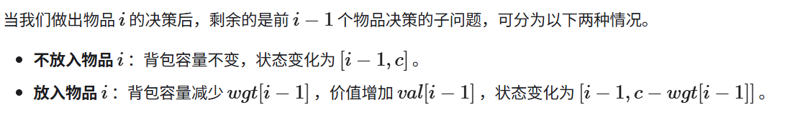

**完全背包问题**

之所以叫完全背包,是因为每个物品都可以重复选取


# 计算机组成与设计: 硬件/软件接口
## 教材介绍和错误澄清
- 这本书的作者是John L. Hennessy 与 David A. Patterson,都是硬件领域中极其杰出的人物


>这本书有三个指令集版本: RISC-V 版、MIPS 版和 ARM 版。当然推荐看新兴的RISC-V版本,如果出于国内应试的考量,就只能看MIPS版本了.

>"There are two textbooks for the course: Computer Organization and Design by Patterson and Hennessy... The expectation is that the same text will also be useful to you in a later architecture course (CS 152). Do not get 'Computer Architecture, a Quantitative Approach' by mistake; it's a similar-looking graduate text by the same authors."
>
>千万不要错买成《计算机体系结构：量化研究方法》(CAQA)，那是一本看起来很像、但由同作者撰写的研究生阶段教材

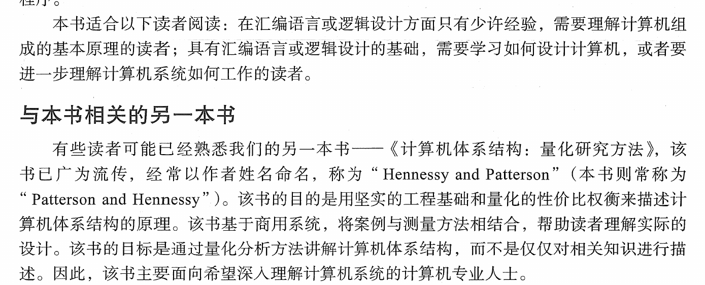

- 没错,我就是那个不小心先看了CAQA的人,在没有前置基础的情况下确实看的有点难受.
## 引言
**计算机体系结构的7个伟大设计思想:**
1. 使用抽象来隐藏底层实现细节,简化设计
2. 加速大概率事件,这比优化小概率事件更能提高性能
3. 通过并行来提高性能
4. 通过流水线提高性能
5. 通过预测来提高性能
6. 设计分层的存储器
7. 通过冗余提高系统的可靠性

## 指令
### 前置概念
- MIPS的寄存器有32个,大小均为32位,由于对32位数据进行整体操作的情况经常出现,所以将32位的数据称为字(**word**).
  - 也有64位的MIPS,但没必要了解.
- MIPS约定书写指令时用一个`$`后面跟两个字符来表示寄存器,比如说用`$s0`,`$s1`表示常规寄存器,用`$t0`表示临时寄存器.

>由于MIPS是按字节编址的,但指令都是32位的,所以加上偏移量比如说8时,实际上是加上了4x8个字节,这样才能正确读到A[8]处存储的指令,而不会错读到A[8/4].

| 硬件概念        | 数学表示 (十六进制) | 物理对应关系                                                   |
| --------------- | ------------------- | -------------------------------------------------------------- |
| **PC = 0x0000** | 基准地址            | 指向物理内存中的 **第 0 个字节**（里面包含 8 个 bit）          |
| **PC = 0x0001** | 地址加 1            | 指向物理内存中的 **第 1 个字节**（里面包含另外 8 个 bit）      |
| **PC = 0x0004** | 地址加 4            | 指向物理内存中的 **第 4 个字节**（跨过了 1 个 32 位的字/指令） |


### 基本操作数

1. add(加法)/sub(减法)指令后一般跟三个寄存器,第一个寄存器存储计算结果,后两个为要参与运算的寄存器
2. load指令用来装载从存储器复制到寄存器的数据,使用`lw`和`lb`符号,表示`load word`和`load byte`
3. store指令用来将数据从寄存器复制到寄存器中,使用`sw`和`sb`符号,表示`store word`和`store byte`.
4. MIPS中经常会用到常数运算,因此专门设计了立即数的加减法,记为`addi`,即`add immediate`,如`addi $s3,$s3,4`.

>MIPS还支持对半字和无符号半字的存取


### 基本指令格式
MIPS为了保证所有的指令长度均为32位,针对不同的需求,将不同类型的指令拆分成了不同的指令格式,最常用的格式为R型和I型.

R型,用于普通的寄存器运算指令:
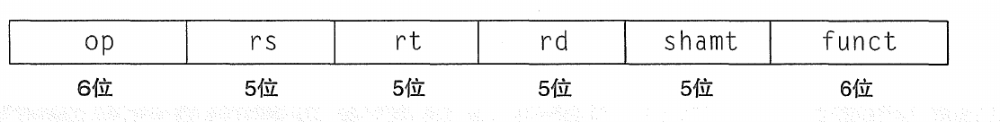

I型,用于立即数和数据传送指令:
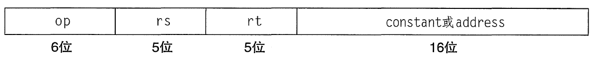

- op: 操作码(opcode)
- rs: 第一个寄存器
- rt: 第二个寄存器
- rd: 存放操作结果的寄存器
- shamt: 移位量(shift amount),若用不到则置为0
- funct: 功能码,用于操作码的扩展.


>可以看到,例题中的写法是把rd放在最前面了,但操作码格式中rd是放在最后面的,这个真心搞不太懂.
### 进阶操作数
**逻辑指令:**
1. 移位(shift): 分为左移(shift left logical,sll)和右移(srl)
2. 按位操作:按位与(AND)和按位或(OR),会逐个比较位数得出结果.
3. 或非指令(NOT OR,NOR): 为了保持三操作数的格式,MIPS用NOR来代替普通的NOT指令,只需要将一个辅助寄存器的值设定为0,结果就等价于NOT.

**决策指令**:
1. 分支指令: beq(branch if equal)和bne(branch if not equal),例子如下:

```bash
beq r1,r2,l1
```
如果r1与r2中的数值相等,则跳转到标签l1

```bash
bne r1,r2,l1
```
如果r1与r2中的数值不相等,则跳转到标签l1

2. 无条件分支指令: 即跳转指令`jr`,表示jump register,如`jr r1`
3. 跳转并链接指令: jump-and-link,jal,会在跳转地址的同时,将下一条指令的地址保存在特定的返回地址寄存器中.
## 算术运算
### 加法和减法
在加法和减法运算中,可能发生溢出,MIPS使用两种类型的算术指令来解决溢出:
1. add,addi,sub在溢出时抛出异常
2. addu,addiu,subu,在溢出时不产生异常

>由于C语言忽略溢出,所以MIPS C编译器只是用第二种算术指令.
### 乘法
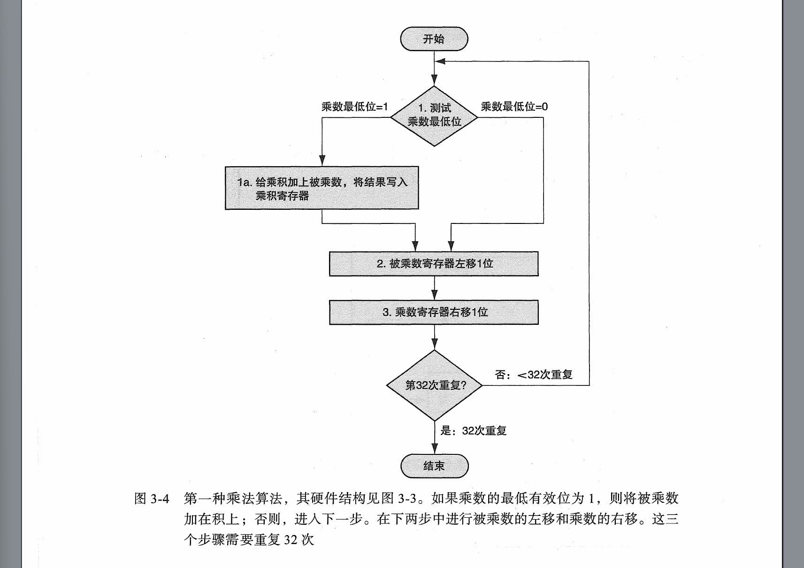

如果我们将乘数的32位全部拆开,每一位分别用到一个加法器的话,就可以大幅度加速运算:


上面讨论的是正数乘法,如果是有符号乘法的话,符号位不参与运算即可.

MIPS提供了两条乘法指令: 乘法(mult)和无符号乘法(multu)
### 除法
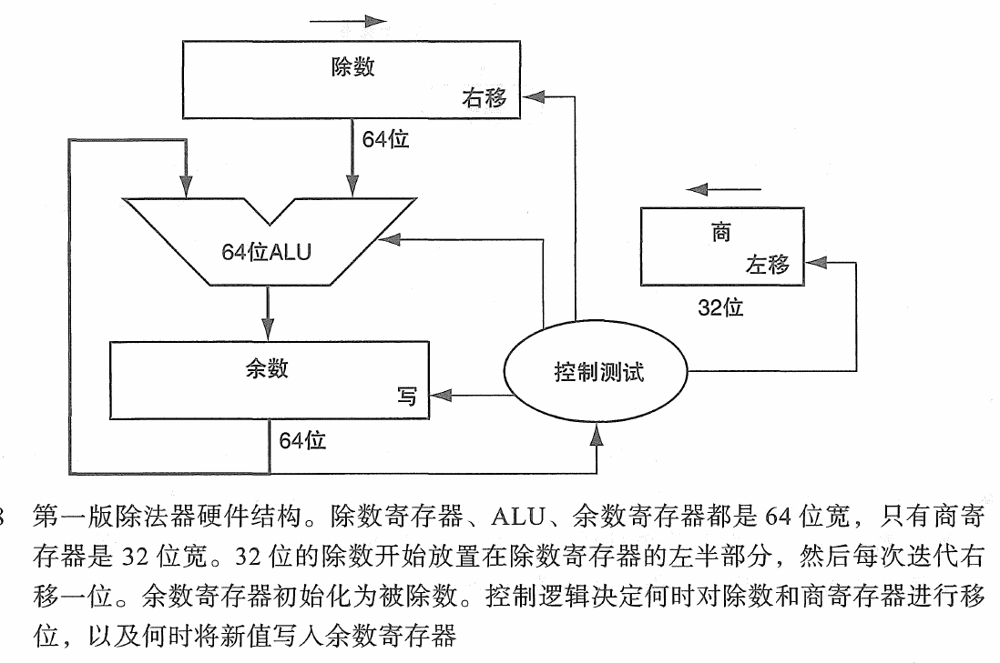


解释一下流程:
1. 之所以除数寄存器和余数寄存器是商寄存器的双倍长度,是因为要保证除数能从最高位慢慢向右移动,才知道够不够除被除数
2. 一开始余数寄存器初始化为被除数,发现余数比除数大时,将商寄存器左移,最低位记为1,否则记为0
3. 除数寄存器右移1位,继续相除,如果余数比除数小,则说明计算完成,可以退出循环,余数寄存器中的值则为最终的余数

>这个设计还是很精妙的,不是那么容易看懂的.

MIPS中提供了两条除法指令: 除法(div)和无符号除法(divu)

### 浮点运算
浮点数的基本运算法则与整数计算没有区别,只是要考虑一下指数的转换.


MIPS中有以下浮点计算指令:
- 浮点单精度加 (add.s) 和双精度加 (add.d) 。
- 浮点单精度减 (sub.s) 和双精度减 (sub.d) 。
- 浮点单精度乘 (mul.s) 和双精度乘 (mul.d) 。
- 浮点单精度除 (div.s) 和双精度除 (div.d) 。
## 附录B: 逻辑设计基础(过)
- 书上讲的太烂了,只好另外找书恶补基础了

现代计算机的内部电路为数字电路,只工作在两个电压: 高电压和低电压,与二进制的0和1相匹配.

数字电路按照是否包含存储器件(电容,电感)可以分成两种逻辑电路:
1. 组合逻辑(combinational logic): 当前的输出只取决于当前的输入
2. 时序逻辑(sequential logic): 当前的输出不仅于当前的输入相关,还和存储器件中存储的值有关.

### 组合逻辑
仅仅使用**与门**,**或门**,**非门**,我们可以得到所有的逻辑器件,常用的组合逻辑器件如下:

- 译码器: 有n个输入和2^n个输出,对于每一种输入组合,都只有一个输出信号为1

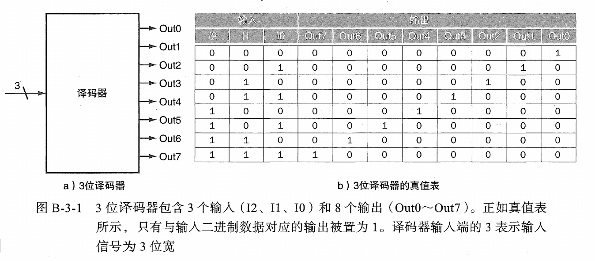

- 多路选择器: 输出由控制信号从多个输入中选择一个产生

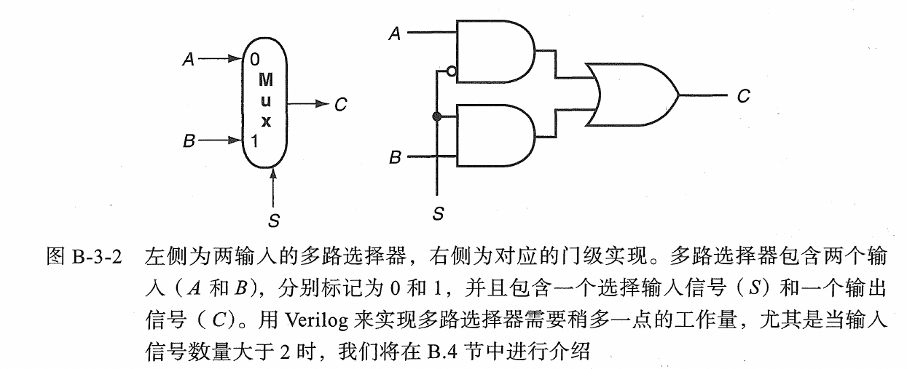

- 只读存储器(Read-Only Memory,ROM): 包含一组地址输入线和一组输出

- 算术逻辑单元(Arithmetic Logic Unit,ALU): 执行算术运算和逻辑运算

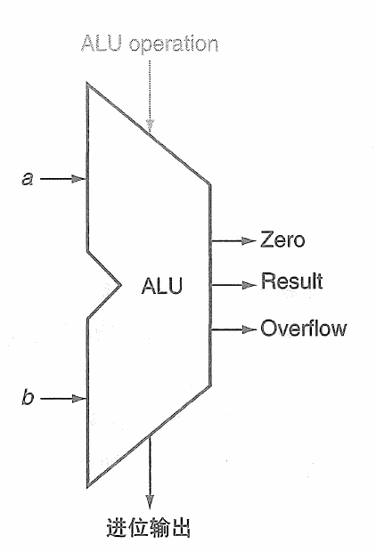
### 时序逻辑
#### 时钟
在时序电路中,时钟非常重要,决定了包含状态的存储元件何时更新,它只有两种状态: 高电平和低电平.

MIPS中采用`边沿触发时钟(edge-triggered clocking)`,所有的状态改变都发生在时钟边沿(即高低电平切换的时间点)

## 处理器
### 流水线
- 跳过了一大堆可怕的逻辑设计电路分析

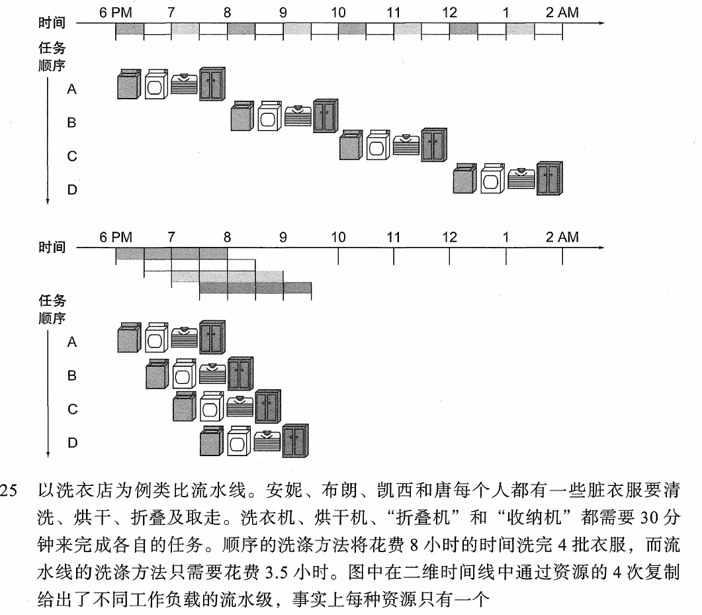

流水线可以最大限度的利用硬件,对于特定的硬件来说,每个周期都可以执行新指令的该阶段操作.

- 流水线的级数:指令中涉及的总操作个数,例如某个指令涉及了6个操作,它的级数就是6

对于MIPS来说,由于所有指令的长度都是相同的,而且指令格式的种类很少,每一条指令中源寄存器字段的位置也相同,所有的操作都可以通过流水线完成.

流水线冒险,意为**在下一个时钟周期中无法执行下一条指令**,可以分为三种类型:
1. 结构冒险: 硬件不支持多条指令在同一时钟周期执行,例如存储器在同一周期被两条指令的特定阶段都同时访问
2. 数据冒险: 一个流水级必须等待另一个流水级完成,导致流水线暂停.这是由于一条指令依赖于另一条还在流水线中的指令造成的.

一种解决方法是: 我们可以让需要等待来自其他指令结果x的流水线先进行到需要x的地方,再由特定的硬件直接将计算好的x送给该流水线,这被称为旁路(bypassing).


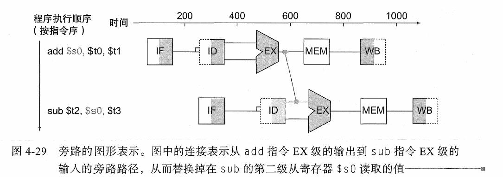

| 符号    | 全称               | 中文含义        | 主要功能                             |
| ------- | ------------------ | --------------- | ------------------------------------ |
| **IF**  | Instruction Fetch  | 取指令          | 从指令存储器中取出当前 PC 指向的指令 |
| **ID**  | Instruction Decode | 指令译码        | 解析指令，读取寄存器，生成控制信号   |
| **EX**  | Execute            | 执行 / 地址计算 | ALU 运算、分支判断、计算访存地址     |
| **MEM** | Memory Access      | 访存            | 访问数据存储器，完成 load / store    |
| **WB**  | Write Back         | 写回            | 将运算结果或访存结果写回寄存器       |


上述的示例是理想的情况,由于ALU运算的结果刚好在下一个周期前回流到了减法的流水线,所以流水线不会中断.但实际上很多时候我们需要停留一两个周期才能获取上一个流水线的结果,停留的周期被称为**阻塞**(stall).

我们可以通过重排指令来避免阻塞:
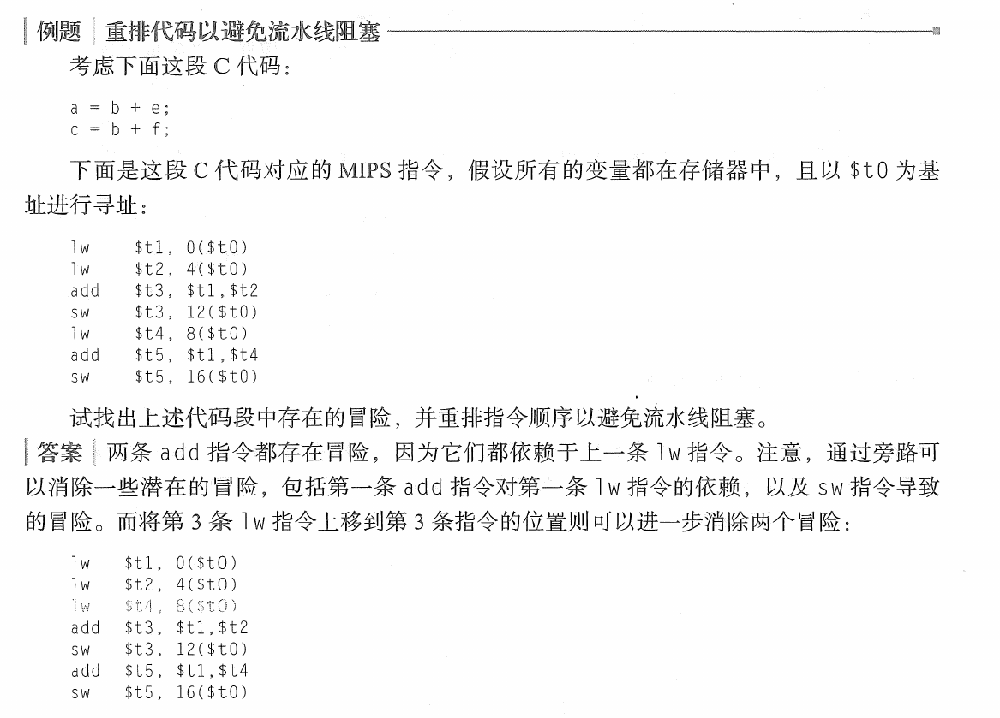

3. 控制冒险: 接下来的决策依赖于某一条正在执行的指令结果,这类指令通常都是条件分支指令(beq,ben),有可能产生不同的指令结果.

指令集采用**预测(predict)**的方法来处理条件分支问题,在预测正确的时候不停止流水线的运行,在预测失败的时候需要重新执行流水线.

一种简单的设想是,认为所有的分支都不会生效,那么当预测正确的时候(分支生效),流水线可以全速执行,当分支生效时才会阻塞流水线.

更为成熟的做法是,预测一些分支生效而另一些分支不生效,对于分支生效的指令,会提前跳转到对应的分支地址进行执行.

>控制冒险实际上就是我们在程序编写中常见的while和for循环操作.

## 存储器
### 前置概念
- 局部性原理:
  - 时间局部性(temporal locality): 如果某个数据项被访问，那么在不久的将来它可能再次被访问
  - 空间局部性(spatial locality): 如果某个数据项被访问,与它地址相邻的数据项可能很快也将被访问

根据局部性原理,我们可以将存储器设计成分层的结构:


### cache的设计
cache的基本原理可以这样表述:
>将主存中的内存块映射到cache中的每一行中,如果cache有8行,那么就对主存地址取模8,将余数相同的地址全部对应到cache的一行中

当然,我们需要对cache中某一行存储的内存块设置**标签**(tag),否则无法区分这到底是哪个内存块,如果cache有8行,那么我们可以直接将内存地址的低三位设置为余数,其他位数设置为标签,例如(10111)对应的是cache第8行,标签为10.


## 总结
总体看下来的感受还是可以的,大多数内容都讲的比较详细,解决了我关于MIPS指令集的不少疑问.
# 计算机体系结构: 量化研究方法
- 如上一本书所说明的,这本书属于进阶版本的教材,但因为是相同的作者写的,所以编排风格十分相似.

## 量化设计与分析基础
### 前置概念
应用程序中主要有两种并行:
1. 数据级并行(DLP): 同时操作多个数据项
2. 任务级并行(TLP): 同时执行多个工作任务

计算机硬件为了实现上述的两种架构,有以下四种并行方法:
1. 指令级并行: 利用流水线实现数据级并行
2. 使用向量处理机和GPU: 将单条指令并行应用于一个数据集,实现数据级并行
3. 线程级并行: 在并行线程间进行交互,实现数据级/任务级并行
4. 请求级并行

我们还可以根据指令流与数据流的关系将计算机架构分成4类:
1. 单指令流,单数据流(SISD): 使用单处理器,顺序执行指令,但可以实现指令级并行
2. 单指令流,多数据流(SIMD): 使用多处理器,不同的处理器可以装载不同的数据流,但只能由一个处理器来装载指令,是现代GPU的主要架构
3. 多指令流,单数据流(MISD): 不太有开发的必要,指令容易冲突,还不能并行处理多个数据.
4. 多指令流,多数据流(MIMD): 每个处理器都使用自己的指令操控自己的数据,是现代CPU的主要架构.

### 指令集体系结构(ISA)
几乎所有的ISA都属于通用寄存器体系结构,80x86有16个通用寄存器和16个存储浮点数据的寄存器;MIPS有32个通用寄存器和32个浮点寄存器.

所有的计算机都使用**字节寻址**来访问存储器操作数,MIPS有三种寻址方式: 寄存器寻址,立即数寻址,位移量寻址.

MIPS的操作指令比较简单,大致可分为以下几种:
1. 数据传输指令
2. 算术逻辑指令
3. 控制指令
4. 浮点指令

| 指令类型/操作码                       | 指令含义                                                                                                         |
| ------------------------------------- | ---------------------------------------------------------------------------------------------------------------- |
| **数据传输**                          | 在寄存器和存储器之间，或者在整数和FP或特殊寄存器之间移动数据；唯一的存储器寻址模式是16位位移量加上GPR的内容      |
| LB, LBU, SB                           | 载入字节、载入无符号字节、存储字节（至/自整数寄存器）                                                            |
| LH, LHU, SH                           | 载入半字、载入无符号半字、存储半字（至/自整数寄存器）                                                            |
| LW, LWU, SW                           | 载入字、载入无符号字、存储字（至/自整数寄存器）                                                                  |
| LD, SD                                | 载入双字、存储双字（至/自整数寄存器）                                                                            |
| L.S, L.D, S.S, S.D                    | 载入SP浮点、载入DP浮点、存储SP浮点、存储DP浮点                                                                   |
| MFC0, MTC0                            | 在GPR与特殊寄存器之间复制数据                                                                                    |
| MOV.S, MOV.D                          | 将一个SP或DP FP寄存器复制到另一个FP寄存器                                                                        |
| MFC1, MTC1                            | 在FP寄存器与整数寄存器之间复制32位                                                                               |
| **算术/逻辑**                         | 对GPR中的整数或逻辑数据进行操作；带有符号算术运算溢出时进行陷阱捕获                                              |
| DADD, DADDI, DADDU, DADDIU            | 加，加立即数（所有立即数为16位），有符号和无符号                                                                 |
| DSUB, DSUBU                           | 减，有符号和无符号                                                                                               |
| DMUL, DMULU, DDIV, DDIVU, MADD        | 乘和除，有符号和无符号，乘-加；所有运算的操作数和结果都是64位数值                                                |
| AND, ANDI                             | 与，和立即数相与                                                                                                 |
| OR, ORI, XOR, XORI                    | 或，和立即数求或，异或，和立即数求异或                                                                           |
| LUI                                   | 载入高位立即数；将立即数载入到寄存器的32~47位，然后进行符号扩展                                                  |
| DSLL, DSRL, DSRA, DSLLV, DSRLV, DSRAV | 移位：立即数形式（DS__）和变量形式（DS__V），移位为左逻辑移位、右逻辑移位、右算术移位                            |
| SLT, SLTI, SLTU, SLTIU                | 若小于操作数则置位、若小于立即数则置位、有符号和无符号                                                           |
| **控制**                              | 控制分支和跳转，相对于PC寄存器或通过寄存器控制                                                                   |
| BEQZ, BNEZ                            | GPR等于/不等于0时转移，相对于PC+4偏移16位偏移量                                                                  |
| BEQ, BNE                              | GPR相等/不等时转移、相对于PC+4偏移16位偏移量                                                                     |
| BC1T, BC1F                            | 测试FP状态寄存器中的对比位，并转移；相对于PC+4偏移16位偏移量                                                     |
| MOVN, MOVZ                            | 如果第三个GPR为负数/零，则将第一个GPR复制到第二个GPR                                                             |
| J, JR                                 | 跳转至与PC+4偏移26位偏移量的位置（J）、跳转至寄存器中的目标位置（JR）                                            |
| JAL, JALR                             | 跳转和链接：将PC+4保存在R31中，目标为相对于PC（JAL）或寄存器（JALR）                                             |
| TRAP                                  | 转移到操作系统的一个向量地址                                                                                     |
| ERET                                  | 从异常中返回用户代码，恢复用户模式                                                                               |
| **浮点**                              | 对DP和SP格式执行FP操作                                                                                           |
| ADD.D, ADD.S, ADD.PS                  | DP、SP相加，一对SP数相加                                                                                         |
| SUB.D, SUB.S, SUB.PS                  | DP、SP相减，一对SP数相减                                                                                         |
| MUL.D, MUL.S, MUL.PS                  | DP、SP浮点数相乘，一对SP数相乘                                                                                   |
| MADD.D, MADD.S, MADD.PS               | DP、SP浮点数相乘加，一对SP数相乘加                                                                               |
| DIV.D, DIV.S, DIV.PS                  | DP、SP浮点数相除，一对SP数相除                                                                                   |
| CVT.*.*                               | 转换指令：CVT.x.y从类型x转换为类型y，其中x和y为L（64位整数）、W（32位整数）、D（DP）或S（SP）。两个操作数都是FRP |
| C.*.D, C.*.S                          | DP和SP对比：“_”=LT, GT, LE, GE, EQ, NE；在FP状态寄存器中置位                                                     |

MIPS中所有指令的长度都是32位,从而简化了指令译码:
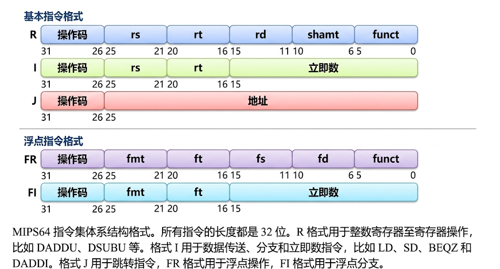

### Amdahl定律: 计算加速比
Amdahl定律用于计算升级某个部件/功能时获得的**加速比**,即采用升级前所用的时间与升级后所用时间的比值,从而衡量出某个部件/功能的贡献大小:

$$S_{\text{latency}} = \frac{1}{(1 - p) + \frac{p}{s}}$$

* $S_{\text{latency}}$：整个任务执行速度的理论加速比。
* $p$：任务中受益于资源改进的部分所占的时间比例（$0 \le p \le 1$）。
* $s$：受改进部分原本的性能提升倍数。

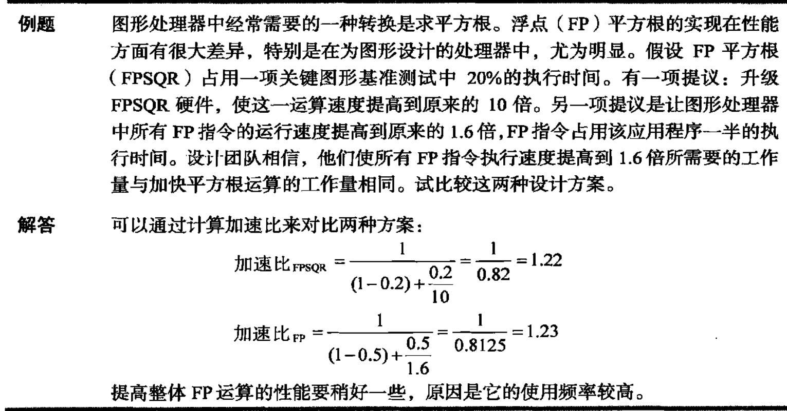

### CPI: 衡量处理器的性能
所有计算机都有一个时钟周期,那么CPU执行某个任务的时间就等于**经过的周期数乘以一个时钟周期的时间**.

我们使用**每条指令的周期数**(Cycle Per Instruction,CPI)来衡量某条指令所花的时间长度:

$$\text{CPI} = \frac{\text{程序的CPU时钟周期数}}{\text{指令数}}$$

那么处理器的性能就取决于三个变量: 时钟周期,CPI,指令数.

## 存储器层次结构设计
鉴于快速存储器非常昂贵,现代计算机都使用分层的存储器结构,从而实现以下效果:
- **每字节的成本几乎与最便宜的存储器级别相同,速度几乎与最快速的级别相同**


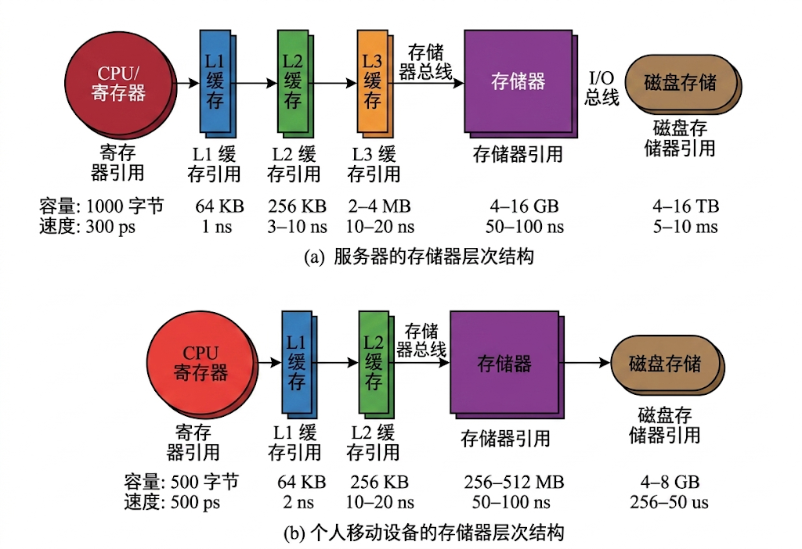

- 下一级存储器通常会保留上一级存储器的所有信息,才能保证信息不会丢失
### 优化缓存性能
1. 使用小而简单的第一级缓存,缩短命中时间
2. 采用**路预测**,缩短命中时间
   1. 缓存中留出一部分空间用于预测下一次要访问的数据
3. 缓存访问流水化(Cache Access Pipelining),即将缓存访问拆成多个步骤,提高缓存带宽:

```md
时钟周期：   |  Cycle 1  |  Cycle 2  |  Cycle 3  |  Cycle 4  |
指令 A:     [ 地址解码 ] [ 阵列驱动 ] [ 数据读出 ]
指令 B:                 [ 地址解码 ] [ 阵列驱动 ] [ 数据读出 ]
指令 C:                             [ 地址解码 ] [ 阵列驱动 ] [ 数据读出 ]
````
4. 采用无阻塞缓存,提高缓存带宽
   1. 出现缓存不命中(miss)时,不中断缓存访问,这是通过在缓存内部引入了一组特殊的硬件寄存器实现的,它被称为**未命中状态保持寄存器**（MSHR，Miss Status Holding Registers）.

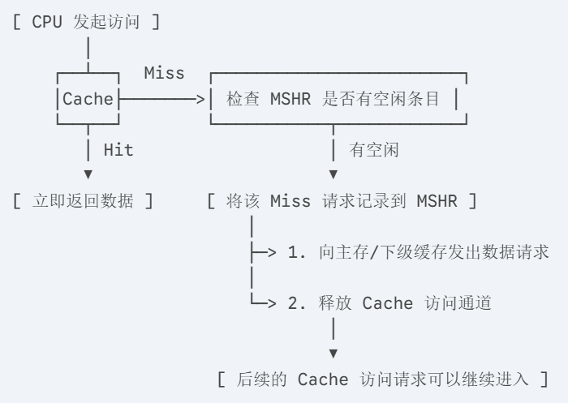

5. 采用多种缓存,提高缓存带宽.
   1. 将缓存划分成多个相互独立的,支持同时访问的缓存组
6. 关键字优先和提前重启动,降低缓存不命中的代价
   1. 缓存与主存交换数据的最小单位是块(Block),一个块包含多个字(word),当CPU只需要某一块其中的一个字时,缓存控制器直接跳转到对应的地址获取那个缺失的字,让CPU恢复执行后再发送该块的剩余部分
   2. 另一种实现方法,缓存保持顺序读取,实时检查当前块中是否出现了CPU需要的字,一旦出现就直接发送给CPU,再接着发送剩余部分.

7. 合并写缓冲区,降低缓存不命中的代价
   1. 为了不让CPU每次执行缓存的写入操作时都等待新数据从缓存慢慢传回内存,我们会设计一个写缓冲区,CPU将数据写入该缓冲区后继续执行,缓冲区负责将数据异步写入下级存储.
   2. 如果新写入的数据与缓冲区中某个数据属于一个块(这是非常常见的情况,因为代码和数据通常都保存在一块连续内存上),则直接将这两部分数据合并,节省写缓冲区空间


8. 采用编译器优化,降低缓存不命中的概率
   1. 编译器会对代码进行优化处理,帮助处理器以更高的效率执行代码

上面的这些做法都在现代计算机体系结构中得到了广泛的应用.
### 存储器种类
- Static Random Access Memory(SRAM): 通常用作缓存,集成在处理器的芯片上,响应速度远超DRAM
- Dynamic Random Access Memory(DRAM): 用作内存条,在每次读取信息后会破坏该信息,所以要进行**刷新**后写回数据,速度比较慢,适合放在硬盘和缓存中间作为缓冲存储器.
- SDRAM: 同步DRAM,DRAM的优化版本,现代的内存条都是SDRAM.
- NAND flash(闪存): 最常见的闪存就是SSD(固态硬盘),通常为最后一级存储器,速度很慢,但比起HDD(机械硬盘)又快得多.

## 附录B: 存储器层次结构
### 前置概念
1. 根据主存块在cache中的放置位置,可以讲cache的组织方式分成三种:
   1. 直接映射: `(块地址)MOD(缓存行数)`
   2. 全相联: 块可以放在缓存中的任意位置
   3. 组相联: 块可以放在缓存中的有限个位置组成的组(set)中.块首先通过`(块地址)MOD(缓存组数)`映射到组,可以放在组中的任意位置.
      1. 如果组中有n个块,就被称为n路组相联
      2. 有m块的全相联实际上就是只有一组的m路组相联
2. 处理器在寻找一个主存块时,会提供给cache两个信息: **块地址和块偏移**,块地址可以拆分成**tag**字段和**索引**字段,索引字段可以定位cache的某一行/某几行,tag字段可以与cache中的tag位进行比较,从而判断cache中该行是否存储了要寻找的主存块,如果不匹配,则说明发生了cache miss,需要从主存中加载数据到cache中,并重置cache中对应的tag位.
3. 发生cache miss时,由于直接映射时只需替换被映射的那一行,所以不用多操心;但对于组相联的cache,我们主要有三种算法来决定替换该组中的哪一行:
   1. RAND: 随机选择该组中的任意一行
   2. LRU(最近最少使用): 替换掉最近最少使用的一行,这应用了局部性原理.
   3. FIFO(先入先出): 替换掉最早被使用的哪一行.


4. 将数据写入缓存时,有两种方法:
   1. 直写: 写入缓存和主存中
      1. 实现起来比较简单,而且发生cache miss时也不需要再对主存进行写入,主存中存有数据的最新副本
   2. 写回: 写入缓存,缓存中的数据如果被修改了,那么在被替换时才会被写入主存中.
      1. 写入时占用的时钟周期短,节省功耗

### 缓存优化
1. 增加相联度: 主存块可以放进cache的候选位置变多,被替换的概率下降
2. 增大存取的主存块大小: 根据空间局部性,如果程序访问了某个地址,它很可能马上访问附近的地址;但主存块太大的话,cache容纳的主存块个数过少,反而会降低性能
3. 增大cache容量: 装的主存块个数变多
4. 使用多级缓存,多级缓存的存储器平均访问时间计算方法如下:


### 虚拟存储器
>如果由程序员亲自负责物理内存的分配,拆分过于庞大的内存,确保程序不会越界访问,这显然很累人,尽管早期计算机确实是这么做的.

为了解决这个问题,虚拟存储器诞生了,处理器负责计算得到要处理的虚拟地址,由MMU单元按照操作系统提供的页表完成从虚拟地址到物理地址的映射(通过偏移量实现),再访问cache/主存中的实际物理地址.
## 指令级并行
### 前置概念
- 指令级并行: 有两种实现方式,一种是依靠硬件来动态实现并行,一种是依靠编译器来静态发现并实现并行.

为了确定能否开展指令级并行,我们需要判断指令间是否相关,总共有三种类型的相关:
1. **数据相关**: 指令i的结果可能会被指令j使用,或者指令i的结果会被指令k使用,而指令k的结果会被指令j使用,这两种情况都被称为数据相关.
   1. 如果两条指令数据相关,那么他们必须顺序执行,无法真正的并行.
2. **名称相关**: 指令i需要用到指令j需要的寄存器/存储器位置
   1. 名称相关非常好解决,既可以让编译器对涉及冲突的寄存器进行**重命名**(即更换寄存器),也可以让硬件更改冲突的存储器位置.
3. **控制相关**: 条件语句中的条件指令与执行语句只能顺序执行.
### 编译器优化
编译器可以智能地帮助我们合并指令,减少流水线停顿:


### 硬件优化(待补充)
硬件优化的代表性算法是**Tomasulo算法**,它能够通过寄存器重命名降低数据相关和名称相关的指令数量,实现流水线的乱序执行(在指令可用时立刻执行而无需等待).


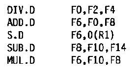

例如,上面这个指令序列可以通过两个临时寄存器被改写成这样,让指令间互不相关:


## 数据级并行
>SIMD通过使用单条指令启动多次数据运算,比起MIMD更为高效.

SIMD有以下三种实际应用:
1. 向量处理机: 将处理器硬件全部替换成适配向量操作的结构,当需要大规模的数据运算时,可以直接使用矩阵来快速简化运算,而无需如同普通处理器一样通过多次循环来迭代处理.
   1. 很明显,向量处理机不是那么好实现的,效果也未必有多好,不然不会在推出几十年后也没成功商业化
2. 多媒体SIMD扩展: 简单来说就是对MIMD进行扩展,例如允许64位寄存器同时操作8个8位操作数,这适用于诸如图形处理,色彩渲染等功能.本质上来说是延续了向量处理机的实现方法.
3. GPU(Graphic Process Unit): 与CPU的架构差别很大


## 线程级并行
为了实现线程级并行,我们需要同时运行多个处理器,按照存储器的组织方式,多处理器方案可以分成两种:
1. SMP(对称多处理器): 处理器数量少,有各自的独立缓存,但同时共享一个下一级缓存:

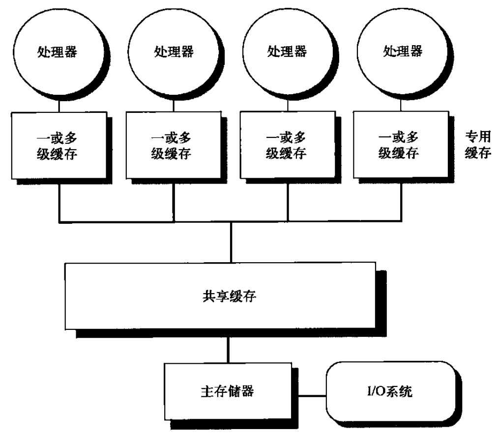

2. DSM(分布式共享存储器): 处理器数量多,处理器之间不共享存储器,缩短了存储器存取延迟,但也让处理器之间传送数据变得更加复杂
# 计算机网络:自顶向下方法(第八版)
- 很早的阅读笔记,现在看来质量堪忧,待日后解决

## 应用层
### 应用层协议
#### http协议(2026/1/28)
事实上我把之前博客里写的内容直接搬过来了,比书上还是要详细不少的
##### 概览
- [参考链接](https://developer.mozilla.org/zh-CN/docs/Web/HTTP/Guides/Overview)
>HTTP 是一个客户端—服务器协议：请求由一个实体，即用户代理（user agent），或是一个可以代表它的代理方（proxy）发出。大多数情况下，这个用户代理都是一个 Web 浏览器，不过它也可能是任何东西，比如一个爬取网页来充实、维护搜索引擎索引的机器爬虫。
>
>每个请求都会被发送到一个服务器，它会处理这个请求并提供一个称作响应的回复。在客户端与服务器之间，还有许许多多的被称为代理的实体，履行不同的作用，例如充当网关或缓存。

**客户端发送的请求**
```HTTP
POST /api/v1/user/update?id=1024 HTTP/1.1
Host: www.example.com
Content-Type: application/json
User-Agent: Mozilla/5.0
Authorization: Bearer eyJhbGci...
Content-Length: 45

{
  "nickname": "Apollo",
  "gender": "male"
}
```
- POST: 客户端发起的请求所用方法
- `/api/v1/user/update?id=1024`:服务器对应资源的路径和Query参数
- Host: 目标服务器域名
- Content-Type: 传输数据格式声明
- User-Agent: 使用的浏览器代理
- Authorization: cookie或token等身份识别头
- Content-Length: 请求体字节长度
- `{"nickname": "Apollo","gender": "male"}`: 传输的数据

**服务端返回的报文**
```
HTTP/1.1 200 OK
Date: Sat, 09 Oct 2010 14:28:02 GMT
Server: Apache
Last-Modified: Tue, 01 Dec 2009 20:18:22 GMT
ETag: "51142bc1-7449-479b075b2891b"
Accept-Ranges: bytes
Content-Length: 29769
Content-Type: text/html

<!DOCTYPE html>…（此处是所请求网页的内容）
```
##### METHOD
- [wiki](https://zh.wikipedia.org/wiki/%E8%B6%85%E6%96%87%E6%9C%AC%E4%BC%A0%E8%BE%93%E5%8D%8F%E8%AE%AE)

HTTP/1.1 协议中共定义了八种方法来以不同方式操作指定的资源,下面我列举常用的几种
**GET**
The request is for a representation of a resource.The server should only retrieve data; not modify state.

**HEAD**
The request is like a GET except that the response should not include the representation data in the body. 
HEAD = GET − Response Body

**POST**
The request is to process a resource in some way.
**PUT**
The request is to create or update a resource with the state in the request.
**DELETE**
The request is to delete a resource.


##### status code
>In HTTP, you send a numeric status code of 3 digits as part of the response.
These status codes have a name associated to recognize them, but the important part is the number.

>In short:
100 - 199 are for "Information". You rarely use them directly. Responses with these status codes cannot have a body.
200 - 299 are for "Successful" responses. These are the ones you would use the most.
200 is the default status code, which means everything was "OK".
Another example would be 201, "Created". It is commonly used after creating a new record in the database.
A special case is 204, "No Content". This response is used when there is no content to return to the client, and so the response must not have a body.
300 - 399 are for "Redirection". Responses with these status codes may or may not have a body, except for 304, "Not Modified", which must not have one.
400 - 499 are for "Client error" responses. These are the second type you would probably use the most.
An example is 404, for a "Not Found" response.
For generic errors from the client, you can just use 400.
500 - 599 are for server errors. You almost never use them directly. When something goes wrong at some part in your application code, or server, it will automatically return one of these status codes.

##### [User Agent](https://developer.mozilla.org/zh-TW/docs/Web/HTTP/Reference/Headers/User-Agent)

>[wiki](https://zh.wikipedia.org/wiki/%E7%94%A8%E6%88%B7%E4%BB%A3%E7%90%86)
用户代理（user agent）在计算机科学中指的是代表用户行为的程序（软件代理程序）。例如，网页浏览器就是一个“帮助用户获取、渲染网页内容并与之交互”的用户代理

简单来说,user agent是http header里的客户端标识,告诉目标服务器自己是通过哪个浏览器进行访问的

- 爬虫总是需要伪装自己是通过某个代理访问服务器的,否则容易被拦截

**一般格式**
```html
User-Agent: <product> / <product-version> <comment>
```

**web浏览器的通用格式**
```html
User-Agent: Mozilla/5.0 (<system-information>) <platform> (<platform-details>) <extensions>
```

**具体示例**
```html
Mozilla/5.0 (X11; Linux x86_64) AppleWebKit/537.36 (KHTML, like Gecko) Chrome/51.0.2704.103 Safari/537.36
Mozilla/5.0 (Windows NT 10.0; Win64; x64) AppleWebKit/537.36 (KHTML, like Gecko) Chrome/91.0.4472.124 Safari/537.36 Edg/91.0.864.59
```


##### cookie
>[MDN](https://developer.mozilla.org/zh-CN/docs/Web/HTTP/Guides/Cookies)
服务器收到 HTTP 请求后，服务器可以在响应标头里面添加一个或多个 Set-Cookie 选项。浏览器收到响应后通常会保存下 Cookie，并将其放在 HTTP Cookie 标头内，向同一服务器发出请求时一起发送。你可以指定一个过期日期或者时间段之后，不能发送 cookie。你也可以对指定的域和路径设置额外的限制，以限制 cookie 发送的位置

##### Web cache
>Web缓存是用于临时存储（缓存）Web文档（如HTML页面和图像），以减少服务器延迟的一种信息技术。Web缓存系统会保存下通过这套系统的文档的副本；如果满足某些条件，则可以由缓存满足后续请求

流程如下：

1. 浏览器建立 **TCP 连接** 到 **Web Cache**，发送 HTTP 请求获取某个对象。

2. Web Cache 查询本地缓存。

   * 若存在对象副本（cache hit），直接返回 HTTP 响应给浏览器。

3. 若本地没有该对象（cache miss），Web Cache 建立 **TCP 连接** 到 **Origin Server**。

4. Web Cache 通过该 TCP 连接向 Origin Server 发送 HTTP 请求。

5. Origin Server 返回包含对象的 HTTP 响应。

6. Web Cache 接收响应后：

   * 在本地缓存该对象副本
   * 通过已有的 **浏览器 ↔ Web Cache TCP 连接** 将 HTTP 响应返回给浏览器。

##### 从HTTP/1到HTTP/3
HTTP1采用非持续连接,每个HTTP请求都使用独立的TCP连接,可想而知慢的吓人
因此,HTTP1.1采用了并行的TCP持续连接,共享带宽,但这会增加连接占用的带宽,容易引发网络阻塞
这也是HTTP2推出的原因,只使用一个TCP持续连接来处理多个并行请求,将每个HTTP报文划分为帧单位,在第一个请求发送第一帧后,发送第二个请求的第一帧,以此类推,不断循环
至于HTTP3,改进的程度比较有限,且基于UDP而非TCP连接,在22年已经标准化
#### SMTP协议(3/4)
SMTP,一种广泛使用,历史悠久的邮件传输协议,与HTTP一样使用的是持续的TCP连接
流程如下:
1. Alice 在 **用户代理（Mail User Agent）** 中输入 Bob 的邮箱地址（如 `bob@someschool.edu`），编写邮件并发送。

2. 用户代理将邮件发送到 **Alice 的邮件服务器（Mail Server）**，邮件进入服务器的 **邮件队列（message queue）**。

3. Alice 邮件服务器上的 **SMTP 客户端** 从队列中发现该邮件，并建立 **TCP 连接** 到 **Bob 的邮件服务器上的 SMTP 服务器**。

4. 完成 **SMTP 握手** 后，SMTP 客户端通过该 TCP 连接发送邮件内容。

5. Bob 的邮件服务器上的 **SMTP 服务器** 接收邮件，并将邮件存入 **Bob 的邮箱（mailbox）**。

6. Bob 在需要时启动 **用户代理**，从邮箱中读取邮件。

#### DNS
>识别主机有两种方式———主机名(hostname)和 IP 地址。人们喜欢便于记忆的主机名标识方式,而路由器则喜欢定长的、有着层次结构的 IP 地址,因为hostname(如www.baidu.com)不能给路由器任何有关这个主机所在位置的信息

因此,我们需要一种能够将主机名转换成IP地址的服务,也就是 域名系统（ Domain Name System ， DNS ）,由DNS服务器和DNS协议构成,运行在UDP之上,故也是应用层协议
##### 常用查询方法
* **A 记录查询 (Address Record)**
  * **物理定义**：将域名直接映射到一个具体的 **IPv4 地址**。
  * **工作机制**：当发起 A 记录查询时，DNS 服务器会返回一个由 4 组数字组成的物理地址（如 `192.168.1.1`）。
  * **特性**：它是最基础、速度最快的解析方式。浏览器拿到 A 记录后，可以直接根据该 IP 地址物理寻找目标服务器并建立 TCP 连接。


* **CNAME 记录查询 (Canonical Name Record)**
  * **物理定义**：将一个域名指向**另一个域名**，而不是具体的 IP 地址。
  * **工作机制**：
    1. 客户端查询 `www.example.com`。
    2. DNS 返回一个 CNAME 记录（如 `example.cdn.com`）。
    3. 客户端必须针对这个新域名**再次发起** DNS 查询，直到最终获得一个 A 记录（IP 地址）。
  * **特性**：
  * **别名逻辑**：常用于 CDN 加速或云服务。当后端物理服务器 IP 变动时，只需更改最终域名的 A 记录，所有指向它的 CNAME 无需修改。
  * **性能成本**：相比 A 记录，CNAME 至少会增加一轮 DNS 查询的物理往返时间。
---
- [阮一峰教程](https://www.ruanyifeng.com/blog/2016/06/dns.html)

>[为什么DNS用UDP](https://draven.co/whys-the-design-dns-udp-tcp/)
我们可以简单总结一下 DNS 的发展史，1987 年的 RFC1034 和 RFC1035 定义了最初版本的 DNS 协议，刚被设计出来的 DNS 就会同时使用 UDP 和 TCP 协议，对于绝大多数的 DNS 查询来说都会使用 UDP 数据报进行传输，TCP 协议只会在区域传输的场景中使用，其中 UDP 数据包只会传输最大 512 字节的数据，多余的会被截断；两年后发布的 RFC1123 预测了 DNS 记录中存储的数据会越来越多，同时也第一次显式的指出了发现 UDP 包被截断时应该通过 TCP 协议重试
##### 实际应用举例
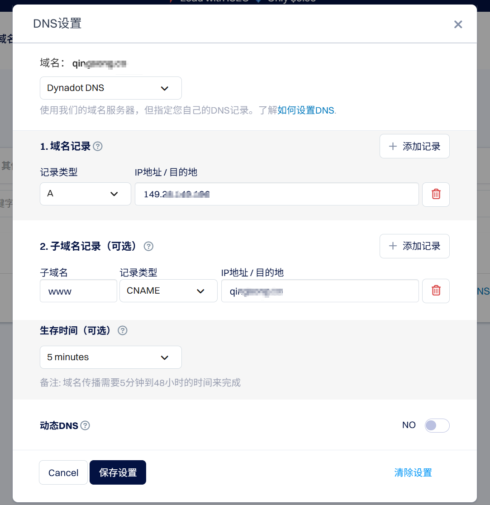
来看这样一个图,这是我在服务器上部署好了网站后,并在dynadot购买域名进入后台时将服务器的IP地址与对应域名绑定的过程.

使用A记录时,只要将服务器的ip地址填入就可以生效,但是别人访问这个服务器的时候只能在地址栏输入类似`qin******.com`的内容来访问.
但用户可能会输入`www.qin******.com`来访问这个服务器,但DNS并不会自动帮我将www前缀删除,所以我需要增加一条CNAME记录,将`www.qin******.com`指向`qin******.com`.
- www前缀代表着这个网站使用的是http协议,是一个web网站,但由于现在基本都是web网站,少有类似`ftp.qin*****.com`这样的网站名了
#### P2P协议
BitTorrent是里面最为著名的代表,简单来说是一种多人之间互相传数据分包的协议,从而避免多人仅通过连接一台服务器导致的下载速度延缓.
磁力链接,torrent等资源链接都采用这一协议进行传输

#### DASH和CDN
DASH(Dynamic Adaptive Streaming over HTTP),将视频编码为不同清晰度的版本,根据用户的可用带宽来动态选择对应画质版本的视频

CDN(Content Distribution Network),由名字可以看出来,CDN相当于一个存储视频,文档等数据的分布式服务器,避免只用一个服务器来接受http请求导致的各种问题

### Port(端口)
>可以理解为通信接口,也就是说,应用层的进程通过特定的端口实现与运输层TCP/UDP的连接.
- 一个端口号使用16位无符号整数（unsigned integer）来表示，其范围介于0与65535之间
- 在TCP协议中，端口号0是被保留的，不可使用。1--1023 系统保留，只能由root用户使用。1024--4999 由客户端程序自由分配。5000--65535 由服务器端程序自由分配。在UDP协议中，来源端口号可选择是否填上，如果设为0，则代表无来源端口号。


## 运输层

### Reliable Data Transfer Protocol (RDT)

- 显然书上这部分的引入太长了,而且并没有作者自以为的讲得很详细很清晰,还是让AI来总结一下吧
可靠数据传输协议（Reliable Data Transfer Protocol，RDT）是计算机网络中用来保证**发送方的数据能够完整、正确、按顺序送达接收方**的一类协议。即使底层信道可能存在丢包、乱序或传输错误，RDT 也能通过设计机制让数据安全传输
---

#### 1. RDT 的核心问题

在现实网络中，直接发送比特流存在很多潜在问题：

1. **丢包**：数据包在传输中可能完全丢失。
2. **数据错误**：信道噪声或硬件故障可能导致比特翻转，接收方收到的数据与发送方发送的数据不同。
3. **重复数据**：网络重传机制或路由问题可能导致同一个数据包被接收多次。
4. **乱序**：数据包可能通过不同路径传输，先发送的包晚到达。

可靠数据传输协议需要解决这些问题，保证**端到端**的可靠性。

---

#### 2. 核心机制概览

RDT 的核心机制可以概括为五个部分：

1. **分包（Segmentation）**

   * 将大数据拆分成较小的数据包，每个包称为 **segment**。
   * 优点：小包更容易重传，减少重发的代价，同时便于序列号管理。
   * 每个包通常包含以下内容：

     * 数据内容（payload）
     * 序列号（Sequence Number）
     * 校验和（Checksum）

2. **错误检测（Error Detection）**

   * 利用 **Checksum** 或 **CRC（Cyclic Redundancy Check）** 检测数据在传输中是否被破坏。
   * 发送方：计算数据包的校验和并附加在包头。
   * 接收方：收到包后重新计算校验值，如果与包头的值相同，则认为数据正确，否则认为数据出错。
   * 示例：

     ```text
     数据内容: 10110011
     校验和:   0110
     ```

     接收方校验，如果不匹配，就触发重传。

3. **序列号（Sequence Number）**

   * 每个数据包被赋予唯一的序列号（Sequence Number），用于：

     * **防止重复包处理**
     * **保证接收顺序**
   * 序列号通常为 0、1 或更大的整数，循环使用。
   * 接收方通过序列号判断是否收到新的包还是重复包。

4. **确认机制（Acknowledgment, ACK / Negative Acknowledgment, NAK）**

   * **ACK（确认）**：接收方收到正确的数据包后发送 ACK 给发送方。
   * **NAK（否定确认）**：接收方收到错误数据包时发送 NAK，要求发送方重发。
   * **作用**：

     * 让发送方知道哪些数据包成功到达。
     * 在丢包或错误情况下触发重传。
   * 示例流程：

     ```text
     发送方 -> 数据包 1 -> 接收方
     接收方 -> ACK 1 -> 发送方
     ```

5. **重传机制（Timeout & Retransmission）**

   * 发送方设置 **超时时间（Timeout）**。
   * 如果在超时时间内没有收到 ACK，发送方会自动 **重发数据包**。
   * 与 ACK/NAK 配合，可以保证即使网络丢包，最终数据仍然完整送达。
   * 关键点：

     * 超时必须合理，否则可能导致过早重发或等待过久。
     * 与序列号结合，保证重发的数据仍能正确排序，不被重复处理。

---

#### 3. 可靠数据传输模型示例

##### 3.1 Stop-and-Wait RDT（最基础模型）

* **发送端**：

  1. 发送一个数据包，附带序列号。
  2. 等待接收方发送 ACK。
  3. 如果超时未收到 ACK，重发数据包。
  4. 收到 ACK 后发送下一个包。

* **接收端**：

  1. 收到数据包，检查校验和。
  2. 如果正确，处理数据并发送 ACK。
  3. 如果错误或重复，丢弃数据或发送 NAK。

* 优点：简单易实现，理解方便。

* 缺点：效率低，因为发送方在等待 ACK 期间 **无法发送下一个数据包**。

##### 3.2 Sliding Window RDT（滑动窗口机制,流水线机制）

* 改进 Stop-and-Wait，允许 **发送方在等待 ACK 的同时发送多个包**。
* 核心概念：

  * **发送窗口**：发送方未确认的数据包集合。
  * **接收窗口**：接收方能够接收的序列号范围。
* 优点：提高链路利用率，尤其是高延迟链路。
* 实现机制：

  1. 发送方维护一个窗口，窗口内的包可以连续发送。
  2. 接收方按序号接收，并发送 ACK。
  3. 窗口滑动：收到 ACK 后，发送方窗口向前滑动，可以发送新的包。
* 常见变种：

  * **Go-Back-N**：出错时从错误包开始重发之后所有包。
  * **Selective Repeat**：只重发出错的包，更高效。

---

#### 4. RDT 的工作流程总结

以最简单的 Stop-and-Wait 为例，端到端流程如下：

```text
发送方: [数据包 seq=0] -------->
接收方: 检查校验 -> 正确 -> [ACK seq=0] -------->
发送方: 收到 ACK -> 发送下一个数据包 seq=1
```

**异常情况：**

1. 数据包丢失：

   * 发送方超时重发。
2. 数据包出错：

   * 接收方丢弃包并发送 NAK 或不发送 ACK。
3. ACK 丢失：

   * 发送方超时重发数据包，接收方根据序列号判断重复，避免重复处理。

> 核心思想：**发送方持续重发，接收方持续确认，直到每个包安全到达**。

---


### UDP(User Datagram Protocol)
UDP的原理非常简单,就是将`src post`传输的数据 打包进UDP报文,并传递给网络层,再分发给`dst post`
d
- 使用 UDP 时，在发送报文段之前,发送方和接收方的运输层实体之间没有握手.正因为如此，UDP 被称为无连接的.

#### 为什么要用UDP
- 无连接状态。TCP 需要在端系统中维护连接状态。此连接状态包括接收和发送缓存、拥塞控制参数以及序号与确认号的参数。另一方面， UDP 不维护连接状态 ， 也不跟踪这些参数。 因此， 当应用程序运行在 UDP 之上而不是运行在 TCP 上时，某些专门用于某种特定应用的服务器一般都能支持更多的活跃客户。
- 分组首部开销小 。每个 TCP 报文段都有 20 字节的首部开销 ， 而 UDP 仅有 8 字节的开销。
- TCP 的拥塞控制会导致如因特网电话、视频会议之类的实时应用性能变得很差 。由于这些原因，多媒体应用开发人员通常将这些应用运行在 UDP 之上而不是 TCP 之上
#### UDP包分析
一个完整的 UDP 包由 UDP 头部 + 数据负载（Payload）组成
##### UDP头部(固定8字节)
| 字段                 | 字节数 | 说明                           |
| -------------------- | ------ | ------------------------------ |
| **Source Port**      | 2      | 源端口                         |
| **Destination Port** | 2      | 目标端口                       |
| **Length**           | 2      | UDP 头 + 数据总长度            |
| **Checksum**         | 2      | 校验和，验证头部和数据是否损坏 |

```py
0      15 16     31
+---------+---------+
| src port| dst port|
+---------+---------+
| length  | checksum|
+---------+---------+
```
##### UDP 数据负载（Payload）
- 长度 = UDP Length – 8（头部大小）
- 完全由应用程序生成

**UDP检验和**
检验和用于确定当 UDP 报文段从源到达目的地移动时，其中的比特是否发生了改变 （ 例如，由于链路中的噪声干扰或者存储在路由器中时引入问题 ）。发送方的 UDP 对报文段中的所有 16 比特字的和进行反码运算，求和时遇到的任何溢出都被回卷(把最高位进位送入最低位相加) 。 得到的结果被放在 UDP 报文段中的检验和字段.
显然接收方可以再进行一次求和与反码相加,如果出现了0就说明数据有地方出错了.

### TCP(Transmission Control Protocol)
>TCP 被称为是面向连接的 （ connection-oriented），这是因为在一个应用进程可以开始向另一个应用进程发送数据之前 ， 这两个进程必须先相互 “ 握手 ”，即它们必须相互发送某些预备报文段，以建立确保数据传输的参数
#### TCP报文段分析

一个完整的 TCP 报文段由 **TCP头部（Header）+ 选项（Options，可选）+ 数据负载（Payload）**组成，其中最小 TCP 头部固定 **20 字节**。

##### TCP头部（最小20字节）

| 字段                      | 字节数 | 说明                                           |
| ------------------------- | ------ | ---------------------------------------------- |
| **Source Port**           | 2      | 源端口，标识发送应用进程                       |
| **Destination Port**      | 2      | 目标端口，标识接收应用进程                     |
| **Sequence Number**       | 4      | 序列号，标识第一个数据字节编号                 |
| **Acknowledgment Number** | 4      | 确认号，期望收到的下一个字节编号（ACK置1有效） |
| **Data Offset**           | 4位    | TCP头部长度（单位：32位字/4字节）              |
| **Reserved**              | 3位    | 保留，必须置0                                  |
| **Flags（控制位）**       | 9位    | URG, ACK, PSH, RST, SYN, FIN 等                |
| **Window Size**           | 2      | 接收端可接收缓冲区大小（流量控制）             |
| **Checksum**              | 2      | TCP头+数据+伪首部校验和                        |
| **Urgent Pointer**        | 2      | 紧急指针，URG置1时有效                         |

##### TCP头部字段示意图

```
0                   15 16                  31
+-------------------+--------------------+
|  Source Port      |  Destination Port  |
+-------------------+--------------------+
|               Sequence Number          |
+---------------------------------------+
|            Acknowledgment Number      |
+----+---+---+--------------------------+
|Data|Res|Flags|       Window Size       |
|Offset|  |     |                        |
+----+---+---+--------------------------+
|      Checksum      |  Urgent Pointer   |
+-------------------+--------------------+
|          Options (可选, 0~40 字节)    |
+---------------------------------------+
|          TCP Payload (数据)           |
+---------------------------------------+
```

* **Flags（控制位）**：

  * URG：紧急指针有效
  * ACK：确认号有效
  * PSH：接收端应用立即读取数据
  * RST：重置连接
  * SYN：同步序列号，用于建立连接
  * FIN：关闭连接

* **数据偏移（Data Offset）**：

  * 表示 TCP 头部长度，单位4字节
  * 最小值 5（20字节），最大 15（60字节，包括选项）

* **窗口大小**用于流量控制，控制发送端发送未确认的数据量。

* **校验和**覆盖 TCP 头部、数据以及伪首部（IP源/目的地址、协议号、TCP长度）。

#### 序号和确认号
>报文段的序号 （ sequence number for a segment ） 是该报文段首字节的字节流编号
>
>举例来说 ，假设主机 A 上的一个进程想通过一条 TCP 连接向主机 B 上的一个进程发送一个数据流 。主机 A 中的 TCP 将隐式地对数据流中的每一个字节编号 。假定数据流由一个包含 500 000 字节的文件组成，其 MSS 为 1000 字节，数据流的首字节编号是 0。则该 TCP 将为该数据流构建 500 个报文段。给第一个报文段分配序号 0 ，第二个报文段分配序号 1000 ，第三个报文段分配序号 2000，以此类推。每一个序号被填入到相应TCP报文段首部的序号字段中。

至于确认号,首先我们需要明确为什么需要确认号这样一个东西,由于TCP连接是双向的,故发送方也需要收到接收方传来的信息,故需要在确认号字段里填写缺失的来自接收方传来的包序号

> 假设主机 A 已收到一个来自主机 B 的包含字节 0 ～ 535 的报文段，以及另一个包含字节 900 ～ 1000 的报文段。 由于某种原因， 主机 A 还没有收到字节 536 ～ 899 的报文段。 在这个例子中， 主机 A 为了重新构建主机 B 的数据流，仍在等待字节 536 （ 和其后的字节）。 因此 ， A 到 B 的下一个报文段将在确认号字段中包含 536 

#### TCP连接的建立(三次握手)
* **第一步：SYN 报文段**
客户端向服务器发送一个首部 **SYN 比特**置为 **1** 的特殊报文段。该报文不含应用层数据，但包含客户端随机选择的初始序号 **client_isn**。该报文段被封装在 IP 数据报中发送。
* **第二步：SYNACK 报文段**
服务器接收到 SYN 后，为连接分配 **TCP 缓存和变量**，并回送允许连接的报文段。此时 **SYN 比特**置为 **1**，确认号字段设为 **client_isn + 1**，同时服务器选择自己的初始序号 **server_isn**。此报文段表明服务器同意建立连接。
* **第三步：ACK 报文段**
客户端收到 SYNACK 后，也为连接分配缓存和变量，并向服务器发送最后的确认报文。此时 **SYN 比特**置为 **0**，确认号字段设为 **server_isn + 1**。该阶段的报文段负载可以开始携带实际的客户数据。
- 注意,第三步的时候客户端可以主动选择终止连接

>拓展:[为什么要三次握手](https://draven.co/whys-the-design-tcp-three-way-handshake/)
想象一下这个场景，如果通信双方的通信次数只有两次，那么发送方一旦发出建立连接的请求之后它就没有办法撤回这一次请求，如果在网络状况复杂或者较差的网络中，发送方连续发送多次建立连接的请求，如果 TCP 建立连接只能通信两次，那么接收方只能选择接受或者拒绝发送方发起的请求，它并不清楚这一次请求是不是由于网络拥堵而早早过期的连接。
>
>使用三次握手和 RST 控制消息将是否建立连接的最终控制权交给了发送方，因为只有发送方有足够的上下文来判断当前连接是否是错误的或者过期的，这也是 TCP 使用三次握手建立连接的最主要原因。

#### TCP连接的终止(四次挥手)
TCP 协议是对称的全双工协议，连接的任何一方（无论最初是客户端还是服务器）都可以主动调用 `close()` 发送 **FIN** 报文段来开启连接终止流程。在**RFC 793**中，通常将发起关闭的一方称为 **Active Closer**（主动关闭方），将接收关闭请求的一方称为 **Passive Closer**（被动关闭方）。
- 全双工:双方都可以同时发送和接收消息
**主流程**

1. **主动方 (Active Closer) 发送 FIN**
该方应用进程决定不再发送数据。TCP 实体构造首部 **FIN** 位为 1 的报文段。发送后，主动方进入 **FIN-WAIT-1** 状态。
2. **被动方 (Passive Closer) 确认 ACK**
被动方收到 FIN 后，由 TCP 协议栈自动回送 **ACK**。此时被动方进入 **CLOSE-WAIT** 状态，并通知上层应用进程对端已关闭。主动方收到 ACK 后进入 **FIN-WAIT-2**。
3. **被动方 (Passive Closer) 发送 FIN**
当被动方的应用进程处理完所有剩余数据后，显式关闭套接字。TCP 发送 **FIN** 位为 1 的报文段，被动方进入 **LAST-ACK** 状态。
4. **主动方 (Active Closer) 发送最终 ACK**
主动方收到对端的 FIN 后，发送最后一个 **ACK**，进入 **TIME-WAIT** 状态。被动方收到此 ACK 后直接进入 **CLOSED** 状态，释放所有资源。
5. **主动方的资源释放延迟**
主动方必须在 **TIME-WAIT** 状态维持 **2MSL** 时长，以确保最后一个 ACK 到达被动方，并清空网络中残存的旧报文段。倒计时结束后，主动方进入 **CLOSED** 并释放资源。
#### TCP中的可靠数据传输
为了实现可靠数据传输,TCP有以下三个机制: 超时间隔,冗余ACK和快速重传

首先,TCP设置一个初始**超时间隔**,发出某个包时开始计时,如果接收方未能在超时间隔内将ACK确认包传来,则标记为**超时**.
每当超时事件发生时,TCP**重传**具有最小序号的还未被确认的报文段。只是每次 TCP 重传时都会将下一次的超时间隔设为先前值的两倍.

接收方保存一个连续接收到的包末端序号,比如说,"已经收到了 100-200 和 300-400，但中间缺了 201-299",那么末端序号就是201,尽管接收到了300-400的包,接收方仍会返回`ACK=201`,如果这次仍未收到201-299的包,则继续发送`ACK=201`,直到收到该部分的包为止,这被称为**冗余ACK**,之后,接收方立刻将序号调整为`ACK=401`.

如果发送方接收到对相同数据的3个ACK时,这说明之后的报文段已经丢失,那么发送方就执行**快速重传**,即重新发送之后的报文段.
- 换句话说,只收到**两个ACK**时不进行重传,原因如下:
  - 如果包 A 比包 B 稍微晚了一点点到达（仅仅是走错了路或者在路由器队列里被插了队），接收方就会因为先收到 B 而发回一个重复 ACK。如果此时发送方立即重传，会导致网络中充斥着大量无谓的重传包，极大地浪费带宽。

因此,重传只在以下两种情况中发生:
1. 超出超时间隔未收到该包对应的ACK时重传,这被称为**超时重传**
2. 收到该包的三个重复ACK则立刻重传,这被称为**快速重传**

#### TCP流量控制
TCP 为它的应用程序提供了流量控制服务 （ flow-control service ） 以消除发送方使接收方缓存溢出的可能性.
为了实现流量控制,发送方维护一个**接收窗口**(receive window,rwnd),接收方为该TCP连接分配了一个接收缓存,并维护以下三个变量:
* **LastByteRead**：应用进程从缓存读出的最后一个字节编号。
* **LastByteRcvd**：放入接收缓存中的最后一个字节编号。
* **RcvBuffer**：接收缓存的总大小。

为防止缓存溢出，必须满足：
**LastByteRcvd - LastByteRead ≤ RcvBuffer**

那么接收窗口就需要根据缓存可用的空间来设置：
**rwnd = RcvBuffer - [ LastByteRcvd - LastByteRead ]**

##### 具体实现
* **通知机制**：主机 B 将当前的 **rwnd** 值放入发给主机 A 的报文段“接收窗口”字段中。
* **发送方限制**：主机 A 跟踪 **LastByteSent**（已发送编号）和 **LastByteAcked**（已确认编号）。
* **发送准则**：主机 A 必须保证在连接生命周期内：
    **LastByteSent - LastByteAcked ≤ rwnd**

如果B的接收缓存已经存满,即 **rwnd = 0** ,主机 B 随后清空缓存但没有数据回传，主机 A 将因无法获知新空间而被阻塞,因此当 **rwnd = 0** 时，主机 A 持续发送仅含**一个字节数据**的探测报文段,这些报文段会被确认，最终主机 B 的确认报文将包含非 0 的 **rwnd** 值，从而恢复传输。
### 拥塞控制原理(3/11)
由于实际应用中网络层总是不能实现具有无限容量的,无数据丢失的信道,故当数据传输量很大时信道很容易发生拥塞,故需要运输层使用拥塞控制方法来尽可能减小拥塞的可能.
在最为宽泛的级别上,我们可根据网络层是否为运输层拥塞控制提供了显式帮助,来区分拥塞控制方法。
#### 端到端拥塞控制
在端到端拥塞控制方法中，网络层没有为运输层拥塞控制提供显式支持。即使网络中存在拥塞，端系统也必须通过对网络行为的观察 （ 如分组丢失与时延） 来推断之
#### 网络辅助的拥塞控制
路由器会向发送方提供关于网络中拥塞状态的显式反馈信息
### TCP拥塞控制
>TCP 所采用的方法是让每一个发送方根据所感知到的网络拥塞程度来限制其能向
连接发送流量的速率 。 
如果一个 TCP 发送方感知从它到目的地之间的路径上没什么拥塞 ， 则 TCP 发送方增加其发送速率 ； 
如果发送方感知沿着该路径有拥塞 ， 则发送方就会降低其发送速率 。 

但是,这种方法提出了三个问题:

1. TCP 发送方如何限制它向其连接发送流量的速率呢 ？ 
2. TCP 发送方如何感知从它到目的地之间的路径上存在拥塞呢 ？ 
3. 当发送方感知到端到端的拥塞时 ， 采用何种算法来改变发送速率呢 ？
#### TCP发送方如何限制发送速率
> 如之前的TCP流量控制所说,TCP 连接的每一端都是由一个接收缓存,一个发送缓存和几个变量 （ LastByteRead 、rwnd 等） 组成。
> 运行在发送方的 TCP 拥塞控制机制跟踪一个额外的变量,即**拥塞窗口(congestion window,cwnd)**,它对一个 TCP 发送方能向网络中发送流量的速率进行了限制,即在一个发送方中未被确认的数据量不会超过 cwnd 与 rwnd 中的最小值.

**`LastByteSent -LastByteAcked≤ min{cwnd，rwnd}`**

因此,在接收窗口比较大的时候,通过调节cwnd的值,发送方可以调整发送数据的速率.

####  TCP发送方如何感知拥塞以及如何调整速率
至于如何感知发生了拥塞,TCP使用下列指导性原则：
* **丢失报文段意味着拥塞**：当丢失报文段时，应当降低 TCP 发送方的速率。一个超时事件或四个确认（一个初始 ACK 和其后的三个冗余 ACK）被解释为“丢包事件”的隐含指示。TCP 发送方应当减小它的拥塞窗口长度，以应对这种推测的丢包事件。
* **确认报文段指示网络交付正常**：当对先前未确认报文段的确认到达时，能够增加发送方的速率。确认的到达被认为是一切顺利的隐含指示，即报文段正成功交付，网络不拥塞。拥塞窗口长度因此能够增加。
* **带宽探测**：TCP 调节其传输速率的策略是增加其速率以响应到达的 ACK，除非出现丢包事件，此时才减小传输速率。为探测拥塞开始出现的速率，TCP 发送方增加它的传输速率，从该速率后退，进而再次开始探测。网络中没有明确的拥塞状态信令，ACK 和丢包事件充当了隐式信号，每个 TCP 发送方根据异步于其他发送方的本地信息而行动。
#### 完整的论述: TCP拥塞控制算法
该算法由三个阶段组成: 
1. 慢启动(Slow Start)
2. 拥塞避免(Congestion Avoidance)
3. 快速恢复(Fast Recovery) - 非必需
##### 慢启动
cwnd的初始值通常都设置的很小,对于发送方而言,希望能够迅速找到可用带宽的大小.因此,cwnd的值以一个**MSS(最大报文长度)**开始,每当传输的报文段被确认就增加一个MSS,这样一来,每经过一个RTT(往返时间),发送速率就翻倍,以指数级别增长,如图所示:


如果丢包事件发生,发送方将会把cwnd值重新置为1,并设置一个新的变量ssthresh (slow start threshold)为cwnd/2-这里的cwnd值检测到丢包时的拥塞窗口大小,然后继续发送包.
当cwnd值增长到等于ssthresh时,发送方结束慢启动阶段,进入拥塞避免阶段
##### 拥塞避免
该阶段中,每次传输后(即经过一个RTT后)将cwnd的值加一.

当再次触发丢包事件时,cwnd的值被再次置为1,ssthresh的值再次置为当前cwnd值的一半.

然而丢包事件有两个可能的触发机制:**超时和收到3个冗余ACK**.
**对于后一种情况**,既然能够收到接收方传来的ACK,这说明**信道不是那么拥塞**,因此,发送方只会将cwnd的值减半,并进入快速恢复阶段.
##### 快速恢复
该阶段中,每当收到针对丢失报文冗余的ACK时,cwnd值加1
最终发送方收到对于丢失报文的ACK时,TCP降低cwnd后进入拥塞避免阶段;如果出现超时事件,则迁移到慢启动状态.


##### 总览


#### TCP连接的公平性
>如果在某一条有限带宽的链路上,不同的TCP连接的传输速率基本相同,则认为该拥塞控制算法是**公平的**.

在实践中,具有较小RTT的TCP连接能够在链路空闲时更快的占据带宽,从而享用更高的吞吐量;而由于UDP没有拥塞控制,所以需要专门抑制UDP的无限制增长来防止UDP占用所有带宽.

不管怎样,这个问题至今都没有很好的得到解决.

### QUIC
QUIC,**Quick UDP Internet Connections**,与HTTPS同为应用层协议,但它使用UDP作为运输层协议,主要特征如下:
1. 数据流: 允许不同的应用程序使用同一个QUIC连接
2. 可靠传输: 尽管UDP是不可靠的,但我们可以让QUIC的应用层可靠,即**加上数据检验和重传机制**


## 网络层(3/12) 

>网络层用一句话来表示就是: 通过多个路由器将数据从服务端移动到客户端.为此,网络层需要具备以下两种功能:
1. 转发: 当数据输入时,路由器需要将数据移动到适当的输出端口
2. 路由选择: 网络层需要解决数据从服务端传输到客户端所采用的路径,相当于规划好了具体要用到的转发路由器


- 注意这里的端口是指物理的输入输出接口,与虚拟的软件端口不是一个概念.
- 网络层不具有重传机制,而是由上层协议来决定是否重传

这样来看的话,网络层便可以分为负责**转发**功能的数据平面和负责**路由选择**功能的控制平面.
### 数据平面
#### 路由器工作原理
路由器有四个组件:
1. 输入端口
2. 交换结构: 将路由器的输入端口连接到输出端口
3. 输出端口
4. 路由选择处理器: 主要作用于交换结构

##### 输入端口处理和基于目的地转发
输入端口可以通过转发表和嵌入式的搜索算法来查找传入的ip地址对应的输出端口,故可以在本地实现转发决策,而无需调用路由选择处理器.

##### 交换方法
**经内存交换**
早期的路由器是传统的计算机,端口之间的交换.一个分组到达一个输入端口时，该端口会先通过中断方式向路由选择处理器发出信号。于是 ，该分组从输入端口处被复制到处理器内存中。路由选择处理器则从其首部提取目的地址，在转发表中查找适当的输出端口,并将该分组复制到输出端口的缓存中.
**经总线交换**
输入端口经一根共享总线将分组直接传送到输出端口,不需要路由选择处理器的干预.由于总线单一时间只能通过一个数据分组,故交换速率受到总线速率的限制.
**经互联网络交换**
克服单一、共享式总线带宽限制的一种方法是,使用一个更复杂的互联网络.如纵横式交换机使用由2N条总线构成的互联网络,能够并发转发多个分组,因此是非阻塞的


##### 输出端口处理
输出端口处理取出已经存放在输出端口内存中的分组并将其发送到输出链路上
- 分组(packet):从传输层传入的打包好的数据帧
##### 排队问题分析
在输入端口和输出端口处都可以形成分组队列，就像在环状交叉路的类比中我们讨论过的情况，即汽车可能等待在流量交叉点的入口和出口。排队的位置和程度（或者在输入端口排队，或者在输出端口排队）将取决于流量负载、交换结构的相对速率和线路速率。

我们现在更为详细地考虑这些队列，因为随着这些队列的增长，路由器的缓存空间最终将会耗尽，并且当无内存可用于存储到达的分组时将会出现丢包（packet loss）。回想前面的讨论，我们说过分组“在网络中丢失”或“被路由器丢弃”。正是在一台路由器的这些队列中，分组被实际丢弃或丢失。
**为什么不加缓存空间?**
我们很容易这样想：更多的缓存必定更好，因为更大的缓冲区能承受更大的分组到达率波动，从而降低路由器的丢包率。

但更大的缓冲区也意味着潜在的更长的排队时延。

对于游戏玩家和交互式电话会议用户，几十毫秒的时延就很关键。

如果为了减少丢包而把每跳路由器的缓冲区大小增加10倍，端到端时延可能随之增加10倍。

增加的RTT会使TCP发送方对拥塞或分组丢失的响应变慢：

- TCP依赖RTT来估计超时重传定时器（RTO）。
- RTT增大 → RTO变大 → 检测到丢包后等待更久才重传。
- 拥塞控制窗口增长更慢（慢启动、拥塞避免阶段受RTT影响）。
- 整体吞吐响应性下降，尤其在突发拥塞或间歇性丢包场景。

##### 如何决定分组转发的优先权?
有以下几种调度方法
**先进先出( First-In-First-Out，FIFO,也称为First-Come-First-Serve，FCFS)**
调度规则按照分组到达输出链路队列的相同次序来选择分组在链路上传输
**优先权排队(priority queuing)**
针对不同分组或者IP地址配置不同优先级别的权限,每次转发分组时均从当前最高优先级别的队列中选择分组来传输,同一级别则采用FIFO方式
**循环排队(round robin queuing discipline)和加权公平排队(Weighted Fair Queuing)**
循环排队像优先权排队规则一样给不同分组分类,但是会轮流处理不同类,从而避免低优先级类难以被转发的情况.
加权公平排队会为不同类分配权重,保证在某一时刻下在排队队列中的某一类能够得到对应权重的转发量.

#### IPv4,IPv6,寻址(3/13)
##### IPv4数据报格式
网络层中的分组被称为数据报,IPv4数据报的格式如下:
1. 版本:使用的IP协议版本,帮助路由器决定如何解释数据报的剩余部分
2. 首部长度:用来确定载荷(运输层报文)实际开始的字节
3. 服务类型: 可以将不同服务类型的数据报区别开来
4. 数据报长度: 首部加上数据的总字节长度,为16bit,故理论最大长度为65535字节,但实际上很少超过1500字节
5. 标识,标志,片偏移: 将一个大数据报分片为几个小数据报所需的字段
6. 寿命: 确保数据报不会一直在网络中循环
7. 协议: 指示数据部分是由哪个协议处理的,例如值为17表示要交给UDP处理
8. 首部检验和: 检验是否有数据错误或丢失
9. 源IP地址和目的IP地址
10. 可选字段: 很少用
11. 数据(有效载荷): 来自运输层
  
##### IPv4编址
>一台主机通常只有一条链路连接到网络 ，当主机中的 IP 想发送一个数据报时，它就在该链路上发送。主机与物理链路之间的边界叫作接口(interface)

路由器与它的任意一条链路之间的边界也叫作接口,因此每台主机与路由器都能发送和接收IP数据报,为了明确源地址和目标地址,故每台主机和路由器接口都有自己的IP地址.

在IPv4协议中,一个IP地址长度为32字节,书写方法为点分十进制记法(dotted-decimal notation),即每个字节都用它的十进制形式书写,因此会有3个点,4个部分,每个部分占8字节,如:
- `193. 32. 216. 9 `:11000001 00100000 11011000 00001001

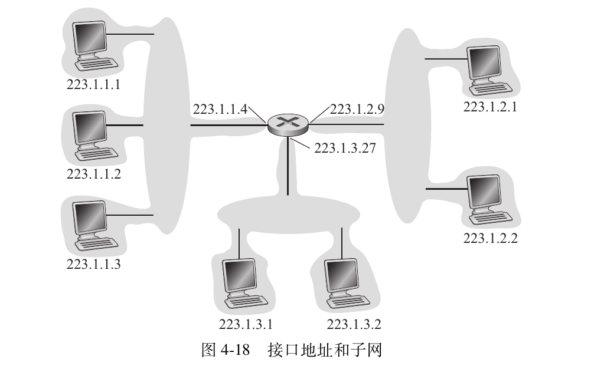

互联这 3 个主机接口与 1 个路由器接口的网络形成一个子网(subnet),IP编址为这个子网分配一个地址223. 1. 1. 0 / 24,其中, `/24`被称为子网掩码,将地址的前24位设定为该子网的IP地址
表示为`255.255.255.0`.需要时可以通过将子网掩码与ip地址取和得到子网地址;换句话说,只有前24位等于223.1.1的地址才属于这个子网.
- 可以在cmd输入ipconfig查看自己所属的子网.

**IP地址是如何分配的(3/15)**
IP 地址由因特网名字和编号分配机构(Internet Corporation for Assigned Names and Numbers,ICANN)管理,是非盈利的.
当某个组织获得了被分配的地址块后,可以为本组织内的主机与路由器接口逐个分配 IP 地址,这主要由动态主机配置协议 (Dynamic Host Configuration Protocol ， DHCP)完成.

某给定主机每次与网络连接时能得到一个相同的 IP 地址,或者被分配一个临时的 IP 地址. 除了主机 IP 地址分配外，DHCP 还允许一台主机得知它的子网掩码、它的**第一跳路由器地址**（也就是直连路由器,常称为默认网关）与它的本地 DNS 服务器的地址等其他信息.


##### 网络地址转换(Network Address Translation,NAT)


**NAT（网络地址转换）** 是工作在路由器等网关设备上的物理逻辑，它允许整个局域网（LAN）内的成百上千台设备，通过同一个公网 IP 地址（WAN 端）访问互联网。

**A. 出站请求 (SNAT - Source NAT)**

当你的手机（`192.168.1.5`）访问网站时：

1. **原始数据包**：源 IP 是 `192.168.1.5`，源端口是 `10001`。
2. **物理改写**：路由器将源 IP 修改为自己的 **公网 IP**（如 `1.2.3.4`），并将源端口修改为一个新分配的端口（如 `5000`）。
3. **记录映射**：路由器在 NAT 表中记下一笔：`5000 端口 <-> 192.168.1.5:10001`。

**B. 入站响应 (DNAT - Destination NAT)**

当网站服务器回传数据时：

1. **到达数据包**：目标地址是 `1.2.3.4:5000`。
2. **物理查询**：路由器查找 NAT 表，发现 `5000` 端口对应的是内网的 `192.168.1.5:10001`。
3. **物理还原**：路由器将目标 IP 和端口还原，数据包准确送达手机。

##### IPv6
IPv6将地址长度从32bit增加到128bit,确保了IP地址不会被用完,具体结构如下:
- 版本: 4bit长,字段值为6
- 流量类型: 与IPv4的服务类型类似
- 流标签: 对数据流中的某些数据报给出优先权
- 有效载荷长度: 载荷的字节数量
- 下一个首部: 与IPv4中的协议字段含义一样,表示要交付给哪个运输层协议
- 跳限制: 类似于IPv4中的寿命字段,当跳限制计数变为0时,包被丢弃
- 源地址和目的地址
- 数据: 载荷

事实上,IPv6不再使用子网掩码,而是直接用一个整数表示网络部分的位数，写在地址后的斜线后,如:
`fe80::49e0/128`
**如何兼容IPv4**
通过将IPv6数据报整个放入IPv4数据报的载荷部分中,并通过协议字段指示接收方这是一个装入了IPv6的IPv4数据报,从而实现了对网络层中使用IPv4路由器的兼容
#### 补充: 泛化转发(4/22)
之所以叫**泛化转发(Generalized Forwarding)**,是因为这里的转发除了网络层之外,还可能会涉及**链路层**,这与之前路由器的转发**并不相同**,因此加上**泛化**两个字来表示这个转发是宽泛而言的.
- 因此,泛化转发使用的设备也不是简单的使用链路层的交换机或者网络层的路由器,而是称为**分组交换机**

---
- [wiki](https://en.wikipedia.org/wiki/OpenFlow)
泛化转发主要基于**OpenFlow**标准来执行:
##### 流表（Flow Table）
这是泛化转发的逻辑核心。每个分组交换机内部维护一个或多个流表。每个流表项（Flow Table Entry）由三个核心部分组成：
* **首部字段匹配值（Match）**：这是“泛化”的具体体现。匹配字段可以涵盖 **入端口、源/目的 MAC 地址、以太网类型、VLAN 标签、源/目的 IP 地址、协议号（TCP/UDP）以及源/目的端口号**。这种跨 1-4 层的匹配能力，使得分组交换机既可以充当路由器，也可以充当交换机、防火墙或 NAT 设备。
* **计数器（Counter）**：用于实时统计匹配该规则的分组数量、字节数等。这是流量监控与计费的物理基础。
* **操作（Actions）**：当分组匹配成功后执行的动作，包括：
    * **转发**：发送到指定端口。
    * **丢弃**：执行安全过滤逻辑。
    * **修改字段**：例如修改 IP 头部（NAT 功能）或重写 MAC 地址（路由功能）。
    * **入栈/出栈**：针对 MPLS 或 VLAN 标签的封装处理。


##### 匹配-动作（Match-plus-Action）抽象
与传统路由器“查找最长前缀-转发”的单一模式不同，泛化转发将其抽象为通用的“匹配-动作”范式。
* **机制本质**：只要分组匹配首部字段（Match），就执行相应**操作**（Action）。这意味着网络管理员可以自定义非标准的处理流程。
* **流的概念**：被相同规则处理的一系列分组被视为一个“流（Flow）”。网络管理的粒度从单纯的“路径选择”细化到了“流控制”。

##### 控制与数据平面分离
OpenFlow 实现了物理上的解耦：
* **数据平面（Data Plane）**：分组交换机只负责执行流表中的匹配逻辑，逻辑简单且支持硬件加速（通常基于 TCAM 内存）。
* **控制平面（Control Plane）**：由远程控制器（Controller）统一管理。当交换机遇到无法识别的未知流时，会将其通过 OpenFlow 协议发送给控制器。控制器计算出处理规则后，再下发回交换机的流表中。


换句话说,数据在网络层中转发的时候,不再是简单的通过路由器后再经过交换机,而是直接通过**分组交换机转发**,从而大幅度减小了传播过程中出差错的概率.因此,**泛化转发**才是真正的转发,取代了我们之前所说的路由器转发.
#### 中间盒(middlebox)
>**中间盒**: 在源主机和目的主机之间的数据路径上,执行除了 IP 路由器的正常标准功能之外的其他功能的任何中间的盒子,可以提供以下三种功能服务:
- NAT转换
- 安全服务: 如防火墙和电子邮件过滤器等
- 性能增强: 提供内容缓存等功能
### 控制平面
#### 路由选择算法
按照集中式的还是分散式的来给算法分类:
1. 集中式路由选择算法(centralized routing algorithm):也被称为链路状态(Link State,LS)算法,需要提前得知网络中每条链路的开销,从而计算出当前节点的最低开销路径
2. 分散式路由选择算法(decentrlized routing algorithm): 每个节点仅有与其直接相连的节点链路开销,通过迭代和通信逐渐计算出最低开销路径,距离向量(Distance Vector)算法是一个代表.

##### 链路状态(LS)算法
通过链路状态广播(link state broadcast)算法来获取整体的节点信息,并根据Dijkstra算法找到最佳路径.
但是,实际应用中会产生**振荡**(Oscillation)问题,也就是当路由恰巧都沿着最短路径转发时,这条路径的开销由于流量增大而不再是最优路径,因此路由都转向原本开销比较高但现在相对是开销最低的那条线路,又导致这条线路开销变高,路由又都回到原来的路由转发路径上,这样来回切换路径显然不利于网络减小时延.
##### 距离向量(DV)算法
使用Bellman-Ford算法
#### 因特网中自治系统内部的路由选择： OSPF

如果将网络看作一个大规模的路由器互联网络会遇到以下两个问题:
* **规模瓶颈（Scalability）**：数亿台设备若运行单一路由算法，将导致内存耗尽、广播风暴以及算法（如距离向量）无法收敛。
* **管理自治（Administrative Autonomy）**：不同 ISP 需要独立控制内部协议、隐藏拓扑结构，并按自身策略进行管理。
因此,设计者将路由器规划成一个自治系统( Autonomous System,AS):
* **构成**：处于相同管理控制下的路由器和链路集合。
* **标识**：每个 AS 拥有全局唯一的 **AS 号 (ASN)**，由 ICANN 授权机构分配。
* **划分**：ISP 可作为一个 AS，也可拆分为多个 AS。

光这样说还不够,看下面这个表格:

| 运营商       | 网络名称              | AS 号 (ASN) | 角色                                        |
| :----------- | :-------------------- | :---------- | :------------------------------------------ |
| **中国电信** | ChinaNet (163 骨干网) | **AS4134**  | 全球最大的 AS 之一，承载绝大多数宽带流量。  |
| **中国电信** | CN2 (下一代承载网)    | **AS4809**  | 独立的 AS，专注于高质量、低延迟的精品业务。 |
| **中国联通** | 中国联通骨干网        | **AS4837**  | 原中国网通与联通合并后的核心 AS。           |
| **中国移动** | 中国移动骨干网        | **AS9808**  | 移动宽带及移动端流量的核心承载 AS。         |

- 这样就很好理解了,当我们接入网络的时候,实际上是进入了某一个运营商的AS,而不是直接接入整个互联网.

在一个AS内部运行的路由选择算法称为(intra-autonomous system routing protocol).
##### 开放最短路优先 （ OSPF ）
>该算法使用Dijkstra和周期性的路由广播,也就是说:
>
>路由器向自治系统内所有其他路由器广播路由选择信息,而非只向相邻路由器广播. 每当一条链路的状态发生变化时(如开销的变化或连接 / 中断状态的变化)， 路由器就会广播链路状态信息 。即使链路状态未发生变化，它也要周期性地(至少每隔 30min一次)广播链路状态.从而能够运用Dijkstra得到正确的结果.
#### ISP之间的路由选择：BGP
前面讨论的是AS内部的路由选择,现在我们来考虑AS之间的路由选择,在internet中,所有AS运行相同的路由选择协议: 边界网关协议(Border Gateway Protocol,BGP).
##### BGP的作用
作为一种 AS 间的路由选择协议，BGP 为每台路由器提供了一种完成以下任务的手段：

1) 从邻居 AS 获得前缀的可达性信息: 特别是，BGP 允许每个子网向因特网的其余部分通告它的存在。一个子网高声宣布 "我存在，我在这里"，而 BGP 确保在因特网中的所有 AS 知道该子网。如果没有 BGP 的话，每个子网将是隔离的孤岛，即它们孤独地存在，不为因特网其余部分所知和所达。

2) 确定到该前缀的 "最好的" 路由: 一台路由器可能知道两条或更多条到特定前缀的不同路由。为了确定最好的路由，该路由器将本地运行一个 BGP 路由选择过程 (使用它经过相邻的路由器获得的前缀可达性信息)。该最好的路由将基于策略以及可达性信息来确定。

- **前缀**指的是例如138.16.68/22这样的AS子网

##### 通告BGP路由信息
一个AS中有两种类型的路由器:网关路由器(gateway router)和内部路由器(internal router),网关路由器直接与其他AS中的路由器相连接,内部路由器仅连接AS内部的主机和路由器

与先前AS内部的路由广播类似,网关路由器也会将对应的转发信息传递给相邻的网关路由和内部路由,从而找到不同AS之间的转发路由路径
##### 找到最短路径(待补充)

##### IP任播(anycast)
##### 路由选择策略

#### SDN控制平面
- [wiki](https://en.wikipedia.org/wiki/Software-defined_networking)


#### ICMP: 因特网控制报文协议
>[wiki](https://zh.wikipedia.org/wiki/%E4%BA%92%E8%81%94%E7%BD%91%E6%8E%A7%E5%88%B6%E6%B6%88%E6%81%AF%E5%8D%8F%E8%AE%AE)
互联网控制消息协议（英语：Internet Control Message Protocol，缩写：ICMP）是互联网协议族的核心协议之一。它用于网际协议（IP）中发送控制消息，提供可能发生在通信环境中的各种问题反馈。通过这些信息，使管理者可以对所发生的问题作出诊断，然后采取适当的措施解决。
>
>ICMP与传输协议（如TCP和UDP）显著不同：它一般不用于在两点间传输数据。它通常不由网络程序直接使用，除了 ping 和 traceroute 这两个特别的例子.

事实上,ICMP位于IPv4和IPv6报文里面,用于提供网络发生问题时返回报错信息


## 链路层
### OVERVIEW
- 节点: 运行链路层协议的任何设备,包括主机,路由器,交换机,WiFi接入点
- 链路: 连接相邻节点的通信信道
#### 链路层需要提供的服务
- 成帧(framing): 将网络层的数据报封装成链路层帧
- 协调多个节点之间的通信: MAC协议
- 可靠交付: 通过确认和重传确保数据不出错和丢失
- 差错检测
#### 链路层是如何实现的
链路层控制器的大部分功能是在硬件中实现的,但也有部分链路层是在运行与主机CPU上的软件实现的.

### 差错检测和纠正
#### 奇偶校验
假设要发送的信息D有d比特,在偶校验方案中,发送方附加一个校验比特,使得者d+1个比特中1的总数是偶数;在奇校验方案中则保证是奇数.
接收方只需要检测接收的d+1个比特中1的个数即可以验证是否出现差错,比如在偶校验方案中发现了奇数个1比特,则说明至少出现了1个比特差错.
但如果出现了偶数个比特的差错,那就无法检测出差错了.因此,可以采用二维的奇偶校验方案,通过行和列来检验从而减小没有检测到差错的概率
#### 检验和方法
与TCP/UDP协议中采用的检验和类似.
#### 循环冗余检测(Cyclic Redundancy Check,CRC)(待补充)
双方协商取一个最高位为1的r+1位多项式G,发送方在d位数据段D的后端附加r个附加比特R,使得这个d+r位数据在模2算术下可以被G整除,接收方只需要用G去除这个收到的数据就可以知道是否出现差错.
### 多路访问协议(multiple access protocol)
该协议的目标是实现多个发送和接收节点对同一个共享信道的访问.

因为所有的节点都能够传输帧,所以多个节点可能会同时传输帧,那么其他节点就会同时接收到多个帧,发生**碰撞**(collide),这时没有一个节点能够有效获得传输的帧.

在理想情况下，对于速率为 R bps 的广播信道，多路访问协议应该具有以下所希望的特性：

1. 当仅有一个节点发送数据时，该节点具有 R bps 的吞吐量;
2. 当有 M 个节点发送数据时，每个节点吞吐量为 R / M bps. 这不必要求 M 个节点中的每一个节点总是有 R / M 的瞬间速率，而是每个节点在一些适当定义的时间间隔内应该有 R / M 的平均传输速率;
3. 协议是去中心化的; 这就是说不会因某主节点故障而使整个系统崩溃;
4. 协议是简单的，使实现不昂贵.

#### 信道划分协议(过)
#### 随机接入协议(待补充)
>在随机接入协议中，一个传输节点总是以信道的全部速率（即 R bps）进行发送. 当有碰撞时，涉及碰撞的每个节点反复地重发它的帧（也就是分组），到该帧无碰撞地通过为止. 但是当一个节点经历一次碰撞时，它不必立刻重发该帧. 相反，它在重发该帧之前等待一个随机时延. 涉及碰撞的每个节点独立地选择随机时延. 因为该随机时延是独立地选择的，所以下述现象是有可能的：这些节点之一所选择的时延充分小于其他碰撞节点的时延，并因此能够无碰撞地将它的帧在信道中发出.


### Switched Local Area Networks


#### Link-Layer Addressing and Address Resolution Protocol(ARP)
##### MAC地址
A link-layer address is variously called a LAN address, a physical address, or a **MAC address**.
>事实上,并不是主机或路由器具有链路层地址,而是它们的**适配器**(即网络接口)具有链路层地址

The MAC address is 6 bytes long, giving 2^48 possible MAC addresses. 尽管MAC地址是一个固定值并且是唯一的,但现在有可能用软件改变某个接口的MAC地址.

- 需要注意的是,一般来说一个设备的MAC地址总是不变的,而对应的IP地址总是根据连接到的网络而改变

>一般来说,当源适配器要向向一个目的适配器发送帧时,它会讲目的适配器的MAC地址插入帧中,并将该帧发送到局域网中;有时候源适配器或者中途经过的交换机会将帧广播到所有的适配器.
当目的适配器接收到帧时,如果帧中的目的MAC地址与自己的MAC地址匹配,则会提取出封装的数据报并沿着协议栈向上传输;如果不匹配,则直接丢弃这个帧.
- 有时候源适配器需要让局域网的所有适配器接收并处理自己的帧,这个时候,可以在目的地址字段插入一个特殊的MAC广播地址,对于6字节MAC地址的局域网来说,广播地址是48个连续的1组成的字符串
#####  Address Resolution Protocol,ARP(地址解析协议)
为了在发送链路层帧的时候指明接收该帧的适配器,需要提前知道适配器的MAC地址,从而实现包的正确发送,因此我们采用ARP协议来根据适配器对应路由器或主机的IP地址,找到其MAC地址
- ARP: 将网络层地址与链路层地址相互转换的协议.它和DNS的作用基本类似,但一个重大区别是: DNS可以解析因特网上任意主机或者域名为IP地址,但ARP只为同一个子网的主机和路由器接口解析IP地址为MAC地址
**ARP原理**

每台主机或者路由器在内存中有一个ARP表(ARP table),包含了IP地址与MAC地址的映射关系,还有保存时限值,指示了从表中删除该映射的时间.

主机要发送帧前,先要发送一个ARP packet给自己的适配器,这个ARP分组包括发送和接收方的IP地址以及自己的MAC地址,指示适配器使用MAC广播地址发送这个分组并发送该链路层帧,从而让子网的所有适配器接收这个分组,IP地址与该ARP packet中包含的目的IP地址匹配的适配器会向发送方传回一个响应ARP packet,让发送方可以更新它的ARP表.

- 从这个角度来看,ARP与IP处于同一级别,都位于网络层
**如何跨越子网传输数据**
通过上面的论述,我们可以发现,ARP只适用于子网内部的转发,当我们要跨越子网转发数据时,应该先将数据转发给网关路由,再由网关路由来根据链路层帧包含的IP地址跳到下一个路由器,直到转发到目标主机的网关路由,再将数据交给目标主机
####  以太网(Ethernet)
- 以太网(Ethernet)几乎完全占据了有线局域网市场
##### 以太网的帧结构


- Data field (46 to 1,500 bytes): This field carries the IP datagram. The minimum size of the data field is 46 bytes.This means that if the IP datagram is less than 46 bytes, the data field has to be “stuffed” to fill it out to 46 bytes.
- Destination address (6 bytes): This field contains the MAC address of the destination adapter.
- Source address (6 bytes): This field contains the MAC address of the adapter that transmits the frame onto the LAN
- Type field (2 bytes): 指示数据字段所用网络层协议的类型
- Cyclic redundancy check (CRC) (4 bytes): 检测帧差错
- Preamble (8 bytes): 用于唤醒适配器,告诉它现在有一个以太网帧来了


##### 以太网的无连接传输

以太网技术向网络层提供**不可靠服务**. 具体来说, 当适配器 B 收到一个来自适配器 A 的帧, 它对该帧执行 **CRC 校验**, 但是当该帧通过 CRC 校验时它既不发送确认帧; 而当该帧没有通过 CRC 校验时它也不发送否定确认帧. 当某帧没有通过 CRC 校验, 适配器 B 只是**丢弃**该帧. 因此, 适配器 A 根本不知道它传输的帧是否到达了 B 并通过了 CRC 校验.

在链路层缺乏可靠传输有助于使以太网变得**简单且便宜**. 但是这也意味着传递到网络层的数据报流可能存在**间隙**.

如果由于丢弃了以太网帧而存在间隙, 主机 B 上的应用也会看见这个间隙吗? 正如我们在第 3 章中所学到的, 这完全取决于该应用是使用 **UDP** 还是 **TCP**.

* 如果应用使用的是 **UDP**, 则主机 B 中的应用确实会看到数据中的间隙.
* 另一方面, 如果应用使用的是 **TCP**, 则主机 B 中的 TCP 将不会确认包含在丢弃帧中的数据, 从而引起主机 A 的 TCP **重传**.

注意到当 TCP 重传数据时, 数据最终将回到曾经丢弃它的以太网适配器. 因此, 从这种意义上来说, 以太网确实重传了数据, 尽管以太网本身并不知道它正在传输的是一个包含全新数据的全新数据报, 还是一个包含已经被传输过至少一次的数据的数据报.
#### 链路层交换机(Link-Layer Switches)(待补充)

##### 转发和过滤
>**Filtering** is the switch function that determines whether a frame should be forwarded to some interface or should just be dropped. 
**Forwarding** is the switch function that determines the interfaces to which a frame should be directed, and then moves the frame to those interfaces. 

假定目的地址为 DD-DD-DD-DD-DD-DD 的帧从交换机接口 x 到达,那么会有以下三种情况:
1. 交换表中没有对应 DD-DD-DD-DD-DD-DD 的表项,则将这个帧广播到所有接口(除了接口x,因为帧是从接口x来的)
2. 交换表中有对应 DD-DD-DD-DD-DD-DD 的表项,但是对应接口为x,那么显然你不可能把从接口x收到的帧再送回接口x,只能就地丢弃这个帧
3. 交换表中有对应 DD-DD-DD-DD-DD-DD 的表项,对应接口不是x而是y,那么交换机就需要把这个帧送入接口y

**疑问:第二种可能中,如果是局域网通信的话,那不就有可能用的是同一个接口吗?**


在局域网（LAN）中，如果两个主机 A 和 B 都在“同一个接口”下，通常只有两种物理物理场景：

* **场景 A：接了集线器（Hub）**
    你将 A 和 B 都接在一个外接 Hub 上，再把 Hub 连到交换机的接口 $x$。
* **场景 B：共享介质（旧式同轴电缆）**
    所有主机物理上连在同一根线上。

交换机（Switch）的核心作用是**隔离冲突域**并**跨端口转发**。

当主机 A 发送一个目的 MAC 为 B 的帧进入接口 $x$ 时：
1.  **查表**：交换机查找 MAC 地址表，发现 B 的 MAC 对应接口也是 $x$。
2.  **判断**：交换机意识到，“目的地”和“来源地”都在同一个物理方向上。
3.  **结论**：如果 A 和 B 都在接口 $x$ 下方，那么当 A 发出信号时，信号在到达交换机之前，**物理上已经流经了 B**（如果是 Hub 或共享总线）。

> **底层逻辑**：交换机认为，既然目标 MAC 就在接收端口所在的网段内，那么目标主机 B 应该已经通过物理介质直接收到了这个帧。如果交换机再把它从接口 $x$ “弹回”去，不仅是浪费带宽，更会导致 B 收到两份重复的数据帧。

##### 交换表的建立与交换机的自学习
1. 交换表初始为空
2. 对于在每个接口接收的帧,交换机会在表中记录以下信息:
   1. 该帧的源MAC地址
   2. 该帧是从哪个接口进来的
   3. 当前时间
3. 如果一段时间后,交换机没有接收到过与记录的源MAC地址相同的帧,那么就会在表中删除这个地址

那么,让我们来详细分析一个新产生的帧被目的MAC地址对应的交换机接收的过程:
1. 当这个帧进入第一个交换机时,由于交换机不认识这个帧,故会在所有接口转发该帧并记录该帧信息
2. 经过很多次转发,在传播路径上的交换机都记录了该帧的三种信息
3. 当目的MAC地址对应的交换机接收到该帧时,由于目的MAC地址对应的服务器一定已经将自己的信息存在了该交换机中(思考一下是为什么),那么只需要将该帧送入服务器的适配器即可完成整个流程.
#### 虚拟局域网(VLAN)
- [wiki](https://zh.wikipedia.org/wiki/%E8%99%9A%E6%8B%9F%E5%B1%80%E5%9F%9F%E7%BD%91)
  - 由于书上讲的不明不白,所以去额外找资料了

>VLAN的工作原理是在广播域内转发的网络帧上添加标签，从而使网络流量看起来如同被分割在不同的网络中。这样即使在同一个物理网络，VLAN也能将网络隔离开来，而无需部署多套电缆和网络设备。


### 无线网络概览
前面谈的都是有线网络,现在来谈谈WiFi,4G等无线网络,它由以下三个要素组成:
1. **无线主机**: 可以是手机,电脑,家用电器,可以是移动的,也可以是位置固定不动的
2. **无线链路**: 主机通过无线链路连接到一个基站或者另一个主机
3. **基站**: 负责收发无线链路数据

我们可以把无线网络分为四类:
1. 具有基站的单跳: 基站和主机之间可以直接通信,不需要经过中继节点,日常见到的无线网络如WiFi和4G都属于这一类型
2. 无基站的单跳: 由一个主机进行收发无线数据,其他设备与该主机通信,而不通过基站,**蓝牙协议**便是典型的例子
3. 具有基站的多跳: 主机与基站通信需要经过中继节点
4. 无基站的多跳: 通过多个主机节点进行通信,这显然是最难设计的一类网络

#### 无线链路的特征
与有线链路相比,无线链路有以下三个特点:
1. 信号强度递减: 电磁波穿过物体时强度将减弱,也就是**路径损耗**
2. 来自其他通信源的干扰: 同一频段的电磁波会相互干扰
3. 多路径传播: 电磁波会经过地面或者物体反射,导致出现**多径传播**的问题
显然,无线网络更容易出现差错,因此我们需要使用更为可靠的传输方法.

- **信噪比**( Signal-to-Noise Ratio，SNR):单位为dB,是接收到的信号振幅与噪声幅度比值的以10为底的对数的20倍,显然,信噪比越大,信号就越干净.
- **比特差错率**(BER): 接收方收到的一个比特为错误的概率

物理层的通信有以下特点:
1. 使用同一个调制方法,SNR越高,BER越低: 因此发送方可以通过增加传输功率提高SNR来降低BER,但是这样会消耗更多的能量,并且当功率超过阈值时不再有实际增益
2. 对于给定的SNR,调制方法的传输速度越高BER越高,这很容易理解,速度越快越容易出差错
3. 对于给定的信道我们可以采用不同的调制技术

#### CDMA(待补充)

### WiFi
尽管无线局域网(WLAN)的通信有很多技术可以选用,但是WiFi占据着统治地位.
WiFi的正式名称为**IEEE 802. 11 无线局域网**

基本服务集 (BSS) 是WiFi的基本构件，有两个部分：
- 无线站点 (Station)：手机、笔记本等终端设备。
- 接入点 (Access Point,AP)：起中央基站作用的节点。

#### 信道与关联
当管理员安装AP时,需要为AP分配一个服务集标识(Service Set Identifier,SSID)和一个信道号.

802.11运行在 2. 4GHz ～ 2. 485GHz的频段中,由11个部分重叠的信道组成, 当且仅当两个信道由 4 个或更多信道隔开时它们才无重叠,因此管理员需要指示AP的信道号避免影响到其他AP.

>显然,当你进入咖啡馆时,你可以收到很多个AP传来的信号,那么我们是符合与一个特定AP连接的呢?
802.11协议要求每个AP周期性的发送信标帧,该帧包括该AP的SSID和MAC地址,供无线站点接收并处理;当然,主机也可以自己发送广播帧来主动扫描附近的AP,选定关联AP,具体过程如图所示:

>选定与之关联的 AP 后，无线主机向该 AP 发送一个关联请求帧，并且该 AP 以一个关联响应帧进行响应。注意，对于主动扫描需要第二个请求 / 响应握手 ，因为一个对初始探测请求的帧进行响应的 AP 并不知道主机选择哪个 （ 可能多个 ） 响应的 AP 进行关联 ， 这与 DHCP 客户能够从多个 DHCP 服务器中进行选择有诸多相同之处 

与AP连接之后,主机便会发送DHCP报文获取自己的IP地址,从而与互联网连接.

#### 802. 11采用的传输协议: CSMA/CA
802.11采用的MAC协议类型为随机接入协议,称为带碰撞避免的CSMA(CSMA with collision avoidance), 简称为CSMA/CA.
之所以802.11采用碰撞避免而非和以太网相同的碰撞检测,有以下两个原因:
1. 检测碰撞需要主机同时具有发送信号和接收其他站点信号的能力,而802.11适配器接收到的信号强度往往远小于发送出去的信号强度
2. 无线信号存在衰减,多路传播,隐藏终端等问题,无法检测到所有的碰撞

##### 802.11的链路层确认方案
由于无线链路中的帧不能无损的到达目的地,因此802.11采用链路层确认方案来实现重传机制.
目的站点收到一个通过CRC校验的帧后,等待一小段时间-这被称为短帧间间隔(short inter-frame spacing),然后发回一个确认帧,如果发送站点在给定时间内没有收到确认帧,它就假定出现了错误并进行重传,如果若干次重传后仍未收到确认帧,则放弃发送并丢弃该帧.

##### 为什么现代以太网不重传而802.11重传
因为802.11的环境极易丢包,如果依靠上层协议如TCP的重传机制,由于跨越了多层硬件,传输速率将会大幅度下降;而以太网线路的环境非常稳定,发生丢包的概率几乎为零,将少量的丢包问题交给上层协议处理可以减少不必要的设计复杂度.


##### CSMA/CA协议的详细原理
1. 如果有一个帧要发送,发送站监听到信道空闲时,它等待一小段时间后发送该帧-这被称为分布式帧间间隔(distributed inter-frame space)
2. 如果信道被占据,则站点选取一个随机回退值,在侦听到信道空闲时减小该值,信道繁忙时则保持该值不变
3. 计数值减到零时,该站点发送帧并等待确认
4. 如果收到确认,则帧被正确接收.如果要传输另一个帧,站点将从第二步重新开始;如果没收到确认,则站点进入第二步并在一个更大的范围内选取随机值
**满格信号网速仍然很慢的原理**
当大量主机使用同一个AP时,为了避免碰撞,单一主机的等待时间大量延长,从而导致了网速的降低;同时,AP的上行光纤容量有限,不允许所有设备以最大功率同时传输.
##### 处理隐藏终端问题
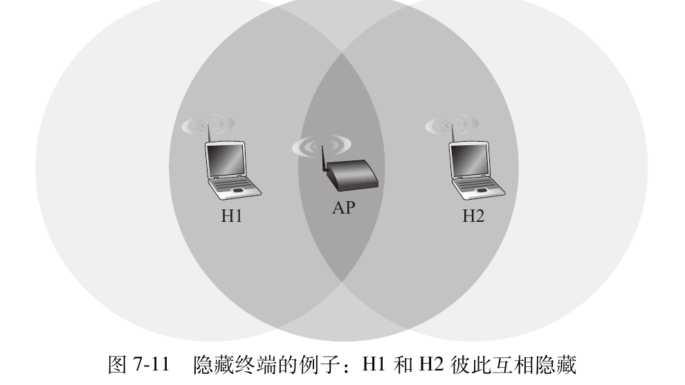
- 尽管每个无线站点对AP都不隐藏,但两者彼此是隐藏的

当H1和H2要发送帧时,由于它们彼此是看不见的,因此都以为信道是空闲的,就会同时发送并导致碰撞.

为了避免碰撞,802.11通过让站点使用请求发送(Request to Send,RTS)控制帧和允许发送(Clear to Send,CTS)控制帧来预约何时访问信道.
发送方在发送帧之前,首先向AP发送一个RTS帧,指示自己传输帧和收到确认帧所需的总时间,AP收到该帧后广播一个CTS帧,指示发送方明确的发送许可并告知其他站点在这段时间内不要发送,从而避免碰撞.
- 这两个控制帧都很短,所以在这个过程中发生碰撞的可能性很小

>尽管 RTS / CTS 交换有助于减少碰撞 ， 但它同样引入了时延并消耗了信道资源。因此 ，RTS / CTS 交换仅仅用于为长数据帧预约信道 。 在实际中，每个无线站点可以设置一个 RTS门限值，仅当帧长超过门限值时，才使用 RTS / CTS 序列。对许多无线站点而言 ，默认的RTS 门限值大于最大帧长值 ， 因此对所有发送的 DATA 帧，RTS / CTS 序列都被跳过。

#### 802.11的帧结构
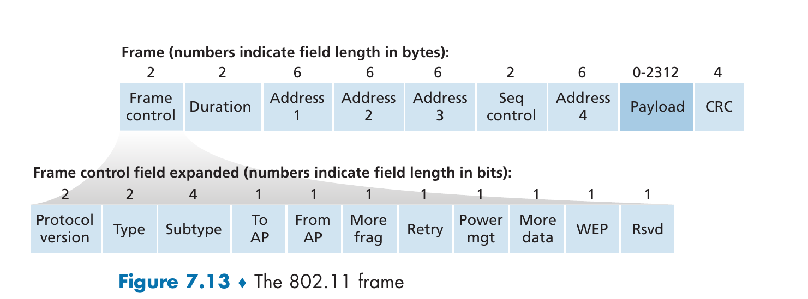
接下来对其中的重要组成部分做一点分析:
1. 有效载荷与CRC字段
2. 地址字段: 地址4仅在AP相互转发时使用,前三个字段的定义如下:
   1. 地址1是要接收该帧的站点MAC地址
   2. 地址2是传输该帧的站点MAC地址
   3. 地址3是子网默认网关的MAC地址
3. 序号,持续期,帧控制字段
#### 无线站点在同一子网中的不同BSS之间移动
>随着 H1 逐步远离 AP1 ，H1 检测到来自 AP1 的信号逐渐减弱并开始扫描一个更强的信号.H1 收到来自 AP2 的信标帧.
H1然后与 AP1 解除关联,并与AP2 关联起来,同时保持其 IP 地址和维持正在进行的 TCP 会话.新AP2 会发送以太网广播,强制沿途交换机更新路径.
### 蓝牙

蓝牙网络运行在 **2.4 GHz ISM（工业、科学、医学）** 免授权频段。由于该频段同时被微波炉、车库门遥控器和无绳电话等多种设备占用，蓝牙在设计之初就将**抗噪**与**抗干扰**作为核心目标。

#### 蓝牙的物理原理

* **时分复用（TDM）**：蓝牙无线信道被划分为时长为 **625 微秒** 的时间隙。
* **频分跳频扩展频谱（FHSS）**：在每个时间隙中，发送端在 79 个信道中的某一个进行传输。信道（频率）在每个时隙间按照已知但伪随机的规律切换。
* **抗干扰逻辑**：通过跳频技术，即使 ISM 频段内存在其他设备的干扰，也只会影响到**极少数特定时隙**的蓝牙通信，从而保证了整体链路的稳健性。目前蓝牙数据速率最高可达 3 Mbps。

---

#### 蓝牙网络的结构

在蓝牙网络（Piconet）中，设备角色分为以下三类：

1.  **主节点 (Master Device)**：核心控制单元，负责管理连接数量、调度时隙以及控制所有连接设备的传输功率。
2.  **客户设备 (Client/Slave Device)**：受控单元，遵循主节点的跳频序列进行通信。
3.  **存放设备 (Parked Device)**：低功耗睡眠模式设备。它们保持与主节点的同步，但不参与数据传输，仅在需要时由主节点唤醒进入活跃状态。
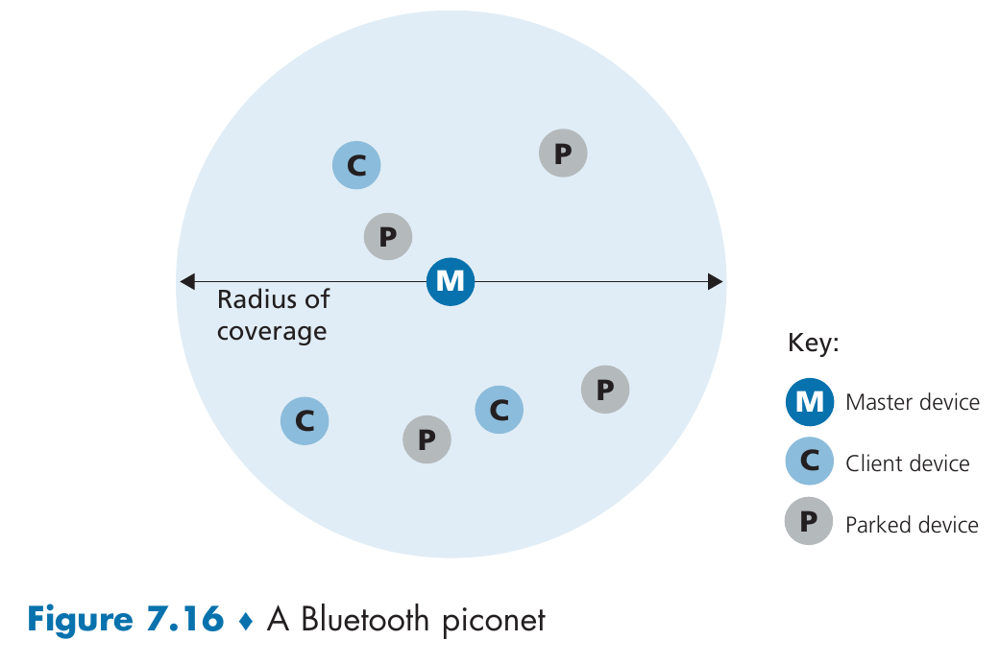
---

#### 主节点如何与其他设备连接

连接过程本质上是一个从“频率盲区”到“时间与频率双重同步”的过程，分为 **查询（Inquiry）** 和 **寻呼（Paging）** 两个阶段：

##### 第一阶段：设备发现（查询）
* **广播探测**：主节点在 32 个不同的信道上轮流发送询问消息，并将该序列重复传输多达 128 次，以确保覆盖所有可能的监听频率。
* **被动监听**：潜在的客户设备在自己随机选择的频率上进行监听。
* **随机回退机制**：一旦客户设备接收到查询，它会在 **0 ~ 0.3 秒** 之间选择一个随机时间量进行回退。这种“随机退避”设计是为了防止多个客户设备同时响应主节点而引发信号冲突。
* **身份响应**：回退结束后，客户设备发送包含其唯一设备 ID 的报文响应主节点。

##### 第二阶段：建立连接（寻呼）
* **定向寻呼**：主节点在发现范围内所有潜在设备后，开始针对特定设备发送 32 条寻呼邀请报文。由于此时客户设备尚未获得跳频序列，主节点仍需在多个频率上重复发送。
* **确认握手**：客户设备接收到寻呼报文后，返回 **ACK（确认）** 报文。
* **参数交付**：主节点随后向客户设备发送关键配置信息，包括：
    * **跳频序列模式**（告知未来的频率路径）。
    * **时钟同步信息**（校准通信时间基准）。
    * **活跃成员地址**（分配逻辑地址）。
* **轮询激活**：最后，主节点使用已同步的跳频模式对该客户设备进行轮询(polling)。一旦回复成功，双方正式进入连接状态，实现网络层面的握手。

#### 更上层发生了什么
我们可以发现,蓝牙的链路层连接逻辑与其他的协议完全不同,这从而说明蓝牙的上层逻辑也与其他的协议不同,这里就不介绍了.

### Cellular Networks: 4G and 5G
无线网络分为无线局域网和无线广域网,我们前面所说的WiFi和蓝牙就属于局域网,而这里的4G/5G就属于广域网了.

>The term **cellular**(蜂窝) refers to the fact that the region covered by a cellular network is partitioned into a number of geographic coverage areas, known as cells. 
Each cell contains a **base station** that transmits signals to, and receives signals from, the mobile devices currently in its cell.
#### 4G LTE Cellular Networks: Architecture and Elements
>The 4G networks that are pervasive as of this writing in 2020 implement the **4G Long-Term Evolution standard**, or more succinctly **4G LTE**.

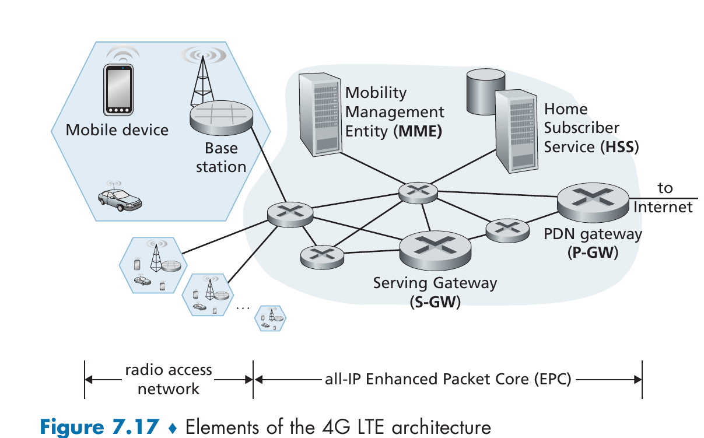
4G网络由以下几个部件构成:
1. Mobile device: 连接到蜂窝运营商网络的智能手机 、 平板电脑、笔记本电脑或物联网设备
   1. 该移动设备还具有全球唯一的 64 位标识符，称为国际移动用户身份 （ IMSI），存储在其 SIM （ 用户身份模块） 卡上。IMSI 在全球蜂窝网络系统中识别用户，包括用户所属的国家和归属蜂窝网络 。
2. Base Station: The base station is responsible for managing t**he wireless radio resources** and the **mobile devices** with its coverage area.
   1. 这类似于WiFi中的AP,但还有很多额外的功能
3. Home Subscriber Server (HSS): The HSS is a database, storing information about the mobile devices for which the HSS’s network is their home network.
4. Serving Gateway (S-GW), Packet Data Network Gateway (P-GW), and other network routers: 用于实现NAT,路由转发等功能
5. Mobility Management Entity (MME): 控制平面部件,用于验证设备,设置路径,追踪设备位置


### 无线链路对高层协议的影响
鉴于无线链路传播的比特差错率远高于有线链路,因此需要对上层协议如TCP连接做出针对性的处理

>在所有情况下，TCP 的接收方到发送方的 ACK 都仅仅表明未能收到一个完整的报文段，发送方并不知道报文段是由于拥塞或切换 ， 还是由于检测到比特错误而被丢弃的。在所有情况下 ，发送方的反应都一样 ， 即**重传该报文段** 。 TCP 的拥塞控制响应在所有场合也是**相同**的 ，即 TCP 减小其拥塞窗口,这会导致带宽利用率骤降.

#### 链路层重传 (LL-ARQ)
这是解决无线丢包的最前线。LTE、5G 或 Wi-Fi 协议在数据链路层（MAC/RLC 层）实现了快速重传。
* **机制：** 基站与终端之间发现包序列不连续时，直接在二层进行重传，不向网络层汇报。
* **代价：** 引入了抖动 (Jitter)，因为链路层重传会导致部分包延迟到达。

#### 拥塞控制算法的进化 (BBR)
Google 提出的 **BBR (Bottleneck Bandwidth and RTT)** 算法改变了判断逻辑。
* **原理：** BBR 不再将“丢包”作为减速信号。它通过周期性探测**带宽极大值**和**延迟极小值**来构建网络模型。
* **实战表现：** 在一定比例（如 5% ~ 15%）的随机丢包环境下，BBR 能维持几乎满带宽的传输速率，而 CUBIC 则会因为不断减半窗口而彻底卡死。

#### 选择性确认 (SACK)
原生 TCP 采用累积确认，丢一个包可能导致后续一连串包被重传。
* **机制：** 启用 `TCP_SACK` 选项。接收端在 ACK 中告知发送端具体哪些数据块（Ranges）已收到。
* **效果：** 发送端可以精确补齐缺失的数据，而不是盲目重传所有未确认的包。

#### 拆分连接协议 (Split-TCP / Proxy)
在移动通信核心网中，常使用 **PEP (Performance Enhancing Proxy)**。
* **拓扑：** `终端 <——无线链路——> 基站/边缘网关 <——有线主干——> 服务器`。
* **机制：** 将一个 TCP 连接拆分为两段。无线段使用针对高丢包优化的协议（如调整过初始窗口、禁用慢启动退避的私有协议），有线段保持标准 TCP。
* **逻辑：** 避免了无线端的局部丢包反馈到远端服务器，缩短了重传的往返时间 (RTT)。


## 网络安全
网络通信中的安全需要满足以下要求:
1. 机密性(confidentiality): 仅有发送方和希望的接收方能够理解传输报文的内容,这需要报文能够被加密和解密
2. 完整性(message integrity): 通信内容在传输过程中不应该被篡改,这需要我们实现数据检验和可靠的传输通道
3. 通信认证(end-point authentication): 发送方和接收方都需要能够证明另一方的身份是真实的
4. 防御恶意攻击(operational security): 通过防火墙和入侵检测系统来防御网络攻击

### 密码学
我们现在假设A要向B发送一个报文,最初的文本被称为明文(plaintext),A使用密钥(key)*m*来加密明文,从而得到**密文**(ciphertext),并将其发送出去.
B为了解密这个密文,需要使用密钥*n*来处理这个密文,从而得到明文.

显然,加密过程中最关键的就是密钥了,根据密钥是否对称(相同)可以将加密方式分为两种:
1. 对称密钥系统: A和B所用的密钥是相同而且保密的,否则就没有任何意义了
2. 非对称密钥系统(也称为公开密钥系统): 有两个密钥,一个是公开的密钥,称为**公钥**,所有人都可以获取;另一个是只有A或者B才知道的密钥
#### 攻击手段
根据攻击者掌握的信息,大致有三种攻击手段:
1. 密文攻击: 入侵者只截取到了密文,破解难度最高
2. 已知明文攻击: 攻击者事先知道部分明文对应的密文
3. 选择明文攻击: 攻击者能够选择任意一段明文并获取对应的密文,破解难度最低
#### 对称密钥
#####  Caesar Cipher(凯撒密码)
密钥为字母表偏移量,很容易被破解
##### Block Cipher(块密码)
- TLS采用的就是这个加密方式
将明文划分为固定长度k的块，通过一一对应的映射函数将其转换为相同长度的密文块.如果我们让k=3,就需要让000到111这8个输入转换到对应的三比特输出.

尽管当增大k值时转换表的破解难度大幅度上升,但交流的双方都需要维护一张2^k大小的转换表,这不太现实.
因此,块密码使用函数来模拟转换表,例如:当k=64时,我们可以把64比特块划成8个子块,每个8比特块按照一张独特的k=8的转换表处理,然后将转换后的64比特按照一定规则打乱后再分为8个子块进行处理,进行多次循环.这种算法的密钥是**8张k-8的转换表**.
- 如果用 1 秒破解 56 比特 DES 的计算机 （ 就是说，每秒尝试所有 2^56个密钥 ） 来破解一个 128 比特的 AES 密钥 ，要用大约 149 万亿年的时间才有可能成功
##### Cipher-Block Chaining: 引入随机性
前面的块密码有一个缺陷: 如果有多个块中的明文内容相同,如"HTTP/1.1"这类常见的前缀词,那么将会得到相同的密文,从而被攻击者探测到并进行破解.
因此,我们可以在加密时引入随机数,如下图所示:

这样一来,即使明文相同,得到的密文也会不同,而密文相同时,得到的明文可能相同,破解难度大幅上升.

同时,实际应用中不太可能一个个传输随机数,故块密码使用密码块链接(Cipher-Block Chaining,CBC)来高效传输接收方所需的随机数,基本方法如下:
1. 在发送数据之前,发送方生成一个随机的k比特串(对应k比特块加密),称为初始向量(Initialization Vector,IV).表示为c(0),并以明文方式发给接收方
2. 对第一个块，发送方计算 c(1) = Ks(m(1) ⊕ c(0))后发送密文
3. 对于第 i 个块，发送方根据 c(i) = Ks(m(i) ⊕ c(i-1)) 生成第 i 个密文块


#### 非对称密钥
该类型的密钥有三个关键要素:
1. 一个公开的加密算法和一个公开的解密算法
2. 一个公开的密钥,称为**公钥**
3. 只有通信中的某一方才知道的密钥,称为**私钥**

使用非对称密钥的通信过程如下:
发送者用加密算法和公钥来加密报文,接收者使用解密算法和私钥来解密报文.

但是,这种加密方式有不少问题:
1. 如何保证加密后的报文不会被破解?
2. 由于任何人都可以通过公钥加密报文后发送给接收方,如何确定发送者是可靠的?

尽管有很多算法可以解决上述问题,但RSA算法已经成为了非对称密钥的代名词.

##### RSA算法
为了生成RSA的公钥和私钥,接收方需要执行以下步骤:
1. 选择两个大素数p和q,值越大就越难破解.
2. 计算`n=pq`和`z=(p-1)(q-1)`
3. 选择小于n的一个数e,使得e和z互质.
4. 选择一个数d,满足`ed mod z = 1`
5. 那么接收方的公钥由(n,e)组成,私钥由(n,d)组成

通信过程如下:
1. 发送方发送的报文以二进制形式表示为一个整数m,由于报文的位数有限,故m一般不会很大,在RSA算法中要求m < n,然后计算`c = m^e mod n`,从而得到密文c,并交给接收方.
2. 为了解密c,接收方计算`m = c^d mod n`,得到报文m.

举一个简单的例子:
1. 接收方选择p=5和q=7,得到n=35和z=24,在5,7,11等与24互质的数中选择一个数,比如说5,那么由于`(5x29)-1`可以被24整除(尽管5x5-1等取值也可以被24整除,但假设我们是随机取值取到了29),则d=29.
2. 发送方使用(35,5)加密报文,接收方使用(35,29)报文.

##### 会话密钥
由于大数据的指数运算非常耗时,所以实际应用中我们可以把对称密钥和RSA结合在一起,用RSA来加密对称密钥算法中所需的密钥.这个被加密的密钥称为**会话密钥**(session key)

##### RSA原理
RSA运用了两个数论中的结论,这里不做说明,我们只需要知道通过(n,e)和(n,d)就足够进行加密和解密,攻击者如果想暴力破解，唯一的方法是:
1. 试图从公开的 n 中分解出两个原始质数 p 和 q。
2. 只有得到 p 和 q，才能计算出`z = (p-1)(q-1)`。
3. 通过`ed ≡ 1 mod z` 解出私钥 d。

>RSA 的安全性依赖于这样的事实：目前没有已知的算法可以快速进行一个数的因数分解 ，这种情况下公开值 n 无法快速分解成素数 p 和 q。如果已知 p 和 q ，则给定公开值 e，
就很容易计算出秘密密钥 d 。 另一方面，不确定是否 存在 因数分解一个数的快速算法 ， 从这种意义上来说，RSA 的安全性也不是确保的 。
### 报文完整性的鉴别和数字签名
接收方验证某条消息是否可靠,需要检测以下两个因素:
1. 该报文来自可靠的发送方
2. 该报文在途中没有被篡改

#### 加密哈希函数(cryptographic hash function)
- hash function: 任意输入都会得到相同长度的输出
- cryptographic hash function: 在哈希函数的基础上,需要额外保证: 找到一个不同的输入得到相同的输出是基本不可能的.

从加密哈希函数的定义就可以看出来,攻击者一般来说是无法用其他报文伪造原报文的,从而保证该报文不会被篡改.

常用的加密哈希函数有以下几种:

| 算法      | 哈希长度                 | 基本逻辑                                                                                         | 安全性现状与建议                                                                      |
| :-------- | :----------------------- | :----------------------------------------------------------------------------------------------- | :------------------------------------------------------------------------------------ |
| **MD5**   | 128 位                   | 将输入信息按 512 位分组，通过复杂的压缩函数进行多轮迭代处理，生成 128 位哈希值。                 | ❌ **已破解**，可人为制造碰撞。**任何安全场景下都不应使用**。                          |
| **SHA-1** | 160 位                   | 逻辑与 MD5 类似，哈希值更长（160 位），处理步骤更复杂，安全性有所提升。                          | ⚠️ **已不足够安全**，存在理论碰撞攻击，Google 等已在 2017 年实现碰撞。**应避免使用**。 |
| **SHA-2** | 224 / 256 / 384 / 512 位 | 采用 Merkle-Damgård 结构，更多轮次和更复杂的逻辑（如更多常量）。其中 SHA-256 和 SHA-512 最常用。 | ✅ **广泛认为安全**，是替代 MD5 和 SHA-1 的**首选标准**。                              |
| **SHA-3** | 224 / 256 / 384 / 512 位 | 采用全新的 **Keccak 海绵函数结构**，与 SHA-2 设计思路完全不同，提供更高的安全冗余。              | ✅ **安全性高**，可作为 SHA-2 的**备选方案**。                                         |


#### 报文鉴别: 使用哈希函数和鉴别密钥
使用哈希函数,我们可以这样验证报文的完整性:

1. Alice生成报文m并计算散列H(m).
2. 然后Alice将H(m)附到报文m上,生成一个扩展报文(m, H(m)),并将该扩展报文发给Bob.
3. Bob接到一个扩展报文(m, h)并计算H(m). 如果H(m) = h,Bob得出结论:一切正常.

但这种方法有一个问题: 攻击者可以声称他就是Alice,并将报文发送给Bob,这显然可以通过报文完整性的验证.

因此,我们还需要加入鉴别密钥(authentication key),即一个被双方共享的秘密比特串,在下述过程中我们将其称为s.

1. Alice生成报文m,加入s生成m+s,并计算H(m+s),这被称为报文鉴别码(Message Authentication Code,MAC).
2. 然后Alice将MAC附加到报文m上,生成扩展报文(m, H(m+s)),并将该扩展报文发送给Bob.
3. Bob接收到一个扩展报文(m,h),由于知道s,计算出报文鉴别码H(m+s).如果H(m+s)=h,Bob得出结论:一切正常.

#### 数字签名
有时候,我们会需要用一个数字签名(digital signature)来标识某个文件,这个数字签名一定是独一无二,不可篡改的,这样才可以保证能够分辨出该文件的所有者.

一种方法是发送方使用某一加密哈希函数取得报文的hash值,并用私钥加密该hash值;而在验证这个签名时,接收方只需要用公钥去解密这个hash值,如果计算结果与该文件的hash值一致,则证明报文的来源可靠

#### 公钥认证
要让公钥密码生效,必须要证明你使用的公钥来源可靠,比如A和B通信时,A需要证明报文中的公钥确实来自B.

因此,我们需要通过CA(certification authority)来将公钥与特定实体(一个人,一台路由器,一个网站等)绑定.

CA有以下两个作用:
1. 证实一个实体的身份.这需要该CA能够执行严格的身份验证,具有权威性,常见的CA有"Let's Encrypt","DigiCert"等
2. 将某个实体的身份与其公钥绑定为证书,由CA对这个证书进行数字签名

### end-point authentication(端点鉴别)
前面的数字签名和公钥认证更像是被动被检测的,而这里提到的**端点鉴别**则是通信的某一方主动向另一方证明自己的身份.

### 应用层的安全服务: 安全电子邮件(过)
### 运输层的安全服务: TLS
TLS(Transport Layer Security)协议是由Netscape设计的安全协议-SSL(Secure Sockets Layer)协议-的升级版,所有的浏览器和服务器都支持该协议(看一下某个网站的URL,如果以https开始,就是启用了TLS),它有以下几个功能:
1. 机密性: 攻击者可能截获购买者的订单并得到银行卡信息
2. 完整性: 攻击者可能会修改购买者的订单地址或者购买数量
3. 服务器鉴别: 证明这个网站是官方的,安全的


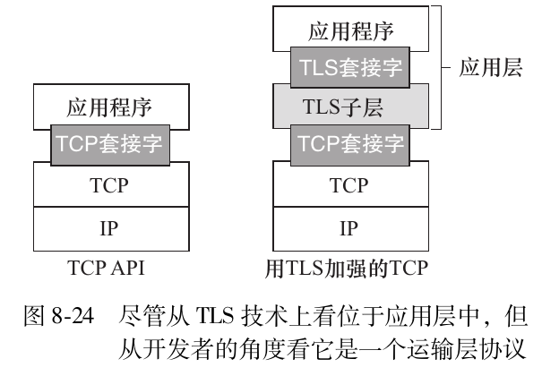
可以看到,TLS只在应用层进行了加密而已,并没有深入运输层
#### TLS Intro
先大致描述一下TLS的简化版本(称为类TLS),它具有三个阶段: 握手,密钥生成和传输数据

现在以客户B与服务器A之间的通信来举例说明
##### 握手
在建立TCP连接后,B向服务器A发送一个hello报文,A在响应报文中返回该服务器的证书,里面包含了它的公钥.

由于该证书被某个CA证实过,B知道了这个公钥真的来自A,然后B生成一个主密钥(MS)用于此次TLS会话,使用A的公钥加密MS生成加密的主密钥(EMS),再发给服务器A,A再用私钥解密该EMS得到MS.

如此依赖,双方都知道了这次会话的主密钥MS.
##### 密钥生成
事实上,出于安全性的考量,通信双方都会使用MS生成4个密钥:
- E_B: 从B发送到A时所用的加密密钥
- M_B: 从B发送到A时所用的HMAC密钥(用于验证报文完整性)
- E_A: 从A发送到B时所用的加密密钥
- M_A: 从A发送到B时所用的HMAC密钥

##### 传输数据
>TLS breaks the data stream into records, appends an HMAC to each record for integrity checking, and then encrypts the record + HMAC.
比如说B要发送数据,它需要将数据流分割为一个个record,为每个record附上HMAC,然后使用M_B加密这个record+HMAC包后发送出去.
事实上,这个HMAC中海含有这次发送的record所属的序号,从而保证攻击者不会打乱record的顺序.
##### record的结构


- Type字段: 判断这是握手报文还是传输数据的报文,也用于关闭TLS连接

#### 对于TLS更为精确的描述
##### 握手阶段
TLS不强制通信双方使用特定的加密算法,而是允许双方在TLS会话开始时就统一决定加密算法,真实的步骤如下:
1. 客户发送它支持的密码算法的列表和它选取的不重数(在本次会话中不会第二次出现的数字)
2. 服务器从列表中选择一个对称密钥算法,一种非对称密钥算法和一种HMAC算法,它把这些选择联通证书和另一个不重数发给服务器
3. 客户验证证书后提取服务器的公钥,生成PMS(Pre-Master Secret),用公钥加密该PMS后发送给服务器.
4. 客户和服务器根据PMS和各自的不重数得到上述的四种密钥.
5. 双方发送一段用新生成的密钥加密过的握手信息摘要，用于验证双方计算出的密钥是否一致，以及握手过程是否被篡改


>你可能想知道在步骤 1 和步骤 2 中存在**不重数（Nonce）**的原因。序号不足以防止报文段重放攻击吗？答案是肯定的，但它们并不只是防止“连接重放攻击”

假设 Trudy 嗅探了 Alice 和 Bob 之间的所有报文。第二天，Trudy 冒充 Bob 并向 Alice 发送正好是前一天 Bob 向 Alice 发送的相同的报文序列。

* **若未使用不重数**：Alice 将以前一天发送的完全相同的序列报文进行响应。由于接收到的每个报文都能通过完整性检查，Alice 不会怀疑任何异常。如果 Alice 是一个电子商务服务器，她将认为 Bob 正在进行第二次相同的订购。
* **若使用不重数**：Alice 将对每个 TCP 会话发送不同的不重数，使得两天的加密密钥完全不同。当 Alice 接收到 Trudy 重放的 TLS 记录时，由于密钥不匹配，该记录将**无法通过完整性检查**，假冒的事务便不会成功。

##### 连接终止
如果仅通过TCP连接来终止TLS会话的话,攻击者可以通过**截断攻击**(truncation attack)来提前结束会话,也就是说他可以在会话中发送一个TCP FIN报文,从而让用户不能获取完整的信息.

因此,我们可以用最后一个record指示终止会话.

### 网络层的安全服务: IPsec(过)

### 补充: 有线网络的安全服务
有线网络不提供安全服务,因为链路通信是很难被攻击和篡改的,只需依靠上层的安全服务即可.
### 无线网络的安全服务(待补充)

### 防火墙和入侵检测系统(待补充)

### 总结
显然,有这么多的防护措施,普通的cracker是很难通过截获IP数据报的形式来进行攻击的,相反,通过恶意软件(病毒,木马等)可以很轻易的跨越多层封锁,进入最薄弱的环节-主机-中,但这部分就不是网络通信所能负责的范畴了.

## ppt概念补充
### Intro
#### OSI七层协议
事实上,OSI协议的前三层对应了本书中的应用层,后面的都是一一对应的
#### Modem v.s. Router
Modem (调制解调器) 的本质是信号转换器。由于计算机内部处理的是二进制数字信号（Binary stream），而广域网传输介质（如电话线、光纤）传输的是模拟信号（Sinusoidal waves），Modem 负责将数字信号调制为模拟信号发出，并将接收到的模拟信号解调回数字信号。如果家中只有一个上网设备且不需要防火墙等功能，理论上仅需 Modem 即可拨号上网。

#### Circuit Switching and Packet Switching
##### Circuit Switching (电路交换)

**核心流程：**
1.  **建立电路 (Establishment)**：在发送数据前，必须先预留一条端到端的物理路径。
2.  **信息传输 (Transfer)**：数据（模拟或数字）沿专用路径实时流动。
3.  **电路拆除 (Termination)**：释放沿途占用的所有资源。

**关键特性：**
* **优势**：由于资源独占，数据传输速率恒定、带宽有保障，且数据严格按序到达，对用户而言网络是“透明”的。
* **劣势**：存在明显的拨号/建立延迟。资源利用率低，即便不传输数据，信道依然被占用，无法分配给其他用户。
* **复用方式**：通常通过**多路复用 (Multiplexing)** 将物理链路划分为多个子信道


---

##### Packet Switching (分组交换)

**核心流程：**
1.  **分组化 (Packetization)**：将长报文拆分为带有首部（源地址、目的地址、校验码）的小数据包。
2.  **存储转发 (Store-and-forward)**：路由器必须接收完一个分组的所有比特后，才能开始向下一跳转发。

**关键特性：**
* **优势**：
    * **带宽利用率高**：单个分组可以使用链路的全带宽，资源按需分配，支持更多用户接入。
    * **应对突发流量 (Bursty Data)**：互联网流量通常是爆发式的，分组交换通过路由器内的**缓冲区 (Buffer)** 吸收临时流量峰值。
* **劣势**：资源竞争可能导致拥塞和丢包；路由算法复杂；分组可能乱序到达目的地。


---

##### 核心对比总结

| 特性         | 电路交换 (Circuit)     | 分组交换 (Packet)         |
| :----------- | :--------------------- | :------------------------ |
| **资源分配** | 预先静态分配（独占）   | 动态按需分配（共享）      |
| **延迟来源** | 建立连接延迟           | 存储转发延迟、排队延迟    |
| **性能表现** | 稳定、无抖动、带宽保证 | 可能拥塞、有抖动、高并发  |
| **典型应用** | 传统电话网 (PSTN)      | 现代计算机网络 (Internet) |


### 物理层
#### outline
- Bandwidth (带宽) and Data Rate
- Modulation (调制) of a Signal (ASK, PSK, QPSK, QAM)
- Medium and Transmission (传输)
- Multiplexing (复用) (FDMA, TDMA, CDMA)

#### Bandwidth (带宽) and Data Rate
- Bandwidth: 单位时间内从一个节点传送到另一个节点的数据量

##### 奈奎斯特采样定理 (Nyquist Sampling Theorem)

**核心物理含义**
在进行模数转换（将连续信号变为数字点）时，如果模拟信号包含的最高频率为 $H$ Hz，那么每秒钟至少需要进行 $2H$ 次采样（即采样频率 $f_s \ge 2H$），才能通过这些采样点无失真地重建原始信号。这个最小值 $2H$ 被称为奈奎斯特速率。

**采样频率与波形还原**
为了识别一个周期的波形，数学上至少需要记录其一个波峰和一个波谷。如果采样率低于 $2H$，采样点分布太稀疏，捕捉到的数据点在还原时会连成一个错误的低频波形，这种现象称为**混叠 (Aliasing)**。


**混叠 (Aliasing) 的直观理解**
当采样频率不足时，高频信号会“伪装”成低频信号。
* **视觉现象**：在电影（每秒 24 帧采样）中看到快速转动的车轮时，车轮似乎在缓慢倒转，这就是典型的视觉混叠。
* **音频后果**：若采样率过低，录入的高音会变成诡异的低频杂音，且这种失真是永久性的，无法通过软件修复。


**工程应用实例**
* **CD 音质**：人耳听觉上限约为 $20\text{kHz}$。根据定理，采样率必须大于 $40\text{kHz}$。CD 标准采用 $44.1\text{kHz}$，正是为了确保完全覆盖人耳带宽并留出滤过缓冲带。
* **通信带宽**：在带通信号传输中，该定理限制了在给定频率范围内可以传输的最大符号速率，是数字通信设计的底层物理约束。


##### 信道容量与编码定理 (Channel Capacity & Coding Theorems)

**奈奎斯特准则 (Nyquist Theorem) —— 无噪声信道**
在理想的、没有噪声的信道中，由于信号在传输时存在码间串扰（带宽限制了信号的变化速率），最大数据传输速率由带宽和信号电平数（量化等级）决定。
* **公式**：$$R_{max} = 2 \times BW \times \log_2 V \text{ bps}$$
* **参数含义**：
    * **$BW$**：信道带宽（Hz）。
    * **$V$**：信号的离散电平数（量化等级）。
* **物理本质**：在无噪声情况下，理论上可以通过无限增加量化电平数 $V$ 来提升速率，但受限于实际硬件对电平分辨的精确度。


**香农定理 (Shannon's Theorem) —— 有噪声信道**
在存在随机热噪声的实际信道中，由于噪声会掩盖信号的电平细节，最大可靠传输速率（信道容量）存在一个物理极限。
* **公式**：$$C = BW \times \log_2 (1 + \frac{S}{N}) \text{ bps}$$
* **参数含义**：
    * **$C$**：信道容量，即该信道能实现的理论最大信息传输速率。
    * **$S/N$**：信噪比（SNR），信号功率与噪声功率的比值。
* **物理本质**：噪声决定了我们能区分的最小信号电平差。即使无限增加发送电平 $V$，如果电平差小于噪声强度 $N$，接收方也无法识别。因此，带宽和信噪比共同限定了信息交换的上限。


**信噪比与分贝 (SNR in Decibels)**
在工程实践中，信噪比通常跨越多个数量级，因此常使用对数单位**分贝 (dB)** 来表示。
* **分贝换算公式**：$$SNR(dB) = 10 \times \log_{10} (\frac{S}{N})$$
* **典型值参考**：
    * 如果 $S/N = 10$，则 $SNR = 10\text{ dB}$。
    * 如果 $S/N = 100$，则 $SNR = 20\text{ dB}$。
    * 如果 $S/N = 2$（信号是噪声的两倍），则 $SNR \approx 3\text{ dB}$。

**核心逻辑总结**
* **奈奎斯特**告诉我们：由于**带宽限制**，采样率有上限（不能跑太快，否则波形会糊）。
* **香农**告诉我们：由于**噪声存在**，信息的精细度有上限（不能分太细，否则分不清信号和噪声）。
* **实际应用**：在设计网络系统（如 5G 或 Wi-Fi）时，通常会同时计算这两个值，取其中的**较小者**作为实际物理层的理论瓶颈。

#### Modulation


## 专业名词(即使前面提过也会放在这里)
- RTT: Round-Trip Time(往返时延)
- MSS: Maximum Segment Size,TCP 报文段中负载的最大长度限制
- adapter: 适配器,主机与特定网络连接的硬件接口,俗称网卡.
- Internet: 是由无数个使用 TCP/IP 协议族 相互连接的计算机网络，物理上通过路由器和交换机在全球范围内实现数据交换与资源共享的网际网路。
- packet(分组): 在特定层传输的数据包,从应用层,运输层,网络层,到链路层,每经过一层增加一个头部修饰
- MAC: Medium Access Control,介质访问控制协议
- ISP: Internet Service Provider
- NAT: Network Address Translation
- WAN: Wide Area Network - 广域网
- LAN: Local Area Network - 局域网
- SDN: Software Defined Networking,通过软件管理路由转发
- CIDR: Classless Inter-Domain Routing,无类别域间路由,是一个用于给用户分配IP地址的方法
- CSMA: Carrier Sense Multiple Access,发送信号前先监听,从而判断是否要在这个时候发送信号
- 全双工(full-duplex): 可以同时接收和发送数据
- 半双工(half-duplex): 同一时刻要么接收,要么发送,不能同时进行

## 实战

### 备案流程
- [知乎介绍](https://zhuanlan.zhihu.com/p/371579941)

>[wiki](https://zh.wikipedia.org/zh-cn/ICP%E5%A4%87%E6%A1%88)
>个人网站备案需要准备：1份网站负责人的身份证件彩色扫描件或复印件；负责人的半身彩色照片（带接入商名称背景）；网站所使用的独立域名注册证书复印件（加盖公章）；主办单位所在地的详细联系方式；填写《信息安全管理协议》；填写《真实性核验单》。
>
>
>根据相关行政法规，**所有在中国境内的互联网信息服务提供者**都应完成备案登记手续方可开办，未按规定备案的不得开展服务。
>
>2005年2月8日，原中华人民共和国信息产业部部长王绪东签发《非经营性互联网信息服务备案管理办法》，并于3月20日正式实施。**该办法要求从事非经营性互联网信息服务的网站进行备案登记，否则将予以关站、罚款等处理。**


根据《互联网信息服务管理办法》，提供非经营性互联网信息服务需办理备案，而**办理备案的前提是使用中国境内服务商提供的内地机房IP**

事实上,在中国内地，合规运行网站需要两个核心要素：域名实名认证和ICP备案。

1. 后缀限制：并非所有域名后缀都能备案。只有在工信部正式批复的顶级域名列表中的后缀（如 .com, .cn, .net 等）才允许备案。如果你使用 .io, .ai 等部分未批复后缀，即便服务器在国内也无法通过备案。
2. 注册商要求：办理 ICP 备案的域名，其注册商必须在中国内地经过许可。如果你的域名是在 Namecheap、GoDaddy 或 Google Domains 注册的，必须先将域名转入国内注册商（如万网、新网），才能提交备案申请。

(补充): 事实上,所有的备案都是通过第三方的,小程序上线需要通过微信开发者平台备案;网站上线需要通过阿里云,腾讯云备案...
平台初审(一般需要1-2个工作日)通过后,再由平台提交给工信部审核(时间范围不确定,但一般不短),审核通过后会发短信提醒你.
这还没完,当你通过备案后,需要再进行[公安联网备案](https://help.aliyun.com/zh/icp-filing/basic-icp-service/quick-start-for-public-security-network-filing-for-personal-websites?spm=a2c4g.11186623.0.0.637f22faLqR4cq#9e78d861f9k3e),并提交审核,一般为2-3个工作日.

瑟瑟发抖...
# Go语言圣经
- [中文版网站](https://golang-china.github.io/gopl-zh/preface-zh.html)
- (5/7): 看多了Java总觉得有些烦躁,就想着先学习一下Go来看看它的神奇之处
- (5/29): 不推荐拿这本书入门Go,建议先学习了Go的基础语法后再来看,不然会看的很难受
- (6/8): 一直以为是翻译很烂,换了英文版后才发现原来是原文就很烂,很难想象一本语言教科书能够同时实现超过论文程度的诘屈聱牙和垃圾博客的"咬字不清",突然想起类似这种风格的还有C++ Programming Language.

## 前言
>就事后诸葛的角度来看，Go语言的这些地方都做的还不错：拥有**自动垃圾回收**、一个**包系统**、**函数作为一等公民**、词法作用域、系统调用接口、只读的UTF8字符串等。但是Go语言本身只有很少的特性，也不太可能添加太多的特性。例如，它没有隐式的数值转换，没有构造函数和析构函数，没有运算符重载，没有默认参数，也没有继承，没有泛型，没有异常，没有宏，没有函数修饰，更没有线程局部存储。但是，**语言本身是成熟和稳定的，而且承诺保证向后兼容**：用之前的Go语言编写程序可以用新版本的Go语言编译器和标准库直接构建而不需要修改代码。

- 尽管Go现在支持泛型了,但是没有异常,也没有继承,重载,宏,隐式数值转换等一切让cpp变得面目可憎的东西.还是很不错的.

>Go语言有足够的类型系统以避免动态语言中那些粗心的类型错误，但是，**Go语言的类型系统相比传统的强类型语言又要简洁很多**。虽然，有时候这会导致一个“无类型”的抽象类型概念，但是Go语言程序员并不需要像C++或Haskell程序员那样纠结于具体类型的安全属性。在实践中，Go语言简洁的类型系统给程序员带来了更多的安全性和更好的运行时性能

## 入门
### 入门代码
```go
package main

import "fmt"

func main() {
    fmt.Println("Hello, 世界")
}
```
- fmt: format,格式化输入与输出

>Go 语言**不需要在语句或者声明的末尾添加分号**，除非一行上有多条语句。实际上，编译器会主动把特定符号后的换行符转换为分号，因此换行符添加的位置会影响 Go 代码的正确解析
### 循环语句
Go 语言**只有 for 循环这一种循环语句**。for 循环有多种形式，其中一种如下所示：
```go
for initialization; condition; post {
    // zero or more statements
}
```
>for 循环三个部分不需括号包围。大括号强制要求，左大括号必须和 post 语句在同一行。

- 格式很严格,但也很符合一般的编程习惯

```go
// Echo1 prints its command-line arguments.
package main

import (
    "fmt"
    "os"
)

func main() {
    var s, sep string
    for i := 1; i < len(os.Args); i++ {
        s += sep + os.Args[i]
        sep = " "
    }
    fmt.Println(s)
```

for的另一种写法类似python中的enumerate遍历:
```go
// Echo2 prints its command-line arguments.
package main

import (
    "fmt"
    "os"
)

func main() {
    s, sep := "", ""
    for _, arg := range os.Args[1:] {
        s += sep + arg
        sep = " "
    }
    fmt.Println(s)
}
```
- 与python一样,用不到的变量可以直接用下划线`_`代替.事实上Go中只能这么写,因为Go不允许使用**无用的局部变量**.

该`for ... range ...`循环用于遍历某一种数据结构,每次迭代都会返回一对值,第一个是索引,第二个是索引处的元素值.
### 总结
看到这就可以了,后面只是对Go的基础功能的一些展示.
## 程序结构
### 变量
#### 变量声明
基本语法如下:
```go
var 变量名字 类型 = 表达式
```

>其中“类型”或“= 表达式”两个部分可以省略其中的一个。如果省略的是类型信息，那么将根据初始化表达式来推导变量的类型信息。如果初始化表达式被省略，那么将用零值初始化该变量。 数值类型变量对应的零值是0，布尔类型变量对应的零值是false，字符串类型对应的零值是空字符串，接口或引用类型（包括slice、指针、map、chan和函数）变量对应的零值是nil。数组或结构体等聚合类型对应的零值是每个元素或字段都是对应该类型的零值。


```go
var s string
fmt.Println(s) // ""
```

也可以用两种方法同时声明多个变量:
```go
var i, j, k int                 // int, int, int
var b, f, s = true, 2.3, "four" // bool, float64, string
```

Go还有一种非常简短的方式来声明和初始化**局部变量**,这被称为**简短变量声明**:
```go
anim := gif.GIF{LoopCount: nframes}
freq := rand.Float64() * 3.0
t := 0.0
```
- 我们不需要写前置的var关键字,也不需要写后置的变量类型,而是由编译器自动推导

我们同样可以一次声明一组变量:
```go
i, j := 0, 1
```
需要注意的是,`:=`必须要至少声明一个新的变量,否则会报错:
```go
f, err := os.Open(infile)
// ...
f, err := os.Create(outfile) // compile error: no new variables
```


### 指针
由于Go的底层不是和Java,Python一样的引用传值,而是和Cpp,Rust一样的值拷贝,所以还是需要引入指针,**来避免大规模的复制拷贝**.

- 任何类型指针的零值都是**nil**,对应于cpp中的nullptr.
- 非常遗憾的是,Go仍旧没有把解引用符号和指针声明符号区分开,看来设计者真的非常喜欢`*`这个符号

```go
var p = f()

func f() *int {
    v := 1
    return &v
}
```
- 上述代码并不会报错,因为Go底层的垃圾收集器会智能地把依旧要使用的局部变量分配到堆上,不会被回收.这很大程度上解决了C++的指针问题.


## 补充:整合得到的Go特性
- 完全无法理解这本书的组织架构,想必作者也是想到哪写到哪
### const声明
const有两种声明方式:
1. 常规写法:
```go
const Pi float64 = 3.141592653589793
```
2. 分组声明:

```go
const (
    StatusOk      = 200
    StatusTimeout = 408
    StatusError   = 500
)
```
### 字符串
Go中的字符串用双引号括起来,唯一一处会用到单引号的地方是用来表示单个字符,这与cpp的用法一致.

但是,Go中的字符串是不可修改的,不能用类似`s[0]=1`的方式进行修改.

尽管如此,我们可以对字符串进行拼接,在底层实际上是创建了一个更长的字符串,把原来的字符串丢弃掉:

```go
s := "left foot"
t := s
s += ", right foot"
```
## Goroutines
go中的多线程可能是所有语言中最好实现的了,毕竟我们只要在函数前加上两个单词: `go`:
```go
f()    // call f(); wait for it to return
go f() // create a new goroutine that calls f(); don't wait
```
**示例代码**
```go
func main() {
    go spinner(100 * time.Millisecond)
    const n = 45
    fibN := fib(n) // slow
    fmt.Printf("\rFibonacci(%d) = %d\n", n, fibN)
}

func spinner(delay time.Duration) {
    for {
        for _, r := range `-\|/` {
            fmt.Printf("\r%c", r)
            time.Sleep(delay)
        }
    }
}

func fib(x int) int {
    if x < 2 {
        return x
    }
    return fib(x-1) + fib(x-2)
}
```
实际来说,goroutine和多线程有细微的区别,而在主函数返回时,所有的goroutine会被直接打断.
## 总结
暂时弃坑,如果有缘的话会再回来补充.
# 操作系统导论
- 一本让人相见恨晚的好书
## 概览
本书围绕操作系统的三个特征展开:
1. 虚拟化(virtualization): 这与程序装载相关
2. 并发(concurrency): 这与程序调度相关
3. 持久性(persistence): 这与硬盘/文件系统相关

## 系统调用
>谁能想到这本书竟然帮我解决了关于系统调用的许多疑问

1. fork(): 复制当前进程创建一个子进程,子进程拥有独立的地址空间,寄存器和程序计数器
   1. fork()系统调用实质上是在执行到当前代码时再新建一个进程,两个进程同时运行,因此,下面这段条件语句能够返回两个值,一个是父进程返回的子进程pid,一个是子进程返回的0
```c
#include <stdio.h>
#include <stdlib.h>
#include <unistd.h>

int main(int argc, char *argv[]) {
    printf("hello world (pid:%d)\n", (int)getpid());
    int rc = fork();
    if (rc < 0) {
        // fork failed; exit
        fprintf(stderr, "fork failed\n");
        exit(1);
    } else if (rc == 0) {
        // child (new process)
        printf("hello, I am child (pid:%d)\n", (int)getpid());
    } else {
        // parent goes down this path (main)
        printf("hello, I am parent of %d (pid:%d)\n", rc, (int)getpid());
    }
    return 0;
}
```


2. wait(): 让父进程等待子进程执行完毕再继续执行,这显然是I/O,网络请求等让我们深恶痛绝的阻塞的源头.
3. exec(): 因为`fork()`只是创建了一个近乎完全相同的进程,所以我们需要`exec()`来真正的创建一个不同的进程.该调用会从指定的可执行程序中加载代码和静态数据,并覆盖当前子进程的内存区域.

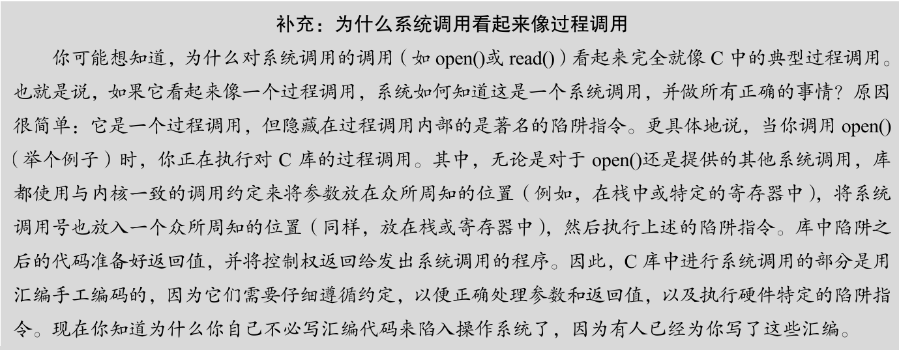

>要执行系统调用，程序必须执行特殊的陷阱（trap）指令。该指令同时跳入内核并将特
权级别提升到内核模式。一旦进入内核，系统就可以执行任何需要的特权操作（如果允许），
从而为调用进程执行所需的工作。完成后，操作系统调用一个特殊的从陷阱返回
（return-from-trap）指令，如你期望的那样，该指令返回到发起调用的用户程序中，同时将
特权级别降低，回到用户模式。

## 进程调度
### 进程切换问题
>如果一个进程在 CPU 上运行，这就意味着操作系统没有运行。如果操作系统没有运行，它怎么能做事情？

- 这一问题直接打入了操作系统的核心,非常的透彻.

早期的操作系统由进程来决定何时将CPU的控制权交给内核,内核只能在进程执行时被动地等待.

后来,我们引入了时钟中断(timer interrupt),当中断发生时,当前运行的进程被停止,CPU的控制权会重新交给内核

### 进程调度方法
简单粗暴的几个调度方法有:
1. FIFO: First In First Out,先进先出
2. SJF: Shortest Job First,最短任务优先
3. STCF: Shortest Time-to-Completion First,最短完成时间优先
   1. 从这一算法开始就引入了**抢占**的思想,后来的进程有可能会被内核优先调度

后来,我们将时钟中断和调度联系起来,引入了**轮转**(Round-Robin,RR)算法,每个进程被划分成多个时间片(time slices),时间片长度是时钟中断周期的整数倍,出于公平起见,所有进程在用完一个时间片后就要将CPU让给下一个进程执行.尽管如此,这会大大拖延进程的实际执行完成时间,所以还是不够理想.
### 多级反馈队列
1962年,多级反馈队列(Multi-level Feedback,MLFQ)算法由Corbato提出,大致思想如下:
1. 建立多个不同优先级(priority level)的独立队列,一个进程只能存在于一个队列中
2. 优先级高的队列中的进程优先执行,而同一个队列中的进程采用轮转算法调度
3. 通过观察进程的行为动态调整它的优先级,例如用户交互类进程被划为高优先级,计算密集型进程被划为低优先级

#### 实现MLFQ
我们可以先对该算法进行一个简单的实现:
1. 进程刚开始运行时,放在最高优先级
2. 进程用完一个时间片后,降低其优先级
3. 进程在时间片中主动释放CPU,则优先级不变

显然,这种方法会导致计算密集型进程永远处于饥饿(starvation)状态,也会让恶意程序(如挖矿病毒)伪装成I/O类程序,从而一直保持高优先级.

为了解决恶意程序,我们需要将规则2和规则3修改成一条:
2. 记录一个进程在某一个队列中消耗的总时间,只要它用完了该层中的时间配额,就降低其优先级.

为了让计算密集型进程也能运行一段时间,我们可以这么做:
3. 经过一段时间S,就将所有进程重新加入最高优先级队列

总结一下MLFQ的思想就是:
1. 进程刚开始运行时,放在最高优先级
2. 记录一个进程在某一个队列中消耗的总时间,只要它用完了该层中的时间配额,就降低其优先级.
3. 经过一段时间S,就将所有进程重新加入最高优先级队列

>Windows和MacOS现在仍然在使用MLFQ的变体

### 比例份额调度
比例份额(proportional-share)调度类算法的代表性算法就是彩票调度(lottery scheduling),基本思想如下:
- 每个进程分得一定比例的彩票数,对应了一些彩票编号,接下来反复抽取彩票,每次抽中的彩票编号对应的进程开始运行.
- 父进程可以给子进程分出自己的彩票,再由内核换算出实际的彩票比例
- 不同的进程之间可以转让彩票,同一个进程的彩票数量可以动态变化,这被称为彩票通胀(ticket inflation)

>可以看出来,彩票调度算法具有相当大的随机性,但当执行次数达到一定量级时,每个进程运行的比例也慢慢趋于一个稳定值,所以该类算法适合有大量进程同时执行的情景

尽管设计很巧妙,但该类算法并没有用在主流的操作系统中.
### 多处理器调度
多处理器有以下问题:
1. 缓存一致性: 多个处理器缓存同时访问内存会带来数据上的不一致
2. 数据加锁: 某一处理器在临界区执行时需要给这部分内存加锁,其他处理器此时不能访问该临界区,这会导致性能下降
3. 缓存亲和度: 需要保证一个进程尽可能地在一个CPU上运行,减少切换CPU带来的缓存迁移损耗

文中介绍了两种多处理器调度方法:
1. 单队列多处理器调度(Single Queue Multiprocessor Scheduling，SQMS): 将所有需要调度的进程放入一个单独队列中,每个进程依次被多个处理器调用

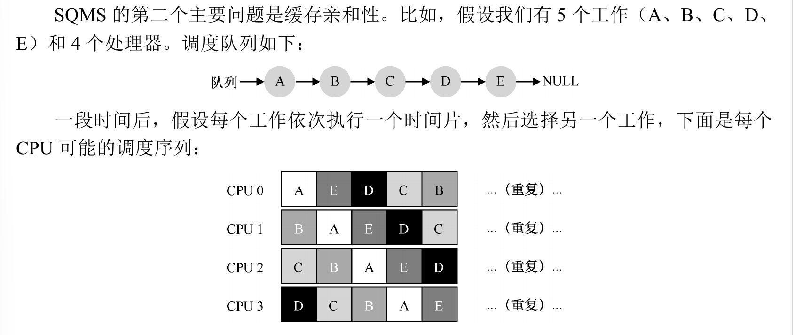

- 当然,我们可以对SQMS做一点改进,比如说尽可能让一个进程在同一个处理器上执行

2. 多队列多处理器调度(Multi-Queue Multiprocessor Scheduling，MQMS): 一个处理器控制一个进程队列,尽管这可以解决缓存亲和度的问题,但可能导致一些处理器满负荷运行,而另一些处理器一直空置,这被称为**负载不均**.

- 为了解决这个问题,我们可以不断在处理器队列之中平衡进程的负载
## 虚拟内存
- 由于虚拟地址到物理地址的映射是通过硬件实现的,我们在电脑软件中看到的所有地址都是虚拟地址.

### 简单实现
早期的映射方式是这样实现的:

>每个CPU都有一对基址和界限寄存器（base and bounds register）,由一个**内存管理单元(Memory Management Unit，MMU)**来管理这两个寄存器,base寄存器用来确定进程虚拟地址映射到的实际物理地址的偏移,bound寄存器用来限制该进程能够访问的最大地址.

尽管如此,实际还是要由操作系统来调用这些硬件,所以操作系统是可以直接访问物理内存的,它需要标记当前的空闲物理内存区间,在进程切换时保存和恢复寄存器,在进程终止和创建时分配和回收物理内存
### 分段
上述的映射方式不太灵活,需要将整个进程的地址空间全部装载到内存中,就会有相当大部分的地址被浪费:

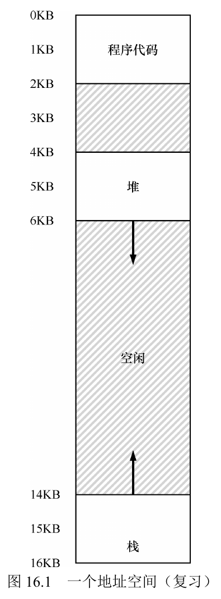

如果我们将进程的地址空间分成多个段(segment),比如说代码内容,堆,栈三个段,每个段都有独立的基址和界限寄存器,分别装载这三个段,就不会占用过多的地址空间了.

为了区分当前进程正在执行的是哪个段,我们使用段寄存器来存储关于段的信息,比如前两位是 00，硬件就知道这是属于代码段的地址.

为了进一步压缩空间,我们可以用硬件将代码段标记为只读,确保多个进程可以共享代码段,却不会更改代码段的内容,只独立的更改自己的栈和堆.

我们还需要建立一个空闲地址列表来追踪所有可用的地址块,每次要用堆分配新的内存时,通过算法匹配到最合适的空闲地址交付给堆,并分割对应大小的地址空间出来.

- 至于用的算法是什么我们就没必要知道了,如书中所说,有几千种备选算法.

尽管如此,这种方法会引入大量的地址碎片,没有足够的连续地址可以装载之后的进程.所以我们需要找到新的解决方法.

### 分页
- 分页: 将地址空间分割成固定长度的块

我们通过页表来管理单个进程中各个虚拟页到物理页的映射:

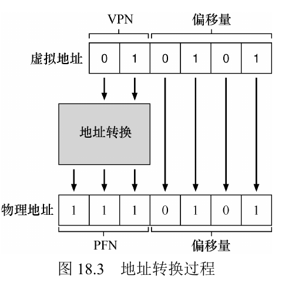

x86架构中的页表结构如下:
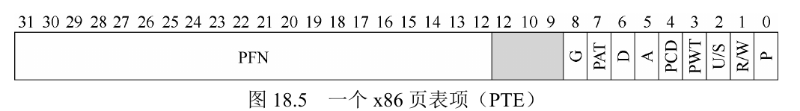
- PFN指的是对应的物理页,其余的符号均为标志位

分页方法有一个非常大的问题,如果每次访问内存时都要通过页表转换,这会引入巨大的内存访问开销.

为了加速内存访问,我们可以使用地址转换旁路缓冲存储器(translation-lookaside buffer,TLB),更好的称呼是地址转换缓存(address-translation cache),每次内存访问时,硬件先检查TLB,如果有对应映射的话就不用再访问页表,从而大幅度提高转换速度.如果TLB未命中,那么就需要硬件去访问页表,并将查找到的映射存储在TLB中.

鉴于内存很宝贵,所以我们需要进一步压缩TLB的大小,将TLB改装成多级的缓存,每一级相对于上一级,只保留真正有效的映射,无效的地址映射则不保留,这样就可以大幅度减小空间占用,但增加了TLB未命中的处理时间,因为需要同时更新多个缓存级:

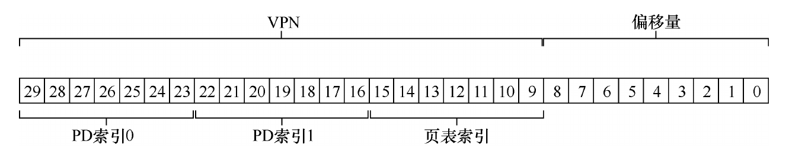


# 深入浅出密码学
- (6/6): 强烈推荐,如果早点看到这本书就可以少走很多弯路了
## 概述
>本书不会涉及令人害怕的数学公式。本书的目的是揭开密码学的
神秘面纱，介绍当今常用的密码学技术，并给出这些技术在我们身边
的应用案例。本书适合那些对密码学怀有好奇心的人、有强烈求知欲
的工程师、富有冒险精神的软件开发人员和兴趣广泛的研究人员。
## 哈希函数
哈希函数有以下特性:
1. 任意长度的输入都会得到相同的输出长度
2. 同一个输入可以得到相同的输出
3. 实践中无法根据输出得到输入,这被称为**Pre-image Resistance**
4. 根据一个输入无法找到另一个输入得到相同的输出,这被称为**Second Pre-image Resistance**
5. 实践中无法找到两个不同的输入能够产生相同的输出,这被称为**Collision Resistance**

### 绝对安全的哈希函数: SHA系列
SHA-2算法族于2001年标准化,有4个子类,分别是SHA-224、SHA-256、SHA-384 和 SHA-512,它们分别产生 224、256、384 和 512 比特的输出.

SHA-3算法族于2015年标准化,同样有4个子类,分别是SHA-3-224、SHA-3-256、SHA-3-384 和 SHA-3-512.
## 消息认证码(Message Authentication Code,MAC)
- 讲的确实很好,无论有无这方面的基础都能大有收获,一本密码书竟然能够比专门讲网站设计的书还能谈的更深,不过大部分知识我都已经了解了,就不摘抄了.

1. HMAC: 将密钥与SHA-2系列哈希函数结合使用,这是网站验证中最常用的加密方法

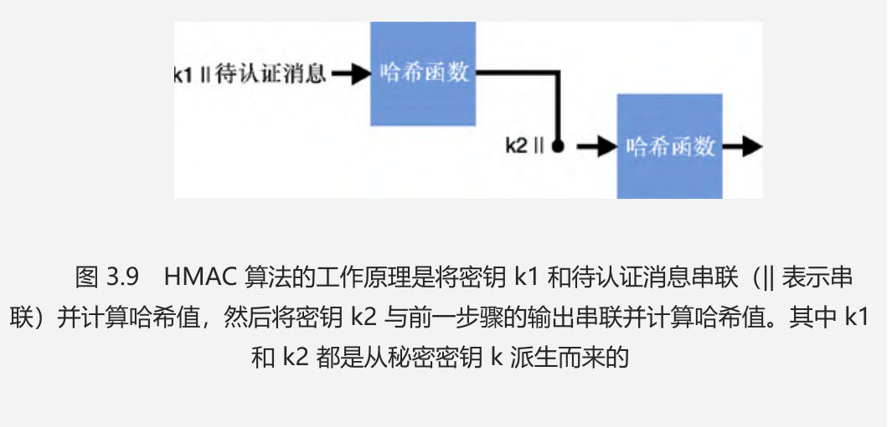
2. KMAC: 单纯使用SHA-3系列哈希函数,而不依靠HMAC辅助:

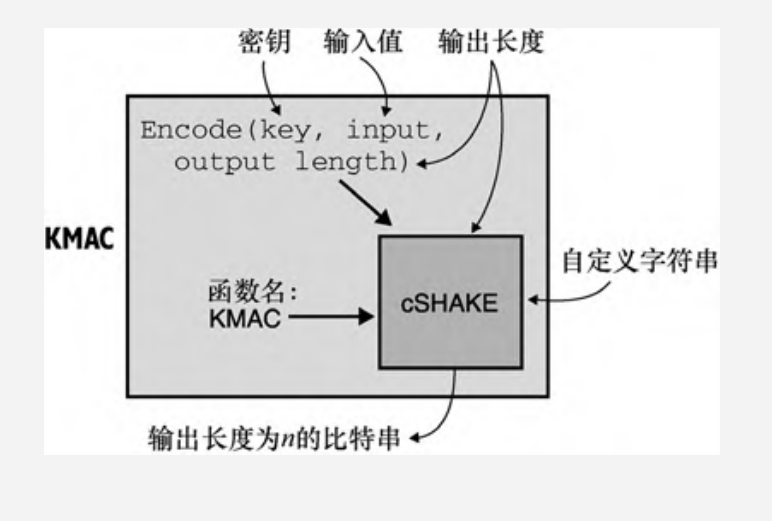

### 长度扩展攻击
之所以不能单纯使用SHA-2系列的哈希函数,就是因为这类哈希函数有可能遭受**长度扩展攻击**,不过书上这部分讲的不是很好,好在有Gemini帮助我:
```md
想象一下，哈希函数就像是一个**自动打包机**。你塞入一堆文件，它经过一系列固定的揉搓动作，最终吐出一个大小固定的**神秘代码**（哈希值）。

长度扩展攻击，简单来说，就是黑客**在不知道你塞了什么秘密文件的前提下**，顺着打包机未完成的动作，**直接在后面拼接自己的小纸条**，并生成一个完全合法的全新神秘代码。

为了让初学者彻底明白，我们可以用一个“接力跑”的故事来解构它。

---

## 一、 核心漏洞：哈希函数的“接力跑”机制

像 MD5、SHA-256 这样的经典哈希函数，在处理很长的信息时，并不是一气呵成的，而是把信息切成一节一节的（比如每节 64 字节），像接力赛一样**分段处理**。

1. **第一棒**：吃进第一段信息，结合初始状态，算出一个“中间结果”。
2. **第二棒**：把第一棒的“中间结果”作为起点，吃进第二段信息，算出下一个“中间结果”。
3. **最后一棒**：吃完最后一段信息，算出的**最终结果，就是我们看到的哈希值**。

**漏洞就在这里**：
对于哈希函数来说，**“最终的哈希值”本质上就是“最后一棒交接时的动作状态”**。哈希函数本身没有记忆，它不知道前面跑了多少棒，它只认当前手里的接力棒状态。

---

## 二、 经典故事：假账本攻击

假设有一家餐厅，老板（服务器）和前台经理（客户端）之间有一个秘密规则：为了防止账本被别人篡改，经理每次传账本时，必须在账本最前面加上老板才知道的**秘密口令（Key）**，然后把它们整体打包算一个哈希值（也就是签名）。

* **秘密口令**：`TopSecret`（黑客不知道）
* **正常账单**：`apple=1`
* **传给老板的组合**：`TopSecret + apple=1` $\rightarrow$ 算出哈希值：`6a2f...99`

黑客（小明）在网络中截获了这段信息。他看到了账单 `apple=1` 和哈希值 `6a2f...99`。小明想在后面偷偷加上一笔：`&banana=5`。

### 黑客的“接力”表演：

小明不需要知道秘密口令 `TopSecret` 是什么，他只需要做两件事：

1. **把哈希值当成“接力棒”**：小明把截获的哈希值 `6a2f...99` 装进自己的哈希计算软件里，作为“当前处于第二棒”的初始状态。
2. **继续跑下一棒**：小明在软件里输入自己想加的内容 `&banana=5`，让软件顺着刚才的状态继续往下算。软件吐出了一个新的哈希值：`9b8c...11`。

最后，小明把修改后的账单（`apple=1 + 自动生成的填充数据 + &banana=5`）和这个新的哈希值 `9b8c...11` 一起发给老板。

### 老板被骗了：

老板收到后，拿出秘密口令 `TopSecret` 拼在账单前面，重新放入打包机计算。因为打包机的物理运行轨迹和黑客在电脑里模拟的接力过程**完全一模一样**，老板算出来的哈希值也一定是 `9b8c...11`。

老板一看：“我算出来的和传过来的一致，账单没有被别人篡改过！” 于是，黑客成功把 `banana=5` 混进了系统。

---

## 三、 总结：为什么它叫“长度扩展”？

* **长度**：黑客虽然不知道秘密口令的内容，但需要猜出秘密口令的**长度**（比如是 9 个字母还是 10 个字母），因为这决定了第一棒跑步的起点位置和对齐补齐的空格数。
* **扩展**：只要知道了长度，黑客就能在原有信息后面，无限期地**扩展**追加自己想要的任何恶意内容。

### 怎么防范它？

这个漏洞是 MD5、SHA-256 这一代哈希函数**天生的物理结构缺陷**。
现代工程师防范它很简单：不再直接使用 `哈希(口令 + 消息)` 这种粗暴的组合，而是改用 **HMAC** 算法。HMAC 相当于在内部跑完接力赛后，在外面又用口令套了一个坚固的安全箱，黑客就再也无法在后面接着跑了。
```
## 对称加密
### 前置概念
对称加密算法的输入为**密钥(secret key)和明文(plaintext)**,输出为**密文（Ciphertext）**.

解密算法的输入为密文和同一个密钥,输出为明文.
### AES算法
>AES是应用最为广泛的加密算法,因此主流处理器都内置了对AES的支持,能够以相当快的速度完成加密和解密.

AES算法加密的输入为一个变长密钥(由用户选择)和一个长度固定为128比特(16字节)的明文,输出一个128比特的密文,解密时输入同一个密钥和密文即可得到明文.

加密时,AES将明文转换成4x4的状态矩阵:

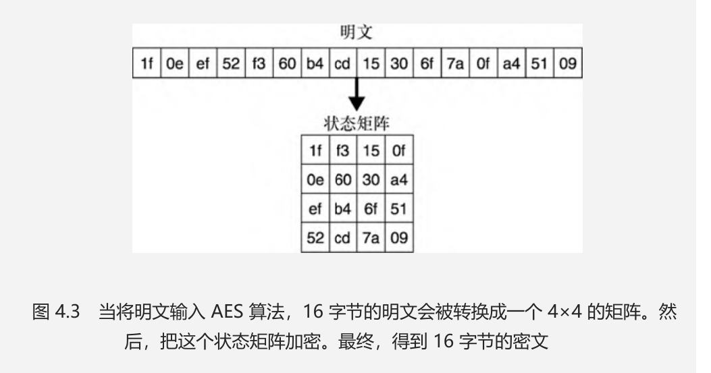

然后,对该矩阵进行多轮加密,每次加密使用的密钥都是由用户设定的密钥随机生成的.

如果要加密一个非常长(远超过超过128比特)的消息,一个简单的方法就是把消息分成多个16字节的块,如果最后一块小于16字节,则追加字节填充到16字节,然后再逐块加密,这被称为**电码本(Electronic Codebook,ECB)模式**.

很显然,如果明文中有多个相同的16字节块,会得到多个完全相同的密文,这有很大的安全隐患.因此,我们可以采用**密码块链接（Cipher Block Chaining，CBC）模式**,该模式会根据明文(*或者随机指定*)生成一个额外的初始向量IV,用于和明文进行迭代的异或操作,从而将明文随机化,相同的明文也会得到完全不同的密文:

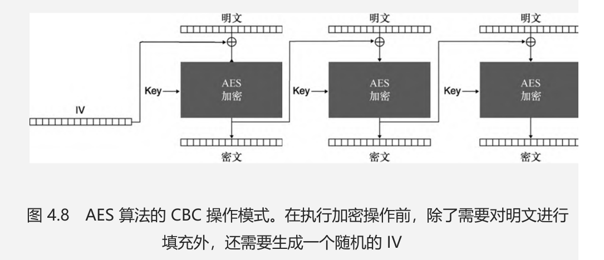

解密时,我们需要加密方以明文方式提供IV:

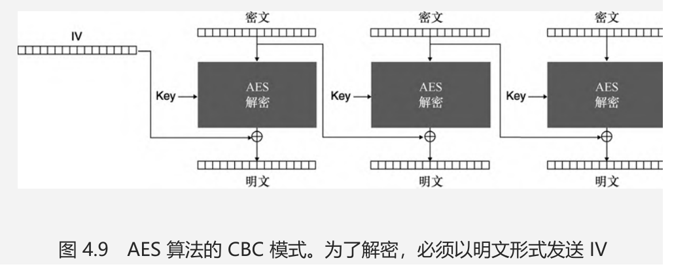.

- 上述加密算法被称为AES-CBC

很显然,我们需要对密文和IV进行校验,防止被攻击者篡改,所以我们可以用HMAC算法来给它们加上一个认证标签,这就是AES-CBC-HMAC算法.
### 新型加密算法(过)
## 非对称加密

### 密钥交换
尽管对称加密可以说是万无一失的,但是它需要我们在一开始就告知对方自己的密钥,而这个密钥如果不经过加密传输的话,那么攻击者就极易窃取到这个密钥,从而让对称加密失效.

因此,**密钥交换类算法**诞生了,基本原理如下: 通信双方各自持有一对公钥和私钥,并使用对方的公钥来组合自己的私钥生成共享密钥,**只要私钥得到了保护,那么攻击者就无法获知最终的密钥.**
#### DH密钥交换
- 该算法由Whitfield Diffie 和 Martin E.Hellman 于1976年提出

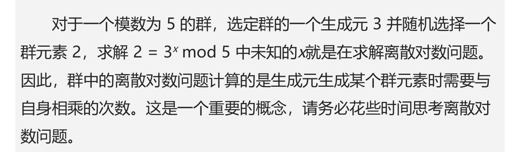

1. 所有参与者协商使用一个大素数p和一个生成元g作为公共参数。
2. 每个参与者随机产生一个数x作为私钥。
3. 每个参与者通过计算g^x = h mod p生成自身的公钥h。

如何将上述的所有数学知识应用在 DH 密钥交换算法中呢？可以想象下面的场景：

* Alice 有一个私钥 $a$ 及其对应的公钥 $A = g^a \bmod p$；
* Bob 有一个私钥 $b$ 及其对应的公钥 $B = g^b \bmod p$。

Alice 可以根据 Bob 的公钥和自身的私钥计算双方的共享密钥 $B^a \bmod p$，Bob 也可以进行类似的操作，计算 $A^b \bmod p$。显而易见，双方最终会得到相同的结果：

$$B^a = g^{ba} = g^{ab} = A^b \bmod p$$

该算法需要选择的素数足够大,实践中为2048位,由于实在是太长了,所以不久之后,基于椭圆曲线的 DH 密钥交换算法(Elliptic Curve Cryptography，ECC)诞生了
#### ECDH密钥交换
现在我们构造一个椭圆曲线群，就可以在这个群上实现 DH 密钥交换算法。产生 ECDH 算法密钥对的方法如下。
1. 所有参与者协商一个椭圆曲线方程、一个有限域（最有可能是一个素数）和一个群生成元G（在椭圆曲线密码中通常称为基点）。
2. 每个参与者生成一个随机数x作为自身的私钥。
3. 参与者各自生成自己的公钥[ x ]G。

- [ x ]G表示x个G相加


● Alice 拥有私钥a以及公钥[a]G。
● Bob 拥有私钥b以及公钥[b]G。

Alice 可以根据 Bob 的公钥以及自身的私钥a计算共享密钥[a]B。Bob也可以使用类似的计算得到[b]A。很明显，双方最终计算出相同的最终密码：

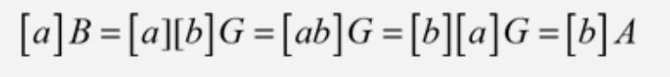

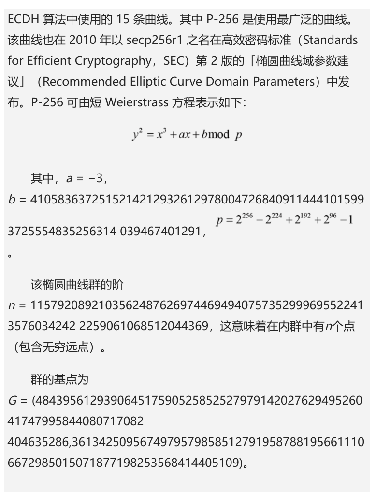

因为有着如此可怕的参数,即便攻击者知道了使用的是哪条椭圆曲线,用的是哪个生成元,同时还知道了双方的公钥,这也无济于事,只要双方的私钥足够随机,就无法暴力破解得到最终的密码

如今,ECDH算法取代了DH算法,因为它的密钥更短,更为安全,更好实现.
## 混合加密
实际应用中,我们通常是先用**非对称加密**来进行沟通得到共享密钥,转换后得到**共同的对称密钥**,之后再使用对称密钥来加密通信.这一过程被称为**混合加密**.
### RSA算法
如文中所说,标准的RSA算法是不够安全的,所以可以直接忽略掉.
### ECIES算法
基于椭圆曲线的混合加密标准（Elliptic Curve Integrated Encryption Scheme,ECIES）是应用最为广泛的混合加密算法,过程如下:
1. 双方使用ECDH生成临时共享密钥
2. 将共享密钥作为对称密钥,加密消息后发送给对方.

但如之前所说,我们最好对共享密钥做一些处理,而不要直接拿来作为对称密钥,这本书在后面会谈到这个问题.

## 数字签名
签名用于将特定网站/实体与它所提供的公钥绑定,这一过程是由权威的签名机构实现的,当用户访问网站时,浏览器会自动用公钥验证该网站对应的签名,从而确认该网站是否合法.

- 具体的签名算法由于原理过于复杂,就不深入了
## 随机性和秘密性

# The Elements of Computing Systems
- 相见恨晚
## 概览
- www.nand2tetris.org: 配套官网
- 该书被尊称为**Nand to Tetris**,至于为什么,看完这本书就会知道了
- 第二版于2021年发行,距离第一版已经过了将近二十年,内容上做了相当大的革新

>We wrote this book because we felt that many computer science students are **missing the forest for the trees**. The typical learner is marshaled through a series of courses in programming, theory, and engineering, without pausing to appreciate the beauty of the picture at large. And the picture at large is such that hardware, software, and application systems are **tightly interrelated** through a hidden web of abstractions, interfaces, and contract-based implementations.
>
>We believe that the best way to understand how computers work is to build one from scratch.

涵盖的内容如下:


## 基本逻辑器件
>所有的布尔运算都可以由And,Or,Not三个布尔运算来表示,而由于Nand可以表示这三个布尔运算,所以所有的布尔运算都可以被Nand(Not and,与非)一个运算表示出来,不过实际工程中这么做就太不值当了,还是要用到其他的布尔运算器件的,毕竟简单的取反比与非门好实现得多.


- 门(gate): 实现简单布尔运算的物理器件,通常用蚀刻在硅基板上的晶体管实现,并被封装成芯片(chips)

>好在我们不要担心门的底层是怎么实现的,这是物理学家和电气工程师的事情.

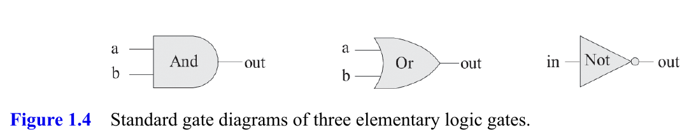

基于三种基本逻辑门,我们可以实现各种各样的复合逻辑门:

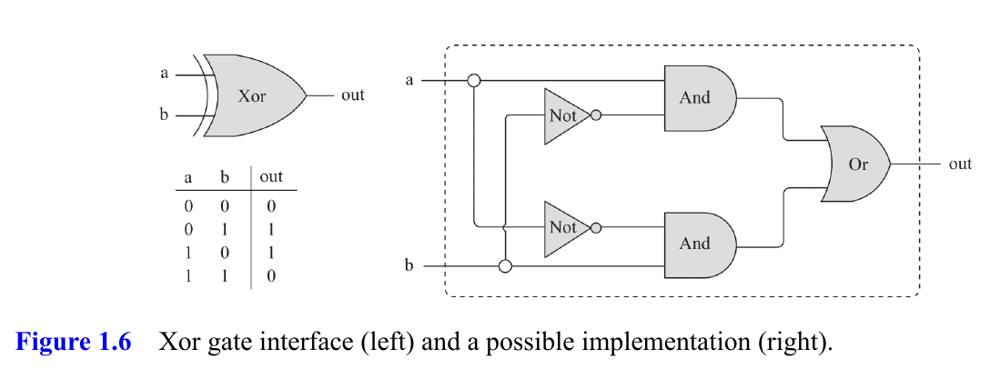

### 硬件设计
如今,硬件工程师不需要自己来手动制作任何部件,而是通过硬件描述语言(Hardware Description Language,HDL)来设计芯片架构,并通过计算机进行模拟的运行和测试,得到最终蓝图之后再通过自动化流水线批量生产芯片即可

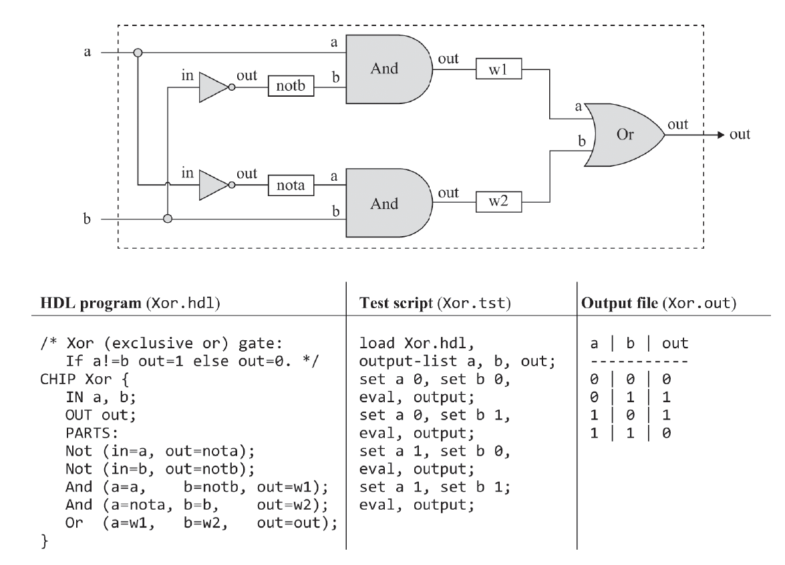

抛开简单的门电路不谈,我们来看几个高级一点的芯片设计.

多路选择器的实现:
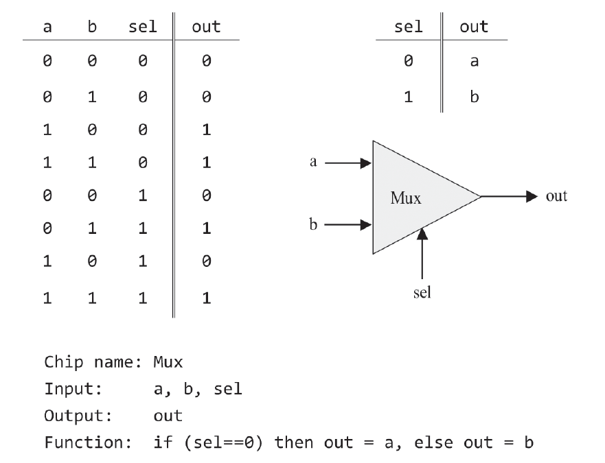

分路器的实现:
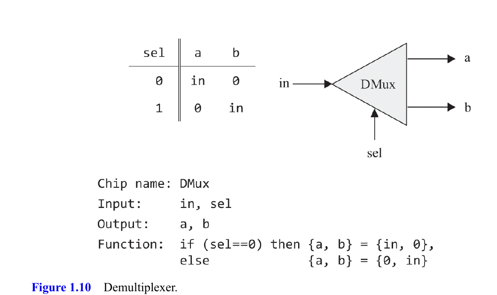

由于处理器架构通常为16位,32位甚至是64位的,所以我们需要将之前那些只能执行单位计算的门电路改装为多路电路:

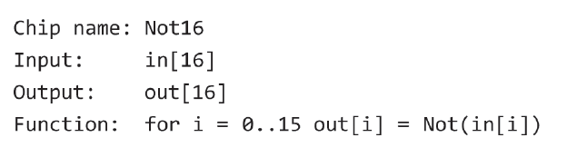

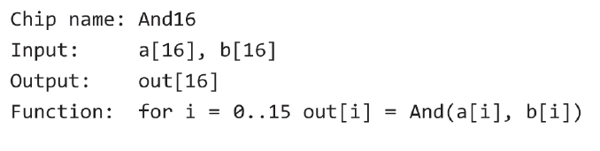

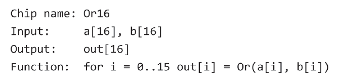

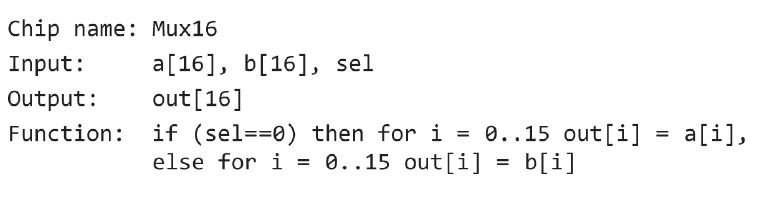
## 进阶逻辑器件

半加器:
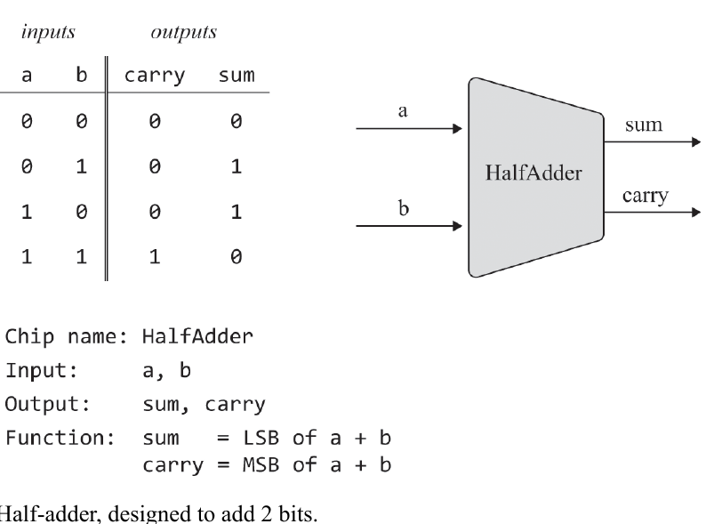

全加器:
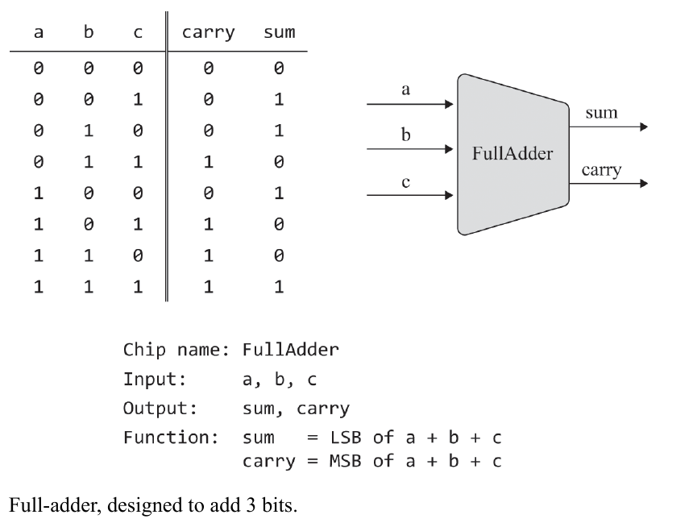

16位加法器:
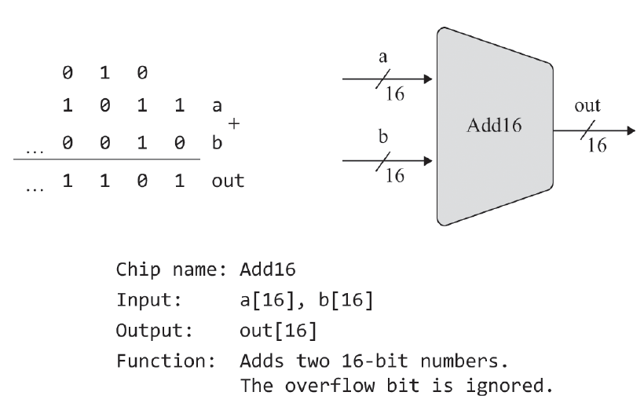

算术逻辑单元(Arithmetic Logic Unit,ALU),将一系列通用运算包含在一起,至于包含哪些运算,要看具体的CPU设计了:

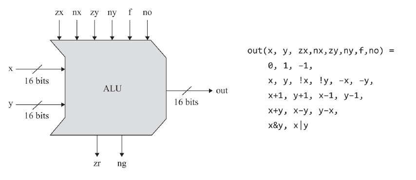

上图中的ALU对两个16位二进制补码数和6个1位输入(控制位)进行计算:

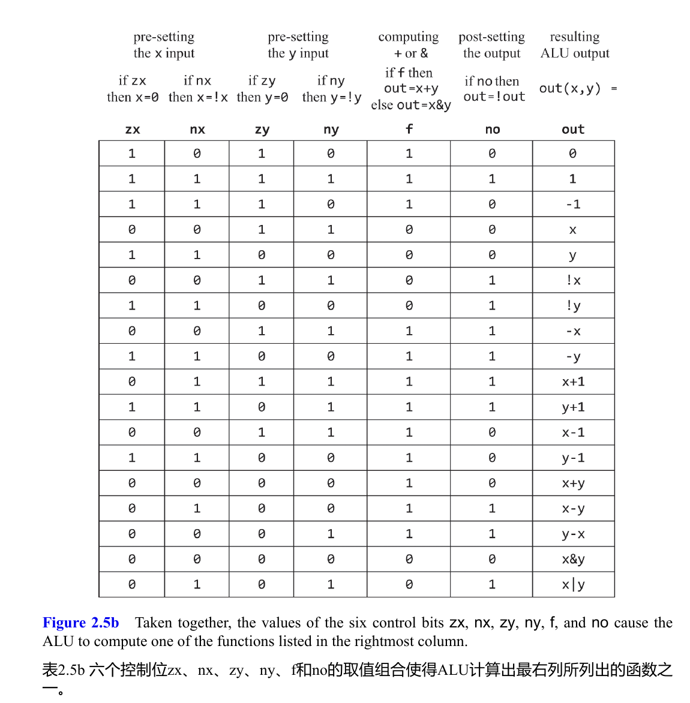

于此之外,该ALU还计算了两个输出位zr和ng,分别表示zero和negative,标记输出是否为零或者为负.

## 存储器件

>之前构建的芯片都是与时间无关的,被称为组合逻辑芯片,本章将介绍时序逻辑芯片,芯片的输出与时间有关,这种芯片可以用于存储信息.

- oscillator(振荡器): 最重要的时序逻辑部件,在高低电平间反复变化,用于**产生时钟周期信号**,电路负责将时钟周期信号广播道所有的时序逻辑芯片上
- data flip-flop(DFF,数据触发器,也被称为D触发器,尽管这个名字实在是不知所云,但却能常常在国内教材中看到): 接受一个时钟输入和单比特数据输入,输出一个单比特数据
  - 每个时钟周期会输出上一个时钟周期的输入,如果时钟周期信号的输入线路被暂时锁定,那么DFF就会一直保留上次的输入,直到被时钟周期信号激活
  - 由于实现起来是相当复杂的,所以这本书并没有介绍.

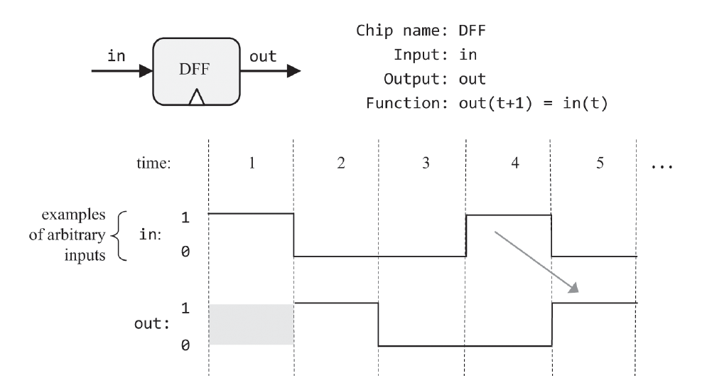

- Bit(单比特寄存器): 基于DFF实现,包含一个输入端口in,空值端口load,输出端口out,只要load位未被置1,那么寄存器就会保持锁存状态,保持状态不变.

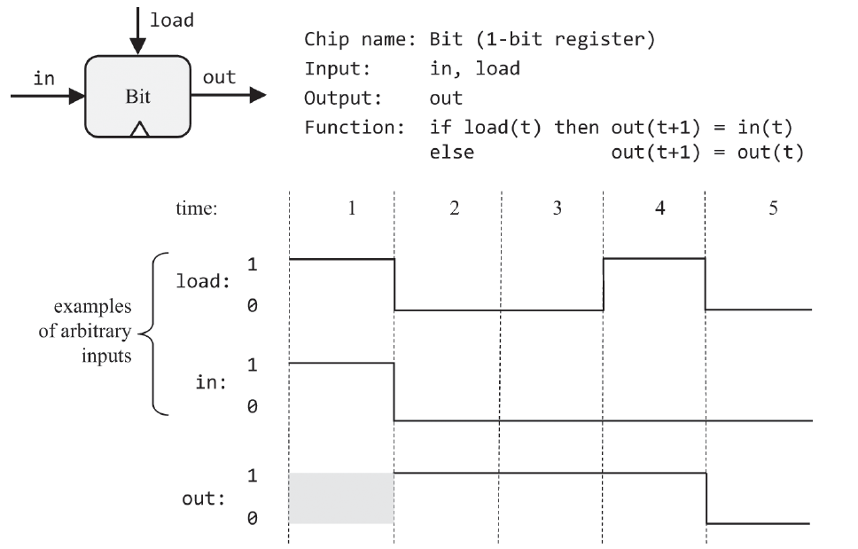

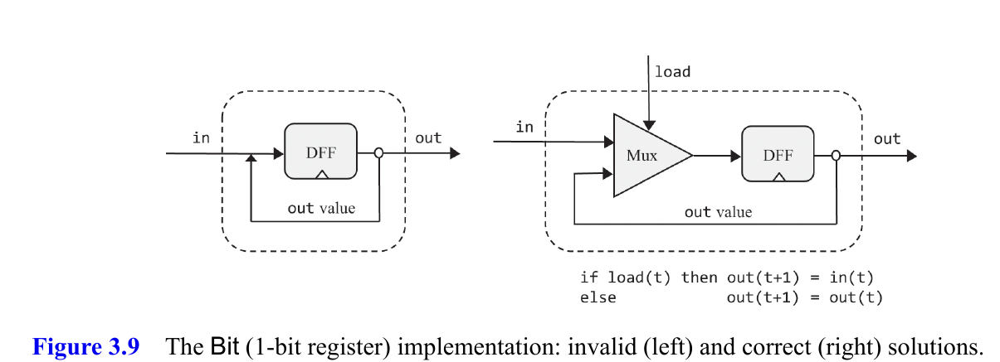

- Register(寄存器): 基于Bit组合实现

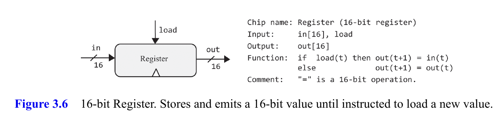

- Random Access Memory(RAM,随机存取存储器): 基于寄存器实现,读取地址m对应的寄存器时,将load置为0即可在不改变内容的情况下输出上一个状态值;写入地址m对应的新值时,将load置为1即可覆盖原内容.
  - 之所以称为随机存取,是因为RAM可以在O(1)时间内访问任意一个寄存器,这是通过诸如3-8译码器或者2-4译码器实现的

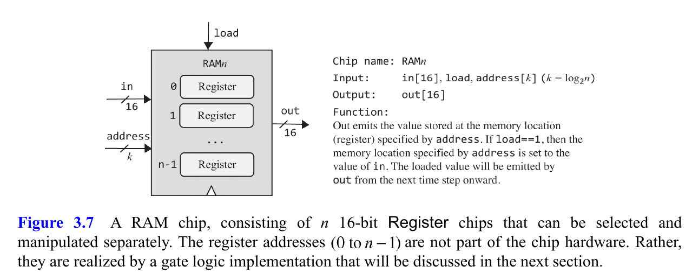

- Program Counter(程序计数器): 每次被时间信号激活时就将存储的值加一,基于寄存器实现,增加了两个控制位inc和reset,inc用于判断是否要递增PC,reset用于重置PC为0.

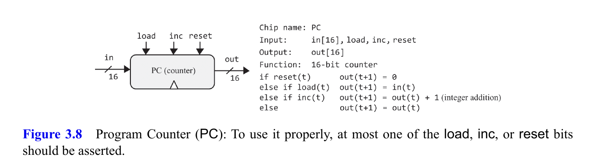
## 构建计算机
### 前置概念
- Memory: 存储设备,与CPU有一段距离,故存取速度不是很快
- Processor: 处理器,通常被称为Central Processing Unit(CPU),能够执行所有的指令集指令
- Register: 与CPU紧密连接的寄存器,用于实现高速存取
- **汇编语言**: 使用符号(例如add,r1,r2)表示的机器语言,将汇编语言翻译成二进制代码的程序被称为汇编器.
  - 不同处理器硬件架构使用的汇编语言不同,但理论上都是等价的,能够执行基本相同的一组任务
### Hack处理器架构
这本书自创了一个用于教学的处理器架构:
1. 三个16位寄存器: 数据寄存器(D),地址寄存器(A),可选寄存器(M),汇编代码如下.

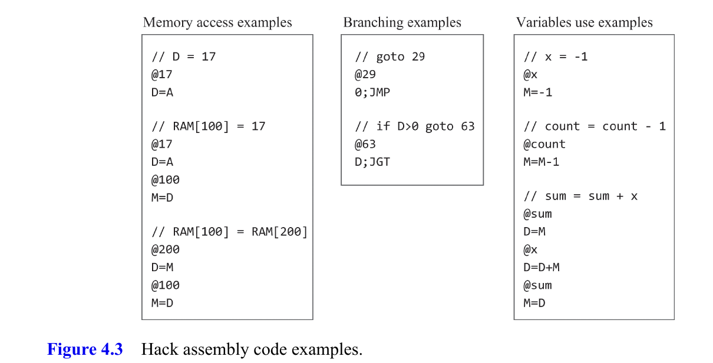

2. Hack处理器支持两类16位指令:
   1. 地址指令(A类指令): 使用符号`@`标识,对应的操作码为0,将A寄存器设定为某个值.也就是说是1位操作码+15位地址值
   2. 运算指令(C类指令): 没有符号标识,对应的操作码为1,基本格式为1位操作码+2位不使用的位(设定为1)+7位comp指令(compute,表示ALU操作)+3位dest指令(存储到哪个位置)+3位jump指令(跳转到哪里)

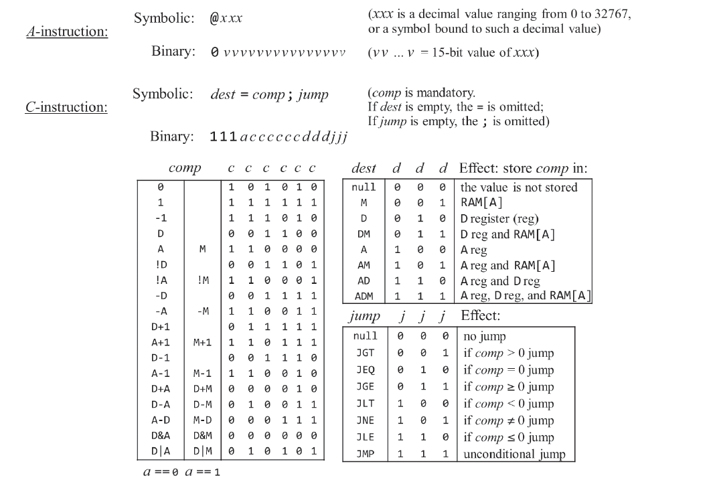

>非常令人震惊的就是,只用这两种指令就可以实现键盘交互,屏幕显示,数值运算等所有的基本计算机功能了.
## 汇编器
汇编器用来将汇编语言转换成二进制机器码,针对每条汇编指令,汇编器会按照翻译规则进行翻译,至于具体怎么翻译,这本书讲的不是很清晰,就直接跳过了.
## 虚拟机
Hack计算机使用了双层编译器,即将高级语言先转换成中间语言,再将中间语言转换成汇编语言,分别由编译器的前端和后端实现,这里的虚拟机就对应了编译器的后端.

由于书中的实现方法相当简化,所以不太具备学习的价值.
## 高级语言
# 算法导论
## 理论部分
### 算法复杂度计算
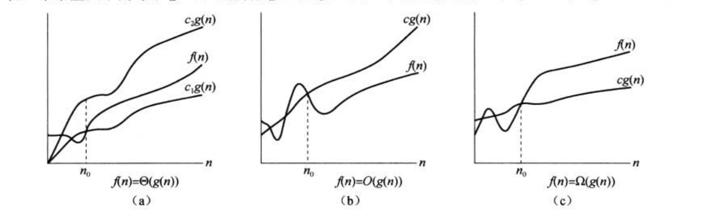
- Θ表示确界,f(n)主要项的次数必须与g(n)相同
- O表示上界,f(n)主要项的次数小于或等于g(n)
- Ω表示下界,f(n)主要项的次数大于或等于g(n)


### 主定理计算分治递归式
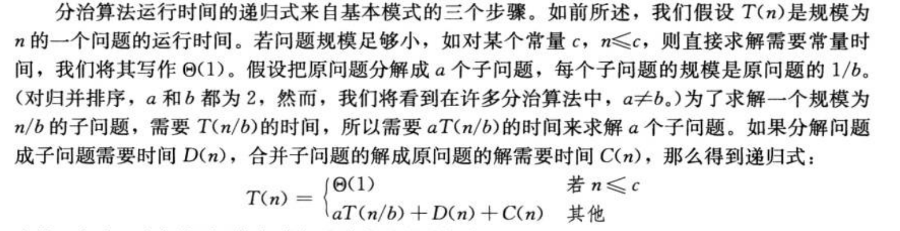


**定理 4.1（主定理）** 令 $a \ge 1$ 和 $b > 1$ 是常数，$f(n)$ 是一个函数，$T(n)$ 是定义在非负整数上的递归式：

$$T(n) = aT(n/b) + f(n)$$

其中我们将 $n/b$ 解释为 $\lfloor n/b \rfloor$ 或 $\lceil n/b \rceil$。那么 $T(n)$ 有如下渐近界：

1. 若对某个常数 $\epsilon > 0$ 有 $f(n) = O(n^{\log_b a - \epsilon})$，则 $T(n) = \Theta(n^{\log_b a})$。
2. 若 $f(n) = \Theta(n^{\log_b a})$，则 $T(n) = \Theta(n^{\log_b a} \lg n)$。
3. 若对某个常数 $\epsilon > 0$ 有 $f(n) = \Omega(n^{\log_b a + \epsilon})$，且对某个常数 $c < 1$ 和所有足够大的 $n$ 有 $a f(n/b) \le c f(n)$，则 $T(n) = \Theta(f(n))$。
## 算法部分
### 分治
- 4.1的论述非常不错,浅显易懂的说明了最大子数组的写法

对于最大子数组和问题,我们可以用两种分治想法来看:
1. 维护一个前缀和数组,遍历所有的前缀和来找到最大和,时间复杂度是O(n^2)
2. 当前最大和只有两种情况,前面的所有元素加上当前的元素和只使用当前元素,从下标1开始遍历到最后一个元素即可,时间复杂度为O(n).

普通的矩阵乘法计算的时间复杂度是O(n^3):

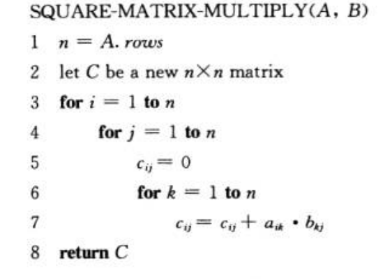
而Strassen算法能够把时间复杂度压缩到O(n^lg7):

$$T(n) = \begin{cases} \Theta(1) & \text{若 } n = 1 \\ 7T(n/2) + \Theta(n^2) & \text{若 } n > 1 \end{cases}$$

### 排序算法(过)
这本书关于排序的几章都比较宽泛,没什么看头
### 动态规划

## 数据结构
### 二叉搜索树
- 书上讲的非常学术化,同样没什么看头

二叉搜索树中,所有子树的左节点都小于根节点,右节点都大于根节点.
### 红黑树
红黑树是一种平衡的二叉搜索树,每个节点有五个属性,color,key,left,right,p,满足以下性质:
1. 每个节点要么是红色要么是黑色
2. 根节点是黑色的
3. 每个空节点是黑色的
4. 如果一个节点是红色的,那么两个子节点都是黑色的
5. 每个节点到达所有后代空节点的路径上,都有相同数量的黑色节点


# 图解大模型: 生成式AI原理与实战(待补充)
## 词元和嵌入

# Go语言设计与实现
# Crafting Interpreters
## 概览
### 自举
- 自举: 使用语言C编写语言C的编译器.最开始,我们需要用其他语言实现的编译器来编写语言C的编译器,再用这个编译器来编译得到全部使用语言C编写的编译器,然后就可以把以前那个编译器扔掉了.

>至于最开始的编译器是怎么实现的?那自然是用汇编语言写的了,而将符号汇编语言转成二进制机器码也需要一个编译器,这个编译器自然就是用二进制机器码写的了,至于是如何实现的,我简直不敢想象

# 事务处理: 概念与技术(待补充)
# 深入理解Java虚拟机(待补充)
如果要理解Java为什么能够"一次编写,处处运行",就需要来看这本书
## ch1: 走进Java
- 这一章很值得看,深入探讨了JDK的历史
## ch2: Java内存区域与内存溢出异常

# Python3网络爬虫开发实战(待补充)
## 爬虫基础
讲的还不错,基本涉及了爬虫所需的所有知识,尤其是关于session,cookie的地方讲的很好,帮我扫清了一点疑惑
## 数据的存储
## Ajax数据爬取
## 异步爬虫

# On Java 8(待补充)
- [中文翻译版链接](https://zyb0408.github.io/gitbooks/onjava8/)

讲的还算详细和有体系,但由于我已经了解过其中的大多数内容了,所以就只摘抄一些比较难懂和重要的部分,很多我这辈子都未必能用到的零碎知识点就直接跳过了.
## Java的垃圾回收
### 文章摘录
如果你以前用过的语言，在堆上分配对象的代价十分高昂，你可能自然会觉得 Java 中所有对象（基本类型除外）在堆上分配的方式也十分高昂。然而，垃圾回收器能很明显地提高对象的创建速度。这听起来很奇怪——存储空间的释放影响了存储空间的分配，但这确实是某些 Java 虚拟机的工作方式。这也意味着，Java 从堆空间分配的速度可以和其他语言在栈上分配空间的速度相媲美。

例如，你可以把 C++ 里的堆想象成一个院子，里面每个对象都负责管理自己的地盘。一段时间后，对象可能被销毁，但地盘必须复用。在某些 Java 虚拟机中，堆的实现截然不同：它更像一个传送带，每分配一个新对象，它就向前移动一格。这意味着对象存储空间的分配速度特别快。Java 的"堆指针"只是简单地移动到尚未分配的区域，所以它的效率与 C++ 在栈上分配空间的效率相当。当然实际过程中，在簿记工作方面还有少量额外开销，但是这部分开销比不上查找可用空间开销大。

你可能意识到了，Java 中的堆并非完全像传送带那样工作。要是那样的话，势必会导致频繁的内存页面调度——将其移进移出硬盘，因此会显得需要拥有比实际需要更多的内存。页面调度会显著影响性能。最终，在创建了足够多的对象后，内存资源被耗尽。其中的秘密在于垃圾回收器的介入。当它工作时，一边回收内存，一边使堆中的对象紧凑排列，这样"堆指针"就可以很容易地移动到更靠近传送带的开始处，也就尽量避免了页面错误。垃圾回收器通过重新排列对象，实现了一种高速的、有无限空间可分配的堆模型。

要想理解 Java 中的垃圾回收，先了解其他系统中的垃圾回收机制将会很有帮助。一种简单但速度很慢的垃圾回收机制叫做引用计数。每个对象中含有一个引用计数器，每当有引用指向该对象时，引用计数加 1。当引用离开作用域或被置为 null 时，引用计数减 1。因此，管理引用计数是一个开销不大但是在程序的整个生命周期频繁发生的负担。垃圾回收器会遍历含有全部对象的列表，当发现某个对象的引用计数为 0 时，就释放其占用的空间（但是，引用计数模式经常会在计数为 0 时立即释放对象）。这个机制存在一个缺点：如果对象之间存在循环引用，那么它们的引用计数都不为 0，就会出现应该被回收但无法被回收的情况。对垃圾回收器而言，定位这样的循环引用所需的工作量极大。引用计数常用来说明垃圾回收的工作方式，但似乎从未被应用于任何一种 Java 虚拟机实现中。

- Python一直采用的垃圾回收机制就是引用计数

在更快的策略中，垃圾回收器并非基于引用计数。它们依据的是：对于任意"活"的对象，一定能最终追溯到其存活在栈或静态存储区中的引用。这个引用链条可能会穿过数个对象层次，由此，如果从栈或静态存储区出发，遍历所有的引用，你将会发现所有"活"的对象。对于发现的每个引用，必须追踪它所引用的对象，然后是该对象包含的所有引用，如此反复进行，直到访问完"根源于栈或静态存储区的引用"所形成的整个网络。你所访问过的对象一定是"活"的。注意，这解决了对象间循环引用的问题，这些对象不会被发现，因此也就被自动回收了。

在这种方式下，Java 虚拟机采用了一种自适应的垃圾回收技术。至于如何处理找到的存活对象，取决于不同的 Java 虚拟机实现。其中有一种做法叫做停止-复制（stop-and-copy）。顾名思义，这需要先暂停程序的运行（不属于后台回收模式），然后将所有存活的对象从当前堆复制到另一个堆，没有复制的就是需要被垃圾回收的。另外，当对象被复制到新堆时，它们是一个挨着一个紧凑排列，然后就可以按照前面描述的那样简单、直接地分配新空间了。

当对象从一处复制到另一处，所有指向它的引用都必须修正。位于栈或静态存储区的引用可以直接被修正，但可能还有其他指向这些对象的引用，它们在遍历的过程中才能被找到（可以想象成一个表格，将旧地址映射到新地址）。

这种所谓的"复制回收器"效率低下主要因为两个原因。其一：得有两个堆，然后在这两个分离的堆之间来回折腾，得维护比实际需要多一倍的空间。某些 Java 虚拟机对此问题的处理方式是，按需从堆中分配几块较大的内存，复制动作发生在这些大块内存之间。

其二在于复制本身。一旦程序进入稳定状态之后，可能只会产生少量垃圾，甚至没有垃圾。尽管如此，复制回收器仍然会将所有内存从一处复制到另一处，这很浪费。为了避免这种状况，一些 Java 虚拟机会进行检查：要是没有新垃圾产生，就会转换到另一种模式（即"自适应"）。这种模式称为标记-清扫（mark-and-sweep），Sun 公司早期版本的 Java 虚拟机一直使用这种技术。对一般用途而言，"标记-清扫"方式速度相当慢，但是当你知道程序只会产生少量垃圾甚至不产生垃圾时，它的速度就很快了。

"标记-清扫"所依据的思路仍然是从栈和静态存储区出发，遍历所有的引用，找出所有存活的对象。但是，每当找到一个存活对象，就给对象设一个标记，并不回收它。只有当标记过程完成后，清理动作才开始。在清理过程中，没有标记的对象将被释放，不会发生任何复制动作。"标记-清扫"后剩下的堆空间是不连续的，垃圾回收器要是希望得到连续空间的话，就需要重新整理剩下的对象。

"停止-复制"指的是这种垃圾回收动作不是在后台进行的；相反，垃圾回收动作发生的同时，程序将会暂停。在 Oracle 公司的文档中会发现，许多参考文献将垃圾回收视为低优先级的后台进程，但是早期版本的 Java 虚拟机并不是这么实现垃圾回收器的。当可用内存较低时，垃圾回收器会暂停程序。同样，"标记-清扫"工作也必须在程序暂停的情况下才能进行。

如前文所述，这里讨论的 Java 虚拟机中，内存分配以较大的"块"为单位。如果对象较大，它会占用单独的块。严格来说，"停止-复制"要求在释放旧对象之前，必须先将所有存活对象从旧堆复制到新堆，这导致了大量的内存复制行为。有了块，垃圾回收器就可以把对象复制到废弃的块。每个块都有年代数来记录自己是否存活。通常，如果块在某处被引用，其年代数加 1，垃圾回收器会对上次回收动作之后新分配的块进行整理。这对处理大量短命的临时对象很有帮助。垃圾回收器会定期进行完整的清理动作——大型对象仍然不会复制（只是年代数会增加），含有小型对象的那些块则被复制并整理。Java 虚拟机会监视，如果所有对象都很稳定，垃圾回收的效率降低的话，就切换到"标记-清扫"方式。同样，Java 虚拟机会跟踪"标记-清扫"的效果，如果堆空间出现很多碎片，就会切换回"停止-复制"方式。这就是"自适应"的由来，你可以给它个啰嗦的称呼："自适应的、分代的、停止-复制、标记-清扫"式的垃圾回收器。

Java 虚拟机中有许多附加技术用来提升速度。尤其是与加载器操作有关的，被称为"即时"（Just-In-Time, JIT）编译器的技术。这种技术可以把程序全部或部分翻译成本地机器码，所以不需要 JVM 来进行翻译，因此运行得更快。当需要装载某个类（通常是创建该类的第一个对象）时，编译器会先找到其 .class 文件，然后将该类的字节码装入内存。你可以让即时编译器编译所有代码，但这种做法有两个缺点：一是这种加载动作贯穿整个程序生命周期内，累加起来需要花更多时间；二是会增加可执行代码的长度（字节码要比即时编译器展开后的本地机器码小很多），这会导致页面调度，从而一定降低程序速度。另一种做法称为惰性评估，意味着即时编译器只有在必要的时候才编译代码。这样，从未被执行的代码也许就压根不会被 JIT 编译。新版 JDK 中的 Java HotSpot 技术就采用了类似的做法，代码每被执行一次就优化一些，所以执行的次数越多，它的速度就越快。
### 总结
首先我们需要知道的是**Java将对象通通放在堆上**,当有新的对象要被分配时,Java 的"堆指针"只是简单地移动到尚未分配的区域，所以它的效率与 C++ 在栈上分配空间的效率相当。

但是,当对象数量一多,内存容量极小的缓存(cache)就有可能没有保留我们所需的对象,需要从主存(main memory)甚至是硬盘中读取,俗称(缓存不命中,cache miss),这大大延长了扫描对象的时间,从而影响程序运行的速度,所以我们需要通过**垃圾回收**机制处理**未被实际引用**的对象.

早期的JVM采用两种垃圾回收机制,分别对应程序启动和程序稳定运行的情况:
1. **停止-复制（stop-and-copy）**: 暂停程序运行,将所有对象复制到一个新的堆
2. **标记-清扫（mark-and-sweep）**: 当程序产生的垃圾很少时,再用停止-复制机制的开销就太大了,所以我们可以通过遍历栈和静态存储区的方式,**标记**那些被实际引用的对象,并在遍历结束后**清扫**未被标记的对象.

这两种垃圾回收都必须在程序暂停时才可以进行,所以还是不够理想,至于更深入的讨论,需要去阅读其他书籍来理解

## 函数式编程
>大多数面向对象语言都或多或少的学习和吸收了函数式语言的特点,JAva也不例外,在Java 8中引入了Lambda表达式和函数式编程.

### 新旧对比
下面是传统方式和Java 8的方式对比:
```java
// functional/Strategize.java

interface Strategy {
  String approach(String msg);
}

class Soft implements Strategy {
  public String approach(String msg) {
    return msg.toLowerCase() + "?";
  }
}

class Unrelated {
  static String twice(String msg) {
    return msg + " " + msg;
  }
}

public class Strategize {
  Strategy strategy;
  String msg;
  Strategize(String msg) {
    strategy = new Soft(); // [1]
    this.msg = msg;
  }

  void communicate() {
    System.out.println(strategy.approach(msg));
  }

  void changeStrategy(Strategy strategy) {
    this.strategy = strategy;
  }

  public static void main(String[] args) {
    Strategy[] strategies = {
      new Strategy() { // [2]
        public String approach(String msg) {
          return msg.toUpperCase() + "!";
        }
      },
      msg -> msg.substring(0, 5), // [3]
      Unrelated::twice // [4]
    };
    Strategize s = new Strategize("Hello there");
    s.communicate();
    for(Strategy newStrategy : strategies) {
      s.changeStrategy(newStrategy); // [5]
      s.communicate(); // [6]
    }
  }
}
```

**输出结果**
```java
hello there?
HELLO THERE!
Hello
Hello there Hello there
```

对应序号的说明:

- [1] 在 Strategize 中，Soft 作为默认策略，在构造函数中赋值。
- [2] 一种略显简短且更自发的方法是创建一个匿名内部类。即使这样，仍有相当数量的冗余代码。你总是要仔细观察：“哦，原来这样，这里使用了匿名内部类。”
- [3] Java 8 的 Lambda 表达式。由箭头 -> 分隔开参数和函数体，箭头左边是参数，箭头右侧是从 Lambda 返回的表达式，即函数体。这实现了与定义类、匿名内部类相同的效果，但代码少得多。
- [4] Java 8 的方法引用，由 :: 区分。在 :: 的左边是类或对象的名称，在 :: 的右边是方法的名称，但没有参数列表。
- [5] 在使用默认的 Soft strategy 之后，我们逐步遍历数组中的所有 Strategy，并使用 changeStrategy() 方法将每个 Strategy 放入 变量 s 中。
- [6] 现在，每次调用 communicate() 都会产生不同的行为，具体取决于此刻正在使用的策略代码对象。我们传递的是行为，而非仅数据

>在 Java 8 之前，我们能够通过 [1] 和 [2] 的方式传递功能。然而，这种语法的读写非常笨拙，并且我们别无选择。方法引用和 Lambda 表达式的出现让我们可以在需要时传递功能，而不是仅在必要才这么做。

上述的代码对于新手来说非常难以理解,所以接下来要好好探析一下.
### Lambda表达式
Lambda 表达式是使用最小可能语法编写的函数定义：

1. Lambda 表达式产生函数，而不是类。 在 JVM（Java Virtual Machine，Java 虚拟机）上，一切都是一个类，因此在幕后执行各种操作使 Lambda 看起来像函数 —— 但作为程序员，你可以高兴地假装它们“只是函数”。
2. Lambda 语法尽可能少，这正是为了使 Lambda 易于编写和使用。


## 异常
## 泛型
## 并发编程
# [设计数据密集型应用](https://ddia.vonng.com/v1/)(待补充)
## 数据系统
数据系统有以下几个作用:
- 存储数据，以便自己或其他应用程序之后能再次找到 （数据库，即 databases）
- 记住开销昂贵操作的结果，加快读取速度（缓存，即 caches）
- 允许用户按关键字搜索数据，或以各种方式对数据进行过滤（搜索索引，即 search indexes）
- 向其他进程发送消息，进行异步处理（流处理，即 stream processing）
- 定期处理累积的大批量数据（批处理，即 batch processing）
因此,常规的数据库,消息队列等信息处理系统都可以被归类为数据系统.

我们可以从三个维度来评价一个数据系统写的怎么样:
1. 可靠性: 出了故障仍然可以正常运行
2. 可伸缩性: 能够应付系统的扩大和其他变化
3. 可维护性: 架构清晰,职责分明,方便维护
### 可靠性
#### 处理硬件故障
>当想到系统失效的原因时，硬件故障（hardware faults） 总会第一个进入脑海。硬盘崩溃、内存出错、机房断电、有人拔错网线…… 任何与大型数据中心打过交道的人都会告诉你：一旦你拥有很多机器，这些事情总会发生！

我们可以通过**硬件冗余**(redundancy of hardware)来解决这个问题,即提供后备组件来及时接替故障硬件,防止系统崩溃.

#### 软件故障
软件故障有以下几个例子:
- 接受特定的错误输入，便导致所有应用服务器实例崩溃的 BUG。例如 2012 年 6 月 30 日的闰秒，由于 Linux 内核中的一个错误，许多应用同时挂掉了。
- 级联故障，一个组件中的小故障触发另一个组件中的故障，进而触发更多的故障


#### 管理员的失误导致的故障
>一项关于大型互联网服务的研究发现，运维配置错误是导致服务中断的首要原因，而硬件故障（服务器或网络）仅导致了 10-25% 的服务中断

### 可伸缩性
>系统今天能可靠运行，并不意味未来也能可靠运行。服务 降级（degradation） 的一个常见原因是负载增加，例如：系统负载已经从一万个并发用户增长到十万个并发用户，或者从一百万增长到一千万。也许现在处理的数据量级要比过去大得多

#### 负载: 以推特为例
以推特在 2012 年 11 月发布的数据为例,推特的两个主要业务是：
- 发布推文
  - 用户可以向其粉丝发布新消息（平均 4.6k 请求 / 秒，峰值超过 12k 请求 / 秒）。
- 主页时间线
  - 用户可以查阅他们关注的人发布的推文（300k 请求 / 秒）。

大体上讲，这一对操作有两种实现方式。

1. 发布推文时，只需将新推文插入全局推文集合即可。当一个用户请求自己的主页时间线时，首先查找他关注的所有人，查询这些被关注用户发布的推文并按时间顺序合并。在如 图 1-2 所示的关系型数据库中，可以编写这样的查询：
```sql
SELECT tweets.*, users.*
  FROM tweets
  JOIN users   ON tweets.sender_id = users.id
  JOIN follows ON follows.followee_id = users.id
  WHERE follows.follower_id = current_user
```
2. 为每个用户的主页时间线维护一个缓存，就像每个用户的推文收件箱。当一个用户发布推文时，查找所有关注该用户的人，并将新的推文插入到每个主页时间线缓存中。因此读取主页时间线的请求开销很小，因为结果已经提前计算好了。

>推特的第一个版本使用了方法 1，但系统很难跟上主页时间线查询的负载。所以公司转向了方法 2，方法 2 的效果更好，因为发推频率比查询主页时间线的频率几乎低了两个数量级，所以在这种情况下，最好在写入时做更多的工作，而在读取时做更少的工作。
>
>然而方法 2 的缺点是，发推现在需要大量的额外工作。平均来说，一条推文会发往约 75 个关注者，所以每秒 4.6k 的发推写入，变成了对主页时间线缓存每秒 345k 的写入。但这个平均值隐藏了用户粉丝数差异巨大这一现实，一些用户有超过 3000 万的粉丝，这意味着一条推文就可能会导致主页时间线缓存的 3000 万次写入！及时完成这种操作是一个巨大的挑战 —— 推特尝试在 5 秒内向粉丝发送推文。

>推特轶事的最终转折：现在已经稳健地实现了方法 2，推特逐步转向了两种方法的混合。大多数用户发的推文会写入其粉丝主页时间线缓存中。但是少数拥有海量粉丝的用户（即名流）会被排除在外。当用户读取主页时间线时，分别地获取出该用户所关注的每位名流的推文，再与用户的主页时间线缓存合并

##### 如何处理负载
>适应某个级别负载的架构不太可能应付 10 倍于此的负载。如果你正在开发一个快速增长的服务，那么每次负载发生数量级的增长时，你可能都需要重新考虑架构 —— 或者更频繁。

>大规模的系统架构通常是应用特定的 —— 没有一招鲜吃遍天的通用可伸缩架构（不正式的叫法：万金油（magic scaling sauce） ）。应用的问题可能是读取量、写入量、要存储的数据量、数据的复杂度、响应时间要求、访问模式或者所有问题的大杂烩。
>
>举个例子，用于处理每秒十万个请求（每个大小为 1 kB）的系统与用于处理每分钟 3 个请求（每个大小为 2GB）的系统看上去会非常不一样，尽管两个系统有同样的数据吞吐量。

### 可维护性
众所周知，软件的大部分开销并不在最初的开发阶段，而是在持续的维护阶段，包括修复漏洞、保持系统正常运行、调查失效、适配新的平台、为新的场景进行修改、偿还技术债和添加新的功能。

## 数据模型
多数应用使用层层叠加的数据模型构建。对于每层数据模型的关键问题是：它是如何用低一层数据模型来 表示 的？例如：
1. 作为一名应用开发人员，你观察现实世界（里面有人员、组织、货物、行为、资金流向、传感器等），并采用对象或数据结构，以及操控那些数据结构的 API 来进行建模。那些结构通常是特定于应用程序的。
2. 当要存储那些数据结构时，你可以利用通用数据模型来表示它们，如 JSON 或 XML 文档、关系数据库中的表或图模型。
3. 数据库软件的工程师选定如何以内存、磁盘或网络上的字节来表示 JSON / XML/ 关系 / 图数据。这类表示形式使数据有可能以各种方式来查询，搜索，操纵和处理。
4. 在更低的层次上，硬件工程师已经想出了使用电流、光脉冲、磁场或者其他东西来表示字节的方法。

>握一个数据模型需要花费很多精力（想想关系数据建模有多少本书）。即便只使用一个数据模型，不用操心其内部工作机制，构建软件也是非常困难的。然而，因为数据模型对上层软件的功能（能做什么，不能做什么）有着至深的影响，所以选择一个适合的数据模型是非常重要的。

### 关系模型VS文档模型
>关系模型曾是一个理论性的提议，当时很多人都怀疑是否能够有效实现它。然而到了 20 世纪 80 年代中期，关系数据库管理系统（RDBMSes）和 SQL 已成为大多数人们存储和查询某些常规结构的数据的首选工具。关系数据库已经持续称霸了大约 25~30 年 —— 这对计算机史来说是极其漫长的时间。
>
>关系数据库起源于商业数据处理，在 20 世纪 60 年代和 70 年代用大型计算机来执行。从今天的角度来看，那些用例显得很平常：典型的 事务处理（将销售或银行交易，航空公司预订，库存管理信息记录在库）和 批处理（客户发票，工资单，报告）。

#### NoSQL 
采用 NoSQL 数据库的背后有几个驱动因素，其中包括：
1. 需要比关系数据库更好的可伸缩性，包括非常大的数据集或非常高的写入吞吐量
2. 相比商业数据库产品，免费和开源软件更受偏爱
3. 关系模型不能很好地支持一些特殊的查询操作


常见的NoSQL数据库有以下几个:
1. Redis: 基于内存的存储,核心逻辑是哈希表
2. MongoDB: 存储格式为JSON
#### 文档和关系数据库的融合
>随着时间的推移，关系数据库和文档数据库似乎变得越来越相似，这是一件好事：数据模型相互补充，如果一个数据库能够处理类似文档的数据，并能够对其执行关系查询，那么应用程序就可以使用最符合其需求的功能组合。

- (26/4/7): 我发现这本书我现在看太早了,很难有切实的收获,还是等几年再来探索吧

# The Garbage Collection Handbook

